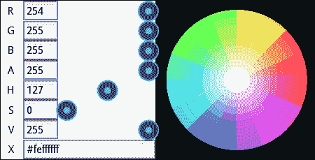
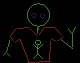
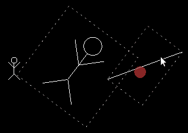
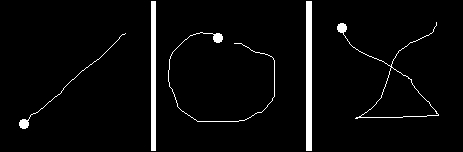
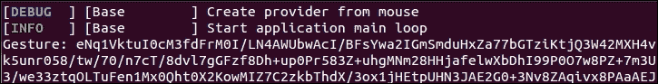
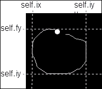
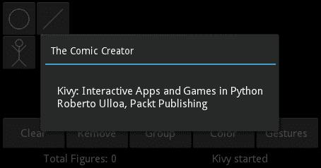
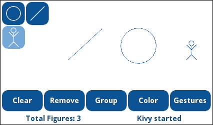
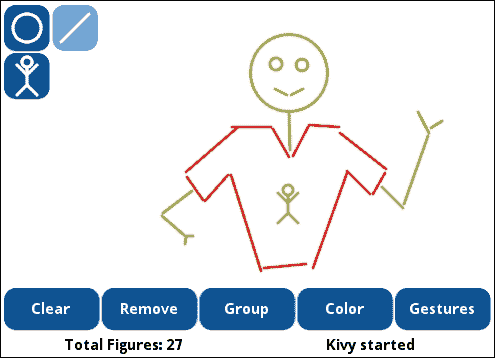

# 第四章. 提升用户体验

本章概述了 Kivy 提供的实用组件，这些组件可以帮助程序员在提升用户体验时更加轻松。本章中回顾的一些 Kivy 组件与具有非常特定功能的控件（例如，调色板）相关；在这种情况下，你将学习控制它们的基本技巧。其他控件将帮助我们扩展画布的使用，例如，改变颜色、旋转和缩放形状，或处理手势。最后，我们将通过一些小技巧快速提升应用程序的外观和感觉。所有章节都旨在提高应用程序的可用性，并且是独立的。以下是本章我们将回顾的主题列表：

+   在不同的屏幕间切换

+   使用 Kivy 调色板控件选择颜色

+   控制画布的可见区域

+   使用多指手势进行旋转和缩放

+   创建单指手势在屏幕上绘制

+   通过一些全局变化增强设计

更重要的是，我们将讨论如何将这些主题融入当前的工作项目中。这将加强你之前获得的知识，并探索一个新的编程场景，在这个场景中我们需要向现有代码中添加功能。在本章结束时，你应该能够舒适地探索 Kivy API 提供的所有不同控件，并快速理解如何将它们集成到你的代码中。

# ScreenManager – 为图形选择颜色

**`ScreenManager`**类允许我们在同一个窗口中处理不同的屏幕。在 Kivy 中，屏幕比窗口更受欢迎，因为我们正在为具有不同屏幕尺寸的不同设备编程。因此，要正确适应所有设备的窗口是困难的（如果不是不可能的）。只需想象一下，用你的手指在手机上玩弄窗口。

到目前为止，我们所有的图形都是同一种颜色。让我们允许用户添加一些颜色，使“漫画创作者”更加灵活。Kivy 为我们提供了一个名为**`ColorPicker`**的`Widget`，如下面的截图所示：



如您所见，这个`Widget`需要很大的空间，所以在我们的当前界面中很难容纳。

### 小贴士

Kivy 1.9.0 版本中存在一个 bug，阻止了`ColorPicker`在 Python 3 中工作（它已在开发版本 1.9.1-dev 中修复，可在[`github.com/kivy/kivy/`](https://github.com/kivy/kivy/)找到）。你可以使用 Python 2，或者可以从 Packt Publishing 网站下载的代码中找到 Python 3 的替代代码。代替`ColorPicker`，有一个基于`GridLayout`的控件用于选择一些颜色。本节中讨论的概念也反映在那段代码中。

**`ScreenManager`** 类允许我们拥有多个屏幕，而不仅仅是单个 `Widget`（`ComicCreator`），并且还允许我们轻松地在屏幕之间切换。以下是一个新的 Kivy 文件（`comicscreenmanager.kv`），其中包含 `ComicScreenManager` 类的定义：

```py
1\. # File name: comicscreenmanager.kv
2\. #:import FadeTransition kivy.uix.screenmanager.FadeTransition
3\. <ComicScreenManager>:
4\.     transition: FadeTransition()
5\.     color_picker: _color_picker
6\.     ComicCreator:
7\.     Screen:
8\.         name: 'colorscreen'
9\.         ColorPicker:
10\.             id: _color_picker
11\.             color: 0,.3,.6,1
12\.             Button:
13\.                 text: "Select"
14\.                 pos_hint: {'center_x': .75, 'y': .05}
15\.                 size_hint: None, None
16\.                 size: 150, 50
17\.                 on_press: root.current = 'comicscreen'
```

我们将 `ColorPicker` 实例嵌入到一个 **`Screen`** 小部件中（第 7 行），而不是直接添加到 `ComicScreenManager`。

### 备注

**`ScreenManager`** 实例必须包含 **`Screen`** 基类的小部件。不允许其他类型的 `Widget`（标签、按钮或布局）。

由于我们还将我们的 `ComicCreator` 添加到了 `ScreenManager`（第 6 行），我们需要确保在 `comiccreator.kv` 文件中，我们的 `ComicCreator` 继承自 `Screen` 类，因此我们需要更改文件头：

```py
18\. # File name: comiccreator.kv
19\. <ComicCreator@Screen>:
20\.     name: 'comicscreen'
21\.     AnchorLayout:…
```

**`name`** 属性（第 20 行）用于通过 ID 识别屏幕，在这种情况下是 `comicscreen`，并且它通过其 **`current`** 属性在 `ScreenManeger` 的屏幕之间切换。例如，我们添加到 `ColorPicker`（第 12 行）的 `Button` 实例使用 `name` 属性在 `on_press` 事件（第 17 行）中更改 `current` 屏幕。`root` 指的是 `ScreenManager` 类，而 **`current`** 属性告诉它当前活动的 `Screen` 是什么。在这种情况下是 `comicscreen`，我们用来识别 `ComicCreator` 实例的名称。请注意，我们直接添加了 Python 代码（第 17 行），而不是像我们在 第三章 中所做的那样调用方法，*小部件事件 – 绑定动作*。

我们还给了包含 `ColorPicker` 实例的屏幕一个名称（`colorscreen`）。我们将使用此名称在 *常规选项* 区域中使用 **颜色**按钮激活 `ColorPicker`。我们需要修改 `generaloptions.py` 中的 `color` 方法：

```py
22\. def color(self, instance):
23\.     self.comic_creator.manager.current = 'colorscreen'
```

**颜色**按钮现在切换屏幕以显示 `ColorPicker` 实例。注意我们访问 `ScreenManager` 的方式（第 23 行）。首先，我们使用 `GeneralOptions` 类中的 `comic_creator` 引用来访问 `ComicCreator` 实例。其次，我们使用 `Screen` 的 **`manager`** 属性来访问其相应的 `ScreenManager`。最后，我们更改 `current` `Screen`，类似于第 17 行。

`ComicScreenManager` 现在成为 `ComicCreator` 项目的主体 `Widget`，因此 `comicreator.py` 文件必须相应更改：

```py
24\. # File name: comiccreator.py
25\. from kivy.app import App
26\. from kivy.lang import Builder
27\. from kivy.uix.screenmanager import ScreenManager
28\. 
29\. Builder.load_file('toolbox.kv')
30\. Builder.load_file('comicwidgets.kv')
31\. Builder.load_file('drawingspace.kv')
32\. Builder.load_file('generaloptions.kv')
33\. Builder.load_file('statusbar.kv')
34\. Builder.load_file('comiccreator.kv')
35\. 
36\. class ComicScreenManager(ScreenManager):
37\.     pass
38\. 
39\. class ComicScreenManagerApp(App):
40\.     def build(self):
41\.         return ComicScreenManager()
42\. 
43\. if __name__=="__main__":
44\.     ComicScreenManagerApp().run()
```

由于我们将应用程序的名称更改为 `ComicScreenManagerApp`（第 44 行），我们明确加载了 `comiccreator.kv` 文件（第 34 行）。请记住，由于应用程序的名称现在是 `ComicScreenManagerApp`，`comicscreenmanager.kv` 文件将被自动调用。

关于 `ScreenManager` 的最后一个有趣的事情是我们可以使用 **过渡**。例如，第 2 行和第 4 行导入并使用了一个简单的 **`FadeTransition`**。

### 备注

Kivy 提供了一套过渡效果（**`FadeTransition`**、**`SwapTransition`**、**`SlideTransition`**和**`WipeTransition`**）来在`ScreenManager`的`Screen`实例之间切换。有关如何使用不同参数自定义它们的更多信息，请查看 Kivy API：[`kivy.org/docs/api-kivy.uix.screenmanager.html`](http://kivy.org/docs/api-kivy.uix.screenmanager.html)

在这些更改之后，我们可以通过点击*通用选项*中的`Color`按钮或`ColorPicker`的`Select`按钮在两个屏幕`ColorPicker`和`ComicCreator`之间切换。我们还使用**`color`**属性（第 11 行）在`ColorPicker`实例中设置不同的颜色；然而，颜色的选择对绘图过程仍然没有影响。下一节将介绍如何将选定的颜色设置为我们所绘制的图形。

# 画布上的颜色控制 – 给图形上色

上一节主要关注从画布中选择颜色，但这个选择实际上还没有产生效果。在本节中，我们将实际使用选定的颜色。如果我们不小心，分配颜色可能会变得复杂。如果你还记得，在第三章，*图形 – 画布*中，我们使用`PushMatrix`和`PopMatrix`来解决类似问题，但它们只适用于变换指令（`Translate`、`Rotate`和`Scale`），因为它们与坐标空间相关（这也解释了指令名称中的矩阵部分：`PushMatrix`和`PopMatrix`）。

让我们通过研究一个小例子（来自*Comic Creator*项目）来更好地理解这个概念：

```py
45\. # File name: color.py
46\. from kivy.app import App
47\. from kivy.uix.gridlayout import GridLayout
48\. from kivy.lang import Builder
49\. 
50\. Builder.load_string("""
51\. <GridLayout>:
52\.     cols:2
53\.     Label:
54\.         color: 0.5,0.5,0.5,1
55\.         canvas:
56\.             Rectangle:
57\.                 pos: self.x + 10, self.y + 10
58\.                 size: self.width - 20, self.height - 20
59\.     Widget:
60\.         canvas:
61\.             Rectangle:
62\.                 pos: self.x + 10, self.y + 10
63\.                 size: self.width - 20, self.height - 20
64\. """)
65\. 
66\. class LabelApp(App):
67\.     def build(self):
68\.         return GridLayout()
69\. 
70\. if __name__=="__main__":
71\.     LabelApp().run()
```

### 注意

注意到我们使用**`Builder`**类的**`load_string`**方法而不是使用**`load_file`**方法。这个方法允许我们在 Python 代码文件中嵌入 Kivy 语言语句。

`Label`的一个属性称为`color`；它改变`Label`文本的颜色。我们在第一个`Label`中将`color`改为灰色（第 54 行），但它并没有清除上下文。请观察以下截图中的结果：


`Label`的矩形（第 56 行），以及`Widget`的矩形（第 61 行）都改变了颜色。Kivy 试图尽可能简化所有组件，以避免不必要的指令。我们将遵循这种方法来处理颜色，因此我们不必担心颜色，直到我们需要使用它。其他任何组件都可以自己处理自己的颜色。

现在，我们可以实现`Comic Creator`中的更改。只有三个方法在*绘图空间*中绘制（它们都在`toolbox.py`文件中）。以下是这些方法，其中对应的新行被突出显示：

+   `ToolStickman`类中的`draw`方法：

    ```py
    72\. def draw(self, ds, x, y):
    73\.     sm = StickMan(width=48, height=48)
    74\.     sm.center = (x,y)
    75\.     screen_manager = self.parent.comic_creator.manager
    76\.     color_picker = screen_manager.color_picker
    77\.     sm.canvas.before.add(Color(*color_picker.color))
    78\.     ds.add_widget(sm)
    ```

+   `ToolFigure`类中的`draw`方法：

    ```py
    79\. def draw(self, ds, x, y):
    80\.     (self.ix, self.iy) = (x,y)
    81\.     screen_manager = self.parent.comic_creator.manager
    82\.     color_picker = screen_manager.color_picker
    83\.     with ds.canvas:
    84\.         Color(*color_picker.color)
    85\.         self.figure=self.create_figure(x,y,x+1,y+1)
    86\.     ds.bind(on_touch_move=self.update_figure)
    87\.     ds.bind(on_touch_up=self.end_figure)
    ```

+   `ToolFigure`类中的`widgetize`方法：

    ```py
    88\. def widgetize(self,ds,ix,iy,fx,fy):
    89\.     widget = self.create_widget(ix,iy,fx,fy)
    90\.     (ix,iy) = widget.to_local(ix,iy,relative=True)
    91\.     (fx,fy) = widget.to_local(fx,fy,relative=True)
    92\.     screen_manager = self.parent.comic_creator.manager
    93\.     color_picker = screen_manager.color_picker
    94\.     widget.canvas.add(Color(*color_picker.color))
    95\.     widget.canvas.add(self.create_figure(ix,iy,fx,fy))
    96\.     ds.add_widget(widget)
    ```

所有三种方法都有一个共同的特定指令对；你可以在第 75 和 76 行、第 81 和 82 行、第 92 和 93 行找到它们。这些是获取访问`ColorPicker`实例的参考链。之后，我们只需在画布上添加一个`Color`指令（正如我们在第二章，*图形 – 画布*中学到的），使用`color_picker`中选择的`color`（第 77、84 和 94 行）。

### 小贴士

第 77、84 和 94 行上的“splat”运算符（`*`）在 Python 中用于解包参数列表。在这种情况下，`Color`构造函数旨在接收三个参数，即红色、绿色和蓝色值，但我们有一个存储在**`color_picker.color`**中的列表，例如（`1,0,1`），因此我们需要解包它以获取三个分离的值`1,0,1`。

我们还在`ToolStickman`类的`draw`方法中使用了`canvas.before`（第 77 行）。这是用来确保在`Stickman`的`canvas`（`comicwidgets.kv`文件）中添加的指令之前执行`Color`指令。在其他两种方法中这不是必要的，因为我们完全控制了那些方法内部的画布顺序。

最后，我们必须在文件`from kivy.graphics import Line, Color`的头部导入`Color`类。现在我们可以休息一下，享受我们用*漫画创作者*辛勤工作的成果：



在稍后的某个时间点，我们可以讨论我们的绘图是否只是一个狂热的*漫画创作者*粉丝，或者是一个穿着超大 T 恤的自恋外星人。现在，学习如何将*绘图空间*限制在占据窗口的特定区域似乎更有用。

# StencilView – 限制绘图空间

在第三章，*小部件事件 – 绑定动作*中，我们通过使用简单的数学和`collide_points`来避免在*绘图空间*外绘制。这远非完美（例如，在组模式或我们调整大小时会失败），而且很繁琐且容易出错。

这对于第一个例子已经足够了，然而，**`StencilView`**在这里是一个更简单的方法。**`StencilView`**将绘制区域限制在它自己占据的空间内。任何在该区域之外的绘制都将被隐藏。首先，让我们修改`drawingspace.py`文件，添加以下头部：

```py
97\. # File name: drawingspace.py
98\. from kivy.uix.stencilview import StencilView
99\. 
100\. class DrawingSpace(StencilView):
101\.     ...
```

`The` `DrawingSpace`实例现在从`StencilView`继承，而不是`RelativeLayout`。`StencilView`类不使用相对坐标（如`RelativeLayout`类所做的那样），但我们希望保留*绘制空间*中的相对坐标，因为它们对绘制很有用。为了做到这一点，我们可以修改右上角的`AnchorLayout`，使`DrawingSpace`实例位于一个`RelativeLayout`实例内部。我们在`comiccreator.kv`文件中这样做：

```py
102\.     AnchorLayout:
103\.         anchor_x: 'right'
104\.         anchor_y: 'top'
105\.         RelativeLayout:
106\.             size_hint: None,None
107\.             width: root.width - _tool_box.width
108\.             height: root.height - _general_options.height -     _status_bar.height
109\.             DrawingSpace:
110\.                 id: _drawing_space
111\.                 general_options: _general_options
112\.                 tool_box: _tool_box
113\.                 status_bar: _status_bar
```

当我们将`DrawingSpace`实例（第 109 行）嵌入到相同大小的`RelativeLayout`实例（第 105 行）中时（默认情况下，`DrawingSpace`实例使用`size_hint: 1, 1`占据`RelativeLayout`父实例的所有区域），那么`DrawingSpace`实例内部的坐标相对于`RelativeLayout`实例。由于它们大小相同，因此坐标也相对于`DrawingSpace`实例。

我们保留了`DrawingSpace` ID（第 110 行）和属性（第 111 至 113 行）。由于我们有一个新的缩进级别，并且`DrawingSpace`类本身不是相对的，这影响了我们在`ToolBox`实例中定位坐标的方式，具体来说，是在`ToolButton`类的`on_touch_down`和`ToolFigure`类的`update_figure`和`end_figure`中。以下是`ToolButton`类`on_touch_down`的新代码：

```py
114\.     def on_touch_down(self, touch):
115\.         ds = self.parent.drawing_space
116\.         if self.state == 'down' and\ ds.parent.collide_point(touch.x, touch.y):
117\.             (x,y) = ds.to_widget(touch.x, touch.y)
118\.             self.draw(ds, x, y)
119\.             return True
120\.             return super(ToolButton, self).on_touch_down(touch)
```

由于我们位于`ToolButton`内部，它不属于任何`RelativeLayout`实例，所以我们在这个方法中接收绝对坐标。*绘制空间*也接收绝对坐标，但它将在嵌入的`RelativeLayout`实例的上下文中解释它们。对于`DrawingSpace`实例的正确做法是询问它的`RelativeLayout`父实例，该实例将正确地碰撞（第 116 行）坐标（在`ToolButton`中接收到的）

以下是`ToolFigure`类`update_figure`和`end_figure`的新代码：

```py
121\. def update_figure(self, ds, touch):
122\.     ds.canvas.remove(self.figure)
123\.     with ds.canvas:
124\.         self.figure = self.create_figure(self.ix, self.iy,touch.x,touch.y)
125\. 
126\. def end_figure(self, ds, touch):
127\.     ds.unbind(on_touch_move=self.update_figure)
128\.     ds.unbind(on_touch_up=self.end_figure)
129\.     ds.canvas.remove(self.figure)
130\.     self.widgetize(ds,self.ix,self.iy,touch.x,touch.y)
```

我们删除了一些指令，因为我们不再需要它们。首先，我们不再需要在两个方法中的任何一个中使用`to_widget`方法，因为我们已经从`RelativeLayout`父实例中获取了坐标。其次，我们不需要担心在`update_figure`方法中应用`collide_point`方法，因为`StencilView`将负责它；任何在边界之外的绘制都将被丢弃。

只需进行少量更改，我们就确保了不会在*绘制空间*之外绘制任何内容，并且有了这个保证，我们现在可以讨论如何拖动、旋转和缩放图形。

# 散点图 – 多点触摸以拖动、旋转和缩放

在上一章（第三章, *小部件事件 – 绑定动作*），你学习了如何使用事件来拖动小部件。你学习了如何使用 `on_touch_up`、`on_touch_move` 和 `on_touch_down` 事件。然而，**`Scatter`** 类已经提供了该功能，并允许我们使用两个手指进行缩放和旋转，就像在移动或平板屏幕上一样。所有功能都包含在 **`Scatter`** 类中；然而，我们需要进行一些更改以保持我们的项目一致性。特别是，我们仍然希望我们的 *组模式* 能够工作，以便同时进行平移、缩放和旋转。让我们在 `comicwidgets.py` 文件中分四步实现这些更改：

1.  替换 `DraggableWidget` 基类。让我们使用 `Scatter` 而不是 `RelativeLayout`（第 `132` 行和 `135` 行）：

    ```py
    131\. # File name: comicwidgets.py
    132\. from kivy.uix.scatter import Scatter
    133\. from kivy.graphics import Line
    134\. 
    135\. class DraggableWidget(Scatter):
    ```

    ### 注意

    `Scatter` 和 `RelativeLayout` 都使用相对坐标。

1.  确保通过调用 `super` 方法（第 `140` 行）在 `return True`（第 `141` 行）之前将 `DraggableWidget` 的 `on_touch_down` 事件发送到基类（`Scatter`）。如果不这样做，`Scatter` 基类将永远不会收到 `on_touch_down` 事件，什么也不会发生：

    ```py
    136\. def on_touch_down(self, touch):
    137\.     if self.collide_point(touch.x, touch.y):
    138\.         self.touched = True
    139\.         self.select()
    140\.         super(DraggableWidget, self).on_touch_down(touch)
    141\.         return True
    142\.     return super(DraggableWidget, self).on_touch_down(touch)
    ```

    ### 小贴士

    `super` 方法对基类（`Scatter`）很有用，而 `return` 语句对父类（`DrawingSpace`）很有用

1.  删除 `on_touch_move` 方法并添加一个 `on_pos` 方法，当 `pos` 属性被修改时调用。由于 `Scatter` 将负责拖动，我们不再需要 `on_touch_move`。相反，我们将使用 `Scatter` 修改的 `pos` 属性。记住，属性会触发一个事件，该事件将调用 `on_pos` 方法：

    ```py
    143\. def on_pos(self, instance, value):
    144\.     if self.selected and self.touched:
    145\.         go = self.parent.general_options
    146\.         go.translation = (self.center_x- self.ix, self.center_y - self.iy)
    147\.         self.ix = self.center_x
    148\.         self.iy = self.center_y
    ```

1.  `Scatter` 有两个其他属性：`rotation` 和 `scale`。我们可以使用与 `pos` 和 `on_pos` 相同的想法，并添加 `on_rotation` 和 `on_scale` 方法：

    ```py
    149\.     def on_rotation(self, instance, value):
    150\.         if self.selected and self.touched:
    151\.             go = self.parent.general_options
    152\.             go.rotation = value
    153\. 
    154\.     def on_scale(self, instance, value):
    155\.         if self.selected and self.touched:
    156\.             go = self.parent.general_options
    157\.             go.scale = value
    ```

`on_rotation` 和 `on_scale` 方法修改了几个新属性（第 152 行和 157 行），我们需要将这些属性添加到 `GeneralOptions` 类中。这将帮助我们保持组模式的工作。以下代码是 `generaloptions.py` 的新头文件，其中包含新属性：

```py
158\. # File name: generaloptions.py
159\. from kivy.uix.boxlayout import BoxLayout
160\. from kivy.properties import NumericProperty, ListProperty
161\. 
162\. class GeneralOptions(BoxLayout):
163\.     group_mode = False
164\.     translation = ListProperty(None)
165\.     rotation = NumericProperty(0)
166\.     scale = NumericProperty(0)
```

我们导入 `NumericProperty` 和 `ListProperty`（第 160 行）；并创建两个缺失的属性：`rotation` 和 `scale`（第 165 行和 166 行）。我们还需要添加 `on_rotation`（第 167 行）和 `on_scale`（第 172 行）方法（与 `rotation` 和 `scale` 属性相关联），这将确保所有 `selected` 组件通过遍历添加到 *绘图空间*（第 173 行和 177 行）的子组件列表一次旋转或缩放：

```py
167    def on_rotation(self, instance, value):
168\.         for child in self.drawing_space.children:
169\.             if child.selected and not child.touched:
170\.                 child.rotation = value
171\. 
172\.     def on_scale(self, instance, value):
173\.         for child in self.drawing_space.children:
174\.             if child.selected and not child.touched:
175\.                 child.scale = value
```

需要进行最后的修改。我们需要将`on_translation`方法修改为检查循环中的当前`child`是否不是被触摸的那个（如果发生这种情况，请报警！），因为这样可能会引起无限递归，因为我们修改了最初调用此事件的属性。以下是`generaloptions.py`文件中的新`on_translation`方法：

```py
176\.     def on_translation(self,instance,value):
177\.         for child in self.drawing_space.children:
178\.             if child.selected and not child.touched:
179\.                 child.translate(*self.translation)
```

到目前为止，我们能够用手指来平移、旋转或缩放图形，甚至在*分组模式*下也是如此。

### 注意

Kivy 提供了一种使用鼠标模拟多点触控的方法。虽然有限，但你仍然可以用你的单点鼠标笔记本电脑测试这一部分。你所要做的就是右击你想要旋转的图形。屏幕上会出现一个半透明的红色圆圈。然后，你可以使用正常的左键拖动，就像它是第二个手指一样来旋转或缩放。要清除模拟的多点触控，你只需左击红色图标。

下一个截图展示了我们的`StickMan`在他旁边的线条同时旋转和缩放的情况。右侧的小`StickMan`只是一个用来比较原始大小的参考。模拟的多点触控手势被应用于右侧的线条上，这就是为什么你可以看到一个红色的（在打印版本中为灰色）点：



在第一章 *GUI 基础 – 构建界面* 中，我们简要提到了**`ScatterLayout`**，但现在**`ScatterLayout`**和**`Scatter`**之间的区别可能已经清晰。

### 注意

**`ScatterLayout`**是一个继承自`Scatter`并包含`FloatLayout`的 Kivy 布局。这允许你在其中添加小部件时使用`size_hint`和`pos_hint`属性。`ScatterLayout`也使用相对坐标。这并不意味着你无法在简单的`Scatter`中添加其他小部件；它只是意味着`Scatter`不遵守`size_hint`或`pos_hint`。

使用`Scatter`，我们能够拖动、旋转和缩放我们的图形。这是对我们*漫画创作器*功能性的巨大改进。现在让我们进一步增强与用户的交互，学习如何创建我们自己的手势，并在我们的项目中使用它们。

# 记录手势 – 线、圆和十字

用一个手指画画怎么样？我们能识别手势吗？使用 Kivy 是可以做到的。首先，我们需要记录我们想要使用的手势。手势表示为包含屏幕上笔划点的长字符串。以下代码使用 Kivy 的`Gesture`和`GestureDatabase`类来记录手势笔划。它可以与 Python `gesturerecorder.py`一起运行：

```py
180\. # File Name: gesturerecorder.py
181\. from kivy.app import App
182\. from kivy.uix.floatlayout import FloatLayout
183\. from kivy.graphics import Line, Ellipse
184\. from kivy.gesture import Gesture, GestureDatabase
185\. 
186\. class GestureRecorder(FloatLayout):
187\. 
188\.     def on_touch_down(self, touch):
189\.         self.points = [touch.pos]
190\.         with self.canvas:
191\.             Ellipse(pos=(touch.x-5,touch.y-5),size=(10,10))
192\.             self.Line = Line(points=(touch.x, touch.y))
193\. 
194\.     def on_touch_move(self, touch):
195\.         self.points += [touch.pos]
196\.         self.line.points += [touch.x, touch.y]
197\. 
198\.     def on_touch_up(self, touch):
199\.         self.points += [touch.pos]
200\.         gesture = Gesture()
201\.         gesture.add_stroke(self.points)
202\.         gesture.normalize()
203\.         gdb = GestureDatabase()
204\.         print ("Gesture:", gdb.gesture_to_str(gesture).decode(encoding='UTF-8'))
205\. 
206\. class GestureRecorderApp(App):
207\.     def build(self):
208\.         return GestureRecorder()
209\. 
210\. if __name__=="__main__":
211\.     GestureRecorderApp().run()
```

上一段代码使用**`Gesture`**和**`GestureDatabase`**类（第 184 行）打印了手势字符串表示。`on_touch_down`、`on_touch_move`和`on_touch_up`方法收集笔触线条的`points`（第 189 行、第 195 行和第 199 行）。以下截图是使用`gesturerecorded.py`收集的笔触示例：



前面的图形（第 190 行和第 191 行）中的小圆圈表示起点，线条表示笔触的路径。最相关的部分在 200 到 204 行中编码。我们在第 200 行创建`Gesture`，使用**`add_stroke`**方法（第 201 行）为笔触添加`points`，**`normalize`**到默认的点数（第 202 行），并在第 203 行创建一个`GestureDatabase`实例，我们在第 204 行使用它来生成字符串（**`gesture_to_str`**）并在屏幕上打印。

以下截图显示了笔触线条的终端输出（对应于前面图形集中左边的第一个图形）：



在前面的截图上，以 `'eNq1Vktu…'` 开头的长字符串是手势序列化。我们使用这些长字符串作为 Kivy 理解并使用的手势描述符，以将笔触与我们要执行的动作关联起来。下一节将解释如何实现这一点。

# 识别手势 – 用手指绘制

上一节解释了如何从手势中获得字符串表示。本节解释了如何使用这些字符串表示来识别手势。Kivy 在手势识别中存在一些容错误差，因此您不必担心重复执行完全相同的笔触。

首先，我们将上一节中从笔触生成的字符串复制到一个名为`gestures.py`的新文件中。这些字符串分配给不同的变量。以下代码对应于`gestures.py`：

```py
212\. # File Name: gestures.py
213\. line45_str = 'eNq1VktuI0cM3fdFrM0I...
214\. circle_str = 'eNq1WMtuGzkQvM+P2JcI/Sb5A9rrA...
215\. cross_str = 'eNq1V9tuIzcMfZ8fSV5qiH...
```

上一段代码只显示了字符串的前几个字符，但您可以从 Packt Publishing 网站下载完整的文件，或者使用上一节生成您自己的字符串。

接下来，我们将在`drawingspace.py`文件中使用这些字符串。首先，让我们在标题中导入必要的类：

```py
216\. # File name: drawingspace.py
217\. from kivy.uix.stencilview import StencilView
218\. from kivy.gesture import Gesture, GestureDatabase
219\. from gestures import line45_str, circle_str, cross_str
220\. 
221\. class DrawingSpace(StencilView):
```

在前面的代码中，我们导入了`Gesture`和`GestureDatabase`类（第 218 行），以及添加到`gestures.py`中的手势字符串表示（第 219 行）。我们向`DrawingSpace`类添加了几个方法。让我们快速回顾每个方法，并在最后突出关键部分：

+   `__init__`：该方法创建类的属性，并使用**`str_to_gesture`**将字符串转换为手势，并使用**`add_gesture`**将手势添加到数据库中：

    ```py
    222\. def __init__(self, *args, **kwargs):
    223\.     super(DrawingSpace, self).__init__()
    224\.     self.gdb = GestureDatabase()
    225\.     self.line45 = self.gdb.str_to_gesture(line45_str)
    226\.     self.circle = self.gdb.str_to_gesture(circle_str)
    227\.     self.cross = self.gdb.str_to_gesture(cross_str)
    228\.     self.line135 = self.line45.rotate(90)
    229\.     self.line225 = self.line45.rotate(180)
    230\.     self.line315 = self.line45.rotate(270)
    231\.     self.gdb.add_gesture(self.line45)
    232\.     self.gdb.add_gesture(self.line135)
    233\.     self.gdb.add_gesture(self.line225)
    234\.     self.gdb.add_gesture(self.line315)
    235\.     self.gdb.add_gesture(self.circle)
    236\.     self.gdb.add_gesture(self.cross)
    ```

+   `activate`和`deactivate`：这些方法将方法绑定或解绑到触摸事件上，以便启动手势识别模式。这些方法由*通用选项*中的手势`Button`调用：

    ```py
    237\. def activate(self):
    238\.     self.tool_box.disabled = True
    239\.     self.bind(on_touch_down=self.down,
    240\.              on_touch_move=self.move,
    241\.              on_touch_up=self.up)
    242\. 
    243\. def deactivate(self):
    244\.     self.unbind(on_touch_down=self.down,
    245\.              on_touch_move=self.move,
    246\.              on_touch_up=self.up)
    247\.     self.tool_box.disabled = False
    ```

+   `down`, `move` 和 `ups`：这些方法以非常相似的方式记录笔画的点，就像上一节所做的那样：

    ```py
    248\. def down(self, ds, touch):
    249\.    if self.collide_point(*touch.pos):
    250\.        self.points = [touch.pos]
    251\.        self.ix = self.fx = touch.x
    252\.        self.iy = self.fy = touch.y
    253\.    return True
    254\. 
    255\. def move(self, ds, touch):
    256\.     if self.collide_point(*touch.pos):
    257\.         self.points += [touch.pos]
    258\.         self.min_and_max(touch.x, touch.y)
    259\.     return True
    260\. 
    261\. def up(self, ds, touch):
    262\.     if self.collide_point(*touch.pos):
    263\.        self.points += [touch.pos]
    264\.        self.min_and_max(touch.x, touch.y)
    265\.        gesture = self.gesturize()
    266\.        recognized = self.gdb.find(gesture, minscore=0.50)
    267\.        if recognized:
    268\.            self.discriminate(recognized)
    269\.     return True
    ```

+   `gesturize`：这种方法从之前方法中收集的点创建一个`Gesture`实例：

    ```py
    270\. def gesturize(self):
    271\.     gesture = Gesture()
    272\.     gesture.add_stroke(self.points)
    273\.     gesture.normalize()
    274\.     return gesture
    ```

+   `min_and_max`：这种方法跟踪笔画的极值点：

    ```py
    275\. def min_and_max(self, x, y):
    276\.     self.ix = min(self.ix, x)
    277\.     self.iy = min(self.iy, y)
    278\.     self.fx = max(self.fx, x)
    279\.     self.fy = max(self.fy, y)
    ```

+   `Discriminate`：这种方法根据识别的手势调用相应的方法：

    ```py
    280\. def discriminate(self, recognized):
    281\.     if recognized[1] == self.cross: 
    282\.         self.add_stickman()
    283\.     if recognized[1] == self.circle: 
    284\.         self.add_circle()
    285\.     if recognized[1] == self.line45:
    286\.         self.add_line(self.ix,self.iy,self.fx,self.fy)
    287\.     if recognized[1] == self.line135:
    288\.         self.add_line(self.ix,self.fy,self.fx,self.iy)
    289\.     if recognized[1] == self.line225:
    290\.        self.add_line(self.fx,self.fy,self.ix,self.iy)
    291\.     if recognized[1] == self.line315:
    292\.         self.add_line(self.fx,self.iy,self.ix,self.fy)
    ```

+   `add_circle`、`add_Line`、`add_stickman`：这些方法使用`ToolBox`的相应`ToolButton`根据识别的手势添加一个图形：

    ```py
    293\. def add_circle(self):
    294\.     cx = (self.ix + self.fx)/2.0
    295\.     cy = (self.iy + self.fy)/2.0
    296\.    self.tool_box.tool_circle.widgetize(self, cx, cy, self .fx, self.fy)
    297\. 
    298\. def add_line(self,ix,iy,fx,fy):
    299\.     self.tool_box.tool_line.widgetize(self,ix,iy,fx,fy)
    300\. 
    301\. def add_stickman(self):
    302\.     cx = (self.ix + self.fx)/2.0
    303\.     cy = (self.iy + self.fy)/2.0
    304\.     self.tool_box.tool_stickman.draw(self,cx,cy)
    ```

+   `on_children`：这种方法保持*状态栏*计数器的更新：

    ```py
    305\. def on_children(self, instance, value):
    306\.     self.status_bar.counter = len(self.children)
    ```

现在`DrawingSpace`类负责在屏幕上捕捉笔画，在手势数据库（包含上一节中的手势）中搜索它们，并根据搜索结果绘制形状。它还提供了激活和停用手势识别的可能性。让我们分四部分来讨论这个问题。

首先，我们需要创建`GestureDatabase`实例（第 224 行）并使用它从字符串中创建手势（第 225 至 227 行）。我们使用**`rotate`**方法将`line45`手势旋转 90 度（第 228 至 230 行）四次，这样`GestureDatabase`实例就能识别不同方向上的线条手势。然后，我们使用生成的手势加载`GestureDatabase`（第 231 至 236 行）。我们将所有这些指令添加到类的构造函数中，即`__init__`方法（第 222 至 236 行），这样`DrawingSpace`类就有识别手势的所有元素。

其次，我们需要捕捉手势笔画。为了做到这一点，我们使用触摸事件。我们已经创建了与它们相关的这些方法：`down`（第 248 行），`move`（第 255 行），以及`up`（第 261 行）。这些方法与上一节中的`on_touch_down`、`on_touch_move`和`on_touch_up`方法类似，因为它们注册了笔画的点。然而，它们还跟踪笔画的*极端*轴，以定义笔画的边界框，如下面的图所示：



这些点用于定义我们将要绘制的形状的大小。`up`方法首先使用注册的点创建一个`Gesture`实例（第 265 行），其次使用**`find`**方法（第 266 行）对`GestureDatabase`实例进行查询，然后调用`discriminate`方法绘制适当的形状（第 280 行）。**`find`**方法的**`minscore`**参数（第 266 行）用于指示搜索的精度。

### 小贴士

我们使用低级别（`0.50`），因为我们知道笔画非常不同，并且在这个应用程序中的错误可以很容易地撤销。

第三，我们实现了`discriminate`方法（第 280 行），以从我们的*工具箱*的三个可能形状中区分`recognized`变量。被识别的变量（由`GestureDatabase`的**`find`**方法返回）是一对，其中第一个元素是识别的分数，第二个元素是实际识别的手势。我们使用第二个值（`recognized[1]`）进行区分过程（第 281 行），然后调用相应的方法（`add_stickman`、`add_line`和`add_circle`）。对于线条，它还决定发送坐标的顺序以匹配方向。

第四，`activate`和`deactivate`方法提供了一个接口，以便激活或关闭*手势模式*（我们可以使用手势的应用模式）。要激活模式，`activate`方法将`on_touch_up`、`on_touch_move`和`on_tourch_down`事件绑定到相应的`up`、`move`和`down`方法。它还使用**`disabled`**属性（第 238 行）在手势模式激活时禁用*工具箱*小部件。`deactivate`方法解绑事件并恢复**`disabled`**属性。

### 注意

我们将**`disabled`**属性应用于整个`ToolBox`实例，但它会自动查找属于它的子项并将它们也禁用。基本上，事件永远不会发送到子项。

通过手势切换按钮，从常规选项按钮激活和关闭手势模式。我们需要在`generaloptions.py`文件中更改`gestures`方法的定义：

```py
307\. def gestures(self, instance, value):
308\.     if value == 'down':
309\.         self.drawing_space.activate()
310\.     else:
311\.         self.drawing_space.deactivate()
```

当**`gestures`** `ToggleButton`处于`down`状态时，则*手势模式*被激活；否则，*工具箱*的正常功能运行。

在下一课中，我们将学习如何使用行为来增强我们小部件的功能。

# 行为 – 增强小部件的功能

**`Behaviors`**最近在 Kivy 版本 1.8.0 中引入，允许我们增加现有小部件的功能性和灵活性。基本上，它们让我们将某些小部件的经典行为注入到其他行为中。例如，我们可以使用**`ButtonBehavior`**来向`Label`或`Image`小部件添加`on_press`和`on_release`功能。目前，有三种类型的行为（**`ButtonBehavior`**、**`ToggleButtonBehavior`**和**`DragBehavior`**），在下一个 Kivy 版本中还将有更多。

让我们在我们的应用程序中添加一些致谢。我们希望向*状态栏*添加一些功能，以便当我们点击时，会出现一个**`Popup`**并显示一些文本。首先，我们将必要的组件导入到`statusbar.py`头文件中，并更改`StatusBar`类的定义：

```py
312\. # File name: statusbar.py
313\. import kivy
314\. from kivy.uix.boxlayout import BoxLayout
315\. from kivy.properties import NumericProperty, ObjectProperty
316\. from kivy.uix.behaviors import ButtonBehavior
317\. from kivy.uix.popup import Popup
318\. from kivy.uix.label import Label
319\. 
320\. class StatusBar(ButtonBehavior, BoxLayout):
```

在之前的代码中，我们添加了**`ButtonBehavior`**、**`Popup`**和**`Label`**类（第 316 行和第 318 行）。此外，我们使用 Python 的多重继承同时让`StatusBar`从`ButtonBehavior`和`BoxLayout`继承。我们可以将行为添加到任何类型的部件中，并记得从第一章，*GUI 基础 - 构建界面*，中了解到布局也是部件。我们利用**`ButtonBehavior`**从**`StatusBar`**继承的优势，以便使用**`on_press`**方法：

```py
321\.     def on_press(self):
322\.         the_content = Label(text = "Kivy: Interactive Apps and Games in Python\nRoberto Ulloa, Packt Publishing")
323\.         the_content.color = (1,1,1,1)
324\.         popup = Popup(title='The Comic Creator', content = the_content, size_hint=(None, None), size=(350, 150))
325\.         popup.open()
```

我们重写了**`on_press`**方法，在屏幕上显示一个包含应用程序版权信息的**`Popup`**窗口。

### 注意

注意，行为不会改变部件的外观；只有与用户输入相关的交互处理功能才会发生变化。

在第 322 行和第 323 行，我们创建了一个包含我们想要显示的文本的`Label`实例，并确保颜色为白色。在第 324 行，我们创建了一个带有标题的`Popup`实例，并将`Label`实例作为内容。最后，在第 325 行，我们显示了`Popup`实例。以下是点击**状态栏**后我们得到的结果：



理论上，我们可以将行为添加到任何部件。然而，实际限制可能导致意外结果。例如，当我们向`ToggleButton`添加`ButtonBehavior`会发生什么？`ToggleButton`从`Button`继承，而`Button`从`ButtonBehavior`继承。因此，我们继承了相同的方法两次。多重继承有时确实很棘手。这个例子很明显（我们为什么会考虑创建一个从`ButtonBehavior`和`ToggleButton`继承的类呢？）。然而，还有许多其他复杂的部件已经包含了触摸事件的功能。

### 注意

当你向重叠功能相关的部件添加行为时，你应该小心。当前的行为，`ButtonBehavior`、`ToggleButtonBehavior`、`DragBehavior`、`CompoundSelectionBehavior`和`FocusBehavior`都与触摸事件相关。

这里的一个特殊例子是`Video`部件，我们将在第六章，*Kivy 播放器 - TED 视频流播放器*中对其进行探讨。这个部件有一个名为`state`的属性，与`ToggleButton`的状态属性同名。如果我们想从这两个类中同时进行多重继承，这将会引起名称冲突。

你可能已经注意到，我们明确地将标签的**`Label`**颜色设置为白色（第 323 行），这本来就是标签的默认颜色。我们这样做是为了让一切准备就绪，以便在下一节中装饰我们的界面。

# 样式 - 装饰界面

在本节中，我们将重新装饰我们的界面，以改善其外观和感觉。通过一些战略性的少量更改，我们将通过几个步骤完全改变应用程序的外观。让我们从将背景颜色从黑色更改为白色开始。我们将在 `comicreator.py` 文件中这样做，以下是它的新标题：

```py
326\. # File name: comiccreator.py
327\. import kivy
328\. from kivy.app import App
329\. from kivy.lang import Builder
330\. from kivy.uix.screenmanager import ScreenManager
331\. from kivy.core.window import Window
332\. 
333\. Window.clearcolor = (1, 1, 1, 1)
334\. 
335\. Builder.load_file('style.kv')
```

我们导入了管理应用程序窗口配置的 **`Window`** 类，并控制一些全局参数和事件，例如键盘事件，这些将在 第五章 *入侵者复仇 – 一个交互式多点触控游戏* 中介绍。我们使用 `Window` 类通过 `clearcolor` 属性（第 333 行）将应用程序的背景颜色更改为白色。最后，我们向 `Builder` 添加了一个新文件。这个名为 `style.kv` 的文件如下所示：

```py
336\. # File name: style.kv
337\. 
338\. <Label>:
339\.     bold: True
340\.     color: 0,.3,.6,1
341\. 
342\. <Button>:
343\.     background_normal: 'normal.png'
344\.     background_down: 'down.png'
345\.     color: 1,1,1,1
```

我们需要与刚刚应用于整个窗口的白色背景形成对比的颜色。因此，我们对 Kivy 的两个基本小部件 `Label` 和 `Button` 进行了修改，这影响了所有继承自它们的所有组件。我们将 `Label` 的 **`bold`** 属性（第 339 行）设置为 `True`，并将 `color` 属性（第 340 行）设置为蓝色（在打印版本中为灰色）。

我们还更改了 `Button` 类的默认背景，并介绍了如何创建圆角按钮。**`background_normal`** 属性（第 343 行）表示 `Button` 在其正常状态下使用的背景图像，而 **`background_down`** 属性（第 344 行）表示 `Button` 在按下时使用的图像。

最后，我们将 `Button` 的 `color` 属性（第 345 行）重置为白色。你可能想知道，如果 `Button` 类的文本默认颜色是白色，我们为什么要这样做。问题在于我们刚刚更改了 `Label` 类的颜色，由于 `Button` 继承自 `Label`，这种更改也影响了 `Button` 类。

### 注意

规则的顺序也很重要。如果我们首先放置 `<Button>:` 规则，那么它将不再工作，因为 `<Label>:` 规则将覆盖 `<Button>:` 规则。

我们可以看到我们装饰过的界面的结果：



新的设计仍有不尽如人意之处。与字体相比，我们的图形线条相当细，而且与白色背景相比，对比度似乎有所丧失。让我们快速学习一种补救方法来更改我们线条的默认属性。

# 工厂 – 替换顶点指令

本章的最后部分教给我们一个宝贵的技巧，用于更改 **顶点指令** 的默认属性。我们想要更改界面上所有线条的宽度。这包括圆圈、线条和棍人。当然，我们可以重新访问创建 `Line` 顶点指令的所有类（记住，圆圈也是 `Line` 实例，棍人也是由 `Line` 实例组成的），并在它们中更改宽度属性。不用说，那将是繁琐的。

相反，我们将替换默认的 `Line` 类。实际上，这与我们在上一节中更改标签和按钮默认属性时所做的是等效的。我们有一个问题，那就是我们无法在 Kivy 语言中创建规则来更改顶点指令。但是，有一个等效的方法可以绕过这个问题，使用名为 `style.py` 的新文件中的 Python 代码：

```py
346\. # File name: style.py
347\. from kivy.graphics import Line
348\. from kivy.factory import Factory
349\. 
350\. class NewLine (Line):
351\.     def __init__(self, **kwargs):
352\.         if not kwargs.get('width'):
353\.             kwargs['width'] = 1.5
354\.         Line.__init__(self, **kwargs)
355\. 
356\. Factory.unregister('Line')
357\. Factory.register('Line', cls=NewLine)
```

在这段代码中，我们创建了自己的 `NewLine` 类，它继承自 Kivy 的 `Line` 类（第 350 行）。通过一点 Python 小技巧，我们改变了构造方法（`__init__`）的 `kwargs` 参数，以便设置不同的默认宽度（第 353 行）。`kwargs` 参数是一个字典，包含在创建 `Line` 实例时明确设置的属性。在这种情况下，如果构造函数（第 352 行）中没有指定 `width` 属性，我们将宽度默认设置为 `1.5`（第 353 行）。然后，我们使用调整后的 `kwargs` 调用基类的构造函数（第 354 行）。

现在，是时候用我们的类替换默认的 Kivy `Line` 类了。我们需要导入 Kivy 的 **`Factory`**（第 348 行），我们可以用它来注册或注销类，并在 Kivy 语言中使用它们。首先，我们需要使用 **`unregister`** 方法（第 356 行）注销当前的 `Line` 类。然后，我们需要使用 **`register`** 方法（第 357 行）注册我们的 `NewLine` 类。在这两种方法中，第一个参数代表用于从 Kivy 语言实例化类的名称。由于我们要替换类，我们将使用相同的名称注册 `NewLine` 类。在 **`register`** 方法（第 357 行）中，第二个参数（`cls`）表示我们注册的类。

### 注意

我们可以使用 **`Factory`** 类在 Kivy 语言中添加我们经常需要使用的不同线条。例如，我们可以用 `ThickLine` 名称注册我们的新类，然后在 Kivy 语言中实例化它。

我们故意避免这种策略，因为我们实际上想要替换默认的 `Line`，这样我们就可以直接在 Kivy 语言中影响我们创建的所有 `Line` 实例。然而，我们不应该忘记使用 `NewLine` 类来创建用户将动态创建的实例。我们需要从样式文件中导入 `NewLine` 并设置别名（`Line`），这样我们就可以使用相同的名称引用该类（第 362 行）。我们还需要从 `toolbox.py` 文件中移除我们导入的 `kivy.graphics`（第 362 行），以避免名称冲突：

```py
358\. # File name: toolbox.py
359\. import math
360\. from kivy.uix.togglebutton import ToggleButton
361\. from kivy.graphics import Color
362\. from style import Line
363\. from comicwidgets import StickMan, DraggableWidget
```

这是我们的 *Comic Creator* 的最终截图，展示了更粗的线条：



# 摘要

本章涵盖了一些特定且有用的主题，这些主题可以改善用户体验。我们添加了几个屏幕，并通过 `ScreenManager` 在它们之间切换。我们学习了如何在画布中使用颜色，现在我们应该对内部工作方式有很好的理解。我们还学习了如何使用 `StencilView` 限制绘图区域到 **`drawing space`**。我们使用 `Scatter` 为 `DraggableWidget` 添加旋转和缩放功能，并通过使用属性和相关事件扩展了功能。我们还介绍了使用手势使界面更具动态性的方法。我们介绍了如何使用行为增强小部件。最后，我们学习了如何通过修改默认小部件和顶点指令来改进界面。

这是本章中我们学习使用的所有类的回顾，包括它们各自的方法、属性和属性：

+   `ScreenManager`: `transistion` 和 `current` 属性

+   `FadeTransition`、`SwapTransition`、`SlideTransition` 和 `WipeTransition` 过渡

+   `Screen`: `name` 和 `manager` 属性

+   `ColorPicker`: `color` 属性

+   `StencilView`

+   `Scatter`: `rotate` 和 `scale` 属性，以及 `on_translate`、`on_rotate` 和 `on_scale` 方法（事件）

+   `ScatterLayout`: `size_hint` 和 `pos_hint` 属性

+   `Gesture`: `add_stroke`、`normalize` 和 `rotate` 方法

+   `GestureDatabase`: `gesture_to_str`、`str_to_gesture`、`add_gesture` 和 `find` 方法

+   `Widget`: `disabled` 属性

+   `ButtonBehavior`、`ToggleBehavior` 和 `DragBehavior`: `on_press` 方法

+   `Popup`: `title` 和 `content` 属性

+   `Window`: `clearcolor` 属性

+   `Factory`: `register` 和 `unregister` 方法

这些都是非常有用的组件，帮助我们创建更具吸引力和动态的应用程序。在本章中，我们提供了一个示例，展示了如何展示这些类的能力。尽管我们没有详尽地探索所有选项，但我们应该能够舒适地使用这些组件来增强应用程序。我们始终可以查看 Kivy API 以获取更全面的属性和方法列表。

下一章将介绍个性化多点触控、动画以及时钟和键盘事件。我们将创建一个新的交互式项目，一款类似于街机游戏 *太空侵略者* 的游戏。
