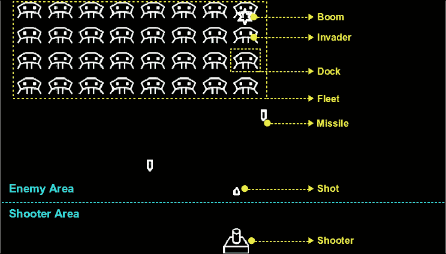
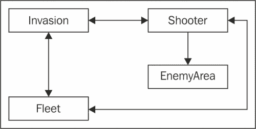
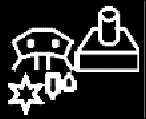
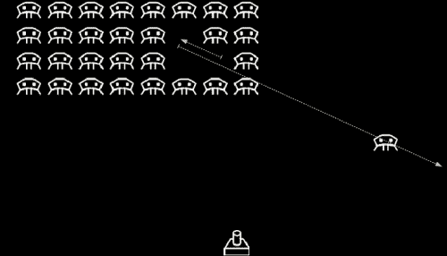
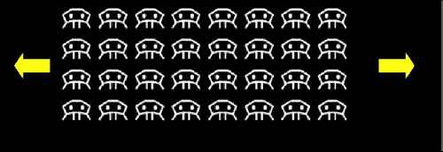
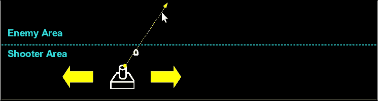
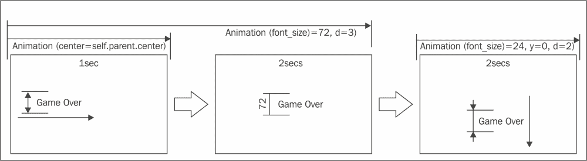
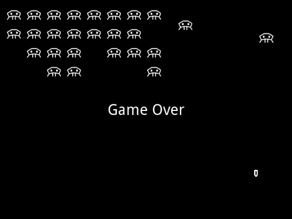

# 第五章。侵略者复仇 - 一个交互式多点触控游戏

本章介绍了一系列组件和策略，用于制作动画和动态应用程序。其中大部分特别适用于游戏开发。本章充满了如何结合不同的 Kivy 元素以及控制同时发生的多个事件的策略的示例。所有示例都集成在一个全新的项目中，这是一个经典游戏《太空侵略者》的版本（版权©1978 年太田公司，[`en.wikipedia.org/wiki/Space_Invaders`](http://en.wikipedia.org/wiki/Space_Invaders)）。以下是我们将在本章中工作的主要组件列表：

+   **图集**：一个 Kivy 包，允许我们高效地加载图像

+   **声音**：允许声音管理的类

+   **动画**：可以应用于小部件的过渡、时间控制、事件和操作

+   **时钟**：一个允许我们安排事件的类

+   **多点触控**：一种允许我们根据触摸控制不同动作的策略

+   **键盘**：Kivy 捕获键盘事件的策略

第一部分介绍了项目概述、GUI 和游戏规则。之后，我们将采用自下而上的方法。解释与游戏各个组件相关的简单类，然后依次介绍本章的其他主题。我们将以对游戏有主要控制权的类结束。到本章结束时，你应该能够开始为你的移动设备实现任何你一直想要实现的游戏应用程序。

# 侵略者复仇 - 一个动画多点触控游戏

*侵略者复仇*是我们 Kivy 版本的《太空侵略者》©的名称。以下截图显示了本章我们将构建的游戏：



截图中有几个黄色和青色的标签（或打印版本中的灰色虚线）。它们帮助我们识别游戏的结构；游戏将包括一个**射击者**（玩家），他向 32（8x4）个**侵略者**射击（*射击*），这些侵略者试图用他们的**导弹**摧毁**射击者**。**侵略者**组织在一个**舰队**（水平移动）中，有时一个单独的**侵略者**可以突破网格结构，在屏幕上飞来飞去，然后再回到其在**舰队**中的对应位置（*码头*）。

屏幕上横跨的青色（打印版本中为灰色）线条表示屏幕内部将屏幕划分为**敌对区域**和**射击区域**。这种划分用于区分根据屏幕不同部分发生的触摸而应发生的动作。

游戏的骨架在`invasion.kv`文件中展示：

```py
1\. # File name: invasion.kv
2\. <Invasion>:
3\.   id: _invasion
4\.   shooter: _shooter
5\.   fleet: _fleet
6\.   AnchorLayout:
7\.     anchor_y: 'top'
8\.     anchor_x: 'center'
9\.     FloatLayout:
10\.       id: _enemy_area
11\.       size_hint: 1, .7
12\.       Fleet:
13\.         id: _fleet
14\.         invasion: _invasion
15\.         shooter: _shooter
16\.         cols: 8
17\.         spacing: 40
18\.         size_hint: .5, .4
19\.         pos_hint: {'top': .9}
20\.         x: root.width/2-root.width/4
21\.   AnchorLayout:
22\.     anchor_y: 'bottom'
23\.     anchor_x: 'center'
24\.     FloatLayout:
25\.       size_hint: 1, .3
26\.       Shooter:
27\.         id: _shooter
28\.         invasion: _invasion
29\.         enemy_area: _enemy_area
```

有两个`AnchorLayout`实例。上面的一个是包含**舰队**的**敌对区域**，下面的一个是包含**射击者**的**射击区域**。

### 小贴士

*敌人区域*和*射击区域*对于游戏的逻辑非常重要，以便区分屏幕上触摸的类型。

我们还创建了一些 ID 和引用，这将允许不同界面实例之间的交互。以下图表总结了这些关系：



# Atlas – 高效的图像管理

当涉及到使用许多图像的应用程序时，减少它们的加载时间非常重要，尤其是在它们从远程服务器请求时。

### 注意

减少加载时间的一种策略是使用**Atlas**（也称为精灵）。Atlas 将所有应用程序图像组合成一个大的图像，因此减少了必要的操作系统或在线请求的数量。

这里是我们用于“侵略者复仇”游戏的 Atlas 图像：



我们将不再请求五个“侵略者复仇”图像，而是只请求 Atlas 图像。我们还需要一个相关的`json`文件，它告诉我们图像中每个单元的确切坐标。好消息是，我们不需要手动做这件事。Kivy 提供了一个简单的命令来创建 Atlas 图像和`json`文件。假设所有图像都在名为`img`的目录中，我们只需要打开终端，转到`img`目录（包含单个图像），然后在终端中运行以下命令：

```py
python -m kivy.atlas invasion 100 *.png

```

### 注意

为了执行前面的命令，您需要安装**Pillow 库**([`python-pillow.github.io/`](http://python-pillow.github.io/))。

命令包含三个参数，即**`basename`**、**`size`**和**`images list`**。`basename`参数是`json`文件（`img/invasion.json`）和 Atlas 图像或图像（`img/invasion-0.png`）的前缀。可能会生成多个 Atlas 图像，在这种情况下，我们会有一系列以`basename`为前缀并跟随数字标识符的图像，例如，`invasion-0.png`和`invasion-1.png`。`size`参数表示结果 Atlas 图像的像素大小。请确保指定一个比最大的图像更大的大小。**`image list`**参数是要添加到 Atlas 的所有图像的列表，我们可以使用`*`通配符。在我们的情况下，我们将使用它来指示所有具有`.png`扩展名的文件。

为了在 Kivy 语言中使用 Atlas，我们必须使用以下格式：`atlas://path/to/atlas/atlas_name/id`。`id`文件指的是不带扩展名的图像文件名。例如，我们通常会将*射击者*图像作为源引用：`'img/shooter.png'`。在生成 Atlas 后，它变为`source: 'atlas://images/invasion/shooter'`。下面的`image.kv`文件展示了“侵略者复仇”中所有图像的代码：

```py
30\. # File name: images.kv
31\. <Invader>:
32\.   source: 'atlas://img/invasion/invader'
33\.   size_hint: None,None
34\.   size: 40,40
35\. <Shooter>:
36\.   source: 'atlas://img/invasion/shooter'
37\.   size_hint: None,None
38\.   size: 40,40
39\.   pos: self.parent.width/2, 0
40\. <Boom>:
41\.   source: 'atlas://img/invasion/boom'
42\.   size_hint: None,None
43\.   size: 26,30
44\. <Shot>:
45\.   source: 'atlas://img/invasion/shot'
46\.   size_hint: None,None
47\.   size: 12,15
48\. <Missile>:
49\.   source: 'atlas://img/invasion/missile'
50\.   size_hint: None,None
51\.   size: 12,27
```

本文件中的所有类都是直接或间接地从 `Image` 类继承而来的。`Missile` 和 `Shot` 首先从名为 `Ammo` 的类继承，该类也继承自 `Image`。还有一个 `Boom` 类，当任何 `Ammo` 被触发时，它将创建爆炸效果。除了 `Boom` 图像（Atlas 中的星星）外，`Boom` 类还将与我们在下一节中添加的声音相关联。

# 爆炸声 – 简单的声音效果

在 Kivy 中添加声音效果非常简单。当创建 `Boom` 实例时，它会产生声音，并且每次发射 *射击* 或 *导弹* 时都会发生这种情况。以下是 `boom.py` 的代码：

```py
52\. # File name: boom.py
53\. from kivy.uix.image import Image
54\. from kivy.core.audio import SoundLoader
55\. 
56\. class Boom(Image):
57\.   sound = SoundLoader.load('boom.wav')
58\.   def boom(self, **kwargs):
59\.     self.__class__.sound.play()
60\.     super(Boom, self).__init__(**kwargs)
```

生成声音涉及使用两个类，**`Sound`** 和 **`SoundLoader`**（第 54 行）。`SoundLoader` 加载音频文件（`.wav`）并返回一个 `Sound` 实例（第 57 行），我们将其保存在 `sound` 引用中（`Boom` 类的静态属性）。每当创建一个新的 `Boom` 实例时，我们都会播放声音。

# `Ammo` – 简单动画

本节解释了如何对 *射击* 和 *导弹* 进行动画处理，它们表现出非常相似的行为。它们从原始位置移动到目的地，不断检查是否击中了目标。以下是对 `ammo.py` 类的代码：

```py
61\. # File name: ammo.py
62\. from kivy.animation import Animation
63\. from kivy.uix.image import Image
64\. from boom import Boom
65\. 
66\. class Ammo(Image):
67\.   def shoot(self, tx, ty, target):
68\.     self.target = target
69\.     self.animation = Animation(x=tx, top=ty)
70\.     self.animation.bind(on_start = self.on_start)
71\.     self.animation.bind(on_progress = self.on_progress)
72\.     self.animation.bind(on_complete = self.on_stop)
73\.     self.animation.start(self)
74\. 
75\.   def on_start(self, instance, value):
76\.     self.boom = Boom()
77\.     self.boom.center=self.center
78\.     self.parent.add_widget(self.boom)
79\. 
80\.   def on_progress(self, instance, value, progression):
81\.     if progression >= .1:
82\.       self.parent.remove_widget(self.boom)
83\.     if self.target.collide_ammo(self):
84\.       self.animation.stop(self)
85\. 
86\.   def on_stop(self, instance,value):
87\.     self.parent.remove_widget(self)
88\. 
89\. class Shot(Ammo):
90\.   pass
91\. class Missile(Ammo):
92\.   pass
```

对于 `Ammo` 动画，我们需要一个简单的 **`Animation`**（第 69 行）。我们发送 `x` 和 `top` 作为参数。

### 注意

`Animation` 实例的参数可以是应用动画的部件的任何属性。

在这种情况下，`x` 和 `top` 属性属于 `Ammo` 本身。这足以将 `Ammo` 的 `Animation` 从其原始位置设置为 `tx`，`ty`。

### 注意

默认情况下，**`Animation`** 的执行周期为 1 秒。

在 `Ammo` 的轨迹中，我们需要 `Ammo` 做一些额外的事情。

### 注意

`Animation` 类包括三个事件，当动画开始时触发（**`on_start`**），在其进行过程中触发（**`on_progress`**），以及当它停止时触发（**`on_stop`**）。

我们将这些事件（第 70 至 72 行）绑定到我们自己的方法上。**`on_start`** 方法（第 75 行）在动画开始时显示一个 `Boom` 实例（第 76 行）。**`on_progress`**（第 80 至 84 行）方法在 10% 的 **`progression`**（第 81 和 82 行）后移除 `Boom`。此外，它还会不断检查 `target`（第 83 行）。当 `target` 被击中时，动画停止（第 84 行）。一旦动画结束（或被停止），`Ammo` 就会从父级中移除（第 82 行）。

第 89 至 92 行定义了两个类，`Shot` 和 `Missile`。`Shot` 和 `Missile` 类从 `Ammo` 继承，它们目前唯一的区别是 `images.kv` 中使用的图像。最终，我们将使用 `Shot` 实例进行 *射击*，使用 `Missile` 实例进行 *入侵者*。在此之前，让我们给 *入侵者* 一些自由，这样它们就可以离开它们的 *舰队* 并执行单独的攻击。

# 入侵者 – 动画的过渡

前一节使用默认的`Animation`过渡。这是一个`Linear`过渡，这意味着`Widget`实例从一个点移动到另一个点是一条直线。*入侵者*的轨迹可以更有趣。例如，可能会有加速度或方向变化，如下面的截图所示：



以下为`invader.py`的代码：

```py
93\. # File name: invader.py
94\. from kivy.core.window import Window
95\. from kivy.uix.image import Image
96\. from kivy.animation import Animation
97\. from random import choice, randint
98\. from ammo import Missile
99\. 
100\. class Invader(Image):
101\.   pre_fix = ['in_','out_','in_out_']
102\.   functions = ['back','bounce','circ','cubic',
103\.     'elastic','expo','quad','quart','quint','sine']
104\.   formation = True
105\. 
106\.   def solo_attack(self):
107\.     if self.formation:
108\.       self.parent.unbind_invader()
109\.       animation = self.trajectory()
110\.       animation.bind(on_complete = self.to_dock)
111\.       animation.start(self)
112\. 
113\.   def trajectory(self):
114\.     fleet = self.parent.parent
115\.     area = fleet.parent
116\.     x = choice((-self.width,area.width+self.width))
117\.     y = randint(round(area.y), round(fleet.y))
118\.     t = choice(self.pre_fix) + choice(self.functions)
119\.     return Animation(x=x, y=y,d=randint(2,7),t=t)
120\. 
121\.   def to_dock(self, instance, value):
122\.     self.y = Window.height
123\.     self.center_x = Window.width/2
124\.     animation = Animation(pos=self.parent.pos, d=2)
125\.     animation.bind(on_complete = self.parent.bind_invader)
126\.     animation.start(self)
127\. 
128\.   def drop_missile(self):
129\.     missile = Missile()
130\.     missile.center = (self.center_x, self.y)
131\.     fleet = self.parent.parent
132\.     fleet.invasion.add_widget(missile)
133\.     missile.shoot(self.center_x,0,fleet.shooter)
```

这段代码背后的想法是让一个*入侵者*从*舰队*中打破队形并进入`solo_attack`（第 106 至 111 行）方法。*入侵者*的`Animation`在`trajectory`方法（第 113 和 119 行）中创建，通过随机化*入侵者*轨迹的终点（第 116 和 117 行）。这种随机化将在*敌方区域*的左右边界上选择两个坐标。此外，我们还随机化**`transition`**（第 118 行）和**`duration`**（第 119 行）以创建更多样化和不可预测的轨迹。

### 注意

Kivy 目前包含 31 种**过渡**。它们由一个字符串表示，例如`'in_out_cubic'`，其中`in_out`是一个前缀，描述了函数（`cubic`）的使用方式。有三个可能的前缀（`in`、`out`和`in_out`），以及 10 个函数（第 102 行），例如`cubic`、`exponential`、`sin`、`quadratic`。请访问 Kivy API 以了解它们的描述（[`kivy.org/docs/api-kivy.animation.html`](http://kivy.org/docs/api-kivy.animation.html)）。

第 118 行随机选择一个过渡。过渡应用于进度，因此同时应用于`x`和`y`，这在轨迹上产生了一个有趣的加速度效果。

当`Animation`类结束其轨迹（第 110 行）时，`to_dock`方法（第 121 至 126 行）将*入侵者*从`Window`的顶部中心部分返回到其原始位置。我们使用**`Window`**类来获取`height`和`width`。有时这比遍历父级链以找到根小部件要简单。当*入侵者*到达*停靠点*时，它会被绑定回那里（第 125 行）。

最后一个方法（第 128 至 133 行的`drop_missile`）发射一枚从*入侵者*底部中心位置（第 130 行）开始垂直向下至屏幕底部的*导弹*（第 133 行）。记住，`Missile`类继承自我们在前一节中创建的`Ammo`类。

我们现在可以让入侵者自由地在敌方区域内移动。然而，我们还想有一种群体移动方式。在下一节中，我们将为每个相应的入侵者创建一个*停靠点*。这样，*入侵者*在*舰队*队形中就有了一个对应的占位符。之后，我们将创建*舰队*，它将不断移动所有的*停靠点*。

# 停靠点 – Kivy 语言中的自动绑定

你可能会从之前的章节中意识到，Kivy 语言不仅仅是将其规则转换为 Python 指令。例如，你可能会看到，当它创建属性时，它也会绑定它们。

### 注意

当我们在布局内部执行一些常见操作，例如 `pos: self.parent.pos` 时，父级的属性就会绑定到其子级。当父级移动时，子级总是移动到父级的位置。

这通常是期望的，但并非总是如此。考虑一下入侵者的 `solo_attack`。我们需要它打破队形，并在屏幕上遵循自由轨迹。当这种情况发生时，整个入侵者队形将继续从右向左和从左向右移动。这意味着入侵者将同时接收到两个命令；一个来自移动的父级，另一个来自轨迹的 `Animation`。

这意味着我们需要为每个入侵者（*invader*）提供一个占位符（*dock*）。这样，当入侵者从单独攻击执行返回时，可以确保其空间。如果没有占位符，舰队（`GridLayout`，我们将在下一节中看到）的布局将自动重新配置队形，重新分配剩余的入侵者以填充空位。此外，入侵者还需要从父级（*dock*）中释放自己，以便可以在屏幕上的任何位置漂浮。以下代码（`dock.py`）使用 Python 而不是 Kivy 语言绑定（第 145 至 147 行）和解除绑定（第 149 至 151 行）入侵者：

```py
134\. # File name: dock.py
135\. from kivy.uix.widget import Widget
136\. from invader import Invader
137\. 
138\. class Dock(Widget):
139\.   def __init__(self, **kwargs):
140\.     super(Dock, self).__init__(**kwargs)
141\.     self.invader = Invader()
142\.     self.add_widget(self.invader)
143\.     self.bind_invader()
144\. 
145\.   def bind_invader(self, instance=None, value=None):
146\.     self.invader.formation = True
147\.     self.bind(pos = self.on_pos)
148\. 
149\.   def unbind_invader(self):
150\.     self.invader.formation = False
151\.     self.unbind(pos = self.on_pos)
152\. 
153\.   def on_pos(self, instance, value):
154\.     self.invader.pos = self.pos
```

### 小贴士

我们使用 第三章 的知识，*部件事件 – 绑定动作*，来编写此代码，但重要的是我们应用的策略。

有时会希望避免使用 Kivy 语言，因为这更有利于完全控制。

这并不意味着使用 Kivy 语言解决这个问题是不可能的。例如，一种常见的方法是将入侵者的父级（*dock*）切换到，比如说，应用程序的根 `Widget` 实例；这将解除入侵者位置与其当前父级的绑定。我们遵循哪种方法并不重要。只要我们理解了机制，我们就能找到优雅的解决方案。

现在既然每个入侵者都有一个确保其在入侵者队形中位置的 *dock*，我们就准备好向舰队引入一些运动。

# 舰队 – 无限连接的动画

在本节中，我们将使舰队从右向左和从左向右进行动画处理，以保持持续运动，如以下截图中的箭头所示：



为了做到这一点，我们将学习如何在动画完成之后立即连接另一个动画。实际上，我们将创建一个无限循环的动画，使得舰队处于持续运动状态。

### 小贴士

我们可以使用 `on_complete` 事件连接两个动画。

以下为 `fleet.py` 的代码片段 1（共 2 个），展示了如何连接这些事件：

```py
155\. # File name: fleet.py (Fragment 1)
156\. from kivy.uix.gridlayout import GridLayout
157\. from kivy.properties import ListProperty
158\. from kivy.animation import Animation
159\. from kivy.clock import Clock
160\. from kivy.core.window import Window
161\. from random import randint, random
162\. from dock import Dock
163\. 
164\. class Fleet(GridLayout):
165\.   survivors = ListProperty(())
166\. 
167\.   def __init__(self,  **kwargs):
168\.     super(Fleet, self).__init__(**kwargs)
169\.     for x in range(0, 32):
170\.       dock = Dock()
171\.       self.add_widget(dock)
172\.       self.survivors.append(dock)
173\.     self.center_x= Window.width/4
174\. 
175\.   def start_attack(self, instance, value):
176\.     self.invasion.remove_widget(value)
177\.     self.go_left(instance, value)
178\.     self.schedule_events()
179\. 
180\.   def go_left(self, instance, value):
181\.     animation = Animation(x = 0)
182\.     animation.bind(on_complete = self.go_right)
183\.     animation.start(self)
184\. 
185\.   def go_right(self, instance, value):
186\.     animation = Animation(right=self.parent.width)
187\.     animation.bind(on_complete = self.go_left)
188\.     animation.start(self)
```

`go_left` 方法（第 180 至 183 行）将 `Animation` 实例的 `on_complete`（第 182 行）事件绑定到 `go_right` 方法（第 185 至 188 行）。同样，`go_right` 方法将另一个 `Animation` 实例的 `on_complete`（第 187 行）事件绑定到 `go_left` 方法。通过这种策略，我们创建了一个两个动画的无穷循环。

`fleet.py` 类还重载了构造函数，向 `Fleet` 的子类添加了 32 个 *入侵者*（第 169 至 173 行）。这些 *入侵者* 被添加到我们用来跟踪尚未被击落的 *入侵者* 的 **`ListProperty`** 中。`start_attack` 方法（第 175 至 178 行）通过调用 `go_left` 方法（第 177 行）和 `schedule_events` 方法（第 178 行）启动 `Fleet` 动画。后者使用了 `Clock`，这将在下一节中解释。

# 使用时钟安排事件

我们看到 `Animation` 有一个持续时间参数，它确定了动画应该持续的时间。另一个与时间相关的话题是在特定时间或 n 秒的间隔内安排特定任务。在这些情况下，我们使用 **`Clock`** 类。让我们分析以下 `fleet.py` 的代码片段 2（共 2 个），如下所示：

```py
189\. # File name: fleet.py (Fragment 2)
190\.   def schedule_events(self):
191\.     Clock.schedule_interval(self.solo_attack, 2)
192\.     Clock.schedule_once(self.shoot,random())
193\. 
194\.   def solo_attack(self, dt):
195\.     if len(self.survivors):
196\.       rint = randint(0, len(self.survivors) - 1)
197\.       child = self.survivors[rint]
198\.       child.invader.solo_attack()
199\. 
200\.   def shoot(self, dt):
201\.     if len(self.survivors):
202\.       rint = randint(0,len(self.survivors) - 1)
203\.       child = self.survivors[rint]
204\.       child.invader.drop_missile()
205\.       Clock.schedule_once(self.shoot,random())
206\. 
207\.   def collide_ammo(self, ammo):
208\.     for child in self.survivors:
209\.       if child.invader.collide_widget(ammo):
210\.         child.canvas.clear()
211\.         self.survivors.remove(child)
212\.         return True
213\.     return False
214\. 
215\.   def on_survivors(self, instance, value):
216\.     if len(self.survivors) == 0:
217\.       Clock.unschedule(self.solo_attack)
218\.       Clock.unschedule(self.shoot)
219\.       self.invasion.end_game("You Win!")
```

`schedule_events` 方法（第 190 至 192 行）为特定时间安排动作。第 191 行每两秒安排一次 `solo_attack` 方法。第 192 行随机安排一次 `shoot`（在 0 和 1 秒之间）。

### 注意

**`schedule_interval`** 方法定期安排动作，而 **`schedule_once`** 方法只安排一次动作。

`solo_attack` 方法（第 194 至 198 行）随机选择一个幸存者执行我们为 *入侵者* 研究的单独攻击（`invader.py` 中的第 106 至 111 行）。`shoot` 方法（第 200 至 205 行）随机选择一个幸存者向 *射击者* 发射 *导弹*（第 201 至 204 行）。之后，该方法安排另一个 `shoot`（第 205 行）。

在 `Ammo` 类中，我们使用了 `collide_ammo` 方法来验证 `Ammo` 实例是否击中了任何 *入侵者*（`ammo.py` 中的第 83 行）。现在，在 `fleet.py` 中，我们实现了这样一个方法（第 207 或 213 行），它将 *入侵者* 隐藏并从幸存者列表中删除。每当修改幸存者 `ListProperty` 时，都会触发 `on_survivors` 事件。当没有幸存者剩下时，我们使用 **`unscheduled`** 方法（第 217 和 218 行）取消安排事件，并通过显示 **You Win!** 消息来结束游戏。

我们完成了射击者敌人的创建。现在，是时候为 *射击者* 提供躲避 *导弹* 和 *射击* 以击中 *入侵者* 的移动了。

# 射击者 – 多点触控控制

Kivy 支持多点触控交互。这个特性始终存在，但我们除了在 第四章 *改进用户体验* 中使用 `Scatter` 小部件时之外，并没有过多关注它。我们没有明确指出整个屏幕和 GUI 组件已经能够进行多点触控，以及 Kivy 会相应地处理这些事件。

### 注意

Kivy 在内部处理多点触控动作。这意味着所有 Kivy 小部件和组件都支持多点触控交互；我们不必担心这一点。Kivy 解决了多点触控控制中常见的模糊情况的所有可能冲突，例如，同时触摸两个按钮。

话虽如此，控制特定实现的责任在我们身上。多点触控编程引入了我们需要作为开发者解决的逻辑问题。尽管如此，Kivy 提供了与每个特定触摸相关的数据，因此我们可以处理逻辑。主要问题是我们需要不断区分一个触摸与另一个触摸，然后采取相应的行动。

在《入侵者复仇》中，我们需要区分由相同类型的触摸触发的两种动作。第一种动作是 *射手* 的水平移动，以避免入侵者的 *导弹*。第二种是触摸屏幕以射击 *入侵者*。以下截图通过宽粗箭头（滑动触摸）和虚线细箭头（射击动作）说明了这两种动作：



以下 `shooter.py` 的代码片段 1（共 2 个），通过使用 *敌人区域* 和 *射手区域* 来控制这两种动作：

```py
220\. # File name: shooter.py (Fragment 1)
221\. from kivy.clock import Clock
222\. from kivy.uix.image import Image
223\. from ammo import Shot
224\. 
225\. class Shooter(Image):
226\.   reloaded = True
227\.   alife = False
228\. 
229\.   def on_touch_down(self, touch):
230\.     if self.parent.collide_point(*touch.pos):
231\.       self.center_x = touch.x
232\.       touch.ud['move'] = True
233\.     elif self.enemy_area.collide_point(*touch.pos):
234\.       self.shoot(touch.x,touch.y)
235\.       touch.ud['shoot'] = True
236\. 
237\.   def on_touch_move(self, touch):
238\.     if self.parent.collide_point(*touch.pos):
239\.       self.center_x = touch.x
240\.     elif self.enemy_area.collide_point(*touch.pos):
241\.       self.shoot(touch.x,touch.y)
242\. 
243\.   def on_touch_up(self, touch):
244\.     if 'shoot' in touch.ud and touch.ud['shoot']:
245\.       self.reloaded = True
```

`on_touch_down`（第 229 至 235 行）和 `on_touch_move`（第 237 至 241 行）方法通过分别使用 *射手区域*（第 230 和 238 行）和 *敌人区域*（第 233 和 240 行）小部件来区分两种动作，*移动* 或 *射击*，以便碰撞事件的坐标。

### 注意

触摸坐标是最常见的识别特定触摸的策略。然而，触摸有许多其他属性可以帮助区分它们，例如，时间、双击（或三击）或输入设备。您可以通过检查 `MotionEvent` 类来查看触摸的所有属性（[`kivy.org/docs/api-kivy.input.motionevent.html#kivy.input.motionevent.MotionEvent`](http://kivy.org/docs/api-kivy.input.motionevent.html#kivy.input.motionevent.MotionEvent)）。

与之相反，`on_touch_up` 方法（第 243 行）采用了一种不同的方法。它使用 `MotionEvent` 实例（触摸）的 **`ud`** 属性（用户数据字典，用于在触摸中存储个性化数据）来确定事件开始时的触摸是否是 *移动*（在 *射手区域*）还是 *射击*（在 *敌人区域*）。我们之前在 `on_touch_down` 中设置了 `touch.ud`（第 232 和 235 行）。

### 注意

Kivy 将触摸事件与三个基本触摸事件（按下、移动和抬起）关联起来，因此我们获取的`on_touch_down`、`on_touch_move`和`on_touch_up`的触摸引用是相同的，我们可以区分触摸。

现在我们来分析这些事件调用的方法细节。以下是从`shooter.py`中提取的代码片段 2（共 2 个）：

```py
246\. # File name: shooter.py (Fragment 2) 
247\.   def start(self, instance, value):
248\.     self.alife=True
249\. 
250\.   def shoot(self, fx, fy):
251\.     if self.reloaded and self.alife:
252\.       self.reloaded = False
253\.       Clock.schedule_once(self.reload_gun, .5)
254\.       shot = Shot()
255\.       shot.center = (self.center_x, self.top)
256\.       self.invasion.add_widget(shot)
257\.       (fx,fy) = self.project(self.center_x,self.top,fx,fy)
258\.       shot.shoot(fx,fy,self.invasion.fleet)
259\. 
260\.   def reload_gun(self, dt):
261\.     self.reloaded = True
262\. 
263\.   def collide_ammo(self, ammo):
264\.     if self.collide_widget(ammo) and self.alife:
265\.       self.alife = False
266\.       self.color = (0,0,0,0)
267\.       self.invasion.end_game("Game Over")
268\.       return True
269\.     return False
270\. 
271\.   def project(self,ix,iy,fx,fy):
272\.     (w,h) = self.invasion.size
273\.     if ix == fx: return (ix, h)
274\.     m = (fy-iy) / (fx-ix)
275\.     b = iy - m*ix
276\.     x = (h-b)/m
277\.     if x < 0: return (0, b)
278\.     elif x > w: return (w, m*w+b)
279\.     return (x, h)
```

我们首先创建了一个方法来启动射手（第 247 和 248 行），我们将在游戏开始时使用它。然后，我们为`on_touch_move`方法与`shoot`方法（第 250 至 258 行）实现了一个有趣的行为。我们不是尽可能快地射击，而是将下一次`shoot`延迟`0.5`秒。这个延迟模拟了枪需要重新装填的时间间隔（第 253 行）。否则，如果允许计算机以尽可能快的速度射击，这对**入侵者**来说是不公平的。相反，当我们使用`on_touch_up`方法时，枪立即重新装填，因此在这种情况下，这将取决于玩家的技巧，看谁能够通过射门和触摸序列更快地射击。

`collide_ammo`方法（第 263 至 269 行）几乎等同于`Fleet`（第 207 至 213 行）中的`collide_ammo`方法。唯一的区别是只有一个**射手**而不是一组**入侵者**。如果**射手**被击中，则游戏结束，并显示**游戏结束**的消息。请注意，我们没有移除**射手**，我们只是将其`alife`标志设置为`False`（第 265 行），并通过将颜色设置为黑色（第 266 行）来隐藏它。这样，我们避免了指向不再存在于界面上下文中的实例的引用不一致。

`project`方法（第 271 至 278 行）将触摸坐标扩展到屏幕边界，因此**射击**将继续其轨迹直到屏幕的尽头，而不是正好停止在触摸坐标处。数学细节超出了本书的范围，但它是一种简单的线性投影。

应用程序几乎准备好了。只有一个小问题。如果你没有多点触控屏幕，实际上你将无法玩这个游戏。下一节将介绍如何处理键盘事件，以便采用更经典的游戏方式，这种方式结合了键盘和鼠标。

# 入侵 - 使用键盘移动射手

本节提供了第二种移动**射手**的方法。如果你没有多点触控设备，你将需要使用其他东西来轻松控制**射手**的位置，同时你使用鼠标进行射击。以下是从`main.py`中提取的代码片段 1（共 2 个）：

```py
280\. # File name: main.py (Fragment 1)
281\. from kivy.app import App
282\. from kivy.lang import Builder
283\. from kivy.core.window import Window
284\. from kivy.uix.floatlayout import FloatLayout
285\. from kivy.uix.label import Label
286\. from kivy.animation import Animation
287\. from kivy.clock import Clock
288\. from fleet import Fleet
289\. from shooter import Shooter
290\. 
291\. Builder.load_file('images.kv')
292\. 
293\. class Invasion(FloatLayout):
294\. 
295\.   def __init__(self, **kwargs):
296\.     super(Invasion, self).__init__(**kwargs)
297\.     self._keyboard = Window.request_keyboard(self.close,          self)
298\.     self._keyboard.bind(on_key_down=self.press)
399\.     self.start_game()
300\. 
301\.   def close(self):
302\.     self._keyboard.unbind(on_key_down=self.press)
303\.     self._keyboard = None
304\. 
305\.   def press(self, keyboard, keycode, text, modifiers):
306\.     if keycode[1] == 'left':
307\.       self.shooter.center_x -= 30
308\.     elif keycode[1] == 'right':
309\.       self.shooter.center_x += 30
310\.     return True
311\. 
312\.   def start_game(self):
313\.     label = Label(text='Ready!')
314\.     animation = Animation (font_size = 72, d=2)
315\.     animation.bind(on_complete=self.fleet.start_attack)
316\.     animation.bind(on_complete=self.shooter.start)
317\.     self.add_widget(label)
318\.     animation.start(label)
```

上一段代码展示了键盘事件控制。`__init__`构造函数（第 295 至 299 行）将请求**`keyboard`**（第 297 行）到`Window`，并将**`on_keyboard_down`**事件绑定到**`press`**方法。`Window._request_keyboard`方法的一个重要参数是当`keyboard`关闭时调用的方法（第 301 至 303 行）。键盘可以关闭的原因有很多，包括当另一个小部件请求它时。`press`方法（第 305 至 310 行）负责处理键盘输入，即按下的键。按下的键保存在`keycode`参数中，并在第 306 和 308 行使用，以决定**射手**应该向左还是向右移动。

### 注意

游戏中的键盘绑定是为了在没有多触控功能的设备上进行测试。如果您想在您的移动设备上尝试它，您应该注释掉第 297 和 298 行以禁用键盘绑定。

第 299 行调用了`start_game`方法（第 312 至 318 行）。该方法显示带有文本**Ready!**的`Label`。请注意，我们在第 314 行将一个`Animation`实例应用于`font_size`。到目前为止，我们一直在使用动画通过`x`、`y`或`pos`属性移动小部件。然而，动画可以与任何支持算术运算的属性一起工作（例如，`String`不支持此类运算；作为一个反例）。例如，我们可以使用它们来动画化`Scatter`的旋转或缩放。当动画完成后，它将同时启动**舰队**和**射手**（第 315 和 316 行）。注意我们如何将两个方法绑定到同一个事件。

### 小贴士

我们可以将任意数量的方法绑定到事件上。

在下一节中，我们将讨论如何按顺序或同时动画化多个属性。

# 使用`+`和`&`结合动画

您已经了解到，您可以将多个属性添加到同一个动画中，以便它们一起修改（在`ammo.py`的第 69 行）。

### 注意

我们可以通过使用`+`和`&`**运算符**来组合动画。`+`运算符用于创建顺序动画（一个接一个）。`&`运算符允许我们同时执行两个动画。

以下代码是`main.py`的片段 2，并展示了这两个运算符的使用：

```py
319\. # File name: main.py (Fragment 2)
320\.   def end_game(self, message):
321\.     label = Label(markup=True, size_hint = (.2, .1), 
322\.       pos=(0,self.parent.height/2), text = message)
323\.     self.add_widget(label)
324\.     self.composed_animation().start(label)
325\. 
326\.   def composed_animation(self):
327\.     animation = Animation (center=self.parent.center)
328\.     animation &= Animation (font_size = 72, d=3)
329\.     animation += Animation(font_size = 24,y=0,d=2)
330\.     return animation
331\. 
332\. class InvasionApp(App):
333\.   def build(self):
334\.     return Invasion()
335\. 
336\. if __name__=="__main__":
337\.   InvasionApp().run()
```

`end_game`方法（第 320 至 324 行）显示一条最终消息，以指示游戏如何结束（在`fleet.py`的第 219 行显示**You Win**或在`shooter.py`的第 267 行显示**Game Over**）。该方法使用`composed_animation`方法（第 326 至 330 行）创建一个组合的`Animation`，在其中我们使用所有可能的组合动画方式。第 327 行是一个简单的`Animation`，它通过`&`运算符与另一个不同持续时间的简单`Animation`同时执行。在第 329 行，一个包含两个属性（`font_size`和`y`）的`Animation`通过`+`运算符附加到之前的一个上。

生成的动画执行以下操作：将消息从左侧移动到中间需要一秒钟，同时字体大小在增加。当它到达中间时，字体大小的增加持续两秒钟。一旦字体达到完全大小（72 点），消息移动到底部，同时字体大小以相同的速度减小。以下图表说明了整个动画序列：



`'+'`运算符类似于我们在将`Animation on_complete`事件绑定到创建另一个`Animation`的方法时所做的操作：`animation.bind(on_complete = self.to_dock)`（`invader.py`的第 110 行）。区别在于，当我们使用`'+'`运算符时，没有机会创建无限循环，就像我们在`*fleet*`中做的那样，或者在进行另一个动画之前更改`Widget`属性。例如，在`*invader*`的情况下，我们在将其带回到`*dock*`的动画之前（第 124 到 126 行），将`*invader*`移动到屏幕的顶部中心（第 122 和 123 行）：

```py
121\.   def to_dock(self, instance, value):
122\.     self.y = Window.height
123\.     self.center_x = Window.width/2
124\.     animation = Animation(pos=self.parent.pos, d=2)
125\.     animation.bind(on_complete = self.parent.bind_invader)
126\.     animation.start(self)
```

`&`运算符类似于将两个属性作为`Animation`的参数发送，就像我们在第 69 行所做的那样：`self.animation = Animation(x=tx, top=ty)`。将两个属性作为参数发送的区别在于，它们共享相同的持续时间和过渡效果，而在第 328 行，我们改变了第二个属性的持续时间。

这里有一张最后的截图，展示了入侵者最终复仇的场景：



# 概述

本章涵盖了整个交互式和动画应用程序的构建过程。你学习了如何集成各种 Kivy 组件，现在你应该能够轻松地构建一个 2D 动画游戏。

让我们回顾一下本章中使用的所有新类和组件：

+   `Atlas`

+   `Image`: `source`属性

+   `SoundLoader`和`Sound`: 分别是`load`和`play`方法

+   `Window`: `高度`和`宽度`属性，以及`request_keyboard`、`remove_widget`和`add_widget`方法

+   `Animation`: 作为参数的属性；`d`和`t`参数；`start`、`stop`和`bind`方法；`on_start`、`on_progress`和`on_complete`事件；以及`'+'`和`'&'`运算符

+   `Touch`: `ud`属性

+   `Clock`: `schedule_interval`和`schedule_once`方法

+   `Keyboard`: `bind`和`unbind`方法，`on_key_down`事件

本章包含的信息提供了你可以用来开发高度交互式应用程序的工具和策略。通过将前几章的信息与本章对属性、绑定事件和 Kivy 语言进一步理解的洞察相结合，你应该能够快速开始使用 Kivy API 的所有其他组件（[`kivy.org/docs/api-kivy.html`](http://kivy.org/docs/api-kivy.html)）。

最后一章，第六章, *Kivy Player – TED 视频流媒体*，本书将教你如何控制多媒体组件，特别是视频和音频。它将提供一个额外的示例，以便展示更多 Kivy 组件，但更重要的是，它将教你如何构建一个看起来更专业的界面。它还将介绍一些 Kivy 工具来调试我们的应用程序。
