# 第一章：Python 入门

Python 语言在 20 世纪 80 年代末期起步，当时一位荷兰人吉多·范罗苏姆开始着手一个有趣的项目，该项目将成为 ABC 语言的继承者，具有更好的异常处理能力和与荷兰计算与信息中心（Centrum Wiskunde en Informatica）的 Amoeba 操作系统接口的能力。它首次出现在 1991 年。Python 2.0 在 2000 年发布，Python 3.0 在 2008 年发布。这种语言被命名为 Python，是为了纪念吉多最喜欢的英国电视喜剧节目《蒙提·派森的飞行马戏团》。在这里，我们将探讨为什么 Python 突然影响了我们的生活，以及使用 Python 及其实现的各个应用。在本章中，你将学习在不同平台（即 Windows、Linux 和 Mac）上执行的基本安装步骤，关于环境变量，设置环境变量，文件格式，Python 交互式 shell，基本语法，以及最终打印格式化输出。

# 为什么选择 Python？

现在，你可能突然被一个问题困扰，为什么选择 Python？根据电气和电子工程师协会（IEEE）2016 年的排名，Python 在 C 和 Java 之后排名第三。根据 Indeed.com 2016 年的数据，Python 求职市场搜索排名第五。显然，所有数据都指向 Python 在就业市场需求的持续增长。如果你只是想为了乐趣学习，或者你想围绕 Python 建立自己的职业生涯，你将热爱这门语言。在学校的层面，许多学校已经开始为孩子们提供 Python 编程课程。随着新技术出人意料地占领市场，Python 已经扮演了主导角色。无论是云平台、移动应用开发、大数据、使用树莓派的物联网，还是新的区块链技术，Python 都被视为一个专门的语言平台，用于开发和交付可扩展且健壮的应用程序。

语言的一些关键特性包括：

+   Python 程序可以在任何平台上运行，你可以将 Windows 机器上创建的代码携带到 Mac 或 Linux 上运行

+   Python 内置了大型库，具有预构建和可移植的功能，也称为标准库

+   Python 是一种表达性语言

+   Python 是免费且开源的

+   Python 代码的大小大约是等效 C++ 和 Java 代码的三分之一

+   Python 可以是动态类型和强类型——动态类型意味着它是一种在运行时解释的类型，这意味着在 Python 中，不需要定义变量的类型（`int` 或 `float`）

# Python 应用

Python 广泛使用的最著名的平台之一是 YouTube。你还会在其他地方发现 Python 被广泛使用，比如好莱坞电影中的特效、药物进化与发现、交通控制系统、ERP 系统、云托管、电子商务平台、CRM 系统，以及你能想到的任何领域。

# 版本

在撰写本书时，市场上可用的 Python 编程语言有两个主要版本，即 Python 2.x 和 Python 3.x。本书撰写时的稳定版本是 Python 2.7.13 和 Python 3.6.0。

# Python 的实现

主要实现包括 CPython、Jython、IronPython、MicroPython 和 PyPy。

# 安装

在这里，我们将期待在三个不同的操作系统平台上安装 Python，即 Windows、Linux 和 Mac OS。让我们从 Windows 平台开始。

# 在 Windows 平台上安装

Python 2.x 可以从 [`www.python.org/downloads`](https://www.python.org/downloads) 下载。安装程序简单且易于安装。执行以下步骤来安装设置：

1.  一旦点击安装程序，您将在桌面屏幕上看到一个小的窗口，如图所示；点击下一步：

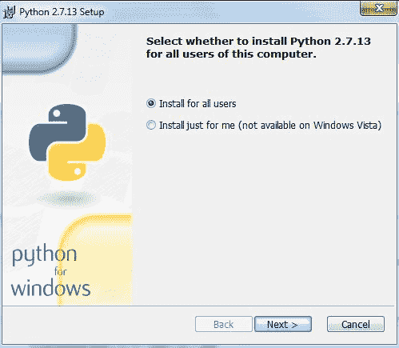

1.  提供一个合适的安装文件夹来安装 Python。如果您不提供安装文件夹，则安装程序将自动为您创建一个安装文件夹，如图所示。点击下一步：

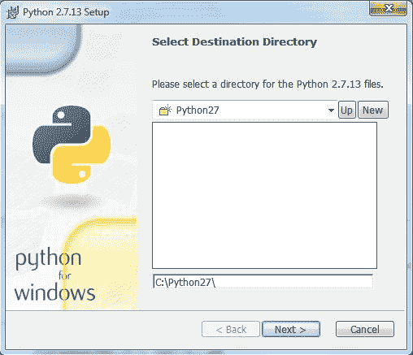

1.  完成步骤 2 后，您将获得一个窗口来定制 Python，如图所示。注意，将 python.exe 添加到路径选项已被标记 x。选择此选项将其添加到系统路径变量（将在本章后面解释），然后点击下一步：

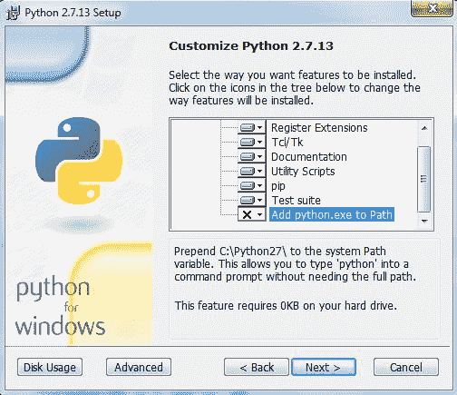

1.  最后，点击完成以完成安装：

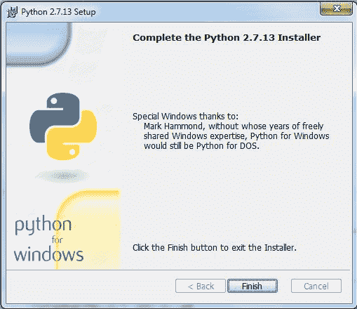

# 在 Linux 平台上安装

这些天，大多数基于 Linux 的系统都预装了 Python，所以在大多数情况下，您不需要单独安装它。但是，如果您在 Linux 平台上找不到您想要的 Python 版本，您可以从网站 [`www.python.org/downloads/source/`](https://www.python.org/downloads/source/) 下载特定 Linux 平台的所需版本。执行以下步骤：

1.  使用 `tar -xvzf python_versionx.x` 命令解压缩文件。

1.  浏览如图所示的压缩文件目录：

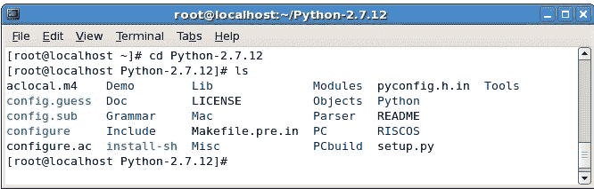

1.  运行以下命令：

```py
 [root@localhost Python-2.7.12]# ./configure
 [root@localhost Python-2.7.12]# make
 [root@localhost Python-2.7.12]# make install

```

1.  使用截图所示的命令来确保 Python 正在运行：

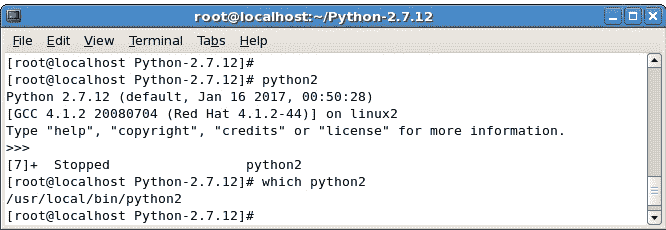

# 在 Mac OS 上安装

对于 Mac OS，您可以从网站 [`www.python.org/downloads/mac-osx/`](https://www.python.org/downloads/mac-osx/) 获取安装程序。

对于新的 Mac OS X，Sierra 预装了 Python 2.7，这对于学习很好，但不能用于开发高级程序。您不需要在新的 Mac OS X 上单独安装 Python。但是，有一个警告，即与 Mac OS 打包的 Python 版本可能已过时，可能需要更新。如果您仍然想安装一个单独的版本，可以按照以下简单步骤进行：

1.  首先，你可能需要安装 Xcode，Xcode 是平台 IDE，可以从 Apple App Store 下载。

1.  一旦安装了 Xcode，你需要安装命令行工具，这些工具可以通过在 `/Applications/Utilities/` 下的终端中运行 `xcode-select --install` 命令来安装，如下面的截图所示：

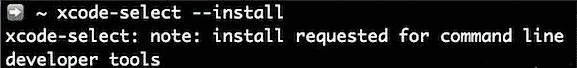

1.  出现一个带有三个不同选项的弹出窗口，如下所示：

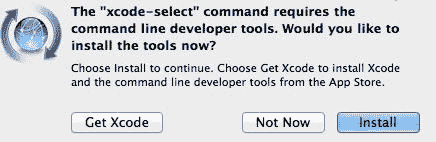

1.  一旦点击“安装”并同意他们的条款和条件，命令行工具将开始下载，并将在几分钟内安装完成，具体取决于网络连接速度。

1.  接下来的步骤将是安装 Homebrew，它是 Mac OS 的包管理器，处理 Python 包。为了安装 Homebrew，只需在终端中提供以下输入：

```py
 /usr/bin/ruby -e "$(curl -fsSL
 https://raw.githubusercontent.com/Homebrew/install/master/install)"

```

1.  要安装最新的 `python2` 版本，只需在终端中输入 `brew install python`：

```py
 $ brew install python

```

为了安装 `python3`，你需要使用 `brew install python3`。

# Notepad++ 安装

Notepad++ 是一款易于使用的文本编辑器，也是一个免费的开源软件程序，可以从 [`notepad-plus-plus.org/`](https://notepad-plus-plus.org/) 容易地下载。我们将使用这个文本编辑器来创建简单的程序。

# Python 文件格式

每种语言都理解文件格式，例如，像 C 语言文件扩展名是 `.c` 一样，Java 语言也有文件扩展名 `.java`。Python 的文件扩展名是 `.py`，而字节码文件扩展名是 `.pyc`。

# Python 交互式 shell

Python 交互式 shell 也被称为 **集成开发环境** (**IDLE**)。Python 安装程序提供了两个交互式 shell：一个是 IDLE（Python 图形用户界面）和另一个是 Python（命令行）。两者都可以用于运行简单的程序。

对于复杂的程序和执行大文件，使用 Windows 命令提示符，在那里系统变量自动设置后，大文件被系统识别并执行。

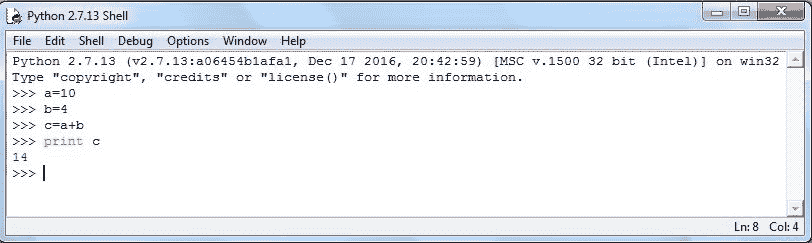

上述截图是我们所说的 Python IDLE，它是 Python 安装的一部分。下一个截图是 Python 安装捆绑的命令行，或者我们也可以通过 Windows 命令行简单地启动 Python 命令来获取 Python 命令行。对于我们的大多数编程指令，我们将使用 Python 命令行：

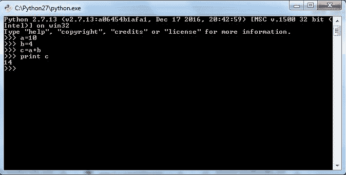

# 系统或环境变量

如果您还记得之前解释的安装步骤，您可能还在想系统变量是什么？它们是一组预定义的变量，对所有编程单元都可用。如果没有设置，那么每次您想要运行程序或执行 Python 文件时，您都必须手动为每个 Python 可执行文件提供路径，但如果`python.exe`被设置为系统变量，那么系统将自动识别您的编程指令并开始执行。

# 在 Windows 中设置环境变量

在这里，如果路径变量中没有提供`python.exe`，那么系统将不会识别`python`命令，如下面的截图所示：

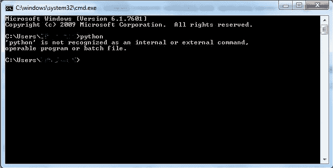

Windows 命令提示符不识别`python`，如前一个截图所示。一旦在路径变量或系统变量中更新了 Python，Windows 命令行将识别`python`命令并执行，如下所示：

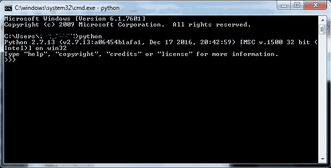

在安装过程中，安装程序提供了一个设置系统变量的选项，我们在安装步骤中已经看到。但如果您错过了，不必担心。您可以手动设置系统变量。只需按照以下步骤操作：

1.  只需右键单击我的电脑（Windows PC 的旧版本）或计算机（Windows 7 及以后版本）并选择属性。一旦选择了属性，您将看到以下截图，您需要选择“高级系统设置”：

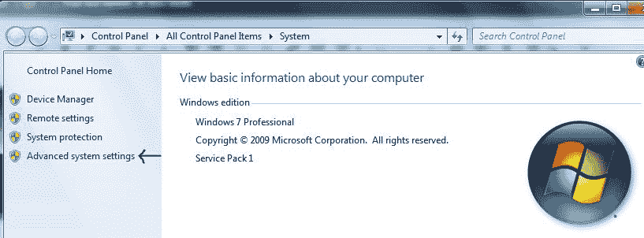

1.  在点击了“高级系统设置”之后，您将看到系统属性。点击“环境变量”按钮。

1.  完成第二步后，会出现一个窗口。从“系统变量”面板中选择“Path”，然后点击“编辑”按钮。

1.  您的 Python 安装将类似于以下截图，您需要右键单击地址栏并选择“将地址作为文本复制”选项：

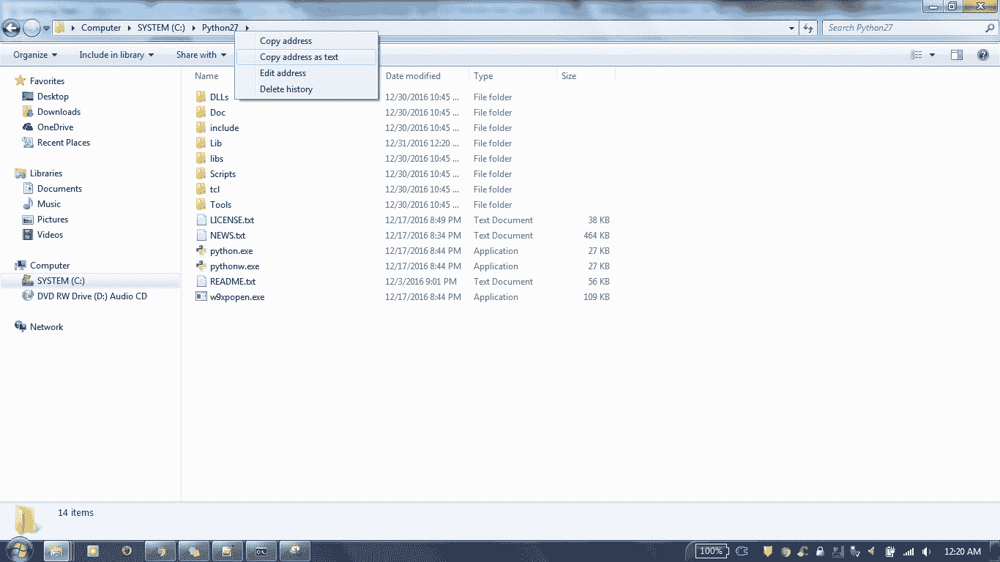

1.  将 Python 安装文件夹路径添加到 Path 变量中。

1.  点击“确定”然后再次点击“确定”以关闭所有窗口。我们的系统变量已设置：

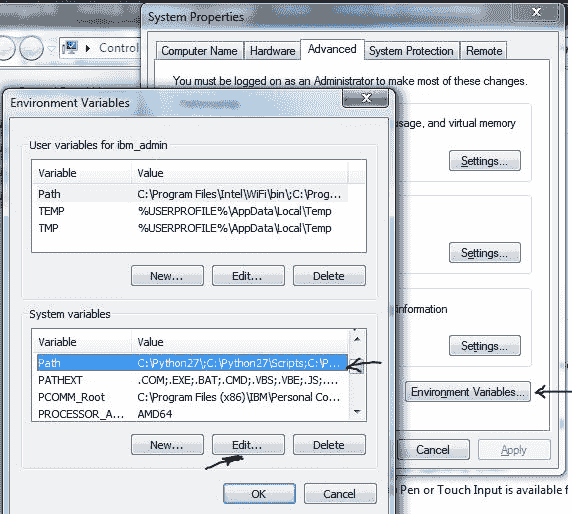

# 在 Linux 中设置环境变量

Linux 有不同类型的 shell，Python 目录路径通常是`/usr/local/bin/python`：

+   **csh shell**：打开终端并输入`setenv PATH "$PATH:/usr/local/bin/python"`然后按下*Enter*

+   **bash shell**：在终端中输入`export PATH="$PATH:/usr/local/bin/python"`然后按下*Enter*

+   **sh 或 ksh shell**：输入`PATH="$PATH:/usr/local/bin/python"`然后按下*Enter*

# 在 Mac OS（OS 10.9）中设置环境变量

在这里，您只需编辑`launchd.conf`文件并将路径变量添加到文件中：

```py
$ sudo edit /etc/launchd.conf
setenv PYTHONPATH /Users/vesper/temp:/Users/vesper/misc

```

# 编写一个简单的 Hello World!程序

恭喜您成功安装。现在您可以开始编程了。打开 Notepad++并创建一个新文件。在新文件中，输入以下内容：

```py
print "Hello World!" 

```

将文件保存为`hello.py`。

打开命令提示符，使用`cd`命令切换到你的文件所在的文件夹，然后输入文件夹路径。执行文件时，命令将是`python hello.py`，如下截图所示：

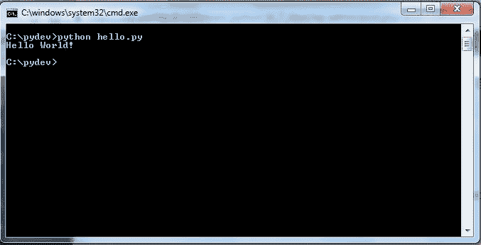

这相当简单，不是吗？同样，你也可以执行所有的 Python 文件。一旦你开始处理项目和大型文件，保持组织性总是好的，通过创建文件夹结构来实现。

# 基本 Python 语法

基本语法可以被视为每个编程语言都需要的一些简单指南。让我们从我们的日常生活中来理解。比如说，你没有把食物打扮好并正确地放在盘子上，你就不能吃你的食物。在你可以消费食物之前，你需要给食物适当的装饰。你准备一种特殊的饮料，包括三份戈登金酒，一份伏特加，一半的基纳利莱特，然后按照步骤混合。这个过程是必要的，以获得完美的混合。当我们从编程语言的角度来谈论时，这些就是类似语法的概念。

基纳利莱特-利莱特（法语发音：[li'le]），根据欧盟法律归类为香料酒，是来自波登萨克的一个小村庄的法国开胃酒。它是由 85%波尔多地区葡萄酒（白葡萄酒和桃红葡萄酒使用赛美隆，红葡萄酒使用梅洛）和 15%浸泡利口酒混合而成，主要是柑橘利口酒（西班牙和摩洛哥甜橙皮和海地苦绿橙皮）。然后将混合物在橡木桶中搅拌，直到混合均匀。在陈化过程中，利莱特被当作波尔多葡萄酒处理（进行澄清、过滤等）。

前面的信息来源于[`en.wikipedia.org/wiki/Lillet`](https://en.wikipedia.org/wiki/Lillet)。

# Python 中的注释

在 Python 中，有两种类型的注释——一种是单行注释，另一种是多行注释。对于单行注释，使用`#`，而对于多行注释，使用三引号`"""`：

```py
#This is a single line comment in Python

print "Hello World" #This is a single comment in Python

""" For multi-line
comment use three
double quotes
...
"""
print "Hello World!"

```

# 三重、双和单引号

Python 并不关心你使用单引号还是双引号来打印单个语句。但是，在打印复杂语句时，两者肯定都有一些意义，我们很快就会看到。

`print "Hello World!"`和`print 'Hello World!'`将给出相同的输出`Hello World!`两次：

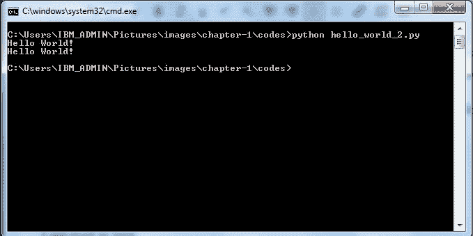

你将如何打印这样的内容：

我疯狂地爱着，你认为我做得对吗？一种方法是将整个内容用三引号括起来，如下所示：

```py
print '''I am mad in love
                     do you think
                                 I am doing
                                           the right thing '''

```

或者，你也可以使用三次双引号来达到同样的效果：

```py
print """I am mad in love
                     do you think
                                 I am doing
                                                                                                                             the right thing """

```

前面的两个例子不是格式化的，它们只是用来展示我们如何实现多行打印。

让我们尝试另一个例子。以下语句的结果应该是什么？

```py
print 'Hey there it's a cow'

```

以下代码片段给出了以下结果：

```py
C:pydev>python hello.py
File "hello.py", line 1
print 'Hey there it's a cow'
^
SyntaxError: invalid syntax

```

Python 简单地解释为，在它之后语句以单引号结束。解决方案是将整个句子放在双引号内，如下所示：

```py
print "Hey there it's a cow"

```

添加双引号(`"`)将给出无错误的输出，如下所示：

```py
C:pydev>python hello.py
Hey there it's a cow

```

# Python 转义反斜杠

Python 的转义反斜杠用于`print`语句的延续。您可以将单个语句扩展到多行：

```py
print "Hello
  world "

```

这将产生以下输出：

```py
C:pydev>python hello.py
Hello world

```

# 引号内的字符串

对于打印字符串，可以使用一对单引号(`' '`)或一对双引号(`" "`)，如下面的示例所示：

```py
print "Hello World 'Mr' Bond"
print 'old world "but" still good'

```

这将产生以下结果：

```py
C:pydev>python hello.py
Hello World 'Mr' Bond
old world "but" still good

```

# Python 中的转义序列

转义序列用于将制表符、换行符、退格和其他特殊字符插入到您的代码中。它们为您提供了更大的控制和灵活性，以格式化语句和代码：

| 转义 | 序列含义 |
| --- | --- |
| b | 退格键 |
| a | 声音系统蜂鸣器 |
| n | 换行符 |
| t | 水平制表符 |
|  | 字符 |
| ' | 单引号 |
| " | 双引号 |

```py
print 'a' 
print 'tHermit' 
print "i know , they are 'great'"

```

输出如下：

```py
C:pydev>python hello.py
Hermit
i know , they are 'great'

```

之前的代码执行时会发出蜂鸣声。如果您没有听到蜂鸣声，请检查您的扬声器。

# 字符串连接

两个字符串可以使用`+`运算符连接：

```py
print "Only way to join" + "two strings"

```

以下是为之前代码的输出：

```py
C:pydev>python string_concatenation.py
Only way to join two strings

```

# 格式化输出

考虑一个例子，您想要打印人的姓名、分数和年龄：

```py
print "Name", "Marks", "Age" 
print "John Doe", 80.67, "27" 
print "Bhaskar", 76.908, "27"
print "Mohit", 56.98, "25" 

```

输出将如下所示：

```py
C:pydev>python hello.py
Name Marks Age
John Doe 80.67 27
Bhaskar 76.908 27
Mohit 56.98 25

```

您可以看到输出，但显示的输出未格式化。Python 允许您设置格式化输出。如果您在 C 语言中编写过一些代码，那么您应该熟悉`%d`、`%f`、`%s`。为了表示整数，使用`%d`，`%f`用于浮点数，`%s`用于字符串。如果您使用了`%5d`，则表示 5 个空格。如果您使用了`%5.2f`，则表示`5`个空格和`.2`表示精度。数字的小数部分或精度设置为 2。让我们在先前的示例中使用格式化：

```py
print "Name Marks Age" 
print ( "%s %14.2f %11d" % ("John Doe", 80.67, 27)) 
print ( "%s %12.2f %11d" %("Bhaskar" ,76.901, 27))
print ( "%s %3.2f %11d" %("Mohit", 56.98, 25)) 

```

我们得到的输出如下：

```py
C:pydev>python hello.py
Name Marks Age
John Doe 80.67 27
Bhaskar 76.90 27
Mohit 56.98 25

```

前面的输出比之前的输出要好得多。您可以看到`分数` `76.901`已自动设置为`76.90`。

# 缩进

与其他编程语言不同，Python 最独特的特性是缩进。缩进不仅使 Python 代码可读，而且将每个代码块与其他代码块区分开来。让我们用一个例子来解释这一点：

```py
def fun():
    pass
for each in "Australia":
    pass

```

在编写代码时，新的代码块从冒号后跟制表符开始。在这里，在函数`fun()`之后提供了一个冒号，这将开始函数体，`pass`是函数`fun()`的一部分，它放置在一个制表符空间。同样，for 循环以冒号开始。在这里，大多数人会困惑是否使用制表符或空格。建议坚持只使用一种类型，并在整个代码中保持一致。如果缩进没有严格实施，那么代码执行将抛出错误。

# 摘要

到目前为止，我们已经对 Python 的起源和简要历史进行了概述。我们浏览了 Python 的各种实现和版本。我们还学习了在各个平台上安装 Python 的方法。我们了解了在编写代码时使用的各种基本语法，以及使编写代码变得简单的各种转义序列。最后，我们学习了缩进在 Python 中的重要性。

在下一章中，我们将探讨不可变数据类型。
