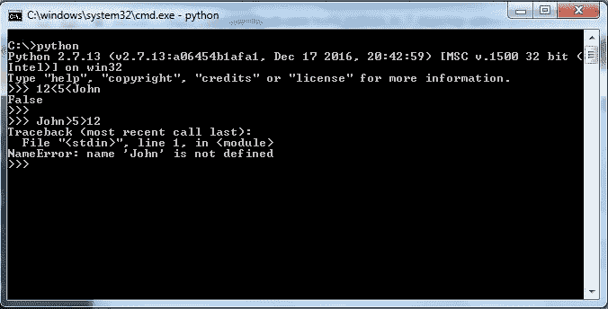

# 类型变量和运算符

在上一章中，你了解了一些关于 Python 的历史。你学习了安装 Python 的步骤和语言的一些基本语法。在基本语法中，你学习了代码中可以使用的注释类型、各种类型的引号、有用的转义序列，以及最后，你学习了字符串的格式化。在本章中，你将学习关于赋值语句、算术运算符、比较运算符、赋值运算符、位运算符、逻辑运算符、成员运算符和身份运算符。

# 变量

那么，什么是变量呢？考虑一下你的房子需要一个名字。你在房子的前门放置一个门牌。现在人们将通过这个门牌来识别你的房子。这个门牌可以被视为变量。就像门牌指向房子一样，变量指向存储在内存中的值。当你创建一个变量时，解释器会在内存中预留一些空间来存储值。根据变量的数据类型，解释器分配内存并决定在预留的内存中存储特定的数据类型。可以通过将不同的数据类型赋给变量来存储各种数据类型，例如整数、小数或字符。Python 变量通常是动态类型的，这意味着变量的类型是在运行时解释的，你不需要为变量名指定类型，这与其他编程语言的要求不同。变量命名有一定的规则或命名约定。以下是一些规则：

+   保留关键字，如`if`、`else`等，不能用于变量命名

+   变量名可以以`_`、`$`或字母开头

+   变量名可以是小写和大写

+   变量名不能以数字开头

+   变量命名不允许使用空白字符

你可以使用`=`或赋值运算符给变量赋值。

**语法：**

```py
<variable name>= < expression > 

```

# 单次赋值

在这里，我们将通过一个示例来展示赋值运算符（`=`）的使用：

```py
city='London' # A string variable assignment. 
money = 100.75 # A floating point number assignment  
count=4 #An integer assignment 

```

在这种情况下，我们使用`=`运算符将三个不同的值赋给了三个变量。

# 多次赋值

可以同时将一个值赋给多个变量。例如：

```py
a = b = c = 1 

```

# Python 中的数据类型

任何编程语言中的数据类型是什么？让我们用一个现实生活中的问题来尝试理解。我们在日常生活中使用水、油、液体肥皂、糖浆等等。你是如何对这些物品进行分类的？让我们再举一些例子，比如条状肥皂、手机等等；你希望对这些物品进行什么分类？所有这些问题的答案都很简单：固体、液体和气体。是的，我们对任何我们听说过或在我们日常生活中使用过的物品都有这三个更广泛的分类。在编程世界中也是如此。每一件事都需要被归类到不同的类型中。有许多类型的数据，如数字、字符串、字符、图像等等。

数据类型可以大致分为五种不同类型，如下所示：

+   数字

+   字符串

+   元组

+   列表

+   字典

# 数值数据类型或数字

Python 中通常有四种数值数据类型。它们是整数、长整数、浮点数和复数。

# 整数和长整数

整数包括零，所有的正整数，以及所有的负整数。解释器首先检查赋值运算符右侧的表达式，然后将值与其变量名绑定；这个过程被称为变量定义或初始化。`int`或整数数据类型范围从-2³¹到(2³¹-1)；前面的负号表示负值。超出这些范围，解释器会在数字后添加`L`来表示长整数，如下面的截图所示：


# 浮点数

在编程语言中，小数点后有特定位置的数字被称为浮点数：

+   浮点数类型大约从-10 到 10^(³⁰⁸)的范围，有 16 位精度。

+   有两种方式可以写浮点数。它可以使用普通的十进制表示法或科学记数法来写。科学记数法通常用于表示非常大的数字，如下面的截图所示：


# 复数

复数既有实部又有虚部，Python 允许你以非常简单和方便的方式指定这种数据类型。

**语法：**

```py
<variable name>=complex(x,y) 

```

或者

```py
<variable name>=x+yj 

```

在这里，`x`是实部，`y`是虚部。在这里，`j`扮演虚数单位的作用。

如下截图将更加清晰：


在这里，我们声明两个变量来表示复数。一种实现方式是使用`complex()`方法，另一种方式是使用数学中常用的标准符号。

在标准的复数表示法中，*x+ij*，*i*用来表示虚部的开始，代表虚数单位。*j*表示虚部。复数概念的提出归功于意大利数学家杰罗拉莫·卡尔达诺在 1545 年。

来源：[`en.wikipedia.org/wiki/Complex_number`](https://en.wikipedia.org/wiki/Complex_number)

# 布尔数据类型

布尔数据类型通常只有两个值 `'True'` 或 `'False'`。布尔数据类型是整数类型的一个子类型。

**语法：**

```py
<variable name>=<'True' or 'False'> 

```

布尔数据类型可以被视为一个开/关开关，它只有两个可选值：


在前面的例子中，我们尝试比较`x`的值与`y`的值，当我们使用`==`运算符时，布尔值返回`True`。

# 字符串数据类型

Python 字符串是一系列连续的 Unicode 字符。可以使用单引号或双引号来表示字符串，正如我们在第一章，“Python 入门”中看到的。对于多行字符串表示，可以使用`'''`或`"""`。

**语法：**

```py
<variable name>= <String sequence> 

```

以下截图可以帮助你更好地理解：


关于字符串、元组、列表和字典的更多细节将在接下来的章节中介绍。

# 美国信息交换标准代码（ASCII）字符集

下表显示了前 128 个 ASCII 码与字符值的映射。左列数字是 ASCII 码的最左位数字。顶行的数字代表最右位数字。例如，字符*A*的 ASCII 码是*65*。

|  | 0 | 1 | 2 | 3 | 4 | 5 | 6 | 7 | 8 | 9 |
| --- | --- | --- | --- | --- | --- | --- | --- | --- | --- | --- |
| 0 | NUL | SOH | STX | ETX | EOT | ENQ | ACK | BEL | BS | HT |
| 1 | LF | VT | FF | CR | SO | SI | DLE | DCI | DC2 | DC3 |
| 2 | DC4 | NAK | SYN | ETB | CAN | EM | SUB | ESC | FS | GS |
| 3 | RS | US | SP | ! | " | # | $ | % | & | ` |
| 4 | ( | ) | * | + | , | - | . | / | 0 | 1 |
| 5 | 2 | 3 | 4 | 5 | 6 | 7 | 8 | 9 | : | ; |
| 6 | < | = | > | ? | @ | A | B | C | D | E |
| 7 | F | G | H | I | J | K | L | M | N | O |
| 8 | P | Q | R | S | T | U | V | W | X | Y |
| 9 | Z | [ |  | ] | ^ | _ | ' | a | b | c |
| 10 | d | e | f | g | h | i | j | k | l | m |
| 11 | n | o | p | q | r | s | t | u | v | w |
| 12 | x | y | z | { | &#124; | } | ~ | DEL |  |  |

ASCII 主要是为了电报代码而开发的。贝尔实验室推出了 7 位电传打字机代码以进行商业推广，ASCII 代码的官方工作始于 1960 年 10 月 6 日。

来源：[`en.wikipedia.org/wiki/ASCII`](https://en.wikipedia.org/wiki/ASCII)

# 转换函数

为了将字符值转换为 ASCII 码，使用`ord()`函数，而将 ASCII 码转换为字符，则使用`chr()`函数，如下面的截图所示：


在这里，当我们想要获取字符`'A'`的 ASCII 码时，它显示为`65`，你可以很容易地从上述表中得到。字母`'A'`位于第六行第五列；因此，它的值是`65`。同样，我们可以获取与特定 ASCII 码对应的字母。

# 算术表达式

任何语言的算术表达式都由操作数和运算符组成。为了参考，使用 *x* 和 *y* 作为具有值 *10* 和 *20* 的操作数。以下表格显示了优先级顺序：

| **运算符** | **描述** |
| --- | --- |
| `**` | **指数**: 在运算符上执行指数（幂）计算 |
| `*` | **乘法**: 乘以运算符两边的值 |
| `/` | **除法**: 将左操作数除以右操作数 |
| `%` | **取模**: 将左操作数除以右操作数并返回余数 |
| `+` | **加法**: 在运算符两边添加值 |
| `-` | **减法**: 从左操作数减去右操作数 |

在算术表达式中，通常遵循**括号、乘除、加减**（**BODMAS**）的规则，并且运算符有自己的优先级顺序。指数具有更高的优先级，而加法和减法具有较低的优先级。

递减的优先级顺序如下：

+   指数

+   一元取反

+   乘法、除法、取模

+   加法、减法

如果操作数的数据类型相同，则结果值也是该类型。然而，两个 `int` 数据类型的加法可以产生一个 `long` 整数。

# 混合模式算术

涉及整数和浮点数的算术运算称为**混合模式算术**。当每个操作数的数据类型不同时，结果值是更通用的类型，而 `float` 是更通用的类型。

以下截图将使您更清楚：


# 混合模式转换

在前面的例子 `11/2.0` 中，较不通用的类型整数 `11` 被临时自动转换为浮点数 `11.0`。然后执行计算。这被称为**混合模式转换**。

# 类型转换

使用类型转换函数很容易转换操作数的数据类型。让我们通过一些例子来理解：


在前面的截图中，`4.77` 被转换为 `4`。为了将 `4.77` 转换为 `int` 数据类型，使用了 `int()` 函数。同样，如果您想转换为 `float`，请使用 `float()` 函数。

# 运算符

Python 支持以下类型的运算符：

+   算术运算符。

+   比较运算符

+   赋值运算符

+   位运算符

+   逻辑运算符

+   成员运算符

+   标识运算符

# 算术运算符

算术表达式由操作数和运算符组成：

| **运算符** | **描述** |
| --- | --- |
| `**` | **指数**: 在操作数上执行指数（幂）计算 |
| `*` | **乘法**: 在操作数之间执行乘法 |
| `/` | **除法**: 在操作数之间执行除法 |
| `%` | **取模**: 在操作数之间执行取模除法 |
| `+` | **加法**: 在操作数之间执行加法 |
| `-` | **减法**：在操作数之间执行减法 |

我们已经讨论了运算符的优先级顺序。

# 比较运算符

与任何其他语言一样，Python 也支持比较运算符。比较运算符返回 `True` 或 `False`：

| **运算符** | **描述** |
| --- | --- |
| `==` | 检查相等性 |
| `<` | 如果左侧操作数小于右侧操作数，则返回 `True` |
| `>` | 如果左侧操作数大于右侧操作数，则返回 `True` |
| `<=` | 如果左侧操作数小于或等于右侧操作数，则返回 `True` |
| `>=` | 如果左侧操作数大于或等于右侧操作数，则返回 `True` |
| `!=` | 如果左侧操作数不等于右侧操作数，则返回 `True` |
| `<>` | 如果左侧操作数不等于右侧操作数，则返回 `True` |

以下截图显示了比较运算符的一些示例及其结果：


让我们评估以下表达式：

```py
a < b < = c is equivalent to a<b and b<=c 

```

在这里，使用了 `and` 运算符，`b` 只被评估一次，如果发现 `a < b` 为 `False`，则 `c` 不会被评估：



在前面的例子中，`12<5` 首先被评估；如果它是 `False`，则下一个表达式将不会评估。如果操作数是不同类型，则它们将被转换为共同类型。否则，`==` 和 `!=` 运算符始终认为不同类型的对象是不相等的。

让我们看看两个不同的场景，其中我们尝试用 `int` 数据类型评估 `float` 数据类型，如下所示：


在这两种情况下，运算符都评估为 `True`，因为解释器将一种数据类型转换为另一种数据类型，然后比较两个值。

不同数据类型之间的比较：

+   数字按算术方式比较

+   字符串按字母顺序比较，使用数字等效值

+   元组与列表根据对应元素的比较进行字母顺序比较，我们将在接下来的章节中看到

# 赋值运算符的变体

在本章早些时候，你学习了赋值运算符 `=`。现在，我们将看到一些赋值运算符的变体，这些变体通常与算术运算符一起使用：

| **运算符** | **描述** |
| --- | --- |
| `=` | `x=y` ，`y` 被赋值给 `x` |
| `+=` | `x+=y` 等价于 `x=x+y` |
| `-=` | `x-=y` 等价于 `x=x-y` |
| `*=` | `x*=y` 等价于 `x=x*y` |
| `/=` | `x/=y` 等价于 `x=x/y` |
| `**=` | `x**=y` 等价于 `x=x**y` |

在这里，我们将查看赋值运算符变体的几个示例：


# 位运算符

Python 支持位运算。你可能已经遇到过 *AND*、*OR* 或补码运算：

| **运算符** | **描述** |
| --- | --- |
| ` | ` | 执行二进制 *OR* 运算 |
| `&` | 执行二进制 *AND* 操作 |
| `~` | 执行二进制 *XOR* 操作 |
| `^` | 执行二进制一位补码操作 |
| `<<` | **左移运算符**：将左侧操作数的位向左移动右侧指定的位数 |
| `>>` | **右移运算符**：将左侧操作数的位向右移动右侧指定的位数 |

以下截图展示了位运算符的各种用法：


`~x` 将给出 `-241`，这是由于有符号二进制数的 *2's complement* 形式。

# 逻辑运算符

Python 支持逻辑运算符 *AND*、*OR* 和 *NOT*：

| **运算符** | **描述** |
| --- | --- |
| `and` | 如果运算符的左右两侧都为真，则返回 `True` |
| `or` | 如果运算符的任一侧（右侧或左侧）为真，则返回 `True` |
| `not` | 如果 `not` 运算符中的条件为 `True`，则 `not` 运算符将其变为 `False` |

这些运算符仅在需要其结果时才评估它们的第二个参数，如下面的截图所示：


# 成员运算符

Python 有两个成员运算符用于测试序列中的成员资格，例如字符串、列表、元组等：

| **运算符** | **描述** |
| --- | --- |
| `in` | 如果指定的操作数在序列中找到，则返回 `True` |
| `not in` | 如果指定的操作数不在序列中，则返回 `True` |

以下截图将使情况更清晰：


在前面的截图中，我们尝试在字符串 `'John'` 中搜索字符 `'o'`，并返回 `True`。然而，`'k'` 不在字符串中，因此返回 `False`。

# 身份运算符

表格中给出了两个身份运算符：

| **运算符** | **描述** |
| --- | --- |
| `is` | 如果两个变量指向同一对象，则返回 `True`，否则返回 `False` |
| `is not` | 如果两个变量指向同一对象，则返回 `False`，否则返回 `True` |

以下截图显示值可以相同，但 `id` 可以不同。如果 `id` 相同，则返回 `True`：


在这里，由于 `x` 和 `y` 包含相同的值（`10`），`id()` 对两者都返回相同的值。然而，当 `x` 和 `y` 被提供相同的列表时，`id()` 返回不同的值。这可以归因于当 `x` 和 `y` 被赋予 `10` 时，实际上意味着两者都指向相同的内存地址，该地址的值为 `10`，而在列表的情况下，这可能是不同的。为什么不同？这是因为列表是不可变的，这意味着它们不能被更改。因此，当我们将相同的列表赋给 `y` 时，这意味着为新的列表再次分配了一个新的内存地址。

`id()` 函数返回对象的 *标识*。这是一个整数（或长整数），在对象的整个生命周期内保证是唯一且恒定的。它类似于 C 语言中的内存地址。

然而，我们的 `id()` 函数有一个小转折。Python 只支持整数到 `256` 的相同内存分配。以下截图将更清晰：


这里，正如你所看到的，一旦我们为 `x` 和 `y` 传递超过 `256` 的值，解释器会为它们分配不同的内存空间，但如果值是 `256`，那么 `x` 和 `y` 将会得到相同的内存分配。

# 运算符优先级

优先级最高的运算符放在顶部：

| **运算符** | **描述** |
| --- | --- |
| `( )` | 括号 |
| `x[index]`,`x[index1:index2]`,`f(arg...)`,`x.attribute` | 订阅，切片，调用，和属性引用 |
| `**` | 幂运算 |
| `+x`, `-x`, `~x` | 正数，负数和位运算 *NOT* |
| `*`, `/`, `%` | 乘法，除法和余数 |
| `+`, `-` | 加法和减法 |
| `<<`, `>>` | 移位 |
| `&` | 位运算 *AND* |
| `^` | 位运算 *XOR* |
| `&#124;` | 位运算 *OR* |
| `in`, `not in`, `is`, `is not`, `<`, `<=`, `>`, `>=`, `!=`, `==` | 比较运算符，包括成员测试和身份测试 |
| `not x` | 布尔 *NOT* |
| `and` | 布尔 *AND* |
| `or` | 布尔 *OR* |
| `if...else` | 条件表达式 |
| `lambda` | Lambda 表达式 |

具有相同优先级的运算符从左到右进行评估，除了比较和指数运算。比较可以任意链式使用。

# 摘要

在本章中，你学习了 Python 中可用的各种数据类型和所需的命名约定。你还学习了 Python 字符集以及如何使用语言中可用的 `ord()` 和 `chr()` 方法将字符集转换为 ASCII 码以及相反操作。在下一章中，你将学习两种不同的数据类型，即字符串和元组。
