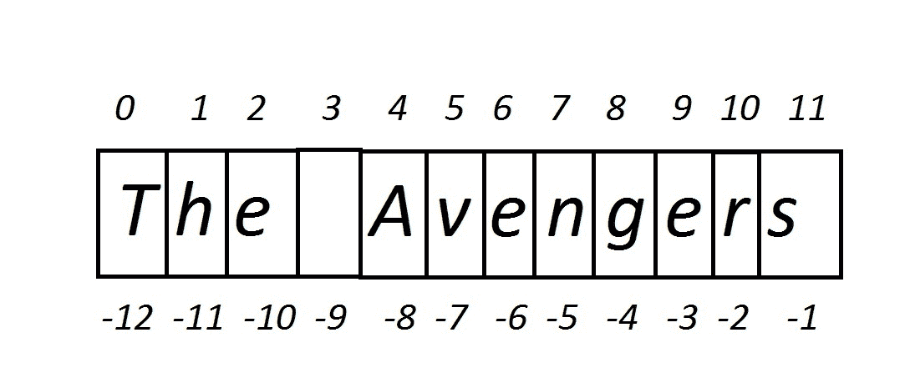
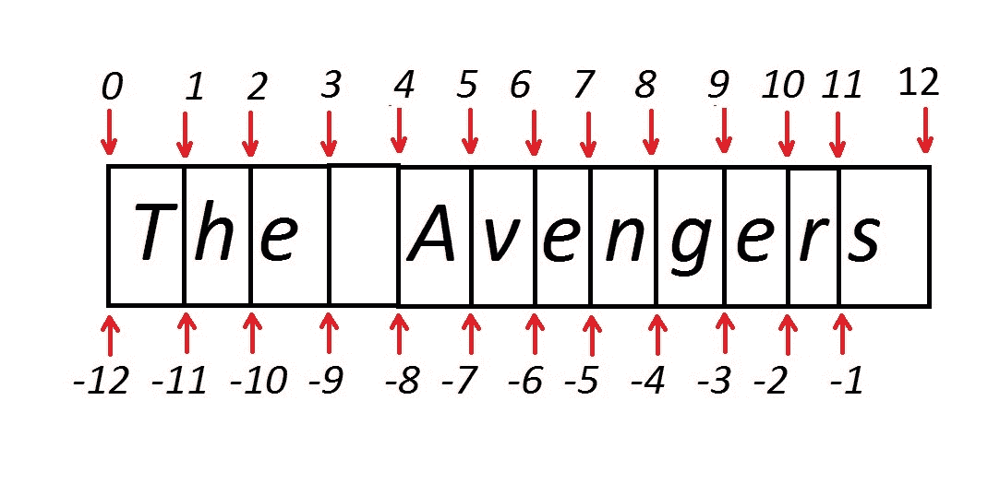
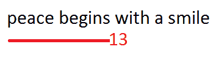
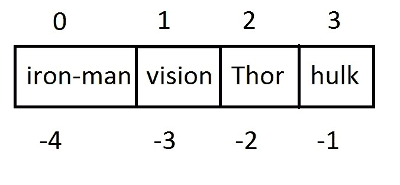
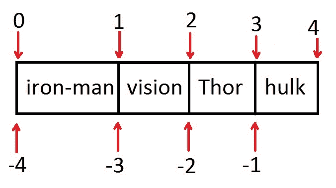

# 字符串

在本章中，你将学习 Python 字符串和元组。你将学习如何使用字符串、字符串切片、字符串方法和有用的函数。你将学习什么是不可变序列。在元组部分，你将看到如何使用 Python 元组。

# Python 字符串

Python 字符串是一个序列，由零个或多个字符组成。字符串是一个不可变的数据结构，这意味着它们不能被更改。例如，如果你定义字符串`str1 = "Satyamev jayate"`，那么`str1`将始终是`"Satyamev jayate"`。你不能编辑`str1`变量的值。尽管你可以重新分配`str1`，但让我们通过示例来讨论这一点：

```py
>>> str1 = "satyamev jayate"
>>> str1
'satyamev jayate'
>>> id(str1)
47173288

```

在前面的示例中，字符串`"satyamev jayate"`已被分配给变量`str1`。通过使用 ID 函数，我们获得了内存地址。现在，按照以下方式重新分配`str1`变量：

```py
>>> str1 = "Leapx"
>>> id(str1)
44909408
>>> 

```

你可以看到，`str1`变量的内存地址已经改变。但内存地址`47173288`处的字符串值不会改变。如果值没有被任何变量引用，Python 内存管理可能会删除该值。如果值存在于内存地址中，那么你可以使用`ctypes`模块来获取该值，如下所示：

```py
>>> import ctypes
>>> ctypes.cast(47173288, ctypes.py_object).value
'satyamev jayate'
>>> 

```

为了找到字符串的长度，可以使用`len()`函数，如下面的示例所示：

```py
>>> a = "hello jarvis"
>>> len(a)
12
>>> b= ""
>>> len(b)
0
>>> 

```

有时，你可能想访问字符串中特定位置的特定字符。下标运算符使得这一点成为可能。

# 下标运算符

下标运算符定义为方括号`[]`。它用于访问字符串、列表、元组等元素。让我们通过一个例子来讨论其语法：

```py
<given string>[<index>]

```

`给定字符串`是你想要检查的字符串，`索引`是你想要获取的字符的位置。让我们通过一个例子来讨论这个问题：

```py
>>> name = "The Avengers"
>>> name[0]
'T'
>>> len(name)
12
>>> name[11]
's'
>>> 
>>> name[12]
 Traceback (most recent call last):
  File "<pyshell#6>", line 1, in <module>
    name[12]
IndexError: string index out of range
>>> 

```

`"The Avengers"`字符串长度为 12 个字符，这意味着它的索引范围从 0 到 11。`name[0]`表示字符`'T'`。如果你给出第 12 个索引值，那么 Python 解释器会生成一个越界错误。

让我们看看什么是负索引：

```py
>>> name[-1]
's'
>>> name[-12]
'T'
>>> 

```

`-1`索引表示最后一个字符，`-12`表示第一个字符。

在计算机世界中，计算机从 0 开始计数索引。

以下图表将消除你所有的疑惑：



正负索引

# 子字符串切片

在许多情况下，你可能需要字符串的特定部分，例如字符串的前三个字符。Python 的下标运算符使用切片。在切片中，冒号`:`被使用。整数值将出现在冒号的两侧。参考以下示例：

```py
>>> 
>>> name[0:3]
'The'
>>> name[:6]
'The Av'
>>> name[4:]
'Avengers'
>>> name[5:9]
'veng'
>>>

>>> name[::2]
'TeAegr'
>>> 

```

参考以下图表以消除你剩余的疑惑：



字符串正负切片

如果你想要打印给定字符串`str1`的逆序，那么使用`str1[::-1]`

要找到字符串的长度，你可以使用`len()`函数：

```py
>>> len(name)
12
>>> 

```

现在，让我们看看一些有用的字符串方法。

# Python 字符串方法

有几种字符串方法，我们将逐一讨论。为了表示字符串，我们使用`str1`变量。

有时候，我们想要计算给定字符串中的字符或子字符串的数量。字符串方法`count`有助于实现这一点：

```py
count()

```

该方法的语法如下：

```py
str1.count(substr [, start [, end]])

```

`count`方法返回子字符串`substr`在字符串`str1`中出现的次数。通过使用参数`start`和`end`，你可以获取`str1`的切片。

考虑以下例子：

```py
>>> str1 = 'The Avengers'
>>> str1.count("e")
3
>>> str1.count("e",5,12)
2
>>> 

```

在许多情况下，我们需要在给定的字符串中找到子字符串的索引。`find()`方法可以完成这个任务。

`find()`方法的语法如下：

```py
str.find(str, beg=0 end=len(string))

```

`find()`方法用于确定一个字符串是否出现在给定的字符串或其子字符串中。

```py
>>> str1 = "peace begins with a smile"
>>> str1.find("with")
13
>>> 

```

所以`13`是子字符串`"with"`的索引值，如上图所示：



显示子字符串的索引值

让我们讨论`find`方法的另一个例子：

```py
>>> str1 = "what we think, we become"
>>> str1.find("we")
5
>>> 

```

在前面的例子中，子字符串`"we"`出现了两次，但`find`方法只会给出第一次出现的索引。如果你想从右侧查找出现，可以使用`rfind`方法。让我们通过例子来学习：

```py
> str1 = "what we think, we become"
>> str1.rfind("we")
15
>>> 

```

有时候，用户想要找到子字符串的索引，但不确定大小写。子字符串可能以小写、大写或标题形式出现。Python 为你提供了一些处理大小写的方法。

# 字符串大小写方法

让我们逐一看看，首先是`lower()`方法。

`lower()`方法的语法如下：

```py
str1.lower()

```

`lower()`方法返回一个字符串，其中所有基于案例的字符都显示为小写。让我们看一个例子：

```py
>>> name = "Mohit RAJ1234"
>>> name.lower()
'mohit raj1234'
>>> name
'Mohit RAJ1234'
>>> 

```

你可以看到基于案例的字符会被转换为小写；正如我们所知，字符串是不可变的，原始字符串保持不变。如果你喜欢大写，可以使用`upper()`方法。

`upper()`方法的语法如下：

```py
str1.upper()

```

`upper`方法返回一个字符串副本，其中包含所有大写字符。考虑以下例子：

```py
>>> name = "Hello jarvis"
>>> name.upper()
'HELLO JARVIS'
>>> name
'Hello jarvis'
>>> 

```

有时候，我们需要将行首的第一个字符大写。在这种情况下，`capitalize()`方法允许你这样做。

该方法的语法如下：

```py
str1.capitalize()

```

此方法将返回字符串的首字母大写：

```py
>>> name = "the game"
>>> name.capitalize()
'The game'
>>> 

```

如果你想要将字符串中每个单词的首字母转换为大写，可以使用`title()`方法：

该方法的语法如下：

```py
str1.title()

```

`title()`方法返回一个字符串副本，其中每个单词的首字母都被大写：

```py
>>> name = 'genesis of a new realm of possibility.'
>>> name.title()
'Genesis Of A New Realm Of Possibility.'
>>> name
'genesis of a new realm of possibility.'
>>> 

```

`swapcase`方法允许用户交换大小写：

```py
swapcase()

```

其语法如下：

```py
str.swapcase()

```

它返回一个字符串副本，其中大小写被交换。

考虑以下例子：

```py
>>> name = 'Genesis Of A New Realm Of Possibility.'
>>> name.swapcase()
'gENESIS oF a nEW rEALM oF pOSSIBILITY.'
>>>
>>> name
'Genesis Of A New Realm Of Possibility.'
>>> 

```

# 字符串去除方法

处理字符串时，程序员经常遇到字符串末尾或开头出现不想要的字符/字符的问题，例如末尾的空格或换行符，例如 `" Baba saheb "` 和 `"Dr Ambedkar n"`。

为了处理这些问题，Python 字符串类预加载了三个方法。我们将逐一讨论它们。让我们从 `rstrip()` 开始。

该方法的语法如下：

```py
str1.rstrip([chars])

```

此方法返回一个字符串 `str1` 的副本，其中从字符串右侧移除了不需要的字符/字符。

考虑以下示例：

```py
>>> str1 = "Dr Ambedkarn"
>>> str1.rstrip("n")
'Dr Ambedkar'

```

如果你没有提供任何 *chars* 作为参数，那么默认使用空格。看看以下示例：

```py
>>> str2 =  " Baba Saheb "
>>> str2.rstrip()
' Baba Saheb'
>>> 

```

如果你想要从左侧去除，使用 `lstrip()` 方法。如果你想要从两侧去除，使用 `strip()` 方法。

考虑以下示例：

```py
>>> str2
' Baba Saheb '
>>> str2.strip()
'Baba Saheb'
>>> 

```

# 字符串分割方法

有时我们看到的字符串形式为部分，例如 `"27-12-2016"` 和 `"Mohit raj"`。我们的要求是获取最后一部分或第一部分。因此，基于分隔符，我们可以将字符串分割成部分并获取所需的部分。让我们了解它是如何工作的；从第一个字符串中，我们只需要年份部分。

我们有一个有趣的方法叫做 `split()`。

该方法的语法如下：

```py
Str1.split(“delimiter”, num)

```

让我们看看一个示例：

```py
>>> str1.split("-", 1)
['27', '12-2016']
>>> 

```

`split` 方法返回一个列表，其中包含所有由分隔符分隔的字符串单词，`num` 整数指定最大分割次数。如果 `num` 未指定，则进行所有可能的分割。参看以下示例：

```py
>>> str1 = "27-12-2016"
>>> str1.split("-")
['27', '12', '2016']
>>> 

```

到目前为止，我们还没有学习列表，我们将在稍后讨论。但使用此方法，我们可以访问列表的特定值：

```py
>>> list1 = str1.split("-")
>>> list1[2]
'2016'
>>> 

```

如果你没有提供任何分隔符，那么默认使用空格，如下所示：

```py
>>> name = "Mohit raj"
>>> name.split()
['Mohit', 'raj']
>>> 

```

如果你希望分割从右侧开始，那么你可以使用 `rsplit()` 方法，如下面的示例所示：

```py
>>> str1 = "27-12-2016"
>>> str1.rsplit("-", 1)
['27-12', '2016']
>>> 

```

希望你已经理解了分割的概念[.]。

# 字符串对齐方法

处理这些类型场景的方法。

在许多情况下，你可能需要调整字符串的长度。要求可能是字符串，它必须具有特定的长度。我们有四种字符串方法来处理这些类型的场景。让我们从 `ljust()` 开始，它的意思是左对齐。

该方法的语法如下：

```py
str1.ljust(width[, fillchar])

```

当你将字符串提供给 `ljust()` 方法时，它返回左对齐的字符串。最小字符串长度由宽度指定，左侧的填充由 `fillchar` 字符指定，默认为空格。

考虑以下示例：

```py
>>> str1= "Mohit Raj"
>>> str1.ljust(15, "#")
'Mohit Raj######'
>>> 
>>> str2= "Bhaskar Narayan Das"
>>> str2.ljust(15, "#")
'Bhaskar Narayan Das'
>>> 

```

在前面的示例中，`str2` 的长度大于 `15`。因此没有进行填充，这意味着没有使用 `fillchars`。让我们看看 `rjust` 的示例，它执行相同的功能，但只是从右侧对齐长度：

```py
>>> str1= "Mohit Raj"
>>> str1.rjust(15, "#")
'######Mohit Raj'
>>> 

```

考虑你想从两侧对齐字符串的情况。在这种情况下，我们将使用 `center()` 方法。

让我们看看 `center()` 的一个示例：

```py
>>> str1= "Mohit Raj"
>>> str1.center(16, "#")
'###Mohit Raj####'
>>> 

```

有时当你处理诸如银行账户号码、二进制数字等字符串时，你可能需要用零来调整字符串。虽然我们可以使用 `ljust` 方法来做这件事，但 Python 提供了一个名为 `zfill()` 的特殊方法。

该方法的语法如下：

```py
str.zfill(width) 

```

这种方法通过在左侧用零填充字符串来调整字符串的宽度。

考虑以下示例：

```py
>>> acc_no =  "3214567987"
>>> acc_no.zfill(15)
'000003214567987'
>>> 
>>> binary_num = "10101010"
>>> binary_num.zfill(16)
'0000000010101010'
>>> 

```

许多时候我们处理的情况可能需要从一行中替换一个单词或从字符串中替换一个子字符串。Python 的 `replace()` 字符串方法可以完成这项任务。

**replace()**

该方法的语法如下：

```py
str.replace(old, new max)

```

此方法返回一个字符串副本，其中旧字符被新字符替换。`max` 参数指定替换次数。如果没有指定数字，则表示替换所有出现。

考虑以下示例：

```py
>>> str1 = "time is great and time is money"
>>> str1.replace("is","was")
'time was great and time was money'
>>>
>>> str1
'time is great and time is money'
>>> str1.replace("is",1)
>>> str1.replace("is","was",1)
'time was great and time is money'
>>>

```

考虑你有一个字符串序列（列表或元组）并想要连接序列的值。

考虑序列 `["Mohit","raj"]`，你想要将其变为 `"Mohit raj"` 或 `"Mohit-raj"`。

为了处理这类情况，可以使用 `join` 方法：

```py
join()

```

该方法的语法如下：

```py
str1.join(seq)

```

`seq` 包含分隔的字符串序列；在这里，`str1` 作为分隔符。让我们看看 `join()` 的不同示例：

1.  使用空格作为分隔符：

```py
>>> name = ["Mohit","raj"]
>>> " ".join(name)
'Mohit raj'
>>> 

```

1.  不使用分隔符：

```py
>>> "".join(name)
'Mohitraj'
>>> 

```

1.  分隔符为一个连字符 `-`：

```py
>>> "-".join(name)
'Mohit-raj'
>>>  

```

你可以用不同的分隔符尝试。

# 字符串布尔方法

让我们讨论一些字符串方法，这些方法根据某些条件返回 `True` 或 `False` 的值。有时我们可能对以特定子字符串结尾的字符串感兴趣。为此，我们使用字符串方法 `endswith()`。

该方法的语法如下：

```py
str1.endswith(sub-string, begin,end)

```

如果字符串 `str1` 以指定的子字符串结尾，则该方法返回 `True`。`begin` 和 `end` 参数代表字符串 `str1` 的切片：

考虑以下示例：

```py
>>> str1 = "Life should be great rather than long"
>>> str1.endswith("ng")
True
>>> 
>>> str1.endswith("er")
False
>>> str1.endswith("er",0,27)
True
>>> 

```

下一个方法是 `startswith()`，它的工作方式与上一个方法相同，只是检查条件从开始处开始。

让我们通过一个例子来理解：

```py
>>> str1.startswith("Li")
True
>>> str1.startswith("be", 11)
False
>>> str1.startswith("be", 12, 16)
True
>>> 

```

假设你可能想要确保给定的字符串必须只包含字母。`isalpha()` 方法可以帮助你做到这一点。

语法如下：

```py
Str1.isalpha()

```

该方法仅在字符串 `str1` 只包含字母时返回 `True`。

考虑以下示例：

```py
>>> str1 = "Hello"
>>> str1.isalpha()
True
>>> str2 = "Hello 123"
>>> str2.isalpha()
False
>>> str3 = "hello "
>>> str2.isalpha()
False
>>> 

```

即使空格也不允许。

如果你想要检查字符串中出现的字母数字字符，则可以使用 `isalnum()` 方法。如果字符串只包含字母数字字符，则该方法返回 `True`。

考虑以下示例：

```py
>>> str1 = "Hello123"
>>> str1.isalnum()
True
>>> str2 = "Hello123#"
>>> str2.isalnum()
False
>>> 

```

如果你只想检查数字，则可以使用 `isdigit()` 方法。

语法如下：

```py
str.isdigit()

```

此方法如果字符串只包含数字则返回 `True`。

考虑以下示例：

```py
>>> str1 = "12345"
>>> str1.isdigit()
True
>>> 
>>> str2 = "123456H"
>>> str2.isdigit()
False

```

为了处理只有空白的情况，Python 字符串提供了一个名为 `isspace()` 的方法，如果字符串只包含空格，则返回 `True`：

```py
isspace()

```

语法如下：

```py
str.isspace()

```

考虑以下示例：

```py
>>> str1 = "hello "
>>> str1.isspace()
False
>>> str2 = " "
>>> str2.isspace()
True
>>> 

```

让我们看看处理大小写的函数：

```py
istitle()

```

语法如下：

```py
str.istitle() 

```

`istitle()`方法如果字符串是标题格式，则返回`True`。以下示例显示了剩余的故事：

```py
>>> str1 = "Mohit raj"
>>> str1.istitle()
False
>>> str2 = "Mohit Raj"
>>> str2.istitle()
True
>>> 

```

为了检查小写，我们可以使用`islower()`方法。

该方法的语法如下：

```py
str.islower()

```

此方法如果字符串包含所有小写字符则返回`True`：

```py
>>> str1 = "mohit"
>>> str1.islower()
True
>>> 
>>> str1 = "Mohit"
>>> str1.islower()
False
>>> str2 = "mohit1234"
>>> str2.islower()
True
>>> str3 = "!@mohit"
>>> str3.islower()
True
>>> 

```

`islower()`方法不考虑特殊字符和数字。

同样，为了检查大写，你可以使用`isupper()`：

```py
isupper()

```

语法如下：

```py
str.isupper()

```

此方法如果字符串只包含大写字符则返回`True`：

```py
>>> str1 = "MOHIT"
>>> str1.isupper()
True
>>> str2 = "MOHIT123#$"
>>> str2.isupper()
True
>>> str3 = "mOHIT"
>>> str3.isupper()
False
>>> 

```

# 字符串函数

到目前为止，你已经看到了字符串方法。让我们看看序列的内置函数以及当字符串作为参数传递时它们会返回什么值。在章节的开头，我们已经讨论了`len()`函数。

考虑你需要根据 ASCII 值从给定字符串中找到最小字符。为了处理这种情况，你可以使用`min()`函数：

```py
min()

```

语法如下：

```py
min(str1)

```

`min()`函数根据 ASCII 值从字符串`str1`中返回最小字符：

```py
>>> str1 = "Life should be great rather than long"
>>> min(str1)
' '
>>> str2 = "hello!"
>>> min(str2)
'!'
>>> 

```

下一个方法是`max()`，它根据 ASCII 值从字符串`str`中返回最大字符。让我们看看一些示例：

```py
>>> str1 = "Life should be great rather than long"
>>> max(str1)
'u'
>>> str2 = "hello!"
>>> max(str2)
'o'
>>> 

```

在许多情况下，我们可能需要将整数或浮点数转换为字符串。为了进行这种转换，我们使用`str()`函数。

语法如下：

```py
str(value)

```

此函数将参数值转换为字符串类型。参数值可以是任何类型。

考虑以下示例：

```py
>>> a = 123
>>> type(a)
<type 'int'>
>>> str(a)
'123'
>>> list1 = [1,2]
>>> type(list1)
<type 'list'>
>>> str(list1)
'[1, 2]'

```

为了在字符串中查找子字符串，你可以使用`in`运算符。`in`运算符与 if 语句一起使用，如下面的示例所示：

```py
>>> str1 = "Life should be great rather than long"
>>> if "be" in str1:
            print "yes"

yes
>>> 

```

你已经对 Python 字符串有了足够的了解。现在我们继续学习我们的下一个不可变数据结构。

# 元组

Python 元组是一个序列，可以存储异构数据类型，如整数、浮点数、字符串、列表和字典。像字符串一样，元组是不可变的。

# 创建空元组

```py
<variable –name > = ()
Tup1 = ()

```

空元组写作两个空括号，其中不包含任何内容。

# 使用元素创建元组

要创建一个元组，用逗号分隔的值填充元组：

```py
tup1 = (1,2,3,4.6, "hello", "a")

```

如果你定义变量如下：

```py
a = 1,2,3

```

变量 a 将是一个元组：

```py
>>> tup1 = 1,2,3,4
>>> tup1
(1, 2, 3, 4)
>>> 
>>> type(tup1)
<type 'tuple'>
>>>

```

# 元组索引

为了访问元组的特定值，指定一个位置数字，用括号括起来。让我们用一个例子来讨论。我将制作一个包含电影《复仇者联盟》中英雄的元组。

```py
>>> Avengers = ("iron-man", "vision", "Thor", "hulk")
>>> Avengers[0]
'iron-man'
>>> Avengers[2]
'Thor'
>>> 
>>> Avengers[-1]
'hulk'
>>> 

```

以下图表将消除疑虑：



元组索引

现在你可以看到正负索引。

# 元组的切片

为了进行切片，使用带有索引或索引的方括号。

考虑以下示例：

```py
>>> Avengers[1:3]
('vision', 'Thor')
>>>

```

让我们用这张图来讨论：



元组的切片

```py
>>> Avengers[:3]
('iron-man', 'vision', 'Thor')

```

上述示例意味着我们需要从`0`开始到`3`：

```py
>>> Avengers[1:]
('vision', 'Thor', 'hulk')
>>> 

```

前面的例子意味着我们从`1`开始到最后一个索引。

如果你使用超出范围的切片索引，则返回空元组：

```py
 >>> Avengers[5:6]
()

```

对于负索引，使用以下代码：

```py
>>> Avengers[-3:-2]
('vision',)
>>> 

```

现在，让我们看看一些通用的函数，这些函数可以应用于元组。

# 解包元组项

在本节中，我们将学习如何解包元组变量。让我们通过例子来学习：

```py
>>> tup1 = (1,2,3)
>>> a,b,c = tup1
>>> a
1
>>> b
2
>>> c
3

```

在前面的例子中，元组的项已经被分别赋值给了`a`、`b`和`c`变量。

如果你使用的变量数量多于元组中的项数，会发生什么？让我们看更多的例子：

```py
>>> tup2 = (5,6)
>>> x,y,z = tup2

Traceback (most recent call last):
 File "<pyshell#11>", line 1, in <module>
 x,y,z = tup2
ValueError: need more than 2 values to unpack

```

因此，解释器抛出一个`ValueError`。

如果你使用的变量数量少于元组中的项数，会发生什么？让我们看更多的例子：

```py
>>> tup2 = (5,6)
>>> x,y,z = tup2

Traceback (most recent call last):
 File "<pyshell#11>", line 1, in <module>
 x,y,z = tup2
ValueError: need more than 2 values to unpack

```

因此，解释器再次显示一个不同描述的错误。

# 元组函数

如果你想知道元组的长度，则可以使用`len()`函数。

**len()**

该方法的语法如下：

```py
len(tuple) 

```

`len()`函数返回元组的长度，这意味着元组中元素的总数。

```py
>>> tup1 = ("C", "Python", "java","html")
>>> len(tup1)
4
>>> 

```

让我们看看如何在元组上使用`max()`函数。

**max()**

该方法的语法如下：

```py
max(tuple)

```

`max(tuple)`函数返回元组中具有最大值的元素。

你可能对最大值的含义感到怀疑。

让我们通过例子来理解：

```py
>>> t2 = (1,2,3,4,510)
>>> max(t2)
510

```

`max`函数返回最大整数值。

如果元组包含具有相同数值的 int 和 float，你能猜到返回哪个值吗？让我们通过这个例子来看：

```py
>>> t2 = (1,2,450.0,450)
>>> max(t2)
450.0
>>> 

```

如果你认为它返回一个浮点值，请看下一个例子：

```py
>>> t2 = (1,2,450,450.0)
>>> max(t2)
450
>>> 

```

`450`和`450.0`具有相同的数值。`max`函数返回元组中的第一个出现：

```py
>>> t3 = (800, "1")
>>> max(t3)
'1'
>>>

```

`max()`函数返回作为最大值的字符串。

让我们看看字符串比较的例子：

```py
>>> tup1 = ('aa', 'z', "az")
>>> max(tup1)
'z'
>>> 

```

最大值决策是基于第一个字符。所以，`'z'`被选为最大值。

让我们看看下一个例子：

```py
>>> tup2 = ('aa', 'z', "az", "za")
>>> max(tup2)
'za'
>>> 

```

你可以看到第二个和第四个字符串在第一个位置都有`'z'`字符；这是当决策是通过判断第二个字符来做出的时候。

**min()**

该方法的语法如下：

```py
min(tuple) 

```

`min(tuple)`函数返回元组中具有最小值的元素。

考虑以下例子：

```py
>>> tup1 = (1,2,3,4,"1")
>>> min(tup1)
1
>>> tup2 = ('aa', 'z', "az")
>>> min(tup2)
'aa'
>>> 

```

如果你想要将字符串或列表转换为元组，则可以使用`tuple()`函数。

考虑以下例子：

```py
>>> str1 = "mohit"
>>> tuple(str1)
('m', 'o', 'h', 'i', 't')
>>> 

```

你可以使用`del`关键字删除元组，如下面的例子所示：

```py
>>> tup1 = (1,2,3)
>>> tup1
(1, 2, 3)
>>> del tup1
>>> tup1

Traceback (most recent call last):
 File "<pyshell#25>", line 1, in <module>
 tup1
NameError: name 'tup1' is not defined
>>>

```

# 元组的操作

在本节中，你将看到加法和乘法。

通过使用`+`运算符，两个元组可以相加，如下所示：

```py
>>> avenger1 = ("Iron-man", "captain", "Thor")
>>> avenger2 = ("Vision", "Sam")
>>> avenger1 + avenger2
('Iron-man', 'captain', 'Thor', 'Vision', 'Sam')
>>> 

```

通过使用`*`运算符，你可以执行乘法：

```py
>>> language = ("Python","html")
>>> language*2
('Python', 'html', 'Python', 'html')
>>>

```

让我们检查乘法后的元组的内存地址：

```py
>>> a = language*2
>>> a
('Python', 'html', 'Python', 'html')
>>> id(a[0])
45826944
>>>
>>> id(a[2])
45826944
>>>
>>> id(a[1])
45828896
>>> id(a[3])
45828896
>>> 

```

现在，你可以看到第一行和第三行都拥有相同的内存位置。

# 练习

1.  从 URL `http://www.thapar.edu/index.php/about-us/mission` 获取域名（thapar.edu）。

1.  你有这个元组 `tup = ('www', 'thapar', 'edu','index', 'php','about-us','mission')`；现在你可以创建一个完整的 URL，例如这样 [www.thapar.edu/index.php/about-us/mission](http://www.thapar.edu/index.php/about-us/mission)

# 摘要

在本章中，你已经学习了字符串，如何定义字符串，字符串函数和字符串方法。字符串是不可变的，它们不能被更改。在元组部分，你已经看到了如何创建一个元组。像字符串一样，元组也是不可变的。不存在可以更改现有元组或字符串的方法。
