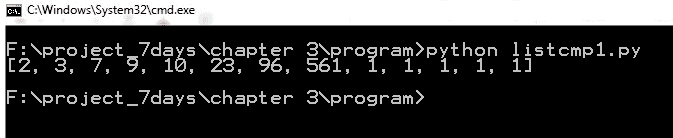
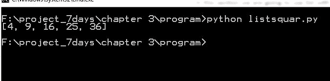
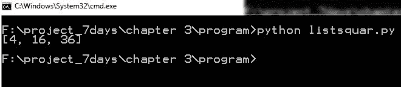

# 第四章：列表

在本章中，我们将介绍 Python 列表、列表函数和列表方法。

在现实生活中，我们经常制作列表，如日常待办事项列表、板球队伍的球员列表、婚礼的宾客名单、食物列表等等。

与元组一样，列表也是 Python 中可用的内置数据结构。它可以包含异构值，如整数、浮点数、字符串、元组、列表和字典。然而，Python 列表是可变的；是的，它们可以改变。

以下是一个 Python 列表的特性：

+   值是有序的

+   可变

+   列表可以存储任意数量的值

+   列表可以添加、删除和修改值

# 创建列表

让我们看看我们如何创建一个空列表：

```py
<Variable name > = []
List1 = []

```

# 使用值创建列表

列表包含逗号分隔的值。例如：

```py
Avengers = ['hulk', 'iron-man', 'Captain', 'Thor']

```

# 解包列表值

你可以使用赋值运算符将列表值分配给变量。让我们通过一个例子来讨论这个问题：

```py
>>> a,b = [1,2]

>>> a

1

>>> b

2

>>> 

```

你可以看到`1`被分配给了变量`a`，`2`被分配给了变量`b`。这被称为**解包**。当提供一个列表给更多变量时会发生什么？让我们看以下例子：

```py
>>> a,b = [1,2,3]
Traceback (most recent call last):

  File "<pyshell#7>", line 1, in <module>

    a,b = [1,2,3]

ValueError: too many values to unpack

```

错误表明还有更多的值需要解包。让我们看另一个例子：

```py
>>> a,b,c = [1,2]
Traceback (most recent call last):

  File "<pyshell#8>", line 1, in <module>

    a,b,c = [1,2]

ValueError: need more than 2 values to unpack

```

前面的错误表明应该有更多的列表值需要解包。

# 列表操作

在本节中，你将学习切片、访问、添加、删除和更新列表中的值。

# 访问列表值

为了访问列表值，使用方括号中的列表名称和位置索引。例如，考虑以下代码片段：

```py
>>> Avengers = ['hulk', 'iron-man', 'Captain', 'Thor']

>>> Avengers[0]

'hulk'

>>> Avengers[3]

'Thor'

>>> Avengers[-1]

'Thor'

>>> Avengers[4]

Traceback (most recent call last):

  File "<pyshell#5>", line 1, in <module>

    Avengers[4]

IndexError: list index out of range

```

如果在列表中找不到所需的索引，则解释器会抛出`IndexError`。

# 切片列表

列表的切片与我们在元组中做的是一样的。看以下语法：

```py
<list-name>[start : stop : step]

```

看以下例子：

```py
>>> Avengers[1:3]

['iron-man', 'Captain']

>>> Avengers[:4]

['hulk', 'iron-man', 'Captain', 'Thor']

>>> Avengers[:]

['hulk', 'iron-man', 'Captain', 'Thor']

>>> Avengers[2:]

['Captain', 'Thor']

>>> list1 = [1,2,3,4,5,6,7,8,9,10,11,12,13]

>>> list1[1:13:3]

[2, 5, 8, 11]

>>> 

```

步长表示索引增加的量。如果你没有定义它，那么默认情况下它为`1`步。

# 更新列表

列表是可变的，所以列表的值可以被更新。

让我们看看我们的复仇者联盟中最强大的英雄的例子：

```py
Avengers = ['hulk', 'iron-man', 'Captain', 'Thor']

```

在前面的列表中，名称`'Captain'`应该是`'Captain-America'`：

```py
>>> Avengers = ['hulk', 'iron-man', 'Captain', 'Thor']

>>> Avengers[2]

'Captain'

>>> Avengers[2] = "Captain-America"

>>> Avengers

['hulk', 'iron-man', 'Captain-America', 'Thor']

>>> 

```

通过使用索引号，你可以更新值。

# 从列表中删除值

使用`del`关键字，你可以从列表中删除一个值或一个列表片段。

让我们看看为*内战*电影组建新团队的例子：

```py
 >>> C_W_team = ['hulk', 'iron-man', 'Captain-America', 'Thor',"Vision"]

>>> del C_W_team[0]

>>> C_W_team

['iron-man', 'Captain-America', 'Thor', 'Vision']

>>>

>>> del C_W_team[2:4]

>>> C_W_team

['iron-man', 'Captain-America']

>>>

```

在前面的例子中，我们删除了列表中的第一个和最后两个值。

# Python 列表的加法

你可以使用`+`运算符来添加两个列表。

看以下例子：

```py
>>> Avengers1 = ['hulk', 'iron-man', 'Captain-America', 'Thor']

>>> Avengers2 = ["Vision","sam"]

>>>

```

我们需要一个大型团队，所以添加两个列表：

```py
>>> Avengers1+Avengers2

['hulk', 'iron-man', 'Captain-America', 'Thor', 'Vision', 'sam']

>>>

>>> Avengers2+Avengers1

['Vision', 'sam', 'hulk', 'iron-man', 'Captain-America', 'Thor']

>>>

>>> Avengers1

['hulk', 'iron-man', 'Captain-America', 'Thor']

>>>

>>> Avengers2

['Vision', 'sam']

>>> 

```

原始列表将不会被改变；列表的添加可以保存到另一个变量中。

# 列表的乘法

通过使用`*`运算符，你可以执行 Python 列表的乘法，如下面的例子所示：

```py
>>> Av = ['Vision', 'sam']

>>> new_Av = Av*2

>>> new_Av

['Vision', 'sam', 'Vision', 'sam']

Let us see the memory address of the  new list.

>>> id(new_Av[0])

47729312

>>> id(new_Av[2])

47729312

>>> 

```

在这种情况下，索引值的内存地址是相同的。

# `in`运算符

你可以使用`in`运算符和`if`语句在列表上。

让我们通过一个例子来讨论这个问题：

```py
>>> Avengers= ['hulk', 'iron-man', 'Captain-America', 'Thor']

>>> if "iron-man" in Avengers:

                        print "yes "

yes

>>> 

>>> if "vision" in Avengers:

                        print "yes "

>>> 

```

在前面的例子中，我们检查特定值是否存在于列表中。我们检查字符串 `"iron-man"` 和 `"vision"` 是否存在于 `Avengers` 列表中。

这样，你可以在列表中使用 `in` 操作符。

# 列表函数

在本节中，我们将讨论一些可以应用于列表的 Python 内置函数。

# len()

`len()` 方法的语法如下：

```py
len(list)

```

`len()` 函数返回列表中元素或值的数量，如下例所示：

```py
>>> avengers = ['hulk', 'iron-man', 'Captain-America', 'Thor']

>>> len(avengers)

4

>>> 

```

让我们看看如何使用 `max()` 函数在列表上。

# max()

`max()` 方法的语法如下：

```py
max (list)

```

`max(list)` 函数返回列表中具有最大值的元素：

```py
>>> list1 = [1, 2, 3, 4,510]

>>> max (list1)

510

>>> list1 = [1, 2, 3, 4,510,510.0]

>>> max (list1)

510

>>> list1 = [1, 2, 3, 4,510.0, 510]

>>> max (list1)

510.0

>>> list2 = [800, "1"]

>>> max (list2)

'1'

>>> 

```

`max()` 函数对列表和元组的工作方式相同。字符串的最大优先级高于浮点数和整数值。

下一个函数是 `min()` 函数，它是 `max()` 函数的对立面。`min()` 函数返回 Python 列表中具有最小值的元素。

你可以使用 `list()` 函数轻松地将元组转换为列表。

# list()

`list()` 方法的语法如下：

```py
list(tuple)

```

`list` 函数将序列转换为列表。让我们看看以下示例：

```py
>>> tup1 = ("a","b","c")

>>> list (tup1)

['a', 'b', 'c']

>>> name = "mohit raj"

>>> list1(name)

>>> list(name)

['m', 'o', 'h', 'i', 't', ' ', 'r', 'a', 'j']

>>> 

```

你可以看到元组 `tup1` 和字符串名称已经被转换为列表。

Python 提供了一个用于排序列表的函数，称为 `sorted()`。

# sorted()

`sorted()` 方法的语法如下：

```py
sorted (iterable, cmp, key, reverse)

```

`sorted()` 函数从可迭代对象中的值返回一个新的排序后的列表。请看以下示例：

```py
>>> list1 = [2, 3, 0, 3, 1, 4, 7, 1]

>>> sorted (list1)

[0, 1, 1, 2, 3, 3, 4, 7]

>>> list1

[2, 3, 0, 3, 1, 4, 7, 1]

>>> 

```

让我们传递一个元组到 `sorted()` 函数中，如下所示：

```py
>>> tup1 = (2, 3, 0, 3, 1, 4, 7, 1)

>>> sorted (tup1)

[0, 1, 1, 2, 3, 3, 4, 7]

>>> tup1

[2, 3, 0, 3, 1, 4, 7, 1]

>>> 

```

在前面的例子中，你看到返回类型是 `list`。因此，`sorted()` 函数总是返回 `list` 类型。我们将在列表方法 `sort()` 中看到 `sorted()` 函数的其余参数。

# 列表方法

在本节中，我们将逐个通过示例讨论列表方法。

让我们创建一个空列表并逐个添加值：

```py
Avengers = []

```

为了向列表中添加一个值，我们将使用 `append()` 方法。你将经常看到这个方法。

# append()

`append()` 方法的语法如下：

```py
list.append () 

```

该方法在列表末尾添加一个值。让我们看看以下示例：

```py
>>> Avengers = []

>>> Avengers.append("Captain-America")

>>> Avengers.append("Iron-man")

>>> Avengers

['Captain-America', 'Iron-man']

>>> 

```

你可以看到我们已经向列表中添加了两个成员。

考虑一种情况，你想将一个列表添加到现有的列表中。例如，我们有我们的英雄的两个列表：

```py
Avengers1 = ['hulk', 'iron-man', 'Captain-America', 'Thor']

Avengers2 = ["Vision","sam"]

```

我们想将 `Avengers2` 列表添加到 `Avengers1` 列表中。如果你在考虑 `+` 操作符，你可能在某种程度上是对的，但并不完全正确，因为 `+` 操作符只是显示加法，但不会改变原始列表。

为了将一个列表添加到另一个列表中，我们将使用 `extend()` 方法。请参阅后续子节中的语法说明。

# extend()

`extend()` 方法的语法如下：

```py
list1.extend (seq)

```

`list1` 列表是要扩展的主要列表。

`seq`参数可以是序列、字符串、元组或列表，它将被添加到`list1`中。以下是有名的复仇者团队的示例：

```py
>>> Avengers1 = ['hulk', 'iron-man', 'Captain-America', 'Thor']

>>> Avengers2 = ["Vision","sam"]

>>> Avengers1.extend(Avengers2)

>>> Avengers1

['hulk', 'iron-man', 'Captain-America', 'Thor', 'Vision', 'sam']

>>>

>>> Avengers2

['Vision', 'sam']

```

在前面的例子中，你可以看到`Avenger1`团队通过追加`Avengers2`列表的所有元素而被扩展。

让我们再看看一个例子：

```py
>>> list1 = ["mohit", "Bhaskar"]

>>> name = "leapx"

>>> list1.extend(name)

>>> list1

['mohit', 'Bhaskar', 'l', 'e', 'a', 'p', 'x']

>>> 

```

在前面的例子中，`list1`通过追加字符串 name 的所有字符而被扩展。让我们看看另一个例子：

```py
>>> Avengers1 = ['hulk', 'iron-man', 'Captain-America', 'Thor']

>>> team2 = ("vision”, “Clint")

>>> Avengers1.extend(team2)

>>> Avengers1

['hulk', 'iron-man', 'Captain-America', 'Thor', 'vision', 'Clint']

>>> 

```

在前面的例子中，我们向`Avengers1`列表中添加了`team2`元组。

# append 和 extend 的区别。

如果你在这两个`append`和`extend`方法之间感到困惑，以下示例将消除你的疑虑：

```py
>>> Linux  = ["kali", "Ubuntu", "debian"]

>>> Linux2 = ["RHEL", "Centos"]

>>> Linux.extend(Linux2)

>>> Linux

['kali', 'Ubuntu', 'debian', 'RHEL', 'Centos']

>>>

>>>

>>> Linux  = ["kali", "Ubuntu", "debian"]

>>> Linux2 = ["RHEL", "Centos"]

>>> Linux.append(Linux2)

>>> Linux

['kali', 'Ubuntu', 'debian', ['RHEL', 'Centos']]

>>> 

```

`append`方法给出一个列表中的列表。列表`Linux2 = ["RHEL", "Centos"]`被作为一个列表取出。让我们继续到下一个方法。

# count ()

`count()`方法的语法如下所示：

```py
list1.count (item) 

```

`count()`方法用于在列表中查找一个项目的出现次数。参见以下示例：

```py
>>> list1 = ["a","c","b","c","a","h","l", 1, 2, 3, 4]

>>> list1.count ("a")

2

>>> list1.count ("c")

2

>>> 

>>> list1.count ("k")

0

```

前面的例子表明，字符`"a"`和`"c"`出现了两次。如果没有找到出现，则该方法返回`0`。

假设你有一个大列表，并且你想找出特定项目的索引。为了完成这个任务，你可以使用`index()`方法。

# index ()

`index()`方法的语法如下所示：

```py
list.index(item)

```

`index()`方法用于在列表中查找特定项目的索引。例如，考虑以下代码片段：

```py
>>> OS = ['kali', 'Ubuntu', 'debian', 'RHEL', 'Centos']

>>> OS.index("debian")

2

>>> OS.index("mint")

Traceback (most recent call last):

  File "<pyshell#55>", line 1, in <module>

    OS.index("mint")

ValueError: 'mint' is not in list

>>> 

```

从前面的例子中，你可以轻松理解，如果一个列表不包含该项目，那么`index()`方法会显示`ValueError`。

让我们看看另一个例子：

```py
>>> OS = ['kali', 'Ubuntu', 'debian', 'RHEL', 'Centos','RHEL']

>>> OS.index("RHEL")

3

>>> 

```

如果一个项目出现两次，那么`index`方法返回第一次出现的索引。

考虑一个包含`avengers ['iron-man', 'hulk', 'Thor']`的列表。正如我们所知，有一个名字缺失：`'Captain-America'`，我想在第一个索引处插入`'Captain-America'`。为此，我们可以使用`insert()`方法。

# insert()

`insert()`方法的语法如下所示：

```py
list1.insert (index1, item) 

```

`index1`是需要插入项目的索引。项目是要插入到`list1`中的值：

```py
>>> A = [‘iron-man', 'hulk', 'Thor']

>>> A.insert (0,"Captain-America")

>>> A

['Captain-America', 'iron-man', 'hulk', 'Thor']

>>> 

```

# remove()

有时候，我们需要从列表中删除一个项目。因此，这可以通过使用`remove()`方法来完成。该方法的语法如下所示：

```py
list.remove(item)

```

`remove()`方法用于从列表中删除一个项目。例如，考虑以下示例：

```py
>>> Avengers1 = ["Iron-man","Thor","Loki","hulk"]

>>> Avengers1.remove ("Loki")

>>> Avengers1

['Iron-man', 'Thor', 'hulk']

>>>

>>> 

```

因为`"Loki"`不是复仇者团队的一员，所以我们移除了它。

让我们考虑另一个例子：

```py
>>> num = [1,2,3,4,5,6,4,1,7]

>>> num.remove(1)

>>> num

[2, 3, 4, 5, 6, 4, 1, 7]

>>> 

```

在前面的例子中，你可以看到`remove()`方法仅删除了第一个出现。

# pop()

如果你想要查看已删除的项目，可以使用`pop()`方法。该方法的语法如下所示：

```py
list.pop()

```

`pop()`方法从列表中移除并返回最后一个项目。

让我们以著名的电视剧《权力的游戏》（GoT）为例：

```py
>>> GoT = ["Tyrion","Sansa", "Arya","Joffrey","Ned-Stark"]

>>> GoT.pop()

'Ned-Stark'

>>> GoT.pop()

'Joffrey'

>>> GoT

['Tyrion', 'Sansa', 'Arya']

>>> 

```

在前面的示例中，你可以看到`pop()`方法返回了被移除的项。你也可以根据索引移除任何项。请看以下示例：

```py
>>> GoT = ["Tyrion","Sansa", "Arya","Catelyn","Joffrey","Ned-Stark"]

>>> GoT = ["Tyrion","Sansa", "Arya","Catelyn","Joffrey","Ned-Stark"]

>>> GoT.pop(3)

'Catelyn'

>>> GoT

['Tyrion', 'Sansa', 'Arya', 'Joffrey', 'Ned-Stark']

>>> 

```

在前面的示例中，索引号`3`，即`"Catelyn"`已被移除。有时，你需要对列表的值进行排序。Python 列表提供了一个非常漂亮的方法，称为`sort()`。

该方法的语法如下：

```py
list.sort(cmp=None, key=None, reverse=False)

```

`sort()`方法既稳定又原地操作。稳定意味着比较相等的项的顺序将被保留。原地操作意味着排序不使用额外内存。让我们通过示例来理解`sort()`方法。

考虑以下示例，其中简单的数字按升序排序：

```py
>>> list1 = [5, 6, 7, 1, 4, 2, 0, 4, 2, 8]

>>> list1.sort()

>>> list1

[0, 1, 2, 2, 4, 4, 5, 6, 7, 8]

>>> 

```

让我们看看如何按降序排序列表：

```py
>>> list1 = [5, 6, 7, 1, 4, 2, 0, 4, 2, 8]

>>> list1.sort (reverse=True)

>>> list1

[8, 7, 6, 5, 4, 4, 2, 2, 1, 0]

>>>

```

现在，你对`reverse`参数有了概念。让我们以一个数字和字符串列表的例子为例：

```py
>>> list2 = [8, 7,4,2,1, "1", "a","@#", "nm"]

>>> list2.sort ()

>>> list2

[1, 2, 4, 7, 8, '1', '@#', 'a', 'nm']

```

对于升序，解释器首先取数字，然后是字符串。

对于降序，解释器首先取字符串，然后是数字：

```py
>>>

>>> list2 = [8, 7,4,2,1, "1", "a","@#", "nm"]

>>> list2.sort (reverse=True)

>>> list2

['nm', 'a', '@#', '1', 8, 7, 4, 2, 1]

>>> 

```

让我们来看一些复杂的例子：

假设你有一个元组列表如下：

```py
[("a",4),("b",1),("v",5),("f",2)]

```

列表中的元组包含两个值，你想要根据元组的第二个值对列表进行排序。

看以下代码：

```py
def fun1(x):

            return x[1]

list_tup = [("a",4),("b",1),("v",5),("f",2)]

list_tup.sort(key= fun1)

print list_tup

```

在前面的代码中，我们定义了一个`fun1()`函数，该函数用作`sort`方法的关键字。`list_tup`列表逐个将元素传递给`fun1(x)`函数，而`fun1(x)`返回元组的第二个元素，因为排序将根据元组的第二个元素进行。

让我们看看程序的输出：


列表排序的输出。

我为你再举一个例子。假设你想要根据某些条件对列表中的元素进行排序。考虑以下列表：

```py
list1 = [10,9,3,7,2,1,23,1,561,1,1,96,1] 

```

你想要对所有元素进行排序，但希望所有的`1`元素都保持在右边。这可以通过`sort()`方法的`cmp`参数实现。

让我们讨论一个简单的例子：

```py
list1 = [10,9,3,7,2,1,23,1,561,1,1,96,1]

def cmp1(x,y):

            return

list1.sort(cmp = cmp1) 

```

在前面的示例中，我们有一个未排序的数字列表。我们正在使用`cmp`参数。`cmp1`函数接受两个参数。这些参数来自给定的列表，例如`(10, 9)`、`(9, 3)`、`(3,7)`等等。如果`cmp1`返回一个负数，则进行升序排序；如果返回一个正数，则进行降序排序。

在我们的问题中，我们想要升序排序，但还想将所有的`1`推到右边：

```py
list1 = [10,9,3,7,2,1,23,1,561,1,1,96,1]

def cmp1(x,y):

           if x == 1 or y==1:

                        c = y-x

            else:

                        c = x-y

            return c

list1.sort(cmp = cmp1)

print list1

```

这是程序的输出：

显示列表 cmp 参数的输出

# reverse()

我们最后一个列表方法是`reverse()`。该方法的语法如下：

```py
List1.reverse()

```

`reverse()`方法反转列表中的元素。考虑以下示例：

```py
>>> av = ['hulk', 'iron-man', 'Captain-America', 'Thor', 'vision', 'Clint']

>>> av.reverse()

>>> av

['Clint', 'vision', 'Thor', 'Captain-America', 'iron-man', 'hulk']

>>> 

```

# 列表推导式

列表推导是创建列表的一种简洁方式。在本节中，我们将使用带有`for`循环的列表。如果你还没有阅读有关`for`循环的内容，你可以跳过这一节，在学习了第六章中涵盖的`for`循环后回来，第六章是*控制语句和循环*。

让我们看看一个`list1`列表，如下所示：

```py
list1 = [2,3,4,5,6]

```

现在，我们的目标是创建一个新的列表，该列表包含`list1`中元素的平方：

```py
list1 = [2,3,4,5,6]

list2 = []

for each in list1:

            list2.append(each*each)

print list2

```

程序的输出如下：



列表的平方

上一段代码需要四行来创建所需的列表。通过使用列表推导，我们可以在一行内完成前面的操作：

```py
>>> list1 = [2, 3, 4, 5, 6]

>>> [each*each for each in list1]

[4, 9, 16, 25, 36]

>>> 

```

让我们看看一些带有`if`语句的更多示例。

创建一个新的列表，该列表将包含给定列表中偶数的平方：

```py
list1 = [2,3,4,5,6]

list2 = []

for each in list1:

            if each%2== 0:

                        list2.append(each*each)

print list2

```

上一段代码的输出如下：



带有 if 语句的列表

让我们使用列表推导来完成这个任务：

```py
>>> list1 = [2,3,4,5,6]

>>> [each*each for each in list1 if each%2 == 0]

[4, 16, 36]

>>> 

```

# 练习

1.  看看以下列表：

```py
list1 = ["abc",[2,3,("mohit","the avengers")],1,2,3]

```

获取字符串`"avengers"`。

1.  使用`for`循环，取以下列表并根据列表中元组的值的总和对其进行排序：

```py
[(1,5),(9,0),(12,3),(5,4),(13,6),(1,1)]

```

1.  使用列表`[1,2,4,5,1,1,4,1,56]`，找到所有`1`元素的索引。

1.  使用列表推导来完成前面的练习。

# 概述

在本章中，你学习了列表、定义列表和使用列表。你还学习了各种列表操作，例如访问和切片列表。在列表函数中，你学习了可以应用于列表的一些通用函数。你还学习了针对列表的特定列表方法。通过使用列表方法，你学习了`sort`、`reverse`、`pop`、`append`和`extend`方法。最后，你学习了如何使用列表与`for`循环以及如何编写一行代码。
