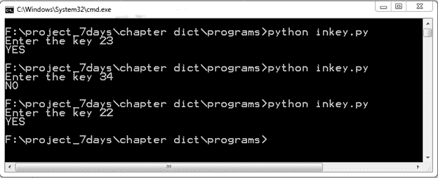
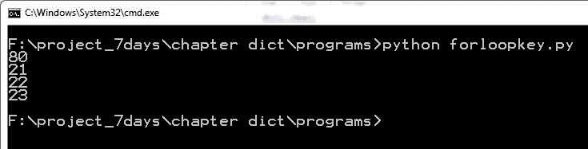
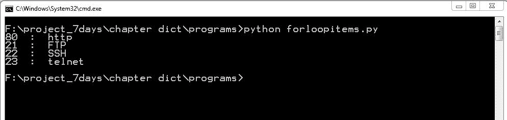
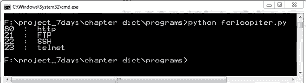
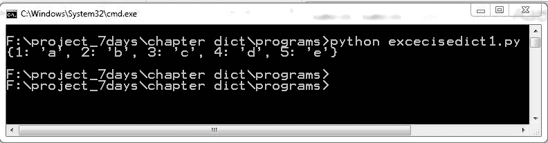

# 字典

到目前为止，你已经学习了字符串、元组和列表。在本章中，Python 中还有一个有用的内置数据类型，称为 **字典**。在列表中，值通过数字的范围进行索引，但在字典中，值通过键进行索引。

# 字典概述

在 Python 中，字典是一系列由逗号分隔的键值对，或称为项。

考虑以下示例：

```py
port = {22: "SSH", 23: "Telnet" , 53: "DNS", 80: "HTTP" }

```

`port` 变量指向一个包含端口号作为键和协议名称作为值的字典。

考虑以下示例：

```py
companies = {"IBM": "International Business Machines", "L&T" :"Larsen & Toubro"}

```

字典的语法如下：

```py
Dictionary_name = {key: value}

```

键值对称为 **项**。键和值由冒号 (`:`) 分隔，每个项由逗号 (`,`) 分隔。项由花括号 (`{ }`) 包围。可以通过使用花括号 (`{ }`) 创建空字典。字典的关键特性包括：

+   字典的键不能更改

+   字符串、整数或浮点数可以用作键

+   不包含任何列表的元组可以用作键

+   键是唯一的

+   值可以是任何东西，例如列表、字符串、整数等

+   值可以重复

+   值可以更改

+   字典是无序集合，这意味着您在字典中输入项的顺序可能不会保留，并且您可能会以不同的顺序获取项

# 字典上的操作

如你所知，字典是可变的；您可以添加新值，删除和更新旧值。在本节中，你将学习访问、删除、更新和添加操作。

# 访问字典的值

为了访问字典的值，您需要键。考虑一个网络端口的字典：为了访问字典的值，您需要键。考虑一个网络端口的字典：

```py
Port = {80: “HTTP”, 23 : “Telnet”, 443 : “HTTPS”}

```

让我们通过示例来学习：

```py
>>> port = {80: "HTTP", 23 : "Telnet", 443 : "HTTPS"}
>>> port[80]
'HTTP'
>>> port[443]
'HTTPS'

```

为了访问字典的值，请使用方括号和键。如果键不在字典中会发生什么？

```py
>>> port[21]

Traceback (most recent call last):
 File "<pyshell#4>", line 1, in <module>
 port[21]
KeyError: 21
>>>

```

如果找不到键，则解释器会显示前面的错误。

# 从字典中删除项

通过使用 `del` 关键字，您可以删除整个字典或字典中的项。如果您想删除字典中的项，请使用以下语法：

```py
del dict[key]

```

以以下代码片段为例：

```py
>>> port = {80: "HTTP", 23 : "Telnet", 443 : "HTTPS"}
>>> del port[23]
>>> port
{80: 'HTTP', 443: 'HTTPS'}
>>>

```

如果您想删除整个字典，请使用以下语法：

```py
The del dict 

```

考虑以下示例：

```py
>>> port = {80: "HTTP", 23 : "Telnet", 443 : "HTTPS"}
>>> del port
>>> port

Traceback (most recent call last):
 File "<pyshell#12>", line 1, in <module>
 port
NameError: name 'port' is not defined
>>>

```

前面的错误显示 `port` 字典已被删除。

# 更新字典的值

更新字典非常简单；只需在方括号中指定键和字典名称。语法如下：

```py
dict[key] = new_value 

```

考虑以下示例：

```py
port = {80: "HTTP", 23 : "SMTP”, 443 : "HTTPS"} 

```

在前面的字典中，端口号 `23` 的值是 `"SMTP"`，但在现实中，端口号 `23` 是用于 telnet 协议的。让我们使用以下代码更新前面的字典：

```py
>>> port = {80: "HTTP", 23 : "SMTP", 443 : "HTTPS"}
>>> port
{80: 'HTTP', 443: 'HTTPS', 23: 'SMTP'}
>>> port[23] = "Telnet"
>>> port
{80: 'HTTP', 443: 'HTTPS', 23: 'Telnet'}
>>>

```

# 向字典中添加项

向字典中添加项非常简单；只需在方括号中指定与字典一起的新键。语法如下：

```py
dict[new_key] = value 

```

考虑以下示例：

```py
>>> port = {80: "HTTP", 23 : "Telnet"}
>>> port[110]="POP"
>>> port
{80: 'HTTP', 110: 'POP', 23: 'Telnet'}
>>>

```

在前面的示例中，我们添加了`"POP"`协议。

# 字典函数

在本节中，我们将探讨 Python 中可用于字典的内置函数。你可能在前几章的列表和元组中看到了大多数函数。在本节中，你将看到如何将这些函数应用于字典。

# len()

为了找到字典中存在的项目数量，你可以使用`len()`函数。请看以下示例：

```py
>>> port = {80: "http", 443: "https", 23:"telnet"}
>>> len(port)
3
>>>

```

# str()

考虑一种情况，你想将字典转换为字符串；这里你可以使用`str()`函数。方法的语法如下：

```py
str(dict) 

```

考虑以下示例：

```py
>>> port = {80: "http", 443: "https", 23:"telnet"}
>>> port
{80: 'http', 443: 'https', 23: 'telnet'}
>>> str(port)
"{80: 'http', 443: 'https', 23: 'telnet'}"
>>>

```

你可以很容易地看到字典周围的引号。让我们使用`max()`函数从字典中获取`max`键。

# max()

如果你将字典传递给`max()`函数，那么它将返回价值最大的键。方法的语法如下：

```py
max(dict)

```

请查看以下示例：

```py
>>> dict1 = {1:"abc",5:"hj", 43:"Dhoni", ("a","b"):"game", "hj":56}
>>> max(dict1)
('a', 'b')

```

因此，`max`函数给出了元组的最大价值。同样，要获取最小键，你可以使用`min()`函数。

# min()

`min()`函数与`max()`函数正好相反。它返回字典中价值最低的键。方法的语法如下：

```py
min(dict)

```

考虑以下示例：

```py
>>> dict1 = {1:"abc",5:"hj", 43:"Dhoni", ("a","b"):"game", "hj":56, (1,3):"kl"}
>>> dict1
{1: 'abc', (1, 3): 'kl', 5: 'hj', 43: 'Dhoni', 'hj': 56, ('a', 'b'): 'game'}
>>> min(dict1)
1
>>>

```

让我们将列表或元组转换为字典。为了将列表或元组转换为字典，格式应如下所示：

```py
port = [[80,"http"],[20,"ftp"],[23,"telnet"],[443,"https"],[53,"DNS"]]

```

或者，它也可以如下所示：

```py
 port = [(80,"http"),(20,"ftp"),(23,"telnet"),(443,"https"),(53,"DNS")]

```

我们需要成对的两个值。通过使用`dict`函数，我们可以将前面的列表转换为字典。

# dict()

你可以将元组或列表传递给`dict()`函数，但该元组或列表应包含成对的两个值，如以下示例所示。

方法的语法如下：

```py
dict(list or tuple) 

```

让我们通过示例来查看转换：

```py
>>> port = [[80,"http"],[20,"ftp"],[23,"telnet"],[443,"https"],[53,"DNS"]]
>>> port
[[80, 'http'], [20, 'ftp'], [23, 'telnet'], [443, 'https'], [53, 'DNS']]
>>> dict(port)
{80: 'http', 443: 'https', 20: 'ftp', 53: 'DNS', 23: 'telnet'}
>>>
>>> port = [(80,"http"),(20,"ftp"),(23,"telnet"),(443,"https"),(53,"DNS")]
>>> dict(port)
{80: 'http', 443: 'https', 20: 'ftp', 53: 'DNS', 23: 'telnet'}
>>>

```

在 Python 字典中的 in 运算符可以使用来查找字典中键的存在。考虑以下示例程序`inkey.py`：

```py
port1 = {21: "FTP", 22:"SSH", 23: "telnet", 80: "http"}
key = int(raw_input("Enter the key "))
if key in port1:
 print "YES"
else :
 print "NO"

```

请查看以下截图以获取输出：



程序输出

同样，你可以使用`not in`运算符。考虑以下示例：

```py
>>> port1 = {21: "FTP", 22 :"SSH", 23: "telnet", 80: "http"}
>>> if 21 not in port1:
             print "yes"
>>

```

在前面的代码片段中，没有打印任何内容。

# 字典方法

在本节中，我们将逐一讨论字典方法。假设你想创建现有字典的副本，你可以使用`copy()`方法。

# copy()

`copy()`方法的语法如下：

```py
dict.copy() 

```

请查看以下示例：

```py
>>> Avengers ={'iron-man':"Tony", "CA":"Steve","BW":"Natasha"}
>>> Avengers
{'iron-man': 'Tony', 'CA': 'Steve', 'BW': 'Natasha'}
>>> Avengers2 = Avengers.copy()
>>> Avengers2
{'iron-man': 'Tony', 'CA': 'Steve', 'BW': 'Natasha'}
>>>

```

你可以看到`Avengers2`是`Avengers`的精确副本。不要将`copy()`与赋值运算符混淆。让我们看以下示例：

```py
>>> A1 = {'iron-man':"Tony", "CA":"Steve","BW":"Natasha"}
>>> A2= A1
>>> 
>>> A2
{'iron-man': 'Tony', 'CA': 'Steve', 'BW': 'Natasha'}
>>> 
>>> CW= A1.copy()
>>> CW
{'iron-man': 'Tony', 'CA': 'Steve', 'BW': 'Natasha'}
>>>

```

变量`A1`和`A2`持有相同的字典，但`CW`变量持有不同的字典。你可以检查`A1`、`A2`和`CW`的内存地址：

```py
>>> id(A1)
46395728
>>> id(A2)
46395728
>>> id(CW)
46136896
>>>

```

我们还可以做一件事。让我们向`A1`字典添加一个成员：

```py
>>> A1
{'iron-man': 'Tony', 'CA': 'Steve', 'BW': 'Natasha'}
>>> A1["hulk"]= "Bruce-Banner"
>>> A1
{'iron-man': 'Tony', 'CA': 'Steve', 'BW': 'Natasha', 'hulk': 'Bruce-Banner'}
>>> A2
{'iron-man': 'Tony', 'CA': 'Steve', 'BW': 'Natasha', 'hulk': 'Bruce-Banner'}
>>> CW
{'iron-man': 'Tony', 'CA': 'Steve', 'BW': 'Natasha'}
>>>

```

我们已经更改了`A1`字典，并且更改也会通过`A2`反映出来，因为它们持有相同的内存地址，而`CW`持有不同的字典。考虑你有这样一个字典，你想要访问一个不存在的`key`。解释器会显示`KeyError`如下：

```py
>>> A1 = {'iron-man': 'Tony', 'CA': 'Steve', 'BW': 'Natasha', 'hulk': 'Bruce-Banner'}
>>> A1["panther"]
Traceback (most recent call last):
 File "<pyshell#1>", line 1, in <module>
 A1["panther"]
KeyError: 'panther'
>>>

```

在前述代码中，你可以清楚地看到错误。如果这种情况发生在运行代码中，你的代码将无法完全执行。为了处理这种情况，我们将使用`get()`方法。

# `get()`

`get()`方法的语法如下：

```py
dict.get(key, default=None) 

```

`get()`方法用于从字典中获取给定`key`的值。如果`key`未找到，则返回默认值或消息。以下示例中`key`存在：

```py
 >>> A1 = {'iron-man': 'Tony', 'CA': 'Steve', 'BW': 'Natasha', 'hulk': 'Bruce-Banner'}
 >>> A1.get('iron-man',"not found")
 'Tony'

```

在前述示例中，由于键存在，自定义消息`not found`不会打印出来。让我们看另一个示例：

```py
 >>> A1.get('panther',"not found")
 'not found'
 >>> A1.get("Black")
 >>>

```

如果自定义消息未设置，则不会返回任何内容。还有一个方法，`setdefault()`，它与`get()`方法非常相似，但功能略有不同。让我们通过示例来讨论该方法。

# `setdefault()`

`setdefault()`的语法如下：

```py
dict.setdefault(key1, default=None)  

```

`key1` -- 这是需要搜索的`key`。

如果`key1`未找到，则返回消息并将其添加到字典中。让我们看以下示例：

```py
 >>> port1.setdefault(23, "Unknown")
 'Telnet'
 >>> port1
 {80: 'http', 22: 'SSH', 23: 'Telnet'}
 >>> port1.setdefault(19, "Unknown")
 'Unknown'
 >>> port1
 {80: 'http', 19: 'Unknown', 22: 'SSH', 23: 'Telnet'}

```

如果消息尚未设置，则返回并添加默认值`None`。以下示例：

```py
 >>> port1.setdefault(18)
 >>> port1
 {80: 'http', 18: None, 19: 'Unknown', 22: 'SSH', 23: 'Telnet'}
 >>>

```

为了避免`KeyError`，我们可以使用`get()`方法，但我们可以添加一个额外的检查来避免`KeyError`。`has_key()`方法使你能够检查给定的键是否存在。

# `has_key()`

`has_key()`的语法如下：

```py
dict.has_key(key)

```

`key`--这是要在字典`dict`中搜索的键，`has_key()`方法返回`True`或`False`，如下例所示：

```py
 >>> port1 = {80: 'http', 18: None, 19: 'Unknown', 22: 'SSH', 23: 'Telnet'}
 >>> port1.has_key(80)
 True
 >>>
 >>> port1.has_key(20)
 False
 >>>

```

考虑这样一种情况，你想要对字典的键执行一些操作，并希望将所有键放在不同的列表中。在这种情况下，你可以使用`keys()`方法。

# `keys()`

`keys()`的语法如下：

```py
dict.keys()

```

让我们考虑以下示例：

```py
A1 = {'iron-man': 'Tony', 'CA': 'Steve', 'BW': 'Natasha', 'hulk': 'Bruce-Banner'} 

```

在前述字典中，我们想要获取超级英雄的角色，即所有键：

```py
>>> A1 = {'iron-man': 'Tony', 'CA': 'Steve', 'BW': 'Natasha', 'hulk': 'Bruce-Banner'}
 >>> A1.keys()
 ['iron-man', 'CA', 'BW', 'hulk']
 >>>

```

前述方法返回所有键的列表。

同样地，如果我们想要一个单独的列表中的所有值，我们可以使用`values()`方法。

# `values()`

`values()`的语法如下：

```py
dict.values()

```

让我们考虑以下示例：

```py
A1 = {'iron-man': 'Tony', 'CA': 'Steve', 'BW': 'Natasha', 'hulk': 'Bruce-Banner'} 

```

在前述字典中，我们想要获取我们英雄的所有真实姓名：

```py
 >>> A1 = {'iron-man': 'Tony', 'CA': 'Steve', 'BW': 'Natasha', 'hulk': 'Bruce-Banner'}
 >>> A1.values()
 ['Tony', 'Steve', 'Natasha', 'Bruce-Banner']
 >>>

```

将字典添加到另一个字典。考虑以下示例：有时，我们需要将一个字典添加到另一个字典中。考虑以下示例：

```py
port1 = {22: "SSH", 23: "telnet", 80: "Http”}

```

我们还有一个端口字典，即`port2`，如下所示：

```py
port2 = {53 :"DNS", 443 : "https"} 

```

为了将`port1`更新为`port2`，我们可以利用`update()`方法。

# `update()`

语法如下：

```py
dict.update(dict2) 

```

`dict2`--这是要添加的字典。

考虑以下示例：

```py
 >>> port1 = {22: "SSH", 23: "telnet", 80: "Http" }
 >>>
 >>> port2 = {53 :"DNS", 443 : "https"}
 >>>
 >>> port1.update(port2)
 >>> port1
 {80: 'Http', 443: 'https', 53: 'DNS', 22: 'SSH', 23: 'telnet'}
 >>>

```

注意使用前面的方法，因为如果`dict`和`dict2`字典包含相同的键，那么`dict`字典的键将被`dict1`字典的键所替换。

# items()

`items()`方法的语法如下：

```py
dict.items() 

```

`items()`方法返回字典的`(key, value)`元组对列表：

```py
 >>> dict1 = d={1:'one',2:'two',3:'three'}
 >>> dict1.items()
 [(1, 'one'), (2, 'two'), (3, 'three')]
 >>>

```

有时候，我们需要删除字典中的所有项。这可以通过使用`clear()`方法来完成。

# clear()

`clear()`的语法如下：

```py
dict.clear() 

```

让我们考虑以下示例：

```py
 >>> dict1={1:'one',2:'two',3:'three'}
 >>> dict1
 {1: 'one', 2: 'two', 3: 'three'}
 >>> dict1.clear()
 >>> dict1
 {}
 >>>

```

# 使用 for 循环的 Python 字典

在本节中，我们将学习如何使用`for`循环与字典结合。如果你还没有阅读关于`for`循环的内容，你可以跳过这一节，在学习了第六章中涵盖的`for`循环后回来。让我们将`for`循环应用于字典。请看以下名为`forloopkey.py`的程序：

```py
port1 = {21: "FTP", 22 :"SSH", 23: "telnet", 80: "http"} for each in port1: print each

```

输出如下：



程序`forloopkey.py`的输出

前面的程序只打印了字典的键。如果你想同时打印键和值，那么你可以使用`items()`方法。请看以下名为`forloopitems.py`的程序：

```py
port1 = {21: "FTP", 22 :"SSH", 23: "telnet", 80: "http"}
 for k,v in port1.items():
     print k," : ", v

```

以下截图显示了程序的输出：

程序`forloopitems.py`的输出

前面的程序一开始看起来可能难以理解。让我们将程序分成两部分。`port1.items()`方法返回一个元组对的列表，如下所示：

```py
>> port1 = {21: "FTP", 22:"SSH", 23: "telnet", 80: "http"}
 >>> port1.items ()
 [(80, 'http'), (21, 'FTP'), (22, 'SSH'), (23, 'telnet')]
 >>>

```

`for`循环将每个元组发送到变量`k`和`v`。看看`for`循环的一次迭代：

```py
>> k,v = (80, 'http')
 >>> k
 80
 >>> v
 'http'
 >>>

```

现在，你已经学会了如何遍历字典。考虑一个包含数百万项的字典，并且你想遍历这个字典。`items()`方法返回一个键值对的列表。新创建的列表也会占用很多内存。Python 字典有一个非常漂亮的节省内存的方法，称为`iteritems()`。让我们通过以下名为`forloopiter.py`的示例代码来理解它：

```py
port1 = {21: "FTP", 22 :"SSH", 23: "telnet", 80: "http"} for k,v in port1.iteritems(): print k," : ", v

```

看看输出：



程序`forloopiter.py`的输出

前面的代码并没有创建一个列表。让我们通过 Python shell 来理解：

```py
>> port1 = {21: "FTP", 22 :"SSH", 23: "telnet", 80: "http"} >>> port1.iteritems() <dictionary-itemiterator object at 0x02A66210> >>> 

```

前面的代码返回的是一个字典对象，而不是一个庞大的列表。我们不会深入探讨这个对象的具体细节。你可以用`iterkeys()`替换`key()`，用`itervalues()`替换`values()`。何时使用`iteritems()`和`items()`？如果我们需要相应的列表并且需要在列表上执行一些操作，例如切片和索引，那么`items()`方法将是最合适的选择。但如果我们的需求仅仅是遍历字典，那么`iteritems()`将是最合适的选择。

# 实际程序

让我们编写一些程序来理解字典。从一个列表创建一个字典。这两个列表的长度相等。请参考以下列表：

```py
list1 = [1, 2, 3, 4, 5] 
list2 = ["a", "b", "c","d", "e"] 

```

`list1`的值作为字典的键，`list2`的值作为字典的值。以下是对应的程序：

```py
list1 = [1, 2, 3, 4, 5] 
list2 = ["a", "b", "c","d", "e"] 
dict1 = {} 
for index1 in xrange(len(list1)): 
  dict1[list1[index1]] = list2[index1] 
print dict1

```

输出如下：



练习 1 的输出

让我们用一行代码来完成前面的练习：

```py
 >>> list1 = [1,2,3,4,5]
 >>> list2 = ["a", "b", "c","d", "e"]
 >>> dict1 = dict([k for k in zip(list1,list2)])
 >>> dict1
 {1: 'a', 2: 'b', 3: 'c', 4: 'd', 5: 'e'}
 >>>

```

只用一行代码就可以从两个列表中创建一个字典。所以，在上面的例子中，我们使用了`zip()`函数；`zip()`是一个内置函数，它接受两个列表并返回一个包含两个元组的列表，例如`[(key, value)]`。让我们看看`zip()`函数的一个例子：

```py
>> list1 = [1,2,3]
 >>> list2 = ["a","b","c"]
 >>> zip(list1, list2)
 [(1, 'a'), (2, 'b'), (3, 'c')]
 >>>

```

# 练习

1.  找出判断一个键是否存在于字典中的方法数量。

1.  使用字典，`port1 = {21: "FTP", 22:"SSH", 23: "telnet", 80: "http"}`，并创建一个新的字典，其中键变为值，值变为键，如下所示：`Port2 = {"FTP":21, "SSH":22, "telnet":23, "http": 80}`

# 概述

在本章中，你学习了关于字典的知识，如何创建一个空字典，向字典中添加项，以及从字典中访问和删除值。为了找到字典中的项数，我们使用了`len()`函数。还有一些其他有用的函数，如`max()`和`min()`，分别用于在字典中找到最大值和最小值。在字典方法中，你学习了不同的方法，例如`copy()`、`keys()`和`items()`。通过使用`items()`，我们可以遍历字典。最后，你学习了两种节省内存的方法：`iteritems()`和`iterkeys()`。
