# 控制语句和循环

在本章中，我们将了解不同控制语句的原则和工作原理，包括 `if`、`if...else` 和 `if...elif...else`。我们还将了解各种循环（如 `for` 和 `while` 循环）的原则和工作原理。我们还将熟悉 `xrange` 函数以及 `break`、`continue` 和 `pass` 等语句。

# 控制语句

现在，大多数初学者可能都在想控制语句是什么。控制语句不过是程序遵循以获得期望结果的一系列语句。让我们首先尝试理解什么是控制语句以及为什么它们是任何编程语言的基本组成部分。你可能使用过自动柜员机（ATM）来取款。当你插入借记卡时，你会做什么？你首先会注意到屏幕上的选项菜单。现在你必须执行某些操作，否则你的卡在一段时间后会因为长时间等待而被拒绝。当你选择取款时，你必须提供正确的金额，这是从机器中需要取出的金额。如果你提供了错误的金额，计算机将立即显示消息“请输入正确的金额”。这里发生了什么？你注意到了吗？这里计算机只是在遵循指令。它被命令只接受正确的金额，并在输入错误金额时提示错误信息。这就是你可以看到控制语句使用的一个场景。

# if 和 if...else 语句

*If* 可以理解为隐喻性的英语 *what if*，这是大多数人日常生活中都会使用的。如果这件事没有发生怎么办？如果我成为亿万富翁。如果这场比赛打平，我们将被淘汰出冠军联赛。如果丘吉尔没有掌权，不列颠之战就会失败。如果这辆车不能启动，就使用另一辆。我们全球范围内有无数的例子说明了 *if* 的用法。编程语言也是如此。大多数编程语言都有控制语句，你会发现它们大多数都使用 `if` 关键字。Python 也不例外，并且也方便了 `if` 的使用。让我们通过一个例子来理解：

```py
password= raw_input("Enter the passwordt") 
if password=="MI6": 
     print "Welcome Mr. Bond."

```

在 Python 中，通过命令行输入输入时使用 `raw_input()` 函数。

Python 中的任何函数或控制语句块都是以在行尾放置冒号开始的。这里的冒号标志着 `if` 块的开始，而 `print` 语句在冒号后一个制表符空间处开始。程序员通常会在冒号后立即混合空格和制表符，这是一个常见的错误。

在前面的例子中，在输入密码后，解释器会检查输入的字符串并与 `"MI6"` 进行比较；如果输入的密码正确，它会打印 `欢迎，邦德先生`。如果密码错误，它将跳过 `if` 块并终止程序：

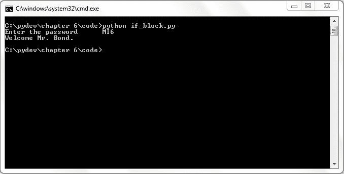

但仅仅使用`if`并不能给解释器提供很多选择，它必须终止程序。如果解释器被提供了一个失败的`if`测试的替代方案会怎样呢？在这种情况下，可以使用`else`来给解释器提供选择。

**语法**

```py
if condition :
        statements-1
else:
       statements-2

```

让我们通过一个例子来理解`if`和`else`条件：

```py
password= raw_input("Enter the passwordt") 
if password=="MI6":        
   print "Welcome Mr. Bond." 
else:        
   print "Access Denied."

```

这里，如果密码输入错误，解释器将立即执行`else`块内的语句。这里，控制语句被分为两个块，一个是`if`块，另一个是`else`块。在某一时刻，解释器将执行这两个块中的任意一个：

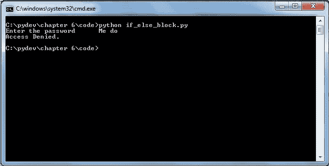

# `if...elif...else`语句

如果有一系列要执行的操作，那么可以使用`if...elif...else`块。大多数编程语言提供了`if...else if...else`控制块，而 Python 将`else if`缩短为`elif`，但原理保持不变，即它将整个控制块划分为多个块，以执行特定的操作。可以用日常例子来解释，例如，如果这张借记卡不能用，就使用这张信用卡，否则用支票支付。

**语法**

```py
if condition-1:
  sequence of statements-1
elif condition-n:
       sequence of statements-n
else:
   default sequence of statements

```

在这里，在语法中，我们展示了在不同条件下的一系列分支语句，这在任何语言中也被称为**条件分支**。首先，我们遇到一个`if`块，如果`if`块内的条件得到满足或变为真，那么才会执行`if`块。如果在执行`if`块内的条件时没有得到满足，那么控制权将传递给紧接的条件语句，即`elif`块，在那里条件会被不同地检查，最后，我们有`else`块，如果所有在`else`条件之前的条件都失败了，那么`else`块将处理代码。

现在，让我们尝试将大学成绩应用于实际，并了解我们如何通过编程来处理成绩：

| 等级 | 分数 |
| --- | --- |
| A | 所有等级在 4 以上 |
| B | 所有等级在 3 以上和 3.5 以下 |
| C | 所有等级在 2.5 以上和 3 以下 |
| D | 所有等级在 2.5 以下 |

```py
num =float(raw_input("Enter the number:"))
if num > 4:
         letter = 'A'
elif num > 3:
          letter = 'B'
elif num > 2:
          letter = 'C'
else:
          letter = 'D'
print "The Grade is " , letter

```

在这里，我们声明了一个变量`num`来存储输入的分数，并创建了一组条件，这些条件将检查输入的分数。例如，如果输入的分数大于`4`，那么`if`条件内的代码将被执行，并将`letter`变量赋值为`'A'`或等级 A。同样，如果输入的分数小于或等于`4`，但大于`3`，那么`if`条件将失败，控制权将传递到`elif num>3`条件块，并将`letter`变量赋值为`'B'`或等级 B 将被分配给输入的分数。在这里，解释器检查输入的输入，并根据输入的正确分数执行正确的块。我们输入了分数`4.5`，解释器给出了等级`A`，如下面的截图所示：

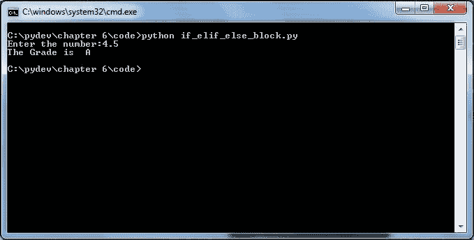

# 循环

可能会有这样的情况，你需要多次运行一段代码，在这种情况下，循环就派上用场了。循环在诸如在任意编程语言中遍历数据结构或遍历大量数据以过滤掉垃圾数据等情况下很有用，随后跟随着某些关键字，再接着是字母数字字符，最后是某些特殊字符。

# 循环类型

循环有两种类型，即：

1.  **确定型**：在这种情况下，代码块运行固定次数。当程序员确切知道任务将执行多少次或假设他知道数据结构中的元素数量时，这很有用。例如，教室的人数。

1.  **不确定型**：在这种情况下，代码块运行直到条件为真。这在计数未知的情况下很有用。例如，试图找出伦敦在一篇文学文章中出现的次数。

在进一步深入研究循环之前，让我们尝试理解 Python 中的 `range()` 和 `xrange()` 函数。

当你想动态生成一个列表时，`range()` 函数很有用。其语法如下：

**语法**

```py
range(start-value, end-value, difference between the values)

```

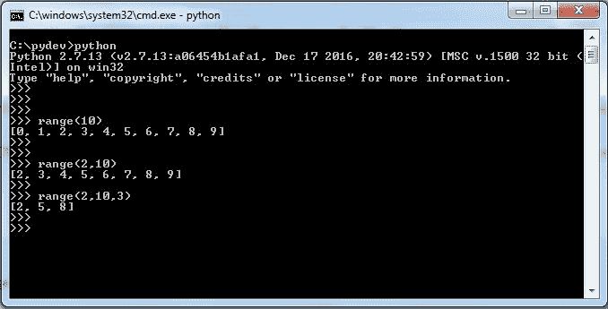

在这里，`range(10)` 将生成一个列表，其元素从 `0` 到 `9`。`range(2,10)` 表示列表将从 `2` 开始生成，并将有元素到 `9`。`range(2,10,3)` 表示列表将从 `2` 开始生成，每个元素之后有 `3` 的差值。

**语法**

```py
xrange(start-value, end-value, difference between the values)

```

`xrange()` 与 `range()` 非常相似，除了 `xrange()` 在不使用时释放或释放内存，而 `range()` 不释放内存。

# 确定循环

这是一个执行固定次数的循环。可以想到的确定循环的最佳例子是 `for` 循环。让我们看看 `for` 循环：

**语法**

```py
for <variable> in xrange(<an integer expression >):
  <statement-1 >
        <statement-n >

```

`for` 循环的第一行代码有时被称为**循环头**。一个整型表达式指定了循环需要运行的次数。冒号 `:` 结束循环头。Python 的 `for` 循环块或主体由头部下方的语句组成，这些语句将被执行固定次数。`for` 循环的主体必须缩进。循环体内的语句在每个运行中按顺序执行。

让我们尝试一些例子：

```py
for a in xrange(4):
    print "Hello all"

```

在前面的例子中，我们正在尝试打印 `"Hello all"` 四次。

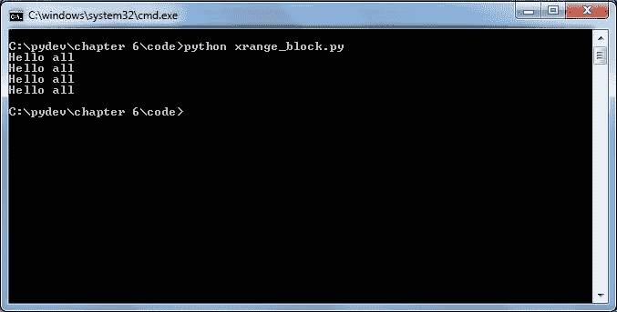

在这里，a 是任何变量或迭代变量或计数变量，其初始值为 `0`，并将执行 `4` 次。让我们再看另一个例子：

```py
for count in xrange(4): 
   print count

```

在这里，`count` 的值将逐个打印，并且始终在新的一行上。

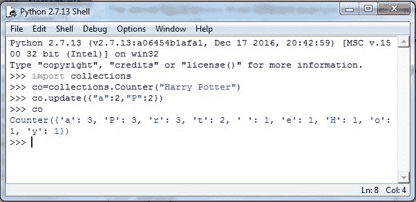

在前面的例子中，输出被打印在新的一行上，但输出可以被格式化以在一行中打印。为此，可以使用逗号 `,`，如下所示：

```py
for count in xrange(4): 
   print count,

```

使用 `,` 将会得到类似以下的输出：

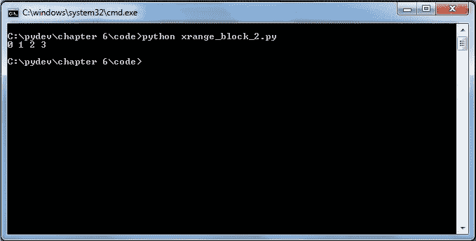

让我们考虑一些更多的例子：

```py
product =1 
for count in xrange(1,5): 
  product = product*count 
  print product,

```

我们对打印乘积乘以`count`感兴趣。为此，我们创建了一个名为`product`的变量，其值初始化为`1`，并生成一个从`1`到`5`但不包括`5`的数字列表。对于`for`循环的一次迭代，乘积将乘以`count`值的次数。

在这里，`count`值只是我们列表中的数字。我们将得到如下所示的输出：

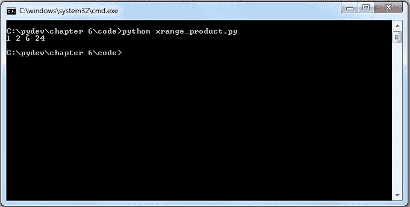

让我们再举一个`for`循环的例子。在这里，我们感兴趣的是打印给定字符串中的每个字符：

```py
for each in 'VIENNA PHILHARMONIC' :
       print each,

```

对于`for`循环变量的每一次迭代，`each`将存储每个字符的值，并将它们逐个打印在同一行中，如下所示：

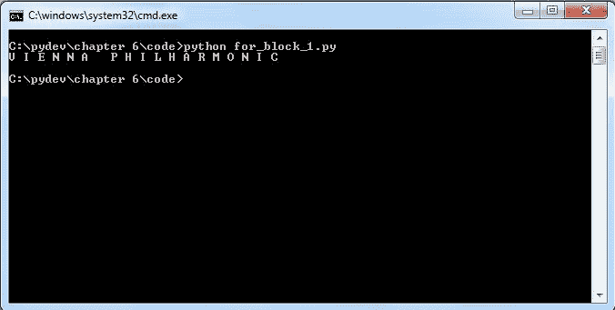

# 不定循环

到目前为止，我们学习了定循环，现在我们将了解不定循环是什么？不定循环是一个会无限次运行的循环，直到被要求停止。为了执行不定循环，我们使用`while`语句。

**语法**

```py
while <condition>:
  <statements>

```

这个循环将一直执行，直到满足条件，一旦条件不满足，它将终止。让我们用一个例子来尝试理解：

```py
 checking_acc = 5678143
 num = int(raw_input("Enter the account numbert"))
 while checking_acc != num:
     print "Wrong number "
     num = int(raw_input("Enter the right account numbert"))
 print "n*********"
 print "Your account number is" , num

```

在这里，我们感兴趣的是验证检查银行账户。我们取一个变量`checking_acc`，它存储检查银行账户的值。我们从用户那里获取他的/她的检查银行账户号码，并将其存储在`num`变量中。我们在`while`循环中检查条件，并将输入的值与我们的现有检查银行账户记录进行比较。在这里，直到输入正确的账户号码，条件才会继续失败。所以，在我们的情况下，如果检查账户被错误输入，用户将收到“错误的号码”的消息，并会被提示输入正确的号码。一旦他输入正确的号码，条件变为真，`while`循环终止。您可以在这里看到输出：

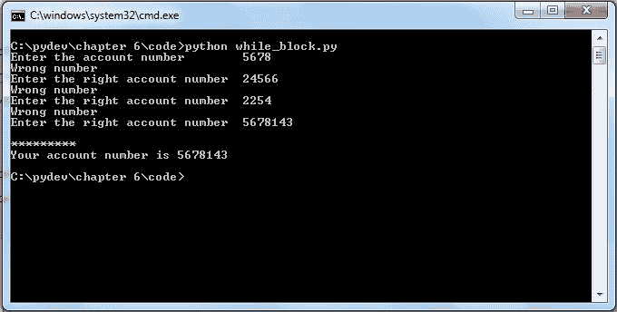

但是，有一个小技巧可以使`while`循环被用来表现得像定循环。让我们用一个例子来尝试理解：

```py
sum = 0
 for counter in xrange(1,10):
    sum = sum+counter
    print sum,
    print "n"
 sum = 0
 counter = 1
 while (counter < 10):
     sum = sum + counter
     print sum,
     counter= counter + 1

```

在我们之前的例子中，`while`循环要终止，条件要么需要失败，要么需要通过。但如果我们以这种方式在`while`循环内插入一个条件，使其运行特定的时间，那么我们可以使`while`循环表现得像是一个确定性的循环。在先前的例子中，我们感兴趣的是打印从`1`到`10`的数字之和。我们使用`for`循环也能达到相同的结果，当使用`while`循环时。`for`循环简单且易于理解。为了达到类似的结果，我们在`while`循环之前创建一个`counter`变量，并将变量初始化为`1`。现在，直到`counter`的值小于`10`，它将继续执行。在`while`循环内部，我们将`counter`的值每次迭代增加`1`。因此，循环将只运行`10`次，在第`10`次迭代时将终止。在随后的屏幕截图上，`for`循环的输出逐行显示，而`while`循环的输出显示在单行中，以区分两个循环（即`for`和`while`）的执行（即）：

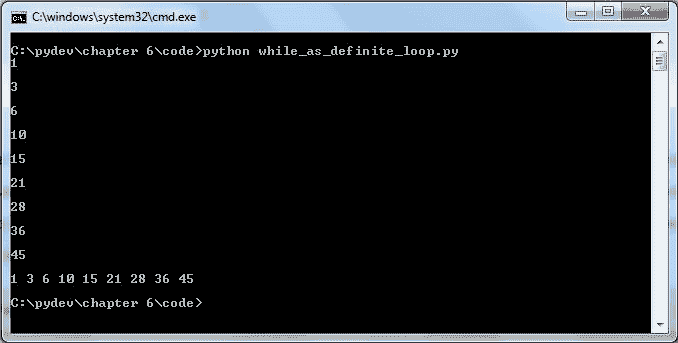

`for`循环和`while`循环产生相同的输出。但`while`循环块稍微大一些，包含额外的语句。`counter`是循环控制变量，必须在循环头之前显式初始化。`while`循环需要额外的努力才能使其作为一个确定性的循环工作，但会有几种情况，`while`循环将是唯一可用的解决方案。

# `while True`和`break`语句

使用`break`语句可以中断无限`while`循环的执行。让我们通过一个例子来理解：

```py
sum = 0
while True: 
   data = int(raw_input("Enter the data or press 0 to quit :")) 
   if data == 0: 
      break 
   sum = sum+data 
print "Sum is ", sum

```

在这里，我们的目的是打印输入的数字之和。在先前的例子中，`while`循环的条件已被设置为布尔值，即`True`。在这种情况下，由于条件始终为真，`while`循环将无限期地继续执行。然而，我们可以通过在`while`循环内设置条件检查并使用`break`语句来打破这个循环。因此，循环将一直运行，直到用户继续输入数字，但一旦输入数字`0`，它将终止。在这里，一旦输入`0`，`while`循环内的`if`条件将检查，由于输入的数字是`0`，`if`块内的代码将执行，这是一个`break`语句。这将终止循环，并打印出输入的数字之和，如下所示：

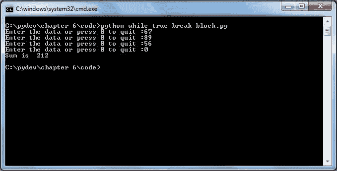

在这里，`while`循环具有布尔值`True`，这是`while`循环的入口条件。在这种情况下，循环至少会执行一次。但还有另一种方法可以实现前面的结果，而不使用`break`语句。让我们看看另一个例子：

```py
sum = 0
flag = 1 
while flag == 1: 
   data = int(raw_input("Enter the number or press 0 to quit :")) 
   if data == 0: 
      flag =0 
   sum = sum+data 
print "Sum is ", sum 

```

我们没有使用`break`语句就达到了相同的效果。在这里，我们使用了一个`flag`变量而不是`break`语句：

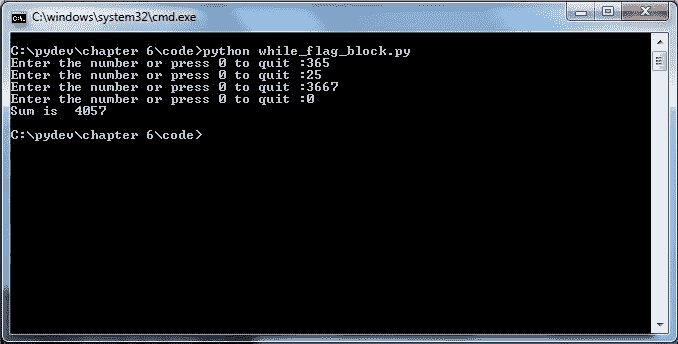

`while`循环的初始入口点是`flag`变量的值`1`。直到`flag`变量为`0`，循环将继续执行。当输入`0`时，`flag`变量的值变为`0`，循环终止。

# `break`语句

`break`语句用于改变任何代码块中的流程。可能存在一种情况，我们可能需要在循环中中断；在这种情况下，使用`break`语句将帮助我们实现目标。让我们看看：

```py
attraction_in_Vienna = ['Stephen plaz', 'Maria-Hilfer strasse', 'Donau-insel', 'Vienna-Philharmonic']
first = "Donau-insel"
for each in attraction_in_Vienna:
     if(each == first):
          break
print each

```

在这里，我们创建了一个维也纳市可用的景点列表。我们取一个变量`first`并将其值设置为`"Donau-insel"`：

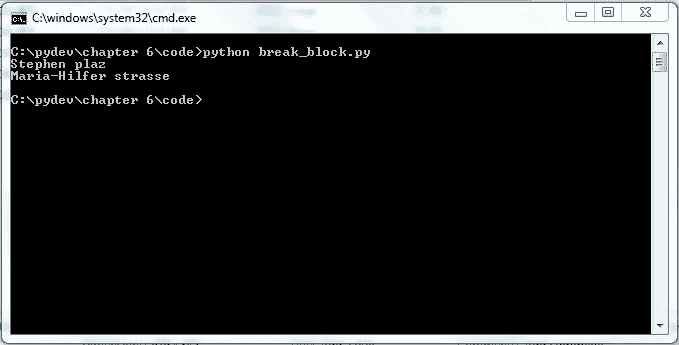

我们想要打印维也纳的所有景点。但是有一个转折。我们希望在列表中出现`Donau-insel`时停止。因此，对于`for`循环的每一次迭代，`if`块将检查列表中的每个元素，并将其与我们给出的比较值进行比较，即`"Donau-insel"`。所以程序将打印出在`Donau-insel`之前出现的所有名称，一旦出现`Donau-insel`，`break`语句将终止循环。`break`语句可以在多种情况下派上用场，例如在单词堆中搜索关键词、搜索回文等。

# 嵌套循环

它是循环中的循环，并且可能存在超过两个循环，每个循环都嵌套在另一个循环中。在大多数情况下，我们通常使用`break`语句来中断内循环，而外循环将继续执行。让我们用一个例子来尝试理解其工作原理：

```py
list1 = ["London","Paris","New York","Berlin"]
for each in list1:
 str1 = each
 for s in str1:
     if (s =="o"):
        break
     print s,
 print "n"

```

在这里，我们感兴趣的是打印所有城市的名称，并且不感兴趣打印任何在字符`o`之后的名称。为此，我们创建了一个城市列表，并使用`for`循环遍历该列表。我们将使用第二个`for`循环来消除任何在字符`o`之后出现的字符。这个条件在第二个`for`循环中检查，该循环嵌套在第一个`for`循环中，通过`if`语句实现：

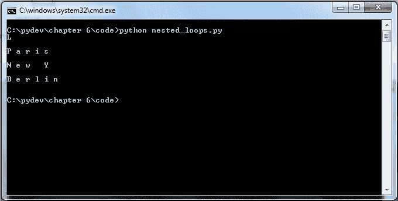

在这种情况下，内循环在遇到字符`o`时中断，而外循环继续执行。

# `continue`和`pass`语句

当`break`语句终止时，`continue`语句将跳过该步骤，然后循环将继续执行。

让我们用一个例子来讨论：

```py
movies = ['P.S I Love You', 'Shutter Island', 'Les Miserables play', 'King's Speech', 'Forest Gump']

```

这里是电影列表，但*悲惨世界*是一部戏剧的名字，我们希望跳过这个名称，并希望程序打印出所有电影名称：

```py
movies = ["P.S I Love You", "Shutter Island", "Les Miserables Play", "King's Speech", "Forest Gump"] 

for each in movies:
    if (each== "Les Miserables Play"):
          continue
    print each

```

`for`循环遍历列表中的每个元素，`if`块检查`"Les Miserables Play"`的出现条件。

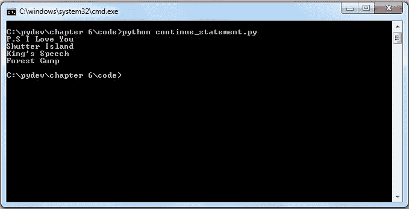

在这里，`continue`语句只是跳过了`"Les Miserables Play"`，循环继续打印其余电影的名称。

# `pass`语句

在各种编程问题中可能会有这样的场景，你可能希望为将来使用保留一个循环。我们可能不想在块中写任何内容，但同时该块不能有一个空的主体。在这种情况下，我们使用`pass`语句来构建一个不执行任何操作的主体。

**语法**

```py
def fun():
    pass
for each in "Australia":
    pass

```

如果你想知道`def fun()`是什么，那它只是用空主体定义函数。在这种情况下，主体不执行任何操作：

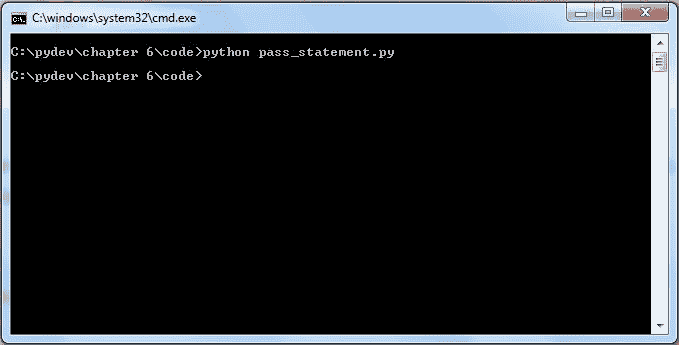

如果你正在想什么是函数，那么不要担心，我们将在关于函数的单独章节中介绍它们。

# 摘要

我们从理解控制语句的概念以及为什么它们在我们的日常编程问题中是必不可少的开始。我们有机会查看两个用于动态生成列表的函数`range()`和`xrange()`。我们学习了确定循环和不定循环。我们还学习了确定循环和不定循环之间的区别。在确定循环下，我们学习了各种控制语句，如`if`、`if...else`、`if...elif...else`和`for`循环。而在不定循环中，我们有机会研究`while`语句以及我们如何也可以使用`while`循环作为确定循环。我们看到了带有和不带有`break`语句的`while`的用法。我们还研究了`continue`和`pass`语句的工作原理。

在下一章中，我们将学习关于函数和变量作用域的内容。
