# 第七章：函数和变量的作用域

在上一章中，我们学习了控制语句和循环。我们学习了各种类型的控制语句，例如`if`语句、`if...else`语句和`if...elif...else`语句。接下来，我们看到了两种主要的循环类别，即确定性和无限循环。在确定性循环下，我们看到了 for 循环的工作原理，并学习了 Python 提供的两个实用函数，它们可以即时生成列表。它们是`range()`和`xrange()`。接下来，我们学习了无限循环，其中我们看到了 while 循环的工作原理。然后，我们学习了嵌套循环以及 break 和 continue 语句。在本章中，我们将介绍函数、带参数的函数、带参数和返回值的函数、带默认参数的函数、带可变长度参数的函数、将键值对作为函数的可变长度参数，最后我们将讨论变量的作用域。

# 函数

初学者心中浮现的大问题可能是，“什么是函数？”以及“为什么它们在任何编程语言中都是必要的？”

函数不过是一个大编程结构内部的小编程单元，它产生一个指定的输出。让我们通过现实世界的场景来尝试理解。很难想象一个没有电视的场景。你在普通电视里观察到什么？从更广泛的分类来看，考虑到普通观众，它有三个功能：

+   它有一个显示单元

+   它有一个音量控制单元

+   它在电子电路中嵌入了一个频道调谐设置

虽然现代智能电视有更复杂的功能，但我们将我们的例子限制在三个主要功能的解释上。

显示单元与其他两个功能单元的工作方式不同，它的唯一目的是向用户显示。同样，音量控制单元的唯一目的是精细调整电视的音量，最后，频道调谐的主要功能是在内存中加载不同的频道。编程语言中的函数也以类似的方式工作，每个都有自己的定义目的。一些例子可以是`calculateMonthSalary()`、`calculateTotalBill()`等等。

方法在名称上与函数相同，但它是通过对象调用的，并传递数据，而函数则是直接通过名称调用并传递数据以操作。方法是属于对象或面向对象编程类中包含方法的某个东西。在本章中，我们将更深入地研究函数。

# 函数的分类

任何编程语言中的函数可以分为两大类：

+   内置功能

+   用户定义的函数

# 内置函数

它们是由编程语言预定义的，每个都有特定的用途。虽然一些内置函数不能自定义，但一些可以根据特定编程语言制定的编程指南进行自定义。Python 语言也附带了一套内置函数，如`len()`和`cmp()`。您可以从 Python 文档中获取有关内置函数的详细信息。

Python 文档可以在[`docs.python.org`](https://docs.python.org)找到。

# 用户定义的函数

它们是根据用户的编程需求定义的。函数可以在任何编程语言中以各种形式创建或存在。在本节中，我们将深入了解我们可以创建函数的各种方法。

# 函数定义

在 Python 中定义一个函数有一些简单的规则。它们如下：

+   使用`def`关键字后跟带有括号`()`的函数名

+   函数的任何参数都必须放置在这些括号`()`内

+   代码块必须以冒号`:`开头

+   函数内的代码必须缩进

这个语法的语法如下：

```py
def function_name(arguments):
  <statements> 
 return value

```

这是 Python 中任何函数定义的语法。如果有任何参数，它们将被写入括号内，如果函数有任何返回值，那么它将是任何函数代码块或函数体中的最后一个语句。函数代码块或函数体在冒号（`:`）之后立即开始，如果有返回值，则结束于返回值。在 Python 中，冒号（`:`）之后开始的任何代码块的主体必须使用空格（最好是）或制表符缩进。这消除了缩进错误，解释器在运行程序时可能会抛出这些错误。

更多关于缩进的信息可以在以下位置找到：

[`www.python.org/dev/peps/pep-0008/#tabs-or-spaces`](https://www.python.org/dev/peps/pep-0008/#tabs-or-spaces)。

接下来，我们将看到如何在程序中调用一个函数。

# 调用函数

你可能想知道什么是**调用函数**。现在，假设你编写了一些关于洗涤说明的业务逻辑，要嵌入到自动洗衣机中。假设你想要在洗涤后立即进行漂洗的时间序列。在编程语言中，你不想在编写一大块程序时迷失方向，所以，为了使事情变得简单，你将你的业务逻辑写入一个函数中。这个函数必须在你想在洗涤序列完成后立即计时那个特定序列时被调用。在那里，你将执行指令传递给用于计时序列的函数。这是通过在适当的时间调用函数来实现的。

代码的语法块如下：

```py
function_name(arguments)

```

函数可以在类似于内置函数的编程结构中调用。使用函数名后跟一组括号。一个函数可以在同一编程文件、另一个文件或另一个函数中多次调用。是的，你猜对了：一个函数可以调用另一个函数。让我们通过一个例子来学习：

```py
def helloWorld(): 
   """ This is Hello World Program""" 
   print "You are in Hello World" 

helloWorld()

```

在这里，我们定义了 `helloWorld()` 函数，并给出了一个包含注释和打印语句的主体。最后，我们只需通过键入函数名后跟括号来调用该函数。当程序运行时，我们将得到如下所示的输出：

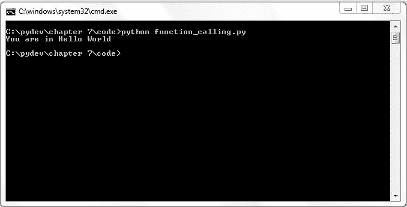

在任何编程语言中，函数可以通过多种方式被编写或存在。我们将讨论在 Python 中构建函数的各种方法。

# 带有参数的函数

到目前为止，我们看到了一个没有参数的函数，现在我们将学习有关带有参数的函数。一个函数可以包含任何数量的参数，这取决于业务需求。让我们通过一个例子来尝试理解：

```py
def func(passArgument): 
   print passArgument 
str = "hello all" 
func(str)

```

在前面的例子中，`func` 函数接受一个具有字符串数据类型的参数。我们创建一个变量 `str` 并将其分配给一个特定的字符串语句，然后调用 `func` 函数并传递 `str` 的值。最终，输出将类似于以下内容：

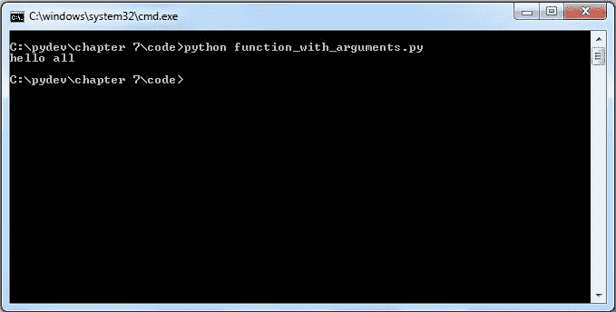

在前面的例子中，如果我们不向函数传递任何参数会发生什么？

```py
def func(passArgument): 
   print passArgument 
str = "hello all" 
func()

```

它将简单地抛出一个 `TypeError`，如下面的截图所示：

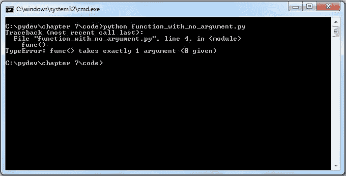

因此，在定义了接受参数的函数之后，在函数调用时传递参数变得强制性的。

# 带有参数和返回类型的函数

有时，可能需要从接受任意数量参数的函数中返回任何特定的数据类型或值。让我们通过一个示例来评估这个场景：

```py
def sum(a, b): 
   c = a+b 
   return c
x = 10 
y = 50 
print "Result of addition ", sum(x,y)

```

在这里，我们定义了一个函数，它接受两个参数，其主体计算它们的和，返回类型为和的值，这由 `return c` 语句表示。然后我们在打印语句中调用该函数，并传递变量 `x` 和变量 `y` 的值。这将给出下一个显示的输出：

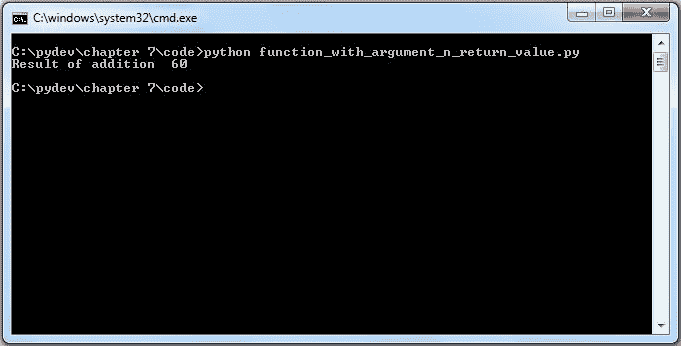

# 带有默认参数的函数

有时，你可能会遇到一个条件，其中必须为参数分配某个值，这个值被称为默认参数。让我们通过一个现实生活中的场景来尝试理解。我们中的大多数人都会在线填写某些表格以申请工作。现在，在表格中有一个性别选择的选项。在这种情况下，程序员插入了一个默认值“女性”。默认情况下，如果你的性别没有特别更改此值，则你的性别将被设置为女性。具有默认参数的函数也是同样的情况。让我们通过一个小代码示例来理解这一点：

```py
def info(name, age=50): 
   print "Name", name 
   print "age", age 
info("John", age=28) 
info("James") 

```

在这里，`info` 函数接受两个参数 `name` 和 `age`。`age` 是具有默认值 `50` 的参数。在这种情况下，在调用 `info` 函数时，如果未提供 `age`，则函数将 `age` 的值设置为 `50`。我们两次调用了 `info` 函数。在第一次调用中，我们传递了 `"John"` 和 `age` 的值为 `28`，而在第二次调用中，我们只传递了 `name` 的值 `"James"`。我们将得到如下所示的输出：

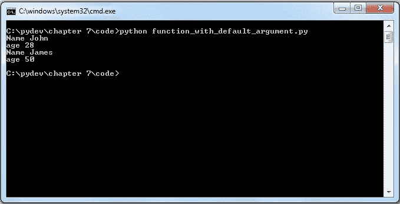

# 可变长度参数的函数

可能存在一种情况，你需要传递比函数定义中指定的更多参数。在这种情况下，可以传递可变长度参数：

**语法**

```py
def  function_name(arg, *var):
       code block
  return

```

在这里，`arg` 表示传递给函数的正常参数。`*var` 指的是可变长度参数。这将通过以下示例变得更加清晰：

```py
def variable_argument( var1, *vari): 
 print "Out-put is",var1 
 for var in vari:
 print var
variable_argument(60) 
variable_argument(100,90,40,50,60)

```

在这种情况下，我们定义了一个函数，它接受两个参数，其中第二个参数是可变长度参数。当我们第一次调用该函数时，我们只传递 `60` 作为参数的值，函数将其作为第一个参数。在我们第二次调用该函数时，我们传递了五个数字，所以函数将它们作为可变长度参数。根据传递的参数的性质，函数要么考虑第一个参数，要么考虑可变长度参数。最终，我们可以看到基于我们传递的不同值的不同输出，如下所示：

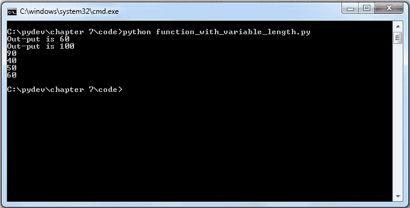

# 键值对作为可变长度参数

在某些情况下，可能需要将键值对作为可变长度参数传递给函数。以下是一个例子。在给定的例子中，键值对作为可变长度参数传递：

```py
def infocity(**var):
 print var
 for key, value in var.items():
 print "%s == %s" %(key,value)

infocity(name="l4w", age = 20, city="Los Angeles")
infocity(name="John",age=45, city="London", sex="male", medals=0)

```

使用 for 循环，我们打印出传递给函数的每个键值对。在第一次调用时，我们只传递少量键值对，而在第二次调用函数时，我们传递更多的键值对，输出结果如下所示：

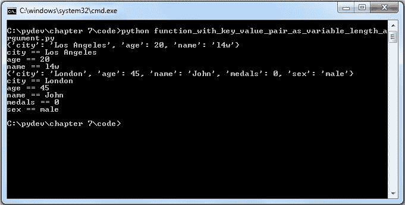

# 按引用传递与按值传递

**按引用传递**是在某些编程语言中使用的术语，其中函数参数的值是通过引用传递的，即传递变量的地址，然后在这些地址存储的值上进行操作。

**按值传递**意味着值直接作为函数参数的值传递。在这种情况下，操作是在值上进行的，然后该值存储在地址中。

在 Python 参数中，值是通过引用传递的。在函数调用期间，被调用的函数使用传递给它的地址存储的值，并且对它的任何更改也会影响源变量：

```py
def pass_ref(list1): 
 list1.extend([23,89]) 
 print "list inside the function: ",list1 
list1 = [12,67,90] 
print "list before pass", list1
pass_ref(list1) 
print "list outside the function", list1

```

在函数定义中，我们将列表传递给 `pass_ref` 函数，然后我们扩展列表以添加两个更多数字到列表中，然后打印其值。列表在函数内部扩展，但更改也会反映在调用函数中。我们最终通过打印列表的不同表示来获取输出：

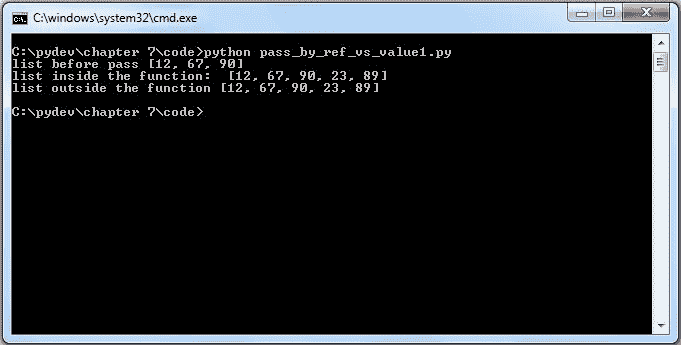

让我们看看另一个场景：

```py
def func(a): 
 a=a+4 
 print "Inside the function", a 
a= 10 
func(a) 
print "Outside the function", a

```

前面的例子可能会让你认为它是按值传递的，因为 Python 函数内部发生的更改不会反映在调用函数中。但实际上，它仍然是通过引用传递的，因为在函数内部这种情况中，我们进行了新的赋值，即 `a = a + 4`。尽管你可能认为 `a = a + 4` 正在改变存储在 `a` 中的数字，但实际上它是在重新分配 a 指向一个新的值：

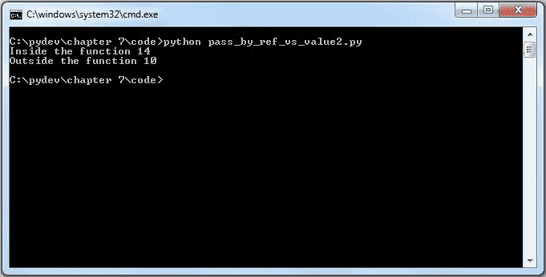

# 变量的作用域

这可能是一个对你来说第一次理解的有趣话题。但实际上，这是一个非常简单的话题。让我们尝试通过一个现实生活中的情况来理解这一点。你可能知道两种类型的航空公司：国内和国际运营商。国内运营商的范围将仅限于特定国家的运营，而国际运营商则有权在国际边界上运营。变量的范围也是如此。从更广泛的角度来看，变量的范围定义了特定变量的访问级别。Python 中变量的基本作用域有两种：

+   局部变量

+   全局变量

在 Python 函数内部定义的局部变量。局部变量仅在它们的局部作用域内可访问。全局变量是在 Python 函数外部定义的。全局变量在整个程序中都可访问：

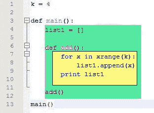

在这里，值为 `4` 的变量 `k` 是一个全局变量的例子，而 `list1` 变量是一个局部变量的例子。在 `main()` 函数内部标记为绿色的区域显示了 `list1` 变量的作用域，而标记为黄色的区域显示了在 `add()` 函数内的作用域，这个作用域一直有效到 `add()` 函数的末尾。

下面的例子将解释这两种类型的变量：

```py
def func(): 
 a =12 
 print '''Inside the function the value of 
 a is acting as local variable''', a 
a= 10 
func() 
print '''Outside function the value of a is 
 acting as global variable''',a

```

变量 a 是一个全局变量；与作为局部变量在函数内部的作用相比，其值在函数外部保持不变：

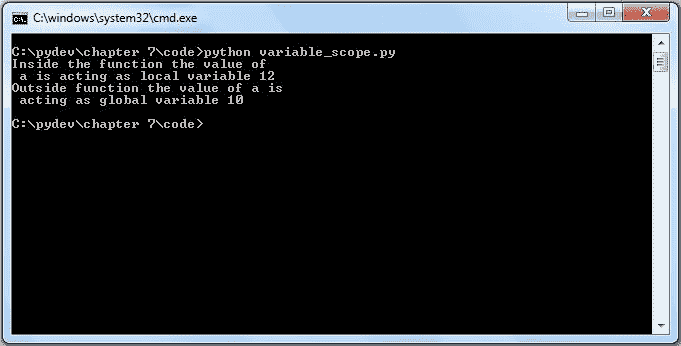

让我们分析另一种情况：

```py
def func(): 
 a =12 
 print "a inside the function is the local variable",a 
func() 
print "Trying to access the local variable outside the function.",a

```

在这里，我们声明了变量 a，其作用域仅限于 `func()` 函数。当我们尝试访问局部变量时，解释器不会支持我们，并会告诉你如下所示：

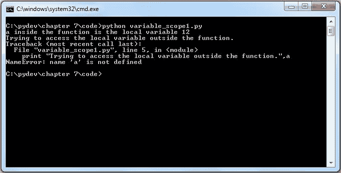

但这种情况可以通过使用 `global` 关键字来克服，正如我们将在下一个例子中所做的那样：

```py
def func(): 
    global k 
    k=k+7 
    print "variable k is now global",k 
k=10
func()
print "Accessing the value of k outside the function",k

```

在这种情况下，我们使用函数内部的`global`关键字将`k`变量声明为全局变量。现在我们可以从任何地方访问它。`global`关键字告诉解释器该变量是全局的，它应该停止在所有函数或局部作用域中搜索。

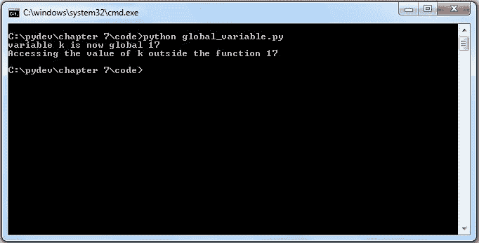

# 内存管理

这是一个非常迷人的主题，也是任何必须处理与内存相关问题的程序员的一大痛点，例如内存泄漏问题。然而，由于这是一个需要在中级阶段涵盖的大主题，我们将尝试解释这个主题的非常基础的部分。在早期，内存管理通常由所有程序员手动处理。谁比 C/C++语言程序员更了解手动内存管理呢？新的和现代的编程语言，如 Java 和其他语言，都配备了更先进的内存管理机制，因此程序员在这个领域不必担心太多，因为每个问题都由语言的垃圾回收功能处理。我们已经涵盖了什么是局部作用域和什么是全局作用域。函数的局部作用域包含参数和变量。完整的局部作用域必须存储在计算机的 RAM 中。语言将 RAM 分为两部分，称为运行时栈和堆。在任何编程语言中，内存都分为两部分：

+   栈或运行时栈

+   堆

堆是 RAM 中存储所有值（对象）的特定区域。运行时栈永远不会包含对象。运行时栈只存储指向存储在堆中值的引用。让我们通过一个例子来尝试理解：

```py
line 1 :k = 4
line 2 :def main():
line 3 :  list1 = []
line 4 : def add():
line 5 :      for x in xrange(k):
line 6 :         list1.append(x)
line 7 :     print list1
line 8 :   add()
line 9: main()

```

在执行代码的第 5、6 和 7 行期间，运行时栈看起来如图所示。运行时栈上有三个活动记录。解释器首先放置**模块活动记录**。在执行模块时，解释器从上到下移动，并将模块作用域的变量定义放入模块的活动记录中。模块的活动记录由指向值**4**的引用**k**组成。

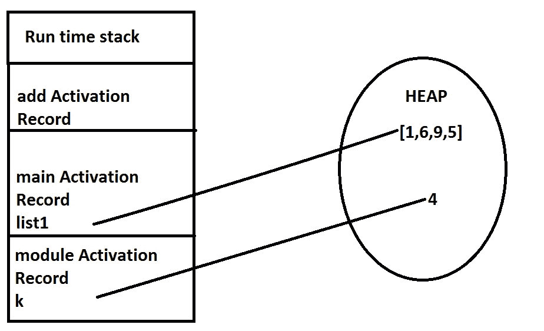

# 概述

在本章中，我们学习了函数以及如何定义一个函数。然后我们讨论了各种类型的函数，例如内置函数和用户定义函数。我们看到了用户定义函数的各种示例，其中我们解释了无参数和无返回类型的函数、有参数的函数、有参数和返回类型的函数、有默认参数的函数以及有可变长度参数的函数。我们还学习了将键值对作为可变长度参数传递给函数。我们遇到了变量的作用域，最后，我们考察了内存管理的基本概念，我们学习了两种类型的内存，即栈和堆。

在下一章中，我们将学习一个非常有趣的主题：集合。
