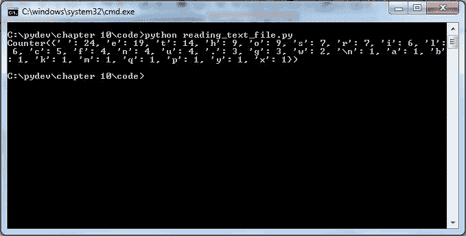

# 集合

在上一章中，我们学习了函数和变量的作用域。在函数中，我们学习了定义函数、带参数的函数、带参数和返回类型的函数、带默认参数的函数、带可变长度参数的函数，最后，在函数中，我们看到了如何使用键值对作为可变长度参数。我们涵盖了变量作用域和内存管理的内容。在本章中，我们将触及每种编程语言的精髓，那就是集合。在集合下的一些主题，如列表、字典和元组，已经在上一章中介绍过。在本章中，我们将探讨 counter、deque、有序字典、默认字典和命名元组。

# 集合

对于有编程经验的人来说，这并不是一个新话题，但对于第一次接触编程的人来说，这是一个会在他们心中引起相当多好奇心的主题。什么是集合？这个问题的答案可以通过我们日常生活中的例子很好地理解。每个人都见过邮票收藏、书籍收藏或花收藏等等。所以基本上我们是在集合中分组物品。集合包含什么类型的物品？这个问题可能是下一个问题。好吧，一个集合可以包含一种类型的物品，例如，花收藏（这里，类型是花）或者集合可以是混合集合，例如，书籍和杂志收藏（这里，类型是书籍和杂志）。在 Python 编程中，每个集合都有其独特的特征，可以用来实现预期的结果。所有的集合都是`collections`模块的一部分。

更多关于集合的信息可以在网站[`docs.python.org/2/library/collections.html`](https://docs.python.org/2/library/collections.html)找到。

# Counter

Counter 是一个容器，它跟踪值的频率。

容器是一个通用词，可以指任何可以包含任何东西的东西。例如，一个装水的桶可以被认为是一个容器，里面装着水。同样，一个客人名单可以被认为是一个容器，里面包含着名单。

语法如下：

```py
>>>import collections
>>>collections.Counter()

```

通过一个例子会更清楚：


在前面的截图中，我们直接使用 Python 命令行来展示示例。在使用`Counter`之前，你需要导入`collections`模块。在前面的示例中，我们将字符列表传递给`Counter`。`Counter`处理列表并返回每个字符的频率。在这里，频率意味着每个字符在列表中出现的次数。结果以字典的形式呈现，其中输入列表的每个字符都成为键，其频率成为该键的值。例如，`d`是键，`4`是值，这意味着字符`d`在列表中出现了四次。

让我们再看另一个例子：


我们直接将字符串序列提供给`Counter`。在这里，在这种情况下，即使是空格也被考虑在内，并计算其频率：


在这个示例中，我们创建一个电影列表，然后将该列表传递给`Counter`，它返回列表中存在的电影的频率。

# 更新函数

在编程的任何给定时间，如果需要向现有的计数器添加更多值，则可以使用`update()`方法而不是创建一个新的计数器。让我们看看`Counter`的`update()`方法。


在前面的示例中，我们尝试使用`update()`方法更新一个空的`Counter`，并将`"Locarno Caine"`传递给该方法。因此，`Counter`返回每个字符的频率。你注意到空格也有频率吗？


在前面的示例中，我们使用`update()`方法来更新提供给`Counter`的现有字符串序列。


在前面的情况下，我们使用`update()`方法来增加字符`"a"`和`"P"`的频率到现有的字符串序列中。在这里，我们学习了如何使用`update()`方法来更新一个空的计数器，更新计数器的现有输入，以及增加现有输入序列字符串到计数器的频率。

# 计数器的使用

到目前为止，我们的示例都是使用 Python IDLE GUI 演示的。现在我们将通过创建一个 Python 文件来查看计数器的使用。对于那些不理解什么是 Python 文件的人来说，请阅读第一章，*Python 入门*，然后你可以回来继续：

```py
import collections 

c = collections.Counter('King TutanKhamen was the youngest Pharoah')
print c
for letter in 'What a king?':
 print '%s : %d' % (letter, c[letter])

```

在给定的示例中，我们尝试将作为输入提供给`Counter`的字符串流与另一个字符串流进行比较。在这种情况下，`Counter`仅打印出我们想要比较的字符串序列的频率，而不是提供给`Counter`的输入字符串：


计数器对于未知项不会引发`KeyError`。如果输入字符串中找不到值（如本例中的`W`、`k`和`?`），则其计数为`0`。

图坦卡蒙（或图坦卡蒙）在公元前 1324 年左右，19 岁时作为法老统治埃及 10 年，直到他去世。直到 1922 年，当英国考古学家霍华德·卡特凿开一道门进入男孩法老的墓穴，这个墓穴已经密封了 3200 多年，他才被现代世界所知。这些信息来自[`www.history.com/topics/ancient-history/tutankhamen`](http://www.history.com/topics/ancient-history/tutankhamen)。

我们将查看另一个示例，我们将处理基本的文件操作。在这里，我们将提供一个包含句子的文本文件，并将此文件作为输入提供给计数器。以下截图显示了包含一些文本的文本文件，这些文本将作为计数器的输入：


现在，让我们看看将文本文件作为输入传递给 `Counter` 的代码：

```py
import collections

co = collections.Counter()
file_txt = open("Counter_input.txt","r")
for line in file_txt:
        co.update(line.lower())
print co

```

前面的程序给出了文本文件中所有字符的频率。我们将使用 `open()` 函数以 `read` 模式打开文件，`file_txt` 变量作为此文件处理操作的句柄。我们将使用 for 循环，并逐个从文件中更新我们的计数器。结果如下面的截图所示：



可能存在一种情况，你可能需要选择频率较高的前五个字母。你可以使用 `most_common()` 方法来实现所需的输出。

**语法**

```py
most_common(number) 

```

让我们看看前面场景的例子：

```py
import collections

co = collections.Counter()
file_txt = open("Counter_input.txt","r")
for line in file_txt:
  co.update(line.lower())

print "Most common:n"
for letter, count in co.most_common(5):
     print '%s: %7d' % (letter, count)

```

我们在这里修改了示例，现在我们正在尝试检索频率较高的前 `5` 个字母。我们简单地使用了 `Counter` 的 `most_common()` 方法。结果如下面的截图所示：


# Python 集合计数器的操作

在 Python 集合计数器中，你可以应用集合操作，如加法、减法、并集和交集。让我们通过一个例子来说明集合操作：

```py
import collections

co1 = collections.Counter(['C','L','E','O','P','A','T','R','A'])
co2 = collections.Counter('JULIUS CAESAR')

print co1
print co2

print "addition n",co1 + co2 # Prints addition of sets
print "Subtractionn", co1 - co2 # Prints substration of sets

print "Union n", co1 | co2 # Prints union of sets
print "Intersection n", co1 & co2  # Prints intersection of sets

```

在前面的例子中，我们正在对两个计数器执行集合操作。我们在两个集合上执行了加法、减法、并集和交集。结果如下面的截图所示：


# Deque

Deque（双端队列）。它可以被想象成类似空心管或管道，两端都是开放的。Deque 允许从两端添加和移除元素。以下示例将使问题更加清晰：

```py
import collections 

de = collections.deque('India')
print 'deque:', de
print 'Lenght :', len(de)
print 'left end:', de[0]
print 'right end:', de[-1]

de.remove('a')

print 'After removing:', de

```

在这里，我们向 deque `'India'` 提供输入，并使用索引打印 deque 的左侧和右侧元素，然后我们使用 `remove()` 从 deque 的右侧移除字符 `'a'`。输出将类似于以下内容：


`len()` 函数返回 deque 的长度。

# 填充 deque

正如我们之前所读到的，deque 是一个双端队列，这意味着元素可以从两端添加，或者 deque 可以从两端填充。为了添加元素或填充 deque，我们有四个函数：`extend()`、`append()`、`extendleft()` 和 `appendleft()`。让我们通过一个例子来说明我们如何填充或向 deque 的两端添加元素：

```py
import collections
d1 = collections.deque("Google")
print d1
d1.extend('raj')
print "after extend :n", d1
d1.append('hi')
print "After append :n",d1

d1.extendleft("de")
print "after extend leftn ", d1

d1.appendleft("le")
print "after append leftn ", d1

```

在这个案例中，我们将 `"Google"` 作为输入传递给 deque。然后我们通过传递 `'raj'` 作为输入来扩展列表，并将其扩展到 deque 的右侧。我们向 deque 的右侧追加另一个输入。为了向左侧添加元素，我们使用 `extendleft()` 和 `appendleft()`。程序的输出将像以下内容一样消除疑虑：


函数 `extend()` 和 `append()` 都向任何集合中添加元素。唯一的区别是 `extend()` 逐个将元素添加到集合中，而 `append()` 将所有元素视为一个整体，并将它们添加到集合的末尾。例如，`extend(['Dunkirk','Calais'])` 将两个元素 `'Dunkirk'` 和 `'Calais'` 逐个添加到集合中。而 `append(['Dunkirk','Calais'])` 将它们视为一个元素，并将其添加到集合的末尾。

`extendleft()` 函数遍历其输入，并对每个项目执行 `appendleft()` 的等效操作。最终结果是双端队列包含输入序列的逆序。

# 双端队列消费

双端队列可以从两端或一端消费。对于消费双端队列元素或检索元素，我们使用两个函数：`pop()` 和 `popleft()`。以下示例将使其更加清晰：

```py
import collections
d1 = collections.deque("abcdefghacmqdcb")
print d1
print "Poped element ",d1.pop()
print d1
print "Poped left element ",d1.popleft()
print d1

```

在这里，我们使用 `pop` 来逐个从双端队列的右端移除元素。在这种情况下，字符 `b` 被从双端队列的右端移除。`popleft()` 函数从双端队列的左端移除元素。在这里，`popleft()` 从双端队列的左端移除了字符 `a`，如下所示：


# 双端队列旋转

双端队列旋转允许对任意一端的元素进行旋转。对于右侧旋转，表示法为 `(+n)`，而对于左侧旋转，使用的表示法是 `(-n)`，其中 n 是旋转的次数：

```py
import collections

d = collections.deque(xrange(6))
print "Normal queue", d

d.rotate(2)
print "nRight rotation :", d

d1 = collections.deque(xrange(6))
d1.rotate(-2)
print "nleft rotation :", d1

```

在这种情况下，使用 `xrange()` 函数我们生成一个包含 `5` 个数字的列表，这些数字将作为我们双端队列的输入。我们首先将双端队列向右旋转，然后向左旋转。结果如下所示：


从输出中，我们可以观察到在右侧旋转中，项目向右移动。在左侧旋转中，项目向左移动。

# 有序字典

`OrderedDict` 是字典的子类，它记得元素添加的顺序：

**语法**

```py
d1 = collections.OrderedDict() 
d1 is ordered dictionary here.

```

让我们看看字典和有序字典之间的比较：

```py
import collections 
print 'Regular Dictionary'
d = {}
d['a']= 'SAS'
d['b']= 'PYTHON'
d['c']= 'R'

for k,v in d.items():
  print k, ":",v

print 'n Ordered dictionary'

d1 = collections.OrderedDict()
d1['a']= 'SAS'
d1['b']= 'PYTHON'
d1['c']= 'R'

for k,v in d1.items():
       print k, ":",v

```

在这里，我们创建了一个普通字典和一个有序字典。两个输出都显示在这里：


正如我们所见，有序字典保留了元素添加的顺序。

# 根据键对有序字典进行排序

我们可以使用 `sorted()` 函数对有序字典进行排序：

**语法**

```py
dict = collections.OrderedDict(sorted(d1.items()))
dict = New sorted dictionary
d1= Original Order dictionary

```

让我们通过一个例子来理解 `sorted()` 函数。如果您想复习 `sorted()` 函数，可以回顾第四章，*列表*：

```py
import collections 
print 'n Order dictionary'
d1 = collections.OrderedDict()
d1['a']= 'SAS'
d1['d']= 'PYTHON'
d1['b']= 'JULIA'
d1['f']= 'R'
d1['c']= 'SPARK'

for k,v in d1.items():
 print k, ":",v
print 'n Sorted Order dictionary'
dict = collections.OrderedDict(sorted(d1.items()))

for k,v in dict.items():
   print k, ":",v

```

在这里，我们创建一个有序字典 `d1`，然后使用 `sorted()` 函数对其进行排序。以下输出将使其更加清晰：


默认情况下，字典是根据键进行排序的。

# 根据值对有序字典进行排序

我们也可以根据值对有序字典进行排序：

**语法**

```py
 dict = collections.OrderedDict(sorted(d1.items(), key=lambda (k,v): v)) 
 dict = New sorted dictionary 
 d1=  Original Ordered dictionary 

```

在这里，lambda 函数将键更改为其值。按照顺序，字典返回 `(key, value)` 对。lambda 函数使 `key = value`，因此有序字典将按其值排序。让我们通过一个示例来理解有序字典的排序：

```py
import collections 
print 'n Order dictionary'
d1 = collections.OrderedDict()
d1['a']= 'SAS'
d1['d']= 'PYTHON'
d1['b']= 'SAP HANNA'
d1['f']= 'R'
d1['c']= 'JULIA'

for k,v in d1.items():
   print k, ":",v
print 'n Sorted Order dictionary'
dict = collections.OrderedDict(sorted(d1.items(), key=lambda (k,v): v))

for k,v in dict.items():
      print k, ":",v

```

从前面的示例中，你可以清楚地看到，`lambda()` 函数将 `key` 转换为 `value`，我们可以看到如下的输出：


lambda 函数在特殊函数部分有解释。

# 默认字典

到目前为止，我们已经学习了常规字典和有序字典。在本节中，我们将学习一种特殊类型的字典，称为默认字典，它由 `collections` 模块的 `defaultdict` 提供。`defaultdict` 的工作方式与正常的 `dict` 完全一样，但它初始化为一个不带参数的可调用函数 `default_factory()`，该函数为不存在的键提供默认值。

**语法**

```py
defaultdict(default_factory())

```

我们将通过两个示例来尝试理解：

```py
from collections import defaultdict

def func():
        return "Cricket"

game = defaultdict(func)

game["A"]= "Football"
game["B"] = "Badminton"

print game 
print game["A"]
print game["B"]
print game["C"]

```

在这种情况下，我们的函数或 `func` 函数充当 `default_factory` 函数。我们已将 `game["A"]= "Football"`，其中 `"A"` 是键。如果键是新的（不在 `"game"` 字典中），则 `defaultdict` 不会报错；相反，它返回由 `default_factory()` 函数返回的默认值。因此，对于新的键 `"C"`，默认值是 `"Cricket"`。这将在下面的输出中更加清晰：


可以通过以下 lambda 函数完成前面的任务。让我们通过一个示例来理解：

```py
from collections import defaultdict
game = defaultdict(lambda : "Cricket")

game["A"]= "Football"
game["B"] = "Badminton"

print game 
print game["A"]
print game["B"]
print game["C"]

```

在这里，我们只是使用了 lambda 函数，它初始化了 `"Cricket"` 的默认值，如果遇到任何新的键：


现在，接下来我们将使用 `int` 作为 `default_factory` 函数。`int` 的默认值是 `0`：

```py
from collections import defaultdict

game = defaultdict(int)

game["A"]= "Football"
game["B"] = "Badminton"

print game 
print game["A"]
print game["B"]
print game["C"]

```

在这里，我们只是为遇到的任何新键初始化了整数值。对于 `game["C"]`，返回的输出是 `0`：


# 使用默认字典解决的示例问题 - 第一个场景

让我们考虑一个由默认字典解决的简单问题；这里我们想要计算列表中存在的元素的频率。让我们通过一个示例来检查这个场景：

```py
from collections import defaultdict

game = defaultdict(int)

list1 = ['cricket', 'badminton', 'hockey' 'rugby', 'golf', 'baseball' ,   'football']

for each in list1:
        game[each]= game[each]+1

print game

```

由于默认值初始化为 `0`，我们将其增加 `1`，这样我们就可以计算列表中存在的元素的频率：


# 使用默认字典解决的示例问题 - 第二个场景

让我们分析一个场景，其中我们有一个元组对的列表。列表 `tuple_list_county = [('US', 'Wisconsin'), ('Germany', 'Bavaria'), ('UK', 'Bradfordshire'), ('India', 'Punjab'), ('China', 'Shandong'), ('Canada', 'Nova Scotia')]` 是 `(Country, county)` 的对。因此，我们的目标是使我们的县或州作为 `key`，而国家作为值的列表。让我们用以下代码来实现：

```py
from collections import defaultdict

game = defaultdict(list)

tuple_list_county =  [('US', 'Visconsin'), ('Germany', 'Bavaria'), ('UK', 'Bradfordshire'), ('India', 'punjab'), ('China', 'Shandong'), ('Canada', 'Nova Scotia')]

print game["any_value"]  

for k,v in tuple_list_county:
      game[k].append(v)

print game

```

在这里，默认值是列表本身。元组的第一个值固定为 `key`，第二个值被附加：


# 命名元组

Python 允许你创建自己的数据类型。在 Python 的集合中，`namedtuple` 提供了一个特殊功能来创建自己的数据类型。在 C 语言中，你可能使用 struct 来创建自己的数据类型。当你想要创建一个新的数据类型时，你可能想要探索一些问题的答案，比如新数据类型的名字应该是什么？新数据类型的字段有哪些？让我们通过 `namedtuple` 的语法和示例来讨论这个问题。

**语法**

```py
collections.namedtuple(typename, field_names[, verbose=False][, rename=False])

```

让我们尝试理解 `namedtuple` 的语法。在先前的语法中：

+   `typename` 定义了新数据类型的名字

+   `field_names` 可以是一个字符串序列，例如 `['x', 'y']`，或者是一个由空格或逗号分隔的字符串

+   如果 `verbose` 是 `False`，则不会打印类定义，将其保持为 `False` 是一个好主意

+   如果 `rename` 是 `False`，则无效的字段名将自动替换为位置名，例如，`'def, age, empid'` 转换为 `'_0, age, empid'`，因为 `def` 是一个关键字

让我们通过一个示例来讨论：

```py
import collections
employee = collections.namedtuple('emp','name, age, empid')

record1 = employee("Hamilton", 28, 12365 ) 

print "Record is ", record1
print "name of employee is ", record1.name
print "age of employee is ", record1.empid

print "type is ",type(record1)

```

在这里，我们创建了一个 `namedtuple emp`，它将包含员工的姓名、年龄和员工 ID。我们打印出完整的记录，包括 `name`、`empid` 和 `namedtuple` 包含的记录类型。为了访问 `namedtuple` 的值，我们使用点 (`.`) 操作符和元组名。由于 `namedtuple` 包含的记录类型为 `emp`，所以结果显示与这里相同：


# 添加值并创建字典

在下一个示例中，我们将了解如何将列表值添加到 `namedtuple` 中，以及如何从 `namedtuple` 中创建字典：

```py
import collections
employee = collections.namedtuple('emp','name, age, empid')
list1 = ['BOB', 21, 34567]
record2 =employee._make(list1)
print record2
print "n"
print (record2._asdict())

```

在这里，通过使用 `_make`，我们可以将列表添加到 `namedtuple` 中，通过使用 `_asdict`，我们可以创建 `namedtuple` 的字典：


现在，考虑一个场景，你可能想要从 `namedtuple` 中替换一个值。像元组一样，`namedtuple` 也是不可变的。但你可以使用 `replace` 函数来替换 `namedtuple` 中的值：

```py
import collections
employee = collections.namedtuple('emp','name, age, empid')

record1 = employee("Marina", 28, 12365 ) 

print "Record is ", record1
print "n"
print  record1._replace(age= 25)
print "n"
print "Record is ", record1
print "n"
record1 = record1._replace(age= 25)
print "Record is ", record1

```

在这里，我们只是使用点 (`.`) 操作符后跟 `_replace()` 函数，并将新值作为输入提供给 `_replace()` 函数。这样，我们就可以替换 `namedtuple` 中的现有值：


# 概述

在集合部分，我们学习了集合的概念，并询问了集合在任意编程语言中的重要性是什么？我们了解了 Python 编程语言中可用的不同类型集合。我们还学习了模块集合及其各种成员，这些成员我们在代码中导入。我们还学习了计数器（counter）、双端队列（deque）、有序字典（ordered dictionary）、默认字典（default dictionary），以及最后的命名元组（namedtuple）。在下一章中，我们将探讨一些面向对象编程（OOPs）的概念，并了解 Python 如何支持这些 OOPs 概念。
