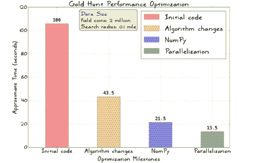
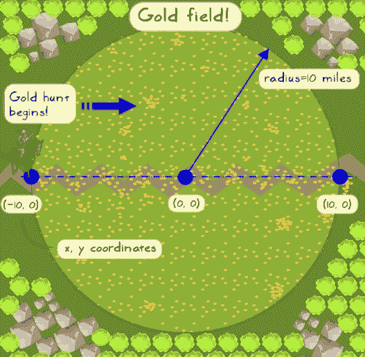
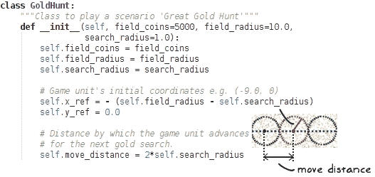
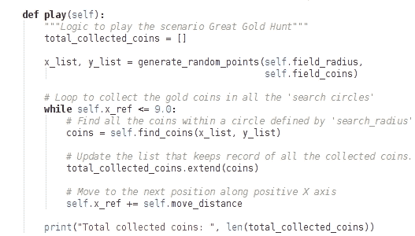
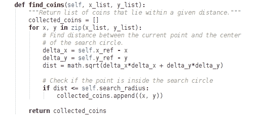
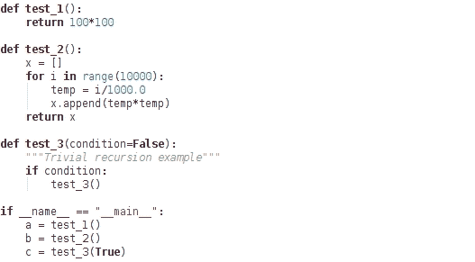
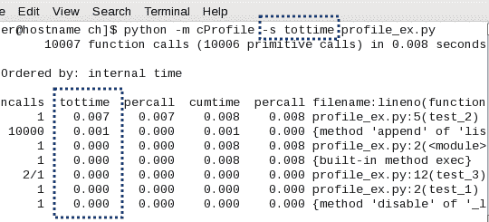
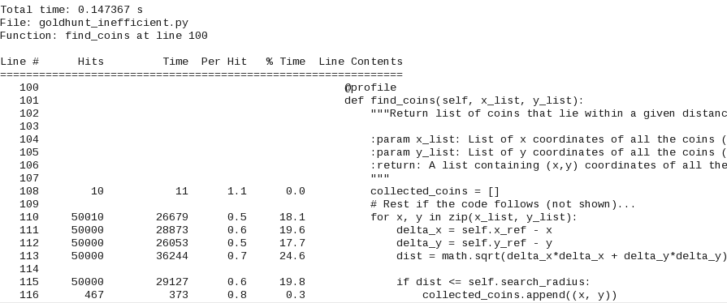
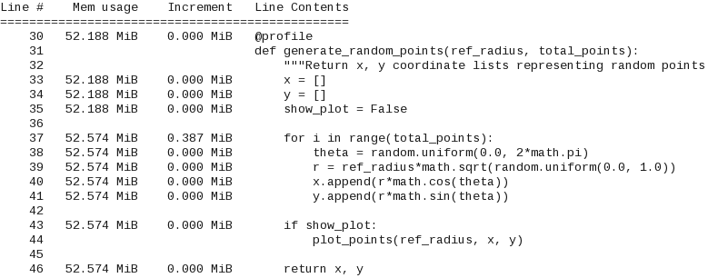
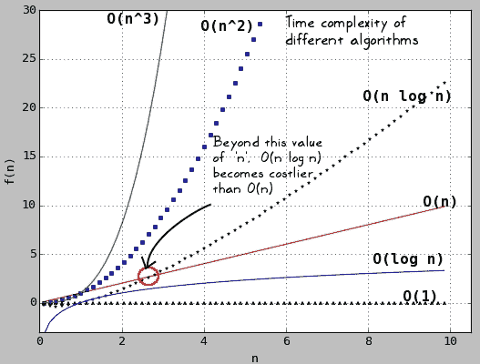

# 第七章。性能 – 识别瓶颈

到目前为止，您已经学习了各种使应用程序健壮并适应新功能的方法。现在，让我们讨论提高应用程序性能的技术。这个广泛的话题被分为三个章节系列——这是本系列中的第一个。它将涵盖以下主题：

+   计时应用程序运行时间的基本方法

+   如何通过代码分析来识别运行时性能瓶颈

+   使用`memory_profiler`包进行基本内存分析

+   计算复杂度的**大 O**表示法

为了更好地理解这些概念，我们将开发一个有趣的场景游戏，称为*黄金狩猎*。您很快就会意识到，当您增加输入数据大小时，应用程序运行得非常慢。本章将详细阐述定位此类问题的技术。

# 三个性能章节概述

在我们深入主要讨论之前，让我们首先了解性能提升章节是如何组织的。如前所述，这个讨论被分为一系列三个相互关联的章节。

## 更多的关注运行时性能

性能提升这个术语可以意味着几件事情。可能是在谈论提高运行时间（CPU 使用率），使应用程序内存高效，减少网络消耗，或者这些的组合。在这本书中，我们将主要关注运行时性能提升。我们还将讨论内存消耗方面，但讨论将限于**内存分析**技术和生成器表达式的使用。

## 第一个性能章节

您正在阅读本系列的第一个章节。它进行了一些准备工作以提高应用程序的性能。这些准备工作包括测量运行时间，识别导致性能瓶颈的代码片段，理解大 O 表示法，等等。


| *当然！我们将开发之前提到的**黄金狩猎场景**，然后识别代码中的性能瓶颈。接下来的两个章节将利用这个基础逐步提高应用程序的性能。* |
| --- |

## 第二个性能章节

下一章将全部关于学习各种性能提升技术。前半部分旨在提高*黄金狩猎*应用程序的应用程序运行时间。后半部分教授一些优化代码的技巧。本章涵盖了为高性能和内存效率设计的内置模块。它还讨论了列表推导式、生成器表达式、数据结构的选择、算法变更等等。

## 第三个性能章节

本系列中的最后一章将简要介绍**NumPy**包和 Python 中`multiprocessing`模块的**并行化**。我们将使用这些技术来显著提高应用程序的运行时性能。

## 即将到来的应用程序加速预览

下面是*金矿寻宝*程序从乌龟进化到兔子的预览。以下图表显示了性能改进每个主要步骤后的近似运行时间。当我们完成第九章，*性能改进 – 第二部分，NumPy 和并行化*时，应用程序的运行时间将从大约 106 秒减少到大约 14 秒。



没有必要花费时间去理解图表中展示的元素；一旦你阅读完关于性能的三个章节，一切都会变得清晰。现在，你需要知道的是，在接下来的章节中，我们将学习一些技术来显著提高应用程序的运行时间。

### 小贴士

**注意**

性能章节将展示一些低效代码的例子。运行这些例子可能会消耗大量的计算资源。你不需要使用这些章节中展示的问题规模，而应根据你的机器能处理的数据量选择合适的数据规模。

# 场景 – 金矿寻宝

| *你最近在游戏中引入了一个新的场景——为了支付军队的开销，Sir Foo 正在执行一项任务，从最近获得的领土中收集金子。这个场景从 Sir Foo 到达一个充满金币、珠宝等等的地方开始。然而有几个问题。首先，金子散落在整个矿场上。其次，Sir Foo 没有时间收集矿场上所有的金子。* |
| --- |


| *Sir Foo 身后你所看到的是一个虚构的**金矿**。Sir Foo 将从左侧进入并穿越这片矿场。他只会收集沿着他路径躺着的硬币，**忽略矿场上散落的其余金子**。* |
| --- |

让我们将这个金矿表示为一个半径约为 10 英里（直径 20 英里）的圆，中心位于坐标*x = 0*和*y = 0*，如下截图所示：



观察以下截图。*虚线*（矿场的直径）显示了 Sir Foo 在离开时走过的路径。在这 20 英里的旅程中，他在 10 个*等距的点*上停下来。换句话说，这些点相隔 2 英里，由小“搜索圆”的中心表示。对于每个停留点，他收集搜索圆内的金子。收集到的总金子是这 10 个小圆内硬币的总和。让我们不考虑这些搜索圆外的金子。

假设矿场上剩余的金子对我们正在解决的问题无关紧要。


## 高级算法

以前面的截图为参考，让我们编写高级算法。我们将保持其简单。任务是收集图中每个小圆内的金币（记住，这些圆被称为*搜索圆*）。我们将这些圆的半径称为*搜索半径*。在当前场景中，搜索半径是 1 英里，或者我们可以简单地称之为 1 个单位：

1.  在一个金矿区域内随机创建代表金币的点。金矿区域用一个半径为 10 个单位的圆表示，圆心在*(x = 0, y = 0)*。每枚金币用一个*(x,y)*位置表示。

1.  从最左边的搜索圆开始，其中心代表 Sir Foo 的当前位置。金币搜索被限制在这个搜索圆内。

1.  对于每个搜索圆：

    +   获取 Sir Foo 的当前位置坐标。

    +   计算场上每枚金币与 Sir Foo 位置（搜索圆的中心）之间的距离。

    +   收集所有距离小于*搜索半径*的金币。这些是位于当前搜索圆周内的金币。

    +   将 Sir Foo 移动到下一个搜索圆的中心。

    +   重复前面的步骤，直到达到最右边的圆。

1.  报告收集到的金币总数。

## 检查初始代码

让我们接下来回顾代码（它也可以在支持代码包中找到，只需查找`goldhunt_inefficient.py`文件）。下面是一个新的`GoldHunt`类：



这个类的`play`方法包含主要逻辑，如下面的截图所示：



让我们回顾前面截图中的代码：

+   `play`方法的输入参数`field_coins`和`field_radius`分别设置金币的数量和圆形金矿的半径。这些是可选参数，具有默认值，如`__init__`方法中所示。第三个可选参数`search_radius`帮助定义较小搜索圆的半径。

+   `x_ref`和`y_ref`变量代表当前搜索圆的*中心*。我们通过假设一个恒定的`y_ref`值为`0.0`来简化了问题。

+   `play`方法首先生成代表散布在金矿上的金币的随机点。`generate_random_points`函数返回两个 Python 列表，包含场上所有金币的`x`和`y`坐标。

+   在`while`循环中，`total_collected_coins`列表存储了位于*搜索圆*内的金币坐标，从最左边的一个开始。

+   实际的搜索操作是通过`find_coins`方法完成的。

接下来，让我们回顾`GoldHunt.find_coins`方法：



此方法遍历场上的所有点（金币），并对每个点，计算其与搜索圆心的距离。有了这个距离，我们可以确定给定的金币是否位于搜索圆的周界内。这在下图中以示意图的形式展示。`(x_ref, y_ref)` 坐标代表搜索圆心的位置。`(x, y)` 参数是场上任何金币的坐标。


在此图中，点与中心之间的距离用 **dist** 表示。它显示了两个代表性的点（或金币）。旁边带有 *勾号* 的第一个点位于圆内，而带有 *叉号* 的另一个点位于圆外。只有位于圆内的点被收集。该方法返回一个 `collected_coins` 列表，其中包含所有此类点的位置元组 `(x,y)`。

让我们回顾一下在场上创建随机点的函数：


如果你具备基本的数学背景，你应该能够比较容易地理解这段代码。以下是它是如何工作的：

+   考虑一个半径为 `r`、角度为 `theta` 的点。

+   这个点的笛卡尔坐标是 *x = r*cos(theta)* 和 *y = r*sin(theta)*。

+   内置函数 `random.uniform` 用于在 `0.0`（场中心）和 `ref_radius`（场半径）之间随机变化 `r`。注意，没有显示 `import` 语句。有关这些，请参阅 `goldhunt_inefficient.py`。

+   同样，`theta` 角度在 `0.0` 和 `2*math.pi`（360 度）之间随机变化。

### 小贴士

**绘制点**

您可以使用 **matplotlib**，一个 Python 绘图库，可视化生成的随机分布的金币。我们在这里不会讨论绘图技术。请查看他们的网站 ([`matplotlib.org`](http://matplotlib.org))，那里提供了一些教程和安装说明。Python 发行版，如 Anaconda，预装了 matplotlib。您还可以使用 `goldhunt_inefficient.py` 文件中提供的绘图函数 `plot_points`。

## 运行代码

主要执行代码如下：

```py
if __name__ == '__main__': 
    game = GoldHunt() 
    game.play()
```

此代码使用默认参数来实例化 `GoldHunt`。使用默认参数，代码应该可以顺利运行并在几秒钟内完成。实际时间将取决于您的机器配置、可用 RAM 等因素。您可以通过添加一些信息性的 `print` 语句来查看游戏进度。以下是使用默认参数的示例输出：

```py
[user@hostname ch7]$ python goldhunt_inefficient.py 
Circle# 1, center:(-9.0, 0.0), coins: 55 
Circle# 2, center:(-7.0, 0.0), coins: 37 
Circle# 3, center:(-5.0, 0.0), coins: 54 
Circle# 4, center:(-3.0, 0.0), coins: 47 
Circle# 5, center:(-1.0, 0.0), coins: 53 
Circle# 6, center:(1.0, 0.0), coins: 60 
Circle# 7, center:(3.0, 0.0), coins: 44 
Circle# 8, center:(5.0, 0.0), coins: 50 
Circle# 9, center:(7.0, 0.0), coins: 51 
Circle# 10, center:(9.0, 0.0), coins: 51 
Total_collected_coins = 502

```

# 问题

| 在游戏场景中，你允许用户调整某些参数。例如，用户可以控制场上的**总硬币数**或修改**搜索圆的半径**。无意中，你打开了一个新的问题。对于大量输入，程序运行非常慢。例如，游戏的一个变体，**Foo 山的巨魔**正在执行黄金狩猎。让我们听听他有什么要说的： |
| --- |


如果你将`field_coins`从`5000`改为`1000000`，并将`search_radius`设置为`0.1`，应用程序完成这个过程将需要相当长的时间。以下是带有这些新参数的更新后的主要执行代码：

```py
if __name__ == '__main__': 
    game = GoldHunt(field_coins=1000000, search_radius=0.1) 
    game.play() 
```

如果你进一步增加硬币数量或使搜索半径变得更小，这将严重影响应用程序的运行时间。

### 小贴士

**警告！**

如果你运行以下代码，根据你的机器配置，它可能会减慢你的机器速度，延长完成时间，在某些情况下（配置平均的机器）计算机可能停止响应。如果你不确定，最好不要运行它！这里只是作为一个例子展示。如果你真的想尝试，那么请自行承担风险！

例如，完成此操作可能需要几秒钟或几分钟。我们在这里能做些什么来提高性能？在跳到那之前，让我们首先回顾一些识别瓶颈的技术。

# 识别瓶颈

在上一节中，我们看到了不同的输入参数选择如何降低应用程序的运行时间。现在，我们需要一种方法来准确测量执行时间，并找出性能瓶颈或代码中耗时的部分。

## 测量执行时间

让我们从监控应用程序的执行时间开始。为此，我们将使用 Python 的内置`time`模块。`time.perf_counter`函数是一个性能计数器，它返回一个具有最高可用分辨率的时钟。此函数可用于确定函数连续两次调用之间的时间间隔或系统范围内的时间差。

### 小贴士

`time.perf_counter`函数从 Python 3.3 版本开始可用。如果你有较旧的 Python 版本（例如，2.7 版本），请使用`time.clock()`代替。在 Unix 上，`time.clock()`返回一个表示处理器时间的浮点数（以秒为单位）。在 Windows 上，它返回自函数第一次调用以来经过的墙钟时间（以秒为单位）。

原始文件`goldhunt_inefficient.py`已经包含了以下代码：

```py
import time

if __name__ == '__main__': 
    start = time.perf_counter() 
    game = GoldHunt() 
    game.play() 
    end = time.perf_counter() 
    print("Total time interval:", end - start)
```

在文件开头，我们导入 `time` 模块。`start` 变量标记性能计数器的开始，而 `end` 变量代表其第二次连续调用。在这之间，我们将运行主要执行代码。计数器两个值之间的差异可以用作应用程序运行时间的指标。同样，你可以在代码的其他地方插入这些调用以监控单个代码片段。

## 测量小代码片段的运行时间

内置的 `timeit` 模块是一个用于快速检查小代码片段执行时间的有用工具。它可以从命令行使用，也可以在代码内部导入和调用。以下是使用命令行界面使用此功能的一种方法：

```py
$ python -m timeit "x = 100*100" 
100000000 loops, best of 3: 0.0155 usec per loop

```

`-m` 选项允许从命令行运行 `timeit` 模块。在上面的例子中，它测量了 `x = 100*100` 语句的执行时间。

让我们回顾一下这个执行的输出。输出中的 `100000000 loops` 表示 `timeit` 执行代码的次数。它报告了三次测量的最佳时间。在这个例子中，单次执行的最好时间是 `0.0155` 微秒。你也可以通过使用 `--number` 参数来调整代码运行的次数，如下面的代码片段所示。在这里，代码只运行了 `10` 次：

```py
$ python -m timeit --number=10  "x = 100*100" 
10 loops, best of 3: 0.0838 usec per loop 

```

在内部，`timeit` 使用 `time.perf_counter` 来测量时间。这是自 Python 3.3 版本以来的默认实现。有关更多详细信息，请参阅文档（[`docs.python.org/3/library/timeit.html`](https://docs.python.org/3/library/timeit.html)）。

## 代码分析

我们迄今为止看到的性能测量技术工作得相当好，尤其是当你想要为应用程序运行基准测试时。然而，在整个项目中实现这些计时器以获取完整的执行配置文件通常很繁琐。这就是代码分析发挥作用的地方。这是一种在程序运行时分析程序并收集一些重要统计数据的技术。例如，它报告了该程序中各种函数调用的持续时间和频率。这些信息可用于识别代码中的性能瓶颈。

### cProfile 模块

让我们看看如何使用 `cProfile`，Python 的内置代码分析模块。为了说明目的，我们将使用支持代码包中的 `profile_ex.py` 文件。它包含三个执行一些简单任务的功能，如下面的截图所示：



`cProfile` 命令可以从命令提示符运行，也可以通过导入要测试的模块内部来运行。以下是使用命令提示符运行时的输出：


### 注意

**IPython**交互式外壳还提供了一个方便的魔法命令，称为`%prun`。使用它，你可以快速分析 Python 语句。更多信息，请查看[`ipython.org/ipython-doc/3/interactive/magics.html`](https://ipython.org/ipython-doc/3/interactive/magics.html)。

让我们来理解这次运行的输出：

+   输出的第一行显示了监控到的函数调用总数。其中大部分是由于`test_2`内部的`for`循环引起的。对于每次迭代，它都会调用 Python `list`数据类型的`append`函数。

+   在同一输出行上，它还报告了`原始调用`的数量。这些是不涉及**递归**的函数调用。`test_3`函数展示了递归的一个例子。为了更好地理解这一点，通过打印输入参数`condition`的值来运行代码。在这种情况下，只有一个递归函数调用。

+   `ncalls`列表示函数调用的次数。如果你将它们加起来，总的调用次数变为`10007`，与输出第一行报告的相同。注意，对于`test_3`，它报告的函数调用为`2/1`。这意味着该函数被调用两次，但其中一次是递归调用。

+   `tottime`列表示在给定函数中花费的总时间。

+   `percall`列记录了`totcall/ncalls`除法的商。

+   在特定函数内部（包括其子函数）花费的时间由`cumtime`（累积时间）报告。

+   `percall`列报告了`cumtime`/`原始调用`的商。

+   最后一列基本上是与函数相关的数据。它包括内置函数调用，例如 Python `list`的`append`方法等。

默认情况下，输出按`标准名称`排序。为了理解瓶颈，这种排序顺序并不十分有用。相反，你可以按累积时间、函数调用次数等排序。这可以通过命令行选项`-s`实现。有关可用排序选项的完整列表，请参阅[`docs.python.org/3/library/profile.html`](https://docs.python.org/3/library/profile.html)。

以下截图显示了按`tottime`排序的输出。观察发现，它花费了最多时间在`test_2`函数中。



现在我们已经知道了如何使用`cProfile`，让我们用它来分析*黄金寻宝*问题。按照以下方式运行原始的`goldhunt_inefficient.py`文件，使用所有默认选项：

```py
$ python -m cProfile goldhunt_inefficient.py 

```

由于涉及多个内部函数调用，它会在终端窗口中打印大量信息。可选地，你可以将`stdout`重定向到文本文件。为了有效地分析这些数据，Python 提供了一个内置模块，称为`pstats`。让我们在下一节中看看如何使用它。

### pstats 模块

`pstats`模块可以用于进一步处理由`cProfile`生成的分析数据。与`cProfile`提供的有限选项相比，它为您创建报告提供了更大的控制权。`cProfile`生成数据的分析是通过`pstats.Stats`类完成的。为了使`cProfile`的输出可供`pstats`使用，我们需要使用命令行选项`-o`将其写入文件，如下所示：

```py
$ python -m cProfile -o profile_output goldhunt_inefficient.py 

```

因此生成的`profile_output`文件不可读。虽然我们可以继续将此文件提供给`pstats.Stats`，但最好通过组合这两个实用程序来自动化整个过程。以下是一个简化的代码示例，实现了这一点：


### **提示**

**警告**

这是一个没有错误检查的简化示例！例如，代码没有检查输出文件是否已存在。为了使代码健壮，应在适当的地方添加此类检查和`try…except`语句。

此代码也作为`profiling_goldhunt.py`包含在本章的支持代码包中。让我们快速回顾一下这段代码的功能：

+   主要执行代码展示了如何使用`cProfile`的`run`方法运行。`run`的第一个参数是要监控的函数（或语句），而第二个参数是存储分析输出的文件名。

+   `view_stats`函数是我们使用`pstats`功能的地方。该函数将生成的分析输出（`filname`）作为第一个参数。在创建`pstats.Stats`实例时使用。

+   `Stats`类的`strip_dirs`方法用于从文件名中移除所有前导路径信息字符串。这通过仅显示文件名来减少最终输出的杂乱。

+   使用`print_stats`方法，我们可以在最终输出中施加一些限制。在这个例子中，它查找最右侧列中的`goldhunt`字符串，并显示匹配的行，忽略所有其他行。换句话说，它限制了与`goldhunt_inefficient.py`内部函数调用相关的信息。

### **注意**

`pstats.Stats`类提供了其他一些有用的功能。例如，`print_callees`方法打印出被监控函数调用的所有函数的列表。有关更多详细信息，请参阅 Python 文档（[`docs.python.org/3/library/profile.html#pstats.Stats`](https://docs.python.org/3/library/profile.html#pstats.Stats)）。

此代码可以从命令提示符运行，如下所示（它依赖于`goldhunt_inefficient.py`，所以请将其放在与该文件相同的目录中）：

```py
$ python profiling_goldhunt.py

```

这是此运行过程的示例输出（仅显示与统计相关的输出）：


这将显著减少输出，并且仅限于我们希望监控的程序中的函数调用。如输出所示，只有`19`个函数调用中的`5`个被列出。列表按执行函数所花费的总内部时间排序。两个函数`find_coins`和`generate_random_points`位于榜首！它们的顺序可能取决于我们为`field_coins`和`search_radius`变量选择的值。但本质上，代码分析帮助我们识别了应用程序中最耗时的代码。


| *好问题！如果我们能查看函数内部并看到逐行分析输出，那当然会很有帮助。幸运的是，有一个工具可以实现这一点。让我们接下来回顾一下。* |
| --- |

### `line_profiler`包

`line_profiler`包是一个第三方 Python 包，可以使用`pip`安装：

```py
$ pip install line_profiler

```

这个包可以用来逐行监控函数的性能。当你安装这个包时，它也会创建一个可执行的`kernprof`。

在 Linux 上，这个可执行文件与您的 Python 可执行文件位于同一位置。例如，在 Linux 上，如果 Python 可用作`/usr/bin/python`，则此可执行文件创建为`/usr/bin/kernprof`（或查找`kernprof.py`脚本）。在 Windows 操作系统上，它应该与`pip.exe`位于同一位置。有关`pip.exe`路径，请参阅第一章，*开发简单应用程序*，*开发简单应用程序*。

### 小贴士

在 Windows 操作系统上，如果您遇到任何错误，例如**错误：无法找到 vcvarsall.bat**，您可能需要使用 Visual C++ Express。有关更多信息，请参阅[`www.visualstudio.com/en-US/products/visual-studio-express-vs`](https://www.visualstudio.com/en-US/products/visual-studio-express-vs)。

使用这个工具需要对代码进行微小的修改。您需要做的只是在上面的函数或方法名上方添加一个`@profile`装饰器，如下面的截图所示：


然后，使用以下命令运行工具：

```py
$ kernprof -v -l goldhunt_inefficient.py

```

`-v`或`--view`选项在终端窗口中显示配置文件输出的结果。分析器还会创建一个输出文件，`goldhunt_inefficient.py.lprof`。`-l`或`--line-by-line`选项使用来自`line_profiler`模块的逐行分析器。

### 小贴士

当您不使用`line_profiler`分析应用程序时，请务必删除装饰器`@profile`。换句话说，在运行应用程序时删除它，如下所示：

```py
$ python goldhunt_inefficient.py

```

否则，它将引发`NameError`异常。

下面显示了`find_coins`方法的`line_profiler`输出。

如您所见，相当多的时间被花费在计算点（金币）与搜索圆心的距离上。



同样，如果您看到`generate_random_point`函数的输出，大部分时间都花在创建一个随机的`theta`角度和`r`半径的组合上，这些组合用于定义一个点（一个金币）。

# 内存分析

我们到目前为止所涵盖的剖析技术旨在找到运行时瓶颈。让我们简要讨论内存分析，这是剖析的另一个重要方面。

## 内存分析器包

对于内存分析，我们将使用一个流行的 Python 包，称为`memory_profiler`。它可以通过`pip`安装。以下是如何在 Linux 命令行中安装它的方法：

```py
$ pip install memory_profiler

```

文档强烈建议安装`psutils`模块。它还建议，为了使`memory_profiler`在 Windows 操作系统上工作，您将需要`psutil`模块。可以使用`pip`安装`psutil`模块，如下所示：

```py
$ pip install psutil 

```

### 小贴士

关于`memory_profiler`的更多信息，请查看以下页面：[`pypi.python.org/pypi/memory_profiler`](https://pypi.python.org/pypi/memory_profiler)。

就像`line_profiler`一样，`memory_profiler`包在函数名上方使用`@profile`装饰器。让我们在`generate_random_points`函数上方添加装饰器`@profile`，然后对`goldhunt_inefficient.py`文件运行内存分析器。运行此命令的命令如下：

```py
$ python -m memory_profiler goldhunt_inefficient.py

```

这里是内存分析器的输出。它按行报告内存消耗。请注意，分析器打印了整个函数，包括文档字符串。为了便于说明，部分文档字符串没有显示。



代码中的行号显示在第一列。第二列`Mem Usage`告诉我们 Python 解释器执行该行号后消耗了多少内存。内存的单位是**梅比字节**（**MiB**）。第三列`Increment`给出了当前行与上一行之间的内存差异。如果当前行代码释放了内存，那么`Increment`列将显示负数。最后一列显示了实际的代码行。从`Increment`列可以看出，内存主要消耗在`for`循环中。我们将在下一章中使用内存分析器来比较生成器表达式和列表解析的内存效率。

# 算法效率和复杂度

算法是一组解决特定问题的指令。在这个上下文中，算法可以是一个函数，甚至是一个简单的加法操作，用于将两个数字相加。让我们了解两个相关的术语：算法效率和算法复杂度。

## 算法效率

算法效率表示算法消耗的计算资源。通常，资源消耗越低，效率越好。计算资源可以指很多种东西。一种可能是谈论运行时间（CPU 使用率）、内存消耗（RAM 或硬盘）或网络消耗，或者这些的组合。

应用需求决定了哪种资源比其他资源更重要。例如，在 Web 应用中，网络使用可能比磁盘空间更重要。对于科学应用，你可能需要所有的内存，但运行时间可能会很痛苦，等等。在这本书中，我们将只讨论运行效率。

## 算法复杂度

假设你有一个程序（一个算法）在五分钟内处理一些数据。如果你增加数据的大小，程序需要多少时间？答案在于算法复杂度。它告诉我们，如果你增加问题的大小，算法将如何扩展。换句话说，计算复杂度影响了算法的性能。在下一节中，你将学习如何表示计算复杂度。

# 大 O 记号

简单来说，大 O 或大 O 记号是一种表示算法计算复杂度的方法。在这里，O 是字母*O*，表示*顺序*，而不是数字零。大 O 表示算法复杂度的上界或最坏情况（详细内容将在下一节中介绍）。这个概念可以通过一个例子来更好地解释。让我们看看以下代码：

```py
num = 100 
x = []
for i in range(num): 
    x.append(i)
```

让我们把这段简单的代码片段称为算法。它是一个简单的操作，在`for`循环中将一个数字添加到`list`中。在这里，`num`代表算法使用的输入大小。如果你增加`num`，算法将不得不在`for`循环中做更多的工作。进一步增加，这个可怜的算法将不得不做更多的工作。因此，算法所需的时间取决于`num`的值，可以表示为一个增长函数，*f(n)*。在这里，*n*代表输入的大小，对应于这个例子中的`num`。

### 小贴士

到目前为止是否理解了？你也可以通过测量执行时间来测试这一点。为了看到真正的差异，请选择一个较大的`num`值。

在这个算法中，最耗时的部分是`for`循环，它将决定算法的整体运行时间。在`for`循环内部，每次调用`x.append(i)`都需要常数时间，*t*，来完成。对于较大的`num`值，循环的总时间将大约是*num*(t)*。因此，整个算法相对于`num`的运行效率是线性的。从大 O 记号的角度来看，这个特定的算法被认为是*O(n)*复杂度。

## 大 O 复杂度类别

让我们回顾一下大 O 复杂度类。以下图表注释了各种复杂度类，并显示了*f(n)*如何影响算法的运行时间：



在*Y*轴上，我们有*f(n)*函数，而*x*轴代表输入大小，*n*（前一次讨论中的`num`变量）。这个图比较了一些表示算法时间复杂度的常见函数。

应该注意的是，大 O 表示法不包括常数。因此，即使两个算法具有相同的大 O 复杂度，它们的运行性能也可能非常不同。图中的圆点标记显示了两个复杂度函数之间的典型交叉点。在这个例子中，这是在*O(n)*和*O(n log n)*之间。如前所述，代表这些复杂度函数的个别算法将具有不同的常数乘数（在大 O 表示法中未反映）。调整这些乘数可以改变这个交叉点发生的位置。

让我们简要回顾一下这些符号。

### O(1) – 常数时间

无论输入大小如何，算法所需的时间都保持不变。获取 Python 列表的长度（`len(x)`，其中`x`是列表）或我们之前看到的`append`列表操作，都是*O(1)*复杂度的几个例子。

### O(log n) – 对数复杂度

算法所需的时间与输入大小的对数成正比。对数复杂度的一个例子是**二分查找算法**。它从检查排序数组的中间元素开始。如果被搜索的值小于中间元素，则包括这个中间元素在内的整个上半部分将从搜索中排除。我们可以这样做，因为这是一个**排序数组**。这个过程会重复进行剩余的一半，直到我们找到所需的值。

感到困惑？让我们看看仙女最近在忙些什么……

| *小仙子在一间满是宝箱的房间里丢失了她的魔法钥匙。这些箱子编号从 1 到 100，并按顺序排列。换句话说，箱子已经排序，钥匙放在其中一个箱子里。她正试图在魔杖的帮助下找到它。魔杖知道钥匙在，例如，编号为 82 的箱子里，但它不会给出直接的答案！它期望她提出正确的问题。**她正站在房间的中间，面对着编号为 50 的箱子。向她的左边，她看到数字 1 到 49；向她的右边，数字 51 到 100，按此顺序排列。**她问魔杖，钥匙在编号为 50 的箱子里吗？魔杖说“不在”。她进一步问，数字是大于 50 还是小于 50？魔杖回答“大于 50”。**有了这个回答，她忽略了左侧的箱子（1-49），包括编号为 50 的箱子，然后站在她右边的中间位置（51-100）。现在，她面前是编号为 75 的箱子。她以编号为 75 的箱子为参考，重复提出问题。每次，剩余的箱子数量减半。搜索操作一直进行到她在编号为 82 的箱子里找到她的钥匙。* |
| --- |

这就是二分查找的精髓。你可以在维基百科上找到更多信息（[`en.wikipedia.org/wiki/Binary_search_algorithm`](https://en.wikipedia.org/wiki/Binary_search_algorithm)）。在最坏的情况下，这种搜索的时间复杂度为*O(log n)*。另一种看待对数复杂度的方法是：对于问题规模*n*的指数增长，算法所需的时间线性增加。如前图表所示，*O(log n)*的时间复杂度比*O(n)*（线性时间）复杂度要好，但不如*O(1)*。

### O(n) – 线性时间

我们已经看到了一个例子，其中`for`循环使得算法的复杂度为*O(n)*。在 Python 列表中查找最小或最大元素以及复制列表或字典都是这种复杂度的其他例子。

### O(n log n) – 对数线性

一个对数线性时间复杂度的例子是**快速排序算法**。让我们再次请出小仙子，以便更好地了解这个算法的工作原理。

| *仙女进入另一个宝藏室，发现它极其杂乱。宝箱在房间里到处随意散落。不喜欢这种状况，她决定按照宝箱的价值（或价格）递增的顺序对它们进行排序。最初，宝箱是随机放置的，如下所示：**[5 3 2 4 9 7 8 8]**。在这里，数字代表每个宝箱的价值。仙女开始挑选一个枢轴宝箱，比如说价值标签为 5 的宝箱。然后她将宝箱重新排列成三个部分：（i）价值低于 5 的宝箱位于枢轴的左侧，（ii）枢轴宝箱 5，（iii）价值高于 5 的宝箱位于右侧。如下所示：**[3 2 4 5 9 7 8 8]**。将 5 固定在其位置后，她重复上述步骤对 5 左右两侧的物品进行操作。例如，只考虑 5 的左侧：**[3 2 4]**。仙女选择数字 3 作为新的枢轴，并将 3 左右两侧的价值按照之前所示进行排列。这种重新排列的结果如下：**[2 3 4]**。这个过程一直持续到所有宝箱按照价值递增的顺序排序，如下所示：**[2 3 4 5 7 8 8 9]* |
| --- |

这是基本的快速排序操作，其复杂度为 *O(n log n)*。如图所示，对于较大的 *n* 值，与 *O(n)* 相比，*O(n log n)* 的复杂度较为昂贵，但它比二次复杂度要好得多。

### 小贴士

应该注意的是，*O(n log n)* 是快速排序算法的 **平均情况** 复杂度。请参考本章的 *复杂度的上界（最坏情况）* 部分，了解平均情况和最坏情况复杂度。

### O(n²) – 二次方

这表示二次运行时复杂度。程序运行所需的时间随着算法输入大小的平方增长。让我们扩展之前的例子来进一步理解这一点：

```py
num = 100 
x = [] 
for i in range(num): 
    for j in range(num): 
        x.append(i) 
```

这是一个嵌套的 `for` 循环。设 *t* 为将一个元素添加到列表中所需的时间。如前所述，单个添加操作的时间复杂度为 *O(1)*。内层 `for` 循环将大约需要 *n*t*（或 *num*t*）的时间来执行。由于我们有一个外层 `for` 循环，总的时间复杂度变为 *n*(n*t)*。这种复杂性的一个经典例子是 **冒泡排序算法** ([`en.wikipedia.org/wiki/Bubble_sort`](https://en.wikipedia.org/wiki/Bubble_sort))。该算法以迭代方式对列表进行排序，并且如果列表中的相邻元素放置错误，则反复交换它们。

### O(n³) – 三次方

这是一个三次方复杂度，比二次复杂度更差。问题规模的小幅增加将导致运行时间的显著增加。在二次复杂度的示意图中添加另一个外层 `for` 循环将使其变为 *O(n**3**)*。

### 小贴士

这只是一个复杂度类别的部分列表。还有很多其他的。如需更多信息，请查看[`en.wikipedia.org/wiki/Big_O_notation`](https://en.wikipedia.org/wiki/Big_O_notation)。

### 复杂度的上界

让我们回顾一下我们之前做出的陈述：“大 O 符号表示算法复杂性的上界或最坏情况”。听起来很复杂？需要解释一下。我们将重用之前讨论*O(n²)*复杂度时使用的插图：

```py
num = 100 
x = [] 
for i in range(num): 
    for j in range(num): 
        x.append(i) 
```

我们已经看到，单个`x.append(i)`操作是*O(1)*，内部循环是*O(N)*，完整的嵌套`for`循环的时间复杂度是*O(n²)*。那么，为什么我们说整个算法的复杂度是*O(n²)*呢？

如果你看看之前比较各种复杂度的图表，*O(n²)*在这三种复杂度中成本最高，因此也是最重要的部分。换句话说，算法的复杂度不能比*O(n²)*更差。现在，再读一遍之前关于上界的陈述。大 O 符号代表算法复杂性的最坏情况。这就是为什么这个算法的大 O 复杂度类被表示为*O(n²)*。

### 注意

**平均情况时间复杂度：**

大多数情况下，算法是通过测量其最坏情况复杂度来分析的。然而，有些问题测量平均情况时间复杂度是有实际意义的。在这里，运行算法所需的时间是所有可能输入的平均值。我们之前看到的快速排序算法就是一个平均情况复杂度有用的经典例子。它决定了算法的真实（或实际）效率。这个算法的平均情况时间复杂度是*O(n log n)*，而最坏情况复杂度是*O(n²)*。更多信息，请参阅[`en.wikipedia.org/wiki/Average-case_complexity`](https://en.wikipedia.org/wiki/Average-case_complexity)。

### 常见数据结构和算法的复杂度

下表总结了在 Python 数据结构上执行的一些常见操作的复杂度。这不是一个详尽的列表，更多内容请参阅 Python 维基百科（[`wiki.python.org/moin/TimeComplexity`](https://wiki.python.org/moin/TimeComplexity)）。它记录了这些数据结构上其他几个操作的复杂度。


下表总结了某些常见算法的复杂度以及实现它们的 Python 函数。请注意，列出的函数来自 NumPy 库。尽管下一章将介绍 NumPy，但我们不会在这本书中专门讨论这些函数。


前面表格中列出的第一个算法是二分查找算法。当我们讨论*O(log n)*或对数复杂度时，这已经被说明了。`numpy.searchsorted`函数使用二分查找来找到需要插入以保持顺序的数组索引。表中剩余的算法是一些常见的排序算法，它们将元素按特定顺序放入列表中。我们已经讨论了快速排序。要了解更多关于其他算法的信息，请参阅[`en.wikipedia.org/wiki/Sorting_algorithm`](https://en.wikipedia.org/wiki/Sorting_algorithm)。

### 结束大 O 讨论

让我们总结一下到目前为止你学到的关于大 O 符号的知识：

+   大 O 符号使我们能够从时间（或空间）复杂度的角度比较不同的算法。这有助于我们选择正确的算法（如果可能的话）或确定加快速度的实现策略。

+   它给我们提供了算法的增长率，但不会给出运行时间的绝对值。例如，某个算法 A 需要 10 分钟来执行。在相同的机器上，算法 B 需要 200 分钟来执行，猜猜看——这两个算法具有相同的复杂度，比如说*O(n)*。尽管它们的执行时间不同，但它们有一个共同点，即所需时间与问题规模线性增长。


| *很高兴你提到了这一点！大 O 符号表示算法的最坏情况，它决定了该算法中存在的其他（成本较低）复杂度类。换句话说，最坏情况复杂度决定了该算法的性能。* |
| --- |

当问题规模很大时，了解复杂度是很好的。对于非常小的问题，它可能或可能不会产生巨大差异。一个好的做法是分析现有算法的性能瓶颈，然后看看是否值得为了加速而重写算法。权衡因素，比如你花费在更改算法上的时间和它对质量（错误和测试）的影响，以及加速带来的长期利益。简而言之，选择最适合你需求的策略。

值得注意的是，有时你必须接受具有特定复杂度类的算法。但这并不是终点。你仍然可以实施技术来加快代码速度，而不改变其复杂度等级。性能提升将取决于具体问题。例如，你可以并行化代码或提前计算一些参数以实现加速。本书后面将介绍 Python 中并行化的基础知识。

# 概述

本章是该系列三个基于性能的章节中的第一个。它为提高应用程序性能奠定了基础。我们学习了如何使用`time`模块记录运行时间。我们还看到了如何使用`timeit`模块来测量小段代码的性能。我们解决了一个实际问题，即当处理小输入时，应用程序运行良好，但随着输入的增长，速度显著减慢。通过这个例子，我们学习了如何使用`cProfile`来识别瓶颈，并使用`pstats`来显示结果。

我们看到了`line_profiler`模块如何帮助定位函数内部耗时语句。虽然大部分讨论都集中在运行时性能上，但我们简要介绍了`memory_profiler`模块。该模块允许对给定函数的内存消耗进行逐行分析。最后，我们学习了表示算法计算复杂度的大 O 表示法。

既然我们已经确定了性能瓶颈，那么让我们继续到下一章，以提高应用程序的性能。
