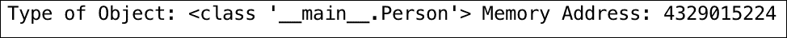

# 第一章 设计模式简介

在本章中，我们将介绍面向对象编程的基础，并详细讨论面向对象设计原则。这将为我们准备书中后面章节涉及的高级主题。本章还将简要介绍设计模式的概念，以便您能够欣赏设计模式在软件开发中的背景和应用。在这里，我们也将设计模式分为三个主要方面——创建型模式、结构型模式和和行为型模式。因此，本质上，本章将涵盖以下内容：

+   理解面向对象编程

+   讨论面向对象设计原则

+   理解设计模式及其分类和背景的概念

+   讨论动态语言的模式

+   对模式进行分类——创建型模式、结构型模式和和行为型模式

# 理解面向对象编程

在开始学习设计模式之前，了解基础知识并熟悉 Python 中的面向对象范式总是好的。面向对象的世界提出了具有属性（数据成员）和程序（成员函数）的*对象*概念。这些函数负责操作属性。例如，以`Car`对象为例。`Car`对象将具有`fuel level`（燃油水平）、`isSedan`（是否为轿车）、`speed`（速度）和`steering wheel`（方向盘）以及`coordinates`（坐标）等属性，方法包括`accelerate()`（加速）以增加速度和`takeLeft()`（向左转）以使汽车向左转。Python 自从首次发布以来就是面向对象的编程语言。正如他们所说，*Python 中的万物都是对象*。每个类实例或变量都有自己的内存地址或标识符。作为类的实例，对象之间相互交互，以服务于正在开发的应用程序。理解面向对象编程的核心概念涉及理解对象、类和方法的概念。

## 对象

以下要点描述对象：

+   它们代表您正在开发的应用程序中的实体。

+   实体之间相互交互以解决现实世界问题。

+   例如，Person 是一个实体，Car 也是一个实体。Person 驾驶 Car 从一个地点移动到另一个地点。

## 类

类帮助开发者表示现实世界实体：

+   类通过属性和行为定义对象。属性是数据成员，行为通过成员函数体现

+   类由构造函数组成，这些构造函数为这些对象提供初始状态

+   类就像模板，因此可以很容易地重用

例如，`Person`类将具有`name`（姓名）和`age`（年龄）属性以及`gotoOffice()`（去办公室）成员函数，该函数定义了他去办公室工作的行为。

## 方法

以下要点讨论面向对象世界中方法的作用：

+   它们代表对象的行为

+   方法在属性上工作，并实现所需的功能

这里给出了在 Python v3.5 中创建的一个类和对象的良好示例：

```py
class Person(object):
    def __init__(self, name, age):  #constructor
        self.name = name    #data members/ attributes
        self.age = age
    def get_person(self,):   # member function
         return "<Person (%s, %s)>" % (self.name, self.age)

p = Person("John", 32)    # p is an object of type Person
print("Type of Object:", type(p), "Memory Address:", id(p))
```

前面代码的输出应该如下所示：



# 面向对象编程的主要方面

现在我们已经了解了面向对象编程的基础，让我们深入了解面向对象编程的主要方面。

## 封装

封装的关键特性如下：

+   对象的行为对外部世界或对象保持隐藏，或者对象保持其状态信息私有。

+   客户端不能通过直接作用于对象来改变对象的内部状态；相反，客户端通过发送消息来请求对象。根据请求的类型，对象可能会通过使用特殊的成员函数（如 `get` 和 `set`）来改变其内部状态。

+   在 Python 中，封装（数据和方法隐藏）的概念不是隐式的，因为它没有像 C++ 或 Java 这样的语言中所需的 **public**、**private** 和 **protected** 等关键字来支持封装。当然，可以通过在变量或函数名前加 `__` 来使访问性变为私有。

## 多态

多态的主要特性如下：

+   多态可以是两种类型：

    +   对象根据输入参数提供方法的不同实现

    +   同一个接口可以被不同类型的对象使用

+   在 Python 中，多态是语言内置的特性。例如，`+` 运算符可以对两个整数进行相加，也可以用于字符串的连接。

在下面的示例中，字符串、元组或列表都可以使用整数索引进行访问。这展示了 Python 如何在内置类型中演示多态：

```py
a = "John"
b = (1,2,3)
c = [3,4,6,8,9]
print(a[1], b[0], c[2])
```

## 继承

以下要点有助于我们更好地理解继承过程：

+   继承表示一个类从父类继承（大部分）功能。

+   继承被描述为一种重用基类中定义的功能的选项，并允许独立扩展原始软件实现。

+   继承通过不同类对象之间的关系创建层次结构。Python 与 Java 不同，支持多重继承（从多个基类继承）。

在下面的代码示例中，`class A` 是基类，`class B` 从 `class A` 继承其特性。因此，`class A` 的方法可以通过 `class B` 的对象访问：

```py
class A:
    def a1(self):
        print("a1")

class B(A):
    def b(self):
        print("b")

b = B()
b.a1()
```

## 抽象

抽象的关键特性如下：

+   它为客户端提供了一个简单的接口，客户端可以通过这个接口与类对象交互并调用接口中定义的方法。

+   它通过接口抽象了内部类的复杂性，这样客户端就不必了解内部实现。

在下面的示例中，`Adder` 类的内部细节通过 `add()` 方法进行了抽象：

```py
class Adder:
    def __init__(self):
        self.sum = 0
    def add(self, value):
        self.sum += value

acc = Adder()
for i in range(99):
    acc.add(i)

print(acc.sum)
```

## 组合

组合指的是以下要点：

+   这是一种将对象或类组合成更复杂的数据结构或软件实现的方法

+   在组合中，一个对象用于调用其他模块中的成员函数，从而在不使用继承的情况下使基本功能在模块间可用

在以下示例中，`class A` 的对象被组合到 `class B` 中：

```py
class A(object):
    def a1(self):
        print("a1")

class B(object):
    def b(self):
        print("b")
        A().a1()

objectB = B()
objectB.b()
```

# 面向对象设计原则

现在，让我们谈谈另一组对我们至关重要的概念。这些概念不过是面向对象的设计原则，它们将作为我们在详细学习设计模式时的工具箱。

## 开放/关闭原则

开放/关闭原则指出，“类或对象和方法应该对扩展开放，但对修改关闭。”

用简单的话来说，这意味着当你开发软件应用程序时，确保你以通用方式编写你的类或模块，这样当你觉得需要扩展类或对象的行为时，你就不需要更改类本身。相反，对类的简单扩展应该帮助你构建新的行为。

例如，开放/关闭原则在用户必须通过扩展抽象基类来创建类实现以实现所需行为而不是更改抽象类的情况下体现出来。

此设计原则的优势如下：

+   现有的类不会被修改，因此回归的风险较低

+   它还有助于保持先前代码的向后兼容性

## 控制反转原则

控制反转原则指出，“高级模块不应该依赖于低级模块；它们都应该依赖于抽象。细节应该依赖于抽象，而不是相反。”

此原则建议，任何两个模块都不应该紧密依赖于对方。事实上，基础模块和依赖模块应该通过中间的抽象层解耦。

此原则还建议，你类的细节应该代表抽象。在某些情况下，哲学被颠倒了，实现细节本身决定了抽象，这应该避免。

控制反转原则的优势如下：

+   模块的紧密耦合不再普遍，因此系统中没有复杂性/刚性

+   由于存在清晰的抽象层（由钩子或参数提供），因此更容易以更好的方式处理模块间的依赖关系

## 接口隔离原则

正如接口隔离原则所指出，“客户端不应该被迫依赖于它们不使用的接口。”

这个原则讨论的是软件开发者如何编写良好的接口。例如，它提醒开发者/架构师开发与功能相关的函数。如果有任何与接口无关的函数，依赖于接口的类就必须不必要地实现它。

例如，一个`Pizza`接口不应该有一个名为`add_chicken()`的方法。基于`Pizza`接口的`Veg Pizza`类不应该被迫实现这个方法。

这个设计原则的优点如下：

+   它迫使开发者编写瘦接口，并拥有特定于接口的方法

+   它帮助您不要通过添加无意的方法来填充接口

## 单一职责原则

正如单一职责原则所阐述的，*一个类应该只有一个改变的理由*。

这个原则说，当我们开发类时，它应该很好地满足给定的功能。如果一个类负责两个功能，最好是将其拆分。它将功能视为改变的理由。例如，一个类可能因为期望的行为差异而发生变化，但如果一个类因为两个原因（基本上，两个功能的变化）而发生变化，那么这个类肯定应该被拆分。

这个设计原则的优点如下：

+   每当有一个功能发生变化时，这个特定的类就需要改变，其他什么也不需要

+   此外，如果一个类有多个功能，依赖于这个类的其他类将不得不因为多个原因进行更改，这可以避免

## 替换原则

替换原则指出，*派生类必须能够完全替换基类*。

这个原则在意义上非常直接，它说当应用程序开发者编写派生类时，他们应该扩展基类。它还建议派生类应该尽可能接近基类，以至于派生类本身应该能够在不进行任何代码更改的情况下替换基类。

# 设计模式的概念

最后，现在是我们开始讨论设计模式的时候了！什么是设计模式？

设计模式最初是由**GoF**（**四人帮**）引入的，他们将它们描述为给定问题的解决方案。如果您想了解更多信息，GoF 指的是书籍《设计模式：可复用面向对象软件元素》的四个作者，*Erich Gamma*，*Richard Helm*，*Ralph Johnson*，和*John Vlissides*，由*Grady Booch*撰写序言。这本书涵盖了软件工程在软件设计中的常见问题解决方案。最初确定了 23 个设计模式，第一个实现是针对 Java 程序语言的。设计模式是发现，而不是发明本身。

设计模式的关键特性如下：

+   它们是语言无关的，可以在多种语言中实现

+   它们是动态的，因为不时会引入新的模式

+   它们是可定制的，因此对开发者很有用

初始时，当你听到设计模式时，你可能会有以下感觉：

+   它是解决你迄今为止遇到的所有设计问题的万能药

+   它是一种解决问题的非常巧妙、特别的方法

+   软件开发世界的许多专家都同意这些解决方案

+   设计中存在某种可重复性，因此有“模式”这个词

你也一定尝试过解决设计模式试图解决的问题，但也许你的解决方案是不完整的，而我们寻求的完整性是设计模式中固有的或隐含的。当我们说完整性时，它可以指许多因素，如设计、可扩展性、重用、内存利用等。本质上，设计模式是关于从他人的成功中学习，而不是从自己的失败中学习！

关于设计模式的另一个有趣讨论是——我何时使用它们？是在软件开发生命周期（**SDLC**）的分析或设计阶段吗？

有趣的是，设计模式是已知问题的解决方案。因此，它们可以在分析或设计阶段非常广泛地使用，并且由于与应用程序代码的直接关系，在开发阶段也可以预期使用。

## 设计模式的优势

设计模式的优势如下：

+   它们可以在多个项目中重用

+   可以解决架构级别的问题

+   它们是经过时间考验和充分验证的，这是开发者和架构师的经验

+   它们具有可靠性和依赖性

## 设计模式的分类

并非每一块代码或设计都可以称为设计模式。例如，解决一个问题的编程结构或数据结构不能称为模式。以下以非常简单的方式理解这些术语：

+   **代码片段**：这是为特定目的编写的某些语言的代码，例如，Python 中的数据库连接可以是一个代码片段。

+   **设计**：这是解决这个特定问题的更好方案

+   **标准**：这是一种解决某些问题的方法，可以非常通用，适用于当前的情况

+   **模式**：这是一个经过时间考验、高效且可扩展的解决方案，将解决整个已知问题类别

## **上下文** – 设计模式的适用性

为了有效地使用设计模式，应用程序开发者必须了解设计模式适用的上下文。我们可以将这些上下文分为以下主要类别：

+   **参与者**：它们是在设计模式中使用的类。类在模式中扮演不同的角色，以实现多个目标。

+   **非功能性需求**：如内存优化、可用性和性能等需求属于此类。这些因素影响整个软件解决方案，因此至关重要。

+   **权衡**：并非所有设计模式都适合直接应用于应用开发，权衡是必要的。这些是在使用设计模式时所做的决策。

+   **结果**：如果上下文不适当，设计模式可能会对代码的其他部分产生负面影响。开发者应该了解后果和使用设计模式。

# 动态语言的模式

Python 是一种像 Lisp 一样的动态语言。Python 的动态特性可以表示如下：

+   类型或类在运行时是对象。

+   变量可以作为值具有类型，并且可以在运行时修改。例如，`a = 5`和`a = "John"`，变量`a`在运行时被分配，类型也发生了变化。

+   动态语言在类限制方面具有更多灵活性。

+   例如，在 Python 中，多态是语言内置的，没有像`private`和`protected`这样的关键字，默认情况下一切都是公开的。

+   代表了设计模式在动态语言中易于实现的情况。

# 模式分类

GoF 关于设计模式的书籍讨论了 23 种设计模式，并将它们分为三大类：

+   创建型模式

+   结构型模式

+   行为型模式

模式的分类主要基于对象是如何被创建的，如何在软件应用程序中组织类和对象，以及对象之间相互交互的方式。让我们在本节中详细讨论每个类别。

## 创建型模式：

以下是创建型模式的特性：

+   它们基于对象如何被创建的原则工作

+   它们隔离了对象创建的细节

+   代码独立于要创建的对象类型

创建型模式的一个例子是单例模式。

## 结构型模式

以下是结构型模式的特性：

+   它们设计对象和类的结构，以便它们可以组合以实现更大的结果

+   重点在于简化结构和识别类与对象之间的关系

+   它们关注类继承和组合

行为型模式的一个例子是适配器模式。

## 行为型模式

以下是行为型模式的特性：

+   它们关注对象之间的交互和对象的责任

+   对象应该能够交互，同时仍然保持松散耦合

行为型模式的一个例子是观察者模式。

# 概述

在本章中，你学习了面向对象编程的基本概念，例如对象、类、变量，以及代码示例中的多态、继承和抽象等特性。

我们现在也意识到，作为开发者/架构师，在设计应用程序时，我们应该考虑面向对象设计原则。

最后，我们继续探索设计模式及其应用和它们可以应用的上下文，并讨论了它们的分类。

在本章结束时，我们现在已经准备好迈出下一步，详细研究设计模式。
