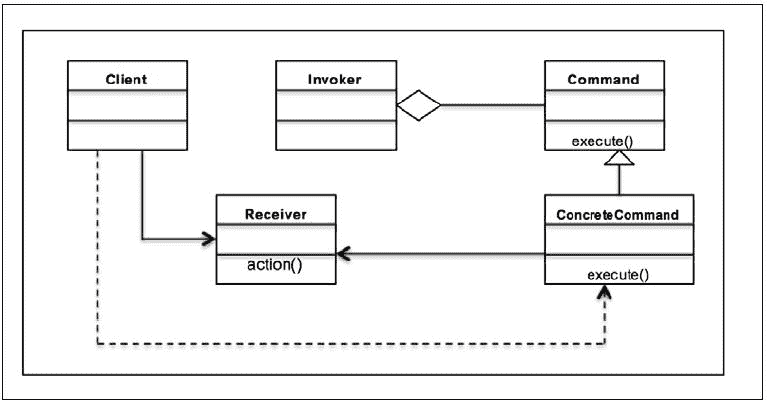

# 第七章 命令模式 – 封装调用

在上一章中，我们开始介绍行为设计模式。你学习了`观察者`的概念，并讨论了观察者设计模式。我们通过 UML 图理解了观察者设计模式，并借助 Python 实现学习了它在现实世界中的应用。我们讨论了观察者模式的优缺点。你还在本章的常见问题解答部分学习了观察者模式，并在章节末尾总结了讨论内容。

在本章中，我们将讨论命令设计模式。与观察者模式一样，命令模式属于行为模式范畴。我们将介绍命令设计模式，并讨论它在软件开发中的应用。我们将通过一个示例用例并使用 Python 3.5 实现它。

本章将简要介绍以下内容：

+   命令设计模式的简介

+   命令模式及其 UML 图

+   使用 Python 3.5 代码实现的现实世界用例

+   命令模式的优缺点

+   常见问题解答

# 介绍命令模式

正如我们在上一章中看到的，行为模式关注对象所拥有的职责。它处理对象之间的交互以实现更大的功能。命令模式是一种行为设计模式，其中使用一个对象来封装执行动作或触发事件所需的所有信息，以便在稍后时间执行。这些信息包括以下内容：

+   方法名称

+   拥有方法的对象

+   方法参数的值

让我们通过一个非常简单的软件示例来理解这个模式。考虑安装向导的情况。一个典型的向导可能包含多个阶段或屏幕，用于捕获用户的偏好。当用户浏览向导时，他们会做出某些选择。向导通常使用命令模式实现。向导首先由一个名为`Command`的对象启动。用户在向导的多个阶段做出的偏好或选择随后被存储在`Command`对象中。当用户在向导的最后屏幕上点击**完成**按钮时，`Command`对象运行一个`execute()`方法，该方法考虑所有存储的选择并运行适当的安装程序。因此，所有关于选择的信息都被封装在一个对象中，可以在以后采取行动时使用。

另一个简单的例子是打印机打印队列。打印队列可以作为存储诸如页面类型（*A5*-*A1*）、纵向/横向、整理/未整理等信息的一个`Command`对象实现。当用户打印某些内容（例如，一张图片）时，打印队列在`Command`对象上运行`execute()`方法，并按照设定的偏好打印图片。

# 理解命令设计模式

命令模式与以下术语一起工作—`Command`、`Receiver`、`Invoker`和`Client`：

+   一个`Command`对象了解`Receiver`对象并调用`Receiver`对象的方法。

+   接收者方法参数的值存储在`Command`对象中

+   `Invoker`知道如何执行一个命令

+   客户端创建一个`Command`对象并设置其接收者

命令模式的主要意图如下：

+   将请求封装为对象

+   允许客户端使用不同的请求进行参数化

+   允许将请求保存到队列中（我们将在本章后面讨论这个问题）

+   提供面向对象的回调

命令模式可以在以下多个场景中使用：

+   根据要执行的操作参数化对象

+   在队列中添加动作并在不同的点执行请求

+   为基于较小操作的高级操作创建结构

以下 Python 代码实现了命令设计模式。我们在本章前面讨论了巫师的例子。假设我们想要开发一个用于安装或通常所说的安装程序。通常，安装意味着根据用户的选择在文件系统中复制或移动文件。在下面的例子中，在客户端代码中，我们首先创建`Wizard`对象并使用`preferences()`方法，该方法存储用户在巫师的各种屏幕上做出的选择。在巫师中，当点击**完成**按钮时，调用`execute()`方法。`execute()`方法获取偏好设置并开始安装：

```py
class Wizard():

    def __init__(self, src, rootdir):
        self.choices = []
        self.rootdir = rootdir
        self.src = src

    def preferences(self, command):
        self.choices.append(command)

    def execute(self):
        for choice in self.choices:
            if list(choice.values())[0]:
                print("Copying binaries --", self.src, " to ", self.rootdir)
            else:
                print("No Operation")

if __name__ == '__main__':
  ## Client code
  wizard = Wizard('python3.5.gzip', '/usr/bin/')
  ## Users chooses to install Python only
  wizard.preferences({'python':True})
  wizard.preferences({'java':False})
  wizard.execute()
```

上述代码的输出如下：


## 命令模式的 UML 类图

让我们借助以下 UML 图更深入地了解命令模式。

如前一段所述，命令模式有这些主要参与者：`Command`、`ConcreteCommand`、`Receiver`、`Invoker`和`Client`。让我们将这些放入 UML 图中，看看类是如何看起来：



当我们查看 UML 图时，你会意识到这个模式中有五个主要参与者：

+   `Command`：这个声明了一个执行操作的接口

+   `ConcreteCommand`：这个定义了`Receiver`对象和动作之间的绑定

+   `Client`：这个创建一个`ConcreteCommand`对象并设置其接收者

+   `Invoker`：这个请求`ConcreteCommand`执行请求

+   `Receiver`：这个知道如何执行与执行请求相关的操作

流程很简单。客户端请求执行一个命令。调用者接收命令，封装它，并将其放入队列。`ConcreteCommand`类负责请求的命令，并要求接收者执行给定的操作。以下代码示例用于理解所有参与者都参与的模式：

```py
from abc import ABCMeta, abstractmethod

class Command(metaclass=ABCMeta):
    def __init__(self, recv):
        self.recv = recv

    def execute(self):
        pass

class ConcreteCommand(Command):
    def __init__(self, recv):
        self.recv = recv

    def execute(self):
        self.recv.action()

class Receiver:
    def action(self):
        print("Receiver Action")

class Invoker:
    def command(self, cmd):
        self.cmd = cmd

    def execute(self):
        self.cmd.execute()

if __name__ == '__main__':
    recv = Receiver()
    cmd = ConcreteCommand(recv)
    invoker = Invoker()
    invoker.command(cmd)
    invoker.execute()
```

# 在现实世界中实现命令模式

我们将以股票交易所（在互联网世界中广为人知）为例，演示命令模式的实现。在股票交易所中会发生什么？作为股票交易所的用户，你创建买卖股票的订单。通常，你不会直接买卖股票；这是代理或经纪人作为你在股票交易所之间的中介。代理负责将你的请求带到股票交易所并完成工作。想象一下，你想在周一早上交易所开盘时卖出股票。即使交易所还没有开盘，你仍然可以在周日晚上向你的代理提出卖出股票的请求。然后代理将这个请求排队，以便在交易所开盘进行交易时执行。这是一个经典的命令模式案例。

## 设计考虑因素

根据 UML 图，你了解到命令模式有四个主要参与者——`Command`、`ConcreteCommand`、`Invoker`和`Receiver`。对于前面的场景，我们应该创建一个`Order`接口来定义客户放置的订单。我们应该定义用于买卖股票的`ConcreteCommand`类。还需要定义一个代表证券交易所的类。我们应该定义一个将实际执行交易和代理（也称为调用者）的`Receiver`类，该代理调用订单并通过接收者执行它。

让我们在 Python 3.5 中开发一个应用程序并实现前面的用例。我们首先从`Command`对象`Order`开始：

+   `Command`对象由`Order`类表示

+   `Order`提供了一个接口（Python 的抽象基类），以便`ConcreteCommand`可以实现行为

+   `execute()`方法是`ConcreteCommand`类需要定义的抽象方法，用于执行`Order`类

以下代码表示抽象类`Order`和抽象方法`execute()`：

```py
from abc import ABCMeta, abstractmethod

class Order(metaclass=ABCMeta):

    @abstractmethod
    def execute(self):
        pass
```

我们还开发了一些代表`ConcreteCommand`的类：

+   在这种情况下，我们有两个主要的具体类：`BuyStockOrder`和`SellStockOrder`，它们实现了`Order`接口

+   两个`ConcreteCommand`类都使用股票交易系统的对象，以便它们可以为交易系统定义适当的操作

+   这些`ConcreteCommand`类的每个`execute()`方法都使用股票交易对象来执行买卖操作

现在让我们看看实现该接口的具体类：

```py
class BuyStockOrder(Order):
    def __init__(self, stock):
        self.stock = stock

    def execute(self):
        self.stock.buy()

class SellStockOrder(Order):
    def __init__(self, stock):
        self.stock = stock

    def execute(self):
        self.stock.sell()
```

现在，让我们谈谈股票交易系统及其实现方式：

+   在这个例子中，`StockTrade`类代表`Receiver`对象

+   它定义了多个方法（动作）来执行`ConcreteCommand`对象放置的订单

+   `buy()`和`sell()`方法由接收者定义，分别由`BuyStockOrder`和`SellStockOrder`调用以在交易所买卖股票

让我们来看看`StockTrade`类：

```py
class StockTrade:
    def buy(self):
        print("You will buy stocks")

    def sell(self):
        print("You will sell stocks")
```

实现的另一个部分是调用者：

+   `Agent`类代表调用者。

+   `Agent`是客户端和`StockExchange`之间的中介，执行客户端放置的订单。

+   `Agent`定义了一个数据成员`__orderQueue`（一个列表），它充当队列。任何由客户端放置的新订单都会添加到队列中。

+   `Agent`的`placeOrder()`方法负责排队订单并执行订单。

以下代码描述了执行`Invoker`角色的`Agent`类：

```py
class Agent:
    def __init__(self):
        self.__orderQueue = []

    def placeOrder(self, order):
        self.__orderQueue.append(order)
        order.execute()
```

现在我们将所有上述类放在一起，看看客户端是如何实现的：

+   客户端首先设置其接收者，即`StockTrade`类

+   使用`BuyStockOrder`和`SellStockOrder`（`ConcreteCommand`）创建买卖股票的订单，这些订单在`StockTrade`上执行动作

+   通过实例化`Agent`类创建调用者对象

+   `Agent`的`placeOrder()`方法用于获取客户端放置的订单

以下是为客户端实现的代码：

```py
if __name__ == '__main__':
    #Client
    stock = StockTrade()
    buyStock = BuyStockOrder(stock)
    sellStock = SellStockOrder(stock)

    #Invoker
    agent = Agent()
    agent.placeOrder(buyStock)
    agent.placeOrder(sellStock)
```

以下是前面代码的输出：


命令模式在软件应用中有多种使用方式。我们将讨论两个与云应用非常相关的特定实现：

+   重做或回滚操作：

    +   在实现回滚或重做操作时，开发者可以执行两种不同的操作。

    +   这些是为了在文件系统或内存中创建一个快照，当需要回滚时，可以恢复到这个快照。

    +   使用命令模式，你可以存储命令序列，当需要重做时，重新执行相同的动作集。

+   异步任务执行：

    +   在分布式系统中，我们经常需要执行异步任务的功能，这样核心服务在更多请求的情况下永远不会被阻塞。

    +   在命令模式中，调用者对象可以维护一个请求队列，并将这些任务发送到`Receiver`对象，以便它们可以在主应用程序线程之外独立执行。

# 命令模式的优缺点

命令模式有以下优点：

+   它将调用操作的对象与知道如何执行操作的对象解耦

+   它通过提供队列系统允许你创建命令序列

+   添加新命令的扩展很容易，并且可以在不更改现有代码的情况下完成

+   你也可以使用命令模式定义一个回滚系统，例如，在向导示例中，我们可以编写一个回滚方法

以下是指令模式的缺点：

+   有许多类和对象协同工作以实现一个目标。应用开发者需要小心地正确开发这些类。

+   每个单独的命令都是一个`ConcreteCommand`类，这增加了实现和维护的类数量。

# 常见问题

Q1\. 是否可以没有`Receiver`和`ConcreteCommand`实现`execute`方法？

A: 当然，这样做是完全可能的。许多软件应用也以这种方式使用命令模式。这里需要注意的是调用者和接收者之间的交互。如果接收者未定义，解耦程度会降低；此外，参数化命令的功能也会丢失。

Q2\. 我在调用者对象中实现队列机制时使用什么数据结构？

A: 在本章前面我们研究的股票交易所示例中，我们使用列表来实现队列。然而，命令模式讨论的是堆栈实现，这在重做或回滚开发的情况下非常有帮助。

# 摘要

我们从理解命令设计模式及其在软件架构中的有效应用开始本章。

我们探讨了如何使用命令设计模式来封装触发事件或动作所需的所有信息，以便在稍后的时间点执行。

您还通过 UML 图和 Python v3.5 的示例代码实现以及解释学习了该模式。

我们还涵盖了一个常见问题解答部分，这将帮助您获得更多关于该模式及其可能的优势/劣势的想法。

我们将在接下来的章节中探讨其他行为设计模式。
