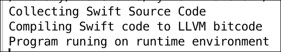
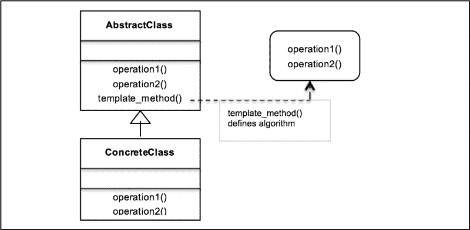
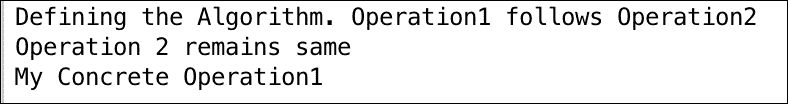
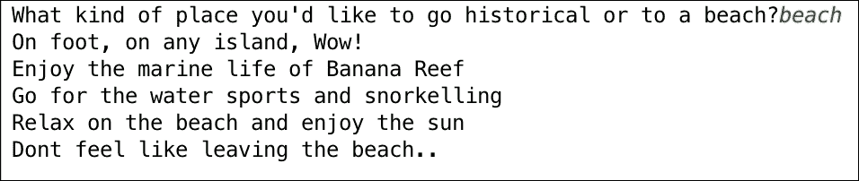
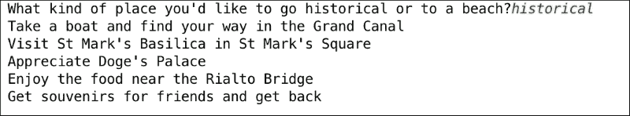

# 第八章. 模板方法模式 – 封装算法

在上一章中，我们从一个介绍命令设计模式开始，其中使用一个对象来封装执行动作或触发事件所需的所有信息。我们通过 UML 图理解了命令设计模式的概念，并看到了如何通过 Python 实现将其应用于现实世界。我们讨论了命令模式的优缺点，在常见问题解答部分进行了更深入的探讨，并在章节末尾总结了讨论。

在本章中，我们将讨论模板设计模式，例如命令模式和属于行为模式之下的模板模式。我们将介绍模板设计模式，并讨论它在软件开发中的应用。我们还将处理一个示例用例，并在 Python v3.5 中实现它。

在本章中，我们将简要介绍以下主题：

+   模板方法设计模式的介绍

+   模板模式及其 UML 图

+   带有 Python v3.5 代码实现的现实世界用例

+   模板模式 – 优点和缺点

+   好莱坞原则、模板方法和模板钩子

+   常见问题解答

在本章结束时，你将能够分析适用于模板设计模式的情况，并有效地使用它们来解决与设计相关的问题。我们还将总结关于模板方法模式的整个讨论作为总结。

# 定义模板方法模式

正如我们在上一章所看到的，行为模式关注对象所具有的职责。它处理对象之间的交互以实现更大的功能。模板方法模式是一种行为设计模式，它在一个称为模板方法的方法中定义了程序的骨架或算法。例如，你可以将准备饮料的步骤定义为一个模板方法中的算法。模板方法模式还通过将某些步骤的实现推迟到子类中来帮助重新定义或定制算法的某些步骤。这意味着子类可以重新定义它们自己的行为。例如，在这种情况下，子类可以使用模板方法来准备饮料，实现准备茶的步骤。需要注意的是，步骤的变化（由子类执行）不会影响原始算法的结构。因此，模板方法模式中子类覆盖的功能允许创建不同的行为或算法。

要用软件开发术语来谈论模板方法模式，抽象类用于定义算法的步骤。这些步骤也被称为模板方法模式中的*原始操作*。这些步骤通过抽象方法定义，模板方法定义算法。`ConcreteClass`（继承自抽象类）实现了算法的子类特定步骤。

模板方法模式在以下情况下使用：

+   当多个算法或类实现类似或相同的逻辑时。

+   在子类中实现算法有助于减少代码重复。

+   通过让子类通过覆盖实现行为，可以定义多个算法。

让我们用一个非常简单的日常例子来理解这个模式。想想你准备茶或咖啡时都做了些什么。在咖啡的情况下，你执行以下步骤来准备饮料：

1.  煮水。

1.  煮咖啡豆。

1.  在咖啡杯中倒。

1.  在杯子中加入糖和牛奶。

1.  搅拌，咖啡就煮好了。

现在，如果你想泡一杯茶，你需要执行以下步骤：

1.  煮水。

1.  浸泡茶包。

1.  在杯子中倒茶。

1.  在茶中加柠檬。

1.  搅拌，茶就煮好了。

如果你分析这两种准备方法，你会发现两种程序或多或少是相同的。在这种情况下，我们可以有效地使用模板方法模式。我们如何实现它？我们定义一个`Beverage`类，它具有准备茶和咖啡的通用抽象方法，例如`boilWater()`。我们还定义了`preparation()`模板方法，它将调用准备饮料（算法）的步骤序列。我们让具体的类`PrepareCoffee`和`PrepareTea`定义定制步骤以实现准备咖啡和茶的目标。这就是模板方法模式如何避免代码重复。

另一个简单的例子是计算机语言使用的编译器。编译器本质上做两件事：收集源代码并将其编译为目标对象。现在，如果我们需要为 iOS 设备定义一个交叉编译器，我们可以借助模板方法模式来实现。我们将在本章后面详细讨论这个例子。

## 理解模板方法设计模式。

简而言之，模板方法模式的主要意图如下：

+   定义算法的骨架，使用原始操作。

+   重新定义子类的某些操作而不改变算法的结构。

+   实现代码重用，避免重复劳动。

+   利用公共接口或实现。

模板方法模式与以下术语一起使用—`AbstractClass`、`ConcreteClass`、模板方法和`Client`：

+   `AbstractClass`：这声明了一个接口来定义算法的步骤。

+   `ConcreteClass`：这定义了子类特定的步骤定义。

+   `template_method()`：这通过调用步骤方法来定义算法。

我们在章节中早些时候讨论了编译器的例子。假设我们想要为 iOS 设备开发自己的交叉编译器并运行程序。

我们首先开发一个抽象类（编译器），该类定义了编译器的算法。编译器执行的操作是收集程序语言中编写的代码源，并将其编译成目标代码（二进制格式）。我们定义这些步骤为`collectSource()`和`compileToObject()`抽象方法，并定义了负责执行程序的`run()`方法。算法由`compileAndRun()`方法定义，该方法内部调用`collectSource()`、`compileToObject()`和`run()`方法来定义编译器的算法。`iOSCompiler`具体类现在实现了抽象方法，并在 iOS 设备上编译/运行 Swift 代码。

### 小贴士

Swift 编程语言用于在 iOS 平台上开发应用程序。

以下 Python 代码实现了模板方法设计模式：

```py
from abc import  ABCMeta, abstractmethod

class Compiler(metaclass=ABCMeta):
    @abstractmethod
    def collectSource(self):
        pass

    @abstractmethod
    def compileToObject(self):
        pass

    @abstractmethod
    def run(self):
        pass

    def compileAndRun(self):
        self.collectSource()
        self.compileToObject()
        self.run()

class iOSCompiler(Compiler):
    def collectSource(self):
        print("Collecting Swift Source Code")

    def compileToObject(self):
        print("Compiling Swift code to LLVM bitcode")

    def run(self):
        print("Program runing on runtime environment")

iOS = iOSCompiler()
iOS.compileAndRun()
```

上述代码的输出应如下所示：



## 模板方法模式的 UML 类图

让我们借助 UML 图来更深入地了解模板方法模式。

如前所述，模板方法模式有以下主要参与者：抽象类、具体类、模板方法和客户端。让我们将这些放入 UML 图中，看看类是如何看起来：



当我们查看 UML 图时，你会意识到这个模式中有四个主要参与者：

+   `AbstractClass`: 它使用抽象方法定义算法的操作或步骤。这些步骤被具体子类覆盖。

+   `template_method()`: 这定义了算法的骨架。模板方法中调用由抽象方法定义的多个步骤，以定义序列或算法本身。

+   `ConcreteClass`: 它实现了步骤（由抽象方法定义），以执行算法的子类特定步骤。

以下是一个代码示例，以了解所有参与者都参与的模板方法设计模式：

```py
from abc import ABCMeta, abstractmethod

class AbstractClass(metaclass=ABCMeta):
    def __init__(self):
        pass

    @abstractmethod
    def operation1(self):
        pass

    @abstractmethod
    def operation2(self):
        pass

    def template_method(self):
        print("Defining the Algorithm. Operation1 follows Operation2")
        self.operation2()
        self.operation1()

class ConcreteClass(AbstractClass):

    def operation1(self):
        print("My Concrete Operation1")

    def operation2(self):
        print("Operation 2 remains same")

class Client:
    def main(self):
        self.concreate = ConcreteClass()
        self.concreate.template_method()

client = Client()
client.main()
```

上述代码的输出应如下所示：



# 模板方法模式在现实世界中的应用

让我们用一个非常容易理解的场景来实现模板方法模式。想象一下旅行社的情况，比如 Dev Travels。现在他们是怎样典型工作的呢？他们定义了去往不同地点的各种旅行，并为您提供假日套餐。套餐本质上是你作为客户所承担的旅行。旅行有诸如访问的地点、使用的交通方式以及其他定义旅行行程的因素。根据客户的需求，这个旅行可以有不同的定制。这不就是模板方法模式的需求吗？

设计考虑因素：

+   对于前面的场景，根据 UML 图，我们应该创建一个定义旅行的`AbstractClass`接口

+   旅行应包含多个抽象方法，用于定义所使用的交通方式、`day1`、`day2`和`day3`期间访问的地点，假设这是一个为期三天的周末之旅，并定义返程

+   `itinerary()`模板方法实际上定义了旅行的行程

+   我们应该定义`ConcreteClasses`，这样我们就可以根据客户的需求定制不同的旅行

让我们在 Python 3.5 中开发一个应用程序并实现前面的用例。我们从一个抽象类`Trip`开始：

+   抽象对象由`Trip`类表示。它是一个接口（Python 的抽象基类），定义了诸如使用的交通方式和不同日期要访问的地点等细节。

+   `setTransport`是一个抽象方法，应由`ConcreteClass`实现以设置交通方式。

+   `day1()`、`day2()`、`day3()`抽象方法定义了给定日期访问的地点。

+   `itinerary()`模板方法创建完整的行程（在这种情况下，即旅行）。旅行的顺序是首先定义交通方式，然后是每天要访问的地点，以及`returnHome`。

以下代码实现了 Dev Travels 的场景：

```py
from abc import abstractmethod, ABCMeta

class Trip(metaclass=ABCMeta):

    @abstractmethod
    def setTransport(self):
        pass

    @abstractmethod
    def day1(self):
        pass

    @abstractmethod
    def day2(self):
        pass

    @abstractmethod
    def day3(self):
        pass

    @abstractmethod
    def returnHome(self):
        pass

    def itinerary(self):
        self.setTransport()
        self.day1()
        self.day2()
        self.day3()
        self.returnHome()
```

我们还开发了一些代表具体类的类：

+   在这种情况下，我们有两个主要的实体类—`VeniceTrip`和`MaldivesTrip`—它们实现了`Trip`接口

+   具体类代表游客根据他们的选择和兴趣所采取的两种不同的旅行

+   `VeniceTrip`和`MaldivesTrip`都实现了`setTransport()`、`day1()`、`day2()`、`day3()`和`returnHome()`

让我们在 Python 代码中定义具体的类：

```py
class VeniceTrip(Trip):
    def setTransport(self):
        print("Take a boat and find your way in the Grand Canal")

    def day1(self):
        print("Visit St Mark's Basilica in St Mark's Square")

    def day2(self):
        print("Appreciate Doge's Palace")

    def day3(self):
        print("Enjoy the food near the Rialto Bridge")

    def returnHome(self):
        print("Get souvenirs for friends and get back")

class MaldivesTrip(Trip):
    def setTransport(self):
        print("On foot, on any island, Wow!")

    def day1(self):
        print("Enjoy the marine life of Banana Reef")

    def day2(self):
        print("Go for the water sports and snorkelling")

    def day3(self):
        print("Relax on the beach and enjoy the sun")

    def returnHome(self):
        print("Dont feel like leaving the beach..")
```

现在，让我们谈谈旅行社和想要度过美好假期的游客：

+   `TravelAgency`类代表本例中的`Client`对象

+   它定义了`arrange_trip()`方法，为顾客提供选择是否想要历史之旅或海滩之旅的选项

+   根据游客的选择，实例化一个适当的类

+   此对象随后调用`itinerary()`模板方法，并根据客户的选择为游客安排旅行

以下是对 Dev 旅行社的实现以及他们如何根据客户的选择安排旅行的示例：

```py
class TravelAgency:
    def arrange_trip(self):
        choice = input("What kind of place you'd like to go historical or to a beach?")
        if choice == 'historical':
            self.trip = VeniceTrip()
            self.trip.itinerary()
        if choice == 'beach':
            self.trip = MaldivesTrip()
            self.trip.itinerary()

TravelAgency().arrange_trip()
```

上述代码的输出应如下所示：



如果你决定进行一次历史之旅，这将产生以下代码输出：



# 模板方法模式 – 钩子

钩子是在抽象类中声明的方法。它通常有一个默认实现。钩子的理念是给予子类在需要时将自身钩入算法的能力。子类使用钩子不是强制的，并且可以轻松忽略它。

例如，在饮料示例中，我们可以添加一个简单的钩子，根据客户的愿望查看是否需要提供茶或咖啡以及调料。

另一个钩子的例子可以在旅行社示例中。现在，如果我们有一些老年游客，他们可能不想在旅行的三天中都外出，因为他们可能容易感到疲劳。在这种情况下，我们可以开发一个钩子，确保`day2`的行程较轻松，这意味着他们可以去一些附近的地方，并在`day3`的计划中返回。

基本上，当我们需要子类提供实现时，我们使用抽象方法，而当子类实现它是可选的时候，我们使用钩子。

# 好莱坞原则和模板方法

好莱坞原则是总结为*别给我们打电话，我们会给你打电话*的设计原则。它源自好莱坞哲学，即制片厂在演员有角色时才会给演员打电话。

在面向对象的世界中，我们允许低级组件使用好莱坞原则将自己钩接到系统中。然而，高级组件决定低级系统何时以及需要什么。换句话说，高级组件将低级组件视为*别给我们打电话，我们会给你打电话*。

这与模板方法模式相关，因为它是高级抽象类安排步骤以定义算法。根据算法的实际情况，低级类被调用以定义步骤的具体实现。

# 模板方法模式的优势和缺点

模板方法模式为你提供了以下优势：

+   正如我们在本章前面看到的，没有代码重复。

+   模板方法模式通过使用继承而不是组合来实现代码复用。只需要重写少数几个方法。

+   灵活性允许子类决定如何实现算法中的步骤。

模板方法模式的缺点如下：

+   在某些时候，调试和理解模板方法模式中的流程顺序可能会令人困惑。您可能会实现一个不应该实现的方法，或者根本不实现一个抽象方法。文档和严格的错误处理必须由程序员来完成。

+   模板框架的维护可能是一个问题，因为任何级别的更改（低级或高级）都可能干扰实现。因此，使用模板方法模式进行维护可能会很痛苦。

# 常见问题

Q1\. 是否应该禁止低级组件调用高级组件中的方法？

A: 不，低级组件肯定会通过继承调用高级组件。然而，程序员需要确保没有循环依赖，即低级组件和高级组件相互依赖。

Q2\. 策略模式不类似于模板模式吗？

A: 策略模式和模板模式都封装了算法。模板模式依赖于继承，而策略模式使用组合。模板方法模式是通过子类化进行编译时算法选择，而策略模式是运行时选择。

# 摘要

我们从理解模板方法设计模式及其在软件架构中的有效应用开始本章。

我们还探讨了如何使用模板方法设计模式来封装算法，并通过覆盖子类中的方法提供实现不同行为的灵活性。

您通过 UML 图和 Python v3.5 的示例代码实现以及解释学习了该模式。

我们还涵盖了一个关于常见问题解答的部分，这将帮助您更好地了解该模式和它的可能优点/缺点。

我们将在下一章讨论组合模式——MVC 设计模式。
