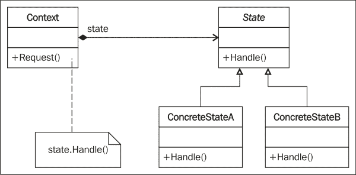
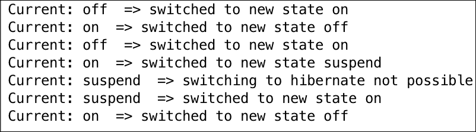

# 第十章。状态设计模式

在本章中，我们将介绍状态设计模式。像命令或模板设计模式一样，状态模式属于行为模式。您将了解状态设计模式，我们将讨论它在软件开发中的应用。我们将使用一个示例用例、一个现实世界场景，并在 Python v3.5 中实现它。

在本章中，我们将简要介绍以下主题：

+   状态设计模式简介

+   状态设计模式及其 UML 图

+   一个带有 Python v3.5 代码实现的现实世界用例

+   状态模式：优点和缺点

在本章结束时，您将欣赏到状态设计模式的应用和上下文。

# 定义状态设计模式

行为模式关注对象所具有的职责。它们处理对象之间的交互以实现更大的功能。状态设计模式是一种行为设计模式，有时也被称为**对象状态模式**。在这个模式中，一个对象可以根据其内部状态封装多个行为。状态模式也被认为是一种对象在运行时改变其行为的方式。

### 小贴士

在运行时更改行为是 Python 擅长的！

例如，考虑一个简单收音机的案例。收音机有 AM/FM（一个切换开关）频道和一个扫描按钮来扫描多个 FM/AM 频道。当用户打开收音机时，收音机的初始状态已经设置（比如说，设置为 FM）。点击扫描按钮时，收音机会被调谐到多个有效的 FM 频率或频道。当基本状态现在变为 AM 时，扫描按钮帮助用户调谐到多个 AM 频道。因此，基于收音机的初始状态（AM/FM），当调谐到 AM 或 FM 频道时，扫描按钮的行为会动态改变。

因此，状态模式允许对象在内部状态改变时改变其行为。这会给人一种对象本身已经改变了其类的感觉。状态设计模式用于开发有限状态机，并有助于适应状态事务操作。

## 理解状态设计模式

状态设计模式通过与三个主要参与者合作工作：

+   `状态`：这被认为是一个封装对象行为的接口。这种行为与对象的状态相关联。

+   `具体状态`：这是一个实现`状态`接口的子类。`具体状态`实现了与对象特定状态相关的实际行为。

+   `上下文`：这定义了客户端感兴趣的接口。`上下文`还维护一个`具体状态`子类的实例，该实例内部定义了对象特定状态的实施。

让我们看看这三个参与者（`State`、`ConcreteStateA` 和 `ConcreteStateB`）的结构代码实现。在这个代码实现中，我们定义了一个 `State` 接口，它有一个 `Handle()` 抽象方法。`ConcreteState` 类，`ConcreteStateA` 和 `ConcreteStateB`，实现了 `State` 接口，因此定义了针对 `ConcreteState` 类的特定 `Handle()` 方法。因此，当 `Context` 类设置一个状态时，该状态的 `ConcreteClass` 的 `Handle()` 方法会被调用。在以下示例中，由于 `Context` 设置为 `stateA`，因此会调用 `ConcreteStateA.Handle()` 方法并打印 `ConcreteStateA`：

```py
from abc import abstractmethod, ABCMeta

class State(metaclass=ABCMeta):

    @abstractmethod
    def Handle(self):
        pass

class ConcreteStateB(State):
    def Handle(self):
        print("ConcreteStateB")

class ConcreteStateA(State):
    def Handle(self):
        print("ConcreteStateA")

class Context(State):

    def __init__(self):
        self.state = None

    def getState(self):
        return self.state

    def setState(self, state):
        self.state = state

    def Handle(self):
        self.state.Handle()

context = Context()
stateA = ConcreteStateA()
stateB = ConcreteStateB()

context.setState(stateA)
context.Handle()
```

我们将看到以下输出：


## 使用 UML 图解理解状态设计模式

如前节所述，UML 图中有三个主要参与者：`State`、`ConcreteState` 和 `Context`。在本节中，我们将尝试在一个 UML 类图中体现它们。



让我们详细理解 UML 图的元素：

+   `State`：这是一个定义 `Handle()` 抽象方法的接口。`Handle()` 方法需要由 `ConcreteState` 实现。

+   `ConcreteState`：在这个 UML 图中，我们定义了两个 `ConcreteClasses`：`ConcreteStateA` 和 `ConcreteStateB`。这些实现了 `Handle()` 方法，并定义了基于 `State` 变化的实际操作。

+   `Context`：这是一个接受客户端请求的类。它还维护对对象当前状态的引用。根据请求，调用具体行为。

# 状态设计模式的一个简单示例

让我们通过一个简单示例来理解所有三个参与者。比如说，我们想要实现一个带有简单按钮的电视遥控器来执行开关操作。如果电视开启，遥控器按钮将关闭电视，反之亦然。在这种情况下，`State` 接口将定义一个方法（比如 `doThis()`）来执行开关电视等操作。我们还需要为不同的状态定义 `ConcreteClass`。在这个例子中，有两个主要状态，`StartState` 和 `StopState`，分别表示电视开启和关闭的状态。

对于这个场景，`TVContext` 类将实现 `State` 接口并保持对当前状态的引用。根据请求，`TVContext` 将请求转发给 `ConcreteState`，它实现了实际行为（对于给定状态）并执行必要的操作。因此，在这种情况下，基本状态是 `StartState`（如前所述），而 `TVContext` 类接收到的请求是关闭电视。`TVContext` 类理解了需求，并相应地将请求转发给 `StopState` 具体类，该类进而调用 `doThis()` 方法来实际关闭电视：

```py
from abc import abstractmethod, ABCMeta

class State(metaclass=ABCMeta):

    @abstractmethod
    def doThis(self):
        pass

class StartState (State):
    def doThis(self):
        print("TV Switching ON..")

class StopState (State):
    def doThis(self):
        print("TV Switching OFF..")

class TVContext(State):

    def __init__(self):
        self.state = None

    def getState(self):
        return self.state

    def setState(self, state):
        self.state = state

    def doThis(self):
        self.state.doThis()

context = TVContext()
context.getState()
start = StartState()
stop = StopState()

context.setState(stop)
context.doThis()
```

以下是前面代码的输出：


## 带有 v3.5 实现的 State 设计模式

现在，让我们看看状态设计模式在现实世界中的一个实际应用案例。想象一个计算机系统（台式机/笔记本电脑）。它可以有多个状态，例如`On`、`Off`、`Suspend`或`Hibernate`。现在，如果我们想借助状态设计模式来体现这些状态，我们将如何操作？

假设，我们从`ComputerState`接口开始：

+   状态应该定义两个属性，即`name`和`allowed`。`name`属性代表对象的状态，而`allowed`是一个列表，定义了状态可以进入的对象状态。

+   状态必须定义一个`switch()`方法，这个方法实际上会改变对象的状态（在这个例子中，是电脑）。

让我们看看`ComputerState`接口的代码实现：

```py
class ComputerState(object):
    name = "state"
    allowed = []

    def switch(self, state):
        if state.name in self.allowed:
            print('Current:',self,' => switched to new state',state.name)
            self.__class__ = state
        else:
            print('Current:',self,' => switching to',state.name,'not possible.')

    def __str__(self):
        return self.name
```

现在，让我们看看实现`State`接口的`ConcreteState`。我们将定义四个状态：

+   `On`：这个操作将电脑**开启**。这里允许的状态是`Off`、`Suspend`和`Hibernate`。

+   `Off`：这个操作将电脑**关闭**。这里允许的状态仅仅是`On`。

+   `Hibernate`：这个状态将电脑置于**休眠**模式。电脑只有在处于这个状态下才能被开启。

+   `Suspend`：这个状态将电脑**挂起**，一旦电脑被挂起，就可以将其开启。

现在，让我们看看代码：

```py
class Off(ComputerState):
    name = "off"
    allowed = ['on']

class On(ComputerState):
    name = "on"
    allowed = ['off','suspend','hibernate']

class Suspend(ComputerState):
    name = "suspend"
    allowed = ['on']

class Hibernate(ComputerState):
    name = "hibernate"
    allowed = ['on']
```

现在，我们探索上下文类（`Computer`）。上下文执行两个主要操作：

+   `__init__()`: 这个方法定义了电脑的基态

+   `change()`：这个方法将改变对象的状态，实际的行为改变由`ConcreteState`类（`on`、`off`、`suspend`和`hibernate`）实现

下面是前面方法的实现：

```py
class Computer(object):
    def __init__(self, model='HP'):
        self.model = model
        self.state = Off()

    def change(self, state):
        self.state.switch(state)
```

下面是客户端的代码。我们创建`Computer`类（上下文）的对象，并将一个状态传递给它。状态可以是以下之一：`On`、`Off`、`Suspend`和`Hibernate`。根据新的状态，上下文调用其`change(state)`方法，最终切换电脑的实际状态：

```py
if __name__ == "__main__":
    comp = Computer()
    # Switch on
    comp.change(On)
    # Switch off
    comp.change(Off)

    # Switch on again
    comp.change(On)
    # Suspend
    comp.change(Suspend)
    # Try to hibernate - cannot!
    comp.change(Hibernate)
    # switch on back
    comp.change(On)
    # Finally off
    comp.change(Off)
```

现在，我们可以观察到以下输出：



`__class__`是每个类的内置属性。它是对类的引用。例如，`self.__class__.__name__`代表类的名称。在这个例子中，我们使用 Python 的`__class__`属性来改变`State`。因此，当我们向`change()`方法传递状态时，对象的类在运行时会被动态地改变。`comp.change(On)`代码将对象状态更改为`On`，随后更改为不同的状态，如`Suspend`、`Hibernate`和`Off`。

# 状态模式的优缺点

这里是状态设计模式的优点：

+   在状态设计模式中，对象的行为是其状态的函数结果，并且行为会根据状态在运行时改变。这消除了对 if/else 或 switch/case 条件逻辑的依赖。例如，在电视遥控器场景中，我们也可以通过简单地编写一个类和方法来实现行为，该方法将请求一个参数并执行一个动作（打开/关闭电视），使用`if`/`else`块。

+   使用状态模式，实现多态行为的优势显而易见，并且添加状态以支持额外行为也更加容易。

+   状态设计模式还通过将特定状态的行为聚合到`ConcreteState`类中，这些类被放置在代码的一个位置，从而提高了**内聚性**。

+   使用状态设计模式，通过添加一个额外的`ConcreteState`类，就可以很容易地添加一个行为。因此，状态模式提高了扩展应用行为的能力，并总体上提高了代码的可维护性。

我们已经看到了状态模式的优点。然而，它们也有一些陷阱：

+   **类爆炸**：由于每个状态都需要通过`ConcreteState`来定义，所以我们可能会写出很多功能较小的类。考虑有限状态机的例子——如果有很多状态，但每个状态与其他状态没有太大区别，我们仍然需要将它们作为单独的`ConcreteState`类来编写。这增加了我们需要编写的代码量，并且使得审查状态机的结构变得困难。

+   每引入一个新的行为（尽管添加行为只是添加一个额外的`ConcreteState`），`Context`类都需要更新以处理每个行为。这使得每次添加新行为时`Context`的行为都变得更加脆弱。

# 摘要

总结到目前为止我们所学的，在状态设计模式中，对象的行为是基于其状态决定的。对象的状态可以在运行时改变。Python 在运行时改变行为的能力使得应用和实现状态设计模式变得非常容易。状态模式还让我们能够控制对象可以采取的状态，例如我们在本章前面看到的计算机示例中的状态。`Context`类提供了一个更简单的接口，而`ConcreteState`确保了向对象添加行为变得容易。因此，状态模式提高了内聚性、扩展灵活性，并消除了冗余代码块。我们以 UML 图的形式学术性地研究了该模式，并借助 Python 3.5 代码实现学习了状态模式的实现方面。我们还审视了在使用状态模式时可能会遇到的几个陷阱，以及当添加更多状态或行为时代码可能会显著增加的情况。我希望你在阅读这一章时过得愉快！
