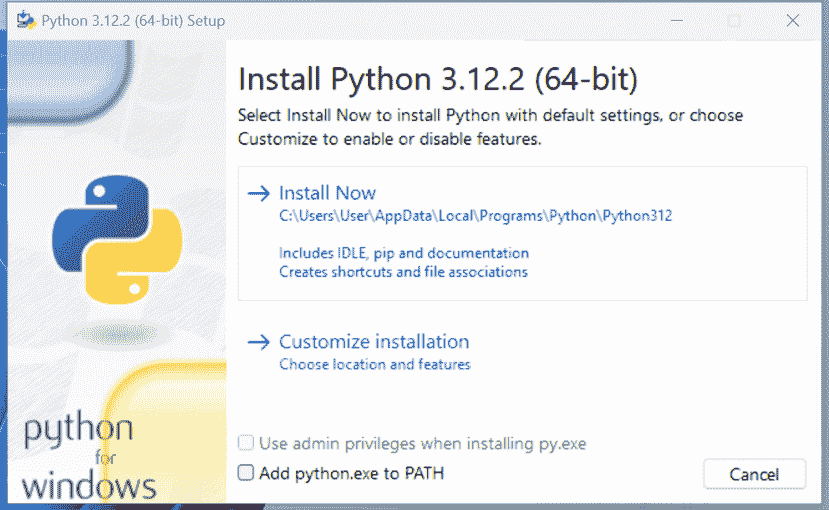
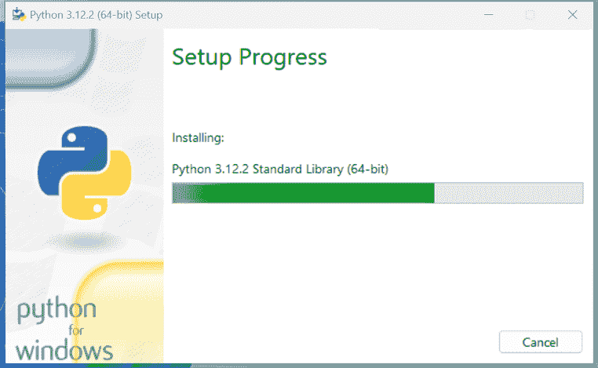
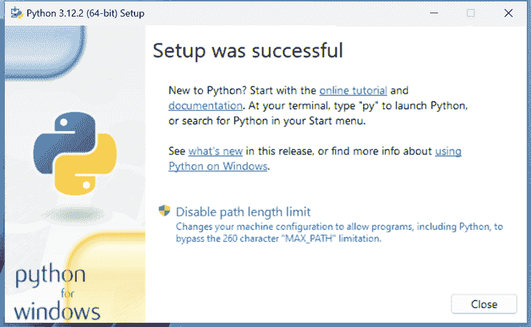

# 1

# Python 入门指南

> “给一个人一条鱼，你就能养活他一天。教一个人捕鱼，你就能养活他一辈子。”
> 
> ——中国谚语

计算机编程，有时也称为编码，就是用计算机能理解的语言告诉计算机做某事。

计算机是非常强大的工具，但不幸的是，它们不能自己思考。它们需要被告知一切：如何执行任务；如何评估条件以决定走哪条路；如何处理来自设备的数据，比如网络或磁盘；以及当发生不可预见的事情时，比如某物损坏或丢失时，如何反应。

你可以用许多不同的风格和语言进行编码。这很难吗？我们会说“是”和“不是”。这有点像写作——这是每个人都可以学习的东西。但如果你想成为一名诗人呢？仅仅写作是不够的。你必须掌握另一套技能，这将涉及更长和更大的努力。

最后，一切都取决于你想要走多远。编码不仅仅是把一些能工作的指令组合起来。它要复杂得多！

好的代码应该是简短、快速、优雅、易于阅读和理解、简单、易于修改和扩展、易于扩展和重构、易于测试。要同时具备所有这些品质的代码需要时间，但好消息是，你通过阅读这本书已经迈出了第一步。我们确信你可以做到。任何人都可以；事实上，我们每天都在编程，只是我们没有意识到这一点。

假设，比如说，你想冲泡速溶咖啡。你需要一个杯子、速溶咖啡罐、茶匙、水和水壶。即使你没有意识到，你也在评估大量的数据。你确保水壶里有水，水壶已插电，杯子干净，罐子里有足够的咖啡。然后你烧水，也许同时，你在杯子里放了一些咖啡。当水烧好后，你把它倒入杯子，并搅拌。

那么，这是怎样的编程呢？

好吧，我们收集了资源（水壶、咖啡、水、茶匙和杯子）并验证了一些与它们相关的条件（水壶已插电，杯子干净，咖啡足够）。然后我们开始执行两个动作（烧水和把咖啡倒入杯子），当这两个动作都完成后，我们通过往杯子里倒水并搅拌来结束整个程序。

你能看出其中的相似之处吗？我们刚刚描述了一个咖啡程序的顶层功能。这并不难，因为这就是大脑整天在做的事情：评估条件、决定采取行动、执行任务、重复一些任务，并在某个时候停止。

现在你需要学习如何分解你在现实生活中自动执行的所有动作，以便计算机能够真正理解它们。你还需要学习一种语言，以便能够指导计算机。

因此，这本书的目的就在于此。我们将向你展示一种成功编码的方法，我们将通过许多简单但专注的示例（我们最喜欢的那种）来实现这一点。

在本章中，我们将涵盖以下内容：

+   Python 的特点和生态系统

+   关于如何使用 Python 和虚拟环境的指南

+   如何运行 Python 程序

+   如何组织 Python 代码及其执行模型

# 编程简介

在教授编码时，我们喜欢引用现实世界；我们相信这有助于人们更好地保留他们正在学习的概念。然而，现在是时候更加严谨一点，从更技术性的角度看待编码了。

当我们编写代码时，我们是在指导计算机执行它必须完成的任务。动作发生在哪里？在许多地方：计算机内存、硬盘驱动器、网络电缆、CPU 等等。这是一个整体的世界，大多数时候是现实世界的一个子集的表示。

如果你编写一个允许人们在线购买衣服的软件，你将不得不在程序的范围内表示真实的人、真实的衣服、真实的品牌、尺寸等等。

要做到这一点，你需要在程序中创建和处理对象。人可以是一个对象。一辆车是一个对象。一条裤子是一个对象。幸运的是，Python 非常理解对象。

任何对象都具有的两个关键特性是**属性**和**方法**。让我们以人作为一个对象的例子。通常，在计算机程序中，你会将人表示为客户或员工。你存储在他们身上的属性可能包括姓名、社会保险号、年龄、是否有驾驶执照、电子邮件等等。在计算机程序中，你存储所有必要的数据，以便使用对象来完成需要的服务。如果你正在编写一个销售衣服的网站，你可能还想存储客户的高度和体重以及其他尺寸，以便向他们推荐合适的衣服。因此，属性是对象的特性。我们经常使用它们：*你能把那支笔递给我吗？——哪一支？——黑色的那支*。在这里，我们使用了笔的颜色（*黑色*）属性来识别它（很可能是与其他颜色的笔放在一起，以便区分）。

方法是对象可以执行的动作。作为一个人类，我有诸如*说话、走路、睡觉、醒来、吃饭、做梦、写作、阅读*等方法。我能做的所有事情都可以看作是代表我的对象的方法的体现。

因此，现在你已经知道了什么是对象，它们提供了可以运行的方法和你可以检查的属性，你就可以开始编码了。实际上，编码只是关于管理那些存在于我们软件中复制的世界的子集中的对象。你可以随意创建、使用、重用和删除对象。

根据官方 Python 文档中的*数据模型*章节（[`docs.python.org/3/reference/datamodel.html`](https://docs.python.org/3/reference/datamodel.html)）：

*“对象是 Python 对数据的抽象。Python 程序中的所有数据都由对象或对象之间的关系表示。”*

我们将在*第六章*，*面向对象编程（OOP）、装饰器和迭代器*中更详细地研究 Python 对象。现在，我们只需要知道 Python 中的每个对象都有一个**ID**（或身份）、一个**类型**和一个**值**。

**面向对象编程**（**OOP**）只是许多编程范式之一。在 Python 中，我们可以使用函数式或命令式风格编写代码，也可以使用面向对象。然而，正如我们之前所述，Python 中的所有东西都是对象，因此我们始终使用它们，无论选择的编码风格如何。

一旦创建，对象的 ID 永远不会改变。它是它的唯一标识符，Python 在幕后使用它来检索对象，当我们想要使用它时。类型也永远不会改变。类型说明了对象支持的操作以及可以分配给它的可能值。我们将在*第二章*，*内置数据类型*中看到 Python 最重要的数据类型。某些对象的值可以改变。这样的对象被称为**可变的**。如果值不能改变，则该对象被称为**不可变的**。

那么，我们如何使用一个对象呢？当然，我们给它一个名字！当你给一个对象一个名字时，你就可以使用这个名字来检索对象并使用它。在更通用的意义上，对象，如数字、字符串（文本）和集合，都与一个名字相关联。在其他语言中，这个名字通常被称为*变量*。你可以把变量看作是一个盒子，你可以用它来存储数据。

对象代表数据。它存储在数据库中或通过网络连接发送。当你打开任何网页或处理文档时，你所看到的就是数据。计算机程序通过操作这些数据来执行各种动作。它们调节其流动，评估条件，对事件做出反应，等等。

要完成所有这些，我们需要一种语言。这正是 Python 的作用所在。Python 是我们将在整本书中使用的语言，用来指导计算机为我们做某些事情。

# 进入 Python

Python 是 Guido Van Rossum 的杰作，他是荷兰的一位计算机科学家和数学家，决定在 1989 年圣诞节期间将他在玩的项目赠予世界。这种语言大约在 1991 年对公众亮相，从那时起，它已经发展成为今天全球使用的主要编程语言之一。

我们（作者）都很小的时候就开始编程了。Fabrizio 从 7 岁开始，在 Commodore VIC-20 上，后来被更大的兄弟 Commodore 64 所取代。它使用的语言是 **BASIC**。Heinrich 在高中时开始学习 Pascal。在我们之间，我们使用过 Pascal、汇编、C、C++、Java、JavaScript、Visual Basic、PHP、ASP、ASP .NET、C# 以及我们甚至无法记住的许多其他语言；只有当我们到达 Python 时，我们才终于有了那种感觉，就像你在商店里找到正确的沙发时，你的整个身体都在喊：*买这个！这个就是完美的！*

我们大约花了一天时间来适应它。它的语法与我们习惯的不同，但一旦我们克服了那种不适感（就像穿新鞋一样），我们俩都深深地爱上了它。让我们看看原因。

# 关于 Python

在我们深入细节之前，让我们了解一下为什么有人想使用 Python。它体现了以下品质。

## 便携性

Python 在任何地方都能运行，将程序从 Linux 迁移到 Windows 或 Mac 通常只是修复路径和设置的问题。Python 是为便携性设计的，它处理了特定 **操作系统**（**OS**）的怪癖，这些怪癖在接口后面保护你免受编写针对特定平台定制的代码的痛苦。

## 一致性

Python 非常逻辑和连贯。你可以看出它是由一位杰出的计算机科学家设计的。大多数时候，如果你不知道一个方法的名称，你只需猜测一下就可以了。

你可能现在还没有意识到这一点有多重要，尤其是如果你作为一个程序员不是那么有经验的话，但这是一个主要特点。这意味着你的头脑中杂乱无章的东西更少，以及当你编码时，你大脑中映射的需求也更少。

## 开发者生产力

根据马克·卢茨（*《Python 学习，第 5 版，O’Reilly 媒体*）的说法，Python 程序通常比等价的 Java 或 C++ 代码小五分之一到三分之一。这意味着工作可以更快完成。更快是好事。更快意味着能够更快地响应市场。更少的代码不仅意味着要编写的代码更少，而且意味着要阅读（专业程序员读的比写的多）、维护、调试和重构的代码也更少。

另一个重要方面是，Python 可以在没有漫长的和耗时的编译和链接步骤的情况下运行，因此不需要等待看到你工作的结果。

## 丰富的库

Python 拥有一个极其广泛的标准库（据说它包含了*内置电池*）。如果这还不够的话，Python 的国际社区还维护了一系列第三方库，这些库针对特定需求定制，你可以在**Python 包索引**（**PyPI**）上免费访问它们。当你用 Python 编码并意识到需要某个特性时，在大多数情况下，至少有一个库已经实现了这个特性。

## 软件质量

Python 非常注重可读性、连贯性和质量。语言的统一性使得可读性很高，这在当今时代尤为重要，因为编码越来越多地是集体努力而非个人奋斗。Python 的另一个重要方面是其固有的多范式特性。你可以将其用作脚本语言，但也可以使用面向对象、命令式和函数式编程风格——它极其灵活。

## 软件集成

另一个重要方面是 Python 可以扩展并与许多其他语言集成，这意味着即使一家公司使用不同的语言作为主流工具，Python 也可以介入并作为需要以某种方式相互通信的复杂应用程序之间的粘合剂。这是一个更高级的话题，但在现实世界中，这个特性很重要。

## 数据科学

Python 是目前数据科学、机器学习和人工智能领域使用最流行（如果不是**最流行**）的语言之一。因此，对于那些希望在这些领域有职业发展的人来说，掌握 Python 几乎是必需的。

## 满足与享受

最后，但同样重要的是，是它的乐趣！使用 Python 很有趣；我们可以连续编码八小时，然后快乐而满足地离开办公室，不受其他程序员因使用不提供同样数量精心设计的数据结构和构造的语言而必须忍受的挣扎的影响。毫无疑问，Python 让编码变得有趣，而乐趣可以促进动力和生产力。

这些是我们推荐 Python 给每个人的主要原因。当然，我们还可以提到许多其他的技术和高级特性，但它们并不真正适用于像这样一个入门章节。随着我们更深入地了解 Python，这些特性会自然而然地出现，一章接一章。

现在，让我们来看看 Python 可能存在的局限性。

# 有什么缺点？

除了个人偏好之外，Python 的主要缺点在于其执行速度。通常，Python 的速度比编译型语言慢。Python 的标准实现会在运行应用程序时生成源代码的编译版本，称为字节码（扩展名为 `.pyc`），然后由 Python 解释器运行。这种方法的优点是可移植性，我们为此付出了运行时间增加的代价，因为 Python 并没有像其他语言那样编译到机器级别。

尽管如此，Python 的速度在今天很少成为问题，因此无论这个缺点如何，它都得到了广泛的应用。实际情况是，硬件成本不再是问题，通常您可以通过并行化任务来提高速度。此外，许多程序花费大量时间等待 I/O 操作完成；因此，原始的执行速度往往是整体性能的次要因素。

值得注意的是，Python 的核心开发者在过去几年里投入了大量精力来加速对最常见数据结构的操作。这种努力在某些情况下非常成功，在一定程度上缓解了这个问题。

在速度真正至关重要的场合，人们可以切换到更快的 Python 实现，例如 **PyPy**，它通过实现高级编译技术，平均提供超过四倍的速度提升（参考[`pypy.org/`](https://pypy.org/)获取更多信息）。您还可以将代码中性能关键的部分用更快的语言编写，例如 C 或 C++，并将其与 Python 代码集成。例如，**pandas** 和 **NumPy**（在 Python 中进行数据科学时常用）就使用了这样的技术。

Python 语言有几种不同的实现方式。在这本书中，我们将使用被称为 CPython 的参考实现。您可以在[`www.python.org/download/alternatives/`](https://www.python.org/download/alternatives/)找到其他实现方式的列表。

如果这还不足以说服您，您可以考虑这样一个事实：Python 已被用于驱动 Spotify 和 Instagram 等服务的后端，在这些服务中性能是一个关注点。从这个角度来看，Python 已经完美地完成了它的任务。

# 今天谁在使用 Python？

Python 被用于许多不同的环境，例如系统编程、Web 和 API 编程、GUI 应用程序、游戏和机器人技术、快速原型设计、系统集成、数据科学、数据库应用程序、实时通信等等。一些著名的大学也将 Python 作为计算机科学课程的主要语言。

下面是一个已知使用 Python 的主要公司和组织的列表，它们在技术栈、产品开发、数据分析或自动化流程中使用 Python：

+   科技行业

    +   Google：使用 Python 进行许多任务，包括后端服务、数据分析以及人工智能（AI）

    +   Facebook: 利用 Python 进行各种目的，包括基础设施管理和运营自动化

    +   Instagram: 严重依赖 Python 进行其后端，使其成为最大的 Django（一个 Python 网络框架）用户之一

    +   Spotify: 主要使用 Python 进行数据分析和服务后端

    +   Netflix: 使用 Python 进行数据分析、运营自动化和安全

+   金融行业

    +   摩根大通（JP Morgan Chase）: 使用 Python 进行金融模型、数据分析和算法交易

    +   高盛（Goldman Sachs）: 使用 Python 进行各种金融模型和应用

    +   彭博社（Bloomberg）: 使用 Python 进行金融数据分析及其彭博终端界面

+   科技和软件

    +   国际商业机器公司（IBM）: 利用 Python 进行人工智能、机器学习和网络安全

    +   英特尔（Intel）: 使用 Python 进行硬件测试和开发流程

    +   Dropbox: 桌面客户端主要用 Python 编写

+   空间和研究

    +   美国国家航空航天局（NASA）: 使用 Python 进行多种目的，包括数据分析系统和系统集成

    +   欧洲核子研究中心（CERN）: 使用 Python 进行物理实验中的数据处理和分析

+   零售和电子商务

    +   亚马逊（Amazon）: 使用 Python 进行数据分析、产品推荐和运营自动化

    +   eBay: 利用 Python 进行各种后端服务和数据分析

+   娱乐和媒体

    +   皮克斯（Pixar）: 使用 Python 进行动画软件和动画过程中的脚本编写

    +   工业光魔（Industrial Light & Magic, ILM）: 使用 Python 进行视觉效果和图像处理

+   教育和学习平台

    +   Coursera: 利用 Python 进行网络开发和后端服务

    +   可汗学院（Khan Academy）: 使用 Python 进行教育内容交付和后端服务

+   政府和非营利组织

    +   美国联邦政府：有多个部门和机构使用 Python 进行数据分析、网络安全和自动化

    +   树莓派基金会（The Raspberry Pi Foundation）: 将 Python 作为教育目的和项目的首选编程语言

# 设置环境

在我们的机器（MacBook Pro）上，这是最新的 Python 版本：

```py
>>> import sys
>>> print(sys.version)
3.12.2 (main, Feb 14 2024, 14:16:36) [Clang 15.0.0 (clang-1500.1.0.2.5)] 
```

因此，您可以看到版本是 3.12.2，该版本于 2023 年 10 月 2 日发布。前面的文本是一段输入到控制台中的 Python 代码。我们稍后会讨论这个问题。

本书中的所有示例都将使用 Python 3.12 运行。如果您希望跟随示例并下载本书的源代码，请确保您使用的是相同的版本。

## 安装 Python

在您的计算机上安装 Python 的过程取决于您所使用的操作系统。首先，Python 在几乎每个 Linux 发行版中都是完全集成的，并且很可能已经安装。如果您有较新的 macOS 版本，Python 3 可能也已经安装，而如果您使用的是 Windows，您可能需要安装它。

无论 Python 是否已安装在您的系统中，您都需要确保已安装版本 3.12。

要检查您是否已在系统上安装了 Python，请在命令提示符中尝试输入 `python --version` 或 `python3 --version`（关于这一点稍后会有更多介绍）。

你想要开始的地方是官方的 Python 网站：[`www.python.org`](https://www.python.org) 。这个网站托管了官方的 Python 文档以及许多其他你会发现非常有用的资源。

### 有用的安装资源

Python 网站提供了有关在各个操作系统上安装 Python 的有用信息。请参考您操作系统的相关页面。

Windows 和 macOS：

+   [`docs.python.org/3/using/windows.html`](https://docs.python.org/3/using/windows.html)

+   [`docs.python.org/3/using/mac.html`](https://docs.python.org/3/using/mac.html)

对于 Linux，请参考以下链接：

+   [`docs.python.org/3/using/unix.html`](https://docs.python.org/3/using/unix.html)

+   [`ubuntuhandbook.org/index.php/2023/05/install-python-3-12-ubuntu/`](https://ubuntuhandbook.org/index.php/2023/05/install-python-3-12-ubuntu/)

### 在 Windows 上安装 Python

例如，这是在 Windows 上安装 Python 的步骤。前往 [`www.python.org/downloads/`](https://www.python.org/downloads/) 下载适合您计算机 CPU 的相应安装程序。

一旦下载，您可以通过双击它来启动安装。



图 1.1：在 Windows 上开始安装过程

我们建议选择默认安装，并且不要勾选 **将 python.exe 添加到 PATH** 选项，以防止与您机器上可能已安装的其他版本的 Python 发生冲突，可能是由其他用户安装的。

对于更全面的指南，请参考上一段中提到的链接。

一旦点击 **现在安装**，安装程序将开始。



图 1.2：安装进行中

安装完成后，您将进入最终屏幕。



图 1.3：安装完成

点击 **关闭** 以完成安装。

现在 Python 已安装到您的系统上，打开命令提示符，通过输入 `py` 来运行 **Python 交互式外壳**。此命令将选择您机器上安装的最新版本的 Python。在撰写本文时，3.12 是可用的最新版本。如果您安装了更早的版本，您可以使用命令 `py -3.12` 指定版本。

要在 Windows 中打开命令提示符，请前往 **开始** 菜单，在搜索框中输入 `cmd` 以启动终端。或者，您也可以使用 Powershell。

### 在 macOS 上安装 Python

在 macOS 上，安装过程与 Windows 类似。一旦下载了适合您机器的相应安装程序，完成安装步骤，然后通过前往 **应用程序 > 工具 > 终端** 来启动终端。或者，您也可以通过 Homebrew 安装它。

一旦进入终端窗口，你可以输入 `python`。如果启动了错误的版本，你可以尝试使用 `python3` 或 `python3.12` 来指定版本。

### 在 Linux 上安装 Python

在 Linux 上安装 Python 的过程通常比在 Windows 或 macOS 上复杂一些。如果你使用的是 Linux 机器，最佳做法是在网上搜索适用于你发行版的最新步骤。这些步骤可能因发行版而异，因此很难给出一个对每个人都有相关性的例子。请参考“有用的安装资源”部分中的链接以获取指导。

## Python 控制台

我们将使用 **控制台** 这个术语来交替表示 Linux 控制台、Windows 命令提示符或 PowerShell、macOS 终端。我们还将使用默认的 Linux 格式来指示命令行提示符，如下所示：

```py
$ sudo apt-get update 
```

如果你对此不熟悉，请花些时间学习控制台的基本工作原理。简而言之，在 `$` 符号之后，你将输入你的指令。注意大小写和空格，因为它们非常重要。

无论你打开哪个控制台，在提示符处输入 `python`（在 Windows 上是 `py`），确保出现 Python 交互式外壳。输入 `exit()` 退出。请记住，如果你的操作系统预装了其他 Python 版本，你可能需要指定 `python3` 或 `python3.12`。

我们通常将 Python 交互式外壳简单地称为 **Python 控制台**。

这大致是你运行 Python 时应该看到的内容（一些细节会根据版本和操作系统而变化）：

```py
$ python
Python 3.12.2 (main, Feb 14 2024, 14:16:36)
[Clang 15.0.0 (clang-1500.1.0.2.5)] on darwin
Type "help", "copyright", "credits" or "license" for more information.
>>> 
```

现在 Python 已经设置好了，你可以运行它了，是时候确保你拥有其他工具，这将对于跟随书中的示例至关重要：一个虚拟环境。

## 关于虚拟环境

在使用 Python 时，使用虚拟环境是非常常见的。让我们通过一个简单的例子来看看它们是什么以及为什么我们需要它们。

你在你的系统上安装了 Python，并开始为客户 X 制作网站。你创建了一个项目文件夹并开始编码。在这个过程中，你还安装了一些库，例如 Django 框架。假设你为项目 X 安装的 Django 版本是 4.2。

现在，你的网站如此出色，你得到了另一个客户 Y。她希望你再建一个网站，所以你开始项目 Y，在这个过程中，你需要再次安装 Django。唯一的问题是现在 Django 的版本是 5.0，你无法在你的系统上安装它，因为这会替换掉为项目 X 安装的版本。你不想冒引入不兼容性问题的风险，所以你有两个选择：要么坚持使用你机器上当前的版本，要么升级它并确保第一个项目仍然可以完全正确地与新版本一起工作。

让我们坦诚地说；这两个选项都不太吸引人，对吧？绝对不是。但是有一个解决方案：虚拟环境！

虚拟环境是隔离的 Python 环境，每个环境都是一个包含所有必要可执行文件的文件夹，这些文件用于使用 Python 项目所需的包（暂时将包视为库）。 

因此，您为项目 X 创建一个虚拟环境，安装所有依赖项，然后为项目 Y 创建一个虚拟环境并安装其所有依赖项，而无需担心，因为您安装的每个库最终都会在适当的虚拟环境边界内。在我们的例子中，项目 X 将包含 Django 4.2，而项目 Y 将包含 Django 5.0。

非常重要的一点是，您永远不要在系统级别直接安装库。例如，Linux 依赖于 Python 执行许多不同的任务和操作，如果您篡改 Python 的系统安装，您可能会危及整个系统的完整性。所以，请记住这个规则：在开始新项目时，始终创建一个虚拟环境。

当涉及到在您的系统上创建虚拟环境时，有几种不同的方法可以实现。自 Python 3.5 以来，建议使用`venv`模块来创建虚拟环境。您可以在官方文档页面（[`docs.python.org/3/library/venv.html`](https://docs.python.org/3/library/venv.html)）上查找更多信息。

例如，如果你使用的是基于 Debian 的 Linux 发行版，在使用之前，你需要安装`venv`模块：

```py
$ sudo apt-get install python3.12-venv 
```

创建虚拟环境的另一种常见方法是使用第三方 Python 包`virtualenv`。您可以在其官方网站上找到它：[`virtualenv.pypa.io`](https://virtualenv.pypa.io)。

在这本书中，我们将使用推荐的技巧，该技巧利用了 Python 标准库中的`venv`模块。

### 您的第一个虚拟环境

创建虚拟环境非常简单，但根据您的系统配置以及您希望虚拟环境运行的 Python 版本，您需要正确运行命令。当您想要使用它时，您还需要执行的操作是激活它。激活虚拟环境在幕后进行一些路径调整，以便当您从该 shell 调用 Python 解释器时，它将来自虚拟环境，而不是系统。我们将为您展示在 macOS 和 Windows 上的完整示例（在 Linux 上，它将与 macOS 非常相似）。我们将：

1.  打开一个终端，切换到我们用作项目根目录的文件夹（目录）（我们的文件夹是`code`）。我们将创建一个名为`my-project`的新文件夹，并切换到它。

1.  创建一个名为`lpp4ed`的虚拟环境。

1.  创建虚拟环境后，我们将激活它。在 Linux、macOS 和 Windows 之间，方法略有不同。

1.  然后，我们将确保我们正在运行所需的 Python 版本（3.12.X），通过运行 Python 交互式 shell 来实现。

1.  最后，我们将取消虚拟环境的激活。

一些开发者喜欢将所有虚拟环境命名为相同的名称（例如，`.venv`）。这样，他们可以通过知道其位置来配置工具和运行脚本，针对任何虚拟环境。`.venv` 中的点存在是因为在 Linux/macOS 中，在名称前加上点会使该文件或文件夹“不可见”。

这些步骤就是你开始一个项目所需的所有。

我们将以 macOS 上的一个示例开始（请注意，根据你的操作系统、Python 版本等，你可能会得到略有不同的结果）。在这个列表中，以井号 `#` 开头的行是注释，为了可读性添加了空格，箭头 `→` 表示由于空间不足而换行的行：

```py
fab@m1:~/code$ mkdir my-project  # step 1
fab@m1:~/code$ cd my-project
fab@m1:~/code/my-project$ which python3.12  # check system python
/usr/bin/python3.12  # <-- system python3.12
fab@m1:~/code/my-project$ python3.12 -m venv lpp4ed  # step 2
fab@m1:~/code/my-project$ source ./lpp4ed/bin/activate  # step 3
# check python again: now using the virtual environment's one
(lpp4ed) fab@m1:~/code/my-project$ which python
/Users/fab/code/my-project/lpp4ed/bin/python
(lpp4ed) fab@m1:~/code/my-project$ python  # step 4
Python 3.12.2 (main, Feb 14 2024, 14:16:36)
→ [Clang 15.0.0 (clang-1500.1.0.2.5)] on darwin
Type "help", "copyright", "credits" or "license" for more information.
>>> exit()
(lpp4ed) fab@m1:~/code/my-project$ deactivate  # step 5
fab@m1:~/code/my-project$ 
```

每个步骤都带有注释，所以你应该能够很容易地跟随。

这里需要注意的一点是，为了激活虚拟环境，我们需要运行 `lpp4ed/bin/activate` 脚本，该脚本需要被引用。当一个脚本被 *引用* 时，意味着它在当前 shell 中执行，并且其效果在执行后仍然持续。这非常重要。同时注意，在激活虚拟环境后，提示符如何发生变化，显示其名称在左侧（以及当我们取消激活时它如何消失）。

在 Windows 11 PowerShell 中，步骤如下：

```py
PS C:\Users\H\Code> mkdir my-project  # step 1
PS C:\Users\H\Code> cd .\my-project\
# check installed python versions
PS C:\Users\H\Code\my-project> py --list-paths
 -V:3.12 *
→ C:\Users\H\AppData\Local\Programs\Python\Python312\python.exe
PS C:\Users\H\Code\my-project> py -3.12 -m venv lpp4ed  # step 2
PS C:\Users\H\Code\my-project> .\lpp4ed\Scripts\activate  # step 3
# check python versions again: now using the virtual environment's
(lpp4ed) PS C:\Users\H\Code\my-project> py --list-paths
  *
→ C:\Users\H\Code\my-project\lpp4ed\Scripts\python.exe
 -V:3.12
→ C:\Users\H\AppData\Local\Programs\Python\Python312\python.exe
(lpp4ed) PS C:\Users\H\Code\my-project> python  # step 4
Python 3.12.2 (tags/v3.12.2:6abddd9, Feb  6 2024, 21:26:36)
→ [MSC v.1937 64 bit (AMD64)] on win32
Type "help", "copyright", "credits" or "license" for more
→ information.
>>> exit()
(lpp4ed) PS C:\Users\H\Code\my-project> deactivate  # step 5
PS C:\Users\H\Code\my-project> 
```

注意，在 Windows 上，激活虚拟环境后，你可以使用 `py` 命令，或者更直接地使用 `python`。

到目前为止，你应该能够创建并激活一个虚拟环境。请尝试自己创建另一个。熟悉这个流程——这是你将一直要做的事情：*我们从不全局使用 Python*，记住？虚拟环境非常重要。

书籍的源代码为每个章节都包含一个专门的文件夹。当章节中显示的代码需要安装第三方库时，我们将包含一个 `requirements.txt` 文件（或一个包含多个文本文件的等效 `requirements` 文件夹），你可以使用它来安装运行该代码所需的库。我们建议在实验章节的代码时，为该章节创建一个专门的虚拟环境。这样，你将能够在创建虚拟环境和安装第三方库方面获得一些实践。

## 安装第三方库

为了安装第三方库，我们需要使用 Python 包安装器，也就是 **pip**。很可能它已经在你虚拟环境中可用，如果没有，你可以在其文档页面上了解所有相关信息：[`pip.pypa.io`](https://pip.pypa.io)。

以下示例展示了如何创建一个虚拟环境并安装从 requirements 文件中获取的几个第三方库：

```py
fab@m1:~/code$ mkdir my-project
fab@m1:~/code$ cd my-project
fab@m1:~/code/my-project$ python3.12 -m venv lpp4ed
fab@m1:~/code/my-project$ source ./lpp4ed/bin/activate
(lpp4ed) fab@m1:~/code/my-project$ cat requirements.txt
django==5.0.3
requests==2.31.0
# the following instruction shows how to use pip to install
# requirements from a file
(lpp4ed) fab@m1:~/code/my-project$ pip install -r requirements.txt
Collecting django==5.0.3 (from -r requirements.txt (line 1))
  Using cached Django-5.0.3-py3-none-any.whl.metadata (4.2 kB)
Collecting requests==2.31.0 (from -r requirements.txt (line 2))
  Using cached requests-2.31.0-py3-none-any.whl.metadata (4.6 kB)
  ... more collecting omitted ...
Installing collected packages: ..., requests, django
Successfully installed ... django-5.0.3 requests-2.31.0
(lpp4ed) fab@m1:~/code/my-project$ 
```

正如你在列表底部可以看到的，`pip`安装了要求文件中的所有库，还有一些额外的库。这是因为`django`和`requests`都有自己的第三方库列表，它们依赖于这些库，因此`pip`会自动为我们安装它们。

使用`requirements.txt`文件只是 Python 中安装第三方库的许多方法之一。你也可以直接指定要安装的包名，例如，`pip install django`。

你可以在 pip 用户指南中找到更多信息：[`pip.pypa.io/en/stable/user_guide/`](https://pip.pypa.io/en/stable/user_guide/)。

现在，随着框架的搭建完成，我们准备更多地讨论 Python 及其用法。不过，在我们这样做之前，让我们先说几句关于控制台的话。

## 控制台

在这个 GUI 和触摸屏设备的时代，当一切似乎都只需一键即可完成时，不得不求助于像控制台这样的工具，这似乎有些荒谬。

但事实是，每当你从键盘上抬起手去抓鼠标，并将光标移动到你想要点击的位置时，你都在浪费时间。尽管一开始可能感觉不太直观，但使用控制台完成任务可以提高生产力和速度。相信我们，我们知道——你将不得不在这方面信任我们。

速度和生产率很重要，尽管我们并不反对使用鼠标，但熟练掌握控制台还有一个很好的原因：当你开发的代码最终部署到某个服务器上时，控制台可能是唯一可用的工具来访问该服务器上的代码。如果你与它成为朋友，当你最需要它的时候，你永远不会迷失方向（通常，当网站宕机时，你必须快速调查发生了什么）。

如果你仍然没有说服自己，请给我们一个机会，试一试。这比你想象的要简单，你不会后悔的。没有什么比一个优秀的开发者因为习惯了自己定制的工具集，而迷失在服务器的 SSH 连接中更可怜的了。

现在，让我们回到 Python 上来。

# 如何运行 Python 程序

你可以通过几种不同的方式来运行 Python 程序。

## 运行 Python 脚本

Python 可以用作脚本语言；事实上，它总是证明自己非常有用。脚本通常是执行某些任务（如任务）的文件（通常尺寸较小）。许多开发者最终会拥有一系列工具，他们在需要执行任务时使用这些工具。例如，你可以有脚本来解析一种格式的数据并将其渲染成另一种格式，或者你可以使用脚本来处理文件和文件夹；你可以创建或修改配置文件——从技术上讲，在脚本中几乎没有什么不能做的。

在服务器上脚本在精确时间运行是很常见的事情。例如，如果你的网站数据库需要每 24 小时清理一次（例如，定期清理过期的用户会话），你可以设置一个 Cron 作业，每天凌晨 1 点触发你的脚本。

根据维基百科，软件实用工具 Cron 是类 Unix 计算机操作系统中基于时间的作业调度器。那些设置和维护软件环境的人使用 Cron（或类似技术）来安排作业（命令或 shell 脚本）在固定的时间、日期或间隔定期运行。

我们有 Python 脚本来完成所有那些需要我们花费几分钟甚至更多时间手动完成的琐事，在某个时候，我们决定自动化。

## 运行 Python 交互式 Shell

运行 Python 的另一种方式是通过调用交互式 Shell。这是我们之前在控制台命令行中输入`python`时看到的事情。

因此，打开一个控制台，激活你的虚拟环境（到现在这应该已经变得很自然了，对吧？），然后输入`python`。你会看到几行，看起来应该像这样：

```py
(lpp4ed) fab@m1 ~/code/lpp4ed$ python
Python 3.12.2 (main, Feb 14 2024, 14:16:36)
[Clang 15.0.0 (clang-1500.1.0.2.5)] on darwin
Type "help", "copyright", "credits" or "license" for more
information.
>>> 
```

那些的`>>>`是 Shell 的提示符。它们告诉你 Python 正在等待你输入。如果你输入一个简单的指令，一行之内就能完成的指令，那么你将看到的就是这些。然而，如果你输入需要多行代码的指令，Shell 会将提示符更改为`...`，给你一个视觉提示，表明你正在输入一个多行语句（或任何需要多行代码的事情）。

继续尝试吧；让我们做一些基本的数学运算：

```py
>>> 3 + 7
10
>>> 10 / 4
2.5
>>> 2 ** 1024
179769313486231590772930519078902473361797697894230657273430081157
732675805500963132708477322407536021120113879871393357658789768814
416622492847430639474124377767893424865485276302219601246094119453
082952085005768838150682342462881473913110540827237163350510684586
298239947245938479716304835356329624224137216 
```

最后一个操作是向你展示一些令人难以置信的事情。我们将`2`的`1024`次方，Python 处理这个任务毫无困难。尝试在 Java、C++或 C#中做这件事，除非你使用特殊库来处理这样的大数，否则它将无法工作。

我们每天都在使用交互式 Shell。它对于快速调试来说极其有用；例如，检查一个数据结构是否支持某个操作，或者检查或运行一段代码。你会发现，交互式 Shell 很快就会成为你在旅途中最亲密的朋友之一。

另一个解决方案，它提供了一个更漂亮的图形布局，是使用**集成开发和学习环境**（**IDLE**）。它是一个非常简单的**集成开发环境**（**IDE**），主要面向初学者。它比控制台中获得的裸交互式 Shell 的功能集稍大，所以你可能想探索一下。它随 Windows 和 macOS Python 安装程序免费提供，你可以在任何其他系统上轻松安装它。你可以在 Python 网站上找到更多关于它的信息。

吉多·范罗苏姆将 Python 命名为英国喜剧团体蒙提·派森的名字，所以据说选择*IDLE*这个名字是为了纪念蒙提·派森的创始人之一埃里克·艾德尔。

## 将 Python 作为服务运行

除了作为脚本运行和在壳内运行之外，Python 还可以编码并作为应用程序运行。在这本书的整个过程中，我们将看到这种模式的示例。我们将在讨论 Python 代码的组织和运行方式时更深入地探讨这一点。

## 以 GUI 应用程序的形式运行 Python

Python 也可以用来创建 **图形用户界面 (GUI)**。有多个框架可供选择，其中一些是跨平台的，而另一些则是特定平台的。一个流行的 GUI 应用程序库示例是 **Tkinter**，它是一个位于 `Tk` 之上的面向对象层（Tkinter 意味着 Tk 接口）。

Tk 是一个将桌面应用程序开发提升到比传统方法更高的水平的 GUI 工具包。它是 **工具命令语言**（**Tcl**）的标准 GUI，也是许多其他动态语言的 GUI，它可以在 Windows、Linux、macOS 等操作系统上无缝运行原生应用程序。

Tkinter 是 Python 的内置库，因此它为程序员提供了轻松访问 GUI 世界的方法。

其他广泛使用的 GUI 框架包括：

+   PyQT/PySide

+   wxPython

+   Kivy

详细描述它们超出了本书的范围，但你可以在 Python 网站上找到所需的所有信息：[`docs.python.org/3/faq/gui.html`](https://docs.python.org/3/faq/gui.html)。

你可以在 *Python 有哪些 GUI 工具包？* 这一部分找到信息。如果你正在寻找 GUI，记得根据一些基本原则选择你想要的。确保它们：

+   提供你可能需要的所有功能来开发你的项目

+   在你需要支持的平台上运行

+   依靠尽可能广泛和活跃的社区

+   包装你可以轻松安装/访问的图形驱动程序/工具

# Python 代码是如何组织的？

让我们简单谈谈 Python 代码是如何组织的。在本节中，我们将开始进入传说中的兔子洞，并介绍更多的技术名称和概念。

从基础知识开始，Python 代码是如何组织的？当然，你将你的代码写入文件。当你保存一个扩展名为 `.py` 的文件时，该文件被称为 Python **模块**。

如果你使用的是 Windows 或 macOS，这些系统通常隐藏文件扩展名，我们建议你更改配置，以便可以看到文件的完整名称。这并不是严格的要求，而是一个建议，可能在区分文件时有所帮助。

将所有使软件工作的代码保存在一个单独的文件中是不切实际的。这种解决方案适用于脚本，通常不超过几百行（而且通常比这更短）。

一个完整的 Python 应用程序可能由成千上万行代码组成，所以你将不得不将它们分散到不同的模块中，这比没有组织要好，但还不够好。结果证明，即使这样，处理代码仍然是不切实际的。所以，Python 给了你另一个结构，称为 **包**，它允许你将模块组合在一起。

包不过是一个文件夹。在 Python 的早期版本中，需要一个特殊的文件 `__init__.py` 来标记一个目录为包。这个文件不需要包含任何代码，尽管它的存在不再是强制性的，但仍然有实际的理由说明为什么总是包含它是一个好主意。

总是如此，一个例子会让这一切变得更加清晰。我们在我们的书项目中创建了一个示例结构，当我们输入控制台：

```py
$ tree -v example 
```

我们得到了 `ch1/example` 文件夹内容的树形表示，它包含本章示例的代码。一个简单应用程序的结构可能看起来是这样的：

```py
example
├── core.py
├── run.py
└── util
    ├── __init__.py
    ├── db.py
    ├── maths.py
    └── network.py 
```

你可以看到在这个示例的根目录下，我们有两个模块，`core.py` 和 `run.py`，以及一个包，`util`。在 `core.py` 中，可能会有我们应用程序的核心逻辑。另一方面，在 `run.py` 模块中，我们可能可以找到启动应用程序的逻辑。在 `util` 包中，我们期望找到各种实用工具，实际上，我们可以猜测那里的模块是根据它们所持有的工具类型命名的：`db.py` 会包含用于处理数据库的工具，`maths.py` 当然会包含数学工具（也许我们的应用程序处理财务数据），而 `network.py` 可能会包含用于在网络上发送/接收数据的工具。

如前所述，`__init__.py` 文件仅仅是为了告诉 Python `util` 是一个包，而不仅仅是一个简单的文件夹。

如果这个软件仅仅在模块中组织，那么推断其结构将会更困难。我们在 `ch1/files_only` 文件夹中放置了一个仅模块的示例；请亲自查看：

```py
$ tree -v files_only 
```

这展示了完全不同的画面：

```py
files_only
├── core.py
├── db.py
├── maths.py
├── network.py
└── run.py 
```

猜测每个模块的功能有点困难，对吧？现在，考虑到这仅仅是一个简单的示例，你可以猜测如果我们不能将代码组织成包和模块，理解一个真实的应用程序将会多么困难。

## 我们如何使用模块和包？

当一个开发者编写应用程序时，他们很可能会需要在它的不同部分应用相同的逻辑。例如，当编写一个用于处理用户可以在网页中填写的表单数据的解析器时，应用程序将需要验证某个字段是否包含数字。无论这种验证逻辑是如何编写的，它很可能会被多个字段需要。

例如，在一个民意调查应用程序中，用户会被问及许多问题，其中很可能有几个需要数值答案。这些可能包括：

+   你多大年纪？

+   你有多少宠物？

+   你有多少孩子？

+   你结过几次婚？

在我们期望得到数值答案的每个地方复制/粘贴（或者说得更正式一些，复制）验证逻辑是不良的做法。这会违反**不要重复自己（DRY）**原则，该原则指出，你永远不应该在应用程序中重复相同的代码片段超过一次。尽管有 DRY 原则，我们在这里仍然需要强调这个原则的重要性：**你永远不应该在应用程序中重复相同的代码片段超过一次**！

重复相同的逻辑可能有几个原因，其中最重要的原因是：

+   逻辑中可能存在错误，因此你将不得不在每个副本中纠正它。

+   你可能想要修改你执行验证的方式，并且，你将不得不在每个副本中更改它。

+   你可能会忘记修复或修改一段逻辑，因为你错过了在搜索所有其出现位置时找到它。这会在你的应用程序中留下错误或不一致的行为。

+   你的代码可能会因为没有任何原因而比所需的更长。

Python 是一种奇妙的语言，为你提供了应用编码最佳实践所需的所有工具。在这个例子中，我们需要能够重用一段代码。为了有效地做到这一点，我们需要有一个结构来为我们保存代码，这样我们就可以在需要重复其中逻辑时调用该结构。这个结构存在，它被称为**函数**。

我们在这里不会深入探讨具体细节，所以请记住，函数是一个用于执行任务的有序、可重用代码块。函数可以采取许多形式和名称，根据它们所属的环境而定，但就目前而言，这并不重要。细节将在我们能够欣赏它们的时候，在本书的后面部分看到。函数是应用程序模块化的基石，它们几乎是不可或缺的。除非你正在编写一个非常简单的脚本，否则你将始终使用函数。函数将在**第四章**，**函数，代码的构建块**中探讨。

如前几页所述，Python 附带了一个非常广泛的库。现在是一个定义**库**的好时机：库是一组提供功能以丰富语言能力的函数和对象。例如，在 Python 的`math`库中，可以找到大量的函数，其中之一是`factorial`函数，它计算一个数的阶乘。

在数学中，非负整数 N 的阶乘，表示为 N!，定义为所有小于或等于 N 的正整数的乘积。例如，5 的阶乘计算如下：

*N! = 1*2*3*4*5 = 120*

0 的阶乘是 0! = 1，以尊重空乘积的惯例。

因此，如果你想在代码中使用这个函数，你所要做的就是导入它，并用正确的输入值调用它。如果现在输入值和调用的概念还不清楚，请不要过于担心；请只专注于导入部分。我们通过从库中导入特定组件来使用库，然后将其用于预期目的。在 Python 中，要计算 5!，我们只需要以下代码：

```py
>>> from math import factorial
>>> factorial(5)
120 
```

无论我们在 shell 中输入什么，如果它有一个可打印的表示，它都会被打印在控制台上供我们使用（在这种情况下，函数调用的结果：120）。

让我们回到我们的例子，即`core.py`、`run.py`、`util`等。在这里，`util`包是我们的实用库。这是我们自定义的实用工具带，它包含了我们在应用程序中需要的所有可重用工具（即函数）。其中一些将处理数据库（`db.py`），一些将处理网络（`network.py`），还有一些将执行超出 Python 标准`math`库范围的外部数学计算（`maths.py`），因此我们必须自己编写这些代码。

我们将在专门的章节中详细说明如何导入函数并使用它们。现在让我们谈谈另一个重要概念：*Python 的执行模型*。

# Python 的执行模型

在本节中，我们想向您介绍一些重要概念，例如作用域、名称和命名空间。您当然可以在官方语言参考（[`docs.python.org/3/reference/executionmodel.html`](https://docs.python.org/3/reference/executionmodel.html)）中阅读有关 Python 执行模型的全部内容，但我们认为它相当技术性和抽象，所以让我们先给您一个不那么正式的解释。

## 名称和命名空间

假设你在找一本书，所以你去图书馆并请求某人帮忙。他们会告诉你类似“二楼，区 X，行三”这样的信息。然后你上楼，寻找区 X，等等。如果进入一个所有书籍都随机堆放在一个大房间里的图书馆将会非常不同。没有楼层，没有区，没有行，没有顺序。找一本书将会非常困难。

当我们编写代码时，我们面临相同的问题：我们必须尝试组织它，以便对没有先验知识的人来说容易找到他们想要的东西。当软件结构正确时，它也促进了代码的重用。此外，无组织的软件更有可能包含散乱的重复逻辑片段。

作为第一个例子，让我们拿一本书。我们通过书名来引用它；在 Python 术语中，这将是**名称**。Python 名称是其他语言所称为变量的最接近的抽象。名称引用对象，并通过**名称绑定**操作引入。让我们看一个快速示例（再次注意，任何跟在`#`后面的内容都是注释）：

```py
>>> n = 3  # integer number
>>> address = "221b Baker Street, NW1 6XE, London"  # Sherlock Holmes' address
>>> employee = {
...     'age': 45,
...     'role': 'CTO',
...     'SSN': 'AB1234567',
... }
>>> # let us print them
>>> n
3
>>> address
'221b Baker Street, NW1 6XE, London'
>>> employee
{'age': 45, 'role': 'CTO', 'SSN': 'AB1234567'}
>>> other_name
Traceback (most recent call last):
  File "<stdin>", line 1, in <module>
NameError: name 'other_name' is not defined
>>> 
```

记住，每个 Python 对象都有一个身份、一个类型和一个值。我们在前面的代码中定义了三个对象；现在让我们检查它们的类型和值：

+   一个整数 `n`（类型：`int`，值：`3`）

+   一个字符串 `address`（类型：`str`，值：夏洛克·福尔摩斯的地址）

+   一个字典 `employee`（类型：`dict`，值：一个包含三个键/值对的字典对象）

不要担心，我们知道我们还没有涵盖字典是什么。我们将在*第二章*，*内置数据类型*中看到，它是 Python 数据结构之王。

你有没有注意到，当我们输入 `employee` 的定义时，提示符从 `>>>` 变成了 `...`？这是因为定义跨越了多行。

那么，`n`、`address` 和 `employee` 是什么呢？它们是**名称**，并且可以用来从我们的代码中检索数据。它们需要被保存在某个地方，这样我们每次需要检索那些对象时，都可以使用它们的名称来获取它们。我们需要一些空间来存放它们，因此：**命名空间**！

**命名空间**是从名称到对象的映射。例如，内置名称的集合（包含在任何 Python 程序中始终可用的函数）、模块中的全局名称以及函数中的局部名称。甚至一个对象的属性集合也可以被认为是命名空间。

命名空间的美妙之处在于，它们允许你清晰、无重叠或干扰地定义和组织名称。例如，在图书馆中我们寻找的那本书的命名空间可以用来导入这本书本身，如下所示：

```py
from library.second_floor.section_x.row_three import book 
```

我们从 `library` 命名空间开始，通过点（`.`）操作符进入该命名空间。在这个命名空间内，我们寻找 `second_floor`，然后再次使用 `.` 操作符进入它。然后我们进入 `section_x`，最后，在最后一个命名空间 `row_three` 中，我们找到了我们寻找的名称：`book`。

在处理实际的代码示例时，遍历命名空间将更加清晰。现在，只需记住，命名空间是名称与对象关联的地方。

另有一个概念，与命名空间密切相关，我们想简要提及：**作用域**。

## 作用域

根据 Python 的文档：

*“作用域是 Python 程序中的一个文本区域，其中命名空间可以直接访问。”*

**直接可访问**意味着，当查找未指定名称的引用时，Python 会尝试在命名空间中找到它。

作用域是静态确定的，但在运行时是动态使用的。这意味着通过检查源代码，你可以知道一个对象的作用域。Python 提供了四种不同的作用域可供访问（尽管不一定同时都存在）：

+   **局部**作用域，它是最内层的，包含局部名称。

+   **包含**作用域；即任何包含函数的作用域。它包含非局部名称和非全局名称。

+   **全局**作用域包含全局名称。

+   **内置**作用域包含内置名称。Python 提供了一套你可以直接使用的函数，例如 `print`、`all`、`abs` 等。它们位于内置作用域中。

规则是这样的：当我们引用一个名称时，Python 会从当前命名空间开始查找。如果找不到该名称，Python 会继续在封装作用域中搜索，这个过程会一直持续到内置作用域被搜索。如果在搜索了内置作用域之后仍然找不到名称，那么 Python 会抛出一个 `NameError` **异常**，这基本上意味着该名称尚未定义（如前例所示）。

因此，在查找名称时，命名空间的搜索顺序是 **局部**、**封装**、**全局**、**内置**（**LEGB**）。

这一切都是理论上的，所以让我们看一个例子。为了演示局部和封装命名空间，我们不得不定义几个函数。如果你目前不熟悉它们的语法，请不要担心——我们将在 *第四章*、*函数，代码的构建块* 中介绍。只需记住，在下面的代码中，当你看到 `def` 时，这意味着我们正在定义一个函数：

```py
# scopes1.py
# Local versus Global
# we define a function, called local
def local():
    age = 7
    print(age)
# we define age within the global scope
age = 5
# we call, or `execute` the function local
local()
print(age) 
```

在前面的例子中，我们在全局和局部作用域中定义了相同的名称 `age`。当我们使用以下命令执行此程序时（你激活了虚拟环境吗？）：

```py
$ python scopes1.py 
```

我们在控制台看到打印出两个数字：7 和 5。

发生的事情是，Python 解释器从上到下解析文件。首先，它找到几行注释，这些注释会被跳过，然后它解析 `local` 函数的定义。当被调用时，这个函数将做两件事：它将为代表数字 `7` 的对象设置一个名称，并将其打印出来。Python 解释器继续执行，并找到另一个名称绑定。这次，绑定发生在全局作用域，其值为 `5`。在下一行，有一个对 `local` 函数的调用。此时，Python 执行该函数，因此这次 `age = 7` 的绑定发生在局部作用域，并被打印出来。最后，有一个对 `print` 函数的调用，该调用被执行，现在将打印 `5`。

需要注意的一个特别重要的事情是，属于 `local` 函数定义部分的代码在右侧缩进了四个空格。实际上，Python 通过缩进来定义作用域。你通过缩进来进入一个作用域，通过取消缩进来退出。一些程序员使用两个空格，一些使用三个空格，但建议使用的空格数是四个。这是一个提高可读性的好方法。我们将在稍后更详细地讨论你在编写 Python 代码时应遵循的所有约定。

在其他语言中，例如 Java、C# 和 C++，作用域是通过在成对的大括号 `{ … }` 内编写代码来创建的。因此，在 Python 中，缩进代码对应于打开大括号，而缩进代码对应于关闭大括号。

如果我们删除那行 `age = 7` 会发生什么？记住 LEGB 规则。Python 将从局部作用域（函数 `local`）开始查找 `age`，如果没有找到，它将进入下一个封装作用域。在这种情况下，下一个是全局作用域。因此，我们会在控制台上看到数字 `5` 被打印两次。让我们看看在这种情况下代码会是什么样子：

```py
# scopes2.py
# Local versus Global
def local():
    # age does not belong to the scope defined by the local
    # function so Python will keep looking into the next enclosing
    # scope. age is finally found in the global scope.
    print(age, 'printing from the local scope')
age = 5
print(age, 'printing from the global scope')
local() 
```

运行 `scopes2.py` 将打印以下内容：

```py
$ python scopes2.py
5 printing from the global scope
5 printing from the local scope 
```

如预期，Python 首次打印 `age`，然后当调用 `local` 函数时，`age` 在其作用域中未找到，因此 Python 沿着 LEGB 链查找，直到在全局作用域中找到 `age`。让我们通过一个额外的层，即封装作用域，来看一个例子：

```py
# scopes3.py
# Local, Enclosing and Global
def enclosing_func():
    age = 13
    def local():
        # age does not belong to the scope defined by the local
        # function so Python will keep looking into the next
        # enclosing scope. This time age is found in the enclosing
        # scope
        print(age, 'printing from the local scope')
    # calling the function local
    local()
age = 5
print(age, 'printing from the global scope')
enclosing_func() 
```

运行 `scopes3.py` 将在控制台上打印以下内容：

```py
$ python scopes3.py
5, 'printing from the global scope'
13, 'printing from the local scope' 
```

如你所见，`local` 函数中的 `print` 指令仍然像之前一样引用 `age`。`age` 仍然在函数内部没有定义，所以 Python 按照 LEGB 顺序开始遍历作用域。这次，`age` 在 *封装* 作用域中被找到。

如果现在这仍然不是很清楚，请不要担心。随着我们通过书中的例子进行学习，它将变得更加清晰。Python 教程的 *类* 部分（[`docs.python.org/3/tutorial/classes.html`](https://docs.python.org/3/tutorial/classes.html)）有一个关于作用域和命名空间的有趣段落。确保你阅读它，以获得对该主题的更深入理解。

# 编写良好代码的指南

编写良好的代码并不像看起来那么简单。正如我们之前所说的，良好的代码展示了一系列难以结合的品质。编写良好的代码是一种艺术。无论你将在哪个阶段感到满意，你都可以接受一些东西，这将使你的代码立即变得更好：**PEP 8**。

**Python 增强提案**（**PEP**）是一份描述新提出的 Python 功能的文档。PEP 还用于记录 Python 语言开发周围的流程，并提供指南和信息。你可以在 [`www.python.org/dev/peps`](https://www.python.org/dev/peps) 找到所有 PEP 的索引。

PEP 8 可能是所有 PEP 中最著名的。它概述了一套简单但有效的指南，用于定义 Python 美学，以便我们编写美观、惯用的 Python 代码。如果你只从这一章中取出一个建议，请让它成为这个：使用 PEP 8。接受它。你将来会感谢我们的。

今天的编码不再是一个检查-签出业务。相反，它更多的是一种社会努力。几个开发者通过 Git 和 Mercurial 等工具共同协作编写代码，结果是许多不同人手的产品。

Git 和 Mercurial 是目前使用最广泛的两个分布式版本控制系统。它们是旨在帮助开发团队在同一软件上协作的必要工具。

这些天，比以往任何时候都更需要有一种一致的代码编写方式，以便最大限度地提高可读性。当一家公司的所有开发人员都遵守 PEP 8 时，任何一个人遇到一段代码时都会觉得是自己写的（实际上，Fabrizio 总是这样，因为他很快就会忘记自己写的任何代码）。

这带来了巨大的优势：当你阅读自己可能写的代码时，你会很容易地阅读它。如果没有约定，每个程序员都会以他们最喜欢的方式或简单地以他们被教导或习惯的方式结构化代码，这意味着必须根据别人的风格来解释每一行。这意味着需要花费更多的时间仅仅是为了理解它。感谢 PEP 8，我们可以避免这种情况。我们如此喜欢它，以至于在我们的团队中，如果代码不遵守 PEP 8，我们不会通过代码审查。所以，请花时间学习它；这非常重要。

Python 开发者可以利用几个不同的工具自动根据 PEP 8 指南格式化他们的代码。流行的工具有*black*和*ruff*。还有其他一些工具，称为 linters，它们检查代码是否格式正确，并向开发者发出警告，说明如何修复错误。著名的工具有*flake8*和*PyLint*。我们鼓励您使用这些工具，因为它们简化了编写格式良好软件的任务。

在本书的示例中，我们将尽可能尊重 PEP 8。不幸的是，我们没有 79 个字符的奢侈（这是 PEP 8 建议的最大行长度），我们不得不减少空白行和其他一些内容，但我们承诺我们会尽量使代码布局尽可能易于阅读。

# Python 文化

Python 已经在软件行业得到了广泛的应用。许多不同的公司出于不同的目的使用它，同时它也是一个出色的教育工具（由于它的简单性，这使得它易于学习；它鼓励编写可读性强的代码的好习惯；它是平台无关的；并且支持现代面向对象编程范式）。

Python 今天之所以如此受欢迎，其中一个原因是因为围绕它的社区庞大、充满活力，并且充满了杰出的人才。世界各地组织了许多活动，大多数活动要么与 Python 有关，要么与其最广泛采用的 Web 框架之一（如 Django）有关。

Python 的源代码是开放的，而且那些接受它的人的思想也往往是开放的。查看 Python 网站上的社区页面以获取更多信息并参与其中！

Python 另一个方面围绕着“Pythonic”这一概念。这与 Python 允许你使用一些在其他地方找不到的惯用语有关，至少不是以相同的形式或易用性（当不得不在非 Python 语言中编码时，有时会感到压抑）。

总之，多年来，“Pythonic”这一概念已经出现，根据我们的理解，它类似于*按照 Python 应该做到的方式进行操作*。

为了帮助你更好地了解 Python 的文化和“Pythonic”，我们将向你展示**Python 的禅宗**——一个非常受欢迎的*复活节彩蛋。打开 Python 控制台，输入 `import this`。

以下就是那项指导的结果：

```py
>>> import this
The Zen of Python, by Tim Peters
Beautiful is better than ugly.
Explicit is better than implicit.
Simple is better than complex.
Complex is better than complicated.
Flat is better than nested.
Sparse is better than dense.
Readability counts.
Special cases aren't special enough to break the rules.
Although practicality beats purity.
Errors should never pass silently.
Unless explicitly silenced.
In the face of ambiguity, refuse the temptation to guess.
There should be one-- and preferably only one --obvious way to do it.
Although that way may not be obvious at first unless you're Dutch.
Now is better than never.
Although never is often better than *right* now.
If the implementation is hard to explain, it's a bad idea.
If the implementation is easy to explain, it may be a good idea.
Namespaces are one honking great idea -- let's do more of those! 
```

这里有两种阅读层次。一种是将它视为一组以随意方式组合在一起的指南。另一种是将其牢记在心，偶尔阅读，试图理解它如何引用更深层次的内容：一些你必须深入理解的 Python 特性，以便以正确的方式编写 Python。从有趣层面开始，然后深入挖掘。总是深入挖掘。

# 关于 IDE 的一些说明

关于 IDE 的一些简要说明。为了遵循这本书中的示例，你不需要一个 IDE；任何体面的文本编辑器都足够好。如果你想拥有更高级的功能，例如语法高亮和自动完成，你将需要为自己获取一个 IDE。你可以在 Python 网站上找到一个开源 IDE 的综合列表（只需在 Google 上搜索“Python IDEs”）。

Fabrizio 使用的是来自微软的 Visual Studio Code。它是免费使用的，并且提供了许多开箱即用的功能，甚至可以通过安装扩展来进一步扩展。

在与包括 Sublime Text 在内的几位编辑器合作多年后，这一个是让他觉得最有生产力的。

另一方面，Heinrich 是一个坚定的 Neovim 用户。尽管它可能有一个陡峭的学习曲线，但 Neovim 是一个非常强大的文本编辑器，也可以通过插件进行扩展。它还有与它的前辈 Vim 兼容的好处，Vim 几乎安装在每个软件开发者经常工作的系统上。

两条重要的建议：

+   无论你决定使用什么 IDE，都要努力学好，以便充分利用其优势，但*不要过度依赖它*。偶尔练习使用 Vim（或任何其他文本编辑器）；学会在任何平台上使用任何一组工具进行工作。

+   无论你使用什么文本编辑器/IDE，当涉及到编写 Python 时，*缩进应该是四个空格*。不要使用制表符，也不要将它们与空格混合。使用四个空格，不要用两个、三个或五个。就只用四个。全世界都是这样做的，你也不想因为喜欢三空格布局而成为局外人。

# 关于 AI 的一些话

在过去一年左右的时间里，世界见证了人工智能的诞生。现在市场上有很多选择，其中一些为程序员提供了工具。

存在能够编写代码的工具的事实并不否定学习编程语言的所有理由。AI 工具远远不能做到人类能做的事情。它们并不完美，在撰写本文时，它们主要用于帮助完成重复性任务，有时甚至是枯燥的任务。

几个集成开发环境（IDE）可以与 GitHub Copilot（及其类似技术）等技术集成。Visual Studio Code、Zed、IntelliJ IDEA 和 PyCharm 都提供了使用 AI 插件来增强其功能的方法。甚至还有一些专门围绕 AI 功能设计的全新 IDE，例如 Cursor。

虽然我们在工作中确实使用这样的工具，但我们认为强调你尝试自己理解本书中的代码示例的重要性是至关重要的。请尽量在没有 AI 助手帮助的情况下解决这些问题，因为这将是你的学习过程中的一个重要部分。

# 摘要

在本章中，我们开始探索编程世界和 Python 世界。我们只是触及了表面，只是简要地提到了书中稍后会更详细讨论的概念。

我们讨论了 Python 的主要特性，谁在使用它以及用它做什么，以及我们可以用不同的方式编写 Python 程序。

在本章的最后部分，我们简要介绍了命名空间和作用域的基本概念。我们还看到了如何使用模块和包来组织 Python 代码。

在实际层面，我们学习了如何在我们的系统上安装 Python，以及如何确保我们拥有所需的工具，例如`pip`；我们还创建并激活了我们的第一个虚拟环境。这将使我们能够在不危及 Python 系统安装的情况下在一个自包含的环境中工作。

现在你已经准备好开始这段旅程了。你需要的是热情、一个激活的虚拟环境、这本书、你的手指，可能还有一些咖啡。

尝试跟随示例；我们将保持它们简单且简短。如果你能将它们应用到实践中，你将比仅仅阅读它们更好地记住它们。

在下一章中，我们将探索 Python 丰富的内置数据类型。有很多内容要介绍，也有很多东西要学习！

# 加入我们的 Discord 社区

加入我们的社区 Discord 空间，与作者和其他读者进行讨论：

[`discord.com/invite/uaKmaz7FEC`](https://discord.com/invite/uaKmaz7FEC)


