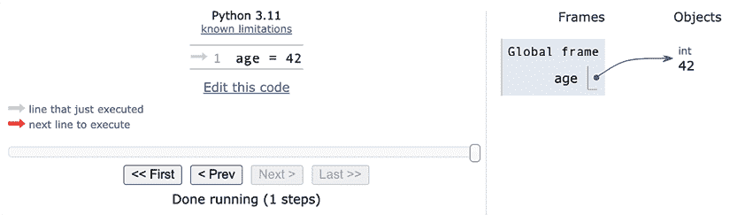
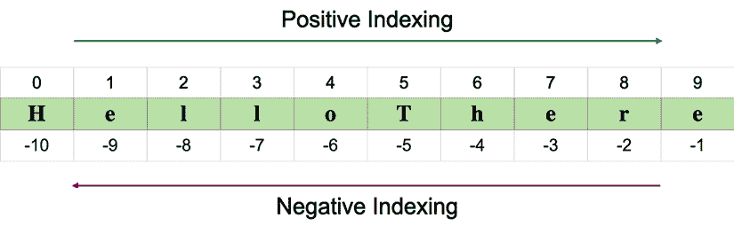

# 2

# 内置数据类型

> “数据！数据！数据！”他焦急地喊道。“没有粘土，我无法制作砖块。”
> 
> ——夏洛克·福尔摩斯，《铜 Beeches》冒险

你用计算机做的每一件事都是管理数据。数据有多种不同的形状和风味。它是你听的音乐，你流媒体播放的电影，你打开的 PDF 文件。甚至你此刻正在阅读的章节的来源也只是一个文件，它是数据。

数据可以是简单的，无论是代表年龄的整数，还是像网站上的订单这样的复杂结构。它可以关于单个对象，也可以关于它们的集合。数据甚至可以关于数据——即 **元数据**。这是描述其他数据结构设计的数据，或描述应用程序数据或其上下文的数据。在 Python 中，*对象是数据的抽象*，Python 有许多惊人的数据结构，你可以使用它们来表示数据或将它们组合起来创建自己的自定义数据。

在本章中，我们将介绍以下内容：

+   Python 对象的结构

+   可变性和不可变性

+   内置数据类型：数字、字符串、日期和时间、序列、集合和映射类型

+   `collections` 模块，简要介绍

+   枚举

# 万物皆对象

在我们深入具体细节之前，我们希望你对 Python 中的对象有非常清晰的认识，所以让我们再谈谈它们。*Python 中的万物都是对象*，每个对象都有一个 `identity`（`ID`）、一个 `type` 和一个 `value`。但当你在一个 Python 模块中输入像 `age = 42` 这样的指令时，实际上会发生什么呢？

如果你访问 [`pythontutor.com/`](https://pythontutor.com/)，你可以在文本框中输入那个指令并获取其可视化表示。记住这个网站；它对于巩固你对幕后发生的事情的理解非常有用。

所以，发生的事情是创建了一个 **对象**。它获得了一个 `id`，`type` 被设置为 `int`（整数），`value` 被设置为 `42`。一个名称 `age` 被放置在全局命名空间中，指向那个对象。因此，每次我们在全局命名空间中，在执行该行之后，我们都可以通过简单地通过其名称访问它来检索该对象：`age`。

如果你搬家，你会把所有的刀叉和勺子放进一个盒子里，并在上面贴上 *cutlery* 标签。这正是同样的概念。下面是一个截图，展示了它可能的样子（你可能需要调整设置才能获得相同的视图）：



图 2.1 – 一个指向对象的名称

因此，在本章的剩余部分，每当你读到像 `name = some_value` 这样的内容时，请想象一个放置在命名空间中的名称，它与编写指令的作用域相关联，并通过一个指向具有 *id* 、*type* 和 *value* 的对象的优美箭头。关于这个机制还有更多要说的，但用例子来说明它要容易得多，所以我们稍后再来讨论这个问题。

# 可变性

Python 对数据的第一项基本区分是对象的值是否可以改变。如果值可以改变，则该对象称为**可变**，否则该对象称为**不可变**。

理解可变和不可变之间的区别非常重要，因为它会影响你编写的代码。让我们看看以下例子：

```py
>>> age = 42
>>> age
42
>>> age = 43  #A
>>> age
43 
```

在前面的代码中，在行`#A`上，我们是否改变了`age`的值？好吧，没有。但现在它是`43`（我们听到你说...）。是的，它是`43`，但`42`是一个整数，类型为*int*，是不可变的。所以，实际上发生的事情是，在第一行，`age`是一个指向值为`42`的*int*对象的名称。当我们输入`age = 43`时，发生的事情是创建了一个新的*int*对象，其值为`43`（同样，*id*也会不同），并且名称`age`被设置为指向它。所以，实际上我们没有将`42`改为`43`——我们只是将名称`age`指向了不同的位置，即新的值为`43`的*int*对象。让我们看看对象的 ID：

```py
>>> age = 42
>>> id(age)
4377553168
>>> age = 43
>>> id(age)
4377553200 
```

注意我们调用内置的`id()`函数来打印 ID。如你所见，它们是不同的，正如预期的那样。记住，`age`一次指向一个对象：首先指向`42`，然后指向`43`——永远不会同时指向。

如果你在你自己的计算机上重现这些例子，你会注意到你得到的 ID 将是不同的。这是当然的，因为它们是由 Python 随机生成的，并且每次都会不同。

现在，让我们用可变对象来查看相同的例子。为此，我们将使用内置的`set`类型：

```py
>>> numbers = set()
>>> id(numbers)
4368427136
>>> numbers
set()
>>> numbers.add(3)
>>> numbers.add(7)
>>> id(numbers)
4368427136
>>> numbers
{3, 7} 
```

在这个例子中，我们创建了一个对象，`numbers`，它代表一个数学集合。我们可以看到它的`id`在创建后立即被打印出来，并且它是空的（`set()`）。然后我们继续向其中添加两个数字：`3`和`7`。我们再次打印`id`（这表明它是指向同一个对象）和它的值，现在显示它包含这两个数字。所以对象的价值已经改变，但它的`id`仍然是相同的。这显示了可变对象的典型行为。我们将在本章的后面更详细地探讨集合。

可变性是一个非常重要的概念。我们将在本章的其余部分提醒你。

# 数字

让我们先从探索 Python 的内置数字数据类型开始。Python 是由一个拥有数学和计算机科学硕士学位的人设计的，因此它对数字的广泛支持是合乎逻辑的。

数字是不可变对象。

## 整数

Python 整数具有无限的范围，仅受可用虚拟内存的限制。这意味着你想要存储的数字有多大并不重要——只要它能适应你的计算机内存，Python 就会处理它。

整数可以是正数、负数或 0（零）。它们的类型是*int*。它们支持所有基本数学运算，如下面的例子所示：

```py
>>> a = 14
>>> b = 3
>>> a + b  # addition
17
>>> a - b  # subtraction
11
>>> a * b  # multiplication
42
>>> a / b  # true division
4.666666666666667
>>> a // b  # integer division
4
>>> a % b  # modulo operation (remainder of division)
2
>>> a ** b  # power operation
2744 
```

上述代码应该很容易理解。只需注意一点：Python 有两个除法运算符，一个执行所谓的**真除法**（`/`），它返回操作数的商，另一个是所谓的**整数除法**（`//`），它返回操作数的**向下取整**商。

作为历史信息，在 Python 2 中，除法运算符 `/` 的行为与 Python 3 不同。

让我们看看当我们引入负数时，除法是如何表现出不同的行为的：

```py
>>> 7 / 4  # true division
1.75
>>> 7 // 4  # integer division, truncation returns 1
1
>>> -7 / 4  # true division again, result is opposite of previous
-1.75
>>> -7 // 4  # integer div., result not the opposite of previous
-2 
```

这是一个有趣的例子。如果你在最后一行期待 `-1`，请不要感到难过，这只是 Python 的工作方式。Python 中的整数除法**总是向负无穷大舍入**。如果你不想向下取整，而是想将一个数字截断为整数，可以使用内置的 `int()` 函数，如下面的例子所示：

```py
>>> int(1.75)
1
>>> int(-1.75)
-1 
```

注意，截断是向 0 方向进行的。

`int()` 函数还可以从字符串表示中返回给定基数的整数数字：

```py
>>> int('10110', base=2)
22 
```

值得注意的是，幂运算符 `**` 也有一个内置函数对应物，即下面的例子中所示的 `pow()` 函数：

```py
>>> pow(10, 3)
1000
>>> 10 ** 3
1000
>>> pow(10, -3)
0.001
>>> 10 ** -3
0.001 
```

此外，还有一个运算符可以计算除法的余数。它被称为**取模运算符**，用百分号（`%`）表示：

```py
>>> 10 % 3  # remainder of the division 10 // 3
1
>>> 10 % 4  # remainder of the division 10 // 4
2 
```

`pow()` 函数允许第三个参数执行**模幂运算**。

带有三个参数的这种形式在基数与模数互质的情况下也接受负指数。结果是基数的**模乘法逆元**（或当指数为负时，该基数的适当幂，但不是 -1），模第三个参数。

这里有一个例子：

```py
>>> pow(123, 4)
228886641
>>> pow(123, 4, 100)
41  # notice: 228886641 % 100 == 41
>>> pow(37, -1, 43)  # modular inverse of 37 mod 43
7
>>> (7 * 37) % 43  # proof the above is correct
1 
```

Python 3.6 引入的一个不错的新特性是能够在数字字面量中添加下划线（在数字或基数指定符之间，但不能是开头或结尾）。其目的是帮助使某些数字更易于阅读，例如 `1_000_000_000`：

```py
>>> n = 1_024
>>> n
1024
>>> hex_n = 0x_4_0_0  # 0x400 == 1024
>>> hex_n
1024 
```

## 布尔值

**布尔代数**是代数的一个子集，其中变量的值是真理值，即**真**和**假**。在 Python 中，`True` 和 `False` 是两个用于表示真理值的保留字。布尔值是整数的子类，因此 `True` 和 `False` 分别像 `1` 和 `0` 一样行为。布尔值的**int**类型等价于**bool**类型，它返回 `True` 或 `False`。每个内置的 Python 对象在布尔上下文都有一个值，这意味着当将它们传递给 `bool` 函数时，它们评估为 `True` 或 `False`。

布尔值可以使用逻辑运算符 `and`、`or` 和 `not` 在布尔表达式中进行组合。让我们看一个简单的例子：

```py
>>> int(True)  # True behaves like 1
1
>>> int(False)  # False behaves like 0
0
>>> bool(1)  # 1 evaluates to True in a Boolean context
True
>>> bool(-42)  # and so does every non-zero number
True
>>> bool(0)  # 0 evaluates to False
False
>>> # quick peek at the operators (and, or, not)
>>> not True
False
>>> not False
True
>>> True and True
True
>>> False or True
True 
```

布尔值在条件编程中最常用，我们将在第三章*条件与迭代*中详细讨论。

当你尝试将它们相加时，你会看到 `True` 和 `False` 是整数的子类。Python 将它们提升为整数并执行加法：

```py
>>> 1 + True
2
>>> False + 42
42
>>> 7 - True
6 
```

**向上转型**是一种类型转换操作，它从子类转换为其父类。在这个例子中，`True`和`False`，属于从整数类派生出的一个类，当需要时会被转换回整数。这个主题是关于继承的，将在*第六章*，*面向对象编程、装饰器和迭代器*中详细解释。

## 实数

实数，或**浮点数**，在 Python 中根据**IEEE 754**双精度二进制浮点格式表示，它们在 64 位信息中存储，分为三个部分：符号、指数和尾数。

在维基百科上了解更多关于这种格式的知识：[`en.wikipedia.org/wiki/Double-precision_floating-point_format`](http://en.wikipedia.org/wiki/Double-precision_floating-point_format)。

几种编程语言提供了两种不同的格式：单精度和双精度。前者占用 32 位内存，后者占用 64 位。Python 只支持双精度格式。让我们看看一个简单的例子：

```py
>>> pi = 3.1415926536  # how many digits of PI can you remember?
>>> radius = 4.5
>>> area = pi * (radius ** 2)
>>> area
63.617251235400005 
```

在计算面积时，我们将`radius ** 2`用括号括起来。即使这不是必要的，因为幂运算符的优先级高于乘法运算符，但我们认为这样公式读起来更清晰。此外，如果你得到的面积结果略有不同，请不要担心。这可能会取决于你的操作系统、Python 是如何编译的等等。只要前几位小数是正确的，你就知道这是正确的结果。

`sys.float_info`序列包含有关浮点数在你的系统上如何表现的信息。这是一个你可能看到的例子：

```py
>>> import sys
>>> sys.float_info
sys.float_info(
    max=1.7976931348623157e+308, max_exp=1024, max_10_exp=308,
    min=2.2250738585072014e-308, min_exp=-1021, min_10_exp=-307,
    dig=15, mant_dig=53, epsilon=2.220446049250313e-16, radix=2,
    rounds=1
) 
```

在这里让我们做一些考虑：我们有 64 位来表示浮点数。这意味着我们最多可以表示 *2*⁶⁴（即 *18,446,744,073,709,551,616*）个不同的数。看看浮点数的`max`和`epsilon`值，你就会意识到不可能表示它们全部。空间实在不够，所以它们被近似到最接近的可表示的数。你可能认为只有极大或极小的数会受到影响。如果是这样，接下来的例子会让你感到惊讶：

```py
>>> 0.3 - 0.1 * 3  # this should be 0!!!
-5.551115123125783e-17 
```

这告诉你什么？这告诉你，即使对于像 0.1 或 0.3 这样的简单数，双精度数也会出现近似问题。为什么这很重要？如果你处理的是价格、金融计算或任何需要精度的数据，这可能会成为一个大问题。别担心，Python 提供了**Decimal**类型，它不受这些问题的影响；我们稍后会看到这一点。

## 复数

Python 默认支持**复数**。如果你不知道什么是复数，它们是可以表示为*a + ib*形式的数字，其中*a*和*b*是实数，而*i*（或如果你使用工程符号是*j*）是虚数单位；也就是说，是*-1*的平方根。*a*和*b*分别称为数字的**实部**和**虚部**。

你可能不太可能使用它们，但无论如何，让我们看一个小例子：

```py
>>> c = 3.14 + 2.73j
>>> c = complex(3.14, 2.73)  # same as above
>>> c.real  # real part
3.14
>>> c.imag  # imaginary part
2.73
>>> c.conjugate()  # conjugate of A + Bj is A - Bj
(3.14-2.73j)
>>> c * 2  # multiplication is allowed
(6.28+5.46j)
>>> c ** 2  # power operation as well
(2.406700000000001+17.1444j)
>>> d = 1 + 1j  # addition and subtraction as well
>>> c - d
(2.14+1.73j) 
```

## 分数和小数

让我们通过查看分数和小数来结束对数字部门的游览。分数以它们的最简形式持有有理的分子和分母。让我们快速看一下一个例子：

```py
>>> from fractions import Fraction
>>> Fraction(10, 6)  # mad hatter?
Fraction(5, 3)  # notice it has been simplified
>>> Fraction(1, 3) + Fraction(2, 3)  # 1/3 + 2/3 == 3/3 == 1/1
Fraction(1, 1)
>>> f = Fraction(10, 6)
>>> f.numerator
5
>>> f.denominator
3
>>> f.as_integer_ratio()
(5, 3) 
```

`as_integer_ratio()`方法也添加到了整数和布尔值中。这很有帮助，因为它允许你使用它而无需担心正在处理哪种类型的数字。

除了传递分子和分母之外，分数还可以通过传递字符串、小数、浮点数以及当然还有分数来初始化。让我们通过浮点数和字符串的例子来看一下：

```py
>>> Fraction(0.125)  
Fraction(1, 8)
>>> Fraction("3 / 7")
Fraction(3, 7)
>>> Fraction("-.250")
Fraction(-1, 4) 
```

虽然`Fraction`对象有时非常有用，但在商业软件中并不常见。相反，更常见的是在所有那些精度至关重要的场合使用十进制数，例如在科学和金融计算中。

重要的是要记住，任意精度的十进制数在性能方面是有代价的，当然。每个数字要存储的数据量比分数或浮点数要多。它们被处理的方式也要求 Python 解释器在幕后更加努力。

让我们快速看一下十进制数字的例子：

```py
>>> from decimal import Decimal as D  # rename for brevity
>>> D(3.14)  # pi, from float, so approximation issues
Decimal('3.140000000000000124344978758017532527446746826171875')
>>> D("3.14")  # pi, from a string, so no approximation issues
Decimal('3.14')
>>> D(0.1) * D(3) - D(0.3)  # from float, we still have the issue
Decimal('2.775557561565156540423631668E-17')
>>> D("0.1") * D(3) - D("0.3")  # from string, all perfect
Decimal('0.0')
>>> D("1.4").as_integer_ratio()  # 7/5 = 1.4 (isn't this cool?!)
(7, 5) 
```

注意，当我们从一个浮点数构造一个十进制数时，它继承了浮点数可能带来的所有近似问题。另一方面，当我们从一个整数或数字的字符串表示形式创建一个`decimal`时，那么这个`decimal`将没有近似问题，因此也没有奇怪的行为。当涉及到货币或精度至关重要的场合时，请使用十进制。

这就结束了我们对内置数字类型的介绍。现在让我们看看序列。

# 不可变序列

让我们探索不可变序列：字符串、元组和字节。

## 字符串和字节

在 Python 中，文本数据通过**str**对象处理，更常见的是称为**字符串**。它们是**Unicode 代码点**的不可变序列。

Unicode 码点是分配给 Unicode 标准中每个字符的数字，Unicode 是一种通用的字符编码方案，用于在计算机中表示文本。Unicode 标准为每个字符提供唯一的数字，无论平台、程序或语言如何，从而使得在不同系统之间对文本的一致表示和处理成为可能。Unicode 涵盖了广泛的字符，包括拉丁字母的字母、中文、日文和韩文书写系统的表意文字、符号、表情符号等等。

与其他语言不同，Python 没有**char**类型，所以单个字符由长度为 1 的字符串表示。

应该在任何应用程序的内部使用 Unicode。然而，当涉及到存储文本数据或通过网络发送它时，你通常需要使用适当的编码对其进行编码，使用你正在使用的介质的适当编码。编码的结果产生一个**bytes**对象，其语法和行为与字符串类似。在 Python 中，字符串字面量使用单引号、双引号或三引号（单引号或双引号）编写。如果使用三引号构建，字符串可以跨越多行。以下示例将阐明这一点：

```py
>>> # 4 ways to make a string
>>> str1 = 'This is a string. We built it with single quotes.'
>>> str2 = "This is also a string, but built with double quotes."
>>> str3 = '''This is built using triple quotes,
... so it can span multiple lines.'''
>>> str4 = """This too
... is a multiline one
... built with triple double-quotes."""
>>> str4  #A
'This too\nis a multiline one\nbuilt with triple double-quotes.'
>>> print(str4)  #B
This too
is a multiline one
built with triple double-quotes. 
```

在`#A`和`#B`中，我们首先隐式地打印`str4`，然后显式地使用`print()`函数打印。一个很好的练习是找出为什么它们不同。你能接受这个挑战吗？（提示：查阅`str()`和`repr()`函数。）

字符串，像任何序列一样，都有长度。你可以通过调用`len()`函数来获取它：

```py
>>> len(str1)
49 
```

Python 3.9 引入了两种处理字符串前缀和后缀的新方法。以下是一个示例，解释了它们的工作方式：

```py
>>> s = "Hello There"
>>> s.removeprefix("Hell")
'o There'
>>> s.removesuffix("here")
'Hello T'
>>> s.removeprefix("Ooops")
'Hello There' 
```

他们的优点体现在最后的指令中：当我们尝试移除一个不存在的前缀或后缀时，该方法会简单地返回原始字符串的副本。在幕后，这些方法会检查字符串是否有与调用参数匹配的前缀或后缀，如果是的话，它们会移除它。

### 字符串的编码和解码

使用`encode/decode`方法，我们可以对 Unicode 字符串进行编码，对 bytes 对象进行解码。**UTF-8**是一种可变长度的**字符编码**，能够编码所有可能的 Unicode 码点。它是互联网上使用最广泛的编码。注意，通过在字符串声明前添加字面量`b`，我们正在创建一个`bytes`对象：

```py
>>> s = "This is üŋíc0de"  # unicode string: code points
>>> type(s)
<class 'str'>
>>> encoded_s = s.encode("utf-8")  # utf-8 encoded version of s
>>> encoded_s
b'This is \xc3\xbc\xc5\x8b\xc3\xadc0de'  # result: bytes object
>>> type(encoded_s)  # another way to verify it
<class 'bytes'>
>>> encoded_s.decode("utf-8")  # let us revert to the original
'This is üŋíc0de'
>>> bytes_obj = b"A bytes object"  # a bytes object
>>> type(bytes_obj)
<class 'bytes'> 
```

### 字符串的索引和切片

在处理序列时，访问它们的一个精确位置（**索引**）或从中获取子序列（**切片**）是非常常见的。当处理不可变序列时，这两种操作都是只读的。

虽然索引只有一种形式——对序列中任何位置的零基访问——但切片有不同形式。当你从序列中获取一个切片时，你可以指定 *start* 和 *stop* 位置，以及 *step* 。它们用冒号（`:`）分隔，如下所示：`my_sequence[start:stop:step]`。所有参数都是可选的；`start` 是包含的，而 `stop` 是排除的。可能最好通过示例来理解，而不是用文字进一步解释：

```py
>>> s = "The trouble is you think you have time."
>>> s[0]  # indexing at position 0, which is the first char
'T'
>>> s[5]  # indexing at position 5, which is the sixth char
'r'
>>> s[:4]  # slicing, we specify only the stop position
'The '
>>> s[4:]  # slicing, we specify only the start position
'trouble is you think you have time.'
>>> s[2:14]  # slicing, both start and stop positions
'e trouble is'
>>> s[2:14:3]  # slicing, start, stop and step (every 3 chars)
'erb '
>>> s[:]  # quick way of making a copy
'The trouble is you think you have time.' 
```

最后一行相当有趣。如果你没有指定任何参数，Python 会为你填充默认值。在这种情况下，*start* 将是字符串的开始，*stop* 将是字符串的结束，而 *step* 将是默认值：1。这是一种简单快捷的方法来获取字符串 `s` 的副本（相同的值，但不同的对象）。你能想到一种使用切片来获取字符串反转副本的方法吗（不要查找它——自己找出来）？

### 字符串格式化

字符串的一个有用特性是它们可以用作模板。这意味着它们可以包含占位符，这些占位符可以通过格式化操作用任意值替换。有几种格式化字符串的方法。关于所有可能性的完整列表，我们鼓励您查阅文档。以下是一些常见的示例：

```py
>>> greet_old = "Hello %s!"
>>> greet_old % 'Fabrizio'
'Hello Fabrizio!'
>>> greet_positional = "Hello {}!"
>>> greet_positional.format("Fabrizio")
'Hello Fabrizio!'
>>> greet_positional = "Hello {} {}!"
>>> greet_positional.format("Fabrizio", "Romano")
'Hello Fabrizio Romano!'
>>> greet_positional_idx = "This is {0}! {1} loves {0}!"
>>> greet_positional_idx.format("Python", "Heinrich")
'This is Python! Heinrich loves Python!'
>>> greet_positional_idx.format("Coffee", "Fab")
'This is Coffee! Fab loves Coffee!'
>>> keyword = "Hello, my name is {name} {last_name}"
>>> keyword.format(name="Fabrizio", last_name="Romano")
'Hello, my name is Fabrizio Romano' 
```

在前面的示例中，你可以看到四种不同的字符串格式化方法。第一种，依赖于 `%` 操作符，可能会导致意外的错误，应该小心使用。一种更现代的字符串格式化方法是使用 `format()` 字符串方法。你可以从不同的示例中看到，一对大括号在字符串中充当占位符。当我们调用 `format()` 时，我们向它提供数据来替换占位符。我们可以在大括号内指定索引（以及更多），甚至名称，这意味着我们必须使用关键字参数而不是位置参数来调用 `format()`。

注意 `greet_positional_idx` 是如何通过向 `format` 调用提供不同的数据而以不同的方式呈现的。

我们想向您展示的一个特性是在 Python 3.6 版本中添加的，它被称为 **格式化字符串字面量**。这个特性非常酷（而且比使用 `format()` 方法更快）：字符串以 `f` 为前缀，并包含由大括号包围的替换字段。

替换字段是在运行时评估的表达式，然后使用格式协议进行格式化：

```py
>>> name = "Fab"
>>> age = 48
>>> f"Hello! My name is {name} and I'm {age}"
"Hello! My name is Fab and I'm 48"
>>> from math import pi
>>> f"No arguing with {pi}, it's irrational..."
"No arguing with 3.141592653589793, it's irrational..." 
```

f-strings（在 Python 3.8 中引入）的一个有趣补充是，可以在 f-string 子句中添加一个等号指定符；这会导致表达式扩展为表达式的文本，然后是一个等号，接着是评估表达式的表示。这对于自文档化和调试目的来说非常好。以下是一个显示行为差异的示例：

```py
>>> user = "heinrich"
>>> password = "super-secret"
>>> f"Log in with: {user} and {password}"
'Log in with: heinrich and super-secret'
>>> f"Log in with: {user=} and {password=}"
"Log in with: user='heinrich' and password='super-secret'" 
```

在版本 3.12 中，f-string 的语法规范化通过几个特性得到了升级，这些特性在 PEP 701（[`peps.python.org/pep-0701/`](https://peps.python.org/pep-0701/)）中概述。这些特性之一是引号重用：

```py
>>> languages = ["Python", "Javascript"]
>>> f"Two very popular languages: {", ".join(languages)}"
'Two very popular languages: Python, Javascript' 
```

注意我们如何在花括号内重用了双引号，这并没有破坏我们的代码。在这里，我们使用字符串`","`的`join()`方法，用逗号和空格将`languages`列表中的字符串连接起来。在 Python 的早期版本中，我们不得不在花括号内使用单引号来界定字符串：`', '`。

另一个特性是能够编写多行表达式和注释，以及使用反斜杠（`\`），这在之前是不允许的。

```py
>>> f"Who knew f-strings could be so powerful? {"\N{shrug}"}"
'Who knew f-strings could be so powerful? 🤷' 
```

查看官方文档以了解有关字符串格式化和其强大功能的全部内容。

## 元组

在这里我们要讨论的最后一种不可变序列类型是**元组**。元组是任意 Python 对象的序列。在元组声明中，项目由逗号分隔。元组在 Python 中无处不在。它们允许其他语言难以复制的模式。有时元组不使用括号；例如，在一行中设置多个变量，或者允许函数返回多个对象（在许多语言中，函数通常只能返回一个对象），以及在 Python 控制台中，可以使用单个指令隐式地使用元组打印多个元素。我们将看到所有这些情况的示例：

```py
>>> t = ()  # empty tuple
>>> type(t)
<class 'tuple'>
>>> one_element_tuple = (42, )  # you need the comma!
>>> three_elements_tuple = (1, 3, 5)  # braces are optional here
>>> a, b, c = 1, 2, 3  # tuple for multiple assignment
>>> a, b, c  # implicit tuple to print with one instruction
(1, 2, 3)
>>> 3 in three_elements_tuple  # membership test
True 
```

我们使用`in`运算符来检查一个值是否是元组的成员。这个成员运算符也可以与列表、字符串和字典一起使用，以及一般地与集合和序列对象一起使用。

要创建一个只有一个元素的元组，我们需要在该元素后放置一个逗号。原因是，如果没有逗号，该元素将单独用大括号括起来，这可以被认为是一个冗余的表达式。注意，在赋值时，大括号是可选的，所以`my_tuple = 1, 2, 3`与`my_tuple = (1, 2, 3)`相同。

元组赋值允许我们进行*一行交换*，无需第三个临时变量。让我们首先看看传统的做法：

```py
>>> a, b = 1, 2
>>> c = a  # we need three lines and a temporary var c
>>> a = b
>>> b = c
>>> a, b  # a and b have been swapped
(2, 1) 
```

现在我们来看看如何在 Python 中实现它：

```py
>>> a, b = 0, 1
>>> a, b = b, a  # this is the Pythonic way to do it
>>> a, b
(1, 0) 
```

看看展示 Python 交换两个值方式的行。你还记得我们在*第一章*，《Python 的温柔介绍》中写了什么吗？Python 程序通常比等价的 Java 或 C++代码小五分之一到三分之一，而像一行交换这样的特性也对此做出了贡献。Python 是优雅的，这里的优雅也意味着经济。

由于它们是不可变的，元组可以用作字典的键（我们很快就会看到这一点）。对我们来说，元组是 Python 中与数学向量最接近的内置数据。这并不意味着这就是它们被创建的原因。元组通常包含异质元素序列，而另一方面，列表大多数时候是同质的。此外，元组通常通过解包或索引访问，而列表通常通过迭代访问。

# 可变序列

**可变序列**与它们的不可变对应物不同，因为它们在创建后可以更改。Python 中有两种可变序列类型：**列表**和**字节数组**。

## 列表

Python 列表与元组类似，但它们没有不可变性的限制。列表通常用于存储同质对象的集合，但没有任何阻止您存储异质集合的东西。列表可以通过许多不同的方式创建。让我们看一个例子：

```py
>>> []  # empty list
[]
>>> list()  # same as []
[]
>>> [1, 2, 3]  # as with tuples, items are comma separated
[1, 2, 3]
>>> [x + 5 for x in [2, 3, 4]]  # Python is magic
[7, 8, 9]
>>> list((1, 3, 5, 7, 9))  # list from a tuple
[1, 3, 5, 7, 9]
>>> list("hello")  # list from a string
['h', 'e', 'l', 'l', 'o'] 
```

在上一个例子中，我们向您展示了如何使用各种技术创建列表。我们希望您仔细看看带有注释*Python is magic*的那一行，我们并不期望您在这个阶段完全理解它——尤其是如果您对 Python 不熟悉。这被称为**列表推导**：Python 的一个强大功能特性，我们将在*第五章*，*推导式和生成器*中详细探讨。我们只是想在这个阶段激发您的兴趣。

列表创建是好的，但真正的乐趣在于我们如何使用它们，所以让我们看看它们提供的主要方法：

```py
>>> a = [1, 2, 1, 3]
>>> a.append(13)  # we can append anything at the end
>>> a
[1, 2, 1, 3, 13]
>>> a.count(1)  # how many `1` are there in the list?
2
>>> a.extend([5, 7])  # extend the list by another (or sequence)
>>> a
[1, 2, 1, 3, 13, 5, 7]
>>> a.index(13)  # position of `13` in the list (0-based indexing)
4
>>> a.insert(0, 17)  # insert `17` at position 0
>>> a
[17, 1, 2, 1, 3, 13, 5, 7]
>>> a.pop()  # pop (remove and return) last element
7
>>> a.pop(3)  # pop element at position 3
1
>>> a
[17, 1, 2, 3, 13, 5]
>>> a.remove(17)  # remove `17` from the list
>>> a
[1, 2, 3, 13, 5]
>>> a.reverse()  # reverse the order of the elements in the list
>>> a
[5, 13, 3, 2, 1]
>>> a.sort()  # sort the list
>>> a
[1, 2, 3, 5, 13]
>>> a.clear()  # remove all elements from the list
>>> a
[] 
```

上述代码为您总结了列表的主要方法。我们想通过使用`extend()`方法作为例子来展示它们的强大功能。您可以使用任何序列类型来扩展列表：

```py
>>> a = list("hello")  # makes a list from a string
>>> a
['h', 'e', 'l', 'l', 'o']
>>> a.append(100)  # append 100, heterogeneous type
>>> a
['h', 'e', 'l', 'l', 'o', 100]
>>> a.extend((1, 2, 3))  # extend using tuple
>>> a
['h', 'e', 'l', 'l', 'o', 100, 1, 2, 3]
>>> a.extend('...')  # extend using string
>>> a
['h', 'e', 'l', 'l', 'o', 100, 1, 2, 3, '.', '.', '.'] 
```

现在，让我们看看您可以使用列表执行的一些常见操作：

```py
>>> a = [1, 3, 5, 7]
>>> min(a)  # minimum value in the list
1
>>> max(a)  # maximum value in the list
7
>>> sum(a)  # sum of all values in the list
16
>>> from math import prod
>>> prod(a)  # product of all values in the list
105
>>> len(a)  # number of elements in the list
4
>>> b = [6, 7, 8]
>>> a + b  # `+` with list means concatenation
[1, 3, 5, 7, 6, 7, 8]
>>> a * 2  # `*` has also a special meaning
[1, 3, 5, 7, 1, 3, 5, 7] 
```

注意我们如何轻松地计算列表中所有值的总和和乘积。`prod()`函数来自`math`模块，是 Python 3.8 中引入的许多新增功能之一。即使您不打算经常使用它，了解`math`模块并熟悉其函数也是一个好主意，因为它们可能非常有帮助。

上述代码的最后两行也非常有趣，因为它们向我们介绍了一个称为**运算符重载**的概念。简而言之，这意味着运算符，如`+`、`-`、`*`、`%`等，根据它们使用的上下文可能代表不同的操作。将两个列表相加没有意义，对吧？因此，`+`符号用于连接它们。因此，`*`符号用于将列表与自身连接指定次数，这个次数由右操作数指定。

现在，让我们更进一步，看看一些更有趣的东西。我们想向您展示`sorted`方法有多强大，以及 Python 如何轻松实现在其他语言中可能需要大量努力才能实现的结果：

```py
>>> from operator import itemgetter
>>> a = [(5, 3), (1, 3), (1, 2), (2, -1), (4, 9)]
>>> sorted(a)
[(1, 2), (1, 3), (2, -1), (4, 9), (5, 3)]
>>> sorted(a, key=itemgetter(0))
[(1, 3), (1, 2), (2, -1), (4, 9), (5, 3)]
>>> sorted(a, key=itemgetter(0, 1))
[(1, 2), (1, 3), (2, -1), (4, 9), (5, 3)]
>>> sorted(a, key=itemgetter(1))
[(2, -1), (1, 2), (5, 3), (1, 3), (4, 9)]
>>> sorted(a, key=itemgetter(1), reverse=True)
[(4, 9), (5, 3), (1, 3), (1, 2), (2, -1)] 
```

上述代码需要一点解释。注意，`a` 是一个元组列表。这意味着 `a` 中的每个元素都是一个元组（在这个例子中是一个 2 元组）。当我们调用 `sorted(my_list)` 时，我们得到 `my_list` 的排序版本。在这种情况下，对 2 元组的排序是通过在元组的第一个元素上进行排序，当第一个元素相同时，在第二个元素上进行排序。你可以在 `sorted(a)` 的结果中看到这种行为，它产生 `[(1, 2), (1, 3), ...]` 。Python 也给了我们控制元组中哪个元素必须进行排序的能力。注意，当我们指示 `sorted` 函数在元组的第一个元素上工作（使用 `key=itemgetter(0)` ）时，结果就不同了：`[(1, 3), (1, 2), ...]` 。排序仅在每个元组的第一个元素上进行（这是位置 0 的元素）。如果我们想复制简单的 `sorted(a)` 调用的默认行为，我们需要使用 `key=itemgetter(0, 1)` ，这告诉 Python 首先在元组内的位置 0 的元素上进行排序，然后是位置 1 的元素。比较结果，你会发现它们是一致的。

为了完整性，我们包括了仅对位置 1 的元素进行排序的示例，然后再次，以相同的排序但顺序相反。如果你在其他语言中见过排序，你应该在这个时刻感到相当印象深刻。

Python 的排序算法非常强大，它是由 Tim Peters（*Python 之禅* 的作者）编写的。它恰当地命名为 **Timsort** ，它是 **归并排序** 和 **插入排序** 的结合，并且比大多数用于主流编程语言的算法具有更好的时间性能。Timsort 是一个稳定的排序算法，这意味着当多个记录在比较中得分相同时，它们的原始顺序被保留。我们在 `sorted(a, key=itemgetter(0))` 的结果中看到了这一点，它产生了 `[(1, 3), (1, 2), ...]` ，其中这两个元组的顺序被保留，因为它们在位置 0 的值相同。

## 字节数组

为了总结我们对可变序列类型的概述，让我们花一点时间来谈谈 **bytearray** 类型。字节数组是字节对象的可变版本。它们公开了大多数可变序列的常规方法以及字节类型的大多数方法。字节数组中的项是范围 [0, 256) 内的整数。

为了表示区间，我们将使用开放/封闭范围的常规表示法。一个方括号在一端意味着该值被包含，而一个圆括号意味着它被排除。粒度通常由边缘元素的类型推断，例如，区间 [3, 7] 表示介于 3 和 7 之间的所有整数，包括 3 和 7。另一方面，(3, 7) 表示介于 3 和 7 之间的所有整数，不包括（4，5 和 6）。字节数组类型的项是介于 0 和 256 之间的整数；0 被包含，256 不被包含。

间隔通常以这种方式表达的一个原因是便于编码。如果我们把范围[a, b)分成 N 个连续的范围，我们可以很容易地用如下方式表示原始范围：

[a,k[1)] + [k[1],k[2)] + [k[2],k[3)] + ... + [k[N-1],b)

一端排除中间点(k[i])，另一端包含中间点，使得连接和分割变得容易。

让我们用一个`bytearray`类型的例子来看看：

```py
>>> bytearray()  # empty bytearray object
bytearray(b'')
>>> bytearray(10)  # zero-filled instance with given length
bytearray(b'\x00\x00\x00\x00\x00\x00\x00\x00\x00\x00')
>>> bytearray(range(5))  # bytearray from iterable of integers
bytearray(b'\x00\x01\x02\x03\x04')
>>> name = bytearray(b"Lina")  #A - bytearray from bytes
>>> name.replace(b"L", b"l")
bytearray(b'lina')
>>> name.endswith(b'na')
True
>>> name.upper()
bytearray(b'LINA')
>>> name.count(b'L')
1 
```

正如你所见，创建`bytearray`对象有几种方式。它们在许多情况下都可能很有用；例如，在通过套接字接收数据时，它们消除了在轮询时需要连接数据的需求，因此它们可能非常方便。在行`#A`中，我们从一个字节数组字面量`b'Lina'`创建了一个名为`name`的`bytearray`，以向你展示`bytearray`对象如何公开序列和字符串的方法，这非常方便。如果你这么想，它们可以被看作是可变的字符串。

# 集合类型

Python 还提供了两种集合类型，`set`和`frozenset`。`set`类型是可变的，而`frozenset`是不可变的。它们是无序的不可变对象集合。当打印时，它们通常以逗号分隔的值形式表示，在成对的括号内。

**可哈希性**是一种特性，使得一个对象可以作为集合成员以及作为字典的键使用，正如我们很快就会看到的。

从官方文档（[`docs.python.org/3.12/glossary.html#term-hashable`](https://docs.python.org/3.12/glossary.html#term-hashable)）：

> “一个对象是**可哈希的**，如果它在整个生命周期中有一个永远不会改变的哈希值，并且可以与其他对象进行比较。 [...] 可哈希性使得对象可以作为字典键和集合成员使用，因为这些数据结构在内部使用哈希值。Python 的大多数不可变内置对象都是可哈希的；可变容器（如列表或字典）不是；不可变容器（如元组和 frozenset）只有在它们的元素是可哈希的时才是可哈希的。用户定义类的实例默认是可哈希的。它们都不相等（除了与自己相等），它们的哈希值是从它们的`id()`派生出来的。”

相等的对象必须有相同的哈希值。集合通常被用来测试成员资格；让我们在以下示例中介绍`in`运算符：

```py
>>> small_primes = set()  # empty set
>>> small_primes.add(2)  # adding one element at a time
>>> small_primes.add(3)
>>> small_primes.add(5)
>>> small_primes
{2, 3, 5}
>>> small_primes.add(1)  # 1 is not a prime!
>>> small_primes
{1, 2, 3, 5}
>>> small_primes.remove(1)  # so let us remove it
>>> 3 in small_primes  # membership test
True
>>> 4 in small_primes
False
>>> 4 not in small_primes  # negated membership test
True
>>> small_primes.add(3)  # trying to add 3 again
>>> small_primes
{2, 3, 5}  # no change, duplication is not allowed
>>> bigger_primes = set([5, 7, 11, 13])  # faster creation
>>> small_primes | bigger_primes  # union operator `|`
{2, 3, 5, 7, 11, 13}
>>> small_primes & bigger_primes  # intersection operator `&`
{5}
>>> small_primes - bigger_primes  # difference operator `-`
{2, 3} 
```

在前面的代码中，你可以看到创建集合的两种方式。一种是一次添加一个元素创建一个空集合，另一种是使用构造函数的数字列表作为参数来创建集合，这为我们做了所有的工作。当然，你可以从一个列表或元组（或任何可迭代对象）创建一个集合，然后你可以随意添加和删除集合中的成员。

我们将在下一章中探讨**可迭代**对象和迭代。现在，只需知道可迭代对象是你可以按某个方向迭代的对象。

创建集合的另一种方法是简单地使用花括号表示法，如下所示：

```py
>>> small_primes = {2, 3, 5, 5, 3}
>>> small_primes
{2, 3, 5} 
```

注意我们添加了一些重复来强调结果集合将没有任何重复。让我们用一个不可变的集合类型 `frozenset` 的例子来看看：

```py
>>> small_primes = frozenset([2, 3, 5, 7])
>>> bigger_primes = frozenset([5, 7, 11])
>>> small_primes.add(11)  # we cannot add to a frozenset
Traceback (most recent call last):
  File "<stdin>", line 1, in <module>
AttributeError: 'frozenset' object has no attribute 'add'
>>> small_primes.remove(2)  # neither we can remove
Traceback (most recent call last):
  File "<stdin>", line 1, in <module>
AttributeError: 'frozenset' object has no attribute 'remove'
>>> small_primes & bigger_primes  # intersect, union, etc. allowed
frozenset({5, 7}) 
```

如你所见，`frozenset` 对象与其可变对应物相比相当有限。它们在成员测试、并集、交集和差集操作以及性能方面仍然非常有效。

# 映射类型：字典

在所有内置的 Python 数据类型中，字典无疑是最好玩的。它是唯一的标准映射类型，并且是每个 Python 对象的骨架。

字典将键映射到值。键需要是可哈希的对象，而值可以是任何任意类型。字典也是可变对象。创建字典的方法有很多，所以让我们给你一个创建字典的五种简单方法的例子：

```py
>>> a = dict(A=1, Z=-1)
>>> b = {"A": 1, "Z": -1}
>>> c = dict(zip(["A", "Z"], [1, -1]))
>>> d = dict([("A", 1), ("Z", -1)])
>>> e = dict({"Z": -1, "A": 1})
>>> a == b == c == d == e  # are they all the same?
True  # They are indeed 
```

所有这些字典都将键 `A` 映射到值 `1`，而 `Z` 映射到值 `-1`。

你注意到那些双等号吗？赋值使用一个等号，而要检查一个对象是否与另一个对象（或在这种情况下一次五个）相同，我们使用双等号。还有另一种比较对象的方法，它涉及到 `is` 操作符，并检查两个对象是否相同（即它们具有相同的 ID，而不仅仅是相同的值），但除非你有很好的理由使用它，否则你应该使用双等号。

在前面的代码中，我们还使用了一个很棒的功能：`zip()`。它是以现实生活中的拉链命名的，它将两个部分粘合在一起，一次从每个部分取一个元素。让我们给你一个例子：

```py
>>> list(zip(["h", "e", "l", "l", "o"], [1, 2, 3, 4, 5]))
[('h', 1), ('e', 2), ('l', 3), ('l', 4), ('o', 5)]
>>> list(zip("hello", range(1, 6)))  # equivalent, more pythonic
[('h', 1), ('e', 2), ('l', 3), ('l', 4), ('o', 5)] 
```

在前面的例子中，我们以两种不同的方式创建了相同的列表，一种更明确，另一种更符合 Python 风格。暂时忘记我们不得不在 `zip()` 调用周围包裹 `list()` 构造函数（原因是 `zip()` 返回一个迭代器，而不是 `list`，因此如果我们想看到结果，我们需要将迭代器耗尽到某种东西——在这个例子中是一个列表），而专注于结果。看看 `zip()` 是如何将其两个参数的第一个元素配对，然后是第二个，然后是第三个，以此类推？

看看手提箱、钱包或枕头套的拉链，你会发现它的工作方式与 Python 中的完全一样。但让我们回到字典，看看它们为我们提供了多少有用的方法来按我们的意愿操作它们。让我们从基本操作开始：

```py
>>> d = {}
>>> d["a"] = 1  # let us set a couple of (key, value) pairs
>>> d["b"] = 2
>>> len(d)  # how many pairs?
2
>>> d["a"]  # what is the value of "a"?
1
>>> d  # how does `d` look now?
{'a': 1, 'b': 2}
>>> del d["a"]  # let us remove `a`
>>> d
{'b': 2}
>>> d["c"] = 3  # let us add "c": 3
>>> "c" in d  # membership is checked against the keys
True
>>> 3 in d  # not the values
False
>>> "e" in d
False
>>> d.clear()  # let us clean everything from this dictionary
>>> d
{} 
```

注意访问字典的键时，无论我们执行的操作类型如何，都是使用方括号完成的。你还记得字符串、列表和元组吗？我们也是通过方括号访问某些位置的元素，这是 Python 一致性的另一个例子。

现在，让我们看看三个称为**字典视图**的特殊对象：`keys`、`values`和`items`。这些对象提供了对字典条目的动态视图。当字典发生变化时，它们也会发生变化。`keys()`返回字典中的所有键，`values()`返回字典中的所有值，`items()`返回字典中的所有*（键，值）*对，作为一个 2 元组的列表。

让我们通过一些代码来练习所有这些内容：

```py
>>> d = dict(zip("hello", range(5)))
>>> d
{'h': 0, 'e': 1, 'l': 3, 'o': 4}
>>> d.keys()
dict_keys(['h', 'e', 'l', 'o'])
>>> d.values()
dict_values([0, 1, 3, 4])
>>> d.items()
dict_items([('h', 0), ('e', 1), ('l', 3), ('o', 4)])
>>> 3 in d.values()
True
>>> ("o", 4) in d.items()
True 
```

在这里有几个需要注意的地方。首先，注意我们是如何通过迭代字符串`'hello'`和数字`0, 1, 2, 3, 4`的打包版本来创建字典的。字符串`'hello'`中有两个`'l'`字符，它们通过`zip()`函数与值 2 和 3 配对。注意在字典中，第二个`'l'`键（值为 3）覆盖了第一个（值为 2）。这是因为字典中的每个键都必须是唯一的。另一件需要注意的事情是，当请求任何视图时，保留项目添加的原始顺序。

当我们讨论遍历集合时，我们将看到这些观点是如何成为基本工具的。现在，让我们看看 Python 字典暴露的一些其他有用的方法：

```py
>>> d
{'h': 0, 'e': 1, 'l': 3, 'o': 4}
>>> d.popitem()  # removes the last item added
('o', 4)
>>> d
{'h': 0, 'e': 1, 'l': 3}
>>> d.pop("l")  # remove item with key `l`
3
>>> d.pop("not-a-key")  # remove a key not in dictionary: KeyError
Traceback (most recent call last):
  File "<stdin>", line 1, in <module>
KeyError: 'not-a-key'
>>> d.pop("not-a-key", "default-value")  # with a default value?
'default-value'  # we get the default value
>>> d.update({"another": "value"})  # we can update dict this way
>>> d.update(a=13)  # or this way (like a function call)
>>> d
{'h': 0, 'e': 1, 'another': 'value', 'a': 13}
>>> d.get("a")  # same as d['a'] but if key is missing no KeyError
13
>>> d.get("a", 177)  # default value used if key is missing
13
>>> d.get("b", 177)  # like in this case
177
>>> d.get("b")  # key is not there, so None is returned 
```

所有这些方法都很容易理解，但值得花点时间谈谈`None`。Python 中的每个函数都会返回`None`，除非显式地使用`return`语句返回其他内容。当我们探索第四章中的函数，即代码的构建块时，我们将深入了解这一点。`None`经常用来表示没有值，并且它通常用作函数声明中参数的默认值。经验不足的程序员有时会编写返回`False`或`None`的函数。在布尔上下文中，`False`和`None`都评估为`False`，所以它们之间似乎没有太大的区别。但实际上，我们会认为它们之间有一个重要的区别：`False`表示我们有信息，而我们拥有的信息是`False`。

`None`表示*没有信息*；没有信息与`False`的信息非常不同。用简单的话说，如果你问你的修车工*我的车准备好了吗？*，那么回答*没有，还没有*（`False`）和*我不知道*（`None`）之间有很大的区别。

我们非常喜欢字典的最后一个方法`setdefault()`。`setdefault()`方法的行为类似于`get()`方法。当被调用时，它也会将`key/value`对设置到字典中。让我们看一个例子：

```py
>>> d = {}
>>> d.setdefault("a", 1)  # "a" is missing, we get default value
1
>>> d
{'a': 1}  # also, the key/value pair ("a", 1) has now been added
>>> d.setdefault("a", 5)  # let us try to override the value
1
>>> d
{'a': 1}  # no override, as expected 
```

这就结束了我们对字典的这次游览。通过尝试预测这一行之后的`d`看起来像什么来测试你对它们的了解：

```py
>>> d = {}
>>> d.setdefault("a", {}).setdefault("b", []).append(1) 
```

如果这些内容对你来说不是立即显而易见，请不要担心。我们只是想鼓励你尝试使用字典。

Python 3.9 添加了一个新的并集操作符，可用于 `dict` 对象，这是由 **PEP 584** 引入的。当涉及到将并集应用于 `dict` 对象时，我们需要记住，对于它们来说，并集不是交换的。当合并的两个 `dict` 对象有一个或多个共同键时，这一点变得明显。查看以下示例：

```py
>>> d = {"a": "A", "b": "B"}
>>> e = {"b": 8, "c": "C"}
>>> d | e
{'a': 'A', 'b': 8, 'c': 'C'}
>>> e | d
{'b': 'B', 'c': 'C', 'a': 'A'}
>>> {**d, **e}
{'a': 'A', 'b': 8, 'c': 'C'}
>>> {**e, **d}
{'b': 'B', 'c': 'C', 'a': 'A'}
>>> d |= e
>>> d
{'a': 'A', 'b': 8, 'c': 'C'} 
```

在这里，`dict` 对象 `d` 和 `e` 共享 `'b'` 这个键。在 `d` 中，与 `'b'` 关联的值是 `'B'`；而在 `e` 中，它是数字 8。这意味着当我们使用并集操作符 `|` 将 `e` 放在右侧合并这两个对象时，`e` 中的值会覆盖 `d` 中的值。当然，当我们交换这些对象相对于并集操作符的位置时，情况正好相反。

在这个例子中，您还可以看到如何使用 `**` 操作符执行并集操作以产生 **字典解包**。值得注意的是，并集也可以作为增强赋值操作（`d |= e`）执行，它是就地进行的。请参阅 PEP 584 获取有关此功能的更多信息。

这完成了我们对内置数据类型的巡礼。在我们结束这一章之前，我们想简要地看看标准库提供的其他数据类型。

# 数据类型

Python 提供了各种专用数据类型，例如日期和时间、容器类型和枚举。Python 标准库中有一个名为 *数据类型* 的整个章节，值得探索；它充满了满足每个程序员需求的有趣和有用的工具。您可以在以下位置找到它：[`docs.python.org/3/library/datatypes.html`](https://docs.python.org/3/library/datatypes.html)。

在本节中，我们将简要介绍日期和时间、集合以及枚举。

## 日期和时间

Python 标准库提供了几种可以用来处理日期和时间的内置数据类型。一开始这可能看起来是一个简单的话题，但时区、夏令时、闰年以及其他怪癖很容易让一个粗心的程序员陷入困境。还有大量格式化和本地化日期和时间信息的方法。这反过来又使得解析日期和时间变得具有挑战性。这可能是为什么专业的 Python 程序员在处理日期和时间时也常常依赖各种第三方库来提供一些急需的额外功能。

### 标准库

我们将从标准库开始，并以第三方库的简要概述结束整个会话。

从标准库中，用于处理日期和时间的最主要模块是 `datetime`、`calendar`、`zoneinfo` 和 `time`。让我们从您需要为本节导入的导入开始：

```py
>>> from datetime import date, datetime, timedelta, timezone, UTC
>>> import time
>>> import calendar as cal
>>> from zoneinfo import ZoneInfo 
```

第一个例子处理日期。让我们看看它们的形状：

```py
>>> today = date.today()
>>> today
datetime.date(2024, 3, 19)
>>> today.ctime()
'Tue Mar 19 00:00:00 2024'
>>> today.isoformat()
'2024-03-19'
>>> today.weekday()
1
>>> cal.day_name[today.weekday()]
'Tuesday'
>>> today.day, today.month, today.year
(19, 3, 2024)
>>> today.timetuple()
time.struct_time(
    tm_year=2024, tm_mon=3, tm_mday=19,
    tm_hour=0, tm_min=0, tm_sec=0,
    tm_wday=1, tm_yday=79, tm_isdst=-1
) 
```

我们首先获取今天的日期。我们可以看到它是一个 `datetime.date` 类的实例。然后我们根据 **C** 和 **ISO 8601** 格式标准分别获取它的两种不同表示。之后，我们询问它是星期几，得到数字 1。天数编号为 0 到 6（代表星期一到星期日），所以我们抓取 `calendar.day_name` 中的第六个元素的值（注意在代码中我们将 `calendar` 别名为 `cal` 以便简短）。

最后两条指令展示了如何从日期对象中获取详细信息。我们可以检查其 `day`、`month` 和 `year` 属性，或者调用 `timetuple()` 方法并获取大量信息。由于我们处理的是日期对象，请注意，所有关于时间的信息都已设置为 `0`。

让我们现在玩玩时间：

```py
>>> time.ctime()
'Tue Mar 19 21:15:23 2024'
>>> time.daylight
1
>>> time.gmtime()
time.struct_time(
    tm_year=2024, tm_mon=3, tm_mday=19,
    tm_hour=21, tm_min=15, tm_sec=53,
    tm_wday=1, tm_yday=79, tm_isdst=0
)
>>> time.gmtime(0)
time.struct_time(
    tm_year=1970, tm_mon=1, tm_mday=1,
    tm_hour=0, tm_min=0, tm_sec=0,
    tm_wday=3, tm_yday=1, tm_isdst=0
)
>>> time.localtime()
time.struct_time(
    tm_year=2024, tm_mon=3, tm_mday=19,
    tm_hour=21, tm_min=16, tm_sec=6,
    tm_wday=1, tm_yday=79, tm_isdst=0
)
>>> time.time()
1710882970.789991 
```

这个例子与之前的例子非常相似，只是这次我们处理的是时间。我们可以看到如何根据 C 格式标准获取时间的打印表示，然后检查夏令时是否生效。`gmtime` 函数将给定的秒数从纪元转换为 UTC 中的 `struct_time` 对象。如果我们不提供数字，它将使用当前时间。

**纪元**是从计算机系统测量系统时间的日期和时间。你可以看到，在运行此代码的机器上，纪元是 1970 年 1 月 1 日。这是 Unix 和 POSIX 使用的点时间。协调世界时或**UTC**是世界调节时钟和时间的主要时间标准。

我们通过获取当前本地时间的 `struct_time` 对象以及从纪元以来表示为浮点数的秒数（`time.time()`）来完成这个例子。

让我们现在通过使用 `datetime` 对象的例子来看看，这些对象结合了日期和时间。

```py
>>> now = datetime.now()
>>> utcnow = datetime.now(UTC)
>>> now
datetime.datetime(2024, 3, 19, 21, 16, 56, 931429)
>>> utcnow
datetime.datetime(
    2024, 3, 19, 21, 17, 53, 241072,
    tzinfo=datetime.timezone.utc
)
>>> now.date()
datetime.date(2024, 3, 19)
>>> now.day, now.month, now.year
(19, 3, 2024)
>>> now.date() == date.today()
True
>>> now.time()
datetime.time(21, 16, 56, 931429)
>>> now.hour, now.minute, now.second, now.microsecond
(21, 16, 56, 931429)
>>> now.ctime()
'Tue Mar 19 21:16:56 2024'
>>> now.isoformat()
'2024-03-19T21:16:56.931429'
>>> now.timetuple()
time.struct_time(
    tm_year=2024, tm_mon=3, tm_mday=19,
    tm_hour=21, tm_min=16, tm_sec=56,
    tm_wday=1, tm_yday=79, tm_isdst=-1
)
>>> now.tzinfo
>>> utcnow.tzinfo
datetime.timezone.utc
>>> now.weekday()
1 
```

上述例子相当直观。我们首先设置两个实例来表示当前时间。一个是与 UTC 相关的（`utcnow`），另一个是本地表示（`now`）。

你可以通过与我们已经看到的方式类似的方式从 `datetime` 对象中获取 `date`、`time` 和特定属性。还值得注意的是，`now` 和 `utcnow` 对于 `tzinfo` 属性有不同的值。`now` 是一个**天真**的对象，而 `utcnow` 则不是。

日期和时间对象可以根据它们是否包含时区信息分为**有意识的**或**天真的**。

让我们现在看看在这个上下文中持续时间是如何表示的：

```py
>>> f_bday = datetime(
    1975, 12, 29, 12, 50, tzinfo=ZoneInfo('Europe/Rome')
)
>>> h_bday = datetime(
    1981, 10, 7, 15, 30, 50, tzinfo=timezone(timedelta(hours=2))
)
>>> diff = h_bday - f_bday
>>> type(diff)
<class 'datetime.timedelta'>
>>> diff.days
2109
>>> diff.total_seconds()
182223650.0
>>> today + timedelta(days=49)
datetime.date(2024, 5, 7)
>>> now + timedelta(weeks=7)
datetime.datetime(2024, 5, 7, 21, 16, 56, 931429) 
```

已经创建了两个对象来表示 Fabrizio 和 Heinrich 的生日。这次，为了展示一个替代方案，我们创建了**有意识的**对象。

在创建 `datetime` 对象时，有几种方法可以包含时区信息，在这个例子中，我们展示了其中两种。一种使用 Python 3.9 中引入的 `zoneinfo` 模块中的 `ZoneInfo` 对象。第二种使用简单的 `timedelta`，这是一个表示持续时间的对象。

我们然后创建 `diff` 对象，它被分配为它们的差值。这个操作的结果是一个 `timedelta` 实例。你可以看到我们如何查询 `diff` 对象来告诉我们 Fabrizio 和 Heinrich 的生日相差多少天，甚至代表整个持续时间的秒数。注意，我们需要使用 `total_seconds()`，它以秒为单位表达整个持续时间。`seconds` 属性代表分配给该持续时间的秒数。所以，`timedelta(days=1)` 将有 0 秒和 `total_seconds()` 等于 86,400（这是一天中的秒数）。

将一个 `datetime` 与一个持续时间结合会将该持续时间加到或从原始日期和时间信息中减去。在示例的最后几行中，我们可以看到将一个持续时间加到一个 `date` 对象上会产生一个 `date` 作为结果，而将其加到 `datetime` 上会产生一个 `datetime`，正如我们预期的那样。

使用日期和时间执行的一些更具挑战性的任务之一是解析。让我们看一个简短的例子：

```py
>>> datetime.fromisoformat('1977-11-24T19:30:13+01:00')
datetime.datetime(
    1977, 11, 24, 19, 30, 13,
    tzinfo=datetime.timezone(datetime.timedelta(seconds=3600))
)
>>> datetime.fromtimestamp(time.time())
datetime.datetime(2024, 3, 19, 21, 26, 56, 785166) 
```

我们可以轻松地从 ISO 格式字符串以及从时间戳中创建 `datetime` 对象。然而，通常从未知格式解析日期可能是一项困难的任务。

### 第三方库

为了完成这个子节，我们想提一下一些第三方库，你很可能在处理代码中的日期和时间时遇到它们：

+   **dateutil**：对 `datetime` 的强大扩展（[`dateutil.readthedocs.io/`](https://dateutil.readthedocs.io/)）

+   **Arrow**：Python 更好的日期和时间（[`arrow.readthedocs.io/`](https://arrow.readthedocs.io/)）

+   **Pendulum**：让 Python 日期和时间变得简单（[`pendulum.eustace.io/`](https://pendulum.eustace.io/)）

+   **Maya**：为人类设计的日期和时间（[`github.com/kennethreitz/maya`](https://github.com/kennethreitz/maya)）

+   **德尔 orean**：让时间旅行变得简单（[`delorean.readthedocs.io/`](https://delorean.readthedocs.io/)）

+   **pytz**：Python 的世界时区定义（[`pythonhosted.org/pytz/`](https://pythonhosted.org/pytz/)）

这些是最常见的，它们值得探索。

让我们来看最后一个例子，这次使用 Arrow 第三方库：

```py
>>> import arrow
>>> arrow.utcnow()
<Arrow [2024-03-19T21:29:15.076737+00:00]>
>>> arrow.now()
<Arrow [2024-03-19T21:29:26.354786+00:00]>
>>> local = arrow.now("Europe/Rome")
>>> local
<Arrow [2024-03-19T22:29:40.282730+01:00]>
>>> local.to("utc")
<Arrow [2024-03-19T21:29:40.282730+00:00]>
>>> local.to("Europe/Moscow")
<Arrow [2024-03-20T00:29:40.282730+03:00]>
>>> local.to("Asia/Tokyo")
<Arrow [2024-03-20T06:29:40.282730+09:00]>
>>> local.datetime
datetime.datetime(
    2024, 3, 19, 22, 29, 40, 282730,
    tzinfo=tzfile('/usr/share/zoneinfo/Europe/Rome')
)
>>> local.isoformat()
'2024-03-19T22:29:40.282730+01:00' 
```

Arrow 在标准库的数据结构周围提供了一个包装器，以及一套简化处理日期和时间的任务的方法和辅助工具。你可以从这个例子中看到，获取意大利时区（*Europe/Rome*）的本地日期和时间，以及将其转换为 UTC，或者转换为俄罗斯或日本时区是多么容易。最后两条指令展示了如何从一个 Arrow 对象中获取底层的 `datetime` 对象，以及日期和时间的非常有用的 ISO 格式表示。

## 集合模块

当 Python 的通用内置容器（`tuple`、`list`、`set`和`dict`）不足以满足需求时，我们可以在`collections`模块中找到专门的容器数据类型。它们在*表 2.1*中描述。

| **数据类型** | **描述** |
| --- | --- |
| `namedtuple()` | 创建具有命名字段的元组子类的工厂函数 |
| `deque` | 具有在两端快速追加和弹出操作类似列表的容器 |
| `ChainMap` | 用于创建多个映射的单个视图的字典类似类 |
| `Counter` | 用于计数可哈希对象的字典子类 |
| `OrderedDict` | 具有允许重新排序条目的方法的字典子类 |
| `defaultdict` | 调用工厂函数以提供缺失值的字典子类 |
| `UserDict` | 用于简化字典子类化的字典对象包装器 |
| `UserList` | 用于简化列表子类化的列表对象包装器 |
| `UserString` | 用于简化字符串子类化的字符串对象包装器 |

表 2.1：collections 模块数据类型

这里没有足够的空间涵盖所有内容，但您可以在官方文档中找到大量示例；在这里，我们只提供一个小的例子来展示`namedtuple`、`defaultdict`和`ChainMap`。

### namedtuple

**namedtuple**是一个类似于元组的对象，它可以通过属性查找访问字段，同时又是可索引和可迭代的（它实际上是`tuple`的子类）。这是完全成熟的对象和元组之间的折衷方案，在那些不需要自定义对象的全功能但只想通过避免位置索引使代码更易读的用例中可能很有用。

另一个用例是，当元组中的项在重构后可能需要改变其位置时，这会迫使程序员也重构所有相关的逻辑，这可能很棘手。

例如，假设我们正在处理有关患者左右眼的数据。我们在这个常规元组中为左眼保存一个值（位置 0）和一个值用于右眼（位置 1）。以下是它可能的样子：

```py
>>> vision = (9.5, 8.8)
>>> vision
(9.5, 8.8)
>>> vision[0]  # left eye (implicit positional reference)
9.5
>>> vision[1]  # right eye (implicit positional reference)
8.8 
```

现在我们假设我们一直在处理`vision`对象，在某个时候，设计者决定通过添加关于综合视觉的信息来增强它们，因此`vision`对象以以下格式存储数据（左眼，综合，右眼）。

您现在看到我们遇到的问题了吗？我们可能有很多代码依赖于`vision[0]`是左眼信息（它仍然是）和`vision[1]`是右眼信息（这不再是情况）。我们必须在我们的代码中重构处理这些对象的地方，将`vision[1]`改为`vision[2]`，这可能很痛苦。我们可能从一开始就通过使用`namedtuple`来更好地处理这个问题。让我们向您展示我们的意思：

```py
>>> from collections import namedtuple
>>> Vision = namedtuple('Vision', ['left', 'right'])
>>> vision = Vision(9.5, 8.8)
>>> vision[0]
9.5
>>> vision.left  # same as vision[0], but explicit
9.5
>>> vision.right  # same as vision[1], but explicit
8.8 
```

如果在我们的代码中，我们通过 `vision.left` 和 `vision.right` 来引用左右眼睛，要解决新的设计问题，我们只需要更改我们的工厂和创建实例的方式——其余的代码不需要更改：

```py
>>> Vision = namedtuple('Vision', ['left', 'combined', 'right'])
>>> vision = Vision(9.5, 9.2, 8.8)
>>> vision.left  # still correct
9.5
>>> vision.right  # still correct (though now is vision[2])
8.8
>>> vision.combined  # the new vision[1]
9.2 
```

你可以看到通过名称而不是位置来引用这些值是多么方便。毕竟，正如一位智者曾经写过的，“明确优于隐晦”。这个例子可能有点极端；当然，一个合格的程序员不太可能一开始就选择用简单的元组来表示数据，但你可能会惊讶地知道，在专业环境中，类似这个问题的情况有多么频繁，以及在这种情况下重构是多么复杂。

### defaultdict

**defaultdict** 数据类型是我们最喜欢的之一。它允许你在第一次尝试访问时，通过为你插入键来避免检查键是否在字典中，其类型在创建时指定默认值。在某些情况下，这个工具可以非常方便，并稍微缩短你的代码。让我们看看一个快速示例。假设我们正在通过给 `age` 添加一年来更新它的值。如果 `age` 不存在，我们假设它是 `0` 并将其更新为 `1`：

```py
>>> d = {}
>>> d["age"] = d.get("age", 0) + 1  # age not there, we get 0 + 1
>>> d
{'age': 1}
>>> d = {"age": 39}
>>> d["age"] = d.get("age", 0) + 1  # age is there, we get 40
>>> d
{'age': 40} 
```

现在，让我们看看如何使用 `defaultdict` 数据类型进一步简化上述代码的第一部分：

```py
>>> from collections import defaultdict
>>> dd = defaultdict(int)  # int is the default type (0 the value)
>>> dd["age"] += 1  # short for dd['age'] = dd['age'] + 1
>>> dd
defaultdict(<class 'int'>, {'age': 1})  # 1, as expected 
```

注意，我们只需要指示 `defaultdict` 工厂，如果键缺失，我们希望使用 `int` 类型的数字（我们将得到 `0`，这是 `int` 类型的默认值）。此外，请注意，尽管在这个例子中行数没有增加，但可读性的提升确实是肯定的，这非常重要。你还可以使用自己的函数来自定义分配给缺失键的值。要了解更多信息，请参阅官方文档。

### ChainMap

**ChainMap** 是一个在 Python 3.3 中引入的有用数据类型。它表现得像一个普通字典，但根据 Python 文档，它是“为了快速链接多个映射，以便它们可以作为一个单一单元来处理”而提供的。这通常比创建一个字典并在其上运行多个 `update` 调用要快得多。`ChainMap` 可以用来模拟嵌套作用域，在模板中很有用。底层映射存储在一个列表中。该列表是公开的，可以通过 `maps` 属性来访问或更新。查找会依次搜索底层映射，直到找到一个键。相比之下，写入、更新和删除仅对第一个映射进行操作。

一个非常常见的用例是提供默认值，所以让我们看看一个例子：

```py
>>> from collections import ChainMap
>>> default_connection = {'host': 'localhost', 'port': 4567}
>>> connection = {'port': 5678}
>>> conn = ChainMap(connection, default_connection) # map creation
>>> conn['port']  # port is found in the first dictionary
5678
>>> conn['host']  # host is fetched from the second dictionary
'localhost'
>>> conn.maps  # we can see the mapping objects
[{'port': 5678}, {'host': 'localhost', 'port': 4567}]
>>> conn['host'] = 'packtpub.com'  # let's add host
>>> conn.maps
[{'port': 5678, 'host': 'packtpub.com'},
 {'host': 'localhost', 'port': 4567}]
>>> del conn['port']  # let's remove the port information
>>> conn.maps
[{'host': 'packtpub.com'}, {'host': 'localhost', 'port': 4567}]
>>> conn['port']  # now port is fetched from the second dictionary
4567
>>> dict(conn)  # easy to merge and convert to regular dictionary
{'host': 'packtpub.com', 'port': 4567} 
```

这又是 Python 为我们简化事情的一个例子。你在一个 `ChainMap` 对象上工作，按照你的需求配置第一个映射，当你需要一个包含所有默认值以及自定义项的完整字典时，你只需将 `ChainMap` 对象传递给 `dict` 构造函数。如果你在其他语言中编写过代码，比如 Java 或 C++，你可能会欣赏这一点，以及 Python 如何简化一些任务。

## 枚举

活在 `enum` 模块中，并且绝对值得提及的是**枚举**。它们是在 Python 3.4 中引入的，我们认为给出一个关于它们的例子是完整的。 

枚举的官方定义是：它是一组（成员）符号名称（成员）绑定到唯一的、常量值。在枚举中，成员可以通过身份进行比较，枚举本身也可以迭代。

假设你需要表示交通信号灯；在你的代码中，你可能会使用以下方法：

```py
>>> GREEN = 1
>>> YELLOW = 2
>>> RED = 4
>>> TRAFFIC_LIGHTS = (GREEN, YELLOW, RED)
>>> # or with a dict
>>> traffic_lights = {"GREEN": 1, "YELLOW": 2, "RED": 4} 
```

这段代码没有什么特别之处。实际上，这是非常常见的一种情况。但是，考虑这样做：

```py
>>> from enum import Enum
>>> class TrafficLight(Enum):
...     GREEN = 1
...     YELLOW = 2
...     RED = 4
...
>>> TrafficLight.GREEN
<TrafficLight.GREEN: 1>
>>> TrafficLight.GREEN.name
'GREEN'
>>> TrafficLight.GREEN.value
1
>>> TrafficLight(1)
<TrafficLight.GREEN: 1>
>>> TrafficLight(4)
<TrafficLight.RED: 4> 
```

忽略类定义的（相对）复杂性，你可以欣赏这种方法的潜在优势。数据结构更加清晰，它提供的 API 也更加强大。我们鼓励你查看官方文档，以探索 `enum` 模块中你可以找到的所有功能。我们认为这值得探索，至少一次。

# 最终考虑

就这些了。现在你已经看到了你将在 Python 中使用的绝大多数数据结构。我们鼓励你进一步实验本章中我们看到的所有数据类型。我们还建议你快速浏览官方文档，以了解当你用最常见的数据类型表示数据有困难时，你可以利用什么。这种实际知识可能非常有用。

在我们跳到第三章，*条件语句和迭代* 之前，我们想分享一些关于一些我们认为重要且不应被忽视的方面的最终考虑。

## 小值缓存

在本章开头讨论对象时，我们看到了当我们给一个对象命名时，Python 会创建该对象，设置其值，然后将名称指向它。我们可以给同一个值分配不同的名称，我们期望创建不同的对象，就像这样：

```py
>>> a = 1000000
>>> b = 1000000
>>> id(a) == id(b)
False 
```

在前面的例子中，`a` 和 `b` 被分配给两个具有相同值的 `int` 对象，但它们不是同一个对象——正如你所看到的，它们的 `id` 并不相同。让我们尝试一个更小的值：

```py
>>> a = 5
>>> b = 5
>>> id(a) == id(b)
True 
```

哎呀！这，我们没想到！为什么这两个对象现在相同了？我们并没有做 `a = b = 5`；我们分别设置了它们。答案是某种称为对象内部化的东西。

**对象池化** 是一种内存优化技术，主要用于不可变数据类型，例如 Python 中的字符串和整数。其理念是重用现有对象，而不是每次需要具有相同值的对象时都创建新的对象。

这可以导致显著的内存节省和性能提升，因为它减少了垃圾收集器的负担，并且由于可以通过比较对象身份来执行比较，所以可以加快比较速度。

所有这些都在幕后得到妥善处理，所以你不需要担心，但对于那些直接处理 ID 的情况，了解这个特性是很重要的。

## 如何选择数据结构

正如我们所看到的，Python 为你提供了几个内置的数据类型，有时，如果你不是那么有经验，选择最适合你的数据类型可能会很棘手，尤其是在处理集合时。例如，假设你有很多字典要存储，每个字典代表一个客户。在客户字典中，有一个唯一的识别码，键为 `"id"`。你会在哪种集合中放置它们？好吧，除非我们了解更多关于这些客户的信息，否则可能很难给出答案。我们需要提问。我们需要什么样的访问？我们需要对每个项目执行什么样的操作？需要执行多少次？集合会随时间改变吗？我们需要以任何方式修改客户字典吗？我们将要执行的最频繁的操作是什么？

如果你能够回答这些问题，那么你就会知道该选择什么。如果集合永远不会缩小或增长（换句话说，在创建后不需要添加/删除任何客户对象或打乱顺序），那么元组是一个可能的选择。否则，列表是一个更好的选择。不过，每个客户字典都有一个唯一的标识符，所以即使字典也可以工作。让我们为你草拟这些选项：

```py
customer1 = {"id": "abc123", "full_name": "Master Yoda"}
customer2 = {"id": "def456", "full_name": "Obi-Wan Kenobi"}
customer3 = {"id": "ghi789", "full_name": "Anakin Skywalker"}
# collect them in a tuple
customers = (customer1, customer2, customer3)
# or collect them in a list
customers = [customer1, customer2, customer3]
# or maybe within a dictionary, they have a unique id after all
customers = {
    "abc123": customer1,
    "def456": customer2,
    "ghi789": customer3,
} 
```

我们那里有一些客户，对吧？我们可能不会选择元组选项，除非我们想要强调集合不会改变，或者建议它不应该被修改。我们通常会认为列表更好，因为它提供了更多的灵活性。

另一个需要考虑的因素是元组和列表是有序集合。如果你使用集合，例如，你会失去排序，所以你需要知道排序在你的应用中是否重要。

性能如何？例如，在一个列表中，插入和成员资格测试等操作可能需要 *O(n)* 的时间，而对于字典来说，这些操作只需要 *O(1)* 的时间。然而，如果我们不能保证可以通过集合的一个属性唯一地识别每个项目，并且该属性是可哈希的（因此它可以作为 `dict` 的键），那么使用字典并不总是可能的。

如果你想知道*O* *(n)*和*O(1)*是什么意思，请研究**大 O 符号**。在这个上下文中，我们只需说，如果对一个数据结构执行操作*Op*需要*O(f(n))*，这意味着*Op*最多需要时间*t ≤ c * f(n)*来完成，其中*c*是某个正常数，*n*是输入的大小，*f*是某个函数。所以，将*O(...)*视为操作运行时间的上限（当然，它也可以用于其他可测量的数量）。

理解你是否选择了正确的数据结构的另一种方法是查看你为了操作它而编写的代码。如果你发现编写逻辑很容易且自然流畅，那么你可能选择了正确的，但如果你发现自己觉得代码变得过于复杂，那么你可能需要重新考虑你的选择。不过，没有实际案例很难给出建议，所以当你为你的数据选择数据结构时，尽量考虑易用性和性能，并优先考虑你所在情境中最重要的事情。

## 关于索引和切片

在本章的开头，我们看到了字符串的切片应用。一般来说，切片适用于序列：元组、列表、字符串等。对于列表，切片也可以用于赋值，尽管在实践中这种技术很少使用——至少在我们经验中是这样。字典和集合当然不能切片。让我们更深入地讨论一下索引。

关于 Python 索引的一个特点我们之前还没有提到。我们将通过一个例子来展示。你如何访问一个集合的最后一个元素？让我们看看：

```py
>>> a = list(range(10))  # `a` has 10 elements. Last one is 9.
>>> a
[0, 1, 2, 3, 4, 5, 6, 7, 8, 9]
>>> len(a)  # its length is 10 elements
10
>>> a[len(a) - 1]  # position of last one is len(a) - 1
9
>>> a[-1]  # but we don't need len(a)! Python rocks!
9
>>> a[-2]  # equivalent to len(a) - 2
8
>>> a[-3]  # equivalent to len(a) - 3
7 
```

如果列表`a`有 10 个元素，那么由于 Python 的 0 索引定位系统，第一个元素位于位置 0，最后一个元素位于位置 9。在前面的例子中，元素被方便地放置在与其值相等的位置：`0`位于位置 0，`1`位于位置 1，以此类推。

因此，为了获取最后一个元素，我们需要知道整个列表（或元组、字符串等）的长度，然后减去 1，即`len(a) - 1`。这是一个非常常见的操作，Python 提供了一种使用**负索引**来检索元素的方法。这相当有用，因为它简化了代码。"图 2.2"展示了一个关于如何在字符串"HelloThere"（这是欧比旺·肯 obi 在《星球大战：III——西斯复仇》中对格里夫斯将军讽刺问候）上工作的清晰图解：



图 2.2：Python 索引

尝试访问大于 9 或小于-10 的索引将引发一个`IndexError`，正如预期的那样。

## 关于命名

你可能已经注意到，为了使示例尽可能简短，我们使用简单的字母命名了许多对象，例如 `a`、`b`、`c`、`d` 等等。这在控制台调试或展示 `a + b == 7` 这样的表达式时是完全可以接受的，但在编写专业代码（或任何类型的代码）时，这并不是一个好的做法。我们希望你在我们这样做的时候能宽容一些；这样做的原因是为了以更紧凑的方式展示代码。

然而，在实际环境中，当你为你的数据选择名称时，你应该仔细选择——它们应该反映数据的内容。所以，如果你有一组 `Customer` 对象，`customers` 是一个很好的名称。`customers_list`、`customers_tuple` 或 `customers_collection` 也能用吗？思考一下。将集合的名称与数据类型绑定是否合适？我们认为不一定，除非有充分的理由。背后的推理是，一旦 `customers_tuple` 在代码的不同部分开始被使用，你意识到你实际上想使用列表而不是元组，你将会有一个与错误数据类型绑定的名称，这意味着你将不得不重构。数据名称应该是名词，函数名称应该是动词。名称应该尽可能具有表达性。Python 在名称方面实际上是一个非常好的例子。大多数时候，如果你知道一个函数的功能，你就可以猜出它的名称。

《代码整洁之道》（Clean Code）一书的**第二章**完全致力于名称。这是一本伟大的书，它以许多不同的方式帮助我们改进了编码风格——如果你想要将技能提升到下一个层次，这是一本必读的书。

# 摘要

在本章中，我们探讨了 Python 的内置数据类型。我们看到了有多少种类型，以及仅通过以不同组合使用它们就能实现多少事情。

我们已经看到了数字类型、序列、集合、映射、日期、时间、集合和枚举。我们还了解到一切都是对象，并学习了可变和不可变之间的区别。我们还学习了切片和索引。

我们通过简单的示例展示了这些情况，但关于这个主题，你还有很多可以学习的内容，所以请深入官方文档去探索！

最重要的是，我们鼓励你自己尝试所有练习——让你的手指习惯那种代码，建立一些肌肉记忆，并实验，实验，再实验。学习当你除以零时会发生什么，当你组合不同的数字类型时会发生什么，以及当你处理字符串时会发生什么。与所有数据类型玩耍。练习它们，破坏它们，发现它们的所有方法，享受它们，并且非常非常熟练地学习它们。如果你的基础不是坚如磐石，你的代码能有多好？数据是一切的基础；数据塑造了围绕它的东西。

随着你对这本书的进度越来越深入，你可能会发现我们（或你自己的）代码中存在一些差异或小错误。你可能会收到错误信息，或者某些东西会出问题。那真是太好了！当你编写代码时，事情会出错，你必须调试它们，这是常有的事，所以请把错误视为学习新语言的有用练习，而不是失败或问题。错误会不断出现，这是肯定的，所以你现在就开始学会与它们和平共处吧。

下一章将介绍条件和迭代。我们将看到如何实际使用集合并根据我们呈现的数据做出决策。现在你的知识正在积累，我们将开始稍微加快速度，所以在继续下一章之前，请确保你对本章的内容感到舒适。再次提醒，享受乐趣，探索，并打破事物——这是学习的好方法。

# 加入我们的 Discord 社区

加入我们社区的 Discord 空间，与作者和其他读者进行讨论：

`discord.com/invite/uaKmaz7FEC`


