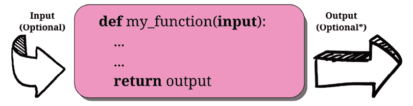
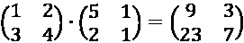
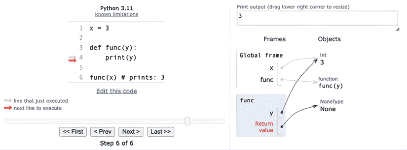

# 4

# 函数，代码的构建块

> “创造架构就是整理。整理什么？函数和对象。”
> 
> —勒·柯布西耶

在前面的章节中，我们已经看到在 Python 中一切都是对象，函数也不例外。但函数究竟是什么呢？函数是*一个可重复使用的代码块，旨在执行特定的任务或一组相关的任务*。这个单元可以随后导入并在需要的地方使用。使用函数在代码中有许多优点，我们将在下面看到。 

在本章中，我们将涵盖以下内容：

+   函数——它们是什么以及为什么我们应该使用它们

+   作用域和名称解析

+   函数签名——输入参数和返回值

+   递归和匿名函数

+   导入对象以实现代码重用

我们相信“一图胜千言”这句话在向对这一概念新手解释函数时尤其正确，所以请看一下以下图例：



图 4.1：函数的一个示例

正如你所见，函数是一块指令的集合，作为一个整体打包，就像一个盒子。函数可以接受输入参数并产生输出值。这两者都是可选的，正如我们在本章的示例中将会看到的。

Python 中的函数使用`def`关键字定义，之后跟函数名，以一对括号（可能包含输入参数）结束；然后是一个冒号（`:`），表示函数定义的结束。紧接着，缩进四个空格，我们找到函数体，这是函数被调用时将执行的指令集合。

注意，四个空格的缩进不是强制的，但这是 PEP 8 建议的空格数，在实践中，这是最广泛使用的间距度量。

函数可能返回也可能不返回输出。如果函数想要返回输出，它将通过使用`return`关键字，后跟所需的输出来实现。你可能已经注意到了前一个图例输出部分中`Optional`后面的那个小`*`。这是因为 Python 中的函数总是返回某些东西，即使你没有显式使用`return`语句。如果函数体内没有`return`语句，或者没有给`return`语句本身提供值，函数将返回`None`。

这个设计选择基于几个原因，其中最重要的原因是：

+   **简洁性和一致性**：无论函数是否显式返回值，其行为都是一致的。

+   **复杂性降低**：几种语言在函数（返回值的函数）和**过程**（不返回值的函数）之间做出区分。Python 中的函数可以同时充当这两种角色，无需单独的结构。这最小化了程序员必须学习的概念数量。

+   **多路径一致性**：具有多个条件分支的函数在没有执行其他返回语句时将返回`None`。因此，`None`是一个有用的默认值。

列表展示了众多可能影响看似简单的设计决策的因素。正是这些支撑 Python 设计的精心和深思熟虑的选择，使其具有优雅、简单和多功能性。

# 为什么使用函数？

函数是任何语言中最重要和最基本的概念和结构之一，所以让我们给你几个为什么我们需要它们的原因：

+   它们减少了程序中的代码重复。将任务的指令封装在我们可以导入和随时调用的函数中，使我们能够避免重复实现。

+   它们有助于将复杂任务或过程拆分成更小的块，每个块都成为一个函数。

+   他们隐藏了实现细节，不让用户知道。

+   它们提高了可追溯性。

+   它们提高了可读性。

让我们看看一些例子，以更好地理解每个要点。

## 减少代码重复

想象一下，你正在编写一段科学软件，你需要计算到一定限制的素数——就像我们在上一章中做的那样。你有一个计算它们的算法，所以你把它复制并粘贴到你需要使用它的任何地方。然而，有一天，一个同事给你一个更高效的算法来计算素数。在这个时候，你需要遍历整个代码库，用新代码替换旧代码。

这个过程很容易出错。你可能会不小心删除周围代码的一部分，或者未能删除你打算替换的某些代码。你还可能错过一些主要计算完成的地方，导致你的软件处于不一致的状态，同一操作以不同的方式执行。如果，你不仅需要用更好的版本替换代码，还需要修复一个错误而你却错过了某个地方，那会变得更糟。如果旧算法中变量的名称与新的不同，这也会使事情变得复杂。

为了避免所有这些，你编写一个函数，`get_prime_numbers(upto)`，并在你需要计算素数列表的任何地方使用它。当你的同事给你一个更好的实现时，你只需要替换那个函数的主体为新代码。其余的软件将自动适应，因为它只是调用这个函数。

你的代码会更短，并且不会出现旧方法和新方法执行任务时的一致性问题。你也更不可能留下由于复制粘贴失败或疏忽而产生的未被发现的问题。

## 将复杂任务拆分

函数还有助于将长或复杂的任务拆分成更小的任务。结果是代码在可读性、可测试性和可重用性等方面受益。

为了给你一个简单的例子，想象你正在准备一份报告。你的代码需要从数据源获取数据，解析它，过滤它，并对其进行润色，然后需要对它运行一系列算法，以生成将被写入报告的结果。常见的情况是，这样的流程通常只有一个大的`do_report(data_source)`函数。在最终生成报告之前，可能会有数百行代码需要运行。

缺乏经验的程序员，如果不擅长编写简单、结构良好的代码，可能会编写出数百行代码的函数。这些函数很难跟踪，很难找到事物改变上下文的地方（例如，完成一项任务并开始下一项任务）。让我们展示一个更好的方法：

```py
# data.science.example.py
def do_report(data_source):
    # fetch and prepare data
    data = fetch_data(data_source)
    parsed_data = parse_data(data)
    filtered_data = filter_data(parsed_data)
    polished_data = polish_data(filtered_data)
    # run algorithms on data
    final_data = analyse(polished_data)
    # create and return report
    report = Report(final_data)
    return report 
```

之前的例子当然是虚构的，但你能否看出遍历代码有多容易？如果最终结果看起来不正确，那么在`do_report()`函数中调试每个单独的数据输出将会很容易。此外，从整个流程中临时排除部分过程（你只需注释掉需要暂停的部分）也更为简单。这样的代码更容易处理。

## 隐藏实现细节

让我们继续之前的例子来讨论这个点。我们可以看到，通过遍历`do_report()`函数的代码，我们可以在不阅读任何一行实现代码的情况下获得一个令人惊讶的理解。这是因为函数隐藏了实现细节。

这个特性意味着，如果我们不需要深入了解细节，我们就不必像如果`do_report()`只是一个又长又大的函数那样被迫去深入。要理解发生了什么，我们不得不阅读并理解它的每一行代码。当它被分解成更小的函数时，我们不一定需要阅读每一个函数的每一行代码来理解代码的功能。这减少了我们阅读代码所花费的时间，因为在专业环境中阅读代码所花费的时间比编写代码多得多，因此将其减少到最低限度是很重要的。

## 提高可读性

程序员有时看不到编写一个只有一或两行代码的函数的意义，所以让我们看看一个例子，说明为什么你可能仍然应该这样做。

想象你需要乘以两个矩阵，就像下面的例子：



你是否更喜欢阅读以下代码：

```py
# matrix.multiplication.nofunc.py
a = [[1, 2], [3, 4]]
b = [[5, 1], [2, 1]]
c = [
    [sum(i * j for i, j in zip(r, c)) for c in zip(*b)] for r in a
] 
```

或者，你更喜欢这个：

```py
# matrix.multiplication.func.py
def matrix_mul(a, b):
    return [
        [sum(i * j for i, j in zip(r, c)) for c in zip(*b)]
        for r in a
    ]
a = [[1, 2], [3, 4]]
b = [[5, 1], [2, 1]]
c = matrix_mul(a, b) 
```

在第二个例子中，理解`c`是`a`和`b`相乘的结果要容易得多，阅读代码也更容易。如果我们不需要修改这个乘法逻辑，我们甚至不需要进入`matrix_mul()`函数的实现细节。因此，在这里可读性得到了提高，而在第一个片段中，我们可能需要花费时间试图理解那个复杂的列表推导式在做什么。

如果你不理解列表推导式，请不要担心，我们将在*第五章*，*推导式和生成器*中学习它们。

## 提高可追溯性

假设我们为电子商务网站编写了一些代码。我们在几个页面上显示产品价格。想象一下，数据库中的价格没有包含增值税（销售税），但我们想在网站上以 20%的增值税显示它们。这里有几种从不含增值税价格计算含增值税价格的方法：

```py
# vat.nofunc.py
price = 100  # GBP, no VAT
final_price1 = price * 1.2
final_price2 = price + price / 5.0
final_price3 = price * (100 + 20) / 100.0
final_price4 = price + price * 0.2 
```

这四种计算含增值税价格的方法都是完全可以接受的；我们在过去几年中遇到的所有专业代码中都有遇到过。

现在，假设我们开始在多个国家销售产品，其中一些国家有不同的增值税率，因此我们需要重构代码（在整个网站上）以使增值税计算动态化。

我们如何追踪所有执行增值税计算的地方？现在的编码是一个协作任务，我们无法确定增值税是否只使用其中一种形式进行计算。这将是一件困难的事情。

因此，让我们编写一个函数，该函数接受输入值`vat`和`price`（不含增值税）并返回含增值税的价格：

```py
# vat.function.py
def calculate_price_with_vat(price, vat):
    return price * (100 + vat) / 100 
```

现在，我们可以导入这个函数，并在网站上任何需要计算含增值税价格的地方使用它，当我们需要追踪这些调用时，我们可以搜索`calculate_price_with_vat`。

注意，在前面的例子中，`price`被认为是不含增值税的，而`vat`是一个百分比值（例如，19、20 或 23）。

# 范围和命名解析

在*第一章*，*Python 的温和介绍*中，我们讨论了范围和命名空间。现在我们将扩展这个概念。最后，我们可以用函数来讨论，这将使一切更容易理解。让我们从一个简单的例子开始：

```py
# scoping.level.1.py
def my_function():
    test = 1  # this is defined in the local scope of the function
    print("my_function:", test)
test = 0  # this is defined in the global scope
my_function()
print("global:", test) 
```

在前面的例子中，我们在两个不同的地方定义了`test`这个名字——它实际上是在两个不同的范围内。一个是全局范围（`test = 0`），另一个是`my_function()`函数的局部范围（`test = 1`）。如果我们执行代码，我们会看到这个：

```py
$ python scoping.level.1.py
my_function: 1
global: 0 
```

很明显，`test = 1`遮蔽了`my_function()`中的`test = 0`赋值。在全局范围内，`test`仍然是`0`，正如你可以从程序输出中看到的那样，但我们再次在函数体中定义了`test`名称，并将其设置为指向整数`1`。因此，两个`test`名称都存在：一个在全局作用域中，指向值为`0`的 int 对象，另一个在`my_function()`作用域中，指向值为`1`的`int`对象。让我们注释掉包含`test = 1`的行。Python 会在下一个封装的作用域中搜索`test`名称（回想一下**LEGB**规则：**local**，**enclosing**，**global**，**built-in**，在*第一章*，*Python 的温柔介绍*中描述），在这种情况下，我们会看到`0`被打印两次。在你的代码中试一试。

现在，让我们给你一个更复杂的例子，包含嵌套函数：

```py
# scoping.level.2.py
def outer():
    test = 1  # outer scope
    def inner():
        test = 2  # inner scope
        print("inner:", test)
    inner()
    print("outer:", test)
test = 0  # global scope
outer()
print("global:", test) 
```

在前面的代码中，我们有两个层次的遮蔽。一个层次在`outer()`函数中，另一个层次在`inner()`函数中。

如果我们运行代码，我们会得到：

```py
$ python scoping.level.2.py
inner: 2
outer: 1
global: 0 
```

尝试注释掉`test = 1`行。你能想出结果会是什么吗？当到达`print('outer:', test)`行时，Python 将不得不在下一个封装的作用域中寻找`test`；因此，它会找到并打印`0`，而不是`1`。在继续之前，确保你也注释掉了`test = 2`，以确保你理解发生了什么，以及 LEGB 规则是否对你来说很清晰。

另一个需要注意的事情是，Python 给了我们定义一个函数在另一个函数中的能力。`inner()`函数的名称是在`outer()`函数的作用域中定义的，这与任何其他名称的情况完全一样。

## 全局和非局部语句

在前面的例子中，我们可以通过使用这两个特殊语句之一来改变对 test 名称的遮蔽：`global`和`nonlocal`。正如你所看到的，当我们定义`test = 2`在`inner()`函数中时，我们没有覆盖`outer()`函数或全局作用域中的`test`。

如果我们在不定义它们的嵌套作用域中使用这些名称，我们可以获取对这些名称的读取访问权限，但因为我们实际上在当前作用域中定义了一个新名称，所以我们不能修改它们。

我们可以使用`nonlocal`语句来改变这种行为。根据官方文档：

> “`nonlocal`语句使列出的标识符引用最近封装作用域中先前绑定的变量，但不包括全局变量。”

让我们在`inner()`函数中引入它，看看会发生什么：

```py
# scoping.level.2.nonlocal.py
def outer():
    test = 1  # outer scope
    def inner():
        nonlocal test
        test = 2  # nearest enclosing scope (which is 'outer')
        print("inner:", test)
    inner()
    print("outer:", test)
test = 0  # global scope
outer()
print("global:", test) 
```

注意在`inner()`函数体中我们如何声明`test`名称为`nonlocal`。运行此代码会产生以下结果：

```py
$ python scoping.level.2.nonlocal.py
inner: 2
outer: 2
global: 0 
```

在 `inner()` 函数中将 `test` 声明为 `nonlocal`，实际上是将 `test` 名称绑定到在 `outer` 函数中声明的那个。如果我们从 `inner()` 函数中移除 `nonlocal test` 行并在 `outer()` 函数内部尝试，我们会得到一个 `SyntaxError`，因为 `nonlocal` 语句作用于封装作用域，而不是全局作用域。

有没有一种方法可以获取全局命名空间中 `test = 0` 的写入权限？是的，我们只需要使用 `global` 语句：

```py
# scoping.level.2.global.py
def outer():
    test = 1  # outer scope
    def inner():
        global test
        test = 2  # global scope
        print("inner:", test)
    inner()
    print("outer:", test)
test = 0  # global scope
outer()
print("global:", test) 
```

注意，我们现在已经将 `test` 名称声明为 `global`，这将将其绑定到我们在全局命名空间中定义的那个（`test = 0`）。运行代码后，你应该得到以下结果：

```py
$ python scoping.level.2.global.py
inner: 2
outer: 1
global: 2 
```

这表明现在受 `test = 2` 赋值影响的名称是全局作用域中的那个。这也会在 `outer()` 函数中起作用，因为在这种情况下，我们正在引用全局作用域。

亲自尝试并看看会发生什么变化。花些时间熟悉作用域和名称解析——这非常重要。作为附加问题，你能告诉我如果在先前的例子中将 `inner()` 定义在 `outer()` 之外会发生什么吗？

# 输入参数

在本章的开头，我们看到了函数可以接受输入参数。在我们深入所有可能的参数类型之前，让我们确保你对向函数传递参数的含义有一个清晰的理解。有三个关键点需要记住：

+   参数传递不过是将一个对象赋给局部变量名称

+   在函数内部将对象赋给参数名称不会影响调用者

+   在函数中更改可变对象参数会影响调用者

在我们进一步探讨参数主题之前，请允许我们稍微澄清一下术语。根据官方 Python 文档：

> “参数是由函数定义中出现的名称定义的，而参数是调用函数时实际传递给函数的值。参数定义了函数可以接受哪些类型的参数。”

我们在提及参数和参数时将尽量做到精确，但值得注意的是，它们有时也被同义使用。现在让我们看看一些例子。

## 参数传递

看看下面的代码。我们在全局作用域中声明了一个名为 `x` 的变量，然后我们声明了一个函数 `func(y)`，最后我们调用它，传递 `x`：

```py
# key.points.argument.passing.py
x = 3
def func(y):
    print(y)
func(x)  # prints: 3 
```

当使用 `x` 调用 `func()` 函数时，在其局部作用域内，会创建一个名为 `y` 的变量，并且它指向与 `x` 相同的对象。这可以在 *图 4.2* 中更清楚地理解（不用担心这个例子是用 Python 3.11 运行的——这是一个没有改变的特性）。



图 4.2：使用 Python Tutor 理解参数传递

*图 4.2*的右侧展示了程序执行到达末尾时的状态，在`func()`返回（`None`）之后。看看**帧**列，你会注意到我们在全局命名空间（**全局帧**）中有两个名称，`x`和`func()`，分别指向一个**整数**（值为`3`）和一个`function`对象。在其下方，在标题为**func**的矩形中，我们可以看到函数的局部命名空间，其中只定义了一个名称：`y`。因为我们用`x`（图左侧的第 6 行）调用了`func()`，所以`y`指向与`x`相同的对象。这就是当将参数传递给函数时幕后发生的事情。如果我们用`x`而不是`y`在函数定义中使用，事情将会完全一样（但一开始可能有些令人困惑）——函数中会有一个局部的`x`，而全局的`x`在外面，就像我们在本章之前关于*作用域和名称解析*部分所看到的那样。

所以，简而言之，真正发生的事情是函数在其局部作用域中创建定义的名称作为参数，当我们调用它时，我们告诉 Python 这些名称必须指向哪些对象。

## 将值赋给参数名称

将值赋给参数名称不会影响调用者。这可能是最初难以理解的事情之一，所以让我们来看一个例子：

```py
# key.points.assignment.py
x = 3
def func(x):
    x = 7  # defining a local x, not changing the global one
func(x)
print(x)  # prints: 3 
```

在前面的代码中，当我们用`func(x)`调用函数时，`x = 7`指令在`func()`函数的局部作用域中执行；名称`x`指向一个值为`7`的整数，而全局的`x`保持不变。

## 修改可变对象

修改可变对象会影响调用者。这一点很重要，因为尽管 Python 在处理可变对象时看起来行为不同，但实际上其行为是完全一致的。让我们来看一个例子：

```py
# key.points.mutable.py
x = [1, 2, 3]
def func(x):
    x[1] = 42  # this affects the `x` argument!
func(x)
print(x)  # prints: [1, 42, 3] 
```

如你所见，我们改变了原始对象。如果你仔细想想，这种行为并没有什么奇怪之处。当我们调用`func(x)`时，函数命名空间中的`x`名称被设置为指向与全局`x`相同的对象。在函数体内部，我们并没有改变全局的`x`，也就是说，我们并没有改变它指向的对象。我们只是在那个对象的位置 1 访问元素并改变其值。

记住*输入参数*部分中的*第 2 点*：*在函数内部将对象赋值给参数名不会影响调用者*。如果你明白了这一点，下面的代码应该不会让你感到惊讶：

```py
# key.points.mutable.assignment.py
x = [1, 2, 3]
def func(x):
    x[1] = 42  # this changes the original `x` argument!
    x = "something else"  # this points x to a new string object
func(x)
print(x)  # still prints: [1, 42, 3] 
```

看看我们标记的两行。一开始，就像之前一样，我们再次访问调用者对象，在位置 1，并将该值改为数字`42`。然后，我们将`x`重新赋值以指向字符串`'something else'`。这不会改变调用者，实际上，输出与之前的代码片段相同。

仔细研究这个概念，并通过打印和调用 `id()` 函数进行实验，直到你心中的一切都清晰。这是 Python 的一个关键特性，它必须非常清晰，否则你可能会在代码中引入微妙的错误。再次强调，Python Tutor 网站（[`www.pythontutor.com/`](http://www.pythontutor.com/)）通过提供这些概念的可视化表示，将极大地帮助你。

现在我们已经很好地理解了输入参数及其行为，让我们看看传递参数给函数的不同方式。

## 传递参数

传递函数参数有四种不同的方式：

+   位置参数

+   关键字参数

+   可迭代解包

+   字典解包

让我们逐一来看。

### 位置参数

当我们调用函数时，每个位置参数都被分配到函数定义中相应 *位置* 的参数：

```py
# arguments.positional.py
def func(a, b, c):
    print(a, b, c)
func(1, 2, 3)  # prints: 1 2 3 
```

这是在某些编程语言中传递参数最常见的方式（在某些编程语言中，这是唯一的方式）。

### 关键字参数

函数调用中的关键字参数使用 `name=value` 语法分配给参数：

```py
# arguments.keyword.py
def func(a, b, c):
    print(a, b, c)
func(a=1, c=2, b=3)  # prints: 1 3 2 
```

当我们使用关键字参数时，参数的顺序不需要与函数定义中参数的顺序匹配。这可以使我们的代码更容易阅读和调试。我们不需要记住（或查找）函数定义中参数的顺序。我们可以查看函数调用，并立即知道哪个参数对应哪个参数。

你也可以同时使用位置参数和关键字参数：

```py
# arguments.positional.keyword.py
def func(a, b, c):
    print(a, b, c)
func(42, b=1, c=2) 
```

然而，请记住，**位置参数必须始终在关键字参数之前列出**。例如，如果你尝试这样做：

```py
# arguments.positional.keyword.py
func(b=1, c=2, 42)  # positional arg after keyword args 
```

你将得到以下错误：

```py
$ python arguments.positional.keyword.py
  File "arguments.positional.keyword.py", line 7
    func(b=1, c=2, 42)  # positional arg after keyword args
                     ^
SyntaxError: positional argument follows keyword argument 
```

### 可迭代解包

可迭代解包使用 `*iterable_name` 语法将可迭代对象的元素作为位置参数传递给函数：

```py
# arguments.unpack.iterable.py
def func(a, b, c):
    print(a, b, c)
values = (1, 3, -7)
func(*values)  # equivalent to: func(1, 3, -7) 
```

这是一个非常有用的特性，尤其是在我们需要以编程方式为函数生成参数时。

### 字典解包

字典解包对于关键字参数来说，就像可迭代解包对于位置参数一样。我们使用 `**dictionary_name` 语法将字典的键和值构造的关键字参数传递给函数：

```py
# arguments.unpack.dict.py
def func(a, b, c):
    print(a, b, c)
values = {"b": 1, "c": 2, "a": 42}
func(**values)  # equivalent to func(b=1, c=2, a=42) 
```

### 结合参数类型

我们已经看到，位置参数和关键字参数可以一起使用，只要它们按照正确的顺序传递。我们还可以将解包（两种类型）与正常的位置参数和关键字参数结合使用。我们甚至可以将多个可迭代对象和字典进行解包。

参数必须按照以下顺序传递：

+   首先，位置参数：普通（`name`）和解包（`*name`）

+   接下来是关键字参数（`name=value`），它可以与可迭代解包 `(*name)` 混合使用

+   最后，还有字典解包（`**name`），它可以与关键字参数（`name=value`）混合使用

这将通过一个例子更容易理解：

```py
# arguments.combined.py
def func(a, b, c, d, e, f):
    print(a, b, c, d, e, f)
func(1, *(2, 3), f=6, *(4, 5))
func(*(1, 2), e=5, *(3, 4), f=6)
func(1, **{"b": 2, "c": 3}, d=4, **{"e": 5, "f": 6})
func(c=3, *(1, 2), **{"d": 4}, e=5, **{"f": 6}) 
```

所有上述对 `func()` 的调用都是等效的，并打印 `1 2 3 4 5 6`。玩转这个例子，直到你确信你理解了它。当顺序错误时，请特别注意你得到的错误。

能够解包多个可迭代对象和字典的能力是由 PEP 448 引入到 Python 中的。这个 PEP 还引入了在函数调用之外使用解包的能力。你可以在[`peps.python.org/pep-0448/`](https://peps.python.org/pep-0448/)上阅读所有关于它的内容。

当结合位置参数和关键字参数时，重要的是要记住每个参数在参数列表中只能出现一次：

```py
# arguments.multiple.value.py
def func(a, b, c):
    print(a, b, c)
func(2, 3, a=1) 
```

在这里，我们为参数 `a` 传递了两个值：位置参数 `2` 和关键字参数 `a=1`。这是非法的，所以当我们尝试运行它时，我们会得到一个错误：

```py
$ python arguments.multiple.value.py
Traceback (most recent call last):
  File "arguments.multiple.value.py", line 5, in <module>
    func(2, 3, a=1)
TypeError: func() got multiple values for argument 'a' 
```

## 定义参数

函数参数可以分为五组。

+   位置或关键字参数：允许位置参数和关键字参数

+   可变位置参数：在一个元组中收集任意数量的位置参数

+   可变关键字参数：在一个字典中收集任意数量的关键字参数

+   仅位置参数：只能作为位置参数传递

+   仅关键字参数：只能作为关键字参数传递

本章中我们看到的所有参数都是常规的位置参数或关键字参数。我们已经看到了它们可以作为位置参数和关键字参数传递的方式。关于它们，没有太多可以说的，所以让我们看看其他类别。不过，在我们这样做之前，让我们简要地看看可选参数。

### 可选参数

除了我们在这里看到的类别之外，参数还可以被分类为*必需*或*可选*。**可选参数**在函数定义中指定了默认值。语法是 `name=value`：

```py
# parameters.default.py
def func(a, b=4, c=88):
    print(a, b, c)
func(1)  # prints: 1 4 88
func(b=5, a=7, c=9)  # prints: 7 5 9
func(42, c=9)  # prints: 42 4 9
func(42, 43, 44)  # prints: 42, 43, 44 
```

在这里，`a` 是必需的，而 `b` 有默认值 `4`，`c` 有默认值 `88`。重要的是要注意，除了仅关键字参数外，必需参数必须始终位于函数定义中所有可选参数的左侧。尝试在上面的例子中移除 `c` 的默认值，看看会发生什么。

### 可变位置参数

有时候你可能更喜欢不指定函数的确切位置参数数量；Python 通过使用**可变位置参数**为你提供了这样做的能力。让我们看看一个非常常见的用例，即 `minimum()` 函数。这是一个计算输入值最小值的函数：

```py
# parameters.variable.positional.py
def minimum(*n):
    # print(type(n))  # n is a tuple
    if n:  # explained after the code
        mn = n[0]
        for value in n[1:]:
            if value < mn:
                mn = value
        print(mn)
minimum(1, 3, -7, 9)  # n = (1, 3, -7, 9) - prints: -7
minimum()  # n = () - prints: nothing 
```

如你所见，当我们定义一个带有前缀星号`*`的参数时，我们是在告诉 Python，当函数被调用时，这个参数将收集一个可变数量的位置参数。在函数内部，`n`是一个元组。取消注释`print(type(n))`来亲自查看，并稍作尝试。

注意，一个函数最多只能有一个可变位置参数——拥有更多的参数是没有意义的。Python 将无法决定如何在这些参数之间分配参数。你也不能为可变位置参数指定一个默认值。默认值始终是一个空元组。

你有没有注意到我们是如何用简单的`if n:`来检查`n`是否为空的？这是因为集合对象在非空时在 Python 中评估为`True`，否则为`False`。这对元组、集合、列表、字典等都是如此。

另一点需要注意的是，当我们调用函数而没有参数时，我们可能希望抛出一个错误，而不是默默地什么也不做。在这种情况下，我们并不关心使这个函数健壮，而是理解可变位置参数。

你有没有注意到定义可变位置参数的语法看起来非常像可迭代解包的语法？这并非巧合。毕竟，这两个特性是相互对应的。它们也经常一起使用，因为可变位置参数可以让你不必担心你解包的可迭代对象的长度是否与函数定义中参数的数量相匹配。

### 可变关键字参数

**可变关键字参数**与可变位置参数非常相似。唯一的区别是语法（使用`**`而不是`*`）以及它们被收集在一个字典中：

```py
# parameters.variable.keyword.py
def func(**kwargs):
    print(kwargs)
func(a=1, b=42)  # prints {'a': 1, 'b': 42}
func()  # prints {}
func(a=1, b=46, c=99)  # prints {'a': 1, 'b': 46, 'c': 99} 
```

你可以看到，在函数定义中将`**`添加到参数名之前告诉 Python 使用该名称来收集一个可变数量的关键字参数。与可变位置参数的情况一样，每个函数最多只能有一个可变关键字参数——你不能指定一个默认值。

就像可变位置参数类似于可迭代解包一样，可变关键字参数类似于字典解包。字典解包也常用于向具有可变关键字参数的函数传递参数。

能够传递可变数量的关键字参数之所以如此重要，可能现在还不明显，那么让我们来看一个更实际的例子？让我们定义一个连接数据库的函数：我们希望通过不带参数调用这个函数来连接默认数据库。我们还想通过向函数传递适当的参数来连接任何其他数据库。在你继续阅读之前，试着花几分钟时间自己想出一个解决方案：

```py
# parameters.variable.db.py
def connect(**options):
    conn_params = {
        "host": options.get("host", "127.0.0.1"),
        "port": options.get("port", 5432),
        "user": options.get("user", ""),
        "pwd": options.get("pwd", ""),
    }
    print(conn_params)
    # we then connect to the db (commented out)
    # db.connect(**conn_params)
connect()
connect(host="127.0.0.42", port=5433)
connect(port=5431, user="fab", pwd="gandalf") 
```

注意，在函数中，我们可以使用默认值作为后备来准备一个连接参数字典（`conn_params`），允许在函数调用中提供时覆盖它们。有更少代码行的方法来做这件事，但我们现在不关心那个。运行前面的代码会产生以下结果：

```py
$ python parameters.variable.db.py
{'host': '127.0.0.1', 'port': 5432, 'user': '', 'pwd': ''}
{'host': '127.0.0.42', 'port': 5433, 'user': '', 'pwd': ''}
{'host': '127.0.0.1', 'port': 5431, 'user': 'fab', 'pwd': 'gandalf'} 
```

注意函数调用与输出的对应关系，以及默认值是如何根据传递给函数的内容被覆盖的。

### 仅位置参数

从 Python 3.8 开始，PEP 570 ([`peps.python.org/pep-0570/`](https://peps.python.org/pep-0570/)) 引入了**仅位置参数**。有一个新的函数参数语法 `/`，表示必须以位置指定一组函数参数，并且**不能**作为关键字参数传递。让我们看一个简单的示例：

```py
# parameters.positional.only.py
def func(a, b, /, c):
    print(a, b, c)
func(1, 2, 3)  # prints: 1 2 3
func(1, 2, c=3)  # prints 1 2 3 
```

在前面的示例中，我们定义了一个函数 `func()`，它指定了三个参数：`a`、`b` 和 `c`。函数签名中的 `/` 表示 `a` 和 `b` 必须通过位置传递，也就是说，不能通过关键字传递。

示例中的最后两行显示，我们可以通过位置传递所有三个参数来调用函数，或者我们可以通过关键字传递 `c`。这两种情况都工作得很好，因为 `c` 在函数签名中的 `/` 之后被定义。如果我们尝试通过关键字传递 `a` 或 `b` 来调用函数，如下所示：

```py
func(1, b=2, c=3) 
```

这会产生以下跟踪回溯：

```py
Traceback (most recent call last):
  File "arguments.positional.only.py", line 7, in <module>
    func(1, b=2, c=3)
TypeError: func() got some positional-only arguments
passed as keyword arguments: 'b' 
```

前面的示例显示，Python 现在正在抱怨我们如何调用 `func()`。我们通过关键字传递了 `b`，但我们不允许这样做。

仅位置参数也可以是可选的：

```py
# parameters.positional.only.optional.py
def func(a, b=2, /):
    print(a, b)
func(4, 5)  # prints 4 5
func(3)  # prints 3 2 
```

让我们通过从官方文档中借用的一些示例来看看这个特性给语言带来了什么。一个优点是能够完全模拟现有 C 编码函数的行为：

```py
def divmod(a, b, /):
    "Emulate the built in divmod() function"
    return (a // b, a % b) 
```

另一个重要的用例是在参数名称没有帮助时排除关键字参数：

```py
len(obj='hello') 
```

在前面的示例中，`obj` 关键字参数损害了可读性。此外，如果我们希望重构 `len` 函数的内部结构，并将 `obj` 重命名为 `the_object`（或任何其他名称），这种更改将保证不会破坏任何客户端代码，因为不会有任何调用 `len()` 函数涉及现在过时的 `obj` 参数名称。

最后，使用仅位置参数意味着 `/` 左边的任何内容都可以用于变量关键字参数，如下面的示例所示：

```py
def func_name(name, /, **kwargs):
    print(name)
    print(kwargs)
func_name("Positional-only name", name="Name in **kwargs")
# Prints:
# Positional-only name
# {'name': 'Name in **kwargs'} 
```

在函数签名中保留参数名称以在 `**kwargs` 中使用的能力可以导致代码更简单、更干净。

现在，让我们探索仅位置参数的镜像版本：仅关键字参数。

### 仅关键字参数

Python 3 引入了**仅关键字参数**。我们将只简要研究它们，因为它们的使用场景并不频繁。指定它们有两种方式，要么在变量位置参数之后，要么在裸星号 `*` 之后。让我们看看两种方式的例子：

```py
# parameters.keyword.only.py
def kwo(*a, c):
    print(a, c)
kwo(1, 2, 3, c=7)  # prints: (1, 2, 3) 7
kwo(c=4)  # prints: () 4
# kwo(1, 2)  # breaks, invalid syntax, with the following error
# TypeError: kwo() missing 1 required keyword-only argument: 'c'
def kwo2(a, b=42, *, c):
    print(a, b, c)
kwo2(3, b=7, c=99)  # prints: 3 7 99
kwo2(3, c=13)  # prints: 3 42 13
# kwo2(3, 23)  # breaks, invalid syntax, with the following error
# TypeError: kwo2() missing 1 required keyword-only argument: 'c' 
```

如预期的那样，函数 `kwo()` 接受一个可变数量的位置参数（`a`）和一个仅关键字参数，`c`。调用结果很简单，你可以取消注释第三个调用以查看 Python 返回的错误。

同样适用于函数 `kwo2()`，它与 `kwo` 不同之处在于它接受一个位置参数 `a`，一个关键字参数 `b`，然后是一个仅关键字参数 `c`。你可以取消注释第三个调用以查看产生的错误。

现在你已经知道了如何指定不同类型的输入参数，让我们看看如何在函数定义中组合它们。

### 组合输入参数

你可以在同一个函数中组合不同类型的参数（实际上，这样做通常非常有用）。正如在同一个函数调用中组合不同类型的参数一样，有一些关于顺序的限制：

+   仅位置参数首先出现，后面跟着一个 `/` 。

+   正常参数位于任何位置仅参数之后。

+   变量位置参数位于正常参数之后。

+   仅关键字参数位于变量位置参数之后。

+   变量关键字参数总是放在最后。

+   对于位置仅和正常参数，任何必需的参数都必须在任何可选参数之前定义。这意味着如果你有一个可选的位置仅参数，所有你的正常参数也必须是可选的。这条规则不影响仅关键字参数。

这些规则在没有例子的情况下可能有点难以理解，所以让我们看看几个例子：

```py
# parameters.all.py
def func(a, b, c=7, *args, **kwargs):
    print("a, b, c:", a, b, c)
    print("args:", args)
    print("kwargs:", kwargs)
func(1, 2, 3, 5, 7, 9, A="a", B="b") 
```

注意函数定义中参数的顺序。执行结果如下：

```py
$ python parameters.all.py
a, b, c: 1 2 3
args: (5, 7, 9)
kwargs: {'A': 'a', 'B': 'b'} 
```

现在我们来看一个关于仅关键字参数的例子：

```py
# parameters.all.pkwonly.py
def allparams(a, /, b, c=42, *args, d=256, e, **kwargs):
    print("a, b, c:", a, b, c)
    print("d, e:", d, e)
    print("args:", args)
    print("kwargs:", kwargs)
allparams(1, 2, 3, 4, 5, 6, e=7, f=9, g=10) 
```

注意我们在函数声明中既有位置仅参数也有仅关键字参数：`a` 是位置仅参数，而 `d` 和 `e` 是仅关键字参数。它们在 `*args` 变量位置参数之后，如果它们直接跟在单个 `*` 之后（在这种情况下将没有变量位置参数），结果将是相同的。执行结果如下：

```py
$ python parameters.all.pkwonly.py
a, b, c: 1 2 3
d, e: 256 7
args: (4, 5, 6)
kwargs: {'f': 9, 'g': 10} 
```

另有一点需要注意，我们给变量位置参数和关键字参数取的名字。你可以自由选择不同的名字，但请注意，`args` 和 `kwargs` 是这些参数的传统名称，至少在通用意义上是这样。

### 更多签名示例

为了简要回顾使用位置和仅关键字指定符的函数签名，这里有一些进一步的例子。为了简洁起见，省略了变量位置和关键字参数，我们得到以下语法：

```py
def func_name(positional_only_parameters, /,
    positional_or_keyword_parameters, *,
    keyword_only_parameters): 
```

首先，我们有位置仅参数，然后是位置或关键字参数，最后是仅关键字参数。

下面展示了其他一些有效的签名：

```py
def func_name(p1, p2, /, p_or_kw, *, kw):
def func_name(p1, p2=None, /, p_or_kw=None, *, kw):
def func_name(p1, p2=None, /, *, kw):
def func_name(p1, p2=None, /):
def func_name(p1, p2, /, p_or_kw):
def func_name(p1, p2, /): 
```

所有的上述签名都是有效的，而以下将是无效的：

```py
def func_name(p1, p2=None, /, p_or_kw, *, kw):
def func_name(p1=None, p2, /, p_or_kw=None, *, kw):
def func_name(p1=None, p2, /): 
```

你可以在官方文档中阅读关于语法规范的说明：

[`docs.python.org/3/reference/compound_stmts.html#function-definitions`](https://docs.python.org/3/reference/compound_stmts.html#function-definitions)

在这个阶段，对你来说一个有用的练习是实现上述示例签名中的任何一个，打印出那些参数的值，就像我们在之前的练习中所做的那样，并尝试以不同的方式传递参数。

### 避免陷阱！可变默认值

在 Python 中，有一件事需要注意，那就是默认值是在定义时创建的；因此，对同一函数的后续调用可能会根据其默认值的可变性而表现出不同的行为。让我们来看一个例子：

```py
# parameters.defaults.mutable.py
def func(a=[], b={}):
    print(a)
    print(b)
    print("#" * 12)
    a.append(len(a))  # this will affect a's default value
    b[len(a)] = len(a)  # and this will affect b's one
func()
func()
func() 
```

两个参数都有可变的默认值。这意味着，如果你影响这些对象，任何修改都会在后续的函数调用中保留。看看你是否能理解这些调用的输出：

```py
$ python parameters.defaults.mutable.py
[]
{}
############
[0]
{1: 1}
############
[0, 1]
{1: 1, 2: 2}
############ 
```

虽然这种行为一开始可能看起来很奇怪，但实际上是有道理的，而且非常方便——例如，当使用**记忆化**技术时。更有趣的是，当在调用之间引入一个不使用默认值的调用时会发生什么，比如这个：

```py
# parameters.defaults.mutable.intermediate.call.py
func()
func(a=[1, 2, 3], b={"B": 1})
func() 
```

当我们运行此代码时，这是输出：

```py
$ python parameters.defaults.mutable.intermediate.call.py
[]
{}
############
[1, 2, 3]
{'B': 1}
############
[0]
{1: 1}
############ 
```

这个输出显示，即使我们用其他值调用函数，默认值也会被保留。一个自然而然的问题就是，我如何每次都得到一个全新的空值？嗯，惯例是这样的：

```py
# parameters.defaults.mutable.no.trap.py
def func(a=None):
    if a is None:
        a = []
    # do whatever you want with `a` ... 
```

注意，通过使用前面的技术，如果在调用函数时没有传递`a`，我们总是会得到一个全新的、空的列表。

在详细阐述了输入参数之后，现在我们来看看硬币的另一面，即返回输出值。

# 返回值

我们已经说过，要从函数中返回某些内容，我们需要使用`return`语句，后面跟着我们想要返回的内容。一个函数体内可以有任意多的`return`语句。

另一方面，如果在函数体内我们没有返回任何内容，或者调用了裸的`return`语句，函数将返回`None`。当不需要这种行为时，这种行为是无害的，但它允许有趣的模式，并证实 Python 是一种非常一致的语言。

我们说这是无害的，因为你永远不会被迫收集函数调用的结果。我们将用一个例子来展示我们的意思：

```py
# return.none.py
def func():
    pass
func()  # the return of this call won't be collected. It's lost.
a = func()  # the return of this one instead is collected into `a`
print(a)  # prints: None 
```

注意，函数的主体仅由`pass`语句组成。正如官方文档所述，`pass`是一个空操作，当它执行时，没有任何事情发生。它在需要语法上的语句但不需要执行代码时非常有用。在其他语言中，我们可能会用一对花括号（`{}`）来表示这一点，这定义了一个*空范围*；但在 Python 中，范围是通过缩进来定义的，因此需要一个如`pass`这样的语句。

注意，`func()`的第一个调用返回一个值（`None`），我们没有收集。正如我们之前提到的，收集函数调用的返回值不是强制性的。

让我们看看一个更有趣的例子。记住，在*第一章*，*Python 的温柔介绍*中，我们讨论了*阶乘*函数。让我们在这里编写我们自己的实现（为了简单起见，我们将假设函数总是以适当的值正确调用，因此我们不需要对输入参数进行合理性检查）：

```py
# return.single.value.py
def factorial(n):
    if n in (0, 1):
        return 1
    result = n
    for k in range(2, n):
        result *= k
    return result
f5 = factorial(5)  # f5 = 120 
```

注意，我们有两个返回点。如果`n`是`0`或`1`，我们返回`1`。否则，我们执行所需的计算并返回`result`。

在 Python 中，使用`in`运算符进行成员检查是很常见的，就像我们在前一个例子中所做的那样，而不是更冗长的：

```py
if n == 0 or n == 1:
    ... 
```

现在我们尝试将这个函数写得更简洁一些：

```py
# return.single.value.2.py
from functools import reduce
from operator import mul
def factorial(n):
    return reduce(mul, range(1, n + 1), 1)
f5 = factorial(5)  # f5 = 120 
```

这个简单的例子展示了 Python 既优雅又简洁。即使我们没有见过`reduce()`或`mul()`，这个实现也是可读的。如果你不能阅读或理解它，请留出几分钟时间，在 Python 文档中做一些研究，直到它的行为对你来说很清楚。在文档中查找函数并理解别人编写的代码是每个开发者都需要能够执行的任务。

为了这个目的，确保你查阅了`help()`函数，这在用控制台探索时非常有帮助。

## 返回多个值

要返回多个值很简单：你只需使用元组。让我们看看一个简单的例子，它模仿了内置的`divmod()`函数：

```py
# return.multiple.py
def moddiv(a, b):
    return a // b, a % b
print(moddiv(20, 7))  # prints (2, 6) 
```

我们原本可以在前述代码中用括号括起高亮的部分，但这样做没有必要。前述函数同时返回了除法的结果和余数。

在这个例子的源代码中，我们留下了一个简单的测试函数示例，以确保代码正在执行正确的计算。

# 一些有用的提示

在编写函数时，遵循一些指南非常有用，这样你就能写出好的函数。我们将很快指出其中的一些：

+   **函数应该只做一件事**：只有一个功能的函数可以用一句话简单描述；做多件事的函数可以拆分成做一件事的小函数。这些较小的函数通常更容易阅读和理解。

+   **函数应尽量小**：它们越小，就越容易测试和编写，以便它们只做一件事。

+   **输入参数越少越好**：接受很多参数的函数很快就会变得难以管理（以及其他问题）。

+   **函数的返回值应保持一致**：返回`False`和返回`None`是两回事，即使在布尔上下文中它们都评估为`False`。`False`表示我们有信息（`False`），而`None`表示没有信息。尝试编写在逻辑中无论发生什么都能以一致方式返回结果的函数。

+   **函数应无副作用**：在函数式编程中，有**纯函数**的概念。这种类型的函数遵循两个主要原则：

    +   **确定性输出**：这意味着给定相同的输入集，产生的输出将始终相同。换句话说，函数的行为不依赖于任何可能在执行期间改变的外部或全局状态。

    +   **无副作用**：这意味着纯函数不会在系统中引起任何可观察的副作用。也就是说，它们不会改变任何外部状态，如修改全局变量或执行 I/O 操作，如从文件或显示中读取或写入。

虽然你应该尽可能编写纯函数，但重要的是你编写的函数至少不应有副作用。它们不应影响它们被调用的参数的值。

这可能是目前最难理解的说法，所以我们将用列表举例。在下面的代码中，注意`numbers`没有被`sorted()`函数排序，该函数返回`numbers`的排序副本。相反，`list.sort()`方法作用于`numbers`对象本身，这是可以的，因为它是一个方法（一个属于对象的函数，因此有权修改它）：

```py
>>> numbers = [4, 1, 7, 5]
>>> sorted(numbers)  # won't sort the original `numbers` list
[1, 4, 5, 7]
>>> numbers  # let's verify
[4, 1, 7, 5]  # good, untouched
>>> numbers.sort()  # this will act on the list
>>> numbers
[1, 4, 5, 7] 
```

遵循这些指南，你将自动保护自己免受某些类型错误的影响。

《代码整洁之道》（Clean Code）的第三章节，由罗伯特·C·马丁（Robert C. Martin）所著，专门讨论函数，这是我们读过的关于这个主题最好的指南之一。

# 递归函数

当一个函数调用自身以产生结果时，它被称为**递归**。有时递归函数非常有用，因为它们使编写逻辑变得更容易。有些算法使用递归编写非常容易，而有些则不然。没有递归函数不能以迭代方式重写，所以通常取决于程序员选择最适合当前情况的最好方法。

递归函数的主体通常有两个部分：一个部分返回值依赖于对自身的后续调用，另一个部分则不（称为**基本情况**）。

例如，我们可以考虑（希望现在熟悉的）**阶乘**函数 *N!*。当 *N* 为 0 或 1 时，这是基本情况——函数返回 `1` 而无需进一步计算。另一方面，在一般情况下，*N!* 返回乘积：

```py
1 * 2 * ... * (N-1) * N 
```

如果你仔细想想，*N!* 可以这样重写：*N! = (N-1)! * N* 。作为一个实际例子，考虑以下内容：

```py
5! = 1 * 2 * 3 * 4 * 5 = (1 * 2 * 3 * 4) * 5 = 4! * 5 
```

让我们把以下内容用代码写下来：

```py
# recursive.factorial.py
def factorial(n):
    if n in (0, 1):  # base case
        return 1
    return factorial(n - 1) * n  # recursive case 
```

递归函数在编写算法时经常被使用，编写起来也很有趣。作为一个练习，尝试使用递归和迭代方法解决几个简单的问题。练习的好候选可能是计算斐波那契数或字符串的长度——诸如此类的事情。

在编写递归函数时，始终要考虑你做了多少嵌套调用，因为这是有限制的。关于这方面的更多信息，请查看 `sys.getrecursionlimit()` 和 `sys.setrecursionlimit()` 。

# 匿名函数

我们最后要讨论的一种函数类型是**匿名函数**。这些函数在 Python 中被称为**lambda**函数，通常在不需要具有自己名称的完整函数，而只需要一个简单的一行代码时使用。

假设我们想要一个包含所有到某个值 *N* 的数字的列表，这些数字也是五的倍数。我们可以使用 `filter()` 函数来做这件事，这需要一个函数和一个可迭代对象作为输入。返回值是一个过滤器对象，当你遍历它时，它会产生从输入可迭代对象中返回 `True` 的元素。不使用匿名函数，我们可能会这样做：

```py
# filter.regular.py
def is_multiple_of_five(n):
    return not n % 5
def get_multiples_of_five(n):
    return list(filter(is_multiple_of_five, range(n))) 
```

注意我们是如何使用 `is_multiple_of_five()` 来过滤前 *n* 个自然数的。这看起来有点过度——任务很简单，我们不需要保留 `is_multiple_of_five()` 函数用于其他任何事情。让我们用 lambda 函数重写它：

```py
# filter.lambda.py
def get_multiples_of_five(n):
    return list(filter(lambda k: not k % 5, range(n))) 
```

逻辑是相同的，但现在过滤函数是一个 lambda。定义 lambda 非常简单，遵循以下形式：

```py
func_name = lambda [parameter_list]: expression 
```

返回的是一个函数对象，它相当于以下内容：

```py
def func_name([parameter_list]):
    return expression 
```

注意，可选参数按照常见的语法用方括号括起来表示。

让我们看看几个等价函数的例子，这些函数以两种形式定义：

```py
# lambda.explained.py
# example 1: adder
def adder(a, b):
    return a + b
# is equivalent to:
adder_lambda = lambda a, b: a + b
# example 2: to uppercase
def to_upper(s):
    return s.upper()
# is equivalent to:
to_upper_lambda = lambda s: s.upper() 
```

上述例子非常简单。第一个例子是加两个数字，第二个例子是产生字符串的大写版本。请注意，我们已将 `lambda` 表达式返回的内容分配给一个名称（`adder_lambda`，`to_upper_lambda`），但在 `filter()` 例子中我们以这种方式使用 lambda 时并不需要这样做。

# 函数属性

每个函数都是一个完整的对象，因此它有几个属性。其中一些是特殊的，可以在运行时以自省的方式检查函数对象。以下脚本是一个示例，展示了其中的一些属性以及如何显示示例函数的值：

```py
# func.attributes.py
def multiplication(a, b=1):
    """Return a multiplied by b."""
    return a * b
if __name__ == "__main__":
    special_attributes = [
        "__doc__",
        "__name__",
        "__qualname__",
        "__module__",
        "__defaults__",
        "__code__",
        "__globals__",
        "__dict__",
        "__closure__",
        "__annotations__",
        "__kwdefaults__",
    ]
    for attribute in special_attributes:
        print(attribute, "->", getattr(multiplication, attribute)) 
```

我们使用了内置的`getattr()`函数来获取这些属性的值。`getattr(obj, attribute)`等同于`obj.attribute`，在需要动态获取运行时属性时非常有用，此时属性名称来自变量（如本例所示）。运行此脚本会产生以下结果：

```py
$ python func.attributes.py
__doc__ -> Return a multiplied by b.
__name__ -> multiplication
__qualname__ -> multiplication
__module__ -> __main__
__defaults__ -> (1,)
__code__ -> <code object multiplication at 0x102ce1550,
             file "func.attributes.py", line 2>
__globals__ -> {... omitted ...}
__dict__ -> {}
__closure__ -> None
__annotations__ -> {}
__kwdefaults__ -> None 
```

我们省略了`__globals__`属性的值，因为它太大。关于此属性含义的解释可以在*Python 数据模型*文档页面的*可调用类型*部分找到：

[Python 3 数据模型标准层次结构](https://docs.python.org/3/reference/datamodel.html#the-standard-type-hierarchy)

你可以使用内置的`dir()`函数来获取任何对象的全部属性列表。

在前面的例子中要注意的一点是这条语句的使用：

```py
if __name__ == "__main__": 
```

这行代码确保只有当模块直接运行时，随后的代码才会执行。当你运行一个 Python 脚本时，Python 会将该脚本中的`__name__`变量设置为`"__main__"`。相反，当你将 Python 脚本作为模块导入到另一个脚本中时，`__name__`变量会被设置为正在导入的脚本/模块的名称。

# 内置函数

Python 自带了许多内置函数。它们在任何地方都可用，你可以通过检查`builtins`模块使用`dir(__builtins__)`或通过访问官方 Python 文档来获取它们的列表。不幸的是，我们没有足够的空间在这里介绍它们的所有内容。我们已经看到了一些，例如`any`、`bin`、`bool`、`divmod`、`filter`、`float`、`getattr`、`id`、`int`、`len`、`list`、`min`、`print`、`set`、`tuple`、`type`和`zip`，但还有很多其他的，你至少应该阅读一次。熟悉它们，进行实验，为每个函数编写一小段代码，并确保你能够随时使用它们。

你可以在官方文档中找到内置函数的列表，这里：[`docs.python.org/3/library/functions.html`](https://docs.python.org/3/library/functions.html)。

# 记录你的代码

我们是无需文档的代码的忠实粉丝。当我们遵循既定原则编写优雅的代码时，代码应该自然地具有自解释性，文档几乎变得不必要。然而，给函数添加一个 docstring，或者添加包含重要信息的注释，可能非常有用。

你可以在 PEP 257 – Docstring conventions 中找到记录 Python 的指南，该指南位于[`peps.python.org/pep-0257/`](https://peps.python.org/pep-0257/)，但我们将在这里向您展示基础知识。

Python 使用字符串进行文档记录，这些字符串恰当地被称为**docstrings**。任何对象都可以进行文档记录，我们可以使用单行或多行 docstrings。单行 docstrings 非常简单。它们不应提供函数的另一个签名，而应说明其目的：

```py
# docstrings.py
def square(n):
    """Return the square of a number n."""
    return n**2
def get_username(userid):
    """Return the username of a user given their id."""
    return db.get(user_id=userid).username 
```

使用三重双引号字符串可以让你以后轻松扩展。使用以句号结尾的句子，并且不要在前后留下空白行。

多行注释的结构与此类似。应该有一行简短地给出对象的大致内容，然后是一个更详细的描述。例如，我们在以下示例中使用了 **Sphinx** 语法，对虚构的 `connect()` 函数进行了文档说明：

```py
def connect(host, port, user, password):
    """Connect to a database.
    Connect to a PostgreSQL database directly, using the given
    parameters.
    :param host: The host IP.
    :param port: The desired port.
    :param user: The connection username.
    :param password: The connection password.
    :return: The connection object.
    """
    # body of the function here...
    return connection 
```

Sphinx 是创建 Python 文档最广泛使用的工具之一——实际上，官方的 Python 文档就是用它编写的。花些时间检查它绝对值得。

`help()` 内置函数，旨在用于交互式使用，它使用对象的文档字符串为其创建一个文档页面。

# 导入对象

现在我们已经对函数有了很多了解，让我们看看如何使用它们。编写函数的全部意义在于能够以后重用它们，在 Python 中，这相当于将它们导入到需要的命名空间中。将对象导入命名空间有许多方法，但最常见的是 `import module_name` 和 `from module_name import function_name` 。当然，这些只是相当简单的例子，但请耐心等待。

`import module_name` 形式查找 `module_name` 模块，并在执行 `import` 语句的本地命名空间中为其定义一个名称。`from module_name import identifier` 形式比这复杂一点，但基本上做的是同样的事情。它找到 `module_name` 并搜索一个属性（或子模块），并在本地命名空间中存储对 `identifier` 的引用。这两种形式都有使用 `as` 子句更改导入对象名称的选项：

```py
from mymodule import myfunc as better_named_func 
```

为了让你了解导入的样子，这里有一个来自 Fabrizio 的项目测试模块的示例（注意，导入块之间的空白行遵循 PEP 8 的指南 [`peps.python.org/pep-0008/#imports`](https://peps.python.org/pep-0008/#imports) ：首先是标准库，然后是第三方库，最后是本地代码）：

```py
# imports.py
from datetime import datetime, timezone  # two imports, same line
from unittest.mock import patch  # single import
import pytest  # third party library
from core.models import (  # multiline import
    Exam,
    Exercise,
    Solution,
) 
```

当我们的文件结构从项目的根目录开始时，我们可以使用点符号来获取我们想要导入到当前命名空间的对象，无论是包、模块、类、函数还是其他任何东西。

`from module import` 语法还允许一个通配符子句，`from module import *` ，有时用于一次性将模块中的所有名称导入到当前命名空间中。这种做法因性能和静默覆盖其他名称的风险而被不推荐。你可以在官方 Python 文档中找到有关导入的所有信息，但在我们离开这个主题之前，让我们给你一个更好的例子。

想象一下，我们已经在`funcdef.py`模块中定义了几个函数，例如`square(n)`和`cube(n)`，这个模块位于`util`文件夹中。我们希望在位于与`util`文件夹同一级别的几个模块中使用它们，这些模块分别叫做`func_import.py`和`func_from.py`。展示该项目的树状结构会产生如下内容：

```py
├── func_from.py
├── func_import.py
├── util
│   ├── __init__.py
│   └── funcdef.py 
```

在我们向您展示每个模块的代码之前，请记住，为了告诉 Python 它实际上是一个包，我们需要在它里面放置一个`__init__.py`模块。

关于`__init__.py`文件有两点需要注意。首先，它是一个完整的 Python 模块，所以你可以像其他任何模块一样在其中放置代码。其次，从 Python 3.3 开始，它的存在不再是将文件夹解释为 Python 包所必需的。

代码如下：

```py
# util/funcdef.py
def square(n):
    return n**2
def cube(n):
    return n**3
# func_import.py
import util.funcdef
print(util.funcdef.square(10))
print(util.funcdef.cube(10))
# func_from.py
from util.funcdef import square, cube
print(square(10))
print(cube(10)) 
```

这两个文件在执行时都会打印出`100`和`1000`。你可以看到我们如何根据当前作用域中导入的方式和内容，以不同的方式访问`square`和`cube`函数。

## 相对导入

我们迄今为止看到的导入类型被称为**绝对导入**；也就是说，它定义了我们要导入的模块或从中导入对象的整个路径。还有一种将对象导入 Python 的方法，称为**相对导入**。相对导入是通过在模块前添加与我们需要回溯的文件夹数量相同数量的前导点来完成的，以找到我们正在寻找的内容。简单来说，就是如下所示：

```py
from .mymodule import myfunc 
```

相对导入在重构项目时非常有用。在导入中不使用完整路径允许开发者移动东西，而无需重命名太多这些路径。

对于相对导入的完整解释，请参阅 PEP 328：[`peps.python.org/pep-0328/`](https://peps.python.org/pep-0328/)。

在后面的章节中，我们将使用不同的库创建项目，并使用几种不同类型的导入，包括相对导入，所以请确保你花一些时间在官方 Python 文档中阅读它们。

# 最后的一个例子

在我们结束本章之前，让我们再看一个最后的例子。我们可以编写一个函数来生成一个直到某个限制的素数列表；我们已经在*第三章*，*条件与迭代*中看到了这个代码，所以让我们将其变成一个函数，并且为了保持其趣味性，让我们对其进行一点优化。

首先，我们不需要除以从*2*到*N-1*的所有数字来决定一个数*N*是否为素数。我们可以在*√N*（*N*的平方根）处停止。此外，我们不需要测试从*2*到*√N*的所有数字的除法，因为我们可以直接使用该范围内的素数。如果你对此感兴趣，我们可以留给你去思考为什么这会起作用。

让我们看看代码是如何变化的：

```py
# primes.py
from math import sqrt, ceil
def get_primes(n):
    """Calculate a list of primes up to n (included)."""
    primelist = []
    for candidate in range(2, n + 1):
        is_prime = True
        root = ceil(sqrt(candidate))  # division limit
        for prime in primelist:  # we try only the primes
            if prime > root:  # no need to check any further
                break
            if candidate % prime == 0:
                is_prime = False
                break
        if is_prime:
            primelist.append(candidate)
    return primelist 
```

代码与上一章相同。我们改变了除法算法，以便我们只使用之前计算出的质数来测试可除性，并且一旦测试除数大于候选数的平方根，我们就停止测试。我们使用`primelist`结果列表来获取用于除法的质数，并使用一个花哨的公式计算根值，即候选数根的整数上界。虽然简单的`int(k ** 0.5) + 1`也能达到我们的目的，但我们选择的公式更简洁，需要几个导入，这正是我们想要展示的。看看`math`模块中的函数——它们非常有趣！

# 摘要

在本章中，我们探索了函数的世界。它们非常重要，从现在起，我们将几乎在所有事情中使用它们。我们讨论了使用函数的主要原因，其中最重要的是代码重用和实现隐藏。

我们看到，一个函数对象就像一个盒子，它接受可选输入并可能产生输出。我们可以以多种不同的方式向函数提供输入参数，使用位置参数和关键字参数，以及使用变量语法来处理这两种类型。

现在，你应该知道如何编写函数、记录其文档、将其导入到你的代码中，并调用它。

在下一章中，我们将稍微加快节奏，所以我们建议你花一些时间通过实验代码和阅读 Python 官方文档来巩固和丰富你迄今为止所积累的知识。

# 加入我们的 Discord 社区

加入我们的社区 Discord 空间，与作者和其他读者进行讨论：

`discord.com/invite/uaKmaz7FEC`


