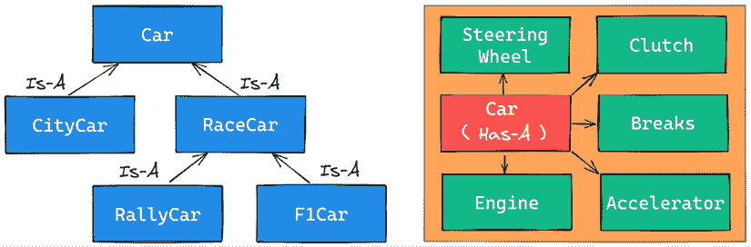
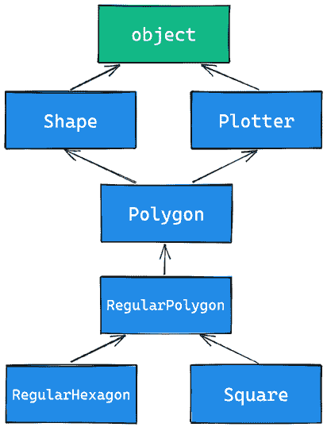

# 第六章：OOP、装饰器和迭代器

> “La classe non è acqua.”（“类胜于水。”）
> 
> ——意大利谚语

**面向对象编程（OOP**）是一个如此广泛的话题，以至于关于它的整本书都已经被写出来了。在本章中，我们面临着在广度和深度之间找到平衡的挑战。要讨论的事情实在太多了，如果深入描述，其中许多内容将需要超过整个章节的篇幅。因此，我们将尝试为您提供我们认为的良好全景式的基本概念，以及一些可能在下一章中派上用场的知识点。Python 的官方文档将帮助填补这些空白。

在本章中，我们将涵盖以下主题：

+   装饰器

+   使用 Python 进行 OOP

+   迭代器

# 装饰器

在*第五章*，*理解与生成器*中，我们测量了各种表达式的执行时间。

如果您还记得，我们不得不捕获开始时间，并在执行后从当前时间中减去它来计算经过的时间。我们还必须在每次测量后在控制台上打印它。这很不实用。

每当我们发现自己重复某些事情时，应该响起一个警钟。我们能否将那段代码放入函数中，避免重复？大多数时候，答案是*是的*，所以让我们看看一个例子：

```py
# decorators/time.measure.start.py
from time import sleep, time
def f():
    sleep(0.3)
def g():
    sleep(0.5)
t = time()
f()
print("f took:", time() - t)  # f took: 0.3028988838195801
t = time()
g()
print("g took:", time() - t)  # g took: 0.507941722869873 
```

在前面的代码中，我们定义了两个函数，`f()`和`g()`，它们什么也不做，只是休眠（分别休眠 0.3 秒和 0.5 秒）。我们使用`sleep()`函数来暂停执行所需的时间。注意时间测量的准确性。现在，我们如何避免重复那段代码和那些计算呢？一个潜在的第一种方法可能是以下这样：

```py
# decorators/time.measure.dry.py
from time import sleep, time
def f():
    sleep(0.3)
def g():
    sleep(0.5)
def measure(func):
    t = time()
    func()
    print(func.__name__, "took:", time() - t)
measure(f)  # f took: 0.3043971061706543
measure(g)  # g took: 0.5050859451293945 
```

好多了。整个计时机制都被封装在一个函数中，所以我们不需要重复代码。我们动态地打印函数名，代码也很直接。如果我们需要将任何参数传递给我们要测量的函数呢？这段代码将变得稍微复杂一些。让我们看看一个例子：

```py
# decorators/time.measure.arguments.py
from time import sleep, time
def f(sleep_time=0.1):
    sleep(sleep_time)
def measure(func, *args, **kwargs):
    t = time()
    func(*args, **kwargs)
    print(func.__name__, "took:", time() - t)
measure(f, sleep_time=0.3)  # f took: 0.30092811584472656
measure(f, 0.2)  # f took: 0.20505475997924805 
```

现在，`f()`期望传入`sleep_time`（默认值为 0.1），因此我们不再需要`g()`。我们还不得不修改`measure()`函数，使其现在可以接受一个函数、任何可变位置参数和任何可变关键字参数。这样，无论我们用什么调用`measure()`，我们都会将这些参数重定向到我们内部调用的`func()`。

这很好，但我们还可以稍作改进。假设我们想要以某种方式将那种计时行为内置到`f()`函数中，使我们只需调用它就能进行测量。下面是我们可以这样做的示例：

```py
# decorators/time.measure.deco1.py
from time import sleep, time
def f(sleep_time=0.1):
    sleep(sleep_time)
def measure(func):
    def wrapper(*args, **kwargs):
        t = time()
        func(*args, **kwargs)
        print(func.__name__, "took:", time() - t)
    return wrapper
f = measure(f)  # decoration point
f(0.2)  # f took: 0.20128178596496582
f(sleep_time=0.3)  # f took: 0.30509519577026367
print(f.__name__)  # wrapper  <- ouch! 
```

前面的代码并不那么简单明了。让我们看看这里发生了什么。魔法在于*装饰点*。当我们用`f()`作为参数调用`measure()`时，我们将`f()`重新赋值为`measure()`返回的任何内容。在`measure()`内部，我们定义了另一个函数`wrapper()`，然后返回它。因此，最终的效果是，在装饰点之后，当我们调用`f()`时，实际上是在调用`wrapper()`（你可以在代码的最后一行看到这一点）。由于`wrapper()`内部调用的是`func()`，在这个例子中是`f()`的引用，所以我们闭合了循环。

`wrapper()`函数，不出所料，是一个包装器。它接受可变的位置参数和关键字参数，并使用这些参数调用`f()`。它还在调用周围进行时间测量计算。

这种技术被称为**装饰**，而`measure()`实际上是一个**装饰器**。这种范式变得如此流行和广泛使用，以至于在 Python 2.4 版本中，Python 为其添加了特殊的语法。你可以在 PEP 318（[`peps.python.org/pep-0318/`](https://peps.python.org/pep-0318/)）中阅读具体细节。在 Python 3.0 中，我们看到了 PEP 3129（[`peps.python.org/pep-3129/`](https://peps.python.org/pep-3129/)），它定义了类装饰器。最后，在 Python 3.9 中，装饰器语法略有修改，以放宽一些语法限制；这一变化是在 PEP 614（[`peps.python.org/pep-0614/`](https://peps.python.org/pep-0614/)）中实现的。

现在，让我们探讨三种情况：一个装饰器、两个装饰器和接受参数的一个装饰器。首先，单个装饰器的情况：

```py
# decorators/syntax.py
def func(arg1, arg2, ...):
    pass
func = decorator(func)
# is equivalent to the following:
@decorator
def func(arg1, arg2, ...):
    pass 
```

我们不是手动将函数重新赋值为装饰器返回的内容，而是在函数定义前加上特殊的语法`@decorator_name`。

我们可以通过以下方式将多个装饰器应用于同一个函数：

```py
# decorators/syntax.py
def func(arg1, arg2, ...):
    pass
func = deco1(deco2(func))
# is equivalent to the following:
@deco1
@deco2
def func(arg1, arg2, ...):
    pass 
```

在应用多个装饰器时，注意顺序很重要。在先前的例子中，`func()`首先被`deco2()`装饰，然后结果被`deco1()`装饰。一个很好的经验法则是*装饰器离函数越近，应用得越早*。

在我们给你另一个例子之前，让我们先解决函数名的问题。看看下面代码中高亮的部分：

```py
# decorators/time.measure.deco1.py
def measure(func):
    def wrapper(*args, **kwargs):
        …
    return wrapper
f = measure(f)  # decoration point
**print****(f.__name__)** **# wrapper  <- ouch!** 
```

我们不希望在装饰函数时丢失原始函数的名称和文档字符串。但是，因为被装饰的函数`f`被重新赋值为`wrapper`，它的原始属性丢失了，被`wrapper()`的属性所取代。`functools`模块中有一个简单的解决方案。我们将修复这个问题，并重写代码以使用`@`操作符：

```py
# decorators/time.measure.deco2.py
from time import sleep, time
**from** **functools** **import** **wraps**
def measure(func):
    **@wraps(****func****)**
    def wrapper(*args, **kwargs):
        t = time()
        func(*args, **kwargs)
        print(func.__name__, "took:", time() - t)
    return wrapper
@measure
def f(sleep_time=0.1):
    """I'm a cat. I love to sleep!"""
    sleep(sleep_time)
f(sleep_time=0.3)  # f took: 0.30042004585266113
print(f.__name__)  # f
print(f.__doc__ )  # I'm a cat. I love to sleep! 
```

一切看起来都很正常。正如你所看到的，我们只需要告诉 Python`wrapper`实际上包装了`func()`（通过上面代码高亮部分的`wraps()`函数），你可以看到原始的名称和文档字符串都得到了保留。

关于`func()`重新分配的函数属性的全列表，请查看`functools.update_wrapper()`函数的官方文档，链接如下：[`docs.python.org/3/library/functools.html?#functools.update_wrapper`](https://docs.python.org/3/library/functools.html?#functools.update_wrapper)。

让我们再看另一个例子。我们想要一个装饰器，当函数的结果大于某个特定阈值时，它会打印出一个错误信息。我们也将借此机会向你展示如何同时应用两个装饰器：

```py
# decorators/two.decorators.py
from time import time
from functools import wraps
def measure(func):
    @wraps(func)
    def wrapper(*args, **kwargs):
        t = time()
        result = func(*args, **kwargs)
        print(func.__name__, "took:", time() - t)
        return result
    return wrapper
def max_result(func):
    @wraps(func)
    def wrapper(*args, **kwargs):
        result = func(*args, **kwargs)
        if result > 100:
            print(
                f"Result is too big ({result}). "
                "Max allowed is 100."
            )
        return result
    return wrapper
@measure
@max_result
def cube(n):
    return n**3
print(cube(2))
print(cube(5)) 
```

我们必须增强`measure()`装饰器，使其`wrapper()`现在返回对`func()`的调用结果。`max_result()`装饰器也这样做，但在返回之前，它会检查`result`是否不大于允许的最大值`100`。

我们用这两个装饰器都装饰了`cube()`。首先应用`max_result()`，然后是`measure()`。运行这段代码得到以下结果：

```py
$ python two.decorators.py
cube took: 9.5367431640625e-07
8
Result is too big (125). Max allowed is 100.
cube took: 3.0994415283203125e-06
125 
```

为了方便起见，我们用空行分隔了两次调用的结果。在第一次调用中，结果是 8，通过了阈值检查。测量并打印出运行时间。最后，我们打印出结果（`8`）。

在第二次调用时，结果是 125，因此打印出错误信息并返回结果；然后轮到`measure()`，它再次打印运行时间，最后我们打印出结果（`125`）。

如果我们用相同的两个装饰器但以不同的顺序装饰`cube()`函数，打印出的消息顺序也会不同。

## 装饰器工厂

一些装饰器可以接受参数。这种技术通常用于生成另一个装饰器（在这种情况下，该对象可以被称为**装饰器工厂**）。让我们看看其语法，然后我们将看到一个例子：

```py
# decorators/syntax.py
def func(arg1, arg2, ...):
    pass
func = decoarg(arg_a, arg_b)(func)
# is equivalent to the following:
@decoarg(arg_a, arg_b)
def func(arg1, arg2, ...):
    pass 
```

如你所见，这个情况有点不同。首先，`decoarg()`用给定的参数被调用，然后它的返回值（实际的装饰器）用`func()`被调用。

让我们现在改进一下例子。我们将回到一个单独的装饰器：`max_result()`。我们希望让它能够用不同的阈值装饰不同的函数，因为我们不希望为每个阈值都写一个装饰器。因此，让我们修改`max_result()`，使其能够通过动态指定阈值来装饰函数：

```py
# decorators/decorators.factory.py
from functools import wraps
def max_result(threshold):
    def decorator(func):
        @wraps(func)
        def wrapper(*args, **kwargs):
            result = func(*args, **kwargs)
            if result > threshold:
                print(
                    f"Result is too big ({result})."
                    f"Max allowed is {threshold}."
                )
            return result
        return wrapper
    return decorator
@max_result(75)
def cube(n):
    return n**3 
```

上述代码展示了如何编写一个装饰器工厂。如果你还记得，使用带参数的装饰器装饰一个函数与编写`func = decorator(argA, argB)(func)`是相同的，所以当我们用`max_result(75)`装饰`cube()`时，我们实际上是在做`cube = max_result(75)(cube)`。

让我们一步一步地看看发生了什么。当我们调用`max_result(75)`时，我们进入其主体。在`max_result(75)`函数内部定义了一个`decorator()`函数，它只接受一个函数作为其唯一参数。在该函数内部，我们找到了常见的装饰模式。我们定义了`wrapper()`，在其中我们检查原始函数调用的结果。这种方法的优点是从最内层开始，我们仍然可以引用`func()`和`threshold`，这使我们能够动态地设置阈值。

`wrapper()`函数返回`result`，`decorator()`返回`wrapper()`，`max_result()`返回`decorator()`。这意味着`cube = max_result(75)(cube)`指令实际上变成了`cube = decorator(cube)`。然而，这不仅仅是一个`decorator()`，而是一个`threshold`值为`75`的`decorator()`。这是通过称为**闭包**的机制实现的。

由其他函数返回并动态创建的函数被称为**闭包**。它们的主要特征是，它们在创建时可以完全访问局部命名空间中定义的变量和名称，即使定义它们的封装已经返回并完成执行。

运行最后一个示例会产生以下结果：

```py
$ python decorators.factory.py
Result is too big (125). Max allowed is 75.
125 
```

上述代码允许我们使用具有不同阈值的`max_result()`装饰器，如下所示：

```py
# decorators/decorators.factory.py
@max_result(**75**)
def cube(n):
    return n**3
@max_result(**100**)
def square(n):
    return n**2
@max_result(**1000**)
def multiply(a, b):
    return a * b 
```

注意，每个装饰器都使用不同的`threshold`值。

装饰器在 Python 中非常流行。它们被频繁使用，并且使代码更加简洁和优雅。

# OOP

现在我们已经了解了装饰模式的基础，是时候探索面向对象编程了。我们将使用来自*Kindler, E.; Krivy, I. (2011). Object-oriented simulation of systems with sophisticated control (International Journal of General Systems)*的定义，并将其应用于 Python：

> **面向对象编程**（**OOP**）是一种基于“对象”概念的编程范式，其中对象是包含数据的数据结构，以属性的形式存在，以及以方法的形式存在的代码。对象的一个显著特点是，对象的方法可以访问并经常修改与之关联的对象的数据属性（对象具有“自我”的概念）。在面向对象编程中，计算机程序是通过构建相互交互的对象来设计的。

Python 完全支持这种范式。实际上，正如我们之前所说的，*Python 中的一切都是对象*，这表明面向对象编程（OOP）不仅被 Python 支持，而且是该语言的核心特性。

面向对象编程中的两个主要角色是**对象**和**类**。类用于创建对象，我们说对象是类的**实例**。

如果你难以理解对象和类之间的区别，可以这样想。当你听到“笔”这个词时，你知道这个词所代表的对象类型（或类）是什么。然而，如果我们说“这支笔”，那么我们不是指一个对象类，而是指那个类的“实例”：一个真实对象。

当从类创建对象时，它们继承了类属性和方法。它们代表程序域中的具体项目。

## 最简单的 Python 类

我们将从你可以在 Python 中编写的最简单的类开始：

```py
# oop/simplest.class.py
class Simplest:
    pass
print(type(Simplest))  # **what type is this object?**
simp = Simplest()  # we create an instance of Simplest: simp
print(type(simp))  # what type is simp?
# is simp an instance of Simplest?
print(type(simp) is Simplest)  # There's a better way to do this 
```

让我们运行前面的代码并逐行解释：

```py
$ python simplest.class.py
<class 'type'>
<class '__main__.Simplest'>
True 
```

我们定义的 `Simplest` 类在其主体中只有 `pass` 指令，这意味着它没有自定义属性或方法。我们将打印其类型（`__main__` 是顶层代码执行的命名空间名称），并且我们知道，在突出显示的注释中，我们写了 *object* 而不是 *class* 。正如你通过那个 `print` 语句的结果所看到的，*类实际上也是对象本身*。为了更精确，它们是 `type` 的实例。解释这个概念会引导我们进入关于 **元类** 和 **元编程** 的讨论，这些是高级概念，需要牢固掌握基础知识才能理解，并且超出了本章的范围。像往常一样，我们提到它是为了给你留下一个线索，以便当你准备好更深入地探索时。

让我们回到例子：我们创建了 `simp` ，它是 `Simplest` 类的一个实例。你可以看到创建实例的语法与调用函数的语法相同。接下来，我们打印 `simp` 属于的类型，并验证 `simp` 确实是 `Simplest` 的一个实例。我们将在本章后面部分展示更好的方法来做这件事。

到目前为止，一切都很简单。然而，当我们编写 `class ClassName(): pass` 时会发生什么呢？嗯，Python 做的是创建一个类对象并给它一个名称。这和声明函数时使用 `def` 的行为非常相似。

## 类和对象命名空间

在创建类对象之后（这通常发生在模块首次导入时），它代表一个命名空间。我们可以调用该类来创建其实例。每个实例都继承类属性和方法，并拥有自己的命名空间。我们已经知道，为了遍历命名空间，我们只需要使用点（`.`）操作符。

让我们看看另一个例子：

```py
# oop/class.namespaces.py
class Person:
    species = "Human"
print(Person.species)  # Human
Person.alive = True  # Added dynamically!
print(Person.alive)  # True
man = Person()
print(man.species)  # Human (inherited)
print(man.alive)  # True (inherited)
Person.alive = False
print(man.alive)  # False (inherited)
man.name = "Darth"
man.surname = "Vader"
print(man.name, man.surname)  # Darth Vader 
```

在前面的例子中，我们定义了一个名为 `species` 的**类属性**。在类的主体中定义的任何名称都成为属于该类的属性。在代码中，我们还定义了 `Person.alive` ，这是另一个类属性。你可以看到，从类中访问该属性没有任何限制。你可以看到 `man` ，它是 `Person` 的一个实例，继承了这两个属性，当它们改变时立即反映出来。

`man` 实例也有两个属于其自己命名空间的属性，因此被称为**实例属性**：`name` 和 `surname`。

**类属性**在所有实例之间共享，而**实例属性**则不是；因此，你应该使用类属性来提供所有实例共享的状态和行为，并使用实例属性来为每个单独的对象提供特定数据。

## 属性遮蔽

当你在对象上搜索属性而找不到它时，Python 会将搜索扩展到对象上的属性（并且会继续搜索，直到找到属性或继承链的末尾——关于继承的更多信息稍后介绍）。这导致了一个有趣的遮蔽行为。让我们看一个例子：

```py
# oop/class.attribute.shadowing.py
class Point:
    x = 10
    y = 7
p = Point()
print(p.x)  # 10 (from class attribute)
print(p.y)  # 7 (from class attribute)
p.x = 12  # p gets its own `x` attribute
print(p.x)  # 12 (now found on the instance)
print(Point.x)  # 10 (class attribute still the same)
del p.x  # we delete instance attribute
print(p.x)  # 10 (now search has to go again to find class attr)
p.z = 3  # let's make it a 3D point
print(p.z)  # 3
print(Point.z)
# AttributeError: type object 'Point' has no attribute 'z' 
```

前面的代码很有趣。我们定义了一个名为 `Point` 的类，它有两个类属性，`x` 和 `y`。当我们创建 `Point` 的一个实例 `p` 时，你可以看到我们可以从 `p` 命名空间中访问 `x` 和 `y`（`p.x` 和 `p.y`）。当我们这样做时，Python 在实例上找不到任何 `x` 或 `y` 属性，因此它搜索类并找到它们。

然后，我们通过分配 `p.x = 12` 给 `p` 它自己的 `x` 属性。这种行为一开始可能看起来有点奇怪，但如果你仔细想想，这与在全局 `x = 10` 外部声明 `x = 12` 的函数中发生的情况完全相同（有关作用域的更多信息，请参阅 *第四章*，*函数，代码的构建块*，以进行复习）。我们知道 `x = 12` 不会影响全局的 `x`，对于类和实例属性来说，情况也是一样的。

在分配 `p.x = 12` 之后，当我们打印它时，搜索不需要达到类属性，因为 `x` 已经在实例上找到了，所以我们打印出 `12`。我们还打印了 `Point.x`，它指的是类命名空间中的 `x`，以表明它仍然是 `10`。

然后，我们从 `p` 的命名空间中删除 `x`，这意味着在下一条语句中再次打印它时，Python 将不得不在类中搜索它，因为它不再在实例上找到了。

最后三行显示，将属性分配给实例并不意味着它们会在类中找到。实例获得类中的任何内容，但反之则不然。

你认为将 `x` 和 `y` 坐标作为类属性怎么样？你认为这是一个好主意吗？如果我们创建了 `Point` 的另一个实例，这会帮助我们展示为什么需要实例属性吗？

## `self` 参数

在类方法内部，我们可以通过一个特殊的参数来引用一个实例，这个参数传统上被称为 `self`。`self` 总是实例方法的第一个属性。让我们检查这种行为，以及我们如何不仅共享属性，还共享方法给所有实例：

```py
# oop/class.self.py
class Square:
    side = 8
    def area(self):  # self is a reference to an instance
        return self.side**2
sq = Square()
print(sq.area())  # 64 (side is found on the class)
print(Square.area(sq))  # 64 (equivalent to sq.area())
sq.side = 10
print(sq.area())  # 100 (side is found on the instance) 
```

注意 `area()` 方法是如何被 `sq` 使用的。这两个调用，`Square.area(sq)` 和 `sq.area()`，是等价的，并且它们教会我们机制是如何工作的。你可以将实例传递给方法调用（`Square.area(sq)`），在方法内部将名称 `self`，或者你可以使用更舒适的语法，`sq.area()`，Python 会为你幕后转换。

让我们看看更好的例子：

```py
# oop/class.price.py
class Price:
    def final_price(self, vat, discount=0):
        """Returns price after applying vat and fixed discount."""
        return (self.net_price * (100 + vat) / 100) - discount
p1 = Price()
p1.net_price = 100
print(Price.final_price(p1, 20, 10))  # 110 (100 * 1.2 - 10)
print(p1.final_price(20, 10))  # equivalent 
```

上述代码显示，我们可以在声明方法时使用参数，没有任何阻止。我们可以使用与函数完全相同的语法，但我们需要记住，第一个参数将始终是方法将要绑定到的实例。我们不必一定称它为 `self`，但这是一个约定，这也是我们必须遵守的少数几个重要案例之一。

## 初始化实例

你有没有注意到，在上面的代码中在调用 `p1.final_price()` 之前，我们必须将 `net_price` 赋值给 `p1`？有更好的方法来做这件事。在其他语言中，这会被称为**构造函数**，但在 Python 中并不是这样。它实际上是一个**初始化器**，因为它作用于已经创建的实例，因此被称为 `__init__()`。它是一个**魔法方法**，在对象创建后立即运行。Python 对象还有一个 `__new__()` 方法，它是实际的构造函数。然而，在实践中，通常不需要重写它；这是一种主要用于编写元类的技术。现在让我们看看如何在 Python 中初始化对象的例子：

```py
# oop/class.init.py
class Rectangle:
    def __init__(self, side_a, side_b):
        self.side_a = side_a
        self.side_b = side_b
    def area(self):
        return self.side_a * self.side_b
r1 = Rectangle(10, 4)
print(r1.side_a, r1.side_b)  # 10 4
print(r1.area())  # 40
r2 = Rectangle(7, 3)
print(r2.area())  # 21 
```

事情终于开始成形。当一个对象被创建时，`__init__()` 方法会自动为我们运行。在这种情况下，我们这样写，当我们创建一个 `Rectangle` 对象（通过像函数一样调用类名），我们向创建调用传递参数，就像在任何常规函数调用中一样。我们传递参数的方式遵循 `__init__()` 方法的签名，因此，在两个创建语句中，`10` 和 `4` 将是 `r1` 的 `side_a` 和 `side_b`，而 `7` 和 `3` 将是 `r2` 的 `side_a` 和 `side_b`。你可以看到，从 `r1` 和 `r2` 调用 `area()` 反映出它们有不同的实例参数。以这种方式设置对象更方便。

## 面向对象编程（OOP）是关于代码复用

到现在为止，应该已经很清楚：*面向对象编程（OOP）的全部都是关于代码复用*。我们定义一个类，创建实例，这些实例可以使用在类中定义的方法。它们的行为将根据实例是如何通过初始化器设置的而有所不同。

### 继承和组合

然而，这仅仅是一半的故事；面向对象编程不仅仅是这个。我们有两种主要的设计结构可以使用：继承和组合。

**继承**意味着两个对象通过**是**（Is-A）类型的关系相关联。另一方面，**组合**意味着两个对象通过**有**（Has-A）关系相关联。让我们用一个例子来解释，其中我们声明了不同类型的引擎类：

```py
# oop/class_inheritance.py
class Engine:
    def start(self):
        pass
    def stop(self):
        pass
class ElectricEngine(Engine):  # Is-A Engine
    pass
class V8Engine(Engine):  # Is-A Engine
    pass 
```

然后，我们想要声明一些将使用这些引擎的汽车类型：

```py
class Car:
    engine_cls = Engine
    def __init__(self):
        self.engine = self.engine_cls()  # Has-A Engine
    def start(self):
        print(
            f"Starting {self.engine.__class__.__name__} for "
            f"{self.__class__.__name__}... Wroom, wroom!"
        )
        self.engine.start()
    def stop(self):
        self.engine.stop()
class RaceCar(Car):  # Is-A Car
    engine_cls = V8Engine
class CityCar(Car):  # Is-A Car
    engine_cls = ElectricEngine
class F1Car(RaceCar):  # Is-A RaceCar and also Is-A Car
    pass  # engine_cls same as parent
car = Car()
racecar = RaceCar()
citycar = CityCar()
f1car = F1Car()
cars = [car, racecar, citycar, f1car]
for car in cars:
    car.start() 
```

运行上述代码会打印以下内容：

```py
$ python class_inheritance.py
Starting Engine for Car... Wroom, wroom!
Starting V8Engine for RaceCar... Wroom, wroom!
Starting ElectricEngine for CityCar... Wroom, wroom!
Starting V8Engine for F1Car... Wroom, wroom! 
```

上述示例展示了**是**（Is-A）和**有**（Has-A）类型的关系。首先，让我们考虑`Engine`。它是一个简单的类，有两个方法，`start()`和`stop()`。然后我们定义`ElectricEngine`和`V8Engine`，它们都从它继承。你可以从它们的定义中看到这一点，定义中在名称后面括号内包含了`Engine`。

这意味着`ElectricEngine`和`V8Engine`都从`Engine`类继承属性和方法，这个类被称为它们的**基类**（或**父类**）。

对于汽车来说，情况也是一样。`Car`是`RaceCar`和`CityCar`的基类。`RaceCar`也是`F1Car`的基类。另一种说法是，`F1Car`从`RaceCar`继承，而`RaceCar`从`Car`继承。因此，`F1Car`是`RaceCar`的**子类**，而`RaceCar`是`Car`的**子类**。由于传递性质，我们也可以说`F1Car`是`Car`的**子类**。同样，`CityCar`也是`Car`的**子类**。

当我们定义`class A(B): pass`时，我们说`A`是`B`的**子类**，而`B`是`A`的**父类**。**父类**和**基类**是同义词，**子类**和**派生类**也是同义词。我们还说一个类**继承**自另一个类，或者**扩展**它。

这就是继承机制。

现在，让我们回到代码。每个类都有一个类属性`engine_cls`，它是对我们想要分配给每种汽车类型的引擎类的引用。`Car`有一个通用的`Engine`，两辆赛车有一个 V8 引擎，而城市车有一个电动引擎。

当在初始化方法`__init__()`中创建汽车时，我们创建一个引擎类的实例并将其设置为`engine`实例属性。

在所有类实例之间共享`engine_cls`是有意义的，因为所有同一类汽车实例很可能拥有相同类型的引擎。另一方面，将单个引擎（任何`Engine`类的实例）作为类属性是不好的，因为这意味着所有汽车实例共享一个引擎，这是不正确的。

汽车与其引擎之间的关系是**有**（Has-A）类型。汽车**有**一个引擎。这被称为**组合**，反映了对象可以由许多其他对象组成的事实。汽车**有**引擎、变速箱、车轮、底盘、车门、座椅等等。

在使用面向对象编程（OOP）时，以这种方式描述对象非常重要，这样我们才能正确地组织我们的代码。

注意，我们不得不避免在`class_inheritance.py`脚本名称中使用点，因为模块名称中的点会使导入变得困难。本书的源代码中的大多数模块都旨在作为独立脚本运行，因此我们选择在可能的情况下添加点以增强可读性，但通常，你想要避免在模块名称中使用点。

在我们离开这个段落之前，让我们用另一个示例来验证我们上面所说的内容是否正确：

```py
# oop/class.issubclass.isinstance.py
from class_inheritance import Car, RaceCar, F1Car
car = Car()
racecar = RaceCar()
f1car = F1Car()
cars = [(car, "car"), (racecar, "racecar"), (f1car, "f1car")]
car_classes = [Car, RaceCar, F1Car]
for car, car_name in cars:
    for class_ in car_classes:
        belongs = isinstance(car, class_)
        msg = "is a" if belongs else "is not a"
        print(car_name, msg, class_.__name__)
""" Prints:
… (starting enging messages omitted)
**car** **is** **a Car**
car is not a RaceCar
car is not a F1Car
**racecar** **is** **a Car**
**racecar** **is** **a RaceCar**
racecar is not a F1Car
**f1car** **is** **a Car**
**f1car** **is** **a RaceCar**
**f1car** **is** **a F1Car**
""" 
```

正如你所见，`car`只是`Car`的一个实例，而`racecar`是`RaceCar`（以及通过扩展`Car`）的一个实例，`f1car`是`F1Car`（以及通过扩展`RaceCar`和`Car`）的一个实例。同样，一个*香蕉*是*Banana*的一个实例。但是，它也是一个*水果*。同样，它也是*食物*，对吧？同一个概念。要检查一个对象是否是某个类的实例，请使用`isinstance()`函数。它比单纯的类型比较（`type(object) is Class`）更推荐。

注意，我们省略了实例化汽车时得到的打印输出。我们在前面的示例中看到了它们。

让我们也检查一下继承。同样的设置，但在`for`循环中有不同的逻辑：

```py
# oop/class.issubclass.isinstance.py
for class1 in car_classes:
    for class2 in car_classes:
        is_subclass = issubclass(class1, class2)
        msg = "{0} a subclass of".format(
            "is" if is_subclass else "is not"
        )
        print(class1.__name__, msg, class2.__name__)
""" Prints:
**Car** **is** **a subclass of Car**
Car is not a subclass of RaceCar
Car is not a subclass of F1Car
**RaceCar** **is** **a subclass of Car**
**RaceCar** **is** **a subclass of RaceCar**
RaceCar is not a subclass of F1Car
**F1Car** **is** **a subclass of Car**
**F1Car** **is** **a subclass of RaceCar**
**F1Car** **is** **a subclass of F1Car**
""" 
```

有趣的是，我们了解到*一个类是其自身的子类*。检查前面示例的输出，看看它是否与我们提供的解释相符。

注意，按照惯例，类名使用*CapWords*编写，即*ThisWayIsCorrect*，而函数和方法则使用 snake case，如*this_way_is_correct*。此外，如果你想在代码中使用一个与 Python 保留关键字或内置函数或类冲突的名称，惯例是在名称后添加一个尾随下划线。在第一个*for 循环*示例中，我们使用`for class_ in ...`遍历类名，因为`class`是一个保留字。你可以通过阅读 PEP 8 来刷新你对约定的了解。

为了帮助说明*Is-A*和*Has-A*之间的区别，请看以下图表：



图 6.1：Is-A 与 Has-A 关系

## 访问基类

我们已经看到了类声明，例如`class ClassA: pass`和`class ClassB(BaseClassName): pass`。当我们没有明确指定基类时，Python 会将内置的**object**类作为基类。最终，所有类都从`object`派生。请记住，如果你没有指定基类，括号是可选的，并且在实践中从不使用。

因此，编写`class A: pass`或`class A(): pass`或`class A(object): pass`都是等效的。`object`类是一个特殊的类，因为它包含了所有 Python 类共有的方法，并且不允许你设置任何属性。

让我们看看我们如何在类内部访问基类：

```py
# oop/super.duplication.py
class Book:
    def __init__(self, title, publisher, pages):
        self.title = title
        self.publisher = publisher
        self.pages = pages
class Ebook(Book):
    def __init__(self, title, publisher, pages, format_):
        self.title = title
        self.publisher = publisher
        self.pages = pages
        self.format_ = format_ 
```

看一下前面的代码。`Book` 的三个输入参数在 `Ebook` 中重复。这是不好的做法，因为我们现在有两套做同样事情的指令。此外，`Book.__init__()` 签名的任何更改都不会反映在 `Ebook` 中。通常，我们希望基类中的更改反映在其子类中。让我们看看一种修复这个问题的方法：

```py
# oop/super.explicit.py
class Book:
    def __init__(self, title, publisher, pages):
        self.title = title
        self.publisher = publisher
        self.pages = pages
class Ebook(Book):
    def __init__(self, title, publisher, pages, format_):
        Book.__init__(self, title, publisher, pages)
        self.format_ = format_
ebook = Ebook(
    "Learn Python Programming", "Packt Publishing", 500, "PDF"
)
print(ebook.title)  # Learn Python Programming
print(ebook.publisher)  # Packt Publishing
print(ebook.pages)  # 500
print(ebook.format_)  # PDF 
```

更好了。我们已经去除了代码重复。在这个例子中，我们告诉 Python 调用 `Book` 类的 `__init__()` 方法；我们将 `self` 传递给这个调用，确保我们将其绑定到当前实例。

如果我们修改 `Book` 类的 `__init__()` 方法中的逻辑，我们不需要触及 `Ebook`；这个更改将自动传递。

这种方法很好，但它仍然存在一个小问题。比如说，我们将 `Book` 的名字改为 `Liber`，这是“书”的拉丁语。那么我们就必须更改 `Ebook` 的 `__init__()` 方法以反映这个更改。这可以通过使用 `super` 来避免：

```py
# oop/super.implicit.py
class Book:
    def __init__(self, title, publisher, pages):
        self.title = title
        self.publisher = publisher
        self.pages = pages
class Ebook(Book):
    def __init__(self, title, publisher, pages, format_):
        super().__init__(title, publisher, pages)
        # Another way to do the same thing is:
        # super(Ebook, self).__init__(title, publisher, pages)
        self.format_ = format_
ebook = Ebook(
    "Learn Python Programming", "Packt Publishing", 500, "PDF"
)
print(ebook.title)  # Learn Python Programming
print(ebook.publisher)  # Packt Publishing
print(ebook.pages)  # 500
print(ebook.format_)  # PDF 
```

`super()` 是一个函数，它返回一个代理对象，该对象将方法调用委托给父类或兄弟类。

如果两个类有相同的父类，它们就是兄弟类。

在这种情况下，`super()` 将委托调用到 `Book.__init__()`，这种方法的优点是现在我们可以自由地将 `Book` 改为 `Liber`，而无需触及 `Ebook` 的 `__init__()` 方法中的任何逻辑。

现在我们知道了如何从子类访问基类，让我们探索 Python 的多重继承。

## 多重继承

在 Python 中，我们可以定义从多个基类继承的类。这被称为 **多重继承**。当一个类有多个基类时，属性搜索可以遵循多条路径。看看下面的图示：



图 6.2：类继承图

如你所见，`Shape` 和 `Plotter` 作为所有其他类的基类。`Polygon` 直接从它们继承，`RegularPolygon` 从 `Polygon` 继承，而 `RegularHexagon` 和 `Square` 都从 `RegularPolygon` 继承。还要注意，`Shape` 和 `Plotter` 隐式地从 `object` 继承，所以从 `Polygon` 到 `object`，我们有一个所谓的 **菱形**。用更简单的话说，我们有超过一条路径可以到达基类。我们将在几分钟后看到这为什么很重要。让我们将这个图示转换成代码：

```py
# oop/multiple.inheritance.py
class Shape:
    geometric_type = "Generic Shape"
    def area(self):  # This acts as placeholder for the interface
        raise NotImplementedError
    def get_geometric_type(self):
        return self.geometric_type
class Plotter:
    def plot(self, ratio, topleft):
        # Imagine some nice plotting logic here...
        print("Plotting at {}, ratio {}.".format(topleft, ratio))
class Polygon(Shape, Plotter):  # base class for polygons
    geometric_type = "Polygon"
class RegularPolygon(Polygon):  # Is-A Polygon
    geometric_type = "Regular Polygon"
    def __init__(self, side):
        self.side = side
class RegularHexagon(RegularPolygon):  # Is-A RegularPolygon
    geometric_type = "RegularHexagon"
    def area(self):
        return 1.5 * (3**0.5 * self.side**2)
class Square(RegularPolygon):  # Is-A RegularPolygon
    geometric_type = "Square"
    def area(self):
        return self.side * self.side
hexagon = RegularHexagon(10)
print(hexagon.area())  # 259.8076211353316
print(hexagon.get_geometric_type())  # RegularHexagon
hexagon.plot(0.8, (75, 77))  # Plotting at (75, 77), ratio 0.8.
square = Square(12)
print(square.area())  # 144
print(square.get_geometric_type())  # Square
square.plot(0.93, (74, 75))  # Plotting at (74, 75), ratio 0.93. 
```

看一下前面的代码：`Shape` 类有一个属性 `geometric_type` 和两个方法，`area()` 和 `get_geometric_type()`。使用基类（例如我们的例子中的 `Shape`）来定义一个 **接口**，即一组子类必须提供实现的函数，这是相当常见的。但是，我们目前想要使这个例子尽可能简单。

我们还有一个`Plotter`类，它添加了`plot()`方法，从而为继承自它的任何类提供了绘图能力。当然，在这个例子中，`plot()`的实现只是一个简单的`print()`。第一个有趣的类是`Polygon`，它从`Shape`和`Plotter`类继承。

多边形有很多种类型，其中之一是正多边形，它既等角（所有角度相等）又等边（所有边相等），因此我们创建了从`Polygon`类继承的`RegularPolygon`类。对于所有边都相等的正多边形，我们可以实现一个简单的`__init__()`方法，它只接受边的长度。我们创建了从`RegularPolygon`继承的`RegularHexagon`和`Square`类。

这个结构相当长，但希望它能给你一个如何专门化你的对象分类的想法。

现在，请看一下最后八行代码。注意，当我们对`hexagon`和`square`调用`area()`方法时，我们得到了两者的正确面积。这是因为它们都提供了正确的实现逻辑。此外，我们还可以在它们两个上调用`get_geometric_type()`，即使它没有定义在它们的类中，Python 也会一直向上到`Shape`类来寻找它的实现。注意，尽管实现是在`Shape`类中提供的，但用于返回值的`self.geometric_type()`是正确地从调用实例中获取的。

`plot()`方法的调用也很有趣，展示了你如何通过这种技术丰富你的对象，使其具有它们原本不具备的能力。这种技术在像 Django 这样的 Web 框架中非常流行，Django 提供了称为**混入**（mixins）的特殊类，你可以直接使用这些类的功能。你所需要做的就是将所需的混入类作为你类的一个基类来定义。

多重继承功能强大，但同时也可能变得有些混乱，因此我们需要确保我们理解在使用它时会发生什么。

### 方法解析顺序

到目前为止，我们知道当我们请求`someobject.attribute`且`attribute`没有在对象上找到时，Python 会从`someobject`创建的类中开始搜索。如果那里也没有，Python 会沿着继承链向上搜索，直到找到`attribute`或到达`object`类。如果继承链只由单继承步骤组成，这意味着类只有一个父类，一直向上到`object`，那么这很容易理解。然而，当涉及多重继承时，如果找不到属性，预测下一个将被搜索的类可能并不直接。

Python 提供了一种方法，可以始终知道在属性查找时类被搜索的顺序：**方法解析顺序**（**MRO**）。

MRO 是在查找成员时搜索基类的顺序。自 2.3 版本以来，Python 使用一个称为 **C3** 的算法，它保证了单调性。

让我们看看上一个例子中 `Square` 类的 MRO：

```py
# oop/multiple.inheritance.py
print(square.__class__.__mro__)
# prints:
# (<class '__main__.Square'>, <class '__main__.RegularPolygon'>,
#  <class '__main__.Polygon'>, <class '__main__.Shape'>,
#  <class '__main__.Plotter'>, <class 'object'>) 
```

要获取一个类的 MRO，我们可以从实例到其 `__class__` 属性，然后到其 `__mro__` 属性。或者，我们也可以使用 `Square.__mro__`，或者直接使用 `Square.mro()`，但如果你需要从一个实例访问 MRO，你将不得不动态地推导出其类。

注意，唯一有疑问的地方是在 `Polygon` 之后的部分，继承链创建了两个路径：一条通向 `Shape`，另一条通向 `Plotter`。通过扫描 `Square` 类的 MRO，我们知道 `Shape` 在 `Plotter` 之前被搜索。

这为什么很重要呢？好吧，考虑以下代码：

```py
# oop/mro.simple.py
class A:
    label = "a"
class B(A):
    label = "b"
class C(A):
    label = "c"
class D(B, C):
    pass
d = D()
print(d.label)  # Hypothetically this could be either 'b' or 'c' 
```

`B` 和 `C` 都继承自 `A`，而 `D` 则继承自 `B` 和 `C`。这意味着在查找 `label` 属性时，可以通过 `B` 或 `C` 达到顶层（`A`）。根据首先到达的是哪一个，我们得到不同的结果。

在这个先前的例子中，我们得到 `'b'`，这是我们预期的，因为 `B` 是 `D` 的基类中最左侧的。但是，如果我们从 `B` 中移除 `label` 属性会发生什么呢？这将是一个令人困惑的情况：算法会一直向上到 `A`，还是会首先到达 `C`？让我们找出答案：

```py
# oop/mro.py
class A:
    label = "a"
class B(A):
    pass  # was: label = 'b'
class C(A):
    label = "c"
class D(B, C):
    pass
d = D()
print(d.label)  # 'c'
print(d.__class__.mro())  # notice another way to get the MRO
# prints:
# [<class '__main__.D'>, <class '__main__.B'>,
#  <class '__main__.C'>, <class '__main__.A'>, <class 'object'>] 
```

因此，我们了解到 MRO 是 `D->B->C->A->object`，这意味着当我们请求 `d.label` 时，我们得到 `'c'`。

在日常编程中，通常不需要处理 MRO，但我们认为至少在这个段落中提到它很重要，这样，如果你陷入复杂的混入结构中，你将能够找到出路。

## 类和静态方法

到目前为止，我们编写的类具有数据形式的属性和实例方法，但在类定义中我们还可以找到两种其他类型的方法：**静态方法**和**类方法**。

### 静态方法

当你创建一个类对象时，Python 会给它分配一个名称。这个名称充当命名空间，有时，将功能分组在其下是有意义的。静态方法非常适合这种用途。与实例方法不同，在调用时它们不需要传递实例。让我们来看一个例子：

```py
# oop/static.methods.py
class StringUtil:
    @staticmethod
    def is_palindrome(s, case_insensitive=True):
        # we allow only letters and numbers
        s = "".join(c for c in s if c.isalnum())  # Study this!
        # For case insensitive comparison, we lower-case s
        if case_insensitive:
            s = s.lower()
        for c in range(len(s) // 2):
            if s[c] != s[-c - 1]:
                return False
        return True
    @staticmethod
    def get_unique_words(sentence):
        return set(sentence.split())
print(
    StringUtil.is_palindrome("Radar", case_insensitive=False)
)  # False: Case Sensitive
print(StringUtil.is_palindrome("A nut for a jar of tuna"))  # True
print(StringUtil.is_palindrome("Never Odd, Or Even!"))  # True
print(
    StringUtil.is_palindrome(
        "In Girum Imus Nocte Et Consumimur Igni"
    )  # Latin palindrome
)  # True
print(
    StringUtil.get_unique_words(
        "I love palindromes. I really really love them!"
    )
)
# {'them!', 'palindromes.', 'I', 'really', 'love'} 
```

上述代码非常有趣。首先，我们了解到静态方法是通过简单地应用 `staticmethod` 装饰器来创建的。你可以看到它们不需要任何额外的参数，所以除了装饰之外，它们看起来就像函数一样。

我们有一个名为 `StringUtil` 的类，它充当函数的容器。另一种方法是在单独的模块中包含函数。这实际上是一个风格问题，大多数情况下都是如此。

到现在为止，`is_palindrome()` 中的逻辑应该对您来说已经很直观了，但以防万一，让我们过一遍。首先，我们从 `s` 中移除所有既不是字母也不是数字的字符。我们使用字符串对象的 `join()` 方法来做这件事。通过在空字符串上调用 `join()`，结果是所有传递给 `join()` 的可迭代元素将被连接在一起。我们向 `join()` 提供一个生成器表达式，该表达式按顺序生成 `s` 中的所有字母数字字符。这是分析回文时的正常程序。

如果 `case_insensitive` 是 `True`，我们将 `s` 转换为小写。最后，我们继续检查 `s` 是否是回文。为此，我们比较第一个和最后一个字符，然后是第二个和倒数第二个，以此类推。如果在任何时刻我们发现差异，这意味着字符串不是回文，因此我们可以返回 `False`。另一方面，如果我们正常退出 `for` 循环，这意味着没有找到差异，因此我们可以断定字符串是回文。

注意，这段代码无论字符串长度是奇数还是偶数都能正确工作。度量 `len(s) // 2` 达到 `s` 的一半，如果 `s` 的长度是奇数个字符，中间的那个字符不会被检查（例如，在 *RaDaR* 中，*D* 不会被检查），但我们并不在意，因为它会与自身比较。

`get_unique_words()` 方法要简单得多：它只是返回一个集合，我们将包含句子中单词的列表喂给这个集合。`set` 类会为我们移除任何重复项，所以我们不需要做任何事情。

`StringUtil` 类为我们提供了一个容器命名空间，用于存放旨在处理字符串的方法。另一个例子可能是一个 `MathUtil` 类，其中包含一些用于处理数字的静态方法。

### 类方法

类方法与静态方法略有不同，因为它们像实例方法一样也接收一个特殊的第一个参数。在这种情况下，它是类对象本身，而不是实例。类方法的一个非常常见的用例是为类提供工厂能力，这意味着有其他方式可以创建类的实例。让我们看一个例子：

```py
# oop/class.methods.factory.py
class Point:
    def __init__(self, x, y):
        self.x = x
        self.y = y
    @classmethod
    def from_tuple(cls, coords):  # cls is Point
        return cls(*coords)
    @classmethod
    def from_point(cls, point):  # cls is Point
        return cls(point.x, point.y)
p = Point.from_tuple((3, 7))
print(p.x, p.y)  # 3 7
q = Point.from_point(p)
print(q.x, q.y)  # 3 7 
```

在前面的代码中，我们向您展示了如何使用类方法为 `Point` 类创建一个工厂。在这种情况下，我们希望通过传递两个坐标（常规创建 `p = Point(3, 7)`）来创建一个 `Point` 实例，但我们还希望能够通过传递一个元组（`Point.from_tuple()`）或另一个实例（`Point.from_point()`）来创建一个实例。

在每个类方法中，`cls` 参数指的是 `Point` 类。与实例方法一样，实例方法以 `self` 作为第一个参数，类方法也接受一个 `cls` 参数。`self` 和 `cls` 都是按照一种约定来命名的，虽然你不强制遵守，但强烈建议你尊重这种约定。这是任何专业的 Python 程序员都不会改变的事情；这是一个如此强烈的约定，以至于许多工具，如解析器、linters 等，都依赖于它。

类方法和静态方法可以很好地协同工作。静态方法特别有用，可以将类方法的逻辑拆分，以改善其布局。

让我们通过重构 `StringUtil` 类来举一个例子：

```py
# oop/class.methods.split.py
class StringUtil:
    @classmethod
    def is_palindrome(cls, s, case_insensitive=True):
        s = cls._strip_string(s)
        # For case insensitive comparison, we lower-case s
        if case_insensitive:
            s = s.lower()
        return cls._is_palindrome(s)
    @staticmethod
    def _strip_string(s):
        return "".join(c for c in s if c.isalnum())
    @staticmethod
    def _is_palindrome(s):
        for c in range(len(s) // 2):
            if s[c] != s[-c - 1]:
                return False
        return True
    @staticmethod
    def get_unique_words(sentence):
        return set(sentence.split())
print(StringUtil.is_palindrome("radar"))  # True
print(StringUtil.is_palindrome("not a palindrome"))  # False 
```

将此代码与上一个版本进行比较。首先，请注意，尽管 `is_palindrome()` 现在是一个类方法，但我们调用它的方式与它是静态方法时相同。我们将其更改为类方法的原因是，在将其逻辑分解（到 `_strip_string()` 和 `_is_palindrome()`）之后，我们需要获取对这些方法的引用，如果没有 `cls` 在我们的方法中，唯一的选择就是通过使用类本身的名称来调用它们，如下所示：`StringUtil._strip_string()` 和 `StringUtil._is_palindrome()`。

然而，这并不是一个好的做法，因为我们会在 `is_palindrome()` 方法中硬编码类名，从而让我们处于每次想要更改类名时都必须修改它的位置。使用 `cls` 意味着它将作为类名，这意味着如果类名更改，我们的代码就不需要任何修改。

注意到新的逻辑比上一个版本读起来要好得多。此外，注意通过在分解出的方法名称前加上一个前导下划线，我们暗示这些方法不应该从类外部调用，但这将是下一段的主题。

## 私有方法和名称改写

如果你熟悉像 Java、C# 或 C++ 这样的语言，那么你知道它们允许程序员为属性（数据和方法）分配隐私状态。每种语言都有自己略微不同的风味，但大意是公共属性可以从代码的任何位置访问，而私有属性只能在定义它们的范围内访问。

在 Python 中，没有这种东西。一切都是公开的；因此，我们依赖于约定，并且为了隐私，依赖于一种称为 **名称改写** 的机制。

以下是惯例：如果一个属性的名称没有前导下划线，它被认为是公共的。这意味着你可以自由地访问和修改它。当名称有一个前导下划线时，属性被认为是私有的，这意味着它打算内部使用，你不应该从外部修改或调用它。私有属性的一个非常常见的用例是辅助方法，这些方法应该由公共方法使用（可能在调用链中与其他方法一起使用）。另一个用例是内部数据，例如缩放因子，或者我们理想中会放入常量、一旦定义就不能更改的变量中的任何其他数据。然而，Python 没有常量的概念。

我们认识一些程序员对 Python 的这个方面感到不舒服。根据我们的经验，我们从未遇到过因为 Python 缺乏私有属性而导致错误的情况。这是一个纪律、最佳实践和遵循惯例的问题。

Python 给开发者提供的自由度是它有时被称为“成人语言”的原因。当然，每个设计选择都有其利弊。最终，有些人更喜欢允许更多权力且可能需要更多责任的语言，而有些人更喜欢更具约束性的语言。各取所需；这不是对错的问题。

话虽如此，对隐私的调用实际上是有意义的，因为没有它，你可能会真的把错误引入到你的代码中。让我们展示一下我们的意思：

```py
# oop/private.attrs.py
class A:
    def __init__(self, factor):
        self._factor = factor
    def op1(self):
        print("Op1 with factor {}...".format(self._factor))
class B(A):
    def op2(self, factor):
        self._factor = factor
        print("Op2 with factor {}...".format(self._factor))
obj = B(100)
obj.op1()  # Op1 with factor 100...
obj.op2(42)  # Op2 with factor 42...
obj.op1()  # Op1 with factor 42...  <- This is BAD 
```

在前面的代码中，我们有一个名为 `_factor` 的属性，让我们假设它非常重要，以至于实例创建后不应该在运行时修改，因为 `op1()` 函数依赖于它来正确运行。我们用前导下划线命名了它，但问题在于调用 `obj.op2(42)` 修改了它，这随后反映在后续对 `op1()` 的调用中。

我们可以通过添加第二个前导下划线来修复这种不希望的行为：

```py
# oop/private.attrs.fixed.py
class A:
    def __init__(self, factor):
        self.__factor = factor
    def op1(self):
        print("Op1 with factor {}...".format(self.__factor))
class B(A):
    def op2(self, factor):
        self.__factor = factor
        print("Op2 with factor {}...".format(self.__factor))
obj = B(100)
obj.op1()  # Op1 with factor 100...
obj.op2(42)  # Op2 with factor 42...
obj.op1()  # Op1 with factor 100...  <- Now it's good! 
```

现在，它按预期工作。Python 算是一种魔法，在这种情况下，正在发生的是名称混淆机制已经启动。

名称混淆意味着任何至少有两个前导下划线和最多一个后缀下划线的属性名称，例如 `__my_attr`，会被替换为一个包含下划线和类名（在真实名称之前）的名称，例如 `_ClassName__my_attr` 。

这意味着当你从类继承时，名称混淆机制会在基类和子类中为你的私有属性提供两个不同的名称，以避免名称冲突。每个类和实例对象都在一个特殊属性中存储对其属性的引用，这个属性称为 `__dict__`。让我们检查 `obj.__dict__` 以查看名称混淆的实际操作：

```py
# oop/private.attrs.py
print(obj.__dict__.keys())
# dict_keys(['_factor']) 
```

这是我们在有问题的示例版本中找到的 `_factor` 属性，但看看使用 `__factor` 的那个：

```py
# oop/private.attrs.fixed.py
print(obj.__dict__.keys())
# dict_keys(['_A__factor', '_B__factor']) 
```

`obj`现在有两个属性，`_A__factor`（在`A`类中混淆）和`_B__factor`（在`B`类中混淆）。这是确保当你执行`obj.__factor = 42`时，`A`中的`__factor`不会改变，因为你实际上接触的是`_B__factor`，这对`_A__factor`没有影响。

如果你正在设计一个旨在被其他开发者使用和扩展的库，你需要记住这一点，以避免无意中覆盖你的属性。这样的错误可能很微妙，难以发现。

## 属性装饰器

另一个不容忽视的问题是**属性**装饰器。想象一下，你有一个`Person`类中的`age`属性，在某个时刻，你想要确保当你更改其值时，你也检查`age`是否在适当的范围内，例如[18, 99]。你可以编写访问器方法，如`get_age()`和`set_age()`（也称为**获取器**和**设置器**），并将逻辑放在那里。`get_age()`很可能会只返回`age`，而`set_age()`在检查其有效性后设置其值。问题是，你可能已经有一些代码直接访问`age`属性，这意味着你现在需要准备一些重构。像 Java 这样的语言通过默认使用访问器模式来克服这个问题。许多 Java**集成开发环境**（**IDE**）会自动完成属性声明，并为你即时编写获取器和设置器访问方法占位符。

但我们不是在学习 Java。Python 使用`property`装饰器实现了相同的结果。当你用`property`装饰一个方法时，你可以使用方法的名称，就像它是一个数据属性一样。正因为如此，最好避免在这样方法中放置需要花费很长时间才能完成的逻辑，因为，通过将它们作为属性访问，我们并不期望等待。

让我们来看一个例子：

```py
# oop/property.py
class Person:
    def __init__(self, age):
        self.age = age  # anyone can modify this freely
class PersonWithAccessors:
    def __init__(self, age):
        self._age = age
    def get_age(self):
        return self._age
    def set_age(self, age):
        if 18 <= age <= 99:
            self._age = age
        else:
            raise ValueError("Age must be within [18, 99]")
class PersonPythonic:
    def __init__(self, age):
        self._age = age
    @property
    def age(self):
        return self._age
    @age.setter
    def age(self, age):
        if 18 <= age <= 99:
            self._age = age
        else:
            raise ValueError("Age must be within [18, 99]")
person = PersonPythonic(39)
print(person.age)  # 39 - Notice we access as data attribute
person.age = 42  # Notice we access as data attribute
print(person.age)  # 42
person.age = 100  # ValueError: Age must be within [18, 99] 
```

`Person`类可能是我们最初写的版本。然后，我们意识到我们需要放置范围逻辑，因此，在另一种语言中，我们不得不将`Person`重写为`PersonWithAccessors`类，并重构使用`Person.age`的代码。在 Python 中，我们将`Person`重写为`PersonPythonic`（当然，你通常不会更改名称；这只是为了说明）。在`PersonPythonic`中，年龄存储在一个**私有**的`_age`变量中，我们使用显示的装饰器定义属性获取器和设置器，这使得我们能够像以前一样继续使用`person`实例。**获取器**是在我们访问属性进行读取时调用的方法。另一方面，**设置器**是在我们访问属性以写入它时调用的方法。

与使用获取器/设置器范式的语言不同，Python 允许我们开始编写简单的代码，并在需要时进行重构，没有必要仅仅因为它们可能在将来有帮助而污染代码。

`property` 装饰器还允许只读数据（通过不编写设置器对应部分）以及在删除属性时执行特殊操作。请参阅官方文档以深入了解。

## `cached_property` 装饰器

属性的一个方便用途是在我们需要运行一些代码来设置我们想要使用的对象时。例如，让我们假设我们需要连接到数据库（或 API）。

在这两种情况下，我们可能需要设置一个知道如何与数据库（或 API）通信的客户端对象。在这些情况下，使用属性是很常见的，这样我们就可以隐藏设置客户端的复杂性，并简单地使用它。让我们给你一个简单的例子：

```py
# oop/cached.property.py
class Client:
    def __init__(self):
        print("Setting up the client...")
    def query(self, **kwargs):
        print(f"Performing a query: {kwargs}")
class Manager:
    @property
    def client(self):
        return Client()
    def perform_query(self, **kwargs):
        return self.client.query(**kwargs) 
```

在前面的例子中，我们有一个虚拟的 `Client` 类，每次我们创建一个新的实例时，它都会打印出字符串 `"Setting up the client…"`。它还有一个模拟的 `query()` 方法，也会打印出一个字符串。然后我们有一个名为 `Manager` 的类，它有一个 `client` 属性，每次被调用时（例如，通过调用 `perform_query()`）都会创建一个新的 `Client` 实例。

如果我们运行此代码，我们会注意到每次我们在管理器上调用 `perform_query()` 时，都会看到打印出字符串 `"Setting up the client…"`。当创建客户端很昂贵时，这段代码会浪费资源，所以可能最好缓存那个客户端，如下所示：

```py
# oop/cached.property.py
class ManualCacheManager:
    @property
    def client(self):
        if not hasattr(self, "_client"):
            self._client = Client()
        return self._client
    def perform_query(self, **kwargs):
        return self.client.query(**kwargs) 
```

`ManualCacheManager` 类稍微聪明一点：`client` 属性首先通过调用内置的 `hasattr()` 函数检查实例上是否存在属性 `_client`。如果不存在，它将 `_client` 分配给一个新的 `Client` 实例。最后，它简单地返回它。反复访问此类上的 `client` 属性将只会创建一个 `Client` 实例，第一次调用时。从第二次调用开始，`_client` 将直接返回，而不会创建新的实例。

这是一个如此常见的需求，以至于在 Python 3.8 中，`functools` 模块添加了 `cached_property` 装饰器。使用它的美在于，与我们的手动解决方案相比，如果我们需要刷新客户端，我们可以简单地删除 `client` 属性，下次调用它时，它将为我们重新创建一个全新的 `Client`。让我们看一个例子：

```py
# oop/cached.property.py
from functools import cached_property
class CachedPropertyManager:
    @cached_property
    def client(self):
        return Client()
    def perform_query(self, **kwargs):
        return self.client.query(**kwargs)
manager = CachedPropertyManager()
manager.perform_query(object_id=42)
manager.perform_query(name_ilike="%Python%")
del manager.client  # This causes a new Client on next call
manager.perform_query(age_gte=18) 
```

运行此代码将得到以下结果：

```py
$ python cached.property.py
Setting up the client...                         # New Client
Performing a query: {'object_id': 42}            # first query
Performing a query: {'name_ilike': '%Python%'}   # second query
Setting up the client...                         # Another Client
Performing a query: {'age_gte': 18}              # Third query 
```

如您所见，只有在我们手动删除 `manager.client` 属性后，当我们再次调用 `manager.perform_query()` 时，我们才会得到一个新的。

Python 3.9 引入了 `cache` 装饰器，它可以与 `property` 装饰器一起使用，以覆盖 `cached_property` 不适用的场景。一如既往，我们鼓励您阅读官方 Python 文档中的所有详细信息并进行实验。

## 运算符重载

Python 对 **运算符重载** 的处理方式非常出色。重载一个运算符意味着根据其使用的上下文给它赋予一个意义。例如，当我们处理数字时，`+` 运算符表示加法，但当我们处理序列时，它表示连接。

当使用运算符时，Python 在幕后调用特殊方法。例如，对字典的 `a[k]` 调用大致等同于 `type(a).__getitem__(a, k)`。我们可以为我们的目的覆盖这些特殊方法。

例如，让我们创建一个类，它存储一个字符串，如果该字符串包含 `'42'`，则评估为 `True`，否则为 `False`。此外，让我们给这个类一个长度属性，它与存储的字符串的长度相对应：

```py
# oop/operator.overloading.py
class Weird:
    def __init__(self, s):
        self._s = s
    def __len__(self):
        return len(self._s)
    def __bool__(self):
        return "42" in self._s
weird = Weird("Hello! I am 9 years old!")
print(len(weird))  # 24
print(bool(weird))  # False
weird2 = Weird("Hello! I am 42 years old!")
print(len(weird2))  # 25
print(bool(weird2))  # True 
```

有关您可以覆盖以提供您为类自定义运算符实现的完整方法列表，请参阅官方文档中的 Python 数据模型。

## 多态——简要概述

术语**多态**来自希腊语 *polys*（许多，多）和 *morphē*（形式，形状），其含义是为不同类型的实体提供单一接口。

在我们的汽车示例中，我们调用 `engine.start()`，无论它是哪种类型的引擎。只要它公开了启动方法，我们就可以调用它。这就是多态的实际应用。

在其他语言中，例如 Java，为了使一个函数能够接受不同类型并在它们上调用方法，这些类型需要以这种方式编码，以便它们共享一个接口。这样，编译器就知道，无论函数传入的对象类型如何，该方法都将可用（当然，前提是它扩展了特定的接口）。

在 Python 中，情况不同。多态是隐式的，而且没有任何东西阻止您调用一个对象的方法；因此，从技术上讲，不需要实现接口或其他模式。

有一种特殊的多态称为**临时多态**，这是我们上一节在运算符重载中看到的。这是运算符根据应用到的数据类型改变形状的能力。

多态还允许 Python 程序员简单地使用从对象中暴露的接口（方法和属性），而不是必须检查它是从哪个类实例化的。这使得代码更加紧凑，感觉更加自然。

我们不能在多态上花费太多时间，但我们鼓励您自己检查它；这将扩展您对面向对象编程（OOP）的理解。

## 数据类

在我们离开面向对象编程领域之前，我们还想提到最后一件事：**数据类**。由 PEP 557（[`peps.python.org/pep-0557/`](https://peps.python.org/pep-0557/)）在 Python 3.7 中引入，它们可以被描述为*可变的命名元组，具有默认值*。您可以在*第二章*，*内置数据类型*中复习命名元组。让我们直接进入一个示例：

```py
# oop/dataclass.py
from dataclasses import dataclass
@dataclass
class Body:
    """Class to represent a physical body."""
    name: str
    mass: float = 0.0  # Kg
    speed: float = 1.0  # m/s
    def kinetic_energy(self) -> float:
        return (self.mass * self.speed**2) / 2
body = Body("Ball", 19, 3.1415)
print(body.kinetic_energy())  # 93.755711375 Joule
print(body)  # Body(name='Ball', mass=19, speed=3.1415) 
```

在之前的代码中，我们创建了一个类来表示一个物理体，其中有一个方法允许我们计算其动能（使用公式 *E* [k] *=½mv* ²）。请注意，`name`应该是一个字符串，而`mass`和`speed`都是浮点数，并且都指定了默认值。还有一点很有趣，我们不需要编写任何`__init__()`方法；这是由`dataclass`装饰器为我们完成的，包括比较方法和生成对象字符串表示的方法（在最后一行通过`print`隐式调用）。

另一点需要注意的是如何定义`name`、`mass`和`speed`。这种技术被称为**类型提示**，将在第十二章*类型提示简介*中详细介绍。

如果你对 PEP 557 中的所有规范感兴趣，可以阅读，但就目前而言，只需记住，如果需要，数据类可能提供比命名元组更优雅、功能略强的替代方案。

# 编写自定义迭代器

现在，我们已经拥有了所有工具来欣赏我们如何编写自己的自定义迭代器。让我们首先定义可迭代和迭代器意味着什么：

+   **可迭代**：如果一个对象可以一次返回其成员，则称该对象为可迭代。列表、元组、字符串和字典都是可迭代的。定义了`__iter__()`或`__getitem__()`方法的自定义对象也是可迭代的。

+   **迭代器**：如果一个对象代表数据流，则称该对象为迭代器。需要自定义迭代器来提供`__iter__()`方法的实现，该方法返回对象本身，以及提供`__next__()`方法的实现，该方法返回数据流的下一个项目，直到流耗尽，此时所有后续对`__next__()`的调用将简单地引发`StopIteration`异常。内置函数，如`iter()`和`next()`，在幕后映射到调用对象的`__iter__()`和`__next__()`方法。

异常将是第七章*异常和上下文管理器*的主题。它们可以表示代码执行期间的错误，但也用于控制执行流程，Python 依赖于它们来实现迭代协议等机制。

让我们编写一个迭代器，首先返回字符串中的所有奇数字符，然后是偶数字符：

```py
# iterators/iterator.py
class OddEven:
    def __init__(self, data):
        self._data = data
        self.indexes = list(range(0, len(data), 2)) + list(
            range(1, len(data), 2)
        )
    def __iter__(self):
        return self
    def __next__(self):
        if self.indexes:
            return self._data[self.indexes.pop(0)]
        raise StopIteration
oddeven = OddEven("0123456789")
print("".join(c for c in oddeven))  # 0246813579
oddeven = OddEven("ABCD")  # or manually...
it = iter(oddeven)  # this calls oddeven.__iter__ internally
print(next(it))  # A
print(next(it))  # C
print(next(it))  # B
print(next(it))  # D 
```

因此，我们提供了一个`__iter__()`的实现，它返回对象本身，以及一个`__next__()`的实现。让我们来分析一下。需要发生的事情是返回`_data[0]`、`_data[2]`、`_data[4]`、`...`、`_data[1]`、`_data[3]`、`_data[5]`、等等，直到我们返回数据中的每个项目。为此，我们准备了一个索引列表，例如[0, 2, 4, 6, ..., 1, 3, 5, ...]，当列表中至少有一个元素时，我们取出第一个元素并从数据列表中返回相应的元素，从而实现我们的目标。当`indexes`为空时，我们根据迭代器协议的要求引发`StopIteration`异常。

有其他方法可以达到相同的结果，所以请尝试自己编写不同的代码。确保最终结果适用于所有边缘情况、空序列以及长度为 1、2 等的序列。

# 摘要

在本章中，我们研究了装饰器，发现了它们的目的，并介绍了一些示例，使用一个或多个装饰器同时进行。我们还看到了接受参数的装饰器，这些装饰器通常用作装饰器工厂。

我们已经触及了 Python 中面向对象编程（OOP）的表面。我们涵盖了所有基础知识，因此你现在应该能够理解未来章节中的代码。我们讨论了在类中可以编写的各种方法和属性；我们探讨了继承与组合、方法重写、属性、运算符重载和多态。

最后，我们非常简要地提到了迭代器，这应该会丰富你对生成器的理解。

在下一章，我们将学习异常和上下文管理器。

# 加入我们的 Discord 社区

加入我们社区的 Discord 空间，与作者和其他读者进行讨论：

`discord.com/invite/uaKmaz7FEC`


