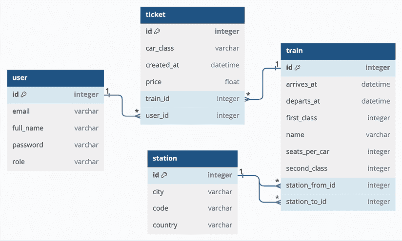
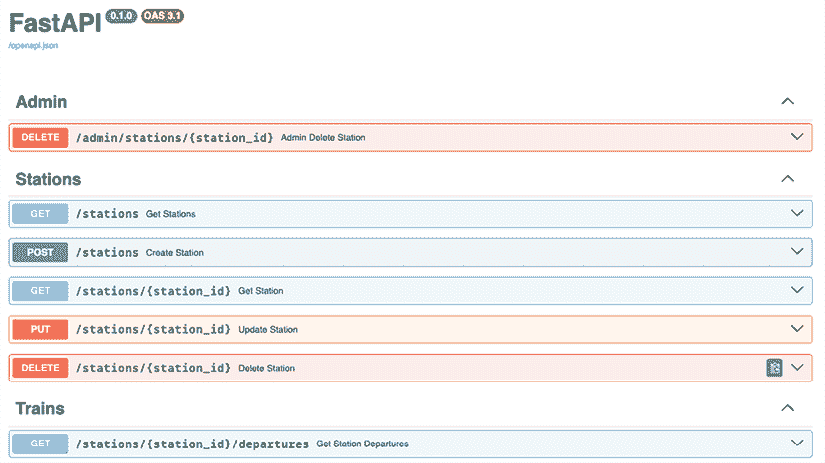

# 14

# API 开发简介

> “有同情心的沟通的唯一目标是帮助他人减少痛苦。”
> 
> – 释达·南欣

在本章中，我们将学习 **应用程序编程接口**（**API**）的概念。

我们将讨论以下内容：

+   HTTP 协议

+   API 设计简介

+   一个完整的 API 示例

我们将简要介绍 HTTP 协议，因为它是我们将构建 API 的基础设施。此外，由于我们将使用的框架 **FastAPI** 广泛使用类型提示，您可能需要确保您已经阅读了 *第十二章，类型提示简介*，作为先决条件。

在对 API 进行简短的一般介绍之后，我们将向您展示一个铁路项目，您可以在本章的源代码中找到其完整状态，包括其需求和一份 README 文件，该文件解释了您运行 API 和查询 API 所需要了解的所有内容。

FastAPI 已被证明是这个项目的最佳选择。得益于其功能，我们能够创建一个具有清晰、简洁和表达性的 API。我们相信它是一个很好的起点，让您探索和扩展。

作为一名开发者，在您的职业生涯中某个时刻，您很可能需要处理 API。技术和框架不断演变，因此我们建议您也关注我们将要介绍的理论概念，因为这种知识将帮助您减少对任何特定框架或库的依赖。

让我们从 HTTP 开始。

# 超文本传输协议

**万维网**（**WWW**）或简单地称为 **Web**，是一种使用 **互联网** 访问信息的方式。互联网是一个庞大的网络网络，是一个网络基础设施。其目的是连接全球数十亿设备，使它们能够相互通信。信息通过互联网以丰富的语言（称为 **协议**）传输，这些协议允许不同的设备共享内容。

互联网是一个信息共享模型，建立在互联网之上，它使用 **超文本传输协议**（**HTTP**）作为数据通信的基础。因此，万维网只是互联网上信息交换的几种方式之一；电子邮件、即时消息、新闻组等等，都依赖于不同的协议。

## HTTP 是如何工作的？

HTTP 是一种非对称的 **请求-响应** **客户端-服务器** 协议。一个 HTTP 客户端——例如，您的网页浏览器——向 HTTP 服务器发送一个请求消息。服务器反过来返回一个响应消息。HTTP 主要是一种 **基于拉取的协议**，这意味着客户端从服务器拉取信息，而不是服务器推送给客户端。有一些在 HTTP 上实现的技巧可以模拟基于推送的行为，例如长轮询、WebSocket 和 HTTP/2 服务器推送。尽管如此，HTTP 的基础仍然是一个基于拉取的协议，其中客户端是发起请求的一方。请看图 *14.1*：


图 14.1：HTTP 协议的简化表示

HTTP 通过 **传输控制协议/互联网协议**（**TCP/IP**）传输，它为在互联网上进行可靠的通信交换提供了工具。

HTTP 协议的一个重要特性是它是 **无状态的**。这意味着当前请求不知道之前请求发生了什么。这种技术限制存在合理的理由，但很容易克服。在实践中，大多数网站都提供了“登录”功能，以及从一页到另一页携带状态的错觉。当用户登录到网站时，会保存一个用户信息的令牌（通常在客户端，在称为 **cookies** 的特殊文件中），这样用户发出的每个请求都携带了服务器识别用户并提供定制界面的手段，例如显示他们的名字，保持购物车内容，等等。

HTTP 定义了一组方法——也称为 *动词* ——来指示对给定资源要执行的操作。每个方法都不同，但其中一些方法有一些共同的特征。特别是，我们将在我们的 API 中使用以下方法：

+   **GET**：`GET` 方法请求指定资源的表示。使用 `GET` 的请求应仅用于检索数据。

+   **POST**：`POST` 方法用于向指定的资源提交一个实体，通常会导致服务器状态的变化或副作用。

+   **PUT**：`PUT` 方法请求目标资源使用请求中封装的表示创建或更新其状态。

+   **DELETE**：`DELETE` 方法请求目标资源删除其状态。

其他方法有 `HEAD`、`CONNECT`、`OPTIONS`、`TRACE` 和 `PATCH`。关于所有这些方法的全面解释，请参阅 [`developer.mozilla.org/en-US/docs/Web/HTTP`](https://developer.mozilla.org/en-US/docs/Web/HTTP)。

我们将要编写的 API 将通过 HTTP 工作，这意味着我们将编写代码来执行和处理 HTTP 请求和响应。从现在起，我们将不再在“请求”和“响应”这两个词前加上“HTTP”，因为我们相信不会引起任何混淆。

## 响应状态码

关于 HTTP 响应，有一件事需要知道的是，它们包括一个状态码，以简洁的方式表达请求的结果。状态码由一个数字和简短描述组成，例如，*404 未找到*。您可以在[`developer.mozilla.org/en-US/docs/Web/HTTP/Status`](https://developer.mozilla.org/en-US/docs/Web/HTTP/Status)上查看完整的 HTTP 状态码列表。

状态码是这样分类的：

+   1xx 信息响应：请求已接收，继续处理。

+   2xx 成功：请求已成功接收、理解和接受。

+   3xx 重定向：需要采取进一步的操作以完成请求。

+   4xx 客户端错误：请求包含错误的语法或无法满足。

+   5xx 服务器错误：服务器未能满足有效的请求。

在使用 API 时，我们将在响应中接收到状态码，因此您至少应该了解它们的意义。

# API – 简介

在我们深入探讨本章具体项目的细节之前，让我们花一点时间来谈谈 API 的一般情况。

## 什么是 API？

正如我们在本章开头提到的，API 代表**应用程序编程接口**。API 是一套规则、协议和工具，用于构建软件和应用程序。它充当计算机或计算机程序之间的连接层。相比之下，用户界面在计算机和人们之间提供桥梁。

一个 API 通常伴随着一份*规范文档*或*标准*，它作为蓝图概述了软件组件应该如何交互。符合规范的系统被称为实现了或公开了 API。术语 API 可以描述实现和规范。

从本质上讲，API 定义了开发人员可以使用的方法和数据格式来与程序、网络服务或任何其他软件进行交互。

从广义上讲，API 有两种类型：

+   Web API：可通过互联网访问，通常用于使 Web 应用程序能够相互交互或与后端服务器交互。它们是 Web 开发的骨架，使诸如从服务器获取数据、发布数据或与第三方服务（如媒体平台、支付网关等）集成等功能成为可能。

+   框架和软件库：这些提供了一组执行特定任务的函数和过程，并通过为开发人员提供构建块来加速应用程序开发。

在本章中，我们将重点关注 Web API。

一个 API 通常由不同的部分组成。这些部分有不同的名称，其中最常见的是*方法*、*子程序*或*端点*（在本章中我们将称其为端点）。当我们使用这些部分时，这个技术的术语是*调用*它们。

API 规范指导你如何调用每个端点，要发送什么类型的请求，传递哪些参数和头信息，要到达哪些地址，等等。

## API 的目的是什么？

在系统中引入 API 有几个原因。我们已经提到的一个原因是创建不同应用程序之间通信的手段。

另一个重要原因是，通过提供一个外部世界可以与之通信的系统层的访问权限，来提供对系统的访问。

API 层通过执行用户的**认证**和**授权**，以及所有在通信中交换的数据的**验证**来负责安全。

*认证*意味着系统可以验证用户凭据，明确地识别他们。*授权*意味着系统可以验证用户可以访问的内容。

用户、系统和数据在边境进行检查和验证，如果通过检查，他们就可以通过 API 与系统的其余部分进行交互。

这个机制在概念上类似于在机场降落并需要向边境控制出示我们的护照才能与系统（即我们降落的该国）进行交互。

API 层隐藏系统内部结构对外部世界的这一事实提供了另一个好处：如果内部系统在技术、语言或甚至工作流程方面发生变化，API 可以调整其与系统交互的方式，但仍然向公众提供一致的接口。如果我们把一封信放入信箱，我们不需要知道或控制邮政服务如何处理它，只要信件到达目的地即可。因此，接口（信箱）保持一致，而另一边（邮递员、他们的车辆、技术、工作流程等）可以自由地改变和进化。

我们今天拥有的几乎所有连接到网络的电子设备都在与（可能广泛的）一系列 API 进行通信以执行其任务，这并不令人惊讶。

## API 协议

有几种类型的 API。它们可以是公开的，也可以是私有的。它们可以提供对数据、服务或两者的访问。API 可以使用不同的方法和标准编写和设计，并且可以采用不同的协议。

这些是最常见的协议：

+   **超文本传输协议/安全（HTTP/HTTPS**）：Web 数据通信的基础。

+   **表征状态转移（REST**）：技术上不是一个协议，而是一种在 HTTP 之上构建的架构类型，按照这种风格设计的 API 被称为 RESTful API。它们是无状态的，并且能够利用数据缓存。

+   **简单对象访问协议（SOAP**）：一个建立已久的用于构建 Web 服务的协议，其消息通常是 XML 格式的，其规范相当严格，这就是为什么这个协议适用于需要高安全标准和交易可靠性的情况。

+   **GraphQL**：一种用于 API 的查询语言，它使用类型系统来定义数据。与 REST 不同，GraphQL 使用单个端点允许客户端获取他们需要的仅有的数据。

+   **WebSocket**：非常适合需要客户端和服务器之间双向通信以及实时数据更新的应用程序。它们通过单个 TCP 连接提供全双工通信。

+   **远程过程调用 (RPC)**：它允许程序员通过远程调用一个过程（因此得名）在服务器端执行代码。这些 API 与服务器实现紧密耦合，因此它们通常不用于公共消费。

## API 数据交换格式

我们说过，API 是至少两个计算机系统之间的接口。在与其他系统接口时，必须将数据格式化为它们实现的任何格式，这将是相当不切实际的。因此，提供系统之间通信层的 API 不仅指定了通信协议，还指定了可以采用的数据交换格式。

今天最常见的数据交换格式是**JSON**、**XML**和**YAML**。我们在*第八章，文件和数据持久性*中看到了 JSON，我们也将使用它作为本章 API 的格式。JSON 今天被许多 API 广泛采用，许多框架提供将数据从 JSON 转换为 JSON 以及从 JSON 转换为其他格式的功能。

# 铁路 API

现在我们已经对 API 有了实际的知识，让我们转向更具体的内容。

在我们向您展示代码之前，请允许我们强调，这段代码不是生产就绪的，因为如果要在书籍的章节中展示，这将太长且过于复杂。然而，这段代码是完全功能性的，它应该为你提供一个良好的起点来学习更多，特别是如果你对其进行实验。我们将在本章末尾提供如何做到这一点的建议。

我们有一个数据库，其中包含一些实体，这些实体模拟了一个铁路应用程序。我们希望允许外部系统对数据库执行**CRUD**操作，因此我们将编写一个 API 作为其接口。

**CRUD**代表**创建**、**读取**、**更新**和**删除**。这是四个基本的数据库操作。许多 HTTP 服务也通过 REST 或类似 REST 的 API 来模拟 CRUD 操作。

让我们先看看项目文件，这样你就可以知道它们在哪里。你可以在本章的文件夹中找到它们，在源代码中：

```py
$ tree -a api_code
api_code
├── .env.example
├── api
│   ├── __init__.py
│   ├── admin.py
│   ├── config.py
│   ├── crud.py
│   ├── database.py
│   ├── deps.py
│   ├── models.py
│   ├── schemas.py
│   ├── stations.py
│   ├── tickets.py
│   ├── trains.py
│   ├── users.py
│   └── util.py
├── dummy_data.py
├── main.py
├── queries.md
└── train.db 
```

在`api_code`文件夹中，你可以找到属于 FastAPI 项目的所有文件。主要应用程序模块是`main.py`。我们在代码中留下了`dummy_data.py`脚本，你可以使用它来生成新的`train.db`数据库文件。请确保阅读本章文件夹中的`README.md`，以获取有关如何使用它的说明。我们还为你收集了一组 API 查询，你可以复制并尝试，在`queries.md`中。

在`api`包中，我们有应用程序模块。数据库模型在`models.py`中，用于描述它们的 API 的架构在`schemas.py`中。其他模块的用途可以从它们的名称中看出：`users.py`、`stations.py`、`tickets.py`、`trains.py`和`admin.py`都包含 API 相应端点的定义。`util.py`包含一些实用函数；`deps.py`定义依赖提供者；`config.py`包含配置设置；`crud.py`包含在数据库上执行 CRUD 操作的功能，最后，`.env.example`是你创建`.env`文件的模板，以向应用程序提供设置。

在软件工程中，**依赖注入**是一种设计模式，其中对象接收它所依赖的其他对象，这些对象被称为依赖。负责构建和注入这些依赖的软件被称为*注入器*或*提供者*。因此，依赖提供者是一段创建并提供依赖的软件，这样软件的其他部分就可以使用它，而无需担心创建、设置和销毁它。要了解更多关于这个模式的信息，请参阅这个维基百科页面：

[`en.wikipedia.org/wiki/Dependency_injection`](https://en.wikipedia.org/wiki/Dependency_injection)

## 模型化数据库

在为这个项目准备实体-关系架构时，我们试图设计一些有趣的东西，同时又要简单且易于控制。这个应用程序考虑了四个实体：*Stations*、*Trains*、*Tickets*和*Users*。一列火车是从一个车站到另一个车站的旅程。一张票是火车和用户之间的连接。用户可以是乘客或管理员，根据他们应该能够使用 API 做什么。

在*图 14.2*中，你可以看到数据库的**实体关系**（**ER**）模型。它描述了四个实体以及它们之间的关系：



图 14.2：数据库的 ER 模型

我们使用 SQLAlchemy 定义了数据库模型，并选择了 SQLite 作为 DBMS，以保持简单。

如果你跳过了*第八章，文件和数据持久性*，现在是一个很好的时候去阅读它，因为它将为你提供理解本章项目模型的基础。

让我们看看`models`模块：

```py
# api_code/api/models.py
import hashlib
import os
import secrets
from enum import StrEnum, auto
from sqlalchemy import (
    DateTime,
    Enum,
    ForeignKey,
    Unicode,
)
from sqlalchemy.orm import mapped_column, relationship, Mapped
from .database import Base
UNICODE_LEN = 128
SALT_LEN = 64
# Enums
class Classes(StrEnum):
    first = auto()
    second = auto()
class Roles(StrEnum):
    admin = auto()
    passenger = auto() 
```

如往常一样，在模块顶部，我们导入所有必要的组件。然后我们定义了几个变量来表示 Unicode 字段的默认长度（`UNICODE_LEN`）和用于散列密码的盐的长度（`SALT_LEN`）。

要回顾一下盐的定义，请参阅*第九章，密码学和令牌*。

我们还定义了两个枚举：`Classes` 和 `Roles`，这些枚举将在模型定义中使用。我们使用了 Python 3.11 中引入的`StrEnum`类作为基类，这使得可以直接将枚举成员与字符串进行比较。`auto()`函数会自动为`Enum`属性生成值。对于`StrEnum`，它将值设置为属性名称的小写版本。

让我们看看`Station`模型的定义：

```py
# api_code/api/models.py
class Station(Base):
    __tablename__ = "station"
    id: Mapped[int] = mapped_column(primary_key=True)
    code: Mapped[str] = mapped_column(
        Unicode(UNICODE_LEN), unique=True
    )
    country: Mapped[str] = mapped_column(Unicode(UNICODE_LEN))
    city: Mapped[str] = mapped_column(Unicode(UNICODE_LEN))
    departures: Mapped[list["Train"]] = relationship(
        foreign_keys="[Train.station_from_id]",
        back_populates="station_from",
    )
    arrivals: Mapped[list["Train"]] = relationship(
        foreign_keys="[Train.station_to_id]",
        back_populates="station_to",
    )
    def __repr__(self):
        return f"<{self.code}: id={self.id} city={self.city}>"
    __str__ = __repr__ 
```

`Station`模型相当简单。有几个属性：`id`作为主键，然后是`code`、`country`和`city`，这些属性（当结合使用时）告诉我们关于站点的所有需要知道的信息。有两个关系将站点实例与所有从该站点出发和到达的火车联系起来。其余的代码定义了`__repr__()`方法，它为实例提供字符串表示形式，并且其实现也被分配给`__str__()`，所以无论我们调用`str(station_instance)`还是`repr(station_instance)`，输出都将相同。这种技术相当常见，用于防止代码重复。

注意，我们在`code`字段上定义了一个唯一约束，以确保数据库中不会存在两个具有相同代码的站点。像罗马、伦敦和巴黎这样的大城市有多个火车站，所以对于位于同一城市的站点，`city` 和 `country` 字段可以相同，但每个站点都必须有自己的唯一`code`。

接着，我们找到了`Train`模型的定义：

```py
# api_code/api/models.py
class Train(Base):
    __tablename__ = "train"
    id: Mapped[int] = mapped_column(primary_key=True)
    name: Mapped[str] = mapped_column(Unicode(UNICODE_LEN))
    station_from_id: Mapped[int] = mapped_column(
        ForeignKey("station.id")
    )
    station_from: Mapped["Station"] = relationship(
        foreign_keys=[station_from_id],
        back_populates="departures",
    )
    station_to_id: Mapped[int] = mapped_column(
        ForeignKey("station.id")
    )
    station_to: Mapped["Station"] = relationship(
        foreign_keys=[station_to_id],
        back_populates="arrivals",
    )
    departs_at: Mapped[DateTime] = mapped_column(
        DateTime(timezone=True)
    )
    arrives_at: Mapped[DateTime] = mapped_column(
        DateTime(timezone=True)
    )
    first_class: Mapped[int] = mapped_column(default=0)
    second_class: Mapped[int] = mapped_column(default=0)
    seats_per_car: Mapped[int] = mapped_column(default=0)
    tickets: Mapped[list["Ticket"]] = relationship(
        back_populates="train"
    )
    def __repr__(self):
        return f"<{self.name}: id={self.id}>"
    __str__ = __repr__ 
```

在`Train`模型中，我们找到了描述火车实例所需的所有属性，以及一个方便的关系`tickets`，它使我们能够访问针对火车的所有已创建的票。`first_class`和`second_class`字段表示火车有多少个一等和二等车厢。

我们还添加了与站点实例的关系：`station_from` 和 `station_to`。这些关系使我们能够以对象的形式获取站点实例，而不仅仅是它们的 ID。

接下来是`Ticket`模型：

```py
# api_code/api/models.py
class Ticket(Base):
    __tablename__ = "ticket"
    id: Mapped[int] = mapped_column(primary_key=True)
    created_at: Mapped[DateTime] = mapped_column(
        DateTime(timezone=True)
    )
    user_id: Mapped[int] = mapped_column(ForeignKey("user.id"))
    user: Mapped["User"] = relationship(
        foreign_keys=[user_id], back_populates="tickets"
    )
    train_id: Mapped[int] = mapped_column(ForeignKey("train.id"))
    train: Mapped["Train"] = relationship(
        foreign_keys=[train_id], back_populates="tickets"
    )
    price: Mapped[float] = mapped_column(default=0)
    car_class: Mapped[Enum] = mapped_column(Enum(Classes))
    def __repr__(self):
        return (
            f"<id={self.id} user={self.user} train={self.train}>"
        )
    __str__ = __repr__ 
```

`Ticket`也有一些属性，并包括两个关系：`user`和`train`，分别指向购买票的用户和票对应的火车。

注意我们在`car_class`属性的定义中使用了`Classes`枚举。这对应于数据库模式定义中的枚举字段。

最后，是`User`模型：

```py
# api_code/api/models.py
class User(Base):
    __tablename__ = "user"
    pwd_separator = "#"
    id: Mapped[int] = mapped_column(primary_key=True)
    full_name: Mapped[str] = mapped_column(
        Unicode(UNICODE_LEN), nullable=False
    )
    email: Mapped[str] = mapped_column(
        Unicode(2 * UNICODE_LEN), unique=True
    )
    password: Mapped[str] = mapped_column(
        Unicode(2 * UNICODE_LEN)
    )
    role: Mapped[Enum] = mapped_column(Enum(Roles))
    tickets: Mapped[list["Ticket"]] = relationship(
        back_populates="user"
    )
    def is_valid_password(self, password: str):
        """Tell if password matches the one stored in DB."""
        salt, stored_hash = self.password.split(
            self.pwd_separator
        )
        _, computed_hash = _hash(
            password=password, salt=bytes.fromhex(salt)
        )
        return secrets.compare_digest(stored_hash, computed_hash)
    @classmethod
    def hash_password(cls, password: str, salt: bytes = None):
        salt, hashed = _hash(password=password, salt=salt)
        return f"{salt}{cls.pwd_separator}{hashed}"
    def __repr__(self):
        return (
            f"<{self.full_name}: id={self.id} "
            f"role={self.role.name}>"
        )
    __str__ = __repr__ 
```

`User`模型为每个用户定义了一些属性。注意这里我们使用了另一个枚举来表示用户的角色。用户可以是乘客或管理员。这将允许我们向您展示一个简单的示例，说明如何编写一个端点，该端点只允许授权用户访问。

`User` 模型上有几个方法用于散列和验证密码。您可能还记得在 *第九章，密码学和令牌* 中提到，密码永远不应该以纯文本形式存储在数据库中（这意味着，正如它们所是的那样）。因此，在我们的 API 中，当为用户保存密码时，我们创建一个散列并将其与用于加密的盐一起存储。在本书的源代码中，您将在本模块的末尾找到 `_hash()` 函数的实现，我们在这里省略了它以节省篇幅。

## 主要设置和配置

现在我们已经了解了数据库模型，让我们检查应用程序的主要入口点：

```py
# api_code/main.py
from api import admin, config, stations, tickets, trains, users
from fastapi import FastAPI
settings = config.Settings()
app = FastAPI()
app.include_router(admin.router)
app.include_router(stations.router)
app.include_router(trains.router)
app.include_router(users.router)
app.include_router(tickets.router)
@app.get("/")
def root():
    return {
        "message": (
            f"Welcome to version {settings.api_version} "
            f"of our API"
        )
    } 
```

这是在 `main.py` 模块中的所有代码。它导入了各种端点模块，并将它们的路由器包含在主应用程序中。通过在主应用程序中包含一个路由器，我们使应用程序能够为使用该特定路由器声明的所有端点提供服务。我们将在本章后面解释什么是路由器。

主模块中只有一个端点，它充当问候消息。端点是一个简单的函数——在这种情况下，`root()` 函数——它包含在对其发起请求时要执行的代码。这个函数何时以及如何被调用取决于应用于函数的装饰器。在这种情况下，`app.get()` 装饰器指示 API 在收到 GET 请求时提供此端点。装饰器接受一个参数来指定端点将提供的 URL 路径。在这里，我们使用 `"/"` 来指定此端点将在根目录下找到，这是应用程序运行的基本 URL。

如果这个 API 在基本 URL `http://localhost:8000` 上提供服务，当请求 `http://localhost:8000` 或 `http://localhost:8000/`（注意尾部的斜杠不同）时，这个端点会被调用。

### 应用程序设置

在最后一段代码的问候消息中，有一个变量 `api_version`，它来自 `settings` 对象。所有框架都允许将设置集合注入到应用程序中以配置其行为。在这个示例项目中，我们实际上并不需要使用设置——我们可以在主模块中直接硬编码这些值——但我们认为展示它们的工作方式是值得的：

```py
# api_code/api/config.py
from pydantic_settings import BaseSettings, SettingsConfigDict
class Settings(BaseSettings):
    model_config = SettingsConfigDict(env_file=".env")
    secret_key: str
    debug: bool
    api_version: str 
```

设置是在 Pydantic 模型中定义的 ([`github.com/pydantic/pydantic`](https://github.com/pydantic/pydantic)). **Pydantic** 是一个提供使用 Python 类型注解进行数据验证的库。Pydantic 的旧版本也提供了设置管理功能，但该功能已被提取到一个名为 `pydantic-settings` 的独立库中 ([`github.com/pydantic/pydantic-settings`](https://github.com/pydantic/pydantic-settings))，该库还增加了额外的设置管理功能。在这种情况下，设置中包含三条信息：

+   `secret_key`：用于签名和验证 JSON Web Tokens (JWT)。

+   `debug`：当设置为`True`时，它指示 SQLAlchemy 引擎详细记录，这对于调试查询很有帮助。

+   `api_version`：API 的版本。我们实际上并没有真正使用这个信息，除了在问候消息中显示它之外，但通常版本起着重要的作用，因为它与特定的 API 规范相关联。

FastAPI 从创建`SettingsConfigDict`实例时指定的`.env`文件中提取这些设置。以下是该文件的外观：

```py
# api_code/.env
SECRET_KEY="018ea65f62337ed59567a794b19dcaf8"
DEBUG=false
API_VERSION=2.0.0 
```

为了使这可行，FastAPI 需要从名为`python-dotenv`的库中获得帮助。它是本章要求的一部分，所以如果你已经在你的虚拟环境中安装了它们，你就准备好了。

## 站点端点

我们将探索一些 FastAPI 端点。因为这个 API 是面向 CRUD 的，所以代码中有些重复。因此，我们将为每个 CRUD 操作展示一个示例，我们将通过使用`Station`端点示例来实现这一点。请参考源代码以探索与其它模型相关的端点。你会发现它们都遵循相同的模式和约定。主要区别是它们与不同的数据库模型相关。

### 读取数据

让我们从一个 GET 请求开始我们的探索。在这种情况下，我们将获取数据库中的所有站点。

```py
# api_code/api/stations.py
from typing import Optional
from fastapi import (
    APIRouter,
    Depends,
    HTTPException,
    Response,
    status,
)
from sqlalchemy.orm import Session
from . import crud
from .deps import get_db
from .schemas import Station, StationCreate, StationUpdate, Train
router = APIRouter(prefix="/stations")
@router.get("", tags=["Stations"])
def get_stations(
    db: Session = Depends(get_db), code: Optional[str] = None
) -> list[Station]:
    return crud.get_stations(db=db, code=code) 
```

在`stations.py`模块中，我们首先从`typing`模块和`fastapi`模块导入必要的对象。我们还从`sqlalchemy`导入`Session`，以及从本地代码库导入一些其他工具。

`get_stations()`端点用`router`对象装饰，而不是像主文件中那样用`app`。`APIRouter`可以被视为一个迷你`FastAPI`类，因为它接受所有相同的参数。我们声明`router`并给它分配一个前缀（在这种情况下是`"/stations"`），这意味着所有用这个`router`装饰的函数都成为可以调用以`http://localhost:8000/stations`开头的地址的端点。在这种情况下，传递给`router.get()`方法的空字符串指示应用程序在这个路由器的根 URL 上提供此端点，这将是基础 URL 和路由器前缀的连接，如上所述。

FastAPI 提供了一些指定从端点返回的数据类型的方法。一种是将`response_model`参数传递给装饰器。然而，在我们的情况下，仅使用类型注解指定函数的返回值就足够了。对于此端点，我们返回一个`Station`实例的列表。我们很快就会看到它们的实现。

`tags`参数用于文档目的。

函数本身接受一些参数，这些参数是一个数据库会话，`db`，以及一个可选的字符串，`code`，当指定时，将指示端点只提供`code`字段与提供的匹配的站点。

几个需要注意的事项：

+   随请求一起发送的数据，如查询参数，在端点声明中指定。如果端点函数需要在请求体中发送数据，则使用 Pydantic 模型（在本项目中，它们在`schemas.py`模块中定义）来指定。

+   端点返回的任何内容都成为响应体。FastAPI 将尝试将返回的数据序列化为 JSON。然而，当设置了响应模型时，序列化首先通过`response_model`中指定的 Pydantic 模型进行，然后从 Pydantic 模型到 JSON。

+   要在端点体中使用数据库会话，我们使用依赖提供者，在这种情况下，使用`Depends`类来指定，我们将`get_db()`函数传递给它。此函数产生一个本地数据库会话，并在端点调用结束时关闭它。

+   我们使用`typing`模块中的`Optional`类来指定请求中的参数是可选的。

`get_stations()`函数的体只是调用来自`crud`模块的同名函数，并返回结果值。所有管理数据库交互的函数都位于`crud.py`模块中。

这是一个设计选择，应该使此代码更容易重用和测试。此外，它简化了读取入口点代码。让我们看看`crud.py`模块中`get_stations()`函数的体：

```py
# api_code/api/crud.py
from datetime import UTC, datetime
from sqlalchemy import delete, select, update
from sqlalchemy.orm import Session, aliased
from . import models, schemas
def get_stations(db: Session, code: str | None = None):
    stm = select(models.Station)
    if code is not None:
        stm = stm.where(models.Station.code.ilike(code))
    return db.scalars(stm).all() 
```

注意这个函数的签名与调用它的端点签名是多么相似。`get_stations()`选择并返回所有`Station`实例，可选地按`code`（如果它不是`None`）过滤。

要启动 API，请激活您的虚拟环境，并在`api_code`文件夹内运行以下命令：

```py
$ uvicorn main:app --reload 
```

**Uvicorn**是一个闪电般的**ASGI 服务器**，基于`uvloop`和`httptools`构建。它与正常和异步函数无缝工作。

从 ASGI 文档页面（[`asgi.readthedocs.io/`](https://asgi.readthedocs.io/)）：

> **ASGI**（**异步服务器网关接口**）是**WSGI**（**Web 服务器网关接口**）的精神继承者，旨在为具有异步能力的 Python 网络服务器、框架和应用程序提供标准接口。
> 
> WSGI 为同步 Python 应用提供了一个标准，ASGI 为异步和同步应用提供了一个标准，具有 WSGI 向后兼容的实现以及多个服务器和应用程序框架。

对于本章的项目，我们选择编写同步代码，因为异步代码会使代码更难以理解。

如果您熟悉编写异步代码，请参阅 FastAPI 文档（[`fastapi.tiangolo.com`](https://fastapi.tiangolo.com)），了解如何编写异步端点。

上面的 `uvicorn` 命令中的 `--reload` 标志配置服务器在文件保存时自动重新加载。这是可选的，但当你正在处理 API 源代码时，它可以节省很多时间。

如果我们调用 `get_stations()` 端点，我们会看到以下内容：

```py
$ http http://localhost:8000/stations
HTTP/1.1 200 OK
content-length: 702
content-type: application/json
date: Thu, 04 Apr 2024 09:46:29 GMT
server: uvicorn
[
    {
        "city": "Rome",
        "code": "ROM",
        "country": "Italy",
        "id": 0
    },
    {
        "city": "Paris",
        "code": "PAR",
        "country": "France",
        "id": 1
    },
    ... some stations omitted ...
    {
        "city": "Sofia",
        "code": "SFA",
        "country": "Bulgaria",
        "id": 11
    }
] 
```

注意我们用来调用 API 的命令：`http`。这是一个随 **Httpie** 工具一起提供的命令。

你可以在 [`httpie.io`](https://httpie.io) 找到 Httpie。Httpie 是一个针对 API 时代的用户友好的命令行 HTTP 客户端。它包含 JSON 支持、语法高亮、持久会话、类似 wget 的下载、插件等功能。还有其他工具可以执行请求，例如 **curl**。选择权在你，因为使用哪个工具从命令行发送请求并没有区别。

默认情况下，API 在 `http://localhost:8000` 上提供服务。如果你愿意，你可以向 `uvicorn` 命令添加参数来自定义这一点。

响应的前几行是来自 API 引擎的信息。我们了解到使用的协议是 HTTP1.1，请求成功（状态码 *200 OK*）。我们还有关于内容长度和类型的详细信息，它是 JSON 类型。最后，我们得到了一个时间戳和服务器类型。从现在开始，我们将省略这些信息中重复的部分。

响应体是一个 `Station` 实例的列表，它们的 JSON 表示形式，这要归功于我们在函数签名中指定的 `list[Station]` 类型注解。

例如，如果我们按 `code` 搜索，比如伦敦车站，我们可以使用以下命令：

```py
$ http http://localhost:8000/stations?code=LDN 
```

上述命令使用与之前相同的 URL，但添加了 `code` 查询参数（用 `?` 与 URL 路径分开）。结果是以下内容：

```py
$ http http://localhost:8000/stations?code=LDN
HTTP/1.1 200 OK
...
[
    {
        "city": "London",
        "code": "LDN",
        "country": "UK",
        "id": 2
    }
] 
```

注意我们得到了一个匹配项，对应于伦敦车站，但仍然以列表的形式返回，正如该端点的类型注解所指示的。

现在我们来探索一个用于通过 ID 获取单个车站的端点：

```py
# api_code/api/stations.py
@router.get("/{station_id}", tags=["Stations"])
def get_station(
    station_id: int, db: Session = Depends(get_db)
) -> Station:
    db_station = crud.get_station(db=db, station_id=station_id)
    if db_station is None:
        raise HTTPException(
            status_code=404,
            detail=f"Station {station_id} not found.",
        )
    return db_station 
```

对于此端点，我们配置路由器以接受 GET 请求，在 URL `http://localhost:8000/stations/{station_id}` 上，其中 `station_id` 将是一个整数。希望 URL 的构建方式对你来说开始变得有意义。有基础部分 `http://localhost:8000`，然后是路由器的前缀 `/stations`，最后是我们提供给每个端点的特定 URL 信息，在这种情况下是 `/{station_id}`。

让我们获取 ID 为 `3` 的基辅车站：

```py
$ http http://localhost:8000/stations/3
HTTP/1.1 200 OK
...
{
    "city": "Kyiv",
    "code": "KYV",
    "country": "Ukraine",
    "id": 3
} 
```

注意这次我们得到了一个单独的对象，而不是像在 `get_stations()` 端点那样被列表包裹。这与该端点的类型注解一致，设置为 `Station`，这是有道理的，因为我们通过 ID 获取单个对象。

`get_station()`函数接受一个`station_id`，类型注解为整数，以及通常的`db`会话对象。使用类型注解来指定参数允许 FastAPI 在我们调用端点时对参数的类型进行数据验证。

如果我们为`station_id`传递一个非整数值，会发生以下情况：

```py
$ http http://localhost:8000/stations/kyiv
HTTP/1.1 422 Unprocessable Entity
...
{
    "detail": [
        {
            "input": "kyiv",
            "loc": [
                "path",
                "station_id"
            ],
            "msg": "Input should be a valid integer, …",
            "type": "int_parsing",
            "url": "https://errors.pydantic.dev/2.6/v/int_parsing"
        }
    ]
} 
```

注意我们不得不缩短错误信息，因为它太长了。FastAPI 响应提供了有用的信息：来自路径的`station_id`不是一个有效的整数。注意，这次状态码是*422 Unprocessable Entity*，而不是*200 OK*。一般来说，四百（*4xx*）的错误表示客户端错误，而五百（*5xx*）的错误表示服务器错误。在这种情况下，我们使用了一个错误的 URL（我们没有使用整数）。因此，这是一个客户端的错误。在其他 API 框架中，相同的场景可能会返回一个简单的*400 Bad Request*状态码，但 FastAPI 返回了奇特的特定状态码*422 Unprocessable Entity*。不过，在 FastAPI 中，很容易自定义在请求错误时返回的状态码；官方文档中有示例。

让我们看看当我们尝试获取一个不存在的 ID 的站点时会发生什么：

```py
$ http http://localhost:8000/stations/100
HTTP/1.1 404 Not Found
...
{
    "detail": "Station 100 not found."
} 
```

这次 URL 是正确的，因为`station_id`是一个整数；然而，没有 ID 为 100 的站点。API 返回了*404 Not Found*状态，正如响应体所告知的。

如果你回到这个端点的代码，你会注意到它的逻辑是多么简单：只要传入的参数是正确的——换句话说，它们尊重类型——它就会尝试通过`crud`模块中的另一个简单函数从数据库中获取相应的站点。如果找不到站点，它将抛出一个带有期望状态码（404）和详细信息的`HTTPException`，希望这能帮助消费者理解出了什么问题。如果找到了站点，则将其返回。返回对象的 JSON 序列化版本的过程是由 FastAPI 自动完成的。从数据库检索到的对象是`Station`类的 SQLAlchemy 实例（`models.Station`）。该实例被喂给 Pydantic 的`Station`类（`schemas.Station`），用于生成随后由端点返回的 JSON 表示。

这可能看起来很复杂，但它是一个优秀的解耦示例。FastAPI 负责工作流程，而我们只需要负责连接：请求参数、响应模型、依赖关系等等。

### 创建数据

现在我们来看一些更有趣的东西：如何创建一个站点。首先，是端点：

```py
# api_code/api/stations.py
@router.post(
    "",
    status_code=status.HTTP_201_CREATED,
    tags=["Stations"],
)
def create_station(
    station: StationCreate, db: Session = Depends(get_db)
) -> Station:
    db_station = crud.get_station_by_code(
        db=db, code=station.code
    )
    if db_station:
        raise HTTPException(
            status_code=400,
            detail=f"Station {station.code} already exists.",
        )
    return crud.create_station(db=db, station=station) 
```

这次，我们指示路由器我们想要接受对根 URL 的 POST 请求（记住：基础部分，加上路由器前缀）。我们将返回类型注解为`Station`，因为端点将返回新创建的对象，我们还指定了响应的默认状态码，即`201 Created`。

`create_station()` 函数接受一个 `db` 会话和一个 `station` 对象。`station` 对象是由我们创建的，在幕后。FastAPI 从请求体中提取数据并将其馈送到 Pydantic 模式 `StationCreate` 。该模式定义了我们需要接收的所有数据，结果是 `station` 对象。

主体中的逻辑遵循以下流程：它尝试使用提供的代码获取一个站点；如果找到了站点，我们无法使用该数据创建一个相同的站点。代码字段被定义为唯一的。因此，使用相同代码创建站点会导致数据库错误。因此，我们返回状态码 *400 Bad Request* ，通知调用者该站点已存在。如果未找到站点，我们可以继续创建它并返回它。让我们看看涉及的 Pydantic 模式的声明：

```py
# api_code/api/schemas.py
from pydantic import BaseModel, ConfigDict
class StationBase(BaseModel):
    code: str
    country: str
    city: str
class Station(StationBase):
    model_config = ConfigDict(from_attributes=True)
    id: int
class StationCreate(StationBase):
    pass 
```

注意我们如何使用继承来定义模式。通常的做法是有一个提供所有子类共同功能的基模式。然后，每个子类分别指定其需求。在这种情况下，在基模式中，我们有 `code`、`country` 和 `city`。在检索站点时，我们还想返回 `id`，所以我们指定了 `Station` 类。此外，由于此类用于转换 SQLAlchemy 对象，我们需要告诉模型关于它的信息，我们通过指定 `model_config` 属性来实现。记住，SQLAlchemy 是一个 **对象关系映射**（**ORM**），因此我们需要告诉模型通过设置 `from_attributes=True` 来读取对象的属性。

`StationCreate` 模型不需要额外内容，所以我们只需使用 `pass` 指令作为主体。

现在让我们看看此端点的 CRUD 函数：

```py
# api_code/api/crud.py
def get_station_by_code(db: Session, code: str):
    return db.scalar(
        select(models.Station).where(
            models.Station.code.ilike(code)
        )
    )
def create_station(
    db: Session,
    station: schemas.StationCreate,
):
    db_station = models.Station(**station.model_dump())
    db.add(db_station)
    db.commit()
    return db_station 
```

`get_station_by_code()` 函数相当简单。它通过在 `code` 上进行不区分大小写的匹配来选择一个 `Station` 对象（`ilike()` 中的“i”前缀表示不区分大小写）。

有其他方法可以进行不区分大小写的比较，而不涉及使用 `ilike`。当性能很重要时，这些可能正是正确的做法，但为了本章的目的，我们发现 `ilike` 的简单性正是我们所需要的。

`create_station()` 函数接受一个 `db` 会话和一个 `StationCreate` 实例。首先，我们以 Python 字典的形式获取站点数据（通过调用 `model_dump()`）。我们知道所有数据都必须在那里；否则，端点已经在初始 Pydantic 验证阶段失败。

使用 `station.model_dump()` 的数据，我们创建了一个 SQLAlchemy `Station` 模型的实例。我们将其添加到数据库中，提交事务，并返回它。请注意，当我们最初创建 `db_station` 对象时，它没有 `id` 属性。`id` 是在将行插入 `stations` 表（在我们调用 `db.commit()` 时发生）时由数据库引擎自动分配的。当调用 `commit()` 时，SQLAlchemy 将自动设置 `id` 属性。

让我们看看这个端点的实际效果。注意我们如何需要指定`POST`到`http`命令，这允许我们在请求体中发送数据，格式为 JSON。之前的请求是 GET 类型，这是`http`命令的默认类型。注意，我们还因为书籍的行长度限制而将命令拆分成了两行：

```py
$ http POST http://localhost:8000/stations \
code=TMP country=Temporary-Country city=tmp-city
HTTP/1.1 201 Created
...
{
    "city": "tmp-city",
    "code": "TMP",
    "country": "Temporary-Country",
    "id": 12
} 
```

我们成功创建了一个站点。现在让我们再次尝试，但这次省略了强制性的代码：

```py
$ http POST http://localhost:8000/stations \
country=Another-Country city=another-city
HTTP/1.1 422 Unprocessable Entity
...
{
    "detail": [
        {
            "input": {
                "city": "another-city",
                "country": "Another-Country"
            },
            "loc": [
                "body",
                "code"
            ],
            "msg": "Field required",
            "type": "missing",
            "url": "https://errors.pydantic.dev/2.6/v/missing"
        }
    ]
} 
```

如预期，我们再次得到了*422 Unprocessable Entity*状态码，因为 Pydantic `StationCreate`模型验证失败，响应体告诉我们原因：请求体中缺少`code`。它还提供了一个有用的链接来查找错误。

### 更新数据

更新站点的逻辑稍微复杂一些。让我们一起来过一遍。首先，端点：

```py
# api_code/api/stations.py
@router.put("/{station_id}", tags=["Stations"])
def update_station(
    station_id: int,
    station: StationUpdate,
    db: Session = Depends(get_db),
):
    db_station = crud.get_station(db=db, station_id=station_id)
    if db_station is None:
        raise HTTPException(
            status_code=404,
            detail=f"Station {station_id} not found.",
        )
    else:
        crud.update_station(
            db=db, station=station, station_id=station_id
        )
        return Response(status_code=status.HTTP_204_NO_CONTENT) 
```

路由被指示监听 PUT 请求，这是您应该用于修改网络资源的类型。URL 以`station_id`结尾，它标识了我们想要更新的站点。该函数接受`station_id`、Pydantic `StationUpdate`实例以及常规的`db`会话。

我们首先从数据库中检索所需的站点。如果站点在数据库中未找到，我们简单地返回*404 Not Found*状态码，因为没有要更新的内容。否则，我们更新站点并返回*204 No Content*状态码，这是对 PUT 请求的常见响应方式。我们也可以返回*200 OK*，但那样的话，我们应该在响应体中返回更新的资源。

站点更新的 Pydantic 模型如下：

```py
# api_code/api/schemas.py
from typing import Optional
class StationUpdate(StationBase):
    code: Optional[str] = None
    country: Optional[str] = None
    city: Optional[str] = None 
```

所有属性都声明为`Optional`，因为我们希望允许调用者只传递他们希望更新的内容。

让我们看看负责更新站点的 CRUD 函数的代码：

```py
# api_code/api/crud.py
def update_station(
    db: Session, station: schemas.StationUpdate, station_id: int
):
    stm = (
        update(models.Station)
        .where(models.Station.id == station_id)
        .values(station.model_dump(exclude_unset=True))
    )
    result = db.execute(stm)
    db.commit()
    return result.rowcount 
```

`update_station()`函数接受识别要更新的站点的必要参数，以及将用于更新数据库中记录的站点数据，以及常规的`db`会话。

我们使用`sqlalchemy`的`update()`辅助函数构建一个语句。我们使用`where()`通过`id`过滤站点，并通过要求 Pydantic 站点对象给我们一个 Python 字典（排除任何未传递给调用的内容）来指定新值。这有助于执行部分更新。如果我们从代码中省略了`exclude_unset=True`，任何未传递的参数最终都会出现在字典中，并设置为默认值（`None`）。

严格来说，我们应该使用 PATCH 请求进行部分更新，但使用 PUT 请求进行完整和部分更新相当常见。

我们执行该语句并返回此操作影响的行数。我们不在端点体中使用此信息，但这对您来说是一个很好的练习。我们将看到如何在删除站点的端点中使用这些信息。

让我们使用上一节中创建的 ID 为`12`的站点的此端点：

```py
$ http PUT http://localhost:8000/stations/12 \
code=SMC country=Some-Country city=Some-city
HTTP/1.1 204 No Content
... 
```

我们得到了预期的结果。让我们验证更新是否成功：

```py
$ http http://localhost:8000/stations/12
HTTP/1.1 200 OK
...
{
    "city": "Some-city",
    "code": "SMC",
    "country": "Some-Country",
    "id": 12
} 
```

对 ID 为`12`的对象的所有三个属性都已更改。现在让我们尝试部分更新：

```py
$ http PUT http://localhost:8000/stations/12 code=xxx
HTTP/1.1 204 No Content
... 
```

这次我们只更新了站点代码。让我们再次验证：

```py
$ http http://localhost:8000/stations/12
HTTP/1.1 200 OK
...
{
    "city": "Some-city",
    "code": "xxx",
    "country": "Some-Country",
    "id": 12
} 
```

如预期，只有`code`被更改。

### 删除数据

最后，让我们探索如何删除一个站点。像往常一样，让我们从端点开始：

```py
# api_code/api/stations.py
@router.delete("/{station_id}", tags=["Stations"])
def delete_station(
    station_id: int, db: Session = Depends(get_db)
):
    row_count = crud.delete_station(db=db, station_id=station_id)
    if row_count:
        return Response(status_code=status.HTTP_204_NO_CONTENT)
    return Response(status_code=status.HTTP_404_NOT_FOUND) 
```

要删除站点，我们指示路由器监听 DELETE 请求。URL 与我们用来获取单个站点以及更新站点的 URL 相同。我们选择的 HTTP 动词触发了正确的端点。`delete_station()`函数接受`station_id`和`db`会话。

在端点的主体内部，我们获取操作影响的行数。在这种情况下，如果有，我们返回一个*204 No Content*状态码，这告诉调用者删除是成功的。如果没有行受到影响，我们返回一个*404 Not Found*状态码。请注意，我们可以像这样编写更新方法，利用受影响的行数，但我们选择了另一种方法，这样你就有不同的例子可以学习。

让我们看看`CRUD`函数：

```py
# api_code/api/crud.py
def delete_station(db: Session, station_id: int):
    stm = delete(models.Station).where(
        models.Station.id == station_id
    )
    result = db.execute(stm)
    db.commit()
    return result.rowcount 
```

此函数使用了来自`sqlalchemy`的`delete()`辅助函数。类似于我们为更新场景所做的那样，我们创建了一个通过 ID 识别站点并指示其删除的语句。我们执行该语句并返回受影响的行数。

让我们看看这个端点在实际场景中的表现，首先是一个成功的场景：

```py
$ http DELETE http://localhost:8000/stations/12
HTTP/1.1 204 No Content
... 
```

我们得到了一个*204 No Content*状态码，这告诉我们删除是成功的。让我们通过再次尝试删除 ID 为`12`的站点来间接验证它。这次我们预计站点将消失，并返回一个*404 Not Found*状态码：

```py
$ http DELETE http://localhost:8000/stations/12
HTTP/1.1 404 Not Found
... 
```

如预期，我们收到了*404 Not Found*状态码，这意味着 ID 为 12 的站点未找到，这证明了删除它的第一次尝试是成功的。`stations.py`模块中还有几个更多端点，你应该检查一下。

我们编写的其他端点用于创建、读取、更新和删除用户、火车和车票。除了它们作用于不同的数据库和 Pydantic 模型之外，它们实际上不会为这个展示带来更多的见解。因此，让我们看看如何验证用户身份的一个例子。

## 用户身份验证

在这个项目中，身份验证是通过 JWT 完成的。请再次参考*第九章，密码学和令牌*，以刷新 JWT 的知识。

让我们从`users.py`模块中的身份验证端点开始：

```py
# api_code/api/users.py
from .util import InvalidToken, create_token, extract_payload
@router.post("/authenticate", tags=["Auth"])
def authenticate(
    auth: Auth,
    db: Session = Depends(get_db),
    settings: Settings = Depends(get_settings),
):
    db_user = crud.get_user_by_email(db=db, email=auth.email)
    if db_user is None:
        raise HTTPException(
            status_code=status.HTTP_404_NOT_FOUND,
            detail=f"User {auth.email} not found.",
        )
    if not db_user.is_valid_password(auth.password):
        raise HTTPException(
            status_code=status.HTTP_401_UNAUTHORIZED,
            detail="Wrong username/password.",
        )
    payload = {
        "email": auth.email,
        "role": db_user.role.value,
    }
    return create_token(payload, settings.secret_key) 
```

此路由器具有前缀`"` `/users"` 。为了验证用户，我们需要向此端点发送 POST 请求。它需要一个 Pydantic `Auth`模式，一个常规的`db`会话，以及`settings`对象，该对象用于提供用于创建令牌的秘密密钥。

如果找不到用户，我们返回`404 Not Found`状态码。如果找到用户，但提供的密码与数据库记录中的密码不匹配，我们返回状态码`401 Unauthorized`。最后，如果找到用户且密码正确，我们创建一个带有两个声明的令牌：`email`和`role`。我们将使用角色来执行授权功能。

`create_token()`函数是`jwt.encode()`的包装器，它还在令牌的有效载荷中添加了几个时间戳。在这里展示那段代码不值得。让我们看看`Auth`模型：

```py
# api_code/api/schemas.py
class Auth(BaseModel):
    email: str
    password: str 
```

我们使用用户的电子邮件（作为用户名）和密码来认证用户。这就是为什么在 SQLAlchemy 的`User`模型中，我们在`email`字段上设置了一个唯一性约束。我们需要每个用户都有一个唯一的用户名，而电子邮件是满足这一需求常用的字段。

让我们练习这个端点：

```py
$ http POST http://localhost:8000/users/authenticate \
email="fabrizio.romano@example.com" password="f4bPassword"
HTTP/1.1 200 OK
...
"eyJhbGciOiJIUzI1NiIsInR5cCI6IkpXVCJ9....01GK4QyzZje8NKMzBBVckc" 
```

我们收到了一个令牌（在片段中省略），因此我们可以使用它。我们认证的用户是管理员，因此我们将向您展示如果我们只想允许管理员这样做，我们如何编写删除端点的代码。让我们看看代码：

```py
# api_code/api/admin.py
from .util import is_admin
router = APIRouter(prefix="/admin")
def ensure_admin(settings: Settings, authorization: str):
    if not is_admin(
        settings=settings, authorization=authorization
    ):
        raise HTTPException(
            status_code=status.HTTP_403_FORBIDDEN,
            detail="You must be admin to access this endpoint.",
        )
@router.delete("/stations/{station_id}", tags=["Admin"])
def admin_delete_station(
    station_id: int,
    authorization: Optional[str] = Header(None),
    settings: Settings = Depends(get_settings),
    db: Session = Depends(get_db),
):
    ensure_admin(settings, authorization)
    row_count = crud.delete_station(db=db, station_id=station_id)
    if row_count:
        return Response(status_code=status.HTTP_204_NO_CONTENT)
    return Response(status_code=status.HTTP_404_NOT_FOUND) 
```

在此示例中，您可以看到端点声明和主体几乎与它们的直观对应物相同，但有一个重要的区别：在尝试删除任何内容之前，我们调用`ensure_admin()`。在端点中，我们需要从请求中获取授权头，它负责携带令牌信息，以便我们可以将其传递给`ensure_admin()`函数。我们通过在函数签名中声明它来实现，作为一个来自`Header`对象的可选字符串。

`ensure_admin()`函数委托给`util.is_admin()`函数，该函数解包令牌，验证其有效性，并检查有效载荷中的`role`字段以查看它是否是管理员。如果所有检查都成功，它返回`True`，否则返回`False`。当检查成功时，`ensure_admin()`函数不执行任何操作，但在检查失败时，它会抛出一个带有`403 Forbidden`状态码的`HTTPException`。这意味着如果由于任何原因用户没有权限执行此调用，端点主体的执行将立即停止并在第一行后返回。

有更复杂的方法来进行身份验证和授权，但将它们包含在章节中是不切实际的。这个简单的例子足以作为入门，了解如何在 API 中实现此功能。

## 记录 API 文档

记录 API 文档是一项繁琐的活动。使用 FastAPI 的一个优点是您不需要记录您的项目：文档由框架自动生成。这是由于使用了类型注解和 Pydantic 才成为可能。

确保您的 API 正在运行，然后打开浏览器并导航到`http://localhost:8000/docs`。将打开一个页面，其外观应类似于以下内容：



图 14.3：FastAPI 自生成的文档的部分截图

在 *图 14.3* 中，你可以看到一个端点列表。它们使用 `tags` 参数进行分类，我们在每个端点声明中指定了该参数。这份文档不仅允许你详细检查每个端点，而且还是交互式的，这意味着你可以通过直接从页面发起请求来测试端点。

# 我们接下来该做什么？

现在，你应该对 API 设计和主要概念有一个基本的了解。当然，研究本章的代码将加深你的理解，并可能引发一些问题。如果你希望在该主题上学习更多，以下是一些建议：

+   学好 FastAPI。网站提供了针对初学者和高级程序员的教程。它们相当详尽，涵盖了比我们能在单个章节中包含的更多内容。

+   使用本章的源代码，通过添加高级搜索和过滤功能来增强 API。尝试实现更复杂的认证系统，并探索使用后台任务、排序和分页。你也可以通过添加仅针对管理员用户的端点来扩展管理部分。

+   修改预订车票的端点，以便检查火车上是否有空座位。每辆火车都指定了有多少个一等和二等车厢，以及每节车厢的座位数。我们特意以这种方式设计火车模型，以便你可以通过这个练习进行练习。

+   为现有的端点添加测试，并为源代码中添加的任何其他内容添加测试。

+   了解 WSGI ([`wsgi.readthedocs.io/`](https://wsgi.readthedocs.io/))，如果你熟悉异步编程，了解 ASGI，它是异步的等效物 ([`asgi.readthedocs.io/`](https://asgi.readthedocs.io/))。

+   了解 FastAPI 中的中间件和像 **跨源资源共享 (CORS**) 这样的概念，这在我们在现实世界中运行 API 时非常重要。

+   了解其他 API 框架，如 Falcon ([`falcon.readthedocs.io/`](https://falcon.readthedocs.io/)) 或 Django Rest Framework ([`www.django-rest-framework.org`](https://www.django-rest-framework.org))。

+   了解更多关于表示状态转移 (REST) 的知识。它无处不在，但使用它编写 API 的方式有很多。

+   了解更多高级 API 概念，例如版本控制、数据格式、协议等。深入了解头部可以做什么。

+   最后，如果你熟悉异步编程，我们建议重写本章的代码，使其异步。

记得在 `.env` 文件中设置 `DEBUG=true`，当与 API 一起工作时，这样你就可以自动将所有数据库查询记录到你的终端中，并检查它们产生的 SQL 代码是否反映了你的意图。当 SQLAlchemy 操作变得稍微复杂一些时，这是一个非常有用的工具。

API 设计是一项如此重要的技能。我们无法强调掌握这一主题的重要性。

# 摘要

在本章中，我们探索了 API 的世界。我们从一个关于 Web 的简要概述开始，然后转向 FastAPI，它利用了类型注解。这些注解在*第十二章，类型提示简介*中介绍。

我们接着以通用术语讨论了 API。我们看到了不同的分类方式，以及它们的使用目的和好处。我们还探讨了协议和数据交换格式。

最后，我们深入研究了源代码，分析了本章我们为该项目编写的 FastAPI 项目的一部分。

我们以一系列下一步的建议结束了本章。

下一章将讨论使用 Python 开发 CLI 应用程序。

# 加入我们的社区 Discord

加入我们的社区 Discord 空间，与作者和其他读者进行讨论：

`discord.com/invite/uaKmaz7FEC`


