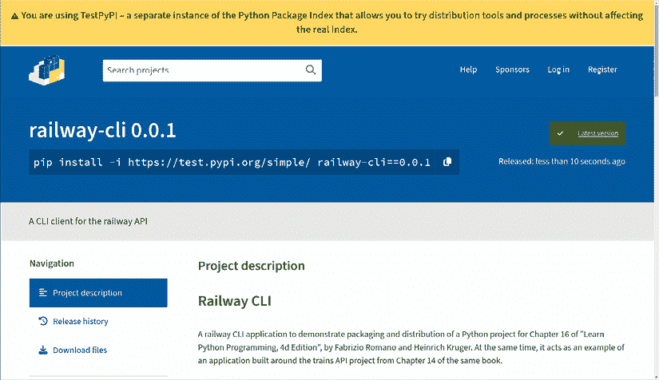

# 16

# 打包 Python 应用程序

> “你总共有任何奶酪吗？”“没有。”
> 
> – 蒙提·派森，"奶酪店"草图

在本章中，我们将学习如何为 Python 项目创建一个可安装的包，并将其发布供他人使用。

有许多原因说明你应该发布你的代码。在*第一章，Python 的温和介绍*中，我们提到 Python 的一个好处是拥有庞大的第三方包生态系统，你可以使用`pip`免费安装这些包。其中大部分都是由像你一样的开发者创建的，通过贡献你自己的项目，你将帮助确保社区持续繁荣。从长远来看，这也有助于改进你的代码，因为将其暴露给更多用户意味着错误可能会更快被发现。最后，如果你试图成为一名软件开发人员，能够指向你参与过的项目将非常有帮助。

了解打包的最佳方式是通过创建包并发布的过程。这正是本章我们将要做的。我们将要工作的项目是在*第十五章，CLI 应用程序*中开发的铁路**命令行界面**（**CLI**）应用程序。

在本章中，我们将学习以下内容：

+   如何为你的项目创建一个发行版包

+   如何发布你的包

+   打包的不同工具

在我们开始打包和发布我们的项目之前，我们将简要介绍**Python 包索引**（**PyPI**）以及 Python 打包的一些重要术语。

# Python 包索引

**PyPI**是一个在线的 Python 包仓库，托管在[`pypi.org`](https://pypi.org) 。它有一个网页界面，可以用来浏览或搜索包，并查看它们的详细信息。它还提供了 API，如`pip`，用于查找和下载安装包。PyPI 对任何人开放，可以免费注册并免费分发他们的项目。任何人也可以免费从 PyPI 安装任何包。

仓库被组织成**项目**、**发布**和**发行包**。一个项目是一个带有其相关数据或资源的库、脚本或应用程序。例如，*FastAPI*、*Requests*、*pandas*、*SQLAlchemy*以及我们的 Railway CLI 应用程序都是项目。`pip`本身也是一个项目。发布是项目的特定版本（或时间点的快照）。发布通过版本号来标识。例如，`pip`的*24.2*版本是`pip`项目的发布。发布以发行包的形式分发。这些是带有发布版本的归档文件，包含构成发布的 Python 模块、数据文件等。发行包还包含有关项目和发布的项目元数据，例如项目名称、作者、发布版本以及需要安装的依赖项。发行包也被称为**distributions**或简称为**packages**。

在 Python 中，单词**package**也用来指代一个可导入的模块，它可以包含其他模块，通常是以包含一个`__init__.py`文件的文件夹形式存在。重要的是不要将这种可导入的包与发行包混淆。在本章中，我们将主要使用术语**package**来指代发行包。在存在歧义的情况下，我们将使用术语**importable package**或**distribution package**。

发行包可以是**源发行包**（也称为**sdists**），在安装之前需要构建步骤，或者**构建发行包**，在安装过程中只需将归档内容移动到正确的位置。源发行包的当前格式最初由 PEP 517 定义。正式规范可以在[`packaging.python.org/specifications/source-distribution-format/`](https://packaging.python.org/specifications/source-distribution-format/)找到。标准的构建发行包格式称为**wheel**，最初在 PEP 427 中定义。当前版本的 wheel 规范可以在[`packaging.python.org/specifications/binary-distribution-format/`](https://packaging.python.org/specifications/binary-distribution-format/)找到。wheel 格式取代了（现在已弃用的）**egg**构建发行包格式。

PyPI 最初被昵称为 Cheese Shop，这个名字来源于我们本章开头引用的著名蒙提·派森素描。因此，轮分布格式并不是以汽车轮子命名，而是以奶酪轮子命名。

为了帮助理解所有这些，让我们快速通过一个例子来看看运行`pip install`时会发生什么。我们将使用`pip`安装`requests`项目的发布版*2.32.3*。为了让我们看到`pip`正在做什么，我们将使用三次`-v`命令行选项，以使输出尽可能详细。我们还将添加`--no-cache`命令行选项，强制`pip`从 PyPI 下载包，而不是使用任何可能本地缓存的包。输出看起来像这样（请注意，我们已经将输出裁剪以适应页面，并省略了多行；你可以在本章源代码文件`pip_install.txt`中找到完整的输出）：

```py
$ pip install -vvv --no-cache requests==2.32.3
Using pip 24.2 from ... (python 3.12)
...
1 location(s) to search for versions of requests:
* https://pypi.org/simple/requests/ 
```

`Pip`告诉我们，它已经在[`pypi.org/simple/requests/`](https://pypi.org/simple/requests/)找到了关于`requests`项目的信息。输出接着列出了`requests`项目的所有可用发行版：

```py
 Found link https://.../requests-0.2.0.tar.gz..., version: 0.2.0
  ...
  Found link https://.../requests-2.32.3-py3-none-any.whl...
    (requires-python:>=3.8), version: 2.32.3
  Found link https://.../requests-2.32.3.tar.gz...
    (requires-python:>=3.8), version: 2.32.3 
```

现在，`pip`收集我们请求的发布版的发行版。它下载 wheel 发行版的元数据：

```py
Collecting requests==2.32.3
  ...
  Downloading requests-2.32.3-py3-none-any.whl.metadata (4.6 kB) 
```

接下来，`pip`从包元数据中提取依赖项列表，并继续以相同的方式查找和收集它们的元数据。一旦找到所有必需的包，就可以下载并安装：

```py
Downloading requests-2.32.3-py3-none-any.whl (64 kB)
...
Installing collected packages: urllib3, ..., certifi, requests
...
Successfully installed ... requests-2.32.3 ... 
```

如果`pip`为任何包下载了源发行版（如果没有合适的 wheel 可用，可能会发生这种情况），在安装之前需要构建该包。

现在我们知道了项目、发布版和包之间的区别，我们可以开始准备发布版，并为铁路 CLI 应用程序构建发行版包。

# 使用 Setuptools 进行打包

我们将使用**Setuptools**库来打包我们的项目。Setuptools 是 Python 最古老的活跃开发打包工具，并且仍然是最受欢迎的。它是原始标准库`distutils`打包系统的扩展。`distutils`模块在 Python 3.10 中被弃用，并在 Python 3.12 中从标准库中移除。

在本节中，我们将探讨如何设置我们的项目以使用 Setuptools 构建包。

## 项目布局

在 Python 项目中布局文件有两种流行的约定：

+   在**src 布局**中，需要分发的可导入包放置在主项目文件夹内的`src`文件夹中。

+   在**扁平布局**中，可导入的包直接放置在顶层项目文件夹中。

`src`布局的优势在于明确指出哪些文件将被包含在发行版中。这减少了意外包含其他文件的可能性，例如仅用于开发期间使用的脚本。然而，`src`布局在开发期间可能不太方便，因为在不首先在虚拟环境中安装发行版的情况下，无法从顶层项目文件夹中的脚本或 Python 控制台导入包。

支持 `src` 布局的倡导者认为，在开发过程中被迫安装发行版包实际上是一种好处，因为它增加了在开发过程中发现创建发行版包错误的可能性。

对于这个项目，我们选择使用 `src` 布局：

```py
$ tree -a railway-project
railway-project
├── .flake8
├── CHANGELOG.md
├── LICENSE
├── README.md
├── pyproject.toml
├── src
│   └── railway_cli
│       ├── __init__.py
│       └── ...
└── test
    ├── __init__.py
    └── test_get_station.py 
```

`src/railway_cli` 文件夹包含了 `railway_cli` 可导入包的代码。我们还在 `test` 文件夹中添加了一些测试，作为您扩展的示例。`.flake8` 文件包含了 `flake8` 的配置，`flake8` 是一个 Python 代码风格检查器，可以帮助指出我们代码中的 PEP 8 违规。

我们将在下面更详细地描述剩余的每个文件。在此之前，让我们看看如何在开发过程中在虚拟环境中安装项目。

### 开发安装

与 `src` 布局一起工作的最常见方法是使用 **开发安装**，也称为 **开发模式**，或 **可编辑安装**。这将构建并安装项目的 wheel。然而，它不会将代码复制到虚拟环境中，而是在虚拟环境中添加一个指向项目文件夹中源代码的链接。这允许您像安装一样导入和运行代码，但您对代码所做的任何更改都将生效，而无需重新构建和重新安装。

让我们现在尝试一下。打开一个控制台，转到本章的源代码文件夹，创建一个新的虚拟环境，激活它，并运行以下命令：

```py
$ pip install -e railway-project
Obtaining file:///.../ch16/railway-project
  Installing build dependencies ... done
  Checking if build backend supports build_editable ... done
  Getting requirements to build editable ... done
  Preparing editable metadata (pyproject.toml) ... done
...
Building wheels for collected packages: railway-cli
  Building editable for railway-cli (pyproject.toml) ... done
  Created wheel for railway-cli: filename=...
  ...
Successfully built railway-cli
Installing collected packages: ... railway-cli
Successfully installed ... railway-cli-0.0.1 ... 
```

如输出所示，当我们使用 `-e`（或 `--editable`）选项运行 `pip install` 并给它项目文件夹的路径时，它会构建一个可编辑的 wheel 并将其安装在虚拟环境中。

现在，如果您运行：

```py
$ python -m railway_cli 
```

它应该像上一章中那样工作。您可以通过在代码中更改某些内容（例如，添加一个 `print()` 语句）并再次运行来验证我们确实有一个可编辑的安装。

现在我们已经有一个可工作的可编辑项目安装，让我们更详细地讨论项目文件夹中的每个文件。

### 更新日志

虽然这不是必需的，但包含一个变更日志文件与您的项目一起被认为是良好的实践。此文件总结了项目每个版本中进行的更改。变更日志对于通知您的用户新功能或他们需要了解的软件行为变化非常有用。

我们的更新日志文件名为 `CHANGELOG.md`，并使用 **Markdown** 格式编写。

### 许可证

您应该包含一个定义您的代码分发条款的许可证。有许多软件许可证可供选择。如果您不确定选择哪个，[`choosealicense.com/`](https://choosealicense.com/) 网站是一个有用的资源，可以帮助您。然而，如果您对法律后果有任何疑问，或需要建议，您应该咨询法律专业人士。

我们在 MIT 许可证下分发我们的铁路 CLI 项目。这是一个简单的许可证，允许任何人使用、分发或修改代码，只要他们包含我们的原始版权声明和许可证。

按照惯例，许可证包含在一个名为`LICENSE`或`LICENSE.txt`的文本文件中，尽管一些项目也使用其他名称，例如`COPYING`。

### README

您的项目还应包含一个*README*文件，描述项目内容、项目存在的原因以及一些基本的使用说明。该文件可以是纯文本格式，也可以使用如**reStructuredText**或**Markdown**这样的标记语法。如果是一个纯文本文件，通常命名为`README`或`README.txt`，如果是 reStructuredText，则命名为`README.rst`，如果是 Markdown，则命名为`README.md`。

我们的`README.md`文件包含一个简短的段落，描述了项目的目的和一些简单的使用说明。

Markdown 和 reStructuredText 是广泛使用的标记语言，旨在易于以原始形式阅读或编写，但也可以轻松转换为 HTML 以创建简单的网页。您可以在[`daringfireball.net/projects/markdown/`](https://daringfireball.net/projects/markdown/)和[`docutils.sourceforge.io/rst.html`](https://docutils.sourceforge.io/rst.html)上了解更多关于它们的信息。

### pyproject.toml

该文件由 PEP 518（[`peps.python.org/pep-0518/`](https://peps.python.org/pep-0518/)）引入并由 PEP 517（[`peps.python.org/pep-0517/`](https://peps.python.org/pep-0517/)）扩展。这些 PEP 的目标是定义标准，以便项目可以指定它们的构建依赖项以及用于构建它们的包的构建工具。对于使用 Setuptools 的项目，这看起来是这样的：

```py
# railway-project/pyproject.toml
[build-system]
requires = ["setuptools>=66.1.0", "wheel"]
build-backend = "setuptools.build_meta" 
```

在这里，我们指定了至少需要 Setuptools 的 66.1.0 版本（这是与 Python 3.12 兼容的最旧版本）以及`wheel`项目的任何版本，`wheel`项目是轮分布格式的参考实现。请注意，这里的`requires`字段不列出运行我们的代码的依赖项，只列出构建分发包的依赖项。我们将在本章后面讨论如何指定运行我们的项目的依赖项。

`build-backend`字段指定了将用于构建包的 Python 对象。对于 Setuptools，这是`setuptools`（可导入）包中的`build_meta`模块。

PEP 518 还允许您在`pyproject.toml`文件中放置其他开发工具的配置。当然，相关的工具也需要支持从该文件中读取它们的配置：

```py
# railway-project/pyproject.toml
[tool.black]
line-length = 66
[tool.isort]
profile = 'black'
line_length = 66 
```

我们在我们的`pyproject.toml`文件中添加了*black*（一个流行的代码格式化工具）和*isort*（一个按字母顺序排序导入的工具）的配置。我们已将这两个工具配置为使用 66 个字符的行长度，以确保我们的代码可以适应书页。我们还配置了`isort`以与`black`保持兼容。

你可以在它们的网站上了解更多关于 `black` 和 `isort` 的信息：[`black.readthedocs.io/`](https://black.readthedocs.io/) 和 [`pycqa.github.io/isort`](https://pycqa.github.io/isort) 。

PEP 621 ([`peps.python.org/pep-0621/`](https://peps.python.org/pep-0621/)) 引入了在 `pyproject.toml` 文件中指定所有项目元数据的能力。这自 Setuptools 61.0.0 版本以来一直得到支持。我们将在下一节中详细探讨这一点。

## 包元数据

项目元数据定义在 `pyproject.toml` 文件中的 `project` 表格中。让我们一次查看几个条目：

```py
# railway-project/pyproject.toml
[project]
name = "railway-cli"
authors = [
  {name="Heinrich Kruger", email="heinrich@example.com"},
  {name="Fabrizio Romano", email="fabrizio@example.com"},
] 
```

表格从 `[项目]` 标题开始。我们的前两个元数据条目包括我们项目的 `名称` 和作者名单，包括姓名和电子邮件地址。在这个示例项目中，我们使用了假电子邮件地址，但在实际项目中，你应该使用你的真实电子邮件地址。

PyPI 要求所有项目都必须有唯一的名称。在你开始项目时检查这一点是个好主意，以确保没有其他项目已经使用了你想要的名称。还建议确保你的项目名称不会轻易与其他项目混淆；这将减少任何人意外安装错误包的可能性。

`项目` 表格中的下一个条目是我们项目的描述：

```py
# railway-project/pyproject.toml
[project]
...
description = "A CLI client for the railway API"
readme = "README.md" 
```

`description` 字段应该是项目的简短、单句总结，而 `readme` 应该指向包含更详细描述的 README 文件。

`readme` 也可以指定为 TOML 表格，在这种情况下，它应该包含一个 `content-type` 键，以及一个带有 README 文件路径的 `file` 键或一个带有完整 README 文本的 `text` 键。

项目许可证也应指定在元数据中：

```py
# railway-project/pyproject.toml
[project]
...
license = {file = "LICENSE"} 
```

`license` 字段是一个 TOML 表格，包含一个带有项目许可证文件路径的 `file` 键，或者一个带有许可证全文的 `text` 键。

下几个元数据条目旨在帮助潜在用户在 PyPI 上找到我们的项目：

```py
# railway-project/pyproject.toml
[project]
...
classifiers = [
    "Environment :: Console",
    "License :: OSI Approved :: MIT License",
    "Operating System :: MacOS",
    "Operating System :: Microsoft :: Windows",
    "Operating System :: POSIX :: Linux",
    "Programming Language :: Python :: 3",
    "Programming Language :: Python :: 3.10",
    "Programming Language :: Python :: 3.11",
    "Programming Language :: Python :: 3.12",
]
keywords = ["packaging example", "CLI"] 
```

`classifiers` 字段可以用来指定一个 *trove 分类器* 列表，这些分类器用于在 PyPI 上对项目进行分类。PyPI 网站允许用户在搜索项目时通过 trove 分类器进行筛选。你的项目分类器必须从 [`pypi.org/classifiers/`](https://pypi.org/classifiers/) 上的官方分类器列表中选择。

我们使用了分类器来表明我们的项目旨在在控制台环境中使用，它是在 MIT 许可证下发布的，它可以在 macOS、Windows 和 Linux 上运行，并且与 Python 3 兼容（具体为 3.10、3.11 和 3.12 版本）。请注意，分类器纯粹是为了向用户提供信息并帮助他们找到 PyPI 网站上的项目。它们对您的软件包可以安装的操作系统或 Python 版本没有影响。

`keywords`字段可以用来提供额外的关键词，以帮助用户找到您的项目。与分类器不同，对您可以使用的关键词没有限制。

### 版本控制和动态元数据

项目元数据必须包含一个版本号。我们选择将版本作为一个**动态字段**来指定，而不是直接指定版本（通过`version`键）。`pyproject.toml`规范允许指定除`name`之外的所有项目元数据，由其他工具动态指定。动态字段的名称通过`dynamic`键指定：

```py
# railway-project/pyproject.toml
[project]
...
dynamic = ["version"] 
```

要使用与 Setuptools 兼容的动态元数据，我们需要使用`tool.setuptools.dynamic`表来指定如何计算值。`version`可以从文件中读取（使用带有`file`键的表指定）或从 Python 模块中的属性中读取（使用带有`attr`键的表指定）。对于本项目，我们从`railway_cli`可导入包的`__version__`属性中获取版本：

```py
# railway-project/pyproject.toml
[tool.setuptools.dynamic]
version = {"attr" = "railway_cli.__version__"} 
```

`__version__`属性在`railway_cli/__init__.py`文件中定义：

```py
# railway-project/src/railway_cli/__init__.py
__version__ = "0.0.1" 
```

使用动态字段意味着我们可以在代码和项目元数据中使用相同的版本号，而无需定义两次。

您可以选择适合您项目的任何版本控制方案，但它必须遵守 PEP 440（[`peps.python.org/pep-0440/`](https://peps.python.org/pep-0440/)）中定义的规则。一个 PEP 440 兼容的版本由一系列由点分隔的数字组成，后面可以跟有可选的预发布、发布后或开发版本指示符。预发布指示符可以由字母`a`（表示*alpha*）、`b`（表示*beta*）或`rc`（表示*release-candidate*）后跟一个数字组成。发布后指示符由单词`post`后跟一个数字组成。开发版本指示符由单词`dev`后跟一个数字组成。没有发布指示符的版本号被称为*final*发布。例如：

+   `1.0.0.dev1` 是我们项目 1.0.0 版本的第一个开发版本。

+   `1.0.0.a1` 是第一个 alpha 版本。

+   `1.0.0.b1` 是第一个 beta 版本。

+   `1.0.0.rc1` 是第一个发布候选版本。

+   `1.0.0` 是 1.0.0 版本的最终发布版本。

+   `1.0.0.post1` 是第一个发布后版本。

开发版本、预发布版本、最终发布版本和发布后版本，如果主版本号相同，它们的顺序如上列表所示。

流行的版本控制方案包括**语义版本控制**，该方案旨在通过版本控制方案传达关于发布之间兼容性的信息，以及**基于日期的版本控制**，通常使用发布的年份和月份来表示版本。

语义版本控制使用由三个数字组成的版本号，称为*主版本*、*次版本*和*修订版本*，由点分隔。这导致了一个看起来像`major.minor.patch`的版本。如果一个新版本与其前一个版本完全兼容，则只增加修订号；通常，这样的版本只包含小的错误修复。对于添加新功能而不破坏与先前版本兼容性的版本，应增加次版本号。如果发布版本与旧版本不兼容，则应增加主版本号。您可以在[`semver.org/`](https://semver.org/)上了解有关语义版本控制的全部内容。

### 指定依赖项

正如我们在本章开头所看到的，一个发行版包可以提供一个它所依赖的项目列表，并且`pip`在安装包时会确保安装这些项目的版本。这些依赖项应在`project`表的`dependencies`键中指定：

```py
# railway-project/pyproject.toml
[project]
...
dependencies = [
    "pydantic[email]>=2.8.2,<3.0.0",
    "pydantic-settings~=2.4.0",
    "requests~=2.0",
] 
```

我们的项目依赖于`pydantic`、`pydantic-settings`和`requests`项目。方括号中的`[email]`单词表示`pydantic`依赖项还要求一些与处理电子邮件地址相关的`pydantic`项目的可选依赖项。我们将在稍后更详细地讨论可选依赖项。

我们可以使用**版本指定符**来指示我们需要的依赖项的版本。除了正常的 Python 比较运算符之外，版本指定符还可以使用`~=`来指示一个*兼容版本*。兼容版本指定符是一种表示在语义版本控制方案下可能兼容的版本的方式。例如，`requests~=2.0`表示我们需要`requests`项目的任何 2.x 版本，从 2.0 到 3.0（不包括 3.0）。版本指定符还可以接受一个逗号分隔的版本子句列表，必须满足所有这些子句。例如，`pydantic>=2.8.2,<3.0.0`表示我们想要至少`pydantic`版本 2.8.2，但不能是版本 3.0.0 或更高版本。请注意，这与`pydantic~=2.8.2`不同，后者意味着至少版本 2.8.2，但不能是版本 2.9.0 或更高版本。有关依赖项语法和版本匹配的完整细节，请参阅 PEP 508（[`peps.python.org/pep-0508/`](https://peps.python.org/pep-0508/)）。

您应该小心不要使您的依赖项版本指定过于严格。请记住，您的包可能将与同一虚拟环境中的各种其他包一起安装。这对于库或开发者工具尤其如此。在您的依赖项所需版本上尽可能提供最大自由度意味着，依赖于您的项目不太可能遇到您的包与其他项目依赖项之间的依赖项冲突。使您的版本指定过于严格还意味着，除非您也发布新版本来更新您的版本指定，否则您的用户将无法从您的依赖项中的错误修复或安全补丁中受益。

除了对其他项目的依赖项之外，您还可以指定您的项目需要哪些版本的 Python。在我们的项目中，我们使用了 Python 3.10 中添加的功能，因此我们指定至少需要 Python 3.10：

```py
# railway-project/pyproject.toml
[project]
...
requires-python = ">=3.10" 
```

与 `dependencies` 一样，最好避免过多限制您支持的 Python 版本。只有当您知道您的代码在所有活跃支持的 Python 3 版本上都无法工作的情况下，您才应该限制 Python 版本。

您可以在官方 Python 下载页面上找到 *Active Python Releases* 列表：[`www.python.org/downloads/`](https://www.python.org/downloads/)。

您应该确保您的代码确实可以在您在设置配置中支持的 Python 和依赖项的所有版本上运行。完成此操作的一种方法是为不同的 Python 版本和不同版本的依赖项创建几个虚拟环境。然后，您可以在所有这些环境中运行您的测试套件。手动执行此操作将非常耗时。幸运的是，有一些工具可以为您自动化此过程。最受欢迎的这些工具之一被称为 *tox*。您可以在 [`tox.wiki/`](https://tox.wiki/) 上了解更多信息。

您还可以为您的包指定可选依赖项。`pip` 只会在用户明确请求时安装这些依赖项。如果某些依赖项仅适用于许多用户不太可能需要的特性，这很有用。想要额外特性的用户可以安装可选依赖项，而其他人则可以节省磁盘空间和网络带宽。

例如，我们在 *第九章，密码学和令牌* 中使用的 PyJWT 项目，依赖于密码学项目使用非对称密钥签名 JWT。许多 PyJWT 用户不使用此功能，因此开发者将密码学作为可选依赖项。

可选（或额外）依赖项在 `pyproject.toml` 文件中的 `project.optional-dependencies` 表中指定。本节可以包含任意数量的命名可选依赖项列表。这些列表被称为 **extras**。在我们的项目中，我们有一个名为 `dev` 的额外依赖项：

```py
# railway-project/pyproject.toml
dev = [
    "black",
    "isort",
    "flake8",
    "mypy",
    "types-requests",
    "pytest",
    "pytest-mock",
    "requests-mock",
] 
```

这是在项目开发期间列出有用的工具作为可选依赖项的常见约定。许多项目还有一个额外的 `test` 依赖项，用于安装仅用于运行项目测试套件的包。

当安装包时包含可选依赖项，你必须在运行 `pip install` 时在方括号中添加你想要的额外依赖项的名称。例如，为了包含 `dev` 依赖项进行我们的项目的可编辑安装，你可以运行：

```py
$ pip install -e './railway-project[dev]' 
```

注意，在这个 `pip install` 命令中我们需要使用引号来防止 shell 将方括号解释为文件名模式。

### 项目 URL

你还可以在 `project` 元数据表的 `urls` 子表中包含与你的项目相关的网站 URL 列表：

```py
# railway-project/pyproject.toml
[project.urls]
Homepage = "https://github.com/PacktPublishing/Learn-Python-..."
"Learn Python Programming Book" = "https://www.packtpub.com/..." 
```

URLs 表的键可以是描述 URL 的任意字符串。在项目中包含指向源代码托管服务（如 GitHub 或 GitLab）的链接是很常见的。许多项目也链接到在线文档或错误跟踪器。我们已使用此字段添加了指向本书在 GitHub 上的源代码仓库的链接以及有关本书在出版社网站上的信息。

### 脚本和入口点

到目前为止，我们通过键入以下内容来运行我们的应用程序：

```py
$ python -m railway_cli 
```

这并不是特别用户友好。如果我们能只通过键入以下内容来运行我们的应用程序会更好：

```py
$ railway-cli 
```

我们可以通过为我们的发行版配置脚本 **入口点** 来实现这一点。脚本入口点是我们希望能够作为命令行或 GUI 脚本执行的功能。当我们的包被安装时，`pip` 将自动生成导入指定函数并运行它们的脚本。

我们在 `pyproject.toml` 文件中的 `project.scripts` 表中配置脚本入口点：

```py
# railway-project/pyproject.toml
[project.scripts]
railway-cli = "railway_cli.cli:main" 
```

在此表中，每个键定义了在安装包时应生成的脚本的名称。相应的值是一个对象引用，指向在执行脚本时应调用的函数。如果我们正在打包一个 GUI 应用程序，我们需要使用 `project.gui-scripts` 表。

Windows 操作系统以不同的方式处理控制台和 GUI 应用程序。控制台应用程序在控制台窗口中启动，可以通过控制台打印到屏幕并读取键盘输入。GUI 应用程序在没有控制台窗口的情况下启动。在其他操作系统上，`scripts` 和 `gui-scripts` 之间没有区别。

现在，当我们在一个虚拟环境中安装项目时，`pip` 将在虚拟环境 `bin` 文件夹（或在 Windows 上的 `Scripts` 文件夹）中生成一个 `railway-cli` 脚本。它看起来像这样：

```py
#!/.../ch16/railway-project/venv/bin/python
# -*- coding: utf-8 -*-
import re
import sys
from railway_cli.cli import main
if __name__ == '__main__':
    sys.argv[0] = re.sub(
        r'(-script\.pyw|\.exe)?$', '', sys.argv[0]
    )
    sys.exit(main()) 
```

文件顶部的`#!/.../ch16/railway-project/venv/bin/python`注释被称为**shebang**（来自 hash + bang – bang 是感叹号的另一个名称）。它指定了将用于运行脚本的 Python 可执行文件的路径。脚本从`railway_cli.main`模块导入`main()`函数，对`sys.argv[0]`中的程序名称进行一些操作，然后调用`main()`并将返回值传递给`sys.exit()`。

除了脚本入口点之外，还可以创建任意的入口点组。这些组由`project.entry-points`表下的子表定义。`pip`不会为其他组中的入口点生成脚本，但它们可以用于其他目的。具体来说，许多支持通过插件扩展其功能的项目使用特定的入口点组名称进行插件发现。这是一个更高级的主题，我们在这里不会详细讨论，但如果您感兴趣，您可以在入口点规范中了解更多信息：[`packaging.python.org/specifications/entry-points/`](https://packaging.python.org/specifications/entry-points/)。

### 定义包内容

对于使用 src 布局的项目，Setuptools 通常可以自动确定要包含在分发中的 Python 模块。对于平面布局，如果项目文件夹中只有一个可导入的包，则自动发现才会工作。如果存在任何其他 Python 文件，您将需要通过`pyproject.toml`文件中的`tools.setuptools`表配置要包含或排除的包和模块。

如果您使用 src 布局，只有当您为包含代码的文件夹使用除`src`之外的其他名称，或者当`src`文件夹中有一些模块需要从分发中排除时，您才需要额外的配置。在我们的 railway-cli 项目中，我们依赖于自动发现，因此我们`pyproject.toml`文件中没有任何包发现配置。您可以在 Setuptools 用户指南中了解更多关于 Setuptools 的自动发现以及如何自定义它的信息：[`setuptools.pypa.io/en/latest/userguide/`](https://setuptools.pypa.io/en/latest/userguide/)。

我们的包元数据配置现在已经完成。在我们继续构建和发布包之前，我们将简要看看如何在我们的代码中访问元数据。

## 在您的代码中访问元数据

我们已经看到如何使用动态元数据在分发配置和代码之间共享版本号。对于其他动态元数据，Setuptools 仅支持从文件中加载，而不是从代码中的属性加载。除非我们为此添加显式配置，否则这些文件将不会包含在 wheel 分发中。然而，有一个更方便的方法可以从代码中访问分发元数据。

`importlib.metadata`标准库模块提供了访问任何已安装包的发行版元数据的接口。为了演示这一点，我们已向 Railway CLI 应用程序添加了一个用于显示项目许可证的命令行选项：

```py
from importlib.metadata import metadata, packages_distributions
def get_arg_parser() -> argparse.ArgumentParser:
    ...
    parser.add_argument(
        "-L",
        "--license",
        action="version",
        version=get_license(),
    )
    ...
def get_license() -> str:
    default = "License not found"
    all_distributions = packages_distributions()
    try:
        distribution = all_distributions[__package__][0]
    except KeyError:
        return default
    meta = metadata(distribution)
    return meta["License"] or default 
```

我们使用`"version"`参数解析器操作来打印许可证字符串，并在命令行上存在`-L`或`--license`选项时退出。要获取许可证文本，我们首先需要找到与我们的可导入包对应的发行版。`packages_distributions()`函数返回一个字典，其键是虚拟环境中可导入包的名称。值是提供相应可导入包的发行版包的列表。我们假设没有其他已安装的发行版提供与我们的包同名的一个包，所以我们只取`all_distributions[__package__]`列表的第一个元素。

`metadata`函数返回一个类似`dict`的对象，包含元数据。键与用于定义元数据的`pyproject.toml`条目名称相似，但并不完全相同。所有键及其含义的详细信息可以在[`packaging.python.org/specifications/core-metadata/`](https://packaging.python.org/specifications/core-metadata/)的元数据规范中找到。

注意，如果我们的包未安装，当我们尝试在`packages_distributions()`返回的字典中查找它时，将会得到一个`KeyError`。在这种情况下，或者在没有在项目元数据中指定`"License"`的情况下，我们返回一个默认值来表示无法找到许可证。

让我们看看输出是什么样子：

```py
$ railway-cli -L
Copyright (c) 2024 Heinrich Kruger, Fabrizio Romano
Permission is hereby granted, free of charge, ... 
```

我们在这里已经裁剪了输出以节省空间，但如果你亲自运行它，你应该能看到打印出的完整许可证文本。

现在，我们已经准备好进行构建和发布发行版包。

# 构建和发布包

我们将使用由*build*项目提供的包构建器（[`pypi.org/project/build/`](https://pypi.org/project/build/)）来构建我们的发行版包。我们还需要*twine*（[`pypi.org/project/twine/`](https://pypi.org/project/twine/)）工具来上传我们的包到 PyPI。您可以从本章源代码提供的`requirements/build.txt`文件中安装这些工具。我们建议在新的虚拟环境中安装这些工具。

由于 PyPI 上的项目名称必须是唯一的，因此您在更改名称之前无法上传`railway-cli`项目。在构建发行版包之前，您应该将`pyptoject.toml`文件中的`name`更改为一个唯一的名称。请注意，这意味着您的发行版包的文件名也将与我们不同。

## 构建

`build`项目提供了一个简单的脚本，用于根据 PEP 517 规范构建包。它将为我们处理构建分发包的所有细节。当我们运行它时，`build`将执行以下操作：

1.  创建一个虚拟环境。

1.  在虚拟环境中安装`pyproject.toml`文件中列出的构建需求。

1.  导入`pyproject.toml`文件中指定的构建后端并运行它以构建源分发。

1.  创建另一个虚拟环境并安装构建需求。

1.  导入构建后端并使用它从*步骤 3*中构建的源分发构建一个轮子。

让我们看看它是如何工作的。进入章节源代码中的`railway-project`文件夹，并运行以下命令：

```py
$ python -m build
* Creating isolated environment: venv+pip...
* Installing packages in isolated environment:
  - setuptools>=66.1.0
  - wheel
* Getting build dependencies for sdist...
...
* Building sdist...
...
* Building wheel from sdist
* Creating isolated environment: venv+pip...
* Installing packages in isolated environment:
  - setuptools>=66.1.0
  - wheel
* Getting build dependencies for wheel...
...
* Building wheel...
...
Successfully built railway_cli-0.0.1.tar.gz and
railway_cli-0.0.1-py3-none-any.whl 
```

我们已经从输出中删除了很多行，以便更容易地看到它如何遵循我们上面列出的步骤。如果您查看`railway-project`文件夹的内容，您会注意到有一个名为`dist`的新文件夹，其中包含两个文件：`railway_cli-0.0.1.tar.gz`是我们的源分发，而`railway_cli-0.0.1-py3-none-any.whl`是轮子。

在上传您的包之前，建议您进行一些检查以确保它正确构建。首先，我们可以使用`twine`来验证`readme`是否会在 PyPI 网站上正确渲染：

```py
$ twine check dist/*
Checking dist/railway_cli-0.0.1-py3-none-any.whl: PASSED
Checking dist/railway_cli-0.0.1.tar.gz: PASSED 
```

如果`twine`报告了任何问题，您应该修复它们并重新构建包。在我们的例子中，检查通过了，因此让我们安装我们的轮子并确保它工作。在一个单独的虚拟环境中运行：

```py
$ pip install dist./railway_cli-0.0.1-py3-none-any.whl 
```

在您的虚拟环境中安装了轮子后，尝试运行应用程序，最好从项目目录外部运行。如果在安装或运行代码时遇到任何错误，请仔细检查您的配置是否有误。

我们的包似乎已经成功构建，因此让我们继续发布它。

## 发布

由于这是一个示例项目，我们将将其上传到 TestPyPI 而不是真正的 PyPI。这是一个专门创建的包索引的独立实例，旨在允许开发者测试包上传并实验打包工具和流程。

在您上传包之前，您需要注册一个账户。您可以通过访问[`test.pypi.org`](https://test.pypi.org)并点击**注册**来现在就完成此操作。完成注册过程并验证您的电子邮件地址后，您需要生成一个 API 令牌。您可以在 TestPyPI 网站的**账户设置**页面完成此操作。确保在关闭页面之前复制令牌并保存它。您应该将令牌保存到用户主目录中名为`.pypirc`的文件中。该文件应如下所示：

```py
[testpypi]
  username = __token__
  password = pypi-... 
```

应将`password`值替换为您的实际令牌。

我们强烈建议您为您的 TestPyPI 账户以及尤其是您的真实 PyPI 账户启用双因素认证。

现在，您已经准备好运行`twine`来上传您的分发包：

```py
$ twine upload --repository testpypi dist/*
Uploading distributions to https://test.pypi.org/legacy/
Uploading railway_cli-0.0.1-py3-none-any.whl
100% ━━━━━━━━━━━━━━━━━━ 19.3/19.3 kB • 00:00 • 7.3 MB/s
Uploading railway_cli-0.0.1.tar.gz
100% ━━━━━━━━━━━━━━━━━━ 17.7/17.7 kB • 00:00 • 9.4 MB/s
View at:
https://test.pypi.org/project/railway-cli/0.0.1/ 
```

`twine` 显示进度条以显示上传进度。一旦上传完成，它将打印出一个 URL，你可以在这里看到你包的详细信息。在浏览器中打开它，你应该会看到我们的项目描述以及 `README.md` 文件的内容。在页面的左侧，你会看到项目 URL、作者详情、许可信息、关键词和分类器的链接。



图 16.1：我们在 TestPyPI 网站上的项目页面

*图 16.1* 展示了我们的 railway-cli 项目在这个页面上的样子。你应该仔细检查页面上的所有信息，并确保它们与你期望看到的一致。如果不一致，你将不得不修复 `pyproject.toml` 中的元数据，重新构建并重新上传。

PyPI 不会允许你重新上传与之前上传的包具有相同文件名的分发。为了修复你的元数据，你必须增加你包的版本号。在你完全确定一切正确无误之前使用开发版本号可以帮助你避免仅仅为了修复打包错误而不必要地增加版本号。

现在，我们可以从 TestPyPI 仓库安装我们的包。在新的虚拟环境中运行以下命令：

```py
pip install --index-url https://test.pypi.org/simple/ \
    --extra-index-url https://pypi.org/simple/ railway-cli==1.0.0 
```

`--index-url` 选项指示 `pip` 使用 `https://test.pypi.org/simple/` 作为主要包索引。我们使用 `--extra-index-url https://pypi.org/simple/` 来告诉 `pip` 还要查找标准 PyPI 中的包，以便可以安装 TestPyPI 中不可用的依赖项。包安装成功，这证实了我们的包已正确构建和上传。

如果这是一个真实的项目，我们现在将开始上传到真实的 PyPI。过程与 TestPyPI 相同。当你保存 PyPI API 密钥时，你应该将其添加到现有 `.pypirc` 文件下的 `[pypi]` 标题下，如下所示：

```py
[pypi]
  username = __token__
  password = pypi-… 
```

你也不需要使用 `--repository` 选项将你的包上传到真实的 PyPI；你只需运行以下命令：

```py
$ twine upload dist/* 
```

如你所见，打包和发布项目并不困难，但确实有很多细节需要注意。好消息是，大部分工作只需要做一次：当你发布第一个版本时。对于后续版本，你通常只需要更新版本号，也许调整一下依赖项。在下一节中，我们将给你一些建议，这应该会使整个过程更容易。

# 新项目启动建议

一次性完成所有包装准备工作的过程可能相当繁琐。如果您试图在首次发布包之前编写所有包配置，很容易犯诸如忘记列出所需依赖项之类的错误。从简单的 `pyproject.toml` 开始，其中只包含基本配置和元数据，会更容易一些。您可以在项目开发过程中逐步添加元数据和配置。例如，每次您开始在代码中使用新的第三方项目时，您都可以立即将其添加到您的 `dependencies` 列表中。这也有助于您尽早开始编写 README 文件，并在进展过程中对其进行扩展。您甚至可能会发现，写一段或两段描述您项目的段落有助于您更清晰地思考您试图实现的目标。

为了帮助您，我们为新的项目创建了一个初始骨架。您可以在本章源代码的 `skeleton-project` 文件夹中找到它：

```py
$ tree skeleton-project
skeleton-project
├── README.md
├── pyproject.toml
├── src
│   └── example
│       └── __init__.py
└── tests
    └── __init__.py 
```

将此内容复制下来，按需修改，并将其用作您自己项目的起点。

cookiecutter 项目（[`cookiecutter.readthedocs.io`](https://cookiecutter.readthedocs.io)）允许您创建模板，用作项目的起点。这可以使启动新项目的流程变得更加简单。

# 其他文件

本章中向您展示的配置文件就是您包装和分发大多数现代 Python 项目所需的所有文件。然而，如果您查看 PyPI 上的其他项目，可能会遇到一些其他文件：

+   在 Setuptools 的早期版本中，每个项目都需要包含一个 `setup.py` 脚本，该脚本用于构建项目。大多数这样的脚本仅包含对 `setuptools.setup()` 函数的调用，并将项目元数据作为参数指定。`setup.py` 的使用尚未被弃用，这仍然是一种配置 Setuptools 的有效方法。

+   Setuptools 也支持从 `setup.cfg` 文件中读取其配置。在 `pyproject.toml` 得到广泛采用之前，这是配置 Setuptools 的首选方式。

+   如果您需要在您的分发包中包含数据文件或其他非标准文件，您将需要使用 `MANIFEST.in` 文件来指定要包含的文件。您可以在 [`packaging.python.org/guides/using-manifest-in/`](https://packaging.python.org/guides/using-manifest-in/) 上了解更多关于此文件的使用信息。

# 替代工具

在我们结束本章之前，让我们简要讨论一些您用于包装项目的替代选项。在 PEP 517 和 PEP 518 之前，除了 Setuptools 之外，很难使用其他任何工具来构建包。项目无法指定构建它们所需的库或构建方式，因此 `pip` 和其他工具只是假设应该使用 Setuptools 来构建包。

多亏了`pyproject.toml`文件中的构建系统信息，现在使用任何你想要的打包库都变得容易。有几种选择可供选择，包括：

+   Flit 项目（[`flit.pypa.io`](https://flit.pypa.io)）在启发 PEP 517 和 PEP 518 标准（Flit 的创建者是 PEP 517 的共同作者）的发展中起到了关键作用。Flit 旨在使不需要复杂构建步骤（如编译 C 代码）的纯 Python 项目打包尽可能简单。Flit 还提供了一个 CLI 用于构建软件包并将它们上传到 PyPI（因此你不需要`build`工具或`twine`）。

+   诗歌（[`python-poetry.org/`](https://python-poetry.org/)）也提供了用于构建和发布软件包的 CLI 以及一个轻量级的 PEP 517 构建后端。然而，诗歌真正出色的地方在于其高级依赖管理功能。诗歌甚至可以为你管理虚拟环境。

+   Hatch（[`hatch.pypa.io`](https://hatch.pypa.io)）是一个可扩展的 Python 项目管理工具。它包括安装和管理 Python 版本、管理虚拟环境、运行测试等功能。它还包含一个名为 hatchling 的 PEP 517 构建后端。

+   PDM（[`pdm-project.org/`](https://pdm-project.org/)）是另一个包含构建后端的软件包和依赖管理器。像 Hatch 一样，它可以用来管理虚拟环境和安装 Python 版本。还有许多插件可用于扩展 PDM 的功能。

+   Enscons（[`dholth.github.io/enscons/`](https://dholth.github.io/enscons/)）基于 SCons（[`scons.org/`](https://scons.org/)）通用构建系统。这意味着，与 Flit 或 Poetry 不同，enscons 可以用来构建包含 C 语言扩展的发行版。

+   Meson（[`mesonbuild.com/`](https://mesonbuild.com/)）是另一个流行的通用构建系统。`meson-python`（[`mesonbuild.com/meson-python/`](https://mesonbuild.com/meson-python/)）项目提供了一个基于 Meson 的 PEP 517 构建后端。这意味着它可以构建包含使用 Meson 构建的扩展模块的发行版。

+   Maturin（[`www.maturin.rs/`](https://www.maturin.rs/)）是另一个构建工具，可以用来构建包含使用 Rust 编程语言实现的扩展模块的发行版。

我们在本章中讨论的工具都专注于通过 PyPI 分发软件包。根据你的目标受众，这不一定总是最佳选择。PyPI 主要存在是为了分发项目，如库和 Python 开发者的开发工具。从 PyPI 安装和使用软件包还需要有一个正常工作的 Python 安装，以及至少足够的 Python 知识，知道如何使用`pip`安装软件包。

如果你的项目是一个面向技术能力较弱的受众的应用程序，你可能需要考虑其他选项。Python 打包用户指南提供了关于分发应用程序的各种选项的有用概述；它可在[`packaging.python.org/overview/#packaging-applications`](https://packaging.python.org/overview/#packaging-applications)找到。

这标志着我们打包之旅的结束。

# 进一步阅读

我们将本章结束于一些链接，你可以通过这些链接阅读更多关于打包的资源：

+   Python 打包权威机构的打包历史页面（[`www.pypa.io/en/latest/history/`](https://www.pypa.io/en/latest/history/)）是了解 Python 打包演变的有用资源。

+   Python 打包用户指南（[`packaging.python.org/`](https://packaging.python.org/)）包含有用的教程和指南，以及打包术语表、打包规范的链接和与打包相关的各种有趣项目的总结。

+   Setuptools 文档（[`setuptools.readthedocs.io/`](https://setuptools.readthedocs.io/)）包含大量有用信息。

+   如果你正在分发一个使用类型提示的库，你可能希望分发类型信息，以便依赖你的库的开发者可以对他们的代码运行类型检查。Python 类型文档包括一些关于分发类型信息的有用信息：[`typing.readthedocs.io/en/latest/spec/distributing.html`](https://typing.readthedocs.io/en/latest/spec/distributing.html)。

+   在本章中，我们展示了如何在代码中访问分发元数据。大多数打包工具还允许你在分发包中包含数据文件。标准库 `importlib.resources` 模块提供了对这些**包资源**的访问。你可以在[`docs.python.org/3/library/importlib.resources.html`](https://docs.python.org/3/library/importlib.resources.html)了解更多信息。

当你阅读这些（以及其他打包资源）时，值得记住的是，尽管 PEP 517、PEP 518 和 PEP 621 几年前就已经最终确定，但许多项目尚未完全迁移到使用 PEP 517 构建，或在 `pyproject.toml` 文件中配置项目元数据。大部分可用的文档也仍然引用了较旧的做法。

# 摘要

在本章中，我们探讨了如何通过 PyPI 打包和分发 Python 项目。我们首先介绍了一些关于打包的理论，并引入了 PyPI 上的项目、发布和分发等概念。

我们学习了 Setuptools，这是 Python 最广泛使用的打包库，并了解了使用 Setuptools 准备项目打包的过程。在这个过程中，我们看到了需要添加到项目中以进行打包的各种文件，以及每个文件的作用。

我们讨论了你应该提供哪些元数据来描述你的项目并帮助用户在 PyPI 上找到它，以及如何将代码添加到发行版中，如何指定我们的依赖项，以及如何定义入口点，以便 `pip` 自动为我们生成脚本。我们还探讨了 Python 提供的用于访问发行版元数据的工具。

我们继续讨论如何构建发行包以及如何使用 `twine` 将这些包上传到 PyPI。我们还给你提供了一些关于启动新项目的建议。在简要介绍了一些 Setuptools 的替代方案后，我们指出了你可以学习更多关于打包知识的一些资源。

我们真的非常鼓励你开始在 PyPI 上分发你的代码。无论你认为它可能多么微不足道，世界上某个地方的其他人可能觉得它很有用。为社区做出贡献并回馈社区的感觉真的很好，而且，这对你的简历也有好处。

下一章将带你进入竞技编程的世界。我们将稍微偏离专业编程，学习一些关于编程挑战及其为何如此有趣、有用的知识。

# 加入我们的 Discord 社区

加入我们社区的 Discord 空间，与作者和其他读者进行讨论：

`discord.com/invite/uaKmaz7FEC`


