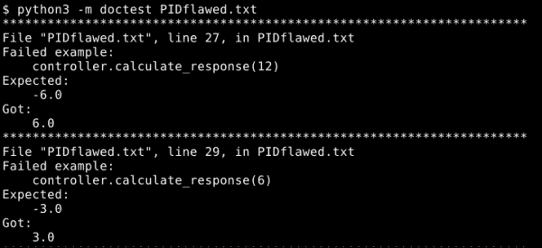
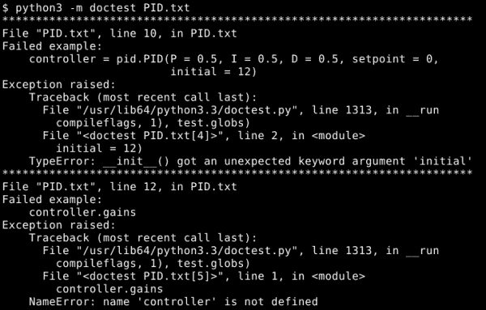

# 第三章. 使用 doctest 进行单元测试

在上一章中，我们讨论了 `doctest` 做什么，它是如何工作的，以及你可以期望从它那里得到什么。为什么我们还要再写一章关于它？

我们不是。这一章并不是真的关于 `doctest`。它是关于称为**单元测试**的测试纪律。由于单元测试是一个想法，而不是一个软件片段，我们将使用 `doctest` 来实践它。

在这一章中，我们将看到：

+   单元测试实际上是什么

+   单元测试如何帮助

+   `doctest` 如何与单元测试相关

# 单元测试是什么？

首先，我们为什么关心单元测试是什么？一个答案是单元测试是一种最佳实践，在编程存在的大部分时间里，它一直在向当前形式演变。另一个答案是单元测试的核心原则只是常识。实际上，对我们整个社区来说，我们花了这么长时间才认识到这一点可能有点尴尬。

那么，它到底是什么？单元测试意味着以这样的方式测试代码的最小有意义的部分（这样的部分被称为单元），确保每个测试的成功或失败只依赖于单元，而不依赖于其他任何东西。

这一定义中的每一部分都有原因：

+   我们测试代码的最小有意义的部分，以便失败的测试告诉我们问题在哪里。测试的代码块越大，问题可能起源的区域就越大。

+   我们确保每个测试只依赖于被测试的单元来成功或失败，因为如果它调用了单元外的任何代码，我们无法保证测试的成功或失败实际上是由于该单元。当测试不是独立的，你就不能信任它们告诉你问题的性质和位置。

我们根据这种纪律在第二章 *与 doctest 一起工作* 中努力编写我们的测试，尽管我们给自己留了一些余地，因为我们专注于编写可测试的规范。在这一章中，我们将更加严格。

自动测试通常与单元测试相关联。自动测试使得运行单元测试变得快速且容易，而且单元测试通常易于自动化。我们当然会大量使用自动测试，现在使用 `doctest`，以后还会使用像 unittest 和 Nose 这样的工具。然而，严格来说，单元测试并不局限于自动测试。你可以仅用你自己的代码和一些纪律来进行单元测试。

# 单元测试的限制

任何涉及多个单元的测试自动就不是单元测试。这很重要，因为单元测试的结果往往特别清晰地表明了问题的性质和位置。

当你同时测试多个单元时，各个单元的结果会混合在一起。最终，你不得不思考问题是什么（错误是否在这段代码中，或者是否正确处理了其他代码段传来的错误输入？），以及问题在哪里（这个输出是错误的，但涉及到的单元是如何一起工作以产生错误的？）。

经验科学家必须进行实验，每次只检查一个假设，无论研究对象是化学、物理还是程序代码的行为。

## 示例 – 确定单元

想象一下，你的一个同事编写了以下代码，而你的任务是测试它：

```py
class Testable:
    def method1(self, number):
        number += 4
        number **= 0.5
        number *= 7
        return number

    def method2(self, number):
        return ((number * 2) ** 1.27) * 0.3

    def method3(self, number):
        return self.method1(number) + self.method2(number)

    def method4(self):
        return 1.713 * self.method3(id(self))
```

这里有一些需要考虑的事情：这段代码的哪些部分是单元？是否只有一个包含整个类的单元？每个方法是否是一个单独的单元？关于每个语句，或者可能是每个表达式呢？

在某种意义上，答案具有主观性，因为单元定义的一部分是它是有意义的。你可以认为整个类是一个单元，在某些情况下这可能是最合适的答案。然而，大多数类都很容易细分为方法，通常方法比类更适合作为单元，因为它们有定义良好的接口和部分隔离的行为，以及它们的意图和意义应该被充分理解。

语句和表达式并不构成好的单元，因为它们几乎从未在孤立状态下具有特别的意义。此外，语句和表达式很难定位：与类和方法不同，它们没有名称或容易聚焦测试的方法。

这里有一些需要考虑的事情：选择不同的单元定义对这段代码会有什么后果？如果你已经决定方法是最好的单元，那么如果你选择了类，会有什么不同？同样，如果你选择了类，那么如果你选择了方法，会有什么不同？

这里有一些需要考虑的事情：看看`method4`。这个方法的结果依赖于所有其他方法正确工作；更糟糕的是，它依赖于 self 对象的唯一 ID。`method4`能否被视为一个单元？如果我们可以改变除`method4`之外的所有东西，我们还需要改变什么才能允许它作为一个单元进行测试并产生可预测的结果？

## 选择单元

在决定什么是单元之前，你不能组织单元测试套件。你选择的编程语言的能力会影响这个选择。例如，C++和 Java 使得将方法视为单元变得困难或不可能（因为你不能在没有首先实例化它所属的类的情况下访问方法）；因此，在这些语言中，每个类通常被视为一个单独的单元，或者使用元编程技巧来强制方法隔离，以便它们可以作为单元进行测试。另一方面，C 语言根本不支持类作为语言特性，所以明显的单元选择是函数。Python 足够灵活，既可以考虑类或方法作为单元，当然，它也有独立的函数；将它们视为单元也是自然的。

单元越小，测试通常越有用，因为它们可以更快地缩小错误的位置和性质。例如，如果你选择将`Testable`类视为一个单元，如果任何方法中存在错误，类的测试将失败。这告诉你`Testable`中存在错误，但不是在`method2`中，或者实际上在哪个位置。另一方面，将`method4`及其类似方法视为单元涉及一定程度的繁琐，以至于本书的下一章专门讨论这种情况。即便如此，我建议大多数时候使用方法和函数作为单元，因为从长远来看这样做是值得的。

当你在思考`method4`时，你可能意识到对`id`和`self.method3`的函数调用是问题所在，如果它们没有调用其他单元，那么这个方法可以作为单元进行测试。在 Python 中，在运行时用替身替换函数相对容易，我们将在下一章讨论这种方法的结构化方法。

# 检查你的理解

看看这个简单类的代码，并使用它来找出问题的答案。查看本书是完全可以的。这只是确保你准备好继续前进的一种方式：

```py
class ClassOne:
    def __init__(self, arg1, arg2):
        self.arg1 = int(arg1)
        self.arg2 = arg2

    def method1(self, x):
        return x * self.arg1

    def method2(self, x):
        return self.method1(self.arg2) * x
```

这里有一些问题：

1.  假设我们使用方法作为单元，前面代码中存在多少个单元？

    答案：在前面代码中存在三个单元，如下所示：`__init__`、`method1`和`method2`。`__init__`是一个方法，就像`method1`和`method2`一样。它是构造函数的事实意味着它与其他单元纠缠在一起，但它仍然是一个包含代码和可能存在错误的位置的方法，所以我们不能将其视为任何其他东西，而只能视为一个单元。

1.  哪些单元假设其他单元的正确运行？换句话说，哪些单元不是独立的？

    答案：`method1`和`method2`都假设`__init__`运行正确，`method2`与`method1`有相同的假设。

1.  如何编写一个测试`method2`的测试，而不假设其他单元正确工作？

    答案：`method2`的测试将需要使用一个作为测试代码一部分的假`method1`，而不是被测试代码的一部分。

# 开发过程中的单元测试

我们将逐步开发一个类，将其视为一个完整的编程项目，并在每个步骤中集成单元测试。对于一个如此小的独立类来说，这可能看起来很愚蠢，但它说明了如何防止大型项目陷入 bug 的混乱。

我们将创建一个 PID 控制器类。PID 控制器是控制理论中的一个工具，是一种控制机器使其平滑高效运动的方法。在工厂中组装汽车的机器人手臂是由 PID 控制器控制的。我们将使用 PID 控制器进行这个演示，因为它非常实用，并且非常贴近现实世界。许多程序员在他们的职业生涯中某个时刻都被要求实现 PID 控制器。这个例子意味着我们作为承包商，正在被支付以产生结果。

### 注意

如果你发现 PID 控制器比编程书中的简单例子更有趣，维基百科的文章是一个开始学习这个主题的好地方：[`en.wikipedia.org/wiki/PID_controller`](http://en.wikipedia.org/wiki/PID_controller)。

## 设计

我们的假设客户给出了以下规范：

> 我们希望有一个类来实现单个变量的 PID 控制器。测量值、设定点和输出都应该是实数。
> 
> 我们需要在运行时调整设定点，但我们希望它具有记忆功能，这样我们就可以轻松地返回到先前的设定点。

我们将编写一组验收测试作为单元测试，以描述行为。这样我们至少可以精确地记录我们认为客户意图的内容。

我们需要编写一组测试来描述构造函数。在查阅了 PID 控制器实际上是什么之后，我们了解到它们由三个增益和一个设定点定义。控制器有三个组成部分：比例、积分和微分（这就是 PID 名称的由来）。每个增益都是一个数字，它决定了控制器三个部分中的哪一个对最终结果的影响程度。设定点决定了控制器的目标；换句话说，它试图将控制变量移动到哪个位置。考虑到所有这些，我们决定构造函数应该只存储增益和设定点，以及初始化一些我们知道我们将来会需要的内部状态，因为我们阅读了关于 PID 控制器的资料。有了这个，我们就知道足够多的东西来编写一些构造函数测试：

```py
>>> import pid

>>> controller = pid.PID(P=0.5, I=0.5, D=0.5, setpoint=0)

>>> controller.gains
(0.5, 0.5, 0.5)
>>> controller.setpoint
[0.0]
>>> controller.previous_time is None
True
>>> controller.previous_error
0.0
>>> controller.integrated_error
0.0
```

我们还需要编写描述测量处理的测试。这意味着测试控制器的实际使用，以测量值作为其输入，并产生一个控制信号，该信号应平滑地将测量变量移动到设定点。

PID 控制器的行为基于时间；我们知道这一点，所以如果我们希望测试产生可预测的结果，我们需要能够向控制器提供我们选择的时间值。我们通过用具有相同签名的不同函数替换`time.time`来实现这一点，该函数产生可预测的结果。

一旦我们处理完这个问题，我们就将我们的测试输入值插入到定义 PID 控制器的数学公式中，包括增益，以确定正确的输出值，并使用这些数字来编写测试：

```py
Replace time.time with a predictable fake
>>> import time
>>> real_time = time.time
>>> time.time = (float(x) for x in range(1, 1000)).__next__

Make sure we're not inheriting old state from the constructor tests
>>> import imp
>>> pid = imp.reload(pid)

Actual tests. These test values are nearly arbitrary, having been chosen for no reason other than that they should produce easily recognized values.
>>> controller = pid.PID(P=0.5, I=0.5, D=0.5, setpoint=0)
>>> controller.calculate_response(12)
-6.0
>>> controller.calculate_response(6)
-3.0
>>> controller.calculate_response(3)
-4.5
>>> controller.calculate_response(-1.5)
-0.75
>>> controller.calculate_response(-2.25)
-1.125

Undo the fake
>>> time.time = real_time
```

我们需要编写描述设定点处理的测试。我们的客户要求一个“记忆”设定点，我们将将其解释为栈，因此我们编写测试以确保设定点栈正常工作。编写使用此栈行为的代码使我们注意到，没有设定点的 PID 控制器不是一个有意义的实体，因此我们添加了一个测试来检查 PID 类通过引发异常来拒绝这种情况：

```py
>>> pid = imp.reload(pid)
>>> controller = pid.PID(P = 0.5, I = 0.5, D = 0.5, setpoint = 0)

>>> controller.push_setpoint(7)
>>> controller.setpoint
[0.0, 7.0]

>>> controller.push_setpoint(8.5)
>>> controller.setpoint
[0.0, 7.0, 8.5]

>>> controller.pop_setpoint()
8.5
>>> controller.setpoint
[0.0, 7.0]

>>> controller.pop_setpoint()
7.0
>>> controller.setpoint
[0.0]

>>> controller.pop_setpoint()
Traceback (most recent call last):
ValueError: PID controller must have a setpoint
```

PID 控制器在其他地方有明确的定义，所以我们的客户给出的稀疏规范在整个过程中工作得相当好。尽管如此，当我们编写验收测试时，我们不得不明确几个假设；在测试运行之前，与客户核对并确保我们没有走偏可能是个明智之举，这意味着，在我们甚至运行测试之前，它们已经通过指出我们需要向他们提出的问题来帮助我们。

在测试中，我们采取了额外措施来帮助它们彼此隔离，通过在每组测试语句之前强制`pid`模块重新导入。这会重置模块中可能发生变化的任何内容，并使其重新导入它所依赖的任何模块。这尤其重要，因为我们用模拟函数替换了`time.time`。我们想确保`pid`模块使用模拟时间函数，所以我们重新加载了`pid`模块。如果使用真实时间函数而不是模拟函数，测试将不会有用，因为它只会成功一次。测试需要可重复。

我们通过创建一个从 1 到 999（作为浮点值）的整数计数迭代器，并将`time.time`绑定到该迭代器的`__next__`方法来创建替代时间函数。一旦我们完成了时间相关的测试，我们就替换了原始的`time.time`。

虽然我们确实有点偷懒，因为我们没有费心将各种测试与 PID 构造函数隔离开来。如果构造函数中有一个错误，它可能会在任何依赖于它的测试中引起错误的报告。我们本可以使用模拟对象而不是实际的 PID 对象来更加严谨，甚至可以在测试其他单元时跳过调用构造函数，但因为我们直到下一章才讨论模拟对象，所以我们在这里允许自己有点偷懒。

目前，我们有一个不存在模块的测试。这很好！编写测试比编写模块要容易，这为我们快速、轻松地构建模块提供了一个基石。一般来说，你总是希望在编写测试的代码之前就准备好测试。

### 小贴士

注意我说的是“你想要准备好测试”，而不是“你想要准备好所有的测试”。在你开始编写代码之前，你不需要或不需要所有测试都到位。你想要的是在过程开始时就确定好定义你已知的事情的测试。

## 开发

现在我们有一些测试了，我们可以开始编写代码以满足测试，从而也满足规范。

### 小贴士

如果代码已经编写好了呢？我们仍然可以为它的单元编写测试。这并不像与代码并行编写测试那样高效，但至少这给了我们一种检查假设并确保我们没有引入回归的方法。比没有测试套件要好。

第一步是运行测试，因为这是你需要决定下一步做什么时做的第一件事。如果所有测试都通过，要么你已经完成了程序，要么你需要编写更多的测试。如果一个或多个测试失败，你选择一个并让它通过。

因此，我们按照以下方式运行测试：

```py
python3 -m doctest PID.txt
```

第一次他们告诉我们我们没有`pid`模块。让我们创建一个并填充一个`PID`类的第一次尝试：

```py
from time import time

class PID:
    def __init__(self, P, I, D, setpoint):
        self.gains = (float(P), float(I), float(D))
        self.setpoint = [float(setpoint)]
        self.previous_time = None
        self.previous_error = 0.0
        self.integrated_error = 0.0

    def push_setpoint(self, target):
        self.setpoint.append(float(target))

    def pop_setpoint(self):
        if len(self.setpoint) > 1:
            return self.setpoint.pop()
        raise ValueError('PID controller must have a setpoint')

    def calculate_response(self, value):
        now = time()
        P, I, D = self.gains

        err = value - self.setpoint[-1]

        result = P * err
        if self.previous_time is not None:
            delta = now - self.previous_time
            self.integrated_error += err * delta
            result += I * self.integrated_error
            result += D * (err - self.previous_error) / delta

        self.previous_error = err
        self.previous_time = now

        return result
```

现在，我们将再次运行测试，看看我们做得如何：

```py
python3 -m doctest PIDflawed.txt
```

这立即告诉我们`calculate_response`方法中有一个错误：



有更多类似的错误报告。总共有五个。似乎`calculate_response`方法在反向工作，当它应该给出正值时产生了负值，反之亦然。

我们知道我们需要在`calculate_response`中查找符号错误，我们发现在第四行，输入值应该从设定点减去，而不是相反。如果我们把这一行改为以下内容，事情应该会更好：

```py
err = self.setpoint[-1] - value
```

如预期的那样，这个更改修复了问题。现在所有的测试都通过了。

我们使用测试来告诉我们需要做什么，以及告诉我们代码何时完成。我们第一次运行测试给我们一个需要编写的事项列表；类似于待办事项列表。在编写了一些代码之后，我们再次运行测试以查看它是否按预期工作，这给了我们一个新的待办事项列表。我们继续交替运行测试和编写代码，直到通过一个测试，然后继续直到所有测试都通过。当所有测试都通过时，要么我们已经完成了，要么我们需要编写更多的测试。

无论何时我们发现一个测试尚未捕获的 bug，正确的做法是添加一个测试来捕获它，然后我们需要修复这个 bug。这会给我们一个固定的 bug，但也会有一个覆盖之前未测试过的程序部分的测试。你的新测试可能会捕获你甚至没有意识到的更多 bug，并且它将帮助你避免重新创建已修复的 bug。

这种“测试一点，编码一点”的编程风格被称为**测试驱动开发**，你会发现它非常高效。

注意，测试失败的模式立即显而易见。当然，没有保证这种情况会发生，但通常是这样的。结合能够将注意力缩小到有问题的特定单元，调试通常变得非常简单。

## 反馈

因此，我们有一个 PID 控制器，它通过了我们的测试...我们完成了吗？也许吧。让我们去询问客户。

好消息是，他们大多数都喜欢。尽管如此，他们还有一些想要改变的地方。他们希望我们能够可选地指定当前时间作为`calculate_response`的参数，以便使用指定的时间而不是当前系统时间。他们还希望我们更改构造函数的签名，使其接受初始测量值和可选的测量时间作为参数。

因此，程序通过了我们所有的测试，但测试不再正确描述需求了。怎么办？

首先，我们将初始值参数添加到构造函数测试中，并更新预期结果如下：

```py
>>> import time
>>> real_time = time.time
>>> time.time = (float(x) for x in range(1, 1000)).__next__
>>> import pid
>>> controller = pid.PID(P = 0.5, I = 0.5, D = 0.5, setpoint = 0,...                      initial = 12)
>>> controller.gains
(0.5, 0.5, 0.5)
>>> controller.setpoint
[0.0]
>>> controller.previous_time
1.0
>>> controller.previous_error
-12.0
>>> controller.integrated_error
0.0
>>> time.time = real_time
```

现在，我们将为构造函数添加另一个测试，这是一个检查当提供可选的初始时间参数时的正确行为的测试：

```py
>>> import imp
>>> pid = imp.reload(pid)
>>> controller = pid.PID(P = 0.5, I = 0.5, D = 0.5, setpoint = 1,
...                      initial = 12, when = 43)
>>> controller.gains
(0.5, 0.5, 0.5)
>>> controller.setpoint
[1.0]
>>> controller.previous_time
43.0
>>> controller.previous_error
-11.0
>>> controller.integrated_error
0.0
```

接下来，我们将`calculate_response`测试更改为使用构造函数的新签名：

```py
>>> controller = pid.PID(P = 0.5, I = 0.5, D = 0.5, setpoint = 0,...                      initial = 12)
```

我们需要添加第二个`calculate_response`测试，以检查当将可选的时间参数传递给它时，函数是否表现正常：

```py
>>> pid = imp.reload(pid)
>>> controller = pid.PID(P = 0.5, I = 0.5, D = 0.5, setpoint = 0,
...                      initial = 12, when = 1)
>>> controller.calculate_response(6, 2)
-3.0
>>> controller.calculate_response(3, 3)
-4.5
>>> controller.calculate_response(-1.5, 4)
-0.75
>>> controller.calculate_response(-2.25, 5)
-1.125
```

最后，我们在设定点方法测试中调整构造函数调用。这个更改看起来与其他测试中的构造函数调用更改相同。

当我们调整测试时，我们发现由于将初始值和初始时间参数添加到构造函数中，`calculate_response`方法的行为发生了变化。测试将报告这是一个错误，但并不清楚这实际上是否错误，所以我们与客户进行了确认。经过讨论，客户决定这实际上是正确的行为，因此我们更改了我们的测试以反映这一点。

我们完整的规范和测试文档现在看起来是这样的（新或更改的行已突出显示）：

```py
We want a class that implements a PID controller for a single
variable. The measurement, setpoint, and output should all be real
numbers. The constructor should accept an initial measurement value in
addition to the gains and setpoint.

>>> import time
>>> real_time = time.time
>>> time.time = (float(x) for x in range(1, 1000)).__next__
>>> import pid
>>> controller = pid.PID(P = 0.5, I = 0.5, D = 0.5, setpoint = 0,...                      initial = 12)
>>> controller.gains
(0.5, 0.5, 0.5)
>>> controller.setpoint
[0.0]
>>> controller.previous_time
1.0
>>> controller.previous_error
-12.0
>>> controller.integrated_error
0.0
>>> time.time = real_time

The constructor should also optionally accept a parameter specifying
when the initial measurement was taken.

>>> import imp
>>> pid = imp.reload(pid)
>>> controller = pid.PID(P = 0.5, I = 0.5, D = 0.5, setpoint = 1,
...                      initial = 12, when = 43)
>>> controller.gains
(0.5, 0.5, 0.5)
>>> controller.setpoint
[1.0]
>>> controller.previous_time
43.0
>>> controller.previous_error
-11.0
>>> controller.integrated_error
0.0

The calculate response method receives the measured value as input,
and returns the control signal.

>>> import time
>>> real_time = time.time
>>> time.time = (float(x) for x in range(1, 1000)).__next__
>>> pid = imp.reload(pid)
>>> controller = pid.PID(P = 0.5, I = 0.5, D = 0.5, setpoint = 0,...                      initial = 12)
>>> controller.calculate_response(6)
-3.0
>>> controller.calculate_response(3)
-4.5
>>> controller.calculate_response(-1.5)
-0.75
>>> controller.calculate_response(-2.25)
-1.125
>>> time.time = real_time

The calculate_response method should be willing to accept a parameter
specifying at what time the call is happening.

>>> pid = imp.reload(pid)
>>> controller = pid.PID(P = 0.5, I = 0.5, D = 0.5, setpoint = 0,
...                      initial = 12, when = 1)
>>> controller.calculate_response(6, 2)
-3.0
>>> controller.calculate_response(3, 3)
-4.5
>>> controller.calculate_response(-1.5, 4)
-0.75
>>> controller.calculate_response(-2.25, 5)
-1.125

We need to be able to adjust the setpoint at runtime, but we want it to have a memory, so that we can easily return to the previous
setpoint.

>>> pid = imp.reload(pid)
>>> controller = pid.PID(P = 0.5, I = 0.5, D = 0.5, setpoint = 0,...                      initial = 12)
>>> controller.push_setpoint(7)
>>> controller.setpoint
[0.0, 7.0]
>>> controller.push_setpoint(8.5)
>>> controller.setpoint
[0.0, 7.0, 8.5]
>>> controller.pop_setpoint()
8.5
>>> controller.setpoint
[0.0, 7.0]
>>> controller.pop_setpoint()
7.0
>>> controller.setpoint
[0.0]
>>> controller.pop_setpoint()
Traceback (most recent call last):
ValueError: PID controller must have a setpoint
```

我们的测试没有符合要求，因此我们需要更改它们。这很好，但我们不想更改太多，因为我们已有的测试帮助我们避免了我们之前发现或必须解决的问题。我们最不想看到的是计算机停止检查已知问题。因此，我们非常倾向于添加新的测试，而不是更改旧的测试。

这是我们添加新测试以检查在提供可选时间参数时的行为的一个原因。另一个原因是，如果我们将这些参数添加到现有的测试中，我们就不会有测试来检查当你不使用这些参数时会发生什么。我们总是想检查每个单元中的每个代码路径。

将初始参数添加到构造函数中是一件大事。这不仅改变了构造函数应该如何表现，还以相当戏剧性的方式改变了`calculate_response`方法应该如何表现。由于正确行为发生了变化（这是我们直到测试指出这一点之前都没有意识到的事实，这也反过来允许我们在开始编写代码之前从客户那里获得对正确行为的确认），我们别无选择，只能遍历并更改测试，重新计算预期的输出等。尽管如此，所有这些工作都有好处，除了未来能够检查函数是否正确工作之外：这使得我们在实际编写函数时更容易理解函数应该如何工作。

当我们更改测试以反映新的正确行为时，我们仍然尽量少做更改。毕竟，我们不想让测试停止检查仍然正确的旧行为，我们也不想在自己的测试中引入错误。

### 小贴士

在一定程度上，正在测试的代码充当了测试的测试，因此即使你的测试中存在错误，当使用良好的测试纪律时，这些错误也不会持续很长时间。

## 再次进行开发

是时候进行更多编码了。在现实生活中，我们可能会根据我们与客户沟通的好坏在开发和反馈之间循环多次。事实上，增加我们来回次数的数量可能是一件好事，即使这意味着每个周期都很短。让客户保持同步并了解最新情况是件好事。

第一步，一如既往，是运行测试并获取需要完成的更新列表：

```py
Python3 -m doctest PID.txt
```



实际上报告的错误还有很多，但第一个错误就给我们提供了很好的提示，关于我们需要立即修复的问题。构造函数需要改变以匹配测试的期望。

使用`doctest`错误报告来引导我们，并频繁地重新运行测试，我们可以快速将我们的 PID 类调整到合适的状态。在实践中，这在使用短的开发周期时效果最好，你只对代码进行少量更改，然后再次运行测试。修复一个问题，然后再次测试。

一旦我们在编码和测试之间来回多次，我们最终会得到类似这样的结果：

```py
from time import time

class PID:
    def __init__(self, P, I, D, setpoint, initial, when = None):
        self.gains = (float(P), float(I), float(D))

        if P < 0 or I < 0 or D < 0:
            raise ValueError('PID controller gains must be non-negative')

        if not isinstance(setpoint, complex):
            setpoint = float(setpoint)

        if not isinstance(initial, complex):
            initial = float(initial)

        self.setpoint = [setpoint]

        if when is None:
            self.previous_time = time()
        else:
            self.previous_time = float(when)

        self.previous_error = self.setpoint[-1] - initial
        self.integrated_error = 0.0

    def push_setpoint(self, target):
        self.setpoint.append(float(target))

    def pop_setpoint(self):
        if len(self.setpoint) > 1:
            return self.setpoint.pop()
        raise ValueError('PID controller must have a setpoint')

    def calculate_response(self, value, now = None):
        if now is None:
            now = time()
        else:
            now = float(now)

        P, I, D = self.gains

        err = self.setpoint[-1] - value

        result = P * err
        delta = now - self.previous_time
        self.integrated_error += err * delta
        result += I * self.integrated_error
        result += D * (err - self.previous_error) / delta

        self.previous_error = err
        self.previous_time = now

        return result
```

再次强调，所有测试都通过了，包括来自客户的修订测试，而且没有错误报告是多么令人欣慰。我们准备看看客户是否愿意接受代码的交付。

## 流程的后期阶段

在开发的后期阶段，你的任务是维护代码，或者将其集成到另一个产品中。功能上，它们与开发阶段相同。如果你正在处理现有的代码并被要求维护或集成它，如果它已经附带了一个测试套件，你会感到更加高兴，因为，直到你掌握了代码的复杂性，测试套件是你唯一能够有信心修改代码的方式。

如果你不幸得到了一堆没有测试的代码，编写测试是一个好的第一步。你写的每个测试都是代码的一个单元，你可以诚实地说你理解它，并知道可以期待什么。当然，你写的每个测试都是另一个单元，你可以依赖它告诉你是否引入了错误。

# 摘要

我们已经通过使用单元测试和测试驱动开发来开发项目的过程，注意我们如何识别单元，并介绍了一些我们可以隔离`doctest`测试以针对单个单元的方法。

我们还讨论了单元测试的哲学和纪律，详细说明了它是什么，以及为什么它有价值。

在下一章中，我们将讨论模拟对象，这是隔离单元的强大工具。
