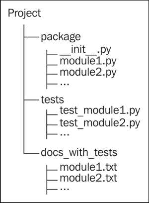
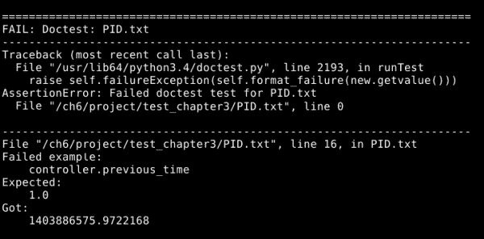
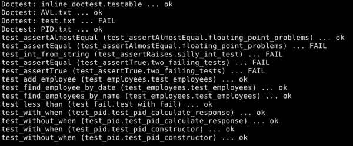

# 第六章：使用 Nose 运行你的测试

在上一章中，我们看到了`unittest`发现工具在不明确告知它们位置的情况下找到我们的测试。与`doctest`让我们明确告诉它应该在哪里找到要运行的测试相比，这非常方便，尤其是当我们谈论一个包含许多位置的测试的大型源树时。

Nose 是一个基于这个想法的工具。它能够在整个源树中找到`unittest`测试、`doctest`测试和临时测试，并运行它们。然后，它会向你展示一个关于测试成功和失败的统一报告。换句话说，Nose 让你可以为任何给定的测试选择正确的测试工具，简单方便地集成它们。

Nose 还提供了一些新的测试功能，例如模块级别的设置和一些新的断言函数。

# 安装 Nose

鼻子（Nose）不是 Python 标准库的一部分，这意味着你需要自己安装它。你可以使用一条命令来安装 Nose：

```py
python3 -m pip install --user nose
```

### 小贴士

如果命令报告找不到名为`pip`的模块，你需要运行以下命令来安装`pip`模块：

```py
python3 -m ensurepip --user
```

`ensurepip`模块自 Python 3.4 起成为标准库的一部分，因此你可以信赖它总是可用的。尽管如此，你可能不需要它，因为尽管`pip`不是标准库的一部分，但它包含在 Python 发行版中。

之前命令中的`--user`命令行开关告诉工具将其安装到你的个人 Python 包文件夹中。如果你省略了这个命令，它将尝试为所有用户安装 Nose。

就这些了。Nose 已经准备好使用了。

# 组织测试

好吧，我们已经安装了 Nose，那么它有什么好处呢？Nose 会遍历目录结构，找到测试文件，整理出它们包含的测试，运行测试，并将结果报告给你。这是一项你每次想要运行测试时都不必做的很多工作——你应该经常运行测试。

Nose 根据文件名识别测试文件。任何名称包含`test`或`Test`，无论是位于开头还是位于任何字符`_`（下划线）、`.`（点）或`–`（破折号）之后，都被识别为可能包含测试的地方。Python 源文件和包目录也是如此。任何可能包含测试的文件都会被检查是否存在`unittest` `TestCases`以及任何名称表明它们是测试的函数。Nose 还可以找到并执行嵌入在文档字符串中或单独编写的`doctest`测试。默认情况下，它不会寻找`doctest`测试，除非我们告诉它。我们很快就会看到如何更改默认设置。

由于 Nose 非常愿意寻找我们的测试，我们在如何组织它们方面有很大的自由度。通常，将所有测试分离到它们自己的目录中，或者将大型项目组织成整个目录树，都是一个不错的选择。一个大型的项目最终可能会有成千上万的测试，因此为了便于导航而组织它们是一个很大的好处。如果 doctests 不仅要作为测试还要作为文档，那么将它们存储在另一个单独的目录中，并使用一个表明它们是文档的名称，可能是一个好主意。对于一个中等规模的项目，这个建议的结构可能如下所示：



这种结构只是一个建议...这是为了你的便利，而不是为了 Nose。如果你觉得不同的结构会使事情更容易，那么请随意使用它。

## 测试组织的一个例子

我们将从前几章中选取一些测试，并将它们组织成一个目录树。然后，我们将使用 Nose 运行它们。

第一步是创建一个将存放我们的代码和测试的目录。你可以随意命名，但在这里我将称之为 `project`。

将前几章中的 `pid.py`、`avl_tree.py` 和 `employees.py` 文件复制到 `project` 目录中。同时，将 第二章 中的 `test.py` 文件也放入这里，并将其重命名为 `inline_doctest.py`。我们希望它被视为源文件，而不是测试文件，这样你就可以看到 Nose 如何处理带有 doctest 的源文件。放置在 `project` 目录中的模块和包，无论测试在树中的位置如何，都将可用于测试。

创建一个名为 `test_chapter2` 的子目录，位于 `project` 目录下，并将 第二章 中的 `AVL.txt` 和 `test.txt` 文件，*使用 doctest*，放入其中。

在 `project` 目录下创建一个名为 `test_chapter3` 的子目录，并将 `PID.txt` 放入其中。

在 `project` 目录下创建一个名为 `test_chapter5` 的子目录，并将 第五章 中的所有 `test_*` 模块，*使用 unittest 进行结构化测试*，放入其中。

现在，我们已经准备好使用以下代码运行我们的测试：

```py
python3 -m nose --with-doctest --doctest-extension=txt -v
```

### 小贴士

如果你不想使用 `-v` 选项，也可以省略。这只是为了告诉 Nose 提供更详细的报告。

所有测试都应该运行。我们预计会看到一些失败，因为前几章中的一些测试是为了说明目的而故意设计的。然而，以下截图显示了一个我们需要考虑的失败：



这个错误报告的第一部分可以安全忽略：它只是意味着整个`doctest`文件被 Nose 当作一个失败的测试处理。有用的信息在报告的第二部分。它告诉我们，我们期望得到一个`1.0`的先前时间，但得到的是一个非常大的数字（当你自己运行测试时，这个数字会不同，并且更大，因为它代表了几十年前的某个时间点以来的秒数）。发生了什么事？我们没有在那个测试中用模拟替换`time.time`吗？让我们看看`pid.txt`的相关部分：

```py
>>> import time
>>> real_time = time.time
>>> time.time = (float(x) for x in range(1, 1000)).__next__
>>> import pid
>>> controller = pid.PID(P = 0.5, I = 0.5, D = 0.5, setpoint = 0,
...                      initial = 12)
>>> controller.gains
(0.5, 0.5, 0.5)
>>> controller.setpoint
[0.0]
>>> controller.previous_time
1.0
```

我们模拟了`time.time`，确实如此（尽管最好使用`unittest.mock`的`patch`函数）。为什么`pid.py`中的`from time import time`获取的是错误的时间函数（也就是说，真实的时间）呢？如果在这个测试运行之前`pid.py`已经被导入，那么`from time import time`就已经在模拟被放置之前运行了，它将永远不会知道有模拟的存在。那么，是其他什么在`pid.txt`导入它之前导入了`pid.py`吗？实际上是这样的：Nose 在扫描要执行测试时导入了它。如果我们使用 Nose，我们不能指望我们的`import`语句实际上是第一个导入任何给定模块的。不过，我们可以通过使用`patch`来替换测试代码中找到的`time`函数来轻松解决这个问题：

```py
>>> from unittest.mock import Mock, patch
>>> import pid
>>> with patch('pid.time', Mock(side_effect = [1.0, 2.0, 3.0])):
...    controller = pid.PID(P = 0.5, I = 0.5, D = 0.5, setpoint = 0,
...                         initial = 12)
>>> controller.gains
(0.5, 0.5, 0.5)
>>> controller.setpoint
[0.0]
>>> controller.previous_time
1.0
```

### 小贴士

注意，我们在这里只查看文件中的第一个测试。还有一个测试，虽然它通过了，但以同样的方式编写会更好。你能找到那个测试并改进它吗？

不要被弄混：我们切换到使用`unittest.mock`进行这个测试，并不是因为它解决了问题，而是因为它是一个更好的模拟对象的工具。真正的解决方案是我们从替换`time.time`切换到替换`pid.time`。在`pid.py`中，除了`import`行之外，没有其他地方引用`time`。这意味着我们需要模拟的是`pid.time`，而且一直都是。`pid.time`是`time.time`的另一个名称，这是无关紧要的；我们应该模拟找到对象的地方，而不是它来自哪里。

现在，当我们再次运行测试时，唯一的失败是预期的。你的总结报告（因为我们把`-v`传递给命令行上的 Nose）应该看起来像这样：



我们刚刚看到隐藏的假设如何破坏测试，就像它们可以破坏被测试的代码一样。到目前为止，我们一直假设，当我们的某个测试导入一个模块时，这是该模块第一次被导入。一些测试依赖于这个假设来用模拟对象替换库对象。现在，我们正在处理运行许多聚合在一起的测试，没有保证的执行顺序，这个假设是不可靠的。更不用说，我们遇到麻烦的模块实际上必须被导入以在运行任何测试之前搜索它。通过快速切换受影响的测试以使用更好的方法，我们就可以继续进行。

因此，我们只使用一个命令运行了所有这些测试，我们可以将测试分散到尽可能多的目录、源文件和文档中，以保持一切井然有序。这真是太好了。我们正在接近测试在现实世界中变得有用的地步。

我们可以将我们的测试存储在单独且井然有序的目录结构中，并使用单个简单快捷的命令运行它们。我们还可以通过传递包含我们想要运行的测试的文件名、模块名或包含测试的目录作为命令行参数，轻松地运行测试的子集。

# 简化 Nose 的命令行

我们之前使用的`python3 -m nose`命令并不难理解，但如果我们要一直输入它，它就比我们希望的更长。而不是以下命令：

```py
python3 -m nose --with-doctest --doctest-extension=txt -v
```

我们真的更希望只使用以下命令：

```py
python3 -m nose
```

或者，甚至更简单：

```py
nosetests
```

幸运的是，告诉 Nose 我们想要它为这些命令行开关的值使用不同的默认值非常简单。为此，只需在你的主目录中创建一个名为`nose.cfg`或`.noserc`（任一名称都行）的配置文件，并在其中放置以下内容：

```py
[nosetests]
with-doctest=1
doctest-extension=txtIf you're a Windows user, you might not be sure what the phrase "home directory" is supposed to denote in this context. As far as Python is concerned, your home directory is defined by your environment variables. If HOME is defined, that's your home directory. Otherwise, if USERPROFILE is defined (it usually is, pointing at C:\Documents and Settings\USERNAME) then that is considered to be your home directory. Otherwise, the directory described by HOMEDRIVE and HOMEPATH (often C:\)is your home directory.
```

在配置文件中设置选项可以处理所有多余的命令行参数。从现在开始，每次你运行 Nose 时，它都会假设这些选项，除非你明确告知它否则。你不再需要在命令行上输入它们。你可以为 Nose 可以接受的任何命令行选项使用同样的技巧。

对于第二次改进，Nose 在安装时会安装一个名为`nosetests`的脚本。输入`nosetests`与输入`python3 -m nose`完全相同，但你可能需要将包含`nosetests`的目录添加到你的`PATH`环境变量中，它才能正常工作。在示例中，我们将继续使用`python3 -m nose`。

# 自定义 Nose 的测试搜索

我们之前说过，Nose 使用目录、模块和函数的名称来告知其搜索测试。以`test`或`Test`开头，或包含一个`_`、`.`或`–`后跟`test`或`Test`的目录和模块将被包括在搜索中，除了 Nose 决定应该搜索的其他任何地方。这是默认设置，但这并不是全部。

如果你了解正则表达式，你可以自定义 Nose 用来查找测试的模式。你可以通过传递`--include=REGEX`命令行选项，或者在你的`nose.cfg`或`.noserc`文件中放入`include=REGEX`来实现。

例如，运行以下命令：

```py
python3 -m nose --include="(?:^[Dd]oc)"
```

现在，Nose 除了使用单词`test`查找名称外，还会查找以`doc`或`Doc`开头的名称。这意味着你可以将包含你的`doctest`文件的目录命名为`docs`、`Documentation`、`doctests`等，Nose 仍然会找到并运行这些测试。如果你经常使用此选项，你几乎肯定会想将其添加到你的配置文件中，如前所述。

### 注意

正则表达式的完整语法和使用是一个主题本身，并且已经成为许多书籍的主题；但你可以从 Python 文档中找到你需要做的所有事情，网址为[`docs.python.org/3/library/re.html`](https://docs.python.org/3/library/re.html)。

## 检查你的理解

通过运行`python3 -m nose --processes=4`，Nose 可以同时启动四个测试进程，如果你在一个四核系统上运行测试，这将是一个很大的优势。你将如何让 Nose 始终启动四个测试进程，而无需在命令行中指定？答案是只需在你的 Nose 配置文件中将`processes=4`放入即可。

如果你的某些测试存储在一个名为`specs`的目录中，你将如何告诉 Nose 它应该在该目录中搜索测试？你需要将`--include="specs"`添加到 Nose 命令行。

以下哪个会被 Nose 默认识别为可能包含`UnitTests`、`unit_tests`、`TestFiles`、`test_files`和`doctests`测试？答案是`unit_tests`、`TestFiles`和`test_files`会被 Nose 的默认配置识别。

## 练习 Nose

为以下规范编写一些`doctest`和`unittest`测试，并创建一个目录树来包含它们以及它们所描述的代码。使用测试驱动的方法编写代码，并使用 Nose 运行测试：

```py
The graph module contains two classes: Node and Arc. An Arc is a connection between two Nodes. Each Node is an intersection of an arbitrary number of Arcs.

Arc objects contain references to the Node objects that the Arc connects, a textual identification label, and a "cost" or "weight", which is a real number.

Node objects contain references to all of the connected Arcs, and a textual identification label.

Node objects have a find_cycle(self, length) method which returns a list of Arcs making up the lowest cost complete path from the Node back to itself, if such a path exists with a length greater than 2 Arcs and less than or equal to the length parameter.

Node and Arc objects have a __repr__(self) method which returns a representation involving the identification labels assigned to the objects.
```

# 鼻子测试和 doctest 测试

Nose 不仅支持`doctest`，实际上还增强了它。当你使用 Nose 时，你可以为你的`doctest`文件编写测试固定文件。

如果你通过命令行传递`--doctest-fixtures=_fixture`，Nose 会在找到`doctest`文件时寻找一个固定文件。固定文件的名字基于`doctest`文件的名字，通过在`doctest`文件名的主要部分后添加`doctest`固定后缀（换句话说，就是`doctest-fixtures`的值），然后添加`.py`到末尾来计算。例如，如果 Nose 找到一个名为`PID.txt`的`doctest`文件，并且被告知要寻找`doctest‑fixtures=_fixture`，它会尝试在一个名为`PID_fixture.py`的文件中找到测试固定文件。

`doctest`的测试固定装置文件非常简单：它只是一个包含`setup()`或`setUp()`函数以及`teardown()`或`tearDown()`函数的 Python 模块。`setup`函数在`doctest`文件之前执行，`teardown`函数在`doctest`文件之后执行。

固定装置在`doctest`文件的不同命名空间中运行，因此固定装置模块中定义的所有变量在实际测试中都是不可见的。如果你想在固定装置和测试之间共享变量，你可能需要创建一个简单的模块来保存这些变量，这样你就可以将其导入到固定装置和测试中。

# Nose 和 unittest 测试

Nose 通过在包和模块级别提供测试固定装置来增强`unittest`。包的`setup`函数在包中任何模块的任何测试之前运行，而`teardown`函数在包中所有模块的所有测试完成后运行。同样，模块`setup`函数在给定模块的任何测试执行之前运行，模块`teardown`函数在模块中所有测试执行之后执行。

## 模块固定装置练习

我们将构建一个具有模块级固定装置的测试模块。在固定装置中，我们将替换`datetime.date.today`函数，该函数通常返回表示当前日期的对象。我们希望它返回一个特定的值，这样我们的测试就可以知道期望什么。执行以下步骤：

1.  创建一个名为`tests`的目录。

1.  在`tests`目录下，创建一个名为`module_fixture_tests.py`的文件，包含以下代码：

    ```py
    from unittest import TestCase
    from unittest.mock import patch, Mock
    from datetime import date

    fake_date = Mock()
    fake_date.today = Mock(return_value = date(year = 2014,
                                               month = 6,
                                               day = 12))

    patch_date = patch('module_fixture_tests.date', fake_date)

    def setup():
        patch_date.start()

    def teardown():
        patch_date.stop()

    class first_tests(TestCase):
        def test_year(self):
            self.assertEqual(date.today().year, 2014)

        def test_month(self):
            self.assertEqual(date.today().month, 6)

        def test_day(self):
            self.assertEqual(date.today().day, 12)

    class second_tests(TestCase):
        def test_isoformat(self):
            self.assertEqual(date.today().isoformat(), '2014-06-12')
    ```

1.  注意，在这个模块中有两个`TestCase`类。使用纯`unittest`，我们不得不在每个这些类中重复固定装置代码。Nose 允许我们只写一次，然后在两个地方使用它。

1.  前往包含测试目录的目录，并输入`python -m nose`来运行测试。

1.  Nose 会将`tests`识别为可能包含测试的目录（因为目录名），找到`module_fixtures_tests.py`文件，运行`setup`函数，运行所有测试，然后运行`teardown`函数。不过，除了一个简单的测试通过报告外，没有太多可以看的东西。

你可能已经注意到了在之前的示例中又一种使用`unittest.mock.patch`的方式。除了可以作为装饰器或上下文管理器使用外，你还可以将`patch`函数用作构造函数，并对其返回的对象调用`start`和`stop`方法。在所有可以使用`patch`函数的方式中，在大多数情况下，你应该避免使用这种方法，因为这要求你务必记得调用`stop`函数。前面的代码如果使用`patch_date`作为每个`TestCase`类的类装饰器会更好，除非这里的目的是为了展示模块级固定装置的样子。

通常，而不是创建模拟对象，`setup`和`teardown`会做一些诸如处理、创建和销毁临时文件等事情。

我们可以通过使用一层环绕整个测试模块的测试夹具，而不是单个测试方法，来节省一些时间和精力。通过这样做，我们避免了在每个测试类内部重复夹具代码；但这也带来了一定的代价。`setup`和`teardown`函数不会在每次测试前后运行，就像正常的测试夹具一样。相反，模块中的所有测试都在单个模块级别的 setup/teardown 对之间进行，这意味着如果测试执行了影响由`setup`函数创建的环境的操作，那么在下一个测试运行之前，这些操作不会被撤销。换句话说，测试的隔离性在模块级别的夹具创建的环境方面不能得到保证。

## 包夹具练习

现在，我们将创建一个夹具，它将围绕整个包中的所有测试模块。执行以下步骤：

1.  在我们上一个练习部分中创建的`tests`目录中添加一个名为`__init__.py`的新文件。（这是两个下划线，单词`init`和另外两个下划线）。这个文件的存在告诉 Python 该目录是一个包。

1.  在`module_fixture_tests.py`中，更改：

    ```py
    patch_date = patch('module_fixture_tests.date', fake_date)
    ```

    以下内容：

    ```py
    patch_date = patch('tests.module_fixture_tests.date', fake_date)
    ```

1.  在`tests`目录中的`__init__.py`文件内放置以下代码：

    ```py
    from os import unlink

    def setup():
        with open('test.tmp', 'w') as f:
            f.write('This is a test file.')

    def teardown():
        unlink('test.tmp')
    ```

    ### 注意

    通常，`__init__.py`文件是完全空的，但它们是包对象的规范来源；因此，这就是 Nose 寻找包级别夹具的地方。

1.  在`tests`目录中添加一个名为`package_fixtures_tests.py`的新文件，内容如下：

    ```py
    from unittest import TestCase
    from glob import glob

    class check_file_exists(TestCase):
        def test_glob(self):
            self.assertIn('test.tmp', glob('*.tmp'))
    ```

1.  继续运行测试。你不会看到很多输出，但这只是意味着测试通过了。注意，`test_glob`函数只有在`test.tmp`存在的情况下才能成功。由于这个文件是在包设置中创建并在包清理时销毁（并且它不再存在），我们知道设置是在测试之前运行的，清理是在测试之后运行的。如果我们向`module_fixture_tests.py`添加一个依赖于`test.tmp`的测试，它们也会通过，因为`setup`函数在包中的任何测试之前调用，`teardown`在包中的每个测试运行之后调用。

    ### 小贴士

    `glob`模块提供了将命令行风格的通配符扩展为文件名列表的能力。`glob.glob`函数是几个 globbing 函数之一。

我们与另一层测试夹具一起工作，这次是围绕`tests`目录中的所有测试模块。从我们刚刚编写的代码中可以看出，包级别测试夹具创建的环境在包中每个模块的每个测试中都是可用的。

与模块级测试固定装置一样，包级测试固定装置可以是一个节省大量劳动的快捷方式，但它们并不提供像真实测试级固定装置那样的防止测试之间通信的保护。

### 注意

为什么我们在添加包级固定装置时将 `'module_fixture_tests.date'` 改为 `'tests.module_fixture_tests.date'` 呢？因为当我们向 `tests` 目录添加 `__init__.py` 时，在 Python 看来，我们将其目录变成了一个 Python 包。作为一个 Python 包，它的名称是其内部任何变量的绝对名称的一部分，这间接包括我们导入的 `date` 类。我们必须传递一个绝对变量名给 `patch`，因此我们必须从包含的包名称开始。

# Nose 和临时测试

Nose 支持两种新的测试类型：独立测试函数和非 `TestCase` 测试类。它通过使用与查找测试模块相同的模式匹配来找到这些测试。当遍历一个名称与模式匹配的模块时，任何名称也匹配该模式的函数或类都被假定是测试。

我们将编写一些测试来展示 Nose 对测试函数和非 `TestCase` 测试类的支持。

让我们在 `tests` 目录中创建一个新的测试文件，命名为 `nose_specific_tests.py`。在文件内部，放置以下代码：

```py
import sys
from sqlite3 import connect
from imp import reload

class grouped_tests:
    def setup(self):
        self.connection = connect(':memory:')
        cursor = self.connection.cursor()
        cursor.execute('create table test (a, b, c)')
        cursor.execute('''insert into test (a, b, c)
                          values (1, 2, 3)''')
        self.connection.commit()

    def teardown(self):
        self.connection.close()

    def test_update(self):
        cursor = self.connection.cursor()
        cursor.execute('update test set b = 7 where a = 1')

    def test_select(self):
        cursor = self.connection.cursor()
        cursor.execute('select * from test limit 1')
        assert cursor.fetchone() == (1, 2, 3)

def platform_setup():
    sys.platform = 'test platform'

def platform_teardown():
    global sys
    sys = reload(sys)

def standalone_test():
    assert sys.platform == 'test platform'

standalone_test.setup = platform_setup
standalone_test.teardown = platform_teardown
```

现在运行 Nose 并不会打印出很多内容，但测试已运行且未失败的事实告诉我们很多。

`grouped_tests` 类包含一个测试固定装置（`setup` 和 `teardown` 方法）和两个测试；但它不是一个 `unittest` 的 `TestCase` 类。Nose 通过其名称符合 Nose 在检查模块名称以查找测试模块时寻找的相同模式，将其识别为测试类。然后它遍历该类以查找测试固定装置和任何测试方法，并相应地运行它们。

由于该类不是 `TestCase` 类，测试无法访问任何 `unittest` 的 `assert` 方法；Nose 认为这样的测试通过，除非它引发异常。Python 有一个 `assert` 语句，如果其表达式为假，则会引发异常，这对于这种情况非常有用。它不如 `assertEqual` 那么优雅，但在许多情况下可以完成任务。

我们在 `standalone_test` 函数中又编写了一个测试。像 `grouped_tests` 一样，`standalone_test` 被 Nose 识别为测试，因为它的名称与 Nose 用于搜索测试模块的相同模式匹配。Nose 将 `standalone_test` 作为测试运行，如果它引发异常，则报告失败。

我们通过将 `setup` 和 `teardown` 属性设置为定义为此目的的一对函数，将测试固定装置附加到 `standalone_test` 上。像往常一样，`setup` 函数在测试函数之前运行，`teardown` 函数在测试函数之后运行。

# 摘要

在本章中，我们关于 Nose 测试元框架学到了很多。具体来说，我们涵盖了 Nose 如何查找包含测试的文件，以及如何调整流程以适应您的组织架构；如何使用 Nose 运行所有的测试，无论它们是`doctest`、`unittest`还是临时的；Nose 如何通过额外的测试固定支持增强其他框架；以及如何使用 Nose 对独立测试函数和非`TestCase`测试类的支持。

现在我们已经了解了 Nose 以及如何轻松运行所有测试，我们准备着手处理一个完整的测试驱动型项目，这正是下一章的主题。
