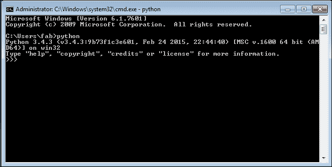
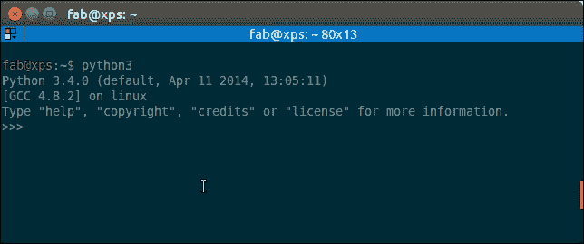
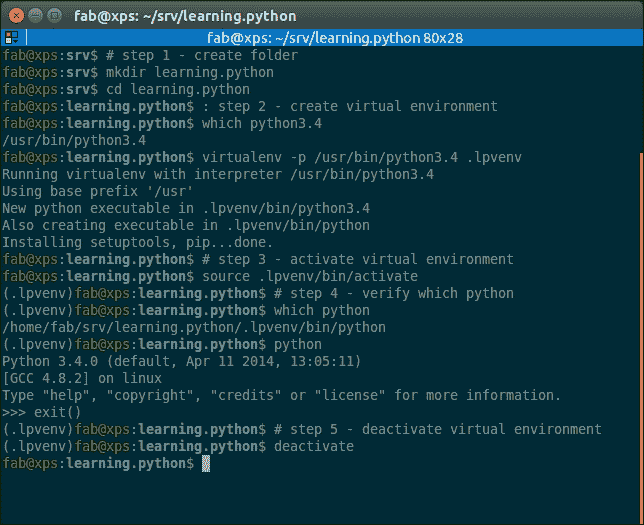
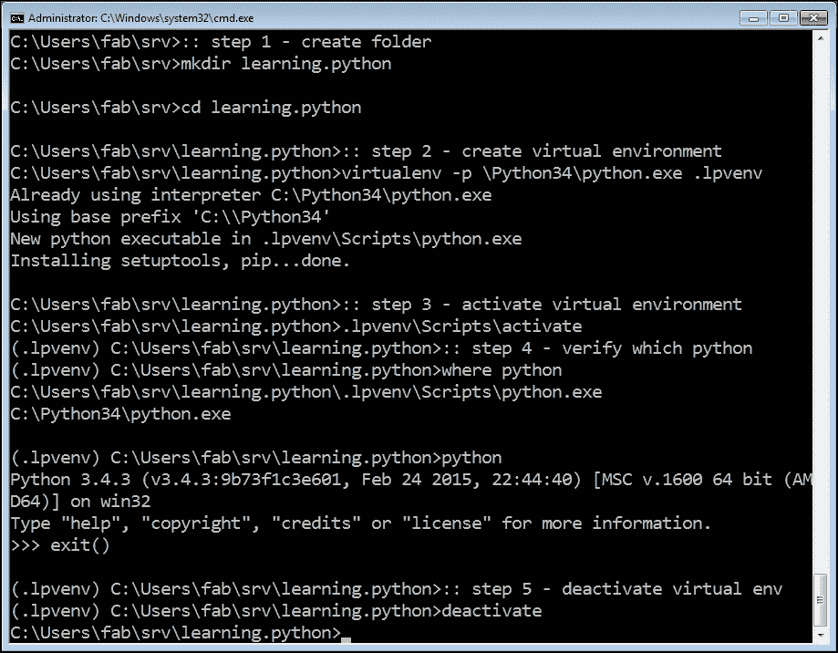

# 第一章. 引言和第一步 – 深呼吸

|   | *"给一个人一条鱼，你只能养他一天。教一个人钓鱼，你就能养他一辈子。"* |   |
| --- | --- | --- |
|   | --*中国谚语* |

根据维基百科，**计算机编程**是：

> *"…一个从原始的计算机问题表述到可执行计算机程序的过程。编程涉及分析、理解开发、生成算法、验证算法的需求包括它们的正确性和资源消耗，以及在目标编程语言中的算法实现（通常称为编码）"。*

简而言之，编码就是用计算机能理解的语言告诉计算机做某事。

电脑是非常强大的工具，但遗憾的是，它们不能自己思考。所以它们需要被告知一切。它们需要被告知如何执行任务，如何评估条件以决定要遵循的路径，如何处理来自网络或磁盘等设备的来自设备的数据，以及当发生不可预见的事情时如何反应，比如说，某物损坏或丢失。

你可以用许多不同的风格和语言进行编码。这很难吗？我会说“是”和“不是”。这有点像写作。每个人都可以学习如何写作，你也可以。但如果你想要成为一名诗人呢？那么仅仅写作是不够的。你必须掌握另一套技能，这将需要更长的时间和更大的努力。

最后，一切都取决于你想要走多远。编码不仅仅是组合一些能工作的指令。它要复杂得多！

优秀的代码是简短、快速、优雅的，易于阅读和理解，简单，易于修改和扩展，易于扩展和重构，以及易于测试。要同时具备所有这些品质的代码需要时间，但好消息是，你通过阅读这本书已经迈出了第一步。我毫不怀疑你能够做到。实际上，任何人都可以，因为我们都在不断地编程，只是我们没有意识到这一点。

你想要一个例子吗？

假设你想冲速溶咖啡。你需要拿一个杯子，速溶咖啡罐，一把勺子，水，还有水壶。即使你没有意识到，你也在评估大量的数据。你确保水壶里有水，水壶已经插上电源，杯子是干净的，罐子里有足够的咖啡。然后，你烧开水，也许同时你在杯子里放了一些咖啡。当水烧开了，你倒入杯子，然后搅拌。

那么，编程是什么呢？

好吧，我们收集了资源（水壶、咖啡、水、茶匙和杯子）并验证了它们的一些条件（水壶已插电，杯子干净，有足够的咖啡）。然后我们开始执行两个动作（烧开水和把咖啡倒入杯子），当这两个动作都完成后，我们通过倒水进杯子并搅拌来最终结束程序。

你看得到吗？我刚刚描述了一个咖啡程序的高级功能。这并不难，因为大脑整天都在做这件事：评估条件、决定采取行动、执行任务、重复一些任务，并在某个点上停止。清洁对象，放回原处，等等。

现在你需要学习如何将你在现实生活中自动执行的所有动作分解，以便计算机能够真正理解它们。你还需要学习一种语言，来指导它。

因此，这本书就是为了这个目的。我会告诉你如何做到这一点，我会通过许多简单但专注的例子（我最喜欢的类型）来尝试做到这一点。

# 适当的介绍

我喜欢在教授编码时引用现实世界；我相信这有助于人们更好地保留概念。然而，现在是时候更加严谨一点，从更技术性的角度来了解编码了。

当我们编写代码时，我们是在指导计算机执行它必须做的事情。动作发生在哪里？在许多地方：计算机内存、硬盘、网络电缆、CPU 等等。这是一个“世界”，大多数时候是现实世界的一个子集的表示。

如果你编写了一个允许人们在线购买服装的软件，你将不得不在程序的范围内表示真实的人、真实的衣服、真实的品牌、尺寸等等。

为了做到这一点，你需要在编写的程序中创建和处理对象。人可以是一个对象。汽车是一个对象。一双袜子也是一个对象。幸运的是，Python 非常理解对象。

任何对象都具有的两个主要特征是属性和方法。让我们以一个人物对象为例。通常在计算机程序中，你会将人表示为顾客或员工。你存储在他们身上的属性可能包括姓名、SSN、年龄、是否有驾驶执照、电子邮件、性别等等。在计算机程序中，你存储所有你需要的数据，以便使用对象来完成你的目的。如果你正在编写一个销售服装的网站，你可能还想存储顾客的身高和体重以及其他尺寸，这样你就可以为他们推荐合适的衣服。因此，属性是对象的特征。我们经常使用它们：“你能把那支笔递给我吗？”——“哪一支？”——“那支黑色的。”在这里，我们使用了笔的“黑色”属性来识别它（很可能是蓝色和红色中的一支）。

方法是对象可以执行的事情。作为一个人类，我有诸如 *说话*、*走路*、*睡觉*、*醒来*、*吃饭*、*做梦*、*写作*、*阅读* 等方法。我能做的所有事情都可以看作是我所代表的对象的方法。

因此，现在你已经知道了对象是什么，以及它们暴露了你可以运行的方法和你可以检查的属性，你就可以开始编码了。实际上，编码就是关于管理那些存在于我们软件中复制的世界子集中的对象。你可以随意创建、使用、重用和删除对象。

根据官方 Python 文档中的“数据模型”章节：

> *"对象是 Python 对数据的抽象。Python 程序中的所有数据都由对象或对象之间的关系表示。"*

我们将在第六章“高级概念 – 面向对象编程、装饰器和迭代器”中更详细地研究 Python 对象。现在，我们只需要知道，Python 中的每个对象都有一个 ID（或标识），一个类型和一个值。

一旦创建，对象的标识永远不会改变。它是它的唯一标识符，Python 在幕后使用它来在我们想要使用对象时检索它。

类型同样也不会改变。类型告诉了对象支持哪些操作，以及可以分配给它的可能值。 

我们将在第二章“内置数据类型”中看到 Python 的最重要的数据类型。

值可以改变，也可以不改变。如果可以改变，则该对象被称为 **可变**，而当它不能改变时，该对象被称为 **不可变**。

我们如何使用一个对象？当然，给它一个名字！当你给一个对象一个名字时，然后你可以使用这个名字来检索对象并使用它。

在更通用的意义上，诸如数字、字符串（文本）、集合等对象都与一个名字相关联。通常，我们说这个名字是变量的名字。你可以把变量看作是一个盒子，你可以用它来存储数据。

因此，你已经拥有了所有需要的对象：接下来是什么？嗯，我们需要使用它们，对吧？我们可能想要通过网络连接发送它们，或者将它们存储在数据库中。也许在网页上显示它们，或者将它们写入文件。为了做到这一点，我们需要对用户填写表单、按下按钮、打开网页并执行搜索等操作做出反应。我们通过运行我们的代码，评估条件来选择要执行的部分、执行次数以及执行的条件来做出反应。

而为了做所有这些，基本上我们需要一种语言。这就是 Python 的作用。Python 是我们将在这本书中一起使用的语言，用来指导计算机为我们做某事。

现在，关于这些理论性的东西就足够了，让我们开始吧。

# 进入 Python

Python 是荷兰计算机科学家和数学家 Guido Van Rossum 的杰作，他决定在 1989 年圣诞节期间赠送世界一个他一直在玩的项目。这种语言大约在 1991 年向公众亮相，从那时起，它已经发展成为今天全球使用的领先编程语言之一。

我 7 岁时开始编程，在 Commodore VIC 20 上，后来被它的更大兄弟 Commodore 64 所取代。使用的语言是 BASIC。后来，我转向了 Pascal、汇编、C、C++、Java、JavaScript、Visual Basic、PHP、ASP、ASP .NET、C#以及其他我甚至无法记住的较小语言，但只有当我接触到 Python 时，我才有那种在商店找到正确沙发时的感觉。当你的所有身体部位都在喊叫，“买这个！这个对我们来说是最完美的！”

我大约花了一天时间适应它。它的语法与我习惯的不同，总的来说，我很少使用一种通过缩进来定义作用域的语言。但一旦克服了那种最初的不适感（就像穿新鞋一样），我就深深地爱上了它。让我们看看原因。

# 关于 Python

在我们深入了解细节之前，让我们了解一下为什么有人想使用 Python（我建议你阅读维基百科上的 Python 页面以获得更详细的介绍）。

在我看来，Python 展现了以下品质。

## 可移植性

Python 可以在任何地方运行，将程序从 Linux 迁移到 Windows 或 Mac 通常只是修复路径和设置的问题。Python 被设计为具有可移植性，它通过接口处理操作系统（**OS**）特定的怪癖，从而保护你免受编写针对特定平台定制的代码的痛苦。

## 一致性

Python 极其逻辑和一致。你可以看到它是由一位杰出的计算机科学家设计的。大多数时候，如果你不知道，你只需猜测一个方法是如何被调用的。

你可能现在还没有意识到这一点的重要性，尤其是如果你刚开始，但这是一个主要特性。这意味着你的头脑中杂乱无章的情况更少，查阅文档的次数更少，当你编码时，在大脑中映射的需求也更少。

## 开发者生产力

根据 Mark Lutz 的《Python 编程：从入门到实践》（第 5 版，*O'Reilly Media*），Python 程序的大小通常是等效 Java 或 C++代码的五分之一到三分之一。这意味着工作完成得更快。更快是好事。更快意味着市场响应更快。更少的代码不仅意味着要编写的代码更少，而且意味着要阅读的代码更少（而且专业程序员读的比写的多），维护、调试和重构的代码也更少。

另一个重要方面是，Python 无需漫长的编译和链接步骤即可运行，因此你不必等待看到你工作的结果。

## 丰富的库

Python 拥有一个极其广泛的内置标准库（据说“内置电池”）。如果这还不够，全球的 Python 社区还维护了一个第三方库的集合，这些库针对特定需求定制，你可以在 **Python 包索引**（**PyPI**）上免费访问。当你编写 Python 代码并意识到你需要某个功能时，在大多数情况下，至少有一个库已经为你实现了这个功能。

## 软件质量

Python 专注于可读性、连贯性和质量。语言的统一性使得代码具有很高的可读性，这在当今代码更多是集体努力而非个人体验的时代至关重要。Python 的另一个重要方面是其固有的多范式特性。你可以将其用作脚本语言，但也可以利用面向对象、命令式和函数式编程风格。它非常灵活。

## 软件集成

另一个重要方面是 Python 可以扩展并与许多其他语言集成，这意味着即使一家公司使用不同的语言作为主流工具，Python 也可以介入并作为需要以某种方式相互通信的复杂应用程序之间的粘合剂。这是一个高级话题，但在现实世界中，这个特性非常重要。

## 满足与享受

最后但同样重要的是，乐趣所在！使用 Python 是一件有趣的事情。我可以连续编码 8 个小时，然后快乐地离开办公室，而其他使用不提供同样数量精心设计的数据结构和结构的语言的程序员则必须忍受痛苦。毫无疑问，Python 让编码变得有趣。而乐趣可以促进动力和生产力。

这些是我推荐 Python 给每个人的主要原因。当然，还有很多其他技术和高级特性我可以讨论，但它们并不真正属于像这样一个介绍性章节。它们将在本书的每一章中自然出现。

# 有什么缺点？

可能，Python 的唯一缺点，这不是由于个人偏好，而是 *执行速度*。通常，Python 比其编译型兄弟慢。Python 的标准实现当你运行应用程序时，会生成源代码的编译版本，称为字节码（扩展名为 `.pyc`），然后由 Python 解释器运行。这种方法的优点是可移植性，我们为此付出了速度降低的代价，因为 Python 没有像其他语言那样编译到机器级别。

然而，Python 的速度在当今很少成为问题，因此尽管这个次优特性存在，它仍然得到了广泛的应用。实际上，硬件成本不再是问题，通常通过并行化任务来提高速度是足够的。然而，当涉及到数值计算时，人们可以切换到更快的 Python 实现，如 PyPy，它通过实现高级编译技术提供了平均 7 倍的速度提升（参考 [`pypy.org/`](http://pypy.org/) 获取更多信息）。

在进行数据科学时，你很可能会发现你与 Python 一起使用的库，如 Pandas 和 Numpy，由于它们的实现方式，能够达到原生速度。

如果这还不够有说服力，你总是可以考虑 Python 正在推动 Spotify 和 Instagram 等服务的后端，这些服务对性能有要求。尽管如此，Python 完美地完成了它的任务。

# 谁在现在使用 Python？

还没有说服你？让我们简要地看看今天正在使用 Python 的公司：Google、YouTube、Dropbox、Yahoo、Zope 公司、工业光魔、华特迪士尼动画、皮克斯、NASA、NSA、Red Hat、诺基亚、IBM、Netflix、Yelp、英特尔、思科、惠普、高通和摩根大通，仅举几个例子。

甚至像 *Battlefield 2*、*Civilization 4* 和 *QuArK* 这样的游戏也是用 Python 实现的。

Python 被用于许多不同的环境，例如系统编程、网络编程、GUI 应用程序、游戏和机器人技术、快速原型设计、系统集成、数据科学、数据库应用程序等等。

# 设置环境

在我们讨论如何在您的系统上安装 Python 之前，让我告诉你在这本书中我将使用哪个 Python 版本。

## Python 2 与 Python 3 – 伟大的辩论

Python 有两个主要版本——Python 2，这是过去——和 Python 3，这是现在。这两个版本虽然非常相似，但在某些方面是不兼容的。

在现实世界中，Python 2 实际上离成为过去还相当遥远。简而言之，尽管 Python 3 自 2008 年以来就已经推出，但过渡阶段还远未结束。这主要是因为 Python 2 在行业中得到了广泛的应用，当然，公司并不那么热衷于仅仅为了更新而更新他们的系统，遵循“如果它没坏，就别修”的哲学。你可以在网上阅读关于这两个版本之间过渡的所有内容。

另一个阻碍过渡的问题是第三方库的可用性。通常，一个 Python 项目依赖于数十个外部库，当然，当你开始一个新的项目时，你需要确保已经有一个与任何可能出现的业务需求兼容的版本 3 兼容的库。如果不是这样，在 Python 3 中启动全新的项目就意味着引入潜在的风险，许多公司都不愿意承担这种风险。

在写作的时候，大多数最广泛使用的库都已经移植到了 Python 3，对于大多数情况来说，开始一个 Python 3 项目是非常安全的。许多库已经被重写，以便它们与两个版本兼容，主要利用了 six（2 x 3）库的力量，这个库有助于根据使用的版本进行内省和调整行为。

在我的 Linux 机器（Ubuntu 14.04）上，我使用的 Python 版本如下：

```py
>>> import sys
>>> print(sys.version)
3.4.0 (default, Apr 11 2014, 13:05:11)
[GCC 4.8.2]

```

所以你可以看到我的 Python 版本是 3.4.0。前面的文本是我输入到我的控制台中的一段 Python 代码。我们稍后会讨论它。

本书中的所有示例都将使用这个 Python 版本运行。其中大部分也可以在 Python 2 中运行（我已安装了 Python 2.7.6），而那些不能运行的则只需要进行一些小的调整来适应两个版本之间的小不兼容性。选择这个版本的原因还有，我认为学习 Python 3 更好，然后，如果你需要的话，再学习它与 Python 2 的差异，而不是反过来。

尽管如此，不必担心版本问题：在实践中这并不是一个大问题。

# 安装 Python

我从未真正理解为什么一本书中要有“设置”这一章节，无论你需要设置什么。大多数情况下，从作者编写说明到你自己尝试它们，可能已经过去了数月。也就是说，如果你很幸运的话。一旦版本更新，事情可能就不会像书中描述的那样工作。幸运的是，我们现在有了网络，为了帮助你快速上手，我只会给你提供一些指导和目标。

### 小贴士

如果我在本书中提到的任何 URL 或资源在你阅读本书时已经不存在，请记住：谷歌是你的朋友。

## 设置 Python 解释器

首先，让我们谈谈你的操作系统。Python 在几乎所有 Linux 发行版中都是完全集成的，并且很可能已经安装好了（然而，可能只有 Python 2.7），而如果你使用的是 Mac，Python 也可能已经安装好了（然而，可能只有 Python 2.7），而如果你使用的是 Windows，你可能需要安装它。

安装 Python 和所需的库并使其运行需要一点手动操作。Linux 对于 Python 程序员来说是最友好的操作系统，而 Windows 则需要最大的努力，Mac 则介于两者之间。因此，如果你可以选择，我建议你使用 Linux。如果你不能，并且你有 Mac，那么无论如何都去尝试。如果你使用 Windows，你将能够运行本书中的示例，但总的来说，使用 Python 需要你进行一些调整。

我的操作系统是 Ubuntu 14.04，本书中我会一直使用这个版本，以及 Python 3.4.0。

您想要开始的地方是官方 Python 网站：[`www.python.org`](https://www.python.org)。该网站托管了官方 Python 文档和许多其他您会发现非常有用的资源。花点时间探索它。

### 小贴士

另一个关于 Python 及其生态系统的优秀、资源丰富的网站是[`docs.python-guide.org`](http://docs.python-guide.org)。

找到下载部分，选择适合您操作系统的安装程序。如果您在 Windows 上，确保在运行安装程序时，您选中了`install pip`选项（实际上，我建议进行完整安装，以确保安装程序包含的所有组件都安装好）。我们稍后会谈到 pip。

现在 Python 已安装到您的系统中，目标是能够打开控制台并通过输入`python`来运行 Python 交互式 shell。

### 注意

请注意，我通常将*Python 交互式 shell*简单地称为*Python 控制台*。

要在 Windows 中打开控制台，请转到**开始**菜单，选择**运行**，然后输入`cmd`。如果在本书的示例中遇到任何看起来像权限问题的东西，请确保您以管理员权限运行控制台。

在 Mac OS X 上，您可以通过转到**应用程序** | **实用工具** | **终端**来启动一个终端。

如果您在 Linux 上，您已经知道所有关于控制台的知识。

### 注意

我将交替使用术语*控制台*来表示 Linux **控制台**、Windows **命令提示符**和 Mac **终端**。我还会使用 Linux 默认格式来指示命令行提示符，如下所示：

```py
$ sudo apt-get update

```

无论您打开哪个控制台，在提示符下输入`python`，并确保 Python 交互式 shell 出现。输入`exit()`退出。请记住，如果您的操作系统预装了 Python 2.*，您可能需要指定`python3`。

这是在 Windows 7 上的样子：



这是在 Linux 上的样子：



现在 Python 已设置好并且可以运行，是时候确保您拥有其他将不可或缺的工具，以便跟随书中的示例：virtualenv。

## 关于 virtualenv

如您所猜测的，**virtualenv**全名是关于虚拟环境。让我解释一下它们是什么，为什么我们需要它们，并通过一个简单的例子来说明。

您在系统中安装 Python 并开始为客户 X 制作一个网站。您创建了一个项目文件夹并开始编码。在这个过程中，您还安装了一些库，例如 Django 框架，我们将在第十章 Web Development Done Right 中深入探讨，*正确进行 Web 开发*。假设您为项目 X 安装的 Django 版本是 1.7.1。

现在，你的网站做得如此出色，你得到了另一个客户 Y。他希望让你再建一个网站，所以你开始项目 Y，在这个过程中，你需要再次安装 Django。唯一的问题是现在 Django 的版本是 1.8，你无法在你的系统上安装它，因为这会替换掉你为项目 X 安装的版本。你不想冒引入不兼容性问题的风险，所以你有两个选择：要么坚持使用你机器上现有的版本，要么升级它并确保第一个项目仍然能够完全正确地运行在新版本上。

诚实地讲，这两种选择都不太吸引人，对吧？绝对不是。所以，这里有一个解决方案：virtualenv！

virtualenv 是一个允许你创建虚拟环境的工具。换句话说，它是一个创建隔离的 Python 环境的工具，每个环境都是一个包含所有必要的可执行文件以使用 Python 项目所需的包的文件夹（暂时将包视为库）。 

因此，你为项目 X 创建了一个虚拟环境，安装了所有依赖项，然后你为项目 Y 创建了一个虚拟环境，安装了所有其依赖项，而无需丝毫担心，因为每个你安装的库最终都会在适当的虚拟环境边界内。在我们的例子中，项目 X 将包含 Django 1.7.1，而项目 Y 将包含 Django 1.8。

### 注意

永远不要在系统级别直接安装库这一点至关重要。例如，Linux 依赖于 Python 执行许多不同的任务和操作，如果你篡改 Python 的系统安装，你可能会危及整个系统的完整性（猜猜这是谁遇到的…）。所以，把这当作一个规则，就像睡前刷牙一样：*每次开始一个新项目时，总是创建一个虚拟环境*。

要在你的系统上安装 virtualenv，有几种不同的方法。例如，在基于 Debian 的 Linux 发行版上，你可以使用以下命令进行安装：

```py
$ sudo apt-get install python-virtualenv

```

可能，最简单的方法是使用`pip`，以下是一个命令：

```py
$ sudo pip install virtualenv # sudo may by optional

```

`pip`是一个用于安装和管理用 Python 编写的软件包的包管理系统。

Python 3 内置了对虚拟环境的支持，但在实践中，外部库仍然是生产系统上的默认选项。如果你在设置 virtualenv 时遇到麻烦，请参阅 virtualenv 官方网站：[`virtualenv.pypa.io`](https://virtualenv.pypa.io)。

## 您的第一个虚拟环境

创建虚拟环境非常简单，但根据您的系统配置和您希望虚拟环境运行的 Python 版本，您需要正确运行命令。另外，当您想使用 virtualenv 时，您还需要执行激活操作。激活 virtualenv 实际上会在后台进行一些路径调整，这样当您调用 Python 解释器时，您实际上是在调用活动的虚拟环境，而不是普通的系统环境。

我将向您展示在 Linux 和 Windows 上的完整示例。我们将：

1.  在您的项目根目录下创建一个名为 `learning.python` 的文件夹（在我的情况下，这是一个名为 `srv` 的文件夹，位于我的家目录中）。请根据您在机器上的设置调整路径。

1.  在 `learning.python` 文件夹内，我们将创建一个名为 `.lpvenv` 的虚拟环境。

    ### 注意

    一些开发者更喜欢使用相同的名称（例如，`.venv`）来调用所有虚拟环境。这样，他们只需知道他们所在项目的名称，就可以运行任何虚拟环境中的脚本。这是一种非常常见的技巧，我也是这样使用的。`.venv` 中的点是因为在 Linux/Mac 中，在名称前加上点会使该文件或文件夹不可见。

1.  创建虚拟环境后，我们将激活它（在 Linux、Mac 和 Windows 之间略有不同）。

1.  然后，我们将确保我们正在运行所需的 Python 版本（3.4.*），通过运行 Python 交互式外壳来做到这一点。

1.  最后，我们将使用 deactivate 命令来关闭虚拟环境。

这五个简单的步骤将向您展示您需要开始和使用项目所做的一切。

这里是一个在 Linux 上如何执行这些步骤的示例（以 `#` 开头的命令是注释）：



注意，我必须明确告诉 virtualenv 使用 Python 3.4 解释器，因为在我的机器上 Python 2.7 是默认的。如果我没有这样做，我将有一个 Python 2.7 而不是 Python 3.4 的虚拟环境。

您可以将 *步骤 2* 的两个指令合并为一个单独的命令，如下所示：

```py
$ virtualenv -p $( which python3.4 ) .lpvenv

```

在这种情况下，我更喜欢明确地详细说明，以帮助您理解每个步骤的细节。

另一件需要注意的事情是，为了激活一个虚拟环境，我们需要运行 `/bin/activate` 脚本，该脚本需要被引用（当一个脚本被“引用”时，意味着它在运行完成后其效果仍然存在）。这一点非常重要。同时注意，在激活虚拟环境后，提示符发生了变化，显示其名称在左侧（以及当我们关闭时它如何消失）。在 Mac OS 中，步骤是相同的，所以这里不再重复。

现在，让我们看看如何在 Windows 上实现相同的结果。你可能需要做一些尝试，特别是如果你使用的 Windows 或 Python 版本与我这里的不同。但这都是很好的经验，所以试着在开始时保持积极的态度，因为每个程序员都必须经历这种为了启动项目而必须克服的初步挑战。

下面是在 Windows 上的样子（以`::`开头的命令是注释）：



注意，与 Linux 版本相比，有一些细微的差别。除了创建和导航文件夹的命令外，一个重要的区别是激活你的 virtualenv 的方式。另外，在 Windows 中，没有`which`命令，所以我们使用了`where`命令。

到目前为止，你应该能够创建和激活一个虚拟环境。请尝试在没有我的指导下创建另一个，熟悉这个流程，因为它是你将一直要做的事情：我们从不全局使用 Python，记住？这非常重要。

因此，在搭建好框架之后，我们准备更深入地讨论 Python 以及如何使用它。但在我们这样做之前，请允许我花几分钟谈谈控制台。

## 你的朋友，控制台

在这个图形用户界面和触摸屏设备的时代，似乎有些荒谬，不得不求助于像控制台这样的工具，因为一切似乎都只需要一键即可完成。

但事实是，每当你从键盘（或者如果你是左撇子，是左手）上移开右手（或左手）去抓鼠标并将光标移动到你想要点击的位置时，你都在浪费时间。用控制台完成任务，尽管这可能看起来有些反直觉，但结果却是更高的生产力和速度。我知道，你必须相信我。

速度和生产力很重要，就我个人而言，我对鼠标没有意见，但还有一个非常好的理由让你熟悉控制台：当你开发的代码最终部署到某个服务器上时，控制台可能是唯一可用的工具。如果你能与之成为朋友，我保证，在你最需要的时候，你永远不会迷失方向（通常，当网站宕机时，你必须迅速调查发生了什么）。

所以这完全取决于你。如果你有疑虑，请给我一个机会，尝试一下。这比你想象的要简单，你永远不会后悔。没有什么比一个优秀的开发者因为习惯了自己定制的工具集，而迷失在服务器的 SSH 连接中更可怜的了。

现在，让我们回到 Python。

# 如何运行 Python 程序

你可以通过几种不同的方式运行 Python 程序。

## 运行 Python 脚本

Python 可以用作脚本语言。实际上，它总是证明自己非常有用。脚本通常是小型文件，你通常执行它们来完成某些任务，比如一个任务。许多开发者最终会拥有自己的工具库，当他们需要执行任务时就会使用这些工具。例如，你可以有脚本来解析一种格式的数据并将其渲染成另一种不同的格式。或者你可以使用脚本来处理文件和文件夹。你可以创建或修改配置文件，等等。从技术上讲，在脚本中几乎可以做任何事情。

在服务器上，脚本在精确时间运行是很常见的。例如，如果你的网站数据库需要每 24 小时清理一次（例如，存储用户会话的表，这些会话很快就会过期但不会自动清理），你可以设置一个 cron 作业，每天凌晨 3 点触发你的脚本。

### 注意

根据维基百科，软件实用工具 Cron 是类 Unix 计算机操作系统中的基于时间的作业调度器。设置和维护软件环境的人员使用 cron 来安排作业（命令或 shell 脚本）在固定的时间、日期或间隔定期运行。

我有一些 Python 脚本可以完成那些需要我手动操作几分钟甚至更长时间的低级任务，并且在某一点上，我决定自动化。例如，我有一台没有*Fn*键来切换触摸板开关的笔记本电脑。我觉得这非常烦人，而且我不希望每次需要这样做时都要在几个菜单中点击，所以我编写了一个小脚本，足够智能地告诉我的系统切换触摸板的活动状态，现在我可以通过启动器的一个简单点击来完成它。无价之宝。

我们将把第八章的一半内容，即*边缘 – 图形用户界面和脚本*，用于 Python 脚本编写。

## 运行 Python 交互式 shell

运行 Python 的另一种方式是通过调用交互式 shell。这是我们之前在控制台的命令行中输入`python`时已经看到过的。

因此打开控制台，激活你的虚拟环境（到现在这应该已经变得很自然了，对吧？），然后输入`python`。你会看到几行，如果是在 Linux 系统上，它们应该看起来像这样：

```py
Python 3.4.0 (default, Apr 11 2014, 13:05:11)
[GCC 4.8.2] on linux
Type "help", "copyright", "credits" or "license" for more information.

```

那些带有`>>>`的提示符是 shell 的提示符。它们告诉你 Python 正在等待你输入某些内容。如果你输入一个简单的指令，一行之内就能完成的指令，那么你只会看到这个指令。然而，如果你输入需要多行代码的指令，shell 会将提示符更改为`...`，给你一个视觉提示，表明你正在输入一个多行语句（或任何需要多行代码的内容）。

继续尝试吧，让我们做一些基本的数学题：

```py
>>> 2 + 4
6
>>> 10 / 4
2.5
>>> 2 ** 1024
179769313486231590772930519078902473361797697894230657273430081157732675805500963132708477322407536021120113879871393357658789768814416622492847430639474124377767893424865485276302219601246094119453082952085005768838150682342462881473913110540827237163350510684586298239947245938479716304835356329624224137216

```

最后的操作是展示一些令人难以置信的事情。我们将 2 的 1024 次幂，Python 完全没有问题地处理这个任务。尝试在 Java、C++ 或 C# 中做这件事，除非你使用特殊库来处理这样的大数，否则它不会工作。

我每天都在使用交互式外壳。它对于快速调试非常有用，例如，检查一个数据结构是否支持一个操作。或者也许检查或运行一段代码。

当你使用 Django（一个 Web 框架）时，交互式外壳与之耦合，允许你通过框架工具工作，检查数据库中的数据，以及更多的事情。你会发现，交互式外壳很快就会成为你在即将开始的旅程中最亲密的朋友之一。

另一个解决方案，它提供了一个更漂亮的图形布局，是使用 **IDLE**（**集成开发环境**）。它相当简单，主要面向初学者。它比控制台中的裸交互式外壳具有更广泛的功能集，因此你可能想探索它。它随 Windows Python 安装程序免费提供，你可以在任何其他系统上轻松安装它。你可以在 Python 网站上找到有关它的信息。

吉多·范罗苏姆将 Python 命名为英国喜剧团体 Monty Python 的名字，因此据说 IDLE 的名字是为了纪念 Monty Python 的创始人之一埃里克·艾德勒。

## 将 Python 作为服务运行

除了作为脚本运行和在壳内运行之外，Python 还可以编码并作为真正的软件运行。本书中我们将看到许多关于这种模式的示例。我们将在稍后讨论 Python 代码的组织和运行方式时了解更多关于它。

## 将 Python 作为 GUI 应用程序运行

Python 也可以作为 **GUI**（**图形用户界面**）运行。有几种框架可供选择，其中一些是跨平台的，而其他一些则是特定平台的。在 第八章 *边缘 – GUI 和脚本* 中，我们将看到一个使用 *Tkinter* 创建的 GUI 应用程序的示例，Tkinter 是一个位于 **Tk**（Tkinter 意味着 Tk 接口）之上的面向对象的层。

### 注意

Tk 是一个图形用户界面工具包，它将桌面应用程序开发提升到了比传统方法更高的水平。它是 **Tcl**（**工具命令语言**）的标准 GUI，也是许多其他动态语言的 GUI，可以在 Windows、Linux、Mac OS X 等操作系统上无缝运行丰富本机应用程序。

Tkinter 与 Python 一起打包，因此它为程序员提供了轻松访问 GUI 世界的方式，出于这些原因，我选择了它作为本书中将要展示的 GUI 示例的框架。

在其他 GUI 框架中，我们发现以下是最广泛使用的：

+   PyQt

+   wxPython

+   PyGtk

详细描述它们超出了本书的范围，但你可以在 Python 网站上的*GUI 编程*部分找到你需要的所有信息。如果你在寻找 GUI，记得根据一些原则选择你想要的。确保它们：

+   提供你可能需要的所有功能来开发你的项目

+   在所有你可能需要支持的平台上运行

+   依靠尽可能广泛和活跃的社区

+   包装那些你可以轻松安装/访问的图形驱动程序/工具

# Python 代码是如何组织的

让我们简单谈谈 Python 代码是如何组织的。在这段话中，我们将深入探讨一些更多的技术名称和概念。

从基础知识开始，Python 代码是如何组织的？当然，你将你的代码写入文件。当你保存一个扩展名为`.py`的文件时，这个文件就被认为是 Python 模块。

### 小贴士

如果你在 Windows 或 Mac 上，这些系统通常默认隐藏文件扩展名以供用户查看，请确保你更改配置，以便可以看到文件的完整名称。这并不是一个严格的要求，而是一个诚恳的建议。

将所有必需的代码保存到一个单独的文件中对于软件来说是不切实际的。这种解决方案适用于*脚本*，通常不超过几百行（而且通常比这还要短得多）。

一个完整的 Python 应用程序可能由数十万行代码组成，因此你将不得不将它们分散到不同的模块中。这更好，但还远远不够好。结果发现，即使这样，处理代码仍然是不切实际的。所以 Python 为你提供了另一种结构，称为**包**，它允许你将模块分组在一起。包不过是一个文件夹，它必须包含一个特殊的文件，`__init__.py`，这个文件不需要包含任何代码，但其存在是必须的，以告诉 Python 这个文件夹不仅仅是一个文件夹，而实际上是一个包（注意，从 Python 3.3 开始，`__init__.py`不再是严格必需的）。

总是如此，一个例子会让这一切变得更加清晰。我在我的书项目中创建了一个示例结构，当我在我 Linux 控制台中输入：

```py
$ tree -v example

```

我得到了`ch1/example`文件夹内容的树状表示，这个文件夹包含本章示例的代码。一个真实简单应用程序的结构可能看起来是这样的：

```py
example/
├── core.py
├── run.py
└── util
 ├── __init__.py
 ├── db.py
 ├── math.py
 └── network.py

```

你可以看到，在这个示例的根目录下，我们有两个模块，`core.py` 和 `run.py`，以及一个包：`util`。在 `core.py` 中，可能会有我们应用程序的核心逻辑。另一方面，在 `run.py` 模块中，我们可能可以找到启动应用程序的逻辑。在 `util` 包中，我预计会找到各种实用工具，实际上，我们可以猜测那里的模块是根据它们持有的工具类型命名的：`db.py` 会包含用于处理数据库的工具，`math.py` 当然会包含数学工具（也许我们的应用程序处理财务数据），而 `network.py` 很可能包含用于在网络上发送/接收数据的工具。

如前所述，`__init__.py` 文件仅仅是为了告诉 Python `util` 是一个包，而不仅仅是一个文件夹。

如果这个软件仅仅在模块中组织，那么推断其结构将会更加困难。我把一个**仅模块**的例子放在了 `ch1/files_only` 文件夹下，自己去看看吧：

```py
$ tree -v files_only

```

这向我们展示了一个完全不同的画面：

```py
files_only/
├── core.py
├── db.py
├── math.py
├── network.py
└── run.py

```

猜测每个模块的功能有点困难，对吧？现在，考虑到这仅仅是一个简单的例子，你可以想象如果我们不能将代码组织成包和模块，理解一个真实的应用程序会有多难。

## 我们如何使用模块和包

当一个开发者编写一个应用程序时，他们很可能需要在它的不同部分应用相同的逻辑。例如，当编写一个用于处理用户可以在网页上填写的表单数据的解析器时，应用程序将不得不验证某个字段是否包含数字。无论这种验证逻辑是如何编写的，它很可能需要应用在多个地方。例如，在一个投票应用程序中，用户会被问及许多问题，其中一些很可能需要数字答案。例如：

+   你多大了

+   你拥有多少宠物

+   你有多少孩子

+   你结过几次婚

在我们期望得到数字答案的每个地方复制粘贴（或者更准确地说：重复）验证逻辑是非常糟糕的做法。这将违反**DRY**（**不要重复自己**）原则，该原则指出，你永远不应该在应用程序中重复相同的代码片段超过一次。我需要强调这个原则的重要性：*你永远不应该在应用程序中重复相同的代码片段超过一次*（你感受到了讽刺吗？）。

重复相同的逻辑可能有几个原因，其中最重要的包括：

+   逻辑中可能存在错误，因此，你将不得不在每个应用该逻辑的地方进行纠正。

+   你可能想要修改执行验证的方式，并且你将不得不在每个应用该逻辑的地方进行更改。

+   你可能会忘记修复/修正一段逻辑，因为你错过了在搜索所有出现位置时找到它。这将在你的应用程序中留下错误/不一致的行为。

+   你的代码会比所需的更长，没有很好的理由。

Python 是一种奇妙的语言，为你提供了应用所有编码最佳实践所需的所有工具。对于这个特定的例子，我们需要能够重用一段代码。为了能够重用一段代码，我们需要一个构造函数来为我们保存代码，这样我们就可以在需要重复其中逻辑时调用该构造函数。这个构造函数存在，它被称为**函数**。

我在这里不会深入具体细节，所以请记住，函数是一块组织良好、可重用的代码块，用于执行任务。函数可以有多种形式和名称，根据它们所属的环境而定，但就目前而言，这并不重要。我们将在能够欣赏它们的时候，在书中的后面部分看到细节。函数是应用程序模块化的基石，它们几乎是不可或缺的（除非你正在编写一个非常简单的脚本，你将一直使用函数）。我们将在第四章中探讨函数，*函数，代码的构建块*。

如我之前几页所说，Python 拥有一个非常广泛的库。现在，也许定义什么是库是个好时机：**库**是一系列提供丰富语言能力的函数和对象的集合。

例如，在 Python 的 `math` 库中，我们可以找到大量的函数，其中之一是 `factorial` 函数，它当然用于计算一个数的阶乘。

### 注意

在数学中，非负整数 *N* 的**阶乘**，表示为 *N!*，定义为小于或等于 N 的所有正整数的乘积。例如，5 的阶乘计算如下：

```py
5! = 5 * 4 * 3 * 2 * 1 = 120

```

`0` 的阶乘是 `0! = 1`，以尊重空乘积的惯例。

因此，如果你想在代码中使用这个函数，你所要做的就是导入它，并用正确的输入值调用它。现在如果输入值和调用的概念不是很清楚，请不要担心太多，请只关注导入部分。

### 注意

我们通过从库中导入所需的内容来使用库，然后使用它。

在 Python 中，要计算数字 5 的阶乘，我们只需要以下代码：

```py
>>> from math import factorial
>>> factorial(5)
120

```

### 注意

无论我们在 shell 中输入什么，如果它有可打印的表示，都会被打印到控制台（在这种情况下，函数调用的结果：120）。

因此，让我们回到我们的例子，即包含 `core.py`、`run.py`、`util` 等的例子。

在我们的例子中，包`util`是我们的工具库。这是我们自定义的工具带，它包含了所有那些可重用的工具（即，函数），这些工具是我们应用中需要的。其中一些将处理数据库（`db.py`），一些处理网络（`network.py`），还有一些将执行数学计算（`math.py`），这些计算超出了 Python 标准`math`库的范围，因此，我们不得不自己编写这些代码。

我们将在专门的章节中详细说明如何导入函数并使用它们。现在让我们谈谈另一个非常重要的概念：Python 的执行模型。

# Python 的执行模型

在这个段落中，我想向你介绍几个非常重要的概念，比如作用域、名称和命名空间。当然，你可以在官方语言参考中阅读有关 Python 执行模型的全部内容，但我认为它相当技术性和抽象，所以让我先给你一个不那么正式的解释。

## 名称和命名空间

假设你在找一本书，所以你去了图书馆，并请求某人帮你找到你想要的书。他们会告诉你类似“二楼，分区 X，第三排”的信息。然后你上楼，寻找分区 X，依此类推。

进入一个图书馆，所有的书都随机堆放在一个大房间里，没有楼层，没有分区，没有行列，没有秩序，要找一本书会非常困难。

当我们编写代码时，我们面临相同的问题：我们必须尽量组织代码，以便对没有相关知识的人更容易找到他们需要的东西。当软件结构正确时，它也促进了代码的重用。另一方面，无序的软件更有可能暴露出散乱的重复逻辑。

首先，让我们从书开始。我们通过书名来引用一本书，在 Python 术语中，那将是名称。Python 名称是其他语言所称为变量的最接近的抽象。名称基本上是指向对象，并且通过名称绑定操作引入。让我们做一个快速示例（注意，任何跟在`#`后面的都是注释）：

```py
>>> n = 3  # integer number
>>> address = "221b Baker Street, NW1 6XE, London"  # S. Holmes
>>> employee = {
...     'age': 45,
...     'role': 'CTO',
...     'SSN': 'AB1234567',
... }
>>> # let's print them
>>> n
3
>>> address
'221b Baker Street, NW1 6XE, London'
>>> employee
{'role': 'CTO', 'SSN': 'AB1234567', 'age': 45}
>>> # what if I try to print a name I didn't define?
>>> other_name
Traceback (most recent call last):
 File "<stdin>", line 1, in <module>
NameError: name 'other_name' is not defined

```

在前面的代码中，我们定义了三个对象（你还记得每个 Python 对象都有哪三个特性吗？）：

+   一个整数`n`（类型：`int`，值：`3`）

+   一个字符串`address`（类型：`str`，值：福尔摩斯的地址）

+   一个字典`employee`（类型：`dict`，值：一个包含三个键/值对的字典）

别担心，我知道你不应该知道什么是字典。我们将在下一章中看到，它是 Python 数据结构之王。

### 小贴士

你有没有注意到，当我输入员工定义时，提示符从`>>>`变成了`...`？这是因为定义跨越了多行。

那么，`n`、`address` 和 `employee` 是什么呢？它们是**名称**。我们可以使用这些名称在我们的代码中检索数据。它们需要被保存在某个地方，这样我们每次需要检索这些对象时，都可以使用它们的名称来获取它们。我们需要一些空间来保存它们，因此：命名空间！

因此，**命名空间**是从名称到对象的映射。例如，内置名称的集合（包含在任何 Python 程序中始终免费可用的函数）、模块中的全局名称和函数中的局部名称。甚至一个对象的属性集合也可以被视为一个命名空间。

命名空间的美妙之处在于，它们允许你清晰地定义和组织你的名称，而不重叠或干扰。例如，与我们在图书馆中寻找的那本书相关的命名空间可以用来导入这本书本身，如下所示：

```py
from library.second_floor.section_x.row_three import book
```

我们从 `library` 命名空间开始，通过点（`.`）操作符进入该命名空间。在这个命名空间内，我们寻找 `second_floor`，然后再次使用点操作符进入它。然后我们进入 `section_x`，最后在最后一个命名空间 `row_tree` 中，我们找到了我们寻找的名称：`book`。

当我们处理实际的代码示例时，遍历命名空间将更加清晰。现在，只需记住，命名空间是名称与对象关联的地方。

另有一个概念，它与命名空间的概念密切相关，我想简要地谈谈：**作用域**。

## 作用域

根据 Python 的文档，*作用域是 Python 程序中的一个文本区域，其中命名空间可以直接访问*。直接访问意味着当你寻找一个无限定名称的引用时，Python 会尝试在命名空间中查找它。

作用域是静态确定的，但实际上在运行时它们是动态使用的。这意味着通过检查源代码，你可以知道一个对象的作用域，但这并不能阻止软件在运行时改变它。Python 提供了四种不同的作用域可供访问（当然，不一定同时都存在）：

+   **局部**作用域，这是最内层的作用域，包含局部名称。

+   **包含**作用域，即任何包含函数的作用域。它包含非局部名称和非全局名称。

+   **全局**作用域包含全局名称。

+   **内置**作用域包含内置名称。Python 提供了一组你可以直接使用的函数，例如 `print`、`all`、`abs` 等。它们位于内置作用域中。

规则是这样的：当我们引用一个名称时，Python 从当前命名空间开始查找。如果找不到名称，Python 继续在封装作用域中搜索，并一直继续到内置作用域被搜索。如果在搜索内置作用域之后仍未找到名称，那么 Python 会引发一个 `NameError` **异常**，这基本上意味着该名称尚未定义（你在前面的例子中看到了这个）。

因此，在查找名称时，命名空间被扫描的顺序是：**局部**、**封装**、**全局**、**内置**（**LEGB**）。

这一切都是非常理论性的，所以让我们看看一个例子。为了向您展示局部和封装命名空间，我必须定义几个函数。如果你目前不熟悉它们的语法，请不要担心，我们将在第四章*函数，代码的构建块*中学习函数。只需记住，在下面的代码中，当你看到 `def` 时，这意味着我正在定义一个函数。

`scopes1.py`

```py
# Local versus Global

# we define a function, called local
def local():
    m = 7
    print(m)

m = 5
print(m)

# we call, or `execute` the function local
local()
```

在前面的例子中，我们在全局作用域和局部作用域（由 `local` 函数定义的）中定义了同一个名称 `m`。当我们使用以下命令执行此程序时（你激活了虚拟环境吗？）：

```py
$ python scopes1.py

```

我们在控制台看到打印出两个数字：`5` 和 `7`。

发生的事情是 Python 解释器从上到下解析文件。首先，它找到几行注释，这些会被跳过，然后解析函数 `local` 的定义。当调用这个函数时，它会做两件事：将一个代表数字 7 的对象赋值给一个名称并打印它。Python 解释器继续执行并找到另一个名称绑定。这次绑定发生在全局作用域中，值为 5。下一行是调用 `print` 函数，该函数被执行（因此我们在控制台上看到了第一个打印的值：`5`）。

之后，有一个对函数 `local` 的调用。在这个时候，Python 执行该函数，因此此时发生绑定 `m = 7` 并打印出来。

有一个非常重要的事情需要注意，那就是属于函数 `local` 定义的部分代码在右侧缩进了四个空格。实际上，Python 通过缩进来定义作用域。你通过缩进来进入一个作用域，通过取消缩进来退出它。一些程序员使用两个空格，另一些使用三个空格，但建议使用的空格数是四个。这是一个很好的做法，可以最大化可读性。我们将在稍后更多地讨论你在编写 Python 代码时应遵循的所有约定。

如果我们删除那行 `m = 7` 会发生什么？记住 LEGB 规则。Python 将开始在局部作用域（函数 `local`）中查找 `m`，如果没有找到，它将转到下一个封装作用域。在这种情况下，下一个是全局作用域，因为没有封装函数围绕 `local`。因此，我们将在控制台上看到两个数字 `5` 被打印出来。让我们实际看看代码会是什么样子：

`scopes2.py`

```py
# Local versus Global

def local():
    # m doesn't belong to the scope defined by the local function
    # so Python will keep looking into the next enclosing scope.
    # m is finally found in the global scope
    print(m, 'printing from the local scope')

m = 5
print(m, 'printing from the global scope')

local()
```

运行 `scopes2.py` 将会打印以下内容：

```py
(.lpvenv)fab@xps:ch1$ python scopes2.py
5 printing from the global scope
5 printing from the local scope

```

如预期，Python 第一次打印 `m`，然后在调用 `local` 函数时，`m` 在其作用域中未找到，因此 Python 会沿着 LEGB 链查找，直到在全局作用域中找到 `m`。

让我们通过一个额外的封装作用域的例子来看一下：

`scopes3.py`

```py
# Local, Enclosing and Global

def enclosing_func():
    m = 13
    def local():
        # m doesn't belong to the scope defined by the local
        # function so Python will keep looking into the next
        # enclosing scope. This time m is found in the enclosing
        # scope
        print(m, 'printing from the local scope')

    # calling the function local
    local()

m = 5
print(m, 'printing from the global scope')

enclosing_func()
```

运行 `scopes3.py` 将会在控制台上打印：

```py
(.lpvenv)fab@xps:ch1$ python scopes3.py
5 printing from the global scope
13 printing from the local scope

```

如您所见，函数 `local` 中的 `print` 指令与之前一样引用 `m`。`m` 仍然在函数内部未定义，因此 Python 开始按照 LEGB 顺序遍历作用域。这次 `m` 在封装作用域中被找到。

如果现在这还不完全清楚，请不要担心。随着我们在书中通过示例进行学习，这会逐渐变得清晰。Python 教程（官方文档）的 *Classes* 部分有一个关于作用域和命名空间的有趣段落。如果您希望对主题有更深入的理解，请确保在某个时候阅读它。

在我们完成本章之前，我想再谈谈对象。毕竟，基本上 Python 中的所有东西都是对象，所以我认为它们值得更多的关注。

### 小贴士

**下载示例代码**

您可以从[`www.packtpub.com`](http://www.packtpub.com)下载您所购买的 Packt Publishing 书籍的示例代码文件。如果您在其他地方购买了这本书，您可以访问[`www.packtpub.com/support`](http://www.packtpub.com/support)并注册，以便将文件直接通过电子邮件发送给您。

## 对象和类

在 *A proper introduction* 部分介绍对象时，我说过我们使用它们来表示现实生活中的对象。例如，我们现在在网上销售各种商品，我们需要能够正确地处理、存储和表示它们。但对象实际上远不止于此。您在 Python 中将要做的几乎所有事情都与操作对象有关。

因此，在不深入细节的情况下（我们将在第六章中这样做，*高级概念 – 面向对象编程、装饰器和迭代器*），我想给您一个*简而言之*的解释关于类和对象。

我们已经看到，对象是 Python 对数据的抽象。实际上，Python 中的所有东西都是一个对象。数字、字符串（包含文本的数据结构）、容器、集合，甚至函数。您可以将它们想象成具有至少三个特征的盒子：一个 ID（唯一的）、一个类型和一个值。

但它们是如何变得有生命的呢？我们如何创建它们？我们如何编写自己的自定义对象？答案在于一个简单的词：类。

实际上，对象是类的实例。Python 的美丽之处在于类本身也是对象，但让我们不要走这条路。这会引导我们进入这门语言最先进的概念之一：**元类**。我们将在第六章中非常简要地讨论它们，*高级概念 – 面向对象编程、装饰器和迭代器*。现在，你了解类和对象之间区别的最好方式是通过一个例子。

假设一个朋友告诉你“我买了一辆新自行车！”你立刻就明白她在说什么。你见过那辆自行车吗？没有。你知道它的颜色吗？不知道。品牌？不知道。你知道关于它的任何信息吗？不知道。但与此同时，你知道你需要知道的一切，以便理解当你的朋友告诉你她买了一辆新自行车时她的意思。你知道自行车有两个轮子连接到车架，有座椅、踏板、把手、刹车等等。换句话说，即使你没有见过那辆自行车本身，你也知道自行车的概念。一组抽象的特征和特性，共同构成了所谓的自行车。

在计算机编程中，这被称为**类**。就这么简单。类用于创建对象。实际上，对象被认为是**类的实例**。

换句话说，我们都知道什么是自行车，我们知道类。但然后我有一辆自己的自行车，它是类自行车的实例。我的自行车是一个具有自己特性和方法的对象。你也有自己的自行车。同一个类，但不同的实例。世界上每辆制造的自行车都是自行车类的实例。

让我们看看一个例子。我们将编写一个定义自行车的类，然后我们将创建两辆自行车，一辆红色一辆蓝色。我会保持代码非常简单，但如果你不理解其中的所有内容，不要担心；你现在需要关心的只是理解类和对象（或类的实例）之间的区别：

`bike.py`

```py
# let's define the class Bike
class Bike:
    def __init__(self, colour, frame_material):
        self.colour = colour
        self.frame_material = frame_material

    def brake(self):
        print("Braking!")

# let's create a couple of instances
red_bike = Bike('Red', 'Carbon fiber')
blue_bike = Bike('Blue', 'Steel')

# let's inspect the objects we have, instances of the Bike class.
print(red_bike.colour)  # prints: Red
print(red_bike.frame_material)  # prints: Carbon fiber
print(blue_bike.colour)  # prints: Blue
print(blue_bike.frame_material)  #  prints: Steel

# let's brake!
red_bike.brake()  # prints: Braking!
```

### 小贴士

现在我不需要告诉你每次都要运行文件，对吧？文件名在代码块的第一行中指示。只需运行`$ python filename`，你就会没事的。

这里有很多有趣的事情需要注意。首先，类的定义是通过`class`语句来完成的（在代码中突出显示）。`class`语句之后，并且缩进的任何代码，被称为类的主体。在我们的例子中，属于类定义的最后一行是`print("Braking!")`这一行。

在定义了类之后，我们就准备好创建实例了。你可以看到类体中包含了两个方法的定义。一个方法基本上（并且简单地说）是一个属于类的函数。

第一种方法，`__init__`是一个**初始化器**。它使用一些 Python 魔法来设置我们在创建时传递的值。

### 注意

在 Python 中，每个以前后双下划线开头和结尾的方法都称为**魔法方法**。Python 用于多种不同的目的，因此使用两个前后下划线来命名自定义方法从来不是一个好主意。这种命名约定最好留给 Python。

我们定义的另一种方法，`brake`，只是如果我们想要刹车自行车时可以调用的额外方法的例子。它只包含一个`print`语句，当然，它只是一个例子。

我们当时创建了两种自行车。一种红色，碳纤维车架，另一种蓝色，钢制车架。我们在创建时传递了这些值。创建后，我们打印出红色自行车的颜色属性和车架类型，以及蓝色自行车的车架类型，仅作为一个例子。我们还调用了`red_bike`的`brake`方法。

最后要注意的一点。你还记得我告诉你，一个对象的属性集被认为是命名空间吗？我希望现在更清楚了我所指的意思。你看到通过不同的命名空间（`red_bike`，`blue_bike`）获取到`frame_type`属性，我们得到了不同的值。没有重叠，没有混淆。

点（`.`）操作符当然是我们用来进入命名空间的方式，在对象的情况下也是如此。

# 关于如何编写良好代码的指南

编写良好的代码并不像看起来那么简单。正如我之前所说，良好的代码暴露出一系列相当难以组合的品质。在某种程度上，编写良好的代码是一种艺术。无论你会在哪个阶段感到满意，总有一些你可以接受的东西，这将使你的代码立即变得更好：**PEP8**。

根据维基百科：

> *"Python 的开发主要通过各种 Python 增强提案（PEP）流程进行。PEP 流程是提出重大新功能、收集社区对问题的反馈以及记录 Python 设计决策的主要机制。"*

在所有 PEP 中，可能最著名的是 PEP8。它概述了一套简单但有效的指南，以定义 Python 美学，以便我们编写漂亮的 Python 代码。如果你从这个章节中取出一项建议，请让它成为这个：使用它。接受它。你以后会感谢我的。

今天的编码已经不再是简单的签到/签退业务。相反，它更像是一项社会性的努力。几个开发者通过像 git 和 mercurial 这样的工具共同协作编写代码，结果是许多不同人手的产物。

### 注意

Git 和 Mercurial 可能是今天最常用的分布式版本控制系统。它们是专为帮助开发者团队在同一软件上协作而设计的必要工具。

这些天，比以往任何时候都更需要有一种一致的代码编写方式，以便最大限度地提高可读性。当一家公司的所有开发人员都遵守 PEP8 时，任何一个人遇到一段代码时都会认为他们自己写了它。这实际上经常发生在我身上（我总是忘记我写的代码）。

这带来了巨大的优势：当你阅读你自己可能编写过的代码时，你会很容易地阅读它。如果没有约定，每个程序员都会以他们最喜欢的方式结构化代码，或者简单地按照他们被教导或习惯的方式，这意味着必须根据别人的风格来解释每一行。这意味着需要花费更多的时间仅仅是为了理解它。多亏了 PEP8，我们可以避免这种情况。我是它的忠实粉丝，如果代码不遵守它，我不会签署代码审查。所以请花时间学习它，它非常重要。

在本书的示例中，我将尽可能地尊重它。不幸的是，我没有 79 个字符的奢侈（这是 PEP 建议的最大行长度），我必须减少空白行和其他东西，但我向你保证，我会尽量布局我的代码，使其尽可能易于阅读。

# Python 文化

Python 在所有编码行业中都得到了广泛的应用。许多不同的公司出于许多不同的目的使用它，它也被用于教育（它是一个极好的语言，因为它的许多质量和易于学习的特点）。

Python 之所以今天如此受欢迎，其中一个原因是围绕它的社区庞大、充满活力，并且充满了杰出的人。世界各地组织了许多活动，大多数活动都是围绕 Python 或其主要的 Web 框架 Django 进行的。

Python 是开放的，而且那些接受它的人的大脑通常也是开放的。查看 Python 网站上的社区页面以获取更多信息并参与其中！

Python 还有一个方面是围绕着“Pythonic”这一概念。这与 Python 允许你使用一些在其他地方找不到的习语有关，至少不是以相同的形式或易用性（我现在不得不在非 Python 语言中编码时，感觉非常压抑）。

无论如何，多年来，这种“Pythonic”的概念已经出现，按照我的理解，它大致是按照“以 Python 应该被完成的方式做事”这一思路。

为了帮助你更好地了解 Python 的文化和“Pythonic”的概念，我将向你展示“Python 的禅意”。一个非常受欢迎的可爱彩蛋。打开 Python 控制台并输入`import this`。以下是该行代码的结果：

```py
>>> import this
The Zen of Python, by Tim Peters

Beautiful is better than ugly.
Explicit is better than implicit.
Simple is better than complex.
Complex is better than complicated.
Flat is better than nested.
Sparse is better than dense.
Readability counts.
Special cases aren't special enough to break the rules.
Although practicality beats purity.
Errors should never pass silently.
Unless explicitly silenced.
In the face of ambiguity, refuse the temptation to guess.
There should be one-- and preferably only one --obvious way to do it.
Although that way may not be obvious at first unless you're Dutch.
Now is better than never.
Although never is often better than *right* now.
If the implementation is hard to explain, it's a bad idea.
If the implementation is easy to explain, it may be a good idea.
Namespaces are one honking great idea -- let's do more of those!

```

这里有两种阅读层次。一种是将其视为一套以有趣方式写下的指南。另一种是记住它，也许偶尔读一读，试图理解它如何引用更深层次的内容。一些你必须深入理解的 Python 特性，以便以正确的方式编写 Python。从有趣层次开始，然后深入挖掘。总是深入挖掘。

# 关于 IDEs 的注意事项

简单地说几句关于**集成开发环境**（**IDEs**）的。为了跟随这本书中的示例，你不需要一个 IDE，任何文本编辑器都行。如果你想拥有更高级的功能，如语法高亮和自动完成，你必须自己获取一个 IDE。你可以在 Python 网站上找到一个开源 IDE 的完整列表（只需 Google“python ides”）。我个人使用 Sublime Text 编辑器。它免费试用，只需几美元。我一生中尝试过许多 IDE，但这是让我最有效率的一个。

两条极其重要的建议：

+   无论你将选择什么 IDE，都要努力学好它，以便你能利用它的优势，但*不要依赖它*。偶尔练习使用 VIM（或任何其他文本编辑器），学会在任何平台上使用任何一组工具做一些工作。

+   无论你将使用什么文本编辑器/IDE，当涉及到编写 Python 时，*缩进应该是四个空格*。不要使用制表符，也不要将它们与空格混合。使用四个空格，不要用两个、三个或五个。只需使用四个。全世界都是这样做的，你也不想因为喜欢三个空格布局而成为局外人。

# 摘要

在本章中，我们开始探索编程和 Python 的世界。我们只是刚刚触及表面，只是触及一下将在书中更详细讨论的概念。

我们讨论了 Python 的主要特性，谁在使用它以及为什么，以及我们可以用不同的方式编写 Python 程序。

在本章的最后部分，我们飞越了命名空间、作用域、类和对象的基本概念。我们还看到了如何使用模块和包来组织 Python 代码。

在实际层面上，我们学习了如何在我们的系统上安装 Python，如何确保我们有需要的工具，pip 和 virtualenv，我们还创建并激活了我们的第一个虚拟环境。这将使我们能够在不危及 Python 系统安装的情况下在一个自包含的环境中工作。

现在，你准备好和我一起开始这段旅程了。你需要的是热情、一个激活的虚拟环境、这本书、你的手指和一些咖啡。

尽量跟随示例，我会让它们简单而简短。如果你能将它们放在指尖下，你将比仅仅阅读它们更好地保留它们。

在下一章中，我们将探讨 Python 丰富的内置数据类型。有很多内容要介绍，也有很多东西要学习！
