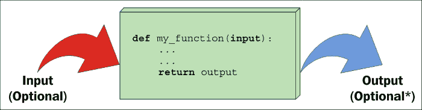
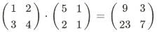
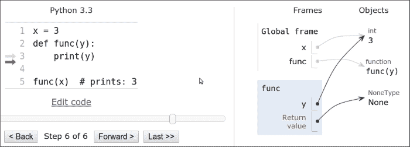
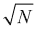

# 第四章 函数，代码的构建块

|   | *"创造建筑就是整理。整理什么？功能和对象。" |   |
| --- | --- | --- |
|   | --*勒·柯布西耶* |

在本章中，我们将探讨函数。我们之前已经说过，在 Python 中，一切都是对象，函数也不例外。但是，函数究竟是什么呢？**函数**是一系列执行任务的指令序列，作为一个单元捆绑在一起。这个单元可以随后导入并在需要的地方使用。使用函数在代码中有许多优点，我们很快就会看到。

我认为“一图胜千言”这句话在向一个对这一概念新手解释函数时尤其正确，所以请看一下下面的图片：



如你所见，函数是一块指令的集合，作为一个整体打包，就像一个盒子。函数可以接受输入参数并产生输出值。这两个都是可选的，正如我们在本章的例子中将会看到的。

在 Python 中，函数是通过使用`def`关键字定义的，之后跟随着函数名，由一对括号（可能包含或不包含输入参数）终止，最后，一个冒号（`:`）标志着函数定义行的结束。紧接着，缩进四个空格，我们找到函数的主体，这是函数被调用时将执行的一组指令。

### 注意

注意，使用四个空格缩进不是强制性的，但它是由**PEP8**建议的空格数量，在实践中，这是最广泛使用的缩进度量。

函数可能返回也可能不返回输出。如果函数想要返回输出，它将通过使用`return`关键字，后跟所需的输出来实现。如果你有敏锐的眼睛，你可能已经注意到了前一张图片输出部分**可选**后面的一个小星号。这是因为 Python 中的函数总是返回某些东西，即使你没有明确使用`return`子句。如果一个函数在其主体中没有`return`语句，它的返回值是`None`。这个设计选择背后的原因超出了入门章节的范围，所以你只需要知道这种行为会像往常一样使你的生活更轻松，感谢 Python。

# 为什么使用函数？

函数是任何语言中最重要和最基本的概念和结构之一，所以让我给你几个为什么我们需要它们的原因：

+   它们减少了程序中的代码重复。通过让一个特定的任务由一个漂亮的打包代码块来处理，我们可以随时导入和调用它，我们不需要重复其实现。

+   他们帮助将复杂任务或程序拆分成更小的块，每个块都成为一个函数。

+   他们将实现细节隐藏给用户。

+   它们提高了可追溯性。

+   它们提高了可读性。

让我们看看一些例子，以更好地理解每个要点。

## 减少代码重复

想象一下，你正在编写一段科学软件，你需要计算到某个限制的质数，就像我们在上一章所做的那样。你编写了几个算法和质数，作为许多不同类型计算的基础，不断地出现在你的代码中。好吧，你有一个计算它们的良好算法，所以你把它复制粘贴到你需要的地方。然而，有一天，你的朋友**聪明先生**给你提供了一个更好的计算质数的算法，这将为你节省很多时间。在这个时候，你需要检查整个代码库，用新代码替换旧代码。

实际上，这是一种非常糟糕的做法。它容易出错，你永远不知道在复制粘贴代码时，你会不小心删除或留下哪些行，你还有可能错过进行质数计算的地方，导致你的软件出现不同版本。你能想象如果你发现旧方法有错误吗？你会在代码中有一个未检测到的错误，而这种错误很难被发现，尤其是在大型代码库中。

那么，你应该怎么做呢？很简单！你编写一个函数，`get_prime_numbers(upto)`，并在你需要质数列表的地方使用它。当**聪明先生**来给你新代码时，你只需要替换那个函数的主体部分，然后你就完成了！其余的软件将自动适应，因为它只是调用函数。

你的代码会更短，它不会因为旧方法和新方法执行任务的不一致，或者由于复制粘贴失败或疏忽而导致的未检测到的错误而受到影响。使用函数，我保证你只会从中受益。

## 分解复杂任务

函数也非常有用，可以将一个长或复杂的任务分解成更小的部分。结果是，代码在多个方面都从中受益，例如可读性、可测试性和可重用性。为了给你一个简单的例子，想象一下你正在准备一份报告。你的代码需要从数据源获取数据，解析它，过滤它，润色它，然后需要对它运行一系列算法，以便生成将喂养`Report`类的结果。阅读这样的程序并不罕见，它们只是一个大函数`do_report(data_source)`。有成百上千行代码以`return report`结束。

这种情况在科学家编写的代码中很常见。他们有卓越的头脑，他们关心最终结果是否正确，但不幸的是，他们有时没有编程理论的训练。这不是他们的错，没有人能知道一切。现在，在你的脑海中想象一些类似几百行代码的东西。要跟得上是非常困难的，要找到事情改变上下文的地方（比如完成一个任务，开始下一个任务）。你在脑海中形成了这样的画面吗？很好。不要这样做！相反，看看这段代码：

`data.science.example.py`

```py
def do_report(data_source):
    # fetch and prepare data
    data = fetch_data(data_source)
    parsed_data = parse_data(data)
    filtered_data = filter_data(parsed_data)
    polished_data = polish_data(filtered_data)

    # run algorithms on data
    final_data = analyse(polished_data)

    # create and return report
    report = Report(final_data)
    return report
```

前面的例子当然是虚构的，但你能否看到遍历代码有多容易？如果最终结果看起来不正确，将非常容易调试`do_report`函数中的每个单独的数据输出。此外，从整个流程中暂时排除部分过程（你只需要注释掉你需要暂停的部分）甚至更容易。这样的代码更容易处理。

## 隐藏实现细节

让我们继续前面的例子来讨论这个观点。你可以看到，通过阅读`do_report`函数的代码，你可以在不阅读一行实现代码的情况下获得相当好的理解。这是因为函数隐藏了实现细节。这个特性意味着，如果你不需要深入了解细节，你就不必像`do_report`只是一个庞大的函数那样被迫这样做。为了理解发生了什么，你必须阅读实现细节。你不需要用函数这样做。这减少了你阅读代码的时间，因为在专业环境中，阅读代码所花费的时间比实际编写代码的时间要多得多，因此尽可能地减少它是非常重要的。

## 提高可读性

编程者有时看不到写一个只有一到两行代码的函数的意义，所以让我们看看一个例子，展示你为什么应该这样做。

想象一下你需要乘以两个矩阵：



你更愿意阅读以下代码吗？

`matrix.multiplication.nofunc.py`

```py
a = [[1, 2], [3, 4]]
b = [[5, 1], [2, 1]]
c = [[sum(i * j for i, j in zip(r, c)) for c in zip(*b)]
 for r in a]

```

或者你更喜欢这个吗？

`matrix.multiplication.func.py`

```py
# this function could also be defined in another module
def matrix_mul(a, b):
    return [[sum(i * j for i, j in zip(r, c)) for c in zip(*b)]
            for r in a]

a = [[1, 2], [3, 4]]
b = [[5, 1], [2, 1]]
c = matrix_mul(a, b)

```

在第二个例子中，理解`c`是`a`和`b`相乘的结果要容易得多。阅读代码要容易得多，而且如果你不需要修改这部分，你甚至不需要进入实现细节。

因此，这里的可读性得到了提高，而在第一个片段中，你将不得不花时间试图理解那个复杂的列表解析到底在做什么。

### 注意

如果你不理解*列表解析*，不要担心，我们将在下一章学习它们。

## 提高可追溯性

假设你已经编写了一个电子商务网站。你在页面上到处显示了产品价格。想象一下，你的数据库中存储的价格没有增值税，但你希望在网站上以 20% 的增值税显示它们。这里有几种从不含增值税的价格计算增值税含税价格的方法。

`vat.py`

```py
price = 100  # GBP, no VAT
final_price1 = price * 1.2
final_price2 = price + price / 5.0
final_price3 = price * (100 + 20) / 100.0
final_price4 = price + price * 0.2
```

所有这四种计算增值税含税价格的方法都是完全可以接受的，我保证我在过去几年里在我的同事的代码中找到了它们。现在，想象一下，你已经开始在不同的国家销售你的产品，其中一些国家有不同的增值税率，因此你需要重构你的代码（在整个网站上）以便使增值税计算动态化。

你如何追踪你执行增值税计算的所有地方？现在的编码是一个协作任务，你不能确定增值税是否只使用这些形式之一进行计算。相信我，那将会是一场灾难。

因此，让我们编写一个函数，它接受输入值 `vat` 和 `price`（不含增值税），并返回增值税含税价格。

`vat.function.py`

```py
def calculate_price_with_vat(price, vat):
    return price * (100 + vat) / 100
```

现在，你可以导入这个函数并在你网站上需要计算增值税含税价格的地方应用它，当你需要追踪这些调用时，你可以搜索 `calculate_price_with_vat`。

### 注意

注意，在先前的例子中，`price` 被假定为不含增值税，而 `vat` 有一个百分比值（例如，19、20、23 等等）。

# 作用域和名称解析

你还记得我们在第一章讨论作用域和命名空间的时候吗？现在我们将扩展这个概念。最后，我们可以讨论函数，这将使一切更容易理解。让我们从一个非常简单的例子开始。

`scoping.level.1.py`

```py
def my_function():
    test = 1 # this is defined in the local scope of the function
    print('my_function:', test)

test = 0  # this is defined in the global scope
my_function()
print('global:', test)
```

在前面的例子中，我在两个不同的地方定义了 `test` 这个名字。实际上，它位于两个不同的作用域中。一个是全局作用域（`test = 0`），另一个是函数 `my_function` 的局部作用域（`test = 1`）。如果你执行代码，你会看到这个：

```py
$ python scoping.level.1.py
my_function: 1
global: 0

```

很明显，`test = 1` 在 `my_function` 中覆盖了赋值 `test = 0`。在全局上下文中，`test` 仍然是 `0`，正如你可以从程序的输出中看到的那样，但我们再次在函数体中定义了 `test` 这个名字，并将其设置为指向值为 `1` 的整数。因此，这两个 `test` 名字都存在，一个在全局作用域中，指向值为 0 的 `int` 对象，另一个在 `my_function` 作用域中，指向值为 1 的 `int` 对象。让我们注释掉 `test = 1` 这一行。Python 会去下一个封装的作用域中寻找 `test` 这个名字（回想一下 *LEGB* 规则：*Local*，*Enclosing*，*Global*，*Built-in*，在第一章第一章。介绍和第一步 – 深呼吸中描述），在这种情况下，我们会看到值 `0` 被打印两次。在你的代码中试一试。

现在，让我们提高难度，提升一个层次：

`scoping.level.2.py`

```py
def outer():
    test = 1  # outer scope

    def inner():
        test = 2  # inner scope
        print('inner:', test)
    inner()
    print('outer:', test)
test = 0  # global scope
outer()
print('global:', test)
```

在前面的代码中，我们有两个级别的阴影。一个级别在函数`outer`中，另一个级别在函数`inner`中。这并不复杂，但可能会有些棘手。如果我们运行代码，我们会得到：

```py
$ python scoping.level.2.py 
inner: 2
outer: 1
global: 0

```

尝试注释掉这一行`test = 1`。你认为结果会怎样？嗯，当执行到`print('outer:', test)`这一行时，Python 将不得不在下一个封闭作用域中寻找`test`，因此它会找到并打印`0`，而不是`1`。确保你也注释掉`test = 2`，以便理解发生了什么，并且在继续之前，LEGB 规则是清晰的。

另一点需要注意的是，Python 允许你在另一个函数中定义一个函数。内部函数的名称是在外部函数的命名空间中定义的，这与任何其他名称的情况完全相同。

## 全局和非局部语句

回到前面的例子，我们可以通过使用这两个特殊语句之一来改变对`test`名字的阴影：`global`和`nonlocal`。正如你从前面的例子中看到的，当我们函数`inner`中定义`test = 2`时，我们既没有在函数`outer`中也没有在全局作用域中覆盖`test`。如果我们使用它们在未定义它们的嵌套作用域中，我们可以获取对这些名字的读取访问，但我们不能修改它们，因为当我们写一个赋值指令时，我们实际上是在当前作用域中定义一个新的名字。

我们如何改变这种行为？嗯，我们可以使用`nonlocal`语句。根据官方文档：

> *"`nonlocal`语句使列出的标识符引用最近封闭作用域中先前绑定的变量，但不包括全局变量。"*

让我们在函数`inner`中引入它，看看会发生什么：

`scoping.level.2.nonlocal.py`

```py
def outer():
    test = 1  # outer scope

    def inner():
        nonlocal test
        test = 2  # nearest enclosing scope
        print('inner:', test)
    inner()
    print('outer:', test)

test = 0  # global scope
outer()
print('global:', test)
```

注意，在函数`inner`的主体中，我已经将`test`这个名字声明为`nonlocal`。运行这段代码会产生以下结果：

```py
$ python scoping.level.2.nonlocal.py 
inner: 2
outer: 2
global: 0

```

哇，看看那个结果！这意味着，通过在函数`inner`中将`test`声明为`nonlocal`，我们实际上将`test`这个名字绑定到了函数`outer`中声明的那个。如果我们从函数`inner`中移除`nonlocal test`这一行，并在函数`outer`中尝试同样的技巧，我们会得到一个`SyntaxError`，因为`nonlocal`语句作用于封闭作用域，但不包括全局作用域。

那么有没有办法在全局命名空间中访问到`test = 0`呢？当然，我们只需要使用`global`语句。让我们试试。

`scoping.level.2.global.py`

```py
def outer():
    test = 1  # outer scope

    def inner():
        global test
        test = 2  # global scope
        print('inner:', test)
    inner()
    print('outer:', test)

test = 0  # global scope
outer()
print('global:', test)
```

注意，我们现在已经将名字`test`声明为`global`，这基本上会将它绑定到我们在全局命名空间中定义的那个（`test = 0`）。运行代码，你应该会得到以下结果：

```py
$ python scoping.level.2.global.py
inner: 2
outer: 1
global: 2

```

这表明受 `test = 2` 赋值影响的名称现在是全局的。这个技巧在 `outer` 函数中也会起作用，因为在这种情况下，我们是在引用全局作用域。自己试一试，看看会发生什么变化，熟悉作用域和名称解析，这非常重要。

# 输入参数

在本章的开头，我们看到了一个函数可以接受输入参数。在我们深入所有可能的参数类型之前，让我们确保你对将参数传递给函数的含义有一个清晰的理解。有三个关键点需要记住：

+   参数传递不过是将一个对象赋值给一个局部变量名

+   在函数内部将对象赋值给参数名称不会影响调用者

+   在函数中更改可变对象参数会影响调用者

让我们看看每个这些点的例子。

## 参数传递

看看下面的代码。我们在全局作用域中声明了一个名为 `x` 的变量，然后我们声明了一个函数 `func(y)` 并调用它，传递了 `x`。我在代码中突出了这个调用。

`key.points.argument.passing.py`

```py
x = 3
def func(y):
    print(y)
func(x)  # prints: 3
```

当用 `x` 调用 `func` 时，在它的局部作用域内，创建了一个名为 `y` 的变量，并且它指向了与 `x` 相同的对象。以下图片可以更好地说明这一点：



前一张图的右侧展示了程序执行到达末尾时的状态，在 `func` 返回 (`None`) 之后。看看 **Frames** 这一列，注意我们在全局命名空间（**Global frame**）中有两个名称，**x** 和 **func**，分别指向一个 **int**（值为三）和一个函数对象。在其下方，在标题为 **func** 的矩形中，我们可以看到函数的局部命名空间，其中只定义了一个名称：**y**。因为我们用 **x**（图片左侧的第五行）调用了 **func**，所以 **y** 指向了与 **x** 相同的对象。这就是当将参数传递给函数时幕后发生的事情。如果我们用 **x** 而不是 **y** 在函数定义中使用，事情将会完全一样（可能一开始会有些困惑），函数中会有一个局部的 **x**，外部有一个全局的 **x**，就像我们在 *作用域和名称解析* 部分看到的那样。

简而言之，真正发生的事情是函数在其局部作用域中创建了定义为参数的名称，当我们调用它时，我们基本上告诉 Python 这些名称必须指向哪些对象。

## 参数名称的赋值不会影响调用者

这一开始可能有点难以理解，所以让我们看看一个例子。

`key.points.assignment.py`

```py
x = 3
def func(x):
    x = 7  # defining a local x, not changing the global one

func(x)
print(x)  # prints: 3
```

在前面的代码中，当执行到 `x = 7` 这一行时，发生的事情是在函数 `func` 的局部作用域内，名称 `x` 指向了一个值为 7 的整数，而全局的 `x` 保持不变。

## 改变可变对象会影响调用者

这是最后一个要点，它非常重要，因为 Python 显然对可变对象有不同的行为（尽管只是表面上如此）。让我们看一个例子：

`key.points.mutable.py`

```py
x = [1, 2, 3]
def func(x):
    x[1] = 42  # this affects the caller!

func(x)
print(x)  # prints: [1, 42, 3]
```

哇，我们实际上改变了原始对象！如果你这么想，这种行为并没有什么奇怪的。函数中的`x`名称是通过函数调用设置为指向调用者对象的，在函数体内，我们并没有改变`x`，也就是说，我们并没有改变它的引用，或者说，我们并没有改变`x`指向的对象。我们所做的是访问该对象的第 1 个位置的元素，并改变它的值。

记住第 2 点：“*在函数内部将对象赋给参数名称不会影响调用者*”。如果你明白了这一点，下面的代码应该不会让你感到惊讶。

`key.points.mutable.assignment.py`

```py
x = [1, 2, 3]
def func(x):
    x[1] = 42  # this changes the caller!
    x = 'something else'  # this points x to a new string object

func(x)
print(x)  # still prints: [1, 42, 3]
```

看看我高亮显示的两行。起初，我们只是再次访问调用者对象，在位置 1，并将其值更改为数字 42。然后，我们将`x`重新赋值以指向字符串`'something else'`。根据第 2 点，这不会改变调用者，实际上，输出与前面的代码片段相同。

仔细研究这个概念，并通过打印和调用`id`函数进行实验，直到你心中的一切都清楚。这是 Python 的一个关键方面，它必须非常清晰，否则你可能会在代码中引入微妙的错误。

现在我们已经很好地理解了输入参数及其行为，让我们看看我们如何指定它们。

## 如何指定输入参数

有五种不同的方式来指定输入参数。让我们逐一来看。

### 位置参数

位置参数从左到右读取，它们是最常见的参数类型。

`arguments.positional.py`

```py
def func(a, b, c):
    print(a, b, c)
func(1, 2, 3)  # prints: 1 2 3
```

没有多少其他要说的话。它们可以像你想要的那样多，并且它们通过位置进行分配。在函数调用中，`1`排在第一位，`2`排在第二位，`3`排在第三位，因此它们分别分配给`a`、`b`和`c`。

### 关键字参数和默认值

**关键字参数**使用`name=value`语法通过关键字进行分配。

`arguments.keyword.py`

```py
def func(a, b, c):
    print(a, b, c)
func(a=1, c=2, b=3)  # prints: 1 3 2
```

关键字参数在调用函数时起作用，而不是尊重从左到右的位置赋值，k。关键字参数通过名称匹配，即使它们不尊重定义的原始位置（我们将在后面看到，这种行为的限制）。 

在定义方面，关键字参数的对立面是**默认值**。语法相同，`name=value`，这允许我们如果对给定的默认值满意，则不需要提供参数。

`arguments.default.py`

```py
def func(a, b=4, c=88):
    print(a, b, c)

func(1)              # prints: 1 4 88
func(b=5, a=7, c=9)  # prints: 7 5 9
func(42, c=9)        # prints: 42 4 9
```

有两点需要注意，这两点非常重要。首先，你不能在位置参数的左侧指定默认参数。其次，注意在示例中，当一个参数没有使用`argument_name=value`语法传递时，它必须是列表中的第一个参数，并且它总是被分配给`a`。尝试打乱这些参数，看看会发生什么。Python 的错误信息非常擅长告诉你出了什么问题。所以，例如，如果你尝试了以下操作：

```py
func(b=1, c=2, 42)  # positional argument after keyword one
```

你会得到以下错误：

```py
SyntaxError: non-keyword arg after keyword arg

```

这告诉你你调用函数的方式不正确。

### 可变位置参数

有时你可能希望向函数传递一个可变数量的位置参数，Python 为你提供了这样做的能力。让我们看看一个非常常见的用例，即`minimum`函数。这是一个计算输入值最小值的函数。

`arguments.variable.positional.py`

```py
def minimum(*n):
    # print(n)  # n is a tuple
    if n:  # explained after the code
        mn = n[0]
        for value in n[1:]:
            if value < mn:
                mn = value
        print(mn)

minimum(1, 3, -7, 9)  # n = (1, 3, -7, 9) - prints: -7
minimum()             # n = () - prints: nothing
```

如你所见，当我们指定一个参数，在其名称前加上`*`时，我们是在告诉 Python，该参数将根据函数的调用方式收集一个可变数量的位置参数。在函数内部，`n`是一个元组。取消注释`print(n)`来亲自查看并稍作尝试。

### 注意

你有没有注意到我们如何用一个简单的`if n:`来检查`n`是否为空？这是因为收集对象在 Python 中在非空时评估为`True`，否则为`False`。这对元组、集合、列表、字典等都是成立的。

另有一点需要注意，我们可能希望在调用函数时不带任何参数时抛出错误，而不是默默地什么都不做。在这个上下文中，我们并不关心使这个函数健壮，而是理解可变位置参数。

让我们再举一个例子来展示两个在我个人经验中对于初学者来说可能令人困惑的事情。

`arguments.variable.positional.unpacking.py`

```py
def func(*args):
    print(args)

values = (1, 3, -7, 9)
func(values)   # equivalent to: func((1, 3, -7, 9))
func(*values)  # equivalent to: func(1, 3, -7, 9)

```

仔细看看前面示例的最后两行。在第一个例子中，我们用包含四个元素的元组作为参数调用`func`。在第二个例子中，通过使用`*`语法，我们正在进行一种称为**拆包**的操作，这意味着四个元素的元组被拆包，函数被调用时带有四个参数：`1, 3, -7, 9`。

这种行为是 Python 在动态调用函数时允许你做令人惊叹的事情的魔法之一。

### 可变关键字参数

可变关键字参数与可变位置参数非常相似。唯一的区别是语法（使用`**`而不是`*`）以及它们被收集在一个字典中。收集和拆包的工作方式相同，所以让我们看一个例子：

`arguments.variable.keyword.py`

```py
def func(**kwargs):
    print(kwargs)
# All calls equivalent. They print: {'a': 1, 'b': 42}
func(a=1, b=42)
func(**{'a': 1, 'b': 42})
func(**dict(a=1, b=42))
```

在前面的例子中，所有的调用都是等效的。你可以看到，在函数定义中参数名前加上`**`告诉 Python 使用该名称收集可变数量的关键字参数。另一方面，当我们调用函数时，我们可以明确传递`name=value`形式的参数，或者使用相同的`**`语法解包一个字典。

能够传递可变数量的关键字参数之所以如此重要，可能现在还不明显，那么，让我们看看一个更实际的例子？让我们定义一个连接数据库的函数。我们希望通过不带参数调用此函数来连接默认数据库。我们还想通过传递适当的参数来连接任何其他数据库。在你继续阅读之前，花几分钟时间自己想出一个解决方案。

`arguments.variable.db.py`

```py
def connect(**options):
    conn_params = {
        'host': options.get('host', '127.0.0.1'),
        'port': options.get('port', 5432),
        'user': options.get('user', ''),
        'pwd': options.get('pwd', ''),
    }
    print(conn_params)
    # we then connect to the db (commented out)
    # db.connect(**conn_params)

connect()
connect(host='127.0.0.42', port=5433)
connect(port=5431, user='fab', pwd='gandalf')
```

注意在函数中，我们可以使用默认值作为后备来准备一个连接参数的字典（`conn_params`），允许在函数调用中提供时覆盖它们。有更少的代码行数来完成这个任务的方法，但我们现在不关心这个。运行前面的代码会产生以下结果：

```py
$ python arguments.variable.db.py
{'host': '127.0.0.1', 'pwd': '', 'user': '', 'port': 5432}
{'host': '127.0.0.42', 'pwd': '', 'user': '', 'port': 5433}
{'host': '127.0.0.1', 'pwd': 'gandalf', 'user': 'fab', 'port': 5431}

```

注意函数调用与输出的对应关系。注意默认值要么存在，要么被传递给函数的值覆盖。

### 仅关键字参数

Python 3 允许一种新的参数类型：**仅关键字**参数。我们将简要研究它们，因为它们的使用场景并不频繁。指定它们有两种方式，要么在变量位置参数之后，要么在裸星号`*`之后。让我们看看两种方式的示例。

`arguments.keyword.only.py`

```py
def kwo(*a, c):
    print(a, c)

kwo(1, 2, 3, c=7)  # prints: (1, 2, 3) 7
kwo(c=4)           # prints: () 4
# kwo(1, 2)  # breaks, invalid syntax, with the following error
# TypeError: kwo() missing 1 required keyword-only argument: 'c'

def kwo2(a, b=42, *, c):
    print(a, b, c)

kwo2(3, b=7, c=99)  # prints: 3 7 99
kwo2(3, c=13)       # prints: 3 42 13
# kwo2(3, 23)  # breaks, invalid syntax, with the following error
# TypeError: kwo2() missing 1 required keyword-only argument: 'c'
```

如预期，函数`kwo`接受一个可变数量的位置参数（`a`）和一个仅关键字函数`c`。调用的结果很简单，你可以取消注释第三个调用以查看 Python 返回的错误。

同样的规则也适用于函数`kwo2`，它与`kwo`的不同之处在于它接受一个位置参数`a`，一个关键字参数`b`，然后是一个仅关键字参数`c`。你可以取消注释第三个调用以查看错误。

现在你已经知道了如何指定不同类型的输入参数，让我们看看如何在函数定义中组合它们。

### 组合输入参数

只要遵循以下排序规则，你就可以组合输入参数：

+   在定义函数时，正常的位置参数先于（`name`），然后是任何默认参数（`name=value`），然后是变量位置参数（`*name`，或者简单地`*`），然后是任何仅关键字参数（`name`或`name=value`形式均可），最后是任何变量关键字参数（`**name`）。

+   另一方面，在调用函数时，必须按照以下顺序提供参数：首先是位置参数（`value`），然后是任何组合的关键字参数（`name=value`），然后是可变位置参数（`*name`），最后是可变关键字参数（`**name`）。

由于这可能在理论世界中悬而未决，让我们看看几个快速示例。

`arguments.all.py`

```py
def func(a, b, c=7, *args, **kwargs):
    print('a, b, c:', a, b, c)
    print('args:', args)
    print('kwargs:', kwargs)

func(1, 2, 3, *(5, 7, 9), **{'A': 'a', 'B': 'b'})
func(1, 2, 3, 5, 7, 9, A='a', B='b')  # same as previous one
```

注意函数定义中参数的顺序，以及两个调用是等效的。在第一个调用中，我们使用了可迭代对象和字典的解包操作符，而在第二个调用中，我们使用了更明确的语法。执行结果如下（我只打印了一个调用的结果）：

```py
$ python arguments.all.py 
a, b, c: 1 2 3
args: (5, 7, 9)
kwargs: {'A': 'a', 'B': 'b'}

```

让我们现在来看一个有关关键字参数的例子。

`arguments.all.kwonly.py`

```py
def func_with_kwonly(a, b=42, *args, c, d=256, **kwargs):
    print('a, b:', a, b)
    print('c, d:', c, d)
    print('args:', args)
    print('kwargs:', kwargs)

# both calls equivalent
func_with_kwonly(3, 42, c=0, d=1, *(7, 9, 11), e='E', f='F')
func_with_kwonly(3, 42, *(7, 9, 11), c=0, d=1, e='E', f='F')
```

注意，我在函数声明中突出显示了关键字参数。它们位于可变位置参数`*args`之后，如果它们直接跟在单个`*`之后（在这种情况下，将没有可变位置参数），结果也会相同。执行结果如下（我只打印了一个调用的结果）：

```py
$ python arguments.all.kwonly.py
a, b: 3 42
c, d: 0 1
args: (7, 9, 11)
kwargs: {'f': 'F', 'e': 'E'}

```

另有一件事需要注意是我给可变位置参数和关键字参数取的名字。你可以自由选择不同的名字，但请注意，`args`和`kwargs`是这些参数的传统名称，至少在通用意义上。现在，既然你已经知道了如何以所有可能的方式定义函数，让我给你展示一个有点棘手的东西：可变默认值。

### 避免陷阱！可变默认值

在 Python 中，有一件事需要我们非常注意，那就是默认值是在`def`时创建的，因此，对同一函数的后续调用可能会根据其默认值的可变性表现出不同的行为。让我们来看一个例子：

`arguments.defaults.mutable.py`

```py
def func(a=[], b={}):
    print(a)
    print(b)
    print('#' * 12)
    a.append(len(a))  # this will affect a's default value
    b[len(a)] = len(a)  # and this will affect b's one

func()
func()
func()
```

这两个参数都有可变默认值。这意味着，如果你影响了这些对象，任何修改都会在后续的函数调用中保留。看看你是否能理解这些调用的输出：

```py
$ python arguments.defaults.mutable.py
[]
{}
############
[0]
{1: 1}
############
[0, 1]
{1: 1, 2: 2}
############

```

这很有趣，不是吗？虽然一开始这种行为可能看起来非常奇怪，但实际上它是有道理的，而且非常方便，例如，在使用记忆化技术时（如果你感兴趣，可以谷歌搜索一个例子）。

更有趣的是，当在调用之间引入一个不使用默认值的调用时会发生什么，就像这样：

`arguments.defaults.mutable.intermediate.call.py`

```py
func()
func(a=[1, 2, 3], b={'B': 1})
func()
```

当我们运行这段代码时，这是输出结果：

```py
$ python arguments.defaults.mutable.intermediate.call.py 
[]
{}
############
[1, 2, 3]
{'B': 1}
############
[0]
{1: 1}
############

```

这个输出显示，即使我们用其他值调用函数，默认值也会保留。一个自然而然的问题就是，我如何每次都得到一个全新的空值？嗯，惯例是这样的：

`arguments.defaults.mutable.no.trap.py`

```py
def func(a=None):
    if a is None:
 a = []
    # do whatever you want with `a` ...
```

注意，通过使用前面的技术，如果在调用函数时没有传递`a`，你总是会得到一个全新的空列表。

好的，关于输入的部分就到这里吧，让我们来看看硬币的另一面，输出。

# 返回值

函数的返回值是那些 Python 在大多数其他语言中领先的地方之一。通常允许函数返回一个对象（一个值），但在 Python 中，你可以返回一个元组，这意味着你可以返回任何你想要的东西。这个特性允许程序员编写在其他任何语言中难以编写或肯定更繁琐的软件。我们之前已经说过，要从函数中返回某些内容，我们需要使用`return`语句，后面跟着我们想要返回的内容。在函数体中可以有任意多的`return`语句。

另一方面，如果在函数体中我们不返回任何内容，函数将返回`None`。这种行为是无害的，尽管我没有足够的空间在这里详细解释为什么 Python 被设计成这样，但让我告诉你，这个特性允许实现几个有趣的模式，并证实 Python 是一个非常一致的语言。

我认为这是无害的，因为你永远不会被迫收集函数调用的结果。我会用一个例子来展示我的意思：

`return.none.py`

```py
def func():
    pass
func()  # the return of this call won't be collected. It's lost.
a = func()  # the return of this one instead is collected into `a`
print(a)  # prints: None

```

注意，整个函数体只包含`pass`语句。正如官方文档所告诉我们的，`pass`是一个空操作。当它被执行时，什么都不会发生。当需要语法上的语句但不需要执行任何代码时，它很有用。在其他语言中，我们可能会用一对花括号（`{}`）来表示，这对花括号定义了一个*空范围*，但在 Python 中，范围是通过缩进来定义的，因此需要一个像`pass`这样的语句。

还要注意，函数`func`的第一个调用返回一个值（`None`），我们没有收集它。正如我之前说的，收集函数调用的返回值不是强制的。

现在，这很好，但不是很吸引人，那么我们写一个有趣的函数怎么样？记住，在第一章中，*简介和第一步 – 深呼吸*，我们讨论了函数的阶乘。让我们在这里写一个自己的（为了简单起见，我将假设函数总是以适当的值正确调用，所以我不需要在输入参数上进行合理性检查）：

`return.single.value.py`

```py
def factorial(n):
    if n in (0, 1):
        return 1
    result = n
    for k in range(2, n):
        result *= k
    return result

f5 = factorial(5)  # f5 = 120
```

注意，我们有两个返回点。如果`n`是`0`或`1`（在 Python 中，使用`in`类型的检查比更冗长的`if n == 0 or n == 1:`更常见），我们返回`1`。否则，我们执行所需的计算，并返回`result`。我们能把这个函数写得更有 Python 风格吗？是的，但我会让你自己作为练习来找出这一点。

`return.single.value.2.py`

```py
from functools import reduce
from operator import mul

def factorial(n):
    return reduce(mul, range(1, n + 1), 1)
f5 = factorial(5)  # f5 = 120
```

我知道你在想什么，一行？Python 既优雅又简洁！我认为即使你没有见过`reduce`或`mul`，这个函数也是可读的，但如果你不能阅读它或理解它，请留出几分钟时间，做一些关于 Python 文档的研究，直到你对其行为有清晰的认识。在文档中查找函数并理解他人编写的代码是每个开发者都需要能够执行的任务，所以把这看作是一个好的练习，祝你好运！

### 小贴士

为了这个目的，确保你查阅了`help`函数，这在用控制台探索时非常有用。

## 返回多个值

与大多数其他语言不同，在 Python 中从函数中返回多个对象非常容易。这个特性打开了一个全新的世界，并允许你以其他语言难以复制的风格进行编码。我们的思维受到我们使用的工具的限制，因此当 Python 给你比其他语言更多的自由时，实际上是在提升你自己的创造力。要返回多个值非常简单，你只需使用元组（无论是显式还是隐式）。让我们看看一个简单的例子，它模拟了内置的`divmod`函数：

`return.multiple.py`

```py
def moddiv(a, b):
    return a // b, a % b

print(moddiv(20, 7))  # prints (2, 6)
```

我本可以将前面代码中高亮的部分用大括号括起来，使其成为一个显式的元组，但这样做没有必要。前面的函数同时返回了除法的结果和余数。

# 一些有用的技巧

在编写函数时，遵循一些指导原则非常有用，这样你就能写出好的函数。我会快速指出其中的一些：

+   **函数应该只做一件事**：只做一件事的函数可以用一句话简单描述。做多件事的函数可以拆分成更小的函数，这些小函数通常更容易阅读和理解。记得我们之前几页看到的那个数据科学例子。

+   **函数应该小而简单**：它们越小，就越容易测试，也越容易编写，以便它们只做一件事。

+   **输入参数越少越好**：需要很多参数的函数很快就会变得难以管理（以及其他问题）。

+   **函数的返回值应该一致**：返回`False`或`None`并不相同，即使它们在布尔上下文中都评估为`False`。`False`表示我们有信息（`False`），而`None`表示没有信息。尝试编写在函数体中无论发生什么都能以一致方式返回的函数。

+   **函数不应该有副作用**：换句话说，函数不应该影响你调用它们时传递的值。这一点可能是目前最难理解的观点，所以我将用一个使用列表的例子来解释。在下面的代码中，注意`numbers`并不是由`sorted`函数排序的，实际上`sorted`函数返回的是`numbers`的排序副本。相反，`list.sort()`方法是在`numbers`对象本身上操作的，这是可以的，因为它是一个方法（一个属于对象的函数，因此有权修改它）：

    ```py
    >>> numbers = [4, 1, 7, 5]
    >>> sorted(numbers)  # won't sort the original `numbers` list
    [1, 4, 5, 7]
    >>> numbers  # let's verify
    [4, 1, 7, 5]  # good, untouched
    >>> numbers.sort()  # this will act on the list
    >>> numbers
    [1, 4, 5, 7]

    ```

遵循这些指南，你将能写出更好的函数，这对你的工作大有裨益。

### 注意

*《Clean Code》第三章节，*函数*，由罗伯特·C·马丁撰写，由 Prentice Hall 出版，专门讨论函数，这可能是我在这个主题上读过的最好的指南集。

# 递归函数

当一个函数调用自身以产生结果时，它被称为**递归**。有时递归函数非常有用，因为它们使编写代码变得更容易。有些算法使用递归范式编写起来非常容易，而有些则不然。没有哪个递归函数不能重写为迭代形式，所以通常取决于程序员根据具体情况选择最佳方法。

递归函数通常有一组基本案例，其返回值不依赖于对函数本身的后续调用，以及一组递归案例，其返回值是通过一个或多个对函数本身的调用来计算的。

例如，我们可以考虑（希望现在已经熟悉）的`factorial`函数 *N!*。基本案例是当 *N* 为 0 或 1 时。函数不需要进一步计算就返回 1。另一方面，在一般情况下，*N!* 返回 *1 * 2 * ... * (N-1) * N* 的乘积。如果你这么想，*N!* 可以重写为：*N! = (N-1)! * N*。作为一个实际例子，考虑 *5! = 1 * 2 * 3 * 4 * 5 = (1 * 2 * 3 * 4) * 5 = 4! * 5*。

让我们用代码来记录这一点：

`recursive.factorial.py`

```py
def factorial(n):
    if n in (0, 1):  # base case
        return 1
    return factorial(n - 1) * n  # recursive case
```

### 注意

当编写递归函数时，始终考虑你做了多少嵌套调用，这是有限制的。有关此方面的更多信息，请查看`sys.getrecursionlimit()`和`sys.setrecursionlimit()`。

在编写算法时，递归函数被大量使用，编写它们确实很有趣。作为一个好的练习，尝试使用递归和迭代两种方法解决几个简单的问题。

# 匿名函数

我还想讨论的一种函数类型是**匿名**函数。这些函数在 Python 中被称为**lambda**函数，通常在不需要具有自己名称的完整函数时使用，我们只需要一个快速、简单的单行代码来完成工作。

假设你想要一个包含所有乘以五的数字的列表，直到*N*。假设你想使用`filter`函数过滤这些数字，该函数接受一个函数和一个可迭代对象，并从返回`True`的可迭代对象元素中构建一个过滤器对象，你可以迭代它。不使用匿名函数，你会这样做：

`filter.regular.py`

```py
def is_multiple_of_five(n):
    return not n % 5
def get_multiples_of_five(n):
    return list(filter(is_multiple_of_five, range(n)))
print(get_multiples_of_five(50))
```

我突出了`get_multiples_of_five`的主要逻辑。注意过滤器如何使用`is_multiple_of_five`来过滤前*n*个自然数。这似乎有点过度，任务很简单，我们不需要保留`is_multiple_of_five`函数用于其他任何事情。让我们使用 lambda 函数重写它：

`filter.lambda.py`

```py
def get_multiples_of_five(n):
    return list(filter(lambda k: not k % 5, range(n)))
print(get_multiples_of_five(50))
```

逻辑完全相同，但过滤函数现在是一个 lambda。定义 lambda 非常简单，遵循以下形式：`func_name = lambda [parameter_list]: expression`。返回的是一个函数对象，它与以下内容等价：`def func_name([parameter_list]): return expression`。

### 注意

注意，可选参数按照常见的语法用方括号括起来表示。

让我们看看两种形式定义的等价函数的另一个例子：

`lambda.explained.py`

```py
# example 1: adder
def adder(a, b):
 return a + b
# is equivalent to:
adder_lambda = lambda a, b: a + b

# example 2: to uppercase
def to_upper(s):
 return s.upper()
# is equivalent to:
to_upper_lambda = lambda s: s.upper()

```

上述示例非常简单。第一个示例是添加两个数字，第二个示例是生成字符串的大写版本。请注意，我将`lambda`表达式返回的值赋给了一个名字（`adder_lambda`、`to_upper_lambda`），但在我们之前在`filter`示例中使用 lambda 的方式时，并不需要这样做。

# 函数属性

每个函数都是一个完整的对象，因此它们具有许多属性。其中一些是特殊的，可以在运行时以自省的方式使用，以检查函数对象。以下脚本是一个示例，展示了所有这些属性以及如何显示示例函数的值：

`func.attributes.py`

```py
def multiplication(a, b=1):
    """Return a multiplied by b. """
    return a * b

special_attributes = [
    "__doc__", "__name__", "__qualname__", "__module__",
    "__defaults__", "__code__", "__globals__", "__dict__",
    "__closure__", "__annotations__", "__kwdefaults__",
]

for attribute in special_attributes:
    print(attribute, '->', getattr(multiplication, attribute))
```

我使用了内置的`getattr`函数来获取这些属性的值。`getattr(obj, attribute)`等同于`obj.attribute`，在需要使用字符串名称在运行时获取属性时非常有用。运行此脚本会产生：

```py
$ python func.attributes.py 
__doc__ -> Return a multiplied by b. 
__name__ -> multiplication
__qualname__ -> multiplication
__module__ -> __main__
__defaults__ -> (1,)
__code__ -> <code object multiplication at 0x7ff529e79300, file "ch4/func.attributes.py", line 1>
__globals__ -> {... omitted ...}
__dict__ -> {}
__closure__ -> None
__annotations__ -> {}
__kwdefaults__ -> None

```

我省略了`__globals__`属性的值，因为它太大。关于此属性含义的解释可以在*Python 数据模型*文档页面的*类型*部分找到。

# 内置函数

Python 自带了许多内置函数。它们在任何地方都可以使用，你可以通过检查`builtin`模块的`dir(__builtin__)`或访问官方 Python 文档来获取它们的列表。不幸的是，我没有足够的空间在这里全部介绍它们。我们已经看到了一些，例如`any`、`bin`、`bool`、`divmod`、`filter`、`float`、`getattr`、`id`、`int`、`len`、`list`、`min`、`print`、`set`、`tuple`、`type`和`zip`，但还有很多，你应该至少阅读一次。

熟悉它们，进行实验，为每个编写一小段代码，确保你能够随时使用它们。

# 一个最后的例子

在我们结束这一章之前，不妨举一个最后的例子？我想我们可以编写一个函数来生成一个小于等于某个限制的质数列表。我们已经看到了这段代码，让我们将其变成一个函数，并且为了保持趣味性，让我们对其进行一些优化。

实际上，你不需要将一个数除以从 2 到 *N*-1 的所有数来决定一个数 *N* 是否为质数。你可以在  处停止。此外，你不需要对从 2 到  的所有数进行除法测试，你只需使用该范围内的质数即可。如果你感兴趣，我会让你自己找出为什么这会起作用。让我们看看代码如何变化：

`primes.py`

```py
from math import sqrt, ceil

def get_primes(n):
    """Calculate a list of primes up to n (included). """
    primelist = []
    for candidate in range(2, n + 1):
        is_prime = True
        root = int(ceil(sqrt(candidate)))  # division limit
        for prime in primelist:  # we try only the primes
            if prime > root:  # no need to check any further
                break
            if candidate % prime == 0:
                is_prime = False
                break
        if is_prime:
            primelist.append(candidate)
    return primelist
```

代码与上一章相同。我们改变了除法算法，以便我们只使用之前计算出的质数来测试可除性，并且一旦测试除数大于候选数的平方根，我们就停止测试。我们使用一个花哨的公式来计算根值，即候选数根的整数上界。虽然简单的 `int(k ** 0.5) + 1` 也能达到我们的目的，但我选择的公式更简洁，需要我使用几个导入，我想向你展示。查看 `math` 模块中的函数，它们非常有趣！

# 记录你的代码

我非常喜欢不需要文档的代码。当你正确编程，选择合适的名称并注意细节时，你的代码应该是自解释的，不需要文档。尽管有时注释和一些文档非常有用。你可以通过 *PEP257 – Docstring conventions* 找到记录 Python 的指南，但我会在这里展示基础知识。

Python 使用字符串进行文档记录，这些字符串被称为 **docstrings**。任何对象都可以进行文档记录，你可以使用单行或多行 docstrings。单行非常简单。它们不应该为函数提供另一个签名，但应清楚地说明其目的。

`docstrings.py`

```py
def square(n):
    """Return the square of a number n. """
    return n ** 2

def get_username(userid):
    """Return the username of a user given their id. """
    return db.get(user_id=userid).username
```

使用三重双引号字符串可以让你轻松地稍后扩展。使用以句号结尾的句子，并且不要在前后留空白行。

多行注释的结构与此类似。应该有一行简短地描述对象的主要内容，然后是一个更详细的描述。例如，我使用 Sphinx 语法在以下示例中记录了一个虚构的 `connect` 函数。

### 注意

**Sphinx** 可能是创建 Python 文档最广泛使用的工具。实际上，官方的 Python 文档就是用它编写的。花些时间了解它绝对是值得的。

`docstrings.py`

```py
def connect(host, port, user, password):
    """Connect to a database.

    Connect to a PostgreSQL database directly, using the given
    parameters.

    :param host: The host IP.
    :param port: The desired port.
    :param user: The connection username.
    :param password: The connection password.
    :return: The connection object.
    """
    # body of the function here...
    return connection
```

# 导入对象

现在你对函数了解得很多了，让我们看看如何使用它们。编写函数的整个目的就是为了能够以后重用它们，在 Python 中这表示将它们导入到你需要的命名空间中。将对象导入命名空间的方法有很多种，但最常见的就是两种：`import module_name` 和 `from module_name import function_name`。当然，这些只是相当简单的例子，但请耐心等待。

形式 `import module_name` 会找到 `module_name` 模块，并在执行 `import` 语句的本地命名空间中为其定义一个名称。

形式 `from module_name import identifier` 比那要复杂一点，但基本上做的是同样的事情。它会找到 `module_name` 并搜索一个属性（或子模块），并将 `identifier` 的引用存储在本地命名空间中。

两种形式都有使用 `as` 子句更改导入对象名称的选项，如下所示：

```py
from mymodule import myfunc as better_named_func
```

为了让你对导入有一个直观的了解，这里有一个例子，来自我几年前编写的一个数论库的测试模块（它在 Bitbucket 上可用）：

`karma/test_nt.py`

```py
import unittest  # imports the unittest module
from math import sqrt  # imports one function from math
from random import randint, sample  # two imports at once

from mock import patch
from nose.tools import (  # multiline import
    assert_equal,
    assert_list_equal,
    assert_not_in,
)

from karma import nt, utils
```

我对其中的一些进行了注释，希望这很容易理解。当你有一个从项目根目录开始的文件结构时，你可以使用点符号来获取你想要导入到当前命名空间的对象，无论是包、模块、类、函数还是其他任何东西。`from module import` 语法还允许一个通配符子句 `from module import *`，有时用于一次性将模块中的所有名称导入到当前命名空间中，但出于几个原因，这并不被推荐：性能、静默覆盖其他名称的风险等等。你可以在官方 Python 文档中找到有关导入的所有信息，但在我们离开这个话题之前，让我给你一个更好的例子。

假设你在一个模块中定义了一些函数：`square(n)` 和 `cube(n)`，该模块名为 `funcdef.py`，位于 `lib` 文件夹中。你想要在位于 `lib` 文件夹同一级别的几个模块中使用它们，这些模块分别叫做 `func_import.py` 和 `func_from.py`。显示该项目的树结构会产生如下内容：

```py
├── func_from.py
├── func_import.py
├── lib
 ├── funcdef.py
 └── __init__.py

```

在我向你展示每个模块的代码之前，请记住，为了告诉 Python 它实际上是一个包，我们需要在其中放置一个 `__init__.py` 模块。

### 注意

关于 `__init__.py` 文件有两点需要注意。首先，它是一个完整的 Python 模块，所以你可以像在其他模块中一样在其中放置代码。其次，从 Python 3.3 开始，它的存在不再是将文件夹解释为 Python 包所必需的。

代码如下：

`funcdef.py`

```py
def square(n):
    return n ** 2
def cube(n):
    return n ** 3
```

`func_import.py`

```py
import lib.funcdef
print(lib.funcdef.square(10))
print(lib.funcdef.cube(10))
```

`func_from.py`

```py
from lib.funcdef import square, cube
print(square(10))
print(cube(10))
```

这两个文件在执行时都会打印`100`和`1000`。你可以看到我们如何根据当前作用域中导入的方式和内容，以不同的方式访问`square`和`cube`函数。

## 相对导入

我们至今所看到的导入被称为绝对导入，也就是说，它们定义了我们想要导入的模块的整个路径，或者我们想要从中导入对象的路径。在 Python 中导入对象还有另一种方式，称为相对导入。在需要重新组织大型包的结构而不必编辑子包，或者当我们想要使包内的模块能够导入自身时，这种方法很有帮助。相对导入是通过在模块前添加与我们需要回溯的文件夹数量相同数量的前导点来完成的，以便找到我们正在寻找的内容。简单来说，它就像这样：

```py
from .mymodule import myfunc
```

对于相对导入的完整解释，请参考**PEP328** ([`www.python.org/dev/peps/pep-0328`](https://www.python.org/dev/peps/pep-0328))。

在后面的章节中，我们将使用不同的库来创建项目，并且我们会使用几种不同类型的导入，包括相对导入，所以请确保你花一些时间在官方 Python 文档中阅读相关内容。

# 摘要

在本章中，我们终于探索了函数的世界。它们极其重要，从现在开始，我们将基本上在所有地方使用它们。我们讨论了使用函数的主要原因，其中最重要的是代码重用和实现隐藏。

我们看到函数对象就像一个盒子，它接受可选输入并产生输出。我们可以通过多种方式向函数提供输入值，使用位置参数和关键字参数，以及使用变量语法来处理这两种类型。

现在你应该知道如何编写一个函数，如何对其进行文档化，将其导入到你的代码中，并调用它。

下一章将迫使我进一步加大油门，所以我建议你抓住任何机会，通过深入研究 Python 官方文档来巩固和丰富你至今所积累的知识。

准备好迎接酷炫的内容了吗？让我们开始吧！
