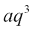
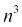
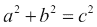
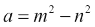
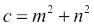
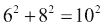
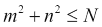
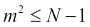
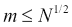

# 第五章：节省时间和内存

|   | *"不是每天的增量，而是每天的减量。砍掉不必要的东西。" |   |
| --- | --- | --- |
|   | --*李小龙* |

我非常喜欢李小龙的这句话，他是一位非常明智的人！特别是，第二部分“砍掉不必要的东西”，对我来说正是使计算机程序优雅的原因。毕竟，如果我们有更好的做事方式，这样我们就不浪费时间和内存，为什么不呢？

有时候，有一些合理的理由不把我们的代码推到最大极限：例如，有时候为了实现微小的改进，我们必须牺牲可读性或可维护性。当我们可以用可读的、干净的代码在 1.05 秒内提供服务时，为什么还要用 1 秒内无法阅读的、复杂的代码来提供服务呢？没有，这没有意义。

另一方面，有时尝试从函数中节省一个毫秒是完全合法的，尤其是当这个函数预期会被调用数千次时。你节省的每一个毫秒都意味着在每次调用中节省一秒钟，这对于你的应用程序来说可能是有意义的。

考虑到这些因素，本章的重点不是给你工具来让你的代码无论什么情况下都能达到性能和优化的绝对极限，而是给你工具来编写高效、优雅的代码，这些代码易于阅读，运行速度快，并且不会以明显的方式浪费资源。

在本章中，我将进行几次测量和比较，并谨慎地得出一些结论。请务必记住，在不同的机器、不同的设置或不同的操作系统上，结果可能会有所不同。看看这段代码：

`squares.py`

```py
def square1(n):
    return n ** 2  # squaring through the power operator

def square2(n):
    return n * n  # squaring through multiplication
```

这两个函数都返回*n*的平方，但哪个更快？从我对他们进行的一个简单基准测试来看，第二个似乎稍微快一点。如果你这么想，这是有道理的：计算一个数的幂涉及乘法，因此，无论你使用什么算法来执行幂运算，它都不太可能比`square2`中的简单乘法更快。

我们是否关心这个结果？在大多数情况下不关心。如果你正在编写一个电子商务网站，你很可能永远不需要将一个数字提高到平方，即使你需要这样做，你可能也只是在每一页上做几次。你不需要担心在一个只调用几次的函数上节省几微秒。

那么，何时优化变得重要呢？一个非常常见的例子是当你必须处理大量数据时。如果你要对一百万个`customer`对象应用相同的函数，那么你希望你的函数调优到最佳状态。在一个被调用一百万次的函数上节省 1/10 秒可以为你节省 100,000 秒，这大约是 27.7 小时。这难道不是一样的吗？所以，让我们专注于集合，看看 Python 提供了哪些工具来高效且优雅地处理它们。

### 注意

本章中我们将看到的大部分概念都基于 **迭代器** 和 **可迭代对象** 的概念。简单来说，就是对象在被询问时返回其下一个元素的能力，以及在耗尽时引发 `StopIteration` 异常的能力。我们将在下一章中看到如何编写自定义的迭代器和可迭代对象。

# map, zip, 和 filter

我们将首先回顾 `map`、`filter` 和 `zip`，这些是在处理集合时可以使用的内置函数的主要函数，然后我们将学习如何使用两个非常重要的结构来实现相同的结果：**列表推导式** 和 **生成器**。系好安全带！

## map

根据官方 Python 文档：

> *`map(function, iterable, ...)` 返回一个迭代器，它将函数应用到可迭代对象的每个元素上，并产生结果。如果传递了额外的可迭代参数，函数必须接受那么多参数，并且将并行应用于所有可迭代对象的元素。如果有多个可迭代对象，迭代器会在最短的迭代对象耗尽时停止。*

我们将在本章后面解释 `yielding` 的概念。现在，让我们将其转换为代码：我们将使用一个接受可变数量位置参数的 *lambda* 函数，并仅将它们作为元组返回。此外，由于 `map` 返回一个迭代器，我们需要在 `list` 构造函数中包装对它的每个调用，以便通过将所有元素放入列表来耗尽可迭代对象（你将在代码中看到一个例子）：

`map.example.py`

```py
>>> map(lambda *a: a, range(3))  # without wrapping in list...
<map object at 0x7f563513b518>  # we get the iterator object
>>> list(map(lambda *a: a, range(3)))  # wrapping in list...
[(0,), (1,), (2,)]  # we get a list with its elements
>>> list(map(lambda *a: a, range(3), 'abc'))  # 2 iterables
[(0, 'a'), (1, 'b'), (2, 'c')]
>>> list(map(lambda *a: a, range(3), 'abc', range(4, 7)))  # 3
[(0, 'a', 4), (1, 'b', 5), (2, 'c', 6)]
>>> # map stops at the shortest iterator
>>> list(map(lambda *a: a, (), 'abc'))  # empty tuple is shortest
[]
>>> list(map(lambda *a: a, (1, 2), 'abc'))  # (1, 2) shortest
[(1, 'a'), (2, 'b')]
>>> list(map(lambda *a: a, (1, 2, 3, 4), 'abc'))  # 'abc' shortest
[(1, 'a'), (2, 'b'), (3, 'c')]

```

在前面的代码中，你可以看到为什么，为了向你展示结果，我必须将 `map` 的调用包装在 `list` 构造函数中，否则我会得到一个 `map` 对象的字符串表示，这在当前上下文中并不是很有用，对吧？

你还可以注意到每个可迭代对象的元素是如何应用到函数上的：首先，每个可迭代对象的第一元素，然后是每个可迭代对象的第二个元素，依此类推。还要注意，当使用 `map` 的可迭代对象中最短的一个耗尽时，`map` 会停止。这实际上是一个非常棒的行为：它不会强迫我们将所有可迭代对象都调整到相同的长度，而且如果它们的长度不相同，它也不会出错。

当你需要将相同的函数应用到一组或多个对象集合上时，`map` 非常有用。作为一个更有趣的例子，让我们看看 **decorate-sort-undecorate** 习语（也称为 **Schwartzian 转换**）。这是一种在 Python 排序不提供 *key-functions* 时非常流行的技术，因此今天使用较少，但它是一个偶尔仍然有用的巧妙技巧。

让我们在下一个例子中看看它的一个变体：我们想要根据学生累积的学分总和进行降序排序，以便将最佳学生放在位置 0。我们编写一个函数来生成装饰对象，然后排序，然后取消装饰。每个学生有三个（可能不同的）科目学分。装饰一个对象意味着对其进行转换，要么向其添加额外数据，要么将其放入另一个对象中，以便我们能够以我们想要的方式对原始对象进行排序。排序后，我们将装饰对象恢复以获取原始对象。这被称为取消装饰。

`decorate.sort.undecorate.py`

```py
students = [
    dict(id=0, credits=dict(math=9, physics=6, history=7)),
    dict(id=1, credits=dict(math=6, physics=7, latin=10)),
    dict(id=2, credits=dict(history=8, physics=9, chemistry=10)),
    dict(id=3, credits=dict(math=5, physics=5, geography=7)),
]

def decorate(student):
    # create a 2-tuple (sum of credits, student) from student dict
    return (sum(student['credits'].values()), student)

def undecorate(decorated_student):
    # discard sum of credits, return original student dict
    return decorated_student[1]

students = sorted(map(decorate, students), reverse=True)
students = list(map(undecorate, students))
```

在前面的代码中，我突出了棘手和重要的部分。让我们首先了解每个学生对象是什么。事实上，让我们打印第一个：

`{'credits': {'history': 7, 'math': 9, 'physics': 6}, 'id': 0}`

你可以看到这是一个包含两个键的字典：`id` 和 `credit`。`credit` 的值也是一个字典，其中包含三个科目/成绩的键/值对。我相信你从我们在数据结构世界中的访问中还记得，调用 `dict.values()` 返回一个类似于 `iterable` 的对象，只包含值。因此，对于第一个学生，`sum(student['credits'].values())` 等同于 `sum(9, 6, 7)`（或者这些数字的任何排列，因为字典不保留顺序，但幸运的是，加法是交换的）。

解决了这个问题之后，很容易看出调用装饰函数后会发生什么。让我们打印 `decorate(students[0])` 的结果：

`(22, {'credits': {'history': 7, 'math': 9, 'physics': 6}, 'id': 0})`

很好！如果我们这样装饰所有学生，我们就可以根据他们的总学分对他们进行排序，但只需对元组列表进行排序。为了将装饰应用于学生中的每个项目，我们调用 `map(decorate, students)`。然后我们排序结果，然后以类似的方式取消装饰。如果你正确地完成了前面的章节，理解这段代码不应该太难。

运行整个代码后打印学生信息：

```py
$ python decorate.sort.undecorate.py
[{'credits': {'chemistry': 10, 'history': 8, 'physics': 9}, 'id': 2},
 {'credits': {'latin': 10, 'math': 6, 'physics': 7}, 'id': 1},
 {'credits': {'history': 7, 'math': 9, 'physics': 6}, 'id': 0},
 {'credits': {'geography': 7, 'math': 5, 'physics': 5}, 'id': 3}]

```

你可以看到，按照学生对象的顺序，它们确实是根据它们的学分总和进行了排序。

### 注意

关于 `decorate-sort-undecorate` 习语的更多信息，可以在官方 Python 文档的排序如何做部分中找到一个非常好的介绍（[`docs.python.org/3.4/howto/sorting.html#the-old-way-using-decorate-sort-undecorate`](https://docs.python.org/3.4/howto/sorting.html#the-old-way-using-decorate-sort-undecorate)）。

关于排序部分有一点需要注意：如果有两个或更多学生的总分相同，排序算法将按比较 `student` 对象进行排序。这没有任何意义，在更复杂的情况下可能会导致不可预测的结果，甚至错误。如果你想要确保避免这个问题，一个简单的解决方案是创建一个 3-元组而不是 2-元组，第一个位置是学分的总和，第二个位置是 `students` 列表中 `student` 对象的位置，第三个位置是 `student` 对象本身。这样，如果学分的总和相同，元组将按位置排序，这总是不同的，因此足以解决任何一对元组之间的排序。关于这个主题的更多考虑，请查看官方 Python 文档中的排序如何操作部分。

## zip

我们已经在前面的章节中介绍了 `zip`，所以让我们正确地定义它，然后我想向你展示如何将它与 `map` 结合使用。

根据 Python 文档：

> *`zip(*iterables)` 返回一个元组的迭代器，其中第 i 个元组包含每个参数序列或可迭代对象的第 i 个元素。当最短的输入可迭代对象耗尽时，迭代器停止。如果只有一个可迭代对象参数，它返回一个 1-元组迭代器。如果没有参数，它返回一个空迭代器。*

让我们看看一个例子：

`zip.grades.py`

```py
>>> grades = [18, 23, 30, 27, 15, 9, 22]
>>> avgs = [22, 21, 29, 24, 18, 18, 24]
>>> list(zip(avgs, grades))
[(22, 18), (21, 23), (29, 30), (24, 27), (18, 15), (18, 9), (24, 22)]
>>> list(map(lambda *a: a, avgs, grades))  # equivalent to zip
[(22, 18), (21, 23), (29, 30), (24, 27), (18, 15), (18, 9), (24, 22)]

```

在前面的代码中，我们将平均分和最后考试的分数按每个学生进行组合。注意代码在两个列表调用中产生的结果完全相同，展示了如何轻松地通过 `map` 重新生成 `zip`。注意，正如我们对 `map` 所做的那样，我们必须将 `zip` 调用的结果传递给列表构造函数。

`map` 和 `zip` 结合使用的一个简单例子可以是计算序列中元素的最大值，即每个序列的第一个元素的最大值，然后是第二个元素的最大值，依此类推：

`maxims.py`

```py
>>> a = [5, 9, 2, 4, 7]
>>> b = [3, 7, 1, 9, 2]
>>> c = [6, 8, 0, 5, 3]
>>> maxs = map(lambda n: max(*n), zip(a, b, c))
>>> list(maxs)
[6, 9, 2, 9, 7]

```

注意计算三个序列的最大值是多么容易。当然，`zip` 不是必需的，我们也可以只使用 `map`，但这将需要我们编写一个更复杂的函数来提供给 `map`。有时我们可能处于无法更改提供给 `map` 的函数的情况。在这种情况下，能够处理数据（就像我们在本例中使用 `zip` 所做的那样）非常有帮助。

## filter

根据 Python 文档：

> *`filter(function, iterable)` 从那些函数返回 True 的可迭代对象元素中构建一个迭代器。可迭代对象可以是序列，支持迭代的容器，或迭代器。如果函数是 `None`，则假定身份函数，即移除可迭代对象中所有为假的元素。*

让我们看看一个非常快速的例子：

`filter.py`

```py
>>> test = [2, 5, 8, 0, 0, 1, 0]
>>> list(filter(None, test))
[2, 5, 8, 1]
>>> list(filter(lambda x: x, test))  # equivalent to previous one
[2, 5, 8, 1]
>>> list(filter(lambda x: x > 4, test))  # keep only items > 4
[5, 8]

```

在前面的代码中，注意第二个`filter`调用与第一个是等价的。如果我们传递一个只接受一个参数并返回该参数本身的函数，只有那些返回`True`的参数才会使函数返回`True`，因此这种行为与传递`None`完全相同。模仿一些内置的 Python 行为通常是一个非常有益的练习。当你成功时，你可以说你完全理解了 Python 在特定情况下的行为。

有了`map`、`zip`和`filter`（以及 Python 标准库中的几个其他函数），我们可以非常有效地处理序列。但这些都是做这件事的方法之一。所以让我们看看 Python 最漂亮的功能之一：推导式。

# 推导式

Python 为你提供了不同类型的推导式：`list`、`dict`和`set`。

我们现在先关注第一个，然后解释其他两个就会容易得多。

列表推导式是快速创建列表的一种方法。通常列表是某些操作的结果，这些操作可能涉及应用函数、过滤或构建不同的数据结构。

让我们从一个非常简单的例子开始，我想计算前 10 个自然数的平方列表。你会怎么做？有几个等效的方法：

`squares.map.py`

```py
# If you code like this you are not a Python guy! ;)
>>> squares = []
>>> for n in range(10):
...     squares.append(n ** 2)
...
>>> list(squares)
[0, 1, 4, 9, 16, 25, 36, 49, 64, 81]

# This is better, one line, nice and readable
>>> squares = map(lambda n: n**2, range(10))
>>> list(squares)
[0, 1, 4, 9, 16, 25, 36, 49, 64, 81]

```

上述示例对你来说应该不是什么新鲜事。让我们看看如何使用列表推导式达到相同的结果：

`squares.comprehension.py`

```py
>>> [n ** 2 for n in range(10)]
[0, 1, 4, 9, 16, 25, 36, 49, 64, 81]

```

就这么简单。难道这不优雅吗？基本上我们是在方括号内放置了一个`for`循环。现在让我们过滤掉奇数平方。我会用`map`和`filter`来展示如何做，然后再用列表推导式来做。

`even.squares.py`

```py
# using map and filter
sq1 = list(
    filter(lambda n: not n % 2, map(lambda n: n ** 2, range(10)))
)
# equivalent, but using list comprehensions
sq2 = [n ** 2 for n in range(10) if not n % 2]

print(sq1, sq1 == sq2)  # prints: [0, 4, 16, 36, 64] True
```

我想现在可读性的差异应该是显而易见的。列表推导式读起来要好得多。它几乎就像是英语：给我所有 0 到 9 之间偶数的平方（*n ** 2*）。

根据 Python 文档：

> *列表推导式由包含一个表达式和随后的`for`子句的括号组成，然后是零个或多个`for`或`if`子句。结果将是一个新列表，该列表是在`for`和`if`子句的上下文中评估表达式后得到的。*

## 嵌套推导式

让我们看看嵌套循环的一个例子。在处理算法时，通常需要使用两个占位符来迭代一个序列。第一个占位符从左到右遍历整个序列。第二个占位符也是如此，但它从第一个占位符开始，而不是从 0 开始。这个概念是测试所有成对而不重复。让我们看看经典的`for`循环等效。

`pairs.for.loop.py`

```py
items = 'ABCDE'
pairs = []
for a in range(len(items)):
    for b in range(a, len(items)):
        pairs.append((items[a], items[b]))
```

如果你最后打印出成对的数据，你会得到：

```py
[('A', 'A'), ('A', 'B'), ('A', 'C'), ('A', 'D'), ('A', 'E'), ('B', 'B'), ('B', 'C'), ('B', 'D'), ('B', 'E'), ('C', 'C'), ('C', 'D'), ('C', 'E'), ('D', 'D'), ('D', 'E'), ('E', 'E')]

```

所有具有相同字母的元组都是那些`b`在相同位置于`a`的元组。现在，让我们看看我们如何将这个翻译成列表推导式：

`pairs.list.comprehension.py`

```py
items = 'ABCDE'
pairs = [(items[a], items[b])
    for a in range(len(items)) for b in range(a, len(items))]
```

这个版本只有两行长，但达到了相同的效果。注意，在这个特定的情况下，因为`for`循环对`b`的遍历依赖于`a`，所以在推导式中它必须跟在`for`循环对`a`的遍历之后。如果你交换它们的位置，你会得到一个命名错误。

## 过滤推导式

我们可以将过滤应用于推导式。让我们首先使用`filter`来做。让我们找到所有短边小于 10 的勾股数。显然，我们不希望测试两次相同的组合，因此我们将使用我们在上一个例子中看到的那种技巧。

### 注意

**勾股数**是一个整数三元组(*a*, *b*, *c*)，满足方程。

`pythagorean.triple.py`

```py
from math import sqrt
# this will generate all possible pairs
mx = 10
legs = [(a, b, sqrt(a**2 + b**2))
    for a in range(1, mx) for b in range(a, mx)]
# this will filter out all non pythagorean triples
legs = list(
    filter(lambda triple: triple[2].is_integer(), legs))
print(legs)  # prints: [(3, 4, 5.0), (6, 8, 10.0)]
```

在前面的代码中，我们生成了一组*三元组*，即边长。每个元组包含两个整数（边长）和勾股三角形的斜边，其边长是元组中的前两个数字。例如，当 a = 3 且 b = 4 时，元组将是(3, 4, 5.0)，当 a = 5 且 b = 7 时，元组将是(5, 7, 8.602325267042627)。

在生成所有三元组之后，我们需要过滤掉那些斜边不是整数的所有三元组。为了做到这一点，我们基于`float_number.is_integer()`为`True`进行过滤。这意味着在我之前给你展示的两个示例元组中，斜边为 5.0 的那个将被保留，而斜边为 8.602325267042627 的那个将被丢弃。

这很好，但我不喜欢三元组中有两个整数和一个浮点数。它们应该都是整数，所以让我们使用`map`来修复这个问题：

`pythagorean.triple.int.py`

```py
from math import sqrt
mx = 10
legs = [(a, b, sqrt(a**2 + b**2))
    for a in range(1, mx) for b in range(a, mx)]
legs = filter(lambda triple: triple[2].is_integer(), legs)
# this will make the third number in the tuples integer
legs = list(
    map(lambda triple: triple[:2] + (int(triple[2]), ), legs))
print(legs)  # prints: [(3, 4, 5), (6, 8, 10)]
```

注意我们添加的步骤。我们取`legs`中的每个元素，并从中切片，只取其中的前两个元素。然后，我们将这个切片与一个 1 元组连接起来，在这个 1 元组中，我们放那个我们不喜欢的浮点数的整数版本。

看起来要做很多工作，对吧？确实如此。让我们看看如何使用列表推导式来完成所有这些：

`pythagorean.triple.comprehension.py`

```py
from math import sqrt
# this step is the same as before
mx = 10
legs = [(a, b, sqrt(a**2 + b**2))
    for a in range(1, mx) for b in range(a, mx)]
# here we combine filter and map in one CLEAN list comprehension
legs = [(a, b, int(c)) for a, b, c in legs if c.is_integer()]
print(legs)  # prints: [(3, 4, 5), (6, 8, 10)]
```

我知道。它好多了，不是吗？它干净、易读、更短。换句话说，优雅。

### 小贴士

我在这里走得很快，正如上一章总结中预期的那样。你在玩这个代码吗？如果不是，我建议你试试。重要的是你要玩一玩，破坏一些东西，改变一些东西，看看会发生什么。确保你对正在发生的事情有清晰的理解。你想要成为一个忍者，对吧？

## 字典推导式

字典和集合推导式的工作方式与列表推导式完全一样，只是在语法上有一点不同。以下示例将足以解释你需要知道的一切：

`dictionary.comprehensions.py`

```py
from string import ascii_lowercase
lettermap = dict((c, k) for k, c in enumerate(ascii_lowercase, 1))
```

如果你打印`lettermap`，你会看到以下内容（我省略了中间结果，你得到的是要点）：

```py
{'a': 1,
 'b': 2,
 'c': 3,
 ... omitted results ...
 'x': 24,
 'y': 25,
 'z': 26}

```

在前面的代码中发生的情况是，我们正在向 `dict` 构造函数提供了一个推导式（技术上，是一个生成器表达式，我们稍后会看到）。我们告诉 `dict` 构造函数从推导式中的每个元组中创建 *键/值* 对。我们使用 `enumerate` 对所有小写 ASCII 字母的序列进行枚举，从 *1* 开始。小菜一碟。还有另一种做同样事情的方法，这更接近其他字典语法：

```py
lettermap = {c: k for k, c in enumerate(ascii_lowercase, 1)}
```

它做的是完全相同的事情，但语法略有不同，这更多地突出了 *键: 值* 部分。

字典不允许键的重复，如下面的例子所示：

`dictionary.comprehensions.duplicates.py`

```py
word = 'Hello'
swaps = {c: c.swapcase() for c in word}
print(swaps)  # prints: {'o': 'O', 'l': 'L', 'e': 'E', 'H': 'h'}
```

我们创建了一个字典，键是字符串 `'Hello'` 中的字母，值是相同字母的大小写互换。注意只有一个 `'l': 'L'` 对。构造函数不会抱怨，只是简单地重新分配重复项到最新的值。让我们用另一个例子来使这更清晰；让我们将每个键分配到其在字符串中的位置：

`dictionary.comprehensions.positions.py`

```py
word = 'Hello'
positions = {c: k for k, c in enumerate(word)}
print(positions)  # prints: {'l': 3, 'o': 4, 'e': 1, 'H': 0}
```

注意与字母 `'l'` 关联的值是 `3`。对 `'l': 2` 并不存在，它已被 `'l': 3` 覆盖。

## 集合推导式

集合推导式与列表和字典推导式非常相似。Python 允许使用 `set()` 构造函数或显式的 `{}` 语法。让我们看一个快速示例：

`set.comprehensions.py`

```py
word = 'Hello'
letters1 = set(c for c in word)
letters2 = {c for c in word}
print(letters1)  # prints: {'l', 'o', 'H', 'e'}
print(letters1 == letters2)  # prints: True
```

注意对于集合推导式，就像对于字典一样，不允许重复，因此生成的集合只有四个字母。此外，注意分配给 `letters1` 和 `letters2` 的表达式产生了等效的集合。

创建 `letters2` 所使用的语法与我们用来创建字典推导式的语法非常相似。你只能通过以下事实来区分它们：字典需要通过列分隔的键和值，而集合不需要。

# 生成器

**生成器**是 Python 赋予我们的一种非常强大的工具。它们基于我们之前提到的 *迭代* 概念，并允许结合优雅和效率的编码模式。

生成器有两种类型：

+   **生成器函数**：这些与常规函数非常相似，但它们不是通过返回语句返回结果，而是使用 `yield`，这使得它们可以在每次调用之间暂停和恢复其状态

+   **生成器表达式**：这些与我们在本章中看到的列表推导式非常相似，但它们返回的是一个对象，该对象一次产生一个结果

## 生成器函数

**生成器函数**在所有方面都类似于常规函数，只有一个区别：它们不是一次性收集结果并返回，而是可以开始计算，产生一个值，暂停其状态，保存所有需要能够恢复的信息，如果再次被调用，则恢复并执行另一个步骤。Python 会自动将生成器函数转换为它们自己的迭代器，因此你可以对它们调用`next`。

这一切都是非常理论性的，所以，让我们明确一下这种机制为什么如此强大，然后让我们看看一个例子。

假设我让你大声从 1 数到一百万。你开始数，在某个时候我让你停下来。过了一段时间，我让你继续。在这个时候，你至少需要记住哪个数字才能正确地继续？好吧，你需要记住你最后叫的数字。如果我让你在 31415 之后停下来，你将直接从 31416 开始，以此类推。

重点是，你不需要记住你之前说的所有数字，也不需要将它们写下来。好吧，你可能不知道，但你已经在像生成器一样行事了！

仔细看看下面的代码：

`first.n.squares.py`

```py
def get_squares(n):  # classic function approach
    return [x ** 2 for x in range(n)]
print(get_squares(10))

def get_squares_gen(n):  # generator approach
    for x in range(n):
        yield x ** 2  # we yield, we don't return
print(list(get_squares_gen(10)))
```

打印的结果将会相同：`[0, 1, 4, 9, 16, 25, 36, 49, 64, 81]`。但是这两个函数之间有一个巨大的区别。`get_squares`是一个经典的函数，它将 0, *n*)区间内所有数的平方收集到一个列表中，并返回它。另一方面，`get_squares_gen`是一个生成器，其行为非常不同。每次解释器到达`yield`行时，其执行就会暂停。那些打印返回相同结果的原因仅仅是因为我们将`get_squares_gen`传递给了`list`构造函数，这样它会完全耗尽生成器，通过请求下一个元素直到抛出`StopIteration`异常。让我们详细看看：

`first.n.squares.manual.py`

```py
def get_squares_gen(n):
    for x in range(n):
        yield x ** 2

squares = get_squares_gen(4)  # this creates a generator object
print(squares)  # <generator object get_squares_gen at 0x7f158...>
print(next(squares))  # prints: 0
print(next(squares))  # prints: 1
print(next(squares))  # prints: 4
print(next(squares))  # prints: 9
# the following raises StopIteration, the generator is exhausted,
# any further call to next will keep raising StopIteration
print(next(squares))
```

在前面的代码中，每次我们对生成器对象调用`next`时，我们要么启动它（第一次`next`），要么从最后一个暂停点恢复（任何其他的`next`）。

第一次调用它的`next`方法时，我们得到`0`，这是`0`的平方，然后是`1`，然后是`4`，然后是`9`。由于`for`循环在`n`为`4`之后停止，因此生成器自然结束。在这一点上，一个经典的函数会直接返回`None`，但为了遵守迭代协议，生成器会抛出一个`StopIteration`异常。

这解释了例如`for`循环是如何工作的。当你调用`for k in range(n)`时，在底层发生的事情是`for`循环从`range(n)`中获取一个迭代器，并开始对其调用`next`，直到抛出`StopIteration`异常，这告诉`for`循环迭代已经达到其结束。

在 Python 的每个迭代方面都内置这种行为使得生成器更加强大，因为一旦我们编写了它们，我们就能将它们插入到我们想要的任何迭代机制中。

到这个时候，你可能自己在想，为什么你想使用生成器而不是普通函数。嗯，这一章的标题应该能暗示答案。我会在后面讨论性能，但现在让我们集中关注另一个方面：有时生成器允许你做一些用简单列表不可能做到的事情。例如，假设你想分析一个序列的所有排列。如果序列的长度是 *N*，那么它的排列数是 *N!*。这意味着如果序列有 10 个元素，排列数是 3628800。但是一个有 20 个元素的序列将有 2432902008176640000 个排列。它们以阶乘的方式增长。

现在想象一下，你有一个经典函数，它试图计算所有排列，将它们放入一个列表中，然后返回给你。对于 10 个元素，可能需要几秒钟，但对于 20 个元素，根本无法完成。

另一方面，生成器函数将能够开始计算，并给你返回第一个排列，然后是第二个，依此类推。当然，你不会有时间去解析它们，因为它们太多了，但至少你将能够处理其中的一些。

记得我们之前讨论`for`循环中的`break`语句吗？当我们找到一个可以整除**候选素数**的数时，我们会中断循环，没有必要继续下去。

有时候情况完全相同，只是你需要迭代的数量数据太大了，你无法将它们全部保存在列表中。在这种情况下，生成器是无价的：它们使得原本不可能的事情成为可能。

因此，为了节省内存（和时间），尽可能使用生成器函数。

还值得注意的是，你可以在生成器函数中使用`return`语句。它将产生一个`StopIteration`异常，从而有效地结束迭代。这非常重要。如果`return`语句实际上使函数返回某些内容，它将破坏迭代协议。Python 的一致性防止了这种情况，并在编码时为我们提供了极大的便利。让我们看一个快速示例：

`gen.yield.return.py`

```py
def geometric_progression(a, q):
    k = 0
    while True:
        result = a * q**k
        if result <= 100000:
            yield result
        else:
            return
        k += 1

for n in geometric_progression(2, 5):
    print(n)
```

之前的代码生成了几何级数的所有项 *a*，*aq*，，... 当级数产生一个大于 100,000 的项时，生成器停止（使用`return`语句）。运行代码会产生以下结果：

```py
$ python gen.yield.return.py
2
10
50
250
1250
6250
31250

```

下一个项将是 156250，这太大了。

## 超越下一个

在本章的开头，我告诉过你，生成器对象基于迭代协议。我们将在下一章看到一个如何编写自定义迭代器/可迭代对象的完整示例。现在，我只是想让你理解`next()`是如何工作的。

当你调用 `next(generator)` 时，实际上是在调用 `generator.__next__()` 方法。记住，**方法**只是属于一个对象的功能，Python 中的对象可以有特殊方法。我们的朋友 `__next__()` 就是其中之一，它的目的是返回迭代中的下一个元素，或者当迭代结束时没有更多元素返回时抛出 `StopIteration` 异常。

### 注意

在 Python 中，一个对象的特殊方法也被称为 **魔法方法**，或 **双下划线** **方法**。

当我们编写一个生成器函数时，Python 会自动将其转换成一个与迭代器非常相似的对象，当我们调用 `next(generator)` 时，这个调用会被转换成 `generator.__next__()`。让我们回顾一下之前关于生成平方数的示例：

`first.n.squares.manual.method.py`

```py
def get_squares_gen(n):
    for x in range(n):
        yield x ** 2

squares = get_squares_gen(3)
print(squares.__next__())  # prints: 0
print(squares.__next__())  # prints: 1
print(squares.__next__())  # prints: 4
# the following raises StopIteration, the generator is exhausted,
# any further call to next will keep raising StopIteration
print(squares.__next__())
```

结果与上一个示例完全相同，只是这次我们没有使用代理调用 `next(squares)`，而是直接调用 `squares.__next__()`。

生成器对象还有三个其他方法可以用来控制其行为：`send`、`throw` 和 `close`。`send` 允许我们向生成器对象发送一个值，而 `throw` 和 `close` 分别允许在生成器内部抛出异常和关闭它。它们的使用相当高级，这里不会详细讲解，但我想至少简单地说一下 `send`，以下是一个简单的例子。

看看下面的代码：

`gen.send.preparation.py`

```py
def counter(start=0):
    n = start
    while True:
        yield n
        n += 1

c = counter()
print(next(c))  # prints: 0
print(next(c))  # prints: 1
print(next(c))  # prints: 2
```

前面的迭代器创建了一个会无限运行的生成器对象。你可以一直调用它，它永远不会停止。或者，你可以将它放入一个 `for` 循环中，例如，`for n in counter(): ...`，它也会无限进行。

现在，如果你想在某个点停止它怎么办？一个解决方案是使用变量来控制 `while` 循环。就像这样：

`gen.send.preparation.stop.py`

```py
stop = False
def counter(start=0):
    n = start
    while not stop:
        yield n
        n += 1

c = counter()
print(next(c))  # prints: 0
print(next(c))  # prints: 1
stop = True
print(next(c))  # raises StopIteration
```

这样做就可以了。我们开始时 `stop = False`，直到我们将其更改为 `True`，生成器会继续运行，就像之前一样。然而，当我们把 `stop` 改为 `True` 时，`while` 循环将退出，下一次调用将抛出 `StopIteration` 异常。这个技巧是有效的，但我不喜欢它。我们依赖于外部变量，这可能会导致问题：如果另一个函数改变了那个 `stop` 呢？此外，代码是分散的。总之，这还不够好。

我们可以通过使用 `generator.send()` 来改进它。当我们调用 `generator.send()` 时，我们提供给 `send` 的值将被传递给生成器，执行将继续，我们可以通过 `yield` 表达式获取它。当用文字解释时，这一切都非常复杂，所以让我们看一个例子：

`gen.send.py`

```py
def counter(start=0):
    n = start
    while True:
        result = yield n             # A
        print(type(result), result)  # B
        if result == 'Q':
 break
        n += 1

c = counter()
print(next(c))         # C
print(c.send('Wow!'))  # D
print(next(c))         # E
print(c.send('Q'))     # F
```

执行前面的代码会产生以下结果：

```py
$ python gen.send.py
0
<class 'str'> Wow!
1
<class 'NoneType'> None
2
<class 'str'> Q
Traceback (most recent call last):
 File "gen.send.py", line 14, in <module>
 print(c.send('Q'))     # F
StopIteration

```

我认为逐行阅读这段代码是有价值的，就像我们正在执行它一样，看看我们是否能理解正在发生的事情。

我们通过调用 `next` (`#C`) 来启动生成器的执行。在生成器内部，`n` 被设置为 `start` 的相同值。进入 `while` 循环，执行停止（`#A`），并将 `n`（0）返回给调用者。0 在控制台上打印。

然后我们调用 `send` (`#D`)，执行恢复，`result` 被设置为 `'Wow!'`（仍然 `#A`），然后其类型和值在控制台上打印（`#B`）。`result` 不是 `'Q'`，因此 `n` 增加 1，执行回到 `while` 条件，由于 `True`，它评估为 `True`（这不难猜到，对吧？）。另一个循环周期开始，执行再次停止（`#A`），并将 `n`（1）返回给调用者。1 在控制台上打印。

在这个点上，我们调用 `next` (`#E`)，执行再次恢复（`#A`），因为我们没有明确地向生成器发送任何内容，Python 的行为与不使用 `return` 语句的函数完全一样：`yield n` 表达式（`#A`）返回 `None`。因此，`result` 被设置为 `None`，其类型和值再次在控制台上打印（`#B`）。执行继续，`result` 不是 `'Q'`，所以 `n` 增加 1，然后再次开始另一个循环。执行再次停止（`#A`），并将 `n`（2）返回给调用者。2 在控制台上打印。

现在是压轴大戏：我们再次调用 `send` (`#F`)，但这次我们传递了 `'Q'`，因此当执行恢复时，`result` 被设置为 `'Q'` (`#A`)。其类型和值在控制台上打印（`#B`），然后最终 `if` 子句评估为 `True`，`while` 循环通过 `break` 语句停止。生成器自然终止，这意味着会引发 `StopIteration` 异常。你可以在控制台打印的最后几行看到其跟踪信息。

这一点一开始并不容易理解，所以如果你觉得不清楚，不要气馁。你可以继续阅读，然后过一段时间再回到这个例子。

使用 `send` 允许出现有趣的模式，值得注意的是，`send` 只能用于恢复执行，而不能用于启动执行。只有 `next` 才能启动生成器的执行。

## `yield from` 表达式

另一个有趣的构造是 `yield from` 表达式。这个表达式允许你从子迭代器中产生值。它的使用允许出现相当高级的模式，所以让我们快速看看它的一个简单示例：

`gen.yield.for.py`

```py
def print_squares(start, end):
    for n in range(start, end):
 yield n ** 2

for n in print_squares(2, 5):
    print(n)
```

之前的代码在控制台上打印了数字 `4`、`9`、`16`（分别在不同的行上）。到现在为止，我期望你自己能够理解它，但让我们快速回顾一下发生了什么。函数外部的 `for` 循环从 `print_squares(2, 5)` 获取一个迭代器，并对它调用 `next`，直到迭代结束。每次调用生成器时，执行会在 `yield n ** 2` 上暂停（稍后恢复），它返回当前 `n` 的平方。

让我们看看我们如何利用 `yield from` 表达式来转换这段代码：

`gen.yield.from.py`

```py
def print_squares(start, end):
    yield from (n ** 2 for n in range(start, end))

for n in print_squares(2, 5):
    print(n)
```

这段代码会产生相同的结果，但正如你所见，`yield from` 实际上是在运行一个子迭代器 `(n ** 2 …)`。`yield from` 表达式返回子迭代器产生的每个值。它更短，读起来更好。

## 生成器表达式

现在我们来谈谈其他一次生成一个值的技术。

语法与列表推导式完全相同，只是，你用圆括号而不是方括号来包装推导式。这被称为 **生成器表达式**。

通常，生成器表达式的行为类似于等效的列表推导式，但有一件非常重要的事情需要记住：生成器只允许进行一次迭代，然后它们就会耗尽。让我们看一个例子：

`generator.expressions.py`

```py
>>> cubes = [k**3 for k in range(10)]  # regular list
>>> cubes
[0, 1, 8, 27, 64, 125, 216, 343, 512, 729]
>>> type(cubes)
<class 'list'>
>>> cubes_gen = (k**3 for k in range(10))  # create as generator
>>> cubes_gen
<generator object <genexpr> at 0x7ff26b5db990>
>>> type(cubes_gen)
<class 'generator'>
>>> list(cubes_gen)  # this will exhaust the generator
[0, 1, 8, 27, 64, 125, 216, 343, 512, 729]
>>> list(cubes_gen)  # nothing more to give
[]

```

看看创建生成器表达式并将其赋值给名称 `cubes_gen` 的那行代码。你可以看到它是一个生成器对象。为了查看其元素，我们可以使用一个 `for` 循环，手动调用 `next`，或者简单地将其传递给 `list` 构造函数，这就是我所做的。

注意，一旦生成器耗尽，就无法再次从中恢复相同的元素。如果我们想从头开始再次使用它，我们需要重新创建它。

在接下来的几个例子中，让我们看看如何使用生成器表达式来重现 `map` 和 `filter`。

`gen.map.py`

```py
def adder(*n):
    return sum(n)
s1 = sum(map(lambda n: adder(*n), zip(range(100), range(1, 101))))
s2 = sum(adder(*n) for n in zip(range(100), range(1, 101)))
```

在上一个例子中，`s1` 和 `s2` 完全相同：它们是 `adder(0, 1), adder(1, 2), adder(2, 3)` 等等的和，这相当于 `sum(1, 3, 5, ...)`。语法不同，我发现生成器表达式更容易阅读：

`gen.filter.py`

```py
cubes = [x**3 for x in range(10)]
odd_cubes1 = filter(lambda cube: cube % 2, cubes)
odd_cubes2 = (cube for cube in cubes if cube % 2)
```

在上一个例子中，`odd_cubes1` 和 `odd_cubes2` 是相同的：它们生成一个奇数立方序列。再次，我更喜欢生成器语法。当事情变得稍微复杂一些时，这一点应该很明显：

`gen.map.filter.py`

```py
N = 20
cubes1 = map(
    lambda n: (n, n**3),
    filter(lambda n: n % 3 == 0 or n % 5 == 0, range(N))
)
cubes2 = (
    (n, n**3) for n in range(N) if n % 3 == 0 or n % 5 == 0)
```

上述代码创建了两个生成器 `cubes1` 和 `cubes2`。它们完全相同，当 *n* 是 3 或 5 的倍数时，返回 2-元组 (*n*, )。

如果你打印列表 (`cubes1`)，你会得到：`[(0, 0), (3, 27), (5, 125), (6, 216), (9, 729), (10, 1000), (12, 1728), (15, 3375), (18, 5832)]`。

看看生成器表达式读起来有多好？当事情非常简单时，这可能是有争议的，但一旦你开始稍微嵌套一些函数，就像我们在例子中所做的那样，生成器语法的优越性就显而易见了。更短，更简单，更优雅。

现在，让我问你一个问题：以下代码行有什么区别？

`sum.example.py`

```py
s1 = sum([n**2 for n in range(10**6)])
s2 = sum((n**2 for n in range(10**6)))
s3 = sum(n**2 for n in range(10**6))
```

严格来说，它们都产生了相同的总和。获取`s2`和`s3`的表达式完全相同，因为`s2`中的大括号是多余的。它们都是`sum`函数内的生成器表达式。而获取`s1`的表达式则不同。在`sum`内部，我们找到一个列表推导式。这意味着为了计算`s1`，`sum`函数必须在一个列表上调用`next`，一百万次。

你看到我们在哪里丢失时间和内存了吗？在`sum`开始调用列表上的`next`之前，列表需要被创建，这是时间和空间的浪费。对于`sum`来说，调用一个简单的生成器表达式上的`next`会更好。没有必要将`range(10**6)`中的所有数字都存储在一个列表中。

所以，*在编写表达式时要小心额外的括号*：有时候很容易忽略这些细节，这使得我们的代码大不相同。你不相信吗？

`sum.example.2.py`

```py
s = sum([n**2 for n in range(10**8)])  # this is killed
# s = sum(n**2 for n in range(10**8))  # this succeeds
print(s)
```

尝试运行前面的示例。如果我运行第一行，这就是我得到的结果：

```py
$ python sum.example.2.py
Killed

```

另一方面，如果我注释掉第一行，取消注释第二行，这就是结果：

```py
$ python sum.example.2.py
333333328333333350000000

```

美味的生成器表达式。这两行之间的区别在于，在第一行中，必须先创建一个包含前一百个百万数的平方的列表，然后才能将它们相加。这个列表非常大，我们耗尽了内存（至少，我的机器是这样，如果你的没有，尝试一个更大的数字），因此 Python 为我们杀死了进程。悲伤的脸。

但是当我们移除方括号时，我们不再创建列表。求和函数接收 0、1、4、9 等等，直到最后一个数，并将它们相加。没问题，开心的脸。

# 一些性能考虑

因此，我们已经看到我们有很多不同的方法可以达到相同的结果。我们可以使用`map`、`zip`、`filter`的任何组合，或者选择使用列表推导式，或者也许选择使用生成器，无论是函数还是表达式。我们甚至可能决定使用`for`循环：当要应用于每个运行参数的逻辑不简单时，它们可能是最佳选择。

除了可读性考虑之外，让我们谈谈性能。当谈到性能时，通常有两个因素起着主要作用：**空间**和**时间**。

空间意味着数据结构将要占用的内存大小。最好的选择是问问自己你是否真的需要一个列表（或元组），或者一个简单的生成器函数是否也能工作。如果答案是肯定的，就使用生成器，它将节省大量的空间。同样也适用于函数：如果你实际上不需要它们返回列表或元组，你也可以将它们转换为生成器函数。

有时候，你必须使用列表（或元组），例如，有一些算法使用多个指针扫描序列，或者可能多次遍历序列。生成器函数（或表达式）只能迭代一次，然后就会耗尽，所以在这种情况下，它不是最佳选择。

时间比空间更难确定，因为它依赖于更多的变量，因此不可能在所有情况下绝对肯定地说“X 比 Y 快”。然而，根据今天在 Python 上运行的测试，我们可以说`map`调用可以比等效的`for`循环快两倍，而列表推导（通常来说）甚至可以比等效的`map`调用更快。

为了完全理解这些陈述背后的原因，我们需要了解 Python 是如何工作的，但这超出了本书的范围，因为它的技术细节太复杂。我们只需说，在解释器中，`map`和列表推导以 C 语言的速度运行，而 Python 的`for`循环在 Python 虚拟机中以 Python 字节码的形式运行，这通常要慢得多。

### 注意

Python 有几种不同的实现。最初的一个，也是最常见的一个，是用 C 语言编写的。C 语言是今天仍在使用的最强大和最受欢迎的编程语言之一。

我提出的这些观点来自可以在网上找到的书籍和文章，但我们可以做一个小练习，自己尝试找出答案？我将编写一小段代码，收集一组整数对`(a, b)`的`divmod(a, b)`的结果。我将使用`time`模块中的`time`函数来计算我将执行的操作的耗时。让我们开始吧！

`performances.py`

```py
from time import time
mx = 5500  # this is the max I could reach with my computer...

t = time()  # start time for the for loop
dmloop = []
for a in range(1, mx):
    for b in range(a, mx):
        dmloop.append(divmod(a, b))
print('for loop: {:.4f} s'.format(time() - t))  # elapsed time

t = time()  # start time for the list comprehension
dmlist = [
    divmod(a, b) for a in range(1, mx) for b in range(a, mx)]
print('list comprehension: {:.4f} s'.format(time() - t))

t = time()  # start time for the generator expression
dmgen = list(
    divmod(a, b) for a in range(1, mx) for b in range(a, mx))
print('generator expression: {:.4f} s'.format(time() - t))

# verify correctness of results and number of items in each list
print(dmloop == dmlist == dmgen, len(dmloop))
```

如您所见，我们创建了三个列表：`dmloop`、`dmlist`、`dmgen`（`divmod`-`for`循环、`divmod`-`list`推导、`divmod`-生成器表达式）。我们从最慢的选项开始，即`for`循环。然后是列表推导，最后是生成器表达式。让我们看看输出：

```py
$ python performances.py
for loop: 4.3433 s
list comprehension: 2.7238 s
generator expression: 3.1380 s
True 15122250

```

列表推导运行的时间是`for`循环的 63%。这很令人印象深刻。生成器表达式的速度也非常接近，达到了 72%。生成器表达式之所以较慢，是因为我们需要将其传递给`list()`构造函数，这比纯粹的列表推导有更多的开销。

尽管如此，我永远不会在类似的情况下使用生成器表达式，如果我们最终想要一个列表，那就没有意义。我会直接使用列表推导，前一个例子中的结果证明我是对的。另一方面，如果我只是需要做那些`divmod`计算而不保留结果，那么生成器表达式将是最佳选择，因为在那种情况下，列表推导会不必要地消耗大量的空间。

所以，总结一下：生成器非常快，并且可以节省空间。列表推导通常更快，但不会节省空间。纯 Python 的`for`循环是最慢的选择。让我们看看一个类似的例子，比较`for`循环和`map`调用：

`performances.map.py`

```py
from time import time
mx = 2 * 10 ** 7

t = time()
absloop = []
for n in range(mx):
    absloop.append(abs(n))
print('for loop: {:.4f} s'.format(time() - t))

t = time()
abslist = [abs(n) for n in range(mx)]
print('list comprehension: {:.4f} s'.format(time() - t))

t = time()
absmap = list(map(abs, range(mx)))
print('map: {:.4f} s'.format(time() - t))

print(absloop == abslist == absmap)
```

这段代码在概念上与上一个例子非常相似。唯一不同的是，我们使用的是`abs`函数而不是`divmod`函数，我们只有一个循环而不是两个嵌套循环。执行结果如下：

```py
$ python performances.map.py
for loop: 3.1283 s
list comprehension: 1.3966 s
map: 1.2319 s
True

```

而`map`函数赢得了比赛！正如我之前告诉你的，给出一个关于*什么比什么快*的声明是非常棘手的。在这种情况下，`map`调用比列表推导式更快。

尽管在逐个案例中存在一些细微的差异，但很明显，`for`循环选项是最慢的，所以让我们看看我们为什么还想使用它。

# 不要过度使用推导式和生成器

我们已经看到了列表推导式和生成器表达式有多么强大。它们确实如此，不要误会我，但当我处理它们时，我有一种感觉，它们的复杂性呈指数增长。你在一个单一的推导式或生成器表达式中尝试做的事情越多，阅读、理解和维护或更改它们就越困难。

打开 Python 控制台并输入`import this`，让我们再次阅读 Python 之禅，特别是有几行我认为非常重要需要记住：

```py
>>> import this
The Zen of Python, by Tim Peters

Beautiful is better than ugly.
Explicit is better than implicit.  #
Simple is better than complex.  #
Complex is better than complicated.
Flat is better than nested.
Sparse is better than dense.
Readability counts.  #
Special cases aren't special enough to break the rules.
Although practicality beats purity.
Errors should never pass silently.
Unless explicitly silenced.
In the face of ambiguity, refuse the temptation to guess.
There should be one-- and preferably only one --obvious way to do it.
Although that way may not be obvious at first unless you're Dutch.
Now is better than never.
Although never is often better than *right* now.
If the implementation is hard to explain, it's a bad idea.  #
If the implementation is easy to explain, it may be a good idea.
Namespaces are one honking great idea -- let's do more of those!

```

我在这里的主要关注点右侧添加了注释符号。列表推导式和生成器表达式变得难以阅读，比显式更隐晦，更复杂，并且它们可能难以解释。有时你必须使用从内到外的技术将它们拆分，以理解它们为什么产生这样的结果。

为了给你一个例子，让我们再谈谈毕达哥拉斯三元组。只是为了提醒你，毕达哥拉斯三元组是一组正整数(*a*, *b*, *c*)的元组，满足 。

我们在本章前面已经看到了如何计算它们，但我们以非常低效的方式做了这件事，因为我们扫描了低于某个阈值的所有数字对，计算斜边，并过滤掉那些没有产生三元组的数字对。

获取毕达哥拉斯三元组列表的更好方法是通过直接生成它们。为此有许多不同的公式，我们将使用其中之一：**欧几里得公式**。

这个公式表明，任何满足以下条件的三元组(*a*, *b*, *c*)，其中 ，*b = 2mn*，，*m*和*n*是满足*m* > *n*的正整数，都是一个毕达哥拉斯三元组。例如，当*m* = 2 且*n* = 1 时，我们找到最小的三元组：(3, 4, 5)。

但是有一个问题：考虑三元组 (6, 8, 10)，它就像 (3, 4, 5) 乘以 2 得到的那样。这个三元组无疑是毕达哥拉斯三元组，因为 ，但我们可以通过简单地将其每个元素乘以 *2* 从 (3, 4, 5) 推导出它。同样适用于 (9, 12, 15)，(12, 16, 20)，以及一般地，对于所有我们可以写成 (3k, 4k, 5k) 的三元组，其中 *k* 是大于 1 的正整数。

不能通过将另一个三元组的元素乘以某个因子 *k* 得到的一个三元组被称为 **原始的**。另一种表述方式是：如果一个三元组的三个元素是 **互质的**，那么这个三元组是原始的。两个数互质是指它们在它们的除数中没有共享任何质因数，也就是说，它们的 **最大公约数** （**GCD**）是 1。例如，3 和 5 是互质的，而 3 和 6 不是，因为它们都能被 3 整除。

因此，欧几里得公式告诉我们，如果 *m* 和 *n* 是互质的，并且 *m – n* 是奇数，那么它们生成的三元组是 *原始的*。在下面的例子中，我们将编写一个生成器表达式来计算所有斜边 (*c*) 小于或等于某个整数 *N* 的原始毕达哥拉斯三元组。这意味着我们想要所有满足  的三元组。当 *n* 是 *1* 时，公式看起来像这样：，这意味着我们可以用一个上限  来近似计算。

因此，总结一下：*m* 必须大于 *n*，它们也必须是互质的，并且它们的差 *m - n* 必须是奇数。此外，为了避免无用的计算，我们将 *m* 的上限设置为 *floor(sqrt(N)) + 1*。

### 注

对于实数 *x* 的 `floor` 函数给出小于 *x* 的最大整数 *n*，例如，*floor(3.8) = 3*，*floor(13.1) = 13*。取 *floor(sqrt(N)) + 1* 的意思是取 *N* 的平方根的整数部分并加上一个最小边距，以确保我们不会错过任何数字。

让我们把所有这些放入代码中，一步一步来。让我们先写一个简单的 `gcd` 函数，它使用 **欧几里得算法**：

`functions.py`

```py
def gcd(a, b):
    """Calculate the Greatest Common Divisor of (a, b). """
    while b != 0:
        a, b = b, a % b
    return a
```

欧几里得算法的解释可以在网上找到，所以在这里我不会花时间谈论它；我们需要集中精力在生成器表达式上。下一步是使用我们之前收集的知识来生成一个原始毕达哥拉斯三元组的列表：

`pythagorean.triple.generation.py`

```py
from functions import gcd
N = 50

triples = sorted(                                      # 1
    ((a, b, c) for a, b, c in (                        # 2
        ((m**2 - n**2), (2 * m * n), (m**2 + n**2))    # 3
        for m in range(1, int(N**.5) + 1)              # 4
        for n in range(1, m)                           # 5
        if (m - n) % 2 and gcd(m, n) == 1              # 6
    ) if c <= N), key=lambda *triple: sum(*triple)     # 7
)

print(triples)
```

看这里。它不容易阅读，所以让我们逐行分析。在`#3`处，我们开始一个生成器表达式，用于创建三元组。从`#4`和`#5`可以看出，我们在*[1, M]*上对*m*进行循环，其中*M*是*N*的整数部分加上 1。另一方面，`n`在*1, m)*范围内循环，以遵守*m > n*规则。值得注意的是我如何计算*sqrt(N)*，即`N**.5`，这只是我想向你展示的另一种方法。

在`#6`处，你可以看到用于使三元组成为原型的过滤条件：当`(m - n)`为奇数时，`(m - n) % 2`评估为`True`，而`gcd(m, n) == 1`意味着`m`和`n`是互质的。有了这些条件，我们知道三元组将是原型的。这解决了最内层的生成器表达式。最外层的生成器表达式从`#2`开始，到`#7`结束。我们取三元组(*a*, *b*, *c*)，使得`c <= N`。这是必要的，因为![不要过度使用列表推导和生成器是我们能应用的最低上限，但它不能保证*c*实际上会小于或等于*N*。

最后，在`#1`处我们应用排序，以按顺序展示列表。在`#7`处，在外层生成器表达式关闭后，你可以看到我们指定排序键为*a + b + c*的和。这只是我个人的偏好，没有数学上的原因。

那么，你怎么看？阅读起来是否直接？我认为不是。相信我，这仍然是一个简单的例子；我见过比这更复杂的表达式。

不幸的是，一些程序员认为编写这样的代码很酷，认为这是他们优越智力力量的某种展示，是他们快速阅读和理解复杂代码的能力的展示。

在专业环境中，我发现我对那些编写高效、干净代码并设法将自我抛在门外的人更加尊重。相反，那些做不到的人会写出让你长时间凝视并咒骂三语（至少这是我做的）的代码行。

现在，让我们看看是否可以将这段代码重写为更容易阅读的形式：

`pythagorean.triple.generation.for.py`

```py
from functions import gcd

def gen_triples(N):
    for m in range(1, int(N**.5) + 1):            # 1
        for n in range(1, m):                     # 2
            if (m - n) % 2 and gcd(m, n) == 1:    # 3
                c = m**2 + n**2                   # 4
                if c <= N:                        # 5
                    a = m**2 - n**2               # 6
                    b = 2 * m * n                 # 7
                    yield (a, b, c)               # 8

triples = sorted(
    gen_triples(50), key=lambda *triple: sum(*triple))  # 9
print(triples)
```

我已经感觉好多了。让我们逐行分析这段代码。你会发现它更容易理解。

我们从`#1`和`#2`开始循环，与上一个例子中的循环方式完全相同。在`#3`行，我们有原型的三元组过滤条件。在`#4`行，我们稍微偏离了我们之前所做的方法：我们计算*c*，在`#5`行，我们过滤*c*小于或等于`N`。只有当*c*满足这个条件时，我们才计算*a*和*b*，并产生结果元组。尽可能推迟所有计算总是好的，这样我们就不浪费时间去丢弃那些结果。

在最后一行，在打印结果之前，我们使用与在生成器表达式示例中使用的相同键进行排序。

我希望你会同意，这个例子更容易理解。我保证，如果你有一天必须修改代码，你会发现修改这个例子很容易，而修改其他版本将需要更长的时间（并且更容易出错）。

这两个示例运行时都会打印以下内容：

```py
$ python pythagorean.triple.generation.py
[(3, 4, 5), (5, 12, 13), (15, 8, 17), (7, 24, 25), (21, 20, 29), (35, 12, 37), (9, 40, 41)]

```

这个故事的意义在于，尽量多使用列表推导和生成器表达式，但如果代码开始变得难以修改或阅读，你可能想要重构为更易读的形式。这样做并没有什么不妥。

# 命名本地化

现在我们已经熟悉了所有类型的推导和生成器表达式，让我们来谈谈它们内部的命名本地化。Python 3.* 在所有四种推导形式中本地化循环变量：`list`、`dict`、`set` 和生成器表达式。因此，这种行为与 `for` 循环不同。让我们通过一个简单的例子来展示所有情况：

`scopes.py`

```py
A = 100
ex1 = [A for A in range(5)]
print(A)  # prints: 100

ex2 = list(A for A in range(5))
print(A)  # prints: 100

ex3 = dict((A, 2 * A) for A in range(5))
print(A)  # prints: 100

ex4 = set(A for A in range(5))
print(A)  # prints: 100

s = 0
for A in range(5):
    s += A
print(A)  # prints: 4
```

在前面的代码中，我们声明了一个全局名称 `A = 100`，然后我们练习了四种推导：列表、生成器表达式、字典和集合。它们都没有改变全局名称 `A`。相反，你可以在最后看到 `for` 循环修改了它。最后的打印语句打印了 4。

让我们看看如果 `A` 不存在会发生什么：

`scopes.noglobal.py`

```py
ex1 = [A for A in range(5)]
print(A)  # breaks: NameError: name 'A' is not defined
```

前面的代码与任何四种类型的推导都一样有效。运行第一行后，`A` 在全局命名空间中未定义。

再次强调，`for` 循环的行为不同：

`scopes.for.py`

```py
s = 0
for A in range(5):
    s += A
print(A)  # prints: 4
print(globals())
```

前面的代码表明，在 `for` 循环之后，如果循环变量在循环之前未定义，我们可以在全局帧中找到它。为了确保这一点，让我们通过调用内置的 `globals()` 函数来查看它：

```py
$ python scopes.for.py
4
{'__spec__': None, '__name__': '__main__', 's': 10, 'A': 4, '__doc__': None, '__cached__': None, '__package__': None, '__file__': 'scopes.for.py', '__loader__': <_frozen_importlib.SourceFileLoader object at 0x7f05a5a183c8>, '__builtins__': <module 'builtins' (built-in)>}

```

与许多其他样板代码一起，我们可以找到 `'A': 4`。

# 内置的生成行为

在内置类型中，生成行为现在相当常见。这是 Python 2 和 Python 3 之间的一个主要区别。许多函数，如 `map`、`zip` 和 `filter`，已经被转换成返回类似可迭代对象的对象。这种变化的背后思想是，如果你需要创建一个包含这些结果的列表，你总是可以将其调用包裹在 `list()` 类中，然后完成。另一方面，如果你只需要迭代并且希望尽可能减少对内存的影响，你可以安全地使用这些函数。

另一个值得注意的例子是 `range` 函数。在 Python 2 中，它返回一个列表，还有一个名为 `xrange` 的函数，它返回一个你可以迭代的对象，它会即时生成数字。在 Python 3 中，这个函数已经不存在了，`range` 现在的行为就像它一样。

但这个概念现在在一般情况下已经很普遍了。你可以在 `open()` 函数中找到它，该函数用于操作文件对象（我们将在下一章中看到它），也可以在 `enumerate`、字典的 `keys`、`values` 和 `items` 方法以及几个其他地方找到它。

这一切都有意义：Python 的目标是通过尽可能避免浪费空间来尝试减少内存占用，尤其是在那些在大多数情况下被广泛使用的函数和方法中。

你还记得这一章的开头吗？我说过，优化需要处理大量对象的代码的性能比从每天只调用两次的函数中节省几毫秒更有意义。

# 最后一个例子

在我们离开这一章之前，我会向你展示一个简单的问题，我把它提交给了应聘我在一家曾经工作过的公司的 Python 开发者职位的候选人。

问题如下：给定序列 `0 1 1 2 3 5 8 13 21 ...`，编写一个函数，该函数将返回这个序列直到某个限制 `N` 的项。

如果你没有认出它，那就是斐波那契序列，它定义为 *F(0) = 0*，*F(1) = 1*，并且对于任何 *n > 1*，*F(n) = F(n-1) + F(n-2)*。这个序列非常适合测试关于递归、记忆化技术和其他技术细节的知识，但在这个情况下，这是一个很好的机会来检查候选人是否了解生成器（在我面试他们的时候，太多的所谓 Python 程序员并不知道这一点）。

让我们从函数的一个基本版本开始，然后对其进行改进：

`fibonacci.first.py`

```py
def fibonacci(N):
    """Return all fibonacci numbers up to N. """
    result = [0]
    next_n = 1
    while next_n <= N:
        result.append(next_n)
        next_n = sum(result[-2:])
    return result

print(fibonacci(0))  # [0]
print(fibonacci(1))  # [0, 1, 1]
print(fibonacci(50))  # [0, 1, 1, 2, 3, 5, 8, 13, 21, 34]
```

从顶部开始：我们将 `result` 列表初始化为起始值 `[0]`。然后我们从下一个元素 (`next_n`) 开始迭代，它是 `1`。当下一个元素不大于 `N` 时，我们将其追加到列表中并计算下一个元素。我们通过从 `result` 列表中的最后两个元素中取一个切片并将其传递给 `sum` 函数来计算下一个元素。如果你觉得这里不清楚，可以添加一些 `print` 语句，但现在我预计这不会是问题。

当 `while` 循环的条件评估为 `False` 时，我们退出循环并返回 `result`。你可以在每个 `print` 语句旁边的注释中看到这些语句的结果。

在这个阶段，我会问候选人以下问题：“如果我只是想遍历这些数字呢？”一个优秀的候选人会像下面这样修改代码（一个更优秀的候选人可能会从一开始就这样做！）：

`fibonacci.second.py`

```py
def fibonacci(N):
    """Return all fibonacci numbers up to N. """
    yield 0
    if N == 0:
        return
    a = 0
    b = 1
    while b <= N:
        yield b
        a, b = b, a + b

print(list(fibonacci(0)))  # [0]
print(list(fibonacci(1)))  # [0, 1, 1]
print(list(fibonacci(50))) # [0, 1, 1, 2, 3, 5, 8, 13, 21, 34]
```

这实际上是我得到的一个解决方案。我不知道为什么我保留了它，但我很高兴我这样做了，这样我就可以展示给你了。现在，`fibonacci`函数是一个*生成器函数*。首先我们产生`0`，然后如果`N`是`0`，我们返回（这将引发一个`StopIteration`异常）。如果不是这种情况，我们开始迭代，在每次循环周期产生`b`，然后更新`a`和`b`。为了能够产生序列的下一个元素，我们只需要前两个：`a`和`b`。

这段代码更好，内存占用更轻，我们只需用`list()`包装调用，就像平常一样，就可以得到斐波那契数列的列表。

但关于优雅性呢？我不能就这样离开代码。对于一个更注重功能而不是优雅性的面试来说，这已经足够好了，但在这里我想给你展示一个更优雅的版本：

`fibonacci.elegant.py`

```py
def fibonacci(N):
    """Return all fibonacci numbers up to N. """
    a, b = 0, 1
    while a <= N:
        yield a
        a, b = b, a + b
```

太好了。整个函数的主体只有四行，如果你把文档字符串也算上，那就是五行。注意在这个例子中，使用元组赋值（`a, b = 0, 1` 和 `a, b = b, a + b`）如何帮助使代码更短、更易读。这是我喜欢 Python 的许多特性之一。

# 摘要

在本章中，我们更深入地探讨了迭代和生成的概念。我们相当详细地看到了`map`、`zip`和`filter`函数，以及如何将它们用作常规`for`循环方法的替代方案。

然后，我们看到了列表、字典和集合的推导式概念。我们看到了它们的语法以及如何将它们用作经典`for`循环方法的替代方案，以及`map`、`zip`和`filter`函数的使用。

最后，我们讨论了生成概念，有两种形式：生成器函数和表达式。我们学习了如何通过使用生成技术节省时间和空间，并看到了它们如何使基于列表的传统方法不可能实现的事情成为可能。

我们讨论了性能，并看到`for`循环在速度上排在最后，但它们提供了最佳的可读性和灵活性来改变。另一方面，`map`和`filter`这样的函数可能要快得多，而推导式可能更好。

使用这些技术编写的代码的复杂性呈指数增长，因此，为了优先考虑可读性和易于维护性，我们有时仍然需要使用经典的`for`循环方法。另一个区别在于名称本地化，其中`for`循环的行为与其他所有推导式类型不同。

下一章将全部关于对象和类。在结构上与这一章相似，因为我们不会探索很多不同的主题，而是只探索其中的一些，但我们会尝试更深入地研究。

在跳到下一章之前，请确保你很好地理解了本章的概念。我们是一块砖一块砖地建造墙壁，如果基础不牢固，我们就走不远。
