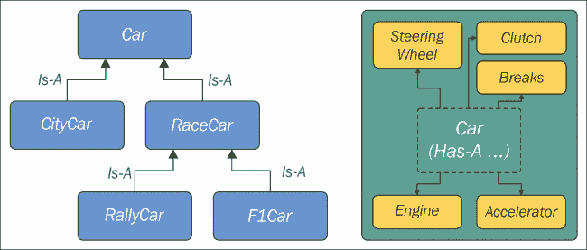
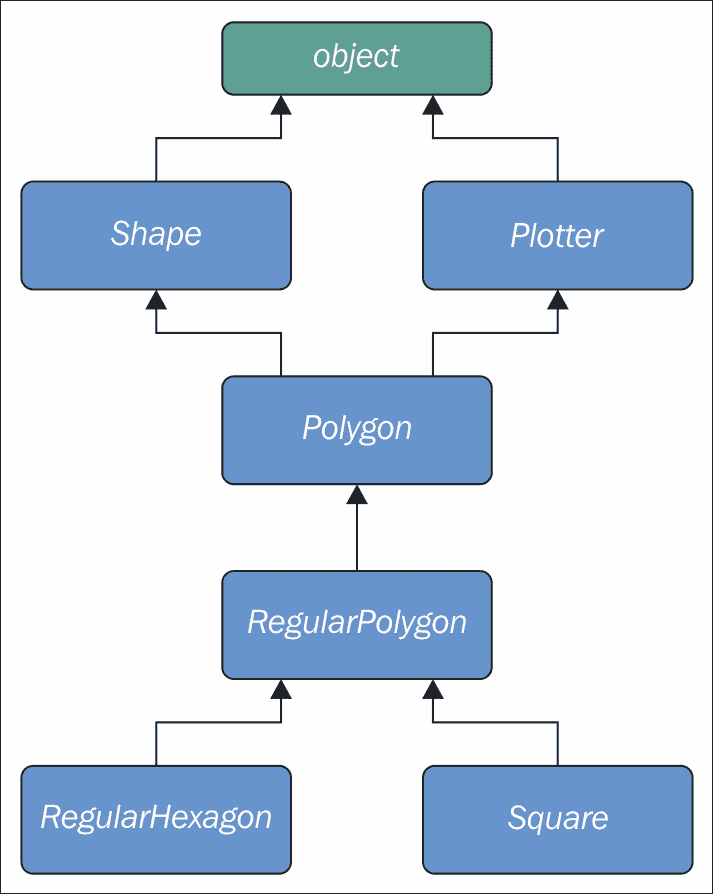

# 第六章. 高级概念 – 面向对象编程、装饰器和迭代器

|    | *"La classe non è acqua. (类将超越)"* |    |
| --- | --- | --- |
|    | --*意大利谚语* |

我可能可以写一本关于**面向对象编程**（以下简称**OOP**）和类的书。在本章中，我面临着在广度和深度之间找到平衡的艰难挑战。有太多的事情要讲，而且有很多事情如果单独深入描述，将会超过整个章节。因此，我将尝试给你一个我认为是好的全景视图的基础知识，以及一些可能在下一章中派上用场的知识点。Python 的官方文档将帮助填补这些空白。

在本章中，我们将探讨三个重要的概念：装饰器、面向对象编程（以下简称 OOP）和迭代器。

# 装饰器

在上一章中，我测量了各种表达式的执行时间。如果你还记得，我必须初始化一个变量为开始时间，然后在执行后从当前时间中减去它来计算经过的时间。我还必须在每次测量后在控制台上打印它。这非常繁琐。

每当你发现自己重复某些事情时，应该响起一个警钟。你能把那段代码放入一个函数中并避免重复吗？大多数情况下答案是*是的*，让我们看看一个例子。

`decorators/time.measure.start.py`

```py
from time import sleep, time

def f():
    sleep(.3)

def g():
    sleep(.5)

t = time()
f()
print('f took: ', time() - t)  # f took: 0.3003859519958496

t = time()
g()
print('g took:', time() - t)  # g took: 0.5005719661712646
```

在前面的代码中，我定义了两个函数`f`和`g`，它们什么也不做，只是睡眠（分别睡眠 0.3 秒和 0.5 秒）。我使用了`sleep`函数来暂停执行所需的时间。我还突出显示了如何通过将`t`设置为当前时间，然后在任务完成后减去它来计算经过的时间。你可以看到这个测量非常准确。

现在我们要如何避免重复代码和计算呢？一个首先的潜在方法可能是以下这样：

`decorators/time.measure.dry.py`

```py
from time import sleep, time

def f():
    sleep(.3)

def g():
    sleep(.5)

def measure(func):
 t = time()
 func()
 print(func.__name__, 'took:', time() - t)

measure(f)  # f took: 0.30041074752807617
measure(g)  # g took: 0.5006198883056641
```

啊，现在好多了。整个计时机制已经被封装成一个函数，这样我们就不会重复代码。我们动态地打印函数名，编码起来也很容易。如果我们需要向测量的函数传递参数怎么办？这段代码会稍微复杂一点，让我们看看一个例子。

`decorators/time.measure.arguments.py`

```py
from time import sleep, time

def f(sleep_time=0.1):
    sleep(sleep_time)

def measure(func, *args, **kwargs):
    t = time()
    func(*args, **kwargs)
    print(func.__name__, 'took:', time() - t)

measure(f, sleep_time=0.3)  # f took: 0.3004162311553955
measure(f, 0.2)  # f took: 0.20028162002563477
```

现在，`f`函数期望接收`sleep_time`参数（默认值为`0.1`）。我还不得不修改`measure`函数，使其现在可以接受一个函数、任意可变位置参数和任意可变关键字参数。这样，无论我们用什么调用`measure`，我们都会将这些参数重定向到我们在内部对`f`的调用。

这很好，但我们还可以更进一步。假设我们想在`f`函数中内置那种计时行为，这样我们就可以直接调用它并获取测量结果。下面是我们如何做到这一点的方法：

`decorators/time.measure.deco1.py`

```py
from time import sleep, time

def f(sleep_time=0.1):
    sleep(sleep_time)

def measure(func):
 def wrapper(*args, **kwargs):
 t = time()
 func(*args, **kwargs)
 print(func.__name__, 'took:', time() - t)
 return wrapper

f = measure(f)  # decoration point

f(0.2)  # f took: 0.2002875804901123
f(sleep_time=0.3)  # f took: 0.3003721237182617
print(f.__name__)  # wrapper  <- ouch!
```

前面的代码可能不是那么直观。我承认，即使今天，有时我还需要集中精力才能理解一些装饰器，它们可能相当复杂。让我们看看这里发生了什么。魔法在于 **装饰点**。我们基本上在调用它时，将 `f` 重新分配为 `measure` 返回的任何内容。在 `measure` 中，我们定义另一个函数 `wrapper`，然后返回它。所以，最终效果是在装饰点之后，当我们调用 `f` 时，我们实际上是在调用 `wrapper`。由于包装器内部调用的是 `func`，也就是 `f`，所以我们实际上是这样闭合循环的。如果你不相信我，看看最后一行。

`wrapper` 实际上...就是一个包装器。它接受变量和位置参数，并用它们调用 `f`。它还在调用周围执行时间测量技巧。

这种技术被称为 **装饰器**，而 `measure` 在所有效果上，就是一个 **装饰器**。这种范式变得如此流行和广泛使用，以至于在某个时刻，Python 为它添加了特殊的语法（检查 **PEP 318**）。让我们探索三个案例：一个装饰器，两个装饰器，以及一个接受参数的装饰器。

`decorators/syntax.py`

```py
def func(arg1, arg2, ...):
    pass
func = decorator(func)

# is equivalent to the following:

@decorator
def func(arg1, arg2, ...):
    pass
```

基本上，我们不再手动将函数重新分配为装饰器返回的内容，而是在函数定义前使用特殊的语法 `@decorator_name`。

我们可以通过以下方式将多个装饰器应用于同一个函数：

`decorators/syntax.py`

```py
def func(arg1, arg2, ...):
    pass
func = deco1(deco2(func))

# is equivalent to the following:

@deco1
@deco2
def func(arg1, arg2, ...):
    pass
```

在应用多个装饰器时，请注意顺序，这很重要。在前面的例子中，`func` 首先被 `deco2` 装饰，然后结果被 `deco1` 装饰。一个很好的经验法则是：*装饰器离函数越近，应用得越早*。

一些装饰器可以接受参数。这种技术通常用于生成其他装饰器。让我们看看语法，然后我们会看到一个例子。

`decorators/syntax.py`

```py
def func(arg1, arg2, ...):
    pass
func = decoarg(argA, argB)(func)

# is equivalent to the following:

@decoarg(argA, argB)
def func(arg1, arg2, ...):
    pass
```

如你所见，这个案例有点不同。首先 `decoarg` 使用给定的参数被调用，然后它的返回值（实际的装饰器）使用 `func` 被调用。在我给你另一个例子之前，让我们解决一个让我烦恼的问题。我不想在装饰它时丢失原始函数名称和文档字符串（以及其他属性，请参阅文档以获取详细信息）。但是，因为在我们装饰器内部我们返回 `wrapper`，所以 `func` 最终会丢失原始属性并分配 `wrapper` 的属性。从 `functools` 中有一个简单的解决方案，这是一个来自 Python 标准库的奇妙模块。我将修复最后一个例子，并将它的语法重写为使用 `@` 操作符。

`decorators/time.measure.deco2.py`

```py
from time import sleep, time
from functools import wraps

def measure(func):
    @wraps(func)
    def wrapper(*args, **kwargs):
        t = time()
        func(*args, **kwargs)
        print(func.__name__, 'took:', time() - t)
    return wrapper

@measure
def f(sleep_time=0.1):
    """I'm a cat. I love to sleep! """
    sleep(sleep_time)

f(sleep_time=0.3)  # f took: 0.30039525032043457
print(f.__name__, ':', f.__doc__)
# f : I'm a cat. I love to sleep!

```

现在我们来谈谈重点！正如你所见，我们只需要告诉 Python，`wrapper` 实际上包装了 `func`（通过 `wraps` 函数实现），现在你可以看到原始名称和文档字符串现在都得到了保留。

让我们再看另一个例子。我想有一个装饰器，当函数的结果大于一个阈值时打印错误信息。我还会借此机会向你展示如何同时应用两个装饰器。

`decorators/two.decorators.py`

```py
from time import sleep, time
from functools import wraps

def measure(func):
    @wraps(func)
    def wrapper(*args, **kwargs):
        t = time()
        result = func(*args, **kwargs)
        print(func.__name__, 'took:', time() - t)
        return result
    return wrapper

def max_result(func):
    @wraps(func)
    def wrapper(*args, **kwargs):
        result = func(*args, **kwargs)
        if result > 100:
            print('Result is too big ({0}). Max allowed is 100.'
                .format(result))
        return result
    return wrapper

@measure
@max_result
def cube(n):
    return n ** 3

print(cube(2))
print(cube(5))
```

### 小贴士

在研究前面的例子之前，请确保你已经很好地理解了它。如果你做到了，我想你不会写不出任何装饰器。

我不得不增强`measure`装饰器，使其`wrapper`现在返回对`func`的调用结果。`max_result`装饰器也这样做，但在返回之前，它会检查`result`是否不大于 100，这是允许的最大值。

我用这两个装饰器装饰了`cube`。首先应用`max_result`，然后是`measure`。运行这段代码得到以下结果：

```py
$ python two.decorators.py 
cube took: 7.62939453125e-06  #
8  #
Result is too big (125). Max allowed is 100.
cube took: 1.1205673217773438e-05
125

```

为了方便起见，我在第一次调用的结果右侧加了一个`#`：`print(cube(2))`。结果是 8，因此它默默地通过了阈值检查。测量并打印了运行时间。最后，我们打印了结果（`8`）。

在第二次调用时，结果是`125`，所以打印了错误信息，返回了结果，然后轮到`measure`打印运行时间，最后我们打印了结果（`125`）。

如果我用相同的两个装饰器装饰了`cube`函数，但顺序不同，错误信息将跟随打印运行时间的行，而不是在其之前。

## 装饰器工厂

现在我们简化这个例子，回到一个单一的装饰器：`max_result`。我想让它能够用不同的阈值装饰不同的函数，而且我不想为每个阈值写一个装饰器。让我们修改`max_result`，使其能够让我们动态地指定阈值来装饰函数。

`decorators/decorators.factory.py`

```py
from functools import wraps

def max_result(threshold):
    def decorator(func):
        @wraps(func)
        def wrapper(*args, **kwargs):
            result = func(*args, **kwargs)
            if result > threshold:
                print(
                    'Result is too big ({0}). Max allowed is {1}.'
                    .format(result, threshold))
            return result
        return wrapper
    return decorator

@max_result(75)
def cube(n):
    return n ** 3

print(cube(5))
```

这段前面的代码展示了如何编写一个**装饰器工厂**。如果你还记得，用接受参数的装饰器装饰一个函数与写`func = decorator(argA, argB)(func)`相同，所以当我们用`max_result(75)`装饰`cube`时，我们实际上是在做`cube = max_result(75)(cube)`。

让我们一步一步地了解发生了什么。当我们调用`max_result(75)`时，我们进入其主体。在其中定义了一个装饰器函数，它只接受一个函数作为其唯一参数。在这个函数内部，执行了通常的装饰器技巧。我们定义了一个包装器，在其中我们检查原始函数调用的结果。这种方法的优点是从最内层开始，我们仍然可以引用`func`和`threshold`，这允许我们动态地设置阈值。

`wrapper` 返回 `result`，`decorator` 返回 `wrapper`，而 `max_result` 返回 `decorator`。这意味着我们的调用 `cube = max_result(75)(cube)` 实际上变成了 `cube = decorator(cube)`。但这不仅仅是一个任意的 `decorator`，而是一个 `threshold` 值为 `75` 的 `decorator`。这是通过称为**闭包**的机制实现的，它超出了本章的范围，但仍然非常有趣，所以我提到了它，以便你可以做一些研究。

运行最后一个示例会产生以下结果：

```py
$ python decorators.factory.py 
Result is too big (125). Max allowed is 75.
125

```

上述代码允许我根据自己的意愿使用具有不同阈值的 `max_result` 装饰器，如下所示：

`decorators/decorators.factory.py`

```py
@max_result(75)
def cube(n):
    return n ** 3

@max_result(100)
def square(n):
    return n ** 2

@max_result(1000)
def multiply(a, b):
    return a * b
```

注意，每个装饰器都使用不同的 `threshold` 值。

装饰器在 Python 中非常流行。它们被频繁使用，并且极大地简化（甚至美化，我敢这么说）了代码。

# 面向对象编程

这已经是一段相当漫长且希望愉快的旅程了，到现在，我们应该准备好探索面向对象编程了。我将使用来自 *Kindler, E.; Krivy, I. (2011). Object-Oriented Simulation of systems with sophisticated control. International Journal of General Systems* 的定义，并将其应用于 Python：

> *面向对象编程（OOP）是一种基于“对象”概念的编程范式，对象是包含数据的数据结构，以属性的形式存在，以及以方法的形式存在的代码。对象的一个显著特征是，对象的方法可以访问并经常修改与之关联的对象的数据属性（对象有一个“自我”的概念）。在面向对象编程中，计算机程序是通过构建相互交互的对象来设计的。*

Python 完全支持这种范式。实际上，正如我们之前所说的，*Python 中的所有东西都是一个对象*，所以这表明面向对象编程不仅仅是 Python 支持的，而且是其核心的一部分。

面向对象编程（OOP）中的两个主要角色是**对象**和**类**。类用于创建对象（对象是它们被创建的类的实例），因此我们可以将它们视为实例工厂。当对象由一个类创建时，它们继承类的属性和方法。它们代表程序域中的具体项。

## 最简单的 Python 类

我将从你可以在 Python 中编写的最简单的类开始。

`oop/simplest.class.py`

```py
class Simplest():  # when empty, the braces are optional
 pass

print(type(Simplest))  # what type is this object?

simp = Simplest()  # we create an instance of Simplest: simp
print(type(simp))  # what type is simp?
# is simp an instance of Simplest?
print(type(simp) == Simplest)  # There's a better way for this
```

让我们运行前面的代码并逐行解释它：

```py
$ python oop/simplest.class.py 
<class 'type'>
<class '__main__.Simplest'>
True

```

我定义的`Simplest`类只有其主体中的`pass`指令，这意味着它没有任何自定义属性或方法。我将打印其类型（`__main__`是顶层代码执行的命名空间名称），并且我知道，在注释中，我写的是*object*而不是*class*。实际上，正如你可以通过那个`print`的结果看到的那样，*类实际上是对象*。更准确地说，它们是`type`的实例。解释这个概念将导致关于**元类**和**元编程**的讨论，这些是需要牢固掌握基础知识才能理解的高级概念，遗憾的是这超出了本章的范围。像往常一样，我提到它是为了给你留下一个线索，以便当你准备好深入研究时。

让我们回到例子：我使用`Simplest`创建了一个实例，`simp`。你可以看到，*创建实例的语法与我们调用函数时使用的语法相同*。

然后我们打印`simp`所属的类型，并验证`simp`确实是一个`Simplest`的实例。我将在本章后面部分展示一个更好的方法来做这件事。

到目前为止，一切都很简单。当我们编写`class ClassName(): pass`时会发生什么呢？嗯，Python 所做的是创建一个类对象并给它一个名称。这和当我们使用`def`声明一个函数时发生的情况非常相似。

## 类和对象命名空间

在创建类对象之后（这通常发生在模块首次导入时），它基本上代表了一个命名空间。我们可以调用这个类来创建它的实例。每个实例继承类属性和方法，并拥有自己的命名空间。我们已经知道，要遍历命名空间，我们只需要使用点(`.`)操作符。

让我们看看另一个例子：

`oop/class.namespaces.py`

```py
class Person():
    species = 'Human'

print(Person.species)  # Human
Person.alive = True  # Added dynamically!
print(Person.alive)  # True

man = Person()
print(man.species)  # Human (inherited)
print(man.alive)  # True (inherited)

Person.alive = False
print(man.alive)  # False (inherited)

man.name = 'Darth'
man.surname = 'Vader'
print(man.name, man.surname)  # Darth Vader
```

在前面的例子中，我定义了一个名为`species`的类属性。在类体中定义的任何变量都是属于该类的属性。在代码中，我还定义了`Person.alive`，这也是另一个类属性。你可以看到，从类中访问该属性没有限制。你可以看到`man`，它是`Person`的一个实例，继承了这两个属性，并且当它们改变时立即反映出来。

`man` 还有两个属于其自身命名空间属性，因此被称为**实例属性**：`name`和`surname`。

### 注意

类属性在所有实例之间共享，而实例属性则不是；因此，你应该使用类属性来提供所有实例共享的状态和行为，并使用实例属性来存储仅属于特定对象的属性。

## 属性遮蔽

当你在对象中搜索一个属性时，如果找不到，Python 会继续在创建该对象的类中搜索（并且会一直搜索，直到找到或者达到继承链的末尾）。这导致了一个有趣的遮蔽行为。让我们来看一个例子：

`oop/class.attribute.shadowing.py`

```py
class Point():
    x = 10
 y = 7

p = Point()
print(p.x)  # 10 (from class attribute)
print(p.y)  # 7 (from class attribute)

p.x = 12  # p gets its own 'x' attribute
print(p.x)  # 12 (now found on the instance)
print(Point.x)  # 10 (class attribute still the same)

del p.x  # we delete instance attribute
print(p.x)  # 10 (now search has to go again to find class attr)

p.z = 3  # let's make it a 3D point
print(p.z)  # 3

print(Point.z)
# AttributeError: type object 'Point' has no attribute 'z'
```

上述代码非常有趣。我们定义了一个名为`Point`的类，它有两个类属性，`x`和`y`。当我们创建一个实例`p`时，你可以看到我们可以从`p`的命名空间中打印出`x`和`y`（`p.x`和`p.y`）。当我们这样做时，Python 没有在实例上找到任何`x`或`y`属性，因此它搜索类，并在那里找到了它们。

然后，我们通过分配`p.x = 12`给`p`自己的`x`属性。这种行为一开始可能看起来有点奇怪，但如果你仔细想想，它与在全局`x = 10`外部声明`x = 12`的函数中发生的情况完全相同。我们知道`x = 12`不会影响全局的`x`，对于类和实例来说，情况也是一样的。

在分配`p.x = 12`之后，当我们打印它时，搜索不需要读取类属性，因为`x`已经在实例上找到了，因此我们打印出`12`。

我们还打印了`Point.x`，它指的是类命名空间中的`x`。

然后，我们从`p`的命名空间中删除`x`，这意味着在下一行再次打印时，Python 将再次在类中搜索它，因为实例中已经找不到它了。

最后三行显示，将属性分配给实例并不意味着它们会在类中找到。实例会得到类中的任何东西，但反之则不然。

你认为将`x`和`y`坐标作为类属性怎么样？你认为这是一个好主意吗？

## 我，我自己，以及自我——使用 self 变量

在类方法内部，我们可以通过一个特殊的参数来引用一个实例，这个参数按照惯例被称为`self`。`self`始终是实例方法的第一个属性。让我们一起来考察这种行为，以及我们如何共享，不仅仅是属性，还有方法给所有实例。

`oop/class.self.py`

```py
class Square():
    side = 8
    def area(self):  # self is a reference to an instance
        return self.side ** 2

sq = Square()
print(sq.area())  # 64 (side is found on the class)
print(Square.area(sq))  # 64 (equivalent to sq.area())

sq.side = 10
print(sq.area())  # 100 (side is found on the instance)
```

注意`area`方法是如何被`sq`使用的。两个调用`Square.area(sq)`和`sq.area()`是等价的，并教会我们机制是如何工作的。要么你将实例传递给方法调用（`Square.area(sq)`），在方法中它将被调用为`self`，或者你可以使用更舒适的语法：`sq.area()`，Python 会为你幕后转换。

让我们来看一个更好的例子：

`oop/class.price.py`

```py
class Price():
    def final_price(self, vat, discount=0):
        """Returns price after applying vat and fixed discount."""
        return (self.net_price * (100 + vat) / 100) - discount

p1 = Price()
p1.net_price = 100
print(Price.final_price(p1, 20, 10))  # 110 (100 * 1.2 - 10)
print(p1.final_price(20, 10))  # equivalent
```

上述代码显示，我们可以在声明方法时使用参数。我们可以使用与函数相同的语法，但我们需要记住，第一个参数始终是实例。

## 初始化实例

你有没有注意到，在调用`p1.final_price(...)`之前，我们必须将`net_price`分配给`p1`？有更好的方法来做这件事。在其他语言中，这会被称为**构造函数**，但在 Python 中不是这样。它实际上是一个**初始化器**，因为它作用于已经创建的实例，因此被称为`__init__`。它是一个**魔法方法**，在对象创建后立即运行。Python 对象还有一个`__new__`方法，它是实际的构造函数。在实践中，通常不需要重写它，这是一个主要用于编写元类的实践，这是一个相当高级的话题，我们不会在本书中探讨。

`oop/class.init.py`

```py
class Rectangle():
    def __init__(self, sideA, sideB):
 self.sideA = sideA
 self.sideB = sideB

    def area(self):
        return self.sideA * self.sideB

r1 = Rectangle(10, 4)
print(r1.sideA, r1.sideB)  # 10 4
print(r1.area())  # 40

r2 = Rectangle(7, 3)
print(r2.area())  # 21
```

事情终于开始成形。当一个对象被创建时，`__init__`方法会自动为我们运行。在这种情况下，我编写了代码，当我们创建一个对象（通过像函数一样调用类名）时，我们向创建调用传递参数，就像在常规函数调用中做的那样。我们传递参数的方式遵循`__init__`方法的签名，因此，在两个创建语句中，`10`和`7`将分别是`r1`和`r2`的`sideA`，而`4`和`3`将是`sideB`。你可以看到，`r1`和`r2`从`area()`调用的调用反映了它们有不同的实例参数。

以这种方式设置对象要更优雅、更方便。

## 面向对象编程（OOP）是关于代码重用

到现在应该已经很清楚了：**面向对象编程（OOP）**完全是关于代码重用。我们定义一个类，创建实例，这些实例使用仅在类中定义的方法。它们的行为将根据初始化器如何设置实例而有所不同。

### 继承和组合

但这只是故事的一半，**面向对象编程（OOP）**要强大得多。我们有两个主要的设计构造来利用：继承和组合。

**继承**意味着两个对象通过**“是”**这种类型的关系相关联。另一方面，**组合**意味着两个对象通过**“有”**这种类型的关系相关联。用例子来解释这一切都非常简单：

`oop/class.inheritance.py`

```py
class Engine():
    def start(self):
        pass

    def stop(self):
        pass

class ElectricEngine(Engine):  # Is-A Engine
    pass

class V8Engine(Engine):  # Is-A Engine
    pass

class Car():
    engine_cls = Engine

    def __init__(self):
        self.engine = self.engine_cls()  # Has-A Engine

    def start(self):
        print(
            'Starting engine {0} for car {1}... Wroom, wroom!'
            .format(
                self.engine.__class__.__name__,
                self.__class__.__name__)
        )
        self.engine.start()

    def stop(self):
        self.engine.stop()

class RaceCar(Car):  # Is-A Car
    engine_cls = V8Engine

class CityCar(Car):  # Is-A Car
    engine_cls = ElectricEngine

class F1Car(RaceCar):  # Is-A RaceCar and also Is-A Car
    engine_cls = V8Engine

car = Car()
racecar = RaceCar()
citycar = CityCar()
f1car = F1Car()
cars = [car, racecar, citycar, f1car]

for car in cars:
    car.start()

""" Prints:
Starting engine Engine for car Car... Wroom, wroom!
Starting engine V8Engine for car RaceCar... Wroom, wroom!
Starting engine ElectricEngine for car CityCar... Wroom, wroom!
Starting engine V8Engine for car F1Car... Wroom, wroom!
"""
```

上述示例展示了对象之间**“是”**和**“有”**两种类型的关系。首先，让我们考虑`Engine`类。它是一个简单的类，包含两个方法，`start`和`stop`。然后我们定义了`ElectricEngine`和`V8Engine`，这两个类都继承自`Engine`类。你可以看到，当我们定义它们时，我们在类名后面的大括号中放置了`Engine`。 

这意味着`ElectricEngine`和`V8Engine`都从`Engine`类继承属性和方法，这个类被称为它们的**基类**。

对于汽车来说，情况也是如此。`Car`是`RaceCar`和`CityCar`的基类。`RaceCar`也是`F1Car`的基类。另一种说法是，`F1Car`从`RaceCar`继承，而`RaceCar`从`Car`继承。因此，`F1Car`*是*`RaceCar`，`RaceCar`*是*`Car`。由于传递性质，我们可以说`F1Car`*是*`Car`。`CityCar`也是*是*`Car`。

当我们定义`class A(B): pass`时，我们说`A`是`B`的*子类*，而`B`是`A`的*父类*。*父类*和*基类*是同义词，同样*子类*和*派生类*也是。我们还说一个类继承自另一个类，或者扩展了它。

这就是继承机制。

另一方面，让我们回到代码。每个类都有一个类属性，`engine_cls`，它是对我们想要分配给每种类型汽车的引擎类的引用。`Car`有一个通用的`Engine`，而两辆赛车都有强大的 V8 引擎，而城市车有一个电动引擎。

当在初始化方法`__init__`中创建汽车时，我们创建一个引擎类的实例，并将其设置为`engine`实例属性。

在所有类实例之间共享`engine_cls`是有意义的，因为同一辆车的实例很可能具有相同类型的引擎。另一方面，将单个引擎（任何`Engine`类的实例）作为类属性是不好的，因为这会导致我们在所有实例之间共享一个引擎，这是不正确的。

汽车与其引擎之间的关系类型是*具有*类型。汽车*具有*引擎。这被称为**组合**，反映了对象可以由许多其他对象组成的事实。汽车*具有*引擎、变速箱、车轮、底盘、车门、座椅等等。

在设计面向对象（OOP）代码时，以这种方式描述对象至关重要，这样我们才能正确地使用继承和组合来以最佳方式构建我们的代码。

在我们离开这个段落之前，让我们用另一个例子来验证我是否告诉了您真相：

`oop/class.issubclass.isinstance.py`

```py
car = Car()
racecar = RaceCar()
f1car = F1Car()
cars = [(car, 'car'), (racecar, 'racecar'), (f1car, 'f1car')]
car_classes = [Car, RaceCar, F1Car]

for car, car_name in cars:
    for class_ in car_classes:
        belongs = isinstance(car, class_)
        msg = 'is a' if belongs else 'is not a'
        print(car_name, msg, class_.__name__)

""" Prints:
car is a Car
car is not a RaceCar
car is not a F1Car
racecar is a Car
racecar is a RaceCar
racecar is not a F1Car
f1car is a Car
f1car is a RaceCar
f1car is a F1Car
"""
```

如您所见，`car`只是`Car`的一个实例，而`racecar`是`RaceCar`（以及通过扩展`Car`）的一个实例，`f1car`是`F1Car`（以及通过扩展`RaceCar`和`Car`）的一个实例。一个*香蕉*是*香蕉*的一个实例。但，它也是一个*水果*。也是*食物*，对吧？这是同一个概念。

要检查一个对象是否是某个类的实例，请使用`isinstance`方法。它比单纯的类型比较（`type(object) == Class`）更推荐使用。

让我们也检查一下继承，同样的设置，使用不同的`for`循环：

`oop/class.issubclass.isinstance.py`

```py
for class1 in car_classes:
    for class2 in car_classes:
        is_subclass = issubclass(class1, class2)
        msg = '{0} a subclass of'.format(
            'is' if is_subclass else 'is not')
        print(class1.__name__, msg, class2.__name__)

""" Prints:
Car is a subclass of Car
Car is not a subclass of RaceCar
Car is not a subclass of F1Car
RaceCar is a subclass of Car
RaceCar is a subclass of RaceCar
RaceCar is not a subclass of F1Car
F1Car is a subclass of Car
F1Car is a subclass of RaceCar
F1Car is a subclass of F1Car
"""
```

有趣的是，我们了解到*一个类是其自身的子类*。检查前面示例的输出，看看它是否与我所提供的解释相符。

### 注意

关于约定，有一点需要注意，即类名总是使用*CapWords*来书写，这意味着*ThisWayIsCorrect*，而函数和方法则是*this_way_is_correct*。此外，当你在代码中想要使用一个 Python 保留关键字或内置函数或类作为名称时，约定是在名称后面添加一个尾随下划线。在第一个`for`循环示例中，我使用`for class_ in ...`遍历类名，因为`class`是一个保留字。但因为你已经彻底研究了 PEP8，所以你早就知道了这些，对吧？

为了帮助你想象`Is-A`和`Has-A`之间的区别，看看下面的图示：



## 访问基类

我们已经看到了像`class ClassA: pass`和`class ClassB(BaseClassName): pass`这样的类声明。当我们没有明确指定基类时，Python 会将特殊的**object**类作为我们定义的类的基类。最终，所有类都从`object`派生。注意，如果你没有指定基类，大括号是可选的。

因此，编写`class A: pass`或`class A(): pass`或`class A(object): pass`是完全相同的事情。`object`是一个特殊的类，因为它拥有所有 Python 类共有的方法，并且不允许你对其设置任何属性。

让我们看看我们如何在类内部访问基类。

`oop/super.duplication.py`

```py
class Book:
    def __init__(self, title, publisher, pages):
        self.title = title
        self.publisher = publisher
        self.pages = pages

class Ebook(Book):
    def __init__(self, title, publisher, pages, format_):
        self.title = title
 self.publisher = publisher
 self.pages = pages
        self.format_ = format_
```

看看前面的代码。我突出显示了从其基类`Book`中复制的`Ebook`初始化部分。这相当糟糕的做法，因为我们现在有两套做同样事情的指令。此外，任何对`Book.__init__`签名的变化都不会反映在`Ebook`中。我们知道`Ebook`是`Book`的子类，因此我们可能希望这些变化在子类中得到反映。

让我们看看一种修复这个问题的方法：

`oop/super.explicit.py`

```py
class Book:
    def __init__(self, title, publisher, pages):
        self.title = title
        self.publisher = publisher
        self.pages = pages

class Ebook(Book):
    def __init__(self, title, publisher, pages, format_):
        Book.__init__(self, title, publisher, pages)
        self.format_ = format_

ebook = Ebook('Learning Python', 'Packt Publishing', 360, 'PDF')
print(ebook.title)  # Learning Python
print(ebook.publisher)  # Packt Publishing
print(ebook.pages)  # 360
print(ebook.format_)  # PDF
```

现在，这更好。我们移除了那个讨厌的重复。基本上，我们告诉 Python 调用`Book`类的`__init__`方法，并将`self`传递给调用，确保我们将这个调用绑定到当前实例。

如果我们修改`Book`的`__init__`方法中的逻辑，我们不需要触摸`Ebook`，它将自动适应变化。

这种方法不错，但我们还可以做得更好。比如说，我们把`Book`的名字改为`Liber`，因为我们爱上了拉丁文。我们必须更改`Ebook`的`__init__`方法来反映这一变化。这可以通过使用`super`来避免。

`oop/super.implicit.py`

```py
class Book:
    def __init__(self, title, publisher, pages):
        self.title = title
        self.publisher = publisher
        self.pages = pages

class Ebook(Book):
    def __init__(self, title, publisher, pages, format_):
        super().__init__(title, publisher, pages)
        # Another way to do the same thing is:
        # super(Ebook, self).__init__(title, publisher, pages)
        self.format_ = format_

ebook = Ebook('Learning Python', 'Packt Publishing', 360, 'PDF')
print(ebook.title)  # Learning Python
print(ebook.publisher)  # Packt Publishing
print(ebook.pages)  # 360
print(ebook.format_)  # PDF
```

`super`是一个返回代理对象的函数，该对象将方法调用委托给父类或兄弟类。在这种情况下，它将调用委托给`Book`类的`__init__`，这个方法的优点是现在我们可以自由地将`Book`改为`Liber`，而无需触及`Ebook`的`__init__`方法中的逻辑。

现在我们知道了如何从子类访问基类，让我们来探索 Python 的多重继承。

## 多重继承

除了使用多个基类来组合一个类之外，这里有趣的是属性搜索是如何进行的。看看下面的图示：



正如你所见，`Shape`和`Plotter`作为所有其他类的基类。`Polygon`直接从它们继承，`RegularPolygon`从`Polygon`继承，而`RegularHexagon`和`Square`都从`RegularPolygon`继承。注意，`Shape`和`Plotter`隐式地继承自`object`，因此我们有了所谓的**菱形**，或者说，有超过一条路径可以到达基类。我们将在稍后看到这为什么很重要。让我们将其翻译成一些简单的代码：

`oop/multiple.inheritance.py`

```py
class Shape:
    geometric_type = 'Generic Shape'

    def area(self):  # This acts as placeholder for the interface
        raise NotImplementedError

    def get_geometric_type(self):
        return self.geometric_type

class Plotter:

    def plot(self, ratio, topleft):
        # Imagine some nice plotting logic here...
        print('Plotting at {}, ratio {}.'.format(
            topleft, ratio))

class Polygon(Shape, Plotter):  # base class for polygons
    geometric_type = 'Polygon'

class RegularPolygon(Polygon):  # Is-A Polygon
    geometric_type = 'Regular Polygon'

    def __init__(self, side):
        self.side = side

class RegularHexagon(RegularPolygon): # Is-A RegularPolygon
    geometric_type = 'RegularHexagon'

    def area(self):
        return 1.5 * (3 ** .5 * self.side ** 2)

class Square(RegularPolygon):  # Is-A RegularPolygon
    geometric_type = 'Square'

    def area(self):
        return self.side * self.side

hexagon = RegularHexagon(10)
print(hexagon.area())  # 259.8076211353316
print(hexagon.get_geometric_type())  # RegularHexagon
hexagon.plot(0.8, (75, 77))  # Plotting at (75, 77), ratio 0.8.

square = Square(12)
print(square.area())  # 144
print(square.get_geometric_type())  # Square
square.plot(0.93, (74, 75))  # Plotting at (74, 75), ratio 0.93.
```

看看前面的代码：类`Shape`有一个属性`geometric_type`和两个方法：`area`和`get_geometric_type`。使用基类（如我们的例子中的`Shape`）来定义一个*接口*：子类必须提供实现的方法是很常见的。当然，有不同且更好的方法来做这件事，但我想尽量保持这个例子简单。

我们还有一个`Plotter`类，它添加了`plot`方法，从而为从它继承的任何类提供了绘图功能。当然，在这个例子中，`plot`的实现只是一个简单的`print`。第一个有趣的是`Polygon`类，它从`Shape`和`Plotter`继承。

几何多边形有很多种类型，其中一种是正多边形，它既等角（所有角度相等）又等边（所有边相等），因此我们创建了继承自`Polygon`的`RegularPolygon`类。因为对于正多边形，所有边都相等，我们可以在`RegularPolygon`上实现一个简单的`__init__`方法，它接受边的长度。最后，我们创建了`RegularHexagon`和`Square`类，它们都继承自`RegularPolygon`。

这个结构相当长，但希望这能给你一个在设计代码时如何专门化对象分类的思路。

现在，请看看最后八行。注意，当我调用`hexagon`和`square`上的`area`方法时，我得到了两者的正确面积。这是因为它们都提供了正确的实现逻辑。此外，我可以在它们两个上调用`get_geometric_type`，即使这个方法没有定义在它们的类中，Python 必须一直追溯到`Shape`来找到它的实现。注意，尽管实现是在`Shape`类中提供的，但用于返回值的`self.geometric_type`是正确地从调用实例中获取的。

`plot`方法的调用也很有趣，展示了你可以如何通过这种技术丰富你的对象，使其拥有它们原本不具备的能力。这种技术在像 Django 这样的 Web 框架中非常流行（我们将在后面的两章中探讨），它提供了特殊的类，称为**混入（mixins**），你可以直接使用这些类的功能。你所要做的就是将所需的混入定义为你自己的基类之一，然后就可以了。

多重继承功能强大，但也可能变得非常混乱，因此我们需要确保我们理解使用它时会发生什么。

### 方法解析顺序

到目前为止，我们知道当你请求`someobject.attribute`，并且`attribute`没有在对象上找到时，Python 会从`someobject`创建的类`someobject`开始搜索。如果那里也没有，Python 会沿着继承链向上搜索，直到找到`attribute`或者到达`object`类。如果继承链只包含单继承步骤，这意味着类只有一个父类，那么这很容易理解。然而，当涉及多重继承时，有些情况下如果找不到属性，预测下一个将被搜索的类可能并不直接。

Python 提供了一种方法，可以始终知道在属性查找时类被搜索的顺序：方法解析顺序。

### 注意

**方法解析顺序**（**MRO**）是在查找成员时搜索基类的顺序。从版本 2.3 开始，Python 使用一个称为**C3**的算法，它保证了单调性。

在 Python 2.2 中，引入了**新式类**。在 Python 2.*中编写新式类的方法是使用显式的`object`基类定义它。经典类没有显式地从`object`继承，并且在 Python 3 中被移除。

Python 2.*中经典类和新式类之间的一个区别是，新式类使用新的 MRO 进行搜索。

关于前面的例子，让我们看看`Square`类的 MRO 是什么：

`oop/multiple.inheritance.py`

```py
print(square.__class__.__mro__)
# prints:
# (<class '__main__.Square'>, <class '__main__.RegularPolygon'>,
#  <class '__main__.Polygon'>, <class '__main__.Shape'>,
#  <class '__main__.Plotter'>, <class 'object'>)
```

要获取类的 MRO，我们可以从实例到其`__class__`属性，然后到其`__mro__`属性。或者，我们也可以直接调用`Square.__mro__`或`Square.mro()`，但如果需要动态执行，你更有可能手里有一个对象而不是一个类。

注意，唯一有疑问的地方是在`Polygon`之后的二分法，继承链分为两个方向，一个通向`Shape`，另一个通向`Plotter`。通过扫描`Square`类的 MRO，我们知道`Shape`在`Plotter`之前被搜索。

这为什么重要呢？想象以下代码：

`oop/mro.simple.py`

```py
class A:
    label = 'a'

class B(A):
    label = 'b'

class C(A):
    label = 'c'

class D(B, C):
    pass

d = D()
print(d.label)  # Hypothetically this could be either 'b' or 'c'
```

`B` 和 `C` 都继承自 `A`，而 `D` 则继承自 `B` 和 `C`。这意味着 `label` 属性的查找可以通过 `B` 或 `C` 达到顶部（`A`）。根据哪个先到达，我们会得到不同的结果。

因此，在上述例子中，我们得到 `'b'`，这正是我们所期望的，因为 `B` 是 `D` 的基类中最左边的一个。但如果我移除 `B` 中的 `label` 属性呢？这将是一个令人困惑的情况：算法会一直向上到 `A` 吗？还是它会先到达 `C`？让我们来看看！

`oop/mro.py`

```py
class A:
    label = 'a'

class B(A):
    pass  # was: label = 'b'

class C(A):
    label = 'c'

class D(B, C):
    pass

d = D()
print(d.label)  # 'c'
print(d.__class__.mro())  # notice another way to get the MRO
# prints:
# [<class '__main__.D'>, <class '__main__.B'>,
#  <class '__main__.C'>, <class '__main__.A'>, <class 'object'>]
```

因此，我们了解到 MRO 是 `D-B-C-A-(object)`，这意味着当我们请求 `d.label` 时，我们得到 `'c'`，这是正确的。

在日常编程中，处理 MRO 并不常见，但当你第一次与框架中的某个 mixin 作斗争时，我保证你会很高兴我花了一段文字来解释它。

## 静态和类方法

到目前为止，我们编写的类已经包含了以数据和实例方法形式存在的属性，但我们可以将两种其他类型的方法放入类中：**静态方法**和**类方法**。

### 静态方法

如你所回忆的那样，当你创建一个类对象时，Python 会给它分配一个名称。这个名称充当一个命名空间，有时将功能分组在下面是有意义的。静态方法非常适合这种用例，因为与实例方法不同，它们没有传递任何特殊参数。让我们看看一个假设的 `String` 类的例子。

`oop/static.methods.py`

```py
class String:

    @staticmethod
    def is_palindrome(s, case_insensitive=True):
        # we allow only letters and numbers
        s = ''.join(c for c in s if c.isalnum())  # Study this!
        # For case insensitive comparison, we lower-case s
        if case_insensitive:
            s = s.lower()
        for c in range(len(s) // 2):
            if s[c] != s[-c -1]:
                return False
        return True

    @staticmethod
    def get_unique_words(sentence):
        return set(sentence.split())

print(String.is_palindrome(
    'Radar', case_insensitive=False))  # False: Case Sensitive
print(String.is_palindrome('A nut for a jar of tuna'))  # True
print(String.is_palindrome('Never Odd, Or Even!'))  # True
print(String.is_palindrome(
    'In Girum Imus Nocte Et Consumimur Igni')  # Latin! Show-off!
)  # True

print(String.get_unique_words(
    'I love palindromes. I really really love them!'))
# {'them!', 'really', 'palindromes.', 'I', 'love'}
```

上述代码非常有趣。首先，我们了解到静态方法是通过简单地应用 `staticmethod` 装饰器来创建的。你可以看到它们没有传递任何特殊参数，所以除了装饰之外，它们实际上看起来就像函数一样。

我们有一个名为 `String` 的类，它充当函数的容器。另一种方法是将函数放在一个单独的模块中。大多数情况下，这完全取决于个人喜好。

`is_palindrome` 函数内部的逻辑你现在应该已经很容易理解了，但以防万一，我们还是来过一遍。首先，我们从 `s` 中移除所有既不是字母也不是数字的字符。为了做到这一点，我们使用字符串对象的 `join` 方法（在这个例子中是一个空字符串对象）。通过在空字符串上调用 `join`，结果是所有传递给 `join` 的可迭代对象中的元素将被连接在一起。我们给 `join` 传递一个生成器表达式，它表示“从 s 中取出任何既是字母数字又是数字的字符”。我希望你已经自己找到了这个，也许是用我在前几章中展示的内外部技术。

如果`case_insensitive`为`True`，我们就会将`s`转换为小写，然后继续检查它是否是一个回文。为了做到这一点，我们比较第一个和最后一个字符，然后是第二个和倒数第二个，以此类推。如果在任何一点我们发现差异，这意味着字符串不是回文，因此我们可以返回`False`。另一方面，如果我们正常退出`for`循环，这意味着没有发现差异，因此我们可以断定字符串是回文。

注意，这段代码无论字符串的长度如何都能正确工作，也就是说，无论长度是奇数还是偶数。`len(s) // 2`达到`s`的一半，如果`s`的长度是奇数个字符，中间的那个字符不会被检查（比如在*RaDaR*中，*D*没有被检查），但我们并不关心；它会与自己比较，所以总是通过那个检查。

`get_unique_words`要简单得多，它只是返回一个集合，我们将一个包含句子中单词的列表喂给这个集合。`set`类会为我们移除任何重复项，因此我们不需要做任何事情。

`String`类为我们提供了一个很好的容器命名空间，用于那些旨在处理字符串的方法。我可以用一个`Math`类编写一个类似的例子，并添加一些用于处理数字的静态方法，但我想要展示一些不同的东西。

### 类方法

类方法与实例方法略有不同，因为它们也接受一个特殊的第一个参数，但在这个情况下，它是类对象本身。编写类方法的两个非常常见的用例是为类提供工厂功能，以及允许拆分静态方法（你必须使用类名来调用它们），而无需在逻辑中硬编码类名。让我们看看这两个用例的例子。

`oop/class.methods.factory.py`

```py
class Point:
    def __init__(self, x, y):
        self.x = x
        self.y = y

    @classmethod
    def from_tuple(cls, coords):  # cls is Point
        return cls(*coords)

    @classmethod
    def from_point(cls, point):  # cls is Point
        return cls(point.x, point.y)

p = Point.from_tuple((3, 7))
print(p.x, p.y)  # 3 7
q = Point.from_point(p)
print(q.x, q.y)  # 3 7
```

在前面的代码中，我向你展示了如何使用类方法来创建类的工厂。在这种情况下，我们想要通过传递两个坐标（常规创建`p = Point(3, 7)`）来创建一个`Point`实例，但我们还希望能够通过传递一个元组（`Point.from_tuple`）或另一个实例（`Point.from_point`）来创建一个实例。

在这两个类方法中，`cls`参数指的是`Point`类。与实例方法一样，实例方法接受`self`作为第一个参数，类方法接受一个`cls`参数。`self`和`cls`都是按照一种约定来命名的，你不必强制遵循，但强烈建议你遵守。这是任何 Python 程序员都不会改变的事情，因为这是一个非常强的约定，解析器、linters 以及任何自动处理你代码的工具都会期望，所以坚持这个约定会更好。

让我们来看一个其他用例的例子：拆分一个静态方法。

`oop/class.methods.split.py`

```py
class String:

    @classmethod
    def is_palindrome(cls, s, case_insensitive=True):
        s = cls._strip_string(s)
        # For case insensitive comparison, we lower-case s
        if case_insensitive:
            s = s.lower()
        return cls._is_palindrome(s)

    @staticmethod
    def _strip_string(s):
        return ''.join(c for c in s if c.isalnum())

    @staticmethod
    def _is_palindrome(s):
        for c in range(len(s) // 2):
            if s[c] != s[-c -1]:
                return False
        return True

    @staticmethod
    def get_unique_words(sentence):
        return set(sentence.split())

print(String.is_palindrome('A nut for a jar of tuna'))  # True
print(String.is_palindrome('A nut for a jar of beans'))  # False
```

将此代码与上一个版本进行比较。首先请注意，尽管`is_palindrome`现在是一个类方法，但我们调用它的方式与它作为静态方法时相同。我们将其更改为类方法的原因是，在提取出几块逻辑（`_strip_string`和`_is_palindrome`）之后，我们需要获取它们的引用，如果没有`cls`在我们的方法中，唯一的选择就是像这样调用它们：`String._strip_string(...)`和`String._is_palindrome(...)`，这不是一个好的做法，因为我们会在`is_palindrome`方法中硬编码类名，从而使得每次我们更改类名时都必须修改它。使用`cls`将充当类名，这意味着我们的代码不需要任何修改。

还要注意，通过将提取出的方法命名为前导下划线，我在暗示这些方法不应该从类外部调用，但这将是下一段的主题。

## 私有方法和名称改写

如果你熟悉像 Java、C#、C++或类似的语言，那么你知道它们允许程序员为属性（数据和方法）分配隐私状态。每种语言都有自己略微不同的风味，但大意是公共属性可以从代码的任何位置访问，而私有属性只能在定义它们的范围内访问。

在 Python 中，没有这样的事情。一切都是公开的；因此，我们依赖于约定和一种称为**名称改写**的机制。

约定如下：如果一个属性的名称没有前导下划线，则被认为是公开的。这意味着你可以自由地访问和修改它。当名称有一个前导下划线时，该属性被认为是私有的，这意味着它可能打算在内部使用，你不应该从外部使用或修改它。私有属性的一个非常常见的用例是辅助方法，这些方法应该由公共方法使用（可能在调用链中与其他方法一起使用），以及内部数据，如缩放因子，或任何我们理想中会放入常量（一个不能改变的变量）中的其他数据。

这种特性通常会让来自其他背景的人感到害怕；他们觉得缺乏隐私是一种威胁。说实话，在我的整个 Python 专业经验中，我从未听说过有人尖叫着“哦，我的天哪，我们有一个可怕的错误，因为 Python 缺少私有属性！”我发誓，一次都没有。

话虽如此，对隐私的需求实际上是合理的，因为没有它，你真的可能会把错误引入你的代码。让我们看看一个简单的例子：

`oop/private.attrs.py`

```py
class A:
    def __init__(self, factor):
        self._factor = factor

    def op1(self):
        print('Op1 with factor {}...'.format(self._factor))

class B(A):
    def op2(self, factor):
        self._factor = factor
        print('Op2 with factor {}...'.format(self._factor))

obj = B(100)
obj.op1()    # Op1 with factor 100...
obj.op2(42)  # Op2 with factor 42...
obj.op1()    # Op1 with factor 42...  <- This is BAD

```

在前面的代码中，我们有一个名为`_factor`的属性，让我们假设它在实例创建后运行时未被修改非常重要，因为`op1`依赖于它来正确运行。我们用前导下划线命名了它，但问题在于当我们调用`obj.op2(42)`时，我们修改了它，这反映在随后的`op1`调用中。

让我们通过添加另一个前导下划线来修复这种不希望的行为：

`oop/private.attrs.fixed.py`

```py
class A:
    def __init__(self, factor):
        self.__factor = factor

    def op1(self):
        print('Op1 with factor {}...'.format(self.__factor))

class B(A):
    def op2(self, factor):
        self.__factor = factor
        print('Op2 with factor {}...'.format(self.__factor))

obj = B(100)
obj.op1()    # Op1 with factor 100...
obj.op2(42)  # Op2 with factor 42...
obj.op1()    # Op1 with factor 100...  <- Wohoo! Now it's GOOD!

```

哇，看看这个！现在它按预期工作。Python 有点神奇，在这种情况下，正在发生的是名字混淆机制已经启动。

名字混淆意味着任何至少有两个前导下划线和最多一个尾随下划线的属性名，例如`__my_attr`，会被替换为一个包含下划线和类名的前缀的实际名称，例如`_ClassName__my_attr`。

这意味着当你从类继承时，混淆机制在基类和子类中为你的私有属性提供两个不同的名称，以避免名称冲突。每个类和实例对象都存储它们属性引用的特殊属性，称为`__dict__`，所以让我们检查`obj.__dict__`以查看名字混淆的实际操作：

`oop/private.attrs.py`

```py
print(obj.__dict__.keys())
# dict_keys(['_factor'])

```

这就是我们在这个示例有问题的版本中找到的`_factor`属性。但看看使用`__factor`的那个：

`oop/private.attrs.fixed.py`

```py
print(obj.__dict__.keys())
# dict_keys(['_A__factor', '_B__factor'])

```

看看？`obj`现在有两个属性了，`_A__factor`（在`A`类中混淆），和`_B__factor`（在`B`类中混淆）。这就是使得当你执行`obj.__factor = 42`时，`A`中的`__factor`没有被改变的原因，因为你实际上接触的是`_B__factor`，这使`_A__factor`保持安全无恙。

如果你正在设计一个旨在被其他开发者使用和扩展的库，那么你需要记住这一点，以避免无意中覆盖你的属性。这样的错误可能相当微妙且难以发现。

## 属性装饰器

另一件不应该被忽略的事情是 `property` 装饰器。想象一下，你有一个 `Person` 类中的 `age` 属性，在某个时刻你想要确保当你改变它的值时，你也在检查 `age` 是否在合适的范围内，比如 [18, 99]。你可以编写访问器方法，如 `get_age()` 和 `set_age()`（也称为 **getters** 和 **setters**），并将逻辑放在那里。`get_age()` 很可能只是返回 `age`，而 `set_age()` 将也会进行范围检查。问题是，你可能已经有很多代码直接访问 `age` 属性，这意味着你现在需要进行一些很好的（并且可能危险且繁琐的）重构。像 Java 这样的语言通过默认使用访问器模式来克服这个问题。许多 Java **集成开发环境**（**IDEs**）会自动完成属性声明，并为你即时编写 getter 和 setter 访问器方法占位符。

Python 更聪明，它使用 `property` 装饰器来完成这项工作。当你用 `property` 装饰一个方法时，你可以像使用数据属性一样使用该方法的名称。正因为如此，最好避免在这样方法中放置需要较长时间完成逻辑，因为当我们把它们作为属性访问时，我们并不期望等待。

让我们看看一个例子：

`oop/property.py`

```py
class Person:
    def __init__(self, age):
        self.age = age  # anyone can modify this freely

class PersonWithAccessors:
    def __init__(self, age):
        self._age = age

    def get_age(self):
        return self._age

    def set_age(self):
        if 18 <= age <= 99:
            self._age = age
        else:
            raise ValueError('Age must be within [18, 99]')

class PersonPythonic:
    def __init__(self, age):
        self._age = age

    @property
    def age(self):
        return self._age

    @age.setter
    def age(self, age):
        if 18 <= age <= 99:
            self._age = age
        else:
            raise ValueError('Age must be within [18, 99]')

person = PersonPythonic(39)
print(person.age)  # 39 - Notice we access as data attribute
person.age = 42  # Notice we access as data attribute
print(person.age)  # 42
person.age = 100  # ValueError: Age must be within [18, 99]
```

`Person` 类可能是我们最初编写的第一版。然后我们意识到我们需要放置范围逻辑，所以，在另一种语言中，我们不得不将 `Person` 重新编写为 `PersonWithAccessors` 类，并重构所有使用 `Person.age` 的代码。在 Python 中，我们将 `Person` 重新编写为 `PersonPythonic`（当然，你通常不会改变名称），这样年龄就被存储在一个私有的 `_age` 变量中，我们使用该装饰器定义属性获取器和设置器，这样我们就可以像以前一样继续使用 `person` 实例。**获取器**是在我们访问属性进行读取时被调用的方法。另一方面，**设置器**是在我们访问属性以写入它时被调用的方法。在其他语言中，例如 Java，通常将它们定义为 `get_age()` 和 `set_age(int value)`，但我发现 Python 的语法更整洁。它允许你开始编写简单的代码，并在需要时进行重构，没有必要因为它们可能在未来有帮助而将访问器污染你的代码。

`property` 装饰器还允许只读数据（没有 setter）以及在删除属性时的特殊操作。请参阅官方文档以深入了解。

## 运算符重载

我发现 Python 对 **运算符重载** 的处理方式非常出色。重载运算符意味着根据它被使用的上下文给它一个意义。例如，当我们处理数字时，`+` 运算符表示加法，但当我们处理序列时，它表示连接。

在 Python 中，当你使用运算符时，你很可能会在幕后调用某些对象的特殊方法。例如，调用`a[k]`大致等同于`type(a).__getitem__(a, k)`。

例如，让我们创建一个类，它存储一个字符串，如果`'42'`是该字符串的一部分，则评估为`True`，否则为`False`。此外，让我们给这个类一个长度属性，它与存储的字符串的长度相对应。

`oop/operator.overloading.py`

```py
class Weird:
    def __init__(self, s):
        self._s = s

    def __len__(self):
        return len(self._s)

    def __bool__(self):
        return '42' in self._s

weird = Weird('Hello! I am 9 years old!')
print(len(weird))  # 24
print(bool(weird))  # False

weird2 = Weird('Hello! I am 42 years old!')
print(len(weird2))  # 25
print(bool(weird2))  # True
```

那很有趣，不是吗？有关你可以覆盖以提供你类自定义运算符实现的完整方法列表，请参阅官方文档中的 Python 数据模型。

## 多态——简要概述

词语**多态**来源于希腊语*polys*（许多，多）和*morphē*（形式，形状），其含义是为不同类型的实体提供单一接口。

在我们的汽车例子中，我们调用`engine.start()`，无论它是哪种类型的引擎。只要它公开了启动方法，我们就可以调用它。这就是多态的作用。

在其他语言中，如 Java，为了使一个函数能够接受不同类型并在它们上调用方法，这些类型需要以这种方式编码，即它们共享一个接口。这样，编译器就知道，无论函数接收的对象类型如何（只要它扩展了适当的接口，当然），该方法都将可用。

在 Python 中，情况不同。多态是隐式的，没有阻止你在对象上调用方法，因此，技术上，不需要实现接口或其他模式。

有一种特殊的多态称为**临时多态**，这是我们上一段中看到的：运算符重载。运算符根据其接收的数据类型改变形状的能力。

我不能在多态上花费太多时间，但我鼓励你自己去探索它，这将扩展你对面向对象编程的理解。祝你好运！

# 编写自定义迭代器

现在我们有了所有工具来欣赏我们如何编写自己的自定义迭代器。让我们首先定义什么是可迭代对象和迭代器：

+   **可迭代对象**：如果一个对象能够一次返回其成员之一，那么它就被称作可迭代对象。列表、元组、字符串、字典等都是可迭代对象。定义了`__iter__`或`__getitem__`方法之一的自定义对象也是可迭代的。

+   **迭代器**：如果一个对象代表了一串数据流，那么它就被称作迭代器。需要一个自定义迭代器来提供一个`__iter__`的实现，它返回对象本身，以及一个`__next__`的实现，它返回数据流的下一个项目，直到流耗尽，此时所有后续对`__next__`的调用都将简单地引发`StopIteration`异常。内置函数如`iter`和`next`在幕后被映射为调用对象的`__iter__`和`__next__`。

让我们先写一个迭代器，它首先返回字符串中的所有奇数字符，然后是偶数字符。

`iterators/iterator.py`

```py
class OddEven:

    def __init__(self, data):
        self._data = data
        self.indexes = (list(range(0, len(data), 2)) +
 list(range(1, len(data), 2)))

    def __iter__(self):
        return self

    def __next__(self):
        if self.indexes:
            return self._data[self.indexes.pop(0)]
        raise StopIteration

oddeven = OddEven('ThIsIsCoOl!')
print(''.join(c for c in oddeven))  # TIICO!hssol

oddeven = OddEven('HoLa')  # or manually...
it = iter(oddeven)  # this calls oddeven.__iter__ internally
print(next(it))  # H
print(next(it))  # L
print(next(it))  # o
print(next(it))  # a
```

因此，我们需要提供一个`__iter__`的实现，它返回对象本身，然后是`__next__`的实现。让我们来分析一下。需要发生的事情是我们返回`_data[0]`、`_data[2]`、`_data[4]`、...、`_data[1]`、`_data[3]`、`_data[5]`、...，直到我们返回数据中的每个项目。为了做到这一点，我们准备了一个列表，索引，如[0, 2, 4, 6, ..., 1, 3, 5, ...]，并且当列表中至少有一个元素时，我们弹出第一个元素，并从数据中返回该位置的元素，从而实现我们的目标。当`indexes`为空时，我们根据迭代器协议的要求抛出`StopIteration`异常。

有其他方法可以达到相同的结果，所以请尝试自己编写不同的代码。确保最终结果适用于所有边缘情况，空序列，长度为 1、2 等的序列。

# 摘要

在本章中，我们看到了装饰器，发现了它们存在的原因，以及同时使用一个或多个装饰器的几个示例。我们还看到了接受参数的装饰器，这些参数通常用作装饰器工厂。

我们在 Python 中简要介绍了面向对象编程。我们以你应该现在能够轻松理解未来章节中的代码的方式涵盖了所有基础知识。我们讨论了一个人可以在类中编写的所有各种方法和属性，我们探讨了继承与组合、方法重写、属性、运算符重载和多态。

最后，我们非常简短地提到了迭代器，所以现在你拥有了深入了解生成器的所有知识。

在下一章中，我们将迎来一个陡峭的转折。这将开始本书的第二部分，这部分更加以项目为导向，因此从现在开始，理论将减少，代码将增多，我希望你会喜欢跟随示例，并且能够亲自动手，深入实践。

他们说，平静的海面永远不会造就一个熟练的水手，所以继续探索，打破常规，阅读错误消息以及文档，看看我们能否看到那只白兔。
