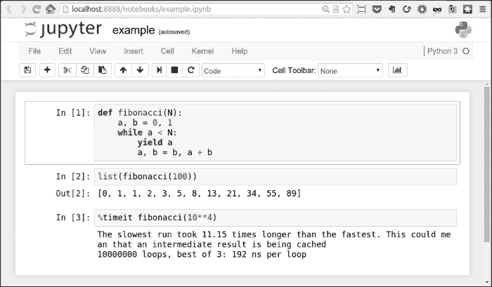
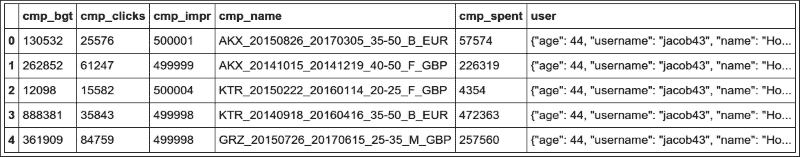
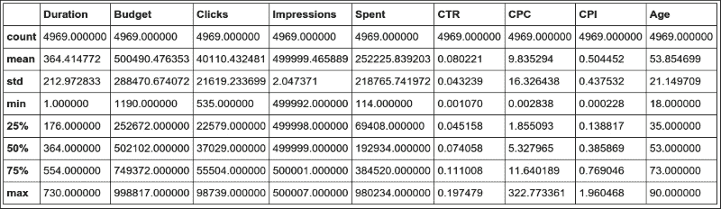
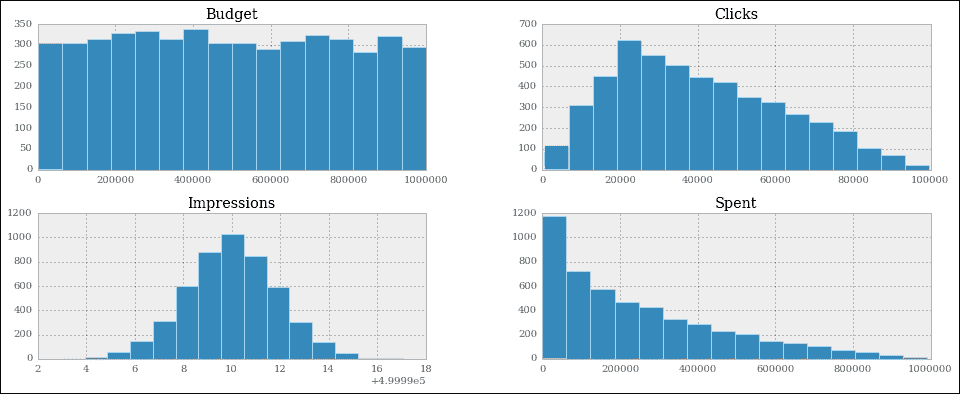
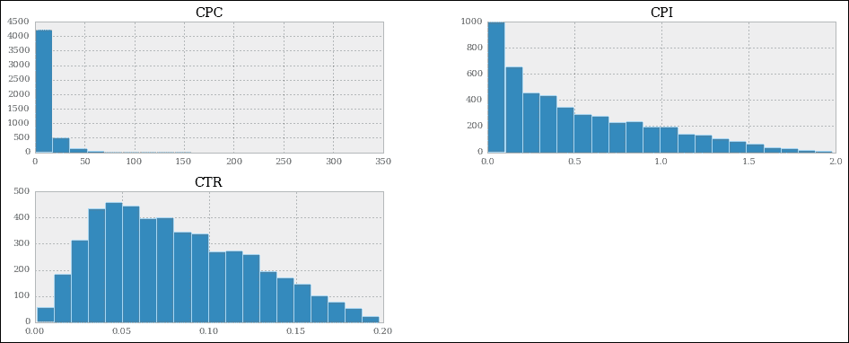
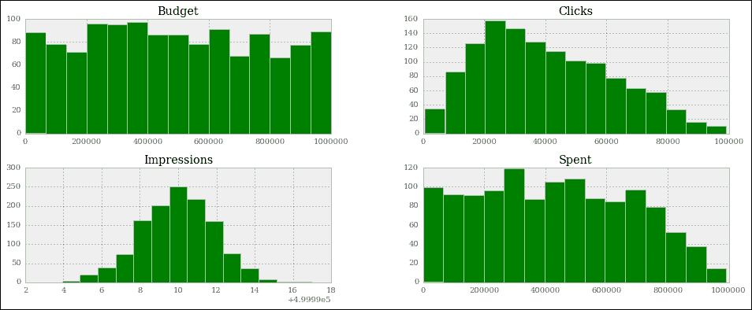
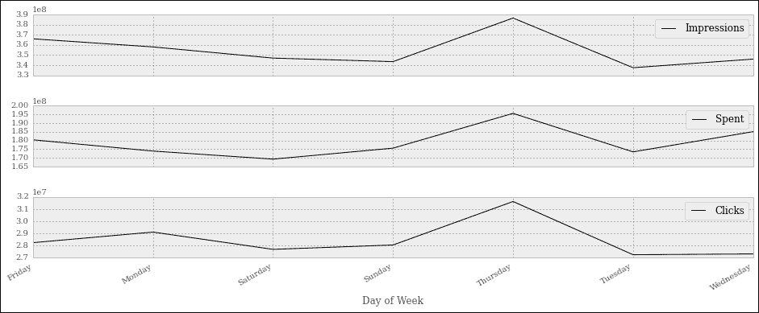
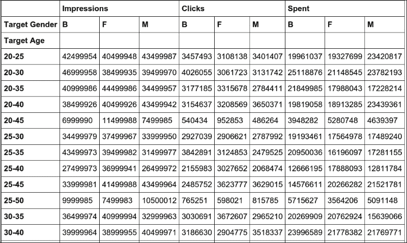

# 第九章 数据科学

|   | *"如果我们有数据，让我们看看数据。如果我们只有意见，那就听我的。" |   |
| --- | --- | --- |
|   | --*吉姆·巴克斯代尔，前网景 CEO* |

**数据科学**是一个非常广泛的概念，根据上下文、理解、工具等因素，它可以有多种不同的含义。关于这个主题有无数本书籍，这对胆小的人来说并不适合。

为了进行适当的数据科学，你至少需要了解数学和统计学。然后，你可能想深入研究其他主题，如模式识别和机器学习，当然，你有很多语言和工具可以选择。

除非我在接下来的几分钟内变成**神奇的法布里齐奥**，否则我无法谈论所有的事情；我甚至无法接近它。因此，为了使这一章节有意义，我们将一起进行一个有趣的项目。

大约 3 年前，我在伦敦的一家顶级社交媒体公司工作。我在那里待了 2 年，我有幸与几位我只能说初窥其才华的人一起工作。我们是世界上第一个能够访问 Twitter Ads API 的人，我们也是 Facebook 的合作伙伴。这意味着有很多数据。

我们的分析师正在处理大量的活动，他们正在努力应对他们必须完成的工作量，所以我所在的开发团队试图通过向他们介绍 Python 和 Python 提供的数据处理工具来帮助他们。这是一段非常有趣的旅程，它引导我成为公司中几个人的导师，并最终到了马尼拉，在那里，我花了 2 个星期的时间对那里的分析师进行了密集的 Python 和数据科学培训。

在这一章中，我们将一起做的项目是我在马尼拉学生面前展示的最终示例的轻量级版本。我将其重写到一个适合这一章的大小，并对教学目的进行了一些调整，但所有主要概念都在那里，所以你应该会享受编码并从中学习。

在我们的旅途中，我们将遇到一些你可以在 Python 生态系统中发现的数据处理工具，所以让我们先从罗马神祇开始谈。

# IPython 和 Jupyter 笔记本

2001 年，费尔南多·佩雷斯是科罗拉多大学博尔德分校的物理学研究生，他试图改进 Python shell，以便他能够拥有一些他习惯于在像 Mathematica 和 Maple 这样的工具工作时的一些便利性。这项努力的成果被命名为**IPython**。

简而言之，那个小脚本最初是 Python shell 的一个增强版本，通过其他编码者的努力，以及几家不同公司的适当资助，它最终成为了今天这个美妙且成功的项目。在其诞生后的大约 10 年后，一个笔记本环境被创建，它由 WebSocket、Tornado 网络服务器、jQuery、CodeMirror 和 MathJax 等技术驱动。ZeroMQ 库也被用来处理笔记本界面和背后的 Python 核心之间的消息。

IPython 笔记本变得如此受欢迎和广泛使用，以至于最终，各种功能都被添加到了它上面。它可以处理小部件、并行计算、各种媒体格式等等。此外，在某个时刻，从笔记本内部使用除 Python 以外的语言进行编码成为可能。

这导致了这样一个巨大的项目，最近才被拆分为两个部分：IPython 被精简以更多地关注内核和 shell 部分，而笔记本则成为了一个全新的项目，名为**Jupyter**。Jupyter 允许在 40 多种语言中进行交互式科学计算。

本章的项目都将使用 Jupyter 笔记本进行编码和运行，所以让我用几句话来解释一下什么是笔记本。

笔记本环境是一个网页，它暴露了一个简单的菜单和你可以运行 Python 代码的单元格。尽管单元格是独立的实体，你可以单独运行它们，但它们都共享同一个 Python 内核。这意味着你在单元格中定义的所有名称（变量、函数等）都将可在任何其他单元格中使用。

### 注意

简而言之，Python 内核就是一个 Python 正在运行的进程。因此，笔记本网页就是提供给用户的一个界面，用于驱动这个内核。网页通过一个非常快速的消息系统与之通信。

除了所有图形优势之外，拥有这样一个环境的美妙之处在于能够分块运行 Python 脚本，这可以是一个巨大的优势。以一个连接数据库以获取数据并处理这些数据的脚本为例。如果你用传统的 Python 脚本方式来做，每次你想对其进行实验时都必须重新获取数据。在笔记本环境中，你可以在一个单元格中获取数据，然后在其他单元格中对其进行处理和实验，因此不需要每次都获取数据。

笔记本环境对于数据科学也非常有帮助，因为它允许逐步进行内省。你完成一块工作后验证它。然后你做另一块工作并再次验证，依此类推。

它对于原型设计也非常有价值，因为结果就在你眼前，立即可用。

如果你想了解更多关于这些工具的信息，请查看[`ipython.org/`](http://ipython.org/)和[`jupyter.org/`](http://jupyter.org/)。

我创建了一个非常简单的示例笔记本，其中包含一个`fibonacci`函数，该函数可以给出小于给定`N`的所有斐波那契数的列表。在我的浏览器中，它看起来像这样：



每个单元格都有一个**In []**标签。如果花括号内没有内容，这意味着该单元格从未被执行过。如果有数字，这意味着该单元格已被执行，数字代表单元格被执行的顺序。最后，一个*****表示该单元格目前正在被执行。

你可以从图片中看到，在第一个单元格中，我定义了`fibonacci`函数，并且已经执行了它。这会将`fibonacci`名称放入与笔记本关联的全局框架中，因此`fibonacci`函数现在对其他单元格也是可用的。实际上，在第二个单元格中，我可以运行`fibonacci(100)`并在**Out [2]**中看到结果。在第三个单元格中，我向你展示了笔记本中可以找到的几个魔法函数之一。**%timeit**会多次运行代码，并为你提供一个很好的基准。我在第五章“节省时间和内存”中进行的所有列表推导和生成器的测量都是使用这个很好的功能完成的。

你可以多次执行一个单元格，并改变它们的执行顺序。单元格非常灵活，你还可以在其中放入 Markdown 文本或将其渲染为标题。

### 注意

**Markdown**是一种轻量级标记语言，具有纯文本格式化语法，旨在能够将其转换为 HTML 和其他格式。

此外，无论你在单元格的最后一行放置什么内容，它都会自动为你打印出来。这非常方便，因为你不必明确地写`print(...)`。

随意探索笔记本环境；一旦你成为它的朋友，这将是一段持久的友谊，我保证。

为了运行笔记本，你必须安装一些库，每个库都与其他库协作以使整个系统工作。或者，你只需安装 Jupyter，它将为你处理一切。对于本章，我们还需要安装一些其他依赖项，所以请运行以下命令：

```py
$ pip install jupyter pandas matplotlib fake-factory delorean xlwt

```

别担心，我会逐渐向你介绍这些内容。现在，当你安装完这些库（可能需要几分钟）后，你就可以开始使用笔记本了：

```py
$ jupyter notebook

```

这将在你的浏览器中打开一个页面，地址为：`http://localhost:8888/`。

前往该页面并使用菜单创建一个新的笔记本。当你熟悉它时，我们就准备好了。

### 小贴士

如果你设置笔记本环境时遇到任何问题，请不要气馁。如果你遇到错误，通常只是在网上搜索一下，你最终会找到其他人遇到相同问题并解释如何修复它的页面。在你继续本章之前，尽力让笔记本环境运行起来。

由于我们的项目将在笔记本中进行，因此我将为每个代码片段标记所属的单元格编号，这样你就可以轻松地重现代码并跟随。

### 小贴士

如果你熟悉键盘快捷键（在笔记本的帮助部分查看），你将能够在单元格之间移动并处理它们的内容，而无需伸手去拿鼠标。这将使你在笔记本中工作时更加熟练，速度也会更快。

# 处理数据

通常，当你处理数据时，这是你经过的路径：你获取它，清理和操作它，然后检查它，并以值、电子表格、图表等形式展示结果。我希望你负责整个过程的三个步骤，而不依赖于任何外部数据提供者，所以我们将做以下事情：

1.  我们将创建数据，模拟它以不完美或未准备好工作的格式出现。

1.  我们将清理它，并将其提供给我们在项目中使用的核心工具：`pandas` 的 **DataFrame**。

1.  我们将操作 DataFrame 中的数据。

1.  我们将把 DataFrame 保存到不同格式的文件中。

1.  最后，我们将检查数据并从中获取一些结果。

## 设置笔记本

首先，我们需要设置笔记本。这意味着导入和一些配置。

`#1`

```py
import json
import calendar
import random
from datetime import date, timedelta

import faker
import numpy as np
from pandas import DataFrame
from delorean import parse
import pandas as pd

# make the graphs nicer
pd.set_option('display.mpl_style', 'default')
```

单元格 `#1` 负责导入。这里有很多新事物：`calendar`、`random` 和 `datetime` 模块是标准库的一部分。它们的名字具有自解释性，所以让我们看看 `faker`。`fake-factory` 库提供了这个模块，你可以使用它来准备假数据。在测试中，当你准备你的固定数据时，它非常有用，可以获取各种东西，如姓名、电子邮件地址、电话号码、信用卡详情等等。当然，这些都是假的。

`numpy` 是 NumPy 库，是 Python 科学计算的基础包。我将在本章后面简要介绍它。

`pandas` 是整个项目的基础核心。它代表 **Python 数据分析库**。在许多其他功能中，它提供了 **DataFrame**，这是一种具有高级处理能力的类似矩阵的数据结构。通常，我们会单独导入 `DataFrame`，然后执行 `import pandas as pd`。

`delorean` 是一个很好的第三方库，可以显著加快处理日期的速度。技术上，我们可以使用标准库来完成，但我看不出为什么要限制示例的范围，所以我会展示一些不同的事情。

最后，我们在最后一行有一个指令，这将使我们的最终图表看起来更美观，这不会有什么坏处。

## 准备数据

我们希望达到以下数据结构：我们将有一个用户对象的列表。每个用户对象都将链接到一定数量的活动对象。

在 Python 中，一切都是对象，所以我以通用方式使用这个术语。用户对象可能是一个字符串、一个字典，或者其他东西。

在社交媒体世界中，**活动**是指媒体代理代表客户在社交媒体网络上运行的推广活动。

记住，我们将准备这些数据，使其不完全处于完美状态（但也不会太糟糕...）。

`#2`

```py
fake = faker.Faker()
```

首先，我们实例化 `Faker`，我们将用它来创建数据。

`#3`

```py
usernames = set()
usernames_no = 1000
# populate the set with 1000 unique usernames
while len(usernames) < usernames_no:
    usernames.add(fake.user_name())
```

然后，我们需要用户名。我想要 1,000 个唯一的用户名，所以我遍历 `usernames` 集合的长度，直到它有 1,000 个元素。集合不允许重复元素，因此保证了唯一性。

`#4`

```py
def get_random_name_and_gender():
    skew = .6  # 60% of users will be female
    male = random.random() > skew
    if male:
        return fake.name_male(), 'M'
    else:
        return fake.name_female(), 'F'

def get_users(usernames):
    users = []
    for username in usernames:
        name, gender = get_random_name_and_gender()
        user = {
            'username': username,
            'name': name,
            'gender': gender,
            'email': fake.email(),
            'age': fake.random_int(min=18, max=90),
            'address': fake.address(),
        }
        users.append(json.dumps(user))
    return users

users = get_users(usernames)
users[:3]
```

在这里，我们创建一个用户列表。每个 `username` 现在已经被扩展为一个完整的 `user` 字典，包括其他细节，如姓名、性别、电子邮件等。然后，每个 `user` 字典被转换为 JSON 并添加到列表中。这种数据结构当然不是最优的，但我们正在模拟用户以这种方式来到我们这里的场景。

注意 `random.random()` 的倾斜使用，以使 60% 的用户为女性。其余的逻辑应该很容易理解。

注意最后一行。每个单元格会自动打印最后一行上的内容；因此，这个输出是一个包含前三个用户的列表：

`Out #4`

```py
['{"gender": "F", "age": 48, "email": "jovani.dickinson@gmail.com", "address": "2006 Sawayn Trail Apt. 207\\nHyattview, MO 27278", "username": "darcy00", "name": "Virgia Hilpert"}',
 '{"gender": "F", "age": 58, "email": "veum.javen@hotmail.com", "address": "5176 Andres Plains Apt. 040\\nLakinside, GA 92446", "username": "renner.virgie", "name": "Miss Clarabelle Kertzmann MD"}',
 '{"gender": "M", "age": 33, "email": "turner.felton@rippin.com", "address": "1218 Jacobson Fort\\nNorth Doctor, OK 04469", "username": "hettinger.alphonsus", "name": "Ludwig Prosacco"}']

```

### 注意

希望你在自己的笔记本上也能跟着做。如果你做了，请注意，所有数据都是使用随机函数和值生成的；因此，你会看到不同的结果。每次执行笔记本时，它们都会改变。

`#5`

```py
# campaign name format:
# InternalType_StartDate_EndDate_TargetAge_TargetGender_Currency
def get_type():
    # just some gibberish internal codes
    types = ['AKX', 'BYU', 'GRZ', 'KTR']
    return random.choice(types)

def get_start_end_dates():
    duration = random.randint(1, 2 * 365)
    offset = random.randint(-365, 365)
    start = date.today() - timedelta(days=offset)
    end = start + timedelta(days=duration)

    def _format_date(date_):
        return date_.strftime("%Y%m%d")

    return _format_date(start), _format_date(end)

def get_age():
    age = random.randint(20, 45)
    age -= age % 5
    diff = random.randint(5, 25)
    diff -= diff % 5
    return '{}-{}'.format(age, age + diff)

def get_gender():
    return random.choice(('M', 'F', 'B'))

def get_currency():
    return random.choice(('GBP', 'EUR', 'USD'))

def get_campaign_name():
    separator = '_'
    type_ = get_type()
    start_end = separator.join(get_start_end_dates())
    age = get_age()
    gender = get_gender()
    currency = get_currency()
    return separator.join(
        (type_, start_end, age, gender, currency))
```

在 `#5` 中，我们定义了生成活动名称的逻辑。分析师经常使用电子表格，他们会想出各种编码技术，尽可能将尽可能多的信息压缩到活动名称中。我选择的是这种技术的简单示例：有一个代码表示活动类型，然后是开始和结束日期，然后是目标年龄和性别，最后是货币。所有值都由下划线分隔。

在 `get_type` 函数中，我使用 `random.choice()` 从一个集合中随机获取一个值。可能更有趣的是 `get_start_end_dates`。首先，我获取活动的持续时间，从 1 天到 2 年（随机），然后我获取一个随机的时间偏移量，我从今天的日期中减去它以获取开始日期。考虑到偏移量是一个介于 -365 和 365 之间的随机数，如果我将它加到今天的日期上而不是减去，会有什么不同吗？

当我有了开始和结束日期，我会返回它们的字符串化版本，并用下划线连接。

然后，我们在年龄计算中做了一些模运算技巧。我希望您还记得第二章内置数据类型中提到的模运算符（`%`）。

这里发生的事情是我想要一个具有 5 的倍数为端点的日期范围。所以有很多方法可以做到这一点，但我所做的是获取一个介于 20 和 45 之间的随机数作为左端点，并去除除以 5 的余数。例如，如果得到 28，我会从 28 中去除*28 % 5 = 3*，得到 25。我本可以使用`random.randrange()`，但很难抗拒模除运算。

其余的函数只是`random.choice()`的一些其他应用，最后一个函数`get_campaign_name`不过是一个收集所有这些拼图碎片并返回最终活动名称的收集器。

`#6`

```py
def get_campaign_data():
    name = get_campaign_name()
    budget = random.randint(10**3, 10**6)
    spent = random.randint(10**2, budget)    
    clicks = int(random.triangular(10**2, 10**5, 0.2 * 10**5))    
    impressions = int(random.gauss(0.5 * 10**6, 2))
    return {
        'cmp_name': name,
        'cmp_bgt': budget,
        'cmp_spent': spent,
        'cmp_clicks': clicks,
        'cmp_impr': impressions
    }
```

在`#6`中，我们编写了一个函数来创建一个完整的活动对象。我使用了`random`模块中的几个不同函数。`random.randint()`给你两个极端之间的整数。它的缺点是它遵循均匀概率分布，这意味着区间内的任何数字出现的概率都是相同的。

因此，当处理大量数据时，如果您使用均匀分布来分配您的固定值，您将得到的结果都将看起来很相似。出于这个原因，我选择使用`triangular`和`gauss`分布来模拟`clicks`和`impressions`。它们使用不同的概率分布，这样我们最终会看到更有趣的结果。

为了确保我们对术语的理解一致：`clicks`代表活动广告的点击次数，`budget`是分配给活动的总金额，`spent`是已经花费的金额，`impressions`是活动从其源获取作为资源的次数，无论在活动中执行了多少点击。通常，展示次数要多于点击次数。

现在我们有了数据，是时候将它们全部组合在一起了：

`#7`

```py
def get_data(users):
    data = []
    for user in users:
        campaigns = [get_campaign_data()
                     for _ in range(random.randint(2, 8))]
        data.append({'user': user, 'campaigns': campaigns})
    return data
```

如您所见，`data`中的每个项目都是一个包含用户和与该用户关联的活动列表的字典。

## 清理数据

让我们开始清理数据：

`#8`

```py
rough_data = get_data(users)
rough_data[:2]  # let's take a peek
```

我们模拟从源数据中获取数据并对其进行检查。笔记本是检查您步骤的完美工具。您可以根据需要调整粒度。`rough_data`中的第一个项目看起来是这样的：

```py
[{'campaigns': [{'cmp_bgt': 130532,
 'cmp_clicks': 25576,
 'cmp_impr': 500001,
 'cmp_name': 'AKX_20150826_20170305_35-50_B_EUR',
 'cmp_spent': 57574},
 ... omit ...
 {'cmp_bgt': 884396,
 'cmp_clicks': 10955,
 'cmp_impr': 499999,
 'cmp_name': 'KTR_20151227_20151231_45-55_B_GBP',
 'cmp_spent': 318887}],
 'user': '{"age": 44, "username": "jacob43",
 "name": "Holland Strosin",
 "email": "humberto.leuschke@brakus.com",
 "address": "1038 Runolfsdottir Parks\\nElmapo...",
 "gender": "M"}'}]

```

因此，我们现在开始处理它。

`#9`

```py
data = []
for datum in rough_data:
    for campaign in datum['campaigns']:
        campaign.update({'user': datum['user']})
        data.append(campaign)
data[:2]  # let's take another peek
```

为了能够将此数据输入到 DataFrame 中，我们首先需要对其进行反规范化。这意味着将数据转换成一个列表，其项目是包含其相对用户字典的活动字典。用户将在他们所属的每个活动中重复。`data`中的第一个项目看起来是这样的：

```py
[{'cmp_bgt': 130532,
 'cmp_clicks': 25576,
 'cmp_impr': 500001,
 'cmp_name': 'AKX_20150826_20170305_35-50_B_EUR',
 'cmp_spent': 57574,
 'user': '{"age": 44, "username": "jacob43",
 "name": "Holland Strosin",
 "email": "humberto.leuschke@brakus.com",
 "address": "1038 Runolfsdottir Parks\\nElmaport...",
 "gender": "M"}'}]

```

您可以看到用户对象已经被引入到活动字典中，并且为每个活动重复。

## 创建 DataFrame

现在是时候创建`DataFrame`了：

`#10`

```py
df = DataFrame(data)
df.head()
```

最后，我们将创建`DataFrame`并使用`head`方法检查前五行。你应该会看到类似以下的内容：



Jupyter 会自动将`df.head()`调用的输出渲染为 HTML。为了得到基于文本的输出，只需将`df.head()`包裹在一个`print`调用中即可。

`DataFrame`结构非常强大。它允许我们对内容进行大量操作。你可以按行或列进行过滤，对数据进行聚合，以及许多其他操作。你可以操作行或列，而无需支付如果你使用纯 Python 处理数据时必须支付的时间惩罚。这是因为，在幕后，`pandas`正在利用 NumPy 库的力量，而 NumPy 本身则从其核心的低级实现中获得了惊人的速度。NumPy 代表**Numeric Python**，它是数据科学环境中使用最广泛的库之一。

使用`DataFrame`允许我们将 NumPy 的力量与类似电子表格的功能相结合，这样我们就可以以类似于分析师可以做到的方式处理我们的数据。只是，我们用代码来做。

但让我们回到我们的项目。让我们看看两种快速获取数据概览的方法：

`#11`

```py
df.count()
```

`count`返回每列中所有非空单元格的计数。这有助于你了解你的数据可以有多稀疏。在我们的例子中，我们没有缺失值，所以输出如下：

```py
cmp_bgt       4974
cmp_clicks    4974
cmp_impr      4974
cmp_name      4974
cmp_spent     4974
user          4974
dtype: int64

```

好棒！我们有 4,974 行数据，数据类型是整数（`dtype: int64`表示长整数，因为它们每个占用 64 位）。考虑到我们有 1,000 个用户，每个用户的营销活动数量是一个介于 2 到 8 之间的随机数，我们正好符合我预期的结果。

`#12`

```py
df.describe()
```

`describe`是一个快速且方便的方法来进一步检查：

```py
 cmp_bgt    cmp_clicks       cmp_impr      cmp_spent
count    4974.000000   4974.000000    4974.000000    4974.000000
mean   503272.706876  40225.764978  499999.495979  251150.604343
std    289393.747465  21910.631950       2.035355  220347.594377
min      1250.000000    609.000000  499992.000000     142.000000
25%    253647.500000  22720.750000  499998.000000   67526.750000
50%    508341.000000  36561.500000  500000.000000  187833.000000
75%    757078.250000  55962.750000  500001.000000  385803.750000
max    999631.000000  98767.000000  500006.000000  982716.000000

```

如你所见，它给出了几个度量，如`count`（计数）、`mean`（平均值）、`std`（标准差）、`min`（最小值）、`max`（最大值），并显示了数据在各个象限中的分布情况。多亏了这个方法，我们已经有了一个关于数据结构的大致了解。

让我们看看预算最高和最低的三个营销活动：

`#13`

```py
df.sort_index(by=['cmp_bgt'], ascending=False).head(3)
```

这给出了以下输出（已截断）：

```py
 cmp_bgt  cmp_clicks  cmp_impr                  cmp_name
4655   999631       15343    499997  AKX_20160814_20180226_40
3708   999606       45367    499997  KTR_20150523_20150527_35
1995   999445       12580    499998  AKX_20141102_20151009_30

```

以及（`#14`）调用`.tail(3)`，显示了预算最低的几个。

### 解包营销活动名称

现在是时候稍微增加一点复杂性了。首先，我们想要摆脱那个糟糕的营销活动名称（`cmp_name`）。我们需要将其分解成部分，并将每个部分放入一个专门的列中。为了做到这一点，我们将使用**Series**对象的`apply`方法。

`pandas.core.series.Series`类基本上是一个围绕数组的强大包装器（将其视为具有增强功能的列表）。我们可以通过以字典中键的方式访问它来从`DataFrame`中提取一个`Series`对象，并且可以在该`Series`对象上调用`apply`，这将运行一个函数，将`Series`中的每个项目作为参数传递给它。我们将结果组合成一个新的`DataFrame`，然后将其与我们的`df`合并。

`#15`

```py
def unpack_campaign_name(name):
    # very optimistic method, assumes data in campaign name
    # is always in good state
    type_, start, end, age, gender, currency = name.split('_')
    start = parse(start).date
    end = parse(end).date
    return type_, start, end, age, gender, currency

campaign_data = df['cmp_name'].apply(unpack_campaign_name)
campaign_cols = [
    'Type', 'Start', 'End', 'Age', 'Gender', 'Currency']
campaign_df = DataFrame(
    campaign_data.tolist(), columns=campaign_cols, index=df.index)
campaign_df.head(3)
```

在`unpack_campaign_name`函数中，我们将活动`name`分割成几个部分。我们使用`delorean.parse()`从这些字符串中获取适当的日期对象（`delorean`使这个过程变得非常简单，不是吗？），然后返回这些对象。快速查看最后一行可以发现：

```py
 Type       Start         End    Age Gender Currency
0  KTR  2016-06-16  2017-01-24  20-30      M      EUR
1  BYU  2014-10-25  2015-07-31  35-50      B      USD
2  BYU  2015-10-26  2016-03-17  35-50      M      EUR

```

很好！有一点很重要：即使日期以字符串的形式出现，它们也只是`DataFrame`中托管的真实`date`对象的表示。

另一个非常重要的事情是：在连接两个`DataFrame`实例时，它们必须具有相同的索引，否则`pandas`将无法知道哪些行与哪些行对应。因此，当我们创建`campaign_df`时，我们将它的索引设置为`df`中的索引。这使得我们可以将它们连接起来。在创建此 DataFrame 时，我们还传递了列名。

`#16`

```py
df = df.join(campaign_df)
```

在连接之后，我们进行快速查看，希望看到匹配的数据（输出被截断）：

`#17`

```py
df[['cmp_name'] + campaign_cols].head(3)
```

得到：

```py
 cmp_name Type       Start         End
0  KTR_20160616_20170124_20-30_M_EUR  KTR  2016-06-16  2017-01-24
1  BYU_20141025_20150731_35-50_B_USD  BYU  2014-10-25  2015-07-31
2  BYU_20151026_20160317_35-50_M_EUR  BYU  2015-10-26  2016-03-17

```

如您所见，连接操作成功；活动名称和单独的列显示了相同的数据。您是否看到了我们在这里做了什么？我们正在使用方括号语法访问`DataFrame`，并传递一个列名列表。这将生成一个新的`DataFrame`，包含那些列（按相同顺序），然后我们调用`head()`。

### 解包用户数据

现在，我们对每个`user` JSON 数据片段执行完全相同的事情。我们对`user` `Series`调用`apply`，运行`unpack_user_json`函数，该函数接受一个 JSON `user`对象并将其转换为字段列表，然后我们可以将其注入到一个全新的 DataFrame `user_df`中。之后，我们将`user_df`与`df`合并，就像我们之前对`campaign_df`所做的那样。

`#18`

```py
def unpack_user_json(user):
    # very optimistic as well, expects user objects
    # to have all attributes
    user = json.loads(user.strip())
    return [
        user['username'],
        user['email'],
        user['name'],
        user['gender'],
        user['age'],
        user['address'],
    ]

user_data = df['user'].apply(unpack_user_json)
user_cols = [
    'username', 'email', 'name', 'gender', 'age', 'address']
user_df = DataFrame(
    user_data.tolist(), columns=user_cols, index=df.index)
```

与之前的操作非常相似，不是吗？我们还应该注意，在创建`user_df`时，我们需要指导`DataFrame`关于列名和，非常重要，索引。让我们进行连接（`#19`）并快速查看（`#20`）：

```py
df = df.join(user_df)
df[['user'] + user_cols].head(2)
```

输出显示一切顺利。我们做得很好，但还没有完成。

如果在单元格中调用`df.columns`，您会看到我们列的名称仍然很丑陋。让我们来改变一下：

`#21`

```py
better_columns = [
    'Budget', 'Clicks', 'Impressions',
    'cmp_name', 'Spent', 'user',
    'Type', 'Start', 'End',
    'Target Age', 'Target Gender', 'Currency',
    'Username', 'Email', 'Name',
    'Gender', 'Age', 'Address',
]
df.columns = better_columns
```

很好！现在，除了`'cmp_name'`和`'user'`之外，我们只剩下了一些好听的名称。

完成步骤`datasetNext`将是通过添加一些额外的列。对于每个活动，我们有点击次数和展示次数，还有花费。这使我们能够引入三个测量比率：**CTR**、**CPC**和**CPI**。它们分别代表**点击通过率**、**每点击成本**和**每展示成本**。

最后两个很容易理解，但 CTR 不是。简单来说，它是点击和展示的比率。它衡量了每次展示中点击活动广告的次数：这个数字越高，广告在吸引用户点击方面就越成功。

`#22`

```py
def calculate_extra_columns(df):
    # Click Through Rate
    df['CTR'] = df['Clicks'] / df['Impressions']
    # Cost Per Click
    df['CPC'] = df['Spent'] / df['Clicks']
    # Cost Per Impression
    df['CPI'] = df['Spent'] / df['Impressions']
calculate_extra_columns(df)
```

我把它写成函数，但我也可以直接在单元格中写代码。这并不重要。我想让你注意的在这里是，我们用一行代码添加了这三个列，但`DataFrame`会自动（在这种情况下是除法）对适当列的每一对单元格执行操作。所以，即使它们被标记为三个除法，实际上也是*4974 * 3*次除法，因为它们是针对每一行执行的。Pandas 为我们做了很多工作，同时也很好地隐藏了它的复杂性。

函数`calculate_extra_columns`接受一个`DataFrame`，并直接在其上工作。这种操作模式被称为**原地**。你还记得`list.sort()`是如何排序列表的吗？情况是一样的。

我们可以通过筛选相关列并调用`head`来查看结果。

`#23`

```py
df[['Spent', 'Clicks', 'Impressions',
    'CTR', 'CPC', 'CPI']].head(3)
```

这表明每个行的计算都是正确的：

```py
 Spent  Clicks  Impressions       CTR       CPC       CPI
0   57574   25576       500001  0.051152  2.251095  0.115148
1  226319   61247       499999  0.122494  3.695185  0.452639
2    4354   15582       500004  0.031164  0.279425  0.008708

```

现在，我想手动验证第一行的结果准确性：

`#24`

```py
clicks = df['Clicks'][0]
impressions = df['Impressions'][0]
spent = df['Spent'][0]
CTR = df['CTR'][0]
CPC = df['CPC'][0]
CPI = df['CPI'][0]
print('CTR:', CTR, clicks / impressions)
print('CPC:', CPC, spent / clicks)
print('CPI:', CPI, spent / impressions)
```

它产生了以下输出：

```py
CTR: 0.0511518976962 0.0511518976962
CPC: 2.25109477635 2.25109477635
CPI: 0.115147769704 0.115147769704

```

这正是我们在之前的输出中看到的内容。当然，我通常不需要这样做，但我想展示你可以这样进行计算。你可以通过将名称传递给`DataFrame`（在方括号中），然后通过其位置访问每个行，就像你使用常规列表或元组一样，来访问一个序列（一个列）。

我们几乎完成了我们的`DataFrame`。我们现在缺少的是告诉我们活动持续时间的列和告诉我们每个活动开始日期对应星期几的列。这让我可以进一步讲解如何操作日期对象。

`#25`

```py
def get_day_of_the_week(day):
    number_to_day = dict(enumerate(calendar.day_name, 1))
    return number_to_day[day.isoweekday()]

def get_duration(row):
    return (row['End'] - row['Start']).days

df['Day of Week'] = df['Start'].apply(get_day_of_the_week)
df['Duration'] = df.apply(get_duration, axis=1)
```

我们在这里使用了两种不同的技术，但首先，是代码。

`get_day_of_the_week`接受一个日期对象。如果你不能理解它是做什么的，请在阅读解释之前花几分钟时间尝试自己理解。使用我们之前几次使用过的内外技术。

所以，正如你现在可能已经知道的，如果你在`list`调用中放入`calendar.day_name`，你会得到`['Monday', 'Tuesday', 'Wednesday', 'Thursday', 'Friday', 'Saturday', 'Sunday']`。这意味着，如果我们从 1 开始枚举`calendar.day_name`，我们会得到如`(1, 'Monday')`、`(2, 'Tuesday')`等对。如果我们将这些对输入到一个字典中，我们就会得到一周中天数（1、2、3、...）和它们名称之间的映射。当映射创建后，为了得到一个天的名称，我们只需要知道它的数字。为了得到它，我们调用`date.isoweekday()`，它告诉我们这个日期是星期几（作为一个数字）。你将这个数字输入到映射中，然后，砰！你就得到了这个天的名称。

`get_duration`同样有趣。首先，注意它接受整个行，而不仅仅是单个值。在其主体中发生的事情是我们执行活动结束日期和开始日期之间的减法。当你从日期对象中减去时，结果是`timedelta`对象，它表示给定的时间量。我们取其`.days`属性的值。就这么简单。

现在，我们可以介绍有趣的部分，即这两个函数的应用。

第一个应用是在一个`Series`对象上执行的，就像我们之前对`'user'`和`'cmp_name'`所做的那样，这里没有什么新的。

第二个操作应用于整个 DataFrame，为了指示 Pandas 在行上执行该操作，我们传递`axis=1`。

我们可以很容易地验证结果，如下所示：

`#26`

```py
df[['Start', 'End', 'Duration', 'Day of Week']].head(3)
```

Yields:

```py
 Start         End  Duration Day of Week
0  2015-08-26  2017-03-05       557   Wednesday
1  2014-10-15  2014-12-19        65   Wednesday
2  2015-02-22  2016-01-14       326      Sunday

```

因此，我们现在知道，从 2015 年 8 月 26 日到 2017 年 3 月 5 日之间有 557 天，而且 2015 年 8 月 26 日是一个星期三。

如果你想知道这个的目的，我会提供一个例子。想象一下，你有一个与通常在星期日举行的一项体育赛事相关的活动。你可能想根据天数检查你的数据，以便你可以将它们与你的各种测量数据相关联。我们不会在这个项目中这样做，但看到不同的方式调用 DataFrame 上的`apply()`是有用的。

### 清理一切

现在我们已经拥有了我们想要的一切，是时候进行最后的清理了：记住我们仍然有`'cmp_name'`和`'user'`列。这些现在都是无用的，所以它们必须被移除。此外，我想重新排列 DataFrame 中的列，使其与现在包含的数据更加相关。为了做到这一点，我们只需要根据我们想要的列列表过滤`df`。我们将得到一个新的 DataFrame，我们可以将其重新分配给`df`本身。

`#27`

```py
final_columns = [
    'Type', 'Start', 'End', 'Duration', 'Day of Week', 'Budget',
    'Currency', 'Clicks', 'Impressions', 'Spent', 'CTR', 'CPC',
    'CPI', 'Target Age', 'Target Gender', 'Username', 'Email',
    'Name', 'Gender', 'Age'
]
df = df[final_columns]
```

我在开始时将活动信息分组，然后是测量数据，最后是用户数据。现在我们的 DataFrame 已经清理干净，准备好供我们检查。

在我们开始疯狂绘制图表之前，为什么不先对我们的 DataFrame 拍个快照，这样我们就可以轻松地从文件中重建它，而不是不得不重新执行我们为了到达这里所做的一切步骤。一些分析师可能希望将其以电子表格的形式保存，以便进行与我们想要进行的分析不同的分析，所以让我们看看如何将 DataFrame 保存到文件。这比说起来容易。

## 将 DataFrame 保存到文件

我们可以用许多不同的方式保存 DataFrame。你可以输入 `df.to_` 然后按 *Tab* 键来弹出自动完成，查看所有可能的选项。

我们将保存我们的 DataFrame 在三种不同的格式中，只是为了好玩：**逗号分隔值**（**CSV**）、JSON 和 Excel 电子表格。

`#28`

```py
df.to_csv('df.csv')
```

`#29`

```py
df.to_json('df.json')
```

`#30`

```py
df.to_excel('df.xls')
```

CSV 文件看起来像这样（输出已截断）：

```py
Type,Start,End,Duration,Day of Week,Budget,Currency,Clicks,Impres
0,GRZ,2015-03-15,2015-11-10,240,Sunday,622551,GBP,35018,500002,787
1,AKX,2016-06-19,2016-09-19,92,Sunday,148219,EUR,45185,499997,6588
2,BYU,2014-09-25,2016-07-03,647,Thursday,537760,GBP,55771,500001,3

```

而像这样的 JSON 格式（再次，输出已截断）：

```py
{
 "Type": {
 "0": "GRZ",
 "1": "AKX",
 "2": "BYU",

```

因此，将 DataFrame 保存为多种格式非常简单，好消息是相反的情况也是真的：将电子表格加载到 DataFrame 中也非常容易。Pandas 背后的程序员走得很远，简化了我们的任务，这是我们应该感激的。

## 可视化结果

最后，是精华部分。在本节中，我们将可视化一些结果。从数据科学的角度来看，我对深入分析并不感兴趣，特别是因为数据是完全随机的，但无论如何，这段代码将帮助你开始使用图表和其他功能。

我在生活中学到的一件事——这可能会让你感到惊讶——是外表也很重要，所以当你展示你的结果时，你尽最大努力使它们看起来很漂亮。

我不会试图向你证明最后一个陈述的真实性，但我确实相信它。如果你还记得单元格 `#1` 的最后一行：

```py
# make the graphs nicer
pd.set_option('display.mpl_style', 'default')
```

它的目的是让我们在本节中查看的图表看起来更漂亮一些。

好吧，首先，我们必须指示笔记本我们想要使用 `matplotlib` `inline`。这意味着当我们要求 Pandas 绘制某些内容时，结果将在单元格输出框架中渲染。为了做到这一点，我们只需要一个简单的指令：

`#31`

```py
%matplotlib inline
```

你也可以通过传递一个参数来指示笔记本在从控制台启动时执行此操作，但我还想展示这种方法，因为仅仅因为你想绘制一些东西而不得不重新启动笔记本可能会很烦人。这样，你就可以即时操作，然后继续工作。

接下来，我们将对 `pylab` 设置一些参数。这是为了绘图目的，它将消除一个字体未找到的警告。我建议你不要执行这一行，继续前进。如果你收到一个字体缺失的警告，请回到这个单元格并运行它。

`#32`

```py
import pylab
pylab.rcParams.update({'font.family' : 'serif'})
```

这基本上是告诉 Pylab 使用第一个可用的衬线字体。它简单但有效，你还可以尝试其他字体。

现在 DataFrame 已经完整，让我们再次运行 `df.describe()` (`#33`)。结果应该看起来像这样：



这种快速的结果非常适合那些只有 20 秒时间给你并且只想得到粗略数字的经理。

### 注意

再次提醒，请注意，我们的活动有不同的货币，所以这些数字实际上是没有意义的。这里的目的是展示 DataFrame 的能力，而不是对真实数据进行正确或详细的分析。

另外，图表通常比数字表格要好得多，因为它更容易阅读，并且能立即给出反馈。所以，让我们绘制出我们每个活动拥有的四条信息：预算、花费、点击和印象。

`#34`

```py
df[['Budget', 'Spent', 'Clicks', 'Impressions']].hist(
    bins=16, figsize=(16, 6));
```

我们外推这四列（这将给我们另一个只包含这些列的 DataFrame）并对其调用`hist()`方法。我们对桶和图形大小给出一些测量，但基本上一切都是自动完成的。

一件重要的事情：由于这个指令是这个单元格中唯一的（这也意味着，它是最后一个），笔记本会在绘制图表之前打印出其结果。为了抑制这种行为，只绘制图表而不打印，只需在末尾添加一个分号（你以为我在回忆 Java，不是吗？）。以下是图表：



它们很漂亮，不是吗？你注意到衬线字体了吗？那些数字的意义是什么？如果你回到`#6`并看看我们生成数据的方式，你会发现所有这些图表都很有意义。

**预算**是一个区间内的随机整数，因此我们预期的是一个**均匀分布**，看那里；它几乎是一条恒定的线。

**花费**也是一个**均匀分布**，但它的区间高端是预算，这是在变化的，这意味着我们应该预期一个向右递减的二次抛物线。看那里，它也是这样的。

**点击**是通过一个平均大约为区间大小 20%的**三角分布**生成的，你可以看到峰值就在那里，大约在左侧 20%的位置。

最后，**印象**是一个高斯分布，这是假设著名的钟形曲线的那个分布。平均值正好在中间，我们的标准差是 2。你可以看到图表与这些参数相匹配。

好的！让我们绘制出我们计算出的度量值：

`#35`

```py
df[['CTR', 'CPC', 'CPI']].hist(
    bins=20, figsize=(16, 6));
```



我们可以看到每点击成本高度偏左，这意味着大多数的 CPC 值都非常低。每印象成本也有类似的形状，但不太极端。

现在，所有这些都很好，但如果你只想分析数据的一个特定部分，你会怎么做？我们可以对一个 DataFrame 应用一个掩码，这样我们就会得到另一个只包含满足掩码条件的行的 DataFrame。这就像应用一个全局的行`if`子句。

`#36`

```py
mask = (df.Spent > 0.75 * df.Budget)
df[mask][['Budget', 'Spent', 'Clicks', 'Impressions']].hist(
    bins=15, figsize=(16, 6), color='g');
```

在这种情况下，我准备了一个面具来过滤掉所有花费小于或等于预算 75%的行。换句话说，我们只包括那些至少花费了预算四分之三的活动。注意，在我向你展示的面具中，我展示了请求 DataFrame 列的另一种方式，即使用直接属性访问（`object.property_name`），而不是类似字典的访问（`object['property_name']`）。如果`property_name`是一个有效的 Python 名称，你可以互换使用这两种方式（JavaScript 也是这样工作的）。

面具的运用方式与我们使用键访问字典的方式相同。当你对一个 DataFrame 应用一个面具时，你会得到另一个 DataFrame，我们只选择这个 DataFrame 上的相关列，并再次调用`hist()`。这次，为了好玩，我们希望结果被涂成绿色：



注意到图形的形状变化不大，除了花费，它相当不同。这是因为我们只请求了花费至少为预算 75%的行。这意味着我们只包括花费接近预算的行。预算数字来自均匀分布。因此，现在花费呈现出这种形状是很明显的。如果你将边界设置得更紧，要求 85%或更多，你会看到花费越来越接近预算。

现在我们来请求一些不同的事情。关于按星期分组的花费、点击和展示量怎么样？

`#37`

```py
df_weekday = df.groupby(['Day of Week']).sum()
df_weekday[['Impressions', 'Spent', 'Clicks']].plot(
    figsize=(16, 6), subplots=True);
```

第一行通过在`df`上按`'Day of Week'`进行分组来创建一个新的`DataFrame`，名为`df_weekday`。用于聚合数据的功能是加法。

第二行使用列名列表从`df_weekday`中获取一个切片，这是我们现在已经习惯的做法。在结果上我们调用`plot()`，这与`hist()`有点不同。选项`subplots=True`使得`plot`绘制三个独立的图表：



令人惊讶的是，我们可以看到大部分活动都发生在星期四。如果这是有意义的资料，这可能会成为提供给客户的重要信息，这也是我向你展示这个例子的原因。

注意到天是按字母顺序排序的，这有点打乱了它们的顺序。你能想到一个快速解决问题的方案吗？我会把它留给你作为一个练习，来想出一种方法。

让我们用几件事情来结束这个演示部分。首先是一个简单的聚合。我们想要对`'Target Gender'`和`'Target Age'`进行聚合，并显示`'Impressions'`和`'Spent'`。对于两者，我们想要看到平均值和标准差。

`#38`

```py
agg_config = {
    'Impressions': {
        'Mean Impr': 'mean',
        'Std Impr': 'std',
    },
    'Spent': ['mean', 'std'],
}

df.groupby(['Target Gender', 'Target Age']).agg(agg_config)
```

做这件事非常简单。我们将准备一个字典，我们将用它作为配置。我向你展示了两种做这件事的方法。对于`'Impressions'`，我们使用更漂亮的格式，其中我们传递一个嵌套字典，以描述/函数作为键/值对。另一方面，对于`'Spent'`，我们只使用一个简单的列表，只包含函数名。

然后，我们在`'Target Gender'`和`'Target Age'`列上执行分组，并将我们的配置字典传递给`agg()`方法。结果被截断并稍微重新排列，以适应显示，如下所示：

```py
 Impressions              Spent
 Mean Impr  Std Impr    mean            std
Target Target 
Gender Age 
B      20-25           500000  2.189102  239882  209442.168488
 20-30           500000  2.245317  271285  236854.155720
 20-35           500000  1.886396  243725  174268.898935
 20-40           499999  2.100786  247740  211540.133771
 20-45           500000  1.772811  148712  118603.932051
...                    ...       ...     ...            ...
M      20-25           500000  2.022023  212520  215857.323228
 20-30           500000  2.111882  292577  231663.713956
 20-35           499999  1.965177  255651  222790.960907
 20-40           499999  1.932473  282515  250023.393334
 20-45           499999  1.905746  271077  219901.462405

```

这当然是一种文本表示，但你也可以有 HTML 版本。你可以看到`Spent`有`mean`和`std`列，其标签仅仅是函数名，而`Impressions`则展示了我们添加到配置字典中的美好标题。

在结束这一章之前，让我们再做一些事情。我想向你展示一个叫做**交叉表**的东西。在数据环境中，这有点像是一个热门词汇，所以像这样一个虽然非常简单但却是必须的例子。

`#39`

```py
pivot = df.pivot_table(
    values=['Impressions', 'Clicks', 'Spent'],
    index=['Target Age'],
    columns=['Target Gender'],
    aggfunc=np.sum
)
pivot
```

我们创建了一个交叉表，展示了目标年龄与展示次数、点击次数和花费之间的相关性。后三者将根据目标性别进行细分。用于计算结果的聚合函数是`numpy.sum`函数（如果没有指定，默认将是`numpy.mean`）。

在创建交叉表后，我们只需在单元格的最后一行打印它，这里是结果的截图：



当数据有意义时，它非常清晰，并提供了非常有用的信息。

就这样！我将让你去发现更多关于 IPython、Jupyter 和数据科学的奇妙世界。我强烈建议你熟悉笔记本环境。它比控制台好得多，它极其实用且使用起来很有趣，你甚至可以用它来做幻灯片和文档。

# 我们接下来该去哪里？

数据科学确实是一个迷人的主题。正如我在引言中所说，那些想要深入其迷宫的人需要在数学和统计学方面接受良好的训练。处理被错误插值的数据会使任何关于它的结果都变得无用。同样，对于被错误外推或以错误频率采样的数据也是如此。为了给你一个例子，想象一个个体排列在队列中的人群。如果出于某种原因，这个群体的性别在男性和女性之间交替，队列将类似于这样：F-M-F-M-F-M-F-M-F...

如果你只采样偶数元素，你会得出结论说这个群体只由男性组成，而采样奇数元素则会告诉你正好相反。

当然，这只是一个愚蠢的例子，我知道，但请相信我，在这个领域很容易出错，尤其是在处理大数据时，采样是强制性的，因此，您进行的内省的质量首先取决于采样的质量。

当谈到数据科学和 Python 时，这些是您想要查看的主要工具：

+   **NumPy** ([`www.numpy.org/`](http://www.numpy.org/)): 这是 Python 科学计算的基础包。它包含一个强大的 N 维数组对象，复杂的（广播）函数，用于集成 C/C++和 Fortran 代码的工具，有用的线性代数、傅里叶变换、随机数能力以及更多。

+   **Scikit-Learn** ([`scikit-learn.org/stable/`](http://scikit-learn.org/stable/)): 这可能是 Python 中最受欢迎的机器学习库。它提供了简单高效的数据挖掘和分析工具，对每个人都是可访问的，并且可以在各种环境中重复使用。它是基于 NumPy、SciPy 和 Matplotlib 构建的。

+   **Pandas** ([`pandas.pydata.org/`](http://pandas.pydata.org/)): 这是一个开源的、BSD 许可的库，提供高性能、易于使用的数据结构和数据分析工具。我们在这整个章节中都用到了它。

+   **IPython** ([`ipython.org/`](http://ipython.org/)) / Jupyter ([`jupyter.org/`](http://jupyter.org/)): 这些提供了丰富的交互式计算架构。

+   **Matplotlib** ([`matplotlib.org/`](http://matplotlib.org/)): 这是一个 Python 2D 绘图库，可以在各种硬拷贝格式和跨平台的交互式环境中生成高质量的出版物。Matplotlib 可用于 Python 脚本、Python 和 IPython shell 和 notebook、Web 应用程序服务器以及六个图形用户界面工具包。

+   **Numba** ([`numba.pydata.org/`](http://numba.pydata.org/)): 这为您提供了使用直接在 Python 中编写的性能函数来加速应用程序的能力。通过一些注解，面向数组和数学密集型的 Python 代码可以被即时编译成本地机器指令，其性能与 C、C++和 Fortran 相似，而无需切换语言或 Python 解释器。

+   **Bokeh** ([`bokeh.pydata.org/en/latest/`](http://bokeh.pydata.org/en/latest/)): 这是一个针对现代 Web 浏览器的 Python 交互式可视化库，用于展示。其目标是提供类似于 D3.js 风格的优雅、简洁的图形构建，同时也能在非常大的或流式数据集上提供高性能的交互性。

除了这些单个库之外，您还可以找到如**SciPy** ([`scipy.org/`](http://scipy.org/))和**Anaconda** ([`www.continuum.io/`](https://www.continuum.io/))这样的生态系统，它们捆绑了多个不同的包，以便为您提供“开箱即用”的解决方案。

在某些系统上安装所有这些工具及其依赖项很困难，所以我建议你也尝试一下生态系统，看看你是否对他们感到舒适。这可能值得尝试。

# 摘要

在本章中，我们讨论了数据科学。而不是试图解释这个极其广泛的主题的任何内容，我们深入了一个项目。我们熟悉了 Jupyter 笔记本，以及 Pandas、Matplotlib、NumPy 等不同的库。

当然，必须将这些信息压缩到一章中意味着我只能简要地触及我提出的主题。我希望我们共同完成的项目足够全面，能够给你一个关于你在这个领域工作时可能遵循的工作流程的好主意。

下一章将专注于 Web 开发。所以，请确保你已经准备好了浏览器，我们开始吧！
