# 第一章：Selenium WebDriver 和 Python 入门

Selenium 自动化浏览器。它自动化我们在浏览器窗口中进行的交互，例如导航到网站、点击链接、填写表单、提交表单、浏览页面等。它适用于所有主要浏览器。

为了使用 Selenium WebDriver，我们需要一种编程语言来编写自动化脚本。我们选择的编程语言也应该有可用的 Selenium 客户端库。

在本书中，我们将使用 Python 和 Selenium WebDriver 客户端库来创建自动化脚本。Python 是一种广泛使用的通用、高级编程语言。它易于使用，其语法允许我们在更少的代码行中表达概念。它强调代码可读性，并提供使我们能够在小型和大型规模上编写程序的构造。它还提供了一系列内置和用户编写的库，使我们能够轻松地完成复杂任务。

Selenium WebDriver Python 客户端库提供了对所有 Selenium WebDriver 功能和 Selenium 独立服务器的访问，用于基于浏览器的应用程序的远程和分布式测试。Selenium Python 语言绑定由 David Burns、Adam Goucher、Maik Röder、Jason Huggins、Luke Semerau、Miki Tebeka 和 Eric Allenin 开发和维护。

Selenium WebDriver 客户端库支持 Python 版本 2.6、2.7、3.2 和 3.3。

本章将通过演示其安装、基本功能和整体结构，向您介绍 Selenium WebDriver Python 客户端库。

在本章中，我们将介绍以下主题：

+   安装 Python 和 Selenium 包

+   选择和设置 Python 编辑器

+   使用 Selenium WebDriver Python 客户端库实现示例脚本

+   使用 Internet Explorer 和 Google Chrome 实现跨浏览器支持

# 准备您的机器

使用 Python 与 Selenium 的第一步，我们需要以尽可能少的最低要求在我们的计算机上安装它。让我们按照以下章节中解释的步骤设置基本环境。

## 安装 Python

你会发现大多数 Linux 发行版、Mac OS X 和其他 Unix 系统默认已安装 Python。在 Windows 上，你需要单独安装它。不同平台的安装程序可在 [`python.org/download/`](http://python.org/download/) 找到。

### 注意

本书中的所有示例都是在 Windows 8 操作系统上的 Python 2.7 和 Python 3.0 上编写和测试的。

## 安装 Selenium 包

Selenium WebDriver Python 客户端库包含在 Selenium 包中。要简单安装 Selenium 包，请使用可在 [`pip.pypa.io/en/latest/`](https://pip.pypa.io/en/latest/) 找到的 `pip` 安装程序工具。

使用 `pip`，您可以使用以下命令简单地安装或升级 Selenium 包：

```py
pip install -U selenium

```

这是一个相当简单的过程。此命令将在您的机器上设置 Selenium WebDriver 客户端库，包括我们将需要用于创建自动化脚本的 Python 模块和类。`pip`工具将下载 Selenium 包的最新版本并在您的机器上安装它。可选的`–U`标志将升级已安装包的现有版本到最新版本。

您还可以从[`pypi.python.org/pypi/selenium`](https://pypi.python.org/pypi/selenium)下载 Selenium 包的最新版本源代码。只需点击页面右上角的**下载**按钮，解压下载的文件，然后使用以下命令安装：

```py
python setup.py install

```

## 浏览 Selenium WebDriver Python 文档

如下截图所示，Selenium WebDriver Python 客户端库文档可在[`selenium.googlecode.com/git/docs/api/py/api.html`](http://selenium.googlecode.com/git/docs/api/py/api.html)找到：

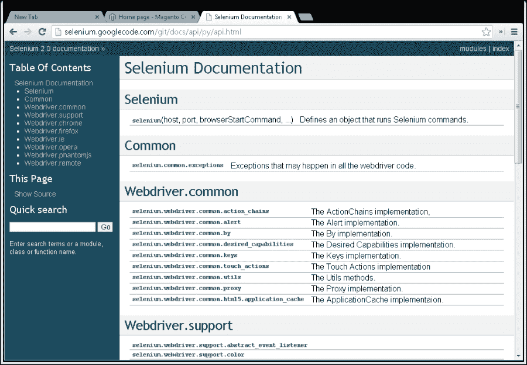

它提供了关于 Selenium WebDriver 所有核心类和函数的详细信息。同时请注意以下 Selenium 文档链接：

+   在[`docs.seleniumhq.org/docs/`](http://docs.seleniumhq.org/docs/)的官方文档提供了所有 Selenium 组件的文档，并附有支持语言的示例

+   Selenium Wiki 在[`code.google.com/p/selenium/w/list`](https://code.google.com/p/selenium/w/list)列出了我们将在本书后面探索的一些有用主题

## 选择 IDE

现在我们已经设置了 Python 和 Selenium WebDriver，我们需要一个编辑器或**集成开发环境**（**IDE**）来编写自动化脚本。一个好的编辑器或 IDE 可以提高生产力，并帮助完成许多使编码体验简单易行的事情。虽然我们可以在 Emacs、Vim 或记事本等简单编辑器中编写 Python 代码，但使用 IDE 会让生活变得更加容易。有许多 IDE 可供选择。通常，IDE 提供以下功能以加速您的开发和编码时间：

+   带有代码完成和 IntelliSense 的图形代码编辑器

+   函数和类的代码探索器

+   语法高亮

+   项目管理

+   代码模板

+   单元测试和调试工具

+   源代码控制支持

如果您是 Python 的新手，或者您是第一次在 Python 中工作的测试人员，您的开发团队将帮助您设置正确的 IDE。

然而，如果您是第一次使用 Python 并且不知道要选择哪个 IDE，这里有一些您可能想要考虑的选择。

### PyCharm

PyCharm 由 JetBrains 开发，是一家领先的提供专业开发工具和 IDE（如 IntelliJ IDEA、RubyMine、PhpStorm 和 TeamCity）的供应商。

PyCharm 是一个精致、强大且多功能的 IDE，工作表现相当出色。它将 JetBrains 在构建功能强大的 IDE 方面的最佳经验与许多其他功能相结合，以提供高度高效的使用体验。

PyCharm 支持 Windows、Linux 和 Mac。要了解更多关于 PyCharm 及其功能，请访问[`www.jetbrains.com/pycharm/`](http://www.jetbrains.com/pycharm/)。

PyCharm 有两种版本——社区版和专业版。社区版是免费的，而专业版则需要付费。以下截图展示了正在运行示例 Selenium 脚本的 PyCharm 社区版：

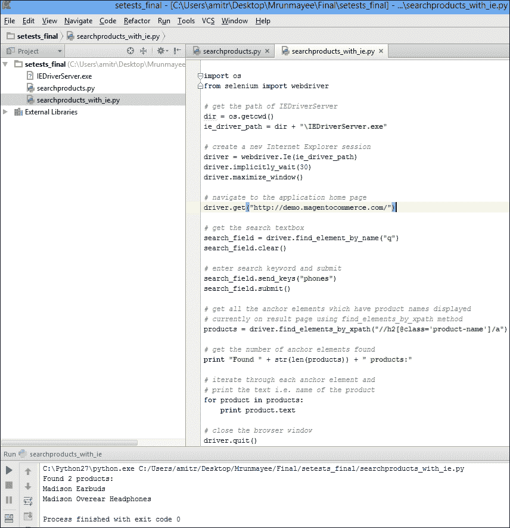

社区版非常适合使用其出色的调试支持构建和运行 Selenium 脚本。本书的其余部分我们将使用 PyCharm。在本章的后面部分，我们将设置 PyCharm 并创建我们的第一个 Selenium 脚本。

### 注意

本书中的所有示例都是使用 PyCharm 构建的；然而，你可以轻松地将这些示例用于你选择的编辑器或 IDE。

### PyDev Eclipse 插件

PyDev Eclipse 插件是 Python 开发者中广泛使用的另一个编辑器。Eclipse 是一个著名的开源 IDE，主要用于 Java 开发；然而，它也通过其强大的插件架构支持各种其他编程语言和工具。

Eclipse 是一个跨平台 IDE，支持 Windows、Linux 和 Mac。你可以在[`www.eclipse.org/downloads/`](http://www.eclipse.org/downloads/)获取 Eclipse 的最新版本。

在设置 Eclipse 之后，你需要单独安装 PyDev 插件。使用*Lars Vogel*的教程在[`www.vogella.com/tutorials/Python/article.html`](http://www.vogella.com/tutorials/Python/article.html)安装 PyDev。安装说明也可在[`pydev.org/`](http://pydev.org/)找到。

以下是 Eclipse PyDev 插件运行示例 Selenium 脚本的截图，如下所示：

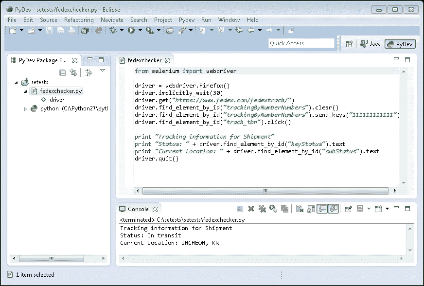

### PyScripter

对于 Windows 用户，PyScripter 也可以是一个很好的选择。它是开源的、轻量级的，并提供现代 IDE 所提供的所有功能，如 IntelliSense 和代码补全、测试和调试支持。你可以在[`code.google.com/p/pyscripter/`](https://code.google.com/p/pyscripter/)找到更多关于 PyScripter 及其下载信息。

以下是 PyScripter 运行示例 Selenium 脚本的截图，如下所示：

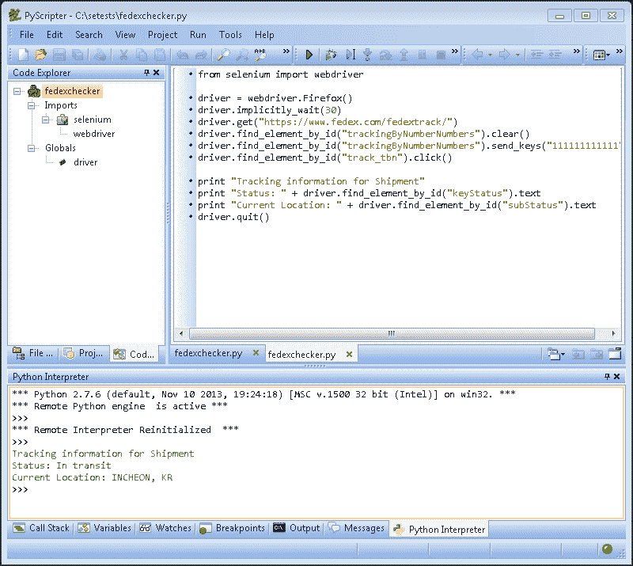

## 设置 PyCharm

既然我们已经看到了 IDE 的选择，让我们来设置 PyCharm。本书中的所有示例都是使用 PyCharm 创建的。然而，你可以设置任何你选择的 IDE，并直接使用示例。我们将按照以下步骤设置 PyCharm，以开始使用 Selenium Python：

1.  从 JetBrains 网站[`www.jetbrains.com/pycharm/download/index.html`](http://www.jetbrains.com/pycharm/download/index.html)下载并安装 PyCharm Community Edition。

1.  启动 PyCharm Community Edition。在如图所示的 **PyCharm Community Edition** 对话框中点击 **创建新项目** 选项：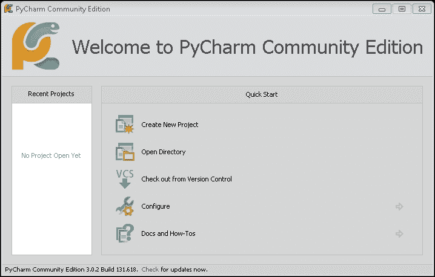

1.  在如图所示的 **创建新项目** 对话框中，在 **项目名称** 字段中指定您的项目名称。在此示例中，使用 `setests` 作为项目名称。我们需要首次配置解释器。点击  按钮来设置解释器，如图所示：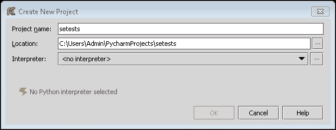

1.  在 **Python 解释器** 对话框中，点击加号图标。PyCharm 将建议类似以下截图所示的已安装解释器。从 **选择解释器路径** 中选择解释器。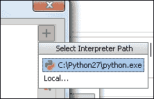

1.  PyCharm 将配置所选解释器，如图所示。它将显示与 Python 一起安装的包列表。点击 **应用** 按钮，然后点击 **确定** 按钮：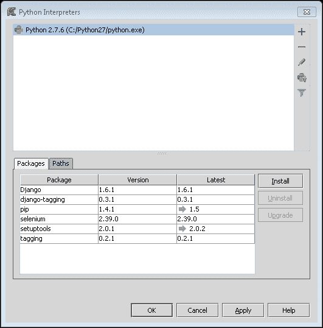

1.  在 **创建新项目** 对话框中，点击 **确定** 按钮以创建项目：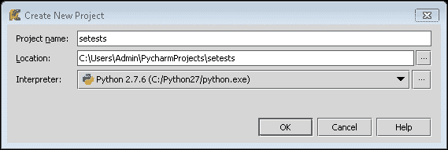

# 使用 Selenium 和 Python 的第一步

现在我们已经准备好开始使用 Python 创建和运行自动化脚本。让我们从 Selenium WebDriver 开始，创建一个使用 Selenium WebDriver 类和函数来自动化浏览器交互的 Python 脚本。

在本书的大部分示例中，我们将使用一个示例 Web 应用程序。此示例应用程序建立在著名的电子商务框架——**Magento** 上。您可以在[`demo.magentocommerce.com/`](http://demo.magentocommerce.com/)找到该应用程序。

### 小贴士

**下载示例代码**

您可以从[`www.packtpub.com`](http://www.packtpub.com)下载您购买的所有 Packt 出版物的示例代码文件。如果您在其他地方购买了这本书，您可以访问[`www.packtpub.com/support`](http://www.packtpub.com/support)并注册，以便将文件直接通过电子邮件发送给您。

示例代码也托管在[`github.com/upgundecha/learnsewithpython`](https://github.com/upgundecha/learnsewithpython)。

在本示例脚本中，我们将导航到应用程序的演示版本，搜索产品，并按照以下步骤列出搜索结果页面上的产品名称：

1.  让我们使用在设置 PyCharm 时创建的项目。创建一个简单的 Python 脚本，该脚本将使用 Selenium WebDriver 客户端库。在项目资源管理器中，右键单击`setests`，然后从弹出菜单中选择**新建** | **Python 文件**：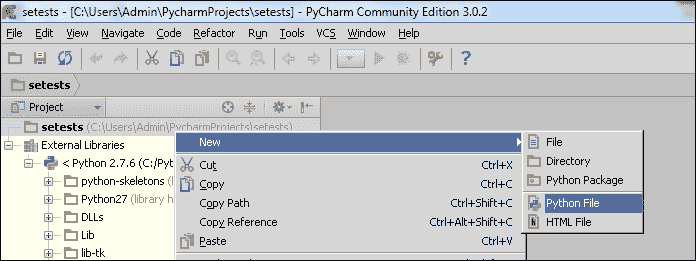

1.  在**新建 Python 文件**对话框中，在**名称**字段中输入`searchproducts`，然后单击**确定**按钮：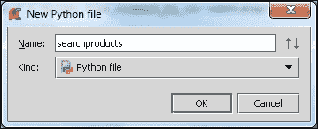

1.  PyCharm 将在代码编辑区域添加一个新的标签**searchproducts.py**。在**searchproduct.py**标签中复制以下代码：

    ```py
    from selenium import webdriver

    # create a new Firefox session
    driver = webdriver.Firefox()
    driver.implicitly_wait(30)
    driver.maximize_window()

    # navigate to the application home page
    driver.get("http://demo.magentocommerce.com/")

    # get the search textbox
    search_field = driver.find_element_by_name("q")
    search_field.clear()

    # enter search keyword and submit
    search_field.send_keys("phones")
    search_field.submit()

    # get all the anchor elements which have product names displayed
    # currently on result page using find_elements_by_xpath method
    products = driver.find_elements_by_xpath("//h2[@class='product-name']/a")

    # get the number of anchor elements found
    print "Found " + str(len(products)) + " products:"

    # iterate through each anchor element and print the text that is # name of the product
    for product in products:
        print product.text

    # close the browser window
    driver.quit()
    ```

    ### 注意

    如果你使用的是任何其他 IDE 或你选择的编辑器，创建一个新文件，将代码复制到新文件中，并将文件保存为`searchproducts.py`。

1.  要运行脚本，请在 PyCharm 代码窗口中按*Ctrl* + *Shift* + *F10*组合键，或者从**运行**菜单中选择**运行 'searchproducts'**。这将启动执行，你将看到一个新窗口的 Firefox 导航到演示网站，并在 Firefox 窗口中执行 Selenium 命令。如果一切顺利，脚本将在最后关闭 Firefox 窗口。脚本将在 PyCharm 控制台打印出产品列表，如下面的截图所示：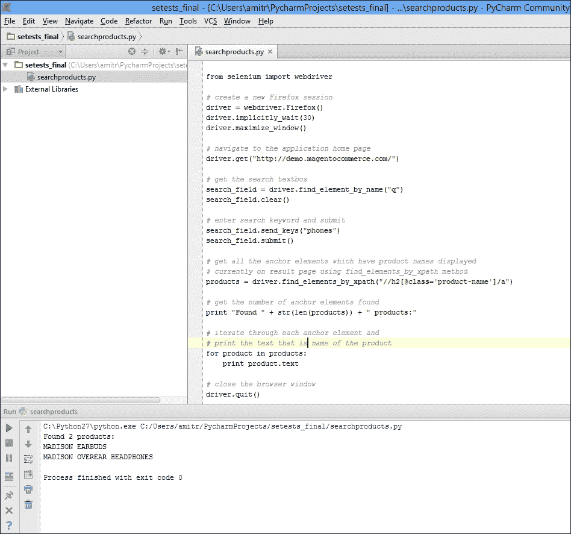

    ### 注意

    我们也可以使用以下命令通过命令行运行此脚本。打开命令行，然后打开`setests`目录，并运行以下命令：

    ```py
    python searchproducts.py

    ```

    在本书的其余部分，我们将使用命令行作为首选方法来执行测试。

我们将花一些时间查看我们刚才创建的脚本。我们将逐句分析，简要了解 Selenium WebDriver。本书的其余部分还有很多内容要介绍。

`selenium.webdriver`模块实现了 Selenium 支持的浏览器驱动类，包括 Firefox、Chrome、Internet Explorer、Safari 以及各种其他浏览器，以及`RemoteWebDriver`，用于在远程机器上托管的浏览器上进行测试。

我们需要从 Selenium 包中导入`webdriver`以使用 Selenium WebDriver 方法：

```py
from selenium import webdriver
```

接下来，我们需要一个我们想要使用的浏览器实例。这将提供一个程序接口，使用 Selenium 命令与浏览器交互。在这个例子中，我们使用 Firefox。我们可以创建一个 Firefox 实例，如下面的代码所示：

```py
driver = webdriver.Firefox()
```

在运行过程中，这将启动一个新的 Firefox 窗口。我们还在驱动程序上设置了一些选项：

```py
driver.implicitly_wait(30)
driver.maximize_window()
```

我们为 Selenium 设置了一个超时，使用 30 秒的隐式等待来执行驱动程序步骤，并通过 Selenium API 最大化 Firefox 窗口。我们将在第五章*同步测试*中学习更多关于隐式等待的内容。

接下来，我们将通过调用 `driver.get()` 方法使用其 URL 导航到应用程序的演示版本。在调用 `get()` 方法后，WebDriver 等待页面在 Firefox 窗口中完全加载，并将控制权返回给脚本。

在页面加载完成后，Selenium 将像人类用户一样与页面上的各种元素进行交互。例如，在应用程序的首页，我们需要在一个文本框中输入一个搜索词并点击**搜索**按钮。这些元素被实现为 HTML 输入元素，Selenium 需要找到这些元素来模拟用户操作。Selenium WebDriver 提供了多种方法来查找这些元素并与它们交互，以执行发送值、点击按钮、在下拉列表中选择项目等操作。我们将在第三章*查找元素*中了解更多关于这方面的内容。

在这个例子中，我们使用 `find_element_by_name` 方法查找**搜索**文本框。这将返回与 `find` 方法中指定的名称属性匹配的第一个元素。HTML 元素由标签和属性定义。我们可以使用这些信息通过以下步骤找到元素：

1.  在这个例子中，**搜索**文本框的名称属性定义为 `q`，我们可以像以下代码示例中那样使用这个属性：

    ```py
    search_field = driver.find_element_by_name("q")
    ```

1.  一旦找到**搜索**文本框，我们将通过使用 `clear()` 方法清除之前输入的值（如果有的话）以及使用 `send_keys()` 方法输入指定的新值来与这个元素进行交互。接下来，我们将通过调用 `submit()` 方法提交搜索请求：

    ```py
    search_field.clear()
    search_field.send_keys("phones")
    search_field.submit()
    ```

1.  在提交搜索请求后，Firefox 将加载应用程序返回的结果页面。结果页面包含与搜索词匹配的产品列表，即 `phones`。我们可以读取结果列表，特别是使用 `find_elements_by_xpath()` 方法读取渲染在锚 `<a>` 元素中的所有产品的名称。这将返回一个包含多个匹配元素的列表：

    ```py
    products = driver.find_elements_by_xpath("//h2[@class='product-name']/a")
    ```

1.  接下来，我们将使用所有锚 `<a>` 元素的 `.text` 属性打印出页面上找到的产品数量（即锚 `<a>` 元素的数目）和产品名称：

    ```py
    print "Found " + str(len(products)) + " products:"

    for product in products:
        print product.text
    ```

1.  在脚本末尾，我们将使用 `driver.quit()` 方法关闭 Firefox 浏览器：

    ```py
    driver.quit()
    ```

此示例脚本为我们提供了一个简洁的示例，说明如何将 Selenium WebDriver 和 Python 结合起来创建一个简单的自动化脚本。在这个脚本中，我们还没有进行任何测试。在本书的后面部分，我们将扩展这个简单的脚本成为一个测试集，并使用 Python 的各种其他库和功能。

# 跨浏览器支持

到目前为止，我们已经使用 Firefox 构建并运行了我们的脚本。Selenium 广泛支持跨浏览器测试，您可以在包括 Internet Explorer、Google Chrome、Safari、Opera 以及无头浏览器（如 PhantomJS）在内的所有主要浏览器上自动化。在本节中，我们将设置并运行上一节中创建的脚本，以使用 Internet Explorer 和 Google Chrome 查看 Selenium WebDriver 的跨浏览器功能。

## 设置 Internet Explorer

在 Internet Explorer 上运行脚本还有一些其他注意事项。要在 Internet Explorer 上运行测试，我们需要下载并设置`InternetExplorerDriver`服务器。`InternetExplorerDriver`服务器是一个独立的可执行服务器，它实现了 WebDriver 的线协议，作为测试脚本和 Internet Explorer 之间的粘合剂。它支持 Windows XP、Vista、Windows 7 和 Windows 8 操作系统上的主要 IE 版本。让我们按照以下步骤设置`InternetExplorerDriver`服务器：

1.  从[`www.seleniumhq.org/download/`](http://www.seleniumhq.org/download/)下载`InternetExplorerDriver`服务器。您可以根据所使用的系统配置下载 32 位或 64 位版本。

1.  下载`InternetExplorerDriver`服务器后，解压缩并将文件复制到存储脚本的同一目录中。

1.  在 IE 7 或更高版本中，每个区域的**保护模式**设置必须具有相同的值。**保护模式**可以是开启或关闭，只要对所有区域都一样。要设置**保护模式**设置：

    1.  从**工具**菜单中选择**Internet 选项**。

    1.  在**Internet 选项**对话框中，单击**安全**选项卡。

    1.  在**选择一个区域以查看或更改安全设置**中，选择列出的每个区域，并确保所有区域都勾选或取消勾选**启用保护模式（需要重新启动 Internet Explorer）**。所有区域应与以下屏幕截图所示的设置相同：

    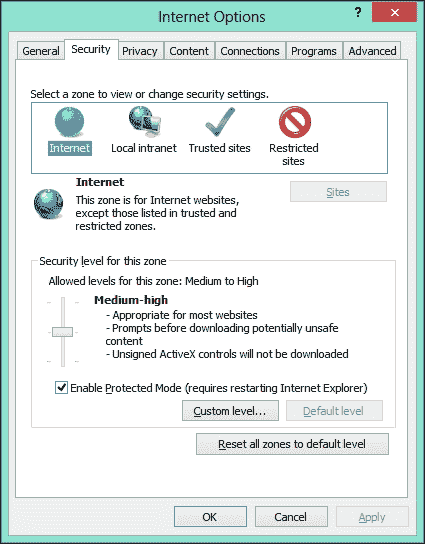

    ### 注意

    在使用`InternetExplorerDriver`服务器时，保持浏览器缩放级别设置为 100%也很重要，这样可以将原生鼠标事件设置为正确的坐标。

1.  最后，修改脚本以使用 Internet Explorer。我们不会创建 Firefox 类的实例，而是以下方式使用`IE`类：

    ```py
    import os
    from selenium import webdriver

    # get the path of IEDriverServer
    dir = os.path.dirname(__file__)
    ie_driver_path = dir + "\IEDriverServer.exe"

    # create a new Internet Explorer session
    driver = webdriver.Ie(ie_driver_path)
    driver.implicitly_wait(30)
    driver.maximize_window()

    # navigate to the application home page
    driver.get("http://demo.magentocommerce.com/")

    # get the search textbox
    search_field = driver.find_element_by_name("q")
    search_field.clear()

    # enter search keyword and submit
    search_field.send_keys("phones")
    search_field.submit()

    # get all the anchor elements which have product names displayed
    # currently on result page using find_elements_by_xpath method
    products = driver.find_elements_by_xpath("//h2[@class='product-name']/a")

    # get the number of anchor elements found
    print "Found " + str(len(products)) + " products:"

    # iterate through each anchor element and print the text that is # name of the product
    for product in products:
        print product.text

    # close the browser window
    driver.quit()
    ```

    在此脚本中，我们在创建`IE`浏览器类实例时传递了`InternetExplorerDriver`服务器的路径。

1.  运行脚本，Selenium 将首先启动`InternetExplorerDriver`服务器，该服务器启动浏览器并执行步骤。

    `InternetExplorerDriver`服务器在 Selenium 脚本和浏览器之间充当中间件。实际步骤的执行与我们观察到的 Firefox 非常相似。

### 小贴士

在 [`code.google.com/p/selenium/wiki/InternetExplorerDriver`](https://code.google.com/p/selenium/wiki/InternetExplorerDriver) 了解有关 Internet Explorer 的重要配置选项，以及在 [`code.google.com/p/selenium/wiki/DesiredCapabilities`](https://code.google.com/p/selenium/wiki/DesiredCapabilities) 了解 *DesiredCapabilities* 文章的更多信息。

## 设置 Google Chrome

在 Google Chrome 上设置和运行 Selenium 脚本与 Internet Explorer 类似。我们需要下载与 `InternetExplorerDriver` 类似的 `ChromeDriver` 服务器。`ChromeDriver` 服务器是由 Chromium 团队开发和维护的独立服务器。它实现了 WebDriver 的线协议以自动化 Google Chrome。它支持 Windows、Linux 和 Mac 操作系统。按照以下步骤设置 `ChromeDriver` 服务器：

1.  从 [`chromedriver.storage.googleapis.com/index.html`](http://chromedriver.storage.googleapis.com/index.html) 下载 `ChromeDriver` 服务器。

1.  下载 `ChromeDriver` 服务器后，解压并将文件复制到存储脚本的同一目录中。

1.  最后，修改示例脚本以使用 Chrome。我们不会创建 Firefox 类的实例，而是以下方式使用 `Chrome` 类：

    ```py
    import os
    from selenium import webdriver

    # get the path of chromedriver
    dir = os.path.dirname(__file__)
    chrome_driver_path = dir + "\chromedriver.exe" #remove the .exe extension on linux or mac platform

    # create a new Chrome session
    driver = webdriver.Chrome(chrome_driver_path)
    driver.implicitly_wait(30)
    driver.maximize_window()

    # navigate to the application home page
    driver.get("http://demo.magentocommerce.com/")

    # get the search textbox
    search_field = driver.find_element_by_name("q")
    search_field.clear()

    # enter search keyword and submit
    search_field.send_keys("phones")
    search_field.submit()

    # get all the anchor elements which have product names displayed
    # currently on result page using find_elements_by_xpath method
    products = driver.find_elements_by_xpath("//h2[@class='product-name']/a")

    # get the number of anchor elements found
    print "Found " + str(len(products)) + " products:"

    # iterate through each anchor element and print the text that is # name of the product
    for product in products:
        print product.text

    # close the browser window
    driver.quit()
    ```

    在此脚本中，我们在创建 Chrome 浏览器类实例时传递了 `ChromeDriver` 服务器的路径。

1.  运行脚本。Selenium 首先启动 `Chromedriver` 服务器，该服务器启动 Chrome 浏览器并执行步骤。实际步骤的执行与我们观察到的 Firefox 非常相似。

### 小贴士

在 [`code.google.com/p/selenium/wiki/ChromeDriver`](https://code.google.com/p/selenium/wiki/ChromeDriver) 和 [`sites.google.com/a/chromium.org/chromedriver/home`](https://sites.google.com/a/chromium.org/chromedriver/home) 了解有关 ChromeDriver 的更多信息。

# 摘要

在本章中，我们向您介绍了 Selenium 及其组件。我们使用 `pip` 工具安装了 `selenium` 包。然后我们查看各种编辑器和 IDE 以简化我们的 Selenium 和 Python 编码体验，并设置了 PyCharm。然后我们在示例应用程序上构建了一个简单的脚本，涵盖了 Selenium WebDriver Python 客户端库的一些高级概念。我们运行了脚本并分析了结果。最后，我们通过配置和运行脚本使用 Internet Explorer 和 Google Chrome 探索了 Selenium WebDriver 的跨浏览器测试支持。

在下一章中，我们将学习如何使用 `unittest` 库通过 Selenium WebDriver 创建自动化测试。我们还将学习如何创建测试套件并在组内运行测试。
