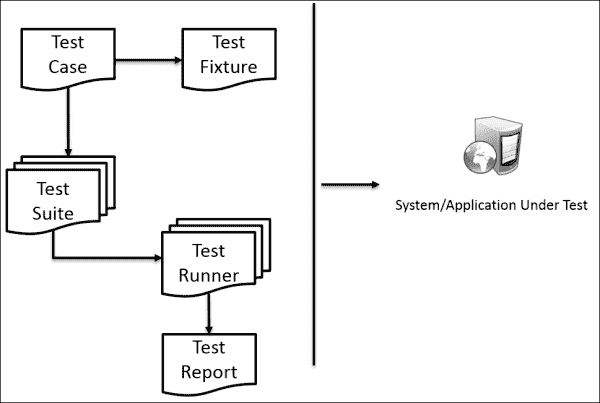
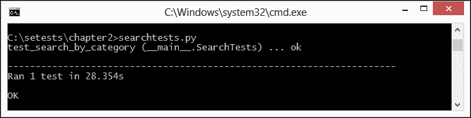
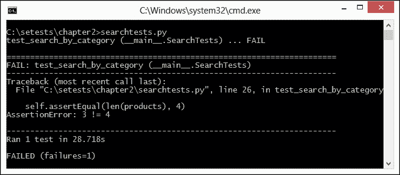
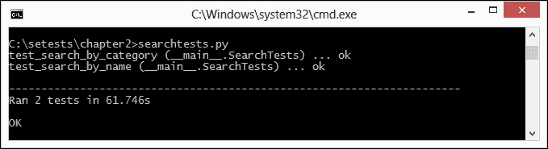
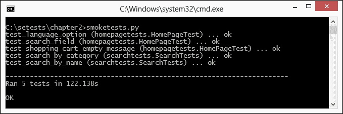
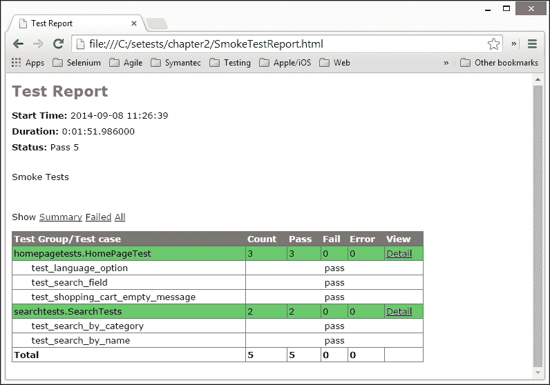

# 第二章：使用 unittest 编写测试

Selenium WebDriver 是一个浏览器自动化 API。它提供了自动化浏览器交互的功能，这个 API 主要用于测试网络应用程序。我们不能使用 Selenium WebDriver 设置测试的前置条件和后置条件，检查预期的和实际的输出，检查应用程序的状态，报告测试结果，创建数据驱动测试等等。我们可以使用单元测试框架或单元测试中使用的测试运行器与 Selenium 结合，创建一个测试框架。在本章中，我们将学习如何使用 `unittest` 库在 Python 中创建 Selenium WebDriver 测试。

在本章中，我们将涵盖以下主题：

+   什么是 `unittest`？

+   使用 `unittest` 库编写 Selenium WebDriver 测试

+   使用 `TestCase` 类实现测试

+   理解 `unittest` 库提供的各种 `assert` 方法的类型

+   为一组测试创建 `TestSuite`

+   使用 `unittest` 扩展生成 HTML 格式的测试报告

# `unittest` 库

`unittest` 库（最初命名为 PyUnit）灵感来源于在 Java 应用程序开发中广泛使用的 JUnit 库。我们可以使用 `unittest` 为任何项目创建一个全面的测试套件。`unittest` 模块在 Python 项目中使用，用于测试各种标准库模块，包括 `unittest` 本身。您可以在 [`docs.python.org/2/library/unittest.html`](http://docs.python.org/2/library/unittest.html) 找到 `unittest` 的文档。

`unittest` 库为我们提供了创建测试用例、测试套件和测试设置的能力。让我们根据以下图表了解每个组件：



+   **测试设置**：通过使用测试设置，我们可以定义执行一个或多个测试所需的准备工作以及任何相关的清理操作。

+   **测试用例**：在 `unittest` 中，测试用例是测试的最小单元。它使用 `unittest` 库提供的各种 `assert` 方法检查对特定动作和输入的特定响应。`unittest` 库提供了一个名为 `TestCase` 的基类，可以用来创建新的测试用例。

+   **测试套件**：测试套件是多个测试或测试用例的集合，用于创建代表特定功能或测试应用程序的模块的测试组，这些测试将一起执行。

+   **测试运行器**：测试运行器协调测试的执行并向用户提供结果。运行器可能使用图形界面、文本界面或返回一个特殊值来指示测试执行的结果。

+   **测试报告**：测试报告显示测试结果的摘要，包括已执行测试用例的通过或失败状态，失败的步骤的预期与实际结果，以及整体运行和计时信息的摘要。

使用`xUnit`框架（如`unittest`）创建的测试分为三个部分，也称为 3A，如下所示：

+   **安排**：这部分为测试设置前提条件，包括需要测试的对象、相关配置和依赖项。

+   **行动**：这部分执行功能。

+   **断言**：这部分检查结果是否符合预期。

我们将在本章的其余部分使用这种方法，通过`unittest`库来创建测试。

### 注意

我们将在本书的其余部分使用`unittest`库来创建和运行 Selenium WebDriver 测试。然而，Python 中还有其他具有额外功能的测试框架，如下所示：

+   **Nose**：`nose`框架扩展了`unittest`库，并提供了自动搜索和运行测试的能力。它还提供了各种插件来创建更高级的测试。你可以在[`nose.readthedocs.org/en/latest/`](https://nose.readthedocs.org/en/latest/)了解更多关于`nose`的信息。

+   **Pytest**：`pytest`框架是另一个提供许多高级功能以在 Python 中编写和运行单元测试的测试框架。你可以在[`pytest.org/latest/`](http://pytest.org/latest/)了解更多关于`pytest`的信息。

## `TestCase`类

我们可以通过继承`TestCase`类并将每个测试作为方法添加到这个类中来创建一个测试或一组测试。要创建一个测试，我们需要使用`assert`或`TestCase`类中包含的许多`assert`变体之一。每个测试最重要的任务是调用`assertEqual()`来检查预期的结果，`assertTrue()`来验证条件，或`assertRaises()`来验证预期的异常被抛出。

除了添加测试外，我们还可以添加测试固定装置：即`setUp()`和`tearDown()`方法来处理创建和处置测试所需的任何对象或条件。

让我们开始使用`unittest`库，首先通过继承`TestCase`类编写一个简单的测试，然后为我们在第一章中创建的示例脚本添加一个测试方法，*使用 Selenium WebDriver 和 Python 入门*。

我们需要导入`unittest`模块并定义一个继承`TestCase`类的类，如下所示：

```py
import unittest
from selenium import webdriver

class SearchTest(unittest.TestCase):
```

### `setUp()`方法

测试用例的起点是`setUp()`方法，我们可以用它来在每个测试的开始或定义在类中的所有测试之前执行一些任务。这些可以是测试准备任务，例如创建浏览器驱动程序的实例、导航到基本 URL、加载测试数据、打开日志文件等等。

此方法不接受任何参数，也不返回任何内容。当定义了`setUp()`方法时，测试运行器将在每个测试方法之前运行该方法。在我们的例子中，我们将使用`setUp()`方法创建 Firefox 的实例，设置属性，并在测试执行之前导航到应用程序的主页，如下面的示例所示：

```py
import unittest
from selenium import webdriver

class SearchTests(unittest.TestCase):
    def setUp(self):
        # create a new Firefox session
        self.driver = webdriver.Firefox()
        self.driver.implicitly_wait(30)
        self.driver.maximize_window()

        # navigate to the application home page
        self.driver.get("http://demo.magentocommerce.com/")
```

### 编写测试

在设置方法到位后，我们现在可以编写一些测试来验证我们想要测试的应用程序的功能。在这个例子中，我们将搜索一个产品并检查结果是否返回了项目数量。与`setUp()`方法类似，测试方法是在`TestCase`类中实现的。我们命名这些方法时以单词`test`开头是很重要的。这种命名约定通知测试运行器哪些方法代表一个测试。

对于测试运行器找到的每个测试方法，它会在执行`test`方法之前执行`setUp()`方法。这有助于确保每个`test`方法都可以依赖于一个一致的环境，无论类中定义了多少个测试。我们将使用简单的`assertEqual()`方法来检查给定搜索词的预期结果是否与应用程序返回的结果匹配。我们将在本章后面讨论断言。

添加一个新的测试方法，`test_search_by_category()`，该方法通过类别搜索产品并检查搜索返回的产品数量，如下面的示例所示：

```py
import unittest
from selenium import webdriver

class SearchTests(unittest.TestCase):
    def setUp(self):
        # create a new Firefox session
        self.driver = webdriver.Firefox()
        self.driver.implicitly_wait(30)
        self.driver.maximize_window()

        # navigate to the application home page
        self.driver.get("http://demo.magentocommerce.com/")

    def test_search_by_category(self):
        # get the search textbox
        self.search_field = self.driver.find_element_by_name("q")
        self.search_field.clear()

        # enter search keyword and submit
        self.search_field.send_keys("phones")
        self.search_field.submit()

        # get all the anchor elements which have product names         # displayed currently on result page using         # find_elements_by_xpath method
        products = self.driver.find_elements_by_xpath          ("//h2[@class='product-name']/a")
        self.assertEqual(2, len(products))

```

### 清理代码

与在每次测试方法之前调用的`setUp()`方法类似，`TestCase`类也会调用一个`tearDown()`方法来清理测试执行后的任何初始化值。一旦测试执行完毕，`setUp()`方法中定义的值就不再需要；因此，在测试完成后清理`setUp()`方法初始化的值是一个好习惯。在我们的例子中，测试执行后，我们不再需要 Firefox 的实例。我们将在`tearDown()`方法中关闭为测试创建的 Firefox 实例，如下面的代码所示：

```py
import unittest
from selenium import webdriver

class SearchTests(unittest.TestCase):
    def setUp(self):
        # create a new Firefox session
        self.driver = webdriver.Firefox()
        self.driver.implicitly_wait(30)
        self.driver.maximize_window()

        # navigate to the application home page
        self.driver.get("http://demo.magentocommerce.com/")

    def test_search_by_category(self):
        # get the search textbox
        self.search_field = self.driver.find_element_by_name("q")
        self.search_field.clear()

        # enter search keyword and submit
        self.search_field.send_keys("phones")
        self.search_field.submit()

        # get all the anchor elements which have product names # displayed currently on result page using # find_elements_by_xpath method
        products = self.driver.find_elements_by_xpath ("//h2[@class='product-name']/a")
        self.assertEqual(2, len(products))

    def tearDown(self):
        # close the browser window
        self.driver.quit()

```

### 运行测试

要从命令行运行测试，我们可以向测试用例的`main`方法添加一个调用。我们将传递`verbosity`参数，该参数用于在控制台上显示测试结果细节的数量：

```py
if __name__ == '__main__':
    unittest.main(verbosity=2)
```

我们可以将测试存储为正常的 Python 脚本。对于这个例子，将示例测试保存为`searchtests.py`。保存文件后，我们可以通过使用以下命令在命令行中执行它：

```py
python searchtests.py

```

运行测试后，`unittest`会在控制台上显示结果以及测试摘要，如下面的截图所示：



除了结果摘要之外，当测试用例失败时，对于每次失败，摘要将生成一段文本来描述出错的原因。查看以下截图，了解当我们更改预期值时会发生什么：



如你所见，它显示了哪个测试方法生成了失败，并带有跟踪信息以追踪导致失败代码流。此外，失败本身被显示为`AssertionError`，显示了预期输出与实际输出的不匹配。

### 添加另一个测试

我们可以将多个测试组合成一个测试类的一部分。这有助于创建属于特定功能的逻辑测试组。让我们向测试类中添加另一个测试。规则很简单；为新方法命名时以单词`test`开头，如下面的代码所示：

```py
def test_search_by_name(self):
    # get the search textbox
    self.search_field = self.driver.find_element_by_name("q")
    self.search_field.clear()

    # enter search keyword and submit
    self.search_field.send_keys("salt shaker")
    self.search_field.submit()

    # get all the anchor elements which have
	# product names displayed
    # currently on result page using
	# find_elements_by_xpath method
    products = self.driver.find_elements_by_xpath ("//h2[@class='product-name']/a")
    self.assertEqual(1, len(products))
```

运行测试，你会看到两个 Firefox 实例打开和关闭。这就是`setUp()`和`tearDown()`方法对每个测试方法的工作方式。你将看到如下截图所示的结果：



## 类级别的`setUp()`和`tearDown()`方法

在上一个示例中，我们在每个测试方法执行之前使用`setUp()`方法创建一个新的 Firefox 实例，并在测试方法执行后关闭该实例。那么，我们是否可以考虑在每次创建新实例之前，在方法之间共享单个 Firefox 实例呢？这可以通过使用`setUpClass()`和`tearDownClass()`方法以及使用`@classmethod`装饰器来实现。这些方法允许我们在类级别而不是方法级别初始化值，然后在这些测试方法之间共享这些值。在下面的示例中，代码被修改为使用`@classmethod`装饰器调用`setUpClass()`和`tearDownClass()`方法：

```py
import unittest
from selenium import webdriver

class SearchTests(unittest.TestCase):
    @classmethod
    def setUpClass(cls):
        # create a new Firefox session
        cls.driver = webdriver.Firefox()
        cls.driver.implicitly_wait(30)
        cls.driver.maximize_window()

        # navigate to the application home page
        cls.driver.get("http://demo.magentocommerce.com/")
        cls.driver.title

    def test_search_by_category(self):
        # get the search textbox
        self.search_field = self.driver.find_element_by_name("q")
        self.search_field.clear()

        # enter search keyword and submit
        self.search_field.send_keys("phones")
        self.search_field.submit()

        # get all the anchor elements which have product names
		# displayed currently on result page using
		# find_elements_by_xpath method
        products = self.driver.find_elements_by_xpath("//h2[@class='product-name']/a")
        self.assertEqual(2, len(products))

    def test_search_by_name(self):
        # get the search textbox
        self.search_field = self.driver.find_element_by_name("q")
        self.search_field.clear()

        # enter search keyword and submit
        self.search_field.send_keys("salt shaker")
        self.search_field.submit()

        # get all the anchor elements which have product names
		# displayed currently on result page using
		# find_elements_by_xpath method
        products = self.driver.find_elements_by_xpath("//h2[@class='product-name']/a")
        self.assertEqual(1, len(products))

    @classmethod
    def tearDownClass(cls):
        # close the browser window
        cls.driver.quit()

    if __name__ == '__main__':
        unittest.main()

```

运行测试，你会看到一个 Firefox 实例被创建；两个测试都将使用这个实例。

### 注意

关于`@classmethod`装饰器的更多信息，请参阅[`docs.python.org/2/library/functions.html#classmethod`](https://docs.python.org/2/library/functions.html#classmethod)。

## 断言

`unittest`库的`TestCase`类提供了一些实用方法，用于检查应用程序返回的实际值与预期值之间的差异。这些方法以这种方式实现，即它们代表必须为真才能继续执行测试的条件。大致有三种这样的方法，每种方法覆盖特定类型的条件，例如检查等价性、逻辑比较和异常。如果给定的断言通过，测试将继续到下一行代码；否则，测试将立即停止，并生成一个失败消息。

`unittest`库提供了所有标准的 xUnit `asserts`方法。以下表格列出了我们将在本书其余部分使用的一些重要方法：

| 方法 | 检查的条件 | 示例使用 |
| --- | --- | --- |
| `assertEqual(a, b [,msg])` | a == b | 这些方法检查 `a` 和 `b` 是否相等。`msg` 对象是一个解释失败（如果有的话）的消息。这有助于检查元素、属性等值。例如：`assertEqual(element.text,"10")` |
| `assertNotEqual(a, b[,msg])` | a != b |
| `assertTrue(x[,msg]))` | bool(x) 是 True | 这些方法检查给定的表达式是否评估为 `True` 或 `False`。例如，为了检查元素是否在页面上显示，我们可以使用以下方法：`assertTrue(element.is_dispalyed())` |
| `assertFalse(x[,msg]))` | bool(x) 是 False |
| `assertIsNot(a, b[,msg]))` | a 不是 b |
| `assertRaises(exc, fun, *args, **kwds)` | fun(*args, **kwds) 抛出 exc | 这些方法检查测试步骤是否引发了特定的异常。此方法的可能用途是检查 `NoSuchElementFoundexception`。 |
| `assertRaisesRegexp(exc, r, fun, *args, **kwds)` | fun(*args, **kwds) 抛出 exc 并且消息与正则表达式 r 匹配 |
| `assertAlmostEqual(a, b)` | round(a-b, 7) 等于 0 | 这些方法专门检查数值，并在检查相等性之前将值四舍五入到指定的十进制位数。这有助于解决舍入误差和其他由于浮点运算引起的问题。 |
| `assertNotAlmostEqual(a, b)` | round(a-b, 7) 不等于 0 |
| `assertGreater(a, b)` | a > b | 这些方法与 `assertEqual()` 方法类似，都是基于逻辑条件设计的。 |
| `assertGreaterEqual(a, b)` | a >= b |
| `assertLess(a, b)` | a < b |
| `assertLessEqual(a, b)` | a <= b |
| `assertRegexpMatches(s, r)` | r.search(s) | 这些方法检查 `regexp` 搜索是否与文本匹配。 |
| `assertNotRegexpMatches(s, r)` | not r.search(s) |
| `assertMultiLineEqual(a, b)` | 字符串 | 此方法是 `assertEqual()` 的一个特殊形式，专为多行字符串设计。相等性工作方式与其他字符串相同，但默认的失败消息已优化以显示值之间的差异。 |
| `assertListEqual(a, b)` | 列表 | 此方法检查列表 `a` 和 `b` 是否匹配。这对于匹配下拉字段中的选项很有用。 |
| `fail()` |  | 此方法无条件地使测试失败。这也可以用来创建其他 `assert` 方法难以轻松工作的自定义条件块。 |

## 测试套件

使用 `unittest` 的 `TestSuites` 功能，我们可以将各种测试收集到逻辑组中，然后将其合并到一个统一的测试套件中，该套件可以通过单个命令运行。这是通过使用 `TestSuite`、`TestLoader` 和 `TestRunner` 类来实现的。

在我们深入 `TestSuite` 的细节之前，让我们添加一个新的测试来检查示例应用的首页。我们将把这个测试与之前的搜索测试一起汇总到一个单独的测试套件中，如下面的代码所示：

```py
import unittest
from selenium import webdriver
from selenium.common.exceptions import NoSuchElementException
from selenium.webdriver.common.by import By
from __builtin__ import classmethod

class HomePageTest(unittest.TestCase):
    @classmethod
    def setUp(cls):
        # create a new Firefox session """
        cls.driver = webdriver.Firefox()
        cls.driver.implicitly_wait(30)
        cls.driver.maximize_window()

        # navigate to the application home page """
        cls.driver.get("http://demo.magentocommerce.com/")

    def test_search_field(self):
        # check search field exists on Home page
        self.assertTrue(self.is_element_present(By.NAME,"q"))

    def test_language_option(self):
        # check language options dropdown on Home page
        self.assertTrue(self.is_element_present(By.ID,"select-language"))

    def test_shopping_cart_empty_message(self):
        # check content of My Shopping Cart block on Home page
        shopping_cart_icon = \
            self.driver.find_element_by_css_selector("div.header-minicart span.icon")
        shopping_cart_icon.click()

        shopping_cart_status = \
            self.driver.find_element_by_css_selector("p.empty").text
        self.assertEqual("You have no items in your shopping cart.", shopping_cart_status)

        close_button =  self.driver.find_element_by_css_selector("div.minicart-wrapper a.close")
        close_button.click()

    @classmethod
    def tearDown(cls):
        # close the browser window
        cls.driver.quit()

    def is_element_present(self, how, what):
        """
        Utility method to check presence of an element on page
        :params how: By locator type
        :params what: locator value
        """
        try: self.driver.find_element(by=how, value=what)
        except NoSuchElementException, e: return False
        return True

    if __name__ == '__main__':
        unittest.main(verbosity=2)
```

我们将使用`TestSuite`类来定义和运行测试套件。我们可以向测试套件添加多个测试用例。除了`TestSuite`类，我们还需要使用`TestLoader`和`TextTestRunner`来创建和运行测试套件，如下面的代码所示：

```py
import unittest
from searchtests import SearchTests
from homepagetests import HomePageTest

# get all tests from SearchProductTest and HomePageTest class
search_tests = unittest.TestLoader().loadTestsFromTestCase(SearchTests)
home_page_tests = unittest.TestLoader().loadTestsFromTestCase(HomePageTest)

# create a test suite combining search_test and home_page_test
smoke_tests = unittest.TestSuite([home_page_tests, search_tests])

# run the suite
unittest.TextTestRunner(verbosity=2).run(smoke_tests)
```

使用`TestLoader`类，我们将从指定的测试文件中获取所有测试方法，这些方法将用于创建测试套件。`TestRunner`类将接受测试套件并运行这些文件中的所有测试。

我们可以使用以下命令运行新的测试套件文件：

```py
python smoketests.py

```

这将运行`SearchProductTest`和`HomePageTest`类中的所有测试，并在控制台生成以下输出：



# 生成 HTML 测试报告

`unittest`库在控制台窗口生成测试输出。你可能想生成所有测试执行的报告作为证据，或者将测试结果分发给不同的利益相关者。将控制台日志发送给利益相关者可能不是一个好主意。利益相关者需要格式良好、可以深入细节的总结报告。`unittest`库没有内置的生成格式良好报告的方式。我们可以使用由 Wai Yip Tung 编写的`unittest`的`HTMLTestRunner`扩展。你可以在[`pypi.python.org/pypi/HTMLTestRunner`](https://pypi.python.org/pypi/HTMLTestRunner)上找到更多关于`HTMLTestRunner`的信息，以及下载说明。

### 注意

`HTMLTestRunner`扩展包含在本书的源代码中。

我们将在测试中使用`HTMLTestRunner`生成一个看起来很棒的报告。让我们修改本章中创建的测试套件文件，并添加`HTMLTestRunner`支持。我们需要创建一个包含实际报告的输出文件，配置`HTMLTestRunner`选项，并按以下方式运行测试：

```py
import unittest
import HTMLTestRunner
import os
from searchtests import SearchTests
from homepagetests import HomePageTest

# get the directory path to output report file
dir = os.getcwd()

# get all tests from SearchProductTest and HomePageTest class
search_tests = unittest.TestLoader().loadTestsFromTestCase(SearchTests)
home_page_tests = unittest.TestLoader().loadTestsFromTestCase(HomePageTest)

# create a test suite combining search_test and home_page_test
smoke_tests = unittest.TestSuite([home_page_tests, search_tests])

# open the report file
outfile = open(dir + "\SmokeTestReport.html", "w")

# configure HTMLTestRunner options
runner = HTMLTestRunner.HTMLTestRunner(
                 stream=outfile,
                 title='Test Report',
                 description='Smoke Tests'
                 )

# run the suite using HTMLTestRunner
runner.run(smoke_tests)
```

运行测试套件；`HTMLTestRunner`执行所有测试，类似于`unittest`库的默认测试运行器。执行结束时，它将生成如下截图所示的报告文件：



# 摘要

在本章中，我们学习了如何使用`unittest`测试库和 Selenium WebDriver 编写和运行测试。我们使用具有`setUp()`和`tearDown()`方法的`TestClass`类创建了一个测试，并添加了一个断言来检查预期的输出与实际输出。

我们还学习了如何使用`unittest`库支持的不同类型的断言。我们实现了提供在逻辑组中聚合测试能力的测试套件。最后，我们使用`HTMLTestRunner`生成 HTML 格式的测试报告，这些报告展示了格式良好的测试结果。

在下一章中，我们将学习如何使用和定义定位器来与页面上显示的各种 HTML 元素进行交互。
