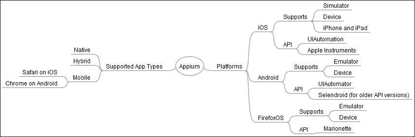
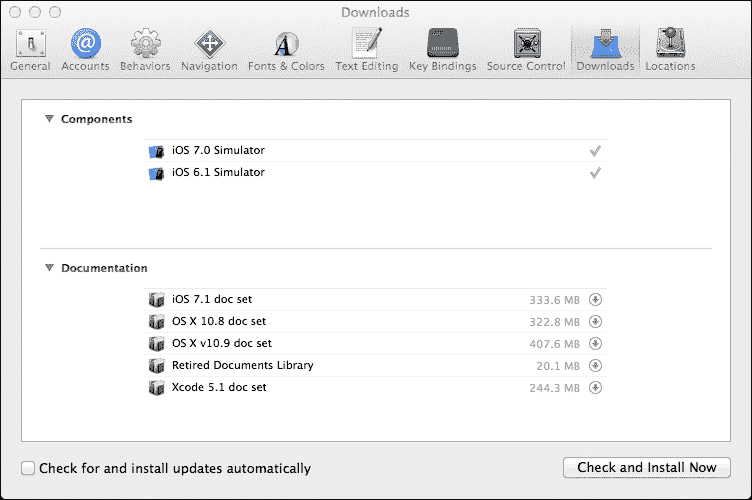
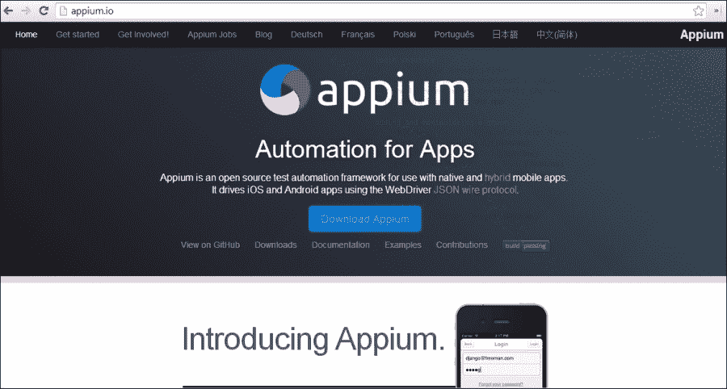
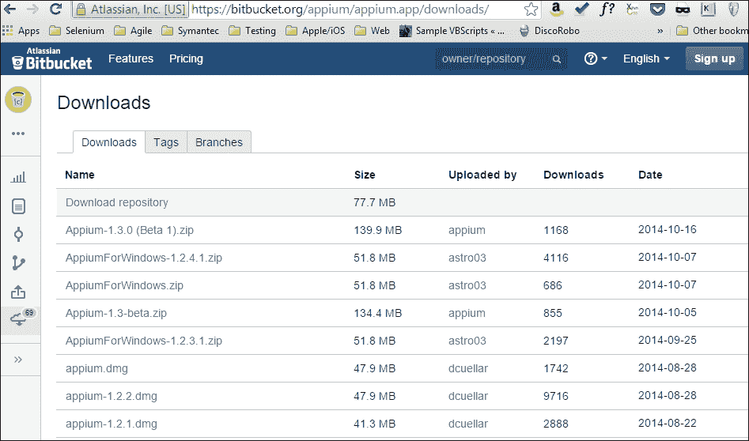
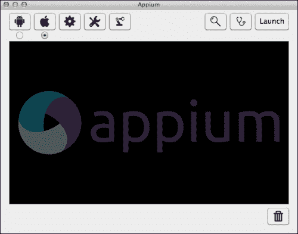
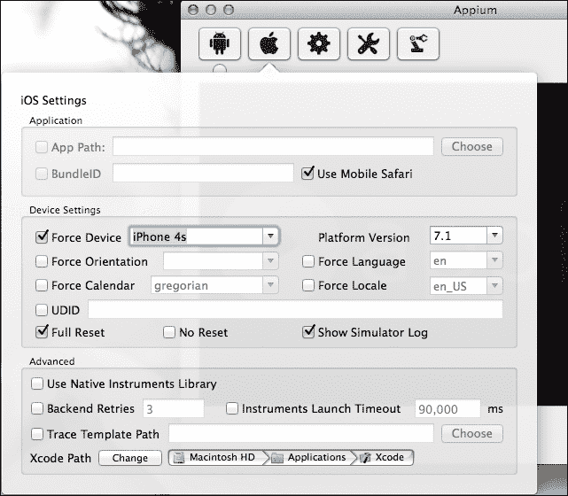
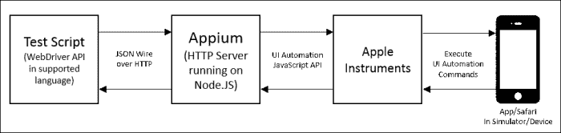
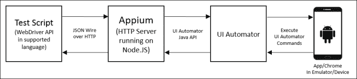
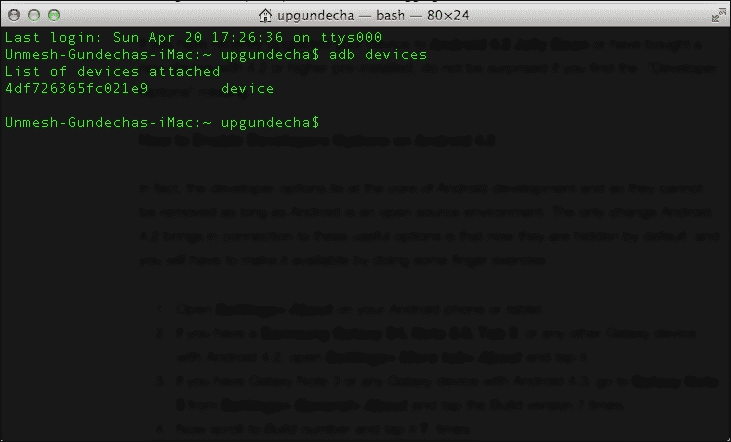
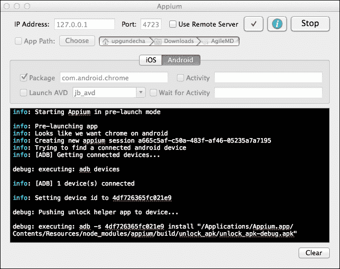

# 第七章。移动测试

随着全球移动用户数量的不断增长，智能手机和平板电脑的采用率显著提高。移动应用程序已经渗透到消费和企业市场，用智能设备取代了台式机和笔记本电脑。小型企业和大型企业有很大的潜力利用移动作为与用户连接的渠道。为了服务客户和员工，正在投入大量努力构建对移动友好的网站和原生应用程序。在市场上可用的各种移动平台上测试这些应用程序变得至关重要。本章将教你如何使用 Selenium WebDriver 以及更具体地使用 **Appium** 来测试移动应用程序。

在本章中，你将了解以下内容：

+   使用 Appium 测试移动应用程序

+   安装和设置 Appium

+   在 iPhone 模拟器上创建和运行 iOS 测试

+   在真实设备上创建和运行 Android 测试

# 介绍 Appium

Appium 是一个开源的测试自动化框架，用于使用 Selenium WebDriver 测试在 iOS、Android 和 Firefox OS 平台上运行的本地和混合移动应用程序，该框架使用与 Selenium WebDriver 测试通信的 JSON 线协议。Appium 将取代 Selenium 2 中用于测试移动网页应用程序的 `iPhoneDriver` 和 `AndroidDriver` API。

Appium 允许我们使用和扩展现有的 Selenium WebDriver 框架来构建移动测试。由于它使用 Selenium WebDriver 来驱动测试，我们可以使用任何存在 Selenium 客户端库的语言来创建测试。以下是 Appium 的覆盖图，展示了对不同平台和应用类型的支持：



Appium 支持以下类型的应用程序测试：

+   **原生应用程序**：原生应用程序是特定于平台的、使用平台支持的语言和框架构建的应用程序。例如，iPhone 和 iPad 的应用程序使用 Objective-C 和 iOS SDK 开发；同样，Android 应用程序使用 Java 和 Android SDK 开发。在性能方面，原生应用程序运行速度快且更可靠。它们使用原生框架进行用户界面。

+   **移动网页应用程序**：移动网页应用程序是服务器端应用程序，使用任何服务器端技术（如 PHP、Java 或 ASP.NET）构建，并使用 jQuery Mobile、Sencha Touch 等框架来渲染一个模仿原生用户界面的用户界面。

+   **混合应用程序**：与原生应用程序类似，混合应用程序在设备上运行，并使用 Web 技术（HTML5、CSS 和 JavaScript）编写。混合应用程序使用设备的浏览器引擎来渲染 HTML 并在本地使用 WebView 在原生容器中处理 JavaScript，这使应用程序能够访问在移动网页应用程序中不可访问的设备功能，例如相机、加速度计、传感器和本地存储。

## Appium 的先决条件

在你开始学习更多关于 Appium 之前，你需要一些 iOS 和 Android 平台的工具。

### 注意

Appium 基于 Node.js 构建，同时提供 Node.js 包以及 Mac OS X 和 Windows 上的独立 GUI。我们将使用带有内置 Node.js 的 Mac OS X 上的 Appium 独立 GUI。

### 设置 iOS 的 Xcode

我们需要安装 Xcode 4.6.3 或更高版本，在 Mac OS X 上进行 iOS 平台应用的测试。在编写本书时，使用了 Xcode 5.1。您可以从 App Store 或开发者门户 [`developer.apple.com/xcode/`](https://developer.apple.com/xcode/) 获取 Xcode。

安装 Xcode 后，从 **应用程序** 菜单启动它，然后导航到 **首选项** | **下载**，并安装 **命令行工具** 以及用于在不同版本的 iOS 平台上测试应用的附加 iOS SDK，如图所示：



在真实设备上运行测试时，您需要在设备上安装配置文件，并启用设备的 USB 调试功能。

尝试启动 iPhone 模拟器并验证其是否正常工作。您可以通过导航到 **Xcode** | **打开开发者工具** | **iOS 模拟器** 来启动模拟器。在模拟器中启动 Safari 并打开示例应用的移动网页版本 [`demo.magentocommerce.com`](http://demo.magentocommerce.com)，如图所示：


### 设置 Android SDK

我们需要安装 Android SDK 以测试 Android 应用。Android SDK 可在 [`developer.android.com/sdk/`](http://developer.android.com/sdk/) 下载。这将为我们提供 SDK 的最新版本。安装后，请确保已将 `ANDROID_HOME` 添加到路径中。完整的安装步骤可在 [`developer.android.com/sdk/installing/index.html?pkg=tools`](http://developer.android.com/sdk/installing/index.html?pkg=tools) 查找。

### 注意

详细和最新的安装要求请访问 [`appium.io/getting-started.html#requirements`](http://appium.io/getting-started.html#requirements)。

### 设置 Appium Python 客户端包

在编写本书时，Appium Python 客户端完全符合 Selenium 3.0 规范草案。它提供了一些辅助工具，使使用 Appium 进行 Python 移动测试更加容易。您可以使用以下命令进行安装：

```py
pip install Appium-Python-Client

```

### 注意

关于 Appium Python 客户端包的更多信息可在 [`pypi.python.org/pypi/Appium-Python-Client`](https://pypi.python.org/pypi/Appium-Python-Client) 找到。

# 安装 Appium

在我们开始使用 Appium 测试移动应用程序之前，我们需要下载和安装 Appium。我们将使用 Appium GUI 版本。如果您希望在 iPhone 或 iPad 上为 iOS 运行测试，那么您需要在 Mac OS X 机器上设置 Appium。对于测试 Android 应用程序，您可以在 Windows 或 Linux 机器上设置环境。使用 Mac OS X 的新 Appium 应用程序设置 Appium 相当简单。您可以从[`appium.io/`](http://appium.io/)下载最新的 Appium 二进制文件。按照以下步骤安装 Appium：

1.  点击首页上的**下载 Appium**按钮，您将被引导到下载页面。

1.  从以下屏幕截图所示的列表中选择适用于您所使用操作系统的特定版本：

    ### 注意

    在以下示例中，我们将使用 Mac OS X 上的 Appium。

1.  您可以通过启动安装程序并将 Appium 复制到“应用程序”文件夹中来在 Mac 上安装 Appium。

    当您第一次从“应用程序”菜单启动 Appium 时，它将请求授权运行 iOS 模拟器。

    ### 小贴士

    默认情况下，Appium 在`http://127.0.0.1:4723`或本地主机上启动。这是您的测试应将测试命令指向的 URL。我们将测试我们在书中使用的示例应用程序的 iPhone Safari 浏览器上的移动版本。

1.  在 Appium 的主窗口中，点击苹果图标以打开 iOS 设置：

1.  在**iOS 设置**对话框中，选择**强制设备**复选框，并在 iOS 部分指定**iPhone 4s**。同时，选择**使用移动 Safari**复选框，如以下屏幕截图所示：

1.  在 Appium 窗口中点击**启动**按钮以启动 Appium 服务器。

## Appium Inspector

Appium 还附带一个名为**Appium Inspector**的间谍工具。我们可以通过点击 Appium 主窗口上的放大镜图标来启动 Appium Inspector。

检查器提供了许多选项来分析测试中的应用程序。它提供的主要功能之一是应用程序中 UI 元素的使用方式，元素的架构或层次结构，以及这些元素的属性，我们可以使用这些属性来定义定位字符串。

您还可以在应用程序上模拟各种手势并查看它们在模拟器上的效果。它还提供了一种记录您在应用程序上执行的操作的能力。

# iOS 测试

Appium 通过使用各种原生自动化框架来驱动自动化，并提供基于 Selenium WebDriver JSON 线协议的 API。对于自动化 iOS 应用程序，它使用 Apple Instruments 提供的 UI Automation 功能。

Appium 作为一个 HTTP 服务器，通过 JSON 线协议接收来自测试脚本的命令。Appium 将这些命令发送到 Apple Instruments，以便在模拟器或真实设备上运行的 app 可以执行这些命令。在这个过程中，Appium 将 JSON 命令转换为 Instruments 理解的 UI Automation JavaScript 命令。Instruments 负责在模拟器或设备上启动和关闭 app。这个过程在下面的图中展示：



当在模拟器或设备上的 app 执行命令时，目标 app 会将响应发送回 Instruments，然后 Instruments 将其以 JavaScript 响应格式发送回 Appium。Appium 将 UI Automation JavaScript 响应转换为 Selenium WebDriver JSON 线协议响应，并将它们发送回测试脚本。

## 编写 iOS 测试

现在，我们已经启动了 Appium；让我们创建一个测试来检查 iPhone Safari 浏览器中的搜索功能。创建一个新的测试，`SearchProductsOnIPhone`，如下面的代码所示：

```py
import unittest
from appium import webdriver

class SearchProductsOnIPhone(unittest.TestCase):
    def setUp(self):
        desired_caps = {}
        # platform
        desired_caps['device'] = 'iPhone Simulator'
        # platform version
        desired_caps['version'] = '7.1'
        # mobile browser
        desired_caps['app'] = 'safari'

        # to connect to Appium server use RemoteWebDriver
        # and pass desired capabilities
        self.driver = \
            webdriver.Remote("http://127.0.0.1:4723/wd/hub", desired_caps)
        self.driver.get("http://demo.magentocommerce.com/")
        self.driver.implicitly_wait(30)
        self.driver.maximize_window()

    def test_search_by_category(self):

        # click on search icon
        self.driver.find_element_by_xpath("//a[@href='#header-search']").click()
        # get the search textbox
        self.search_field = self.driver.find_element_by_name("q")
        self.search_field.clear()

        # enter search keyword and submit
        self.search_field.send_keys("phones")
        self.search_field.submit()

        # get all the anchor elements which have product names # displayed currently on result page using # find_elements_by_xpath method
        products = self.driver\
            .find_elements_by_xpath("//div[@class='category-products']/ul/li")

        # check count of products shown in results
        self.assertEqual(2, len(products))

    def tearDown(self):
        # close the browser window
        self.driver.quit()

if __name__ == '__main__':
    unittest.main(verbosity=2)
```

我们需要使用`RemoteWebDriver`来运行 Appium 的测试。然而，为了 Appium 能够使用所需的平台，我们需要传递一组所需的配置能力，如下面的代码所示：

```py
desired_caps = {}
# platform
desired_caps['device'] = 'iPhone Simulator'
# platform version
desired_caps['version'] = '7.1'
# mobile browser
desired_caps['app'] = 'safari'
```

`desired_caps['device']`配置能力被 Appium 用来决定测试脚本应该在哪个平台上执行。在这个例子中，我们使用了`iPhone Simulator`。对于在 iPad 上运行测试，我们可以指定 iPad 模拟器。

当在真实设备上运行测试时，我们需要指定设备能力值为`iPhone`或`iPad`。Appium 将选择通过 USB 连接到 Mac 的设备。

`desired_caps['version']`配置能力是我们想要使用的 iPhone/iPad 模拟器的版本。在这个例子中，使用了 iOS 7.1 模拟器，这是在撰写本书时的最新 iOS 版本。

我们最后使用的最后一个所需能力是`desired_caps['app']`，它被 Appium 用来启动目标 app。在这种情况下，它将启动 Safari 浏览器。

最后，我们需要使用`RemoteWebDriver`和所需的配置能力连接到 Appium 服务器。这通过创建一个`Remote`实例来完成，如下面的代码所示：

```py
self.driver = webdriver.Remote("http://127.0.0.1:4723/wd/hub", desired_caps)
```

测试的其余部分使用 Selenium API 与移动网络版应用程序交互。正常运行测试。你会看到 Appium 与测试脚本建立会话，并使用 Safari 应用启动 iPhone 模拟器。Appium 将通过在模拟器窗口中的 Safari 应用上运行命令来执行所有测试步骤。

# 在 Android 上测试

Appium 使用 Android SDK 捆绑的 UI Automator 来驱动 Android 应用程序的自动化。这个过程与 iOS 上的测试非常相似。

Appium 作为一个 HTTP 服务器，通过 JSON 线协议接收来自测试脚本的命令。Appium 将这些命令发送到 UI Automator，以便它们可以在模拟器或真实设备上启动的应用程序中执行。在此过程中，Appium 将 JSON 命令转换为 Android SDK 能理解的 UI Automator Java 命令。这个过程在以下图中展示：



当命令在模拟器或设备上的应用程序上执行时，目标应用程序将响应发送回 UI Automator，UI Automator 再将它发送回 Appium。它将 UI Automator 的响应转换为 Selenium WebDriver JSON 线协议响应，并将它们发送回测试脚本。

## 为 Android 编写测试

在 Android 上测试应用与我们在 iOS 上所做的大致相同。对于 Android，我们将使用真实设备而不是模拟器（在 Android 社区中，模拟器被称为模拟器）。我们将使用相同的应用程序在 Android 的 Chrome 上进行测试。

在这个例子中，我使用的是三星 Galaxy S III 手机。我们需要在设备上安装 Chrome 浏览器。你可以在 Play Store 上获取 Google Chrome。接下来，我们需要将设备连接到运行 Appium 服务器的机器。

现在，我们将专注于 Android。在这里，我们将尝试在我们的 Android 真实设备上执行测试脚本。我们需要确保我们在 Android 设备上安装了 Chrome，并将我们的设备连接到运行 Appium 服务器的机器。让我们运行以下命令以获取连接到机器的模拟器或设备列表：

```py
./adb devices

```

**Android 调试桥接器**（**adb**）是 Android SDK 中可用的一种命令行工具，它允许你与模拟器实例或连接的真实设备进行通信。

之前的命令将显示连接到主机的所有 Android 设备的列表。在这个例子中，我们已经连接到一个真实设备，如下面的截图所示：



让我们使用为 iOS 创建的测试，并将其修改为适用于 Android。我们将创建一个新的测试，`SearchProductsOnAndroid`。将以下代码复制到新创建的测试中：

```py
import unittest
from appium import webdriver

class SearchProductsOnAndroid(unittest.TestCase):
    def setUp(self):
        desired_caps = {}
        # platform
        desired_caps['device'] = 'Android'
        # platform version
        desired_caps['version'] = '4.3'
        # mobile browser
        desired_caps['app'] = 'Chrome'

        # to connect to Appium server use RemoteWebDriver
        # and pass desired capabilities
        self.driver = \
            webdriver.Remote("http://127.0.0.1:4723/wd/hub", desired_caps)
        self.driver.get("http://demo.magentocommerce.com/")
        self.driver.implicitly_wait(30)

    def test_search_by_category(self):

        # click on search icon
        self.driver.find_element_by_xpath("//a[@href='#header-search']").click()
        # get the search textbox
        self.search_field = self.driver.find_element_by_name("q")
        self.search_field.clear()

        # enter search keyword and submit
        self.search_field.send_keys("phones")
        self.search_field.submit()

        # get all the anchor elements which have product names # displayed currently on result page using # find_elements_by_xpath method
        products = self.driver\
            .find_elements_by_xpath("//div[@class='category-products']/ul/li")

        # check count of products shown in results
        self.assertEqual(2, len(products))

    def tearDown(self):
        # close the browser window
        self.driver.quit()

if __name__ == '__main__':
    unittest.main(verbosity=2)
```

在这个例子中，我们将`desired_caps['device']`能力值分配给了 Android，这将由 Appium 用于在 Android 上运行测试。

接下来，我们在`desired_caps['version']`能力中提到了 Android 版本 4.3（Jelly Bean）。因为我们想在 Android 的 Chrome 上运行测试，所以我们提到了 Chrome 在`desired_caps['app']`能力中。

Appium 将使用 adb 返回的设备列表中的第一个设备。它将使用我们提到的期望能力，在设备上启动 Chrome 浏览器，并开始执行测试脚本命令，如下面的截图所示：



下面是测试在真实设备上运行的截图：


# 使用 Sauce Labs

我们在 第六章 中探讨了 Sauce Labs 进行跨浏览器测试，*跨浏览器测试*。Sauce 还提供了使用 Appium 测试移动应用程序的支持。实际上，Appium 项目是由 Sauce Labs 开发和支持的。通过最小化对所需能力的修改，我们可以在 Sauce Labs 上使用以下代码运行移动测试：

```py
import unittest
from appium import webdriver

class SearchProductsOnIPhone(unittest.TestCase):
    SAUCE_USERNAME = 'upgundecha'
    SUACE_KEY = 'c6e7132c-ae27-4217-b6fa-3cf7df0a7281'

    def setUp(self):

        desired_caps = {}
        desired_caps['browserName'] = "Safari"
        desired_caps['platformVersion'] = "7.1"
        desired_caps['platformName'] = "iOS"
        desired_caps['deviceName'] = "iPhone Simulator"

        sauce_string = self.SAUCE_USERNAME + ':' + self.SUACE_KEY

        self.driver = \
            webdriver.Remote('http://' + sauce_string + '@ondemand.saucelabs.com:80/wd/hub', desired_caps)
        self.driver.get('http://demo.magentocommerce.com/')
        self.driver.implicitly_wait(30)
        self.driver.maximize_window()

    def test_search_by_category(self):
        # click on search icon
        self.driver.find_element_by_xpath("//a[@href='#header-search']").click()
        # get the search textbox
        self.search_field = self.driver.find_element_by_name("q")
        self.search_field.clear()

        # enter search keyword and submit
        self.search_field.send_keys("phones")
        self.search_field.submit()

        # get all the anchor elements which have
        # product names displayed
        # currently on result page using 
        # find_elements_by_xpath method
        products = self.driver\
            .find_elements_by_xpath("//div[@class='category-products']/ul/li")

        # check count of products shown in results
        self.assertEqual(2, len(products))

    def tearDown(self):
        # close the browser window
        self.driver.quit()

if __name__ == '__main__':
    unittest.main(verbosity=2)
```

在运行移动测试后，我们可以在 Sauce Labs 控制台中查看结果和视频录制。这大大节省了在本地环境中设置 Appium 的时间和精力，因为 Sauce 提供了各种 SDK 和设置的组合。

# 摘要

在本章中，我们认识到在移动设备上测试应用程序的需求。我们探讨了 Appium，它正成为 Selenium 测试移动应用程序的核心功能。我们安装并设置了 Appium 以测试示例应用程序的移动版本。

我们在 iPhone 模拟器和 Android 设备上测试了移动网络应用程序。使用 Appium，我们可以测试各种类型的移动应用程序，并使用任何具有 `WebDriver` 客户端库的编程语言。

在下一章中，你将学习一些良好的实践，例如使用 `PageObjects` 和数据驱动的测试与 Selenium WebDriver 结合。
