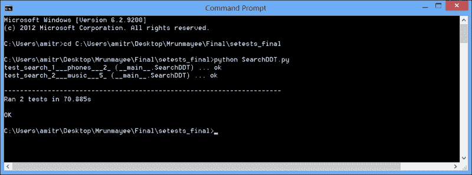
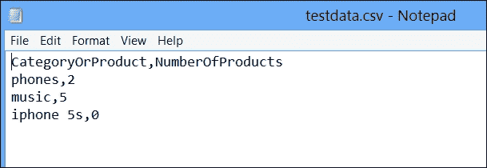
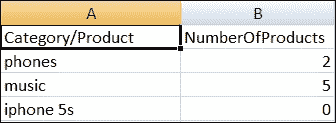
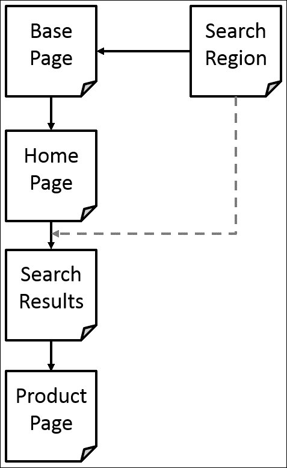

# 第八章。页面对象和数据驱动测试

本章介绍了两个在创建可扩展和可维护的测试自动化框架设计中有用的设计模式。我们将探讨如何使用数据驱动方法，通过使用 Python 库创建数据驱动 Selenium 测试。

在本章的第二部分，你将了解如何使用页面对象模式通过将定位器和其他低级调用从测试用例中分离到一个抽象层，从而创建高度可维护和健壮的测试，这个抽象层类似于应用程序的功能，类似于用户在浏览器窗口中体验到的功能。

在本章中，你将学习：

+   什么是数据驱动测试

+   如何使用**数据驱动测试**（**ddt**）库与`unittest`库一起创建数据驱动测试

+   如何从外部源读取数据用于数据驱动测试

+   页面对象模式是什么以及它如何帮助创建可维护的测试套件

+   如何实现示例应用程序的页面对象模式

# 数据驱动测试

通过使用数据驱动测试方法，我们可以通过从外部数据源驱动测试，使用输入值和预期值，而不是每次运行测试时都使用硬编码的值，来使用单个测试验证不同的测试用例集或测试数据。

当我们有一些类似的测试，这些测试包含相同的步骤，但在输入数据、预期值或应用程序状态上有所不同时，这变得很有用。以下是一组具有不同组合的登录测试用例的示例：

| 描述 | 测试数据 | 预期输出 |
| --- | --- | --- |
| 有效的用户名和密码 | 一对有效的用户名和密码 | 用户应使用成功消息登录到应用程序 |
| 无效的用户名和密码 | 无效的用户名和密码 | 应向用户显示登录错误 |
| 有效的用户名和无效的密码 | 有效的用户名和无效的密码 | 应向用户显示登录错误 |

我们可以创建一个可以处理测试数据和前面表格中条件的单个脚本。

通过使用数据驱动测试方法，我们将测试数据与测试逻辑分离，通过使用来自外部源（如 CSV 或电子表格文件）的数据替换硬编码的测试数据，从而使用变量。这也帮助创建可重用的测试，这些测试可以与不同的数据集一起运行，这些数据集可以保存在测试之外。

数据驱动测试还有助于提高测试覆盖率，因为我们可以在最小化需要编写和维护的测试代码量的同时处理多个测试条件。

在本节中，我们将使用 Python 中的`ddt`库实现数据驱动测试方法，应用于我们在前面章节中创建的一些测试。

# 使用 ddt 进行数据驱动测试

`ddt` 库提供了在 Python 中使用 `unittest` 库编写的测试用例参数化的能力。我们可以使用 `ddt` 向测试用例提供一组数据，以进行数据驱动测试。

`ddt` 库提供了一组类和方法装饰器，我们可以使用它们来创建数据驱动测试。

## 安装 ddt

我们可以使用以下命令行下载和安装 `ddt`：

```py
pip install ddt

```

就这些！你可以在 [`pypi.python.org/pypi/ddt`](https://pypi.python.org/pypi/ddt) 上找到更多关于 `ddt` 的信息。

## 在 unittest 中使用 ddt 创建简单的数据驱动测试

我们将在示例应用程序上使用搜索测试用例，并通过删除用于搜索不同产品和类别的硬编码值将其转换为数据驱动测试。

要创建数据驱动测试，我们需要在测试类中使用 `@ddt` 装饰器，并在数据驱动测试方法中使用 `@data` 装饰器。

`@data` 装饰器接受与我们想要提供给测试的值一样多的参数。这些可以是单个值或列表、元组和字典。对于列表，我们需要使用 `@unpack` 装饰器，它将元组或列表解包成多个参数。

让我们实现搜索测试，它接受一对参数，用于不同的搜索词和预期结果计数，如下所示代码所示：

```py
import unittest
from ddt import ddt, data, unpack
from selenium import webdriver

@ddt
class SearchDDT(unittest.TestCase):
    def setUp(self):
        # create a new Firefox session
        self.driver = webdriver.Firefox()
        self.driver.implicitly_wait(30)
        self.driver.maximize_window()

        # navigate to the application home page
        self.driver.get("http://demo.magentocommerce.com/")

    # specify test data using @data decorator
    @data(("phones", 2), ("music", 5))
    @unpack
    def test_search(self, search_value, expected_count):
        # get the search textbox
        self.search_field = self.driver.find_element_by_name("q")
        self.search_field.clear()

        # enter search keyword and submit.
        # use search_value argument to pass data
        self.search_field.send_keys(search_value)
        self.search_field.submit()

        # get all the anchor elements which have
        # product names displayed
        # currently on result page using
        # find_elements_by_xpath method
        products = self.driver.find_elements_by_xpath("//h2[@class='product-name']/a")

        # check count of products shown in results
        self.assertEqual(expected_count, len(products))

    def tearDown(self):
        # close the browser window
        self.driver.quit()

if __name__ == '__main__':
    unittest.main(verbosity=2)
```

在这个测试中，我们使用 `@data` 装饰器传递一个元组列表。使用 `@unpack` 装饰器将这些元组解包成多个参数。`test_search()` 方法接受 `search_value` 和 `expected_count` 参数，这些参数将通过 `ddt` 映射到元组值，如下所示：

```py
# specify test data using @data decorator
    @data(("phones", 2), ("music", 5))
    @unpack
    def test_search(self, search_value, expected_count):
```

当我们运行测试时，`ddt` 将生成新的测试方法，并通过将数据值转换为有效的 Python 标识符来赋予它们有意义的名称。例如，对于前面的测试，`ddt` 将生成具有以下截图所示名称的新测试方法：



# 使用外部数据源进行数据驱动测试

在前面的例子中，我们在测试代码中提供了测试数据。然而，你可能会遇到已经在外部源中定义了测试数据的情况，例如文本文件、电子表格或数据库。将测试数据与代码分离，并将其放在外部源中也是一个好主意，这样可以方便维护，并避免每次更新值时都要更改测试代码。

让我们来探讨如何从 **逗号分隔值** （**CSV**） 文件或电子表格中读取测试数据，并将其提供给 `ddt`。

## 从 CSV 读取值

我们将使用之前的测试用例，并将提供给 `@data` 装饰器的数据移动到一个单独的 CSV 文件中，称为 `testdata.csv`，而不是将其保留在脚本中。这些数据将以如下截图所示的表格格式存储：



接下来，我们将实现 `get_data()` 方法，该方法接受 CSV 文件的路径和名称。此方法使用 `csv` 库从文件中读取值，并返回这些值的列表。我们将在 `@data` 装饰器中使用 `get_data()` 方法，如以下代码所示：

```py
import csv, unittest
from ddt import ddt, data, unpack
from selenium import webdriver

def get_data(file_name):
    # create an empty list to store rows
    rows = []
    # open the CSV file
    data_file = open(file_name, "rb")
    # create a CSV Reader from CSV file
    reader = csv.reader(data_file)
    # skip the headers
    next(reader, None)
    # add rows from reader to list
    for row in reader:
        rows.append(row)
    return rows

@ddt
class SearchCsvDDT(unittest.TestCase):
    def setUp(self):
        # create a new Firefox session
        self.driver = webdriver.Firefox()
        self.driver.implicitly_wait(30)
        self.driver.maximize_window()

        # navigate to the application home page
        self.driver.get("http://demo.magentocommerce.com/")

    # get the data from specified csv file by
    # calling the get_data function
    @data(*get_data("testdata.csv"))
    @unpack
    def test_search(self, search_value, expected_count):
            self.search_field = self.driver.find_element_by_name("q")
            self.search_field.clear()

            # enter search keyword and submit.
            self.search_field.send_keys(search_value)
            self.search_field.submit()

            # get all the anchor elements which have
            # product names displayed
            # currently on result page using
            # find_elements_by_xpath method
            products = self.driver.find_elements_by_xpath("//h2[@class='product-name']/a")
            expected_count = int(expected_count)
            if expected_count > 0:
                # check count of products shown in results
                self.assertEqual(expected_count, len(products))
            else:
                msg = self.driver.find_element_by_class_name
                  ("note-msg")
                self.assertEqual("Your search returns no results.", msg.text)

    def tearDown(self):
        # close the browser window
        self.driver.quit()

if __name__ == '__main__':
    unittest.main()
```

当执行此测试时，`@data` 将调用 `get_data()` 方法，该方法将读取提供的文件，并将从 `@data` 返回的值列表返回。这些值将被解包，并为每一行生成测试方法。

## 从 Excel 读取值

在 Excel 电子表格中维护测试数据是另一种常见做法。它还有助于非技术用户通过在电子表格中添加一行数据来简单地定义新的测试。以下截图是维护 Excel 电子表格中数据的示例：



从 Excel 电子表格中读取值需要另一个名为 `xlrd` 的库，可以使用以下命令进行安装：

```py
pip install xlrd

```

### 注意

`xlrd` 库提供了对工作簿、工作表和单元格的读取访问权限，以便读取数据。它不会写入电子表格。对于写入数据，我们可以使用 `xlwt` 库。我们还可以使用 `openpyxl` 在电子表格中读取和写入数据。更多信息请访问 [`www.python-excel.org/`](http://www.python-excel.org/)。

让我们修改上一个示例中的 `get_data()` 方法，以便从电子表格中读取数据到列表中，并按以下代码修改测试：

```py
import xlrd, unittest
from ddt import ddt, data, unpack
from selenium import webdriver

def get_data(file_name):
    # create an empty list to store rows
    rows = []
    # open the specified Excel spreadsheet as workbook
    book = xlrd.open_workbook(file_name)
    # get the first sheet
    sheet = book.sheet_by_index(0)
    # iterate through the sheet and get data from rows in list
    for row_idx in range(1, sheet.nrows):
        rows.append(list(sheet.row_values(row_idx, 0, sheet.ncols)))
    return rows

@ddt
class SearchExcelDDT(unittest.TestCase):
    def setUp(self):
        # create a new Firefox session
        self.driver = webdriver.Firefox()
        self.driver.implicitly_wait(30)
        self.driver.maximize_window()

        # navigate to the application home page
        self.driver.get("http://demo.magentocommerce.com/")

    # get the data from specified Excel spreadsheet
    # by calling the get_data function
    @data(*get_data("TestData.xlsx"))
    @unpack
    def test_search(self, search_value, expected_count):
            self.search_field = self.driver.find_element_by_name("q")
            self.search_field.clear()

            # enter search keyword and submit.
            self.search_field.send_keys(search_value)
            self.search_field.submit()

            # get all the anchor elements which have
            # product names displayed
            # currently on result page using
            # find_elements_by_xpath method
            products = self.driver.find_elements_by_xpath("//h2[@class='product-name']/a")
            if expected_count > 0:
                # check count of products shown in results
                self.assertEqual(expected_count, len(products))
            else:
                msg = self.driver.find_element_by_class_name("note-msg")
                self.assertEqual("Your search returns no results.", msg.text)

    def tearDown(self):
        # close the browser window
        self.driver.quit()

if __name__ == '__main__':
    unittest.main()
```

与之前 CSV 文件的示例类似，当执行此测试时，`@data` 将调用 `get_data()` 方法，该方法将读取提供的文件，并将从电子表格中返回的值列表返回给 `@data`。这些值将被解包，并为每一行生成测试方法。

### 小贴士

**从数据库读取值**

如果你需要从数据库中读取值，只需修改 `get_data()` 方法并使用适当的库连接到数据库，然后使用 SQL 查询将值读取回列表中。

# 页面对象模式

到目前为止，我们直接使用 `unittest` 将 Selenium WebDriver 测试写入 Python 类中。我们在这些类中指定定位器和测试用例步骤。这段代码是一个好的开始；然而，随着我们继续向测试套件中添加越来越多的测试，它将变得难以维护。这将使测试变得脆弱。

开发可维护和可重用的测试代码对于可持续的测试自动化至关重要，测试代码应被视为生产代码，并且在开发测试代码时应应用类似的标准和模式。

为了克服这些问题，我们可以在创建测试时使用各种设计模式和原则，例如**不要重复自己**（**DRY**）和代码重构技术。如果你是一名开发者，你可能已经在使用这些技术了。

页面对象模式是 Selenium 用户社区中高度使用的模式之一，用于构建测试，使它们与低级动作分离，并提供高级抽象。你可以将页面对象模式与外观模式进行比较，它允许为复杂代码创建简化的接口。

页面对象模式提供了从正在测试的应用程序创建代表每个网页的对象。我们可以为每个页面定义类，模拟该页面的所有属性和动作。这创建了一个测试代码与我们将要测试的页面和应用程序功能的技术实现之间的分离层，通过隐藏定位器、处理元素的低级方法和业务功能。相反，页面对象将为测试提供一个高级 API 来处理页面功能。

测试应使用这些页面对象在高级别，其中底层页面中属性或动作的任何更改都不应破坏测试。使用页面对象模式提供了以下好处：

+   创建一个高级抽象，有助于在底层页面被开发者修改时最小化更改。因此，你只需更改页面对象，而调用测试将不受影响。

+   创建可跨多个测试案例共享的可重用代码。

+   测试更易于阅读、灵活且易于维护。

让我们开始重构我们在早期章节中创建的测试，并实现为正在测试的应用程序提供高级抽象的页面对象。在这个例子中，我们将为示例应用程序中选定的页面创建以下结构。我们将开始实现一个基本页面对象，它将被所有其他页面用作模板。基本对象还将提供所有其他页面可用的功能区域；例如，搜索功能在应用程序的所有页面上都可用。我们将创建一个搜索区域对象，它将适用于从基本页面继承的所有页面。我们将实现一个代表应用程序主页的类，搜索结果页面，它显示与搜索标准匹配的产品列表；以及一个产品页面，它提供与产品相关的属性和动作。我们将创建如以下图表所示的结构：



## 组织测试

在我们开始为正在测试的示例应用程序实现页面对象之前，让我们实现一个`BaseTestCase`类，它将为我们提供`setUp()`和`tearDown()`方法，这样我们就不需要为每个创建的测试类编写这些方法。我们还可以将可重用代码放在这个类中。创建`basetestcase.py`并实现如以下代码所示的`BaseTestCase`类：

```py
import unittest
from selenium import webdriver

class BaseTestCase(unittest.TestCase):
    def setUp(self):
        # create a new Firefox session
        self.driver = webdriver.Firefox()
        self.driver.implicitly_wait(30)
        self.driver.maximize_window()

        # navigate to the application home page
        self.driver.get('http://demo.magentocommerce.com/')

    def tearDown(self):
        # close the browser window
        self.driver.quit()
```

## 基础页面对象

`BasePage`对象将作为我们将在测试套件中创建的所有页面对象的父对象。基本页面提供了页面对象可以使用的基本代码。让我们创建`base.py`文件并实现`BasePage`，如下面的代码所示：

```py
from abc import abstractmethod
class BasePage(object):
    """ All page objects inherit from this """

    def __init__(self, driver):
        self._validate_page(driver)
        self.driver = driver

    @abstractmethod
    def _validate_page(self, driver):
        return

    """ Regions define functionality available throughall page objects """
    @property
    def search(self):
        from search import SearchRegion
        return SearchRegion(self.driver)

class InvalidPageException(Exception):
    """ Throw this exception when you don't find the correct page """
    pass
```

我们添加了一个名为`_validate_page()`的抽象方法，该方法将由继承自`BasePage`的页面对象实现，以验证在测试使用属性或操作之前，它们所代表的页面是否已在浏览器中加载。

我们还创建了一个名为`search`的属性，它返回`SearchRegion`对象。这类似于页面对象。然而，`SearchRegion`代表应用程序所有页面显示的搜索框。因此，我们将从`BasePage`类中共享此内容添加到每个页面对象中。

我们还实现了`InvalidPageException`，该异常用于`_validate_page()`方法。如果验证页面失败，将引发`InvalidPageExecption`。

## 实现页面对象

现在，让我们开始实现我们将要处理的每个页面的页面对象。

1.  首先，我们将定义`HomePage`。创建`homepage.py`文件并实现`HomePage`类，如下面的代码所示：

    ```py
    from base import BasePage
    from base import InvalidPageException

    class HomePage(BasePage):

        _home_page_slideshow_locator = 'div.slideshow-container'

        def __init__(self, driver):
            super(HomePage, self).__init__(driver)

        def _validate_page(self, driver):
            try:
                driver.find_element_by_class_name(self._home_page_slideshow_locator)
            except:
                raise InvalidPageException("Home Page not loaded")
    ```

    我们将遵循的一种做法是将定位器字符串与其使用的地方分开。我们将创建一个使用`_`前缀的私有变量来存储定位器。例如，`_home_page_slideshow_locator`变量存储了显示在应用程序主页上的幻灯片组件的定位器。我们将使用它来验证浏览器是否确实显示了主页，如下所示：

    ```py
    _home_page_slideshow_locator = 'div.slideshow-container'
    ```

    我们还在`HomePage`类中实现了`_validate_page()`方法。此方法验证是否使用用于在主页上显示幻灯片的元素在浏览器中加载了主页。

1.  接下来，我们将实现`SearchRegion`类，该类处理应用程序的搜索功能。它提供了`searchFor()`方法，该方法返回表示搜索结果页面的`SearchResult`类。创建一个新的`search.py`文件并实现这两个类，如下面的代码所示：

    ```py
    from base import BasePage
    from base import InvalidPageException
    from product import ProductPage

    class SearchRegion(BasePage):
        _search_box_locator = 'q'

        def __init__(self, driver):
            super(SearchRegion, self).__init__(driver)

        def searchFor(self, term):
            self.search_field = self.driver.find_element_by_name(self._search_box_locator)
            self.search_field.clear()
            self.search_field.send_keys(term)
            self.search_field.submit()
            return SearchResults(self.driver)

    class SearchResults(BasePage):
        _product_list_locator   = 'ul.products-grid > li'
        _product_name_locator   = 'h2.product-name a'
        _product_image_link     = 'a.product-image'
        _page_title_locator     = 'div.page-title'

        _products_count = 0
        _products = {}

        def __init__(self, driver):
            super(SearchResults, self).__init__(driver)
            results = self.driver.find_elements_by_css_selector(self._product_list_locator)
            for product in results:
                name = product.find_element_by_css_selector(self._product_name_locator).text
                self._products[name] = product.find_element_by_css_selector(self._product_image_link)

        def _validate_page(self, driver):
            if 'Search results for' not in driver.title:
                raise InvalidPageException('Search results not loaded')

        @property
        def product_count(self):
            return len(self._products)

        def get_products(self):
            return self._products

        def open_product_page(self, product_name):
            self._products[product_name].click()
            return ProductPage(self.driver)
    ```

1.  最后，我们将实现`ProductPage`类，该类包含一些与产品相关的属性。我们可以从`SearchResults`类中访问产品，该类有一个方法可以打开给定产品的产品详情页面。创建一个`product.py`文件并实现`ProductPage`类，如下面的代码所示：

    ```py
    from base import BasePage
    from base import InvalidPageException

    class ProductPage(BasePage):
        _product_view_locator           = 'div.product-view'
        _product_name_locator           = 'div.product-name span'
        _product_description_locator    = 'div.tab-content div.std'
        _product_stock_status_locator   = 'p.availability span.value'
        _product_price_locator          = 'span.price'

        def __init__(self, driver):
            super(ProductPage, self).__init__(driver)

        @property
        def name(self):
            return self.driver.\
                find_element_by_css_selector(self._product_name_locator)\
                .text.strip()

        @property
        def description(self):
            return self.driver.\
                find_element_by_css_selector(self._product_description_locator)\
                .text.strip()

        @property
        def stock_status(self):
            return self.driver.\
                find_element_by_css_selector(self._product_stock_status_locator)\
                .text.strip()

        @property
        def price(self):
            return self.driver.\
                find_element_by_css_selector(self._product_price_locator)\
                .text.strip()

        def _validate_page(self, driver):
            try:
                driver.find_element_by_css_selector(self._product_view_locator)
            except:
                raise InvalidPageException('Product page not loaded')
    ```

你还可以在产品页面上添加操作，将产品添加到购物车，或者用于产品比较。此外，将返回评分和其他与产品相关的信息的属性添加回测试中。

## 使用页面对象创建测试

让我们创建一个使用`BaseTestCase`并调用我们创建的页面对象来测试应用程序搜索功能的测试。此测试创建`HomePage`类的实例并调用`searchFor()`方法，该方法返回`SearchResults`类的实例。随后，测试调用`SearchResults`类的`open_product_page()`方法来打开结果中列出的指定产品的详细信息。测试检查样本产品的属性。创建一个`searchtest.py`文件并实现如以下代码所示的`SearchProductTest`测试：

```py
import unittest
from homepage import HomePage
from BaseTestCase import BaseTestCase

class SearchProductTest(BaseTestCase):
    def testSearchForProduct(self):
        homepage = HomePage(self.driver)
        search_results = homepage.search.searchFor('earphones')
        self.assertEqual(2, search_results.product_count)
        product = search_results.open_product_page('MADISON EARBUDS')
        self.assertEqual('MADISON EARBUDS', product.name)
        self.assertEqual('$35.00', product.price)
        self.assertEqual('IN STOCK', product.stock_status)

if __name__ == '__main__':
    unittest.main(verbosity=2)
```

注意，我们没有在这个测试中编写`setUp()`和`tearDown()`方法。我们从这个实现这些方法的`BaseTestCase`继承了这个测试类。如果我们想进行特定于测试的设置或清理，我们可以重载这些方法。

在这个例子中，我们实现了用于搜索工作流程导航的页面对象。您也可以实现类似的页面对象或区域，用于购物车、账户注册、登录等。

# 摘要

在本章中，我们认识到需要编写数据驱动测试，并使用页面对象模式来组织测试代码，以提高可重用性、可扩展性和可维护性。数据驱动模式使我们能够将测试数据与测试用例分离，因此我们可以重用测试代码来测试多个测试数据。我们还探讨了如何使用`ddt`库与`unittest`一起实现数据驱动测试，并从各种外部源读取数据。您学习了页面对象模式及其在通过为示例应用程序实现页面对象并创建使用页面对象的测试来构建可维护的测试套件方面的好处。

在下一章中，您将学习一些使用 Selenium WebDriver API 的高级技术，例如从测试运行中捕获屏幕截图和视频、执行鼠标和键盘操作、处理会话 cookie 等。
