# 第十章. 与其他工具和框架的集成

Selenium WebDriver Python API 非常强大和灵活。到目前为止，我们已经学习了如何将 Selenium WebDriver 与 `unittest` 库集成并创建一个简单的测试框架。然而，这并不限制我们只使用 `unittest` 库。我们可以将 Selenium WebDriver 与许多其他工具和框架集成。Selenium WebDriver 旁边有许多现成的框架可供使用。

我们可以使用支持 BDD 的各种框架，在项目中使用 Selenium WebDriver 应用 **行为驱动开发** (**BDD**)。

我们还可以将 Selenium Python API 与 **持续集成** (**CI**) 和构建工具集成，允许我们在应用程序构建后立即运行测试。这为开发人员提供了关于应用程序质量和稳定性的早期反馈。

在本章中，您将学习一些主要的集成示例，包括：

+   下载和安装 Behave 用于 BDD

+   使用 Behave 编写特性

+   使用 Behave 和 Selenium WebDriver 自动化特性

+   下载和安装 Jenkins

+   设置 Jenkins 以运行 Selenium 测试

+   配置 Jenkins 以捕获测试运行的结果

# 行为驱动开发

BDD 是 Dan North 在其著名的论文 *Introducing* *BDD* ([`dannorth.net/introducing-bdd/`](http://dannorth.net/introducing-bdd/)) 中引入的一种敏捷软件开发方法。

BDD 也被称为 **验收测试驱动开发** (**ATDD**)、故事测试或示例规格。BDD 鼓励开发人员、质量保证人员和非技术或业务用户在软件项目中协作，通过编写非程序员可读的自然语言测试用例来定义规格和决定验收标准。

### 注意事项

Python 中有几种工具可用于实现 BDD；两个主要工具是 **Behave** ([`pythonhosted.org/behave/`](https://pythonhosted.org/behave/)) 和 **Lettuce** ([`lettuce.it/`](http://lettuce.it/))，后者受到非常著名的 BDD 工具 **Cucumber** ([`cukes.info/`](http://cukes.info/)) 的启发，该工具在 Ruby 中可用。

在接下来的章节中，您将学习如何使用 Behave 为示例应用程序实现 BDD。

## 安装 Behave

安装 Behave 是一个简单的过程。我们可以使用以下命令行下载和安装 Behave：

```py
pip install behave

```

这将下载并安装 Behave 及其依赖项。在 [`pythonhosted.org/behave/install.html`](https://pythonhosted.org/behave/install.html) 提供了 Behave 的附加安装选项。

## 在 Behave 中编写第一个特性

该过程从讨论和列出正在开发的应用程序的功能和用户故事开始。各种利益相关者聚集在一起，以通用语言创建功能、用户故事和验收标准的列表，这种语言被所有各方理解，包括开发者、测试人员、业务分析师和客户。Behave 支持以**Given**、**When**、**Then**（**GWT**）格式创建 Gherkin 语言的特性文件。有关 Gherkin 语言的更多信息，请参阅[`github.com/cucumber/cucumber/wiki/Gherkin`](https://github.com/cucumber/cucumber/wiki/Gherkin)。

让我们从样本应用程序中的搜索功能特性开始。搜索特性应该使用户能够从主页搜索产品。特性文件提供了一个简单的用户故事和验收标准的描述，以 GWT 格式的场景概述。这些也被称为场景步骤，如下所述：

+   **Given**：这为执行场景设置先决条件；在这个场景中导航到主页

+   **当**：这包含场景的动作；在这个例子中搜索一个术语

+   **然后**：这包含场景的结果；检查是否在这个例子中显示了匹配产品的列表

在一个场景中可以有多个`When`和`Then`步骤：

```py
Feature: I want to search for products

 Scenario Outline: Search
   Given I am on home page
    when I search for "phone"
    then I should see list of matching products in search results
```

要使用 Behave 功能，我们需要将此存储在一个带有`.feature`扩展名的纯文本文件中。让我们创建一个名为`bdd/feature`的文件夹，并将此文件保存为`search.feature`。

### 实现特性步骤定义文件

一旦我们编写了特性文件，我们需要为场景概述中编写的步骤创建步骤定义。步骤定义是理解以纯文本格式编写的步骤的 Python 代码块，并包含调用 API 或 Selenium WebDriver 命令以执行步骤的代码。步骤定义文件应存储在存储特性文件的`steps`子文件夹中。让我们创建一个`search_steps.py`文件，包含以下步骤定义：

```py
from behave import *

@given('I am on home page')
def step_i_am_on_home_page(context):
    context.driver.get("http://demo.magentocommerce.com/")

@when('I search for {text}')
def step_i_search_for(context, text):
    search_field = context.driver.find_element_by_name("q")
    search_field.clear()

    # enter search keyword and submit
    search_field.send_keys(text)
    search_field.submit()

@then('I should see list of matching products in search results')
def step_i_should_see_list(context):
    products = context.driver.\
        find_elements_by_xpath("//h2[@class='product-name']/a")
    # check count of products shown in results
    assert len(products) > 0
```

对于每个 GWT，我们需要创建一个匹配的步骤定义。例如，对于给定的`我正在主页上`步骤，我们创建了以下步骤定义。步骤是通过与特性文件中的谓词匹配的装饰器来识别的：`@given`、`@when`和`@then`。装饰器接受一个字符串，包含场景步骤中使用的其余短语，在这种情况下，`我正在主页上`。

```py
@given('I am on home page')
def step_i_am_on_home_page(context):
    context.driver.get("http://demo.magentocommerce.com/")
```

我们也可以将步骤中嵌入的参数传递给步骤定义。例如，对于`@when`，我们传递搜索短语作为`当搜索"电话"`。

我们可以使用`{text}`如以下代码示例中所示来读取值：

```py
@when('I search for {text}')
def step_i_search_for(context, text):
    search_field = context.driver.find_element_by_name("q")
    search_field.clear()

    # enter search keyword and submit
    search_field.send_keys(text)
    search_field.submit()
```

你可以看到传递给步骤定义的上下文变量。上下文变量由 Behave 用来存储要共享的信息。它在三个级别上运行，由 Behave 自动管理。我们还可以使用上下文变量在步骤之间存储和共享信息。

### 创建环境配置

在我们能够运行功能之前，我们需要创建一个环境文件，该文件用于设置常见的 Behave 设置以及将在步骤或步骤定义文件之间共享的任何代码。这是一个初始化 WebDriver 以启动 Firefox 的好地方，Firefox 将被用来运行使用 Selenium WebDriver 的步骤。在功能文件旁边创建一个`environment.py`文件，并添加`before_all()`和`after_all()`方法，这些方法将在功能执行前后执行，如下面的代码所示：

```py
from selenium import webdriver

def before_all(context):
    context.driver = webdriver.Chrome()

def after_all(context):
    context.driver.quit()
```

### 运行功能

现在，是时候使用 Behave 运行功能了。这真的很简单。导航到我们在早期步骤中创建的`bdd`文件夹，并执行`behave`命令：

```py
behave

```

Behave 将执行`bdd`文件夹中编写的所有功能。它将使用我们为运行场景所做的步骤定义和环境设置。执行结束时，你将看到执行摘要，如下面的截图所示：

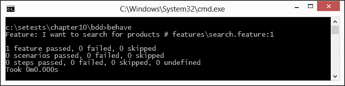

Behave 在三个级别上生成摘要，即功能、场景和步骤的通过和失败。

### 使用场景概述

有时我们可能想要运行具有多个变量的一组场景，这些变量给出了一组已知状态、要采取的操作和预期结果，所有这些都使用相同的步骤，类似于数据驱动测试。我们可以为此使用场景概述。

让我们按照以下步骤重写`search.feature`文件，包括场景概述和示例。场景概述就像一个模板，例如在`Example`部分中给出的。

1.  在这个例子中，我们创建了两个示例来检查分类或特定产品的搜索功能。`Example`部分以表格格式包含搜索词和预期结果：

    ```py
    Feature: I want to search for products

     Scenario Outline: Search
       Given I am on home page
        when I search for <term>
        then I should see results <search_count> in search results

     Examples: By category
       | term    | search_count |
       | Phones  | 2            |
       | Bags    | 7            |

     Examples: By product name
       | term      | search_count |
       | Madison earbuds  | 3            |
    ```

1.  此外，修改`search_steps.py`文件以匹配步骤中使用的文本：

    ```py
    from behave import *

    @given('I am on home page')
    def step_i_am_on_home_page(context):
        context.driver.get("http://demo.magentocommerce.com/")

    @when('I search for {text}')
    def step_i_search_for(context, text):
        search_field = context.driver.find_element_by_name("q")
        search_field.clear()

        # enter search keyword and submit
        search_field.send_keys(text)
        search_field.submit()

    @then('I should see results {text} in search results')
    def step_i_should_see_results(context, text):
        products = context.driver.\
            find_elements_by_xpath("//h2[@class='product-name']/a")
        # check count of products shown in results
        assert len(products) >= int(text)
    ```

当我们执行此功能时，Behave 会自动重复执行`Example`部分中用`search.feature`文件编写的场景概述。它会将示例数据中的数据传递给场景步骤并执行定义。在 Behave 运行修改后的功能后，你可以看到结果。Behave 会打印出它在功能上运行的所有组合，如下面的截图所示：

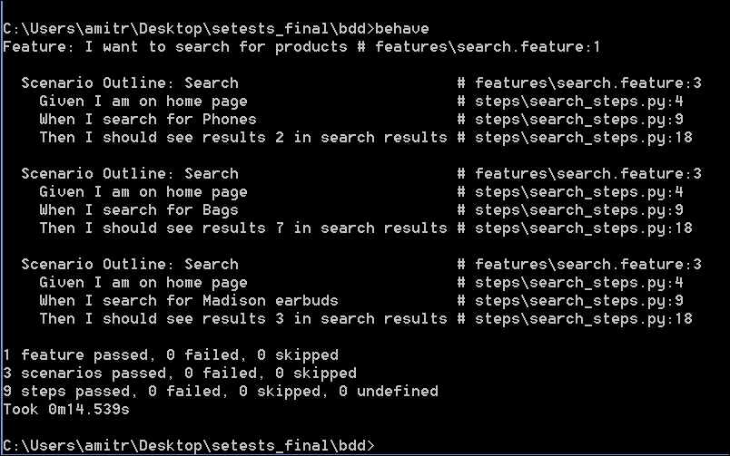

### 小贴士

Behave 还支持使用`–junit`开关以 JUnit 格式生成报告。

# 与 Jenkins 的 CI

Jenkins 是一个流行的 Java 编写的 CI 服务器。它源自 Hudson 项目。Jenkins 和 Hudson 都提供类似的功能。

Jenkins 支持各种版本控制工具，如 CVS、SVN、Git、Mercurial、Perforce 和 ClearCase，并且可以执行使用 Apache Ant 或 Maven 构建的 Java 项目。但是，它也可以使用插件、任意 shell 脚本和 Windows 的 `批处理` 命令为其他平台构建项目。

除了构建软件外，Jenkins 还可以部署以设置一个自动化的测试环境，其中 Selenium WebDriver 测试可以根据定义的计划或每次提交更改到版本控制系统时无人在场运行。

在接下来的章节中，您将学习如何使用免费式项目模板设置 Jenkins 来运行测试。

## 准备 Jenkins

在我们开始使用 Jenkins 运行我们的测试之前，我们需要进行一些更改，以便我们可以利用 Jenkins 的功能。我们将使用 Jenkins 在预定义的计划上运行我们的测试，并收集测试结果，以便 Jenkins 可以在仪表板上显示它们。我们将重用我们在 第二章 *使用 unittest 编写测试* 中创建的烟雾测试。

我们使用了 `unittest` 的 `TestSuite` 运行器来一起执行一系列测试。现在，我们将以 JUnit 报告格式输出这些测试的结果。为此，我们需要一个名为 `xmlrunner` 的 Python 库，它可以从 [`pypi.python.org/pypi/xmlrunner/1.7.4`](https://pypi.python.org/pypi/xmlrunner/1.7.4) 获取。

使用以下命令行下载并安装 `xmlrunner`：

```py
pip install xmlrunner

```

我们将使用 `smoketests.py`，它使用 `TestSuite` 运行器从 `homepagetests.py` 和 `searchtest.py` 运行测试。我们将使用 `xmlrunner.XML TestRunner` 来运行这些测试，并生成一个 JUnit 格式的测试报告。该报告将以 XML 格式生成并保存在 `test-reports` 子目录中。要使用 `xmlrunner`，请在 `smoketest.py` 中进行以下突出显示的更改，如下面的代码示例所示：

```py
import unittest
from xmlrunner import xmlrunner
from searchtest import SearchProductTest
from homepagetests import HomePageTest

# get all tests from SearchProductTest and HomePageTest class
search_tests = unittest.TestLoader().loadTestsFromTestCase(SearchProductTest)
home_page_tests = unittest.TestLoader().loadTestsFromTestCase(HomePageTest)

# create a test suite combining search_test and home_page_test
smoke_tests = unittest.TestSuite([home_page_tests, search_tests])

# run the suite
xmlrunner.XMLTestRunner(verbosity=2, output='test-reports').run(smoke_tests)

```

## 设置 Jenkins

设置 Jenkins 相对直接。您可以使用适用于各种平台的安装程序下载并安装 Jenkins。在以下示例中，我们将设置 Jenkins 并创建一个新的构建作业来在示例应用程序上运行烟雾测试：

1.  从 [`jenkins-ci.org/`](http://jenkins-ci.org/) 下载并安装 Jenkins CI 服务器。对于此配方，使用 Jenkins Windows 安装程序在 Windows 7 机器上设置 Jenkins。

1.  在浏览器窗口中导航到 **Jenkins 仪表板**（默认为 `http://localhost:8080`）。

1.  在 **Jenkins 仪表板** 上，点击 **新建项目** 或 **创建新作业** 链接来创建一个新的 Jenkins 作业，如图所示：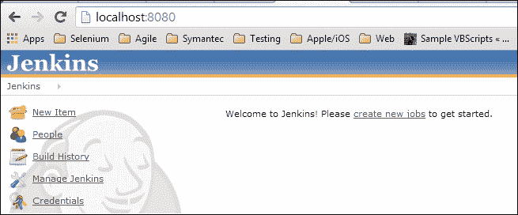

1.  在 **项目名称** 文本框中输入 `Demo_App_Smoke_Test` 并选择 **构建一个免费式软件项目** 单选按钮，如图所示：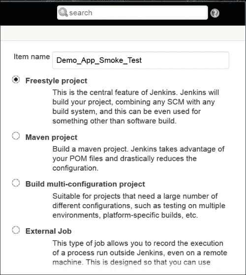

1.  点击 **确定** 按钮。将创建一个具有指定名称的新作业。

    ### 注意

    我们可以连接到各种版本控制或**源代码管理**（**SCM**）工具，如 SVN、GIT、Perforce 等，以存储源代码和测试代码。然后，我们可以获取代码的最新版本，在 Jenkins 工作区中作为构建步骤的一部分构建和测试软件。然而，为了简化，在这个例子中，我们将使用**执行 Windows 批处理命令**构建步骤将测试脚本从文件夹复制到 Jenkins 工作区，具体步骤如下。

1.  在**构建**部分，点击**添加构建步骤**，并从下拉菜单中选择**执行 Windows 批处理命令**选项，如图所示：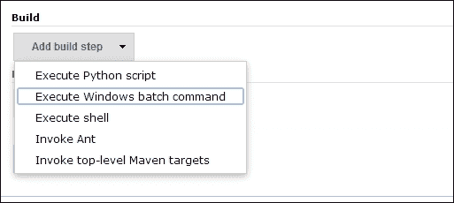

1.  在**命令**文本框中输入以下命令，如图所示。路径可能因你的情况而异。此命令将复制包含烟雾测试的 Python 文件到 Jenkins 工作区，并运行`smoketest.py`，如下所示：

    ```py
    copy c:\setests\chapter10\smoketests\*.py
    python smoketest.py

    ```

    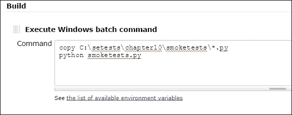

1.  我们已将`smoketest.py`配置为以 JUnit 格式生成测试结果，以便 Jenkins 可以在其仪表板上显示测试结果。要将这些报告与 Jenkins 集成，请点击**添加构建后操作**，并从下拉菜单中选择**发布 JUnit 测试结果报告**选项，如图所示：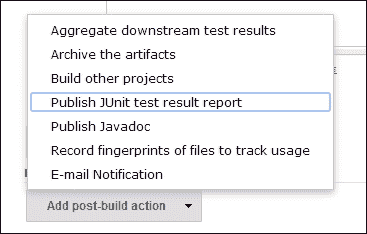

1.  在**构建后操作**部分，将`test-reports/*.xml`添加到**测试报告 XML**文本框中，如图所示。每次 Jenkins 运行测试时，它将从`test-report`子文件夹中读取测试结果。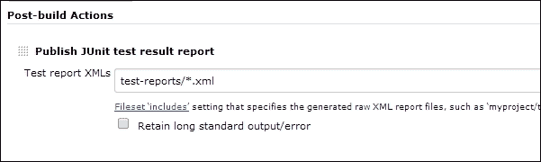

1.  要在**构建触发器**部分安排测试以自动执行，请选择**定期构建**，并在**计划**文本框中输入如图所示的数据。这将每天晚上 10 点触发构建过程，Jenkins 将在无人值守的情况下作为构建过程的一部分运行测试，以便你第二天早上到达办公室时可以看到结果。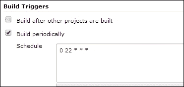

1.  点击**保存**按钮以保存作业配置。Jenkins 将显示新创建作业的项目页面。

1.  我们可以检查一切是否设置正确，以查看测试是否执行。点击**立即构建**链接手动运行作业，如图所示：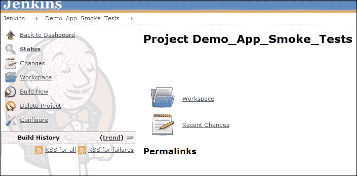

1.  你可以在**构建历史**部分看到构建的运行状态，如图所示：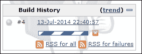

1.  点击**构建历史**部分的运行项目，这将打开以下页面：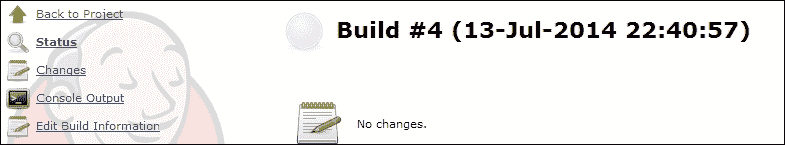

1.  除了 Jenkins 上的状态和进度条外，我们还可以通过打开**控制台输出**链接来查看幕后发生的事情。这将打开**控制台输出**页面，显示命令行输出，如图所示：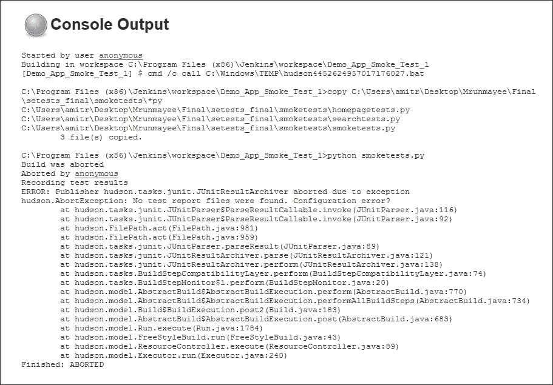

1.  一旦 Jenkins 完成构建过程，我们就可以看到类似于下一张截图所示的构建页面。

1.  Jenkins 通过读取由 `unittest` 框架生成的结果文件来显示测试结果和各种其他指标。Jenkins 还存档测试结果。要查看测试结果，请点击构建页面上的**测试结果**链接。

1.  我们配置了测试，使其以 JUnit 格式生成测试结果，当我们点击**测试结果**时，Jenkins 将显示以下截图所示的 JUnit 测试结果。它突出显示了失败的测试以及测试的摘要。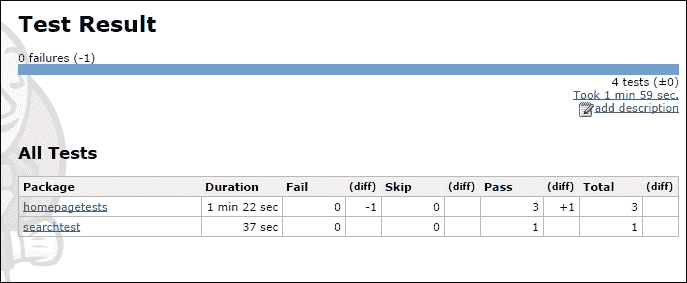

1.  通过单击包名，我们可以深入挖掘并查看以下截图所示的各个测试的结果：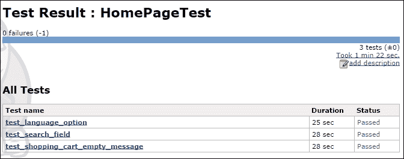

Jenkins 还在仪表板上显示作业的状态，以下列格式显示最后构建的状态：

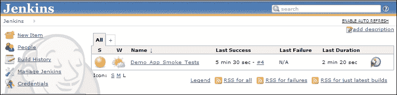

# 摘要

在本章中，您学习了如何将 Selenium 与 Behave 集成以进行 BDD，以及如何将 Jenkins 集成以进行 CI。您看到了如何通过编写特性和步骤定义文件来将 Selenium WebDriver API 与 Behave 集成，以运行自动化验收测试。

您设置了 Jenkins 来运行 Selenium WebDriver 测试，这样您就可以在构建软件时运行这些测试，或者安排测试以便它们可以在夜间运行。Jenkins 提供了一个易于设置的模型来运行各种应用程序开发平台和环境的构建和测试作业。

这完成了您使用 Selenium WebDriver 和 Python 的学习之旅。您学习了如何使用 Selenium WebDriver 自动化浏览器交互来为 Web 应用程序创建自动化测试的一些基本课程。您可以使用这些知识来构建自己的测试框架。
