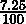
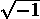
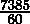
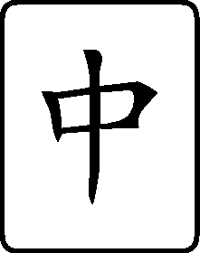

## 1

数字、字符串和元组

本章将探讨 Python 对象的一些核心类型。我们将探讨处理不同类型的数字、处理字符串和使用元组。这些是 Python 处理的最简单的数据类型。在后面的章节中，我们将探讨建立在这些基础上的数据结构。

虽然这些食谱从对 Python 3.12 的入门级理解开始，但它们也为熟悉该语言的人提供了一些更深入的知识背景。特别是，我们将探讨一些关于数字如何内部表示的细节，因为这在面对更高级的数值编程问题时可能会有所帮助。这将帮助我们区分丰富多样的数值类型的用例。

我们还将探讨两种不同的除法运算符。它们有特定的用例，我们将探讨一种需要截断除法的算法。

当处理字符串时，有几个常见的操作很重要。我们将探讨字节（在我们的操作系统文件中使用）与用于表示 Unicode 文本的字符串之间的差异。我们将看看如何利用 Unicode 字符集的全部力量。

在本章中，我们将像在交互式 Python 的 >>> 提示符下工作一样展示这些食谱。这是在命令行运行 python 或在许多集成开发环境（IDE）工具中的 Python 控制台中提供的提示符。这有时被称为读取-评估-打印循环（REPL）。在后面的章节中，我们将改变风格，使其看起来更像脚本文件。本章的一个目标是通过交互式探索来鼓励学习，因为这是一种学习语言的好方法。

我们将介绍这些食谱来介绍基本的 Python 数据类型：

+   在 float、decimal 和 fraction 之间进行选择

+   在真除法和地板除法之间进行选择

+   使用正则表达式解析字符串

+   使用 f-strings 构建复杂的字符串

+   从字符串列表构建复杂的字符串

+   使用键盘上没有的 Unicode 字符

+   编码字符串 – 创建 ASCII 和 UTF-8 字节

+   解码字节 – 如何从一些字节中获取正确的字符

+   使用项目元组

+   使用 NamedTuples 简化元组中的项目访问

我们将从数字开始，逐步过渡到字符串，最后以元组和 NamedTuple 对象的简单组合形式处理对象。

# 1.1 在 float、decimal 和 fraction 之间进行选择

Python 提供了多种处理有理数和无理数近似值的方法。我们有三种基本选择：

+   浮点数

+   小数

+   分数

当我们有选择时，有一些标准来做出选择是有帮助的。

## 1.1.1 准备工作

涉及到整数以外的数字的表达式有三个一般情况，它们是：

1.  货币：美元、分、欧元等等。货币通常有固定的位数和小数点后舍入规则，以正确量化结果。

1.  有理数或分数：当我们把为八人准备的食谱缩小到五人份时，例如，我们正在使用的缩放因子进行分数数学。

1.  浮点数：这包括所有其他类型的计算。这也包括无理数，如π、根提取和对数。

当我们遇到前两种情况之一时，我们应该避免使用浮点数。

## 1.1.2 如何操作...

我们将分别查看三个案例。

### 进行货币计算

当处理货币时，我们应该始终使用 decimal 模块。如果我们尝试使用 Python 内置的 float 类型的值，我们可能会遇到数字舍入和截断的问题：

1.  要处理货币，从 decimal 模块导入 Decimal 类：

    ```py
    >>> from decimal import Decimal
    ```

1.  我们需要从字符串或整数创建 Decimal 对象。在这种情况下，我们想要 7.25%，即。我们可以使用 Decimal 对象来计算这个值：

    ```py
    >>> tax_rate = Decimal(’7.25’)/Decimal(100) 

    >>> purchase_amount = Decimal(’2.95’) 

    >>> tax_rate * purchase_amount 

    Decimal(’0.213875’)
    ```

    我们也可以使用 Decimal('0.0725')而不是显式地进行除法。

1.  要四舍五入到最近的便士，创建一个便士对象：

    ```py
    >>> penny = Decimal(’0.01’)
    ```

1.  使用便士对象量化结果：

    ```py
    >>> total_amount = purchase_amount + tax_rate * purchase_amount 

    >>> total_amount.quantize(penny) 

    Decimal(’3.16’)
    ```

这使用的是默认的 ROUND_HALF_EVEN 舍入规则。Decimal 模块提供了其他舍入变体。例如，我们可能做如下操作：

```py
>>> import decimal 

>>> total_amount.quantize(penny, decimal.ROUND_UP) 

Decimal(’3.17’)
```

这显示了使用不同舍入规则的结果。

### 分数计算

当我们进行具有精确分数值的计算时，我们可以使用 fractions 模块来创建有理数。在这个例子中，我们想要将八人份的食谱缩小到五人份，使用的每种成分。当食谱要求 2杯大米时，这会缩小到多少？

要处理分数，我们将这样做：

1.  从 fractions 模块导入 Fraction 类：

    ```py
    >>> from fractions import Fraction
    ```

1.  从字符串、整数或整数对创建 Fraction 对象。我们从一个字符串创建了一个分数，'2.5'。我们从一个浮点表达式创建第二个分数，5 / 8。这仅在分母是 2 的幂时才有效：

    ```py
    >>> sugar_cups = Fraction(’2.5’) 

    >>> scale_factor = Fraction(5/8) 

    >>> sugar_cups * scale_factor 

    Fraction(25, 16)
    ```

我们可以看到，我们将使用几乎一升半的大米来调整八人份的食谱，而不是五人份。虽然浮点数对于有理分数通常很有用，但除非分母是 2 的幂，否则它们可能不精确。

### 浮点近似

Python 内置的 float 类型可以表示各种值。这里的权衡是浮点值通常是一个近似值。可能会有一个小的差异，揭示了 float 的实现与无理数的数学理想之间的差异：

1.  为了与浮点数一起工作，我们通常需要四舍五入值以使其看起来合理。重要的是要认识到所有浮点数计算都是近似值：

    ```py
    >>> (19/155)*(155/19) 

    0.9999999999999999
    ```

1.  从数学上讲，值应该是 1。由于使用了近似值，计算结果并不完全等于 1。我们可以使用 round(answer, 3)将其四舍五入到三位数字，创建一个更有用的值：

    ```py
    >>> answer = (19/155)*(155/19) 

    >>> round(answer, 3) 

    1.0
    ```

近似值有非常重要的后果。

不要比较浮点数的精确相等性。

使用精确的等于（==）测试浮点数的代码，当两个近似值只相差一个比特时，可能会引起问题的潜在风险。

浮点数近似规则来自 IEEE，并不是 Python 的独特特性。许多编程语言都使用浮点数近似，并且具有相同的行为。

## 1.1.3 它是如何工作的...

对于这些数值类型，Python 提供了各种运算符：+、-、*、/、//、%和**。这些分别用于加法、减法、乘法、真除法、截断除法、取模和求幂。我们将探讨两个除法运算符/和//，在选择真除法和截断除法的食谱中。

Python 会在各种数值类型之间进行一些转换。我们可以混合使用整型（int）和浮点型（float）值；整数将被提升为浮点数以提供尽可能精确的答案。同样，我们也可以混合使用整型与分数（Fraction）以及整型与十进制（Decimal）。请注意，我们无法随意混合十进制与浮点数或分数；需要显式转换函数。

重要的是要注意，浮点数是近似值。Python 语法允许我们使用十进制数字来编写浮点值；然而，这并不是值在内部表示的方式。

我们可以在 Python 中这样写出值 8.066 × 10⁶⁷：

```py
>>> 8.066e+67 

8.066e+67
```

实际内部使用的值将涉及我们写入的十进制值的二进制近似。此示例的内部值如下：

```py
>>> (6737037547376141/(2**53))*(2**226) 

8.066e+67
```

分子是一个大数，6737037547376141。分母始终是 2 的 53 次方。这就是为什么值可能会被截断。

我们可以使用 math.frexp()函数来查看一个数字的内部细节：

```py
>>> import math 

>>> math.frexp(8.066E+67) 

(0.7479614202861186, 226)
```

这两部分被称为尾数（或有效数字）和指数。如果我们把尾数乘以 2 的 53 次方，我们总是得到一个整数，这是二进制分数的分子。

与内置的浮点数不同，分数（Fraction）是两个整数值的精确比率。我们可以创建涉及具有非常大量数字的整数的比率。我们不受固定分母的限制。

类似地，十进制值基于一个非常大的整数值，以及一个缩放因子来确定小数点的位置。这些数字可以非常大，并且不会遭受奇特的表示问题。

## 1.1.4 更多...

Python 的 math 模块包含用于处理浮点值的一些专用函数。此模块包括常见的初等函数，如平方根、对数和各种三角函数。它还有一些其他函数，如伽玛、阶乘和高斯误差函数。

math 模块包含几个函数，可以帮助我们进行更精确的浮点计算。例如，math.fsum()函数将比内置的 sum()函数更仔细地计算浮点数之和。它对近似问题不太敏感。

我们还可以使用 math.isclose()函数来比较两个浮点值、一个表达式和一个字面量 1.0，以查看它们是否近似相等：

```py
>>> (19/155)*(155/19) == 1.0 

False 
 >>> math.isclose((19/155)*(155/19), 1.0) 

True
```

此函数为我们提供了一种有意义地比较两个浮点数近似的手段。

Python 还提供了复数。复数有一个实部和虚部。在 Python 中，我们用 3.14+2.78j 来表示复数 3.14 + 2.78。Python 可以轻松地在浮点数和复数之间进行转换。我们有一组常用的运算符可用于复数。

为了支持复数，有 cmath 包。例如，cmath.sqrt()函数在提取负数的平方根时将返回一个复数值，而不是抛出异常。以下是一个示例：

```py
>>> math.sqrt(-2) 

Traceback (most recent call last): 

... 

ValueError: math domain error 
 >>> import cmath 

>>> cmath.sqrt(-2) 

1.4142135623730951j
```

此模块在处理复数时很有帮助。

## 1.1.5 参见

+   我们将在选择真除法和截断除法菜谱中更多地讨论浮点数和分数。

+   请参阅[`en.wikipedia.org/wiki/IEEE_floating_point`](https://en.wikipedia.org/wiki/IEEE_floating_point)。

# 1.2 选择真除法和截断除法

Python 为我们提供了两种除法运算符。它们是什么，我们如何知道该使用哪一个？我们还将探讨 Python 的除法规则以及它们如何应用于整数值。

## 1.2.1 准备工作

除法有几个通用情况：

+   一个除法-取模对：我们想要两个部分——商和余数。这个名字指的是将除法和取模操作组合在一起。我们可以将商和余数总结为 q,r = (⌊⌋,a mod b)。

    我们经常在将一个基数的值转换为另一个基数时使用它。当我们把秒转换为小时、分钟和秒时，我们将进行一种除法-取模的运算。我们不需要确切的小时数；我们想要一个截断的小时数，余数将被转换为分钟和秒。

+   真实值：这是一个典型的浮点值；它将是商的一个很好的近似。例如，如果我们正在计算几个测量的平均值，我们通常期望结果是浮点数，即使输入值都是整数。

+   有理分数值：当在美国单位英尺、英寸和杯中工作时，这通常是必要的。为此，我们应该使用分数类。当我们除以分数对象时，我们总是得到精确的答案。

我们需要决定这些情况中的哪一个适用，以便我们知道要使用哪个除法运算符。

## 1.2.2 如何做...

我们将分别查看这三个案例。

### 执行截断除法

当我们进行除法-模运算时，我们可能会使用整除运算符//和取模运算符%。表达式 a % b 给出了 a // b 的整数除法的余数。或者，我们可能会使用内置的 divmod()函数同时计算这两个值：

1.  我们将秒数除以 3,600 以得到小时值。使用%运算符计算的模数，或除法中的余数，可以单独转换为分钟和秒：

    ```py
    >>> total_seconds = 7385 

    >>> hours = total_seconds // 3600 

    >>> remaining_seconds = total_seconds % 3600
    ```

1.  接下来，我们将秒数除以 60 以得到分钟数；余数是小于 60 的秒数：

    ```py
    >>> minutes = remaining_seconds // 60 

    >>> seconds = remaining_seconds % 60 

    >>> hours, minutes, seconds 

    (2, 3, 5)
    ```

这里是另一种方法，使用 divmod()函数同时计算商和模数：

1.  同时计算商和余数：

    ```py
    >>> total_seconds = 7385 

    >>> hours, remaining_seconds = divmod(total_seconds, 3600)
    ```

1.  再次计算商和余数：

    ```py
    >>> minutes, seconds = divmod(remaining_seconds, 60) 

    >>> hours, minutes, seconds 

    (2, 3, 5)
    ```

### 执行真正的除法

执行真正的除法计算给出一个浮点近似值作为结果。例如，7,385 秒大约是多少小时？这里使用真正的除法运算符：

```py
>>> total_seconds = 7385 

>>> hours = total_seconds / 3600 

>>> round(hours, 4) 

2.0514
```

我们提供了两个整数值，但得到了一个浮点精确结果。与我们的先前的配方一致，当使用浮点值时，我们将结果四舍五入以避免查看微小的误差数字。

### 有理分数计算

我们可以使用分数对象和整数进行除法。这迫使结果成为一个数学上精确的有理数：

1.  至少创建一个分数值：

    ```py
    >>> from fractions import Fraction 

    >>> total_seconds = Fraction(7385)
    ```

1.  在计算中使用分数值。任何整数都将提升为分数：

    ```py
    >>> hours = total_seconds / 3600 

    >>> hours 

    Fraction(1477, 720)
    ```

    720 的分母似乎不太有意义。使用这种分数需要一点技巧来找到对人们有意义的分母。否则，转换为浮点值可能是有用的。

1.  如果需要，将精确的分数转换为浮点近似值：

    ```py
    >>> round(float(hours), 4) 

    2.0514
    ```

首先，我们为总秒数创建了一个分数对象。当我们对分数进行算术运算时，Python 会将任何整数提升为分数对象；这种提升意味着数学运算尽可能精确。

## 1.2.3 它是如何工作的...

Python 有两个除法运算符：

+   / 真除法运算符产生一个真正的浮点结果。即使两个操作数都是整数，它也会这样做。在这方面，这是一个不寻常的运算符。所有其他运算符都保留数据类型。当应用于整数时，真正的除法操作产生一个浮点结果。

+   // 截断除法运算符总是产生截断结果。对于两个整数操作数，这是截断商。当使用浮点操作数时，这是截断浮点结果：

    ```py
    >>> 7358.0 // 3600.0 

    2.0
    ```

## 1.2.4 参见

+   更多关于浮点数和分数之间选择的信息，请参阅选择浮点数、十进制和分数配方。

+   查看[PEP-238](https://www.python.org/dev/peps/pep-0238)。

# 1.3 使用正则表达式进行字符串解析

我们如何分解一个复杂的字符串？如果我们有复杂、棘手的标点符号怎么办？或者——更糟糕的是——如果我们没有标点符号，但必须依赖数字的模式来定位有意义的信息呢？

## 1.3.1 准备工作

分解复杂字符串的最简单方法是将字符串泛化为一个模式，然后编写一个描述该模式的正则表达式。

正则表达式可以描述的模式的数量是有限的。当我们面对像 HTML、XML 或 JSON 这样的深度嵌套文档时，我们经常会遇到问题，并被禁止使用正则表达式。

re 模块包含我们创建和使用正则表达式所需的所有各种类和函数。

假设我们想要分解来自食谱网站的文本。每一行看起来像这样：

```py
>>> ingredient = "Kumquat: 2 cups"
```

我们希望将成分与测量值分开。

## 1.3.2 如何操作...

要编写和使用正则表达式，我们通常这样做：

1.  将示例进行泛化。在我们的情况下，我们有一些可以泛化的东西：

    ```py
    (ingredient words): (amount digits) (unit words)
    ```

1.  我们将文本替换成了两部分总结：它的含义和它的表示方式。例如，成分用单词表示，而数量用数字表示。导入 re 模块：

    ```py
    >>> import re
    ```

1.  将模式重写为正则表达式（RE）表示法：

    ```py
    >>> pattern_text = r’([\w\s]+):\s+(\d+)\s+(\w+)’
    ```

    我们将成分词、字母和空格的混合表示法替换为[\w\s]+。我们将数量数字替换为\d+。我们将单个空格替换为\s+，以便可以使用一个或多个空格作为标点符号。我们保留了冒号，因为在正则表达式表示法中，冒号匹配自身。

    对于数据字段的每个字段，我们使用()捕获匹配模式的匹配数据。我们没有捕获冒号或空格，因为我们不需要标点符号字符。

    正则表达式通常使用很多\字符。为了在 Python 中使其工作得很好，我们几乎总是使用原始字符串。r’告诉 Python 不要查看\字符，也不要将它们替换成不在我们键盘上的特殊字符。

1.  编译模式：

    ```py
    >>> pattern = re.compile(pattern_text)
    ```

1.  将模式与输入文本进行匹配。如果输入与模式匹配，我们将得到一个匹配对象，它显示了匹配的子字符串的详细信息：

    ```py
    >>> match = pattern.match(ingredient) 

    >>> match is None 

    False 

    >>> match.groups() 

    (’Kumquat’, ’2’, ’cups’)
    ```

1.  从匹配对象中提取命名的字符组：

    ```py
    >>> match.group(1) 

    ’Kumquat’ 

    >>> match.group(2) 

    ’2’ 

    >>> match.group(3) 

    ’cups’
    ```

每个组通过正则表达式的捕获 () 部分的顺序来标识。这给我们一个从字符串中捕获的不同字段的元组。我们将在使用项目元组菜谱中返回到元组数据结构的使用。在更复杂的正则表达式中，这可能会令人困惑；有一种方法可以提供名称，而不是数字位置来标识捕获组。

## 1.3.3 它是如何工作的...

我们可以用正则表达式描述很多不同种类的字符串模式。

我们已经展示了多个字符类：

+   \w 匹配任何字母数字字符（a 到 z，A 到 Z，0 到 9）。

+   \d 匹配任何十进制数字。

+   \s 匹配任何空格或制表符字符。

这些类也有它们的逆：

+   \W 匹配任何非字母或数字字符。

+   \D 匹配任何非数字字符。

+   \S 匹配任何非空格或制表符字符。

许多字符匹配自身。然而，一些字符具有特殊含义，我们必须使用 \ 来转义这种特殊含义：

+   我们看到，作为后缀的 + 表示匹配前面的一个或多个模式。\d+ 匹配一个或多个数字。要匹配普通的 +，我们需要使用 \+。

+   我们还有 * 作为后缀，它匹配前面的零个或多个模式。\w* 匹配零个或多个字符。要匹配一个 *，我们需要使用 \*。

+   我们有 ? 作为后缀，它匹配前面的零个或一个表达式。这个字符在其他地方也被使用，但在其他上下文中具有不同的含义。我们将在 ?P<name>...)|, 其中它位于 \verb|)— 内部，用来定义分组特殊属性。

+   . 字符匹配任何单个字符。要特定地匹配一个 .，我们需要使用 \..

我们可以使用 [] 来创建我们自己的唯一字符集。我们可能有一些像这样的东西：

```py
(?P<name>\w+)\s*[=:]\s*(?P<value>.*)
```

这有一个 \w+ 来匹配任意数量的字母数字字符。这将收集到一个名为 name 的组中。它使用 \s* 来匹配一个可选的空格序列。它匹配集合 [=:] 中的任何字符。这个集合中的两个字符中恰好有一个必须存在。它再次使用 \s* 来匹配一个可选的空格序列。最后，它使用 .* 来匹配字符串中的其他所有内容。这被收集到一个名为 value 的组中。

我们可以使用它来解析字符串，如下所示：

```py
size = 12 

weight: 14
```

通过对标点符号的灵活性，我们可以使程序更容易使用。我们将容忍任意数量的空格，以及 = 或 : 作为分隔符。

## 1.3.4 更多...

一个长的正则表达式可能难以阅读。我们有一个巧妙的 Pythonic 方法来以一种更容易阅读的方式呈现表达式：

```py
>>> ingredient_pattern = re.compile( 

... r’(?P<ingredient>[\w\s]+):\s+’ # name of the ingredient up to the ":" 

... r’(?P<amount>\d+)\s+’ # amount, all digits up to a space 

... r’(?P<unit>\w+)’ # units, alphanumeric characters 

... )
```

这利用了三个语法规则：

+   一个语句只有在 () 字符匹配后才会完成。

+   相邻的字符串字面量会被静默地连接成一个单个的长字符串。

+   任何在 # 和行尾之间的内容都是一个注释，并且会被忽略。

我们在我们的正则表达式的重要子句后面添加了 Python 注释。这可以帮助我们理解我们做了什么，也许有助于我们以后诊断问题。

我们还可以使用正则表达式的“详细”模式在正则表达式字符串内添加多余的空白和注释。为此，我们必须在编译正则表达式时使用 re.X 作为选项，以便使空白和注释成为可能。这种修改后的语法看起来像这样：

```py
>>> ingredient_pattern_x = re.compile(r’’’ 

... (?P<ingredient>[\w\s]+):\s+ # name of the ingredient up to the ":" 

... (?P<amount>\d+)\s+ # amount, all digits up to a space 

... (?P<unit>\w+) # units, alphanumeric characters 

... ’’’, re.X)
```

我们可以将模式分解为单独的字符串组件，或者使用扩展语法使正则表达式更易于阅读。提供名称的好处在于，当我们使用 match 对象的 groupdict() 方法通过捕获模式的关联名称提取解析值时。

## 1.3.5 相关阅读

+   解码字节 – 如何从一些字节中获取正确的字符 的配方。

+   关于正则表达式和 Python 正则表达式的书籍有很多，比如《精通 Python 正则表达式》[`www.packtpub.com/application-development/mastering-python-regular-expressions`](https://www.packtpub.com/application-development/mastering-python-regular-expressions)。

# 1.4 使用 f 字符串构建复杂的字符串

在许多方面，创建复杂的字符串与解析复杂的字符串正好相反。我们通常使用模板和替换规则来将数据放入更复杂的格式中。

## 1.4.1 准备工作

假设我们有一些需要转换为格式化消息的数据。我们可能有的数据包括以下内容：

```py
>>> id = "IAD" 

>>> location = "Dulles Intl Airport" 

>>> max_temp = 32 

>>> min_temp = 13 

>>> precipitation = 0.4
```

我们希望得到一条看起来像这样的线：

```py
IAD : Dulles Intl Airport : 32 / 13 / 0.40
```

## 1.4.2 如何做...

1.  为结果创建一个 f 字符串，将所有数据项替换为占位符。在每个占位符内部，放置一个变量名（或一个表达式）。请注意，字符串使用 f' 前缀。这个前缀创建了一个复杂的字符串对象，其中值在字符串被使用时被插入到模板中：

    ```py
    f’{id} : {location} : {max_temp} / {min_temp} / {precipitation}’
    ```

1.  对于每个名称或表达式，可以在模板字符串中的名称后附加一个可选的数据类型。基本数据类型代码如下：

    +   s 用于字符串

    +   d 用于十进制数字

    +   f 用于浮点数

    它看起来会是这样：

    ```py
    f’{id:s} : {location:s} : {max_temp:d} / {min_temp:d} / {precipitation:f}’
    ```

    由于这本书的边距很窄，字符串已经被断开。

    适应页面。这是一行（非常宽）的代码。

1.  在需要的地方添加长度信息。长度信息并不总是必需的，在某些情况下，甚至可能不希望有。然而，在这个例子中，长度信息确保了每条消息都有统一的格式。对于字符串和十进制数字，使用以下格式添加长度：19s 或 3d。对于浮点数，使用两部分的格式前缀，如 5.2f，以指定总长度为五个字符，其中小数点右边有两个字符。以下是整个格式：

    ```py
    >>> f’{id:3s} : {location:19s} : {max_temp:3d} / {min_temp:3d} / {precipitation:5.2f}’ 

    ’IAD : Dulles Intl Airport :  32 /  13 /  0.40’
    ```

## 1.4.3 它是如何工作的...

F 字符串可以通过将数据插入模板来实现许多相对复杂的字符串组装。有几种转换可用。

我们已经看到了三种格式化转换——s、d、f，但还有很多其他的。详细信息可以在 Python 标准库的格式化字符串字面量部分找到：[`docs.python.org/3/reference/lexical_analysis.html#formatted-string-literals`](https://docs.python.org/3/reference/lexical_analysis.html#formatted-string-literals)。

这里是一些我们可能使用的格式转换：

+   b 是用于二进制，基数 2。

+   c 是用于 Unicode 字符。值必须是一个数字，它将被转换成一个字符。通常，我们使用十六进制数字来表示这些字符，所以你可能想尝试 0x2661 到 0x2666 之间的值来查看有趣的 Unicode 符号。

+   d 是用于十进制数。

+   E 和 e 是用于科学记数法。6.626E-34 或 6.626e-34，具体取决于使用的 E 或 e 字符。

+   F 和 f 是用于浮点数。对于非数字，f 格式显示小写的 nan；F 格式显示大写的 NAN。

+   G 和 g 是用于通用。这会自动在 E 和 F（或 e 和 f）之间切换，以保持输出在给定的字段大小内。对于 20.5G 的格式，最多显示 20 位数字，使用 F 格式。更大的数字将使用 E 格式。

+   n 是用于特定地区的十进制数字。这将插入逗号或点字符，具体取决于当前的地区设置。默认地区可能没有定义 1,000 分隔符。更多信息，请参阅地区模块。

+   o 是用于八进制，基数 8。

+   s 是用于字符串。

+   X 和 x 是用于十六进制，基数 16。数字包括大写 A-F 和小写 a-f，具体取决于使用的 X 或 x 格式字符。

+   %是用于百分比。数字乘以 100，输出包括一个%字符。

我们可以使用多个前缀来表示这些不同类型。最常见的一个是长度。我们可以使用{name:5d}来插入一个 5 位数。对于前述类型，有几个前缀可以使用：

+   填充和对齐：我们可以指定一个特定的填充字符（默认为空格）和对齐方式。数字通常右对齐，字符串左对齐。我们可以使用<、>或^来改变这一点。这分别强制左对齐、右对齐或居中对齐。还有一个特殊的=对齐，用于在符号前填充。

+   符号：默认规则是在需要的地方有一个前导负号。我们可以使用+来给所有数字加上符号，-来只给负数加上符号，或者使用空格来用空格代替正数的加号。在科学输出中，我们经常使用{value:5.3f}。空格确保留出空间给符号，确保所有的小数点对齐得很好。

+   交替形式：我们可以使用#来获取交替形式。我们可能有一些像{0:#x}、{0:#o}或{0:#b}这样的格式，以在十六进制、八进制或二进制值上添加前缀。带有前缀的数字将看起来像 0xnnn、0onnn 或 0bnnn。默认情况下，省略两个字符的前缀。

+   领先零：我们可以包含 0 以在数字前面填充前导零。例如，{code:08x} 将生成一个填充到八位的十六进制值。

+   宽度和精度：对于整数值和字符串，我们只提供宽度。对于浮点值，我们通常提供宽度.精度。

有时候我们不会使用 {name:format} 说明符。有时，我们需要使用 {name!conversion} 说明符。只有三种转换可用：

+   {name!r} 显示由 repr(name) 生成的表示。

+   {name!s} 显示由 str(name) 生成的字符串值；这是如果不指定任何转换时的默认行为。使用 !s 明确地允许你添加字符串类型格式说明符。

+   {name!a} 显示由 ascii(name) 生成的 ASCII 值。

+   此外，还有一个方便的调试格式说明符可用。我们可以在变量或表达式后包含一个尾随等号，=，以获取一个方便的变量或表达式转储。以下示例使用了这两种形式：

    ```py
    >>> value = 2**12-1 

    >>> f’{value=} {2**7+1=}’ 

    ’value=4095 2**7+1=129’ 
    ```

f-string 显示了名为 value 的变量的值以及表达式 2**7+1 的结果。

在第七章，我们将利用 {name!r} 格式说明符的想法来简化显示有关相关对象的信息。

## 1.4.4 更多...

f-string 处理依赖于字符串的 format() 方法。我们可以利用这个方法和相关的 format_map() 方法来处理更复杂的数据结构。

期待第五章，我们可能有一个字典，其键是符合 format_map() 规则的简单字符串：

```py
>>> data = dict( 

... id=id, location=location, max_temp=max_temp, 

... min_temp=min_temp, precipitation=precipitation 

... ) 

>>> ’{id:3s} : {location:19s} : {max_temp:3d} / {min_temp:3d} / {precipitation:5.2f}’.format_map(data) 

’IAD : Dulles Intl Airport :  32 /  13 /  0.40’
```

我们创建了一个包含多个值的字典对象，data，其键是有效的 Python 标识符：id、location、max_temp、min_temp 和 precipitation。然后我们可以使用这个字典和 format_map() 方法来使用键从字典中提取值。

注意，这里的格式模板不是 f-string。它没有 f" 前缀。我们不是使用 f-string 的自动格式化功能，而是通过 f-string 的 format_map() 方法“硬编码”了插值。

## 1.4.5 参见

+   更多详细信息可以在 Python 标准库的格式化字符串字面量部分找到：[`docs.python.org/3/reference/lexical_analysis.html#formatted-string-literals`](https://docs.python.org/3/reference/lexical_analysis.html#formatted-string-literals)。

# 1.5 从字符串列表构建复杂的字符串

我们如何对不可变的字符串进行复杂更改？我们能从单个字符组装一个字符串吗？

在大多数情况下，我们之前看到的食谱为我们提供了创建和修改字符串的许多工具。我们还有更多处理字符串操作问题的方法。在这个食谱中，我们将探讨使用列表对象作为分解和重建字符串的方法。这将与第四章中的一些食谱相呼应。

## 1.5.1 准备工作

这是一个我们想要重新排列的字符串：

```py
>>> title = "Recipe 5: Rewriting an Immutable String"
```

我们想要进行两种转换：

+   移除冒号前的部分。

+   用下划线替换标点符号，并将所有字符转换为小写。

我们将利用字符串模块：

```py
>>> from string import whitespace, punctuation
```

这有两个重要的常数：

+   string.whitespace 列出了所有也是 ASCII 一部分的空白字符，包括空格和制表符。

+   string.punctuation 列出了也是 ASCII 一部分的标点符号。Unicode 有大量的标点符号。这是一个广泛使用的子集。

## 1.5.2 如何做...

我们可以处理分解成列表的字符串。我们将在第四章中更深入地探讨列表：

1.  将字符串分解成列表对象：

    ```py
    >>> title_list = list(title)
    ```

1.  找到分隔字符。列表的 index()方法与字符串的 index()方法具有相同的语义。它定位给定值的索引位置：

    ```py
    >>> colon_position = title_list.index(’:’)
    ```

1.  删除不再需要的字符。del 语句可以从列表中删除项。与字符串不同，列表是可变的数据结构：

    ```py
    >>> del title_list[:colon_position+1]
    ```

1.  通过遍历每个位置来替换标点符号。在这种情况下，我们将使用一个 for 语句来访问字符串中的每个索引：

    ```py
    >>> for position in range(len(title_list)): 

    ...     if title_list[position] in whitespace+punctuation: 

    ...         title_list[position]= ’_’
    ```

1.  表达式 range(len(title_list))生成介于 0 和 len(title_list)-1 之间的所有值。这确保了 position 的值将是列表中的每个索引值。将字符列表连接起来创建一个新的字符串。当将字符串连接在一起时，使用零长度字符串''作为分隔符看起来有点奇怪。然而，它工作得很好：

    ```py
    >>> title = ’’.join(title_list) 

    >>> title 

    ’_Rewriting_an_Immutable_String’
    ```

我们将生成的字符串重新赋值给原始变量。原始字符串对象，该变量曾引用它，不再需要：它将自动从内存中删除（这被称为垃圾回收）。新的字符串对象替换了变量的值。

## 1.5.3 它是如何工作的...

这是一个表示技巧的改变。由于字符串是不可变的，我们无法更新它。然而，我们可以将其转换为可变形式；在这种情况下，是一个列表。我们可以对可变列表对象进行所需的任何更改。当我们完成时，我们可以将表示从列表转换回字符串，并替换原始变量的值。

列表提供了一些字符串没有的特性。反过来，字符串也提供了一些列表没有的特性。例如，我们不能像转换字符串那样将列表转换为小写。

这里有一个重要的权衡：

+   字符串是不可变的，这使得它们非常快。字符串专注于 Unicode 字符。当我们查看映射和集合时，我们可以使用字符串作为映射的键和集合中的项，因为值是不可变的。

+   列表是可变的。操作较慢。列表可以持有任何类型的项。我们不能使用列表作为映射的键或集合中的项，因为列表值可能会改变。

字符串和列表都是特殊类型的序列。因此，它们有许多共同特性。基本的项索引和切片特性是共享的。同样，列表使用与字符串相同的负索引值：表达式 list[-1] 是列表对象中的最后一个项。

我们将在第四章返回可变数据结构。

## 1.5.4 参考内容

+   有时，我们需要构建一个字符串，然后将其转换为字节。请参阅编码字符串——如何创建 ASCII 和 UTF-8 字节配方，了解我们如何做到这一点。

+   有时，我们还需要将字节转换为字符串。请参阅解码字节——如何从一些字节中获取正确的字符配方以获取更多信息。

# 1.6 使用键盘上没有的 Unicode 字符

一个大键盘可能有近 100 个独立的按键。通常，其中不到 50 个键是字母、数字和标点符号。至少有十几个是功能键，它们执行的操作不仅仅是简单地插入字母到文档中。一些按键是不同类型的修饰符，它们旨在与另一个键一起使用——例如，我们可能有 Shift、Ctrl、Option 和 Command。

大多数操作系统将接受创建大约 100 个字符左右的简单键组合。更复杂的键组合可能创建另外大约 100 个不太流行的字符。这甚至不足以涵盖世界上所有字母表中的字符领域。而且，在我们的计算机字体中还有大量的图标、表情符号和装饰符号。我们如何访问所有这些符号呢？

## 1.6.1 准备工作

Python 使用 Unicode。有数千个独立的 Unicode 字符可用。

我们可以在 [`en.wikipedia.org/wiki/List_of_Unicode_characters`](https://en.wikipedia.org/wiki/List_of_Unicode_characters) 以及 [`www.unicode.org/charts/`](http://www.unicode.org/charts/) 看到所有可用的字符。

我们需要 Unicode 字符编号。我们可能还需要 Unicode 字符名称。

我们计算机上的某个字体可能没有设计为为所有这些字符提供符号。特别是，Windows 计算机字体可能难以显示这些字符中的某些字符。有时需要使用以下 Windows 命令来切换到代码页 65001：

```py
chcp 65001
```

Linux 和 macOS 很少出现 Unicode 字符问题。

## 1.6.2 如何操作...

Python 使用转义序列来扩展我们可以输入的普通字符，以覆盖 Unicode 字符的广阔空间。每个转义序列都以一个 \ 字符开始。下一个字符告诉我们需要创建哪个 Unicode 字符。找到所需的字符。获取名称或数字。数字总是以十六进制形式给出，基数为 16。描述 Unicode 的网站通常将字符写作 U+2680。名称可能是 DIE FACE-1。使用 \unnnn，其中 nnnn 是最多四位数的数字。或者，使用 \N{name}，其中包含完整的名称。如果数字超过四位，使用 \Unnnnnnnn，将数字填充到正好八位：

```py
>>> ’You Rolled \u2680’ 

’You Rolled ’ 
 >>> ’You drew \U0001F000’ 

’You drew ’ 
 >>> ’Discard \N{MAHJONG TILE RED DRAGON}’ 

’Discard ’
```

是的，我们可以在 Python 输出中包含各种字符。要在字符串中放置一个反斜杠（\）而不让后面的字符成为转义序列的一部分，我们需要使用\\. 例如，我们可能需要这样做来表示 Windows 文件路径。

## 1.6.3 它是如何工作的...

Python 在内部使用 Unicode。我们可以直接使用键盘输入的 128 个左右字符都有方便的内部 Unicode 数字。

当我们写：

```py
’HELLO’
```

Python 将其视为以下简写：

```py
’\u0048\u0045\u004c\u004c\u004f’
```

一旦我们超出键盘上的字符，剩下的数千个字符仅通过它们的数字来识别。

当字符串被 Python 编译时，\uxxxx、\Uxxxxxxxx 和 \N{name} 都会被替换为正确的 Unicode 字符。如果我们有语法错误——例如，\N{name with no closing }——Python 的内部语法检查会立即报错。

正则表达式使用了很多 \ 字符，并且我们明确不希望 Python 的正常编译器触及它们；我们在正则表达式字符串上使用了 r’ 前缀，以防止 \ 被视为转义并可能被转换为其他内容。要使用 Unicode 字符的全域，我们无法避免使用 \ 作为转义。

如果我们需要在正则表达式中使用 Unicode，我们需要在正则表达式中到处使用 \\。我们可能会看到类似这样的：’\\w+[\u2680\u2681\u2682\u2683\u2684\u2685]\\d+’。

我们不能在字符串上使用 r’ 前缀，因为我们需要处理 Unicode 转义。这迫使我们使用 \\ 作为正则表达式的元素。我们使用了 \uxxxx 来表示模式中的 Unicode 字符。Python 的内部编译器会将 \uxxxx 替换为 Unicode 字符，而 \\w 将在内部变为所需的 \w。

当我们在 >>> 提示符下查看字符串时，Python 会以规范形式显示字符串。Python 倾向于使用单引号（'）作为分隔符，当字符串包含单引号时使用双引号（"）。在编写代码时，我们可以使用单引号或双引号作为字符串分隔符。Python 通常不会显示原始字符串；相反，它会将所有必要的转义序列放回字符串中：

```py
>>> r"\w+" 

’\\w+’
```

我们提供了一个原始格式的字符串。Python 以规范形式显示了它。

## 1.6.4 参见

+   在编码字符串 – 创建 ASCII 和 UTF-8 字节和解码字节 – 如何从某些字节中获取正确的字符的菜谱中，我们将探讨 Unicode 字符是如何转换成字节序列的，这样我们就可以将它们写入文件。我们还将探讨文件中的字节（或从网站下载的）是如何转换成 Unicode 字符，以便进行处理。

+   如果你对历史感兴趣，你可以在这里了解 ASCII 和 EBCDIC 以及其他旧式字符编码：[`www.unicode.org/charts/`](http://www.unicode.org/charts/)。

# 1.7 编码字符串 – 创建 ASCII 和 UTF-8 字节

我们的计算机文件是字节。当我们从互联网上传或下载时，通信是以字节为单位的。一个字节只有 256 个不同的值。我们的 Python 字符是 Unicode。Unicode 字符的数量远远超过 256 个。

我们如何将 Unicode 字符映射到字节以写入文件或进行传输？

## 1.7.1 准备工作

从历史上看，一个字符占用 1 个字节。Python 利用旧的 ASCII 编码方案来处理字节；这有时会导致字节和 Unicode 字符的文本字符串之间的混淆。

Unicode 字符被编码成一系列的字节。有许多标准化的编码和许多非标准化的编码。

此外，还有一些编码只适用于 Unicode 字符的一个小子集。我们尽量避免使用这些编码，但在某些情况下，我们可能需要使用子集编码方案。

除非我们有充分的理由不这样做，否则我们几乎总是使用 UTF-8 编码来表示 Unicode 字符。它的主要优点是它是对拉丁字母的紧凑表示，拉丁字母被用于英语和许多欧洲语言。

有时，一个互联网协议需要 ASCII 字符。这是一个需要特别注意的特殊情况，因为 ASCII 编码只能处理 Unicode 字符的一个小子集。

## 1.7.2 如何操作...

Python 通常使用我们操作系统的默认编码来处理文件和互联网流量。这些细节对每个操作系统都是独特的：

1.  我们可以使用 PYTHONIOENCODING 环境变量来设置一个通用设置。我们将其设置在 Python 之外，以确保在所有地方都使用特定的编码。当使用 Linux 或 macOS 时，使用 shell 的 export 语句来设置环境变量。对于 Windows，使用 set 命令或 PowerShell 的 Set-Item 命令。对于 Linux，它看起来像这样：

    ```py
    (cookbook3) % export PYTHONIOENCODING=UTF-8
    ```

1.  运行 Python：

    ```py
    (cookbook3) % python
    ```

1.  当我们在脚本内部打开文件时，我们有时需要做出特定的设置。我们将在第十一章中回到这个话题。以指定的编码打开文件。向文件中读取或写入 Unicode 字符：

    ```py
    >>> with open(’some_file.txt’, ’w’, encoding=’utf-8’) as output: 

    ...     print(’You drew \U0001F000’, file=output) 

    >>> with open(’some_file.txt’, ’r’, encoding=’utf-8’) as input: 

    ...     text = input.read() 

    >>> text 

    ’You drew ’
    ```

在极少数需要以字节模式打开文件的情况下，我们也可以手动编码字符；如果我们使用 wb 模式，我们还需要对每个字符串进行手动编码：

```py
>>> string_bytes = ’You drew \U0001F000’.encode(’utf-8’) 

>>> string_bytes 

b’You drew \xf0\x9f\x80\x80’
```

我们可以看到，一个字节序列 (\xf0\x9f\x80\x80) 被用来编码单个 Unicode 字符，U+1F000，。

## 1.7.3 它是如何工作的...

Unicode 定义了多种编码方案。虽然 UTF-8 是最流行的，但也有 UTF-16 和 UTF-32。数字是每个字符的典型位数。一个包含 1,000 个字符的 UTF-32 编码文件将是 4,000 个 8 位字节。一个包含 1,000 个字符的 UTF-8 编码文件可能只有 1,000 个字节，具体取决于字符的确切组合。在 UTF-8 编码中，Unicode 编号高于 U+007F 的字符需要多个字节。

各种操作系统都有自己的编码方案。macOS 文件可以编码为 Mac Roman 或 Latin-1。Windows 文件可能使用 CP1252 编码。

所有这些方案的目的都是为了有一个可以映射到 Unicode 字符的序列的字节，以及反过来将每个 Unicode 字符映射到一个或多个字节的方法。理想情况下，所有 Unicode 字符都应该被考虑到。实际情况下，这些编码方案中的一些是不完整的。

ASCII 编码的历史形式只能表示大约 100 个 Unicode 字符作为字节。很容易创建一个无法使用 ASCII 方案编码的字符串。

这就是错误的样子：

```py
>>> ’You drew \U0001F000’.encode(’ascii’) 

Traceback (most recent call last): 

... 

UnicodeEncodeError: ’ascii’ codec can’t encode character ’\U0001f000’ in position 9: ordinal not in range(128
```

当我们意外地以不是广泛使用的 UTF-8 标准的编码打开文件时，我们可能会看到这种错误。当我们看到这种错误时，我们需要更改我们的处理过程，以选择创建文件实际使用的编码。猜测使用了哪种编码几乎是不可能的，因此可能需要进行一些研究以定位关于文件编码的元数据。

字节通常使用可打印字符来显示。我们将看到 b’hello’ 作为五个字节的值的缩写。字母是使用旧的 ASCII 编码方案选择的，其中从 0x20 到 0x7F 的字节值将显示为字符，而在此范围之外，将使用更复杂的转义序列。

这种用字符表示字节值的方法可能会令人困惑。b’ 前缀是我们的提示，表明我们正在查看字节，而不是正确的 Unicode 字符。

## 1.7.4 参见

+   有多种构建数据字符串的方法。请参阅 使用 f-strings 构建复杂的字符串 和 从字符串列表构建复杂的字符串 的配方，以了解创建复杂字符串的示例。其思想是，我们可能有一个构建复杂字符串的应用程序，然后将其编码为字节。

+   有关 UTF-8 编码的更多信息，请参阅 [`en.wikipedia.org/wiki/UTF-8`](https://en.wikipedia.org/wiki/UTF-8)。

+   有关 Unicode 编码的一般信息，请参阅 [`unicode.org/faq/utf_bom.html`](http://unicode.org/faq/utf_bom.html)。

# 1.8 解码字节 - 如何从一些字节中获取正确的字符

我们如何处理未正确编码的文件？对于使用 ASCII 编码编写的文件，我们该怎么办？

从互联网下载的内容几乎总是以字节形式存在——不是字符。我们如何从这串字节流中解码字符？

此外，当我们使用 subprocess 模块时，操作系统命令的结果是以字节形式出现的。我们如何恢复正确的字符？

这其中大部分内容也与第十一章的材料相关。我们在这里包含这个配方，因为它与之前的配方相反，编码字符串——创建 ASCII 和 UTF-8 字节。

## 1.8.1 准备工作

假设我们对离岸海洋天气预报感兴趣。这可能是因为我们即将离开切萨皮克湾前往加勒比海。

弗吉尼亚州韦克菲尔德的国家气象服务机构是否有任何特殊的警告？

这是链接：[`forecast.weather.gov/product.php?site=AKQ&product=SMW&issuedby=AKQ`](https://forecast.weather.gov/product.php?site=AKQ&product=SMW&issuedby=AKQ)。

我们可以使用 Python 的 urllib 模块下载它：

```py
>>> import urllib.request 

>>> warnings_uri = ( 

...     ’https://forecast.weather.gov/’ 

...     ’product.php?site=AKQ&product=SMW&issuedby=AKQ’ 

... ) 
 >>> with urllib.request.urlopen(warnings_uri) as source: 

...     forecast_text = source.read()
```

注意，我们已经将 URI 字符串放在括号中，并将其分成两个单独的字符串字面量。Python 会将这两个相邻的字面量连接成一个单一的字符串。我们将在第二章中深入探讨这一点。

作为替代，我们可以使用 curl 或 wget 等程序来获取这些信息。在操作系统终端提示符下，我们可能会运行以下（长）命令：

```py
(cookbook3) % curl ’https://forecast.weather.gov/product.php?site=AKQ&product=SMW&issuedby=AKQ’ -o AKQ.html
```

排版这本书时，往往会将命令拆分成多行。实际上，它是一行非常长的命令。

代码库包括一个示例文件，ch01/Text Products for SMW Issued by AKQ.html。

forecast_text 值是一串字节。它不是一个正确的字符串。我们可以通过它像这样开始来判断：

```py
>>> forecast_text[:80] 

b’<!DOCTYPE html PUBLIC "-//W3C//DTD XHTML 1.0 Strict//EN" "http://www.w3.org/TR/x’
```

数据持续了一段时间，从网页上提供了详细信息。因为显示的值以 b'开头，所以它是字节，而不是正确的 Unicode 字符。它可能被 UTF-8 编码，这意味着一些字符可能用奇特的\xnn 转义序列代替了正确的字符。我们想要的是正确的字符。

虽然这些数据有许多易于阅读的字符，但 b'前缀表明它是一组字节值，而不是正确的文本。一般来说，字节对象的行为类似于字符串对象。有时，我们可以直接处理字节。大多数时候，我们想要解码字节并从中创建正确的 Unicode 字符。

## 1.8.2 如何操作...

1.  如果可能，确定编码方案。为了将字节解码成正确的 Unicode 字符，我们需要知道使用了哪种编码方案。当我们读取 XML 文档时，文档内部提供了很大的提示：

    ```py
    <?xml version="1.0" encoding="UTF-8"?>
    ```

    在浏览网页时，通常会有一个包含此信息的头部：

    ```py
    Content-Type: text/html; charset=ISO-8859-4
    ```

    有时，一个 HTML 页面可能将此作为头部的一部分包含：

    ```py
    <meta http-equiv="Content-Type" content="text/html; charset=utf-8">
    ```

    在其他情况下，我们只能猜测。在处理美国天气数据的情况下，一个好的初步猜测是 UTF-8。另一个好的猜测是 ISO-8859-1。在某些情况下，猜测将取决于语言。

1.  codecs — Python 标准库中的编解码器注册表和基类部分列出了可用的标准编码。解码数据：

    ```py
    >>> document = forecast_text.decode("UTF-8") 

    >>> document[:80] 

    ’<!DOCTYPE html PUBLIC "-//W3C//DTD XHTML 1.0 Strict//EN" "http://www.w3.org/TR/x’
    ```

    b'前缀不再用于表示这些是字节。我们已经从字节流中创建了一个正确的 Unicode 字符字符串。

1.  如果这一步因异常而失败，我们可能猜错了编码。我们需要尝试另一种编码来解析生成的文档。

由于这是一个 HTML 文档，我们应该使用 Beautiful Soup 来提取数据。请参阅[`www.crummy.com/software/BeautifulSoup/`](http://www.crummy.com/software/BeautifulSoup/)。

然而，我们可以在不完整解析 HTML 的情况下从这个文档中提取一条信息：

```py
>>> import re 

>>> content_pattern = re.compile(r"// CONTENT STARTS(.*?)// CONTENT ENDS", re.MULTILINE | re.DOTALL) 

>>> content_pattern.search(document) 

<re.Match object; span=(8530, 9113), match=’// CONTENT STARTS HERE -->\n\n<span style="font-s>
```

这告诉我们我们需要知道的信息：目前没有警告。这并不意味着一切顺利，但这确实意味着没有可能引发灾难的主要天气系统。

## 1.8.3 它是如何工作的...

请参阅编码字符串 – 创建 ASCII 和 UTF-8 字节配方，了解更多关于 Unicode 及其不同方式的信息，这些方式可以将 Unicode 字符编码成字节流。

在操作系统的底层，文件和网络连接是由字节构建的。是我们的软件解码字节以发现内容。可能是字符、图像或声音。在某些情况下，默认的假设是错误的，我们需要进行自己的解码。

## 1.8.4 参考信息

+   一旦我们恢复了字符串数据，我们就有多种方式来解析或重写它。请参阅使用正则表达式进行字符串解析配方中的示例，了解如何解析复杂字符串。

+   更多关于编码的信息，请参阅[`en.wikipedia.org/wiki/UTF-8`](https://en.wikipedia.org/wiki/UTF-8)和[`unicode.org/faq/utf_bom.html`](http://unicode.org/faq/utf_bom.html)。

# 1.9 使用项目元组

最好的方式来表示简单的(x,y)和(r,g,b)值组是什么？我们如何将成对的值，例如纬度和经度，放在一起？

## 1.9.1 准备工作

在使用正则表达式进行字符串解析配方中，我们跳过了一个有趣的数据结构。

我们有如下看起来这样的数据：

```py
>>> ingredient = "Kumquat: 2 cups"
```

我们使用正则表达式解析了这些有意义的数据，如下所示：

```py
>>> import re 

>>> ingredient_pattern = re.compile(r’(?P<ingredient>\w+):\s+(?P<amount>\d+)\s+(?P<unit>\w+)’) 

>>> match = ingredient_pattern.match(ingredient) 

>>> match.groups() 

(’Kumquat’, ’2’, ’cups’)
```

结果是一个包含三份数据的元组对象。这种分组数据在很多地方都能派上用场。

## 1.9.2 如何操作...

我们将从这个方面探讨两个问题：将事物放入元组和从元组中取出事物。

### 创建元组

Python 在很多地方都会为我们创建数据元组。在使用正则表达式进行字符串解析配方的准备工作部分，我们向您展示了正则表达式匹配对象将如何从字符串中解析出文本元组。

我们也可以创建自己的元组。以下是步骤：

1.  将数据括在括号()内。

1.  使用逗号分隔项目。

    ```py
    >>> from fractions import Fraction 

    >>> my_data = (’Rice’, Fraction(1/4), ’cups’)
    ```

对于单元素元组，有一个重要的特殊情况。即使元组中只有一个项目，我们也必须包含逗号：

```py
>>> one_tuple = (’item’, ) 

>>> len(one_tuple) 

1
```

括号字符并不总是必需的。有些时候我们可以省略它们。省略它们并不是一个好主意。

是逗号创建了值的元组。这意味着当我们有一个额外的逗号时，我们可能会看到一些奇怪的事情：

```py
>>> 355, 

(355,)
```

355 后面的逗号将值转换成单元素元组。

我们还可以通过从另一个序列转换来创建元组。例如，tuple([355])从一个单元素列表创建一个单元素元组。

### 从元组中提取项目

元组的概念是成为一个容器，其项目数量由问题域固定：例如，对于(red, green, blue)颜色编号，项目数量始终是三个。

在我们的例子中，我们有一个成分，数量和单位。这必须是一个三项集合。我们可以以两种方式查看单个项目：

+   通过索引位置；也就是说，位置从左到右开始编号，从零开始：

    ```py
    >>> my_data[1] 

    Fraction(1, 4)
    ```

+   使用多重赋值：

    ```py
    >>> ingredient, amount, unit =  my_data 

    >>> ingredient 

    ’Rice’ 

    >>> unit 

    ’cups’
    ```

元组——就像字符串一样——是不可变的。我们无法更改元组内部的单个项目。当我们想要将数据放在一起时，我们会使用元组。

## 1.9.3 它是如何工作的...

元组是更一般序列类的一个例子。我们可以对序列做几件事情。

这里有一个我们可以操作的示例元组：

```py
>>> t = (’Kumquat’, ’2’, ’cups’)
```

这里有一些我们可以对这个元组执行的操作：

+   t 中有多少个项目？

    ```py
    >>> len(t) 

    3
    ```

+   特定值在 t 中出现了多少次？

    ```py
    >>> t.count(’2’) 

    1
    ```

+   哪个位置有特定值？

    ```py
    >>> t.index(’cups’) 

    2 

    >>> t[2] 

    ’cups’
    ```

+   当一个项目不存在时，我们会得到一个异常：

    ```py
    >>> t.index(’Rice’) 

    Traceback (most recent call last): 

    ... 

    ValueError: tuple.index(x): x not in tuple
    ```

+   特定值是否存在？

    ```py
    >>> ’Rice’ in t 

    False
    ```

## 1.9.4 更多...

元组，就像字符串一样，是一系列项目的序列。在字符串的情况下，它是一系列字符的序列。在元组的情况下，它是一系列许多事物的序列。因为它们都是序列，所以它们有一些共同的特征。我们已经注意到，我们可以通过索引位置提取单个项目。我们可以使用 index()方法来定位项目的位置。

相似之处到此为止。字符串有许多方法可以用来创建一个新的字符串，这个新字符串是原始字符串的转换，还有解析字符串的方法，以及确定字符串内容的方法。元组没有这些附加功能。它——可能是——最简单的可能的数据结构。

## 1.9.5 参见

+   我们在从字符串列表构建复杂的字符串配方中查看了一个其他序列，列表。

+   我们还会在第四章中查看序列。

# 1.10 使用 NamedTuples 简化元组中的项目访问

当我们处理元组时，我们必须记住位置作为数字。当我们使用(r,g,b)元组来表示颜色时，我们可以用"red"代替零，用"green"代替 1，用"blue"代替 2 吗？

## 1.10.1 准备工作

让我们继续查看食谱中的项目。解析字符串的正则表达式有三个属性：成分、数量和单位。我们使用了以下模式，为各种子字符串命名：

```py
r’(?P<ingredient>\w+):\s+(?P<amount>\d+)\s+(?P<unit>\w+)’)
```

生成的数据元组看起来是这样的：

```py
>>> item = match.groups() 

>>> item 

(’Kumquat’, ’2’, ’cups’)
```

虽然成分、数量和单位的匹配相当清晰，但使用以下方式并不理想。1 代表什么？它真的是数量吗？

```py
>>> from fractions import Fraction 

>>> Fraction(item[1]) 

Fraction(2, 1)
```

我们希望定义带有名称和位置的元组。

## 1.10.2 如何做到...

1.  我们将使用来自 typing 包的 NamedTuple 类定义：

    ```py
    >>> from typing import NamedTuple
    ```

1.  使用这个基类定义，我们可以定义我们自己的独特元组，为项目命名：

    ```py
    >>> class Ingredient(NamedTuple): 

    ...     ingredient: str 

    ...     amount: str 

    ...     unit: str
    ```

1.  现在，我们可以通过使用类名来创建这种独特类型的元组实例：

    ```py
    >>> item_2 = Ingredient(’Kumquat’, ’2’, ’cups’)
    ```

1.  当我们想要从元组中获取一个值时，我们可以使用名称而不是位置：

    ```py
    >>> Fraction(item_2.amount) 

    Fraction(2, 1) 

    >>> f"Use {item_2.amount} {item_2.unit} fresh {item_2.ingredient}" 

    ’Use 2 cups fresh Kumquat’
    ```

## 1.10.3 它是如何工作的...

NamedTuple 类定义引入了第七章的核心概念。我们扩展了基类定义，为我们的应用程序添加了独特功能。在这种情况下，我们为每个成分元组必须包含的三个属性命名。

由于 NamedTuple 类的子类是元组，属性名称的顺序是固定的。我们可以使用类似 item_2[0]的表达式以及 item_2.ingredient 这样的表达式。这两个名称都指的是元组中索引为 0 的项目，item_2。

核心元组类型可以称为“匿名元组”或“仅索引元组”。这有助于将它们与通过 typing 模块引入的更复杂的“命名元组”区分开来。

元组作为紧密相关数据的微型容器非常有用。使用 NamedTuple 类定义使它们更容易处理。

## 1.10.4 更多内容...

我们可以在元组或命名元组中混合使用各种值。在我们构建元组之前，我们需要进行转换。重要的是要记住，元组永远不能被更改。它是一个不可变对象，在许多方面与字符串和数字的不可变性相似。

例如，我们可能想要处理精确分数的金额。这里有一个更复杂的定义：

```py
>>> from typing import NamedTuple 

>>> from fractions import Fraction 

>>> class IngredientF(NamedTuple): 

...     ingredient: str 

...     amount: Fraction 

...     unit: str
```

这些对象在创建时需要一些小心。如果我们使用一大堆字符串，我们不能简单地从三个字符串值构建这个对象；我们需要将数量转换为 Fraction 实例。以下是一个使用 Fraction 转换创建项目的示例：

```py
>>> item_3 = IngredientF(’Kumquat’, Fraction(’2’), ’cups’)
```

这个元组对于每种成分的数量来说更有用。我们现在可以对数量进行数学运算：

```py
>>> f’{item_3.ingredient} doubled: {item_3.amount * 2}’ 

’Kumquat doubled: 4’
```

在 NamedTuple 类定义中明确声明数据类型非常方便。实际上，Python 并不直接使用类型信息。例如，mypy 这样的工具可以检查 NamedTuple 中的类型提示与代码中其他操作的一致性。

## 1.10.5 参见

+   我们将在第七章中查看类定义。

# 加入我们的社区 Discord 空间

加入我们的 Python Discord 工作空间，讨论并了解更多关于这本书的信息：[`packt.link/dHrHU`](https://packt.link/dHrHU)


