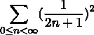

## 2

语句和语法

Python 语法被设计得非常简单。在本章中，我们将通过查看语言中最常用的语句来了解规则。具体的例子可以帮助阐明语言的语法。

我们将首先介绍创建脚本文件的一些基础知识。然后我们将转向查看一些更常用的语句。Python 在语言中只有大约 20 种不同的命令式语句。我们已经在第一章(ch005_split_000.xhtml#x1-170001)中看到了两种语句，即赋值语句和表达式语句。

当我们编写如下内容时：

```py
>>> print("hello world") 

hello world
```

我们实际上执行的是一个只包含函数评估的语句，即 print()。这种类型的语句——评估一个函数或对象的某个方法——是很常见的。

我们已经看到的其他类型的语句是赋值语句。Python 在这方面有很多变体。大多数时候，我们都是将单个值赋给单个变量。当一个函数返回一个元组作为结果时，我们可以解包这个集合，并在单个赋值语句中同时赋值给多个变量。这样做如下：

```py
>>> quotient, remainder = divmod(355, 113)
```

本章中的食谱将探讨 if、while、for、with 和 try 语句。我们还将简要介绍一些更简单的语句，如 pass、break 和 raise。

在后面的章节中，我们将探讨其他语句。以下是一个总结：

|

* * *

|

* * *

|

| 语句 | 章节 |
| --- | --- |

|

* * *

|

* * *

|

| def | 第三章(ch007_split_000.xhtml#x1-1610003) |
| --- | --- |
| return | 第三章(ch007_split_000.xhtml#x1-1610003) |
| import | 第三章(ch007_split_000.xhtml#x1-1610003) |
| del | 第四章(ch008_split_000.xhtml#x1-2240004) |
| class | 第七章(ch011_split_000.xhtml#x1-3760007) |
| match | 第八章(ch012.xhtml#x1-4520008) |
| type | 第十章(ch014.xhtml#x1-57300010) |
| assert | 第十章(ch014.xhtml#x1-57300010) |

|

* * *

|

* * *

|

|  |  |
| --- | --- |

表 2.1：Python 语句和章节

在本章中，我们将探讨以下内容：

+   编写 Python 脚本和模块文件——语法基础

+   编写长行代码

+   包括描述和文档

+   使用 RST 标记编写更好的 docstrings

+   设计复杂的 if...elif 链

+   使用“walrus”运算符保存中间结果

+   避免 break 语句的潜在问题

+   利用异常匹配规则

+   避免 except 子句的潜在问题

+   隐藏异常的根本原因

+   使用 with 语句管理上下文

我们将从宏观的角度开始，即脚本和模块，然后我们将深入到单个语句的细节。

# 2.1 编写 Python 脚本和模块文件 – 语法基础

Python（以及一般编程）的目的是创建涉及数据和处理的自动化解决方案。此外，我们编写的软件是一种知识表示；这意味着清晰性可能是软件最重要的质量方面。

在 Python 中，我们通过创建脚本文件来实现自动化解决方案。这些是 Python 编程的顶级、主要程序。除了主脚本外，我们还可以创建模块（以及模块的包）来帮助将软件组织成智力上可管理的块。脚本是一个模块；然而，它有一个明确的意图，当由操作系统启动时执行有用的处理。

创建清晰、可读的 Python 文件的关键部分是确保我们的代码遵循广泛采用的约定。

例如，我们需要确保将文件以 UTF-8 编码保存。虽然 Python 仍然支持 ASCII 编码，但它对于现代编程来说是一个较差的选择。我们还需要确保我们的编辑器使用空格而不是制表符。这通常是编程编辑器中的一个配置设置。使用 Unix 换行符也有助于可移植性。

## 2.1.1 准备工作

为了编辑 Python 脚本，我们需要一个好的编程编辑器。几乎不可能只推荐一个。所以我们将推荐几个。

JetBrains PyCharm 编辑器具有许多功能。社区版是免费的。请参阅[`www.jetbrains.com/pycharm/download/`](https://www.jetbrains.com/pycharm/download/)。

ActiveState 的 Komodo IDE 非常复杂。Komodo Edit 版本是免费的，并且与完整的 Komodo IDE 做了一些相同的事情。请参阅[`komodoide.com/komodo-edit/`](http://komodoide.com/komodo-edit/)。

Notepad++非常适合 Windows 开发者。请参阅[`notepad-plus-plus.org`](https://notepad-plus-plus.org)。

BBEdit 非常适合 macOS X 开发者。请参阅[`www.barebones.com/products/bbedit/`](http://www.barebones.com/products/bbedit/)。Sublime 在 macOS X 上也很受欢迎。请参阅[`www.sublimetext.com`](https://www.sublimetext.com)。

对于 Linux 开发者，有几个内置的编辑器，包括 Vim 和 gedit。由于 Linux 倾向于偏向开发者，因此可用的编辑器都适合编写 Python。

在工作时有两个窗口打开是有帮助的：

+   一个编辑器来创建最终的脚本或模块文件。

+   一个带有 Python 的>>>提示符的终端会话，我们可以尝试一些事情来看看哪些可行，哪些不可行。

大多数编辑器都识别.py 扩展名，并根据[PEP-8](https://peps.python.org/pep-0008/)提供适当的格式化。这通常包括以下内容：

+   文件编码应该是 UTF-8。

+   缩进应该是四个空格。

+   我们希望键盘上的 Tab 键插入空格而不是制表符，\t。

一旦配置了编辑器，我们就可以编写一个其他人可以轻松使用或扩展的脚本文件。

## 2.1.2 如何做到...

这是创建脚本文件的方法：

1.  大多数 Python 脚本文件的第一行看起来像这样：

    ```py
    #!/usr/bin/env python3
    ```

    这在您正在编写的文件和 Python 之间设置了一个关联。如果文件的权限设置为可执行，并且目录在 OS PATH 列表中，那么脚本将是一个一等应用，就像任何内置命令一样可用。

    对于 Windows，文件名到程序的关联是通过默认程序控制面板中的一个设置完成的。找到设置关联的面板，并确保 .py 文件绑定到 Python 程序。这通常由安装程序设置，我们很少需要更改它或手动设置它。

1.  在前言之后，惯例建议我们包括一个三引号文本块。这是我们即将创建的文件的文档字符串（称为 docstring）：

    ```py
    """ 

    A summary of this script. 

    """
    ```

    由于 Python 的三引号字符串可以无限长，请随意写尽可能多的内容。这应该是描述脚本或库模块的主要工具。这甚至可以包括如何工作的示例。

1.  现在是脚本的有趣部分：真正做事情的这部分。我们可以编写完成工作所需的所有语句。目前，我们将使用它作为占位符：

    ```py
    print(’hello world’)
    ```

    这并不多，但至少脚本做了些事情。创建函数和类定义，以及编写使用函数和类做事情的语句是很常见的。

对于我们的第一个简单脚本，所有的语句都必须从左边界开始，并且必须在单行内完成。Python 中有许多语句包含嵌套的语句块。这些内部语句块将被缩进来明确它们的范围。通常——因为我们把缩进设置为四个空格——我们可以按 Tab 键来正确地缩进代码。

我们文件应该看起来像这样：

```py
#!/usr/bin/env python3 

""" 

My First Script: Calculate an important value. 

""" 

print(355 / 113)
```

## 2.1.3 它是如何工作的...

与其他语言不同，Python 中几乎没有样板代码。只有一行开销，甚至 #!/usr/bin/env python3 行通常是可选的。

为什么我们要将编码设置为 UTF-8？虽然该语言最初是为了仅使用原始的 128 个 ASCII 字符而设计的，但我们经常发现 ASCII 是有限的。如果我们以 UTF-8 格式保存文件，这是合法的 Python：

```py
 = 355/113 

print()
```

在 Python 中选择空格和制表符时保持一致性很重要。它们都是或多或少不可见的，混合使用它们很容易在尝试运行脚本时出错。建议使用空格。

初始的#!行是一个注释。因为这两个字符有时被称为 sharp 和 bang，所以组合被称为“shebang”。#和行尾之间的所有内容都被忽略。Linux 加载器（一个名为 execve 的程序）查看文件的第一个几个字节以确定文件内容。这些第一个几个字节有时被称为 magic bytes，因为加载器的行为看起来很神奇。当存在时，这个由#!组成的两字符序列后面跟着处理文件中其余数据的程序的路径。我们更喜欢使用/usr/bin/env 为我们启动 Python 程序。我们可以利用 env 程序来设置 Python 特定的环境变量。

## 2.1.4 更多内容...

Python 标准库文档部分来源于模块文件中存在的文档字符串。在模块、包和脚本中编写复杂的 docstrings 是常见做法。有像 pydoc 和 Sphinx 这样的工具可以将模块 docstrings 重新格式化为优雅的文档。我们将在使用 RST 标记编写更好的 docstrings 的菜谱中查看这一点，以及第十七章中的使用 Sphinx autodoc 创建 API 参考的菜谱。

此外，单元测试用例可以包含在 docstrings 中。像 doctest 这样的工具可以从文档字符串中提取示例并执行代码，以查看文档中的答案是否与运行代码找到的答案匹配。这是第十五章中许多菜谱的主题。本书中的许多示例都经过 doctest 验证。

三引号文档字符串比#注释更受欢迎。虽然#和行尾之间的所有文本都被忽略，但这仅限于单行；传统做法是尽量少用。docstring 可以是不定长度的；它们被广泛使用。

有时还会包含一些额外的开销。Vim 和 gedit 编辑器允许我们在文件中保留编辑偏好。这被称为 modeline。以下是一个典型的 modeline，对 Python 很有用：

```py
# vim: tabstop=8 expandtab shiftwidth=4 softtabstop=4
```

这确保任何制表符字符都将转换为八个空格；当我们按下 Tab 键时，我们将移动四个空格。这被广泛使用，因为传统上制表符字符缩进八个空格，这种替换很可能创建正确的缩进。这个设置嵌入在代码中；我们不需要对 Vim 进行任何设置来将这些设置应用到我们的 Python 脚本文件中。

## 2.1.5 参考阅读

+   我们将在包括描述和文档和使用 RST 标记编写更好的 docstrings 的菜谱中查看如何编写有用的文档字符串。

+   关于建议的样式更多信息，请参阅[PEP-8](https://www.python.org/dev/peps/pep-0008/)。

# 2.2 编写长行代码

有很多次我们需要编写非常长的代码行，以至于很难阅读。很多人喜欢将代码行的长度限制在 80 个字符或更少。图形设计的一个众所周知的原则是，较窄的文本区域更容易阅读。有关行宽和可读性的更深入讨论，请参阅 [`webtypography.net/2.1.2`](http://webtypography.net/2.1.2)。

尽管每行字符较少对眼睛更友好，但我们的代码可能会拒绝遵守这个原则。我们如何将长 Python 语句拆分成更易管理的部分？

## 2.2.1 准备工作

假设我们有一些像这样的事情：

```py
>>> import math
>>> example_value = (63/25) * (17+15*math.sqrt(5)) / (7+15*math.sqrt(5))
>>> mantissa_fraction, exponent = math.frexp(example_value)
>>> mantissa_whole = int(mantissa_fraction*2**53)
>>> message_text = f’the internal representation is {mantissa_whole:d}/2**53*2**{exponent:d}’
>>> print(message_text) 

the internal representation is 7074237752514592/2**53*2**2
```

这段代码包含一个长公式和一个长格式字符串，我们将值注入其中。当在书中排版时，这看起来很糟糕；f-string 行可能被错误地断行。当尝试编辑此脚本时，它可能看起来很糟糕。（有关 f-string 的更多信息，请参阅第一章的 构建复杂的字符串与 f-string）。 

我们不能随意将 Python 语句拆分成块。语法规则明确指出，一个语句必须在单个逻辑行上完整。

“逻辑行”这个术语为我们提供了如何继续进行的线索。Python 在逻辑行和物理行之间做出了区分；我们将利用这些语法规则来拆分长语句。

## 2.2.2 如何操作...

Python 给我们提供了几种方法来包装长语句，使它们更易读：

+   我们可以在一行的末尾使用 \ 来将逻辑行延续到下一物理行。虽然这总是可行的，但有时候很难找到 \。

+   Python 有一个规则，即一个语句可以跨越多个逻辑行，因为括号、方括号和花括号必须平衡。此外，我们还可以利用 Python 自动连接相邻字符串字面量以形成一个较长的字符串字面量的方式：("a" "b") 与 "ab" 相同。

+   在某些情况下，我们可以通过将中间结果分配给不同的变量来将一个语句分解成多个语句。

我们将在这份食谱的单独部分逐一查看这些内容。

### 使用反斜杠将长语句拆分为逻辑行

1.  如果有有意义的断行，插入 \ 来分隔语句：

    ```py
    >>> message_text = f’the internal representation is \ 

    ... {mantissa_whole:d}/2**53*2**{exponent:d}’
    ```

为了使这可行，\ 必须是行的最后一个字符。反斜杠后面的额外空格很难看到；需要一些小心。PEP-8 [`www.python.org/dev/peps/pep-0008/`](https://www.python.org/dev/peps/pep-0008/) 建议提供了格式化指南，并倾向于不鼓励这种技术。

尽管这有点难以看清，但 \ 总是可以使用的。把它看作是使代码行更易读的最后一招。

### 使用括号将长语句拆分成合理的部分

1.  即使令人困惑，也要将整个语句写在一行上：

    ```py
    >>> import math  >>> example_value1 = (63/25) * (17+15*math.sqrt(5)) / (7+15*math.sqrt(5))
    ```

    添加额外的括号，这些括号不会改变值，但允许将表达式拆分成多行：

    ```py
    >>> example_value2 = (63/25) * ( (17+15*math.sqrt(5)) / (7+15*math.sqrt(5)) )  >>> example_value2 == example_value1 

    True
    ```

1.  在括号内断行：

    ```py
    >>> example_value3 = (63/25) * ( 

    ...     (17+15*math.sqrt(5)) 

    ...     / (7+15*math.sqrt(5)) 

    ... ) 

    >>> example_value3 == example_value1 

    True
    ```

匹配()字符的技术非常强大，并且可以在许多情况下工作。这被广泛使用，并且强烈推荐。

我们几乎总是可以找到一种方法在语句中添加额外的()字符。在极少数情况下，当我们不能添加()字符时，我们可以退回到使用\来将语句分成几个部分。

### 使用字符串字面量连接

我们可以将()字符与另一个规则结合起来，该规则连接相邻的字符串字面量。这对于长而复杂的格式字符串特别有效：

1.  将长字符串值包裹在()字符中。

1.  将字符串分解成有意义的子字符串：

    ```py
    >>> message_text = ( 

    ... f’the internal representation ’ 

    ... f’is {mantissa_whole:d}/2**53*2**{exponent:d}’ 

    ... ) 

    >>> message_text 

    ’the internal representation is 7074237752514592/2**53*2**2’
    ```

我们总是可以将长字符串字面量分解成相邻的部分。然后我们可以使用我们需要的物理行断行。对于字符串字面量值，不需要显式运算符。

### 将中间结果分配给单独的变量

这里是这个技术的背景：

```py
>>> import math
>>> example_value = (63/25) * (17+15*math.sqrt(5)) / (7+15*math.sqrt(5)) 
```

我们可以将这个表达式分解成三个中间值：

1.  在整体表达式中识别子表达式。将这些分配给变量：

    ```py
    >>> a = (63/25) 

    >>> b = (17+15*math.sqrt(5)) 

    >>> c = (7+15*math.sqrt(5))
    ```

1.  用创建的变量替换子表达式：

    ```py
    >>> example_value = a * b / c
    ```

我们总是可以将子表达式分配给变量，并在子表达式被使用的地方使用该变量。15*sqrt(5)的乘积被重复；这也是重构表达式的良好候选。

我们没有给出这些变量有描述性的名称。在某些情况下，子表达式有一些语义，我们可以用有意义的名称来捕捉。

## 2.2.3 它是如何工作的...

Python 语言手册在逻辑行和物理行之间做出了区分。一个逻辑行包含一个完整的语句。它可以通过称为行连接的技术跨越多个物理行。手册确定了两种技术：显式行连接和隐式行连接。

使用\进行显式行连接有时是有帮助的。因为它很容易被忽视，所以通常不鼓励这样做。[PEP-8](https://www.python.org/dev/peps/pep-0008/)建议这应该是最后的手段。

在许多情况下可以使用()进行隐式行连接。它通常与表达式的结构在语义上相匹配，因此是鼓励的。

## 2.2.4 更多...

表达式在许多 Python 语句中被广泛使用。任何表达式都可以添加()字符。这给了我们很多灵活性。

然而，有几个地方我们可能有一个长的语句，它并不特别涉及长的表达式。最显著的例子是导入语句——它可以变得很长，但并不使用任何表达式。尽管没有适当的表达式，但它确实仍然允许使用()。以下示例显示我们可以围绕一个非常长的导入名称列表：

```py
>>> from math import ( 

...     sin, cos, tan, 

...     sqrt, log, frexp)
```

虽然()字符绝对不是表达式的一部分，但它们是可用的语法的一部分，有助于使语句更易于阅读。

## 2.2.5 参见

+   隐式行连接也适用于匹配的[]和{}字符。这些适用于我们在第四章中将要查看的集合数据结构。

# 2.3 包含描述和文档

当我们有一个有用的脚本时，我们经常需要为自己和其他人留下关于它做什么、如何解决某些特定问题以及何时应该使用的笔记。这个配方包含一个建议的大纲，以帮助使文档合理完整。

## 2.3.1 准备工作

如果我们使用了编写 Python 脚本和模块文件 – 语法基础配方来开始脚本文件，我们将有一个小的文档字符串。我们将在这个配方中扩展这个文档字符串。

在其他地方也应该使用文档字符串。我们将在第三章和第七章中查看这些附加位置。

我们将编写总结文档字符串的两种通用类型的模块：

+   库模块：这些文件将主要包含函数定义以及类定义。文档字符串摘要应侧重于模块中的定义，描述模块是什么。文档字符串可以提供使用模块中定义的函数和类的示例。在第三章和第七章中，我们将更详细地查看这些模块。

+   脚本：这些是我们通常期望会执行一些实际工作的文件。文档字符串应该描述模块的功能和使用方法。选项、环境变量和配置文件是文档字符串的重要组成部分。

我们有时会创建包含两者一部分的文件。这需要在行动和存在之间保持适当的平衡。

## 2.3.2 如何操作...

编写文档的第一步对库模块和脚本都是相同的：

1.  简要总结脚本或模块是什么或做什么。总结不需要深入挖掘其工作原理。就像报纸文章的开头一样，它介绍了模块的谁、什么、何时、何地、如何和为什么。细节将在文档字符串的主体中跟随。

这有助于避免像“此脚本”这样的不必要的短语。我们可能以这样的方式开始模块的文档字符串：

```py
""" 

Downloads and decodes the current Special Marine Warning (SMW) 

for the area ’AKQ’. 

"""
```

我们将根据模块的一般重点来区分其他步骤。

### 为脚本编写文档字符串

当我们记录脚本时，我们需要关注将使用脚本的人的需求。

1.  按照前面所示开始，创建一个总结句。

1.  为文档字符串的其余部分草拟一个大纲。我们将使用 ReStructuredText（RST）标记。在一行上写上主题，然后在主题下方写一行=，使其成为合适的标题。记住，在每个主题之间留一个空行。

    主题可能包括：

    +   概要：如何运行此脚本的摘要。如果脚本使用 argparse 模块处理命令行参数，argparse 生成的帮助文本是理想的概要文本。其他可安装的工具，如 click 或 invoke，也可以生成优雅的概要文本。（参见第六章中的使用 argparse 获取命令行输入）

    +   描述：解释此脚本的功能。

    +   选项：这提供了所有参数和选项的详细信息。（参见第六章中的使用 argparse 获取命令行输入）

    +   环境：这提供了描述环境变量及其含义的地方。（参见第六章中的使用 OS 环境设置）

    +   文件：脚本创建或读取的文件名是非常重要的信息。

    +   示例：一些使用脚本的示例总是很有帮助。在某些情况下，这可能是用户唯一会阅读的部分。

    +   参见：任何相关的脚本或背景信息。

    其他可能有趣的主题包括退出状态、作者、错误、报告错误、历史或版权。在某些情况下，例如报告错误的建议可能并不真正属于模块的文档字符串，而更可能位于项目的 GitHub 或 SourceForge 页面的其他地方。

1.  在每个主题下填写详细信息。准确性很重要。由于文档与代码位于同一文件中，因此更容易做到正确、完整和一致。

这里是一个脚本的文档字符串示例：

```py
""" 

Downloads and decodes the current Special Marine Warning (SMW) 

for the area \textquotesingle AKQ\textquotesingle{} 

SYNOPSIS 

======== 

:: 

    python3 akq_weather.py 

DESCRIPTION 

=========== 

Downloads the Special Marine Warnings 

Files 

===== 

Writes a file, ’’AKW.html’’. 

EXAMPLES 

======== 

Here’s an example:: 

    slott\$ python3 akq_weather.py 

    None issued by this office recently.
```

在概要部分，我们使用了 :: 作为独立的段落。在示例部分，我们在段落的末尾使用了 ::。这两种版本都是对 RST 处理工具的提示，表明接下来的缩进部分应该被格式化为代码。参见第十七章，文档和风格。

### 为库模块编写文档字符串

当我们记录库模块时，我们需要关注将导入模块以在他们的代码中使用程序员的需需求：

1.  为文档字符串的其余部分绘制一个大纲。我们将使用 RST 标记。在一行上写下主题。在每个主题下方包括一行等号字符，以将主题转换为适当的标题。请记住，在每段之间留一个空行。

1.  按照之前所示开始，创建一个总结句子：

    +   描述：模块内容的摘要以及为什么模块是有用的

    +   模块内容：在此模块中定义的类和函数

    +   示例：使用此模块的示例

1.  为每个主题填写详细信息。模块内容可能是一长串类或函数定义的列表。文档字符串应该是一个摘要。在每个类或函数中，我们将有一个单独的文档字符串，其中包含该项目的详细信息。

## 2.3.3 它是如何工作的...

几十年来，man 页面大纲已经发展成为一个包含 Linux 命令完整描述的工具。这种编写文档的通用方法已被证明是有用且具有弹性的。我们可以利用大量的经验，并使我们的文档结构遵循 man 页面模型。

我们想要准备模块文档字符串，这些文档字符串可以被 Sphinx Python 文档生成器使用（参见 [`www.sphinx-doc.org/en/stable/`](http://www.sphinx-doc.org/en/stable/)）。这是用于生成 Python 文档文件的工具。Sphinx 中的 autodoc 扩展会读取我们模块、类和函数上的文档字符串标题，以生成最终看起来像 Python 生态系统中的其他模块的文档。

## 2.3.4 更多内容...

RST 标记具有简单、中心的语法规则：段落由空白行分隔。

这条规则使得编写可以被各种 RST 处理工具检查并重新格式化以看起来很棒的文档变得容易。

编写好的软件文档可能具有挑战性。信息不足和重复代码中明显细节的文档之间存在很大的鸿沟。

重要的是要关注那些对软件或其工作方式不太了解的人的需求，但他们可以阅读 Python 代码。为这样的半知识用户提供他们需要的信息，以便理解软件的功能和使用方法。

## 2.3.5 参考信息

+   我们在 使用 RST 标记编写更好的文档字符串 中探讨了额外的技术。

+   如果我们使用了 编写 Python 脚本和模块文件 – 语法基础 的配方，我们将在脚本文件中放置一个文档字符串。当我们构建第三章 3 中的函数和第七章 7 中的类时，我们将查看其他可以放置文档字符串的地方。

+   更多关于 Sphinx 的信息，请参见 [`www.sphinx-doc.org/en/stable/`](http://www.sphinx-doc.org/en/stable/)。

+   更多关于 man 页面大纲的背景信息，请参见 [`en.wikipedia.org/wiki/Man_page`](https://en.wikipedia.org/wiki/Man_page)。

# 2.4 使用 RST 标记编写更好的文档字符串

当我们有一个有用的脚本时，我们经常需要留下关于它做什么、如何工作以及何时应该使用的笔记。包括 Docutils 在内的许多生成文档的工具都与 RST 标记一起工作。这允许我们编写纯文本文档。它可以包括一些特殊标点符号，以选择粗体或斜体字体变体来强调细节。此外，RST 允许通过列表和章节标题来组织内容。

## 2.4.1 准备工作

在 包含描述和文档 的配方中，我们探讨了将一些基本文档放入模块中。我们将查看一些 RST 格式化规则，用于创建可读的文档。

## 2.4.2 如何做...

1.  从关键点的概述开始，创建 RST 部分标题以组织材料。一个部分标题有一行标题，后面跟着一行与标题长度相等的下划线字符，使用 =、-、^、~。

    一个标题看起来像这样：

    ```py
    Topic 

    =====
    ```

    标题文本在一行，下划线字符在下一行。这必须被空白行包围。下划线字符可以多于标题字符，但决不能少于。

    RST 工具将推断我们选择的下划线字符的使用模式。只要下划线字符使用一致，docutil 工具就能检测文档的结构。

    在开始时，有一个明确的标题下划线标准可能会有所帮助：

    |

    * * *

    |

    * * *

    |

    | 字符 | 级别 |
    | --- | --- |

    |

    * * *

    |

    * * *

    |

    | = | 1 |
    | --- | --- |
    | - | 2 |
    | ^ | 3 |
    | ~ | 4 |

    |

    * * *

    |

    * * *

    |

    |  |  |
    | --- | --- |

1.  填写各种段落。段落（包括部分标题）至少由一个空行分隔。

1.  如果编程编辑器有拼写检查器，请使用它。这样做可能会很令人沮丧，因为代码示例通常包含拼写检查失败的缩写。

## 2.4.3 它是如何工作的...

Docutils 转换程序将检查文档，寻找部分和主体元素。部分通过标题识别。下划线用于将部分组织成适当的嵌套层次结构。

一个正确嵌套的文档可能具有以下下划线字符序列：

```py
TITLE 

===== 

SOMETHING 

---------- 

MORE 

^^^^^ 

EXTRA 

^^^^^ 

LEVEL 2 

------- 

LEVEL 3 

^^^^^^^^
```

当从文档创建 HTML 文件时，它将具有 <h1>、<h2> 和 <h3> 标签以表示不同级别。创建 LaTeX 文件需要一些额外的配置选择，但常见的文章模板意味着生成的文档将使用 \section、\subsection 和 \subsubsection 标题。当我们写作时，这些最终的表现选择并不是我们的主要关注点；最重要的是使用适当的下划线来反映所需的组织结构。

RST 解析器可以识别几种不同的主体元素。我们已经展示了几个。更完整的列表包括：

+   文本段落：这些可能使用内联标记来表示不同类型的强调或突出显示。

+   文本块：这些通过 :: 引入，并缩进四个空格。它们也可以通过 .. parsed-literal:: 指令引入。doctest 块缩进四个空格，并包含 Python >>> 提示符。

+   列表、表格和块引用：我们稍后会讨论这些。这些可以包含其他主体元素。

+   脚注：这些是特殊的段落。在渲染时，它们可能显示在页面底部或部分末尾。它们也可以包含其他主体元素。

+   超链接目标、替换定义和 RST 注释：这些是更专业的文本项，我们在这里不会详细讨论。

## 2.4.4 更多内容...

在包含描述和文档的食谱中，我们查看了几种不同的主体元素，我们可能会使用：

+   文本段落：这是一个由空白行包围的文本块。在这些段落中，我们可以使用内联标记来强调单词或短语。我们将在使用 RST 标记编写更好的 docstrings 菜谱中查看内联标记。

+   列表：这些段落以看起来像数字或项目符号的东西开始。我们可能会有这样的段落。

    ```py
    It helps to have bullets because: 

    -  They can help clarify 

    -  They can help organize
    ```

    行首可以使用其他字符，但 - 和 * 似乎是最常见的选项。

+   编号列表：存在多种可识别的模式。这包括以数字或字母开头，后跟 . 或 )。使用 # 而不是数字或字母将延续前一段落的值。

+   文字块：代码示例以纯文本形式呈现，不寻找 RST 元素。此文本必须缩进。一个方便的前缀是 ::。也可以使用 .. code-block:: 指令。

+   指令：指令通常看起来像 .. directive::。它可能有一些内容，这些内容缩进以包含在指令内。它可能看起来像这样：

    ```py
    ..  important:: 

        Do not flip the bozo bit.
    ```

    .. important:: 文本是指令。这后面跟着指令内的缩进文本。

### 使用指令

Docutils 有几个内置指令。Sphinx 工具添加了大量具有各种功能的额外指令。

最常用的指令之一是警告：注意、警告、危险、错误、提示、重要、注意、技巧、警告和通用警告。这些是复合体元素，因为它们内部有嵌套文本。上面，我们提供了一个重要警告的例子。

### 使用内联标记

在一个段落中，我们有几种内联标记可以使用：

+   我们可以用 * 将单词或短语包围起来以实现 *强调*。这通常以斜体形式排版。

+   我们可以用 ** 将单词或短语包围起来以实现 **强烈**强调。这通常以粗体形式排版。

+   我们用单反引号 `‘` 将引用包围起来，链接后跟下划线 `_. 我们可能使用 `‘section title‘_` 来引用文档中的特定部分。我们通常不需要在 URL 周围放置任何标记。Docutils 工具可以识别这些。有时我们希望显示一个单词或短语，而隐藏 URL。我们可以使用这个：`‘the \textbf{Sphinx} documentation <http://www.sphinx-doc.org/en/stable/>‘_`。

+   我们可以用双反引号 `‘‘` 将与代码相关的单词包围起来，使它们看起来像 `‘‘代码‘‘`。这将作为代码排版。

此外，还有一种更通用的技术称为角色。角色以 :word: 作为角色名称开始，后跟单引号 `‘` 中的适用单词或短语。一个文本角色看起来像这样：:strong:‘this‘。

有许多标准角色名称，包括 :emphasis:、:literal:、:code:、:math:、:pep-reference:、:rfc-reference:、:strong:、:subscript:、:superscript: 和 :title-reference:。其中一些也可以使用更简单的标记，如 *emphasis* 或 **strong**。

此外，我们可以使用指令定义新的角色。如果我们想进行非常复杂的处理，我们可以为 Docutils 工具提供处理新角色的类定义。这允许我们调整文档的处理方式。

## 2.4.5 参考信息

+   关于 RST 语法的更多信息，请参阅[`docutils.sourceforge.net`](http://docutils.sourceforge.net)。这包括对 Docutils 工具的描述。

+   关于 Sphinx Python 文档生成器的信息，请参阅[`www.sphinx-doc.org/en/stable/`](http://www.sphinx-doc.org/en/stable/)。

# 2.5 设计复杂的 if...elif 链

在大多数情况下，我们的脚本将涉及许多选择。有时选择很简单，我们可以通过查看代码来判断设计的质量。在其他情况下，选择更复杂，很难确定我们的 if 语句是否设计得当，能够处理所有条件。

在最简单的情况下，我们有一个条件 C 及其逆否¬C。这是 if...else 语句的两个条件。一个条件 C 在 if 子句中声明；逆否条件¬C 在 else 子句中隐含。

这遵循排中律：我们声称在两个条件 C 和¬C 之间没有缺失的替代方案。然而，对于复杂条件，这可能很难可视化。

如果我们有类似以下的情况：

```py
 if weather == Weather.RAIN and plan == Plan.GO_OUT: 

    bring("umbrella") 

else: 

    bring("sunglasses")
```

这可能一开始并不明显，但我们已经省略了许多可能的替代方案。天气和计划变量有四种不同的值组合。其中一种条件是明确声明的，其他三种则是假设的：

+   weather == RAIN and plan == GO_OUT。带伞似乎是正确的。

+   weather != RAIN and plan == GO_OUT。带太阳镜似乎是合适的。

+   weather == RAIN and plan != GO_OUT。如果我们待在家里，那么似乎没有哪个附加物品是合适的。

+   weather != RAIN and plan != GO_OUT。如果我们不出门，附加问题似乎就无关紧要了。

我们如何确保我们没有遗漏任何东西？我们如何确保我们没有将太多东西合并到一个假设的条件中，而不是明确声明？

## 2.5.1 准备工作

让我们来看一个 if...elif 链的具体例子。在骰子游戏 Craps 中，有一些规则适用于两个骰子的投掷。这些规则适用于游戏的第一次投掷，称为开场投掷：

+   2, 3, 或 12 是 Craps，对于大多数赌注来说，这是输。

+   7 或 11 是大多数赌注的赢家。

+   剩余的数字确定一个点。掷骰子将继续根据另一组规则进行。

我们将使用这组三个条件作为例子来查看这个食谱，因为它包含一个可能含糊不清的条款。

## 2.5.2 如何做到...

当我们编写 if 语句时，即使它看起来很 trivial，我们也需要确保所有条件都已涵盖。

1.  列举我们已知的条件。在我们的例子中，我们有三个规则：（2, 3, 12）规则，（7, 11）规则，以及“剩余的数字”的模糊陈述。这可以形成一个 if 语句的第一稿。

1.  确定所有可能选择的全集。对于这个例子，有 11 种可能的结果：从 2 到 12 的数字，包括 2 和 12。

1.  将各种 if 和 elif 条件 C 与选择的全集 U 进行比较。存在三种可能的设计模式：

    +   在代码中，我们有的 if 条件比选择的全集 C ⊂ U 中的可能条件要多。最常见的原因是未能完全列举宇宙中所有可能的选择。例如，我们可能用 0 到 5 而不是 1 到 6 来模拟骰子。选择的全集看起来是从 0 到 10 的值，但实际上有针对 11 和 12 的条件。

    +   我们代码中的条件有间隙，U ∖ C≠∅。宇宙中未明确声明的 if 条件的选择的最常见原因是未能完全理解代码中的条件。例如，我们可能将值列举为两个元组而不是总和。2、3 和 12 由一对数字定义，包括（1, 1）、（1, 2）和（6, 6）。可能会忽略条件（2, 1），使得 if 语句的任何子句都没有对其进行测试。

    +   我们可以证明代码中表达的条件与选择的全集 U 之间有匹配，即 U ≡ C。这是理想的。所有可能选择的全集与语句的 if 和 elif 子句中的所有条件相匹配。

在这个例子中，列举所有可能的选择很容易。在其他情况下，可能需要一些仔细的推理来理解任何间隙或遗漏。

在这个例子中，我们有一个模糊的术语，剩余的数字，我们可以用值列表（4, 5, 6, 8, 9, 10）来替换。提供列表可以消除任何可能的间隙和疑问。

当恰好有两个选择时，我们可以为其中一个选择编写条件表达式。另一个条件可以隐含；if 和 else 将工作。

当我们有超过两个选择时，我们可以使用这个方法来编写一系列的 if 和 elif 语句，每个选择一个语句：

1.  编写一个涵盖所有已知选择的 if ... elif ... elif 链。对于我们的例子，它可能开始如下：

    ```py
     dice = die_1 + die_2 

    if dice in (2, 3, 12): 

        game.craps() 

    elif dice in (7, 11): 

        game.winner() 

    elif dice in (4, 5, 6, 8, 9, 10): 

        game.point(dice) 
    ```

1.  添加一个引发异常的 else 子句，如下所示：

    ```py
     else: 

        raise Exception(’Design Problem’)
    ```

这个额外的 else 为我们提供了一种方法来正确定位逻辑问题时。我们可以确信，我们做出的任何设计错误在程序运行时都会导致一个明显的问题。理想情况下，我们将在单元测试期间发现任何问题。

在这种情况下，很明显，所有 11 个选择都被 if 语句的条件所覆盖。额外的 else 永远不会被使用。并非所有现实世界的问题都有这种简单的方法来证明所有选择都被条件所覆盖。这有助于提供一个嘈杂的故障模式。

## 2.5.3 它是如何工作的...

我们的目的是确保我们的程序可靠地工作。虽然测试有帮助，但在设计和创建测试用例时，我们仍然可能做出错误的假设。

虽然严格的逻辑是必不可少的，但我们仍然可能犯错。此外，进行普通软件维护的人可能会引入错误。向复杂 if 语句中添加新功能可能是问题的潜在来源。

这种 Else-Raise 设计模式迫使我们对每个条件都进行明确说明。没有任何假设。正如我们之前提到的，如果异常被抛出，我们逻辑中的任何错误都将被揭露。

在设计问题时，通过异常崩溃是一种合理的行为。虽然另一种选择是将消息写入错误日志，但具有这种深刻设计缺陷的程序应被视为致命损坏。

## 2.5.4 更多内容...

在许多情况下，我们可以通过检查程序处理过程中的某个点的期望后置条件来推导出 if...elif...elif 链。例如，我们可能需要一个语句来建立类似于 m 等于 a 或 b 中较大的数。

（为了处理逻辑，我们将避免使用 Python 的便捷的 m = max(a, b)，并关注我们如何从排他性选择中计算结果。）

我们可以像这样形式化最终条件：


我们可以通过将目标写成断言语句来从这个最终条件反向工作：

```py
# do something 

assert (m == a or m == b) and m >= a and m >= b
```

一旦我们明确了目标，我们就可以识别出导致该目标实现的语句。显然，像 m = a 或 m = b 这样的赋值语句是合适的，但每个都只在有限条件下有效。

我们可以推导出这些语句应该使用的前提条件。赋值语句的前提条件将用 if 和 elif 表达式编写。

当 a >= b 时，我们需要使用语句 m = a。同样，当 b >= a 时，我们需要使用语句 m = b。将逻辑重新排列成代码，我们得到如下：

```py
if a >= b: 

    m = a 

elif b >= a: 

    m = b 

else: 

    raise Exception(’Design Problem’) 

assert (m == a or m == b) and m >= a and m >= b
```

注意，我们的条件集合 U = {a ≥ b, b ≥ a}是完整的；没有其他可能的关系。此外，请注意，在 a = b 的边缘情况下，我们实际上并不关心使用哪个赋值语句。Python 将按顺序处理决策，并执行 m = a。这种选择的一致性不应该对我们的 if...elif...elif 链的设计有任何影响。我们可以不考虑子句的评估顺序来设计条件。

## 2.5.5 参见

+   这与“悬挂 else”的语法问题有些相似。参见[`docs.oracle.com/javase/specs/jls/se9/html/jls-14.html`](https://docs.oracle.com/javase/specs/jls/se9/html/jls-14.html)。

    这不是同一个问题；Python 的缩进消除了“悬挂 else”语法问题。这是一个相邻的语义问题，试图确保在复杂的 if...elif...elif 链中所有条件都得到适当考虑。

# 2.6 使用 := “walrus” 运算符保存中间结果

有时候我们会遇到一个复杂的情况，需要保留一个昂贵的中间结果以供后续使用。想象一下一个涉及复杂计算的条件；计算的成本很高，以时间、输入输出操作、内存资源或三者兼而有之来衡量。

一个例子是使用正则表达式（re）包进行重复搜索。match()方法可以在返回 Match 对象或 None 对象（表示没有找到模式）之前进行相当多的计算。一旦这个计算完成，我们可能需要使用这个结果，并且我们绝对不希望再次进行计算。通常，最初的使用是简单地检查结果是否是 Match 对象或 None。

这是一个可以给表达式的值命名并也在 if 语句中使用表达式的例子。我们将探讨如何使用“赋值表达式”或“walrus”操作符。它被称为 walrus，因为赋值表达式操作符 := 对某些人来说看起来像海象的脸。

## 2.6.1 准备工作

这里有一个求和示例，最终每个项都变得如此之小，以至于继续将其加到总和中已经没有意义了：



实际上，这类似于以下求和函数：

```py
>>> s = sum((1 / (2 * n + 1)) ** 2 for n in range(0, 20_000))
```

不清楚的是需要多少项的问题。在示例中，我们求和了 20,000 个值。但如果 16,000 个就足以提供一个准确的答案呢？

我们不想编写这样的求和：

```py
>>> b = 0 

>>> for n in range(0, 20_000): 

...     if (1 / ( 2 * n + 1)) ** 2 >= 0.000_000_001: 

...         b = b + (1 / (2 * n + 1)) ** 2
```

这个例子重复了一个昂贵的计算，(1/(2*n+1))**2。我们可以通过使用 walrus 操作符来避免包含这种浪费时间开销的处理。

## 2.6.2 如何做...

1.  首先，我们隔离一个昂贵的操作，它是条件测试的一部分。在这个例子中，变量 term 用于保存昂贵的计算结果：

    ```py
    >>> p = 0 

    >>> for n in range(0, 20_000): 

    ...     term = (1 / (2 * n + 1)) ** 2 

    ...     if term >= 0.000_000_001: 

    ...         p = p + term
    ```

1.  将赋值语句重写为使用 := 赋值操作符。这取代了 if 语句的简单条件。

1.  添加一个 else 条件以跳出 for 语句，如果不再需要更多项的话。以下是这两个步骤的结果：

    ```py
    >>> q = 0 

    >>> for n in range(0, 20_000): 

    ...     if (term := (1 / (2 * n + 1)) ** 2) >= 0.000_000_001: 

    ...         q = q + term 

    ...     else: 

    ...         break
    ```

    注意，我们改变了求和变量。在食谱的先前的步骤中，它是 p。在这个步骤中，它是 q。这允许我们轻松地进行并排比较，以确保结果仍然是正确的。

赋值表达式 := 允许我们在 if 语句中做两件事。

## 2.6.3 它是如何工作的...

赋值表达式操作符 := 保存了一个中间结果。操作符的结果值与右侧操作数相同。这意味着表达式 a + (b := c+d) 与表达式 a+(c+d) 相同。表达式 a + (b := c+d) 与表达式 a+(c+d) 之间的区别在于在评估过程中设置 b 变量值的副作用。

赋值表达式可以在 Python 中几乎任何允许表达式的地方使用。最常见的情况是 if 语句。另一个好主意是放在 while 条件中。

它在几个地方也是被禁止的。它们不能用作表达式语句中的运算符。我们特别禁止将:=2 写为一个语句：这里有一个完美的赋值语句用于此目的，而赋值表达式，虽然意图相似，但可能存在混淆。

## 2.6.4 更多内容...

我们可以对前面这个菜谱中展示的无限求和示例进行一些优化。使用 for 语句和 range()对象看起来很简单。问题是，我们希望提前结束 for 语句——当被加的项非常小，对最终总和没有显著变化时。

我们可以将提前退出与项计算结合起来：

```py
 >>> r = 0 

>>> n = 0 

>>> while (term := (1 / (2 * n + 1)) ** 2) >= 0.000_000_001: 

...     r += term 

...     n += 1
```

我们使用了一个带有赋值表达式运算符的 while 语句。这将计算一个值，使用(1/(2*n+1))**2，并将其分配给 term 变量。如果这个值是显著的，我们将它加到总和 r 上，并增加 n 变量的值。如果分配给 term 的值太小，不足以显著，while 语句将结束。

这里有一个例子，展示了如何计算一系列值的运行总和。这预示了第四章中的概念。具体来说，这展示了使用赋值表达式运算符构建的列表推导式：

```py
>>> data = [11, 13, 17, 19, 23, 29] 

>>> total = 0 

>>> running_sum = [(total := total + d) for d in data] 

>>> total 

112 

>>> running_sum 

[11, 24, 41, 60, 83, 112]
```

我们从一些数据开始，在 data 变量中。这可能是大多数一周内每天的锻炼分钟数。final_running_sum 变量的值是一个列表对象，通过评估表达式(total := total + d)对 data 变量中的每个值 d 进行计算而构建。因为赋值表达式改变了 total 变量的值，所以得到的列表是每个新值累加的结果。

## 2.6.5 参考内容

+   关于赋值表达式的详细信息，请参阅[PEP-572](https://www.python.org/dev/peps/pep-0572/)，其中首次描述了该功能。

# 2.7 避免使用 break 语句可能引起的问题

理解 for 语句的常见方式是它创建了一个对所有条件的 for 条件。在语句的末尾，我们可以断言，对于集合中的所有项目，语句体内的处理已经完成。

for 语句并不只有一种含义。当 break 语句在 for 语句的体内使用时，它改变了语义为存在。当 break 语句离开 for（或 while）语句时，我们可以断言至少存在一个项目导致了包含语句的结束。

这里有一个附带问题。如果 for 语句在没有执行 break 语句的情况下结束，会怎样？无论如何，我们都在 for 语句之后的语句。使用 break 语句退出 for 或 while 语句时，所得到的条件可能是模糊的。我们无法轻易判断；这个方案提供了一些设计指导。

当我们有多条 break 语句，每条都有其自己的条件时，问题会放大。我们如何最小化由这些复杂的条件造成的退出 for 或 while 语句时产生的问题？

## 2.7.1 准备工作

在解析配置文件时，我们经常需要在字符串中找到第一个:或=字符。属性文件格式使用属性名和:或=后跟值。

找到标点符号是 for 语句存在修改的一个例子。我们不想处理所有字符；我们想知道最左边的:或=字符在哪里被找到。

这里是我们要用作例子的样本数据：

```py
>>> sample_1 = "some_name = the_value"
```

这里有一个小的 for 语句，用于在样本字符串值中定位最左边的:或=字符：

```py
>>> for position in  range(len(sample_1)): 

...     if sample_1[position] in ’=:’: 

...         break 

>>> print(f"name={sample_1[:position]!r}", 

...     f"value={sample_1[position+1:]!r}") 

name=’some_name ’ value=’ the_value’
```

当发现等号（=）字符时，break 语句结束 for 语句。位置变量的值显示了所需字符被找到的位置。

关于以下边缘情况怎么办？

```py
>>> sample_2 = "name_only" 

>>> for position in range(len(sample_2)): 

...     if sample_2[position] in ’=:’: 

...         break 

>>> print(f"name={sample_2[:position]!r}", 

...     f"value={sample_2[position+1:]!r}") 

name=’name_onl’ value=’’
```

结果是尴尬的错误：name 的值中丢失了 y 字符。这是为什么？更重要的是，我们如何使 for 语句末尾的条件更清晰？

## 2.7.2 如何实现...

每个语句都建立了一个后置条件。当设计 for 或 while 语句时，我们需要明确语句末尾应该成立的条件。理想情况下，后置条件是像 text[position] in ’=:’这样的简单条件。然而，在给定文本中没有=或:的情况下，过于简单的后置条件可能不成立。

在 for 语句的末尾，以下两种情况之一是真实的：

+   要么是位置索引的字符是:或=

+   或者所有字符都已检查，并且没有字符是:或=

我们的应用程序代码需要处理这两种情况。

1.  写出明显的后置条件。我们有时称这为“快乐路径”条件，因为它是在没有发生任何异常时为真的条件：

    ```py
    assert text[position] in ’=:’  # We found a = or :
    ```

1.  通过添加边缘情况的条件来创建整体的后置条件。在这个例子中，我们有两个额外的条件：

    +   没有等号（=）或冒号（:）。

    +   没有字符。这意味着 len()是零，for 语句实际上从未执行过。这也意味着位置变量永远不会被创建。

    因此，在这个例子中，我们已经发现了总共三个条件：

    +   len(text) == 0

    +   not(’=’ in text or ’:’ in text)，这可以用多种方式表达。not(text[position] == ’:’ or text[position] == ’=’)可能最清晰。

    +   text[position] in ’=:’

1.  当一个 while 语句可以被重新设计以在 while 子句中包含完整的后置条件集时，这可以消除使用 break 语句的需要。仍然需要正确初始化变量。

1.  当使用 for 语句时，需要正确初始化变量。在 for 语句的主体之后添加 if 语句，以处理各种终止条件。以下是结果 for 语句和复杂的 if 语句，用于检查所有可能的后置条件：

    ```py
    >>> position = -1 

    >>> for position in range(len(sample_2)): 

    ...     if sample_2[position] in ’=:’: 

    ...         break 

    ... 

    >>> if position == -1: 

    ...     print(f"name=None value=None") 

    ... elif not(sample_2[position] == ’:’ or sample_2[position] == ’=’): 

    ...     print(f"name={sample_2!r} value=None") 

    ... else: 

    ...     print(f"name={sample_2[:position]!r}", 

    ...         f"value={sample_2[position+1:]!r}") 

    name=’name_only’ value=None
    ```

在 for 语句之后的语句中，我们已经明确地列举了所有终止条件。

## 2.7.3 它是如何工作的...

这种方法迫使我们仔细地确定后置条件，以确保我们绝对知道 for 或 while 语句结束的所有原因。

这里的想法是放弃任何假设或直觉。通过一点点的纪律，我们可以确保知道所有后置条件的原因。当语句正常工作时，明确该条件是真实的至关重要。这是我们软件的目标，我们可以通过选择最简单的语句来实现目标条件，从而从目标逆向工作。

## 2.7.4 更多...

我们还可以在 for 语句上使用 else 子句来确定语句是否正常完成或执行了 break 语句。我们可以使用类似以下的方法：

```py
>>> for position in  range(len(sample_2)): 

...     if sample_2[position] in ’=:’: 

...         name, value = sample_2[:position], sample_2[position+1:] 

...         break 

... else: 

...     if len(sample_2) > 0: 

...         name, value = sample_2, None 

...     else: 

...         name, value = None, None 

>>> print(f"{name=!r} {value=!r}") 

name=’name_only’ value=None
```

在 for 语句中使用 else 子句有时会令人困惑，我们不推荐这样做。不清楚这个版本是否实质上优于任何其他替代方案。因为它很少使用，所以很容易忘记 else 执行的原因。

## 2.7.5 参见

+   关于这个主题的经典文章是 David Gries 的《关于开发循环不变量和循环的标准策略的笔记》。见[`www.sciencedirect.com/science/article/pii/0167642383900151`](http://www.sciencedirect.com/science/article/pii/0167642383900151)

# 2.8 利用异常匹配规则

try 语句让我们能够捕获异常。当引发异常时，我们有许多处理它的选择：

+   忽略它：如果我们什么都不做，程序将停止。我们可以通过两种方式做到这一点——一开始不要使用 try 语句，或者在 try 语句中没有匹配的 except 子句。

+   记录它：我们可以写一条消息并使用 raise 语句在写入日志后让异常传播。预期这将停止程序。

+   从中恢复：我们可以编写一个 except 子句来执行一些恢复操作，以撤销部分完成的 try 子句的任何影响。

+   使其静默：如果我们什么都不做（即使用 pass 语句），那么在 try 语句之后会继续处理。这使异常静默，但不会纠正根本问题，或作为恢复尝试提供替代结果。

+   重新编写它：我们可以引发不同的异常。原始异常成为新引发的异常的上下文。

关于嵌套上下文呢？在这种情况下，一个异常可以被内部 try 语句忽略，但由外部上下文处理。每个 try 上下文的基本选项集是相同的。软件的整体行为取决于嵌套定义。

try 语句的设计取决于 Python 异常如何形成类层次结构。有关详细信息，请参阅 Python 标准库中的异常层次结构部分。例如，ZeroDivisionError 异常也是 ArithmeticError 和 Exception。另一个例子，FileNotFoundError 异常也是 OSError 以及 Exception。

如果我们试图同时处理详细异常和通用异常，这种层次结构可能会导致混淆。

## 2.8.1 准备工作

假设我们将使用 shutil 模块从一个地方复制文件到另一个地方。大多数可能引发的异常表明问题严重到无法解决。然而，在 FileNotFoundError 异常的具体事件中，我们希望尝试恢复操作。

这是我们想要做的粗略概述：

```py
>>> from pathlib import Path 

>>> import shutil 

>>> source_dir = Path.cwd()/"data" 

>>> target_dir = Path.cwd()/"backup" 

>>> for source_path in source_dir.glob(’**/*.csv’): 

...     source_name = source_path.relative_to(source_dir) 

...     target_path = target_dir / source_name 

...     shutil.copy(source_path, target_path)
```

我们有两个目录路径，source_dir 和 target_dir。我们使用了 glob() 方法来定位 source_dir 下所有具有 *.csv 文件的文件。

表达式 source_path.relative_to(source_dir) 给我们文件名的尾部，即目录之后的部分。我们使用这个来在 target_dir 目录下构建一个新的、类似的路径。这确保了在 source_dir 目录中的文件名为 wc1.csv，在 target_dir 目录中也将有类似的名称。

处理 shutil.copy() 函数引发的异常时会出现问题。我们需要一个 try 语句，以便从某些类型的错误中恢复。如果我们尝试运行以下内容，我们将看到这种错误：

```py
Traceback (most recent call last): 

... 

FileNotFoundError: [Errno 2] No such file or directory: ...
```

（我们用 ... 替换了一些细节，因为它们在您的计算机上会有所不同。）

当备份目录尚未创建时，会引发此异常。当源目录树中存在而目标目录树中不存在的子目录时，也会发生这种情况。我们如何创建一个 try 语句来处理这些异常并创建缺失的目录？

## 2.8.2 如何实现...

1.  将我们想要使用的代码缩进写入 try 块中：

    ```py
    >>> try: 

    ...     shutil.copy(source_path, target_path)
    ```

1.  在 except 子句中首先包含最具体的异常类。在这种情况下，我们对特定的 FileNotFoundError 异常有一个有意义的响应。

1.  在后面包含任何更通用的异常。在这种情况下，我们将报告遇到的任何通用 OSError 异常。这导致以下结果：

    ```py
    >>> try: 

    ...     target = shutil.copy(source_path, target_path) 

    ... except FileNotFoundError: 

    ...     target_path.parent.mkdir(exist_ok=True, parents=True) 

    ...     target = shutil.copy(source_path, target_path) 

    ... except OSError as ex: 

    ...     print(f"Copy {source_path} to {target_path} error {ex}")
    ```

我们首先匹配最具体的异常，然后是更通用的异常。

我们通过创建缺失的目录来处理 FileNotFoundError 异常。然后我们再次尝试 copy()，因为我们知道现在它将正常工作。

我们记录了任何其他属于 OSError 类的异常。例如，如果存在权限问题，该错误将被写入日志，然后尝试下一个文件。我们的目标是尝试复制所有文件。任何引起问题的文件将被记录，但整体复制过程将继续。

并且，是的，复制文件的代码在两个不同的上下文中重复。第一次重复是在没有错误的情况下。第二次是在尝试从初始错误中恢复后。在一定程度上，这感觉像是违反了“不要重复自己”的原则。让我们看看替代方案，它似乎并不那么好。

为了满足 DRY 标准，我们可以尝试在 for 循环中嵌套这个操作。如果一切顺利，则使用 break 语句，否则可以尝试多次。for 循环的额外复杂性似乎比重复更糟糕。

一种常见的折衷方案是编写一个单行函数，将重复的内容简化为函数名。这样做的好处是可以在一个地方将其更改为 shutil.copy 函数中的另一个函数。

## 2.8.3 它是如何工作的...

Python 的异常匹配规则旨在简单：

+   按顺序处理 except 子句。

+   将实际异常与异常类（或异常类的元组）进行匹配。匹配意味着实际异常对象（或异常对象的任何基类）在 except 子句中属于给定的类。

这些规则说明了为什么我们将最具体的异常类放在最前面，而将更一般的异常类放在最后。像 Exception 这样的通用异常类几乎可以匹配任何类型的异常。我们不希望它排在第一位，因为其他子句将不会被检查。

还有一个更通用的类，即 BaseException 类。没有很好的理由去处理这个类的异常。如果我们这样做，我们将捕获 SystemExit 和 KeyboardInterrupt 异常；这会干扰终止不当行为的应用程序的能力。我们只在定义存在于正常异常层次结构之外的新异常类时使用 BaseException 类作为超类。

## 2.8.4 更多内容...

我们的例子包括一个嵌套的上下文，其中可以引发第二个异常。考虑这个 except 子句片段（从上下文中摘出）：

```py
... except FileNotFoundError: 

...     target_path.parent.mkdir(exist_ok=True, parents=True) 

...     target = shutil.copy(source_path, target_path)
```

如果 mkdir()方法或 shutil.copy()函数在处理原始 FileNotFoundError 异常时实际引发异常，则不会被处理。在 except 子句中引发的任何异常都可能使整个程序崩溃。处理这些嵌套异常可能需要嵌套的 try 语句。

我们可以重写 except 子句以包括恢复过程中的嵌套 try：

```py
>>> try: 

...     target = shutil.copy(source_path, target_path ) 

... except FileNotFoundError: 

...     try: 

...         target_path.parent.mkdir(exist_ok=True, parents=True) 

...         target = shutil.copy(source_path, target_path) 

...     except OSError as ex2: 

...         print(f"{target_path.parent} problem: {ex2}") 

... except OSError as ex: 

...     print(f"Copy {source_path} to {target_path} error {ex}")
```

在这个例子中，嵌套的上下文为 OSError 异常写入一条消息。在外部上下文中，使用略微不同的错误消息来记录类似错误。在这两种情况下，处理都可以继续。不同的错误消息可以使调试问题稍微容易一些。

## 2.8.5 参考内容

+   在 Avoiding a potential problem with an except: clause 菜谱中，我们探讨了设计异常处理语句时的一些额外考虑。

# 2.9 避免使用 except:子句可能带来的潜在问题

在异常处理中存在一些常见的错误。这些错误可能导致程序变得无响应。

我们可能犯的一个错误是使用没有命名异常类的 except:子句进行匹配。如果我们不谨慎地处理异常，我们可能会犯一些其他的错误。

本菜谱将展示一些我们可以避免的常见异常处理错误。

## 2.9.1 准备工作

当代码可以引发各种异常时，有时会诱使我们尝试匹配尽可能多的异常。匹配过多的异常类可能会干扰停止行为不端的 Python 程序。我们将在本菜谱中扩展“不要做什么”的概念。

## 2.9.2 如何操作...

我们需要避免使用裸 except:子句。相反，使用 except Exception:来匹配一个应用可以合理处理的最为通用的异常类型。

处理过多的异常类可能会干扰我们停止行为不端的 Python 程序的能力。当我们按下 Ctrl + C，或者通过操作系统的 kill -2 命令发送 SIGINT 信号时，我们通常希望程序停止。我们很少希望程序写一条消息然后继续运行。如果我们使用裸 except:子句，我们可能会意外地静音重要的异常。

我们应该小心避免尝试处理以下几类异常：

+   SystemError

+   RuntimeError

+   MemoryError

通常，这些异常意味着 Python 内部某个地方出了问题。而不是静音这些异常或尝试恢复，我们应该允许程序失败，找到根本原因，并修复它。

此外，如果我们捕获了这些异常，可能会干扰这些内部异常的处理方式：

+   SystemExit

+   KeyboardInterrupt

+   GeneratorExit

尝试处理这些异常可能会在我们需要停止程序的时候导致程序变得无响应。

## 2.9.3 工作原理...

我们应该避免以下三种技术：

+   不要在 except BaseException:子句中匹配 BaseException 类。

+   不要使用没有异常类的 except:。这会匹配所有异常，包括我们应避免尝试处理的异常。

+   不要匹配那些无法合理恢复的异常。

如果我们处理过多的异常类型，可能会加剧问题，通过错误的异常处理方式将其转化为更大、更神秘的问题。

编写一个永远不会崩溃的程序是一种崇高的愿望。然而，干扰 Python 的一些内部异常并不会创建一个更可靠的程序。相反，它创建了一个清晰的失败被掩盖并变成一个难以理解的问题的程序。

## 2.9.4 相关内容

+   在 利用异常匹配规则 菜谱中，我们探讨了设计异常处理语句时的考虑因素。

# 2.10 隐藏异常的根本原因

异常包含一个根本原因。内部引发的异常的默认行为是使用隐式的 __context__ 属性来包含异常的根本原因。在某些情况下，我们可能想淡化根本原因，因为它可能会误导或对调试无帮助。

这种技术几乎总是与定义了唯一异常的应用程序或库配对。想法是显示唯一的异常，而不显示来自应用程序或库外部的无关异常的杂乱。

## 2.10.1 准备工作

假设我们正在编写一些复杂的字符串处理。我们希望将多种不同类型的详细异常视为一个通用的错误，以便我们的软件用户免受实现细节的影响。我们可以在通用错误中附加详细信息。

## 2.10.2 如何做...

1.  要创建一个新的异常，我们可以这样做：

    ```py
    >>> class MyAppError(Exception): 

    ...     pass
    ```

    这将创建一个新的、独特的异常类别，我们的库或应用程序可以使用。

1.  当处理异常时，我们可以像这样隐藏根本原因异常：

    ```py
    >>> try: 

    ...     None.some_method(42)  # Raises an exception 

    ... except AttributeError as exception: 

    ...     raise MyAppError("Some Known Problem") from None
    ```

在这个例子中，我们引发模块的唯一 MyAppError 异常类的新实例。新的异常将不会与根本原因 AttributeError 异常有任何联系。

## 2.10.3 它是如何工作的...

Python 异常类都有一个记录异常原因的地方。我们可以使用 raise Visible from RootCause 语句设置此 __cause__ 属性。这是通过异常上下文隐式完成的。

当这个异常被引发时，看起来是这样的：

```py
>>> try: 

...     None.some_method(42) 

... except AttributeError as exception: 

...     raise MyAppError("Some Known Problem") from None 

Traceback (most recent call last): 

... 

MyAppError: Some Known Problem
```

根本原因已被隐藏。如果我们省略 raise 语句中的 from None，那么异常将包含两部分，并且会复杂得多。当显示根本原因时，输出看起来更像是这样：

```py
Traceback (most recent call last): 

  File "<doctest recipe_09.txt[3]>", line 2, in <module> 

    None.some_method(42) 

    ^^^^^^^^^^^^^^^^ 

AttributeError: ’NoneType’ object has no attribute ’some_method’ 

During handling of the above exception, another exception occurred: 

Traceback (most recent call last): 

  File ... 

    exec... 

  File ... 

    raise... 

MyAppError: Some Known Problem
```

这显示了底层的 AttributeError 异常。这可能是一个无助于调试的实现细节，最好不将其打印在异常的显示中。

异常更有用的部分（一些细节被省略了...）跟在初始（可能是不相关的）根本原因信息之后。

## 2.10.4 更多内容...

异常有许多内部属性。这些包括 __cause__、__context__、__traceback__ 和 __suppress_context__。整体的异常上下文在 __context__ 属性中。如果通过 raise from 语句提供，原因在 __cause__ 中。异常的上下文是可用的，但可以抑制其打印。

## 2.10.5 相关阅读

+   在 利用异常匹配规则 菜谱中，我们探讨了设计异常处理语句时的考虑因素。

+   在避免 except 子句的潜在问题的菜谱中，我们探讨了设计异常处理语句时的一些额外考虑。

# 2.11 使用 with 语句管理上下文

在许多情况下，我们的脚本将与外部资源纠缠在一起。最常见的情况是磁盘文件和连接到外部主机的网络连接。一个常见的错误是永远保留这些纠缠，无用地占用这些资源。这些有时被称为内存泄漏，因为每次打开一个新文件而不关闭之前使用的文件时，可用的内存都会减少。

我们希望隔离每个纠缠，以确保资源被正确获取和释放。想法是在我们的脚本使用外部资源的环境中创建一个上下文。在上下文结束时，我们的程序不再绑定到资源，我们希望得到保证，资源将被释放。

## 2.11.1 准备工作

假设我们想要将数据行写入 CSV 格式的文件。完成之后，我们想要确保文件已关闭，并且释放了各种操作系统资源——包括缓冲区和文件句柄。我们可以在上下文管理器中这样做，这保证了文件将被正确关闭。

由于我们将处理 CSV 文件，我们可以使用 csv 模块来处理格式化的细节：

```py
>>> import csv
```

我们还将使用 pathlib 模块来定位我们将要处理文件：

```py
>>> from pathlib import Path
```

为了有东西可以写入，我们将使用这个愚蠢的数据源：

```py
>>> some_source = [ 

...     [2,3,5], 

...     [7,11,13], 

...     [17,19,23]]
```

我们还需要一个工作目录。在示例中，我们使用当前工作目录下的数据。我们可以使用终端窗口命令创建此目录，或者我们可以从 Python 内部创建它：

```py

>>> Path.cwd().mkdir("data", exists=ok=True)
```

这将给我们一个了解 with 语句的上下文。

## 2.11.2 如何做...

1.  通过打开 Path 或使用 urllib.request.urlopen()创建网络连接来创建上下文。其他常见的上下文包括创建归档，如 zip 文件和 tar 文件。以下是打开文件的必要上下文创建：

    ```py
    >>> target_path = Path.cwd() / "data" / "test.csv" 

    >>> with target_path.open(’w’, newline=’’) as target_file:
    ```

1.  包含所有在 with 语句内缩进的加工：

    ```py
    >>> target_path = Path.cwd() / "data" / "test.csv" 

    >>> with target_path.open(’w’, newline=’’) as target_file: 

    ...     writer = csv.writer(target_file) 

    ...     writer.writerow([’column’, ’data’, ’heading’]) 

    ...     writer.writerows(some_source)
    ```

1.  当我们将文件用作上下文管理器时，文件将在缩进的上下文块结束时自动关闭。即使引发异常，文件也会被正确关闭。在上下文完成后和资源释放后，缩进完成后的处理：

    ```py
    >>> target_path = Path.cwd() / "data" / "test.csv" 

    >>> with target_path.open(’w’, newline=’’) as target_file: 

    ...     writer = csv.writer(target_file) 

    ...     _ = writer.writerow([’column’, ’data’, ’heading’]) 

    ...     writer.writerows(some_source) 

    >>> print(f’finished writing {target_path.name}’) 

    finished writing test.csv
    ```

with 上下文之外的语句将在上下文关闭后执行。命名资源——由 target_path.open()打开的文件——将被正确关闭。

（我们将 writerow()方法的结果赋值给变量 _。这是一个避免显示此结果的技巧。它是数字 21，告诉我们写了多少个字符。）

即使在 with 上下文中抛出异常，文件仍然会被正确关闭。上下文管理器会通知异常。它可以关闭文件并允许异常传播。

## 2.11.3 它是如何工作的...

上下文管理器会通知围绕缩进代码块的三项重要事件：

+   进入上下文

+   没有异常的正常退出上下文

+   由于异常而退出上下文

上下文管理器将在所有情况下将我们的程序从外部资源中解耦。文件可以被关闭。网络连接可以被断开。数据库事务可以被提交或回滚。锁可以被释放。

我们可以通过在 with 语句中包含一个手动异常来实验这个。这可以显示文件被正确关闭：

```py
>>> try: 

...     with target_path.open(’w’, newline=’’) as target_file: 

...         writer = csv.writer(target_file) 

...         _ = writer.writerow([’column’, ’data’, ’heading’]) 

...         _ = writer.writerow(some_source[0]) 

...         raise Exception("Testing") 

... except Exception as exc: 

...     print(f"{target_file.closed=}") 

...     print(f"{exc=}") 

target_file.closed=True 

exc=Exception(’Testing’) 

>>> print(f"finished writing {target_path.name}") 

finished writing test.csv
```

在这个例子中，我们将实际工作封装在 try 语句中。这允许我们在将第一行数据写入 CSV 文件后抛出异常。因为异常处理在 with 上下文之外，所以文件被正确关闭。所有资源都得到释放，所写入的部分可以由其他程序正确访问和使用。

输出确认了预期的文件状态：

```py
target_file.closed=True 

exc=Exception(’Testing’)
```

这表明文件被正确关闭。它还显示了与异常相关的消息，以确认这是我们手动抛出的异常。这种技术允许我们与像数据库连接和网络连接这样的昂贵资源一起工作，并确保这些资源不会“泄漏”。

资源泄漏是在资源没有正确释放回操作系统时常用的一个描述。这就像一个池子慢慢被排空，应用程序停止工作，因为没有更多的可用操作系统网络套接字或文件句柄。with 语句可以用来正确地将我们的 Python 应用程序与操作系统资源解耦。

## 2.11.4 更多内容...

Python 为我们提供了一系列上下文管理器。我们注意到一个打开的文件是一个上下文，就像由`urllib.request.urlopen()`创建的打开网络连接一样。

对于所有文件操作和所有网络连接，我们应该始终使用 with 语句作为上下文管理器。很难找到这个规则的例外。

结果表明，十进制模块使用上下文管理器来允许对十进制算术执行方式的本地化更改。我们可以使用`decimal.localcontext()`函数作为上下文管理器来更改计算中隔离的舍入规则或精度。

我们也可以定义自己的上下文管理器。`contextlib`模块包含函数和装饰器，可以帮助我们在不明确提供它们的情况下创建资源周围的上下文管理器。

当使用锁时，with 语句上下文管理器是获取和释放锁的理想方式。查看 [`docs.python.org/3/library/threading.html#with-locks`](https://docs.python.org/3/library/threading.html#with-locks) 了解由 threading 模块创建的锁对象与上下文管理器之间的关系。

## 2.11.5 参考信息

+   查看 [PEP-343](https://www.python.org/dev/peps/pep-0343/) 了解 with 语句的起源。

+   第九章中的许多食谱将使用这项技术。包括 使用 CSV 模块读取定界文件、使用正则表达式读取复杂格式 和 读取 HTML 文档 等食谱都将使用 with 语句。

# 加入我们的社区 Discord 空间

加入我们的 Python Discord 工作空间，讨论并了解更多关于这本书的信息：[`packt.link/dHrHU`](https://packt.link/dHrHU)


