## 3

函数定义

函数定义是将一个大问题分解成更小问题的方法。数学家们已经这样做了几百年。这是一种将我们的 Python 编程打包成智力上可管理的块的方法。

我们将在这些食谱中查看多种函数定义技术。这包括处理灵活参数的方法以及根据某些高级设计原则组织参数的方法。

我们还将查看 typing 模块以及我们如何为我们的函数创建更正式的类型提示。使用类型提示将使我们的代码准备就绪，以便我们可以使用像 mypy 这样的工具来确认在整个程序中正确地使用了数据类型。类型提示不是必需的，但它们通常可以识别潜在的不一致性，使我们能够编写防止问题的代码。

在本章中，我们将查看以下食谱：

+   函数参数和类型提示

+   设计具有可选参数的函数

+   使用超级灵活的关键字参数

+   使用*分隔符强制关键字参数

+   使用/分隔符定义位置参数

+   根据部分函数选择参数顺序

+   使用 RST 标记编写清晰的文档字符串

+   围绕 Python 的堆限制设计递归函数

+   使用 script-library 开关编写可测试的脚本

# 3.1 函数参数和类型提示

通过多个 Python 增强提案，类型提示变得更加复杂。mypy 工具是验证这些类型提示的一种方式，以确保提示和代码一致。本书中展示的所有示例都已通过 mypy 工具检查。

这种额外的语法对于提示是可选的。它在运行时用途有限，并且没有性能开销。

## 3.1.1 准备工作

我们需要下载并安装 mypy 工具。通常，这是通过以下终端命令完成的：

```py
(cookbook3) % python -m pip install mypy
```

使用 python -m pip 命令确保 pip 命令将与当前活动的虚拟环境相关联。在这个例子中，提示显示了名为 cookbook3 的虚拟环境。

我们还可以使用 pyright 工具来检查类型提示。

例如，为了说明类型提示，我们将查看一些颜色计算。这些计算中的第一个是从在 HTML 页面样式表中常用颜色代码中提取红色、绿色和蓝色值。值的编码方式有很多种，包括字符串、整数和元组。以下是数据类型的一些变体：

+   例如，一个以#开头的前导六位十六进制字符的字符串，如"#C62D42"

+   一个六位十六进制字符的字符串，例如，"C62D42"

+   例如，一个 Python 数值，比如 0xC62D42

+   例如，一个包含 R, G 和 B 整数的三个元组，(198, 45, 66)

对于字符串和数字，我们直接使用类型名称，str 或 int。对于元组，我们使用更复杂的看起来像 tuple[int, int, int]。

目标是三个整数值。从字符串或整数到三个值的转换涉及两个单独的步骤：

1.  如果值是字符串，则使用 int() 函数将其转换为单个整数。

1.  对于单个整数值，使用 >> 和 & 运算符将整数拆分为三个单独的值。这是将单个整数值 hx_int 转换为三个单独的 r, g, b 值的核心计算：

    ```py
     r, g, b = (hx_int >> 16) & 0xFF, (hx_int >> 8) & 0xFF, hx_int & 0xFF
    ```

一个单独的 RGB 整数有三个单独的值，这些值通过位移操作组合在一起。红色值左移了 16 位。为了提取这个组件，使用 >> 运算符将值右移 16 位。& 运算符应用 0xff 作为“掩码”，仅保存可能更大的数字的 8 位。为了提取绿色组件，右移 8 位。蓝色值占据最低的有效 8 位。

## 3.1.2 如何实现...

对于某些函数，从工作实现开始并添加提示可能最简单。以下是它是如何工作的：

1.  不添加任何提示编写函数：

    ```py
    def hex2rgb_1(hx_int): 

        if isinstance(hx_int, str): 

            if hx_int[0] == "#": 

                hx_int = int(hx_int [1:], 16) 

            else: 

                hx_int = int(hx_int, 16) 

        r, g, b = (hx_int >> 16) & 0xff, (hx_int >> 8) & 0xff, hx_int & 0xff 

        return r, g, b
    ```

1.  添加结果提示。它基于返回语句。在这个例子中，返回是一个包含三个整数的元组，tuple[int, int, int]。

1.  添加参数提示。在这种情况下，我们有两个参数的替代类型：它可以是字符串或整数。在类型提示的正式语言中，这是两种类型的联合。参数可以描述为 Union[str, int] 或 str | int。如果使用 Union，则必须从 typing 模块导入定义。

将提示合并到一个函数中，得到以下定义：

```py
def hex2rgb(hx_int: int | str) -> tuple[int, int, int]: 

    if isinstance(hx_int, str): 

        if hx_int[0] == "#": 

            hx_int = int(hx_int[1:], 16) 

        else: 

            hx_int = int(hx_int, 16) 

    r, g, b = (hx_int >> 16) & 0xff, (hx_int >> 8) & 0xff, hx_int & 0xff 

    return r, g, b
```

## 3.1.3 它是如何工作的...

这些类型提示在 Python 代码执行时没有影响。提示是为了让人阅读和供外部工具，如 mypy，验证。工具可以确认 hx_int 变量始终用作整数或字符串。

在 r, g, b = 赋值语句中，预期 hx_int 的值是一个整数。mypy 工具可以确认运算符适用于整数值，并且返回类型与计算类型匹配。

我们可以通过在代码中插入 reveal_type(hx_int) 函数来观察 mypy 工具对类型的分析。这个语句具有函数语法；它仅在运行 mypy 工具时使用。我们只有在运行 mypy 时才会看到这个输出，我们必须在尝试对模块进行任何其他操作之前删除这额外的代码行。

当我们在 recipe_01_reveal.py 文件上在 shell 提示符运行 mypy 时，输出看起来是这样的：

```py
(cookbook3) % mypy src/ch03/recipe_01_reveal.py 

src/ch03/recipe_01_reveal.py:15: note: Revealed type is "builtins.int" 

Success: no issues found in 1 source file
```

从 reveal_type(hx_int) 行输出的结果告诉我们，mypy 确定在第一个 if 语句完成后，变量将具有整数值。一旦我们看到了揭示的类型信息，我们需要从文件中删除 reveal_type(hx_int) 行。

## 3.1.4 更多内容...

让我们看看一个相关的计算。这个计算将 RGB 数值转换为色调-饱和度-亮度 (HSL) 值。这些 HSL 值可以用来计算补色。一个额外的算法，将 HSL 转换回 RGB 值，可以帮助为网页编码颜色：

+   RGB 到 HSL：我们将仔细研究这个，因为它有复杂的类型提示。

+   HSL 补色：关于“最佳”补色可能存在多种理论。我们将略过这些细节。

+   HSL 到 RGB：这将是最后一步，但我们将忽略这个计算的细节。

我们不会仔细研究两个实现。它们并不特别复杂，但这些计算细节可能会分散对类型和类型提示的理解。请参阅 [`www.easyrgb.com/en/math.php`](https://www.easyrgb.com/en/math.php)。

我们首先通过一个类似这样的存根定义来草拟函数的定义：`def function_name() -> return_type:`。

```py
def rgb_to_hsl_t(rgb: tuple[int, int, int]) -> tuple[float, float, float]: 

    ...
```

这可以帮助我们可视化多个相关函数，以确保它们都具有一致的类型。其他两个函数有类似的存根：

```py
def hsl_comp_t(hsl: tuple[float, float, float]) -> tuple[float, float, float]: 

    ...
```

```py
def hsl_to_rgb_t(hsl: tuple[float, float, float]) -> tuple[int, int, int]: 

    ...
```

在写下这个初始的存根定义列表之后，我们可以看到一些类型提示在略有不同的上下文中被重复。这表明我们需要创建一个单独的命名类型来避免重复细节。我们将为重复的类型细节提供一个名称：

```py
from typing import TypeAlias 

RGB_a: TypeAlias = tuple[int, int, int] 

HSL_a: TypeAlias = tuple[float, float, float]
```

```py
 def rgb_to_hsl(color: RGB_a) -> HSL_a: 

    ...
```

```py
 def hsl_complement(color: HSL_a) -> HSL_a: 

    ...
```

```py
 def hsl_to_rgb(color: HSL_a) -> RGB_a: 

    ...
```

本概述中各种函数的介绍可以帮助确保每个函数使用数据的方式与其他函数保持一致。

RGB_a 和 HSL_a 名称包含一个后缀 _a 以帮助区分这些类型别名与这个食谱中的其他示例。在实际应用中，像 _a 这样的后缀字符串来显示名称是别名将会造成视觉上的杂乱，应该避免。

如第一章中提到的 使用 NamedTuples 简化元组中的项目访问，我们可以为这些元组类型提供一组更具描述性的名称：

```py
from typing import NamedTuple 

class RGB(NamedTuple): 

    red: int 

    green: int 

    blue: int
```

我们定义了一个独特的新 NamedTuple 子类，称为 RGB。使用名称可以帮助阐明代码背后的意图。

## 3.1.5 参见

+   mypy 项目包含大量信息。有关类型提示如何工作的更多信息，请参阅 [`mypy.readthedocs.io`](https://mypy.readthedocs.io)。

+   pyright 项目是另一个有用的类型提示工具。有关更多信息，请参阅 [`microsoft.github.io/pyright`](https://microsoft.github.io/pyright)。

# 3.2 设计具有可选参数的函数

当我们定义一个函数时，我们通常需要可选参数。这使我们能够编写更加灵活且易于阅读的函数。

我们也可以将其视为创建一组密切相关函数的方法。每个函数都有略微不同的参数集合——称为签名——但所有函数都共享相同的简单名称。这有时被称为“重载”函数。在类型模块中，@overload 装饰器可以帮助在更复杂的情况下创建类型提示。

可选参数的一个例子是内置的 `int()` 函数。此函数有两个签名：

+   `int(str)` -> `int`。例如，`int('355')` 的值为 355。可选的基数参数默认值为 10。

+   `int(str, base)` -> `int`。例如，`int('163', 16)` 的值为 355。在这种情况下，基数参数的值是 16。

## 3.2.1 准备工作

许多游戏依赖于骰子集合。赌场游戏 Craps 使用两个骰子。像 Zonk（或贪婪或一万）这样的游戏使用六个骰子。有一个可以处理所有这些变化的掷骰子函数是很有用的。

## 3.2.2 如何操作...

我们有两种设计具有可选参数的函数的方法：

+   从一般到特殊：首先设计最通用的解决方案，并为最常见的情况提供默认值。

+   特殊到一般：首先设计几个相关的函数。然后我们将它们合并成一个通用的函数，该函数涵盖所有情况，并特别指定一个原始函数作为默认行为。

我们首先探讨从特殊到一般的方法，因为这通常更容易从一个具体例子开始。

### 特殊到一般设计

在整个示例中，我们将使用略有不同的名称，因为函数在演变过程中。这简化了不同版本的单元测试和比较。我们将这样进行：

1.  编写一个游戏函数。我们将从 Craps 游戏开始，因为它似乎是最简单的：

    ```py
    import random 

    def die() -> int: 

        return random.randint(1, 6) 

    def craps() -> tuple[int, int]: 

        return (die(), die())
    ```

    我们定义了一个函数，`die()`，来封装有关标准骰子的一个基本事实。通常使用五个柏拉图立体，产生四面体、六面体、八面体、十二面体和二十面体骰子。`randint()` 表达式假设是一个六面的立方体。

1.  编写下一个游戏函数。我们将继续到 Zonk 游戏：

    ```py
    def zonk() -> tuple[int, ...]: 

      return tuple(die() for x in range(6))
    ```

    我们使用生成器表达式创建了一个包含六个骰子的元组对象。我们将在第九章节中深入探讨生成器表达式。

    zonk() 函数体内的生成器表达式有一个变量 x，这是必需的语法，但该值被忽略。这也常见于写作 `tuple(die() for _ in range(6))`。变量 _ 是一个有效的 Python 变量名，通常在需要变量名但从未使用时使用。

1.  定位 craps() 和 zonk() 函数中的共同特征。在这种情况下，我们可以重构 craps() 函数的设计，使其遵循 zonk() 函数的模式。而不是构建 exactly two evaluations of the die() 函数，我们可以引入一个基于 range(2) 的生成器表达式，该表达式将评估 die() 函数两次：

    ```py
    def craps_v2() -> tuple[int, ...]: 

        return tuple(die() for x in range(2))
    ```

    合并两个函数。这通常涉及暴露之前是字面值的变量：

    ```py
    def dice_v2(n: int) -> tuple[int, ...]: 

        return tuple(die() for x in range(n))
    ```

    这提供了一个通用的函数，涵盖了 Craps 和 Zonk 游戏的需求。

1.  识别最常见的使用情况，并将此作为任何引入的参数的默认值。如果我们最常见的模拟是 Craps，我们可能会这样做：

    ```py
    def dice_v3(n: int = 2) -> tuple[int, ...]: 

        return tuple(die() for x in range(n))
    ```

    现在，我们可以使用 dice_v3() 来玩 Craps 游戏。在 Zonk 游戏的第一轮中，我们需要使用表达式 dice_v3(6)。

1.  检查类型提示以确保它们描述了参数和返回值。在这种情况下，我们有一个整数值的参数，返回值是一个整数元组，描述为 tuple[int, ...]。

在整个示例中，名称从 dice() 发展到 dice_v2()，然后到 dice_v3()。这可以使得在菜谱中更容易看到差异。一旦编写了最终版本，删除其他版本并将这些函数的最终版本重命名为 dice()、craps() 和 zonk() 是有意义的。它们演变的历程可能成为一篇博客文章，但不需要保留在代码中。

### 从一般到特殊的设计

在遵循从一般到特殊策略时，我们首先确定所有需求。预见所有替代方案可能很困难，这使得这个任务更具挑战性。我们通常会通过向需求中引入变量来完成这项工作：

1.  总结掷骰子需求。我们可能从如下列表开始：

    +   Craps：两个骰子

    +   Zonk 的第一轮：六个骰子

    +   Zonk 的后续轮次：一到六个骰子

1.  用显式参数替换任何字面值重写需求。我们将用参数 n 替换我们所有的数字。这个参数将取值为 2、6 或 1 ≤ n ≤ 6 范围内的值。我们想确保我们已经正确地参数化了每个不同的函数。

1.  编写符合一般模式的函数：

    ```py
    def dice_d1(n): 

        return tuple(die() for x in range(n))
    ```

    在第三种情况——Zonk 的后续轮次——中，我们确定了一个由应用程序在玩 Zonk 时施加的约束 1 ≤ n ≤ 6。

1.  为最常见的用例提供一个默认值。如果我们最常见的模拟是骰子游戏 Craps，我们可能会这样做：

    ```py
    def dice_d2(n=2): 

        return tuple(die() for x in range(n))
    ```

1.  添加类型提示。这些将描述参数和返回值。在这种情况下，我们有一个整数值的参数，返回值是一个整数元组，描述为 tuple[int, ...]：

    ```py
    def dice(n: int=2) -> tuple[int, ...]: 

        return tuple(die() for x in range(n))
    ```

现在，我们可以使用这个 dice() 函数来玩 Craps。在 Zonk 的第一轮中，我们需要使用 dice(6)。

在这个菜谱中，名称不需要通过多个版本演变。名称演变只在书中对单元测试每个示例有用。

这个版本看起来与之前菜谱中的 dice_v2() 函数完全一样。这不是偶然的——两种设计策略通常会在一个共同解决方案上汇聚。

## 3.2.3 它是如何工作的...

Python 提供参数值的规则允许确保每个参数都给出了一个参数值。我们可以将这个过程想象成这样：

1.  在存在默认值的地方，设置这些参数。默认值使这些参数成为可选的。

1.  对于没有名称的参数——例如，dice(2)——参数值按位置分配给参数。

1.  对于具有名称的参数——例如，dice(n=2)——参数值按名称分配给参数。

1.  如果任何参数仍然缺少值，则引发 TypeError 异常。

规则还允许我们将位置值与命名值混合。这通过提供默认值使一些参数成为可选的。

## 3.2.4 更多...

写出我们更通用函数的专用版本有助于编写函数。这些函数可以简化应用程序：

```py
def craps_v3(): 

    return dice(2) 

def zonk_v3(): 

    return dice(6)
```

我们的应用程序功能 - craps_v3() 和 zonk_v3() - 依赖于一个通用函数，dice()。

这些形成了依赖层，使我们不必了解太多细节。这种分层抽象的想法有时被称为分块，是一种通过隔离细节来管理复杂性的方法。

## 3.2.5 参考以下内容

+   我们将在本章后面的基于部分函数选择参数顺序食谱中扩展这些想法。

+   我们已经使用了涉及不可变对象的可选参数。在本食谱中，我们专注于数字。在第四章中，我们将探讨可变对象，它们具有可以更改的内部状态。在避免为函数参数使用可变默认值食谱中，我们将探讨可选值的额外考虑。

# 3.3 使用超级灵活的关键字参数

一些设计问题涉及在给出足够已知值时求解一个未知数的简单方程。例如，速率、时间和距离有一个简单的线性关系。我们可以求解任何一个，当给出其他两个时。

有三个与 r × t = d 相关的解：

+   

+   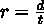

+   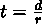

例如，在设计电路时，基于欧姆定律使用一组类似的方程。在这种情况下，方程将电阻、电流和电压联系起来。

在某些情况下，我们希望有一个可以根据已知和未知的内容执行三种不同计算的实施方案。

## 3.3.1 准备工作

我们将构建一个单一的功能，通过体现所有三种解决方案，可以解决任何两个已知值的速率-时间-距离（RTD）计算。通过微小的变量名更改，这适用于许多现实世界的问题。

我们不一定需要一个单一的值作为答案。我们可以通过创建一个包含三个值的 Python 小字典来稍微泛化这一点；其中两个是已给出的，一个是计算得出的。我们将在第五章中更详细地探讨字典。

当有问题时，我们将使用警告模块而不是引发异常：

```py
 import warnings
```

有时，产生一个可疑的结果比停止处理更有帮助。

## 3.3.2 如何实现...

1.  为每个未知数求解方程。有三个单独的表达式：

    +   distance = rate * time

    +   rate = distance / time

    +   time = distance / rate

1.  根据其中一个值在未知时为 None 的条件，将每个表达式包裹在一个 if 语句中：

    ```py
     if distance is None: 

            distance = rate * time 

        elif rate is None: 

            rate = distance / time 

        elif time is None: 

            time = distance / rate
    ```

1.  请参考第二章的设计复杂的 if...elif 链配方，以获取设计这些复杂 if...elif 链的指导。包括 Else-Raise 选项的变体：

    ```py
        else: 

            warnings.warning("Nothing to solve for")
    ```

1.  构建最终的字典对象：

    ```py
        return dict(distance=distance, rate=rate, time=time)
    ```

1.  使用具有默认值 None 的关键字参数将所有这些封装成一个函数。这导致参数类型为 Optional[float]，通常表示为 float | None。返回类型是一个具有字符串键的字典，总结为 dict[str, float | None]。它看起来像这样：

    ```py
    def rtd( 

        distance: float | None = None, 

        rate: float | None = None, 

        time: float | None = None, 

    ) -> dict[str, float | None]: 

        if distance is None and rate is not None and time is not None: 

            distance = rate * time 

        elif rate is None and distance is not None and time is not None: 

            rate = distance / time 

        elif time is None and distance is not None and rate is not None: 

            time = distance / rate 

        else: 

            warnings.warn("Nothing to solve for") 

        return dict(distance=distance, rate=rate, time=time)
    ```

类型提示往往会使函数定义变得非常长，以至于不得不跨越五行代码。这么多可选值的呈现很难总结！

我们可以这样使用生成的函数：

```py
>>> rtd(distance=31.2, rate=6) 

{’distance’: 31.2, ’rate’: 6, ’time’: 5.2}
```

这表明以 6 节的速度航行 31.2 海里需要 5.2 小时。

为了得到格式良好的输出，我们可能这样做：

```py
>>> result = rtd(distance=31.2, rate=6) 

>>> (’At {rate}kt, it takes ’ 

... ’{time}hrs to cover {distance}nm’).format_map(result) 

’At 6kt, it takes 5.2hrs to cover 31.2nm’
```

为了打断长字符串，我们使用了第二章的设计复杂的 if...elif 链配方中的知识。

为了使警告更加明显，可以使用警告模块设置一个过滤器，将警告提升为错误。使用表达式 `warnings.simplefilter('error')` 将警告转换为可见的异常。

## 3.3.3 它是如何工作的...

由于我们已经为所有参数提供了默认值，因此我们可以为三个参数中的任意两个提供参数值，然后函数可以求解第三个参数。这使我们不必编写三个单独的函数。

返回字典作为最终结果并不是这个问题的关键。这是一个方便的方式来展示输入和输出。它允许函数返回统一的结果，无论提供了哪些参数值。

## 3.3.4 更多...

我们有这个问题的另一种公式，它涉及更多的灵活性。Python 函数有一个所有其他关键字参数，前缀为**。

我们可以利用灵活的关键字参数并坚持要求所有参数都作为关键字提供：

```py
def rtd2(**keywords: float) -> dict[str, float | None]: 

    rate = keywords.get(’rate’) 

    time = keywords.get(’time’) 

    distance = keywords.get(’distance’) 

    # etc.
```

关键字类型提示表明，这些参数的所有值都将为 float 对象。在极少数情况下，不是所有关键字参数的类型都相同；在这种情况下，一些重新设计可能有助于使类型更清晰。

这个版本使用字典的 get()方法在字典中查找给定的键。如果键不存在，则提供一个默认值 None。

字典的 get()方法允许第二个参数，即默认值，如果键不存在，则可以提供而不是 None。

这种开放式设计具有更大的灵活性，这是一个潜在的优势。一个潜在的缺点是，实际的参数名称难以辨认，因为它们不是函数定义的一部分，而是函数体的一部分。我们可以遵循 Writing better docstrings with RST markup 配方并提供一个好的文档字符串。然而，似乎更好的做法是将参数名称明确地作为 Python 代码的一部分提供，而不是通过文档隐式地提供。

这还有另一个，并且更加深远的缺点。问题在以下不良示例中暴露出来：

```py
>>> rtd2(distnace=31.2, rate=6) 

{’distance’: None, ’rate’: 6, ’time’: None}
```

这不是我们想要的行为。拼写错误的“distance”没有被报告为 TypeError 异常。拼写错误的参数名称在任何地方都没有被报告。为了揭示这些错误，我们需要添加一些编程来从关键字字典中弹出项目，并在移除预期名称后报告剩余名称的错误：

```py
def rtd3(**keywords: float) -> dict[str, float | None]: 

    rate = keywords.pop("rate", None) 

    time = keywords.pop("time", None) 

    distance = keywords.pop("distance", None) 

    if keywords: 

        raise TypeError( 

           f"Invalid keyword parameter: {’’.join(keywords.keys())}")
```

这种设计将检测拼写错误。额外的处理表明，显式参数名称可能比无限制名称集合的灵活性更好。

## 3.3.5 参考信息

+   我们查看第二章中 Writing better docstrings with RST markup 配方中函数的文档。

# 3.4 使用*分隔符强制关键字参数

有一些情况下，一个函数会有大量的位置参数。从实用主义的角度来看，具有三个以上参数的函数可能会让人困惑。大量的传统数学似乎都集中在单参数和双参数函数上。似乎没有太多常见的数学运算符涉及三个或更多操作数。

当难以记住参数的所需顺序时，这表明参数太多。

## 3.4.1 准备工作

我们将查看一个用于准备风寒表并写入 CSV 格式输出文件的函数。我们需要提供一系列温度、一系列风速以及我们想要创建的文件信息。这有很多参数。

显然温度，即风寒温度，T[wc]，的一个公式是：

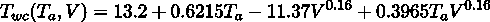

风寒温度，，基于空气温度，，以摄氏度为单位，以及风速，，以公里每小时为单位。

对于美国人来说，这需要一些转换：

+   将温度，，从华氏度，，转换为摄氏度，：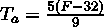。

+   将风速，，从英里每小时，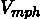，转换为公里每小时：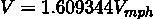。

+   结果，，需要从转换回：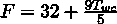。

我们不会将这些美国转换折叠到解决方案中。我们将把这留给你作为练习。

计算风寒温度的函数，T_wc()，看起来像这样：

```py
def T_wc(T: float, V: float) -> float: 

    return 13.12 + 0.6215*T - 11.37*V**0.16 + 0.3965*T*V**0.16
```

这个函数有一个不寻常的名字，T_wc()。我们匹配了 T[wc] 的正式定义，而不是强制执行 PEP-8 规则，即函数名以小写字母开头。在这种情况下，似乎坚持使用文献中使用的名称，而不是基于语言习惯强加名称会更好。

创建风寒表的 一种方法 是创建如下所示的东西：

```py
import csv 

from typing import TextIO 

def wind_chill( 

    start_T: int, stop_T: int, step_T: int, 

    start_V: int, stop_V: int, step_V: int, 

    target: TextIO 

) -> None: 

    """Wind Chill Table.""" 

    writer= csv.writer(target) 

    heading = [’’]+[str(t) for t in range(start_T, stop_T, step_T)] 

    writer.writerow(heading) 

    for V in range(start_V, stop_V, step_V): 

        row = [float(V)] + [ 

            T_wc(T, V) 

            for T in range(start_T, stop_T, step_T) 

        ] 

        writer.writerow(row)
```

在我们到达设计问题之前，让我们看看基本处理。我们期望使用此函数的人已经使用 with 上下文打开了一个输出文件。这遵循了第二章中 Managing a context using the with statement 的配方。在这个上下文中，我们为 CSV 输出文件创建了一个写入。我们将在第十一章中更深入地探讨这一点。

标题变量的值包括一个列表字面量和构建列表的推导式。我们将在第四章中探讨列表。我们将在第九章中探讨推导式和生成器表达式。

同样，表格的每一行都是由一个表达式构建的，该表达式将单个浮点值与列表推导式相结合。列表由通过 wind-chill 函数，T_wc() 计算的值组成。我们根据表格中的行提供风速，V。我们还根据表格中的列提供温度，T。

wind_chill() 函数的整体定义提出了一个问题：wind_chill() 函数有七个不同的位置参数。当我们尝试使用这个函数时，我们最终得到如下代码：

```py
>>> from pathlib import Path 

>>> p = Path(’data/wc1.csv’) 

>>> with p.open(’w’,newline=’’) as target: 

...     wind_chill(0, -45, -5, 0, 20, 2, target)
```

所有这些数字是什么？我们能做些什么来帮助解释所有这些数字背后的目的？

## 3.4.2 如何做到...

当我们拥有大量参数时，要求使用关键字参数而不是位置参数是有帮助的。我们可以在两组参数之间使用 * 作为分隔符。

在我们的例子中，结果函数定义具有以下存根定义：

```py
def wind_chill_k( 

    *, 

    start_T: int, stop_T: int, step_T: int, 

    start_V: int, stop_V: int, step_V: int, 

    target: Path 

) -> None:
```

让我们看看它在实践中如何使用不同类型的参数：

1.  当我们尝试使用令人困惑的位置参数时，我们会看到如下情况：

    ```py
     >>> wind_chill_k(0, -45, -5, 0, 20, 2, target) 

    Traceback (most recent call last): 

    ... 

    TypeError: wind_chill_k() takes 0 positional arguments but 7 were given
    ```

1.  我们必须使用具有显式参数名称的函数，如下所示：

    ```py
     >>> p = Path(’data/wc2.csv’) 

    >>> with p.open(’w’, newline=’’) as output_file: 

    ...     wind_chill_k(start_T=0, stop_T=-45, step_T=-5, 

    ...     start_V=0, stop_V=20, step_V=2, 

    ...     target=output_file)
    ```

这种强制使用关键字参数的使用迫使我们每次使用这个看似复杂的函数时都要写一个更长但更清晰的语句。

## 3.4.3 它是如何工作的...

当 * 字符用作参数定义时，它将两个参数集合分开：

+   在 * 之前，我们列出可以按位置或按关键字命名的参数值。在这个例子中，我们没有这些参数。

+   在 * 之后，我们列出必须用关键字给出的参数值。在我们的例子中，这是所有参数。

print() 函数是这一点的示例。它有三个仅关键字参数用于输出文件、字段分隔符字符串和行结束字符串。

## 3.4.4 更多内容...

当然，我们可以将这种技术与各种参数的默认值结合起来。例如，我们可以对此进行修改，从而引入一个单一的默认值：

```py
import sys 

from typing import TextIO 

def wind_chill_k2( 

    *, 

    start_T: int, stop_T: int, step_T: int, 

    start_V: int, stop_V: int, step_V: int, 

    target: TextIO = sys.stdout 

) -> None: 

    ...
```

我们现在可以用两种方式使用这个函数：

+   这里有一种在控制台上打印表格的方法，使用默认的目标：

    ```py
    >>> wind_chill_k2( 

    ...     start_T=0, stop_T=-45, step_T=-5, 

    ...     start_V=0, stop_V=20, step_V=2)
    ```

+   这里有一种使用显式目标写入文件的方法：

    ```py
    >>> import pathlib 

    >>> path = pathlib.Path("data/wc3.csv") 

    >>> with path.open(’w’, newline=’’) as output_file: 

    ...     wind_chill_k2(target=output_file, 

    ...     start_T=0, stop_T=-45, step_T=-5, 

    ...     start_V=0, stop_V=20, step_V=2)
    ```

我们可以对这些更改更有信心，因为必须按名称提供参数。我们不必仔细检查以确保参数的顺序。

作为一种一般模式，我们建议在函数有三个以上参数时这样做。一两个参数很容易记住。大多数数学运算符是一元或二元。虽然第三个参数仍然可能很容易记住，但第四个（及以后的）参数将变得非常难以回忆。

## 3.4.5 参考以下内容

+   参考基于部分函数选择参数顺序的选择参数顺序的食谱以了解此技术的另一种应用。

# 3.5 使用斜杠（/）分隔仅位置参数

我们可以在参数列表中使用斜杠（/）字符将参数分为两组。在斜杠之前，所有参数值以位置方式工作。在斜杠参数之后，参数值可以是位置方式，也可以使用名称。

这应该用于满足以下所有条件的函数：

+   只使用少数几个位置参数（不超过三个）。

+   而且它们都是必需的。

+   而顺序是如此明显，任何改变都可能令人困惑。

这一直是标准库的一个特性。例如，math.sin() 函数只能使用位置参数。正式定义如下：

```py
>>> help(math.sin) 

Help on built-in function sin in module math: 

sin(x, /) 

    Return the sine of x (measured in radians).
```

尽管有一个 x 参数名称，但我们不能使用这个名称。如果我们尝试使用它，我们会看到以下异常：

```py
>>> import math 

>>> math.sin(x=0.5) 

Traceback (most recent call last): 

... 

TypeError: math.sin() takes no keyword arguments
```

x 参数只能以位置方式提供。help() 函数的输出提供了一个如何使用斜杠（/）分隔符来实现这一点的建议。

## 3.5.1 准备工作

一些内部内置函数使用仅位置参数；设计模式在我们的函数中也可能很有帮助。为了有用，必须有非常少的仅位置参数。由于大多数数学运算符有一个或两个操作数，这表明一个或两个仅位置参数可能很有用。

我们将考虑两个函数，用于将美国使用的华氏温度系统和世界上几乎所有其他地方使用的摄氏温度系统之间的单位转换：

+   将  转换为 ：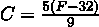

+   将  转换为 ：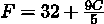

这些函数每个只有一个参数，使其成为仅位置参数的合理示例。

## 3.5.2 如何操作...

1.  定义函数：

    ```py
    def F_1(c: float) -> float: 

        return 32 + 9 * c / 5
    ```

1.  在仅位置参数之后添加/参数分隔符：

    ```py
    def F_2(c: float, /) -> float: 

        return 32 + 9 * c / 5
    ```

在这些例子中，我们在函数名称后加上 _1 和 _2 后缀，以便清楚地说明每个步骤对应的定义。这是同一函数的两个版本，它们应该有相同的名称。它们被分开以展示函数编写的历史；这并不是一个实用的命名约定，除非在写书时，一些部分完成的函数有自己的单元测试。

## 3.5.3 它是如何工作的...

/分隔符将参数名称分为两组。在/之前是必须按位置提供参数值的参数：不能使用命名参数值。在/之后是允许使用名称的参数。

让我们看看温度转换的一个稍微复杂一点的版本：

```py
def C(f: float, /, truncate: bool=False) -> float: 

    c = 5 * (f - 32) / 9 

    if truncate: 

        return round(c, 0) 

    return c
```

这个函数有一个名为 f 的仅位置参数。它还有一个截断参数，可以通过名称提供。这导致有三种使用此函数的不同方式，如下面的例子所示：

```py
>>> C(72) 

22.22222222222222 

>>> C(72, truncate=True) 

22.0 

>>> C(72, True) 

22.0
```

第一个例子显示了仅位置参数和没有四舍五入的输出。这是一个看起来复杂的价值。

第二个例子使用命名参数样式将非位置参数截断设置为 True。第三个例子提供了两种参数值的位置。

## 3.5.4 更多内容...

这可以与*分隔符结合，创建非常复杂的函数签名。参数可以分解为三组：

+   /分隔符之前的参数必须按位置提供。这些必须是第一个。

+   /分隔符之后的参数可以通过位置或名称提供。

+   *分隔符之后的参数必须只按名称提供。这些名称是最后提供的，因为它们永远不会按位置匹配。

## 3.5.5 参考内容

+   有关*分隔符的详细信息，请参阅使用*分隔符强制关键字参数的配方。

# 3.6 基于部分函数选择参数顺序

“部分函数”这个术语被广泛用来描述函数的部分应用。一些参数值是固定的，而另一些则变化。我们可能有一个函数，，其中和有固定的值。有了这些固定值，我们就有了一个函数的新版本，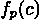。

当我们查看复杂函数时，我们有时会看到我们使用函数的方式中存在一种模式。例如，我们可能会多次评估一个函数，其中一些参数值由上下文固定，而其他参数值则随着处理细节的变化而变化。有一些固定的参数值暗示了一个部分函数。

创建部分函数可以通过避免重复特定上下文中固定的参数值来简化我们的编程。

## 3.6.1 准备工作

我们将查看 haversine 公式的版本。这个公式计算地球表面上两点，p[1] = (lon[1],lat[1]) 和 p[2] = (lon[2],lat[2]) 之间的距离：

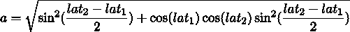

重要的计算得到两点之间的中心角，c。角度以弧度为单位。我们必须通过乘以地球的平均半径以某些给定的单位来将这个角度转换为距离。如果我们把角度 c 乘以 3,959 英里的半径，我们将把角度转换为英里。

这里是这个函数的实现：

```py
from math import radians, sin, cos, sqrt, asin 

MI = 3959 

NM = 3440 

KM = 6372 

def haversine( 

    lat_1: float, lon_1: float, 

    lat_2: float, lon_2: float, R: float 

) -> float: 

    """Distance between points. 

    R is Earth’s radius. 

    R=MI computes in miles. Default is nautical miles. 

    >>> round(haversine(36.12, -86.67, 33.94, -118.40, R=6372.8), 5) 

    2887.25995 

    """ 

    _lat = radians(lat_2) - radians(lat_1) 

    _lon = radians(lon_2) - radians(lon_1) 

    lat_1 = radians(lat_1) 

    lat_2 = radians(lat_2) 

    a = sqrt( 

        sin(_lat / 2) ** 2 + 

        cos(lat_1) * cos(lat_2) * sin(_lon / 2) ** 2 

    ) 

    return R * 2 * asin(a) 
```

doctest 示例使用了一个地球半径，多了一个未在其他地方使用的额外小数点。这个示例的输出将与网上找到的其他示例相匹配。

我们经常遇到的问题是 R 的值在特定上下文中很少改变。一个上下文可能在整个应用程序中使用公里，而另一个上下文使用海里。我们希望为特定上下文强制一个默认值 R = NM，在给定上下文中得到海里，而无需编辑模块。

我们将查看几种提供一致参数值的方法。

## 3.6.2 如何实现...

在某些情况下，整体上下文将确定一个参数的单个值。这个值很少改变。以下是为参数提供一致值的三种常见方法：

+   将函数包装在一个新函数中，该函数提供默认值。

+   创建一个带有默认值的偏函数。这有两个进一步的改进：

    +   我们可以将默认值作为关键字参数提供。

    +   我们可以将默认值作为位置参数提供。

我们将在本食谱中分别查看这些不同的变体。

### 包装一个函数

这里是我们如何稍微修改函数并创建一个包装器的示例：

1.  将一些参数设置为位置参数，将一些参数设置为关键字参数。我们希望上下文特征——那些很少改变的——是关键字参数。更频繁改变的参数应保留为位置参数：

    ```py
    def haversine_k( 

        lat_1: float, lon_1: float, 

        lat_2: float, lon_2: float, *, R: float 

    ) -> float: 

        ... # etc.
    ```

    我们可以遵循使用 * 分隔符强制关键字参数食谱。

1.  我们可以编写一个包装函数，该函数将应用所有位置参数，不进行修改。它将作为长期上下文的一部分提供额外的关键字参数：

    ```py
    def nm_haversine_1(*args): 

        return haversine_k(*args, R=NM)
    ```

    我们在函数声明中有 *args 构造来接受所有位置参数值作为一个单一的元组，args。我们在评估 haversine() 函数时使用类似外观的 *args 来将元组展开为该函数的所有位置参数值。

在这种情况下，所有类型都是 float。我们可以使用 *args: float 提供合适的提示。这并不总是有效，并且这种处理参数的方式——虽然看起来简单——可能会隐藏问题。

### 使用关键字参数创建部分函数

定义作为部分函数工作良好的函数的一种方法是通过使用关键字参数：

1.  我们可以遵循使用 * 分隔符强制关键字参数的配方来做这件事。我们可能会改变基本的海里函数，使其看起来像这样：

    ```py
    def haversine_k( 

        lat_1: float, lon_1: float, 

        lat_2: float, lon_2: float, *, R: float 

    ) -> float: 

        ... # etc.
    ```

1.  使用关键字参数创建部分函数：

    ```py
    from functools import partial 

    nm_haversine_3 = partial(haversine, R=NM)
    ```

`partial()` 函数从一个现有函数和一个具体的参数值集合中构建一个新的函数。`nm_haversine_3()` 函数在构建部分函数时为 R 提供了一个特定的值。

我们可以像使用任何其他函数一样使用它：

```py
>>> round(nm_haversine_3(36.12, -86.67, 33.94, -118.40), 2) 

1558.53
```

我们得到海里单位的答案，这使得我们能够轻松地进行与航海相关的计算。将 R=NM 设置为固定值使代码看起来稍微简单一些，并且更加可信。消除了一个计算中 R 值可能不正确的情况。

### 使用位置参数创建部分函数

如果我们尝试使用 `partial()` 与位置参数一起，我们被限制在部分定义中提供最左边的参数值。这让我们想到函数的前几个参数可能是被部分函数或包装器隐藏的候选者：

1.  我们需要更改基本的海里函数，将 R 参数放在第一位。这使得定义部分函数稍微容易一些。以下是更改后的定义：

    ```py
    def p_haversine( 

        R: float, 

        lat_1: float, lon_1: float, lat_2: float, lon_2: float 

    ) -> float: 

        # etc.
    ```

1.  使用位置参数创建部分函数

    ```py
    from functools import partial 

    nm_haversine_4 = partial(p_haversine, NM) 
    ```

    `partial()` 函数从一个现有函数和一个具体的参数值集合中构建一个新的函数。`nm_haversine_4()` 函数在构建部分函数时为第一个参数 R 提供了一个特定的值。

我们可以像使用任何其他函数一样使用它：

```py
>>> round(nm_haversine_4(36.12, -86.67, 33.94, -118.40), 2) 

1558.53
```

我们得到海里单位的答案，这使得我们能够轻松地进行与航海相关的计算，代码可以使用没有重复 R=NM 参数值的烦恼细节的海里函数版本。

## 3.6.3 它是如何工作的...

部分函数本质上与包装函数相同。我们可以在程序的其他更复杂的部分中自由构建部分函数。请注意，创建部分函数时，在考虑位置参数的顺序时会导致一些额外的考虑：

+   如果我们尝试在包装器中使用 `*args`，这些必须定义在最后。所有这些参数都变成了匿名参数。这种匿名性意味着像 mypy 这样的工具可能难以确认参数是否被正确使用。文档也不会显示必要的细节。

+   在创建部分函数时，最左边的位置参数最容易提供值。

+   任何在 * 分隔符之后定义的关键字参数也是作为部分定义的一部分提供的好选择。

这些考虑可以让我们将最左边的参数视为一种上下文：这些参数预计很少改变，并且可以通过部分函数定义更容易地提供。

## 3.6.4 更多...

还有另一种封装函数的方法——我们也可以构建一个 lambda 对象。以下示例也将有效：

```py
nm_haversine_L = lambda *args: haversine_k(*args, R=NM)
```

这依赖于 haversine_k()函数的定义，其中 R 参数被标记为关键字参数。如果没有这种位置参数和关键字参数值之间的明确分离，这个 lambda 定义将导致 mypy 发出警告。如果我们使用原始的 haversine()函数，警告会告诉我们 R 可能得到多个值。

lambda 对象是一个去除了其名称和主体的函数。函数定义简化为仅包含两个基本要素：

+   在这个例子中，参数列表为*args。

+   一个单一的表达式，即结果，haversine_k(*args, R=NM)。lambda 不能有任何语句。

lambda 方法使得创建类型提示变得困难，这限制了它的实用性。此外，[PEP-8](https://peps.python.org/pep-0008/)建议不应该将 lambda 赋值给变量。

## 3.6.5 参考信息

+   我们还将进一步探讨这个设计的扩展，在使用 script-library 开关编写可测试脚本的配方中。

+   对于更多函数式编程技术，请参阅《函数式 Python 编程》：[`www.packtpub.com/product/functional-python-programming-3rd-edition-third-edition/9781803232577`](https://www.packtpub.com/product/functional-python-programming-3rd-edition-third-edition/9781803232577)。这本书中有许多使用 lambda 和部分函数的示例。

# 3.7 使用 RST 标记编写清晰的文档字符串

我们如何清晰地记录函数的功能？我们能提供示例吗？当然可以，我们真的应该这样做。在第二章的包括描述和文档配方和使用 RST 标记编写更好的文档字符串配方中，我们查看了一些基本的文档技术。这些配方介绍了用于模块文档字符串的 ReStructuredText (RST)。

我们将扩展这些技术来编写 RST 格式的函数文档字符串。当我们使用 Sphinx 这样的工具时，我们的函数文档字符串将变成优雅的文档，描述我们的函数功能。

## 3.7.1 准备工作

在使用*分隔符强制关键字参数的配方中，我们查看了一个根据温度和风速计算风寒的函数。

在这个配方中，我们将展示几个带有名称尾随 _0 的函数的不同版本。从实用主义的角度来看，这种名称更改不是一个好主意。然而，为了使本书中这个函数的演变清晰，给每个新变体一个独特的名称似乎是有帮助的。

我们需要用更完整的文档来注释这个函数。

## 3.7.2 如何操作...

我们通常为函数描述编写以下内容：

+   概述

+   描述

+   参数

+   返回值

+   异常

+   测试用例

+   任何其他似乎有意义的内容

这是我们将如何为函数创建文档。我们可以将类似的方法应用于类的成员函数，甚至是一个模块。

1.  编写概要。不需要适当的主题。不要写 This function computes...；我们可以从 Computes.... 开始。没有必要过度强调上下文：

    ```py
    def T_wc_1(T, V): 

        """Computes the wind chill temperature."""
    ```

    为了帮助阐明本书中此函数 docstring 的演变，我们在名称后附加了后缀 _1。

1.  编写描述并提供详细信息：

    ```py
    def T_wc_2(T, V): 

        """Computes the wind chill temperature. 

        The wind-chill, :math:‘T_{wc}‘, 

        is based on air temperature, T, and wind speed, V. 

        """
    ```

    在这种情况下，我们在描述中使用了小块排版数学。:math: 解释文本角色使用 LaTeXmath 排版。像 Sphinx 这样的工具可以使用 MathJax 或 jsMath 来处理数学排版。

1.  描述参数。对于位置参数，通常使用 :param name: description. Sphinx 可以容忍多种变体，但这是常见的。对于必须使用关键字参数的情况，通常使用 :key name: 作为描述的前缀。

    ```py
    def T_wc_3(T: float, V: float): 

        """Computes the wind chill temperature 

        The wind-chill, :math:‘T_{wc}‘, 

        is based on air temperature, T, and wind speed, V. 

        :param T: Temperature in C 

        :param V: Wind Speed in kph 

        """
    ```

1.  使用 :returns:: 描述返回值

    ```py
    def T_wc_4(T: float, V: float) -> float: 

        """Computes the wind chill temperature 

        The wind-chill, :math:‘T_{wc}‘, 

        is based on air temperature, T, and wind speed, V. 

        :param T: Temperature in C 

        :param V: Wind Speed in kph 

        :returns: Wind-Chill temperature in C 

        """
    ```

1.  识别可能引发的重要异常。使用 :raises exception: 标记来定义异常的原因。有几种可能的变体，但 :raises exception: 似乎很受欢迎：

    ```py
    def T_wc_5(T: float, V: float) -> float: 

        """Computes the wind chill temperature 

        The wind-chill, :math:‘T_{wc}‘, 

        is based on air temperature, T, and wind speed, V. 

        :param T: Temperature in C 

        :param V: Wind Speed in kph 

        :returns: Wind-Chill temperature in C 

        :raises ValueError: for wind speeds under 4.8 kph or T above 10C 

        """
    ```

1.  如果可能，包括一个 doctest 测试用例：

    ```py
    def T_wc(T: float, V: float) -> float: 

        """Computes the wind chill temperature 

        The wind-chill, :math:‘T_{wc}‘, 

        is based on air temperature, T, and wind speed, V. 

        :param T: Temperature in C 

        :param V: Wind Speed in kph 

        :returns: Wind-Chill temperature in C 

        :raises ValueError: for wind speeds under 4.8 kph or T above 10C 

        >>> round(T_wc(-10, 25), 1) 

        -18.8
    ```

1.  编写任何附加的注释和有用的信息。我们可以在 docstring 中添加以下内容：

    ```py
     See https://en.wikipedia.org/wiki/Wind_chill 

        .. math:: 

            T_{wc}(T_a, V) = 13.2 + 0.6215 T_a - 11.37 V ^ {0.16} + 0.3965 T_a V ^ {0.16}
    ```

    我们还包含了一个指向总结风冷计算并链接到更多详细信息页面的维基百科页面。

    我们还包含了一个 ..  math:: 指令，其中包含函数中使用的 LaTeX 公式。这通常会很好地排版，提供代码的可读版本。

## 3.7.3 它是如何工作的...

关于 docstrings 的更多信息，请参阅第二章的 包括描述和文档 菜单。虽然 Sphinx 很受欢迎，但它不是唯一可以从 docstring 注释创建文档的工具。Python 标准库中的 pydoc 工具也可以从 docstring 注释生成外观良好的文档。

Sphinx 工具依赖于 Docutils 包的核心 RST 处理功能。有关更多信息，请参阅 [`pypi.python.org/pypi/docutils`](https://pypi.python.org/pypi/docutils)。

RST 规则相对简单。这个菜谱中的大多数附加功能都利用了 RST 的解释文本角色。我们每个 :param T:, :returns:, 和 :raises ValueError: 构造都是一个文本角色。RST 处理器可以使用这些信息来决定内容的样式和结构。样式通常包括一个独特的字体。上下文可能是 HTML 定义列表格式。

## 3.7.4 还有更多...

在许多情况下，我们还需要在函数和类之间包含交叉引用。例如，我们可能有一个准备风冷表的函数。这个函数的文档可能包括对 T_wc() 函数的引用。

Sphinx 将使用特殊的:func:文本角色生成这些交叉引用：

```py
def wind_chill_table() -> None: 

    """Uses :func:‘T_wc‘ to produce a wind-chill 

    table for temperatures from -30C to 10C and 

    wind speeds from 5kph to 50kph. 

    """ 

    ... # etc.
```

我们已经使用:func:‘Twc‘在 RST 文档中的一个函数到另一个函数创建了一个引用。Sphinx 将这些转换为适当的超链接。

## 3.7.5 参见

+   请参阅第二章中的包含描述和文档和使用 RST 标记编写更好的 docstrings 配方，以了解其他展示 RST 如何工作的配方。

# 3.8 设计围绕 Python 栈限制的递归函数

一些函数可以使用递归公式明确且简洁地定义。这里有这种方法的两个常见例子。

阶乘函数有以下的递归定义：

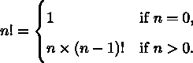

计算斐波那契数 F[n]的递归规则如下定义：

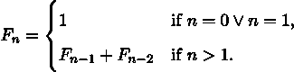

这些都涉及一个具有简单定义值的案例和一个涉及根据同一函数的其他值计算函数值的案例。

我们遇到的问题是 Python 对这些类型的递归函数评估施加了上限。虽然 Python 的整数可以轻松计算 1000!的值，但栈限制阻止了我们随意计算。

从实用主义的角度来看，文件系统是一个递归数据结构的例子。每个目录都包含子目录。递归函数定义可以用于目录树。具有定义值的案例来自处理非目录文件。

我们通常可以将递归设计重构为消除递归，并用迭代来替换。在进行递归消除时，我们希望尽可能保留原始数学的清晰度。

## 3.8.1 准备工作

许多递归函数定义遵循阶乘函数的模式。这有时被称为尾递归，因为递归情况可以写在函数体的末尾：

```py
def fact_r(n: int) -> int: 

    if n == 0: 

        return 1 

    return n * fact_r(n - 1)
```

函数中的最后一个表达式指的是同一个函数，但使用了不同的参数值。

我们可以重新表述这一点，避免 Python 中的递归限制。

## 3.8.2 如何实现...

尾递归也可以描述为一种缩减。我们将从一个值集合开始，然后将其缩减为一个单一值：

1.  展开规则以显示所有细节：n! = n×(n−1)×(n−2)× (n − 3) ×× 1。这有助于确保我们理解递归规则。

1.  编写一个循环或生成器来创建所有值：N = {n,n − 1,n − 2,n − 3,…,1}。在 Python 中，这可以像 range(1, n+1)这样简单。在某些情况下，我们可能需要对基本值应用一些转换函数：N = {f(i)∣1 ≤ i < n + 1}。这是一个列表推导式；请参阅第四章中的构建列表 – 字面量、追加和推导式。

1.  结合减少函数。在这种情况下，我们正在使用乘法计算一个大的乘积。我们可以将其总结为∏ [1≤x<n+1]x。

    这里是一个 Python 的实现：

    ```py
    def prod_i(int_iter: Iterable[int]) -> int: 

        p = 1 

        for x in int_iter: 

            p *= x 

        return p
    ```

    math 模块中有一个等效的函数。我们不必像上面那样写出来，可以使用 from math import prod。

prod_i()函数可以如下使用来计算阶乘值：

```py
>>> prod_i(range(1, 6)) 

120 

>>> fact(5) 

120
```

这工作得很好。我们已经将 prod_i()函数优化成了一个迭代函数。这次修订避免了递归版本可能遇到的栈溢出问题。

注意，range 对象是惰性的；它不会创建一个大的列表对象，从而避免了大量内存的分配。range 对象返回单个值，当它们被 prod_i()函数消耗时。

## 3.8.3 它是如何工作的...

尾递归定义很方便，因为它简短且易于记忆。数学家喜欢它，因为它可以帮助阐明函数的含义。

许多静态、编译型语言以与我们在此处展示的技术类似的方式创建优化代码。这是通过在虚拟机的字节码——或者实际的机器码——中注入一个特殊指令来实现的，以重新评估函数而不创建新的栈帧。Python 没有这个功能。实际上，这种优化将递归转换成一种 while 语句：

```py
def loop_fact(n: int) -> int: 

    p = n 

    while n != 1: 

        n = n-1 

        p *= n 

    return p
```

特殊字节码指令的注入将导致运行快速、不透露中间修订的代码。然而，生成的指令可能不会与源文本完美匹配，这可能导致定位错误存在困难。

## 3.8.4 更多...

计算 F[n]斐波那契数涉及一个额外的问题。如果我们不小心，我们会多次计算很多值：

例如，为了计算 F[5] = F[4] + F[3]，我们将评估以下内容：

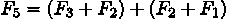

展开 F[3]和 F[2]的定义显示了一些冗余的计算。

斐波那契问题涉及两个递归。如果我们天真地写出它，可能看起来像这样：

```py
def fibo(n: int) -> int: 

    if n <= 1: 

        return 1 

    else: 

        return fibo(n-1) + fibo(n-2)
```

将像这个例子这样的东西转换成尾递归是困难的。我们有两种方法可以减少这个计算复杂度：

+   使用记忆化

+   重新表述问题

记忆化技术在 Python 中应用起来很简单。我们可以使用@functools.cache 作为装饰器。它看起来是这样的：

```py
from functools import cache 

@cache 

def fibo_r(n: int) -> int: 

    if n < 2: 

        return 1 

    else: 

        return fibo_r(n - 1) + fibo_r(n - 2)
```

添加这个装饰器将优化更复杂的递归。

重新表述问题意味着从新的角度看待它。在这种情况下，我们可以考虑计算所有斐波那契数，直到并包括所需的 F[n]。我们只想要这个序列中的最后一个值。计算多个中间值可以相对高效。

这里是一个执行此操作的生成器函数：

```py
from collections.abc import Iterator 

def fibo_iter() -> Iterator[int]: 

    a = 1 

    b = 1 

    yield a 

    while True: 

        yield b 

        a, b = b, a + b
```

这个函数是斐波那契数的无限迭代。它使用 Python 的 yield 来以懒加载的方式发出值。当客户端函数使用这个迭代器时，序列中的下一个数字是在消耗每个数字时计算的。

这是一个消耗值并也对无限迭代器施加上限的函数：

```py
def fibo_i(n: int) -> int: 

    for i, f_i in enumerate(fibo_iter()): 

        if i == n: 

            break 

    return f_i
```

这个函数消耗来自 fibo_iter() 迭代器的值序列。当达到所需的数字时，break 语句结束 for 语句。

我们已经优化了递归解决方案，并将其转换为避免栈溢出潜在问题的迭代。

## 3.8.5 参见

+   请参阅第二章中的 避免 break 语句的潜在问题 菜单。

# 3.9 使用脚本库开关编写可测试的脚本

创建 Python 脚本文件通常非常容易。当我们向 Python 提供脚本文件时，它立即运行。在某些情况下，没有函数或类定义；脚本文件是 Python 语句的序列。

这些脚本文件很难进行测试。此外，它们也很难重用。当我们想要从脚本文件集合中构建更大、更复杂的应用程序时，我们通常被迫将脚本重构成一个或多个函数。

## 3.9.1 准备工作

假设我们有一个名为 haversine() 的方便的 haversine 距离函数实现，它位于名为 recipe_11.py 的文件中。

该文件包含本章中 基于部分函数选择参数顺序 所示的函数和定义。这包括一个部分函数 nm_haversine()，用于计算海里距离。脚本还包含以下顶级代码：

```py
source_path = Path("data/waypoints.csv") 

with source_path.open() as source_file: 

    reader = csv.DictReader(source_file) 

    start = next(reader) 

    for point in reader: 

        d = nm_haversine( 

            float(start[’lat’]), 

            float(start[’lon’]), 

            float(point[’lat’]), 

            float(point[’lon’]) 

        ) 

        print(start, point, d) 

        start = point
```

这个 Python 脚本打开一个文件，data/wapypoints.csv，并对该文件进行一些处理。虽然这很方便使用，但我们无法轻松测试它。

如果我们尝试在单元测试中导入 haversine() 函数，我们将执行脚本的其它部分。我们如何重构这个模块，以便在不打印 wapypoints.csv 文件中航点之间距离显示的情况下导入有用的函数？

## 3.9.2 如何做...

编写 Python 脚本可以被称为一种吸引人的麻烦；它看起来简单吸引人，但很难有效地进行测试。以下是我们将脚本转换成可测试和可重用库的方法：

1.  识别执行脚本工作的语句。这意味着区分定义和动作。如 import、def 和 class 这样的语句是定义性的——它们创建对象但不直接执行计算或产生输出的动作。几乎所有其他语句都执行某些动作。因为一些赋值语句可能是类型提示定义的一部分，或者可能创建有用的常量，所以这种区分完全是基于意图的。

1.  在我们的例子中，有一些赋值语句比行动更像是定义。这些赋值语句类似于 `def` 语句；它们只设置稍后使用的变量。以下是一些通常的定义性语句：

    ```py
    from math import radians, sin, cos, sqrt, asin 

    from functools import partial 

    MI = 3959 

    NM = 3440 

    KM = 6373 

    def haversine( 

        lat_1: float, lon_1: float, 

        lat_2: float, lon_2: float, *, R: float) -> float: 

        ...  # etc.
    ```

    ```py
     nm_haversine = partial(haversine, R=NM)
    ```

    模块中的其余语句旨在采取行动以产生打印结果。

1.  将行动包装成一个函数。尽量选择一个描述性的名称。如果没有更好的名称，可以使用 `main()`。在这个例子中，行动计算距离，所以我们将函数命名为 distances()。

    ```py
    def distances_draft(): 

        source_path = Path("data/waypoints.csv") 

        with source_path.open() as source_file: 

            reader = csv.DictReader(source_file) 

            start = next(reader) 

            for point in reader: 

                d = nm_haversine( 

                    float(start[’lat’]), 

                    float(start[’lon’]), 

                    float(point[’lat’]), 

                    float(point[’lon’]) 

                ) 

                print(start, point, d) 

                start = point
    ```

    在上述例子中，我们将函数命名为 distances_draft() 以确保它与更最终的版本明显不同。实际上，在代码向完成演化的过程中使用这样的不同名称并不必要，除非在编写书籍时，单元测试中间步骤是必要的。

1.  在可能的情况下，提取字面量并将它们转换为参数。这通常是将字面量简单移动到具有默认值的参数中的操作。

    ```py
    def distances( 

        source_path: Path = Path("data/waypoints.csv") 

    ) -> None: 

        ...  # etc.
    ```

    这使得脚本可重用，因为路径现在是一个参数而不是一个假设。

1.  在脚本文件中包含以下 if 语句作为唯一的高级行动语句：

    ```py
    if __name__ == "__main__": 

        distances()
    ```

我们已经将脚本的行动包装成一个函数。顶级行动脚本现在被一个 if 语句包裹，这样在导入时就不会执行，而是在直接运行脚本时执行。

## 3.9.3 它是如何工作的...

对于 Python 来说，一个模块的导入本质上等同于作为脚本运行该模块。文件中的语句按顺序从上到下执行。

当我们导入一个文件时，我们通常对执行 `def` 和 `class` 语句感兴趣。我们可能对一些定义有用全局变量的赋值语句感兴趣。有时，我们可能对执行主程序不感兴趣。

当 Python 运行脚本时，它会设置一些内置的特殊变量。其中之一是 `__name__`。这个变量的值取决于文件被执行的上下文：

+   从命令行执行的最高级脚本：在这种情况下，内置特殊名称 `__name__` 的值被设置为 "__main__"。

+   由于导入语句而正在执行的文件：在这种情况下，`__name__` 的值是从读取文件并执行 Python 语句创建的模块的名称。

"__main__" 的标准名称一开始可能看起来有点奇怪。为什么在所有情况下不使用文件名？这个特殊名称被分配是因为 Python 脚本可以从许多来源读取。它可以是一个文件。Python 也可以从 stdin 管道读取，或者可以通过使用 -c 选项在 Python 命令行中提供。

## 3.9.4 更多...

我们现在可以围绕可重用库构建有用的工作。我们可能会创建一个看起来像这样的应用程序脚本文件：

```py
from pathlib import Path 

from ch03.recipe_11 import distances 

if __name__ == "__main__": 

    for trip in ’trip_1.csv’, ’trip_2.csv’: 

        distances(Path(’data’) / trip)
```

目标是将实际解决方案分解为两个功能集合：

+   类和函数的定义

+   一个非常小的以动作为导向的脚本，使用定义来完成有用的工作

我们通常从一个将这两组功能合并在一起的脚本开始。这种脚本可以被视为一个峰值解决方案。一旦我们确定它可行，我们的峰值解决方案就可以向更精细的解决方案进化。峰值或锤子是登山装备的一部分，使我们能够安全地攀登。

在开始使用峰值（spike）之后，我们可以提升我们的设计，并将代码重构为定义和动作。然后测试可以导入模块来测试各种定义，而不执行可能会覆盖重要文件的行动。

## 3.9.5 参见

+   在第七章中，我们探讨了类定义。这些是除了函数定义之外，另一种广泛使用的定义性语句。

+   我们在第十一章中讨论的 使用 CSV 模块读取定界文件 的配方也解决了 CSV 文件读取的问题。

# 加入我们的社区 Discord 空间

加入我们的 Python Discord 工作空间，讨论并了解更多关于这本书的信息：[`packt.link/dHrHU`](https://packt.link/dHrHU)


