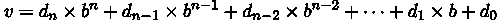
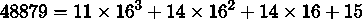
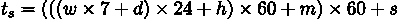
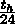

## 第四章：4

内置数据结构第一部分：列表和集合

Python 拥有丰富的内置数据结构。这些数据结构有时被称为“容器”或“集合”，因为它们包含一系列单独的项目。这些结构涵盖了广泛的常见编程场景。

我们将概述内置的各种集合以及它们解决的问题。概述之后，我们将详细探讨列表和集合。

内置的元组和字符串类型是第一章数字、字符串和元组的一部分。这些结构是序列，因此在许多方面与列表集合相似。然而，字符串和元组似乎与不可变的数字有更多的共同点。

下一章，第五章，将探讨字典，以及一些与列表和集合相关的高级主题。特别是，它将探讨 Python 如何处理可变集合对象的引用。这在需要将列表或集合作为参数的函数定义方式上有影响。

在本章中，我们将探讨以下配方，所有这些都与 Python 的内置数据结构相关：

+   选择数据结构

+   构建列表 - 字面量、追加和推导式

+   切片和切块列表

+   缩小列表 - 删除、移除和弹出

+   编写与列表相关的类型提示

+   反转列表的副本

+   构建集合 - 字面量、添加、推导式和运算符

+   缩小集合 - remove()、pop()和差集

+   编写与集合相关的类型提示

# 4.1 选择数据结构

Python 提供了一些内置数据结构来帮助我们处理数据集合。将数据结构功能与我们要解决的问题相匹配可能会令人困惑。

我们如何选择使用哪种结构？

## 4.1.1 准备工作

在我们将数据放入集合之前，我们需要考虑我们将如何收集数据，以及我们拥有集合后我们将做什么。一个重要的问题是如何在集合中识别特定的项目。Python 提供了多种选择。

## 4.1.2 如何做...

1.  编程是否关注值的存不存在？一个例子是验证输入值。当用户输入集合中的内容时，他们的输入是有效的；否则，输入无效。简单的成员资格测试建议使用集合：

    ```py
    def confirm() -> bool: 

        yes = {"yes", "y"} 

        no = {"no", "n"} 

        while (answer := input("Confirm: ")).lower() not in (yes | no): 

            print("Please respond with yes or no") 

        return answer in yes
    ```

    集合以无特定顺序的方式存储项目。如果顺序很重要，那么列表更合适。

1.  我们是否将通过在集合中的位置来识别项？一个例子包括输入文件中的行——行号是其在集合中的位置。当我们使用索引或位置来识别项时，我们必须使用列表：

    ```py
    >>> month_name_list = ["Jan", "Feb", "Mar", "Apr", 

    ... "May", "Jun", "Jul", "Aug", 

    ... "Sep", "Oct", "Nov", "Dec"] 

    >>> month_name_list[8] 

    ’Sep’ 

    >>> month_name_list.index("Feb") 

    1
    ```

    我们已经创建了一个名为`month_name_list`的列表，其中包含 12 个字符串项，并按照特定顺序排列。我们可以通过提供索引位置来选择一个项。我们还可以使用`index()`方法来返回列表中项的索引位置。Python 中的列表索引值始终从零开始。虽然列表具有简单的成员资格测试，但对于非常大的列表，这种测试可能会很慢，如果需要执行许多此类测试，那么集合可能是一个更好的选择。

    如果集合中的项数是固定的——例如，RGB 颜色有三个值——这表明元组而不是列表是一个更好的选择。如果项的数量将增长和变化，那么列表集合比元组集合是一个更好的选择。

1.  我们是否将通过与项的索引不同的键值来识别集合中的项？一个例子可能包括字符字符串（例如单词）与表示这些单词频率的整数之间的映射。另一个例子可能是一个颜色名称与该颜色的 RGB 元组之间的映射。我们将在第五章“内置数据结构第二部分：字典”中查看映射和字典。重要的区别是映射不像列表那样通过数值索引位置来定位项。

1.  考虑集合中项的可变性（以及字典中的键）。集合中的每个项都必须是不可变对象。数字、字符串和元组都是不可变的，可以收集到集合中。由于列表、字典和集合对象是可变的，因此不能用作集合中的项。例如，不可能构建一个由列表对象组成的集合。

    我们可以选择将每个列表项转换为一个不可变的元组对象，而不是创建一组列表项。同样，字典键也必须是不可变的。我们可以使用数字、字符串或元组作为字典键。我们不能使用列表、集合或任何其他可变对象作为字典键。

## 4.1.3 它是如何工作的...

每个 Python 内置的集合都提供了一组独特的功能。集合还提供了大量重叠的功能。对于 Python 新手程序员来说，挑战在于将每个集合的独特功能映射到他们试图解决的问题。

`collections.abc`模块提供了一种通过内置容器类的路线图。该模块定义了我们使用的具体类背后的抽象基类（ABC）。我们将使用这些定义中的名称来指导我们了解其功能。

从 ABC 中，我们可以看到有三类总共有六种实现选择的集合：

+   集合：它的独特之处在于项要么是成员，要么不是。这意味着重复项被忽略：

    +   可变集合：内置的 set 集合

    +   不可变集合：内置的 frozenset 集合

+   序列：其独特之处在于项目提供了索引位置：

    +   可变序列：内置的列表集合

    +   不可变序列：内置的 tuple 集合。这是第一章中一些菜谱的主题。

+   映射：其独特之处在于每个项目都有一个键，该键指向一个值：

    +   可变映射：内置的 dict 集合。这是第五章的主题。

    +   不可变映射：有趣的是，没有内置的 frozen 映射。

Python 的库提供了这些核心集合类型的额外实现。collections 模块包括：

+   namedtuple：一个元组，为元组中的每个项目提供名称。使用 rgb_color.red 比使用 rgb_color[0] 更清晰。

+   deque：一个双端队列。它是一个可变序列，对从两端推入和弹出进行了优化。我们可以用列表做类似的事情，但当需要两端的变化时，deque 更有效率。

+   defaultdict：一个 dict，可以为缺失的键提供一个默认值。

+   Counter：一个 dict，设计用来计数键的出现的次数。这有时被称为多重集合或包。

+   ChainMap：一个 dict，可以将多个字典组合成一个映射。

此外，还有一个较旧的 OrderedDict 类。这个类保留了键的创建顺序。从 Python 3.7 开始，普通字典的键保留了创建顺序，使得 OrderedDict 类变得冗余。

## 4.1.4 更多...

Python 标准库中还有更多。我们还可以使用 heapq 模块，它定义了一种列表，充当高性能优先队列。bisect 模块包括快速搜索排序列表的方法。这使得我们可以创建一个列表对象，其性能可以接近字典的非常快速的查找。

我们可以在总结网页上找到数据结构的描述，如这个：[`thealgorist.com`](https://thealgorist.com)。我们将快速查看四个额外的数据结构家族：

+   数组：Python 的 array 模块支持密集填充的值数组。numpy 模块也提供了非常复杂化的数组处理。

+   树：通常，树结构可以用来创建集合、顺序列表或键值映射。我们可以将树视为构建集合或字典的实现技术。我们通常使用对象和类定义来构建树结构。

+   哈希：Python 使用哈希来实现字典和集合。这导致速度良好，但可能消耗大量内存。

+   图：Python 没有内置的图数据结构。然而，我们可以通过一个字典轻松地表示图结构，其中每个节点都有一个相邻节点的列表。像 NetworkX、Pyoxigraph 和 RDFLib 这样的外部库支持复杂的图数据库。

通过一点巧妙的方法，我们可以在 Python 中实现几乎任何类型的数据结构。虽然内置结构通常具有基本功能，但我们可能能够找到可以投入使用的内置结构。我们将在第五章内置数据结构第二部分：字典中探讨映射和字典。

## 4.1.5 参见

+   对于高性能数组处理，请参阅[`numpy.org`](https://numpy.org)。

+   对于高级图分析，请参阅[`networkx.github.io`](https://networkx.github.io)。

+   对于图操作和存储，请参阅[`pyoxigraph.readthedocs.io/en/stable/`](https://pyoxigraph.readthedocs.io/en/stable/)。

+   对于图操作，请参阅[`rdflib.readthedocs.io/en/stable/`](https://rdflib.readthedocs.io/en/stable/)。

# 4.2 构建列表 – 字面量、追加和推导式

如果我们决定根据容器中每个项目的位置创建一个集合——列表——我们有几种构建这种结构的方法。我们将探讨从单个项目组装列表对象的各种方法。

在某些情况下，我们需要一个列表，因为它允许重复的值，与集合不同。这在统计工作中很常见。另一种称为多重集的结构，对于允许重复的统计导向集合也很有用。这个集合在标准库中作为 collections.Counter 提供。

## 4.2.1 准备工作

假设我们需要对一些文件大小进行统计分析。以下是一个简短的脚本，它将为我们提供一些文件的大小：

```py
>>> from pathlib import Path 

>>> home = Path.cwd() / "data" 

>>> for path in sorted(home.glob(’*.csv’)): 

...     print(path.stat().st_size, path.name) 

260 binned.csv 

250 ch14_r03.csv 

2060 ch14_r04.csv 

45 craps.csv 

225 fuel.csv 

156 fuel2.csv 

28 output.csv 

19760 output_0.csv 

19860 output_1.csv 

19645 output_2.csv 

19971 output_3.csv 

19588 output_4.csv 

...
```

我们已经使用 pathlib.Path 对象来表示文件系统中的目录。glob()方法扩展所有与给定模式匹配的名称。

我们希望累积一个包含各种文件大小的列表对象。从该列表中，我们可以计算总大小和平均大小。

## 4.2.2 如何做...

我们有许多创建列表对象的方法：

+   字面量：我们可以使用方括号[]字符包围的值序列创建列表的字面量显示。例如，[1, 2, 3]。Python 需要匹配一个开方括号[和一个闭方括号]来看到一条完整的逻辑行，因此字面量可以跨越物理行。有关更多信息，请参阅第二章编写长行代码食谱。

+   转换函数：我们可以使用 list()函数将其他数据集合转换为列表。

+   追加方法：我们有允许我们逐个构建列表的方法。这些方法包括 append()、extend()和 insert()。我们将在本食谱的使用 append()方法构建列表部分探讨 append()方法。

+   理解：理解是一种特殊的生成器表达式，它从源对象计算出一个列表。我们将在本食谱的编写列表理解部分详细探讨这一点。

创建列表的前两种方法是单个 Python 表达式。最后两种更复杂，我们将展示每种方法的配方。

### 使用 append()方法构建列表

1.  使用字面语法[]或 list()函数创建一个空列表：

    ```py
    >>> file_sizes = []
    ```

1.  通过 append()方法遍历一些数据源。将项目添加到列表中：

    ```py
    >>> home = Path.cwd() / "data" 

    >>> for path in sorted(home.glob(’*.csv’)): 

    ...     file_sizes.append(path.stat().st_size) 

    >>> print(file_sizes) 

    [260, 250, 2060, 45, 225, 156, 28, 19760, 19860, 19645, 19971, 19588, 19999, 20000, 20035, 19739, 19941, 215, 412, 28, 166, 0, 1810, 0, 0, 16437, 20295] 

    >>> print(sum(file_sizes)) 

    240925
    ```

当我们打印列表时，Python 会以字面符号显示它。如果我们需要将列表复制并粘贴到另一个脚本中，这很方便。

非常重要的是要注意，append()方法不返回任何值。append()方法会修改列表对象，并且不返回任何内容。

### 编写列表推导式

列表推导式的目标是创建一个对象，它占据字面表达式的语法角色：

1.  写出包围要构建的列表对象的[]括号。

1.  写出数据源。这将包括目标变量。请注意，for 子句的末尾没有冒号，因为我们不是在写一个完整的语句：

    ```py
    [... for path in home.glob(’*.csv’)]
    ```

1.  在 for 子句前加上一个表达式来评估，以创建每个值，这些值来自目标变量的值。再次强调，由于这只是一个单一的表达式，我们在这里不能使用复杂语句：

    ```py
    [path.stat().st_size 

      for path in home.glob(’*.csv’)]
    ```

这是一个列表对象构建的例子：

```py
>>> [path.stat().st_size 

...     for path in sorted(home.glob(’*.csv’))] 

[260, 250, 2060, 45, 225, 156, 28, 19760, 19860, 19645, 19971, 19588, 19999, 20000, 20035, 19739, 19941, 215, 412, 28, 166, 0, 1810, 0, 0, 16437, 20295]
```

现在我们已经创建了一个列表对象，我们可以将其分配给一个变量，并对数据进行其他计算和总结。

列表推导式是围绕一个中心生成器表达式构建的，在语言手册中称为推导式。推导式有两个部分：数据表达式子句和 for 子句。数据表达式子句会被反复评估，由 for 子句中分配的变量驱动。

我们可以用 list()函数替换包围要构建的列表对象的[]括号。当我们考虑数据结构可能发生变化的可能性时，使用显式的 list()函数有一个优点。我们可以轻松地将 list()替换为 set()或 Counter()，以利用核心生成器，同时创建一个不同的集合类型。

## 4.2.3 它是如何工作的...

Python 列表对象具有动态大小。当项目被追加或插入，或者列表通过另一个序列的项目扩展时，大小会调整。同样，当项目被弹出或删除时，大小会缩小。

在罕见的情况下，我们可能想要创建一个具有给定初始大小的列表，然后分别设置项目的值。我们可以使用列表推导式来完成这个操作，如下所示：

```py
>>> sieve = [True for i in range(100)]
```

这将创建一个包含 100 个初始项的列表，每个项都是 True。我们可能需要这种初始化来实现埃拉托斯特尼筛法（Sieve of Eratosthenes）算法：

```py
>>> sieve[0] = sieve[1] = False 

>>> for p in range(100): 

...     if sieve[p]: 

...         for n in range(p*2, 100, p): 

...             sieve[n] = False 

>>> prime = [p for p in range(100) if sieve[p]]
```

筛选集合包含一系列 True 和 False 值。每个 True 的索引位置是一个素数。从 p² 开始的每个素数 p 的倍数被设置为 False。素数集合是一个值序列，p 是 sieve[p] 表达式为 True 的素数。

## 4.2.4 更多内容...

创建列表对象的一个常见目标是能够总结它。我们可以使用各种 Python 函数来做这件事。以下是一些示例：

```py
>>> sizes = list(path.stat().st_size 

...     for path in home.glob(’*.csv’)) 

>>> sum(sizes) 

240925 

>>> max(sizes) 

20295 

>>> min(sizes) 

0 

>>> from statistics import mean 

>>> round(mean(sizes), 3) 

8923.148
```

我们使用了内置的 sum()、min() 和 max() 方法来生成这些文档大小的描述性统计信息。哪个索引文件是最小的？我们想知道值列表中最小值的索引位置。我们可以使用 index() 方法来做这件事：

```py
>>> sizes.index(min(sizes)) 

1
```

我们找到了最小值，然后使用 index() 方法定位那个最小值的索引位置。

### 扩展列表的其他方法

我们可以扩展列表对象，也可以将其插入到列表的中间或开头。我们有两种扩展列表的方法：我们可以使用 + 运算符，或者我们可以使用 extend() 方法。以下是一个使用 + 运算符将两个列表合并的示例：

```py
>>> home = Path.cwd() / "src" 

>>> ch3 = list(path.stat().st_size 

...     for path in home.glob(’ch03/*.py’)) 

>>> ch4 = list(path.stat().st_size 

...     for path in home.glob(’ch04/*.py’)) 

>>> len(ch3) 

16 

>>> len(ch4) 

6 

>>> final = ch3 + ch4 

>>> len(final) 

22 

>>> sum(final) 

34853
```

我们创建了一个包含文档大小的列表，文档名称类似于 Chapter_03/*.py。然后我们创建了一个包含文档大小的第二个列表，其名称模式略有不同，Chapter_04/*.py。然后我们将这两个列表合并成一个最终的列表。

我们可以在列表中的任何特定位置之前插入一个值。insert() 方法接受一个项目的位置；新值将在给定位置之前：

```py
>>> p = [3, 5, 11, 13] 

>>> p.insert(0, 2) 

>>> p 

[2, 3, 5, 11, 13] 

>>> p.insert(3, 7) 

>>> p 

[2, 3, 5, 7, 11, 13]
```

我们已经向列表对象中插入了两个新值。与 append() 和 extend() 方法一样，insert() 方法不返回任何值。它修改了列表对象。

## 4.2.5 参考信息

+   参考关于切片和切块列表的配方，了解复制列表和从列表中挑选子列表的方法。

+   参考关于缩小列表 - 删除、移除和弹出的配方，了解从列表中移除项目的其他方法。

+   在反转列表副本的配方中，我们将查看如何反转列表。

+   本文提供了一些关于 Python 集合内部工作方式的见解：[`wiki.python.org/moin/TimeComplexity`](https://wiki.python.org/moin/TimeComplexity)。

    在查看表格时，重要的是要注意表达式 O(1) 表示成本基本上是常数。表达式 O(n) 表示成本随着集合大小的增长而增长。

# 4.3 切片和切块列表

有很多次我们想要从列表中挑选项目。最常见的一种处理方式是将列表的第一个项目视为特殊情况。这导致了一种头尾处理方式，其中我们对待列表的头与对待列表尾的项目不同。

我们可以使用这些技术来复制列表。

## 4.3.1 准备工作

我们有一个用于记录大型帆船燃油消耗的电子表格。它的行看起来像这样：

|

* * *

|

* * *

|

* * *

|

* * *

|

| 日期 | 引擎开启 | 燃料高度 |  |
| --- | --- | --- | --- |
|  | 引擎关闭 | 燃料高度 |  |
|  | 其他备注 |  |  |

|

* * *

|

* * *

|

* * *

|

* * *

|

| 10/25/2013 | 08:24:00 AM | 29 |  |
| --- | --- | --- | --- |
|  | 01:15:00 PM | 27 |  |
|  | 平静大海 – 锚定所罗门岛 |  |  |

|

* * *

|

* * *

|

* * *

|

* * *

|

| 10/26/2013 | 09:12:00 AM | 27 |  |
| --- | --- | --- | --- |
|  | 06:25:00 PM | 22 |  |
|  | choppy – 锚定在杰克逊溪 |  |  |

|

* * *

|

* * *

|

* * *

|

* * *

|

|  |  |  |  |
| --- | --- | --- | --- |

表 4.1：帆船燃油使用示例

在这个数据集中，燃料是通过高度来测量的。这是因为使用了深度为英寸的视距计，校准。对于所有实际目的，油箱是矩形的，所以显示的深度可以转换成体积，因为我们知道 31 英寸的深度大约是 75 加仑。

这个电子表格数据的例子没有正确规范化。理想情况下，所有行都遵循数据的第一范式：一行应该有相同的内容，每个单元格应该只有原子值。在这个数据中，有三种子类型的行：

1.  三行组的第一行包含引擎开启日期、时间和一个测量值。

1.  一组中的第二行包含引擎关闭时间和一个测量值。

1.  第三行有一些不太有用的备注。

这种非规范化数据包括以下两个问题：

+   .csv 文件有四行标题。（第四行是一个空白行，在此格式良好的书中未显示。）这是 csv 模块无法直接处理的事情。

+   每天的旅行分布在三行中。这些行必须合并起来，以便更容易计算经过的时间和使用的燃料英寸数。

我们可以使用如下定义的函数来读取数据：

```py
import csv 

from pathlib import Path 

def get_fuel_use(path: Path) -> list[list[str]]: 

    with path.open() as source_file: 

        reader = csv.reader(source_file) 

        log_rows = list(reader) 

    return log_rows
```

我们已经使用 csv 模块读取了日志细节。csv.reader()函数返回的对象是可迭代的。为了将项目收集到一个单独的列表中，我们对可迭代对象应用了 list()函数；这从读取器创建了一个列表对象。

原始 CSV 文件的每一行都是一个列表。以下是第一行和最后一行的样子：

```py
>>> log_rows[0] 

[’date’, ’engine on’, ’fuel height’] 

>>> log_rows[-1] 

[’’, "choppy -- anchor in jackson’s creek", ’’] 
```

对于这个食谱，我们将使用列表索引表达式的扩展来从行列表中切片项。切片，就像索引表达式一样，跟在列表对象后面的[]字符中。Python 提供了几种切片表达式的变体，以便我们可以从行列表中提取有用的子集。

## 4.3.2 如何操作...

1.  我们需要做的第一件事是从行列表中删除四行标题。我们将使用两个部分切片表达式来通过第四行分割列表：

    ```py
    >>> head, tail = log_rows[:4], log_rows[4:] 

    >>> head[0] 

    [’date’, ’engine on’, ’fuel height’] 

    >>> head[-1] 

    [’’, ’’, ’’] 

    >>> tail[0] 

    [’10/25/13’, ’08:24:00 AM’, ’29’] 

    >>> tail[-1] 

    [’’, "choppy -- anchor in jackson’s creek", ’’]
    ```

    我们使用 log_rows[:4]和 log_rows[4:]将列表切分成两部分。第一个切片表达式选择前四行；这被分配给 head 变量。第二个切片表达式选择从第 4 行到列表末尾的行。这被分配给 tail 变量。这是我们关心的表格行。

1.  我们将使用带有步骤的切片来选择有趣的行。切片的 [start:stop:step] 版本将根据步骤值分组选择行。在我们的例子中，我们将取两个切片。一个切片从行零开始——“引擎开启”行——另一个切片从行一开始——“引擎关闭”行。

    这里是每第三行的切片，从行零开始：

    ```py
    >>> pprint(tail[0::3], width=64) 

    [[’10/25/13’, ’08:24:00 AM’, ’29’], 

     [’10/26/13’, ’09:12:00 AM’, ’27’]]
    ```

    我们已经使用了来自 pprint 模块的 pprint() 函数来使输出更容易阅读。

    从行一开始，每第三行有额外的数据：

    ```py
    >>> pprint(tail[1::3], width=48) 

    [[’’, ’01:15:00 PM’, ’27’], 

     [’’, ’06:25:00 PM’, ’22’]]
    ```

1.  这两个切片然后可以组合在一起以创建一对对的列表：

    ```py
    >>> paired_rows = list(zip(tail[0::3], tail[1::3])) 

    >>> pprint(paired_rows) 

    [([’10/25/13’, ’08:24:00 AM’, ’29’], [’’, ’01:15:00 PM’, ’27’]), 

     ([’10/26/13’, ’09:12:00 AM’, ’27’], [’’, ’06:25:00 PM’, ’22’])]
    ```

    这给我们一个由三个元组的对组成的序列。这非常接近我们可以处理的东西。

1.  展平结果：

    ```py
     >>> paired_rows = list(zip(tail[0::3], tail[1::3])) 

    >>> combined = [a+b for a, b in paired_rows] 

    >>> pprint(combined) 

    [[’10/25/13’, ’08:24:00 AM’, ’29’, ’’, ’01:15:00 PM’, ’27’], 

     [’10/26/13’, ’09:12:00 AM’, ’27’, ’’, ’06:25:00 PM’, ’22’]]
    ```

    我们已经使用了一个列表推导式从 构建列表 – 字面量、追加和推导式 章节中结合每对行的两个元素以创建一个单行。这有更规范化的数据描述每段航程。

从结果列表中，我们现在可以计算时间差以得到船的运行时间。我们可以计算高度差以估计每段旅程中消耗的燃料。这个包含五个有用项——日期、时间、高度、时间、高度——的单行列表包含了所需的所有数据。它还有一个通常包含空字符串的列。

## 4.3.3 它是如何工作的...

切片操作符有几种不同的形式：

+   [:]: 开始和结束是隐含的。表达式 S[:] 将创建序列 S 的一个副本。

+   [:stop]: 这将从开始到停止索引之前创建一个新的列表。

+   [start:]: 这将从给定的开始到序列的末尾创建一个新的列表。

+   [start:stop]: 这将选择一个子列表，从起始索引开始，到停止索引之前结束。Python 使用半开区间。起始索引包含在内，而停止索引不包含。

+   [::step]: 开始和结束是隐含的，包括整个序列。步骤——通常不等于一——意味着我们将使用步骤从开始跳过列表。对于给定的步骤，s，和大小为 |L| 的列表，索引值是 i ∈{s×n∣n ∈ℕ and 0 ≤ s×n < |L|}。

+   [start::step]: 起始是给定的，但停止是隐含的。想法是起始是一个偏移量，步骤应用于该偏移量。对于给定的起始，a，步骤，s，和大小为 |L| 的列表，索引值是 i ∈{s × n + a∣n ∈ℕ and 0 ≤ s × n + a < |L|}。

+   [:stop:step]: 这用于防止处理列表中的最后几个元素。由于给出了步骤，处理从元素零开始。

+   [start:stop:step]: 这将从序列的子集中选择元素。在起始索引之前和从停止索引到结束的元素将不会使用。

切片技术适用于列表、元组、字符串以及任何其他类型的序列。切片不会导致集合被修改；相反，切片将序列的一部分制作成副本。现在，源集合中的项在集合之间共享。

## 4.3.4 更多...

在反转列表副本的菜谱中，我们将探讨切片表达式的一种更复杂的使用方法。

序列的副本被称为浅拷贝，因为将会有两个集合，每个集合都包含对相同底层对象的引用。我们将在制作浅拷贝和深拷贝的对象的菜谱中详细探讨这一点。

对于这个特定的例子，我们还有另一种将多行数据重新结构化为单行数据的方法：我们可以使用生成器函数。我们将在第九章中在线查看函数式编程技术。

## 4.3.5 参考信息

+   请参考构建列表 - 字面量、追加和推导的菜谱，了解创建列表的方法。

+   请参考缩小列表 - 删除、移除和弹出的菜谱，了解从列表中删除项的其他方法。

+   在反转列表副本的菜谱中，我们将探讨如何反转列表。

+   [pandas](https://pandas.pydata.org) 包提供了一些与 CSV 文件一起工作的额外方法。

# 4.4 缩小列表 - 删除、移除和弹出

有很多次我们想要从列表集合中删除项。我们可能从列表中删除项，然后处理剩下的项。

移除不需要的项与使用 filter() 创建只包含所需项的副本的效果相似。区别在于，过滤后的副本将比从列表中删除项使用更多的内存。我们将展示两种从可变列表中删除不需要项的技术。

## 4.4.1 准备工作

我们有一个用于记录大型帆船燃油消耗的电子表格。请参阅表 4.1 中的数据。

关于此数据的更多背景信息，请参考本章前面的切片和切块列表菜谱。get_fuel_use() 函数将收集原始数据。需要注意的是，此数据的结构——每个事实分布在三个单独的行中——非常糟糕，需要相当多的注意来重建更有用的东西。

原始 CSV 文件的每一行都是一个列表。这些列表中的每一个都包含三个项。删除包含标题和无用数据的某些行是至关重要的。

## 4.4.2 如何操作...

我们将探讨几种从列表中删除项的方法：

+   del 语句。

+   remove() 方法。

+   pop() 方法。

+   我们还可以使用切片赋值来替换列表中的项。

### del 语句

我们可以使用 del 语句从列表中删除项目。我们可以提供一个对象和一个切片来从列表对象中删除一组行。以下是 del 语句的示例：

```py
>>> del log_rows[:4] 

>>> log_rows[0] 

[’10/25/13’, ’08:24:00 AM’, ’29’] 

>>> log_rows[-1] 

[’’, "choppy -- anchor in jackson’s creek", ’’] 
```

del 语句删除了前四行，留下了我们真正需要处理的行。然后我们可以将这些行组合起来，使用 Slicing and dicing a list 配方进行总结。

### remove()方法

我们可以使用 remove()方法从列表中删除项目。给定一个特定的值，它会从列表中删除匹配的项目。

我们可能有一个看起来像这样的列表：

```py
 >>> row = [’10/25/13’, ’08:24:00 AM’, ’29’, ’’, ’01:15:00 PM’, ’27’]
```

我们可以删除列表中的无用“”项目：

```py
>>> row.remove(’’) 

>>> row 

[’10/25/13’, ’08:24:00 AM’, ’29’, ’01:15:00 PM’, ’27’]
```

注意到 remove()方法不返回值。它会在原地修改列表。

如构建列表 – 字面量、追加和推导配方中所述，以下代码是不正确的：

```py
a = [’some’, ’data’] 

a = a.remove(’data’)
```

这绝对是错误的。这将使 a 变为 None。

### pop()方法

我们可以使用 pop()方法从列表中删除项目。这是基于它们的索引从列表中删除项目。

我们可能有一个看起来像这样的列表：

```py
>>> row = [’10/25/13’, ’08:24:00 AM’, ’29’, ’’, ’01:15:00 PM’, ’27’]
```

这包含了一个无用的“”字符串。我们可以找到要弹出项目的索引，然后删除它。以下示例将此代码分解为几个独立的步骤：

```py
>>> target_position = row.index(’’) 

>>> target_position 

3 

>>> row.pop(target_position) 

’’ 

>>> row 

[’10/25/13’, ’08:24:00 AM’, ’29’, ’01:15:00 PM’, ’27’]
```

注意到 pop()方法做了两件事：

+   它通过修改列表对象来删除一个项目。

+   它还返回了被删除的项目。

这种修改和返回值的组合很少见，使得这种方法独特。

### 切片赋值

我们可以通过在赋值语句的左侧使用切片表达式来替换列表中的项目。这让我们可以替换列表中的项目。当替换的大小不同时，它允许我们扩展或收缩列表。这导致了一种使用切片赋值从列表中删除项目的技术。

我们将从位置 3 有一个空值的行开始。这看起来像这样：

```py
>>> row = [’10/25/13’, ’08:24:00 AM’, ’29’, ’’, ’01:15:00 PM’, ’27’] 

>>> target_position = row.index(’’) 

>>> target_position 

3
```

我们可以将一个空列表赋给从索引位置 3 开始到索引位置 4 之前的切片。这将用一个零项切片替换一个单项切片，从而从列表中删除该项目：

```py
>>> row[3:4] = [] 

>>> row 

[’10/25/13’, ’08:24:00 AM’, ’29’, ’01:15:00 PM’, ’27’]
```

del 语句和 remove()、pop()等方法似乎清楚地表明了从集合中删除项目的意图。切片赋值可能不太明确，因为它没有明显的函数名。然而，它确实可以很好地用于删除可以用切片表达式描述的一组项目。

## 4.4.3 它是如何工作的...

因为列表是一个可变对象，所以我们可以从列表中删除项目。这种技术不适用于元组或字符串，因为它们是不可变的。

我们只能删除列表中存在的索引的项目。如果我们尝试删除索引超出允许范围的项，我们将得到 IndexError 异常。

以下示例尝试从一个索引值为零、一和二的列表中删除索引为三的项目：

```py
>>> row = [’’, ’06:25:00 PM’, ’22’] 

>>> del row[3] 

Traceback (most recent call last): 

... 

IndexError: list assignment index out of range
```

## 4.4.4 更多内容...

在 Python 的几个地方，从列表对象中删除可能会变得复杂。如果我们在一个 for 语句中使用列表对象，我们无法从列表中删除项。这样做会导致迭代控制与底层对象的内部状态之间出现意外的冲突。

假设我们想要从列表中删除所有偶数项。以下是一个不正确工作的示例：

```py
>>> data_items = [1, 1, 2, 3, 5, 8, 10, 

... 13, 21, 34, 36, 55] 

>>> for f in data_items: 

...     if f % 2 == 0: 

...         data_items.remove(f) 

>>> data_items 

[1, 1, 3, 5, 10, 13, 21, 36, 55]
```

源列表有几个偶数值。结果是明显不正确的；10 和 36 的值仍然在列表中。为什么有些偶数值项被留在列表中？

让我们看看处理 data_items[5]时会发生什么；它的值为 8。当 remove(8)方法被评估时，该值将被移除，列表中的所有后续值都将向前滑动一个位置。10 值将移动到 5 的位置，即 8 值之前的位置。迭代控制值将前进到下一个位置，该位置将包含 13。10 值将不会被处理。

我们有几种方法可以避免删除时跳过的问题：

+   制作列表的副本：

    ```py
    >>> for f in data_items[:]: 

    ...     if f % 2 == 0: 

    ...         data_items.remove(f)
    ```

+   使用 while 语句并显式维护索引值：

    ```py
    >>> position = 0 

    >>> while position != len(data_items): 

    ...     f = data_items[position] 

    ...     if f % 2 == 0: 

    ...         data_items.remove(f) 

    ...     else: 

    ...         position += 1
    ```

    我们设计了一个 while 语句，只有当 data_items[position]的值为奇数时才增加位置变量。如果值为偶数，则该值将被移除，这也意味着列表中的其他项将向前移动一个位置；保持位置变量的值不变是至关重要的。

+   我们也可以以相反的顺序遍历列表。表达式 range(len(row)-1, -1, -1)将产生从-1 开始的递减索引。这是因为负索引值从列表的末尾向前工作。row[-1]是最后一个项。

## 4.4.5 参见

+   请参阅构建列表 - 字面量、追加和推导配方，了解创建列表的方法。

+   请参阅切片和切块列表配方，了解复制列表和从列表中选取子列表的方法。

+   在反转列表副本配方中，我们将查看如何反转列表。

# 4.5 编写与列表相关的类型提示

typing 模块提供了一些描述列表对象内容的必要类型定义。主要类型定义是 list，我们可以用列表中项的类型来参数化它。它通常看起来像 list[int]。

## 4.5.1 准备工作

我们将查看一个包含两种类型的元组的列表。一些元组是简单的 RGB 颜色。其他元组是某些计算结果的 RGB 颜色。这些是从浮点值而不是整数构建的。我们可能有一个类似这样的异构列表结构：

```py
(’ Brick_Red’, (198, 45, 66)), 

(’ color1’, (198.00, 100.50, 45.00)), 

(’ color2’, (198.00, 45.00, 142.50)), 

]
```

列表中的每一项都是一个包含颜色名称和 RGB 值元组的二元组。RGB 值表示为整数或浮点值的三个元组。这可能会难以用类型提示来描述。

我们有两个与此数据相关的函数。第一个从 RGB 值创建颜色代码。

重要的规则是将每个组件（红色、绿色或蓝色）视为一个 8 位数字，一个介于 0 到 255 之间的值。这三个值通过将红色值左移 16 位和绿色值左移 8 位来组合。Python 的<<运算符执行必要的位移动。|运算符执行“或”操作，将移动的位组合成一个新的整数值。

这个函数的类型提示并不复杂：

```py
def hexify(r: float, g: float, b: float) -> str: 

    return f’#{int(r) << 16 | int(g) << 8 | int(b):06X}’
```

:06X 格式规范产生一个 6 位的十六进制值。

另一种方法是使用表达式 f"#{int(r):02X}{int(g):02X}{int(b):02X}"将每个颜色视为一个单独的十六进制数字对。这使用了三个:02X 格式规范来为每个颜色组件产生 2 位的十六进制值。

当我们使用这个函数从 RGB 数字创建颜色字符串时，它看起来像这样：

```py
>>> hexify(198, 45, 66) 

’#C62D42’
```

然而，另一个函数可能有些令人困惑。这个函数将一个复杂的颜色列表转换成另一个包含十六进制颜色代码的列表：

```py
def source_to_hex_0(src): 

    return [ 

        (n, hexify(*color)) for n, color in src 

    ]
```

我们需要添加类型提示以确保这个函数正确地将颜色列表从数字形式转换为字符串代码形式。

我们在函数名上添加了一个 _0 后缀来区分它和随后的示例。这并不是最佳实践，但我们发现它有助于澄清像这本书中展示的代码：

## 4.5.2 如何做...

我们首先通过添加类型提示来描述输入列表的各个项目，例如之前显示的 scheme 变量：

1.  首先定义结果类型。通常，关注结果并从源数据回溯到产生预期结果所需的数据是有帮助的。在这种情况下，结果是包含颜色名称和颜色十六进制代码的两个元组的列表。我们可以将其描述为 list[tuple[str, str]]，但这种总结隐藏了一些重要的细节。我们更喜欢以下方式暴露这些细节：

    ```py
    ColorCode = tuple[str, str] 

    ColorCodeList = list[ColorCode] 
    ```

    这个列表可以看作是同质的；每个项目都将匹配 ColorCode 类型定义。

1.  定义源类型。在这种情况下，我们有两种稍微不同的颜色定义类型。虽然它们往往重叠，但它们的起源不同，处理历史有时有助于作为类型提示的一部分：

    ```py
    from typing import Union 

    RGB_I = tuple[int, int, int] 

    RGB_F = tuple[float, float, float] 

    ColorRGB = tuple[str, Union[RGB_I, RGB_F]] 

    ColorRGBList = list[ColorRGB]
    ```

    我们定义了基于整数的 RGB 三元组为 RGB_I，基于浮点数的 RGB 三元组为 RGB_F。这两种替代类型组合成 ColorRGB 元组定义。这是一个二元组；第二个元素可以是 RGB_I 类型或 RGB_F 类型的实例。存在联合类型意味着这个列表是异构的。

    我们也可以使用 RGB_I | RGB_F 代替 Union[RGB_I, RGB_F]。

1.  更新函数以包含类型提示。输入将是一个类似于之前显示的模式对象的列表。结果将是一个与 ColorCodeList 类型描述相匹配的列表：

    ```py
    def source_to_hex(src: ColorRGBList) -> ColorCodeList: 
        return [ 

            (n, hexify(*color)) for n, color in src 

        ]
    ```

## 4.5.3 它是如何工作的...

list[T] 类型提示需要一个单一值 T 来描述可以成为此列表一部分的所有对象类型。对于同质列表，类型是直接声明的。对于异构列表，必须使用 Union 来定义可能存在的各种类型。

我们采取的方法将类型提示分解为两层：

+   一个描述集合中单个项目的“基础”层。我们定义了三种原始项目类型：RGB_I 和 RGB_F 类型，以及由此产生的 ColorCode 类型。

+   多个“组合”层，将基础类型组合成复合对象的描述。在这种情况下，ColorRGB、ColorRGBList 和 ColorCodeList 都是复合类型定义。

一旦命名了类型，然后使用定义函数、类和方法使用这些名称。

在阶段定义类型很重要，以避免长而复杂的类型提示，这些类型提示不会提供任何关于正在处理的对象的有用见解。避免像这样的类型描述是好的：

```py
list[tuple[str, Union[tuple[int, int, int], tuple[float, float, float]]]]
```

虽然这在技术上正确，但由于其复杂性，难以理解。将复杂类型分解成有用的组件描述有助于理解。

## 4.5.4 更多...

类型提示假设列表中的每个项目都是单一类型。语法 list[T] 表示所有项目都是类型 T。

在异构列表的情况下，具有多个不同类型，我们需要定义类型的联合。我们可以从 typing 模块导入 Union 类型。或者我们可以使用 | 来为列表提供替代类型。

使用类似 list[RGB_I | RGB_F] 的结构描述了一个包含混合类型项目的列表。

## 4.5.5 参见

+   在第一章，使用 NamedTuples 简化元组中的项目访问的配方提供了一些澄清元组类型提示的替代方法。

+   编写与集合相关的类型提示的配方从集合类型的视角涵盖了这一点。

# 4.6 反转列表的副本

一些算法以相反的顺序产生结果。通常会在列表中收集输出，然后反转列表。作为一个例子，我们将查看将数字转换为特定基数时通常是从最低有效位到最高有效位生成的。我们通常希望以最高有效位首先显示值。这导致需要反转列表中数字的顺序。

## 4.6.1 准备工作

假设我们在进行基数之间的转换。我们将查看一个数字在基数中的表示方式，以及如何从数字计算该表示。

任何值 v 都可以定义为给定基数 b 中各种数字 d[n] 的多项式函数。一个四位数将具有 ⟨d[3]，d[2]，d[1]，d[0]⟩ 作为数字序列。

注意，我们在这里使用的顺序与 Python 列表中项目的通常顺序相反。

这个由数字组成的序列的值 v 由以下多项式给出：



例如，十六进制数 0xBEEF 有以下数字：⟨B = 11,E = 14,E = 14,F = 15⟩，基数 b = 16：



有许多情况下基数不是某个数的连续幂。例如，ISO 日期格式有一个混合基数，涉及每周 7 天，每天 24 小时，每小时 60 分钟，每分钟 60 秒。

而不是 b⁴, b³, b², b¹ = b, 和 b⁰ = 1，我们有 7 × 24 × 60 × 60, 24 × 60 × 60, 60 × 60, 和 60 作为计算多项式的各种值。

给定一个周数，一周中的某一天，一个小时，一个分钟和一个秒，我们可以在给定的年份内计算秒数时间戳 t[s]：



例如：

```py
>>> week = 13 

>>> day = 2 

>>> hour = 7 

>>> minute = 53 

>>> second = 19 

>>> t_s = (((week*7+day)*24+hour)*60+minute)*60+second 

>>> t_s 

8063599
```

这显示了如何将给定的时间点转换为时间戳。我们如何反转这个计算？我们如何从整体时间戳中获取各个字段？

我们需要使用 divmod 风格的除法。有关背景信息，请参阅在真除法和取整除法之间选择配方。

将秒数时间戳 t[s] 转换为单独的周、天和时间字段的算法如下：

| t[m]; s | = ⌊⌋; t[s] mod 60 |  |  |
| --- | --- | --- | --- |
| t[h]; m | = ⌊⌋; t[m] mod 60 |  |  |
| t[d]; h | = ⌊⌋; t[h] mod 24 |  |  |
| w; d | = ⌊⌋; t[d] mod 7 |  |  |

这有一个实用的模式，导致实现。它产生值的顺序是相反的：

```py
>>> t_s = 8063599 

>>> fields = [] 

>>> for base in 60, 60, 24, 7: 

...     t_s, f = divmod(t_s, base) 

...     fields.append(f) 

>>> fields.append(t_s) 

>>> fields 

[19, 53, 7, 2, 13]
```

我们已经四次应用了 divmod() 函数，从以秒为单位的时间戳中提取秒、分钟、小时、天和周。它们的顺序是错误的。我们如何将它们反转？

## 4.6.2 如何做到这一点...

我们有三种方法：我们可以使用 reverse() 方法，我们可以使用 [::-1] 切片表达式，或者我们可以使用 reversed() 内置函数。以下是 reverse() 方法：

```py
>>> fields_copy1 = fields.copy() 

>>> fields_copy1.reverse() 

>>> fields_copy1 

[13, 2, 7, 53, 19]
```

我们创建了原始列表的副本，这样我们就可以保留一个未修改的副本以与修改后的副本进行比较。这使得跟踪示例变得更容易。我们应用了 reverse() 方法来反转列表的副本。

这将修改列表。与其他修改方法一样，它不会返回一个有用的值。使用像 a = b.reverse(); 这样的语句是不正确的，a 的值始终是 None。

这是一个带有负步长的切片表达式：

```py
>>> fields_copy2 = fields[::-1] 

>>> fields_copy2 

[13, 2, 7, 53, 19]
```

在这个例子中，我们创建了一个使用隐含的起始和结束位置以及步长为 -1 的切片 [::-1]。这以相反的顺序选择列表中的所有项以创建一个新的列表。

原始列表在切片操作中明确没有被修改。这创建了一个副本。检查 fields 变量的值以确认它没有改变。

这就是如何使用 reversed() 函数来创建一个值的列表的反向副本：

```py
>>> fields_copy3 = list(reversed(fields)) 

>>> fields_copy3 

[13, 2, 7, 53, 19]
```

在这个例子中，使用 list()函数很重要。reversed()函数是一个生成器，我们需要消耗生成器中的项来创建一个新的列表。

## 4.6.3 工作原理...

正如我们在切片和切块列表配方中提到的，切片符号相当复杂。使用具有负步长的切片将按从右到左的顺序创建一个副本（或子集），而不是默认的从左到右的顺序。

很重要要区分这三种方法：

+   reverse()方法修改列表对象本身。与 append()和 remove()等方法一样，此方法没有返回值。因为它改变了列表，所以它不返回值。

+   [::-1]切片表达式创建了一个新的列表。这是原始列表的浅拷贝，顺序被反转。

+   reversed()函数是一个生成器，它以相反的顺序产生值。当值被 list()函数消耗时，它创建列表的副本。

## 4.6.4 相关内容

+   请参考制作浅拷贝和深拷贝的对象配方以获取有关浅拷贝是什么以及为什么我们可能想要制作深拷贝的更多信息。

+   请参考构建列表 - 字面量、追加和推导式配方了解创建列表的方法。

+   请参考切片和切块列表配方了解复制列表和从列表中选取子列表的方法。

+   请参考缩小列表 - 删除、移除和弹出配方了解从列表中删除项的其他方法。

# 4.7 构建集合 - 字面量、添加、推导式和运算符

如果我们决定仅基于一个项的存在来创建一个集合（即集合），我们有几种构建这种结构的方法。由于集合的窄焦点，项目没有顺序——没有相对位置——并且项目不能重复。我们将探讨从单个项目的来源组装集合集合的多种方法。

集合运算符与集合论数学中定义的运算符平行。这些运算符对于在集合之间进行大量比较很有帮助。我们将探讨这些运算符，以及集合类的方法。

集合有一个重要的约束：它们只包含不可变对象。非正式地说，不可变对象没有内部状态可以改变。数字是不可变的，字符串也是如此，不可变对象的元组也是。正式地说，不可变对象有一个内部哈希值，hash()函数将显示这个值。

下面是如何在实际中做到这一点：

```py
>>> a = "string" 

>>> hash(a) 

... # doctest: +SKIP 

4964286962312962439 

>>> b = ["list", "of", "strings"] 

>>> hash(b) 

Traceback (most recent call last): 

... 

TypeError: unhashable type: ’list’
```

a 变量的值是一个不可变的字符串，它有一个哈希值。另一方面，b 变量是一个可变列表，没有哈希值。我们可以创建包含字符串等不可变对象的集合，但如果尝试将可变对象放入集合中，将会引发 TypeError 异常。

## 4.7.1 准备工作

假设我们需要对一个复杂应用程序中模块之间的依赖关系进行分析。以下是可用数据的一部分：

```py
>>> import_details = [ 

... (’Chapter_12.ch12_r01’, [’typing’, ’pathlib’]), 

... (’Chapter_12.ch12_r02’, [’typing’, ’pathlib’]), 

... (’Chapter_12.ch12_r03’, [’typing’, ’pathlib’]), 

... (’Chapter_12.ch12_r04’, [’typing’, ’pathlib’]), 

... (’Chapter_12.ch12_r05’, [’typing’, ’pathlib’]), 

... (’Chapter_12.ch12_r06’, [’typing’, ’textwrap’, ’pathlib’]), 

... (’Chapter_12.ch12_r07’, [’typing’, ’Chapter_12.ch12_r06’, ’Chapter_12.ch12_r05’, ’concurrent’]), 

... (’Chapter_12.ch12_r08’, [’typing’, ’argparse’, ’pathlib’]), 

... (’Chapter_12.ch12_r09’, [’typing’, ’pathlib’]), 

... (’Chapter_12.ch12_r10’, [’typing’, ’pathlib’]), 

... (’Chapter_12.ch12_r11’, [’typing’, ’pathlib’]), 

... (’Chapter_12.ch12_r12’, [’typing’, ’argparse’])
```

此列表中的每个项目命名了一个模块及其导入的模块列表。我们可以对这个模块之间的关系集合提出许多问题。我们希望计算一个简短的依赖列表，从而从列表中删除重复项。

## 4.7.2 如何实现...

我们有许多创建集合对象的方法：

+   字面量：我们可以使用一系列由字符包围的值来创建集合的文本显示。它看起来像这样：{value, ...}。Python 需要匹配字面量开头的{和结尾的}，以看到完整的逻辑行，因此字面量可以跨越物理行。有关更多信息，请参阅第二章中编写长行代码的配方。

    注意，我们无法使用{}创建一个空集合；这是一个空字典。我们必须使用 set()来创建一个空集合。

+   转换函数：我们可以使用 set()函数将其他数据集合转换为集合。我们可以转换不可变项的列表，或字典的键，或不可变项的元组。

+   添加方法：set 方法中的 add()会将一个项目添加到集合中。此外，集合可以通过 union()方法或|运算符创建。

+   推导式：推导式是一种特殊的生成器表达式，它使用一个表达式来定义成员资格，从而描述集合中的项目。我们将在本配方编写集合推导式部分中详细探讨这一点。

创建集合的前两种方法是单个 Python 表达式。最后两种更复杂，我们将为每种方法提供配方。

### 使用 add 方法构建集合

我们的数据源集合是一个包含子列表的列表。我们希望总结每个子列表中的项目：

1.  创建一个空集合，可以添加项目。与列表不同，没有空集合的缩写语法，因此我们必须使用 set()函数：

    ```py
     >>> all_imports = set()
    ```

1.  编写一个 for 语句来遍历 import_details 集合中的每个二元组。这需要一个嵌套的 for 语句来遍历每对中导入列表中的每个名称。使用 all_imports 集合的 add()方法创建一个包含重复项的完整集合：

    ```py
     >>> for item, import_list in import_details: 

    ...     for name in import_list: 

    ...         all_imports.add(name) 

    >>> all_imports == {’Chapter_12.ch12_r06’, ’textwrap’, 

    ...     ’Chapter_12.ch12_r05’, ’pathlib’, ’concurrent’, 

    ...     ’argparse’, ’typing’} 

    True
    ```

此结果总结了多行细节，显示了导入的不同项目的集合。请注意，这里的顺序是任意的，并且每次执行示例时都可能不同。

任意的顺序意味着用于确认此代码正确性的 doctest 示例不能简单地显示预期的结果。请参阅第十五章中处理常见的 doctest 问题的配方，以获取有关使用 doctest 的更多建议。

### 编写集合推导式

集合推导式的目标是创建一个占据语法角色的对象，类似于集合字面量：

1.  编写包围要构建的集合对象的括号：

    ```py
    >>> {} 

    {}
    ```

1.  编写数据源。这将包括目标变量。我们有两个嵌套列表，因此我们需要使用两个 for 子句。注意，for 子句的末尾没有冒号，因为我们没有写一个完整的语句：

    ```py
    >>> {... 

    ...     for item, import_list in import_details 

    ...         for name in import_list 

    ... } 

    {Ellipsis}
    ```

    现在，我们将表达式的结果写成了特殊的省略号对象。一旦我们完成这个表达式，我们将用更有用的东西替换它。

1.  在 for 子句前加上创建目标集合每个值的表达式。在这种情况下，我们只想从整体导入详情列表中的每一对项目中的导入列表中获取名称：

    ```py
    >>> names = {name 

    ...     for item, import_list in import_details 

    ...         for name in import_list} 

    >>> names ==  {’Chapter_12.ch12_r06’, ’Chapter_12.ch12_r05’, 

    ...     ’typing’, ’concurrent’, ’argparse’, ’textwrap’, ’pathlib’} 

    True
    ```

集合推导不能有重复项，所以这总是有不同值的。

就像列表推导一样，集合推导围绕一个中心生成器表达式构建。这个推导的核心生成器表达式有一个数据表达式子句和一个 for 子句。

我们可以用 set() 函数替换包围的 { 和 } 语法。当我们考虑更改数据结构的可能性时，使用显式的 set() 函数有优势。我们可以轻松地将 set() 替换为 frozenset()、list() 或 Counter()。

## 4.7.3 它是如何工作的...

集合是不可变对象的集合。每个不可变的 Python 对象都有一个哈希值，这些数字哈希码用于优化在集合中定位项目。我们可以想象实现依赖于一个桶的数组，数字哈希值将我们引导到桶中，以查看项目是否存在于该桶中。

哈希值不一定唯一。哈希桶的数组是有限的，这意味着可能发生哈希冲突。当两个不同的对象都具有相同的哈希值时，就会发生冲突。这导致了一些处理任何冲突的开销。

我们可以创建两个将产生哈希冲突的整数：

```py
>>> import sys 

>>> v1 = 7 

>>> v2 = 7+sys.hash_info.modulus 

>>> v1 

7 

>>> v2 

2305843009213693958 

>>> hash(v1) 

7 

>>> hash(v2) 

7
```

尽管这两个对象具有相同的哈希值，但哈希冲突处理将保持这两个对象在集合中相互分离。

## 4.7.4 更多内容...

我们有几种方法可以向集合中添加项目：

+   示例使用了 add() 方法。这对于单个项目是有效的。

+   我们可以使用 union() 方法。这个方法就像一个运算符——它创建一个新的结果集。它不会修改操作数集合中的任何一个。

+   我们可以使用 update() 方法用另一个集合中的项目更新一个集合。这会修改集合，但不返回任何值。

对于这些技术中的大多数，我们需要从我们要添加的项目创建一个单元素集合。以下是一些示例：

```py
>>> collection = {1} 

>>> collection 

{1} 

>>> item = 3 

>>> collection.union({item}) 

{1, 3} 

>>> collection 

{1}
```

在前面的例子中，我们已从 item 变量的值创建了一个单元素集合 {item}。然后我们使用了 union() 方法来计算一个新的集合，这是集合集合和 {item} 集合的并集。

注意，union() 创建了一个新对象，并保留了原始集合不变。这里还有一个使用并集运算符 | 的另一种替代方案：

```py
>>> collection = collection | {item} 

>>> collection 

{1, 3} 
```

我们还可以使用 update() 方法来修改集合：

```py
>>> collection.update({4}) 

>>> collection 

{1, 3, 4}
```

类似于 update() 和 add() 这样的方法会修改集合对象。因为它们会修改集合，所以它们不会返回值。这与列表集合的方法类似。通常，修改集合的方法不会返回值。这个模式的唯一例外是 pop() 方法，它既会修改集合对象又会返回被弹出的值。

Python 有许多集合运算符。这些是我们可以用于复杂集合表达式的普通运算符符号：

+   | 用于集合并集，通常表示为 A ∪ B

+   & 用于集合交集，通常表示为 A ∩ B

+   ^ 用于集合对称差集，通常表示为 A △ B

+   - 用于集合减法，通常表示为 A ∖ B

## 4.7.5 参考内容

+   在缩小集合 – remove(), pop(), 和 difference 菜谱中，我们将探讨如何通过删除或替换项目来更新集合。

# 4.8 缩小集合 – remove(), pop(), 和 difference

Python 给我们几种从集合集合中删除项目的方法。我们可以使用 remove() 方法来删除一个特定的项目。我们可以使用 pop() 方法来删除（并返回）一个任意项目。

此外，我们可以使用集合交集、差集和对称差集运算符：&、- 和 ^ 来计算一个新的集合。这些将产生一个新的集合，它是给定输入集合的子集。

## 4.8.1 准备工作

有时，我们会有包含复杂和多变格式的日志文件。以下是从一个长而复杂的日志中摘取的一小段：

```py
>>> log = """ 

... [2016-03-05T09:29:31-05:00] INFO: Processing ruby_block[print IP] action run (@recipe_files::/home/slott/ch4/deploy.rb line 9) 

... [2016-03-05T09:29:31-05:00] INFO: Installed IP: 111.222.111.222 

... [2016-03-05T09:29:31-05:00] INFO: ruby_block[print IP] called 

...
```

```py

... (Skipping some details)
```

```py
 ... """
```

我们需要在这个日志中找到所有类似于 IP: 111.222.111.222 的文本。这些是具有 4 个数字字段的 IPv4 地址。

这是我们如何创建匹配项集合的方法：

```py
>>> import re 

>>> pattern = re.compile(r"IP: \d+\.\d+\.\d+\.\d+") 

>>> matches = set(pattern.findall(log)) 

>>> matches 

{’IP: 111.222.111.222’}
```

我们这个日志的问题是有一些无关的匹配项。日志文件中还有一些看起来相似但却是我们需要忽略的占位符或占位值。在完整的日志中，我们还会找到包含类似 IP: 1.2.3.4 这样的文本的行，这是一个占位符，不是一个有意义的地址。结果证明，存在一组不相关的值。

这是在集合交集和集合减法可以非常有帮助的地方。

## 4.8.2 如何做到...

1.  创建一个我们想要忽略的项目集合，作为一个集合字面量：

    ```py
    >>> to_be_ignored = {’IP: 0.0.0.0’, ’IP: 1.2.3.4’}
    ```

1.  收集日志中的所有条目。我们将使用前面展示的 re 模块来完成此操作。我们将看到以下结果：

    ```py
    >>> matches = {’IP: 111.222.111.222’, ’IP: 1.2.3.4’} 
    ```

1.  使用集合减法从匹配项集合中删除项目。以下有两个示例：

    ```py
    >>> matches - to_be_ignored 

    {’IP: 111.222.111.222’} 

    >>> matches.difference(to_be_ignored) 

    {’IP: 111.222.111.222’}
    ```

    这两个都是返回新集合作为结果的运算符。这两个都不会修改底层集合对象。

结果表明，difference() 方法可以与任何可迭代的集合一起工作，包括列表和元组。虽然允许混合集合和列表，但这可能会造成混淆，并且为它们编写类型提示可能会很具挑战性。

我们经常在语句中使用这些，例如以下示例：

```py
>>> valid_matches = matches - to_be_ignored 

>>> valid_matches 

{’IP: 111.222.111.222’}
```

这将把结果集合分配给一个新的变量，valid_matches，这样我们就可以对这个新集合进行所需的处理。

我们还可以使用 `remove()` 和 `pop()` 方法来移除特定项目。当无法移除项目时，`remove()` 方法会引发异常。我们可以利用这种行为来确认项目是否在集合中，并移除它。

## 4.8.3 它是如何工作的...

集合对象跟踪项目的成员资格。一个项目要么在集合中，要么不在。我们指定要移除的项目。移除项目不依赖于索引位置或键值。

集合运算符允许复杂的集合计算。我们可以从目标集合中移除一个集合中的任何项目，计算集合差或集合减法。

## 4.8.4 更多内容...

我们有几种其他方法可以从集合中移除项目：

+   在这个例子中，我们使用了 `difference()` 方法和 `-` 操作符。`difference()` 方法的行为类似于操作符，并创建一个新的集合。

+   我们还可以使用 `difference_update()` 方法。这将就地修改一个集合。它不会返回任何值。

+   我们可以使用 `remove()` 方法移除单个项目。

+   我们还可以使用 `pop()` 方法移除任意项目。这在这个例子中不太适用，因为我们无法控制从集合中弹出的项目。

下面是 `difference_update()` 方法的样子：

```py
>>> valid_matches = matches.copy() 

>>> valid_matches.difference_update(to_be_ignored) 

>>> valid_matches 

{’IP: 111.222.111.222’}
```

我们应用了 `difference_update()` 方法来从 `valid_matches` 集合中移除不希望的项目。由于 `valid_matches` 集合被修改了，没有返回值。此外，由于这是一个副本，此操作不会修改原始的 `matches` 集合。

我们可以使用以下示例来使用 `remove()` 方法。请注意，如果项目不在集合中，`remove()` 将引发异常：

```py
>>> valid_matches = matches.copy() 

>>> for item in to_be_ignored: 

...     if item in valid_matches: 

...         valid_matches.remove(item) 

>>> valid_matches 

{’IP: 111.222.111.222’}
```

在尝试移除项目之前，我们测试了项目是否在 `valid_matches` 集合中，以避免引发 `KeyError` 异常。使用 `if` 语句是避免引发异常的一种方法。另一种方法是使用 `try:` 语句来抑制当项目不存在时引发的异常。

我们还可以使用 `pop()` 方法来移除任意项目。这种方法很特别，因为它既修改了集合，又返回了被移除的项目。然而，我们无法控制哪个项目被弹出，这使得它不适合这个例子。

# 4.9 编写与集合相关的类型提示

`typing` 模块提供了一些基本类型定义，用于描述集合对象的内部内容。主要类型定义是 `set`，我们可以用集合中项目的类型来参数化它。我们将使用 `set[int]` 来描述由整数组成的集合。这与编写与列表相关的类型提示食谱相平行。

## 4.9.1 准备工作

类似于 Zonk（也称为 10,000 或 Greed）的掷骰子游戏需要将一组随机骰子分组到“手”中。虽然规则各不相同，但手有几种模式，包括：

+   三张相同的牌。

+   一组五个递增的骰子（1-2-3-4-5 或 2-3-4-5-6 是两种组合）。

+   一组六个递增的骰子（称为“大顺子”）。

+   一个“王牌”手。这至少有一个不是三张相同或顺子的 1 骰子。

+   一组相同的六个骰子。虽然罕见，但并非不可能。

我们将使用以下类和函数定义来创建骰子手牌：

```py
import random 

class Die(str, Enum): 

    d_1 = "\u2680" 

    d_2 = "\u2681" 

    d_3 = "\u2682" 

    d_4 = "\u2683" 

    d_5 = "\u2684" 

    d_6 = "\u2685" 

def zonk(n: int = 6) -> tuple[Die, ...]: 

    faces = list(Die) 

    return tuple(random.choice(faces) for _ in range(n))
```

Die 类的定义通过提供适当的 Unicode 字符来枚举标准骰子的六个面。

当我们评估 zonk()函数时，它看起来是这样的。

```py
>>> zonk() 

(<Die.d_6: ’’>, <Die.d_1: ’’>, <Die.d_1: ’’>, 

 <Die.d_6: ’’>, <Die.d_3: ’’>, <Die.d_2: ’’>)
```

这向我们展示了一副包含两个六、两个一、一个二和一个三的手牌。在检查手牌以寻找模式时，我们通常会创建复杂的一组对象。

## 4.9.2 如何实现...

一个用于分析骰子模式的功能通过从六个骰子实例创建一个 set[Die]对象来工作。这个集合揭示了许多信息：

+   当集合中独特的值只有一个骰子时，那么所有六个骰子都有相同的值。

+   当集合中独特的值有五个骰子时，这可能是小顺子。这需要额外的检查以查看独特的值集合是否为 1-5 或 2-6，这两个是有效的小顺子。

+   当集合中独特的值有六个不同项时，那么这必须是一个大顺子。

+   对于两个独特的骰子值，至少会有一个三个一的情况。可能会有四个或五个一的情况，但这些被计分为三个一，剩余的骰子不计分。

+   对于集合中的三个或四个独特骰子，可能会有三个一的情况。需要更详细地分析集合以查看确切的模式。

我们可以通过查看独特骰子集合的基数来区分许多模式。剩余的区别可以通过查看计数模式来实现。为此，collections.Counter 对象将很有用。

下面是如何编写这种基于集合的分析：

1.  定义集合中每个项目的类型。在这个例子中，Die 类是项目类。我们将使用 set[Die]和 Counter[Die]类型。

1.  使用 Die 实例的手牌中的独特值创建集合对象。下面是评估函数如何开始：

    ```py
    import collections 

    def eval_zonk_6(hand: tuple[Die, ...]) -> str: 

        assert len(hand) == 6, "Only works for 6-dice zonk." 

        unique: set[Die] = set(hand)
    ```

1.  有两个小顺子的定义：1-5 和 2-6：

    ```py
     faces = list(Die) 

        small_straights = [ 

            set(faces[:-1]), set(faces[1:]) 

        ]
    ```

    我们可以在分析函数的主体中构建这两个集合，以展示它们是如何被使用的。从实用主义的角度来看，small_straights 的值应该只计算一次。

    我们不能构建这两个集合实例的集合，因为集合对象是可变的。我们可以通过构建两个 frozenset 对象来代替构建列表。

1.  检查简单的情况。集合中不同元素的数量直接识别了几种手牌：

    ```py
     if len(unique) == 6: 

            return "large straight" 

        elif len(unique) == 5 and unique in small_straights: 

            return "small straight" 

        elif len(unique) == 2: 

            return "three of a kind" 

        elif len(unique) == 1: 

            return "six of a kind"
    ```

1.  当集合中有三个或四个独特值时，可以使用计数来总结模式。这种频率计数的模式可以总结为 set[int]：

    ```py
     elif len(unique) in {3, 4}: 

            # 4 unique: wwwxyz (good) or wwxxyz (bad) 

            # 3 unique: xxxxyz, xxxyyz (good) or xxyyzz (bad) 

            frequencies: set[int] = set( 

                collections.Counter(hand).values())
    ```

1.  对于三个或四个不同的 Die 值的情况，这些可以形成各种模式。如果至少有一个 Die 的频率为三个或四个，那么这就是一个计分组合。如果没有其他匹配，并且有一个骰子显示一，那么这就是最小得分：

    ```py
     if 3 in frequencies or 4 in frequencies: 

                return "three of a kind" 

            elif Die.d_1 in unique: 

                return "ace" 
    ```

1.  是否还有剩余的条件？这涵盖了所有可能的骰子基数和频率吗？剩余的情况包括没有“一个”出现的成对和单数集合。在上述 if 语句之后，我们可以提供一个单独的返回语句来收集所有其他情况到一个单一的、不计分的 Zonk 中：

    ```py
     return "Zonk!"
    ```

这显示了两种使用集合评估数据项集合模式的方法。第一个集合，set[Die]，检查了唯一 Die 值的整体模式。第二个集合，set[int]，检查了 Die 值频率的模式。

## 4.9.3 它是如何工作的...

集合的基本属性是成员资格。当我们从 Die 实例的集合中计算集合时，我们使用 set[Die]类型提示来描述这个结构。

类似地，当我们查看频率分布时，只有几种不同的模式。将计数转换为具有 set[int]类型提示的值的集合，描述了这种额外的结构。

## 4.9.4 更多内容...

一组没有单一、统一类型的项可能会令人困惑。我们可以使用 set[T1 | T2]来描述一个可以包含 T1 或 T2 类型的项的集合。

计算骰子手的分数取决于哪些骰子是获胜模式的一部分。这意味着当结果是三张牌时，评估函数需要返回一个更复杂的结果。为了确定分数，我们需要考虑三种情况：

+   Dice 类中哪个值出现了三次或六次。这决定了基础分数。通常，1 被赋予 1,000 分，2 到 6 被赋予 200 到 600 分。

+   抛出两个三重组合是可能的；这种模式也需要区分。这通常得分 2,000 点，无论显示的数字是多少。

+   对于顺子和“王牌”手牌，分配了简单的固定分数。小顺子可能是 1,000 分。大顺子 2,000 分。单独的 1 可能只得分 50 分。

我们有两个单独的条件来识别表示三张牌模式的唯一值模式。该函数需要一些重构，以正确识别出现三次或更多次的骰子值以及被忽略的骰子值。我们将这个额外的设计留作读者的练习。

## 4.9.5 参考以下内容

+   参考本章中的编写列表相关类型提示配方以了解更多关于列表类型提示的信息。

# 加入我们的社区 Discord 空间

加入我们的 Python Discord 工作空间，讨论并了解更多关于这本书的信息：[`packt.link/dHrHU`](https://packt.link/dHrHU)


