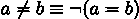

## 8

更高级的类设计

在第七章中，我们探讨了涵盖类设计基础的一些菜谱。在这一章中，我们将更深入地探讨 Python 类和类设计。

在第七章的 设计大量处理的类 和 使用属性实现懒属性 菜谱中，我们确定了一个面向对象编程的核心设计选择，“封装与扩展”决策。添加功能的一种方式是通过扩展创建一个新的子类。添加功能的另一种技术是封装一个现有的类，使其成为新类的一部分。

除了直接继承之外，Python 中还有一些其他类扩展技术可用。一个 Python 类可以从多个超类继承功能。我们称这种设计模式为混入（mixin）。

在第四章和第五章中，我们探讨了核心内置数据结构。我们可以结合和扩展这些集合定义功能，以创建更复杂的数据结构或具有附加功能的数据结构。

在这一章中，我们将探讨以下菜谱：

+   在继承和组合之间选择 – “是”问题

+   通过多重继承分离关注点

+   利用 Python 的鸭子类型

+   管理全局和单例对象

+   使用更复杂的结构 – 列表映射

+   创建具有可排序对象的类

+   从复杂对象的列表中删除

Python 中有大量的面向对象类设计技术。我们将从一个基础设计概念开始：在从基类继承和使用封装来扩展之间做出设计选择。

# 8.1 在继承和组合之间选择 – “是”问题

在第六章的 使用 cmd 创建命令行应用程序 菜谱和第七章的 扩展内置集合 – 执行统计的列表 菜谱中，我们探讨了类的扩展。在这两种情况下，菜谱中实现的类都是 Python 内置类的一个子类。

通过继承进行扩展的想法有时被称为泛化-特殊化关系。它也可以称为“是”关系。有一个重要的语义问题：

+   我们的意思是子类的实例也是超类的实例吗？这是一个“是”关系，是继承的一个例子，其中我们扩展了一个类，改变了功能的实现细节。

+   或者我们的意思是不是别的？可能是指组合或关联，有时称为“有”关系。在这种情况下，我们可能包装另一个类，添加或删除功能。

SOLID 设计原则之一，Liskov 替换原则要求任何子类都应该是超类的一个适当替代。我们将探讨创建现有类新功能的继承和组合技术。

## 8.1.1 准备工作

对于这个食谱，我们将使用扑克牌的模型作为具体的例子。我们将探讨几种设计集合的方法。

两种实现的核心成分是底层的 Card 对象。我们可以使用 NamedTuple 来定义它：

```py
 from typing import NamedTuple 

class Card(NamedTuple): 

    rank: int 

    suit: str 

Spades, Hearts, Diamonds, Clubs = (’\u2660’, ’\u2661’, ’\u2662’, ’\u2663’)
```

在本食谱的其余部分，我们将使用这个 Card 类。重要的是表示一副牌或牌手的各种集合类型；它们在支持的功能类型上都有相当大的重叠。

我们有几个常见的集合模式：

+   聚合：某些对象被绑定到集合中，但对象有适当的独立存在。虽然牌对象可以被聚合到牌手集合中，但当牌手对象被删除时，牌对象仍然存在。

+   组合：集合中的某些对象没有独立的存在。一副牌手不能没有玩家而存在。当一个玩家实例离开游戏时，牌手对象也必须被移除。

+   继承（也称为“是一个”关系）：这是指一副牌是一个具有一些额外功能的牌手。我们可以扩展内置的类如列表来实现这一点。

在设计数据库时，区分聚合和组合非常重要，因为此时关注的是对象的持久性。在 Python 中，这种区分是一个小的细微差别。普通的 Python 内存管理会保留由集合或变量仍然引用的对象。我们将两者都视为组合的例子。

一旦理解了关系，就有两条不同的路径：组合或聚合或继承和扩展。

## 8.1.2 如何实现...

这个食谱有两个独立的迷你食谱：聚合和继承。

### 组合或聚合

在另一个类的实例变量中包装集合对象有两种常见的变体，有时称为组合和聚合。在 Python 中，这种细微的差别并不重要。以下是使用组合设计集合的方法：

1.  定义集合类。

    为了区分本书中的类似例子，名称带有“_W”后缀以表明它是一个包装器。这不是一个普遍推荐的做法；它只在这里用来强调本食谱中类定义之间的区别。

    这是类的定义：

    ```py
     class Deck_W:
    ```

1.  使用这个类的`__init__()`方法作为提供底层集合对象的一种方式。这也会初始化任何有状态的变量。我们可能创建一个用于发牌的迭代器：

    ```py
     def __init__(self, cards: list[Card]) -> None: 

            self.cards = cards 

            self.deal_iter = iter(self.cards)
    ```

    这使用类型提示 list[Card]来显示将要包装的源集合。

1.  为聚合对象提供适当的方法。shuffle()方法随机化内部列表对象。它还创建了一个迭代器，由 deal()方法用来遍历列表。我们在 deal()上提供了类型提示，以明确它返回 Card 实例：

    ```py
     def shuffle(self) -> None: 

            random.shuffle(self.cards) 

            self.deal_iter = iter(self.cards) 

        def deal(self) -> Card: 

            return next(self.deal_iter)
    ```

这是我们如何使用 Deck_W 类的方法。我们将使用 Card 对象列表。在这种情况下，domain 变量是由生成所有 52 种 13 个花色和四种花色的组合的列表推导式创建的：

```py
 >>> domain = list( 

...     Card(r+1,s) 

...         for r in range(13) 

...             for s in (Spades, Hearts, Diamonds, Clubs) 

... ) 

>>> len(domain) 

52
```

我们可以使用这个集合中的项目，domain，来创建一个共享相同底层 Card 对象的第二个聚合对象。我们将从 Card 对象列表构建 Deck_W 对象：

```py
 >>> d = Deck_W(domain) 

>>> import random 

>>> random.seed(1) 

>>> d.shuffle() 

>>> [d.deal() for _ in range(5)] 

[Card(rank=13, suit=’’), Card(rank=3, suit=’’), Card(rank=10, suit=’’), Card(rank=6, suit=’’), Card(rank=1, suit=’’)]
```

### 继承和扩展

这里是定义扩展内置对象集合的类的做法：

1.  首先定义扩展类为内置集合的子类。为了区分本书中的类似示例，名称有一个 _X 后缀。子类关系是一个正式声明——Deck_X 实例也是一种列表。以下是类定义：

    ```py
     class Deck_X(list[Card]):
    ```

1.  初始化实例不需要额外的代码，因为我们将从列表类继承 __init__()方法。

1.  更新牌组不需要额外的代码，因为我们将在 Deck_X 实例中添加、更改或删除项目时使用列表类的其他方法。

1.  向扩展对象提供适当的新功能。shuffle()方法随机化整个对象。这里的集合是 self，因为此方法是列表类的一个扩展。deal()对象依赖于 shuffle()方法创建的迭代器来遍历列表，返回 Card 实例：

    ```py
     def shuffle(self) -> None: 

            random.shuffle(self) 

            self.deal_iter = iter(self) 

        def deal(self) -> Card: 

            return next(self.deal_iter)
    ```

这是我们如何使用 Deck_X 类的方法。首先，我们将构建一副牌：

```py
 >>> dx = Deck_X( 

... Card(r+1,s) 

...     for r in range(13) 

...         for s in (Spades, Hearts, Diamonds, Clubs) 

... ) 

>>> len(dx) 

52
```

在 Deck_X 实现中仅使用特定的牌组功能看起来与 Deck_W 实现完全相同：

```py
 >>> import random 

>>> random.seed(1) 

>>> dx.shuffle() 

>>> [dx.deal() for _ in range(5)] 

[Card(rank=13, suit=’’), Card(rank=3, suit=’’), Card(rank=10, suit=’’), Card(rank=6, suit=’’), Card(rank=1, suit=’’)]
```

正如我们在下面的 There’s more...中将要看到的，因为 Deck_X 是列表，它具有列表对象的所有方法。当为他人设计框架时，这可能是一个坏主意。当设计应用程序时，很容易避免使用额外的功能。

## 8.1.3 它是如何工作的...

Python 通过一个聪明的搜索算法实现继承的概念，用于查找对象类的（方法）和属性。搜索过程如下：

1.  检查对象的类以获取方法或属性名称。

1.  如果在直接类中未定义名称，则将在所有父类中搜索该方法或属性。方法解析顺序（MRO）定义了搜索这些类的顺序。

通过遍历父类确保两件事：

+   任何超类中定义的所有方法都对子类可用。

+   任何子类都可以覆盖方法以替换超类方法。super()函数搜索父类以查找被覆盖的定义。

由于这个原因，列表类的子类继承了父类的所有特性。它是内置列表类的一个特殊扩展。

这也意味着所有方法都有可能被子类覆盖。一些语言有锁定方法以防止扩展的方法。由于 Python 没有这个限制，子类可以覆盖任何方法。

super() 函数允许子类通过包装超类方法版本来添加功能。使用它的一个方法如下：

```py
 class SomeClass(Parent): 

    def some_method(self) -> None: 

        # do something extra 

        super().some_method()
```

在这种情况下，类的 some_method() 方法将执行一些额外操作，然后使用该方法超类版本。这为我们提供了一种方便的方式来扩展类的选定方法。我们可以在添加子类特有的功能的同时保留超类的特性。

## 8.1.4 更多内容...

在 Deck_W 和 Deck_X 这两个定义之间有一些巨大的差异。在包装时，我们得到我们定义的确切方法而没有其他方法。在使用继承时，我们从超类接收大量方法定义。这导致 Deck_X 类中一些可能不受欢迎的额外行为：

+   我们可以使用各种集合作为创建 Deck_X 实例的来源。这是因为列表类具有将 Python 集合转换为列表的许多特性。Deck_W 类仅适用于提供 shuffle() 方法隐式所需方法的序列。此外，list[Card] 的类型提示将导致像 mypy 这样的程序在使用其他来源集合时引发错误。

+   Deck_X 实例可以在 deal() 方法支持的核心理解迭代之外进行切片和索引。

+   由于 Deck_X 类是列表，它也可以直接与 iter() 函数一起使用；它可以在不使用 deal() 方法的情况下作为 Card 对象的可迭代来源。

这些差异也是决定使用哪种技术的重要部分。如果额外的功能是可取的，那么这表明继承是合适的。如果额外的功能造成问题，那么组合可能是一个更好的选择。

## 8.1.5 参见

+   我们已经在第四章中探讨了内置集合。在第七章中，我们也探讨了如何定义简单的集合。

+   在 设计具有大量处理的类 的配方中，我们探讨了使用一个处理处理细节的单独类来包装一个类。我们可以将其与第七章的 使用属性进行懒加载属性 配方进行对比，在那里我们将复杂的计算作为属性放入类中；这种设计依赖于扩展。

# 8.2 通过多重继承分离关注点

在本章前面的 在继承和组合之间选择 – “是”问题 配方中，我们探讨了定义一个 Deck 类的想法，该类是玩牌对象的组合。为了这个示例的目的，我们将每个 Card 对象视为仅具有等级和花色属性。这造成了两个小问题：

+   卡片的显示总是显示数字等级。我们没有看到 J、Q 或 K。相反，我们看到 11、12 和 13。同样，A 牌显示为 1 而不是 A。

+   许多游戏，如克里比奇，为每个等级分配点值。通常，面牌有 10 点。剩余的牌的点数与它们的等级相匹配。

Python 的多重继承让我们在保持单个基本 Card 类的同时处理卡牌游戏规则的变化。使用多重继承让我们将特定游戏的规则与通用牌的特性分开。我们可以将基类定义与提供所需功能的混合类组合起来。

Python 的多重继承依赖于一个称为 C3 的巧妙算法，用于将各种父类解析为单个列表，以有用的顺序。当我们组合多个类时，它们将具有共同的父类，现在有多个引用。C3 算法创建了一个尊重所有父子关系的线性列表。

## 8.2.1 准备工作

对 Card 类的实际扩展需要是两个特性集的混合。Python 允许我们定义一个包含多个父类特性的类。这个模式有两个部分：

1.  核心特性：这是等级和花色。这还包括一个方法，以字符串形式优雅地显示 Card 对象的值，使用“J”、“Q”和“K”表示宫廷牌，以及“A”表示 A 牌。

1.  混合特性：这些都是不那么重要的、特定于游戏的特性，例如分配给每张特定牌的点数。

工作应用程序依赖于从基本特性和混合特性构建的特性组合。

## 8.2.2 如何操作...

此配方将创建两个类层次结构，一个用于基本的 Card 类，另一个用于特定游戏的特性，包括克里比奇点值：

1.  定义基本类。这是一个通用的 Card 类，适用于 2 到 10 的等级：

    ```py
     @dataclass(frozen=True) 

    class Card: 

        """Superclass for cards""" 

        rank: int 

        suit: str 

        def __str__(self) -> str: 

            return f"{self.rank:2d} {self.suit}"
    ```

1.  定义子类以实现特殊化。我们需要 Card 类的两个子类——AceCard 类和 FaceCard 类，如下面的代码所示：

    ```py
     class AceCard(Card): 

        def __str__(self) -> str: 

            return f" A {self.suit}" 

    class FaceCard(Card): 

        def __str__(self) -> str: 

            names = {11: "J", 12: "Q", 13: "K"} 

            return f" {names[self.rank]} {self.suit}"
    ```

    每个类都覆盖了内置的 `__str__()` 方法以提供不同的行为。

1.  定义混合类所需的核心特性。使用 `typing.Protocol` 超类以确保各种实现都提供了所需的功能。协议需要 `rank` 属性，它将在基本类中定义。混合类中将定义一个 `points()` 方法。以下是它的样子：

    ```py
     from typing import Protocol 

    class PointedCard(Protocol): 

        rank: int 

        def points(self) -> int: 

            ...
    ```

    当编写类型提示类时，主体可以是 ... 因为这将由像 mypy 这样的工具忽略。

1.  定义混合子类以添加额外的功能。对于 Cribbage 游戏，某些牌的点数等于牌的等级，面牌是 10 点：

    ```py
     class CribbagePoints(PointedCard): 

        def points(self) -> int: 

            return self.rank
    ```

    ```py
     class CribbageFacePoints(PointedCard): 

        def points(self) -> int: 

            return 10
    ```

1.  创建最终的实体类定义以组合基本类和所有所需的混合类：

    ```py
     class CribbageCard(Card, CribbagePoints): 

        pass 

    class CribbageAce(AceCard, CribbagePoints): 

        pass 

    class CribbageFace(FaceCard, CribbageFacePoints): 

        pass
    ```

    注意，CribbagePoints 混合类被用于 Card 和 AceCard 类，这使得我们可以重用代码。

1.  定义一个函数（或类）根据输入参数创建适当的对象。这通常被称为工厂函数或工厂类。被创建的对象都将被视为 Card 类的子类，因为它是基类列表中的第一个：

    ```py
     def make_cribbage_card(rank: int, suit: str) -> Card: 

        if rank == 1: 

            return CribbageAce(rank, suit) 

        elif 2 <= rank < 11: 

            return CribbageCard(rank, suit) 

        elif 11 <= rank: 

            return CribbageFace(rank, suit) 

        else: 

            raise ValueError(f"invalid rank {rank}")
    ```

我们可以使用 make_cribbage_card() 函数创建一副洗好的牌，如下面的示例交互会话所示：

```py
 >>> import random 

>>> random.seed(1) 

>>> deck = [make_cribbage_card(rank+1, suit) for rank in range(13) for suit in  SUITS] 

>>> random.shuffle(deck) 

>>> len(deck) 

52 

>>> [str(c) for c in deck[:5]] 

[’ K ’, ’ 3 ’, ’10 ’, ’ 6 ’, ’ A ’] 
```

我们可以评估每个 Card 对象的 points() 方法：

```py
 >>> sum(c.points() for c in deck[:5]) 

30
```

手中有两张面牌，加上 3、6 和 A，所以总分数是 30。

## 8.2.3 它是如何工作的...

Python 查找对象方法（或属性）的机制如下：

1.  在实例中搜索该属性。

1.  在类中搜索该方法或属性。

1.  如果在直接类中未定义名称，则会在所有父类中搜索该方法或属性。父类是按照称为方法解析顺序（Method Resolution Order，MRO）的顺序搜索的。

我们可以使用类的 mro() 方法显示 MRO。以下是一个示例：

```py
 >>> c.__class__.__name__ 

’CribbageCard’ 

>>> from pprint import pprint 

>>> pprint(c.__class__.mro()) 

[<class ’recipe_02.CribbageCard’>, 

 <class ’recipe_02.Card’>, 

 <class ’recipe_02.CribbagePoints’>, 

 <class ’recipe_02.PointedCard’>, 

 <class ’typing.Protocol’>, 

 <class ’typing.Generic’>, 

 <class ’object’>]
```

CribbageCard 类的 mro() 方法显示了用于解析名称的顺序。因为类对象使用内部字典来存储方法定义，所以搜索是极快的基于哈希的属性名称查找。

## 8.2.4 更多...

我们可以将几种设计关注点以混合类的形式分离出来：

+   持久性和状态表示：一个混合类可以添加方法来管理转换为一致的 CSV 或 JSON 表示法等外部表示。

+   安全性：一个混合类可以添加执行一致授权检查的方法，这些检查适用于多个基类。

+   日志记录：一个混合类可以引入一个具有跨各种类定义一致的 logger。

+   事件信号和变更通知：一个混合类可能会报告对象状态的变化，以便一个或多个 GUI 小部件可以刷新显示。

例如，我们将创建一个混合类来向牌引入日志记录。我们将以必须首先在超类列表中提供的方式定义此类。由于它在 MRO 列表中较早，因此它使用 super() 函数来使用 MRO 列表中后续类定义的方法。

此类将为具有 PointedCard 协议定义的每个对象添加 logger 属性：

```py
 import logging 

class Logged(Card, PointedCard): 

    def __init__(self, rank: int, suit: str) -> None: 

        self.logger = logging.getLogger(self.__class__.__name__) 

        super().__init__(rank, suit) 

    def points(self) -> int: 

        p = super().points()  # type: ignore [safe-super] 

        self.logger.debug("points {0}", p) 

        return p
```

注意，我们使用了 super().__init__()来执行任何其他类定义的 __init__()方法。这些初始化的顺序来自类 MRO。最简单的方法是有一个定义对象基本特征的类，而所有其他混入则通过向基本对象添加额外方法的形式添加功能。

我们为 points()提供了覆盖定义。这将搜索 MRO 列表中的其他类以查找 points()方法的实现。然后它将记录由另一个混入类中的方法计算的结果。

# type: ignore [safe-super]注释是给像 mypy 这样的严格类型检查工具的提示。当我们查看 PointedCard 协议的定义时，没有为这个方法提供定义。从工具对类层次结构的检查来看，调用 super().points()可能是不安全的。我们确信在实际情况中不会发生这种情况，因为混入将始终存在以定义 points()方法。我们将 super()的不安全使用标记为要忽略的错误。

这里有一些包含 Logged 混入功能的类：

```py
 class LoggedCribbageAce(Logged, AceCard, CribbagePoints): 

    pass 

class LoggedCribbageCard(Logged, Card, CribbagePoints): 

    pass 

class LoggedCribbageFace(Logged, FaceCard, CribbageFacePoints): 

    pass
```

这些类都是基于三个独立的类定义构建的。由于 Logged 类首先提供，我们确保所有类都有一致的日志记录。我们还确保 Logged 中的任何方法都可以使用 super()来定位在类定义中跟随其后的类列表中的实现。

要使用这些类，我们需要定义一个 make_logged_card()函数来使用这些新类。

## 8.2.5 参见

+   当类创建时计算方法解析顺序。使用的算法称为 C3。这个过程最初是为 Dylan 语言开发的，现在也被 Python 使用。C3 算法确保每个父类只被搜索一次。它还确保了超类之间的相对顺序被保留；子类将在检查任何父类之前被搜索。更多信息请参阅[`dl.acm.org/doi/10.1145/236337.236343`](https://dl.acm.org/doi/10.1145/236337.236343)。

+   在考虑多重继承时，始终需要考虑是否将包装器作为比子类更好的设计。参见在继承和组合之间选择 – “是”问题配方。

# 8.3 利用 Python 的鸭子类型

当设计涉及继承时，通常从超类到一个或多个子类之间存在明确的关系。在本章的在继承和组合之间选择 – “是”问题配方以及第七章中的扩展内置集合 – 做统计的列表配方中，我们查看涉及适当的子类-超类关系的扩展。

为了有可以相互替换使用的类（“多态类”），某些语言要求有一个共同的超类。在许多情况下，共同类并没有对所有方法进行具体实现；它被称为抽象超类。

Python 不需要共同的超类。标准库提供了 abc 模块，以支持在有助于阐明类之间关系的情况下创建抽象类。

与使用具有共同超类的多态类相比，Python 依赖于鸭子类型来建立等价性。这个名字来源于以下引言：

> 当我看到一只既像鸭子走路又像鸭子游泳还像鸭子嘎嘎叫的鸟时，我就称那只鸟为鸭子。
> 
> （詹姆斯·惠特科姆·赖利）

在 Python 类关系的情况下，如果两个对象具有相同的方法和属性，这些相似之处与具有共同超类具有相同的效果。不需要对共同类进行正式的定义。

这个配方将展示如何利用鸭子类型的概念来创建多态类。这些类的实例可以相互替换，使我们能够拥有更灵活的设计。

## 8.3.1 准备工作

在某些情况下，为多个松散相关的实现选择定义一个超类可能会有些尴尬。例如，如果一个应用程序分布在几个模块中，可能很难提取一个共同的超类并将其单独放在一个模块中，以便在其他模块中导入。与其提取一个共同的抽象，有时创建将通过“鸭子测试”的类更容易：各种类具有相同的方法和属性；因此，它们实际上是可互换的，是多态类。

## 8.3.2 如何实现...

我们将定义一对类来展示这是如何工作的。这两个类都将模拟掷两个骰子的过程。我们将创建两个具有足够共同特征的独立实现，这样它们就可以互换使用：

1.  从一个具有所需方法和属性的类开始，Dice1。在这个例子中，我们将有一个属性，dice，它保留上一次掷骰子的结果，以及一个方法，roll()，它改变骰子的状态：

    ```py
     import random 

    class Dice1: 

        def __init__(self, seed: int | None = None) -> None: 

            self._rng = random.Random(seed) 

            self.roll() 

        def roll(self) -> tuple[int, ...]: 

            self.dice = ( 

                self._rng.randint(1, 6), 

                self._rng.randint(1, 6)) 

            return self.dice
    ```

1.  定义另一个类，Dice2，具有相同的方法和属性。这里是一个稍微复杂一些的定义，它创建了一个与 Dice1 类具有相同签名的类：

    ```py
     import random 

    class Die: 

        def __init__(self, rng: random.Random) -> None: 

            self._rng = rng 

        def roll(self) -> int: 

            return self._rng.randint(1, 6) 

    class Dice2: 

        def __init__(self, seed: int | None = None) -> None: 

            self._rng = random.Random(seed) 

            self._dice = [Die(self._rng) for _ in range(2)] 

            self.roll() 

        def roll(self) -> tuple[int, ...]: 

            self.dice = tuple(d.roll() for d in self._dice) 

            return self.dice
    ```

到目前为止，两个类，Dice1 和 Dice2，可以自由互换。这里是一个接受任一类作为参数的函数，创建一个实例，并产生几个掷骰子的结果：

```py
 from collections.abc import Iterator 

def roller( 

    dice_class: type[Dice1 | Dice2], 

    seed: int | None = None, 

    *, 

    samples: int = 10 

) -> Iterator[tuple[int, ...]]: 

    dice = dice_class(seed) 

    for _ in range(samples): 

        yield dice.roll()
```

我们可以使用 Dice1 类或 Dice2 类作为 dice 参数值的函数。type[Dice1 | Dice2]类型提示指定了多个等效类的联合。此函数在 dice 参数中创建给定类的实例，甚至可以提供种子值。使用已知的种子可以创建可重复的结果，这对于单元测试通常是必需的，也用于重现涉及随机选择的统计研究。

以下交互会话显示了 roller()函数被应用于两个类：

```py
 >>> list(roller(Dice1, 1, samples=5)) 

[(1, 3), (1, 4), (4, 4), (6, 4), (2, 1)] 

>>> list(roller(Dice2, 1, samples=5)) 

[(1, 3), (1, 4), (4, 4), (6, 4), (2, 1)]
```

由 Dice1 和 Dice2 构建的对象有足够的相似性，以至于它们无法区分。

## 8.3.3 它是如何工作的...

我们创建了两个具有相同属性和方法集合的类。这是鸭子类型的核心。由于 Python 通过遍历字典序列来搜索匹配的名称，因此类不需要有共同的超类就可以互换。

定义相关类的联合可能会有所帮助。另一个选择是定义一个类都遵守的通用协议。对于每个类来说，虽然不是必须显式地从协议定义中继承，但这样做可以使读者更清晰地理解。像 mypy 这样的工具可以判断一个类是否符合协议，这正是鸭子类型的工作方式。

## 8.3.4 更多内容...

在 roller()函数的定义中，我们使用了以下类型提示：dice: type[Dice1 | Dice2]。

使用如下代码可以使这种做法更明确：

```py
Dice = Dice1 | Dice2
```

这可以很容易地扩展，因为当添加新的替代定义时。客户端类可以使用 type[Dice]来引用替代方案的联合。

另一个选择是定义一个协议。协议定义了一个具有仅共享各种实现共同特征的通用类型：

```py
 class DiceP(Protocol): 

    def roll(self) -> tuple[int, ...]: 

        ...
```

这有助于在开发过程的后期创建类型提示。在创建替代实现之后，很容易定义一个联合各种选择的类型。如果出现更多实现，它们可以被添加到联合中。

协议允许更容易地扩展替代方案。协议仅定义了实现的有关特征。这通常是通过重构客户端方法签名的属性来完成的，使其引用协议类。

## 8.3.5 参见

+   鸭子类型问题在在继承和组合之间选择 – “是”问题配方中是隐含的；如果我们利用鸭子类型，我们也在声称两个类不是同一件事。当我们绕过继承时，我们隐含地声称 is-a 关系不成立。

+   当查看通过多重继承分离关注点配方时，我们也能够利用鸭子类型来创建可能没有简单继承层次结构的复合类。

# 8.4 管理全局和单例对象

Python 环境包含许多隐式全局对象。这些对象提供了一种方便的方式来处理其他对象的集合。因为集合是隐式的，所以我们避免了显式初始化代码的烦恼。

这的一个例子是 random 模块中的隐式随机数生成对象。当我们评估 random.random() 时，我们实际上是在使用 random.Random 类的一个实例。

因为一个模块只导入一次，所以模块实现了 Singleton 设计模式。我们可以依赖这项技术来实现这些全局单例。

其他例子包括以下内容：

+   可用的数据编码器和解码器（编解码器）集合。编解码器模块有一个编码器和解码器的注册表。我们可以向这个注册表中添加编码和解码。

+   webbrowser 模块有一个已知浏览器的注册表。

+   numbers 模块有一个数字数据类型的注册表。这允许模块定义一个新的数字类型实现并将其添加到已知类型的混合中。

+   logging 模块维护一个命名记录器的集合。getLogger() 函数试图找到一个现有的记录器；如果需要，它会创建一个新的记录器。

+   re 模块有一个编译正则表达式的缓存。这节省了重新编译在方法或函数内部定义的正则表达式的时间。

本食谱将展示如何处理像用于编解码器、浏览器和数字类的注册表这样的隐式全局对象。

## 8.4.1 准备工作

一组函数都可以与由模块创建的隐式全局对象一起工作。好处是允许其他模块共享一个公共对象，而无需编写任何显式协调共享的代码。

这可能会让阅读你代码的人感到困惑。

共享全局状态的想法可能会变成一个设计噩梦。进一步使共享对象变得隐式可能会使问题更加复杂。

观察 Python 标准库中的示例，有两个重要的模式。首先，有一个狭窄的焦点。其次，注册表的更新仅限于添加新实例。

例如，我们将定义一个包含全局单例对象的模块。我们将在第十三章中更详细地讨论模块。

我们的全球对象将是一个计数器，我们可以用它来累积来自几个独立模块或对象的集中化数据。我们将使用这个全局对象来计数应用程序中的事件。计数提供了已完成工作的摘要，并检查以确认所有工作都已完成。

目标是能够编写如下内容：

```py
 for row in source: 

    count(’input’) 

    some_processing() 

print(counts())
```

some_processing() 函数可能会使用类似 count('reject') 来计算被拒绝的输入行数。这个函数可能会调用其他也使用 count() 函数来记录处理证据的函数。

这两个独立函数都引用了一个共享的全局计数器：

+   count(key) 增加一个全局 Counter，并返回给定键的当前值。

+   `counts()` 提供所有的计数器值。

## 8.4.2 如何实现...

处理全局状态信息有两种常见的方式：

+   使用模块全局变量，因为模块是单例对象。

+   使用类级别的变量（在某些编程语言中称为静态）。在 Python 中，类定义也是一个可以共享的单例对象。

我们将单独介绍这些小技巧，从模块全局变量开始。

### 模块全局变量

我们可以这样做来创建一个对模块全局的变量：

1.  创建一个模块文件。这将是一个包含定义的 .py 文件。我们将它命名为 counter.py。

1.  如果需要，定义一个全局单例类的类。在我们的例子中，我们可以使用这个定义来创建一个 `collections.Counter` 对象：

    ```py
     from collections import Counter
    ```

1.  定义全局单例对象的唯一实例。我们在名称前使用了前导下划线使其稍微不那么显眼。它——技术上——不是私有的。然而，它被许多 Python 工具和实用程序优雅地忽略：

    ```py
     _global_counter: Counter[str] = Counter()
    ```

    标记全局变量的常见习惯是使用全大写的名称。这似乎对被视为常量的全局变量更重要。在这种情况下，这个变量将被更新，使用全大写名称似乎有些误导。

1.  定义两个函数以使用全局对象 `_global_counter`。这些函数封装了计数器实现的细节：

    ```py
     def count(key: str, increment: int = 1) -> None: 

        _global_counter[key] += increment 

    def counts() -> list[tuple[str, int]]: 

        return _global_counter.most_common() 
    ```

现在，我们可以编写在多个地方使用 `count()` 函数的应用程序。然而，计数的事件完全集中在一个对象中，该对象作为模块的一部分定义。

我们可能有这样的代码：

```py
 >>> from counter import * 

>>> from recipe_03 import Dice1 

>>> d = Dice1(1) 

>>> for _ in range(1000): 

...     if sum(d.roll()) == 7: 

...         count(’seven’) 

...     else: 

...         count(’other’) 

>>> print(counts()) 

[(’other’, 833), (’seven’, 167)]
```

我们已从 `counter` 模块中导入了 `count()` 和 `counts()` 函数。我们还导入了 `Dice1` 类作为一个方便的对象，用于创建事件序列。当我们创建 `Dice1` 的实例时，我们提供一个初始化来强制特定的随机种子。这给出了可重复的结果。

这种技术的优点是，多个模块都可以在 `counter` 模块中共享全局对象。所需的一切只是一个导入语句。不需要进一步的协调或开销。

### 类级别的“静态”变量

我们可以这样做来创建一个对类定义的所有实例全局的变量：

1.  在 `__init__()` 方法之外定义一个类的变量。这个变量是类的一部分，而不是实例的一部分。为了清楚地表明这个属性是由类的所有实例共享的，`ClassVar` 类型提示很有帮助。在这个例子中，我们决定使用前导下划线，这样类级别的变量就不会被视为公共接口的一部分：

    ```py
     from collections import Counter 

    from typing import ClassVar 

    class EventCounter: 

        _class_counter: ClassVar[Counter[str]] = Counter()
    ```

1.  添加更新和从类级别的 `_class_counter` 属性中提取数据的方法。这些方法将使用 `@classmethod` 装饰器来表明它们是直接由类使用的，而不是由实例使用的。不使用 `self` 变量；相反，使用 `cls` 变量作为方法适用于类的提醒：

    ```py
     @classmethod 

        def count(cls, key: str, increment: int = 1) -> None: 

            cls._class_counter[key] += increment 

        @classmethod 

        def counts(cls) -> list[tuple[str, int]]: 

            return cls._class_counter.most_common()
    ```

非常重要的是要注意，_class_counter 属性是类的一部分，被称为 cls._class_counter。我们不使用 self 实例变量，因为我们不是指代类的实例；我们是指代类定义中的一部分变量，作为装饰有 @classmethod 的方法的第一个参数提供。

这就是我们可以使用这个类的方法。

```py
 >>> from counter import * 

>>> EventCounter.count(’input’) 

>>> EventCounter.count(’input’) 

>>> EventCounter.count(’filter’) 

>>> EventCounter.counts() 

[(’input’, 2), (’filter’, 1)]
```

由于所有这些操作都更新 EventCounter 类，每个都会增加共享变量。

共享的全局状态必须谨慎使用。

它们可能与类的实际工作无关。焦点必须狭窄且限于非常有限的状态变化。

当有疑问时，显式共享对象将是一个更好的设计策略，但将涉及更多的代码。

## 8.4.3 它是如何工作的...

Python 导入机制使用 sys.modules 来跟踪哪些模块被加载。一旦模块在这个映射中，它就不会再次被加载。这意味着模块内定义的任何变量都将是一个单例：只有一个实例。

在一个模块中，只能创建一次类定义。这意味着类的内部状态变化也遵循单例设计模式。

我们如何在这两种机制之间进行选择？选择基于由多个类共享全局状态所造成的混淆程度。正如在类级别的“静态”变量中的前一个示例所示，我们可以有多个变量共享一个共同的 Counter 对象。如果隐式共享的全局状态看起来很令人困惑，那么模块级全局变量是一个更好的选择。在模块级全局变量令人困惑的情况下，应通过普通可见变量显式共享状态。

## 8.4.4 更多内容...

共享的全局状态可以被称为面向对象编程的反面。面向对象编程的一个理想是封装单个对象中的状态变化。如果过于广泛地使用，全局变量会破坏封装单个对象状态的想法。

在某种意义上，一个模块是一种类似于类的结构。模块是一个命名空间，具有模块级变量来定义状态和类似于方法的模块函数。

需要公共全局状态的一个例子通常出现在尝试为应用程序定义配置参数时。拥有一个单一、统一的配置，并在多个模块中广泛共享，可能会有所帮助。当这些对象用于普遍的功能，如配置、审计、日志记录和安全时，全局变量可以帮助将单个、专注的横切关注点隔离到一个通用的类中，该类与应用程序特定的类分开。

另一个选择是显式创建一个配置对象。然后，可以将此配置对象作为参数提供给应用程序中的其他对象。

## 8.4.5 参见

+   第十四章介绍了模块和应用设计中的其他主题。

# 8.5 使用更复杂的结构 – 列表映射

在第四章中，我们探讨了 Python 中可用的基本数据结构。那些菜谱通常单独查看各种结构。

我们将探讨一种常见的组合结构——从单个键到相关值列表的映射。这可以用来累积有关数据库或日志记录的详细信息，这些记录由给定的键标识。这个菜谱将把平铺的细节列表分割成按共享键值组织的列表。

这与类设计相融合，因为我们经常可以利用 Python 的内置类来完成这类工作。这可以减少我们必须编写的独特新代码的量。

## 8.5.1 准备工作

我们将探讨从一个字符串到我们设计的类的实例列表的映射。我们将从一个应用程序的原始日志条目开始，将每一行分解成单个字段，然后从数据字段创建单个事件对象。一旦我们有了这些对象，我们就可以将它们重新组织和分组到与常见属性值（如模块名称或消息严重性）关联的列表中。

在第五章中，我们探讨了 创建字典 – 插入和更新 菜谱中的日志数据。

第一步将是将日志行转换成更有用的逗号分隔值（CSV）格式。正则表达式可以提取各种语法组。有关解析工作如何进行的更多信息，请参阅第一章的 使用正则表达式进行字符串解析 菜谱。

原始数据看起来如下：

```py
 [2016-04-24 11:05:01,462] INFO in module1: Sample Message One 

[2016-04-24 11:06:02,624] DEBUG in module2: Debugging 

[2016-04-24 11:07:03,246] WARNING in module1: Something might have gone wrong
```

每一行都可以用正则表达式解析成组件字段。我们将定义一个名为 NamedTuple 的子类，它有一个静态方法 from_line()，用于使用这四个字段创建类的实例。确保属性名称与正则表达式分组名称匹配，我们可以使用以下定义来构建类的实例：

```py
 import re 

from typing import NamedTuple 

class Event(NamedTuple): 

    timestamp: str 

    level: str 

    module: str 

    message: str 

    @staticmethod 

    def from_line(line: str) -> ’Event | None’: 

        pattern = re.compile( 

            r"\[(?P<timestamp>.*?)\]\s+" 

            r"(?P<level>\w+)\s+" 

            r"in\s+(?P<module>\w+)" 

            r":\s+(?P<message>.*)" 

            ) 

        if log_line := pattern.match(line): 

            return Event(**log_line.groupdict()) 

        else: 

            return None 
```

我们的目标是按模块名称属性对日志消息进行分组。我们希望看到如下内容：

```py
 >>> pprint(summary) 

{’module1’: [ 

   Event(’2016-04-24 11:05:01,462’, ’INFO’, ’module1’, ’Sample Message One’), 

   Event(’2016-04-24 11:07:03,246’, ’WARNING’, ’module1’, ’Something might have gone wrong’)], 

 ’module2’: [ 

   Event(’2016-04-24 11:06:02,624’, ’DEBUG’, ’module2’, ’Debugging’)] 

}
```

## 8.5.2 如何实现...

我们可以编写一个 summarize() 函数，将日志数据重新结构化为以下形式：

1.  导入所需的模块和一些用于各种集合的类型提示：

    ```py
     from collections import defaultdict 

    from collections.abc import Iterable
    ```

    defaultdict 类型是一个扩展了 MutableMapping 抽象基类的具体类。这与 Iterable 类型提示所在的模块分开，后者是一个抽象基类定义。

1.  源数据类型，事件类，在准备就绪部分已经展示。

1.  定义我们将要工作的摘要字典的整体类型提示：

    ```py
     from typing import TypeAlias 

    Summary: TypeAlias = defaultdict[str, list[Event]]
    ```

1.  开始定义一个函数，用于总结可迭代的事件实例源，并生成一个 Summary 对象：

    ```py
     def summarize(data: Iterable[Event]) -> Summary:
    ```

1.  将列表函数用作 defaultdict 的默认值。为这个集合创建一个类型提示也很有用：

    ```py
     module_details: Summary = defaultdict(list)
    ```

    列表函数仅提供名称。使用 `list()` 的常见错误是评估函数并创建一个列表对象，该对象不是函数。错误消息如 `TypeError: first argument must be callable or None` 提醒我们，参数必须是函数名称。

1.  遍历数据，将列表添加到每个键关联的列表中。`defaultdict` 对象将使用提供的 `list()` 函数来构建一个空列表，作为首次遇到每个新键时的值：

    ```py
     for event in data: 

            module_details[event.module].append(event) 

        return module_details
    ```

`summarize()` 函数的结果是一个字典，它将模块名称字符串映射到该模块名称的所有日志行列表。数据看起来如下：

```py
 >>> pprint(summary) 

defaultdict(<class ’list’>, 

            {’module1’: [Event(timestamp=’2016-04-24 11:05:01,462’, level=’INFO’, module=’module1’, message=’Sample Message One’), 

                         Event(timestamp=’2016-04-24 11:07:03,246’, level=’WARNING’, module=’module1’, message=’Something might have gone wrong’)], 

             ’module2’: [Event(timestamp=’2016-04-24 11:06:02,624’, level=’DEBUG’, module=’module2’, message=’Debugging’)]})
```

此映射的键是模块名称，映射中的值是该模块名称的行列表。我们现在可以专注于特定模块的分析。这似乎与总结结果的初始预期非常接近。

## 8.5.3 它是如何工作的...

当找不到键时，映射的行为有两种选择：

+   内置的 `dict` 类在键缺失时抛出异常。这使得累积与预先不知道的键关联的值变得困难。

+   `defaultdict` 类在键缺失时评估一个创建默认值的函数。在许多情况下，该函数是 `int` 或 `float`，以创建默认的数值 0 或 0.0。在这种情况下，该函数是 `list`，以创建一个空列表。

我们可以想象使用 `set` 函数而不是 `list` 来为缺失的键创建一个空的集合对象。这对于从键到共享该键的不可变对象集合的映射是合适的。

## 8.5.4 更多...

我们也可以将其作为一个扩展构建为内置的 `dict` 类：

```py
 class ModuleEvents(dict[str, list[Event]]): 

    def __missing__(self, key: str) -> list[Event]: 

        self[key] = list() 

        return self[key]
```

我们提供了一个特殊 `__missing__()` 方法的实现。默认行为是抛出一个 `KeyError` 异常。这将在映射中创建一个新的空列表。

这允许我们使用如下代码：

```py
 >>> event_iter = (Event.from_line(l) for l in log_data.splitlines()) 

>>> module_details = ModuleEvents() 

>>> for event in filter(None, event_iter):
```

用例与 `defaultdict` 相同，但集合类的定义稍微复杂一些。这允许进一步扩展以向 `ModuleEvents` 类添加功能。

## 8.5.5 相关阅读

+   在第四章的 创建字典 – 插入和更新 菜谱中，我们探讨了使用映射的基础。

+   在第四章的 避免为函数参数使用可变默认值 菜谱中，我们探讨了其他使用默认值的地方。

+   在第七章的 使用更复杂的集合 菜谱中，我们探讨了使用 `defaultdict` 类的其他示例。

# 8.6 创建具有可排序对象的类

我们经常需要能够按顺序排列的对象。以日志记录为例，它们通常按日期和时间排序。我们大多数类定义都没有包括将对象按顺序排序所需的特性。许多配方都保持对象基于由 `__hash__()` 方法计算的内联哈希值和由 `__eq__()` 方法定义的相等性测试的映射或集合。

为了保持项目在排序集合中，我们需要实现 `<`、`>`、`<=` 和 `>=` 的比较方法。这些比较都是基于每个对象的属性值。

当我们扩展 `NamedTuple` 类时，适用于元组类的比较方法都是可用的。如果我们使用 `@dataclass` 装饰器定义类，默认情况下不会提供比较方法。我们可以使用 `@dataclass(order=True)` 来包含排序方法。对于这个配方，我们将查看一个不基于这些辅助工具的类。

## 8.6.1 准备工作

在 通过多重继承分离关注点 的配方中，我们使用两个类定义来定义扑克牌。`Card` 类层次定义了每张牌的基本特性。第二组混合类为每张牌提供了特定于游戏的特性。

核心定义，`Card`，是一个冻结的数据类。它没有 `order=True` 参数，并且没有正确地将牌按顺序排列。我们需要向这个 `Card` 定义添加功能，以创建可以正确排序的对象。

我们将假设另一个类定义，`PinochlePoints`，以遵循为 Pinochle 游戏分配牌点的规则。细节不重要；重要的是这个类实现了 `points()` 方法。

为了创建一个可排序的牌集合，我们需要向 `Card` 类定义系列添加另一个特性。我们需要定义用于比较运算符的四个特殊方法。

## 8.6.2 如何做...

要创建一个可排序的类定义，我们将创建一个比较协议，然后定义一个实现该协议的类，如下所示：

1.  我们正在定义一个新的协议，像 mypy 这样的工具可以在比较对象时使用。这将描述混合类将应用于哪些类型的对象。我们称之为 `CardLike`，因为它适用于具有至少排名和花色这两个属性的任何类：

    ```py
     from typing import Protocol, Any 

    class CardLike(Protocol): 

        rank: int 

        suit: str
    ```

    将类似-Something 作为协议名称的使用是 Pythonic 整体方法的一部分，即鸭子类型。而不是坚持类型层次结构，我们定义了作为新协议所需的最少特性。

1.  扩展协议，我们可以创建具有比较特性的 `SortableCard` 子类。这个子类可以混合到任何符合协议定义的类中：

    ```py
     class SortableCard(CardLike): 
    ```

1.  将四个排序比较方法添加到 SortableCard 子类中。在这种情况下，我们使用符合 CardLike 协议的任何类的相关属性到一个元组中，然后使用 Python 的内置元组比较来处理元组中项的比较细节。以下是这些方法：

    ```py
     def __lt__(self: CardLike, other: Any) -> bool: 

            return (self.rank, self.suit) < (other.rank, other.suit) 

        def __le__(self: CardLike, other: Any) -> bool: 

            return (self.rank, self.suit) <= (other.rank, other.suit) 

        def __gt__(self: CardLike, other: Any) -> bool: 

            return (self.rank, self.suit) > (other.rank, other.suit) 

        def __ge__(self: CardLike, other: Any) -> bool: 

            return (self.rank, self.suit) >= (other.rank, other.suit)
    ```

1.  编写由基本 Card 类和两个混合类构建的复合类定义，以提供 Pinochle 和比较功能：

    ```py
     class PinochleAce(AceCard, SortableCard, PinochlePoints): 

        pass 

    class PinochleFace(FaceCard, SortableCard, PinochlePoints): 

        pass 

    class PinochleNumber(Card, SortableCard, PinochlePoints): 

        pass
    ```

1.  这组类没有简单的超类。我们将添加一个类型提示来创建一个公共定义：

    ```py
     from typing import TypeAlias 

    PinochleCard: TypeAlias = PinochleAce | PinochleFace | PinochleNumber
    ```

1.  现在我们可以创建一个函数，从之前定义的类中创建单个 PinochleCard 对象：

    ```py
     def make_pinochle_card(rank: int, suit: str) -> PinochleCard: 

        if rank in (9, 10): 

            return PinochleNumber(rank, suit) 

        elif rank in (11, 12, 13): 

            return PinochleFace(rank, suit) 

        else: 

            return PinochleAce(rank, suit)
    ```

Pinochle 的复杂点规则被封装在 PinochlePoints 类中。我们省略了它们，因为点数根本不与六种牌等级平行。将复合类作为 Card 和 PinochlePoints 的基子类构建，可以准确地对牌进行建模，而不会过于复杂。

我们现在可以使用以下交互命令序列来创建对比较运算符做出响应的牌：

```py
 >>> c1 = make_pinochle_card(9, ’’) 

>>> c2 = make_pinochle_card(10, ’’) 

>>> c1 < c2 

True 

>>> c1 == c1  # Cards match themselves 

True 

>>> c1 == c2 

False 

>>> c1 > c2 

False
```

实现等于（==）和不等于（!=）的相等比较是在基类 Card 中定义的。这是一个冻结的数据类。默认情况下，数据类包含相等测试方法。

这是一个构建特殊 48 张牌组的函数。它创建了 24 种不同等级和花色组合的每张牌的两个副本：

```py
 def make_pinochle_deck() -> list[PinochleCard]: 

    return [ 

        make_pinochle_card(r, s) 

            for _ in range(2) 

                for r in range(9, 15) 

                    for s in SUITS 

    ]
```

SUITS 变量的值是四种 Unicode 字符，代表花色。make_deck() 函数内部的生成表达式使用 Pinochle 游戏中的 6 个等级构建每张牌的两个副本。

## 8.6.3 它是如何工作的...

Python 为许多事物使用特殊方法。语言中几乎每个运算符都是由特殊方法实现的。（少数例外是 is 运算符和 and、or、not。）在这个配方中，我们利用了四个排序运算符。

表达式 c1 <= c2 被评估为如果我们写了 c1.__le__(c2)。这种转换几乎适用于 Python 的所有运算符。

Python 语言参考将特殊方法组织成几个不同的组。在这个配方中，我们查看用于基本定制类的那些方法。

当我们处理这个类层次结构的实例时，看起来是这样的。第一个例子将创建一个 48 张牌的 Pinochle 牌组：

```py
 >>> deck = make_pinochle_deck() 

>>> len(deck) 

48
```

```py
 >>> import random 

>>> random.seed(4) 

>>> random.shuffle(deck) 

>>> [str(c) for c in sorted(deck[:12])] 

[’ 9 ’, ’10 ’, ’ J ’, ’ J ’, ’ J ’, ’ Q ’, ’ Q ’, ’ K ’, ’ K ’, ’ K ’, ’ A ’, ’ A ’]
```

上面的例子中重要的部分是 sorted() 函数的使用。因为我们已经定义了适当的比较运算符，我们可以对 PinochleCard 实例进行排序，并且它们按照从低等级到高等级的预期顺序呈现。

## 8.6.4 更多...

一点形式逻辑表明，我们实际上只需要详细实现两种比较。从一个相等方法和一个排序方法，所有其他方法都可以构建。例如，如果我们为小于（__lt__()）和等于（__eq__()）构建操作，我们可以根据以下等价规则计算其他三个比较：

+   

+   

+   

Python 明确不会为我们做这类高级代数运算。我们需要仔细进行代数运算并实现必要的比较方法。

functools 库包括一个装饰器，@total_ordering，它可以生成这些缺失的比较方法。

## 8.6.5 参见

+   参见通过多重继承分离关注点配方，了解卡片和卡牌游戏规则的必要定义。

+   参见第七章（ch011_split_000.xhtml#x1-3760007）了解更多关于数据类和命名元组类的信息。

# 8.7 从复杂对象列表中删除

从列表中删除项目有一个有趣的结果。具体来说，当一个项目被删除时，所有后续的项目都会向前移动。规则是这样的：

> 在删除项目 y 时，items list[y+1:] 取代了 items list[y:]。

这是在删除选定的项目之外发生的副作用。由于列表中的项目可能会移动，这使得一次删除多个项目具有潜在的挑战性。

当列表包含具有 __eq__() 特殊方法定义的项目时，列表的 remove() 方法可以删除每个项目。当列表项目没有简单的 __eq__() 测试时，remove() 方法不起作用，这使得从列表中删除多个项目更具挑战性。

## 8.7.1 准备工作

对于这个例子，我们将使用字典列表，其中删除项目的天真方法不起作用。看到尝试重复搜索列表以删除项目可能会出错是有帮助的。

在这种情况下，我们有一些包含歌曲名称、作家和持续时间的资料。字典对象相当长。数据看起来像这样：

```py
 >>> song_list = [ 

... {’title’: ’Eruption’, ’writer’: [’Emerson’], ’time’: ’2:43’}, 

... {’title’: ’Stones of Years’, ’writer’: [’Emerson’, ’Lake’], ’time’: ’3:43’}, 

... {’title’: ’Iconoclast’, ’writer’: [’Emerson’], ’time’: ’1:16’}, 

... {’title’: ’Mass’, ’writer’: [’Emerson’, ’Lake’], ’time’: ’3:09’}, 

... {’title’: ’Manticore’, ’writer’: [’Emerson’], ’time’: ’1:49’}, 

... {’title’: ’Battlefield’, ’writer’: [’Lake’], ’time’: ’3:57’}, 

... {’title’: ’Aquatarkus’, ’writer’: [’Emerson’], ’time’: ’3:54’} 

... ]
```

可以用以下方式定义这个复杂结构的每一行的类型提示：

```py
 from typing import TypedDict 

class SongType(TypedDict): 

    title: str 

    writer: list[str] 

    time: str
```

一个更好的设计会使用 datetime.timedelta 来表示歌曲的时间。我们在配方中省略了这个复杂性。

整个歌曲列表可以描述为 list[SongType]。

这里有一个天真且明显无效的方法：

```py
 def naive_delete(data: list[SongType], writer: str) -> None: 

    for index in range(len(data)): 

        if ’Lake’ in data[index][’writer’]: 

            del data[index]
```

由于项目被移动，计算出的索引值会跳过刚被删除的项目之后的那个项目。此外，由于列表变短，删除后的范围是错误的。这会导致索引错误，如下面的输出所示：

```py
 >>> naive_delete(song_list, ’Lake’) 

Traceback (most recent call last): 

... 

IndexError: list index out of range
```

另一种失败的方法看起来是这样的：

```py
 >>> remove = list(filter(lambda x: ’Lake’ in x[’writer’], song_list)) 

>>> for x in remove: 

...     song_list.remove(x)
```

这有一个问题，即每个 remove() 操作都必须从列表的开始搜索。对于非常大的列表，这种方法会很慢。

我们需要以避免多次遍历列表的方式组合搜索和删除操作。

## 8.7.2 如何做...

为了有效地从列表中删除多个项目，我们需要实现自己的列表索引处理函数，如下所示：

1.  定义一个函数，通过删除选定的项目来更新列表对象：

    ```py
     def incremental_delete( 

        data: list[SongType], 

        writer: str 

    ) -> None:
    ```

1.  初始化一个索引值 i，从列表的第一个项目开始为零：

    ```py
     i = 0
    ```

1.  当 i 变量的值不等于列表的长度时，我们希望对状态进行更改，要么增加 i 值，要么缩小列表：

    ```py
     while i != len(data):
    ```

1.  如果 data[i] 的值是搜索的目标，我们可以删除它，缩小列表。

    否则，增加索引值 i，使其更接近列表的长度：

    ```py
     if ’Lake’ in data[i][’writer’]: 

                del data[i] 

            else: 

                i += 1
    ```

这导致从列表中删除项目时不会出现索引错误，也不会多次遍历列表项，或者无法删除匹配的项目。

## 8.7.3 它是如何工作的...

目标是检查每个项目恰好一次，要么删除它，要么跳过它，将其留在原位。while 语句的设计源于观察那些朝着目标前进的语句：增加索引，删除一个项目。这些操作在有限的一组条件下有效：

+   仅当项目不应该被删除时，增加索引才有效。

+   仅当项目是匹配项时，删除项目才有效。

重要的是条件是互斥的。当我们使用 for 语句时，增量处理总是发生，这是一个不希望的特性。while 语句允许我们仅在项目应该留在原位时才进行增量。

## 8.7.4 更多内容...

相对于删除的开销，另一种方法是创建一个新列表，其中一些项目被拒绝。制作项目浅拷贝比从列表中删除项目快得多，但需要更多的存储空间。这是一个常见的关于时间和内存权衡的例子。

我们可以使用如下列表推导来创建一个只包含所需项目的新的列表：

```py
 >>> [item 

...     for item in song_list 

...         if ’Lake’ not in item[’writer’] 

... ]
```

这将创建列表中选定项目的浅拷贝。我们不希望保留的项目将被忽略。有关浅拷贝的概念的更多信息，请参阅第四章中的“制作浅拷贝和深拷贝对象”配方。

我们也可以在复制操作中使用一个高阶函数，filter()。考虑以下示例：

```py
 >>> list( 

...     filter( 

...         lambda item: ’Lake’ not in item[’writer’], 

...         song_list 

...     ) 

... )
```

filter() 函数有两个参数：一个 lambda 对象和原始数据集。在这种情况下，lambda 表达式用于决定哪些项目要传递。lambda 返回 False 的项目将被拒绝。

filter() 函数是一个生成器。这意味着我们需要收集所有项目以创建一个最终的列表对象。list() 函数是消耗生成器中所有项目的一种方式，将它们存储在它们创建并返回的集合对象中。

## 8.7.5 参考内容

+   我们已经利用了两个其他配方：制作浅拷贝和深拷贝对象 和 切片和切块列表，它们在第四章中。

+   我们将在第九章节中仔细研究过滤器和生成器表达式。

# 加入我们的社区 Discord 空间

加入我们的 Python Discord 工作空间，讨论并了解更多关于这本书的信息：[`packt.link/dHrHU`](https://packt.link/dHrHU)


