## 9

函数式编程特性

函数式编程的思想是专注于编写小而表达性强的函数，以执行所需的数据转换。函数的组合通常可以创建比长串过程语句或复杂有状态对象的方法定义更简洁、更具有表现力的代码。本章重点介绍 Python 的函数式编程特性，而不是过程式或面向对象编程。

这提供了一种与本书其他地方严格面向对象的方法不同的软件设计途径。将对象与函数的组合允许在组装最佳组件集合时具有灵活性。

传统数学将许多事物定义为函数。多个函数可以组合起来，从之前的转换构建复杂的结果。当我们把数学运算符视为函数时，表达式 p = f(n,g(n))也可以写成两个单独的函数。我们可能会将其视为 p = f(n,b)，其中 b = g(n)。

理想情况下，我们还可以从这两个函数创建一个复合函数：

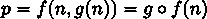

定义一个新的复合函数 g ∘ f，而不是嵌套函数，可以帮助阐明设计背后的意图。这种对组件的重构可以让我们将许多小的细节组合成更大的知识块，体现设计背后的概念。

由于编程通常与数据集合一起工作，我们经常会将函数应用到集合的所有项目上。这发生在进行数据库提取和转换以对齐来自不同源应用程序的数据时。这也发生在汇总数据时。将 CSV 文件转换为统计摘要这样常见的事情，就是从文本行到数据行的转换函数的组合，以及从数据行到平均值和标准差的转换。这与集合构造者或集合理解数学思想非常吻合。

应用一个函数到一组数据的三种常见模式：

+   映射：这将对集合的所有元素应用一个函数，{m(x)|x ∈ S}。我们将某个函数 m(x)应用到较大的集合 S 中的每个项目 x 上。

+   过滤：这使用一个函数从集合中选择元素，{x|x ∈ S if f(x)}。我们使用一个函数，f(x)，来确定是否将较大的集合 S 中的每个项目 x 通过或拒绝。

+   减少：这总结了集合中的项目。最常见的一种减少是将集合 S 中所有项目求和，表示为 ∑ [x∈S]x。其他常见的减少还包括找到最小项、最大项以及所有项的乘积。

我们经常将这些模式结合起来创建更复杂的复合应用程序。这里重要的是，像 m(x)和 f(x)这样的小函数可以通过内置的高阶函数如 map()、filter()和 reduce()进行组合。itertools 模块包含许多额外的更高阶函数，我们可以使用它们来构建应用程序。当然，我们也可以定义我们自己的高阶函数来组合较小的函数。

这些食谱中的一些将展示可以定义为使用@property 装饰器创建的类定义属性的运算。这是另一种可以限制有状态对象复杂性的设计选择。然而，在本章中，我们将尝试坚持一种函数式方法，即通过转换来创建新对象，而不是使用属性。

在本章中，我们将探讨以下食谱：

+   使用 yield 语句编写生成器函数

+   对集合应用转换

+   使用堆叠的生成器表达式

+   选择子集 – 三种过滤方式

+   总结集合 – 如何减少

+   组合 map 和 reduce 转换

+   实现“存在”处理

+   创建部分函数

+   使用 yield from 语句编写递归生成器函数

我们将从创建函数开始，这些函数将产生一个可迭代的值序列。而不是创建一个完整的列表（或集合，或其他集合），生成器函数根据客户端操作的需求产生集合的各个项目。这节省了内存，并且可能节省时间。

# 9.1 使用 yield 语句编写生成器函数

生成器函数通常被设计为对集合中的每个项目应用某种类型的转换。生成器也可以创建数据。生成器被称为懒惰的，因为其产生的值必须由客户端消耗；值只有在客户端尝试消耗它们时才会被计算。客户端操作，如 list()函数或 for 语句，是常见的消费者示例。每次像 list()这样的函数需要值时，生成器函数必须使用 yield 语句产生一个值。

相反，一个普通函数可以被调用为急切模式。没有 yield 语句，函数将计算整个结果并通过 return 语句返回。

在我们无法将整个集合放入内存的情况下，一种懒惰的方法非常有帮助。例如，分析巨大的网络日志文件可以通过小批量进行，而不是创建一个庞大的内存集合。

在 Python 的类型提示语言中，我们经常使用 Iterator 泛型来描述生成器。我们需要使用类型来澄清这个泛型，例如 Iterator[str]，以表明函数产生字符串对象。

生成器正在消耗的项目通常来自由 Iterable 泛型类型描述的集合。所有 Python 的内置集合都是可迭代的，文件也是如此。例如，字符串值的列表可以被视为 Iterable[str]。

从 collections.abc 模块中可以获得 Iterable 和 Iterator 类型。它们也可以从 typing 模块中导入。

yield 语句将普通函数转换为生成器。它将迭代计算并产生结果。

## 9.1.1 准备工作

我们将对一些网络日志数据进行生成器应用。我们将设计一个生成器，将原始文本转换为更有用的结构化对象。生成器函数用于隔离转换处理。这允许在初始转换之后灵活地应用过滤或汇总操作。

条目最初是看起来像这样的文本行：

```py
[2016-06-15 17:57:54,715] INFO in ch10_r10: Sample Message One 

[2016-06-15 17:57:54,716] DEBUG in ch10_r10: Debugging 

[2016-06-15 17:57:54,720] WARNING in ch10_r10: Something might have gone wrong
```

我们在第八章的使用更复杂结构 - 列表映射食谱中看到了使用这种日志的其他示例。使用第一章的使用正则表达式进行字符串解析食谱中的正则表达式，我们可以将每一行分解成更有用的结构。

在日志的每一行中捕获详细信息，并将其存储在具有不同类型的对象中通常很有帮助。这有助于使代码更加专注，并有助于我们使用 mypy 工具来确认类型被正确使用。以下是一个 NamedTuple 类定义：

```py
from typing import NamedTuple 

class RawLog(NamedTuple): 

    date: str 

    level: str 

    module: str 

    message: str
```

我们将从将字符串类型的可迭代源代码转换为字段元组的迭代器开始。之后，我们将再次应用该食谱，将日期属性从字符串转换为有用的日期时间对象。

## 9.1.2 如何做...

生成器函数是一个函数，所以食谱与第三章中显示的类似。我们首先定义函数，如下所示：

1.  从 collections.abc 模块导入所需的类型提示。导入 re 模块以解析日志文件的行：

    ```py
    import re 

    from collections.abc import Iterable, Iterator
    ```

1.  定义一个遍历 RawLog 对象的函数。在函数名称中包含 _iter 可以帮助强调结果是迭代器，而不是单个值。参数是日志行的可迭代源：

    ```py
    def parse_line_iter( 

        source: Iterable[str] 

    ) -> Iterator[RawLog]:
    ```

1.  parse_line_iter() 转换函数依赖于正则表达式来分解每一行。我们可以在函数内部定义它，以保持它与处理的其他部分的紧密绑定：

    ```py
     pattern = re.compile( 

            r"\[(?P<date>.*?)\]\s+" 

            r"(?P<level>\w+)\s+" 

            r"in\s+(?P<module>.+?)" 

            r":\s+(?P<message>.+)", 

            re.X 

        )
    ```

1.  for 语句将消耗可迭代源代码的每一行，使我们能够单独创建并产生每个 RawLog 对象：

    ```py
        for line in source:
    ```

1.  for 语句的主体可以使用匹配组将每个与模式匹配的字符串实例映射到一个新的 RawLog 对象：

    ```py
            if match := pattern.match(line): 

                yield RawLog(*match.groups())
    ```

    不匹配的行将被静默丢弃。在大多数情况下，这似乎是合理的，因为日志可以充满来自各种来源的消息。

    没有 yield 语句的函数是“普通”的，并计算一个单一的结果。

这是如何使用这个函数从上面显示的样本数据中发出一系列 RawLog 实例的：

```py
>>> from pprint import pprint 

>>> for item in parse_line_iter(log_lines): 

...     pprint(item) 

RawLog(date=’2016-04-24 11:05:01,462’, level=’INFO’, module=’module1’, message=’Sample Message One’) 

RawLog(date=’2016-04-24 11:06:02,624’, level=’DEBUG’, module=’module2’, message=’Debugging’) 

RawLog(date=’2016-04-24 11:07:03,246’, level=’WARNING’, module=’module1’, message=’Something might have gone wrong’)
```

我们也可以使用类似的方法将项目收集到一个列表对象中：

```py
>>> details = list(parse_line_iter(log_lines))
```

在这个例子中，list()函数消耗了 parse_line_iter()函数产生的所有项目。生成器是一个相对被动的结构：直到需要数据，它不会做任何工作。

## 9.1.3 它是如何工作的...

Python 的每个内置集合类型都实现了一个特殊方法，__iter__()，用于生成一个迭代器对象。迭代器对象实现了 __next__()特殊方法，用于返回一个项目并推进迭代器的状态以返回下一个项目。这就是迭代器协议。内置的 next()函数评估迭代器对象的这个方法。

虽然 Python 内置的 collections 可以创建 Iterator 对象，但生成器函数也实现了这个协议。生成器在响应 iter()函数时会返回自身。在响应 next()函数时，生成器在 yield 语句处暂停执行，并提供一个值，该值成为 next()函数的结果。由于函数被暂停，它可以在另一个 next()函数被评估时恢复。

要了解 yield 语句是如何工作的，请看这个小型函数，它产生两个对象：

```py
test_example_4_3 = """ 

>>> def gen_func(): 

...     print("pre-yield") 

...     yield 1 

...     print("post-yield")
```

当我们在生成器上评估 next()函数时，会发生以下情况：

```py
>>> y = gen_func() 

>>> next(y) 

pre-yield 

1 

>>> next(y) 

post-yield
```

第一次评估 next()函数时，第一个 print()函数被评估，然后 yield 语句产生了一个值。

使用 next()函数恢复处理，并在两个 yield 语句之间的语句被评估。

接下来会发生什么？由于函数体中没有更多的 yield 语句，所以我们观察到以下情况：

```py
>>> next(y) 

Traceback (most recent call last): 

...
```

在生成器函数的末尾会抛出 StopIteration 异常。这是 for 语句处理过程中预期到的。它被静默地吸收以跳出处理。

如果我们不使用像 list()或 for 语句这样的函数来消耗数据，我们会看到类似以下的内容：

```py
>>> parse_line_iter(data) 

<generator object parse_line_iter at ...>
```

评估 parse_line_iter()函数返回的值是一个生成器。它不是一个项目集合，而是一个将按需从消费者那里产生项目，一次一个的对象。

## 9.1.4 更多内容...

我们可以将这个方法应用到转换每个 RawLog 对象中的日期属性。每行更精细的数据类型将遵循以下类定义：

```py
import datetime 

from typing import NamedTuple 

class DatedLog(NamedTuple): 

    date: datetime.datetime 

    level: str 

    module: str 

    message: str
```

这有一个更有用的 datetime.datetime 对象作为时间戳。其他字段保持为字符串。

这是一个生成器函数——使用 for 语句和 yield 关键字，使其成为一个迭代器——用于将每个 RawLog 对象精炼成 DatedLog 对象：

```py
def parse_date_iter( 

    source: Iterable[RawLog] 

) -> Iterator[DatedLog]: 

    for item in source: 

        date = datetime.datetime.strptime( 

            item.date, "%Y-%m-%d %H:%M:%S,%f" 

        ) 

        yield DatedLog( 

            date, item.level, item.module, item.message 

        )
```

将整体处理分解成小的生成器函数提供了几个显著的优势。首先，分解使得每个函数更加简洁，因为它专注于特定的任务。这使得这些函数更容易设计、测试和维护。其次，它使得整体组合更能够表达所做的工作。

我们可以将这两个生成器以以下方式组合：

```py
>>> for item in parse_date_iter(parse_line_iter(log_lines)): 

...     print(item) 

DatedLog(date=datetime.datetime(2016, 4, 24, 11, 5, 1, 462000), level=’INFO’, module=’module1’, message=’Sample Message One’) 

DatedLog(date=datetime.datetime(2016, 4, 24, 11, 6, 2, 624000), level=’DEBUG’, module=’module2’, message=’Debugging’) 

DatedLog(date=datetime.datetime(2016, 4, 24, 11, 7, 3, 246000), level=’WARNING’, module=’module1’, message=’Something might have gone wrong’)
```

parse_line_iter()函数将消耗源数据中的行，当消费者需要时创建 RawLog 对象。parse_date_iter()函数是 RawLog 对象的消费者；从这些对象中，当消费者需要时，它创建 DatedLog 对象。外部的 for 语句是最终消费者，需要 DatedLog 对象。

在任何时候，内存中都不会存在大量中间对象。这些函数中的每一个都只处理一个对象，从而限制了内存的使用量。

## 9.1.5 参见

+   在使用堆叠生成器表达式的菜谱中，我们将结合生成器函数，从简单组件构建复杂处理堆栈。

+   在将转换应用于集合的菜谱中，我们将看到如何使用内置的 map()函数从简单的函数和可迭代的数据源创建复杂处理。

+   在选择子集 - 三种过滤方式的菜谱中，我们将看到如何使用内置的 filter()函数也从简单的函数和可迭代的数据源构建复杂处理。

# 9.2 将转换应用于集合

我们经常定义生成器函数，目的是将函数应用于数据项的集合。生成器与集合的交互有几种方式。

在本章的使用 yield 语句编写生成器函数的菜谱中，我们创建了一个生成器函数，将数据从字符串转换成更复杂的对象。

生成器函数具有共同的架构，通常看起来是这样的：

```py
def new_item_iter(source: Iterable[X]) -> Iterator[Y]: 

    for item in source: 

        new_item: Y = some_transformation(item) 

        yield new_item
```

yield 语句意味着结果将迭代生成。函数的类型提示强调它从源集合中消费项目。这个编写生成器函数的模板暴露了一个常见的设计模式。

从数学上讲，我们可以这样总结：

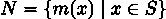

新集合 N 是对源 S 中的每个项目 x 应用转换 m(x)的结果。这强调了转换函数 m(x)，将其与消费源和产生结果的细节分开。在之前显示的 Python 示例中，这个函数被调用为 some_transformation()。

这个数学总结表明，for 语句可以被理解为围绕转换函数的一种支架。这种支架可以有两种额外的形式。我们可以写一个生成器表达式，或者我们可以使用内置的 map()函数。这个配方将检查所有三种技术。

## 9.2.1 准备工作

我们将查看使用 yield 语句编写生成器函数配方中的网络日志数据。这些数据中的日期是以字符串形式表示的，我们希望将其转换为合适的 datetime 对象，以便用于后续的计算。我们将利用之前配方中的 DatedLog 类定义。

使用 yield 语句编写生成器函数的配方使用了如下示例中的生成器函数，将一系列 RawLog 对象转换为一个更有用的 DatedLog 实例迭代器：

```py
import datetime 

from recipe_01 import RawLog, DatedLog 

def parse_date_iter( 

    source: Iterable[RawLog] 

) -> Iterator[DatedLog]: 

    for item in source: 

        date = datetime.datetime.strptime( 

            item.date, "%Y-%m-%d %H:%M:%S,%f" 

        ) 

        yield DatedLog( 

            date, item.level, item.module, item.message 

        )
```

这个 parse_date_iter()函数在有趣的功能周围有大量的支架代码。for 和 yield 语句是支架的例子。另一方面，日期解析是函数中独特、有趣的部分。我们需要提取这个独特的处理过程，以便使用更灵活的支架。

## 9.2.2 如何实现...

为了使用不同的生成器函数应用方法，我们需要首先重构原始的 parse_date_iter()函数。这将提取一个 parse_date()函数，可以以多种方式使用。在此初始步骤之后，我们将展示三个独立的迷你配方，用于使用重构后的代码。

重构迭代器以定义一个函数，该函数可以将源类型的项目转换为结果类型的项目：

```py
def parse_date(item: RawLog) -> DatedLog: 

    date = datetime.datetime.strptime( 

        item.date, "%Y-%m-%d %H:%M:%S,%f") 

    return DatedLog( 

        date, item.level, item.module, item.message)
```

这种转换可以通过三种方式应用于数据集合：生成器函数、生成器表达式和通过 map()函数。我们将首先重建原始生成器。

### 使用 for 和 yield 语句

我们可以使用 for 和 yield 语句将单行 parse_date()转换函数应用于集合中的每个项目。这在前面的使用 yield 语句编写生成器函数配方中已经展示过。下面是这个例子：

```py
def parse_date_iter_y( 

    source: Iterable[RawLog] 

) -> Iterator[DatedLog]: 

    for item in source: 

        yield parse_date(item)
```

### 使用生成器表达式

我们可以使用生成器表达式将 parse_date()函数应用于集合中的每个项目。生成器表达式包括两个部分——映射函数和一个 for 子句——由括号()包围。这遵循了第四章中构建列表——字面量、追加和推导式配方中的模式：

1.  写出包围生成器的括号()。

1.  为数据源编写一个 for 子句，将每个项目分配给一个变量，在这个例子中是 item：

    ```py
    (... for item in source)
    ```

1.  在 for 子句前加上映射函数，应用于变量：

    ```py
    (parse_date(item) for item in source)
    ```

1.  该表达式可以是函数的返回值，该函数为源和结果表达式提供合适的类型提示。以下是整个函数，因为它非常小：

    ```py
    def parse_date_iter_g( 

        source: Iterable[RawLog] 

    ) -> Iterator[DatedLog]: 

      return (parse_date(item) for item in source)
    ```

    该函数返回一个生成器表达式，它将 parse_date() 函数应用于源可迭代中的每个项目。

是的，这个函数很小，似乎不需要 def 语句和名称的开销。在某些情况下，类型提示可能会有所帮助，这使得这是一个合理的选择。

### 使用 map() 函数

我们可以使用 map() 内置函数将 parse_date() 函数应用于集合中的每个项目：

1.  使用 map() 函数将转换应用于源数据：

    ```py
    map(parse_date, source)
    ```

1.  该表达式可以是函数的返回值，该函数为源和结果表达式提供合适的类型提示。以下是整个函数，因为它非常小：

    ```py
    def parse_date_iter_m( 

        source: Iterable[RawLog] 

    ) -> Iterator[DatedLog]: 

        return map(parse_date, source)
    ```

map() 函数是一个迭代器，它将 parse_date() 函数应用于源可迭代中的每个项目。它产生由 parse_date() 函数创建的对象。

重要的是要注意，parse_date 名称不带 () 是对函数对象的引用。

认为函数必须被评估，并包含额外的、不必要的 () 的使用是一个常见的错误。

这三种技术是等效的。

## 9.2.3 它是如何工作的...

map() 函数替换了一些常见的代码，这些代码在处理周围充当脚手架。它执行 for 语句的工作。它将给定的函数应用于源可迭代中的每个项目。

我们可以如下定义我们自己的 map() 版本：

```py
def my_map2(f: Callable[[P], Q], source: Iterable[P]) -> Iterator[Q]: 

    return (f(item) for item in source) 
```

正如我们所见，它们的行为是相同的。不同的代码受众可能有不同的偏好。我们提供的指导是选择使代码的意义和意图对阅读代码的受众最清晰的风格。

## 9.2.4 更多...

在这个例子中，我们使用了 map() 函数将一个函数应用于单个可迭代集合中的每个项目。结果证明，map() 函数可以做得更多。map() 函数可以处理多个序列。

考虑这个函数和这两个数据源：

```py
>>> def mul(a, b): 

...     return a * b 

>>> list_1 = [2, 3, 5, 7] 

>>> list_2 = [11, 13, 17, 23]
```

我们可以将 mul() 函数应用于从每个数据源中抽取的配对序列：

```py
>>> list(map(mul, list_1, list_2)) 

[22, 39, 85, 161]
```

这使我们能够使用从序列中提取的参数值的不同类型的操作合并几个值序列。

## 9.2.5 参见

+   在本章后面的 使用堆叠的生成器表达式 菜单中，我们将查看堆叠生成器。我们将从多个单个映射操作构建一个复合函数，这些操作以各种类型的生成器函数的形式编写。

# 9.3 使用堆叠的生成器表达式

在本章前面的使用 yield 语句编写生成器函数配方中，我们创建了一个简单的生成器函数，它对数据执行单个转换。作为一个实际问题，我们经常希望对传入的数据应用几个函数。

我们如何堆叠或组合多个生成器函数以创建一个复合函数？

## 9.3.1 准备工作

此配方将对源数据应用几种不同的转换。将有三行重组以合并为单行，数据转换将源字符串转换为有用的数字或日期时间戳，以及过滤掉无用的行。

我们有一个电子表格，用于记录大型帆船的燃料消耗。

有关此数据的详细信息，请参阅第四章中的切片和切块列表配方。我们将在第十一章中的使用 CSV 模块读取分隔文件配方中更详细地查看解析。

我们希望对列表-of-lists-of-strings 对象的每一行级别的列表应用多个转换：

+   排除数据中存在的三行标题（以及任何空白行）。

+   将三个物理文本行合并为一个逻辑数据行。

+   将分隔的日期和时间字符串转换为日期时间对象。

+   将燃料高度从字符串转换为浮点数，理想情况下以加仑（或升）为单位，而不是英寸。

我们的目标是创建一组生成器函数。假设我们已经将生成器函数的结果分配给一个变量，datetime_gen，这些转换允许我们拥有如下所示的软件：

```py
>>> total_time = datetime.timedelta(0) 

>>> total_fuel = 0 

>>> for row in datetime_gen: 

...     total_time += row.engine_off - row.engine_on 

...     total_fuel += ( 

...         float(row.engine_on_fuel_height) - 

...         float(row.engine_off_fuel_height) 

... ) 

>>> print( 

... f"{total_time.total_seconds()/60/60 = :.2f}, " 

... f"{total_fuel = :.2f}")
```

我们需要设计一个复合函数来创建这个 datetime_gen 生成器。

## 9.3.2 如何实现...

我们将将其分解为三个独立的迷你配方：

+   重新排列行。

+   排除标题行。

+   创建更有用的行对象。

我们将从将三个物理行重组为一个逻辑行开始。

### 重新排列行

我们将首先创建一个 row_merge()函数来重新排列数据：

1.  我们将使用命名元组来定义组合逻辑行的类型：

    ```py
    from typing import NamedTuple 

    class CombinedRow(NamedTuple): 

        # Line 1 

        date: str 

        engine_on_time: str 

        engine_on_fuel_height: str 

        # Line 2 

        filler_1: str 

        engine_off_time: str 

        engine_off_fuel_height: str 

        # Line 3 

        filler_2: str 

        other_notes: str 

        filler_3: str
    ```

    原始数据有空单元格；我们称它们为 filler_1、filler_2 和 filler_3。保留这些垃圾列可以更容易地调试问题。

1.  CSV 读取器创建的源行将具有 list[str]类型；我们将为此类型提供一个别名，RawRow。函数的定义将接受 RawRow 实例的可迭代对象。它是一个 CombinedRow 对象的迭代器：

    ```py
    from typing import TypeAlias 

    from collections.abc import Iterable, Iterator 

    RawRow: TypeAlias = list[str] 

    def row_merge( 

        source: Iterable[RawRow] 

    ) -> Iterator[CombinedRow]: 
    ```

1.  函数的主体将消耗源迭代器中的行，跳过空行，构建一个定义 CombinedRow 对象的簇。当第一列非空时，任何之前的簇就完成了，它被产出，然后开始一个新的簇。最后一个簇也需要被产出：

    ```py
     cluster: RawRow = [] 

        for row in source: 

            if all(len(col) == 0 for col in row): 

                continue 

            elif len(row[0]) != 0: 

                # Non-empty column 1: line 1 

                if len(cluster) == 9: 

                    yield CombinedRow(*cluster) 

                cluster = row.copy() 

            else: 

                # Empty column 1: line 2 or line 3 

                cluster.extend(row) 

        if len(cluster) == 9: 

            yield CombinedRow(*cluster)
    ```

这个初始转换可以用来将 CSV 单元格值的行序列转换为 CombinedRow 对象，其中每个来自三个不同行的字段值都有它们自己的独特属性：

这个转换的第一个输出行将是标题行。下一部分是一个函数来删除这一行：

### 排除标题行

源 CSV 文件的前三行文本将创建一个不太有用的 CombinedRow 对象。我们将排除一个带有标签而不是数据的行：

1.  定义一个函数来处理一个由 CombinedRow 对象组成的可迭代集合，创建一个 CombinedRow 对象的迭代器：

    ```py
    def skip_header_date( 

        source: Iterable[CombinedRow] 

    ) -> Iterator[CombinedRow]:
    ```

1.  函数体消费源数据中的每一行，并产出好的行。它使用 continue 语句来拒绝不想要的行：

    ```py
      for row in source: 

        if row.date == "date": 

            continue 

        yield row
    ```

这可以与之前配方中显示的 row_merge()函数结合使用，以提供良好数据的迭代器：

要使合并的数据真正有用，需要几个转换步骤。接下来，我们将查看其中之一，创建正确的 datetime.datetime 对象：

### 创建更有用的行对象

每行中的日期和时间作为单独的字符串并不很有用。我们将编写的函数可以比这个配方中前两个步骤有稍微不同的形式，因为它适用于每个单独的行。单行转换看起来像这样：

1.  定义一个新的 NamedTuple 类，指定一个对时间值更有用的类型：

    ```py
    import datetime 

    from typing import NamedTuple 

    class DatetimeRow(NamedTuple): 

        date: datetime.date 

        engine_on: datetime.datetime 

        engine_on_fuel_height: str 

        engine_off: datetime.datetime 

        engine_off_fuel_height: str 

        other_notes: str
    ```

1.  定义一个映射函数，将一个 CombinedRow 实例转换为一个单一的 DatetimeRow 实例：

    ```py
    def convert_datetime(row: CombinedRow) -> DatetimeRow:
    ```

1.  这个函数的主体将执行多个日期时间计算并创建一个新的 DatetimeRow 实例：

    ```py
        travel_date = datetime.datetime.strptime( 

            row.date, "%m/%d/%y").date() 

        start_time = datetime.datetime.strptime( 

            row.engine_on_time, "%I:%M:%S %p").time() 

        start_datetime = datetime.datetime.combine( 

            travel_date, start_time) 

        end_time = datetime.datetime.strptime( 

            row.engine_off_time, "%I:%M:%S %p").time() 

        end_datetime = datetime.datetime.combine( 

            travel_date, end_time) 

        return DatetimeRow( 

            date=travel_date, 

            engine_on=start_datetime, 

            engine_off=end_datetime, 

            engine_on_fuel_height=row.engine_on_fuel_height, 

            engine_off_fuel_height=row.engine_off_fuel_height, 

            other_notes=row.other_notes 

        )
    ```

现在我们可以堆叠转换函数来合并行、排除标题行并执行日期时间转换。处理过程如下：

```py
>>> row_gen = row_merge(log_rows) 

>>> tail_gen = skip_header_date(row_gen) 

>>> datetime_gen = (convert_datetime(row) for row in tail_gen)
```

我们已经将重新格式化、过滤和转换问题分解为三个单独的函数。这三个步骤中的每一个都只完成整体工作的一个小部分。我们可以单独测试这三个函数。比能够测试更重要的是能够修复或修改一个步骤，而不会完全破坏整个转换堆栈：

## 9.3.3 它是如何工作的...

当我们编写一个生成器函数时，参数值可以是一个项目集合，或者它可以是一个任何其他类型的可迭代项目源。由于生成器函数是迭代器，因此可以通过堆叠它们来创建一个生成器函数的管道。一个生成器的结果成为堆叠中下一个生成器的输入：

由这个配方创建的 datetime_gen 对象是由三个独立的生成器组成的组合。一个 for 语句可以从 datetime_gen 生成器表达式收集值。该语句的主体可以打印详细信息并计算正在生成的对象的摘要：

此设计强调每个阶段的微小、增量操作。管道的某些阶段将消耗多个源行以生成单个结果行，在处理过程中重新构建数据。其他阶段则消耗并转换单行，这使得它们可以通过生成器表达式来描述。

整个管道由客户端的需求驱动。请注意，此处理中没有并发。每个函数在 yield 语句处“暂停”，直到客户端通过内置的 next()函数要求更多数据。

最重要的是，可以单独调试和测试各个转换步骤。这种分解有助于创建更健壮和可靠的软件。

## 9.3.4 更多内容...

为了使这些数据变得有用，需要进行一些其他转换。我们希望将开始和结束时间戳转换为持续时间。我们还需要将燃油高度值转换为浮点数，而不是字符串。

我们有几种方法来处理这些派生数据计算：

1.  我们可以在我们的生成器函数堆栈中创建额外的转换步骤。这反映了急切计算方法。

1.  我们还可以在类定义中添加@property 方法。这是一种惰性计算；只有在需要属性值时才会执行。

为了急切地计算额外的燃油高度和体积值，我们可以再次应用设计模式。首先，定义具有所需字段的额外命名元组类。然后，定义一个转换函数，将高度从字符串转换为浮点数。还要定义一个将高度从英寸转换为加仑的转换。这些额外的函数将是小型且易于测试的。

我们现在有一个复杂的计算，它由多个小型（几乎）完全独立的块定义。每个函数只执行创建一行所需的工作，将开销保持在最低。我们可以修改一个部分，而不必深入思考其他部分的工作方式。

## 9.3.5 参见

+   请参阅使用 yield 语句编写生成器函数的说明以了解生成器函数的简介。

+   请参阅第四章中的切片和切块列表说明，以获取有关燃油消耗数据集的更多信息。

+   请参阅组合 map 和 reduce 转换说明，了解另一种组合操作的方法。

+   选择子集的三种过滤方法说明详细介绍了过滤函数。

# 9.4 选择子集 – 三种过滤方法

选择相关行的子集可以称为过滤数据集合。我们可以将过滤视为拒绝不良行或包含期望行。有几种方法可以将过滤函数应用于数据项集合。

在使用堆叠生成器表达式的配方中，我们编写了 skip_header_date()生成器函数来排除一组数据中的某些行。skip_header_date()函数结合了两个元素：一个用于通过或拒绝项的规则，以及数据源。这个生成器函数有一个通用的模式，如下所示：

```py
from collections.abc import Iterable, Iterator 

from typing import TypeVar 

T = TypeVar("T")
```

```py
 def data_filter_iter( 

    source: Iterable[T] 

) -> Iterator[T]: 

    for item in source: 

        if should_be_passed(item): 

            yield item
```

这个 data_filter_iter()函数的类型提示强调它是一个可迭代的，从可迭代的源集合中消费类型为 T 的项。对每个项应用一些表达式以确定其是否有效。这个表达式可以定义为单独的函数。我们可以定义相当复杂的过滤器。

设计模式可以总结如下：

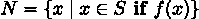

新集合 N 是源 S 中的每个项 x，其中过滤器函数 f(x)为真。这个总结强调了过滤器函数 f(x)，将其与消耗源和产生结果的技术细节区分开来。

这个数学总结表明 for 语句几乎只是脚手架代码。因为它不如过滤规则重要，所以它可以帮助重构生成器函数并从其他处理中提取过滤功能。

将 for 语句视为脚手架，我们还能如何将过滤器应用于集合中的每个项？我们可以使用两种额外的技术：

+   我们可以编写一个生成器表达式。

+   我们可以使用内置的 filter()函数。

这两个都需要重构生成器函数——skip_header_date()，如前所述，在使用堆叠生成器表达式的配方中——以提取决策表达式，使其与周围的 for 和 if 脚手架分离。从这个函数中，我们然后可以转向创建生成器表达式，并使用 filter()函数。

## 9.4.1 准备工作

在这个配方中，我们将查看本章使用堆叠生成器表达式配方中的燃料消耗数据。关于这些数据的详细信息，请参阅第四章中的切片和切块列表配方。

我们使用了两个生成器函数。第一个，row_merge()，将物理行重新组织成逻辑行。使用命名元组 CombinedRow 为行数据提供了更有用的结构。第二个生成器函数 skip_header_date()拒绝了数据表中的标题行，传递了有用的数据行。

我们将重写 skip_header_date()函数来展示三种不同的提取有用数据的方法。

## 9.4.2 如何做到...

本配方的第一部分将把“良好数据”规则从生成器函数中重构出来，使其更具有通用性。

1.  从以下大纲开始编写生成器函数的草稿版本：

    ```py
    def skip_header_date( 

        source: Iterable[CombinedRow] 

    ) -> Iterator[CombinedRow]: 

      for row in source: 

        if row.date == "date": 

            continue 

        yield row
    ```

1.  if 语句中的表达式可以被重构为一个函数，该函数可以应用于数据的一行，产生一个 bool 值：

    ```py
    def pass_non_date(row: CombinedRow) -> bool: 

        return row.date != "date"
    ```

1.  原始的生成器函数现在可以简化：

    ```py
    def skip_header_date_iter( 

        source: Iterable[CombinedRow] 

    ) -> Iterator[CombinedRow]: 

        for item in source: 

            if pass_non_date(item): 

                yield item
    ```

pass_non_date()函数可以用三种方式使用。如所示，它可以由一个生成器函数使用。它也可以用在生成器表达式中，以及与 filter()函数一起使用。接下来，我们将看看如何编写一个表达式。

### 在生成器表达式中使用 filter

生成器表达式包括三个部分——项目、一个 for 子句和一个 if 子句——所有这些都包含在括号()中。

1.  从一个 for 子句开始，将对象分配给一个变量。这个源来自某个可迭代的集合，在这个例子中称为 source：

    ```py
    (... for item in source)
    ```

1.  因为这是一个过滤器，结果表达式应该是 for 子句中的变量：

    ```py
    (item for item in source)
    ```

1.  使用 filter 规则函数 pass_non_date()编写一个 if 子句。

    ```py
    (item for item in source if pass_non_date(source))
    ```

1.  这个生成器表达式可以是一个函数的返回值，该函数为源表达式和结果表达式提供了合适的类型提示。以下是整个函数，因为它非常小：

    ```py
    def skip_header_gen( 

        source: Iterable[CombinedRow] 

    ) -> Iterator[CombinedRow]: 

        return ( 

            item 

            for item in source 

            if pass_non_date(item) 

        )
    ```

    这个函数返回生成器表达式的结果。这个函数并没有做很多，但它确实给表达式应用了一个名称和一组类型提示。

skip_header_gen()函数使用一个生成器表达式，该表达式将 pass_non_date()函数应用于源集合中的每个项目，以确定它是否通过并保留，或者是否被拒绝。

结果与上面显示的原始 skip_header_date()函数相同。

### 使用 filter()函数

使用 filter()函数包括两个部分——决策函数和数据来源——作为参数：

1.  使用 filter()函数将函数应用于源数据：

    ```py
    filter(pass_non_date, source)
    ```

filter()函数是一个迭代器，它将给定的函数 pass_non_date()作为规则应用于给定的可迭代对象 data 中的每个项目，以决定是否通过或拒绝。它产生那些 pass_non_date()函数返回 True 的行。

重要的是要注意，没有括号的 pass_non_date 名称是对一个函数对象的引用。

常见的错误是认为函数必须被评估，并包含额外的、不必要的括号使用。

## 9.4.3 它是如何工作的...

生成器表达式必须包含一个 for 子句以提供数据项的来源。可选的 if 子句可以应用一个条件，保留一些项同时拒绝其他项。在 if 子句中放置一个过滤器条件可以使表达式清晰并表达算法。

生成器表达式有一个重要的限制。作为表达式，它们不能使用 Python 的面向语句的特性。try-except 语句，用于处理异常数据条件，通常很有帮助。

## 9.4.4 更多内容...

有时，很难编写一个简单的规则来定义有效数据或拒绝无效数据。在许多情况下，可能无法使用简单的字符串比较来识别要拒绝的行。当文件中充满了无关信息时，这种情况就会发生；手动准备的电子表格就存在这个问题。在某些情况下，没有简单的正则表达式可以帮助描述有效数据。

我们经常遇到数据，其中确定有效性的最简单方法就是尝试转换，并将异常的存在或不存在转换为布尔条件。

考虑以下函数，以确定数据行是否具有有效的日期：

```py
import datetime 

def row_has_date(row: CombinedRow) -> bool: 

    try: 

        datetime.datetime.strptime(row.date, "%m/%d/%y") 

        return True 

    except ValueError as ex: 

        return False
```

这将尝试转换日期。它将拒绝不符合基本格式规则的无效字符字符串。它还将拒绝 2/31/24；虽然数字字符串是有效的，但这不是一个真实日期。

## 9.4.5 参见

+   在本章前面的使用堆叠生成器表达式配方中，我们将类似这样的函数放入生成器堆栈中。我们通过将多个作为生成器函数编写的单个映射和过滤操作组合起来，构建了一个复合函数。

# 9.5 汇总集合 – 如何 reduce

Reduction 是计算集合的总和或最大值等摘要的通用概念。计算均值或方差等统计度量也是 reduce。在本配方中，我们将探讨几种摘要或 reduce 技术。

在本章的介绍中，我们提到 Python 支持三种优雅的处理模式：map、filter 和 reduce。我们在应用于集合的转换配方中看到了映射的示例，在选择子集 – 三种过滤方式配方中看到了过滤的示例。

第三种常见的模式是 reduce。在设计大量处理类的配方和扩展内置集合 – 执行统计的列表配方中，我们看到了计算多个统计值的类定义。这些定义几乎完全依赖于内置的 sum()函数。这是更常见的 reduce 操作之一。

在本配方中，我们将探讨一种泛化求和的方法，从而可以编写多种不同类型的类似 reduce。泛化 reduce 的概念将使我们能够在一个可靠的基础上构建更复杂的算法。

## 9.5.1 准备工作

最常见的 reduce 操作包括求和、最小值、最大值。这些操作非常常见，因此它们是内置的。另一方面，平均值和方差是在统计模块中定义的 reduce。数学模块有一个 sum 的变体，即 fsum()，它特别适用于浮点数值集合。

求和是财务报告的骨架。它是自使用笔和纸进行财务报告以来电子表格所使用的本质。

求和的数学帮助我们了解运算符是如何将值集合转换为单个值的。下面是使用运算符 + 应用到集合 C = {c[0],c[1],c[2],…,c[n]} 中的值来思考求和函数的数学定义的一种方法：

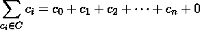

我们通过将加法运算符 + 拼接到 C 中的值序列来扩展 sum 的定义。

拼接涉及两个项目：一个二元运算符和一个基本值。对于 sum，运算符是 +，基本值是零。对于 product，运算符是 ×，基本值是一。基本值需要是给定运算符的单位元素。

我们可以将这个概念应用到许多算法中，可能简化定义。在这个配方中，我们将定义一个乘积函数。这是  运算符，类似于  运算符。

## 9.5.2 如何操作...

下面是如何定义一个实现数字集合乘积的减少操作：

1.  从 functools 模块导入 reduce() 函数：

    ```py
    from functools import reduce
    ```

1.  选择运算符。对于 sum，它是 +。对于 product，它将是 ×。这些可以用各种方式定义。下面是长版本。稍后还会展示定义必要的二元运算符的其他方式：

    ```py
    def mul(a: int, b: int) -> int: 

        return a * b
    ```

1.  选择所需的基本值。对于 sum 的加法单位值是零。对于 product 的乘法单位值是一：

    ```py
    def prod(values: Iterable[float]) -> float: 

        return reduce(mul, values, 1)
    ```

    ```py
     def prod(values: Iterable[int]) -> int: 

        return reduce(mul, values, 1)
    ```

我们可以使用这个 prod() 函数来定义其他函数。一个例子是阶乘函数。它看起来是这样的：

```py
def factorial(n: int) -> int: 

    return prod(range(1, n+1))
```

有多少种六张牌的克里比奇牌手是可能的？二项式计算使用阶乘函数来计算从 52 张牌的牌堆中抽取 6 张牌的方法数：

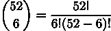

下面是一个 Python 实现：

```py
>>> factorial(52) // (factorial(6) * factorial(52 - 6)) 

20358520
```

对于任何给定的洗牌，大约有 2000 万种不同的克里比奇牌手可能出现。

## 9.5.3 它是如何工作的...

reduce() 函数的行为好像它有如下定义：

```py
T = TypeVar("T") 

def my_reduce( 

    fn: Callable[[T, T], T], 

    source: Iterable[T], 

    initial: T | None = None 

) -> T:
```

类型提示显示必须有一个统一的类型 T，它适用于折叠的运算符和折叠的初始值。给定的函数 fn() 必须组合两个类型为 T 的值并返回另一个类型为 T 的值。reduce() 函数的结果也将是这个类型。

此外，在 Python 中，reduce 操作将从左到右遍历值。它将在源集合的前一个结果和下一个项目之间应用给定的二元函数 fn()。当考虑非交换运算符（如减法或除法）时，这个额外细节很重要。

## 9.5.4 更多...

我们将探讨三个额外的主题。首先，定义操作的方法。之后，我们将探讨在逻辑简化：任意和所有中将 reduce 应用于布尔值。最后，在恒等元素中，我们将探讨各种运算符使用的恒等元素。

### 操作定义

当为 reduce()函数设计新应用时，我们需要提供一个二元运算符。有三种方法来定义必要的二元运算符。首先，我们可以使用完整的函数定义，如上所示在配方中。还有两种选择。我们可以使用 lambda 对象而不是完整的函数：

```py
from collections.abc import Callable
```

```py
lmul: Callable[[int, int], int] = lambda a, b: a * b
```

lambda 对象是一个匿名函数，简化为仅包含两个基本元素：参数和返回表达式。lambda 内部没有语句，只有一个表达式。

我们将 lambda 对象赋值给变量 lmul，这样我们就可以使用表达式 lmul(2, 3)来将 lambda 对象应用于参数值。

当操作是 Python 的内置运算符之一时，我们还有另一个选择——从 operator 模块导入定义：

```py
from itertools import takewhile
```

这对于所有内置的算术运算符都适用。

考虑正在使用的运算符的复杂性是至关重要的。执行 reduce 操作会将运算符的复杂性增加 n 倍。当应用于集合中的 n 个元素时，O(1)的操作变为 O(n)。对于我们所展示的运算符，如加法和乘法，这符合我们的预期。比 O(1)更复杂的运算符可能会变成性能噩梦。

在下一节中，我们将探讨逻辑简化函数。

### 逻辑简化：任意和所有

从概念上讲，我们似乎应该能够使用布尔运算符 and 和 or 来进行 reduce()操作。实际上，这涉及到一些额外的考虑。

Python 的布尔运算符具有短路特性：当我们评估表达式 False and 3 / 0 时，结果仅为 False。and 运算符右侧的表达式 3 / 0 永远不会被评估。or 运算符类似：当左侧为 True 时，右侧永远不会被评估。

如果我们想确保一个布尔值序列全部为真，自己构建 reduce()将会做太多工作。一旦看到初始的 False，就没有必要处理剩余的项目。and 和 or 的短路特性与 reduce()函数不匹配。

内置函数 any()和 all()另一方面，是使用逻辑运算符的简化。实际上，any()函数相当于使用 or 运算符的 reduce()。同样，all()函数的行为就像是一个使用 and 运算符的 reduce()。

### 恒等元素

通常，用于归约的运算符必须有一个恒等元素。这作为初始值提供给 reduce() 函数。当它们应用于空序列时，恒等元素也将是结果。以下是一些常见示例：

+   sum([]) 是零。

+   math.prod([]) 是一个例子。

+   any([]) 是 False。

+   all([]) 是 True。

给定操作的恒等值是定义问题。

在任何() 和 all() 的特定情况下，可以考虑基本折叠操作。恒等元素总是可以折叠而不改变结果。以下是 all() 以显式折叠和运算符的形式看起来是怎样的：

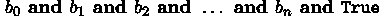

如果 b[0],b[1],b[2],...,b[n] 中的所有值都是 True，那么额外的 True 不会改变值。如果 b[0],b[1],b[2],...,b[n] 中的任何值是 False，同样地，额外的 True 也不会产生影响。

当集合中没有值时，all() 的值是恒等元素，即 True。

## 9.5.5 参见

+   在本章中，查看 使用堆叠的生成表达式 菜单，了解在何种情况下可以将 sum() 函数应用于计算总小时数和总燃料量。

# 9.6 map 和 reduce 转换的结合

在本章的其他菜谱中，我们一直在查看 map、filter 和 reduce 操作。我们已经单独查看过这些函数：

+   对集合应用转换 菜单展示了 map() 函数。

+   选择子集 – 三种过滤方式 菜单展示了 filter() 函数。

+   总结集合 – 如何归约 菜单展示了 reduce() 函数。

许多算法将涉及创建组合函数，这些函数结合了更基本的操作。此外，我们还需要考虑使用迭代器和生成函数的一个深刻限制。

这里有一个这个限制的例子：

```py
>>> typical_iterator = iter([0, 1, 2, 3, 4]) 

>>> sum(typical_iterator) 

10 

>>> sum(typical_iterator) 

0
```

我们通过手动将 iter() 函数应用于一个字面量列表对象来创建一个值序列的迭代器。第一次 sum() 函数从 typical_iterator 消费值时，它消费了所有五个值。下一次我们尝试将任何函数应用于 typical_iterator 时，将没有更多的值可以消费；迭代器将看起来是空的。根据定义，恒等值（对于求和来说是 0）是结果。

迭代器只能产生一次值。

在值被消费后，迭代器看起来像是一个空集合。

这个一次性约束将迫使我们缓存中间结果，当我们需要对数据进行多次减少时。创建中间集合对象将消耗内存，因此在处理非常大的数据集时需要仔细设计。（处理大量数据集是困难的。Python 提供了一些创建可行解决方案的方法；它并不能神奇地使问题消失。）

要对一个集合应用复杂的转换，我们通常会发现可以单独实现的 map、filter 和 reduce 操作的实例。然后，这些操作可以组合成复杂的复合操作。

## 9.6.1 准备工作

在本章前面使用堆叠生成器表达式的配方中，我们查看了一些帆船数据。电子表格组织得很差，需要多个步骤来对数据进行更有用的结构化。

在那个配方中，我们查看了一个用于记录大型帆船燃油消耗的电子表格。关于这些数据的详细信息，请参阅第四章中的切片和切块列表配方。我们将在第十一章的使用 CSV 模块读取定界文件配方中更详细地查看解析。

在使用堆叠生成器表达式的配方中，初始处理创建了一系列操作以改变数据的组织结构，过滤掉标题，并计算一些有用的值。我们需要补充两个额外的减少步骤来获取一些平均值和方差信息。这些统计数据将帮助我们更全面地理解数据。我们将在此基础上进行一些额外的步骤。

## 9.6.2 如何实现...

我们将从目标代码行作为设计目标开始。在这种情况下，我们希望有一个函数来计算每小时的燃油使用量。这遵循了一个常见的三步处理模式。首先，我们使用 row_merge()对数据进行归一化。其次，我们使用映射和过滤通过 clean_data_iter()创建更实用的对象。

第三步应该看起来像以下内容：

```py
>>> round( 

...     total_fuel(clean_data_iter(row_merge(log_rows))), 

...     3 

... ) 

7.0
```

我们的目标函数 total_fuel()被设计成与几个用于清理和整理原始数据的函数一起工作。我们将从归一化开始，然后定义最终的汇总函数，如下所示：

1.  从前面的配方中导入函数以重用初始准备：

    ```py
    from recipe_03 import row_merge, CombinedRow
    ```

1.  定义由清理和丰富步骤创建的目标数据结构。在这个例子中，我们将使用可变的数据类。来自归一化 CombinedRow 对象的字段可以直接初始化。其他五个字段将通过几个单独的函数积极计算。在 __init__()方法中没有计算的字段必须提供一个初始值 field(init=False)：

    ```py
    import datetime 

    from dataclasses import dataclass, field 

    @dataclass 

    class Leg: 

        date: str 

        start_time: str 

        start_fuel_height: str 

        end_time: str 

        end_fuel_height: str 

        other_notes: str 

        start_timestamp: datetime.datetime = field(init=False) 

        end_timestamp: datetime.datetime = field(init=False) 

        travel_hours: float = field(init=False) 

        fuel_change: float = field(init=False) 

        fuel_per_hour: float = field(init=False)
    ```

1.  定义整体数据清洗和丰富数据函数。这将从源 CombinedRow 对象构建丰富的 Leg 对象。我们将从七个更简单的函数构建它。实现是一个 map()和 filter()操作的堆栈，它将从源字段推导数据：

    ```py
    from collections.abc import Iterable, Iterator 

    def clean_data_iter( 

        source: Iterable[CombinedRow] 

    ) -> Iterator[Leg]: 

        leg_iter = map(make_Leg, source) 

        fitered_source = filter(reject_date_header, leg_iter) 

        start_iter = map(start_datetime, fitered_source) 

        end_iter = map(end_datetime, start_iter) 

        delta_iter = map(duration, end_iter) 

        fuel_iter = map(fuel_use, delta_iter) 

        per_hour_iter = map(fuel_per_hour, fuel_iter) 

        return per_hour_iter
    ```

    每个语句都使用前一个语句产生的迭代器。

1.  编写 make_Leg()函数，从 CombinedRow 实例创建 Leg 实例：

    ```py
    def make_Leg(row: CombinedRow) -> Leg: 

        return Leg( 

            date=row.date, 

            start_time=row.engine_on_time, 

            start_fuel_height=row.engine_on_fuel_height, 

            end_time=row.engine_off_time, 

            end_fuel_height=row.engine_off_fuel_height, 

            other_notes=row.other_notes, 

        )
    ```

1.  编写 reject_date_header()函数，用于 filter()移除标题行：

    ```py
    def reject_date_header(row: Leg) -> bool: 

        return not (row.date == "date")
    ```

1.  编写数据转换函数。我们将从两个日期和时间字符串开始，它们需要变成一个单一的 datetime 对象：

    ```py
    def timestamp( 

        date_text: str, time_text: str 

    ) -> datetime.datetime: 

        date = datetime.datetime.strptime( 

            date_text, "%m/%d/%y").date() 

        time = datetime.datetime.strptime( 

            time_text, "%I:%M:%S %p").time() 

        timestamp = datetime.datetime.combine( 

            date, time) 

        return timestamp
    ```

1.  使用额外的值修改 Leg 实例：

    ```py
    def start_datetime(row: Leg) -> Leg: 

          row.start_timestamp = timestamp( 

            row.date, row.start_time) 

          return row 

    def end_datetime(row: Leg) -> Leg: 

          row.end_timestamp = timestamp( 

            row.date, row.end_time) 

          return row
    ```

    这种原地更新方法是一种优化，以避免创建中间对象。

1.  从时间戳计算派生持续时间：

    ```py
    def duration(row: Leg) -> Leg: 

        travel_time = row.end_timestamp - row.start_timestamp 

        row.travel_hours = round( 

            travel_time.total_seconds() / 60 / 60, 

            1 

        ) 

        return row
    ```

1.  计算分析所需的其他任何指标：

    ```py
    def fuel_use(row: Leg) -> Leg: 

        end_height = float(row.end_fuel_height) 

        start_height = float(row.start_fuel_height) 

        row.fuel_change = start_height - end_height 

        return row 

    def fuel_per_hour(row: Leg) -> Leg: 

        row.fuel_per_hour = row.fuel_change / row.travel_hours 

        return row
    ```

最终的 fuel_per_hour()函数的计算依赖于整个前面的计算堆栈。每个这些计算都是单独进行的，以阐明和隔离计算细节。这种方法允许对隔离的计算进行更改。最重要的是，它允许将每个计算作为一个单独的单元进行测试。

## 9.6.3 它是如何工作的...

核心概念是从一系列小步骤构建一个复合转换。由于每个步骤在概念上是不同的，这使得理解组合变得相对容易。

在这个菜谱中，我们使用了三种类型的转换：

+   结构变化。一个初始生成函数将物理行分组到逻辑行中。

+   过滤器。一个生成函数拒绝无效的行。

+   丰富。正如我们所见，有两种设计方法可以丰富数据：懒加载和急加载。懒加载方法可能涉及仅在需要时计算的方法或属性。这种设计显示了急加载计算，其中许多字段值是由处理管道构建的。

各种丰富方法通过更新状态化的 Leg 对象、设置计算列值来实现。使用这种状态化对象需要严格按照顺序执行各种丰富转换，因为其中一些（如 duration()）依赖于其他转换先执行。

我们现在可以设计目标计算函数：

```py
from statistics import * 

def avg_fuel_per_hour(source: Iterable[Leg]) -> float: 

    return mean(row.fuel_per_hour for row in source) 

def stdev_fuel_per_hour(source: Iterable[Leg]) -> float: 

    return stdev(row.fuel_per_hour for row in source)
```

这符合我们的设计目标，即能够在原始数据上执行有意义的计算。

## 9.6.4 更多内容...

正如我们所提到的，我们只能对可迭代数据源中的项目进行一次迭代。如果我们想计算多个平均值，或者平均值以及方差，我们需要使用稍微不同的设计模式。

为了计算多个数据摘要，通常最好创建某种类型的具体对象，该对象可以被反复总结：

```py
def summary(raw_data: Iterable[list[str]]) -> None: 

    data = tuple(clean_data_iter(row_merge(raw_data))) 

    m = avg_fuel_per_hour(data) 

    s = 2 * stdev_fuel_per_hour(data) 

    print(f"Fuel use {m:.2f} {s:.2f}")
```

在这里，我们从清洗和丰富后的数据创建了一个非常大的元组。从这个元组中，我们可以产生任意数量的迭代器。这使我们能够计算任意数量的不同摘要。

我们还可以使用 itertools 模块中的 tee()函数进行此类处理。由于克隆迭代器的实例保持其内部状态的方式，这可能导致效率低下的处理。通常，创建一个中间结构（如列表或元组）比使用 itertools.tee()更好。

设计模式将多个转换应用于源数据。我们使用单独的映射、过滤和减少操作堆叠构建了它。

## 9.6.5 参考信息

+   在本章中查看使用堆叠生成器表达式的配方，了解 sum 函数可以应用于计算总小时数和总燃料量的上下文。

+   在本章中查看总结集合 – 如何减少的配方，了解 reduce()函数的一些背景信息。

+   有关分布式 map-reduce 处理的更多信息，请参阅[Python High Performance](https://www.packtpub.com/product/python-high-performance-second-edition-second-edition/9781787282896)。

+   我们在使用属性进行懒属性的配方中查看懒性属性，在第七章。此外，这个配方还探讨了 map-reduce 处理的某些重要变体。

# 9.7 实现“存在”处理

我们一直在研究的处理模式都可以用全称量化符∀来概括，意味着对于所有。这一直是所有处理定义的隐含部分：

+   映射：对于源中的所有项，S，应用映射函数，m(x)。我们可以使用全称量化符：∀[x∈S]m(x)。

+   过滤：这也意味着对于源中的所有项，S，传递那些过滤函数，f(x)，为真的项。在这里，我们也可以使用全称量化符：∀[x∈S]x if f(x)。

+   减少：对于源中的所有项，使用给定的运算符和基数值来计算摘要。在运算符∑[x∈S]x 和∏[x∈S]x 的定义中隐含了全称量化。

将这些通用函数与仅对我们定位单个项感兴趣的情况进行对比。我们经常将这些情况描述为搜索，以表明至少存在一个项满足条件。这可以用存在量化符∃来描述，意味着存在。

我们需要使用 Python 的一些附加功能来创建生成器函数，当第一个值匹配某个谓词时停止。我们希望模拟内置的 any()和 all()函数的短路功能。

## 9.7.1 准备工作

以一个存在性测试的例子为例，考虑一个确定一个数是素数还是合数的函数。素数没有除了 1 和它自己之外的因子。具有多个因子的数被称为合数。数字 42 是合数，因为它有 2、3 和 7 作为素数因子。

判断一个数是否为素数等同于证明它不是合数。对于任何合数（或非素数）数，n，规则是这样的：

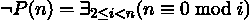

如果存在一个值 i，介于 2 和该数本身之间，可以整除该数，则一个数 n 不是素数。为了测试一个数是否是素数，我们不需要知道所有的因子。单个因子的存在表明该数是合数。

整体思路是遍历候选数字的范围，在找到因子时退出迭代。在 Python 中，这种从 for 语句中的提前退出是通过 break 语句完成的，将语义从“对所有”转换为“存在”。因为 break 是一个语句，所以我们不能轻易使用生成器表达式；我们被迫编写生成器函数。

(费马测试通常比我们在这些例子中使用的更有效，但它不涉及简单地搜索因子的存在。我们使用它作为搜索的示例，而不是作为良好素性测试的示例。)

## 9.7.2 如何做到...

为了构建这种搜索函数，我们需要创建一个生成器函数，当它找到第一个匹配项时将完成处理。一种方法是使用 break 语句，如下所示：

1.  定义一个生成器函数以跳过项，直到通过测试。生成器可以产生通过谓词测试的第一个值。生成器通过将谓词函数 fn()应用于某些类型 T 的项序列中的项来工作：

    ```py
    from collections.abc import Callable, Iterable, Iterator 

    from typing import TypeVar 

    T = TypeVar("T") 

    def find_first( 

        fn:  Callable[[T], bool], source: Iterable[T] 

    ) -> Iterator[T]: 

        for item in source: 

            if fn(item): 

                yield item 

                break 
    ```

1.  为此应用定义特定的谓词函数。由于我们正在测试是否为素数，我们正在寻找任何可以整除目标数 n 的值。以下是所需的表达式类型：

    ```py
    lambda i: n % i == 0
    ```

1.  使用给定的值范围和谓词应用 find_first()搜索函数。如果因子可迭代有项，则 n 是合数。否则，因子可迭代中没有值，这意味着 n 是素数：

    ```py
    import math 

    def prime(n: int) -> bool: 

        factors = find_first( 

            lambda i: n % i == 0, 

            range(2, int(math.sqrt(n) + 1)) ) 

        return len(list(factors)) == 0
    ```

实际上，我们不需要测试介于两个数和 n 之间的每个数来查看 n 是否为素数。只需要测试满足 2 ≤ i < ⌊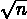⌋的值 i。

## 9.7.3 它是如何工作的...

在 find_first()函数中，我们引入了 break 语句来停止处理源可迭代。当 for 语句停止时，生成器将到达函数的末尾并正常返回。

消费此生成器值的客户端函数将收到 StopIteration 异常。find_first()函数可以引发异常，但这不是错误；它是可迭代已处理输入值的信号。

在这种情况下，StopIteration 异常意味着以下两种情况之一：

+   如果之前已经产生了值，则该值是 n 的因子。

+   如果没有产生值，则 n 是素数。

这种提前从 for 语句中退出的微小变化在生成器函数的意义上产生了巨大的差异。find_first()生成器将停止处理，而不是处理所有源值。

## 9.7.4 更多...

在 itertools 模块中，find_first() 函数有一个替代方案。takewhile() 函数使用谓词函数从输入中取值，只要谓词函数为真。当谓词变为假时，函数停止消费和产生值。

要使用 takewhile() 函数，我们需要反转我们的因子测试。我们需要消费非因子值，直到我们找到第一个因子。这导致 lambda 表达式从 lambda i: n % i == 0 变为 lambda i: n % i != 0。

让我们看看一个测试，看看 47 是否为质数。我们需要检查 2 到 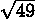 = 7 范围内的数字：

```py
>>> from itertools import takewhile 

>>> n = 47 

>>> list(takewhile(lambda i: n % i != 0, range(2, 8))) 

[2, 3, 4, 5, 6, 7]
```

对于像 47 这样的质数，没有任何测试值是因子。所有这些非因子测试值都通过了 takewhile() 谓词，因为它是始终为真的。结果列表与原始测试值集合相同。

对于一个合数，非因子测试值将是测试值的一个子集。由于找到了一个因子，一些值已被排除。

itertools 模块中还有许多其他函数可以用来简化复杂的 map-reduce 应用。我们鼓励您仔细研究这个模块。

## 9.7.5 参见

+   在本章前面的 使用堆叠的生成表达式 菜谱中，我们广泛使用了不可变类定义。

+   有关小于 200 万的质数相关的一个具有挑战性的问题，请参阅 [`projecteuler.net/problem=10`](https://projecteuler.net/problem=10)。问题的某些部分看起来很明显。然而，测试所有这些数字是否为质数可能很困难。

+   itertools 模块提供了许多函数，可以简化函数设计。

+   在标准库之外，像 [Pyrsistent](https://pypi.org/project/pyrsistent/) 这样的包提供了函数式编程组件。

# 9.8 创建一个部分函数

当我们查看 reduce()、sorted()、min() 和 max() 等函数时，我们会看到我们经常会遇到一些参数值几乎不会改变，或者在特定上下文中实际上是固定的。例如，我们可能会在几个地方需要编写类似以下内容：

```py
reduce(operator.mul, ..., 1)
```

在 reduce() 的三个参数值中，只有一个——要处理的可迭代对象——实际上会改变。操作符和初始值参数值基本上固定在 operator.mul 和 1。

显然，我们可以为这个定义一个新的函数：

```py
from collections.abc import Iterable 

from functools import reduce 

import operator 

def prod(iterable: Iterable[float]) -> float: 

    return reduce(operator.mul, iterable, 1)
```

Python 有几种方法可以简化这个模式，这样我们就不必重复编写样板 def 和 return 语句。

这个菜谱的目标与提供一般默认值不同。部分函数不提供覆盖默认值的方法。部分函数在定义时绑定特定的值。想法是能够创建许多部分函数，每个函数在预先绑定特定的参数值。这有时也被称为闭包，但应用于一些参数。参见第三章中的基于部分函数选择参数顺序以获取更多部分函数定义的示例。

## 9.8.1 准备工作

一些统计建模使用标准化值进行，有时称为 z 分数。想法是将原始测量值标准化到一个可以轻松与正态分布比较的值，并且可以轻松与可能以不同单位测量的相关数字比较。

计算过程如下：

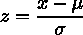

在这里，x 是一个原始值，μ是总体均值，σ是总体标准差。z 的值将具有 0 的均值和 1 的标准差，提供标准化值。我们可以使用这个值来发现异常值——那些可疑地远离均值的值。我们预计（大约）99.7%的 z 值将在-3 和+3 之间。

我们可以定义一个函数来计算标准分数，如下所示：

```py
def standardize(mean: float, stdev: float, x: float) -> float: 

    return (x - mean) / stdev
```

这个 standardize()函数将从原始分数 x 计算 z 分数。当我们在这个实际应用中使用这个函数时，我们会看到参数有两种类型的值：

+   均值和 stdev 参数的值基本上是固定的。一旦我们计算了总体值，我们就必须反复将相同的两个值提供给 standardize()函数。

+   每次评估 standardize()函数时，x 参数的值都会变化。

让我们处理一个包含两个变量 x 和 y 的数据样本集合。这些对由 DataPair 类定义：

```py
from dataclasses import dataclass 

@dataclass 

class DataPair: 

    x: float 

    y: float 
```

例如，我们将计算 x 属性的标准化值。这意味着计算 x 值的平均值和标准差。然后，我们需要将平均值和标准差值应用于标准化我们收集中的数据。计算过程如下：

```py
>>> import statistics 

>>> mean_x = statistics.mean(item.x for item in data_1) 

>>> stdev_x = statistics.stdev(item.x for item in data_1) 

>>> for DataPair in data_1: 

...     z_x = standardize(mean_x, stdev_x, DataPair.x) 

...     print(DataPair, z_x)
```

每次评估 standardize()函数时提供 mean_x 和 stdev_x 值可能会使算法充斥着不重要的细节。

我们可以使用部分函数简化使用具有两个固定参数值和一个可变参数的 standardize()的使用。

## 9.8.2 如何实现...

为了简化使用具有多个固定参数值的函数，我们可以创建一个部分函数。这个菜谱将展示两种创建部分函数的方法，作为独立的迷你菜谱：

+   使用 functools 模块中的 partial()函数从完整的 standardize()函数构建一个新的函数

+   创建一个 lambda 对象来提供不变的参数值

### 使用 functools.partial()

1.  从 functools 模块导入 partial() 函数：

    ```py
    from functools import partial
    ```

1.  使用 partial() 创建一个新的函数。我们提供基本函数，以及需要包含的位置参数。当定义 partial 时未提供的任何参数必须在评估 partial 时提供：[firstline=79,lastline=79,gobble=4][python]src/ch09/recipe˙08.py

我们已经为 standardize() 函数的前两个参数，即平均值和标准差，提供了固定值。现在我们可以使用 z() 函数的单个值，z(a)，它将评估表达式 standardize(mean_x, stdev_x, a)。

### 创建 lambda 对象

1.  定义一个绑定固定参数的 lambda 对象：[firstline=105,lastline=105,gobble=8][python]src/ch09/recipe˙08.py

1.  将此 lambda 分配给变量以创建一个可调用的对象，z()：[firstline=105,lastline=105,gobble=4][python]src/ch09/recipe˙08.py

这为 standardize() 函数的前两个参数，即平均值和标准差，提供了固定值。现在我们可以使用 z() lambda 对象的单个值，z(a)，它将评估表达式 standardize(mean_x, stdev_x, a)。

## 9.8.3 工作原理...

这两种技术都创建了一个可调用的对象——一个函数——名为 z()，它已经将 mean_x 和 stdev_x 的值绑定到前两个位置参数。使用这两种方法中的任何一种，我们现在都可以进行如下处理：

[firstline=107,lastline=108,gobble=4][python]src/ch09/recipe˙08.py

我们已经将 z() 函数应用于每一组数据。因为 z() 是一个部分函数并且已经应用了一些参数，所以它的使用被简化了。

创建 z() 函数的两种技术之间有一个显著的区别：

+   partial() 函数绑定参数的实际值。任何后续对这些变量所做的更改都不会改变创建的部分函数的定义。

+   lambda 对象绑定变量名，而不是值。任何后续对变量值的更改都会改变 lambda 的行为方式。

我们可以稍微修改 lambda 以绑定特定值而不是名称：

[firstline=131,lastline=131,gobble=4][python]src/ch09/recipe˙08.py

这将提取当前 mean_x 和 stdev_x 的值以创建 lambda 对象参数的默认值。mean_x 和 stdev_x 的值现在与 lambda 对象 z() 的正确操作无关。

## 9.8.4 更多内容...

在创建部分函数时，我们可以提供关键字参数值以及位置参数值。虽然这在一般情况下工作得很好，但还有一些情况它不起作用。

我们开始这个配方时查看 reduce() 函数。有趣的是，这个函数是函数不能轻易转换为部分函数的一个例子。参数的顺序不是创建部分函数的理想顺序，并且它不允许通过名称提供参数值。

reduce() 函数似乎是这样定义的：

```py
def reduce(function, iterable, initializer=None)
```

如果这是实际的定义，我们可以这样做：

```py
prod = partial(reduce(mul, initializer=1))
```

实际上，前面的例子会引发一个 TypeError。它不起作用，因为 reduce() 的定义不接受关键字参数值。因此，我们无法轻松地创建使用它的部分函数。

这意味着我们被迫使用以下 lambda 技术：

```py
>>> from operator import mul 

>>> from functools import reduce 

>>> prod = lambda x: reduce(mul, x, 1)
```

在 Python 中，函数是一个对象。我们已经看到了许多函数可以作为其他函数的参数的方式。接受或返回另一个函数作为参数的函数有时被称为高阶函数。

同样，函数也可以返回一个函数对象作为结果。这意味着我们可以创建一个像这样的函数：

```py
from collections.abc import Sequence, Callable 

import statistics 

def prepare_z(data: Sequence[DataPair]) -> Callable[[float], float]: 

    mean_x = statistics.mean(item.x for item in data_1) 

    stdev_x = statistics.stdev(item.x for item in data_1) 

    return partial(standardize, mean_x, stdev_x)
```

这里，我们定义了一个在类型为 DataPair 的序列上的函数，这些是 (x,y) 样本。我们计算了每个样本的 x 属性的平均值和标准差。然后我们创建了一个部分函数，可以根据计算出的统计数据标准化分数。这个函数的结果是一个我们可以用于数据分析的函数。

以下示例显示了如何使用这个新创建的函数：

```py
>>> z = prepare_z(data_1) 

>>> for DataPair in data_1: 

...     print(DataPair, z(DataPair.x))
```

prepare_z() 函数的结果是一个可调用对象，它将根据计算出的平均值和标准差标准化分数。

## 9.8.5 参考阅读

+   参见第三章中的 Picking an order for parameters based on partial functions 以获取部分函数定义的更多示例。

# 9.9 使用 yield from 语句编写递归生成器函数

许多算法可以简洁地表示为递归。在围绕 Python 的堆限制设计递归函数的配方中，我们查看了一些可以优化以减少函数调用的递归函数。

当我们查看某些数据结构时，我们发现它们涉及递归。特别是，JSON 文档（以及 XML 和 HTML 文档）可以具有递归结构。JSON 文档是一个复杂对象，它可以包含其内的其他复杂对象。

在许多情况下，使用生成器处理这些结构具有优势。在这个配方中，我们将查看处理递归数据结构的方法。

## 9.9.1 准备工作

在这个配方中，我们将查看一种在复杂、递归数据结构中搜索所有匹配值的方法。当处理复杂的 JSON 文档时，它们通常包含 dict-of-dict、dict-of-list、list-of-dict 和 list-of-list 结构。当然，JSON 文档不仅限于两层；dict-of-dict 实际上可以意味着 dict-of-dict-of...。同样，dict-of-list 可以意味着 dict-of-list-of...。搜索算法必须遍历整个结构以查找特定的键或值。

一个具有复杂结构的文档可能看起来像这样：

```py
document = { 

    "field": "value1", 

    "field2": "value", 

    "array": [ 

        {"array_item_key1": "value"}, 

        {"array_item_key2": "array_item_value2"} 

    ], 

    "object": { 

        "attribute1": "value", 

        "attribute2": "value2" 

    }, 

}
```

值 "value" 可以在三个地方找到：

+   ["array", 0, "array_item_key1"]：此路径从顶级字段名为 array 开始，然后访问列表中的第 0 个项目，然后是名为 array_item_key1 的字段。

+   ["field2"]：此路径只有一个字段名，其中找到了值。

+   ["object", "attribute1"]：此路径以顶级字段 object 开头，然后是该字段的子字段 attribute1。

find_value()函数应在搜索整个文档以查找目标值时产生所有这些路径。这个算法的核心是深度优先搜索。此函数的输出必须是一个路径列表，用于标识目标值。每个路径将是一个字段名序列或字段名与索引位置的混合。

## 9.9.2 如何操作...

我们将从概述深度优先算法开始，以访问 JSON 文档中的所有节点。

1.  从处理整体数据结构中每个替代结构的函数草图开始。以下是导入和一些类型提示：

    ```py
    from collections.abc import Iterator 

    from typing import Any, TypeAlias 

    JSON_DOC: TypeAlias = ( 

        None | str | int | float | bool | dict[str, Any] | list[Any] 

    ) 

    Node_Id: TypeAlias = Any
    ```

    这里是函数的草图：

    ```py
    def find_value_sketch( 

        value: Any, 

        node: JSON_DOC, 

        path: list[Node_Id] | None = None 

    ) -> Iterator[list[Node_Id]]: 

        if path is None: 

            path = [] 

        match node: 

            case dict() as dnode: 

                pass  # apply find_value to each key in dnode 

            case list() as lnode: 

                pass  # apply find_value to each item in lnode 

            case _ as pnode: # str, int, float, bool, None 

                if pnode == value: 

                    yield path
    ```

1.  这里是一个起始版本，用于查看字典的每个键。这替换了前面代码中的# apply find_value to each key in dnode 行。测试以确保递归正常工作：[firstline=58,lastline=60,gobble=8][python]src/ch09/recipe˙10.py

1.  将内部的 for 循环替换为 yield from 语句：[firstline=98,lastline=100,gobble=8][python]src/ch09/recipe˙10.py

1.  这也必须应用于列表情况。开始检查列表中的每个项目：[firstline=62,lastline=64,gobble=8][python]src/ch09/recipe˙10.py

1.  将内部的 for 循环替换为 yield from 语句：[firstline=102,lastline=104,gobble=8][python]src/ch09/recipe˙10.py

当完整时，完整的深度优先 find_value()搜索函数将看起来像这样：

```py
def find_value( 

    value: Any, 

    node: JSON_DOC, 

    path: list[Node_Id] | None = None 

) -> Iterator[list[Node_Id]]: 

    if path is None: 

        path = [] 

    match node: 

        case dict() as dnode: 

            for key in sorted(dnode.keys()): 

                yield from find_value( 

                    value, node[key], path + [key]) 

        case list() as lnode: 

            for index, item in enumerate(lnode): 

                yield from find_value( 

                    value, item, path + [index]) 

        case _ as pnode: 

            # str, int, float, bool, None 

            if pnode == value: 

                yield path
```

当我们使用 find_value()函数时，它看起来像这样：

```py
>>> places = list(find_value(’value’, document)) 

>>> places 

[[’array’, 0, ’array_item_key1’], [’field2’], [’object’, ’attribute1’]]
```

结果列表有三个项目。这些项目中的每一个都是一个键列表，这些键构成了一条到具有“value”目标值的项的路径。

## 9.9.3 它是如何工作的...

关于背景信息，请参阅本章中的使用 yield 语句编写生成器函数配方。

yield from 语句是以下内容的简写：

[firstline=135,lastline=136,gobble=8][python]src/ch09/recipe˙10.py

yield from 语句让我们能够编写简洁的递归算法，该算法将表现得像一个迭代器，并正确地产生多个值。它节省了样板 for 语句的开销。

这也可以用于不涉及递归函数的上下文中。在任何涉及可迭代结果的上下文中使用 yield from 语句是完全合理的。对于递归函数来说，这是一个方便的简化，因为它保留了清晰的递归结构。

## 9.9.4 还有更多...

另一种常见的定义方式是使用 append 操作来组装项目列表。我们可以将其重写为一个迭代器，以避免构建和修改列表对象的开销。

在分解一个数字时，我们可以定义一个数字 x 的质因数集合，如下所示：

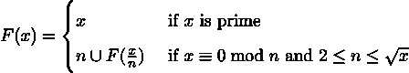

如果值 x 是质数，它在质因子集合中只有它自己。否则，必须有一些质数 n，它是 x 的最小因子。我们可以从这个数字 n 开始组装一个因子集合，然后追加  的所有因子。为了确保只找到质因子，n 必须是质数。如果我们从 2 开始搜索 n 的递增值，我们将在找到合数因子之前找到质数因子。

一种急切的方法是构建一个完整的因子列表。一种懒惰的方法可以是生成器，为消费者提供因子。以下是一个急切构建列表的函数：

```py
import math 

def factor_list(x: int) -> list[int]: 

    limit = int(math.sqrt(x) + 1) 

    for n in range(2, limit): 

        q, r = divmod(x, n) 

        if r == 0: 

            return [n] + factor_list(q) 

    return [x]
```

这个 factor_list() 函数将构建一个列表对象。如果找到一个因子 n，它将以该因子开始一个列表。然后，它将使用 x // n 的值构建的因子扩展列表。如果没有 x 的因子，那么这个值是质数，并且它将返回一个只包含 x 值的列表。

（这有一个效率低下的原因，因为它以这种方式搜索合数和质数。例如，在测试 2 和 3 之后，它还将测试 4 和 6，即使它们是合数，并且它们的所有因子都已经测试过了。这个例子集中在列表构建上，而不是高效地分解数字。）

我们可以通过用 yield from 语句替换递归调用将此重写为迭代器。函数将看起来像这样：

```py
def factor_iter(x: int) -> Iterator[int]: 

    limit = int(math.sqrt(x) + 1) 

    for n in range(2, limit): 

        q, r = divmod(x, n) 

        if r == 0: 

            yield n 

            yield from factor_iter(q) 

            return 

    yield x
```

当找到一个因子时，该函数将产生因子 n，然后通过递归调用 factor_iter() 找到所有其他因子。如果没有找到因子，该函数将产生质数 x，不再产生其他内容。

使用迭代器允许此函数的客户从因子构建任何类型的集合。我们不仅可以创建列表对象，还可以使用 collections.Counter 类创建多重集。它看起来像这样：

```py
>>> from collections import Counter 

>>> Counter(factor_iter(384)) 

Counter({2: 7, 3: 1})
```

这表明：

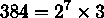

在某些情况下，这种多重集可能比简单的因子列表更容易处理。

重要的是，这个多重集是直接从 factor_iter() 迭代器创建的，而没有创建任何中间列表对象。这种优化让我们能够构建不强制消耗大量内存的复杂算法。

## 9.9.5 参见

+   在本章前面的围绕 Python 栈限制设计递归函数配方中，我们介绍了递归函数的核心设计模式。这个配方提供了一种创建结果的替代方法。

+   关于背景，请参阅本章中的使用 yield 语句编写生成器函数配方。

# 加入我们的社区 Discord 空间

加入我们的 Python Discord 工作空间，讨论并了解更多关于这本书的信息：[`packt.link/dHrHU`](https://packt.link/dHrHU)


