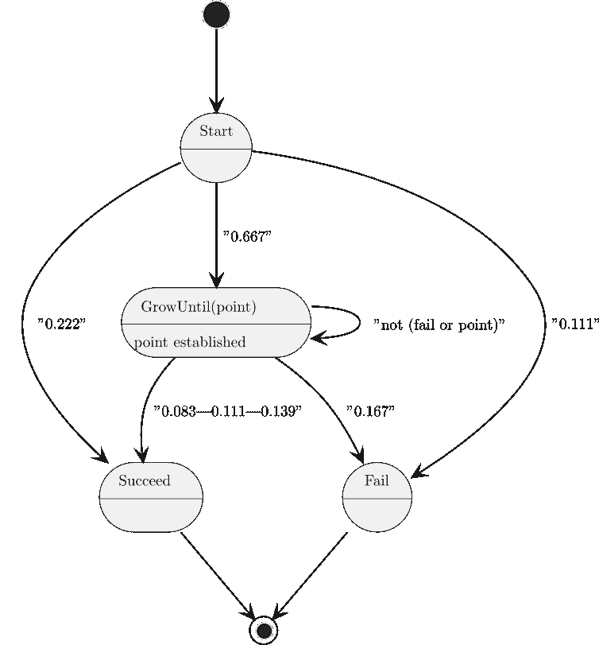
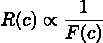

## 14

应用集成：组合

Python 语言被设计成允许扩展性。我们可以通过组合多个较小的组件来创建复杂的程序。在本章中，我们将探讨组合模块和脚本的方法。

我们将探讨复合应用可能出现的复杂性以及集中一些功能（如命令行解析）的需求。这将使我们能够为各种密切相关程序创建统一的接口。

我们将扩展第七章和第八章的一些概念，并将命令设计模式的思想应用到 Python 程序中。通过在类定义中封装特性，我们将发现组合和扩展程序更容易。

在本章中，我们将探讨以下菜谱：

+   将两个应用组合成一个

+   使用命令设计模式组合多个应用

+   在复合应用中管理参数和配置

+   包装和组合 CLI 应用

+   包装程序并检查输出

我们将从将多个 Python 应用组合成一个更复杂的单一应用的方法开始。我们将扩展这一方法，应用面向对象设计技术，创建一个更加灵活的复合体。然后，我们将为复合应用应用统一的命令行参数解析。

# 14.1 将两个应用组合成一个

对于这个菜谱，我们将查看两个需要组合的脚本。一个脚本从马尔可夫链过程中输出数据，第二个脚本总结这些结果。

这里重要的是，马尔可夫链应用（故意）有点神秘。为了几个菜谱的目的，我们将将其视为不透明的软件，可能是用另一种语言编写的。

（本书的 GitHub 仓库中用 Pascal 编写了马尔可夫链，以便合理地保持其透明度。）

以下是对马尔可夫链状态变化的描述：



图 14.1：马尔可夫链状态

初始状态将成功、失败或生成一个“点”值。有多个值，每个值都有不同的概率，总和为 P = 0.667。GrowUntil 状态生成可能匹配点、不匹配点或指示失败的值。在非匹配和非失败的情况下，链会转回到此状态。匹配的确切概率取决于起始点值，这就是为什么状态转换被标记为三个概率的原因。

生成器应用会输出一个包含一些配置细节和一系列单独样本的 TOML 格式文件。文件看起来像这样：

```py
# file = "../../data/ch14/data.csv" 

# samples = 10 

# randomize = 0 

# ----- 

outcome,length,chain 

"Success",1,"7" 

"Success",2,"10;10"
```

摘要应用读取所有这些生成的文件，创建一些简单的统计数据来描述原始数据。这个总结最初是用 Jupyter Notebook 完成的。虽然这些可以通过 jupyter execute 命令执行，但另一种方法是保存 notebook 为脚本，然后执行该脚本。

我们希望能够将这个生成器和摘要应用结合起来，以减少使用生成器时的手动步骤。结合多个应用有几种常见的方法：

+   一个 shell 脚本可以运行生成器应用，然后运行摘要应用。

+   一个 Python 程序可以实现高级操作，使用 runpy 模块运行这两个应用中的每一个。

+   我们可以从每个应用的基本组件构建一个组合应用。

在这个配方中，我们将查看通过编写一个新的组合应用来结合每个应用基本组件的第三条路径。

## 14.1.1 准备工作

在第十三章的设计组合脚本和使用日志进行控制和审计输出配方中，我们遵循了一个设计模式，该模式将输入收集、基本处理和输出生产分离。该设计模式的目标是将有趣的片段收集在一起，以组合和重新组合成更高级的结构。

注意，这两个应用之间存在微小的不匹配。我们可以从数据库工程（以及电气工程）借用一个短语，称之为“阻抗不匹配”。

在构建这个组合应用时，阻抗不匹配是一个基数问题。数据生成过程设计为比统计总结过程运行得更频繁。我们有几个选择来解决这个问题：

+   完全重设计：我们可以将生成器重写为迭代器，按需生成多组样本。

+   添加迭代器：我们可以构建一个组合应用来执行批量数据生成处理。所有数据生成完毕后，组合应用可以对其进行总结。

在这些设计选择之间进行选择取决于这个应用的用户故事。它也可能取决于已经建立的用户基础。对于这个配方，用户希望遵循添加迭代器设计来创建一个组合过程，而不触及底层的生成器。

在查看两个模块实现选择时，我们看到顶级应用有两个不同的设计模式：

+   markov_gen 模块有以下 main()函数定义：

    ```py
    def main(argv: list[str] = sys.argv[1:]) -> None:
    ```

+   另一方面，markov_summ 模块是一个脚本，从 notebook 导出。这个脚本不包含直接命令行界面（CLI），需要进行一些重写。有关详细信息，请参阅第十三章的设计组合脚本配方。

为了创建一个更有用的脚本，我们需要添加一个 def main(): 行，并将整个脚本缩进到这个函数体内。在缩进的 main() 函数的末尾，可以添加 if __name__ == "__main__": 块。如果没有创建一个可以被导入的函数，脚本将非常难以测试和集成。

## 14.1.2 如何实现...

1.  导入所需的其它模块：

    ```py
    import argparse 

    import contextlib 

    import logging 

    from pathlib import Path 

    import sys
    ```

1.  使用构成应用的应用导入模块。这通常在所有标准库模块之后完成：

    ```py
    import markov_gen 

    import markov_summ 
    ```

1.  创建一个新的函数来组合来自其他应用程序的现有函数。我们包括迭代在这个函数中，以满足生成 1,000 个样本文件的需求。它看起来像这样：

    ```py
    def gen_and_summ(iterations: int, samples: int) -> None: 

        for i in range(iterations): 

            markov_gen.main( 

                [ 

                    "--samples", str(samples), 

                    "--randomize", str(i + 1), 

                    "--output", f"data/ch14/markov_{i}.csv", 

                ] 

            ) 

        markov_summ.main()
    ```

1.  整体问题有两个参数，具有固定值：用户希望有 1,000 次迭代，每次 1,000 个样本。这提供了大量的大文件来工作。我们可以定义带有这些值的默认值的命令行参数：

    ```py
    def get_options(argv: list[str]) -> argparse.Namespace: 

        parser = argparse.ArgumentParser(description="Markov Chain Generator and Summary") 

        parser.add_argument("-s", "--samples", type=int, default=1_000) 

        parser.add_argument("-i", "--iterations", type=int, default=10) 

        return parser.parse_args(argv)
    ```

    更多关于如何使用 argparse 模块的信息，请参阅第六章 6 中的食谱。

1.  最终报告通过 markov_summ 应用程序中的 print() 函数发送到标准输出，sys.stdout。这并不理想，因此我们将使用 contextlib 上下文管理器将输出重定向到文件：

    ```py
    def main(argv: list[str] = sys.argv[1:]) -> None: 

        options = get_options(argv) 

        target = Path.cwd() / "summary.md" 

        with target.open("w") as target_file: 

            with contextlib.redirect_stdout(target_file): 

                gen_and_summ(options.iterations, options.samples)
    ```

1.  现在的组合功能是一个新的模块，其中包含一个 main() 函数，我们可以从以下代码块中调用它：

    ```py
    if __name__ == "__main__": 

        logging.basicConfig(stream=sys.stderr, level=logging.INFO) 

        main()
    ```

这使我们得到了一个完全用 Python 编写的组合应用程序。我们可以为这个复合体编写单元测试，以及为构成整个应用程序的两个步骤编写测试。

## 14.1.3 它是如何工作的...

此设计的核心特性是从现有的、工作良好且经过测试的模块中导入有用的功能。这避免了复制粘贴编程的问题。从一个文件复制代码并将其粘贴到另一个文件意味着对其中一个所做的任何更改都不太可能应用到任何副本上。随着函数的各种副本逐渐分化，在一个地方修复的问题会在另一个地方出现。这种现象有时被称为代码腐化。

当一个类或函数执行多项操作时，复制粘贴的方法会变得更加复杂。过多的特性会降低重用潜力。我们将此总结为重用逆幂律——一个类或函数的重用性，R(c)，与该类或函数中特性数量的倒数，F(c)，相关：



计数特性的想法当然取决于抽象级别。考虑将输入映射到输出的处理过程可能会有所帮助。过多的输入-处理-输出映射将限制重用。

SOLID 设计原则为保持组件小而专注提供指导。这些原则适用于应用程序以及组件。特别是，单一职责原则建议应用程序应该只做一件事。拥有许多小型应用程序（如砖块）并容易组合，比拥有一个庞大而难以理解的应用程序要好。

## 14.1.4 更多...

我们将探讨应用程序的两个额外重工作业区域：

+   结构：使用顶级 main() 函数将每个组件视为一个不透明的容器。在尝试创建复合应用程序时，我们可能需要重构组件模块以寻找更好的功能组织。

+   记录日志：当多个应用程序组合在一起时，组合的日志可能会变得复杂。为了提高可观察性，我们可能需要重构日志。

我们将依次进行这些操作。

### 结构

在某些情况下，重新排列软件以展示有用功能变得必要。例如，位于 markov_gen.py 模块内的 main() 函数依赖于 write_samples() 函数。此函数创建一个包含所需数量样本的单个文件，这些样本是 (结果, 链) 两个元组。

摘要处理的输入是这些 (结果, 链) 两个元组的序列。复合应用程序实际上不需要处理 1,000 个单独的文件。它需要处理 1,000 个包含 1,000 个两个元组的集合。

对此细节进行重构以展示此功能，将使复合应用程序可用。这可以使复合应用程序更容易理解和维护。

### 记录日志

在第十三章的 使用日志进行控制和审计输出 菜单中，我们探讨了如何使用日志模块进行控制、审计和错误输出。当我们构建复合应用程序时，我们必须结合来自每个原始应用程序的日志功能。

复合应用程序的日志配置需要仔细检查。如果我们不确保在顶级应用程序中只进行一次日志配置，那么合并应用程序可能会导致多个、冲突的日志配置。复合应用程序可以遵循两种方法：

+   复合应用程序管理日志配置。这可能意味着覆盖所有先前定义的日志记录器。这是默认行为，可以通过在 TOML 配置文档中明确 incremental = false 来表示。

+   复合应用程序可以保留其他应用程序的日志记录器，仅修改配置。这不是默认行为，需要在 TOML 配置文档中包含 incremental = true。

当组合 Python 应用程序，而这些应用程序没有正确地将日志配置隔离到代码块`__name__ == "__main__"`中时，使用增量配置可能会有所帮助。通常更容易重构日志配置，将其放入顶级代码块中；这允许复合应用程序更简单地配置所有组件的日志。

## 14.1.5 参见

+   在第十三章的设计用于组合的脚本菜谱中，我们探讨了可组合应用程序的核心设计模式。

+   关于清洁架构和六边形架构的书籍和文章可能非常有帮助。关于设计模式的标题也有帮助，例如[精通 Python 设计模式 - 第三版](https://www.packtpub.com/en-de/product/mastering-python-design-patterns-9781837639618)。

# 14.2 使用命令设计模式组合多个应用程序

许多复杂的应用程序套件遵循与 Git 程序使用的设计模式类似的设计。有一个基本命令 git，以及多个子命令。这些包括 git pull、git commit 和 git push。

这个设计的核心是这样一个想法：在共同的父命令下，有一系列单独的命令。Git 的每个不同功能都可以被视为一个执行特定功能的单独子类定义。

## 14.2.1 准备工作

我们将从两个命令构建一个复合应用程序。这是基于本章前面提到的将两个应用程序合并为一个菜谱。

这些功能基于名为 markov_gen、markov_summ 和 markov_analysis 等模块。我们的想法是将单独的模块重构为一个遵循命令设计模式的单个类层次结构。

这种设计模式有两个关键要素：

1.  客户端类只依赖于抽象超类 Command 的方法。

1.  命令超类的每个子类都具有相同的接口。我们可以用任何一个替换另一个。

一个整体应用程序脚本可以创建和执行 Command 子类中的任何一个。

注意，任何可以封装成类的功能都是这个设计的候选者。因此，有时需要重新设计以创建一个单一的 Facade 类，这对于设计不良、扩展过度的应用程序是必要的。

## 14.2.2 如何做...

我们将首先为所有相关命令创建一个超类。然后我们将扩展这个超类以包括整体应用程序中的子命令。

1.  这里是 Command 超类：

    ```py
    import argparse 

    class Command: 

        def __init__(self) -> None: 

            pass 

        def execute(self, options: argparse.Namespace) -> None: 

            pass 
    ```

    依赖于 argparse.Namespace 来为每个子类提供一个非常灵活的选项和参数集合是有帮助的。

    我们将在本章的“在复合应用程序中管理参数和配置”菜谱中使用这个方法。

1.  为 Generate 类创建 Command 超类的子类。这将在这个类的 execute()方法中封装示例模块的处理和输出：

    ```py
    from pathlib import Path 

    from typing import Any 

    import markov_gen 

    class Generate(Command): 

        def __init__(self) -> None: 

            super().__init__() 

            self.seed: Any | None = None 

            self.output: Path 

        def execute(self, options: argparse.Namespace) -> None: 

            self.output = Path(options.output) 

            with self.output.open("w") as target: 

                markov_gen.write_samples(target, options) 

            print(f"Created {str(self.output)}")
    ```

1.  为 Summarize 类创建 Command 超类的子类。对于这个类，我们将文件创建和文件处理封装到类的 execute() 方法中：

    ```py
    import contextlib 

    import markov_summ_2 

    class Summarize(Command): 

        def execute(self, options: argparse.Namespace) -> None: 

            self.summary_path = Path(options.summary_file) 

            with self.summary_path.open("w") as result_file: 

                output_paths = [Path(f) for f in options.output_files] 

                outcomes, lengths = markov_summ_2.process_files(output_paths) 

                with contextlib.redirect_stdout(result_file): 

                    markov_summ_2.write_report(outcomes, lengths)
    ```

1.  整体组合处理可以通过以下 main()函数执行：

    ```py
    def main() -> None: 

        options_1 = argparse.Namespace(samples=1000, output="data/x.csv") 

        command1 = Generate() 

        command1.execute(options_1) 

        options_2 = argparse.Namespace( 

            summary_file="data/report.md", output_files=["data/x.csv"] 

        ) 

        command2 = Summarize() 

        command2.execute(options_2)
    ```

我们创建了两个命令：一个是 Generate 类的实例，另一个是 Summarize 类的实例。这些命令可以执行以提供生成和总结数据的组合功能。

## 14.2.3 它是如何工作的...

为各种子命令创建可互换的多态类是一种提供可扩展设计的便捷方式。Command 设计模式强烈鼓励每个单独的子类具有相同的签名。这样做使得创建和执行命令子类变得容易。此外，还可以添加符合此模式的新命令。

SOLID 设计原则之一是 Liskov 替换原则（LSP）。它建议可以使用 Command 抽象类的任何子类来代替父类。

每个 Command 实例都有一个一致的接口。使用 Command 设计模式使得确保 Command 子类可以相互替换变得容易。整体 main()脚本可以创建 Generate 或 Summarize 类的实例。替换原则意味着任何实例都可以执行，因为接口是相同的。这种灵活性使得解析命令行选项并创建可用类之一的实例变得容易。我们可以扩展这个想法，创建单个命令实例的序列。

## 14.2.4 更多...

这种设计模式的更常见扩展之一是提供组合命令。在将两个应用程序合并为一个的菜谱中，我们展示了创建组合的一种方法。这是另一种方法，基于定义一个新的 Command 类，该类实现了现有 Command 类实例的组合：

```py
class CmdSequence(Command): 

    def __init__(self, *commands: type[Command]) -> None: 

        super().__init__() 

        self.commands = [command() for command in commands] 

    def execute(self, options: argparse.Namespace) -> None: 

        for command in self.commands: 

            command.execute(options)
```

本类将通过 *commands 参数接受其他 Command 类。从这些类中，它将构建单个类实例。

我们可能像这样使用这个 CmdSequence 类：

```py
>>> from argparse import Namespace 

>>> options = Namespace( 

...     samples=1_000, 

...     randomize=42, 

...     output="data/x.csv", 

...     summary_file="data/y.md", 

...     output_files=["data/x.csv"] 

... ) 

>>> both_command = CmdSequence(Generate, Summarize) 

>>> both_command.execute(options) 

Created data/x.csv
```

这种设计暴露了一些实现细节。特别是，两个类名和中间的 x.csv 文件似乎是多余的细节。

如果我们专注于要组合的两个命令，我们可以创建一个稍微更好的 CmdSequence 子类。这个子类将有一个 __init__() 方法，遵循其他 Command 子类的模式：

```py
class GenSumm(CmdSequence): 

    def __init__(self) -> None: 

        super().__init__(Generate, Summarize) 

    def execute(self, options: argparse.Namespace) -> None: 

        self.intermediate = Path("data") / "ch14_r02_temporary.toml" 

        new_namespace = argparse.Namespace( 

            output=str(self.intermediate), 

            output_files=[str(self.intermediate)], 

            **vars(options), 

        ) 

        super().execute(new_namespace)
```

这个类定义将两个其他类整合到已经定义的 CmdSequence 类结构中。super().__init__() 表达式调用父类初始化，并将 Generate 和 Summarize 类作为参数值。

这提供了一个复合应用程序定义，它隐藏了如何使用文件从第一步传递数据到后续步骤的细节。这纯粹是复合集成的一个特性，不会导致构成复合的原应用程序中的任何变化。

## 14.2.5 参见

+   在第十三章的设计用于组合的脚本和使用日志进行控制和审计输出配方中，我们研究了这个复合应用程序的组成部分。

+   在本章前面的将两个应用程序组合成一个配方中，我们研究了这个复合应用程序的组成部分。在大多数情况下，我们需要结合这些配方中的所有元素来创建一个有用的应用程序。

+   我们将经常需要遵循在复合应用程序中管理参数和配置配方，该配方在本章的下一部分。

+   对于其他高级设计模式，请参阅[精通 Python 设计模式 – 第三版](https://www.packtpub.com/en-de/product/mastering-python-design-patterns-9781837639618)。

# 14.3 在复合应用程序中管理参数和配置

当我们有一个复杂的单个应用程序套件（或系统）时，它们可能共享一些共同特性。在许多应用程序之间协调共同特性可能会变得尴尬。作为一个具体的例子，想象定义各种单字母缩略选项用于命令行参数。我们可能希望所有应用程序都使用-v 选项进行详细输出。确保所有应用程序之间没有冲突可能需要保留所有选项的某种主列表。

这种常见的配置应该只保留在一个地方。理想情况下，它将是一个通用模块，在整个应用程序系列中使用。

此外，我们通常希望将执行有用工作的模块与 CLI 分离。这让我们可以在不改变用户对如何使用应用程序的理解的情况下重构内部软件设计。

在这个配方中，我们将探讨确保一系列应用程序可以重构而不会对 CLI 造成意外变化的方法。

## 14.3.1 准备工作

我们将想象一个由三个命令构建的应用程序套件。这是基于本章前面提到的将两个应用程序组合成一个配方中的应用程序。我们将有一个马尔可夫应用程序，具有三个子命令：马尔可夫 generate、马尔可夫 summarize 以及组合应用程序，马尔可夫 gensumm。

我们将依赖于本章前面提到的使用命令设计模式配方组合多个应用程序的子命令设计。这将提供一个方便的命令子类层次结构：

+   命令类是一个抽象超类。

+   生成子类执行第十三章配方中的链生成函数，即 设计用于组合的脚本 配方。

+   Summarize 子类执行第十三章配方中的总结函数，即 使用日志进行控制和审计输出 配方。

+   GenSumm 子类可以执行结合链生成和总结，遵循 使用命令设计模式组合多个应用 配方的理念。

为了创建一个简单的命令行应用程序，我们需要适当的参数解析。有关参数解析的更多信息，请参阅第六章 6。

此参数解析将依赖于内置 argparse 模块的子命令解析能力。我们可以创建适用于所有子命令的通用命令选项集。我们还可以为每个不同的子命令创建独特选项。

## 14.3.2 如何做到...

这个配方将从考虑 CLI 命令的外观开始。第一个版本通常涉及一些原型或示例，以确保命令真正对用户有用。在了解用户的偏好后，我们可以更改在每个命令子类中实现参数定义的方式。

1.  定义 CLI。这是一个用户体验（UX）设计练习。虽然大量的 UX 设计集中在网页和移动设备应用上，但核心原则也适用于 CLI 应用。之前我们提到，根应用将被命名为 markov。它将包含以下三个子命令：

    ```py
    markov generate -o detail_file.csv -s samples 

    markov summarize -o summary_file.md detail_file.csv ... 

    markov gensumm -g samples
    ```

    gensumm 命令将生成和总结命令合并为单个操作，执行两项功能。

1.  定义根 Python 应用程序。我们将它命名为 markov.py。通常有一个包含应用的包 __main__.py 文件。使用操作系统别名提供 UX 名称通常更简单。

1.  我们将从 使用命令设计模式组合多个应用 配方中导入类定义。这包括命令超类以及 Generate、Summarize 和 GenSumm 子类。我们将通过添加一个额外的 arguments() 方法来扩展 Command 类，以设置此命令参数解析中的独特选项。这是一个类方法，在整个类上调用，而不是类的实例：

    ```py
    class Command: 

        @classmethod 

        def arguments( 

                cls, 

                sub_parser: argparse.ArgumentParser 

        ) -> None: 

            pass 

        def __init__(self) -> None: 

            pass 

        def execute(self, options: argparse.Namespace) -> None: 

            pass
    ```

1.  这里是生成子命令的独特选项。我们不会重复整个类定义，只重复新的 arguments() 方法。这创建了仅适用于 markov 生成子命令的独特参数：

    ```py
    class Generate(Command): 

        @classmethod 

        def arguments( 

                cls, 

                generate_parser: argparse.ArgumentParser 

        ) -> None: 

            default_seed = os.environ.get("RANDOMSEED", "0") 

            generate_parser.add_argument( 

                "-s", "--samples", type=int, default=1_000) 

            generate_parser.add_argument( 

                "-o", "--output", dest="output") 

            generate_parser.add_argument( 

                "-r", "--randomize", default=default_seed) 

            generate_parser.set_defaults(command=cls)
    ```

1.  这里是 Summarize 子命令的新 arguments() 方法：

    ```py
    class Summarize(Command): 

        @classmethod 

        def arguments( 

                cls, 

                summarize_parser: argparse.ArgumentParser 

        ) -> None: 

            summarize_parser.add_argument( 

                "-o", "--output", dest="summary_file") 

            summarize_parser.add_argument( 

                "output_files", nargs="*", type=Path) 

            summarize_parser.set_defaults(command=cls)
    ```

1.  这里是复合命令 GenSumm 的新 arguments() 方法：

    ```py
    class GenSumm(Command): 

        @classmethod 

        def arguments( 

                cls, 

                gensumm_parser: argparse.ArgumentParser 

        ) -> None: 

            default_seed = os.environ.get("RANDOMSEED", "0") 

            gensumm_parser.add_argument( 

                "-s", "--samples", type=int, default=1_000) 

            gensumm_parser.add_argument( 

                "-o", "--output", dest="summary_file.md") 

            gensumm_parser.add_argument( 

                "-r", "--randomize", default=default_seed) 

            gensumm_parser.set_defaults(command=cls)
    ```

1.  创建整体参数解析器。使用它来创建子解析器构建器。对于每个子命令，创建一个子解析器并添加仅适用于该命令的独特参数：

    ```py
    import argparse 

    def get_options( 

            argv: list[str] 

    ) -> argparse.Namespace: 

        parser = argparse.ArgumentParser(prog="Markov") 

        subparsers = parser.add_subparsers() 

        generate_parser = subparsers.add_parser("generate") 

        Generate.arguments(generate_parser) 

        summarize_parser = subparsers.add_parser("summarize") 

        Summarize.arguments(summarize_parser) 

        gensumm_parser = subparsers.add_parser("gensumm") 

        GenSumm.arguments(gensumm_parser)
    ```

1.  解析命令行值。在大多数情况下，参数定义包括验证规则。在这种情况下，还有一个额外的验证检查以确保提供了一个命令。以下是最终的解析和验证步骤：

    ```py
        options = parser.parse_args(argv) 

        if "command" not in options: 

            parser.error("No command selected") 

        return options
    ```

整体解析器包括三个子命令解析器。一个将处理 markov generate 命令，另一个处理 markov summarize，第三个处理 combined markov gensumm。每个子命令都有略微不同的选项组合。

命令选项是通过 set_defaults()方法设置的。这也为要执行的命令提供了有用的附加信息。在这种情况下，我们提供了必须实例化的类。

整个应用程序由以下 main()函数定义：

```py
from typing import cast 

def main(argv: list[str] = sys.argv[1:]) -> None: 

    options = get_options(argv) 

    command = cast(type[Command], options.command)() 

    command.execute(options)
```

生成的对象将有一个 execute()方法，它执行这个命令的实际工作。

## 14.3.3 它是如何工作的...

这个配方有两个部分：

+   使用 Command 设计模式定义一组相关的类，这些类是多态的。有关更多信息，请参阅使用 Command 设计模式组合多个应用程序配方。

+   使用 argparse 模块的功能来处理子命令。

在这里重要的 argparse 模块功能是解析器的 add_subparsers()方法。这个方法返回一个对象来构建每个不同的子命令解析器。我们将这个对象分配给了 subparsers 变量。

我们还使用了解析器的 set_defaults()方法为每个子解析器添加一个命令参数。这个参数将由一个子解析器定义的默认值填充。set_defaults()方法实际使用的赋值将显示调用了哪个子命令。

考虑以下操作系统命令：

```py
(cookbook3) % markov generate -s 100 -o x.csv
```

这个命令将被解析以创建一个类似于以下内容的 Namespace 对象：

```py
Namespace(command=<class ’__main__.Generate’>, output=’x.csv’, samples=100)
```

Namespace 对象中的 command 属性是作为子命令定义的一部分提供的默认值。输出和样本的值来自-o 和-g 选项。

## 14.3.4 更多...

get_options()函数有一个显式的类列表，它被整合到整体命令中。如所示，有大量的代码行被重复，这可以被优化。我们可以提供一个数据结构来替换大量的代码行：

```py
def get_options_2(argv: list[str] = sys.argv[1:]) -> argparse.Namespace: 

    parser = argparse.ArgumentParser(prog="markov") 

    subparsers = parser.add_subparsers() 

    sub_commands = [ 

        ("generate", Generate), 

        ("summarize", Summarize), 

        ("gensumm", GenSumm), 

    ] 

    for name, subc in sub_commands: 

        cmd_parser = subparsers.add_parser(name) 

        subc.arguments(cmd_parser) 

    # The parsing and validating remains the same...
```

这个对 get_options()函数的变体使用一系列的二元组来提供命令名称和实现该命令的相关类。遍历这个列表确保 Command 类的所有各种子类都以完全统一的方式被处理。

## 14.3.5 参见

+   请参阅第十三章中的设计用于组合的脚本和使用日志进行控制和审计输出配方，以了解专注于可组合性应用程序构建的基础。

+   请参阅本章前面提到的将两个应用程序合并为一个配方，以了解本配方中使用的组件的背景信息。

+   请参阅第六章的使用 argparse 获取命令行输入配方，了解更多关于参数解析的背景信息。

+   其他用于创建 CLIs 的工具包括[click](https://click.palletsprojects.com/en/8.1.x/)、[hydra](https://hydra.cc/docs/intro/)和[invoke](https://www.pyinvoke.org)。

# 14.4 包装和组合 CLI 应用程序

一种常见的自动化类型涉及运行多个程序，其中一些不是 Python 应用程序。这种情况通常出现在集成多个工具时，这些工具通常是用于构建应用程序或文档的应用程序。由于程序不是用 Python 编写的，因此不可能对每个程序进行重构以创建一个复合 Python 应用程序。当使用非 Python 应用程序时，我们无法遵循本章前面展示的将两个应用程序合并为一个的配方。

代替聚合 Python 组件，另一种选择是将其他程序用 Python 包装起来，创建一个复合应用程序。这种用例与编写 shell 脚本的用例非常相似。区别在于使用 Python 而不是 shell 语言。使用 Python 有一些优点：

+   Python 拥有丰富的数据结构集合。大多数 shell 语言仅限于字符串和字符串数组。

+   Python 有几个出色的单元测试框架。严格的单元测试使我们确信组合的应用程序将按预期工作。

在这个配方中，我们将探讨如何在 Python 内部运行其他应用程序。

## 14.4.1 准备工作

在第十三章的设计用于组合的脚本配方中，我们确定了一个进行了一些处理并导致产生相当复杂结果的应用程序。为了本配方的目的，我们假设该应用程序不是用 Python 编写的。

我们希望运行这个程序数千次，但不想将必要的命令复制粘贴到脚本中。此外，由于 shell 难以测试并且数据结构很少，我们希望避免使用 shell。

对于这个配方，我们将以一个原生二进制应用程序（用 Rust、Go 或 Pascal 编写）的方式与一个应用程序合作。有两种方法可以探索这一点：

+   本书 Git 仓库中的 markov_gen.pas 文件可以用来构建一个工作原生的二进制应用程序。Free Pascal Compiler 项目（[`www.freepascal.org`](https://www.freepascal.org)）为大量平台提供了编译器。

+   另一个常见的情况是需要使用 jupyter execute 命令执行一个 Jupyter 笔记本。我们无法直接导入笔记本，但必须通过一个单独的命令来执行它。

另一种可以帮助探索这些设计选择的替代方案是让 Python 应用程序表现得像一个二进制可执行文件，通过在文件的第一行添加一个 shebang 行来实现。在许多情况下，以下内容可以用作 Python 脚本的第一行：

```py
#!/usr/bin/env python
```

对于 macOS 和 Linux，使用以下命令更改文件的模式为可执行：

```py
% chmod +x your_application_file.py
```

与原生二进制应用程序一起工作意味着我们无法导入包含应用程序的 Python 模块。相反，应用程序作为单独的 OS 进程运行。这限制了交互仅限于命令行参数值和 OS 环境变量。

要运行原生二进制应用程序，我们使用 subprocess 模块。在 Python 中运行另一个程序有两种常见的设计模式：

+   另一个程序不产生任何输出，或者我们不想在我们的 Python 程序中收集输出。第一种情况是典型的 OS 实用程序，当它们成功或失败时返回状态码。第二种情况是典型的更新文件并生成日志的程序。

+   另一个程序产生输出；Python 包装器需要捕获并处理它。这可能发生在 Python 包装器需要采取额外措施来清理或重试失败的情况下。

在这个菜谱中，我们将探讨第一个案例：输出不是我们需要捕获的内容。在包装程序并检查输出菜谱中，我们将探讨第二个案例，其中输出将由 Python 包装程序仔细检查。

在许多情况下，使用 Python 包装现有应用程序的一个好处是能够彻底重新思考 UX。这让我们能够重新设计 CLI，使其更好地满足用户的需求。

让我们看看如何包装通常使用 src/ch14/markov_gen 命令启动的程序。以下是一个示例：

```py
(cookbook3) % src/ch14/markov_gen -o data/ch14_r04.csv -s 100 -r 42 

# file = "data/ch14_r04.csv" 

# samples = 100 

# randomize = 42
```

输出文件名需要灵活，这样我们就可以运行程序数百次。这通常是通过将序列号插入文件名中实现的。例如，在 Python 中使用 f"data/ch14/samples_{n}.csv"来创建唯一的文件名。

## 14.4.2 如何实现...

在这个菜谱中，我们将首先创建一个小型演示应用程序。这是一个峰值解决方案（[`wiki.c2.com/?SpikeSolution`](https://wiki.c2.com/?SpikeSolution)）。这将用来确保我们理解其他应用程序的工作方式。一旦我们有了正确的 OS 命令，我们就可以将其包装在函数调用中，使其更容易使用：

1.  导入 argparse、subprocess 模块和 Path 类。我们还需要 sys 模块：

    ```py
    import argparse 

    import subprocess 

    from pathlib import Path 

    import sys
    ```

1.  使用 subprocess 模块调用目标应用程序来编写核心处理。这可以单独测试以确保它可以执行应用程序。在这种情况下，subprocess.run()将执行给定的命令，并且如果状态非零，check=True 选项将引发异常。以下是一个演示基本处理的峰值解决方案：

    ```py
     directory, n = Path("/tmp"), 42 

        filename = directory / f"sample_{n}.csv" 

        command = [ 

            "markov_gen", 

            "--samples", "10", 

            "--output", str(filename), 

        ] 

        subprocess.run(command, check=True)
    ```

    这个最小峰值可以运行以确保一切正常，然后再对峰值进行重构，使其更有用。

1.  将峰值解决方案封装在一个反映所需行为的函数中。处理过程如下：

    ```py
     def make_files(directory: Path, files: int = 100) -> None: 

        for n in range(files): 

            filename = directory / f"sample_{n}.csv" 

            command = [ 

                "markov_gen", 

                "--samples", "10", 

                "--output", str(filename), 

            ] 

            subprocess.run(command, check=True)
    ```

1.  编写一个解析命令行选项的函数。在这种情况下，有两个位置参数：一个目录和要生成的链样本数量。该函数如下所示：

    ```py
    def get_options(argv: list[str]) -> argparse.Namespace: 

        parser = argparse.ArgumentParser() 

        parser.add_argument("directory", type=Path) 

        parser.add_argument("samples", type=int) 

        options = parser.parse_args(argv) 

        return options
    ```

1.  编写一个主函数来进行解析和处理：

    ```py
    def main(argv: list[str] = sys.argv[1:]) -> None: 

        options = get_options(argv) 

        make_files(options.directory, options.samples)
    ```

现在我们有一个可以使用任何 Python 单元测试框架进行测试的函数。这可以让我们对基于现有非 Python 应用程序构建的可靠应用程序有真正的信心。

## 14.4.3 它是如何工作的...

subprocess 模块是 Python 运行其他程序的方式。run() 函数为我们做了很多事情。

在 POSIX（如 Linux 或 macOS）环境中，步骤类似于以下序列：

1.  准备子进程的 stdin、stdout 和 stderr 文件描述符。

1.  调用一个类似于 os.execve() 函数的函数来启动子进程。

1.  等待子进程完成并收集最终状态。

操作系统 shell（如 bash）隐藏了这些细节，不让应用程序开发者和用户知道。同样，subprocess.run() 函数也隐藏了创建和等待子进程的细节。

使用 subprocess 模块运行独立的可执行文件，允许 Python 将各种软件组件集成到一个统一的整体中。使用 Python 提供的数据结构集合比 shell 更丰富，提供了适当的异常处理而不是检查最终状态码，以及单元测试的方法。

## 14.4.4 更多内容...

我们将向这个脚本添加一个简单的清理功能。想法是所有输出文件都应该作为一个原子操作创建。

为了清理，我们需要将核心处理封装在 try: 块中。我们将编写第二个函数，make_files_clean()，它使用原始的 make_files() 函数来包含清理功能。新的整体函数 make_files_clean() 将如下所示：

```py
def make_files_clean(directory: Path, files: int = 100) -> None: 

    """Create sample data files, with cleanup after a failure.""" 

    try: 

        make_files(directory, files) 

    except subprocess.CalledProcessError as ex: 

        # Remove any files. 

        for partial in directory.glob("sample_*.csv"): 

            partial.unlink() 

        raise
```

异常处理块执行两项操作。首先，它从当前工作目录中删除任何不完整的文件。其次，它重新抛出原始异常，以便失败会传播到客户端应用程序。

对于这个应用程序的任何测试用例都需要使用模拟对象。请参阅第十五章中的 模拟外部资源 菜谱。

## 14.4.5 参见

+   这种自动化通常与其他 Python 处理结合使用。请参阅第十三章中的 设计用于组合的脚本 菜谱。

+   目标通常是创建一个组合应用程序；请参阅本章前面提到的 在组合应用程序中管理参数和配置 菜谱。

+   关于这个配方的变体，请参阅本章接下来的 包装程序并检查输出 配方。

# 14.5 包装程序并检查输出

一种常见的自动化类型涉及包装程序。Python 包装器的优点是能够对输出文件进行详细的聚合和分析。Python 程序可能对子进程的输出进行转换、过滤或总结。

在这个配方中，我们将了解如何在 Python 中运行其他应用，并收集和处理输出。

## 14.5.1 准备工作

在第十三章的 设计脚本以进行组合 配方中，我们确定了一个进行了一些处理的应用，导致创建了一个相当复杂的结果。我们希望运行这个程序几百次，但不想将必要的命令复制粘贴到脚本中。此外，由于 shell 难以测试并且数据结构很少，我们希望避免使用 shell。

对于这个配方，我们将使用用某些编译语言（如 Ada、Fortran 或 Pascal）编写的本地二进制应用。这意味着我们无法简单地导入包含该应用的 Python 模块。相反，我们将通过使用 subprocess 模块运行一个单独的操作系统进程来执行此应用。在 Python 中运行另一个二进制程序有两个常见的用例：

+   要么没有输出，要么我们不希望在我们的 Python 程序中处理输出文件。

+   我们需要捕获并可能分析输出以检索信息或确定成功的程度。我们可能需要转换、过滤或总结日志输出。

在这个配方中，我们将探讨第二种情况：必须捕获和总结输出。在本章的 包装和组合 CLI 应用 配方中，我们探讨了第一种情况，即输出被简单地忽略。

这里是一个运行 markov_gen 应用的示例：

```py
(cookbook3) % RANDOMSEED=42 src/ch14/markov_gen --samples 5 --output t.csv 

# file = "t.csv" 

# samples = 5 

# randomize = 42
```

有三条输出行被写入到操作系统标准输出文件中，所有都是以 # 开头的。这些显示了正在创建的文件、样本数量以及正在使用的随机数生成器种子。这是数据正确创建的确认。

我们希望从该应用中捕获这些行的详细信息并进行总结。所有生成的样本总数应与总结的样本数相匹配，以确认所有数据都已处理。

## 14.5.2 如何做...

我们将首先创建一个尖峰解决方案（[`wiki.c2.com/?SpikeSolution`](https://wiki.c2.com/?SpikeSolution)）来确认运行另一个应用所需的命令和参数。我们将把这个尖峰解决方案转换成一个函数，以捕获输出以供进一步分析。

1.  导入 argparse 和 subprocess 模块以及 Path 类。我们还需要 sys 模块和 Any 类型提示：

    ```py
    import argparse 

    from collections.abc import Iterable, Iterator 

    from pathlib import Path 

    import subprocess 

    import sys 

    from typing import Any
    ```

1.  编写核心处理，使用子进程模块调用目标应用程序。以下是一个演示基本处理的实验解决方案：

    ```py
     directory, n = Path("/tmp"), 42 

        filename = directory / f"sample_{n}.toml" 

        temp_path = directory / "stdout.txt" 

        command = [ 

            "src/ch14/markov_gen", 

            "--samples", "10", 

            "--output", str(filename), 

        ] 

        with temp_path.open("w") as temp_file: 

            process = subprocess.run( 

                command, 

                stdout=temp_file, check=True, text=True 

            ) 

        output_text = temp_path.read_text()
    ```

    这个实验做了两件事：它为子进程构建了一个复杂的命令行，并收集了子进程的输出。一个临时文件允许子进程模块运行创建一个非常大文件的进程。

    策略是创建一个具有这种最小实验的脚本，确保一切正常后再进行重构，使其变得更有用。

1.  重构代码以创建一个运行命令并收集输出的函数。以下是一个`command_output()`函数的示例：

    ```py
    def command_output( 

        temporary: Path, command: list[str] 

    ) -> str: 

        temp_path = temporary / "stdout" 

        with temp_path.open("w") as temp_file: 

            subprocess.run( 

                command, 

                stdout=temp_file, check=True, text=True 

            ) 

        output_text = temp_path.read_text() 

        temp_path.unlink() 

        return output_text
    ```

1.  将实验的其余部分重构为生成命令的函数。这个函数作为生成器是有意义的，因为它可以创建一系列类似的命令。

    ```py
    def command_iter(options: argparse.Namespace) -> Iterable[list[str]]: 

        for n in range(options.iterations): 

            filename = options.directory / f"sample_{n}.csv" 

            command = [ 

                "src/ch14/markov_gen", 

                "--samples", str(options.samples), 

                "--output", str(filename), 

                "--randomize", str(n+1), 

            ] 

            yield command
    ```

1.  定义一个函数来解析命令的预期输出。我们将解析分解为一系列生成器，这些生成器创建正则表达式匹配对象，提取匹配的组，并构建反映内容的最终字典。该函数可能看起来像这样：

    ```py
    def parse_output(result: str) -> dict[str, Any]: 

        matches = ( 

            re.match(r"^#\s*([^\s=]+)\s*=\s*(.*?)\s*$", line) 

            for line in result.splitlines() 

        ) 

        match_groups = ( 

            match.groups() 

            for match in matches 

            if match 

        ) 

        summary = { 

            name: value 

            for name, value in match_groups 

        } 

        return summary
    ```

1.  这是提取命令输出中有用信息的高级函数。生成器函数看起来像这样：

    ```py
    def summary_iter(options: argparse.Namespace) -> Iterator[dict[str, Any]]: 

        commands = command_iter(options) 

        with tempfile.TemporaryDirectory() as tempdir: 

            results = ( 

                command_output(Path(tempdir), cmd) 

                for cmd in commands 

            ) 

            for text in results: 

                yield parse_output(text)
    ```

    这个函数将使用生成器表达式栈。有关更多背景信息，请参阅第九章中的使用堆叠的生成器表达式配方。由于这些都是生成器表达式，每个单独的结果都单独处理。这可以允许大文件一次消化为一个小摘要。

1.  编写一个函数来解析命令行选项。在这种情况下，目标目录是一个位置参数，每个文件中的样本数量和要生成的文件数量是选项。该函数看起来像这样：

    ```py
    def get_options(argv: list[str]) -> argparse.Namespace: 

        parser = argparse.ArgumentParser() 

        parser.add_argument("directory", type=Path) 

        parser.add_argument("-s", "--samples", type=int, default=1_000) 

        parser.add_argument("-i", "--iterations", type=int, default=10) 

        options = parser.parse_args(argv) 

        return options
    ```

1.  将解析和执行组合到一个主函数中：

    ```py
    def main(argv: list[str] = sys.argv[1:]) -> None: 

        options = get_options(argv) 

        parsed_results = list(summary_iter(options)) 

        print(f"Built {len(parsed_results)} files") 

        # print(parsed_results) 

        total = sum( 

            int(rslt[’samples’]) for rslt in parsed_results 

        ) 

        print(f"Total {total} samples")
    ```

现在，我们可以运行这个新应用程序，使其执行底层应用程序并收集输出，从而生成有用的摘要。我们使用 Python 而不是 bash（或其他 shell）脚本构建了它。我们可以利用 Python 的数据结构和单元测试。

## 14.5.3 它是如何工作的...

子进程模块是 Python 程序如何在给定计算机上运行其他程序的方式。有关更多背景信息，请参阅本章中的包装和组合 CLI 应用程序配方。

子进程模块为我们提供了访问操作系统最重要的部分之一：启动子进程并收集输出。底层操作系统可以将输出直接定向到控制台、文件或通过“管道”到另一个进程。启动子进程时的默认行为是继承父进程定义的三个标准文件：stdin、stdout 和 stderr。在这个配方中，我们用文件替换了默认的 stdout 分配，使我们能够收集（并分析）本应输出到控制台的输出。

## 14.5.4 更多...

一旦我们将 markov_gen 二进制应用程序封装在 Python 应用程序中，我们就有了许多可供选择的方案来改进输出。

由于我们已经封装了底层应用程序，我们不需要更改此代码来更改其产生的结果。我们可以修改我们的包装程序，同时保持原始数据生成器不变。

我们可以将 main() 函数重构，用处理过程替换 print() 函数，以创建更实用的格式。可能的重写将生成包含详细生成器信息的 CSV 文件：

```py
import csv 

def main_2(argv: list[str] = sys.argv[1:]) -> None: 

    options = get_options(argv) 

    total_counter = 0 

    wtr = csv.DictWriter(sys.stdout, ["file", "samples", "randomize"]) 

    wtr.writeheader() 

    for summary in summary_iter(options): 

        wtr.writerow(summary) 

        total_counter += int(summary["samples"]) 

    wtr.writerow({"file": "TOTAL", "samples": total_counter})
```

文件列表和样本数量可以用于为模型训练目的划分数据。

我们可以通过创建功能层来分别构建有用的功能。在不修改底层应用程序的情况下，可以帮助我们执行回归测试，以确保核心统计有效性没有被添加新功能所损害。

## 14.5.5 参见

+   参见本章早些时候的 Wrapping and combining CLI applications 菜单，了解另一种实现此菜单的方法。

+   这种自动化通常与其他 Python 处理结合使用。请参阅第十三章的 Designing scripts for composition 菜单。

+   目标通常是创建一个组合应用程序；参见本章早些时候的 Managing arguments and configuration in composite applications 菜单。

+   许多实际应用将支持更复杂的输出格式。有关处理复杂行格式的信息，请参阅第一章的 String parsing with regular expressions 菜单和第十一章的 Reading complex formats using regular expressions 菜单。第十一章的大部分内容与解析输入文件的细节相关。

+   关于进程间通信的更多信息，请参阅 [The Linux Documentation Project: Interprocess Communication Mechanisms](https://tldp.org/LDP/tlk/ipc/ipc.html)。

# 加入我们的社区 Discord 空间

加入我们的 Python Discord 工作空间，讨论并了解更多关于这本书的信息：[`packt.link/dHrHU`](https://packt.link/dHrHU)。


