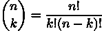
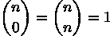

## 15

测试

测试对于创建可工作的软件至关重要。以下是描述测试重要性的经典陈述：

> “任何没有自动化测试的程序功能实际上是不存在的”。
> 
> (Kent Beck，《极限编程解释：拥抱变化》)

我们可以区分几种测试类型：

单元测试：

这适用于独立的软件单元：函数、类或模块。单元在隔离状态下进行测试，以确认其正确性。

集成测试

: 这将组合单位以确保它们正确集成。

系统测试

: 这测试整个应用程序或一系列相互关联的应用程序，以确保软件组件套件正常工作。这也被称为端到端测试或功能测试。这通常用于验收测试，以确认软件适合使用。

性能测试

: 这确保了单元、子系统或整个系统满足性能目标（也常称为负载测试）。在某些情况下，性能测试包括对资源（如内存、线程或文件描述符）的研究。目标是确保软件适当地使用系统资源。这有时被称为基准测试，当目标是衡量资源使用而不是确保使用低于某个阈值时。

这些是一些更常见的类型。在本章中，我们将重点关注单元测试，因为它是创建对软件可靠工作的信任的基础。其他测试形式建立在合理完整的单元测试的基础上。

有时根据 Gherkin 语言总结测试场景是有帮助的。在这种测试规范语言中，每个场景都由 GIVEN-WHEN-THEN 步骤描述。以下是一个示例：

```py
Scenario: Binomial coefficient typical case. 

Given n = 52 

And k = 5 

When The binomial coefficient is computed with c = binom(n, k) 

Then the result, c, is 2,598,960
```

这种编写测试的方法描述了给定的起始状态或安排，要执行的操作，以及关于操作后结果状态的一个或多个断言。这有时被称为“安排-执行-断言”模式。

在本章中，我们将探讨以下食谱：

+   使用 docstrings 进行测试

+   测试引发异常的函数

+   处理常见的 doctest 问题

+   使用 unittest 模块进行单元测试

+   结合 unittest 和 doctest 测试

+   使用 pytest 模块进行单元测试

+   结合 pytest 和 doctest 测试

+   测试涉及日期或时间的事物

+   测试涉及随机性的事物

+   模拟外部资源

我们将从在模块、类或函数的 docstring 中包含测试开始。这使得测试案例既充当设计意图的文档，也充当可验证的确认，确实按广告宣传的方式工作。

# 15.1 使用文档字符串进行测试

良好的 Python 代码在每个模块、类、函数和方法中都包含文档字符串。许多工具可以从文档字符串中创建有用、信息丰富的文档。请参考第三章（ch007_split_000.xhtml#x1-1610003）中关于如何创建文档字符串的示例菜谱 Writing clear documentation strings with RST markup。

文档字符串的一个重要元素是具体的示例。文档字符串中提供的示例可以成为由 Python 的 doctest 工具执行的单元测试用例。

在这个菜谱中，我们将探讨如何将示例转换为合适的自动化测试用例。

## 15.1.1 准备工作

我们将查看一个小的函数定义以及一个类定义。每个都将包含包含可以用于自动化测试的示例的文档字符串。

我们将使用一个函数来计算两个数字的二项式系数。它显示了从大小为 k 的组中取 n 件事物的组合数。例如，如何计算一副 52 张牌被分成 5 张牌的手牌的方法如下：



这可以通过一个类似这样的 Python 函数来实现：

```py
from math import factorial 

def binom_draft(n: int, k: int) -> int: 

    return factorial(n) // (factorial(k) * factorial(n - k))
```

通常，函数没有内部状态，这使得像这样的函数相对容易测试。这将是用于展示可用的单元测试工具的示例之一。

我们还将查看一个使用一组数字的平均值和中位数进行懒计算的类。对象通常具有由各种 self. 属性定义的内部状态。状态变化通常是困难的。这与第七章（ch011_split_000.xhtml#x1-3760007）中展示的类类似。Designing classes with lots of processing 和 Using properties for lazy attributes 菜谱中都有类似的类。

下面是 Summary 类的概述，省略了一些实现细节：

```py
from collections import Counter 

class Summary: 

   def __init__(self) -> None: 

       self.counts: Counter[int] = collections.Counter() 

   def __str__(self) -> str: 

       ... 

   def add(self, value: int) -> None: 

       self.counts[value] += 1 

   @property 

   def mean(self) -> float: 

       ... 

   @property 

   def median(self) -> float: 

        ...
```

add() 方法改变了 Summary 对象的内部状态。由于这个状态变化到 self.counts 属性，我们需要提供更复杂的示例来展示 Summary 类的实例是如何表现的。

## 15.1.2 如何做...

在这个菜谱中，我们将展示两种变体。第一种变体可以应用于 binom() 函数这样的函数，其中没有具有可变状态的对象。第二种更适合状态操作，如 Summary 类。我们将一起查看它们，因为它们非常相似，尽管它们适用于不同类型的应用。

### 为函数编写示例

这个菜谱首先创建函数的文档字符串，然后添加一个示例来说明函数的工作方式：

1.  在文档字符串中开始一个总结：

    ```py
    def binom(n: int, k: int) -> int: 

        """ 

        Computes the binomial coefficient. 

        This shows how many combinations exist of 

        *n* things taken in groups of size *k*.
    ```

1.  包含参数定义和返回值定义：

    ```py
     :param n: size of the universe 

        :param k: size of each subset 

        :returns: the number of combinations
    ```

1.  在 Python 的 >>> 提示符下模拟使用该函数的示例：

    ```py
     >>> binom(52, 5) 

        2598960
    ```

1.  使用适当的引号关闭文档字符串：

    ```py
     """
    ```

### 为状态对象编写示例

这个配方也是从编写文档字符串开始的。文档字符串将展示使用有状态对象来展示对象内部状态变化的几个步骤：

1.  编写一个类级别的文档字符串，并包含一个摘要。这有助于在 doctest 示例之前留下一些空白行：

    ```py
    class Summary: 

        """ 

        Computes summary statistics.
    ```

1.  使用类如何工作的具体示例扩展类级别的文档字符串。在这种情况下，我们将展示 add()方法如何设置对象的状态。我们还将展示如何查询对象的状态：

    ```py
     >>> s = Summary() 

        >>> s.add(8) 

        >>> s.add(9) 

        >>> s.add(9) 

        >>> round(s.mean, 2) 

        8.67 

        >>> s.median 

        9 

        >>> print(str(s)) 

        mean = 8.67 

        median = 9
    ```

1.  使用三引号结束这个类的文档字符串：

    ```py
     """
    ```

因为这个例子使用了浮点值，所以我们已经在文档字符串示例中对平均值的结果进行了四舍五入。浮点值可能在所有平台上不具有相同的文本表示，并且精确的相等性测试可能会意外失败。

### 运行测试

当我们运行 doctest 程序时，我们通常会得到一个静默的响应，因为测试通过了。

交互看起来像这样：

```py
(cookbook3) % python -m doctest recipe_01.py
```

当测试通过时，没有输出。我们可以添加一个-v 命令行选项来查看运行测试的枚举。这有助于确认模块中找到了所有测试。

当某件事不工作时会发生什么？我们将修改一个测试用例，使其有错误答案并强制失败。当我们运行 doctest 程序时——使用一个损坏的测试用例——我们会看到如下输出：

```py
(cookbook3) % python -m doctest recipe_01.py 

********************************************************************** 

File "/Users/slott/Documents/Writing/Python/Python Cookbook 3e/src/ch15/recipe_01.py", line 29, in recipe_01.Summary 

Failed example: 

    s.median 

Expected: 

    10 

Got: 

    9 

********************************************************************** 

1 items had failures: 

   1 of   7 in recipe_01.Summary 

***Test Failed*** 1 failures.
```

这显示了错误所在的位置。它显示了测试示例中的预期值，以及未能匹配预期答案的实际答案。通常——没有使用-v 选项——沉默意味着所有测试都成功通过。

## 15.1.3 它是如何工作的...

doctest 模块包括一个主程序以及几个函数，这些函数会扫描 Python 文件中的示例。扫描操作会寻找具有 Python REPL 特征模式的文本块：一个带有代码的>>>提示符，随后是显示代码响应的行，然后是一个空白行来结束示例输出。显然，这些必须格式化得与找到的 Python REPL 输出完全匹配。

doctest 解析器从提示行和响应文本块创建一个小测试用例对象。有三种常见情况：

+   没有预期的响应文本：我们在定义 Summary 类的 add()方法测试时看到了这种模式。

+   单行响应文本：这由 Summary 类的 binom()函数和 mean()方法所体现。

+   多行响应：响应由下一个>>>提示符或一个空白行界定。这由 Summary 类的 str()示例所体现。

除非使用特殊注释，否则输出文本必须精确匹配预期文本。一般来说，每个空格都很重要。

这种测试协议对软件设计施加了一些限制。函数和类必须设计成可以从`>>>`提示符工作。因为将非常复杂的对象作为文档字符串示例的一部分可能会变得尴尬，所以类设计必须足够简单，以便在交互式提示符中演示。这些限制通常有助于保持设计可理解。

与预期结果的最终比较的简单性可能会造成一些复杂性。在示例中，我们将平均值四舍五入到两位小数。这是因为浮点数的显示可能会因平台而异。

## 15.1.4 更多内容...

测试设计中一个重要的考虑因素是识别边缘情况。边缘情况通常关注计算设计的极限。

例如，二项式函数有两个边缘情况：



我们可以将这些添加到示例中，以确保我们的实现是可靠的。这将导致一个看起来像以下的文档字符串：

```py
 """ 

    Computes the binomial coefficient. 

    This shows how many combinations exist of 

    *n* things taken in groups of size *k*. 

    :param n: size of the universe 

    :param k: size of each subset 

    :returns: the number of combinations 

    >>> binom(52, 5) 

    2598960 

    >>> binom(52, 0) 

    1 

    >>> binom(52, 52) 

    1 

    """
```

为了在源代码文件中保持示例的一致性，我们已经将此函数的名称更改为`binom2`。这个技巧让我们可以在单个 Python 模块中保持两个示例。

在某些情况下，我们可能需要测试超出有效值范围的值。这些情况会引发异常，这意味着它们实际上不适合放入文档字符串中。示例可能会用应该永远不会发生的事情的细节来杂乱无章地解释说明。幸运的是，我们有一个地方可以放置额外的示例。

除了阅读文档字符串外，该工具还会在一个名为`__test__`的全局变量中查找测试用例。此变量必须引用一个映射。映射的键将是测试用例名称，映射的值必须是 doctest 示例。通常，每个值都需要是一个三引号字符串。

因为`__test__`变量中的示例不在文档字符串中，所以在使用内置的`help()`函数时它们不会显示。同样，当使用其他工具从源代码创建文档时，它们也不会显示。这可能是一个放置失败示例或复杂异常示例的地方。

我们可能添加如下内容：

```py
__test__ = { 

    "GIVEN_binom_WHEN_0_0_THEN_1": """ 

        >>> binom(0, 0) 

        1 

        """, 

    "GIVEN_binom_WHEN_52_52_THEN_1": """ 

        >>> binom(52, 52) 

        1 

        """, 

}
```

我们可以使用这来测试那些不需要像文档字符串示例那样可见的测试。

## 15.1.5 参见

+   在本章后面的测试引发异常的函数和处理常见的 doctest 问题的食谱中，我们将探讨两种额外的 doctest 技术。

+   关于无状态函数概念的更多背景信息，请参阅第三章和第九章。

# 15.2 测试引发异常的函数

Python 允许在包、模块、类、函数和方法中包含文档字符串。一个好的文档字符串应该包含一个如何使用该功能的示例。示例可能还需要包括常见的异常。然而，包含异常有一个复杂因素。

当引发异常时，Python 创建的跟踪消息并不完全可预测。消息可能包括无法预测的对象 ID 值或可能根据测试执行的上下文略有变化的模块行号。doctest 的一般匹配规则精确地比较预期和实际结果。在本食谱中，我们将探讨额外的技术来增加灵活性。

## 15.2.1 准备工作

我们将查看一个小的函数定义以及一个类定义。每个都将包含包含可以用于正式测试的示例的文档字符串。

我们将使用本章前面展示的使用文档字符串进行测试食谱中的函数，该函数计算两个数字的二项式系数。它显示了 n 个事物以 k 组取出的组合数。例如，它显示了 52 张牌的牌组如何被分成 5 张牌的手牌。

这个函数执行简单的计算并返回一个值；它没有内部状态，使得每个请求都是独立的。我们希望在`__test__`变量中包含一些额外的测试用例，以显示当给定预期范围之外的值时会发生什么。

## 15.2.2 如何做...

我们首先运行之前定义的 binom 函数。这个输出提供了一个方便的模板来显示预期的输出：

1.  在交互 Python 提示符下手动运行函数以收集实际的异常详情。复制并粘贴这些结果。

1.  在模块的末尾创建一个全局的`__test__`变量。一种方法是从所有以 test_ 开头的全局变量中构建映射：

    ```py
     recipe_02 

    2 items passed all tests: 

       2 tests in recipe_02.__test__.test_GIVEN_n_5_k_52_THEN_ValueError 

       3 tests in recipe_02.binom 

    5 tests in 3 items.
    ```

1.  将每个测试用例定义为全局变量，包含包含 doctest 示例的文本块。这可以包括关于场景的额外说明。这些变量必须在创建最终的`__test__`映射之前设置。

1.  将交互会话的输出粘贴进来。

    它将像这样开始：

    ```py
    test_GIVEN_n_5_k_52_THEN_ValueError_1 = """ 

        GIVEN n=5, k=52 WHEN binom(n, k) THEN exception 

        >>> binom(52, -5) 

        Traceback (most recent call last): 

          File "/Users/slott/miniconda3/envs/cookbook3/lib/python3.12/doctest.py", line 1357, in __run 

            exec(compile(example.source, filename, "single", 

          File "<doctest recipe_02.__test__.test_GIVEN_n_5_k_52_THEN_ValueError[0]>", line 1, in <module> 

            binom(52, -5) 

          File "/Users/slott/Documents/Writing/Python/Python Cookbook 3e/src/ch15/recipe_02.py", line 29, in binom 

            return factorial(n) // (factorial(k) * factorial(n - k)) 

                                    ^^^^^^^^^^^^ 

        ValueError: factorial() not defined for negative values 

    """
    ```

1.  将跟踪回溯详情替换为......保留初始行和最终异常。在要执行的行后添加一个 doctest 指令，通过放置`# doctest: +ELLIPSIS`来实现。它看起来像这样：

    ```py
    test_GIVEN_n_5_k_52_THEN_ValueError_2 = """ 

        GIVEN n=5, k=52 WHEN binom(n, k) THEN exception 

        >>> binom(5, 52) 

        Traceback (most recent call last): 

        ... 

        ValueError: factorial() not defined for negative values 

    """
    ```

我们现在可以使用这样的命令来测试整个模块的功能：

```py
(cookbook3) % python -m doctest recipe_02.py
```

因为每个测试都是一个单独的全局变量，我们可以轻松地添加测试场景。所有以 test_ 开头的名称都将成为 doctest 工具使用的最终`__test__`映射的一部分。

## 15.2.3 它是如何工作的...

由于省略跟踪信息非常常见，doctest 工具识别跟踪信息上下文中的省略号(...)。省略号也在其他上下文中作为修改测试行为的许多指令之一可用。这些指令包含在执行测试操作的代码行的特殊注释中。它们也可以作为命令行上的通用指令提供。

我们有两种处理包含异常的测试的额外方法：

+   我们可以在将引发异常的代码行上使用#doctest: +IGNORE_EXCEPTION_DETAIL 指令。这让我们可以提供一个完整的跟踪错误消息。跟踪信息的细节被忽略，并且只有最后的异常行与预期值匹配。这使得将实际错误复制并粘贴到文档中成为可能。

+   我们可以使用#doctest: +ELLIPSIS 指令，并用...替换跟踪消息的部分。此指令对于跟踪消息是多余的。

显式指令的使用可以帮助清楚地表明意图。

## 15.2.4 更多...

有两个其他指令通常很有用：

+   +NORMALIZE_WHITESPACE：使用此指令允许在预期值中对空白有一些灵活性。

+   +SKIP：跳过测试。

有几个更多的指令，但它们很少需要。

## 15.2.5 参见

+   在本章前面，请参阅使用文档字符串进行测试的配方。这个配方展示了 doctest 的基本知识。

+   在本章中，接下来请参阅处理常见的 doctest 问题的配方。这展示了需要 doctest 指令的其他特殊案例。

# 15.3 处理常见的 doctest 问题

包含示例的文档字符串是良好 Python 编程的一部分。doctest 工具通过将预期的文本输出与实际文本进行字面匹配的方式来使用，这可能会使得对于没有一致文本表示的 Python 对象进行测试变得复杂。

例如，对象的哈希值是随机的。这通常会导致集合集合中元素顺序不可预测。我们有几种选择来创建测试用例示例输出：

+   编写可以容忍随机化的示例。一种技术是将集合的元素排序到定义的顺序中。

+   指定 PYTHONHASHSEED 环境变量的特定值。

除了简单的键或集合中项的位置变化之外，还有其他一些考虑因素。以下是一些其他关注点：

+   id()和 repr()函数可能会暴露内部对象 ID。无法对这些值做出保证。

+   浮点值可能在平台之间有所不同。

+   当前日期、时间和本地时区在测试用例中无法有意义地使用。

+   使用默认种子生成的随机数难以预测。

+   OS 资源可能不存在，或者可能不在适当的状态。

重要的是要注意，doctest 示例需要与文本完全匹配。这意味着我们的测试用例必须避免由哈希随机化或浮点实现细节引起的不可预测的结果。

## 15.3.1 准备工作

我们将查看这个配方的三个不同版本。第一个将包括一个输出包括集合内容的函数。由于集合中元素的顺序可能变化，这不像我们希望的那样容易测试。以下是函数定义：

```py
from string import ascii_letters 

def unique_letters(text: str) -> set[str]: 

    letters = set(text.lower()) 

    non_letters = letters - set(ascii_letters) 

    return letters - non_letters
```

测试 unique_letters() 函数很困难，因为集合内元素的顺序是不可预测的。

第二个示例将是一个没有定义唯一 __repr__() 定义的类。__repr__() 方法的默认定义将暴露内部对象 ID。由于这些 ID 是可变的，因此测试结果也会变化。以下是类定义：

```py
class Point: 

    def __init__(self, lat: float, lon: float) -> None: 

        self.lat = lat 

        self.lon = lon 

    @property 

    def text(self) -> str: 

        ns_hemisphere = "S" if self.lat < 0 else "N" 

        ew_hemisphere = "W" if self.lon < 0 else "E" 

        lat_deg, lat_ms = divmod(abs(self.lat), 1.0) 

        lon_deg, lon_ms = divmod(abs(self.lon), 1.0) 

        return ( 

            f"{lat_deg:02.0f}{lat_ms*60:4.3f}{ns_hemisphere}" 

            f" {lon_deg:03.0f}{lon_ms*60:4.3f}{ew_hemisphere}" 

        )
```

对于第三个示例，我们将查看一个实值函数，这样我们就可以处理浮点值：

![ϕ (n) = 1[1 + erf√n-] 2 2 ](img/file82.png)

这个函数是标准 z 分数的累积概率密度函数。参见第九章中关于创建部分函数的 Creating a partial function 配方，了解更多关于标准化分数的概念。

这里是 Python 实现：

```py
from math import sqrt, pi, exp, erf 

def phi(n: float) -> float: 

    return (1 + erf(n / sqrt(2))) / 2 

def frequency(n: float) -> float: 

    return phi(n) - phi(-n)
```

phi() 和 frequency() 函数涉及一些相当复杂的数值处理。单元测试必须反映浮点精度问题。

## 15.3.2 如何操作...

我们将在三个小配方中查看集合排序和对象表示。我们首先查看集合排序，然后查看对象 ID，最后查看浮点值。

### 编写具有不可预测集合排序的 doctest 示例

1.  编写一个似乎能够捕捉本质的测试草案：

    ```py
    >>> phrase = "The quick brown fox..." 

    >>> unique_letters(phrase) 

    {’b’, ’c’, ’e’, ’f’, ’h’, ’i’, ’k’, ’n’, ’o’, ’q’, ’r’, ’t’, ’u’, ’w’, ’x’}
    ```

    当这些字符串的哈希值恰好落入这个特定顺序时，这个测试将有效。

1.  一种可能的解决方案是对结果进行排序以强制执行顺序。

    另一个替代方案是将输出与集合对象进行比较。这两个选择看起来像这样：

    ```py
    >>> phrase = "The quick brown fox..." 

    >>> sorted(unique_letters(phrase)) 

    [’b’, ’c’, ’e’, ’f’, ’h’, ’i’, ’k’, ’n’, ’o’, ’q’, ’r’, ’t’, ’u’, ’w’, ’x’] 

    >>> (unique_letters(phrase) == 

    ...    {’b’, ’c’, ’e’, ’f’, ’h’, ’i’, ’k’, ’n’, ’o’, ’q’, ’r’, ’t’, ’u’, ’w’, ’x’} 

    ... ) 

    True
    ```

第三个选择是将 PYTHONHASHSEED 环境变量设置为强制已知顺序。我们将在下面查看这个替代方案。

### 编写具有对象 ID 的 doctest 示例

理想情况下，我们的应用程序不会显示对象 ID。这些基本上是不可预测的。以下是我们可以做的事情：

1.  定义一个快乐的路径 doctest 场景，以显示类正确执行其基本方法。在这种情况下，我们将创建一个 Point 实例，并使用文本属性来查看点的表示：

    ```py
    >>> Point(36.8439, -76.2936).text 

    ’3650.634N 07617.616W’
    ```

1.  当我们定义一个显示对象表示字符串的测试时，该测试将包括包含不可预测对象 ID 的结果。doctest 可能看起来像以下这样：

    ```py
    >>> Point(36.8439, -76.2936) 

    <recipe_03.Point object at 0x107910610>
    ```

    我们需要通过使用 # doctest: +ELLIPSIS 指令来更改测试。这意味着更改测试中的 >>> Point(36.8439, -76.2936) 行，并在预期输出中显示的异常上使用省略号，使其看起来像这样：

    ```py
    >>> Point(36.8439, -76.2936) # doctest: +ELLIPSIS 

    <recipe_03.Point object at ...>
    ```

这类测试建议进行设计改进。通常最好定义 __repr__(). 另一个选择是避免使用 __repr__() 可能被使用的测试。

### 为浮点值编写 doctest 示例

在处理浮点值时，我们有两种选择。我们可以将值四舍五入到一定的小数位数。另一种选择是使用 math.isclose() 函数。我们将展示两者：

1.  导入必要的库，并定义如前所述的 phi() 和 frequency() 函数。

1.  对于每个示例，包括一个显式的 round() 使用：

    ```py
    >>> round(phi(0), 3) 

    0.5 

    >>> round(phi(-1), 3) 

    0.159 

    >>> round(phi(+1), 3) 

    0.841
    ```

1.  另一个选择是使用 math 模块中的 isclose() 函数：

    ```py
    >>> from math import isclose 

    >>> isclose(phi(0), 0.5) 

    True 

    >>> isclose(phi(1), 0.8413, rel_tol=.0001) 

    True 

    >>> isclose(phi(2), 0.9772, rel_tol=1e-4) 

    True
    ```

由于浮点值无法精确比较，最好显示已四舍五入到适当小数位数的值。对于示例的读者来说，有时使用 round() 更为方便，因为它可能比 isclose() 选项更容易可视化函数的工作方式。

## 15.3.3 它是如何工作的...

由于哈希随机化，集合使用的哈希键是不可预测的。这是一个重要的安全特性，用于抵御一种微妙的拒绝服务攻击。有关详细信息，请参阅 url：[`www.ocert.org/advisories/ocert-2011-003.html.`](https://packt.link/dHrHU)

自从 Python 3.7 开始，字典键的插入顺序得到了保证。这意味着构建字典的算法将提供一系列一致的键值序列。对于集合，并没有做出相同的顺序保证。有趣的是，由于整数哈希值的计算方式，整数集合往往具有一致的顺序。然而，其他类型对象的集合则不会显示一致的元素顺序。

当面对如集合顺序或由 __repr__() 方法揭示的内部对象标识等不可预测的结果时，我们遇到了一个可测试性问题。我们可以要么修改软件使其更具可测试性，要么修改测试以容忍一些不可预测性。

大多数浮点数实现都是相当一致的。然而，对于任何给定浮点数的最后几位，很少有正式的保证。与其相信所有位都恰好具有正确的值，不如通常将值四舍五入到与问题域中其他值一致的精度。

对不可预测性的容忍可能过度，允许测试容忍错误。对于数学函数的更深入测试，[hypothesis](https://hypothesis.readthedocs.io/en/latest/) 包提供了定义稳健测试案例域的方法。

## 15.3.4 更多...

我们可以通过设置 PYTHONHASHSEED 环境变量来运行测试。在 Linux（以及 macOS X）中，我们可以在单个命令行语句中完成此操作：

```py
(cookbook3) % PYTHONHASHSEED=42 python3 -m doctest recipe_03.py
```

这将在运行 doctest 时提供固定的、可重复的哈希随机化。我们还可以使用 PYTHONHASHSEED=0 来禁用哈希随机化。

tox 工具有一个 --hashseed=x 选项，允许在运行测试之前将一致的哈希种子设置为整数值。

## 15.3.5 参见

+   特别是 Testing things that involve dates or times 的配方，datetime 的 now() 方法需要一些注意。

+   测试涉及随机性的事物 的配方展示了如何测试涉及使用 random 模块的处理。

+   我们将在本章后面的 Mocking external resources 配方中查看如何处理外部资源。

# 15.4 使用 unittest 模块进行单元测试

unittest 模块允许我们超越 doctest 使用的示例。每个测试用例可以有一个额外的场景，作为 TestCase 类的子类构建。这些使用比 doctest 工具使用的文本匹配更复杂的检查结果。

unittest 模块还允许我们将测试打包在 docstrings 之外。这对于测试边缘情况可能很有帮助，这些边缘情况可能过于详细，无法作为有用的文档。通常，doctest 案例集中在幸福路径上——即最常见的使用案例，其中一切按预期工作。我们可以使用 unittest 模块更容易地定义偏离幸福路径的测试用例。

这个配方将展示我们如何使用 unittest 模块创建更复杂的测试。

## 15.4.1 准备工作

有时，根据 Gherkin 语言的思路总结测试是有帮助的。在这种测试规范语言中，每个场景都由给定-当-然后步骤来描述。对于这种情况，我们有一个类似这样的场景：

```py
Scenario: Summary object can add values and compute statistics. 

Given a Summary object 

And numbers in the range 0 to 1000 (inclusive) shuffled randomly 

When all numbers are added to the Summary object 

Then the mean is 500 

And the median is 500
```

TestCase 类并不严格遵循这个三部分给定-当-然后（或安排-行动-断言）结构。TestCase 类通常有两个部分：

+   setUp() 方法必须实现测试用例的给定步骤。

+   runTest() 方法必须处理然后步骤，使用多种断言方法来确认实际结果与预期结果相匹配。

当步骤可以在两种方法中任选其一。何时实现当步骤的选择通常与重用问题相关。例如，一个类或函数可能有多个方法来执行不同的操作或进行多个状态变化。在这种情况下，将每个当步骤与不同的然后步骤配对以确认正确操作是有意义的。runTest() 方法可以实现当和然后步骤。多个子类可以共享共同的 setUp() 方法。

作为另一个例子，一个类层次结构可能为相同的算法提供多种不同的实现。在这种情况下，正确行为的然后步骤确认在 runTest() 方法中。每种不同的实现都有一个独特的子类，具有为给定和当步骤的独特 setup() 方法。

对于需要执行一些清理剩余资源的测试，有一个可选的 tearDown() 方法。这超出了测试的基本场景规范。

我们将为一个设计用来计算一些基本描述性统计的类创建一些测试。unittest 测试用例让我们能够定义比我们选择作为 doctest 示例的任何内容都要大的样本数据。我们可以轻松地使用数千个数据点，而不是作为评估性能的一部分的两个或三个。

我们将要测试的大多数代码在本书前面的使用 docstrings 进行测试配方中已经展示过。

因为我们没有查看实现细节，我们可以将其视为不透明盒测试；实现细节对测试者来说是未知的。

我们希望确保当我们使用数千个样本时，该类能正确执行。我们还希望确保它运行得快；我们将将其作为整体性能测试的一部分，以及单元测试的一部分。

## 15.4.2 如何做...

我们需要创建一个单独的模块和该模块中的一个 TestCase 子类。像 pytest 这样的工具可以检测以 test_ 开头的测试模块，为我们这些额外的模块提供了一个命名约定。以下是如何创建与模块代码分离的测试的示例：

1.  创建一个与待测试模块相关的文件。如果模块名为 summary.py，那么一个合适的测试模块名称将是 test_summary.py。使用 test_ 前缀可以使像 pytest 这样的工具更容易找到测试。

1.  我们将使用 unittest 模块来创建测试类。我们还将使用 random 模块来打乱输入数据。我们还将导入待测试的模块：

    ```py
    import unittest 

    import random 

    from recipe_01 import Summary
    ```

1.  创建一个 TestCase 的子类。为这个类提供一个名称，以显示测试的意图。我们选择了一个包含三个步骤总结的名称：

    ```py
    class GIVEN_Summary_WHEN_1k_samples_THEN_mean_median(unittest.TestCase):
    ```

1.  在这个类中定义一个 setUp()方法来处理测试的 Given 步骤。我们创建了一个包含 1,001 个样本的集合，这些样本被随机排序：

    ```py
     def setUp(self) -> None: 

            self.summary = Summary() 

            self.data = list(range(1001)) 

            random.shuffle(self.data)
    ```

1.  定义一个 runTest()方法来处理测试的 When 步骤：

    ```py
     def runTest(self) -> None: 

            for sample in self.data: 

                self.summary.add(sample)
    ```

1.  在 runTest()方法中添加断言以实现测试的 Then 步骤：

    ```py
     self.assertEqual(500, self.summary.mean) 

            self.assertEqual(500, self.summary.median)
    ```

如果我们的测试模块名为 recipe_04.py，我们可以使用以下命令在 recipe_04 模块中查找 TestCase 类并运行它们：

```py
(cookbook3) % python -m unittest recipe_04.py
```

如果所有的断言都通过，那么测试套件将通过，整个测试运行将成功。

## 15.4.3 它是如何工作的...

TestCase 类用于定义一个测试用例。该类可以有一个 setUp()方法来创建单元和可能请求。该类必须至少有一个 runTest()方法来对单元提出请求并检查响应。

单个测试通常是不够的。如果我们创建了三个独立的测试类在 recipe_04.py 模块中，那么我们会看到如下输出：

```py
(cookbook3) % python -m unittest recipe_04.py 

... 

---------------------------------------------------------------------- 

Ran 3 tests in 0.003s 

OK
```

随着每个测试的通过，会显示一个.。这表明测试套件正在取得进展。总结显示了运行的测试数量和时间。如果有失败或异常，最后的计数将反映这些情况。

最后，有一行总结。在这种情况下，它由 OK 组成，表明所有测试都通过了。

如果我们包含一个失败的测试，当我们使用-v 选项来获取详细输出时，我们会看到以下输出：

```py
(cookbook3) % python -m unittest -v recipe_04.py 

runTest (recipe_04.GIVEN_Summary_WHEN_1k_samples_THEN_mean_median.runTest) ... ok 

test_mean (recipe_04.GIVEN_Summary_WHEN_1k_samples_THEN_mean_median_2.test_mean) ... FAIL 

test_median (recipe_04.GIVEN_Summary_WHEN_1k_samples_THEN_mean_median_2.test_median) ... ok 

test_mode (recipe_04.GIVEN_Summary_WHEN_1k_samples_THEN_mode.test_mode) ... ok 

====================================================================== 

FAIL: test_mean (recipe_04.GIVEN_Summary_WHEN_1k_samples_THEN_mean_median_2.test_mean) 

---------------------------------------------------------------------- 

Traceback (most recent call last): 

  File "/Users/slott/Documents/Writing/Python/Python Cookbook 3e/src/ch15/recipe_04.py", line 122, in test_mean 

    self.assertEqual(501, self.summary.mean) 

AssertionError: 501 != 500.0 

---------------------------------------------------------------------- 

Ran 4 tests in 0.004s 

FAILED (failures=1)
```

有一个最终的总结是 FAILED。这包括(failures=1)来显示有多少测试失败了。

## 15.4.4 更多内容...

在这些示例中，我们在 runTest()方法内部有两个 Then 步骤的断言。如果一个失败了，测试将作为一个失败停止，其他步骤将不会被执行。

这是在这个测试设计中的一个弱点。如果第一个断言失败，我们可能得不到我们可能想要的全部诊断信息。我们应该避免在 runTest()方法中有多个其他独立的断言序列。

当我们想要更多的诊断细节时，我们有两种一般的选择：

+   使用多个测试方法而不是单个 runTest()。我们可以创建多个以 test_ 开头命名的多个方法。默认的测试加载器实现将在没有整体 runTest()方法的情况下，在执行每个单独的 test_ 方法之前执行 setUp()方法。这通常是将多个相关测试组合在一起的最简单方法。

+   使用 TestCase 子类的多个子类，每个子类都有一个单独的 Then 步骤实现。当 setUp()被继承时，这将由每个子类共享。

按照第一个选择，测试类将看起来像这样：

```py
class GIVEN_Summary_WHEN_1k_samples_THEN_mean_median_2(unittest.TestCase): 

    def setUp(self) -> None: 

        self.summary = Summary() 

        self.data = list(range(1001)) 

        random.shuffle(self.data) 

        for sample in self.data: 

            self.summary.add(sample) 

    def test_mean(self) -> None: 

        self.assertEqual(500, self.summary.mean) 

    def test_median(self) -> None: 

        self.assertEqual(500, self.summary.median)
```

我们已经重构了 setUp()方法，包括测试的 Given 和 When 步骤。两个独立的 Then 步骤被重构为它们自己的单独的 test_mean()和 test_median()方法。这两个方法代替了 runTest()方法。

由于每个测试都是单独运行的，所以对于计算平均值或中值的问题，我们会看到单独的错误报告。

TestCase 类定义了众多断言，可以用作 Then 步骤的一部分。我们鼓励仔细研究 Python 标准库文档中的 unittest 部分，以查看所有可用的变体。

在所有但最小的项目中，将测试文件隔离到单独的目录中是一种常见的做法，通常称为 tests。当这样做时，我们可以依赖 unittest 框架中的发现应用程序。

unittest 加载器可以在给定的目录中搜索所有从 TestCase 类派生的类。这个类集合在更大的模块集合中成为完整的 TestSuite。

我们可以使用 unittest 包的 discover 命令来完成这个操作：

```py
(cookbook3) % (cd src; python -m unittest discover -s ch15) 

............... 

---------------------------------------------------------------------- 

Ran 15 tests in 0.008s 

OK
```

这将定位项目 tests 目录中所有测试模块中的所有测试用例。

## 15.4.5 参见

+   在本章的 Combining pytest and doctest tests 配方中，我们将结合 unittest 和 doctest。在本章后面的 Mocking external resources 配方中，我们将查看模拟外部对象。

+   本章后面的使用 pytest 模块进行单元测试示例从 pytest 工具的角度覆盖了相同的测试用例。

# 15.5 结合 unittest 和 doctest 测试

在某些情况下，我们可能希望将针对 unittest 和 doctest 工具编写的测试组合在一起。关于使用 doctest 工具的示例，请参阅本章前面的使用文档字符串进行测试示例。关于使用 unittest 工具的示例，请参阅本章前面的使用 unittest 模块进行单元测试示例。

doctest 示例是模块、类、方法和函数文档字符串的一个基本元素。unittest 用例通常位于一个单独的 tests 目录中，文件名符合 test_*.py 的模式。创建可信赖的软件的一个重要部分是运行尽可能广泛的测试。

在这个示例中，我们将探讨将各种测试组合成一个整洁包的方法。

## 15.5.1 准备工作

我们将回顾本章前面提到的使用文档字符串进行测试示例。这个示例为名为 Summary 的类创建了一些统计计算测试。在那个示例中，我们在文档字符串中包含了示例。

在本章前面的使用 unittest 模块进行单元测试示例中，我们编写了一些 TestCase 类，为这个类提供了额外的测试。

作为上下文，我们假设有一个项目文件夹结构，如下所示：

```py
project-name/ 

    src/ 

        summary.py 

    tests/ 

        test_summary.py 

    README 

    pyproject.toml 

    requirements.txt 

    tox.ini
```

这意味着测试既在 src/summary.py 模块中，也在 tests/test_summary.py 文件中。

我们需要将所有测试组合成一个单一、全面的测试套件。

示例中使用的模块名为 recipe_01.py，而不是像 summary.py 这样的更酷的名字。理想情况下，一个模块应该有一个易于记忆且意义明确的名称。本书内容相当庞大，名称是为了与整体章节和示例大纲相匹配。

## 15.5.2 如何做...

要结合 unittest 和 doctest 测试用例，我们将从一个现有的测试模块开始，并添加一个 load_tests()函数来合并相关的 doctest 与现有的 unittest 测试用例。必须提供一个名为 load_tests()的函数。这个名称是必需的，以便 unittest 加载器可以使用它：

1.  要使用 doctest 测试，导入 doctest 模块。要编写 TestCase 类，导入 unittest 模块。我们还需要导入 random 模块，以便我们可以控制使用的随机种子：

    ```py
    import unittest 

    import doctest 

    import random
    ```

1.  导入包含 doctest 示例的模块：

    ```py
    import recipe_01
    ```

1.  要实现 load_tests 协议，在测试模块中定义一个 load_tests()函数。我们将自动由 unittest 发现的常规测试与 doctest 模块找到的附加测试相结合：

    ```py
    def load_tests( 

        loader: unittest.TestLoader, standard_tests: unittest.TestSuite, pattern: str 

    ) -> unittest.TestSuite: 

        dt = doctest.DocTestSuite(recipe_01) 

        standard_tests.addTests(dt) 

        return standard_tests
    ```

load_tests() 函数的加载器参数值是当前正在使用的测试用例加载器；这通常被忽略。standard_tests 参数值将是默认加载的所有测试。通常，这是 TestCase 所有子类的套件。该函数使用额外的测试更新此对象。模式值是提供给加载器的值，用于定位测试；这也被忽略。

当我们从操作系统命令提示符运行它时，我们看到以下内容：

```py
(cookbook3) % python -m unittest -v recipe_05.py 

test_mean (recipe_05.GIVEN_Summary_WHEN_1k_samples_THEN_mean_median.test_mean) ... ok 

test_median (recipe_05.GIVEN_Summary_WHEN_1k_samples_THEN_mean_median.test_median) ... ok 

Summary (recipe_01) 

Doctest: recipe_01.Summary ... ok 

Twc (recipe_01) 

Doctest: recipe_01.Twc ... ok 

GIVEN_binom_WHEN_0_0_THEN_1 (recipe_01.__test__) 

Doctest: recipe_01.__test__.GIVEN_binom_WHEN_0_0_THEN_1 ... ok 

GIVEN_binom_WHEN_52_52_THEN_1 (recipe_01.__test__) 

Doctest: recipe_01.__test__.GIVEN_binom_WHEN_52_52_THEN_1 ... ok 

binom (recipe_01) 

Doctest: recipe_01.binom ... ok 

binom2 (recipe_01) 

Doctest: recipe_01.binom2 ... ok 

---------------------------------------------------------------------- 

Ran 8 tests in 0.006s 

OK
```

这表明 unittest 测试用例以及 doctest 测试用例都被包含在内。

## 15.5.3 的工作原理...

unittest.main() 应用程序使用一个测试加载器来查找所有相关的测试用例。加载器被设计用来查找所有扩展 TestCase 的类。它还会寻找一个 load_tests() 函数。这个函数可以提供一系列额外的测试。它也可以在需要时执行非默认的测试搜索。

通常，我们可以导入一个带有文档字符串的模块，并使用 DocTestSuite 从导入的模块构建测试套件。我们当然可以导入其他模块，甚至扫描 README 文件以获取更多测试示例。目标是确保代码和文档中的每个示例都实际可行。

## 15.5.4 更多...

在某些情况下，一个模块可能相当复杂；这可能导致多个测试模块。测试模块可能有如 tests/test_module_feature_X.py 这样的名称，以表明对一个非常复杂的模块的各个单独功能都有测试。测试用例的代码量可能相当大，保持功能分离可能是有帮助的。

在其他情况下，我们可能有一个测试模块，它为几个不同但紧密相关的较小模块提供测试。一个单独的测试模块可能使用继承技术来覆盖一个包中的所有模块。

当组合许多较小的模块时，load_tests() 函数中可能会构建多个套件。主体可能看起来像这样：

```py
import doctest 

import unittest 

import recipe_01 as ch15_r01 

import recipe_02 as ch15_r02 

import recipe_03 as ch15_r03 

import recipe_05 as ch15_r04 

def load_tests( 

    loader: unittest.TestLoader, standard_tests: unittest.TestSuite, pattern: str 

) -> unittest.TestSuite: 

    for module in (ch15_r01, ch15_r02, ch15_r03, ch15_r04): 

        dt = doctest.DocTestSuite(module) 

        standard_tests.addTests(dt) 

    return standard_tests
```

这将把多个模块中的 doctest 示例合并到一个单一的、全面的测试套件中。

## 15.5.5 参见

+   关于 doctest 的示例，请参阅本章前面的 使用文档字符串进行测试 配方。关于 unittest 的示例，请参阅本章前面的 使用 unittest 模块进行单元测试 配方。

# 15.6 使用 pytest 模块进行单元测试

pytest 工具允许我们超越 doctest 在文档字符串中使用的示例。而不是使用 TestCase 的子类，pytest 工具让我们使用函数定义。pytest 方法使用 Python 内置的 assert 语句，使测试用例看起来相对简单。

pytest 工具不是 Python 的一部分；它需要单独安装。使用如下命令：

```py
(cookbook3) % python -m pip install pytest
```

在这个配方中，我们将探讨如何使用 pytest 简化我们的测试用例。

## 15.6.1 准备工作

Gherkin 语言可以帮助结构化测试。对于这个配方，我们有一个这样的场景：

```py
Scenario: Summary object can add values and compute statistics. 

Given a Summary object 

And numbers in the range 0 to 1000 (inclusive) shuffled randomly 

When all numbers are added to the Summary object 

Then the mean is 500 

And the median is 500
```

pytest 测试函数并不严格遵循 Gherkin 的三部分结构。测试函数通常有两个部分：

+   如果需要，定义固定对象以建立 Given 步骤。固定对象旨在用于重用和组合。固定对象还可以在测试完成后拆除资源。

+   函数的主体通常处理 When 步骤以测试被测试的对象，以及 Then 步骤以确认结果。

这些边界不是固定的。例如，一个固定对象可能创建一个对象并采取行动，执行 Given 和 When 步骤。这允许多个测试函数应用多个独立的 Then 步骤。

我们将为一个设计用来计算一些基本描述性统计的类创建一些测试。代码的主体已在使用 docstrings 进行测试的菜谱中展示。

这是一个类的概要，提供作为方法名称的提醒：

```py
class Summary: 

    def __init__(self) -> None: ... 

    def __str__(self) -> str: ... 

    def add(self, value: int) -> None: ... 

    @property 

    def mean(self) -> float: ... 

    @property 

    def median(self) -> float: ... 

    @property 

    def count(self) -> int: ... 

    @property 

    def mode(self) -> list[tuple[int, int]]: ...
```

我们希望复制使用 unittest 模块进行单元测试菜谱中展示的测试。我们将使用 pytest 功能来完成这个任务。

## 15.6.2 如何做到...

通常最好从一个单独的测试文件开始，甚至是一个单独的测试目录：

1.  创建一个与被测试模块名称相似的测试文件。如果模块文件名为 summary.py，那么一个合适的测试模块名称将是 test_summary.py。使用 test_ 前缀可以使测试更容易找到。

1.  我们将使用 pytest 模块来创建测试类。我们还将使用 random 模块来打乱输入数据。此外，我们需要导入被测试的模块：

    ```py
    import random 

    import pytest 

    from recipe_01 import Summary 
    ```

1.  将 Given 步骤实现为一个固定对象。这通过 @pytest.fixture 装饰器标记。它创建了一个可以返回有用对象、创建对象的必要数据或模拟对象的函数：

    ```py
    @pytest.fixture() 

    def flat_data() -> list[int]: 

        data = list(range(1001)) 

        random.shuffle(data) 

        return data
    ```

1.  将 When 和 Then 步骤实现为一个对 pytest 可见的测试函数。这意味着函数名称必须以 test_ 开头：

    ```py
    def test_flat(flat_data: list[int]) -> None:
    ```

    当测试函数定义中的参数名称是固定函数的名称时，固定函数会自动评估。固定函数的结果在运行时提供。这意味着打乱的 1,000 个值的集合将作为 flat_data 参数的参数值提供。

1.  实现一个 When 步骤以对一个对象执行操作：

    ```py
     summary = Summary() 

        for sample in flat_data: 

            summary.add(sample)
    ```

1.  实现 Then 步骤以验证结果：

    ```py
     assert summary.mean == 500 

        assert summary.median == 500
    ```

如果我们的测试模块名为 test_summary.py，我们通常可以使用如下命令来执行其中的测试：

```py
(cookbook3) % python -m pytest test_summary.py
```

这将调用 pytest 包的一部分主应用程序。它将在给定的文件中搜索以 test_ 开头的函数并执行这些测试函数。

## 15.6.3 它是如何工作的...

我们正在使用 pytest 包的几个部分：

+   @fixture 装饰器可以用来创建具有已知状态的、可重用的测试固定对象，以便进行进一步处理。

+   pytest 应用程序可以执行多项任务：

    +   发现测试。默认情况下，它搜索名为 tests 的目录，查找以 test_ 开头的模块名称。在这些模块中，它查找以 test_ 开头的函数。它还找到 unittest.TestCase 类。

    +   运行所有测试，根据需要评估夹具。

    +   显示结果的摘要。

当我们运行 pytest 命令时，我们将看到类似以下的输出：

```py
(cookbook3) % python -m pytest recipe_06.py 

=========================== test session starts ============================ 

platform darwin -- Python 3.12.0, pytest-7.4.3, pluggy-1.3.0 

rootdir: /Users/slott/Documents/Writing/Python/Python Cookbook 3e 

configfile: pytest.ini 

plugins: anyio-4.0.0 

collected 3 items 

recipe_06.py ...                                                     [100%] 

============================ 3 passed in 0.02s =============================
```

随着每个测试的通过，将显示一个 .。这表明测试套件正在取得进展。摘要显示了运行的测试数量和时间。如果有失败或异常，最后一行的计数将反映这一点。

如果我们稍微改变一个测试以确保它失败，我们将看到以下输出：

```py
(cookbook3) % python -m pytest recipe_06.py 

=========================== test session starts ============================ 

platform darwin -- Python 3.12.0, pytest-7.4.3, pluggy-1.3.0 

rootdir: /Users/slott/Documents/Writing/Python/Python Cookbook 3e 

configfile: pytest.ini 

plugins: anyio-4.0.0 

collected 3 items 

recipe_06.py F..                                                     [100%] 

================================= FAILURES ================================= 

________________________________ test_flat _________________________________ 

flat_data = [883, 104, 898, 113, 519, 94, ...] 

    def test_flat(flat_data: list[int]) -> None: 

        summary = Summary() 

        for sample in flat_data: 

            summary.add(sample) 

>       assert summary.mean == 501 

E       assert 500.0 == 501 

E        +  where 500.0 = <recipe_01.Summary object at 0x10fdcb350>.mean 

recipe_06.py:57: AssertionError 

========================= short test summary info ========================== 

FAILED recipe_06.py::test_flat - assert 500.0 == 501 

======================= 1 failed, 2 passed in 0.17s ========================
```

这显示了通过和失败的测试的摘要以及每个失败的详细信息。

## 15.6.4 更多...

在这个例子中，我们在 test_flat() 函数内部有两个 Then 步骤。这些步骤被实现为两个 assert 语句。如果第一个失败，测试将作为失败停止，并且后续步骤将被跳过。这意味着我们可能看不到我们可能需要的所有诊断信息。

更好的设计是使用多个测试函数。所有这些函数都可以共享一个共同的夹具。在这种情况下，我们可以创建一个依赖于 flat_data 夹具的第二个夹具，并构建一个 Summary 对象，供多个测试使用：

```py
@pytest.fixture() 

def summary_object(flat_data: list[int]) -> Summary: 

    summary = Summary() 

    for sample in flat_data: 

        summary.add(sample) 

    return summary 

def test_mean(summary_object: Summary) -> None: 

    assert summary_object.mean == 500 

def test_median(summary_object: Summary) -> None: 

    assert summary_object.median == 500
```

由于每个测试函数都是单独运行的，因此当计算平均值和中位数时，我们将看到单独的错误报告，或者可能在同时计算两者时。

## 15.6.5 参见

+   本章中的 使用 unittest 模块进行单元测试 菜单从 unittest 模块的角度覆盖了相同的测试案例。

# 15.7 结合 pytest 和 doctest 测试

在大多数情况下，我们将有 pytest 和 doctest 测试案例的组合。有关使用 doctest 工具的示例，请参阅 使用 docstrings 进行测试 菜谱。有关使用 pytest 工具的示例，请参阅 使用 pytest 模块进行单元测试 菜谱。

经常，文档将包含 doctest。我们需要确保所有示例（在 docstrings 和文档中）都能正确工作。在这个菜谱中，我们将把这些 doctest 示例和 pytest 测试案例组合成一个整洁的包。

## 15.7.1 准备工作

我们将参考 使用 docstrings 进行测试 菜谱中的示例。这个菜谱为 Summary 类创建了一些测试，该类执行一些统计计算。在那个菜谱中，我们在 docstrings 中包含了示例。

在 使用 pytest 模块进行单元测试 菜谱中，我们编写了一些测试函数来为这个类提供额外的测试。这些测试被放入了一个单独的模块中，模块名称以 test_ 开头，具体为 test_summary.py。

按照结合 unittest 和 doctest 测试的配方，我们还将假设有一个项目文件夹结构，如下所示：

```py
project-name/ 

    src/ 

        summary.py 

    tests/ 

        test_summary.py 

    README 

    pyproject.toml 

    requirements.txt 

    tox.ini
```

测试目录应包含所有包含测试的模块文件。我们选择了名为 tests 的目录和一个名为 test_*.py 的模块，这样它们就可以很好地与 pytest 工具的自动化测试发现功能相匹配。

配方示例使用 recipe_07 而不是像 summary 这样的更酷的名字。作为一般实践，一个模块应该有一个易于记忆、有意义的名字。本书的内容相当庞大，名字是为了与整体章节和配方大纲相匹配。

## 15.7.2 如何做...

结果表明，我们不需要编写任何 Python 代码来组合测试。pytest 模块将定位测试函数。它也可以用来定位 doctest 用例：

1.  创建一个 shell 命令来运行 recipe_07.py 文件中的测试套件，以及检查 recipe_01.py 模块中的额外 doctest 用例：

    ```py
    % pytest recipe_07.py --doctest-modules recipe_01.py
    ```

当我们从操作系统命令提示符运行这个程序时，我们会看到以下内容：

```py
(cookbook3) % pytest recipe_07.py --doctest-modules recipe_01.py 

=========================== test session starts ============================ 

platform darwin -- Python 3.12.0, pytest-7.4.3, pluggy-1.3.0 

rootdir: /Users/slott/Documents/Writing/Python/Python Cookbook 3e 

configfile: pytest.ini 

plugins: anyio-4.0.0 

collected 7 items 

recipe_07.py ..                                                      [ 28%] 

recipe_01.py .....                                                   [100%] 

============================ 7 passed in 0.06s =============================
```

pytest 命令与这两个文件都兼容。recipe_07.py 后面的点表示在这个文件中找到了两个测试用例，这是测试套件的 28%。recipe_01.py 后面的点表示找到了更多的五个测试用例；这是套件剩余的 72%。

这表明 pytest 测试用例以及 doctest 测试用例都被包含在内。有帮助的是，我们不需要在任一测试套件中调整任何内容来执行所有可用的测试用例。

## 15.7.3 它是如何工作的...

pytest 应用程序有多种方式来搜索测试用例。默认情况下，它会在给定模块中搜索所有以 test_ 开头的函数名称的给定路径。它也会搜索所有 TestCase 的子类。如果我们提供一个目录，它将搜索以 test_ 开头的所有模块。通常，我们会将测试文件收集在名为 tests 的目录中，因为这是默认将被搜索的目录。

--doctest-modules 命令行选项用于标记包含 doctest 示例的模块。这些示例也被添加到测试套件中作为测试用例。

在寻找和执行各种类型测试的复杂程度方面，pytest 是一个非常强大的工具。它使得创建各种形式的测试变得容易，从而增加了我们软件按预期工作的信心。

## 15.7.4 更多...

添加-v 选项提供了 pytest 工具找到的测试的更详细视图。以下是显示额外细节的方式：

```py
(cookbook3) % python -m pytest -v recipe_07.py --doctest-modules recipe_01.py 

=========================== test session starts ============================ 

platform darwin -- Python 3.12.0, pytest-7.4.3, pluggy-1.3.0 -- /Users/slott/miniconda3/envs/cookbook3/bin/python 

cachedir: .pytest_cache 

rootdir: /Users/slott/Documents/Writing/Python/Python Cookbook 3e 

configfile: pytest.ini 

plugins: anyio-4.0.0 

collected 7 items 

recipe_07.py::recipe_07.__test__.test_example_class PASSED           [ 14%] 

recipe_07.py::test_flat PASSED                                       [ 28%] 

recipe_01.py::recipe_01.Summary PASSED                               [ 42%] 

recipe_01.py::recipe_01.__test__.GIVEN_binom_WHEN_0_0_THEN_1 PASSED  [ 57%] 

recipe_01.py::recipe_01.__test__.GIVEN_binom_WHEN_52_52_THEN_1 PASSED [ 71%] 

recipe_01.py::recipe_01.binom PASSED                                 [ 85%] 

recipe_01.py::recipe_01.binom2 PASSED                                [100%] 

============================ 7 passed in 0.05s =============================
```

每个单独的测试都会被标识，为我们提供了测试处理的详细解释。这有助于确认所有预期的 doctest 示例都已正确地定位在测试的模块中。

## 15.7.5 参见

+   关于 doctest 的示例，请参阅本章前面的使用 docstrings 进行测试配方。

+   本章前面的使用 pytest 模块进行单元测试菜谱有用于此菜谱的 pytest 测试用例。

+   关于这些测试的 unittest 版本示例，请参阅本章前面的使用 unittest 模块进行单元测试菜谱。

# 15.8 测试涉及日期或时间的事物

许多应用程序依赖于像 datetime.datetime.now()或 time.time()这样的函数来创建时间戳。当我们使用这些函数之一进行单元测试时，结果基本上是不可预测的。这是一个有趣的依赖注入问题：我们的应用程序依赖于一个我们希望在测试时才替换的类。

一个选择是设计我们的应用程序以避免使用像 now()这样的函数。我们不是直接使用这种方法，而是可以创建一个工厂函数来输出时间戳。为了测试目的，这个函数可以被替换为产生已知结果的函数。

另一种方法是猴子补丁 - 在测试时注入一个新的对象。这可以减少设计复杂性；它往往会增加测试复杂性。

在这个菜谱中，我们将使用 datetime 对象编写测试。我们需要为 datetime 实例创建模拟对象以创建可重复的测试值。我们将使用 pytest 包的特性进行猴子补丁。

## 15.8.1 准备工作

我们将使用一个创建 CSV 文件的小函数进行工作。这个文件的名称将包括日期和时间，格式为 YYYYMMDDHHMMSS，作为一长串数字。这种文件命名约定可能被长期运行的服务器应用程序使用。这个名称有助于匹配文件和相关日志事件。它有助于追踪服务器正在执行的工作。

应用程序使用此函数创建这些文件：

```py
import datetime 

import json 

from pathlib import Path 

from typing import Any 

def save_data(base: Path, some_payload: Any) -> None: 

    now_date = datetime.datetime.now(tz=datetime.timezone.utc) 

    now_text = now_date.strftime("extract_%Y%m%d%H%M%S") 

    file_path = (base / now_text).with_suffix(".json") 

    with file_path.open("w") as target_file: 

        json.dump(some_payload, target_file, indent=2) 
```

这个函数使用了 now()函数，每次运行都会产生一个不同的值。由于这个值难以预测，因此编写测试断言变得困难。

为了创建可重复的测试输出，我们可以创建 datetime 模块的模拟版本。然后我们可以猴子补丁测试上下文以使用这个模拟对象而不是实际的 datetime 模块。在模拟的模块中，我们可以创建一个带有模拟 now()方法的模拟类，以提供固定且易于测试的响应。

对于这种情况，我们有一个类似的场景：

```py
Scenario: save_date function writes JSON data to a date-stamped file. 

Given a base directory Path 

And a payload object {"primes": [2, 3, 5, 7, 11, 13, 17, 19]} 

And a known date and time of 2017-9-10 11:12:13 UTC 

When save_data(base, payload) function is executed 

Then the output file of "extract_20170910111213.json" is found in the base directory 

And the output file has a properly serialized version of the payload 

And the datetime.datetime.now() function was called once to get the date and time
```

这可以通过使用 pytest 构造函数实现为一个测试用例。

## 15.8.2 如何做...

这个菜谱将创建和修补模拟对象以创建测试固件：

1.  我们需要导入我们正在测试的模块所需的多个模块：

    ```py
    import datetime 

    import json 

    from pathlib import Path
    ```

1.  我们还需要创建模拟对象和测试固件的核心工具。此外，我们还需要我们打算测试的模块：

    ```py
    from unittest.mock import Mock 

    import pytest 

    import recipe_08
    ```

1.  我们必须创建一个对象，使其在测试场景中表现得像 datetime 模块。这个模拟模块必须包含一个看起来像类的名称，也命名为 datetime。这个类必须看起来包含一个方法，now()，它返回一个已知的对象，而不是每次测试运行时都变化的日期。我们将创建一个 fixture，并且该 fixture 将返回这个模拟对象，并定义一组小的属性和行为：

    ```py
    @pytest.fixture() 

    def mock_datetime() -> Mock: 

        return Mock( 

            name="mock datetime", 

            datetime=Mock( 

                name="mock datetime.datetime", 

                now=Mock(return_value=datetime.datetime(2017, 9, 10, 11, 12, 13)), 

            ), 

            timezone=Mock(name="mock datetime.timezone", utc=Mock(name="UTC")), 

        )
    ```

    Mock 对象是一个命名空间，这是包、模块和类都共享的特性。在这个例子中，每个属性名都是另一个 Mock 对象。最深层嵌套的对象有一个 return_value 属性，使其表现得像一个函数。

1.  我们还需要一种方法来隔离文件系统的行为到测试目录中。tmppath fixture 内置于 pytest 中，并提供临时目录，可以在其中安全地写入测试文件。

1.  我们现在可以定义一个测试函数，该函数将使用 mock_datetime fixture 和 tmppath fixture。它将使用 monkeypatch fixture 来调整被测试模块的上下文：

    ```py
    def test_save_data( 

        mock_datetime: Mock, tmp_path: Path, monkeypatch: pytest.MonkeyPatch 

    ) -> None:
    ```

1.  我们可以使用 monkeypatch fixture 来替换 recipe_08 模块的一个属性。datetime 属性值将被 mock_datetime fixture 创建的 Mock 对象所替换：

    ```py
     monkeypatch.setattr(recipe_08, "datetime", mock_datetime)
    ```

    在 fixture 定义和这个补丁之间，我们创建了一个 Given 步骤，用于定义测试安排。

1.  我们现在可以在一个受控的测试环境中执行 save_data() 函数。这是 When 步骤，用于执行被测试的代码：

    ```py
     data = {"primes": [2, 3, 5, 7, 11, 13, 17, 19]} 

        recipe_08.save_data(tmp_path, data)
    ```

1.  由于日期和时间由 Mock 对象固定，输出文件有一个已知、可预测的名称。我们可以读取和验证文件中的预期数据。此外，我们可以查询 Mock 对象以确保它恰好被调用一次，并且没有参数值。这是一个 Then 步骤，用于确认预期结果：

    ```py
     expected_path = tmp_path / "extract_20170910111213.json" 

        with expected_path.open() as result_file: 

            result_data = json.load(result_file) 

        assert data == result_data 

        mock_datetime.datetime.now.assert_called_once_with(tz=mock_datetime. 

                                                           timezone.utc) 
    ```

这个测试确认应用程序的 save_data() 函数将创建预期的文件，并包含正确的内容。

## 15.8.3 它是如何工作的...

unittest.mock 模块有一个非常复杂的类定义，即 Mock 类。Mock 对象可以表现得像其他 Python 对象，同时提供有限的行为子集。在这个例子中，我们创建了三种不同类型的 Mock 对象。

The Mock(wraps="datetime", ...) 对象模拟了一个完整的模块。它在测试场景所需的范围内将表现得像标准库的 datetime 模块。在这个对象内部，我们创建了一个模拟类定义，但没有将其分配给任何变量。

Mock(now=...) 对象在 mock 模块内部表现得像一个模拟类定义。我们创建了一个单一的 now 属性值，它将表现得像一个静态函数。

Mock(return_value=...) 对象表现得像一个普通函数或方法。我们提供这个测试所需的返回值。

除了返回给定值外，Mock 对象还记录了调用历史。这意味着断言可以检查这些调用。Mock 模块中的 call()函数提供了一种描述函数调用中预期参数的方法。

## 15.8.4 更多内容...

在这个示例中，我们创建了一个针对 datetime 模块的模拟，该模块具有非常窄的功能集以供此测试使用。该模块包含一个名为 datetime 的模拟类。这个类有一个单一属性，一个模拟函数，now()。

我们可以使用副作用属性而不是 return_value 属性来引发异常而不是返回值。我们可以使用这种方法来发现未正确使用 now()方法，而是使用已弃用的 utcnow()或 today()方法的代码。

我们可以扩展这个模式并模拟多个属性以表现得像函数。以下是一个模拟几个函数的示例：

```py
@pytest.fixture() 

def mock_datetime_now() -> Mock: 

    return Mock( 

        name="mock datetime", 

        datetime=Mock( 

            name="mock datetime.datetime", 

            utcnow=Mock(side_effect=AssertionError("Convert to now()")), 

            today=Mock(side_effect=AssertionError("Convert to now()")), 

            now=Mock(return_value=datetime.datetime(2017, 7, 4, 4, 2, 3)), 

        ),
```

两个模拟方法，utcnow()和 today()，每个都定义了一个会引发异常的副作用。这允许我们确认旧代码已被转换为正确使用 now()方法。

## 15.8.5 参见

+   本章前面关于使用 unittest 模块进行单元测试的示例提供了有关 unittest 模块基本使用的信息。

# 15.9 测试涉及随机性的内容

许多应用程序依赖于随机模块来生成随机值或将值放入随机顺序。在许多统计测试中，重复的随机洗牌或随机选择是进行的。当我们想要测试这些算法之一时，任何中间结果或处理细节基本上是无法预测的。

我们有两个选择来尝试使随机模块足够可预测，以便编写详细的单元测试：

+   使用具有已知种子值的随机模块。

+   使用 Mock 对象用 Mock 对象替换随机模块以产生可预测的值。

在这个示例中，我们将探讨如何对涉及随机性的算法进行单元测试。

## 15.9.1 准备工作

给定一个样本数据集，我们可以计算一个统计量，例如平均值或中位数。下一步常见的操作是确定这些统计量对于某个总体人群的可能值。这可以通过一种称为自助法的技术来完成。

理念是重复对初始数据集进行重采样。每个重采样都提供了对总体统计量的不同估计。

为了确保重采样算法被正确实现，有助于消除处理中的随机性。我们可以使用非随机版本的 random.choice()函数对精心策划的数据集进行重采样。如果这能正常工作，那么我们有信心随机版本也会正常工作。

这里是我们的候选重采样函数：

```py
from collections.abc import Iterator 

import random 

def resample(population: list[int], N: int) -> Iterator[int]: 

    for i in range(N): 

        sample = random.choice(population) 

        yield sample
```

对于我们的示例，我们将根据重采样计算平均值的替代值。整体重采样过程看起来像这样：

```py
from collections import Counter 

import statistics 

def mean_distribution(population: list[int], N: int) -> Counter[float]: 

    means: Counter[float] = Counter() 

    for _ in range(1000): 

        subset = list(resample(population, N)) 

        measure = round(statistics.mean(subset), 1) 

        means[measure] += 1 

    return means 
```

这评估 resample()函数以创建多个子集。每个子集的平均值填充了平均值集合。由 mean_distribution()函数创建的直方图将为人口方差提供一个有用的估计。

这就是输出看起来像什么：

```py
>>> random.seed(42) 

>>> population = [8.04, 6.95, 7.58, 8.81, 8.33, 9.96, 7.24, 4.26, 10.84, 4.82, 5.68] 

>>> mean_distribution(population, 4).most_common(5) 

[(7.8, 51), (7.2, 45), (7.5, 44), (7.1, 41), (7.7, 40)]
```

这表明，总体平均值的可能值可能在 7.1 到 7.8 之间。这种分析的内容远不止我们在这里展示的。我们的关注点仅限于测试 resample()函数的狭隘问题。

重采样的测试涉及以下场景：

```py
Scenario: Resample example 

Given a random number generator where choice() always return the sequence [23, 29, 31, 37, 41, 43, 47, 53] 

When we evaluate the expression resample(any 8 values, 8) 

Then the expected results are [23, 29, 31, 37, 41, 43, 47, 53] 

And the choice() function was called 8 times
```

## 15.9.2 如何做到...

我们将定义一个可以替代 random.choice()函数的模拟对象。有了这个夹具，结果就是固定和可预测的：

1.  我们需要创建模拟对象和测试夹具的核心工具。我们还需要我们打算测试的模块：

    ```py
    from unittest.mock import Mock 

    import pytest 

    import recipe_09
    ```

1.  我们需要一个类似于 choice()函数的对象。我们将创建一个基于另一个夹具的夹具：

    ```py
    @pytest.fixture() 

    def expected_resample_data() -> list[int]: 

        return [23, 29, 31, 37, 41, 43, 47, 53] 

    @pytest.fixture() 

    def mock_random_choice(expected_resample_data: list[int]) -> Mock: 

        mock_choice = Mock(name="mock random.choice", side_effect=expected_resample_data) 

        return mock_choice
    ```

    expected_resample_data 测试夹具提供了一组特定的值，这些值将提供预期的结果。使用此夹具，mock_random_choice 选择夹具在 choice()函数的响应中返回预期值。

1.  我们现在可以定义一个测试函数，该函数将使用 mock_random_choice 测试夹具，它创建一个模拟对象，以及 monkeypatch 测试夹具，它允许我们调整被测试模块的上下文：

    ```py
    def test_resample( 

        mock_random_choice: Mock, 

        expected_resample_data: list[int], 

        monkeypatch: pytest.MonkeyPatch, 

    ) -> None:
    ```

1.  我们可以使用 monkeypatch 夹具用 mock_random_choice 夹具创建的 Mock 对象替换 random 模块的 choice 属性：

    ```py
     monkeypatch.setattr(recipe_09.random, "choice", mock_random_choice)  # type: ignore [attr-defined]
    ```

    在夹具定义和这个补丁之间，我们创建了一个 Given 步骤，该步骤定义了测试安排。

1.  我们现在可以在一个受控的测试环境中练习 resample()函数。这是当步骤，用于测试被测试的代码：

    ```py
     data = [2, 3, 5, 7, 11, 13, 17, 19] 

        resample_data = list(recipe_09.resample(data, 8))
    ```

1.  由于随机选择被 Mock 对象固定，结果是固定的。我们可以确认由 mock_random_choice 夹具创建的数据被用于重采样。我们还可以确认模拟的选择函数是否正确地用输入数据调用了：

    ```py
     assert resample_data == expected_resample_data 

        assert mock_random_choice.mock_calls == 8 * [call(data)]
    ```

这个测试有助于确认我们的 resample()函数将根据给定的输入和 random.choice()函数创建输出。

## 15.9.3 它是如何工作的...

当我们创建一个 Mock 对象时，我们必须提供方法和属性来定义被模拟对象的行为。当我们创建一个提供 side_effect 参数值的 Mock 实例时，我们正在创建一个可调用对象。每次调用 Mock 对象时，可调用对象将返回 side_effect 序列中的下一个值。这为我们提供了一个方便的方式来模拟迭代器。

如果 side_effect 中的任何值是异常，则会引发异常。

我们还可以通过 Mock 对象的 mock_calls 属性查看调用历史。这使我们能够确认可调用对象提供了适当的参数值。

## 15.9.4 更多...

resample()函数有一个有趣的模式。当我们从细节中退一步时，我们看到的是这个：

```py
def resample_pattern(X: Any, Y: Any) -> Iterator[Any]: 

    for _ in range(Y): 

        yield another_function(X)
```

X 参数值简单地传递给另一个函数，没有任何处理。对于测试目的，X 的值无关紧要。我们正在测试的是 resample()函数中的参数值是否被提供给另一个 _function()函数，且未被改变。

模拟库提供了一个名为 sentinel 的对象，可以在这种情况下创建一个不透明的参数值。当我们引用哨兵对象的属性时，这个引用创建了一个不同的对象。我们可能会使用 sentinel.POPULATION 作为一组值的模拟。确切的集合无关紧要，因为它只是作为另一个函数（在实际情况中称为 random.choice()）的参数传递。

下面是如何使用哨兵对象来改变这个测试的示例：

```py
from unittest.mock import Mock, call, sentinel 

@pytest.fixture() 

def mock_choice_s() -> Mock: 

    mock_choice = Mock(name="mock random.choice()", return_value=sentinel.CHOICE) 

    return mock_choice 

def test_resample_2( 

        mock_choice_s: Mock, monkeypatch: pytest.MonkeyPatch 

) -> None: 

    monkeypatch.setattr( 

        recipe_09.random, "choice", mock_choice_s # type: ignore [attr-defined] 

    ) 

    resample_data = list(recipe_09.resample(sentinel.POPULATION, 8)) 

    assert resample_data == [sentinel.CHOICE] * 8
```

模拟的 choice()函数的输出是一个可识别的哨兵对象。同样，resample()函数的参数是另一个哨兵对象。我们预计这将被调用 8 次，因为测试用例中 N 参数被设置为 8。

当一个对象应该通过一个函数而不被改变时，我们可以编写测试断言来确认这种预期的行为。如果我们正在测试的代码不正确地使用了总体对象，当结果不是未被改变的哨兵对象时，测试可能会失败。

mypy 工具的 1.7.1 版本在 recipe_09 模块的导入上遇到了困难。我们使用了# type: ignore [attr-defined]注释来抑制一个令人困惑的 mypy 消息。

这个测试让我们有信心，值集的总体是直接提供给 random.choice()函数的，而 N 参数值定义了从总体中返回的项目集合的大小。

## 15.9.5 参见

+   第四章中的构建集合 – 字面量、添加、列表推导和运算符配方，第五章中的创建字典 – 插入和更新配方，第六章中的使用 cmd 创建命令行应用程序配方展示了如何设置随机数生成器的种子以创建一个可预测的值序列。

+   在第七章中，有其他几个配方展示了替代方法，例如，使用类封装数据和处理，设计具有大量处理的类，使用 __slots__ 优化小对象，以及使用属性实现懒属性。

+   此外，在第八章中，请参阅在继承和组合之间选择——“是”问题、通过多重继承分离关注点、利用 Python 的鸭子类型和创建具有可排序对象的类的配方。

# 15.10 模拟外部资源

在本章前面的配方中，即测试涉及日期或时间的事物和测试涉及随机性的事物，我们为具有可预测和模拟状态的资源编写了测试。在一个案例中，我们创建了一个具有固定当前时间响应的模拟 datetime 模块。在另一个案例中，我们创建了一个来自 random 模块的模拟函数。

一个 Python 应用程序可以使用 os、subprocess 和 pathlib 模块对正在运行的计算机的内部状态进行重大更改。我们希望能够在安全的环境中测试这些外部请求，使用模拟对象，并避免因配置不当的测试而破坏工作系统的恐怖。另一个例子是数据库访问，它需要模拟对象来响应创建、检索、更新和删除请求。

在这个配方中，我们将探讨创建更复杂的模拟对象的方法。这将允许安全地测试对宝贵的 OS 资源（如文件和目录）的更改。

## 15.10.1 准备工作

我们将重新访问一个进行多项 OS 更改的应用程序。在第十一章中，替换文件同时保留上一个版本配方展示了如何编写一个新文件，然后重命名它，以便始终保留上一个副本。

一套详尽的测试用例将展示各种故障模式。对几种不同类型的错误进行测试可以帮助我们确信该函数的行为是正确的。

核心设计是一个对象的类定义，名为 Quotient，以及一个 save_data()函数，用于将其中一个对象写入文件。以下是代码的概述：

```py
from pathlib import Path 

import csv 

from dataclasses import dataclass, asdict, fields 

@dataclass 

class Quotient: 

    numerator: int 

    denominator: int 

def save_data(output_path: Path, data: Quotient) -> None:
```

```py
    ... # Details omitted
```

考虑到在 save_data()函数中间出现故障时会发生什么。结果包括部分重写的文件，对其他应用程序无用。为了防止这种情况，配方中提出了一个 safe_write()函数，该函数包括创建临时文件并将该文件重命名为所需输出文件的几个步骤。本质上，该函数看起来是这样的：

```py
def safe_write(output_path: Path, data: Quotient) -> None: 
```

```py
    ... # Details omitted
```

safe_write()函数在第十一章中有详细说明。它旨在处理多种场景：

1.  一切都正常工作——有时被称为“幸福路径”——并且文件被正确创建。

1.  save_data()函数引发异常。损坏的文件被删除，原始文件保留在原位。

1.  故障发生在 safe_write()处理过程中的其他地方。有三个场景中，Path 方法会引发异常。

上述每个场景都可以翻译成 Gherkin 来帮助精确地说明其含义；例如：

```py
Scenario: save_data() function is broken. 

Given some faulty set of data, "faulty_data", that causes a failure in the save_data() function 

And an existing file, "important_data.csv" 

When safe_write("important_data.csv", faulty_data) is processed 

Then safe_write raises an exception 

And the existing file, "important_data.csv" is untouched
```

详细说明这五个场景有助于我们定义模拟对象，以提供所需的各类外部资源行为。每个场景都建议一个独特的固定装置来反映不同的故障模式。

## 15.10.2 如何做到...

我们将使用各种测试技术。pytest 包提供了 tmp_path 固定装置，可以用来创建隔离的文件和目录。除了隔离目录外，我们还想使用模拟来代替我们未测试的应用程序部分：

1.  确定各种场景所需的全部固定装置。对于快乐的路径，即模拟最少的情况，我们只需要 tmp_path 固定装置。对于第二个场景，即 save_data()函数出现故障的情况，这个函数应该被模拟。对于剩余的三个场景，可以定义模拟对象来替换 Path 对象的方法。

1.  这个测试将使用 pytest 和 unittest.mock 模块的多个功能。它将在 recipe_10 模块中创建 Path 对象和定义的测试函数：

    ```py
    from pathlib import Path 

    from typing import Any 

    from unittest.mock import Mock, sentinel 

    import pytest 

    import recipe_10
    ```

1.  编写一个测试固定装置来创建原始文件，除非一切正常，否则不应被干扰。我们将使用哨兵对象提供一些独特且可识别的文本，作为本测试场景的一部分：

    ```py
    @pytest.fixture() 

    def original_file(tmp_path: Path) -> Path: 

        precious_file = tmp_path / "important_data.csv" 

        precious_file.write_text(hex(id(sentinel.ORIGINAL_DATA)), encoding="utf-8") 

        return precious_file
    ```

1.  编写一个模拟来替换 save_data()函数。这将创建用于验证 safe_write()函数是否正常工作的模拟数据。在此，我们也将使用哨兵对象来创建一个在测试中可识别的唯一字符串：

    ```py
    def save_data_good(path: Path, content: recipe_10.Quotient) -> None: 

        path.write_text(hex(id(sentinel.GOOD_DATA)), encoding="utf-8")
    ```

1.  编写快乐的路径场景。可以将 save_data_good()函数作为模拟对象的副作用，并用来替代原始的 save_data()函数。使用模拟意味着将跟踪调用历史，这有助于确认正在测试的整体 safe_write()函数确实使用了 save_data()函数来创建预期的结果文件：

    ```py
    def test_safe_write_happy(original_file: Path, monkeypatch: pytest.MonkeyPatch) -> None: 

        mock_save_data = Mock(side_effect=save_data_good) 

        monkeypatch.setattr(recipe_10, "save_data", mock_save_data) 

        data = recipe_10.Quotient(355, 113) 

        recipe_10.safe_write(Path(original_file), data) 

        actual = original_file.read_text(encoding="utf-8") 

        assert actual == hex(id(sentinel.GOOD_DATA))
    ```

1.  编写第二个场景的模拟，其中 save_data()函数无法正确工作。模拟可以依赖于 save_data_failure()函数来写入可识别的损坏数据，然后也引发一个意外的异常：

    ```py
    def save_data_failure(path: Path, content: recipe_10.Quotient) -> None: 

        path.write_text(hex(id(sentinel.CORRUPT_DATA)), encoding="utf-8") 

        raise RuntimeError("mock exception")
    ```

1.  使用 save_data_failure()函数作为模拟对象的副作用，编写第二个场景的测试用例：

    ```py
    def test_safe_write_scenario_2( 

        original_file: Path, monkeypatch: pytest.MonkeyPatch 

    ) -> None: 

        mock_save_data = Mock(side_effect=save_data_failure) 

        monkeypatch.setattr(recipe_10, "save_data", mock_save_data) 

        data = recipe_10.Quotient(355, 113) 

        with pytest.raises(RuntimeError) as ex: 

            recipe_10.safe_write(Path(original_file), data) 

        actual = original_file.read_text(encoding="utf-8") 

        assert actual == hex(id(sentinel.ORIGINAL_DATA))
    ```

    save_data_failure()函数写入了损坏的数据，但 safe_write()函数保留了原始文件。

这个配方产生了两个测试场景，确认 safe_write()函数将正常工作。我们将在本配方中的“还有更多...”部分稍后讨论剩余的三个场景。

## 15.10.3 它是如何工作的...

当测试制作操作系统、网络或数据库请求的软件时，包括外部资源无法按预期操作的情况的测试案例是至关重要的。完成这项工作的主要工具是 Mock 对象和 monkeypatch 夹具。一个测试可以用引发异常而不是正确工作的 Mock 对象替换 Python 库函数。

对于愉快的路径场景，我们用 Mock 对象替换了 save_data() 函数，并写入了一些可识别的数据。因为我们使用了 tmp_path 夹具，所以文件被写入到一个安全、临时的目录中，可以检查以确认新、良好的数据替换了原始数据。

对于第一个故障场景，我们使用 monkeypatch 夹具替换了 save_data() 函数，用一个既写入损坏数据又引发异常（仿佛发生了操作系统问题）的函数。这是模拟涉及某种持久文件系统实体的广泛应用程序故障的一种方法。在更简单的情况下，如果没有实体，只需要一个具有异常类作为 side_effect 参数值的 Mock 对象来模拟故障。

这些测试场景还使用了独特的哨兵对象。评估 hex(id(x)) 的值提供了一个难以预测的独特字符串值。

## 15.10.4 更多内容...

剩余的场景非常相似；它们都可以共享以下测试函数：

```py
def test_safe_write_scenarios( 

        original_file: Path, 

        mock_pathlib_path: Mock, 

        monkeypatch: pytest.MonkeyPatch 

) -> None: 

    mock_save_data = Mock(side_effect=save_data_good) 

    monkeypatch.setattr(recipe_10, "save_data", mock_save_data) 

    data = recipe_10.Quotient(355, 113) 

    with pytest.raises(RuntimeError) as exc_info: 

        recipe_10.safe_write(mock_pathlib_path, data) 

    actual = original_file.read_text(encoding="utf-8") 

    assert actual == hex(id(sentinel.ORIGINAL_DATA)) 

    mock_save_data.assert_called_once() 

    mock_pathlib_path.with_suffix.mock_calls == [ 

        call("suffix.new"), call("suffix.old") 

    ] 

    # Scenario-specific details...
```

当调用模拟的 save_data() 函数时，此函数使用 save_data_good() 函数作为副作用。给定的 save_data_good() 函数将被执行，并将写入一个已知良好的测试文件。这些场景中的每一个都涉及在创建良好文件之后的路径操作异常。

我们省略了展示任何特定场景的细节。这个测试的关键特性是即使在出现异常的情况下也能保留原始的良好数据。

为了支持多个异常场景，我们希望使用三个不同版本的 mock_pathlib_path 模拟对象。

我们可以使用参数化夹具来指定这些模拟对象的三个替代配置。首先，我们将选择打包为三个单独的字典，提供 side_effect 值：

```py
scenario_3 = { 

    "original": None, "new": None, "old": RuntimeError("3")} 

scenario_4 = { 

    "original": RuntimeError("4"), "new": None, "old": None} 

scenario_5 = { 

    "original": None, "new": RuntimeError("5"), "old": None}
```

我们已使用 RuntimeError 作为引发异常，以触发替代执行路径。在某些情况下，可能需要使用 IOError 异常。在这种情况下，任何异常都行。

给定这三个字典对象，我们可以通过 pytest 提供的 request.params 选项将值插入到夹具中：

```py
@pytest.fixture( 

    params=[scenario_3, scenario_4, scenario_5], 

) 

def mock_pathlib_path(request: pytest.FixtureRequest) -> Mock: 

    mock_mapping = request.param 

    new_path = Mock(rename=Mock(side_effect=mock_mapping["new"])) 

    old_path = Mock(unlink=Mock(side_effect=mock_mapping["old"])) 

    output_path = Mock( 

        name="mock output_path", 

        suffix="suffix", 

        with_suffix=Mock(side_effect=[new_path, old_path]), 

        rename=Mock(side_effect=mock_mapping["original"]), 

    ) 

    return output_path
```

由于这个夹具有三个参数值，任何使用这个夹具的测试都将运行三次，每次使用其中一个值。这使得我们可以重用 test_safe_write_scenarios() 测试用例，以确保它能够与各种系统故障一起工作。

我们创建了许多 Mock 对象，以在复杂函数的处理过程中注入故障。使用参数化夹具有助于为这些测试定义一致的 Mock 对象。

还有一种场景涉及对同一文件的成功操作随后是失败操作。这不符合上述模式，需要另一个稍微复杂一些的模拟对象测试用例。我们将这个作为你的练习。

## 15.10.5 参见

+   本章前面的测试涉及日期或时间的项目和测试涉及随机性的项目的食谱展示了处理不可预测数据的技术。

+   可以使用 doctest 模块测试这些元素。参见本章前面的使用 docstrings 进行测试食谱中的示例。同时结合这些测试与任何 doctests 也很重要。参见本章前面的结合 pytest 和 doctest 测试食谱，了解更多如何进行这种结合的信息。

# 加入我们的社区 Discord 空间

加入我们的 Python Discord 工作空间，讨论并了解更多关于这本书的信息：[`packt.link/dHrHU`](https://packt.link/dHrHU)


