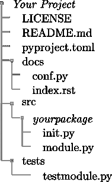
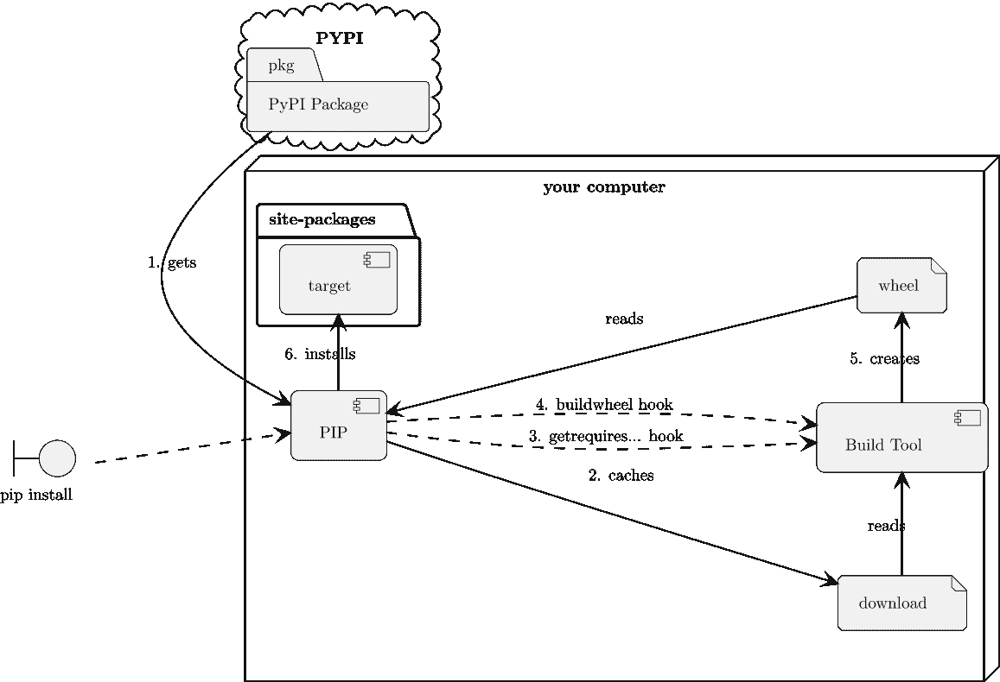

## 16

依赖关系和虚拟环境

Python 在由操作系统定义的环境中运行。Windows、macOS 和大多数 Linux 环境之间有一些细微的差异。我们将把微控制器环境放在一边，因为定制这些环境的能力相当复杂。我们将尽量减少操作系统差异，以关注普遍可用的共同方面。

运行时环境中有一些常见的方面。我们可以将这些分为两组：

持久

环境的各个方面变化缓慢。

+   正在使用的 Python 运行时。这包括一个二进制应用程序，通常包括许多外部库。

+   可用的标准库。这些库通过导入器访问，通常通过 import 语句访问。它们通常通过相对于 Python 二进制的路径找到。

+   作为站点包安装的其他库。这些库也被导入器访问。这些库也可以通过它们相对于 Python 二进制的路径找到。

+   通过站点包中其他机制找到的库。最值得注意的是，PYTHONPATH 环境变量。

临时

环境的各个方面每次启动 Python 运行时都可能发生变化。

+   由当前使用的 shell 定义的环境变量。这些变量可以通过 os 模块访问。

+   当前工作目录和用户信息，由操作系统定义。这可以通过 os、os.path 和 pathlib 模块访问。

+   启动 Python 时使用的命令行。这可以通过 sys 模块的几个属性访问，包括 sys.argv、sys.stdout、sys.stdin 和 sys.stderr。

持久环境通过操作系统级别的命令管理，在我们的应用程序程序之外。对环境持久方面的更改通常在 Python 启动时检查一次。这意味着我们编写的应用程序无法轻易安装一个包然后使用该包。

持久环境有两个视角：

实际环境

: 单个站点由系统管理员处理并需要提升权限。例如，Python 运行时通常位于 root 用户拥有的路径中，并通过 PATH 环境变量的通用系统级值可见。

虚拟环境

: 任何数量的虚拟环境都可以由单个用户本地化，并且不需要特殊权限。多个 Python 运行时及其关联的站点包可以由单个用户拥有。

从前有段时间——在很久以前，当计算机能力很小的日子里，一个单一的实际环境就是可以管理的全部。添加和更改已安装包的集合需要 Python 用户的合作。具有提升权限的管理员实施了任何更改。

现在计算机的能力大大增强，每个用户都可以轻松地拥有多个虚拟环境。实际上，我们经常使用多个虚拟环境构建和测试模块，这些虚拟环境反映了 Python 运行时的不同版本。每个用户都能够管理自己的虚拟环境。

在协作工作时，共享虚拟环境的详细信息变得很重要，这样多个用户就可以重新创建一个共同的虚拟环境。将单个实际环境的共享工作转移到每个用户需要准备和管理自己的虚拟环境。

环境管理似乎与金斯伯格定理和热力学定律相平行：

+   整体环境管理的工作量既不会被创造也不会被毁灭。

+   对环境的任何更改都需要工作。

+   没有什么是不变的（除非它完全与所有外部因素隔离）。

尽管大多数 Linux 发行版都预装了 Python，但没有充分的理由要使用这个版本的 Python 来完成任何任务。通常，安装个人版本的 Python 并使用该版本管理虚拟环境要容易得多。拥有个人 Python 安装允许用户随时更新到新版本，而无需等待 Linux 发行版赶上最新技术。

管理环境涉及两大类工具：

+   安装 Python 二进制文件所需的特定于操作系统的工具。这因操作系统而异，对于新开发者来说可能具有挑战性。我们将避免涉及这些工具的复杂性，并将读者指引到 [`www.python.org/downloads/`](https://www.python.org/downloads/) 页面。

+   用于安装 Python 库的基于 Python 的工具，如 PIP。由于这些工具依赖于 Python，因此命令对所有操作系统都是通用的。本章将专注于这些工具。

在本章中，我们将探讨以下管理虚拟环境的配方：

+   使用内置的 venv 创建环境

+   使用 requirements.txt 文件安装包

+   创建 pyproject.toml 文件

+   使用 pip-tools 管理 requirements.txt 文件

+   使用 Anaconda 和 conda 工具

+   使用诗歌工具

+   应对依赖关系的变化

我们将从使用内置工具创建虚拟环境开始。

# 16.1 使用内置的 venv 创建环境

一旦安装了 Python，就可以使用内部 venv 模块为每个项目创建独特的虚拟环境。

虚拟环境有两个主要用途：

+   管理 Python 版本。我们可能需要为 Python 3.12 和 Python 3.13 创建不同的虚拟环境。在某些情况下，我们可能需要管理 Python 3.13 的多个小版本。

+   管理项目所需的特定站点包的混合。我们不必尝试更新单个实际环境，当新版本的包可用时，我们可以创建新的虚拟环境。

这两个用例有很大的重叠。Python 的每个版本都将有标准库包的不同版本，并且可能有外部特定站点的不同版本。

使用虚拟环境最重要的部分是确保它已经被激活。许多场景会改变浏览器的内部状态，使虚拟环境失效。关闭终端窗口和重新启动计算机是使环境失效的两种最常见方式。

切换终端窗口或打开新的终端窗口可能会启动一个 shell 环境，其中虚拟环境未激活。在开始使用之前激活环境可以轻松解决这个问题。

## 16.1.1 准备工作

重要的是要注意 Python 必须安装。Python 可能不存在，并且不应使用操作系统中的 Python 版本进行开发或实验。对于 macOS 和 Windows，通常安装预构建的二进制文件。这可能涉及下载磁盘映像并运行安装程序或下载安装程序应用程序并运行它。

对于 Linux，通常从源代码构建特定分布的 Python。另一种选择是使用像 rpm、pkg、yum 或 aptitude 这样的管理工具安装特定分布的预构建 Python。

大多数 Python 发布版将包括 pip 和 venv 包。微控制器 Python 和基于 WASM 的 Python 通常难以使用桌面工具更新；它们超出了本书的范围。

## 16.1.2 如何操作...

首先，我们将查看创建一个虚拟环境，该环境可以用于安装包和解决导入。一旦环境创建完成，我们将查看如何激活和停用它。环境必须处于活动状态才能正确安装和使用包。

避免将虚拟环境置于配置控制之下是很重要的。相反，用于重新创建环境的配置细节被置于配置控制之下。

当使用 Git 等工具时，可以使用.gitignore 文件来忽略项目的任何虚拟环境细节。另一种方法是将与特定项目目录分开的虚拟环境定义。

### 创建虚拟环境

1.  首先，创建项目目录。对于非常小的项目，不需要额外的文件。对于大多数项目，src、tests 和 docs 目录通常有助于组织项目代码、测试代码和文档。

1.  在“隐藏”文件和可见文件之间进行选择。在 Linux 和 macOS 中，以.开头的文件通常不会被大多数命令显示。由于虚拟环境不是我们将要工作的目录，通常最简单的方法是使用名称.venv。

    在某些情况下，我们希望目录可见。那么，venv 名称将是最佳选择。

1.  以下命令将创建虚拟环境：

    ```py
    % python -m venv .venv
    ```

    虚拟环境将位于项目目录中的 .venv 目录内。

完成此操作后，必须激活虚拟环境。每次打开新的终端窗口时，该窗口中的环境都需要被激活。

### 激活和停用环境

激活虚拟环境需要特定的操作系统命令。Python 标准库文档提供了所有变体命令。我们将展示两种最常见的变体：

+   对于 Linux 和 macOS，使用 bash 或 zsh，输入以下命令以激活虚拟环境：

    ```py
    % source .venv/bin/activate
    ```

+   对于 Windows 系统，输入以下命令以激活虚拟环境：

    ```py
    > .venv\Scripts\activate
    ```

一旦激活了虚拟环境，许多环境变量将会改变。最值得注意的是，PATH 环境变量将包括虚拟环境的 bin 目录。例如，这将使 deactivate 命令可用。此外，提示将更改以包括虚拟环境的名称。它可能看起来像以下这样：

```py
C:\Users\Administrator>.venv\Scripts\activate 

(.venv) C:\Users\Administrator>
```

在第一行，默认提示显示目录。在第二行，提示以 (.venv) 作为前缀以显示虚拟环境现在已激活。

一旦激活了虚拟环境，所有进一步使用 pip 命令安装包的操作都将指向活动环境。任何运行的 Python 应用程序将搜索活动环境以安装包。

要停用环境，请使用以下命令：

```py
% deactivate
```

activate 命令作为虚拟环境的一部分创建了此新命令，因此它对所有操作系统都是通用的。

## 16.1.3 它是如何工作的...

对于大多数操作系统，有几个关键环境变量定义了虚拟环境。PATH 环境变量通常提供查找 Python 可执行文件的位置。在 Windows 环境中，这也会使启动器、py 命令可用。

剩余 Python 元素的位置都是相对于可执行文件的。特别是，标准库是一个相邻路径，这个库包含 sites 包，用于处理定位已安装包的所有其他细节。

虚拟环境的详细信息由三个目录和一个配置文件定义。

配置文件 pyvenv.cfg 提供了一些重要的设置。三个目录是 bin、include 和 lib。（在 Windows 上，这些名称分别是 Scripts、Include 和 Lib）。bin 目录包含执行虚拟环境激活的脚本文件。设置 PATH 环境变量使这些脚本可用。这包括 deactivate 命令。此外，bin 目录还包含一个 pip 可执行命令和一个指向正确 python 二进制的链接。

## 16.1.4 更多内容...

venv 命令有许多选项。其中，有两个似乎特别有用：

+   --without-pip 选项跳过了安装特定于 venv 的 PIP 副本。似乎使用 python -m pip 比依赖虚拟环境安装更好。

+   --prompt 选项可以设置比.venv 更友好的环境名称。

我们通常会使用以下命令之一来激活环境：

```py
% python -m venv --prompt ch17 --without-pip .venv
```

这将确保提示变为(ch17)而不是模糊且可能令人困惑的(.venv)。

## 16.1.5 参见

+   一旦创建了虚拟环境，我们就可以添加外部库。参见使用 requirements.txt 文件安装包以获取管理依赖项的建议。

# 16.2 使用 requirements.txt 文件安装包

Python 的一个显著优势是 Python 包索引（PyPI）等库中可用的庞大生态系统，[`pypi.org`](https://pypi.org)。使用 PIP 工具向环境中添加库很容易。

在某些情况下，这可能——也许——过于简单。所有依赖项，从构建 Python 运行时所需的库开始，都处于不断变化的状态。每个都有其独特的更新节奏。在某些情况下，众多参与者之间的合作有限。

为了管理不断的变化，对于开发应用程序的人来说，仔细跟踪依赖项非常重要。我们建议将依赖项分解为三个具体性级别：

+   通用、仅名称的依赖项：例如，一个应用程序可能需要 Beautiful Soup。

+   过滤：随着 Beautiful Soup 项目的演变，可能会有已知错误或缺少基本功能的版本。我们可能希望缩小依赖范围，省略或排除特定版本，或者要求版本为>=4.0。

+   固定（或锁定）：当需要构建（和测试）特定虚拟环境时，拥有用于测试的确切版本号的详细列表是至关重要的。

当我们最初探索数据或问题领域或候选解决方案时，我们可能会将大量包下载到开发环境中。随着项目的成熟，虚拟环境的内容将发生变化。在某些情况下，我们会发现我们不需要某个包；未使用的包将被忽略并应该被删除。在其他情况下，随着新选项的探索，包的组合将扩大。在这个过程中，固定的版本号可能会改变，以跟踪项目所依赖的包的可接受版本。

## 16.2.1 准备工作

记录通用依赖项在 pyproject.toml 文件等地方效果很好。（我们将在创建 pyproject.toml 文件的配方中查看这一点。）

特定的、固定的依赖项可以被分离成一系列的需求文件。有许多依赖项使用案例，导致一系列密切相关文件的产生。

requirements 文件格式作为 PIP 文档的一部分定义。请参阅 [Requirements File Format](https://pip.pypa.io/en/stable/reference/requirements-file-format/) 页面，位于 [`packaging.python.org`](https://packaging.python.org)。

## 16.2.2 如何做...

1.  收集一般需求。最好查看导入语句以区分直接依赖的包。我们可能会发现一个项目使用了 pydantic、beautifulsoup4、jupyterlab、matplotlib、pytest 和 memray。

1.  在项目的顶层目录中打开名为 requirements.txt 的文件。

1.  文件的每一行都将有一个包含四部分信息的 requirements 指定符：

    +   包名。请注意，打字错误是开源项目中的一个普遍问题；确保找到包的正确、当前存储库，而不是类似的名字。

    +   所需的任何额外内容。如果存在，这些内容被括号包围。例如，当使用 rich 包进行 Jupyter Lab 的文本样式时，可能会使用 rich[jupyter]。

    +   版本指定符。这有一个比较运算符（==、>= 等），以及一个由数字点序列组成的版本。例如，pillow>=10.2.0 选择任何 10.2.0 版本或更高版本的 pillow 包，避免与 10.1.0 版本的已知漏洞。

    +   如果需要，任何由分号分隔的进一步环境约束。例如，sys_platform == 'win32' 可能被用来提供特定平台的要求。

    虽然可以创建复杂的条件，但它们并不经常需要。最好避免编写版本信息，除非出现特定的错误修复、缺失功能或兼容性问题。

    该文件的完整规则集在 [PEP 508](https://peps.python.org/pep-0508/) 文档中。

    版本指定符在 Python 打包指南中定义。请参阅 [版本指定符](https://packaging.python.org/en/latest/specifications/version-specifiers) 页面，位于 [`packaging.python.org`](https://packaging.python.org)。

    例如，以下是依赖项列表：

    ```py
    pydantic 

    beautifulsoup4 

    types-beautifulsoup4 

    jupyterlab 

    matplotlib 

    pytest 

    memray
    ```

1.  激活项目的虚拟环境（如果尚未激活）：

    ```py
    % source .venv/bin/activate
    ```

1.  运行以下命令来安装指定包的最新版本：

    ```py
    (ch17) % python -m pip install -r requirements.txt
    ```

    PIP 应用程序将找到各种包的匹配版本并将它们安装。由于一些这些包有复杂的依赖层，第一次尝试安装可能会比较耗时。

    这七个包的总数扩展到大约 111 个必须安装的包。

对于许多项目，这已经足够构建一个有用的环境定义。在许多情况下，这个基本定义需要提供更具体的版本信息。这是一个单独的配方；请参阅 使用 pip-tools 管理 requirements.txt 文件。

## 16.2.3 它是如何工作的...

PIP 应用程序使用 -r 选项解析包含所需包的文件。在此文件中，我们可以有简单的包列表，以及用于定位包正确版本的复杂规则。我们甚至可以拥有其他 -r 选项以合并其他要求文件。使用多个文件可以帮助组织非常复杂的项目。

当我们命名一个包为 PIP 时，它将检查目标元数据以定位它所依赖的包。这些传递依赖必须在目标包安装之前安装。这意味着必须构建一个显示所有依赖项的内部晶格结构。这可能涉及下载多个包的副本，因为版本约束被解析为单个、最终的包安装列表。

虽然使用 PIP 手动安装单个包很容易，但这会导致对项目需要什么以及虚拟环境中当前安装了什么产生混淆。避免这种情况需要一种纪律性的方法，在探索新包时始终做以下两件事：

+   将包添加到 requirements.txt 文件中。

+   运行 python -m pip install -r requirements.txt 以向当前虚拟环境添加包。

当从 requirements.txt 文件中删除包时，我们通常可以通过删除虚拟环境并创建一个全新的环境来继续操作。这会导致以下命令序列被使用：

```py
% (ch17) deactivate 

% python -m venv --clear --prompt ch17 .venv 

% source .venv/bin/activate 

% (ch17) python -m pip install -r requirements.txt
```

因为 PIP 维护了一个已下载文件的缓存，所以这个环境重建起来相对较快。使用 requirements.txt 确保环境以可重复的方式构建。

## 16.2.4 更多...

手动安装组件并发现冲突是非常常见的。例如，一个同事克隆了一个仓库，但无法运行单元测试套件，因为 requirements.txt 文件不完整。

另一个案例是对开发环境的审计。随着新成员加入团队，他们可能会安装 requirements.txt 文件中命名的包的新版本。为了确保每个人都使用相同的版本，冻结虚拟环境中包的版本信息很有帮助。

对于这两种用例，可以使用 python -m pip freeze 命令。这将报告所有已安装的包及其使用的版本。此输出的格式与 requirements 文件相同。

我们可以使用以下命令：

```py
% source .venv/bin/activate 

% (ch17) python -m pip freeze >audit_sfl.txt
```

这些输出文件可以用来比较差异，并修复与预期不一致的环境。

此外，pip freeze 子命令的输出可以用来替换一个通用的 requirements.txt 文件，以一个特别固定每个正在使用的包的文件。虽然这很简单，但它并不非常灵活，因为它提供了特定版本。使用 pip-tools 有更好的方法来构建 requirements.txt 文件。我们将在使用 pip-tools 管理 requirements.txt 文件中查看这一点。

## 16.2.5 参见

+   请参阅使用内置 venv 创建环境的配方，了解如何创建虚拟环境。

+   请参阅使用 pip-tools 管理 requirements.txt 文件的配方，了解如何管理依赖项。

# 16.3 创建 pyproject.toml 文件

除了虚拟环境和清晰的依赖列表之外，项目还可以从整体总结中受益，这种总结以 pyproject.toml 文件的形式存在。

pyproject.toml 文件是某些 Python 工具所必需的，并且通常很有帮助。它提供了项目技术细节的集中总结。

随着[PEP 621](https://peps.python.org/pep-0621/)的采用，此文件已成为关于项目元数据的预期位置。它取代了旧的 setup.py 模块。

本配方基于[Sample Project](https://github.com/pypa/sampleproject)项目，该项目位于[`github.com/pypa`](https://github.com/pypa)的打包权威 Git 仓库中。该配方还基于[打包 Python 项目](https://packaging.python.org/en/latest/tutorials/packaging-projects/)页面，这是打包权威教程之一。请参阅[`packaging.python.org`](https://packaging.python.org)。

## 16.3.1 准备工作

我们假设项目不是一个简单的单文件模块，而是一个更大的项目。这意味着将会有一个类似以下结构的目录结构：



图 16.1：项目文件

我们已经展示了一个适用于许多项目的常见结构。顶级名称“Your Project”是一个适用于您项目集合的名称。

src 目录内 your_package 的名称是当它被导入时包将被认识的名称。这不必与整体项目名称完全匹配，但它应该有一个清晰的关系。例如，Beautiful Soup 项目在 PYPI 上有名为 beautifulsoup4 的条目，但在您的 Python 本地 site packages 中导入的包被命名为 bs4。这种联系是清晰的。

我们已经展示了 README.md 文件，其扩展名表明它使用 Markdown 标记编写。常见的替代方案是 README.rst 和 README。

LICENSE 文件可能是一个困难的选择。请参阅[`spdx.org/licenses/`](https://spdx.org/licenses/)以获取开源许可证的完整列表。请参阅[GNU 许可证列表](https://www.gnu.org/licenses/license-list.en.html)以获取有关各种开源许可证的建议。[`www.gnu.org`](https://www.gnu.org)。

docs 目录的内容通常使用 Sphinx 等工具构建。我们将在第十七章中讨论文档。

## 16.3.2 如何操作...

1.  确保 README.md 文件包含有关如何安装和使用项目的总结。随着项目的演变，这些内容可能会发生变化。

    有六个基本问题：“谁？”，“什么？”，“为什么？”，“何时？”，“何地？”，“如何？”这些问题可以帮助撰写简短的段落来描述项目。C4 模型提供了关于如何描述软件的额外帮助。请参阅[C4 模型](https://c4model.com)。

1.  确定将使用哪个构建系统。选择包括 setuptools、hatch 和 poetry。pyproject.toml 文件的内容中的一些部分将仅适用于构建系统。

    对于这个配方，我们将使用 setuptools 作为构建工具。

1.  对于 pyproject.toml 文件，有大量的模板可供选择。[PYPA 示例项目](https://github.com/pypa/sampleproject/blob/main/pyproject.toml)示例是全面的，也许有点令人望而生畏。TOML 中有两个表是必需的：[项目]和[构建系统]。在入门时可以忽略其余部分。

    这里是[项目]表的简短模板：

    ```py
    [project] 

    name = "project_name" 

    version = "2024.1.0" 

    description = "A useful description." 

    requires-python = ">=3.12" 

    authors = [ 

      {email = "your.email@example.com", name = "Your Name"} 

    ] 

    dependencies = [ 

        your dependencies 

    ] 

    readme = "README.md" 

    license = {file = "LICENSE"}
    ```

    前六项需要用有关您项目的实际情况替换。最后两项，readme 和 license，通常不会改变，因为它们是项目目录中文件的引用。

    名称必须是项目的一个有效标识符。它们由[PEP-508](https://peps.python.org/pep-0508/)定义。它们是由字母、数字和特殊字符-、_ 和.组成的名称。有趣的是，它们不能包含空格或以标点符号结尾。ch17-recipe3 是可以接受的，但 ch17_ 是无效的。

    依赖项必须是一系列直接需求，必须安装这些需求才能使此项目工作。这些与 requirements.txt 文件中提供的依赖项规范相同。有关更多信息，请参阅使用 requirements.txt 文件安装包。

    这里是[构建系统]表的模板。这个模板使用了小型、广泛可用的 setuptools 工具：

    ```py
    [build-system] 

    build-backend = "setuptools.build_meta" 

    requires = [ 

        "setuptools", 

    ]
    ```

1.  使用 tomllib 打开此文件以确认其格式正确可能会有所帮助。这可以在 Python 控制台中交互式地完成，如下所示：

    ```py

    >>> from pathlib import Path 

    >>> import tomllib 

    >>> doc = Path("pyproject.toml").read_text() 

    >>> tomllib.loads(doc)
    ```

    如果文件在某些方面无效，这将引发 tomllib.TOMLDecodeError 异常。异常将提供语法错误的行和列，或者当结构未正确终止时，它将说“在文档末尾”。

## 16.3.3 它是如何工作的...

许多工具都使用了 pyproject.toml 的内容。PIP 和 pyproject.toml 文件中命名的构建工具之间存在复杂的关系。对于这个配方，我们使用 setuptools。

以下图表总结了下载和安装库所涉及的一些步骤：



图 16.2：PIP 和构建工具如何协作

这个总结图表既不是对包安装的详尽审查，也不是最终审查。有关更多信息，请参阅[PEP-517](https://peps.python.org/pep-0517)。

处理从 `pip install` 命令开始，如边界图标所示。PIP 操作通过编号步骤进行：

1.  PIP 首先从像 PYPI 这样的包索引获取压缩存档。

1.  存档被缓存在本地的计算机上以供将来使用。

1.  PIP 使用 `get_requires_for_build_wheel` 构建工具钩子来收集需求。构建工具从 `pyproject.toml` 文件中获取依赖信息，并将其提供给 PIP。PIP 工具将下载这些额外的项目。这些项目有自己的需求。需求图被解析以确定所有必需的安装。

1.  在某些情况下，需要一个新的 wheel 格式文件。在其他情况下，项目提供了一个 wheel 格式的文件。PIP 工具可以使用 `build_wheel` 构建工具钩子将下载的文件组合成可安装的形式。

    一些发行版包括源文件，可能还包括数据文件或脚本，这些文件不是简单地复制到 site-packages 目录的。

1.  然后，PIP 将 wheel 文件安装到虚拟环境的适当 site-packages 目录中。

可能用于构建包的构建工具包括 setuptools、build、hatch 和 poetry。所有这些构建工具都可以由 PIP 使用。它们都使用了 pyproject.toml。

## 16.3.4 更多内容...

除了项目运行所需的依赖项外，额外的依赖项通常基于我们可能对项目进行的其他操作。常见的额外用例包括运行测试、开发新功能和修复错误。

这些额外用例的工具是可选依赖项。它们通常列在单独的表中，每个用例有自己的子表。例如，我们可能添加以下表格及其两个子表，以列出用于测试的工具，以及更多通用开发的其他工具：

```py
[project.optional-dependencies] 

test = [ 

    "tox", 

    "ruff", 

    "mypy", 

    "pytest", 

    "pytest-cov" 

] 

dev = [ 

    "pip-tools", 

    "sphinx" 

]
```

这些额外的列表允许某人安装测试套件以确认下载的项目通过了所有测试用例。它们还允许某人下载维护文档和详细依赖列表的适当工具。

注意，在这些示例中，没有一个依赖项使用特定的、固定的版本命名。这是因为我们将使用 pip-tools 从 `pyproject.toml` 文件中可用的信息构建一个 `requirements.txt` 文件。参见使用 pip-tools 管理 requirements.txt 文件。

flit 和 twine 等工具常用于上传到像 PYPI 这样的存储库。对于企业开发者，可能有一个企业 Python 存储库。这些工具利用 `pyproject.toml` 文件中的额外表。

例如，flit 工具使用额外的 `[tool.flit.sdist]` 和 `[tool.flit.external-data]` 表来提供执行上传所需的信息。

## 16.3.5 参见

+   请参阅[`python-semantic-release.readthedocs.io/en/latest/`](https://python-semantic-release.readthedocs.io/en/latest/)，了解可以根据 Git 提交消息修改版本名的 Python Semantic Release 工具。

+   请参阅第十三章中的使用 TOML 配置文件，以获取有关 TOML 文件更多信息。

+   请参阅使用 pip-tools 管理 requirements.txt 文件，了解我们将需求列表精炼成固定版本号的列表的方法。

+   [Hypermodern Python](https://github.com/cjolowicz/cookiecutter-hypermodern-python) 项目有一个模板，可以使用 Cookie-Cutter 工具构建目录结构。请参阅[`github.com/cjolowicz`](https://github.com/cjolowicz)。此模板依赖于 Poetry 来管理依赖和虚拟环境。

+   第十七章包含了最基本：一个 README.rst 文件的配方，以更深入地处理 README 文件。

# 16.4 使用 pip-tools 管理 requirements.txt 文件

如上所述，一个项目的依赖有三个级别的具体性：

通用

: 仅名称依赖

过滤

: 使用非常通用的约束如 >= 4.0

固定

: 使用特定版本如 == 4.12.2

如何对这些级别进行对齐？一个简单的方法是使用 pip-tools 包。此包包括 pip-compile 工具，它将消化需求，解决依赖，并创建一个带有固定版本号的衍生 requirements.txt 文件。

伴随工具 pip-sync 可以用来确保活动虚拟环境与 requirements.txt 文件匹配。这可以比删除和重新创建虚拟环境快得多。

## 16.4.1 准备工作

PIP-tools 必须下载并安装。通常，这是通过以下终端命令完成的：

```py
(ch17) % python -m pip install pip-tools
```

这假设虚拟环境是激活的；在示例中，它被命名为 ch17。使用 python -m pip 命令确保我们将使用与当前激活虚拟环境关联的 pip 命令。

pip-compile 工具将在 pyproject.toml 或 requirements.in 文件中定位需求。根据这些信息，它将构建一个详细的 requirements.txt 文件，该文件可用于 pip 或 pip-sync 来创建虚拟环境。

## 16.4.2 如何操作...

1.  确保依赖项在 pyproject.toml 文件中。在某些情况下，可能已经使用旧的 requirements.txt 文件开始。确认信息在 pyproject.toml 文件中是一个好主意，因为 requirements.txt 文件将被替换。

1.  第一次这样做时，删除任何由 pip-compile 创建的旧 requirements.txt 文件可能会有所帮助。

1.  要构建核心 requirements.txt 文件，请运行 pip-compile 命令：

    ```py
    (ch17) % pip-compile
    ```

    这将在 pyproject.toml 文件中定位依赖项。然后，它将定位所有传递性依赖项，并构建一个已解决冲突的需求集。

    它将同时写入 requirements.txt 文件并在控制台上显示此文件。

1.  要构建 requirements-test.txt 文件，请使用带有 --extra 选项的 pip-compile 命令：

    ```py
    (ch17) % pip-compile --extra test -o requirements-test.txt
    ```

    这将创建一个文件，其中包含 [project.optional-dependencies] 表格中 test = [...] 部分的可选依赖项。

1.  要构建一个包含所有额外内容的综合型 requirements-dev.txt 文件，请使用带有 --all-extras 选项的 pip-compile 命令：

    ```py
    (ch17) % pip-compile --all-extras -o requirements-dev.txt
    ```

    这将创建一个包含 [project.optional-dependencies] 表格中所有可选依赖项的文件。

1.  当需要时，使用 pip-sync 命令来重建当前虚拟环境，以匹配 requirements.txt 文件中的更改。

    通常，与 tox 工具一起使用。在一个测试环境描述的 commands_pre 部分，使用 pip-sync requirements.txt 确保测试虚拟环境与 requirements.txt 文件中的包版本同步。

## 16.4.3 它是如何工作的...

pip-compile 工具将在三个地方寻找信息：

+   pyproject.toml 文件。

+   如果存在，则包含 requirements.in 文件。这不是必需的，因为相同的信息已经在 pyproject.toml 文件中。

+   任何之前创建的 requirements.txt 文件。

使用 pyproject.toml 和任何之前创建的 requirements.txt 文件可以让工具正确反映增量更改。这意味着它可以最小化分析未发生太大变化的项目的所需工作量。当开始一个新项目时，在做出重大更改后，有时删除整个 requirements.txt 文件是有帮助的。

## 16.4.4 更多...

在进行更改时，有两个选项可以帮助重建 requirements.txt 的详细信息：

+   --rebuild 选项将清除缓存并重新分析依赖项。

+   --upgrade some-package 选项将仅查找名为 some-package 的包的升级。这防止了对其他应该保持不变的包的分析。可以提供多个 --upgrade 选项以跟踪多个更改。

这两个命令让我们可以管理增量更改，升级 requirements.txt，重建虚拟环境，并使用新版本的包进行测试。这确保了环境的描述与实际环境相匹配。我们可以有信心地分享项目。

有时候，包会有冲突的需求。假设我们的项目依赖于项目 A 和项目 T。结果证明项目 A 也需要项目 T。当我们的项目需要 T >= 10.11（与 A 项目所需的版本不同，例如，T < 10.9）时，可能会出现问题。这可能很难解决。

我们可以希望我们项目的限制 T >= 10.11 过于具体；我们可以放宽约束并找到一个兼容的版本。在其他情况下，项目 A 所声明的需求可能过于具体，我们需要考虑对其他项目的代码进行更改。理想情况下，这是一个适当的问题和拉取请求，但它可能需要分叉项目以提供不同的约束。最坏的情况需要重新设计我们的项目以改变依赖关系的性质，或者——也许——停止使用项目 A。

在某些情况下，pyproject.toml 和 pip-compile 工具报告了令人沮丧的模糊错误信息：

```py
(ch17) % pip-compile 

Backend subprocess exited when trying to invoke get_requires_for_build_wheel 

Failed to parse /Users/slott/Documents/Writing/Python/Python Cookbook 3e/src/ch17/pyproject.toml
```

这是 pyproject.toml 文件格式的问题。

揭示问题的方法之一是在当前工作目录中尝试对项目进行“可编辑”安装。这将使用带有 -e . 选项的 pip install 命令，将当前目录用作要安装的项目。

它看起来是这样的：

```py
(ch17) % pip install -e .
```

这将报告在 pyproject.toml 文件中找到的具体错误。然后我们可以修复错误并再次运行 pip-compile。

## 16.4.5 参见

+   关于项目整体的更多背景信息，请参阅 PYPA [示例项目](https://github.com/pypa/sampleproject)。

+   关于许可证的信息，请参阅 [SPDX](https://spdx.org/licenses/)。

+   使用 requirements.txt 文件安装包 的配方描述了使用文件来驱动 PIP 安装。

+   有关构建系统如何工作的更多信息，请参阅 [PEP-517](https://peps.python.org/pep-0517)。

# 16.5 使用 Anaconda 和 conda 工具

PIP 工具可以安装的包类型有一些限制。最明显的限制涉及涉及用编译语言（如 Rust 或 C）编写的扩展模块的项目。平台之间的差异——包括硬件和操作系统——可能会使得分发包的二进制文件的所需所有变体变得困难。

在 Linux 环境中，由于 GNU CC 等编译器很容易获得，具有扩展模块的包可以包含源代码。PIP 工具可以使用编译器构建必要的二进制文件。

对于 macOS 和 Windows，需要额外的工具来创建二进制文件。免费编译器不像在 Linux 环境中那样容易获得，这可能会带来潜在的问题。

Conda 通过在其存储库中提供广泛的预构建二进制文件来解决二进制文件的问题。它还确保在预构建二进制文件不可用的情况下，目标平台上有一个可用的编译器。

conda 工具是一个虚拟环境管理器和包安装程序。它满足与 PIP、venv 和 pip-tools 相同的使用案例。这包括包含二进制的包的构建，通常用于高性能数值应用。conda 的命令行界面在所有平台上都是相同的，允许更简单、更一致的文档。

Anaconda 软件包索引由 Anaconda 公司维护。请访问他们的网站[`anaconda.com`](https://anaconda.com)，了解价格和费用。提供的软件包已经集成并经过测试。这种测试需要时间，官方 Anaconda 发行版可能落后于 PYPI 上的可用内容。此外，它只是 PYPI 上可用内容的子集，因为它倾向于关注数据分析和数据科学。

一个独立的软件包索引，conda-forge ([`conda-forge.org`](https://conda-forge.org)) 是基于社区的。这个频道包含的软件包更接近 PYPI 上的内容。在许多情况下，我们会从这个频道安装软件包，因为我们想要新的东西，或者我们想要 PYPI 上可用的精选子集之外的某些东西。

## 16.5.1 准备工作

获取 conda 工具有两种方式：

+   下载并安装完整的 Anaconda 发行版。这是一个大文件下载，Windows 系统上从 900 MB 到更多 Linux 发行版超过 1,000 MB。

+   下载并安装 miniconda，并使用它仅安装所需的软件包。这是一个较小的下载，通常大约 100 MB。

对于完整的 Anaconda 安装，请参阅[`www.anaconda.com/download`](https://www.anaconda.com/download)。安装程序有两种类型：

图形界面

: 这些安装程序使用操作系统交互式工具来支持一些配置。

命令行

: 这些安装程序是复杂的 shell 存档，在终端窗口中运行。它们提供与图形安装程序相同的安装选项。需要输入更多内容，点击和拖拽更少。

对于 miniconda 安装，请参阅[`docs.conda.io/projects/miniconda/en/latest/index.html`](https://docs.conda.io/projects/miniconda/en/latest/index.html)。每个操作系统都有略微不同的安装程序类型：

Windows

: 安装程序是一个可执行程序，它使用 Windows 安装程序。

macOS

: 有 PKG 图像可以下载并双击以使用 macOS UI。也有可以从终端窗口执行的命令行图像。

Linux

: 这些是从终端窗口启动的 shell-存档文件。

虽然这里有很多选择，但我们推荐使用 Miniconda 的命令行安装程序。

请参阅[Miniconda](https://docs.conda.io/projects/miniconda/en/latest/index.html)页面，了解使用 curl 程序获取镜像并执行安装的推荐 shell 命令。

一旦安装了 conda 工具，就可以用它来创建和填充虚拟环境。请注意，conda 工具创建了一个基本虚拟环境。当 conda 安装时，(base) 环境应显示为终端窗口提示的一部分。这作为一个视觉提示，表明没有其他环境已被激活。退出并重新启动所有终端窗口以确保 conda 正在运行可能会有所帮助。

## 16.5.2 如何操作...

确保安装了 conda 工具非常重要。请参阅本食谱的“准备就绪”部分，了解安装 conda 的建议。

1.  使用 conda create 命令创建一个新的虚拟环境：

    ```py
    % conda create -n cookbook3 python=3.12
    ```

    注意，命令在所有操作系统上都是相同的。

    虚拟环境的文件保存在项目目录之外。对于 macOS，将有一个 ~/miniconda3/envs 目录，其中包含所有虚拟环境文件。

1.  使用 conda activate 命令激活这个新的虚拟环境：

    ```py
    (base) % conda activate cookbook3
    ```

1.  使用 conda install 命令在虚拟环境中安装一系列包。Conda 有自己的冲突解决器，与 PIP 工具或 pip-compile 使用的解决器是分开的。虽然我们可以使用 requirements.txt 文件，但我们实际上并不需要所有这些细节。通常，提供包名信息如该命令所示会更简单：

    ```py
    (cookbook3) % conda install pydantic beautifulsoup4 jupyterlab matplotlib pytest memray
    ```

1.  要创建当前虚拟环境的可共享定义，请使用 conda env export 命令：

    ```py
    (cookbook3) % conda env export >environment.yml
    ```

    这使用 shell 重定向功能将导出的信息保存到一个 YAML 格式的文件中，该文件列出了所有需求。此文件可以被 conda env create 使用以重新创建此环境。

## 16.5.3 它是如何工作的...

conda 创建的虚拟环境已正确设置 PATH 环境变量，以指向特定的 Python 可执行文件。标准库包和特定于站点的包位于附近的目录中。

这与内置的 venv 模块创建的虚拟环境相类似。它遵循 [PEP-405](https://peps.python.org/pep-0405/) 规则，该规则定义了虚拟环境的规则。

为了保持一致性工作，conda 命令必须是可见的。这意味着基础 conda 安装也必须在系统 PATH 环境变量中命名。这是使用 conda 的一个关键步骤。Windows 安装程序有选项来更新系统路径，或者创建具有必要路径设置的专用命令窗口。同样，macOS 安装程序需要额外步骤来使 conda 命令可用于 zsh shell。

Anaconda 存储库可能有预构建的二进制文件，这些二进制文件可以被 conda 工具下载和使用。在没有二进制文件的情况下，conda 工具将下载源代码并根据需要构建二进制文件。

## 16.5.4 更多...

最常见的用例之一是升级到软件包的最新版本。这是通过 conda update 命令完成的：

```py
(cookbook3) % conda update pydantic
```

这将在搜索的各种渠道中查找软件包的版本。它将比较可用的版本与当前在活动虚拟环境中安装的版本。

为了礼貌地与 tox 等测试工具协作，使用 pip freeze 命令创建 requirements.txt 文件很有帮助。默认情况下，tox 使用 pip 来构建虚拟环境。PIP 工具不会覆盖由 conda 安装的包，允许它们和平共存。

另一个选择是使用 tox-conda 插件，允许 tox 工具使用 conda 创建和管理虚拟环境。请参阅 tox-conda 存储库 [`github.com/tox-dev/tox-conda`](https://github.com/tox-dev/tox-conda)。

并非所有库和包都是 Anaconda 支持和精选库的一部分。在许多情况下，我们需要超出 Anaconda 的范围，并使用社区 conda-forge 频道，除了 Anaconda 频道之外。

我们经常需要使用以下类似命令来使用 conda-forge 频道：

```py
(cookbook3) % conda install --channel=conda-forge tox
```

我们还可以使用 pip 向 conda 环境添加包。这很少需要，但它确实工作得很好。

## 16.5.5 参考信息

+   有关虚拟环境的更多信息，请参阅使用内置 venv 创建环境。

+   有关完整的 Anaconda 安装信息，请参阅 [`www.anaconda.com/download`](https://www.anaconda.com/download)。

+   有关 Miniconda 安装信息，请参阅 [`docs.conda.io/projects/miniconda/en/latest/index.html`](https://docs.conda.io/projects/miniconda/en/latest/index.html)。

# 16.6 使用 poetry 工具

venv、pip 和 pip-tools 包的组合使我们能够创建虚拟环境，并用来自 PYPI 包索引的包填充它们。

Poetry 工具是一个将虚拟环境管理器和包安装程序结合成一个单一工具的工具。它满足了与 PIP、venv 和 pip-tools 相同的使用案例。它还满足了与 conda 相同的使用案例。CLI 在所有平台上都是相同的，允许为使用 Poetry 管理环境的开发者提供更简单、更一致的文档。

Poetry 启用虚拟环境的方式有一些细微的差异。它不是调整当前 shell 的环境变量，而是启动一个子 shell。子 shell 具有所需的虚拟环境设置。

## 16.6.1 准备工作

注意，Poetry 工具必须安装在其自己的虚拟环境中，与任何由 Poetry 管理的项目分开。这最好通过使用 Poetry 安装程序来完成。这涉及到特定于操作系统的命令来下载和执行安装程序。安装程序是用 Python 编写的，这使得任务在操作系统之间的一致性有所提高。

有关详细信息，请参阅 [`python-poetry.org/docs`](https://python-poetry.org/docs)。

有两个步骤：

+   从 [`install.python-poetry.org`](https://install.python-poetry.org) 下载。

+   执行下载的 Python 脚本。

推荐的命令在不同操作系统之间略有差异：

+   macOS、Linux 和 Windows Subsystem for Linux：curl 命令通常可用于下载。此命令可以用于：

    ```py
    % curl -sSL https://install.python-poetry.org | python3 -
    ```

    之后，后续步骤将更新系统 PATH 环境变量。安装程序的输出将提供要使用的位置。这两个示例适用于 macOS，其中文件位于 ~/.local/bin。

    编辑 ~/.zshrc 文件，添加以下行：

    ```py
    export PATH="~/.local/bin:$PATH"
    ```

    作为替代，可以定义 poetry 命令的位置别名。这通常是 ~/.local/bin/poetry。

+   Windows Powershell：Invoke-WebRequest Powershell 命令执行下载。Python 启动器 py 运行适当的 Python 版本：

    ```py
    PS C:\> (Invoke-WebRequest -Uri https://install.python-poetry.org -UseBasicParsing).Content | py -
    ```

    poetry 脚本放置在 AppData\Roaming\Python\Scripts 子目录中。可以将此目录添加到 PATH 环境变量中，或者明确使用路径，例如：AppData\Roaming\Python\Scripts\poetry --version。

    使用 chdir 命令更改当前工作目录意味着明确地引用您的家目录的 AppData 子目录。

一旦安装了 poetry 工具，就可以用它来创建和填充虚拟环境。

## 16.6.2 如何做...

1.  使用 poetry new 命令创建一个新的项目目录。这不仅会创建虚拟环境；还会创建目录结构和创建 pyproject.toml 文件：

    ```py
    %  poetry new recipe_05
    ```

    虚拟环境的文件保存在项目目录之外。对于 macOS，将有一个 ~/Library/Caches/pypoetry 目录，其中包含所有虚拟环境文件。

    注意，poetry 尝试与其他虚拟环境工具协作。这意味着可以使用 venv activate 命令设置环境变量。

1.  与在 shell 的环境中激活环境相比，通常更容易启动具有适当环境设置的子 shell。

    使用 poetry shell 命令启动一个已激活虚拟环境的 shell：

    ```py
    % poetry shell
    ```

    使用 shell 的 exit 命令终止此子 shell 并返回到上一个环境。

1.  使用 poetry add 命令将包添加到环境中。这将更新 pyproject.toml 文件并安装包：

    ```py
    % (recipe-05-py3.11) poetry add pydantic beautifulsoup4 jupyterlab matplotlib pytest memray
    ```

    这还会创建一个 poetry.lock 文件，该文件定义了每个依赖项的确切版本。

## 16.6.3 它是如何工作的...

由 poetry 创建的虚拟环境已正确设置 PATH 环境变量，以指向特定的 Python 可执行文件。标准库包和特定于站点的包位于附近的目录中。Poetry 正确利用 pyproject.toml 文件中的信息，减少了定义工作环境所需的额外文件数量。

为了保持一致性，poetry 命令必须是可见的。这意味着要么将 poetry 位置添加到系统 PATH 环境变量中，要么使用别名。这是使用 poetry 的关键步骤。

别名的替代方案如配方中所示，使用 ~/.local/bin/poetry 明确指定。这并不理想，但它使当前工作虚拟环境与 poetry 命令之间的关系更加清晰。

## 16.6.4 更多内容...

环境和工具如 Poetry 的最常见用例之一是升级到软件包的最新版本。这是通过 poetry update 命令完成的。可以提供特定的包列表。如果没有参数，将检查所有包。

这里有一个例子：

```py
% (recipe-05-py3.11) poetry update pydantic
```

这将搜索正在搜索的各种渠道中可用的 pydantic 包版本，并将其与当前在活动虚拟环境中安装的版本进行比较。此操作还将更新 poetry.lock 文件，以安装更新。

为了礼貌地与 tox 等测试工具协作，需要在 tox.ini 文件中添加一些额外的选项。一种易于使用的方法是跳过 tox 使用的默认安装程序，并使用 poetry 命令在 poetry 管理的环境中运行命令。

这里有一个如何使用 Poetry 与 tox 一起使用的建议：

```py
[tox] 

isolated_build = true 

[testenv] 

skip_install = true 

allowlist_externals = poetry 

commands_pre = 

    poetry install 

commands = 

    poetry run pytest tests/ --import-mode importlib
```

使用 poetry run 意味着命令将在虚拟环境中执行。这使得使用 tox 定义多个环境，并依赖 Poetry 为测试目的组装各种环境成为可能。

## 16.6.5 参考信息

+   有关 Poetry 的详细信息，请参阅[`python-poetry.org/docs`](https://python-poetry.org/docs)。

+   有关 Tox 的详细信息，请参阅[`tox.wiki/en/4.15.1/`](https://tox.wiki/en/4.15.1/)。

# 16.7 应对依赖项的变化

正如我们在使用 requirements.txt 文件安装包中提到的，构建应用程序的所有包都处于不断变化的状态。每个项目都有独特的更新节奏。为了管理这种持续的变化，对于开发应用程序的人来说，仔细跟踪依赖项非常重要。

关于 Python 的一个常见抱怨有时可以概括为“依赖地狱”。这总结了跟踪和测试新依赖所需的工作，其中一些可能存在冲突。管理变化的工作是至关重要的；这是维持一个可行产品的最低要求。与其添加功能，它更是在不断变化的世界中保留了功能。

在两种常见情况下，升级不仅仅是安装和测试升级后的包：

+   任何以某种方式破坏我们应用程序的更改

+   我们应用程序依赖的包之间的不兼容性

在第一种情况下，我们的软件无法正常工作。在第二种情况下，我们甚至无法构建一个虚拟环境来测试。第二种情况通常是最令人沮丧的。

## 16.7.1 准备工作

我们将考虑一个假设的项目，即 applepie 应用程序。此应用程序有多个依赖项：

+   来自 apple 项目包的单个模块，名为 apple.granny_smith

+   来自 pie_filling 项目的几个类

+   来自 pastry_crust 项目的几个类

+   一个烤箱实现

通用依赖项在 pyproject.toml 文件中以项目列表的形式命名。我们可以想象详细的 requirements.txt（或 poetry.lock）文件看起来如下：

```py
apple == 2.7.18 

pie_filling = 3.1.4 

pastry_crust >= 4.2 

oven == 0.9.1a
```

使用这个框架为应用程序，我们将查看当我们看到依赖关系发生变化时需要做出哪些更改。一个更改将移除所需的功能；另一个更改将是 pie_filling 和 pastry_crust 项目发布之间的不兼容性。我们需要根据这些更改在更大的 Python 生态系统中的发生，对我们的应用程序做出适当的更改。

## 16.7.2 如何做到...

我们将将其分解为两个子配方：一个用于导致测试失败的依赖关系，另一个用于不兼容的依赖关系。我们需要调整我们的项目，使其在持续变化的情况下继续工作。

### 一个更改导致了测试失败

继续我们的例子，烤箱工具对 API 进行了重大更改。新版本，烤箱 1.0 版本，没有与版本 0.9.1a 相同的接口。结果是我们的代码出现故障：

1.  明确故障是什么以及是什么原因导致的。问“为什么？”足够多次以确定根本原因。故障的几个方面可能需要进一步探索。

    一定要理解问题的顶层：故障是如何表现出来的。理想情况下，是一个单元测试失败。另一个好的检测途径是使用像 mypy 或 ruff 这样的工具来识别潜在的失败。不太有用的是，即使单元测试都通过了，接受或系统测试也失败了。最糟糕的情况可能是部署后，在客户手中的失败。

    此外，务必理解发生了什么变化。一次性引入多个版本升级是很常见的。可能需要撤销这些更改，然后逐个升级每个所需的包，以确定故障的原因。

1.  发布后的故障通常会导致问题跟踪工具中的问题报告。更新任何问题跟踪软件，包括根本原因分析。

    测试过程中的故障也应导致问题报告的内部报告。修复可能需要大量返工，并且通常有助于跟踪返工的原因。

1.  在以下四种可能的修复方法中选择：

    1.  您的代码需要修复。烤箱版本 1.0 的更改是一个明显的改进。

    1.  烤箱的更改引入了一个错误，您需要向烤箱的维护者报告问题或修复他们的代码。

    1.  修改依赖关系，在 pyproject.toml 中将烤箱版本锁定为 0.9.1a 以防止升级。

    1.  仔细观察烤箱项目，可能很清楚它已经不再适合这个项目，需要被替换。

    这些不是互斥的选择。在某些情况下，可能会遵循多个路径。

    为了适应烤箱 1.0 的更改，我们可能需要对项目进行一些根本性的更改。这可能是一个机会，可以重构我们的代码，以更仔细地隔离这个依赖关系，从而简化未来的更改。

    当一个项目似乎有错误时，我们有两个选择：我们可以报告问题并希望它得到修复，或者我们可以克隆仓库，进行修复，并向下一个版本提交拉取请求以合并我们的更改。开源的好处是开始项目的成本降低。然而，持续维护是创新繁荣的景观的永恒特征。虽然我们从开源中受益于他人的工作，但我们也需要通过提出修复来做出贡献。

    在某些情况下，当我们决定如何处理依赖项时，我们会固定一个特定版本。我们可能在选择替代方案并重写我们的项目以用新的 convection_cooker 替换旧的烤箱时，固定旧版本。

实际上，由于升级而损坏的代码是一个错误修复。这可能是我们所需项目的错误修复。更常见的是，修复在我们的项目中应用，以利用其他项目中发生的变化。管理我们应用程序的更改是我们为 Python 包广泛生态系统中的创新所付出的代价。

### 改变的依赖项与另一个依赖项不兼容

在这种情况下，pastry_crust 版本 4.3 使用糖版本 2.0。遗憾的是，pie_filling 版本 3.1.4 使用较旧的糖版本 1.8。

1.  在尽可能的范围内确定冲突的根本原因。试图弄清楚为什么 pie_filling 项目团队没有升级到糖版本 2.0 可能非常困难。一个常见的观察结果是 pie_filling 项目缺乏活动；但如果不了解主要贡献者，很难询问他们为什么不做更改。

    在确定更改内容时，要非常清楚。一次性引入多个版本升级是很常见的。可能需要撤销这些更改，然后逐个升级所需的每个包，以确定失败的原因。这些冲突不是直接依赖项，而是在间接依赖项中。

    我们重视封装和抽象的想法，直到我们观察到由项目封装的冲突需求。当这些冲突出现时，封装的神秘性变成了负担。

1.  在问题跟踪软件中将冲突记录为一个问题。务必提供指向冲突项目的链接及其问题跟踪器。解决方案可能涉及与其他项目进行扩展的侧边栏对话，以了解冲突需求的本性。记录这些对话的内容会有所帮助。

1.  在可能的四种修复方法中选择：

    1.  很可能你代码中的任何小更改都无法解决该问题。所需更改是替换 pie_filling 需求，并做出全面更改。

    1.  有可能通过更改 pie_filling 项目来纠正问题。这可能涉及在其他人的项目上做大量工作。

    1.  修改依赖关系，在 pyproject.toml 中将 pastry_crust 版本 4.2 固定，以防止升级。

    1.  仔细观察 pie_filling 项目，可能很清楚它不再适合这个项目，需要被替换。这是对项目的重大改变。

    这些选择不是互斥的。在某些情况下，将遵循多个路径。可能最受欢迎的选择是锁定防止兼容性问题的版本。

    对 pie_filling 项目的重构可能涉及两个活动：我们可以报告问题并希望他们修复它，或者我们可以克隆他们的仓库，进行修复，并向他们提交一个拉取请求以将我们的更改合并到他们的下一个版本中。这种对他人创建的开源软件的持续维护是创新繁荣的景观的一个永恒特征。

所需支持项目之间的不兼容性是一个架构问题。它很少能迅速解决。从这个类型的问题中学到的一个重要教训是，所有架构决策都需要可撤销：任何选择都需要有替代方案，软件需要编写得使得任一替代方案都可以实施。

## 16.7.3 它是如何工作的...

这里的关键步骤是进行根本原因分析：当尝试升级时，询问“为什么”某些内容未能通过测试。

例如，我们的 applepie 项目的依赖项可能将 oven 版本锁定为 0.9.1a，因为 1.0 版本引入了故障。锁定版本可能适用于几个小时，直到 oven 项目修复了错误，或者它可能保持原样更长时间。我们的项目可能需要经过几个版本，直到 oven 1.0 的问题最终在 1.1 版本中修复。

需要一定的自律来审查需求并确保任何锁定版本仍然需要被锁定。

## 16.7.4 更多...

依赖地狱的挫折来源之一是缺乏为寻找和修复依赖问题预留的时间预算。在企业环境中，这是一个严重的问题，因为项目发起人和经理通常只关注预算和实现新功能所需的时间。解决依赖问题的时间很少包含在预算中，因为这些问题是如此难以预测。

可能会出现一种糟糕的情况，即修复依赖问题被计入团队的速度指标。当没有分配“故事点”用于升级依赖项和重新运行测试套件时，这种情况可能发生。在这种情况下，组织已经创造了一种扭曲的激励，即永远锁定版本，而不关注其他项目的进展。

定期审查每个和每个需求是强制性的。这项任务包括查看自上次审查以来发生了哪些变化，以及可能已经弃用的内容。这可能导致修改项目版本约束。例如，我们可能能够将要求从严格的 oven==0.9.1a 放宽到更宽容的 oven!=1.0。

定期审查所有需求是管理变革和创新的一个基本要素。

寻找更新以及弃用信息。

为运行新版本的测试分配时间，并报告发现的错误。

## 16.7.5 参考以下内容

+   请参阅使用 pip-tools 管理 requirements.txt 文件，了解一个非常好的依赖项解析器。

+   请参阅使用 Anaconda 和 conda 工具，了解如何使用经过精心挑选、兼容的软件发布版本的 conda 仓库。

# 16.8

# 加入我们的社区 Discord 空间

加入我们的 Python Discord 工作空间，讨论并了解更多关于本书的信息：[`packt.link/dHrHU`](https://packt.link/dHrHU)


