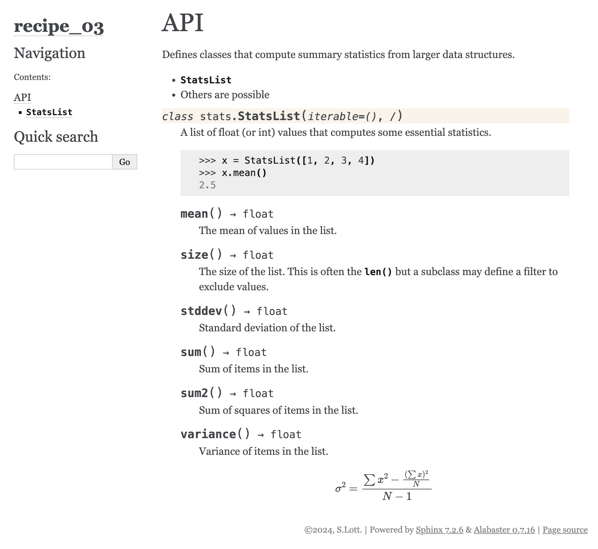

## 第十七章：17

文档和风格

我们将两个主题合并到一个章节中。它们通常被视为项目生命周期中的“额外”内容。交付的代码通常被认为是最重要的事情。

一些开发者可能会试图争辩说测试用例和文档并不是用户与之交互的代码，因此，这些额外的部分并不像代码那样重要。

这是错误的。

虽然用户确实不会直接与测试用例交互，但测试用例的存在是让人们有信心使用代码的原因。没有测试用例，就没有证据表明代码有任何有用的功能。

文档提供了可以从代码中提取的基本信息。一个拥有突出文档文件夹的项目比缺乏文档的项目更值得信赖。

代码“风格”是一个相对较小的问题。然而，它也是代码静态评估的一部分，包括类型提示分析、质量指标以及更具体的“lint”检查。有许多软件实现实践可能会令人困惑，或者依赖于文档不良的语言或库功能。这些都是软件的“模糊边缘”。lint 工具就像电烘干机中的 lint 捕集器，捕捉易燃的 lint，防止其堵塞通风口，从而预防火灾。移除软件模糊可以防止错误。在某些情况下，它可能只是减少了问题的可能性。

我们将把代码的 linting 和格式化视为与测试用例和静态类型检查一样重要的质量保证步骤。

在本章中，我们将探讨以下创建有用文档的食谱：

+   最基本的要求：一个 README.rst 文件

+   安装 Sphinx 和创建文档

+   使用 Sphinx autodoc 创建 API 参考

+   在 pyproject.toml 中识别其他 CI/CD 工具

+   使用 tox 运行全面的质量检查

# 17.1 最基本的要求：一个 README.rst 文件

在第十六章中，创建 pyproject.toml 文件 的食谱描述了如何创建一个包含 README 文件引用的 pyproject.toml 文件。

为了那个食谱的目的，我们建议该文件是对如何安装和使用项目的总结。

我们还指出，有六个基本问题：“谁？”、“什么？”、“为什么？”、“何时？”、“何地？”和“如何？”这些问题可以帮助撰写简短的引言段落来描述项目。

在编写 README 文件时，有两个常见的挑战：

+   写得太多

+   写得太少

一个好的软件包将包括一个包含详细文档的单独文档文件夹。README 文件仅是一个介绍，以及项目各种文件和文件夹的路线图。在许多情况下，当需要具体示例时，非常重要地审慎地重复文档中其他地方提供的信息，以避免矛盾。

没有 README 的项目在视觉上是有缺陷的。找到好的例子可以帮助提供指导，了解需要什么。一些开发者认为代码应该以某种方式为自己说话，并作为文档。不幸的是，代码只能有效地回答“如何？”这个问题。关于用户是谁以及软件应该如何部署的问题需要存在于软件之外的说法。

在这个菜谱中，我们将深入了解一个有用的 README 文件的特点。

## 17.1.1 准备工作

首先的一个步骤是选择用于 README 文件的标记语言。这里有三种常见的选项：

+   纯文本

+   Markdown

+   ReStructured Text (RST)

纯文本的优势在于避免了额外的格式化元素。缺点是缺乏字体变化等印刷提示，以提供重要上下文。

Markdown 标记语言的优势在于它有一组小的元素。这些元素与在文件中编写自然语言文本的许多常见实践重叠。例如，显示缩进文本时使用不同的字体，以及将带有标点符号和空格的段落视为项目符号列表项。

使用 RST 提供了一套全面的元素，涵盖了广泛的印刷细节。这是 Python 内部文档项目的首选标记语言。在某些情况下，文档文件夹可能使用 RST 构建，但 README 文件可能是纯文本。

选择没有长期后果，因为此文件本质上与项目其他文档隔离。如有疑问，扔一个三面硬币来做出选择可能会有所帮助。文件不大，修改相对容易。

## 17.1.2 如何操作...

1.  写一个介绍，或者说是引言，包含关于谁会使用这个包，为什么他们会使用它，以及它做什么的信息。在某些情况下，说明何时何地使用应用程序可能是有帮助的；这可能需要澄清客户端与服务器托管或管理员与用户角色的区别。保持简短；细节将在后面跟进。这有时被称为“电梯演讲”，因为你可以在一个办公楼的电梯里陈述它。

1.  概述软件的重要特性。这通常是一个项目符号列表。如果用户界面是一个重要特性，它可能包括屏幕截图来展示。在这里总结而不是详述所有细节是很重要的。细节应该放在单独的文档文件夹中。

1.  详细说明任何需求或依赖项。这可能包括硬件和操作系统，如果这很重要的话。必须包括任何 Python 版本限制。在库或包是另一个包或模块的插件或扩展的情况下，这可能会在 pyproject.toml 中重复依赖项。

1.  提供安装说明。通常这是下载和安装包所需的 python -m pip 命令。如果有可选功能，这些也会在这里总结。

1.  提供使用或操作的简介。这不是用户指南，但这是大多数人首先看到的内容，使用部分应提供一个整洁、清晰、可工作的示例。

    根据软件的性质，有两种不同的方法来编写这个：

    +   对于将要导入的模块和包，一个 doctest 示例是理想的。然后可以通过测试 README 来确认示例确实正确且按预期工作。

    +   对于应用程序，使用说明可能包括常见用例的逐步说明，可能还带有屏幕截图图像。

    对于一些简单的应用程序，这可能就是整个用户指南。通常情况下，它只会展示一个单一、简单的用例。

1.  提供许可证类型和链接。

1.  提供一个关于如何为项目做出贡献的部分。这可能是一个指向单独的贡献者指南文档的链接，或者可能是一个简短的说明，说明如何进行更改并提交拉取请求。

    在某些情况下，有关集成、测试和部署的信息可能在这里很有帮助。对于复杂的应用程序，构建过程可能涉及一些不明显步骤。

    这还应包括有关记录问题和提出功能请求的信息。

1.  包含对其他贡献者工作的致谢或认可也是礼貌的。这可能包括关于赞助商和资助者的信息。

## 17.1.3 它是如何工作的...

README 文件的关键成分是实际工作的命令和功能的具体示例。它展示了软件是什么，如何安装它，如何使用它，以及如何维护它。

检查流行存储库的 README 文件可以揭示一些共同特征。有一个[Make a README](https://www.makeareadme.com)网站，在需要额外指导的情况下可以帮助创建文件。

虽然其他地方可能有额外的文档，但 README 是大多数人首先阅读的内容。在某些情况下，它也是他们最后阅读的内容。因此，必须清楚地说明软件是什么以及如何使用它。

## 17.1.4 更多...

README 文件的一个常见特点是显示项目总体健康状况的徽章。这些图形摘要有多个来源。

[`shields.io`](https://shields.io)网站提供了一系列静态和动态徽章。动态徽章可以查询像 PyPI 或 GitHub 这样的服务，以发布当前状态。

在 Markdown 中，可能使用以下内容来构建徽章。

```py

```

这将显示一个带有 pypi 的小型图形徽章在左侧，以及右侧的当前 PyPI 版本号。


图 17.1：徽章示例

徽章也可以是一个链接，并提供更详细的信息。

```py
[]  (https://pypi.org/project/<name>)
```

## 17.1.5 参考信息

+   C4 模型提供了关于如何描述软件的额外帮助。请参阅[`c4model.com`](https://c4model.com)。

+   请参阅 GitHub 上的[`github.com/matiassingers/awesome-readme`](https://github.com/matiassingers/awesome-readme)项目，以获取良好的示例。

+   通过搜索“cookiecutter”仓库可以找到 cookie-cutter 模板：[GitHub 搜索](https://github.com/search?q=cookiecutter&%3Btype=Repositories&type=repositories)。这是一个相当大的列表，包含 1000 多个 cookie-cutter 模板：[`github.com/search?q=cookiecutter&%3Btype=Repositories&type=repositories`](https://github.com/search?q=cookiecutter&%3Btype=Repositories&type=repositories)。

# 17.2 安装 Sphinx 和创建文档

README 文件是软件的摘要，涉及几个关键点。适当的文档通常与 README 的重要主题平行，但更深入。

重要的辅助“如何做”指南包括两个重要主题：

+   软件做什么。这通常是对可观察特征的详细描述。

+   软件的工作原理，展示实现概念。

[C4 模型](https://c4model.com)建议在描述中包含四个抽象层级。

1.  应用程序使用的上下文。

1.  软件运行的容器。

1.  显示软件架构的组件图。

1.  显示实现细节的代码图。

这种组织方式为文档提供了必要的焦点。

我们将使用 RST 或 Markdown 格式编写。然后，Sphinx 等工具在多种目标格式中构建输出文档。

我们经常希望提供一个包含实现细节的 API 文档，这些细节是从我们模块、类、方法和函数中存在的 docstrings 中提取出来的。在第二章中，包含描述和文档食谱描述了如何向各种 Python 结构添加 docstrings。Sphinx 工具的 autodoc 扩展从 docstrings 中提取信息，以生成详细的 API 文档。

此外，Sphinx 工具使得将文档源分解成更小的文件变得容易，这些文件更容易编辑和管理。

## 17.2.1 准备工作

我们需要下载并安装 Sphinx 工具。通常，这是通过以下终端命令完成的：

```py
(cookbook3) % python -m pip install sphinx
```

使用 python -m pip 命令确保我们将使用与当前活动虚拟环境关联的 pip 命令。

有几个内置主题，以及许多第三方主题。请参阅[`sphinx-themes.org`](https://sphinx-themes.org)以获取更多主题。

## 17.2.2 如何操作...

1.  确保项目目录至少有以下子目录：

    +   源。这可能使用包的名称，或者可能被称为 src。

    +   测试，通常称为 tests。

    +   通常称为文档的文档。

1.  使用 cd 或 chdir 命令将工作目录更改为 docs 目录。从那里，运行 sphinx-quickstart 命令。

    ```py
    (cookbook3) recipe_02 % cd docs 

    (cookbook3) docs % sphinx-quickstart 

    Welcome to the Sphinx 7.2.6 quickstart utility. 

    Please enter values for the following settings (just press Enter to 

    accept a default value, if one is given in brackets).
    ```

    这将开始一个交互式对话，以收集有关您的项目详细信息，并在您的文档文件夹中生成运行 Sphinx 所需的文件。

    结果将是用于文档的几个目录和文件：

    +   conf.py 包含项目配置。

    +   index.rst 是根文档。

    +   Makefile 可用于所有其他环境来构建文档。

    +   用于 Windows 环境的 make.bat 也可以存在。

1.  编辑 index.rst 文件以编写初始摘要。这可能会从 README 文件中复制过来。

1.  运行 make html 命令来构建初始文档。这是一个在终端窗口中运行的 shell 命令。确保当前工作目录是 docs 目录。

## 17.2.3 它是如何工作的...

Sphinx 工具通过读取根文档开始处理。root_doc 配置参数命名为 index。source_suffix 配置参数设置此文件的后缀为 .rst。

通常，此文件将命名文档中的其他文件。使用 .. toctree:: 指令指定文档中的其他文件。

假设我们需要为安装、使用、维护、设计和 API 参考编写几个部分。index.rst 将包含这些作为主要内容。

```py
The recipe_02 project 

===================== 

The **recipe_02** project is an example of Sphinx documentation. 

..  toctree:: 

    :maxdepth: 2 

    :caption: Contents: 

    installation 

    usage 

    maintenance 

    design 

    api
```

由 sphinx-quickstart 工具创建的文件将在上述示例之前创建一个序言。我们已从示例中省略了它们，因为没有很好的理由去更改它们。

toctree 指令有两个参数，:maxdepth: 2 和 :caption: Contents:。这些调整指令输出的行为。

注意，指令内部的内容必须保持一致的缩进。通常初始文件将有一个三个空格的缩进。一些编辑器使用默认的四个空格缩进，因此对设置的一些更改可能会有所帮助。

toctree 体中的每个名称都指的是一个具有配置后缀的文件，在我们的例子中是 .rst。

installation.rst、usage.rst、maintenance.rst、design.rst 和 api.rst 文档必须以适当的 RST 标题行开始。初始内容可以来自笔记或 README。有关 RST 的更多信息，请参阅第二章中的使用 RST 标记编写更好的 docstrings。

api.rst 文档的内容将使用 autodoc 扩展。我们将在使用 Sphinx autodoc 创建 API 参考中查看这一点。

## 17.2.4 更多...

对于 Sphinx 有许多有用的扩展。我们将查看包括待办事项列表。

通过在 conf.py 配置文件中将 sphinx.ext.todo 添加到扩展列表中，启用一个扩展：

```py
extensions = [ 

    ’sphinx.ext.autodoc’, 

    ’sphinx.ext.todo’, 

]
```

这将为可用的标记引入两个新的指令：

+   .. todo:: 指令创建一个待办事项。

+   `..  todolist::` 指令将被所有待办事项的内容所替换。

待办事项不会产生其他输出。很容易找到它们；一些 IDE 会自动扫描文件中的 todo 字母，并将这些作为开发人员需要解决的问题列表。

通过编辑 conf.py 配置文件并添加以下行，将启用`.. todolist::`指令以包含文档中的项目：

```py
todo_include_todos = True
```

通过这种方式，待办事项从个人笔记提升为文档中的公共项目。

Sphinx 附带了一些主题，这些主题定义了要使用的样式。默认主题被称为 alabaster。可以通过在 conf.py 配置文件中的 html_theme 设置中更改到其他内置主题。

使用以下设置更改到 sphinxdoc 主题：

```py
html_theme = ’sphinxdoc’
```

许多主题都有进一步的定制选项。提供 html_theme_options 字典可以定制主题。

## 17.2.5 参见

+   有关 Sphinx 项目的详细信息，请参阅 Sphinx [`www.sphinx-doc.org/en/master/`](https://www.sphinx-doc.org/en/master/)。

+   有关一些额外的 Sphinx 主题，请参阅[`sphinx-themes.org`](https://sphinx-themes.org)。

+   查看如何从代码中构建 API 文档的使用 Sphinx autodoc 创建 API 参考。

# 17.3 使用 Sphinx autodoc 创建 API 参考

Sphinx 的一个巨大优势是能够使用 autodoc 扩展生成 API 文档。一系列命令可以从模块、类、函数和方法中提取文档字符串。有选项可以微调确切包含或排除的成员。

我们将回溯到第七章，扩展内置集合 – 做统计的列表配方。其中有一个 Statslist 类：

```py
class StatsList(list[float]): 

    def sum(self) -> float: 

        return sum(v for v in self) 

    def size(self) -> float: 

        return sum(1 for v in self) 

    def mean(self) -> float: 

        return self.sum() / self.size() 

    # etc...
```

因为这继承了列表类的方法，所以有大量的可用方法。默认情况下，只有那些带有文档字符串的方法（不包括私有方法，即以 _ 开头的方法）将被检查并包含在文档中。我们还有其他一些选择，可以选择包含在文档中的方法：

+   我们可以指定特定的方法，并且只有这些方法将被记录。

+   我们可以请求包含没有文档字符串的方法；将显示签名。

+   我们可以请求私有成员（那些以 _ 开头的）。

+   我们可以请求特殊成员（那些以两个 _ 开头的）。

+   我们可以请求继承的成员以查看超类中的成员。

我们将首先将文档字符串放入这个类定义中。一旦这项任务完成，我们就可以在文档目录中包含必要的配置和指令。

## 17.3.1 准备工作

第一步是为模块、类和方法添加文档字符串。在某些情况下，部分文档字符串已经存在，任务是将它们扩展得更完整。

例如，我们可能已经添加了以下类型的注释：

```py
class StatsList(list[float]): 

    """ 

    A list of float (or int) values that computes some essential statistics. 

    >>> x = StatsList([1, 2, 3, 4]) 

    >>> x.mean() 

    2.5 

    """ 

    def sum(self) -> float: 

        """ 

        Sum of items in the list. 

        """ 

        return sum(v for v in self)
```

这开始提供了一些有用的文档，在 API 参考中。类的文档字符串包含一个 doctest 示例，以展示其工作方式。该方法有一个文档字符串，总结了其功能。

我们需要扩展它以添加有关参数、返回值和引发的异常的详细信息。这是通过称为“字段列表”的附加语法完成的。

字段列表中的每个项都有一个名称和正文。一般语法如下：

```py
:name: body
```

Sphinx 工具定义了大量的字段列表名称，用于格式化函数或方法的文档。以下是一些最有用的：

+   :param name: 参数的描述

+   :key name: 关键字参数的描述

+   :raises exception: 异常原因的描述

+   :var name: 类内部变量的详细信息，这些变量是公开的

+   :returns: 方法或函数的返回值

这些允许编写方法的详细描述。

## 17.3.2 如何做...

1.  编辑文档字符串以包含详细信息。

    例如，我们可能想如下扩展方法定义：

    ```py
            def sum(self) -> float: 

                """ 

                Computes the sum of items in the list. 

                :returns: sum of the items. 

                """ 

                return sum(v for v in self)
    ```

    对于这样一个简单的函数，字段列表中的:returns:部分似乎有些冗余。

1.  编辑 conf.py 文件，将’sphinx.ext.autodoc’字符串添加到扩展列表中：

    ```py
    extensions = [ 

        ’sphinx.ext.autodoc’ 

    ]
    ```

1.  在 conf.py 配置文件中将 src 目录添加到 sys.path：

    ```py
    import sys 

    sys.path.append(’../src’)
    ```

    这之所以有效，是因为 conf.py 文件是一个 Python 模块，可以执行任何 Python 语句。将 src 目录添加到路径意味着 Sphinx 可以导入该模块。

1.  在 api.rst 文档中放入以下指令。

    ```py
    ..  automodule:: stats 

        :undoc-members:
    ```

    这将导入模块，提取文档字符串，然后尝试为所有成员创建文档，包括那些尚未有文档字符串的成员。

Sphinx 快速入门创建了一个 Makefile，以帮助从源材料构建最终的 PDF 或 HTML 文件；有关更多信息，请参阅安装 Sphinx 和创建文档配方。在文档目录中运行 make html shell 命令，构建目录将包含项目的静态网站。

## 17.3.3 它是如何工作的...

从文档字符串中提取详细文档的检查始于 Python 语言的巧妙特性：文档字符串。RST 标记的规则继续走向优雅的文档。生成的 Sphinx 页面看起来像这样：



图 17.2：Sphinx 输出示例

注意 variance()方法包含一个..  math::指令，其中包含有关计算方式的详细信息。这需要一些小心，因为 LaTeXmath 语法涉及相当多的\字符。

在文档字符串中处理 LaTeXmath 有两种方式：

+   使用“原始”字符串字面量和单个\：

    ```py
    r""" 

    A docstring with :math:‘\alpha \times \beta‘ 

    """
    ```

    这意味着不能使用其他转义字符。这可能会阻止使用 Unicode 字符，例如。

+   使用\来转义\的特殊含义：

    ```py
    """ 

    A docstring with :math:‘\\alpha \\times \\beta‘ 

    """
    ```

    这允许在文档字符串中包含 Unicode 转义序列，如\N{黑桃}。

在这两种情况下，请注意，RST 使用反引号 ` 包围具有角色的内容，如 :math:。

## 17.3.4 更多...

对另一个类、模块或方法的交叉引用使用 :role:‘value’ 语法。:role: 部分是特定类型的引用，有助于区分模块、类和函数。值是在文档中某处有定义指令的名称。

交叉引用将生成适当格式化的文本，并带有指向名称定义的超文本链接。

这里有一个例子：

```py
Uses the :py:class:‘~stats.StatsList‘ class in the :py:mod:‘stats‘ module.
```

:py:class:‘~stats.StatsList’ 的作用是创建一个指向 StatsList 类定义的类引用。在名称中使用 ~ 的意思是只显示名称的最后一层。生成正确的类引用需要完整的路径。:py:mod:‘stats’ 引用是 :py:mod: 的作用，并命名了 stats 模块。

## 17.3.5 参见

+   参见 安装 Sphinx 和创建文档 以获取有关 Sphinx 的更多信息。

+   参见第七章，扩展内置集合 – 一个用于统计的列表 的配方，了解这个例子所围绕的示例。

+   参见第二章，包含描述和文档 的配方，以获取有关 docstrings 的更多信息。

# 17.4 在 pyproject.toml 中识别其他 CI/CD 工具

连续集成 (CI) 和连续部署 (CD) 这些术语通常用来描述发布 Python 包供他人使用的流程。对集成和部署进行一系列质量检查的想法是良好软件工程的核心。运行测试套件是确认软件适合预期用途的许多方法之一。

可能包括额外的工具，如 memray，用于检查内存资源的使用。像 ruff 这样的工具也是一个有效的代码检查器。

在第十六章，创建 pyproject.toml 文件 的配方中，以及在第十五章，结合 unittest 和 doctest 测试 的配方中，都讨论了在安装项目所需的依赖项之外定义测试工具。

这表明存在多个要求层（也称为依赖项）：

+   首次安装应用程序所需的条件。在本书中，这包括 pydantic、beautifulsoup4、jupyterlab 和 matplotlib 等项目。

+   适用于特殊功能、插件或扩展的可选要求。这些不是安装项目的必需条件。它们在配置文件中命名，并在软件使用时应用。例如，pydantic 包有一个可选的电子邮件地址验证器。如果您的应用程序需要这个功能，它需要作为依赖项的一部分命名。

+   运行测试套件的要求。大部分情况下，这是 pytest 和 mypy。虽然这并没有被强调，但本书中示例的单元测试案例都使用了 tox 进行测试自动化。

+   开发所需的软件包和工具。这包括像 memray 和 sphinx 这样的工具。像 ruff 或 black 这样的工具可能也是这些要求的一部分。

依赖项信息用于正确安装软件。它还用于创建协作的开发环境。Python 的软件包生态系统处于不断变化的状态。

记录软件包测试的版本是至关重要的。这个细节使得工具如 PIP 能够在虚拟环境中下载和安装所需的组件。

## 17.4.1 准备工作

第一步是创建基础 pyproject.toml 文件。参见第十六章中的 Creating a pyproject.toml file 菜单，其中包含与此密切相关的另一个菜谱。这应该在 [project] 表中有一个依赖项。它可能看起来是这样的：

```py
[project] 

    # details omitted 

dependencies = [ 

    "pydantic", 

    "beautifulsoup4", 

    "types-beautifulsoup4", 

    "jupyterlab", 

    "matplotlib" 

]
```

当使用 Poetry 时，这个信息以略微不同的格式。信息放在 [tool.poetry.dependencies] 表中。我们通常会使用 poetry add 命令行工具来构建这个信息。

注意，Poetry 命令提供了一些额外的语法：

```py
% poetry add pydantic@².6.0
```

^ 前缀是一个复杂的规则，允许对次要版本号或补丁级别使用更大的版本号。它不允许对最左侧的主版本号，在这个例子中的 2，进行任何更改。这意味着任何 2.6.0 或更高版本的 Pydantic 都将被考虑。高于 3.x 的版本则不考虑。

## 17.4.2 如何做...

1.  在名为 [project.optional-dependencies] 的表中添加测试依赖项。这将是一个名为 test 的列表。它看起来是这样的：

    ```py
    [project.optional-dependencies] 

    test = [ 

        "tox", 

        "pytest", 

        "mypy" 

    ]
    ```

    这个 test 名称可以被 pip-compile 用于构建详细的 requirements-test.txt，用于测试工具。

    当使用 Poetry 时，这个可选依赖项组位于不同的表中。我们使用 --group 选项来指定组。

    命令行看起来会是这样：

    ```py
    % poetry add tox@⁴.0 --group test
    ```

1.  在名为 [project.optional-dependencies] 的表中添加开发依赖项。通常使用 dev 这个名称。它看起来是这样的：

    ```py
    [project.optional-dependencies] 

    dev = [ 

        "ruff", 

        "pip-tools", 

        "memray" 

    ]
    ```

    这个 dev 名称可以被 pip-compile 用于构建整个工具套件以及基础依赖项的详细 requirements-dev.txt。

    当使用 Poetry 时，--group 选项指定组。一个添加命令可能包括 --group dev 以将项目添加到 dev 组。

## 17.4.3 它是如何工作的...

目标是在 pyproject.toml 文件中提供范围和模式，以提供版本标识的灵活性。单独的 requirements*.txt 文件记录了当前发布版使用的特定版本号。这种通用-特定区分支持复杂软件包的集成和重用。

## 17.4.4 更多...

当使用像 tox 这样的工具时，我们可以创建多个虚拟环境，以使用依赖项的不同变体来测试我们的软件。

软件包安装通常使用具有特定版本标识的 requirements.txt 文件。另一方面，开发工作可能涉及多个替代虚拟环境。

我们可以使用 pip-compile 等工具创建包的混合，以允许在多个替代虚拟环境中进行测试。有关更多信息，请参阅[分层需求工作流程](https://pip-tools.readthedocs.io/en/latest/)。

我们通常会创建一个 base-requirements.in 文件来定义所有虚拟环境中的共同需求。有关更多信息，请参阅第十六章，依赖项和虚拟环境。这通常是一个所需软件包的简单列表：

```py
# requirements.in 

this_package 

sphinx
```

这提供了项目独有的基本包集。

然后，我们可以为各种测试环境创建 layered-requirements-dev_x.in 文件。这些文件中的每一个都将包括基础层 requirements.txt 和一组额外的约束。文件可能看起来像这样：

```py
# requirements_dev_x.in 

# Anticipation of new release. See ... for details. 

-c requirements.txt 

some_package>2.6.1
```

我们包含了一条注释，说明了为什么需要这个独特的发展虚拟环境。这些原因经常变化，留下关于为什么特定环境有帮助的提醒是有帮助的。

在 tox.ini 文件中，pip-sync 命令将为测试构建一个独立的虚拟环境。我们将在使用 tox 运行全面质量检查的菜谱中查看这一点。

## 17.4.5 参见

+   在第十六章中，创建 pyproject.toml 文件的菜谱展示了如何开始一个 pyproject.toml 文件。

+   有关使用 tox 工具运行测试套件的更多信息，请参阅使用 tox 运行全面质量检查。

# 17.5 使用 tox 运行全面质量检查

当我们开始使用多个 CI/CD 工具时，确保所有工具都一致使用至关重要。虚拟环境也必须一致构建。

传统上，当源文件被修改时，使用像 make 这样的工具来重建目标文件。这需要极大的谨慎，因为 Python 并不适合 make 的编译器中心模型。

如 tox 和 nox 这样的工具对于在 Python 代码上运行全面的测试和 CI/CD 工具序列非常有帮助。

## 17.5.1 准备工作

对于谨慎的软件开发，各种工具都可能很有用：

单元测试：我们可以使用内置的 doctest 或 unittest 模块。我们还可以使用像 pytest 这样的工具来查找和运行测试套件。

基准测试：也称为性能测试。pytest-benchmark 项目提供了一个方便的 fixture，以确保性能符合预期。

接受测试：像 behave 或 pytest-bdd 插件这样的工具可以通过在 Gherkin 中声明接受测试用例来帮助，使产品所有者更容易理解。

类型提示检查：这通常由 mypy、pyre、pyright 或 pytype 等工具处理。

检查：虽然“linting”这个术语很常见，但这实际上更好的称呼是“lint blocking”。有众多工具，包括 ruff、pylint、flake8 和 pylama。

样式和格式：为此，有两个流行的工具，即 ruff 和 black。

文档：这通常使用 Sphinx 构建。

这意味着我们需要安装所选的工具套件。一个额外的工具可以帮助找到所有工具并将它们绑定成可用的形式。tox 工具可以在多个虚拟环境中创建和运行测试。

我们需要下载并安装 tox 工具。通常，这是通过以下终端命令完成的：

```py
(cookbook3) % python -m pip install tox
```

使用 python -m pip 命令确保我们将使用与当前活动虚拟环境关联的 pip 命令。

## 17.5.2 如何操作...

1.  有两种方式为 tox 提供配置文件。我们可以将配置嵌入到 pyproject.toml 中。虽然这符合文件的理念，但 tox 工具不处理 TOML 选项。它依赖于在 TOML 文件中的具有 INI 格式选项的字符串。

    更好的替代方案是创建一个单独的 tox.ini 文件。在这个文件中，创建一个包含核心配置选项的初始 [tox] 表。以下对于许多项目都是合适的：

    ```py
    [tox] 

    description = "Your project name goes here." 

    min_version = 4.0
    ```

1.  对于不需要安装的应用或脚本，以下两行是合适的，以避免尝试准备和安装包：

    ```py
    skip_sdist = true 

    no_package = true
    ```

    对于将要分发和安装的包，无需添加任何内容。

1.  创建一个包含关于测试环境一般信息的 [testenv] 表。在某些情况下，一个环境就足够了。当需要多个不同的环境时，将会有多个 [testenv] 部分。

    ```py
    [testenv]
    ```

1.  在这个 [testenv] 表内，deps= 的值列出了将要使用的测试工具。它可能看起来像这样：

    ```py
    deps = 

        pytest>=7 

        pip-tools 

        ruff>=0.1.4 

        mypy>=1.7
    ```

    tox 工具使用 pip 命令构建 deps 部分中列出的项目。当然，它可以用来安装所有需求。使用 -r requirements.txt 将这样做。

    使用 pip-sync 工具效率更高一些，因为它可以避免重新安装环境中已经存在的任何依赖。当使用 pip-sync 时，我们不在 deps= 列表中使用 -r requirements.txt。

1.  如果使用 pip-sync 安装需求，这将以 commands_pre= 的值给出：

    ```py
    commands_pre = pip-sync requirements.txt
    ```

1.  如果需要任何独特的环境变量，它们将通过 setenv= 的值设置：

    ```py
    setenv = 

        PYTHONPATH=src/ch03
    ```

1.  最后，提供要执行的命令序列：

    ```py
    commands = 

        pytest --doctest-glob=’*.txt’ src 

        ruff format src 

        ruff check src 

        mypy --strict src
    ```

1.  关闭此文件后，使用以下命令运行测试套件：

    ```py
    (cookbook3) % tox
    ```

## 17.5.3 它是如何工作的...

在像 tox 这样的工具中，内置了许多假设和默认值。这使我们免于编写复杂的 shell 脚本或调整 makefile 中存在的假设。相反，我们可以提供几行配置和一系列命令。

理想情况下，使用 tox 总是看起来像这样：

```py
(cookbook3) % tox 

... details omitted 

  congratulations :) (4.09 seconds)
```

最后的祝贺是一个恰当的总结。

## 17.5.4 更多...

在许多情况下，一个项目有多个虚拟环境。虚拟环境使用扩展名称来区分。这些将具有 [testenv:name] 的一般模式，其中 name 是某种描述性的内容。

在配置的 [tox] 部分，env_list 列出了要自动处理的虚拟环境。未列出的环境可以通过在 tox 命令中使用 -e 选项手动执行。

要测试其他版本的 Python，我们将在 tox.ini 文件中添加以下内容：

```py
[testenv:py311] 

    base_python = py311
```

这将继承 master testenv 设置的详细信息。通过应用覆盖，将基本 Python 版本更改为 3.11。

py311 名称是针对较长的指定（如 python>=3.11）的便捷 tox 简写。工具将在系统范围内的 PATH 中搜索候选 Python 实现。要测试多个 Python 版本，它们都需要安装在 PATH 中命名的目录中。

## 17.5.5 参见

+   查看 pyproject.toml 中识别其他 CI/CD 工具。

+   查看 15 章节了解更多关于测试的信息。

+   查看 16 章节了解有关虚拟环境的食谱。

+   查看更多关于 tox 工具的信息，请访问 [`tox.wiki/en/latest/`](https://tox.wiki/en/latest/)。

+   查看关于 nox 工具的信息，它提供了类似的功能，请访问 [`nox.thea.codes/en/stable/`](https://nox.thea.codes/en/stable/)。

# 加入我们的社区 Discord 空间。

加入我们的 Python Discord 工作空间，讨论并了解更多关于本书的信息：[`packt.link/dHrHU`](https://packt.link/dHrHU)。


[www.packt.com](https://www.packt.com)

订阅我们的在线数字图书馆，全面访问超过 7,000 本书和视频，以及帮助您规划个人发展和提升职业的业界领先工具。更多信息，请访问我们的网站。

# 为什么订阅？

[nosep]使用来自 4,000 多位行业专业人士的实用电子书和视频，节省学习时间，多花时间编码。通过为您量身定制的技能计划提高学习效果。每月免费获得一本电子书或视频。内容可全文搜索，便于快速访问关键信息。可复制粘贴、打印和添加书签。

您知道 Packt 为每本书都提供电子书版本，包括 PDF 和 ePub 文件吗？您可以在 packt.com 升级到电子书版本，作为印刷书客户，您有权获得电子书副本的折扣。有关更多详情，请联系我们 customercare@packtpub.com。

在 [www.packt.com](https://www.packt.com) 上，您还可以阅读一系列免费的技术文章，订阅各种免费通讯，并享受 Packt 书籍和电子书的独家折扣和优惠。
