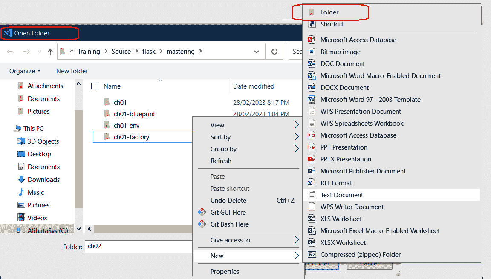
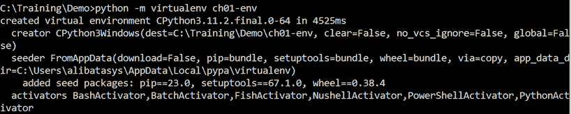
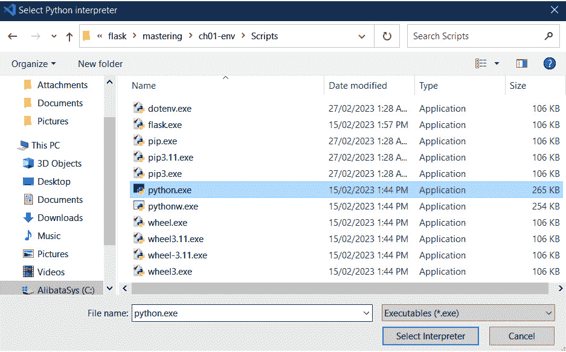
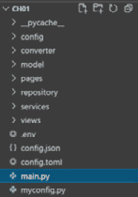
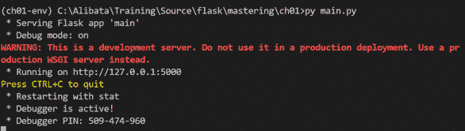

# 第二章：<st c="0">1</st>

# <st c="2">深入探讨 Flask 框架</st>

**<st c="38">Flask</st>** <st c="44">是一个</st> **<st c="50">Python</st>** <st c="56">Web 框架，由 Armin Ronacher 创建，旨在解决需要快速开发方法的基于 Web 和 API 相关的</st> <st c="145">需求。</st> <st c="199">它是一个轻量级框架，具有辅助类和方法、内置服务器、调试器和重新加载器，这些都是构建可扩展 Web 应用程序和</st> <st c="378">Web 服务所必需的。</st>

<st c="391">与 Django 框架不同，Flask 更为简约和精简，因为它需要更多的 Python 使用经验来制作各种编码技巧和解决方案以实现其组件。</st> <st c="587">它比全栈的 Django 更具开放性和可扩展性，Django 因其易于构建的项目和可重用组件而更适合新手。</st>

<st c="748">本章将展示涵盖 Flask 3.x 初始组件和基础功能的必要任务流程，这些功能对于启动我们的</st> <st c="915">Web 开发至关重要。</st>

<st c="931">在本章中，我们将涵盖以下</st> <st c="977">开发任务：</st>

+   <st c="995">设置</st> <st c="1011">项目基线</st>

+   <st c="1027">创建路由</st> <st c="1044">和导航</st>

+   <st c="1059">管理请求和</st> <st c="1086">响应数据</st>

+   <st c="1099">实现</st> <st c="1113">视图模板</st>

+   <st c="1127">创建</st> <st c="1137">Web 表单</st>

+   <st c="1146">使用 PostgreSQL 构建数据层</st> <st c="1171">。</st>

+   <st c="1186">管理项目结构</st>

# <st c="1217">技术要求</st>

<st c="1240">第一章将专注于构建一个</st> *<st c="1301">在线个人咨询系统</st>* <st c="1334">的原型，该系统模拟患者与咨询师之间的面对面咨询，同时突出显示</st> *<st c="1454">Flask 3.x</st>*<st c="1463">的基础组件。</st> <st c="1558">该应用程序将涵盖用户管理、问卷和一些报告等模块。</st> <st c="1558">本章的代码可以在</st> <st c="1597">[`github.com/PacktPublishing/Mastering-Flask-Web-Development/tree/main/ch01`](https://github.com/PacktPublishing/Mastering-Flask-Web-Development/tree/main/ch01)<st c="1681">找到。</st>

# <st c="1682">设置项目基线</st>

<st c="1714">收集和研究</st> <st c="1741">提议项目的开发环境系统需求是至关重要的。</st> <st c="1833">这些需求包括安装程序和库的正确版本、适当的服务器以及包含其他必要依赖项。</st> <st c="1998">在启动我们的项目之前，我们必须进行各种设置。</st> <st c="2051">。</st>

## <st c="2064">安装最新版本的 Python</st>

<st c="2101">我们所有的应用程序都将</st> <st c="2131">在</st> *<st c="2139">Python 11</st> *<st c="2148">环境中运行，以实现更快的性能。</st> <st c="2185">适用于所有操作系统的最新 Python 安装程序可在</st> <st c="2253">以下位置获取</st> [<st c="2256">https://www.python.org/downloads/</st>](https://www.python.org/downloads/)<st c="2289">。</st>

## <st c="2290">安装 Visual Studio (VS) Code 编辑器</st>

<st c="2336">Django 框架有一个</st> `<st c="2364">django-admin</st>` <st c="2376">命令可以生成项目结构，但 Flask 没有这个功能。</st> <st c="2435">我们可以使用终端控制台或像</st> **<st c="2503">Visual Studio</st>** <st c="2516">(**<st c="2518">VS</st>**<st c="2520">)** <st c="2523">Code</st>** <st c="2527">编辑器这样的工具来帮助开发者创建 Flask 项目。</st> <st c="2584">VS Code 安装程序可在</st> <st c="2619">以下位置获取</st> [<st c="2622">https://code.visualstudio.com/download</st>](https://code.visualstudio.com/download)<st c="2660">。</st>

<st c="2661">在安装了 VS Code 编辑器之后，我们可以通过它创建一个文件系统文件夹并启动一个 Flask 项目。</st> <st c="2771">要创建文件夹，我们应该前往</st> **<st c="2813">打开文件夹</st>** <st c="2824">选项，位于</st> **<st c="2838">文件</st>** <st c="2842">下，或者使用</st> *<st c="2854">Ctrl</st> *<st c="2858">+<st c="2861">K</st> *<st c="2862">+<st c="2865">O</st> *<st c="2866">快捷键来打开</st> **<st c="2888">打开文件夹</st>** <st c="2899">迷你窗口。</st> *<st c="2913">图 1.1</st>**<st c="2921">.1</st>* <st c="2923">展示了使用</st> <st c="2981">编辑器创建 Flask 项目的示例过程：</st>



<st c="3923">图 1.1 – 使用 VS Code 编辑器创建 Flask 项目文件夹</st>

## <st c="3992">创建虚拟环境</st>

<st c="4025">开发 Flask 项目的另一个方面是拥有一个</st> <st c="4083">称为</st> **<st c="4103">虚拟环境</st>** <st c="4122">的仓库，可以存放其库。</st> <st c="4152">这是一个机制或工具，可以通过隔离这些依赖项从全局仓库和其他项目</st> <st c="4302">依赖项中，来管理项目的所有依赖项。</st> <st c="4317">以下是在开发基于</st> <st c="4383">Flask 的应用程序时使用此工具的优势：</st>

+   <st c="4408">它可以避免损坏的模块版本，以及与其他现有类似的全局</st> <st c="4495">仓库库的冲突。</st>

+   <st c="4516">它可以帮助为</st> <st c="4557">项目构建依赖树。</st>

+   <st c="4569">它可以帮助简化将应用程序与库部署到物理和</st> <st c="4654">基于云的服务器。</st>

<st c="4674">需要一个名为</st> `<st c="4700">virtualenv</st>` <st c="4710">的 Python 扩展来设置这些虚拟环境。</st> <st c="4761">要安装扩展，请在</st> <st c="4816">终端</st> <st c="4816">中运行以下命令：</st>

```py
 pip install virtualenv
```

<st c="4852">安装完成后，我们需要运行</st> `<st c="4893">python virtualenv -m ch01-01</st>` <st c="4921">来为我们的 Flask 项目创建第一个虚拟环境。</st> *<st c="4985">图 1</st>**<st c="4993">.2</st>* <st c="4995">显示了创建我们的</st> `<st c="5029">ch01-env</st>` <st c="5037">存储库的快照：</st>



<st c="5289">图 1.2 – 创建虚拟环境</st>

<st c="5332">下一步是打开</st> <st c="5361">项目并将其链接到为其创建的虚拟环境。</st> <st c="5425">在 VS Code 中按</st> *<st c="5434">Ctrl</st>* <st c="5438">+</st> *<st c="5441">Shift</st>* <st c="5446">+</st> *<st c="5449">P</st>* <st c="5450">将打开</st> `<st c="5522">Python: Select Interpreter</st>`<st c="5548">。点击此选项将带您到</st> `<st c="5730">Python.exe</st>` <st c="5740">文件所在的</st> `<st c="5753">/Scripts</st>` <st c="5761">文件夹。</st> *<st c="5770">图 1</st>**<st c="5778">.3</st>* <st c="5780">显示了在存储库的</st> `<st c="5853">/</st>``<st c="5854">Scripts</st>` <st c="5861">文件夹中定位 Python 解释器的快照：</st>



<st c="6759">图 1.3 – 定位虚拟环境的 Python 解释器</st>

<st c="6830">之后，必须激活虚拟环境才能让项目使用它。</st> <st c="6915">您必须在 Windows 中运行</st> `<st c="6928">/Scripts/activate.bat</st>` <st c="6949">或在 Linux 中通过编辑器的内部</st> <st c="7017">控制台</st> <st c="7026">运行</st> `<st c="6964">/bin/activate</st>` <st c="6977">。</st> <st c="7026">激活后，终端的提示符应显示虚拟环境名称（例如，</st> `<st c="7132">(</st>``<st c="7133">ch01-env) C:\</st>`<st c="7146">）。</st>

## <st c="7149">安装 Flask 3.x 库</st>

<st c="7184">VS Code 的集成</st> <st c="7200">终端将在右键点击编辑器中的资源管理器部分后出现，这将导致</st> `<st c="7497">pip</st>` `<st c="7501">install flask</st>`<st c="7514">.</st>

<st c="7515">一旦所有要求都满足，我们就可以创建我们的</st> <st c="7583">基线应用程序</st>。

## <st c="7604">创建 Flask 项目</st>

<st c="7631">必须在主项目文件夹中（即，</st> `<st c="7714">ch01</st>`<st c="7718">）实现第一个组件，该组件是应用程序文件，可以是</st> `<st c="7759">main.py</st>` <st c="7766">或</st> <st c="7769">有时</st> `<st c="7780">app.py</st>`<st c="7786">。此组件将成为服务器启动时 Flask 识别的顶级模块。</st> <st c="7885">以下是我们的</st> *<st c="7931">在线个人咨询</st> * *<st c="7958">系统</st> * <st c="7964">原型</st> 的基本应用程序文件：</st>

```py
<st c="7975">from flask import Flask</st>
<st c="7999">app = Flask(__name__)</st> @app.route('/', methods = ['GET'])
def index():
    return "This is an online … counseling system (OPCS)" <st c="8233">main.py</st> file:

				*   <st c="8246">An imported</st> `<st c="8259">Flask</st>` <st c="8264">class from the</st> `<st c="8280">flask</st>` <st c="8285">package plays a considerable role in building the application.</st> <st c="8349">This class provides all the utilities that implement the</st> `<st c="8708">Flask</st>` <st c="8713">instance is the main element in building a</st> **<st c="8757">Web Server Gateway Interface</st>** <st c="8785">(</st>**<st c="8787">WSGI</st>**<st c="8791">)-compliant</st> <st c="8804">application.</st>

			<st c="8816">Werkzeug</st>
			`<st c="8825">Werkzeug</st>` <st c="8834">is a WSGI-based library</st> <st c="8859">or module that provides Flask with the necessary utilities, including a built-in server, for running</st> <st c="8960">WSGI-based applications.</st>

				*   <st c="8984">The imported</st> `<st c="8998">Flask</st>` <st c="9003">instance must be instantiated once per application.</st> <st c="9056">The</st> `<st c="9060">__name__</st>` <st c="9068">argument must be passed to its constructor to provide</st> `<st c="9123">Flask</st>` <st c="9128">with a reference to the main module without explicitly setting its actual package.</st> <st c="9212">Its purpose is to provide Flask with the reach it needs in providing the utilities across the application and to register the components of the project to</st> <st c="9367">the framework.</st>
				*   <st c="9381">The</st> `<st c="9386">if</st>` <st c="9388">statement tells the Python interpreter to run Werkzeug’s built-in development server if the module is</st> `<st c="9491">main.py</st>`<st c="9498">. This line validates the</st> `<st c="9524">main.py</st>` <st c="9531">module as the top-level module of</st> <st c="9566">the project.</st>
				*   `<st c="9578">app.run()</st>` <st c="9588">calls and starts the built-in development server of Werkzeug.</st> <st c="9651">Setting its</st> `<st c="9663">debug</st>` <st c="9668">parameter to</st> `<st c="9682">True</st>` <st c="9686">sets development or debug mode and enables Werkzeug’s debugger tool and automatic reloading.</st> <st c="9780">Another way is to create a configuration file that will set</st> `<st c="9840">FLASK_DEBUG</st>` <st c="9851">to</st> `<st c="9855">True</st>`<st c="9859">. We can also set development mode by running</st> `<st c="9905">main.py</st>` <st c="9912">using the</st> `<st c="9923">flask run</st>` <st c="9932">command with the</st> `<st c="9950">--debug</st>` <st c="9957">option.</st> <st c="9966">Other configuration approaches before Flask 3.0, such as using</st> `<st c="10029">FLASK_ENV</st>`<st c="10038">, are</st> <st c="10044">already deprecated.</st>

			<st c="10063">Running the</st> `<st c="10076">python main.py</st>` <st c="10090">command on the VS Code terminal will start the built-in development server and run our application.</st> <st c="10191">A server log will be displayed on the console with details that include the development mode, the debugger ID, and the</st> `<st c="10343">5000</st>`<st c="10347">, while the host</st> <st c="10364">is</st> `<st c="10367">localhost</st>`<st c="10376">.</st>
			<st c="10377">Now, it is time to explore the view functions of our Flask application.</st> <st c="10450">These are the components that manage</st> <st c="10487">the incoming requests and</st> <st c="10513">outgoing responses.</st>
			<st c="10532">Creating routes and navigations</st>
			**<st c="10564">Routing</st>** <st c="10572">is a mapping of</st> <st c="10588">URL pattern(s) and other related details to a view function that’s done using Flask’s route decorators.</st> <st c="10693">On the other hand, the view function is a transaction that processes an incoming request from the clients and, at the same time, returns the necessary response to them.</st> <st c="10862">It follows a life cycle and returns an HTTP status as part of</st> <st c="10924">its response.</st>
			<st c="10937">There are different approaches to assigning URL patterns to view functions.</st> <st c="11014">These include creating static and dynamic URL patterns, mapping URLs externally, and mapping multiple URLs to a</st> <st c="11126">view function.</st>
			<st c="11140">Creating static URLs</st>
			<st c="11161">Flask has several built-in route</st> <st c="11194">decorators that implement some of its components, and</st> `<st c="11249">@route</st>` <st c="11255">decorator is one of these.</st> `<st c="11283">@route</st>` <st c="11289">directly maps the URL address to the view function seamlessly.</st> <st c="11353">For instance,</st> `<st c="11367">@route</st>` <st c="11373">maps the</st> `<st c="11383">index()</st>` <st c="11390">view function presented in the project’s</st> `<st c="11432">main.py</st>` <st c="11439">file to the root URL or</st> `<st c="11464">/</st>`<st c="11465">, which makes</st> `<st c="11479">index()</st>` <st c="11486">the view function of the</st> <st c="11512">root URL.</st>
			<st c="11521">But</st> `<st c="11526">@route</st>` <st c="11532">can map any valid URL pattern to any view function.</st> <st c="11585">A URL pattern is accepted if it follows the following</st> <st c="11639">best practices:</st>

				*   <st c="11654">All characters must be</st> <st c="11678">in lowercase.</st>
				*   <st c="11691">Use only forward slashes to establish</st> <st c="11730">site hierarchy.</st>
				*   <st c="11745">URL names must be concise, clear, and within the</st> <st c="11795">business context.</st>
				*   <st c="11812">Avoid spaces and special symbols and characters as much</st> <st c="11869">as possible.</st>

			<st c="11881">The following</st> `<st c="11896">home()</st>` <st c="11902">view function renders an introductory page of our</st> `<st c="11953">ch01</st>` <st c="11957">application and uses the URL pattern of</st> `<st c="11998">/home</st>` <st c="12003">for</st> <st c="12008">its access:</st>

```

<st c="12019">@app.route('/home')</st>

<st c="12039">def home():</st> return '''

    <html><head><title>Online Personal … System</title>

        </head><body>

        <h1>Online … Counseling System (OPCS)</h1>

        <p>这是一个基于网络的咨询

            application where counselors can … … …</em>

        </body></html>

    '''

```py

			<st c="12282">Now, Flask accepts simple URLs such as</st> `<st c="12322">/home</st>` <st c="12327">or complex ones with slashes and path-like hierarchy, including</st> <st c="12391">these</st> <st c="12398">multiple URLs.</st>
			<st c="12412">Assigning multiple URLs</st>
			<st c="12436">A view function can have a</st> <st c="12464">stack of</st> `<st c="12473">@route</st>` <st c="12479">decorators annotated on it.</st> <st c="12508">Flask allows us to map these valid multiple URLs if there is no conflict with other view functions and within that stack of</st> `<st c="12632">@route</st>` <st c="12638">mappings.</st> <st c="12649">The following version of the</st> `<st c="12678">home()</st>` <st c="12684">view function now has three URLs, which means any of these addresses can render the</st> <st c="12769">home page:</st>

```

<st c="12779">@app.route('/home')</st>

<st c="12799">@app.route('/information')</st>

<st c="12826">@app.route('/introduction')</st>

<st c="12854">def home():</st> return '''<html><head>

            <title>Online Personal … System</title>

        </head><body>

        <h1>Online … Counseling System (OPCS)</h1>

            … … … … …

        </body></html>

    '''

```py

			<st c="13015">Aside from complex URLs, Flask is</st> <st c="13050">also capable of creating</st> *<st c="13075">dynamic routes</st>*<st c="13089">.</st>
			<st c="13090">Applying path variables</st>
			<st c="13114">Adding path variables makes a URL</st> <st c="13149">dynamic and changeable depending on the variations of the values passed to it.</st> <st c="13228">Although some SEO experts may disagree with having dynamic URLs, the Flask framework can allow view functions with changeable URL patterns to</st> <st c="13370">be implemented.</st>
			<st c="13385">In Flask, a path variable is declared inside a diamond operator (</st>`<st c="13451"><></st>`<st c="13454">) and placed within the URL path.</st> <st c="13489">The following view function has a dynamic URL with several</st> <st c="13548">path variables:</st>

```

<st c="13563">@app.route('/exam/passers/list/<float:rate>/<uuid:docId>')</st> def report_exam_passers(<st c="13647">rating:float, docId:uuid4 = None</st>):

    exams = list_passing_scores(<st c="13712">rating</st>)

    response = make_response(

    render_template('exam/list_exam_passers.html',

        exams=exams, docId=<st c="13814">docId</st>), 200)

    return response

```py

			<st c="13844">As we can see, path variables are identified with data types inside the diamond operator (</st>`<st c="13935"><></st>`<st c="13938">) using the</st> `<st c="13951"><type:variable></st>` <st c="13966">pattern.</st> <st c="13976">These parameters are set to</st> `<st c="14004">None</st>` <st c="14008">if the path variables are optional.</st> <st c="14045">The path variable is considered a string type by default if it has no associated type hint.</st> *<st c="14137">Flask 3.x</st>* <st c="14146">offers these built-in data types for</st> <st c="14184">path variables:</st>

				*   **<st c="14199">string</st>**<st c="14206">: Allows all valid characters except</st> <st c="14244">for slashes.</st>
				*   **<st c="14256">int</st>**<st c="14260">: Takes</st> <st c="14269">integer values.</st>
				*   **<st c="14284">float</st>**<st c="14290">: Accepts</st> <st c="14301">real numbers.</st>
				*   **<st c="14314">uuid</st>**<st c="14319">: Takes unique 32 hexadecimal digits that are used to identify or represent records, documents, hardware gadgets, software licenses, and</st> <st c="14457">other information.</st>
				*   **<st c="14475">path</st>**<st c="14480">: Fetches characters,</st> <st c="14503">including slashes.</st>

			<st c="14521">These path variables can’t function</st> <st c="14558">without the corresponding parameters of the same name and type declared in the view function’s parameter list.</st> <st c="14669">In the previous</st> `<st c="14685">report_exam_passers()</st>` <st c="14706">view function, the local</st> `<st c="14732">rating</st>` <st c="14738">and</st> `<st c="14743">docId</st>` <st c="14748">parameters are the variables that will hold the values of the path</st> <st c="14816">variables, respectively.</st>
			<st c="14840">But there are particular or rare cases where path variables should be of a type different than the supported ones.</st> <st c="14956">View functions with path variables declared as</st> `<st c="15003">list</st>`<st c="15007">,</st> `<st c="15009">set</st>`<st c="15012">,</st> `<st c="15014">date</st>`<st c="15018">, or</st> `<st c="15023">time</st>` <st c="15027">will throw</st> `<st c="15039">Status Code 500</st>` <st c="15054">in Flask.</st> <st c="15065">As a workaround, the Werkzeug bundle of libraries offers a</st> `<st c="15124">BaseConverter</st>` <st c="15137">utility class that can help customize a variable type for paths that allows other types to be part of the type hints.</st> <st c="15256">The following view function requires a</st> `<st c="15295">date</st>` <st c="15299">type hint to generate a certificate in</st> <st c="15339">HTML format:</st>

```

<st c="15351">@app.route('/certificate/accomp/<string:name>/</st><st c="15398"><string:course>/<date:accomplished_date>')</st> def show_certification(<st c="15465">name:str, course:str, accomplished_date:date</st>):

    certificate = """<html><head>

        <title>Certificate of Accomplishment</title>

        </head><body>

        <h1>成就证书</h1>

        <p>参与者 {} 被授予此成就证书，在 {} 课程于 {} 日期通过所有考试。他/她证明了自己为未来的任何努力都做好了准备。</em>

        </body></html>

    """.format(<st c="15860">name, course, accomplished_date</st>)

    return certificate, 200

```py

			`<st c="15918">accomplished_date</st>` <st c="15936">in</st> `<st c="15940">show_certification()</st>` <st c="15960">is a</st> `<st c="15966">date</st>` <st c="15970">hint type and will not be valid until the following tasks</st> <st c="16029">are implemented:</st>

				*   <st c="16045">First, subclass</st> `<st c="16062">BaseConverter</st>` <st c="16075">from the</st> `<st c="16085">werkzeug.routing</st>` <st c="16101">module.</st> <st c="16110">In the</st> `<st c="16117">/converter</st>` <st c="16127">package of this project, there is a module called</st> `<st c="16178">date_converter.py</st>` <st c="16195">that implements our</st> `<st c="16216">date</st>` <st c="16220">hint type, as shown in the</st> <st c="16248">following code:</st>

    ```

    <st c="16263">from werkzeug.routing import BaseConverter</st> from datetime import datetime

    class DateConverter(<st c="16357">BaseConverter</st>): <st c="16375">def to_python(self, value):</st> date_value = datetime.strptime(value, "%Y-%m-%d")

        return date_value

    ```py

    <st c="16470">The given</st> `<st c="16481">DateConverter</st>` <st c="16494">will custom-handle date variables within our</st> <st c="16540">Flask application.</st>

    				*   `<st c="16558">BaseConverter</st>` <st c="16572">has a</st> `<st c="16579">to_python()</st>` <st c="16590">method that must be overridden to implement the necessary conversion</st> <st c="16659">process.</st> <st c="16669">In the case of</st> `<st c="16684">DateConverter</st>`<st c="16697">, we need</st> `<st c="16707">strptime()</st>` <st c="16717">so that we can convert the path variable value in the</st> `<st c="16772">yyyy-mm-dd</st>` <st c="16782">format into the</st> <st c="16799">datetime type.</st>
				*   <st c="16813">Lastly, declare our new custom converter in the Flask instance of the</st> `<st c="16884">main.py</st>` <st c="16891">module.</st> <st c="16900">The following snippet registers</st> `<st c="16932">DateConverter</st>` <st c="16945">to</st> `<st c="16949">app</st>`<st c="16952">:</st>

    ```

    app = Flask(__name__) <st c="16977">app.url_map.converters['date'] = DateConverter</st>

    ```py

			<st c="17023">After following all these steps, the custom path variable type – for instance,</st> `<st c="17103">date</st>` <st c="17107">– can now be utilized across</st> <st c="17137">the application.</st>
			<st c="17153">Assigning URLs externally</st>
			<st c="17179">There is also a way to</st> <st c="17202">implement a routing mechanism without using the</st> `<st c="17251">@route</st>` <st c="17257">decorator, and that’s by utilizing Flask’s</st> `<st c="17301">add_url_rule()</st>` <st c="17315">method to register views.</st> <st c="17342">This approach binds a valid request handler to a unique URL pattern for every call to</st> `<st c="17428">add_url_rule()</st>` <st c="17442">of the</st> `<st c="17450">app</st>` <st c="17453">instance in the</st> `<st c="17470">main.py</st>` <st c="17477">module, not in the handler’s module scripts, thus making this approach an external way of building routes.</st> <st c="17585">The following arguments are needed by the</st> `<st c="17627">add_url_rule()</st>` <st c="17641">method to</st> <st c="17652">perform mapping:</st>

				*   <st c="17668">The URL pattern with or without the</st> <st c="17705">path variables.</st>
				*   <st c="17720">The URL name and, usually, the exact name of the</st> <st c="17770">view function.</st>
				*   <st c="17784">The view</st> <st c="17794">function itself.</st>

			<st c="17810">The invocation of this method must be in the</st> `<st c="17856">main.py</st>` <st c="17863">file, anywhere after its</st> `<st c="17889">@route</st>` <st c="17895">implementations and view imports.</st> <st c="17930">The following</st> `<st c="17944">main.py</st>` <st c="17951">snippet shows the external route mapping of the</st> `<st c="18000">show_honor_dismissal()</st>` <st c="18022">view function to its dynamic URL pattern.</st> <st c="18065">This view function generates a termination letter for the counseling and consultation agreement between a clinic and</st> <st c="18182">a patient:</st>

```

app = Flask(__name__)

def show_honor_dissmisal(<st c="18240">counselor:str, effective_date:date, patient:str</st>):

    letter = """

    … … … … …

    </head><body>

        <h1> 咨询终止 </h1>

        <p>发件人: <st c="18377">{}</st> <p>顾问负责人

        <p>日期: <st c="18408">{}</st> <p>收件人: <st c="18418">{}</st> <p>主题: 咨询终止

                    <p>亲爱的 {},

                    … … … … … …

                    <p>此致敬礼，

                    <p><st c="18508">{}</st> </body>

            </html>

    """.format(<st c="18539">counselor, effective_date, patient, patient, counselor</st>)

    return letter, 200 <st c="18818">add_url_rule()</st>不仅限于装饰函数视图，对于</st> *<st c="18912">基于类的视图</st>* 也是必要的。

            <st c="18930">实现基于类的视图</st>

            <st c="18961">创建视图层还有另一种方法是通过 Flask 的基于类的视图方法。</st> <st c="18984">与使用混入编程实现其基于类的视图的 Django 框架不同，Flask 提供了两个 API 类，即</st> `<st c="19178">View</st>` <st c="19182">和</st> `<st c="19187">MethodView</st>`<st c="19197">，可以直接从任何自定义</st> <st c="19237">视图实现中继承。</st>

            <st c="19258">实现 HTTP</st> `<st c="19311">GET</st>` <st c="19314">操作的通用类是来自</st> `<st c="19333">flask.views</st>` <st c="19337">模块的</st> `<st c="19353">View</st>` <st c="19364">类。</st> <st c="19373">它有一个</st> `<st c="19382">dispatch_request()</st>` <st c="19400">方法，该方法执行请求-响应事务，就像典型的视图函数一样。</st> <st c="19486">因此，子类必须重写这个核心方法来实现它们自己的视图事务。</st> <st c="19572">以下类，</st> `<st c="19593">ListUnpaidContractView</st>`<st c="19615">，渲染了需要支付给诊所的患者的列表：</st>

```py
<st c="19676">from flask.views import View</st>
<st c="19705">class ListUnpaidContractView(View):</st><st c="19741">def dispatch_request(self):</st> contracts = select_all_unpaid_patient()
        return render_template("contract/ list_patient_contract.html", contracts=contracts)
```

            `<st c="19893">select_all_unpaid_patient()</st>` <st c="19921">将从数据库中提供患者记录。</st> <st c="19974">所有这些记录都将渲染到</st> `<st c="20016">list_patient_contract.html</st>` <st c="20042">模板中。</st> <st c="20053">现在，除了重写</st> `<st c="20084">dispatch_request()</st>` <st c="20102">方法外，</st> `<st c="20111">ListUnpaidContractView</st>` <st c="20133">还从</st> `<st c="20195">View</st>` <st c="20199">类继承了所有属性和辅助方法，包括</st> `<st c="20221">as_view()</st>` <st c="20230">静态方法，该方法为视图创建一个视图名称。</st> <st c="20286">在视图注册期间，此视图名称将作为</st> `<st c="20345">view_func</st>` <st c="20354">名称</st> <st c="20360">，在</st> `<st c="20374">View</st>` <st c="20378">类的</st> `<st c="20392">add_url_rule()</st>` <st c="20406">方法中，与其映射的 URL 模式一起使用。</st> <st c="20443">以下</st> `<st c="20457">main.py</st>` <st c="20464">片段显示了如何</st> <st c="20486">注册</st> `<st c="20495">ListUnpaidContractView</st>`<st c="20517">：</st>

```py
 app.<st c="20636">View</st> subclass needs an HTTP <st c="20664">POST</st> transaction, it has a built-class class attribute called <st c="20726">methods</st> that accepts a list of HTTP methods the class needs to support. Without it, the default is the <st c="20829">[ "GET" ]</st> value. Here is another custom <st c="20869">View</st> class of our *<st c="20887">Online Personal Counselling System</st>* app that deletes existing patient contracts of the clinic:

```

<st c="20980">class DeleteContractByPIDView(View):</st><st c="21017">methods = ['GET', 'POST']</st> … … … … … …

    def dispatch_request(self):

    if request.method == "GET":

        pids = list_pid()

        return render_template("contract/ delete_patient_contract.html", pids=pids)

    else:

        pid = int(request.form['pid'])

        result = delete_patient_contract_pid(pid)

        if result == False:

            pids = list_pid()

            return render_template("contract/ delete_patient_contract.html", pids=pids)

        contracts = select_all_patient_contract()

        return render_template("contract/ list_patient_contract.html", contracts=contracts)

```py

			`<st c="21523">DeleteContractByPIDView</st>` <st c="21547">handles a typical form-handling transaction, which has both a</st> `<st c="21610">GET</st>` <st c="21613">operation for loading the form page and a</st> `<st c="21656">POST</st>` <st c="21660">operation to manage the submitted form data.</st> <st c="21706">The</st> `<st c="21710">POST</st>` <st c="21714">operation will verify if the patient ID submitted by the form page exists, and it will eventually delete the contract(s) of the patient using the patient ID and render an updated list</st> <st c="21899">of contracts.</st>
			<st c="21912">Other than the</st> `<st c="21928">View</st>` <st c="21932">class, an alternative API that</st> <st c="21963">can also build view transactions is the</st> `<st c="22004">MethodView</st>` <st c="22014">class.</st> <st c="22022">This class is suitable for web forms since it has the built-in</st> `<st c="22085">GET</st>` <st c="22088">and</st> `<st c="22093">POST</st>` <st c="22097">hints or templates that subclasses need to define but without the need to identify the</st> `<st c="22185">GET</st>` <st c="22188">transactions from</st> `<st c="22207">POST</st>`<st c="22211">, like in a view function.</st> <st c="22238">Here is a view that uses</st> `<st c="22263">MethodView</st>` <st c="22273">to manage the contracts of the patients in</st> <st c="22317">the clinic:</st>

```

<st c="22328">从 flask.views 导入 MethodView</st>

<st c="22363">class ContractView(MethodView):</st> … … … … … … <st c="22407">def get(self):</st> return render_template("contract/ add_patient_contract.html") <st c="22484">def post(self):</st> pid = request.form['pid']

        approver = request.form['approver']

        … … … … … …

        result = insert_patient_contract(pid=int(pid), approved_by=approver, approved_date=approved_date, hcp=hcp, payment_mode=payment_mode, amount_paid=float(amount_paid), amount_due=float(amount_due))

        if result == False:

        return render_template("contract/ add_patient_contract.html")

        contracts = select_all_patient_contract()

        return render_template("contract/ list_patient_contract.html", contracts=contracts)

```py

			<st c="22977">The</st> `<st c="22982">MethodView</st>` <st c="22992">class does not have a</st> `<st c="23015">methods</st>` <st c="23022">class variable to indicate the HTTP methods supported by the view.</st> <st c="23090">Instead, the subclass can select the appropriate HTTP hints from</st> `<st c="23155">MethodView</st>`<st c="23165">, which will then implement the required HTTP transactions of the custom</st> <st c="23238">view class.</st>
			<st c="23249">Since</st> `<st c="23256">MethodView</st>` <st c="23266">is a subclass of the</st> `<st c="23288">View</st>` <st c="23292">class, it also has an</st> `<st c="23315">as_view()</st>` <st c="23324">class method that creates a</st> `<st c="23353">view_func</st>` <st c="23362">name of the view.</st> <st c="23381">This is also necessary for</st> `<st c="23408">add_url_rule()</st>` <st c="23422">registration.</st>
			<st c="23436">Aside from</st> `<st c="23448">GET</st>` <st c="23451">and</st> `<st c="23456">POST</st>`<st c="23460">, the</st> `<st c="23466">MethodView</st>` <st c="23476">class also provides the</st> `<st c="23501">PUT</st>`<st c="23504">,</st> `<st c="23506">PATCH</st>`<st c="23511">, and</st> `<st c="23517">DELETE</st>` <st c="23523">method hints for API-based</st> <st c="23550">applications.</st> `<st c="23565">MethodView</st>` <st c="23575">is better than the</st> `<st c="23595">View</st>` <st c="23599">API because it organizes the transactions according to HTTP methods and checks and executes these HTTP methods by itself at runtime.</st> <st c="23733">In general, between the decorated view function and the class-based ones, the latter approach provides a complete Flask view component because of the attributes and built-in methods inherited by the view implementation from these API classes.</st> <st c="23976">Although the decorated view function can support a flexible and open-ended strategy for scalable applications, it cannot provide an organized base functionality that can supply baseline view features to other related views, unlike in a class-based approach.</st> <st c="24234">However, the choice still depends on the scope and requirements of</st> <st c="24301">the application.</st>
			<st c="24317">Now that we’ve created and registered the routes, let’s scrutinize these view implementations and identify the</st> <st c="24428">essential Flask components that</st> <st c="24461">compose them.</st>
			<st c="24474">Managing request and response data</st>
			<st c="24509">At this point, we already know that routing is a mechanism for mapping view functions to their URLs.</st> <st c="24611">But besides that, routing declares any valid functions to be view implementations that can manage the incoming request and</st> <st c="24734">outgoing response.</st>
			<st c="24752">Retrieving the request object</st>
			<st c="24782">Flask uses its</st> `<st c="24798">request</st>` <st c="24805">object to carry</st> <st c="24822">cookies, headers, parameters, form data, form objects, authorization data, and other request-related details.</st> <st c="24932">But the view function doesn’t need to declare a variable to auto-wire the request instance, just like in Django, because Flask has a built-in proxy object for it, the</st> `<st c="25099">request</st>` <st c="25106">object, which is part of the</st> `<st c="25136">flask</st>` <st c="25141">package.</st> <st c="25151">The following view function takes the</st> `<st c="25189">username</st>` <st c="25197">and</st> `<st c="25202">password</st>` <st c="25210">request parameters and checks if the credentials are in</st> <st c="25267">the database:</st>

```

从 __main__ 导入 app

从 <st c="25311">flask</st> 导入 <st c="25324">request</st>, Response, render_template, redirect

从 repository.user 导入 validate_user

@app.route('/login/params')

def login_with_params(): <st c="25464">username = request.args['username']</st><st c="25499">password = request.args['password']</st> result = validate_user(username, password)

    if result:

    resp = Response(

    response=render_template('/main.html'), 状态=200, 内容类型='text/html')

    return resp

    else:

        return redirect('/error')

```py

			<st c="25728">For instance, running the URL pattern of the given view function,</st> `<st c="25795">http://localhost:5000/login/params?username=sjctrags&password=sjctrags2255</st>`<st c="25869">, will provide us with</st> `<st c="25892">sjctrags</st>` <st c="25900">and</st> `<st c="25905">sjctrags2255</st>` <st c="25917">as values when</st> `<st c="25933">request.args['username']</st>` <st c="25957">and</st> `<st c="25962">request.args['password']</st>` <st c="25986">are</st> <st c="25991">accessed, respectively.</st>
			<st c="26014">Here is the complete list of objects</st> <st c="26052">and details that we can retrieve from the</st> `<st c="26094">Request</st>` <st c="26101">object through its request</st> <st c="26129">instance proxy:</st>

				*   `<st c="26144">request.args</st>`<st c="26157">: Returns a</st> `<st c="26170">MultiDict</st>` <st c="26179">class that carries URL arguments or request parameters from the</st> <st c="26244">query string.</st>
				*   `<st c="26257">request.form</st>`<st c="26270">: Returns a</st> `<st c="26283">MultiDict</st>` <st c="26292">class that contains parameters from an HTML form or JavaScript’s</st> `<st c="26358">FormData</st>` <st c="26366">object.</st>
				*   `<st c="26374">request.data</st>`<st c="26387">: Returns request data in a byte stream that Flask couldn’t parse to form parameters and values due to an unrecognizable</st> <st c="26509">mime type.</st>
				*   `<st c="26519">request.files</st>`<st c="26533">: Returns a</st> `<st c="26546">MultiDict</st>` <st c="26555">class containing all file objects from a form</st> <st c="26602">with</st> `<st c="26607">enctype=multipart/form-data</st>`<st c="26634">.</st>
				*   `<st c="26635">request.get_data()</st>`<st c="26654">: This function returns the request data in byte streams before</st> <st c="26719">calling</st> `<st c="26727">request.data</st>`<st c="26739">.</st>
				*   `<st c="26740">request.json</st>`<st c="26753">: Returns parsed JSON data when the incoming request has a</st> `<st c="26813">Content-Type</st>` <st c="26825">header</st> <st c="26833">of</st> `<st c="26836">application/json</st>`<st c="26852">.</st>
				*   `<st c="26853">request.method</st>`<st c="26868">: Returns the HTTP</st> <st c="26888">method name.</st>
				*   `<st c="26900">request.values</st>`<st c="26915">: Returns the combined parameters of</st> `<st c="26953">args</st>` <st c="26957">and</st> `<st c="26962">form</st>` <st c="26966">and encounters collision problems when both</st> `<st c="27011">args</st>` <st c="27015">and</st> `<st c="27020">form</st>` <st c="27024">carry the same</st> <st c="27040">parameter name.</st>
				*   `<st c="27055">request.headers</st>`<st c="27071">: Returns request headers included in the</st> <st c="27114">incoming request.</st>
				*   `<st c="27131">request.cookies</st>`<st c="27147">: Returns all the cookies that are part of</st> <st c="27191">the request.</st>

			<st c="27203">The following view function utilizes some of the given request objects to perform an HTTP</st> `<st c="27294">GET</st>` <st c="27297">operation to fetch a user login</st> <st c="27330">application through an</st> `<st c="27353">ID</st>` <st c="27355">value and an HTTP</st> `<st c="27374">POST</st>` <st c="27378">operation to retrieve the user details, approve its preferred user role, and save the login details as new, valid</st> <st c="27493">user credentials:</st>

```

从 __main__ 导入 app

从 flask 导入 render_template

从 model.candidates 导入 AdminUser, CounselorUser, PatientUser

从 urllib.parse 导入 parse_qsl

@app.route('/signup/approve', methods = ['POST'])

@app.route('/signup/approve/<int:utype>',methods = ['GET'])

def signup_approve(utype:int=None):

    if (request.method == 'GET'): <st c="27848">id = request.args['id']</st> user = select_single_signup(id)

        … … … … … … …

    else:

        utype = int(utype)

        if int(utype) == 1: <st c="27963">adm = request.get_data()</st> adm_dict = dict(parse_qsl(adm.decode('utf-8')))

            adm_model = AdminUser(**adm_dict)

            user_approval_service(int(utype), adm_model)

        elif int(utype) == 2: <st c="28137">cnsl = request.get_data()</st> cnsl_dict = dict(parse_qsl(

                cnsl.decode('utf-8')))

            cnsl_model = CounselorUser(**cnsl_dict)

            user_approval_service(int(utype), cnsl_model)

        elif int(utype) == 3: <st c="28322">pat = request.get_data()</st> pat_dict = dict(parse_qsl(pat.decode('utf-8')))

            pat_model = PatientUser(**pat_dict)

            user_approval_service(int(utype), pat_model)

        return render_template('approved_user.html', message='approved'), 200

```py

			<st c="28545">Our application has a listing view that renders hyperlinks that can redirect users to this</st> `<st c="28637">signup_approve()</st>` <st c="28653">form page with a context variable</st> `<st c="28688">id</st>`<st c="28690">, a code for a user type.</st> <st c="28716">The view function retrieves the variable</st> `<st c="28757">id</st>` <st c="28759">through</st> `<st c="28768">request.args</st>`<st c="28780">, checks what the user type</st> `<st c="28808">id</st>` <st c="28810">is, and renders the appropriate page based on the user type detected.</st> <st c="28881">The function also uses</st> `<st c="28904">request.method</st>` <st c="28918">to check if the user request will pursue either the</st> `<st c="28971">GET</st>` <st c="28974">or</st> `<st c="28978">POST</st>` <st c="28982">transaction since the given view function caters to both HTTP methods, as defined in its</st> *<st c="29072">dual</st>* <st c="29076">route</st> <st c="29083">declaration.</st> <st c="29096">When clicking the</st> `<st c="29150">POST</st>` <st c="29154">transaction retrieves all the form parameters and values in a byte stream type via</st> `<st c="29238">request.get_data()</st>`<st c="29256">. It is decoded to a query string object and converted into a dictionary by</st> `<st c="29332">parse_sql</st>` <st c="29341">from the</st> `<st c="29351">urllib.parse</st>` <st c="29363">module.</st>
			<st c="29371">Now, if Flask can handle the request, it can also manage the outgoing response from the</st> <st c="29460">view functions.</st>
			<st c="29475">Creating the response object</st>
			<st c="29504">Flask uses</st> `<st c="29516">Response</st>` <st c="29524">to generate a</st> <st c="29538">client response for every request.</st> <st c="29574">The following view function renders a form page using the</st> `<st c="29632">Response</st>` <st c="29640">object:</st>

```

从 flask 导入 render_template, request, Response

@app.route('/admin/users/list')

def generate_admin_users():

    users = select_admin_join_user()

    user_list = [list(rec) for rec in users]

    content = '''<html><head>

                    <title>用户列表</title>

            </head><body>

                    <h1>用户列表</h1>

                    <p>{}

            </body></html>

        '''.format(user_list) <st c="29967">resp = Response(response=content, status=200,</st> <st c="30012">content_type='text/html')</st> return <st c="30050">Response</st> 是通过其所需的构造函数参数实例化，并由视图函数作为响应对象返回。以下是需要参数：

                +   `<st c="30215">response</st>`<st c="30224">: 包含需要渲染的内容，可以是字符串、字节流或这两种类型的可迭代对象。</st> <st c="30336">两种类型。</st>

                +   `<st c="30346">status</st>`<st c="30353">: 接受整数或字符串形式的 HTTP 状态码。</st> <st c="30399">或字符串。</st>

                +   `<st c="30409">content_type</st>`<st c="30422">: 接受需要渲染的响应对象的 MIME 类型。</st> <st c="30475">需要渲染。</st>

                +   `<st c="30491">headers</st>`<st c="30499">: 包含响应头（s）的字典，这些头对于渲染过程是必要的，例如</st> `<st c="30609">Access-Control-Allow-Origin</st>`<st c="30636">,</st> `<st c="30638">Content-Disposition</st>`<st c="30657">,</st> `<st c="30659">Origin</st>`<st c="30665">,</st> <st c="30667">和</st> `<st c="30671">Accept</st>`<st c="30677">.</st>

            <st c="30678">但如果是为了渲染 HTML 页面，Flask 有一个</st> `<st c="30735">render_template()</st>` <st c="30752">方法，该方法引用需要渲染的 HTML 模板文件。</st> <st c="30820">以下路由函数，</st> `<st c="30850">signup_users_form()</st>`<st c="30869">, 生成注册页面的内容——即，</st> `<st c="30918">add_signup.html</st>` <st c="30933">来自</st> <st c="30939">the</st> `<st c="30943">/pages</st>` <st c="30949">模板文件夹——供新</st> <st c="30976">用户申请人：</st>

```py
 @app.route('/signup/form', methods= ['GET'])
def signup_users_form():
    resp = Response(  response=<st c="31089">render_template('add_signup.html')</st>, status=200, content_type="text/html")
    return resp
```

            `<st c="31175">render_template()</st>` <st c="31193">返回带有其上下文数据的 HTML 内容，如果有的话，作为一个字符串。</st> <st c="31268">为了简化语法，Flask 允许我们返回方法的结果和</st> *<st c="31346">状态码</st>* <st c="31357">而不是</st> `<st c="31373">Response</st>` <st c="31381">实例，因为框架可以从这些细节自动创建一个</st> `<st c="31438">Response</st>` <st c="31446">实例。</st> <st c="31476">像前面的例子一样，下面的</st> `<st c="31518">signup_list_users()</st>` <st c="31537">使用</st> `<st c="31543">render_template()</st>` <st c="31560">来显示需要管理员批准的新用户申请列表：</st>

```py
 @app.route('/signup/list', methods = ['GET'])
def signup_list_users(): <st c="31845">render_template()</st> can accept and pass context data to the template page. The <st c="31922">candidates</st> variable in this snippet handles an extracted list of records from the database needed by the template for content generation using the <st c="32069">Jinja2</st> engine.
			<st c="32083">Jinja2</st>
			<st c="32090">Jinja2 is Python’s fast, flexible, robust, expressive, and extensive templating engine for creating HTML, XML, LaTeX, and other supported formats for Flask’s</st> <st c="32249">rendition purposes.</st>
			<st c="32268">On the other hand, Flask has a utility called</st> `<st c="32315">make_response()</st>` <st c="32330">that can modify the response by changing headers and cookies before sending them to the client.</st> <st c="32427">This method is suitable when the base response frequently undergoes some changes in its response headers and cookies.</st> <st c="32545">The following code modifies the content type of the original response to XLS with a</st> <st c="32628">given filename – in this</st> <st c="32654">case,</st> `<st c="32660">question.xls</st>`<st c="32672">:</st>

```

@app.route('/exam/details/list')

def report_exam_list():

    exams = list_exam_details() <st c="32760">response = make_response(</st> <st c="32785">render_template('exam/list_exams.html',</st><st c="32825">exams=exams), 200)</st><st c="32844">headers = dict()</st><st c="32861">headers['Content-Type'] = 'application/vnd.ms-excel'</st><st c="32914">headers['Content-Disposition'] =</st> <st c="32947">'attachment;filename=questions.xls'</st><st c="32983">response.headers = headers</st> return response

```py

			<st c="33026">Flask will require additional Python extensions when serializing and yielding PDF, XLSX, DOCX, RTF, and other complex content types.</st> <st c="33160">But for old and simple mime type values such as</st> `<st c="33208">application/msword</st>` <st c="33226">and</st> `<st c="33231">application/vnd.ms-excel</st>`<st c="33255">, Flask can easily and seamlessly serialize the content since Python has a built-in serializer for them.</st> <st c="33360">Other than mime types, Flask also supports adding web cookies for route functions.</st> <st c="33443">The following</st> `<st c="33457">assign_exam()</st>` <st c="33470">route shows how to add cookies to the</st> `<st c="33509">response</st>` <st c="33517">value that renders a form for scheduling and assigning counseling exams for patients with their</st> <st c="33614">respective counselors:</st>

```

@app.route('/exam/assign', methods=['GET', 'POST'])

def assign_exam():

    if request.method == 'GET':

        cids = list_cid()

        pids = list_pid() <st c="33772">response = make_response( render_template('exam/assign_exam_form.html', pids=pids, cids=cids), 200)</st><st c="33871">response.set_cookie('exam_token', str(uuid4()))</st> return response, 200

    else:

        id = int(request.form['id'])

        cid = request.form['cid']

        pid = int(request.form['pid'])

        exam_date = request.form['exam_date']

        duration = int(request.form['duration'])

        result = insert_question_details(id=id, cid=cid, pid=pid, exam_date=exam_date, duration=duration)

        if result: <st c="34221">task_token = request.cookies.get('exam_token')</st> task = "exam assignment (task id {})".format(task_token)

            return redirect(url_for('redirect_success_exam', message=task ))

        else:

            return redirect('/exam/task/error')

```py

			<st c="34431">The</st> `<st c="34436">Response</st>` <st c="34444">instance has a</st> `<st c="34460">set_cookie()</st>` <st c="34472">method that creates cookies before the view dispatches the</st> <st c="34531">response to the client.</st> <st c="34556">It also has</st> `<st c="34568">delete_cookie()</st>`<st c="34583">, which deletes a particular cookie before yielding the response.</st> <st c="34649">To retrieve the cookies,</st> `<st c="34674">request.cookies</st>` <st c="34689">has a</st> `<st c="34696">get()</st>` <st c="34701">method that can retrieve the cookie value through its cookie name.</st> <st c="34769">The given</st> `<st c="34779">assign_exam()</st>` <st c="34792">route shows how the</st> `<st c="34813">get()</st>` <st c="34818">method</st> <st c="34825">retrieves</st> `<st c="34836">exam_cookie</st>` <st c="34847">in its</st> `<st c="34855">POST</st>` <st c="34859">transaction.</st>
			<st c="34872">Implementing page redirection</st>
			<st c="34902">Sometimes, it is ideal for the route transaction to redirect the user to another view page using the</st> `<st c="35004">redirect()</st>` <st c="35014">utility</st> <st c="35022">method instead of building its own</st> `<st c="35058">Response</st>` <st c="35066">instance.</st> <st c="35077">Flask redirection requires a URL pattern of the destination to where the view function will redirect.</st> <st c="35179">For instance, in the previous</st> `<st c="35209">assign_exam()</st>` <st c="35222">route, the output of its</st> `<st c="35248">POST</st>` <st c="35252">transaction is not a</st> `<st c="35274">Response</st>` <st c="35282">instance but a</st> `<st c="35298">redirect()</st>` <st c="35308">method:</st>

```

@app.route('/exam/assign', methods=['GET', 'POST'])

def assign_exam():

        … … … … … …

        if result:

            task_token = request.cookies.get('exam_token')

            task = "exam assignment (task id {})".format(task_token) <st c="35515">return redirect(url_for('redirect_success_exam',</st><st c="35563">message=task ))</st> else: <st c="35631">result</st> variable is <st c="35650">False</st>, redirection to an error view called <st c="35693">/exam/task/error</st> will occur. Otherwise, the route will redirect to an endpoint or view name called <st c="35792">redirect_success_exam</st>. Every <st c="35821">@route</st> has an endpoint equivalent, by default, to its view function name. So, <st c="35899">redirect_success_exam</st> is the function name of a route with the following implementation:

```py
 @app.route('/exam/success', methods=['GET'])
def <st c="36037">redirect_success_exam</st>(): <st c="36063">message = request.args['message']</st> return render_template('exam/redirect_success_view.html', message=message)
```

            `<st c="36171">url_for()</st>`<st c="36181">, which is used in the</st> `<st c="36204">assign_exam()</st>` <st c="36217">view, is a route handler that allows us to pass the endpoint name of the destination view to</st> `<st c="36311">redirect()</st>` <st c="36321">instead of passing the actual URL pattern of the destination.</st> <st c="36384">It can also pass context data to the Jinja2 template of the redirected page or values to path variables if the view uses a dynamic URL pattern.</st> <st c="36528">The</st> `<st c="36532">redirect_success_exam()</st>` <st c="36555">function shows a perfect scenario of context data passing, where it uses</st> `<st c="36629">request.args</st>` <st c="36641">to access a message context passed from</st> `<st c="36682">assign_exam()</st>`<st c="36695">, which is where the redirection</st> <st c="36728">call originated.</st>

            <st c="36744">More content negotiations</st> <st c="36771">and how to serialize various mime types for responses will be showcased in the succeeding chapters, but in the meantime, let’s scrutinize the view templates of our route functions.</st> <st c="36952">View templates are essential for web-based applications because all form-handling transactions, report generation, and page generation depend on effective</st> <st c="37107">dynamic templates.</st>

            <st c="37125">实现视图模板</st>

            <st c="37153">Jinja2 是 Flask 框架的默认模板引擎，用于创建 HTML、XML、LaTeX 和标记</st> <st c="37268">文档。</st> <st c="37279">它是一种简单、功能丰富、快速且易于使用的模板方法，具有布局功能、内置编程结构、异步操作支持、上下文数据过滤和单元测试实用程序</st> <st c="37510">功能。</st>

            <st c="37523">首先，Flask 要求所有模板文件都必须位于</st> `<st c="37580">templates</st>` <st c="37589">主项目目录的</st> `<st c="37621">Flask()</st>` <st c="37656">构造函数有一个</st> `<st c="37675">template_folder</st>` <st c="37690">参数，可以设置和替换默认目录为另一个目录。</st> <st c="37766">例如，我们的原型具有以下 Flask 实例化，它使用更高级的</st> `<st c="37903">目录名称</st>` <st c="37910">覆盖默认模板目录：</st>

```py
 from flask import Flask
app = Flask(__name__, <st c="38049">pages</st> directory when calling the template files through the <st c="38109">render_template()</st> method.
			<st c="38134">When it comes to syntax, Jinja2 has a placeholder (</st>`<st c="38186">{{ }}</st>`<st c="38192">) that renders dynamic content passed by the view functions to its template file.</st> <st c="38275">It also has a Jinja block (</st>`<st c="38302"></st>`<st c="38308">) that supports control structures such as loops, conditional statements, macros, and template inheritance.</st> <st c="38417">In the previous route function,</st> `<st c="38449">assign_exam()</st>`<st c="38462">, the</st> `<st c="38468">GET</st>` <st c="38471">transaction retrieves a list of counselor IDs (</st>`<st c="38519">cids</st>`<st c="38524">) and patient IDs (</st>`<st c="38544">pids</st>`<st c="38549">) from the database and passes them to the</st> `<st c="38593">assign_exam_form.html</st>` <st c="38614">template found in the</st> `<st c="38637">exam</st>` <st c="38641">subfolder</st> <st c="38651">of the</st> `<st c="38659">pages</st>` <st c="38664">directory.</st> <st c="38676">The following snippet shows the implementation of the</st> `<st c="38730">assign_exam_form.html</st>` <st c="38751">view template:</st>

```

<!DOCTYPE html>

<html lang="en"><head><title>患者评分表</title>

    </head><body>

        <form action="/exam/score" method="POST">

        <h3>考试分数</h3>

        <label for="qid">输入问卷 ID:</label> <st c="38966"><select name="qid"></st><st c="38985"></st><st c="39006"><option value="{{ id }}">{{ id }}</option></st><st c="39049"></st><st c="39062"></select></st><br/>

        <label for="pid">输入患者 ID:</label> <st c="39122"><select name="pid"></st><st c="39141"></st><st c="39162"><option value="{{ id }}">{{ id }}</option></st><st c="39205"></st><st c="39218"></select></st><br/>

        … … … … … …

        <input type="submit" value="分配考试"/>

        </form></body>

</html>

```py

			<st c="39311">This template uses the Jinja block to iterate all the IDs and embed each in the</st> `<st c="39392"><option></st>` <st c="39400">tag of the</st> `<st c="39412"><select></st>` <st c="39420">component with the</st> <st c="39440">placeholder operator.</st>
			<st c="39461">More about Jinja2 and Flask 3.x will be</st> <st c="39502">covered in</st> *<st c="39513">Chapter 2</st>*<st c="39522">, but for now, let’s delve into how Flask can implement the most common type of web-based transaction – that is, by capturing form data from</st> <st c="39663">the client.</st>
			<st c="39674">Creating web forms</st>
			<st c="39693">In Flask, we can</st> <st c="39710">choose from the following two approaches when implementing view functions for form</st> <st c="39794">data processing:</st>

				*   <st c="39810">Creating two separate routes, one for the</st> `<st c="39853">GET</st>` <st c="39856">operation and the other for the</st> `<st c="39889">POST</st>` <st c="39893">transaction, as shown for the following user</st> <st c="39939">signup transaction:</st>

    ```

    <st c="39958">@app.route('/signup/form', methods= ['GET'])</st>

    <st c="40003">def signup_users_form():</st> resp = Response(response= render_template('add_signup.html'), status=200, content_type="text/html")

        return resp <st c="40141">@app.route('/signup/submit', methods= ['POST'])</st>

    <st c="40188">def signup_users_submit():</st> username = request.form['username']

        password = request.form['password']

        user_type = request.form['utype']

        firstname = request.form['firstname']

        lastname = request.form['lastname']

        cid = request.form['cid']

        insert_signup(user=username, passw=password, utype=user_type, fname=firstname, lname=lastname, cid=cid)

        return render_template('add_signup_submit.html', message='添加新用户！'), 200

    ```py

    				*   <st c="40606">Utilizing only one view function for both the</st> `<st c="40653">GET</st>` <st c="40656">and</st> `<st c="40661">POST</st>` <st c="40665">transactions, as shown in the</st> <st c="40696">previous</st> `<st c="40705">signup_approve()</st>` <st c="40721">route and in the following</st> `<st c="40749">assign_exam()</st>` <st c="40762">view:</st>

    ```

    <st c="40768">@app.route('/exam/assign', methods=['GET', 'POST'])</st>

    <st c="40820">def assign_exam():</st> if request.method == 'GET':

        cids = list_cid()

        pids = list_pid()

        response = make_response(render_template('exam/assign_exam_form.html', pids=pids, cids=cids), 200)

        response.set_cookie('exam_token', str(uuid4()))

        return response, 200

        else:

        id = int(request.form['id'])

        … … … … … …

        duration = int(request.form['duration'])

        result = insert_question_details(id=id, cid=cid, pid=pid, exam_date=exam_date, duration=duration)

        if result:

            exam_token = request.cookies.get('exam_token')

            return redirect(url_for('introduce_exam', message=str(exam_token)))

        else:

            return redirect('/error')

    ```py

			<st c="41415">Compared to the first, the second approach needs</st> `<st c="41465">request.method</st>` <st c="41479">to separate</st> `<st c="41492">GET</st>` <st c="41495">from the</st> `<st c="41505">POST</st>` <st c="41509">transaction.</st>
			<st c="41522">In setting up the form template, binding context data to the form components through</st> `<st c="41608">render_template()</st>` <st c="41625">is a fast way to provide the form with parameters with default values.</st> <st c="41697">The form model must derive the names of its attributes from the form parameters to establish a</st> <st c="41792">successful mapping, such as in the</st> `<st c="41827">signup_approve()</st>` <st c="41843">route.</st> <st c="41851">When it comes to retrieving the form data, the</st> `<st c="41898">request</st>` <st c="41905">proxy has a</st> `<st c="41918">form</st>` <st c="41922">dictionary object that can store form parameters and their data while its</st> `<st c="41997">get_data()</st>` <st c="42007">function can access the entire query string in byte stream type.</st> <st c="42073">After a successful</st> `<st c="42092">POST</st>` <st c="42096">transaction, the view function can use</st> `<st c="42136">render_template()</st>` <st c="42153">to load a success page or go back to the form page.</st> <st c="42206">It may also apply redirection to bring the client to</st> <st c="42259">another view.</st>
			<st c="42272">But what happens to the form data after form submission?</st> <st c="42330">Usually, form parameter values are rendered as request attributes, stored as values of the session scope, or saved into a data store using a data persistency mechanism.</st> <st c="42499">Let’s explore how Flask can manage data from user requests using a relational database such</st> <st c="42591">as PostgreSQL.</st>
			<st c="42605">Building the data layer with PostgreSQL</st>
			`<st c="42795">psycopg2-binary</st>` <st c="42810">extension module.</st> <st c="42829">To install this extension module into the</st> `<st c="42871">venv</st>`<st c="42875">, run the</st> <st c="42884">following command:</st>

```

pip install psycopg2-binary

```py

			<st c="42931">Now, we can write an approach to establish a connection to the</st> <st c="42995">PostgreSQL database.</st>
			<st c="43015">Setting up database connectivity</st>
			<st c="43048">There are multiple ways to create a connection to a database, but this chapter will showcase a Pythonic way to</st> <st c="43160">extract that connection using a custom decorator.</st> <st c="43210">In the project’s</st> `<st c="43227">/config</st>` <st c="43234">directory, there is a</st> `<st c="43257">connect_db</st>` <st c="43267">decorator that uses</st> `<st c="43288">psycopgy2.connect()</st>` <st c="43307">to establish connectivity to the</st> `<st c="43341">opcs</st>` <st c="43345">database of our prototype.</st> <st c="43373">Here is the implementation of this</st> <st c="43408">custom decorator:</st>

```

import psycopg2

import functools

from os import environ

def connect_db(func):

    @functools.wraps(func) <st c="43527">def repo_function(*args, **kwargs):</st><st c="43562">conn = psycopg2.connect(</st><st c="43587">host=environ.get('DB_HOST'),</st><st c="43616">database=environ.get('DB_NAME'),</st><st c="43649">port=environ.get('DB_PORT'),</st><st c="43678">user = environ.get('DB_USER'),</st><st c="43709">password = environ.get('DB_PASS'))</st><st c="43744">resp = func(conn, *args, **kwargs)</st> conn.commit()

        conn.close()

        return resp

    return <st c="43894">conn</st>，到一个存储库函数，并在事务成功执行后将所有更改提交到数据库。此外，它将在过程结束时关闭数据库连接。所有数据库详细信息，如<st c="44118">DB_HOST</st>、<st c="44127">DB_NAME</st>和<st c="44140">DB_PORT</st>，都存储在<st c="44194">.env</st>文件中的环境变量中。要使用<st c="44232">os</st>模块的<st c="44258">environ</st>字典检索它们，请运行以下命令以安装所需的扩展：

```py
 pip install python-dotenv
```

            <st c="44355">然而，还有其他方法来管理这些自定义和内置配置变量，而不是将它们存储为</st> `<st c="44473">.env</st>` <st c="44477">变量。</st> <st c="44489">下一节将对此进行阐述，但首先，让我们将</st> `<st c="44549">@connect_db</st>` <st c="44560">应用于我们的</st> `<st c="44568">存储库层。</st>`

            <st c="44585">实现存储库层</st>

            <st c="44619">以下</st> `<st c="44634">insert_signup()</st>` <st c="44649">事务</st> <st c="44662">将新的用户注册记录添加到数据库。</st> <st c="44709">它从</st> `<st c="44721">conn</st>` <st c="44725">实例中获取</st> `<st c="44744">@connect_db</st>` <st c="44755">装饰器。</st> <st c="44767">我们的应用程序没有</st> `<st c="44845">psycopg2</st>` <st c="44853">驱动程序来执行</st> `<st c="44876">CRUD 操作。</st>` <st c="44892">该</st> `<st c="44896">cursor</st>` <st c="44902">实例由</st> `<st c="44923">conn</st>` <st c="44927">执行，并执行以下事务的*<st c="44941">INSERT</st>* <st c="44947">语句，其中包含其</st> `<st c="45018">view function</st>` <st c="45024">提供的表单数据：</st>

```py
 from config.db import connect_db
from typing import Dict, Any, List <st c="45101">@connect_db</st> def insert_signup(<st c="45131">conn</st>, user:str, passw:str, utype:str, fname:str, lname:str, cid:str) -> bool:
    try: <st c="45215">cur = conn.cursor()</st> sql = 'INSERT INTO signup (username, password, user_type, firstname, lastname, cid) VALUES (%s, %s, %s, %s, %s, %s)'
        values = (user, passw, utype, fname, lname, cid) <st c="45401">cur.execute(sql, values)</st><st c="45425">cur.close()</st> return True
    except Exception as e:
        cur.close()
        print(e)
    return False
```

            `<st c="45506">游标</st>` <st c="45513">是从</st> `<st c="45540">conn</st>` <st c="45544">派生出来的对象，它使用数据库会话来执行插入、更新、删除和检索操作。</st> <st c="45631">因此，就像</st> `<st c="45645">insert_signup()</st>`<st c="45660">一样，以下事务</st> <st c="45687">再次使用</st> `<st c="45693">游标</st>` <st c="45699">来</st> <st c="45709">执行</st> *<st c="45721">UPDATE</st>* <st c="45727">语句：</st>

```py
<st c="45738">@connect_db</st> def update_signup(<st c="45769">conn</st>, id:int, details:Dict[str, Any]) -> bool:
    try: <st c="45822">cur = conn.cursor()</st> params = ['{} = %s'.format(key) for key in details.keys()]
        values = tuple(details.values())
        sql = 'UPDATE signup SET {} where id = {}'.format(', '.join(params), id); <st c="46008">cur.execute(sql, values)</st><st c="46032">cur.close()</st> return True
    except Exception as e:
        cur.close()
        print(e)
    return False
```

            <st c="46113">为了完成对</st> `<st c="46154">注册</st>` <st c="46160">表的 CRUD 操作，以下是</st> *<st c="46180">DELETE</st>* <st c="46186">事务</st> 从 <st c="46204">我们的应用程序：</st>

```py
<st c="46220">@connect_db</st> def delete_signup(conn, id) -> bool:
    try: <st c="46275">cur = conn.cursor()</st> sql = 'DELETE FROM signup WHERE id = %s'
        values = (id, ) <st c="46352">cur.execute(sql, values)</st><st c="46376">cur.close()</st> return True
    except Exception as e:
        cur.close()
        print(e)
    return False
```

            <st c="46457">使用 ORM 构建模型层</st> <st c="46501">将是</st> *<st c="46517">第二章</st>*<st c="46526">讨论的一部分。</st> <st c="46543">目前，我们应用程序的视图和服务依赖于一个直接通过</st> `<st c="46671">psycopg2</st>` <st c="46679">驱动程序管理 PostgreSQL 数据的存储库层。</st>

            <st c="46687">在创建存储库层之后，许多应用程序可以构建一个服务层，以在 CRUD 操作和</st> <st c="46827">视图之间提供松散耦合。</st>

            <st c="46837">创建服务层</st>

            <st c="46864">应用程序的服务层构建视图函数和存储库的业务逻辑。</st> <st c="46970">我们不是将事务相关的业务流程加载到视图函数中，而是通过创建所有顾问和患者 ID 的列表、验证新批准用户持久化的位置以及创建在考试中表现优异的患者列表，将这些实现放在服务层中。</st> <st c="47288">以下服务函数评估并记录</st> <st c="47341">患者</st> <st c="47351">的考试成绩：</st>

```py
<st c="47363">def record_patient_exam(formdata:Dict[str, Any]) -> bool:</st> try:
        pct = round((<st c="47440">formdata['score']</st> / <st c="47461">formdata['total']</st>) * 100, 2)
        status = None
        if (pct >= 70):
            status = 'passed'
        elif (pct < 70) and (pct >= 55):
            status = 'conditional'
        else:
            status = 'failed' <st c="47619">insert_patient_score(pid=formdata['pid'],</st> <st c="47660">qid=formdata['qid'], score=formdata['score'],</st> <st c="47706">total=formdata['total'], status=status,</st> <st c="47746">percentage=pct)</st> return True
    except Exception as e:
        print(e)
    return False
```

            <st c="47819">而不是直接访问</st> `<st c="47850">insert_patient_score()</st>` <st c="47872">来保存患者考试成绩，</st> `<st c="47902">record_score()</st>` <st c="47916">访问</st> `<st c="47930">record_patient_exam()</st>` <st c="47951">服务来在调用</st> `<st c="48001">insert_patient_score()</st>` <st c="48023">从存储库层进行记录插入之前计算一些公式。</st> <st c="48072">该服务减少了数据库事务和视图层之间的摩擦。</st> <st c="48160">以下片段是访问</st> `<st c="48221">record_patient_exam()</st>` <st c="48242">服务进行记录考试</st> <st c="48267">记录插入的视图函数：</st>

```py
<st c="48284">@app.route('/exam/score', methods=['GET', 'POST'])</st>
<st c="48335">def record_score():</st> if request.method == 'GET': <st c="48384">pids = list_pid()</st><st c="48401">qids = list_qid()</st> return render_template( 'exam/add_patient_score_form.html', pids=pids, qids=qids), 200
    else:
        params = dict()
        params['pid'] = int(request.form['pid'])
        params['qid'] = int(request.form['qid'])
        params['score'] = float(request.form['score'])
        params['total'] = float(request.form['total']) <st c="48705">result = record_patient_exam(params)</st> … … … … … … …
        else:
            return redirect('/exam/task/error')
```

            <st c="48796">除了调用</st> `<st c="48816">record_patient_exam()</st>`<st c="48837">之外，它还利用了</st> `<st c="48860">list_pid()</st>` <st c="48870">和</st> `<st c="48875">list_qid()</st>` <st c="48885">服务来检索 ID。</st> <st c="48916">使用服务可以帮助将抽象和用例与路由函数分离，这对路由的范畴、清洁编码和运行时</st> <st c="49080">性能有积极影响。</st> <st c="49107">此外，项目结构还可以有助于清晰的业务流程、可维护性、灵活性和适应性。</st>

            <st c="49230">管理项目结构</st>

            <st c="49261">Flask 为开发者</st> <st c="49288">提供了构建他们所需项目结构的便利。</st> <st c="49354">由于其 Python 特性，它对构建项目目录的设计模式和架构策略持开放态度。</st> <st c="49491">本讨论的重点是设置我们的</st> *<st c="49551">在线个人咨询系统</st>* <st c="49584">应用程序，采用简单且单一结构的项目方法，同时突出不同的配置</st> <st c="49700">变量设置。</st>

            <st c="49716">构建目录结构</st>

            <st c="49749">在构建项目结构时需要考虑的第一个方面是项目范畴的复杂程度。</st> <st c="49862">由于我们的项目仅关注小规模客户，典型的</st> *<st c="49929">单一结构</st>* <st c="49946">方法足以满足不太可扩展的应用。</st> <st c="50007">其次，我们必须确保从视图层到底层测试模块的各个项目组件的适当分层或分解，以便开发者可以确定哪些部分需要优先考虑、维护、修复错误和测试。</st> <st c="50229">以下是我们原型的目录结构截图：</st>

            

            <st c="50319">图 1.4 – 单一结构的项目目录</st>

            *<st c="50371">第二章</st>* <st c="50381">将讨论其他项目结构技术，特别是当应用程序可扩展且复杂时。</st>

            <st c="50485">设置开发环境</st>

            <st c="50522">Flask 应用程序默认情况下是生产就绪的，尽管其服务器，Werkzeug 的内置服务器，不是。</st> <st c="50641">我们需要用企业级服务器替换它，以便完全准备好生产设置。</st> <st c="50717">然而，我们的目标是设置一个具有开发环境的 Flask 项目，我们可以用它来尝试和测试各种功能和测试用例。</st> <st c="50888">有三种方法可以设置 Flask 3.x 项目用于开发和测试目的：</st>

                +   <st c="50976">使用</st> `<st c="51001">app.run(debug=True)</st>` <st c="51020">在</st> `<st c="51024">main.py</st>`<st c="51031">中运行服务器。</st>

                +   <st c="51032">将</st> `<st c="51045">FLASK_DEBUG</st>` <st c="51056">和</st> `<st c="51061">TESTING</st>` <st c="51068">内置配置变量设置为</st> `<st c="51105">true</st>` <st c="51109">在配置文件中。</st>

                +   <st c="51136">使用</st> `<st c="51170">flask run --</st>``<st c="51182">debug</st>` <st c="51188">命令运行应用程序。</st>

            <st c="51197">设置开发环境将同时启用自动重载和框架的默认调试器。</st> <st c="51314">但是，在将应用程序部署到生产环境后，请关闭调试模式以避免应用程序和软件日志的安全风险。</st> <st c="51469">以下截图显示了运行具有开发环境设置的 Flask 项目时的服务器日志：</st> <st c="51563">：</st>

            

            <st c="51745">图 1.5 – Flask 内置服务器的服务器日志</st>

            *<st c="51799">图 1</st>**<st c="51808">.5</st>* <st c="51810">显示调试模式设置为</st> `<st c="51843">ON</st>` <st c="51845">，调试器已启用并分配了一个</st> `<st c="51891">PIN</st>` <st c="51894">值。</st>

            <st c="51901">实现 main.py 模块</st>

            <st c="51933">当创建一个简单的</st> <st c="51957">项目，如我们的样本，主模块通常包含 Flask 实例化和一些其参数（例如，</st> `<st c="52082">template_folder</st>` <st c="52097">用于 HTML 模板的新目录）以及下面视图所需的导入。</st> <st c="52175">以下是我们</st> `<st c="52233">main.py</st>` <st c="52240">文件的完整代码：</st>

```py
 from flask import Flask
from converter.date_converter import DateConverter <st c="52322">app = Flask(__name__, template_folder='pages')</st>
<st c="52368">app.url_map.converters['date'] = DateConverter</st> @app.route('/', methods = ['GET'])
def index():
    return "This is an online … counseling system (OPCS)" <st c="52518">import views.index</st>
<st c="52536">import views.certificates</st>
<st c="52562">import views.signup</st>
<st c="52582">import views.examination</st>
<st c="52607">import views.reports</st>
<st c="52628">import views.admin</st>
<st c="52647">import views.login</st>
<st c="52666">import views.profile</st> app.add_url_rule('/certificate/terminate/<string:counselor>/<date:effective_date>/<string:patient>', 'show_honor_dissmisal', views.certificates.show_honor_dissmisal) <st c="53086">app</st> instance of the main module while the main module has the imports to the views declared at the beginning. This occurrence is called a circular dependency between two modules importing components from each other, which leads to some circular import issues. To avoid this problem with the main and view modules, the area below the Flask instantiation is where we place these view imports. The <st c="53481">if</st> statement at the bottom of <st c="53511">main.py</st>, on the other hand, verifies that only the main module can run the Flask server through the <st c="53611">app.run()</st> command.
			<st c="53629">The main module usually sets the configuration settings through its</st> `<st c="53698">app</st>` <st c="53701">instance to build the sessions and other context-based objects or integrate other custom components, such as the security and database modules.</st> <st c="53846">But the ideal setup doesn’t recommend including them there; instead, you should place them separately from the code, say using a configuration file, to seamlessly manage the environment variables when configuration blunders arise, to avoid performance degradation or congestion when the Flask</st> `<st c="54139">app</st>` <st c="54142">instance has several variables to load at server startup, and to replicate and back up the environment settings with less effort during project migration</st> <st c="54297">or replication.</st>
			<st c="54312">Creating environment variables</st>
			<st c="54343">Configuration variables will always be part of any project setup, and how the frameworks or platforms</st> <st c="54446">manage them gives an impression of the kind of framework they are.</st> <st c="54513">A good framework should be able to decouple both built-in and custom configuration variables from the implementation area while maintaining their easy access across the application.</st> <st c="54695">It can support having a configuration file that can do</st> <st c="54750">the following:</st>

				*   <st c="54764">Contain the variables in a structured and</st> <st c="54807">readable manner.</st>
				*   <st c="54823">Easily integrate with</st> <st c="54846">the application.</st>
				*   <st c="54862">Allow comments to be part of</st> <st c="54892">its content.</st>
				*   <st c="54904">Work even when deployed to other servers</st> <st c="54946">or containers.</st>
				*   <st c="54960">Decouple the variables from the</st> <st c="54993">implementation area.</st>

			<st c="55013">Aside from the</st> `<st c="55029">.env</st>` <st c="55033">file, Flask can also support configuration files in JSON, Python, and</st> `<st c="55284">config.json</st>` <st c="55295">file, which contains the database and Flask development</st> <st c="55352">environment settings:</st>

```

{

    「数据库用户」：「postgres」,

    「数据库密码」：「admin2255」,

    「数据库端口」：5433,

    "数据库主机地址" : "localhost",

    "DB_NAME" : "opcs",

    "FLASK_DEBUG" : true,

    "TESTING": true

}

```py

			<st c="55527">This next is a Python</st> `<st c="55550">config.py</st>` <st c="55559">file with the same variable settings</st> <st c="55597">in</st> `<st c="55600">config.json</st>`<st c="55611">:</st>

```

数据库用户：DB_USER = 「postgres」

数据库密码：DB_PASS = «admin2255»

数据库端口：DB_PORT = 5433

数据库主机地址：DB_HOST = "localhost"

数据库名称：DB_NAME = "opcs"

FLASK_DEBUG = True

测试模式：TESTING = True

```py

			<st c="55744">The</st> `<st c="55749">app</st>` <st c="55752">instance has the</st> `<st c="55770">config</st>` <st c="55776">attribute with a</st> `<st c="55794">from_file()</st>` <st c="55805">method that can load the JSON  file, as shown in the</st> <st c="55858">following snippet:</st>

```

从文件“config.json”中加载配置：app.config.from_file("config.json", load=json.load)

```py

			<st c="55928">On the other hand,</st> `<st c="55948">config</st>` <st c="55954">has a</st> `<st c="55961">from_pyfile()</st>` <st c="55974">method that can manage the Python config file when invoked, as shown in</st> <st c="56047">this snippet:</st>

```

从文件中加载配置：app.config.from_pyfile('myconfig.py')

```py

			<st c="56098">The recent addition to the supported type,</st> `<st c="56178">toml</st>` <st c="56182">extension module before</st> <st c="56206">loading the</st> `<st c="56219">.toml</st>` <st c="56224">file into the platform.</st> <st c="56249">After running the</st> `<st c="56267">pip install toml</st>` <st c="56283">command, the</st> `<st c="56297">config</st>` <st c="56303">attribute’s</st> `<st c="56316">from_file()</st>` <st c="56327">method can now load the following settings of the</st> `<st c="56378">config.toml</st>` <st c="56389">file:</st>

```

数据库用户：DB_USER = 「postgres」

数据库密码：DB_PASS = «admin2255»

数据库端口：DB_PORT = 5433

数据库主机地址：DB_HOST = "localhost"

数据库名称：DB_NAME = "opcs"

FLASK_DEBUG = true

测试模式 = true

```py

			<st c="56526">TOML, like JSON and Python, has data types.</st> <st c="56571">It supports arrays and tables and has structural patterns that may seem more complex than the JSON and Python configuration syntax.</st> <st c="56703">A TOML file will have the</st> `<st c="56729">.</st>``<st c="56730">toml</st>` <st c="56735">extension.</st>
			<st c="56746">When accessing variables from these file types, the Flask instance uses its</st> `<st c="56823">config</st>` <st c="56829">object to access each variable.</st> <st c="56862">This can be seen in the following version of our</st> `<st c="56911">db.py</st>` <st c="56916">module for database connectivity, which uses the</st> `<st c="56966">config.toml</st>` <st c="56977">file:</st>

```

<st c="56983">从 __main__ 导入 app</st> import psycopg2

import functools

def connect_db(func):

    @functools.wraps(func)

    def repo_function(*args, **kwargs):

        conn = psycopg2.connect( <st c="57148">主机 = app.config['DB_HOST'],</st><st c="57175">数据库名 = app.config['DB_NAME'],</st><st c="57207">端口 = app.config['DB_PORT'],</st><st c="57235">用户 = app.config['DB_USER'],</st><st c="57263">密码 = app.config['DB_PASS'])</st> resp = func(conn, *args, **kwargs)

        conn.commit()

        conn.close()

        return resp

    return repo_function

```py

			<st c="57390">Summary</st>
			<st c="57398">This chapter has presented the initial requirements to set up a development environment for a single-structured Flask project.</st> <st c="57526">It provided the basic elements that are essential to creating a simple Flask prototype, such as the</st> `<st c="57626">main.py</st>` <st c="57633">module, routes, database connectivity, repository, services, and configuration files.</st> <st c="57720">The nuts and bolts of every procedure in building every aspect of the project describe Flask as a web framework.</st> <st c="57833">The many ways to store the configuration settings, the possibility of using custom decorators for database connectivity, and the many options to capture the form data are indicators of Flask being so flexible, extensible, handy, and Pythonic in many ways.</st> <st c="58089">The next chapter will focus on the core components and advanced features that Flask can provide in building a more</st> <st c="58204">scalable application.</st>

```

```py

```

```py

```

```py

```

```py

```
