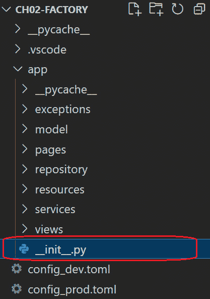
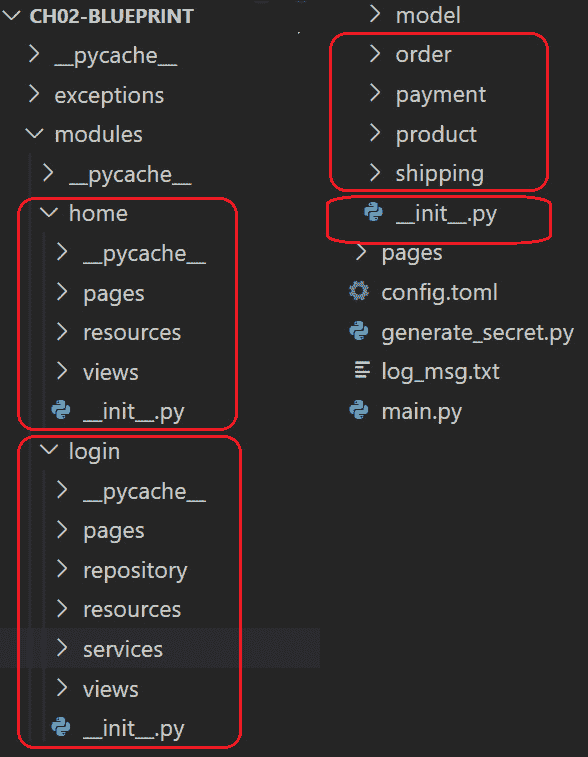
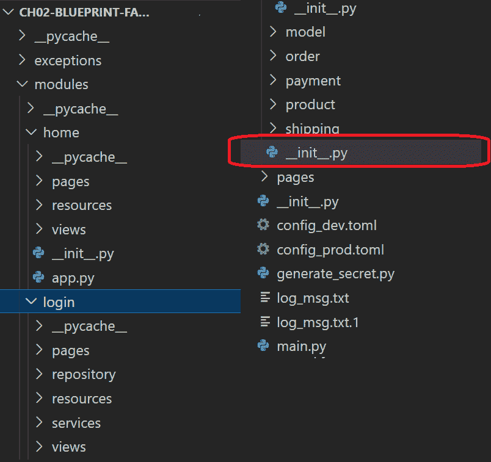
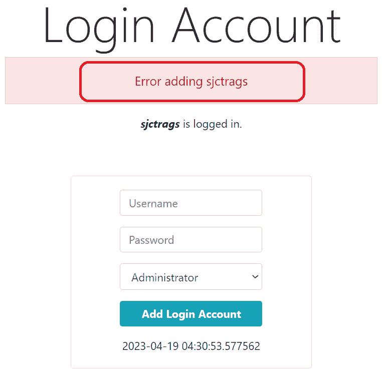
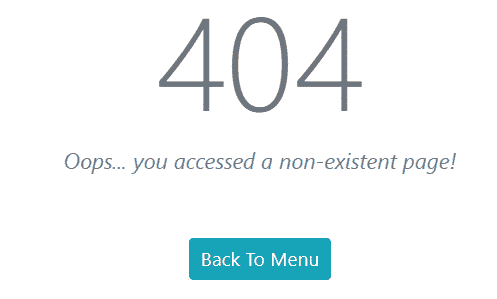
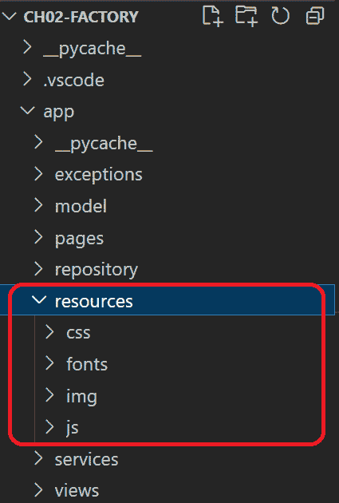
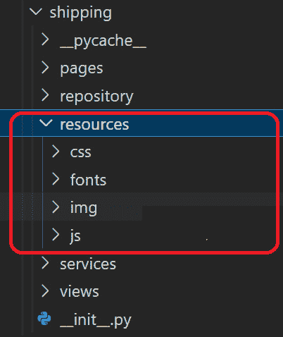

# <st c="0">2</st>

# <st c="2">添加高级核心功能</st>

<st c="31">在完成 Flask 网络应用的设置、配置和初步开发后</st> *<st c="118">第一章</st>*<st c="127">，现在是时候包含 Flask 框架的其他基本组件，以完成一个网络应用。</st> <st c="239">这些组件，如</st> *<st c="265">会话处理</st>*<st c="281">、</st> *<st c="283">闪存消息</st>*<st c="298">、</st> *<st c="300">错误处理</st>*<st c="314">和</st> *<st c="320">软件日志</st>*<st c="336">，可以监控和管理用户与内部事务之间的交互。</st> <st c="426">此外，Flask 还可以提供对系统如何应对运行时间、安全性、平稳性能以及适应不断变化的</st> <st c="619">生产环境变化的理解。</st>

<st c="642">这些由 Flask 支持的构建企业级应用的主要网络组件将是本章的重点。</st> <st c="767">一旦这些核心组件成为应用的一部分，我们还将讨论设计项目结构的各种方法。</st> <st c="888">应用。</st>

<st c="904">以下是本章我们将涉及的主题：</st> <st c="947">本章：</st>

+   <st c="960">构建庞大且</st> <st c="982">可扩展的项目</st>

+   <st c="999">应用对象关系映射（ORM）</st>

+   <st c="1040">配置</st> <st c="1057">日志机制</st>

+   <st c="1074">创建</st> <st c="1084">用户会话</st>

+   <st c="1097">应用</st> <st c="1107">闪存消息</st>

+   <st c="1121">利用一些高级</st> <st c="1146">Jinja2 功能</st>

+   <st c="1161">实现</st> <st c="1175">错误处理解决方案</st>

+   <st c="1199">添加</st> <st c="1207">静态资源</st>

# <st c="1223">技术要求</st>

<st c="1246">本章将专注于订单和产品管理交易。</st> <st c="1320">本章的应用原型，一个</st> *<st c="1367">在线货运管理系统</st>*<st c="1400">，涵盖了某些通用产品库存、一个订单模块、一个基本的货运流程结构以及交付管理模块的一些部分。</st> <st c="1544">这个原型提供了三种不同的实现方式，适合复杂且可扩展的 Flask 网络应用，具体如下：</st> <st c="1665">以下：</st>

+   <st c="1679">利用应用工厂设计模式的</st> `<st c="1684">ch02-factory</st>` <st c="1696">项目。</st>

+   <st c="1758">使用</st> `<st c="1763">ch02-blueprint</st>` <st c="1777">项目的</st> <st c="1800">Flask 蓝图。</st>

+   <st c="1816">使用应用工厂和</st> `<st c="1821">ch02-blueprint-factory</st>` <st c="1843">项目同时使用蓝图结构。</st>

<st c="1915">就像在</st> *<st c="1924">第一章</st><st c="1933">中一样，该应用程序使用</st> *<st c="1956">PostgreSQL</st> <st c="1966">作为数据库，但这次使用了一个名为</st> **<st c="2015">SQLAlchemy</st>** <st c="2025">的 ORM。</st> 所有这些项目都已上传至</st> <st c="2059">[`github.com/PacktPublishing/Mastering-Flask-Web-Development/tree/main/ch02`](https://github.com/PacktPublishing/Mastering-Flask-Web-Development/tree/main/ch02)<st c="2143">。</st>

# <st c="2144">构建大型且可扩展的项目</st>

<st c="2183">为</st> *<st c="2221">简单</st> <st c="2227">的 Flask 网络应用程序</st> 创建目录结构非常方便且简单，尤其是当只有一个模块需要构建且软件功能较少时。</st> <st c="2350">但对于复杂且可扩展的</st> <st c="2378">企业级应用程序，其中需要支持的功能数量庞大，最常见的问题总是</st> *<st c="2497">循环</st> *<st c="2506">导入问题</st> <st c="2520">。</st>

<st c="2521">重要提示</st>

<st c="2536">当两个或更多模块相互导入时，就会发生</st> *<st c="2539">循环导入问题</st> <st c="2562">，在应用程序完全执行之前形成一个相互依赖的循环。</st> <st c="2696">这种情况总是会导致意外的应用程序加载错误、缺少模块，甚至奇怪的</st> <st c="2795">运行时问题</st>。

<st c="2812">Flask 作为框架非常符合 Python 风格，这意味着开发者可以决定他们构建应用程序的结构方法。</st> <st c="2941">不幸的是，并非所有目录结构设计都能因为循环导入问题而成功实施。</st> <st c="3038">然而，三种设计模式可以为</st> <st c="3105">Flask 项目</st> 提供一个基本结构：即</st> *<st c="3126">应用程序工厂设计</st> <st c="3152">，</st> *<st c="3158">蓝图方法</st> <st c="3176">，以及</st> *<st c="3186">结合应用程序工厂和</st> *<st c="3219">蓝图模板</st> <st c="3237">。</st>

## <st c="3238">使用应用程序工厂</st>

<st c="3268">在</st> *<st c="3272">第一章</st><st c="3281">中，我们应用程序中使用的项目结构由各种组件的模块和包组成，例如模型、存储库、服务、模板以及</st> `<st c="3449">main.py</st>` <st c="3456">文件。</st> <st c="3463">代码组织并不符合 Flask 的标准，但被认为是一个干净的</st> <st c="3544">目录结构</st>。

<st c="3564">构建 Flask 项目的一种方法是用</st> *<st c="3620">应用工厂</st>*<st c="3639">，这是一种由 Flask 实例的实例化和配置组成的方法。</st> <st c="3723">它将配置文件加载到平台中，设置必要的扩展模块，如 SQLAlchemy，并在实例化`app`之前使用参数（如`template_folder` <st c="3897">和</st> `<st c="3912">static_folder</st>`<st c="3930">）初始化 Flask 构造函数。</st> <st c="3965">使用工厂应用，在处理配置方面具有灵活性。</st> <st c="4044">应用程序可能有一个单独的工厂方法用于</st> *<st c="4098">测试</st>*<st c="4105">、</st> *<st c="4107">开发</st>*<st c="4118">和</st> *<st c="4124">生产</st>*<st c="4134">，具体取决于应用程序将经历的阶段。</st>

<st c="4189">但是这个方法定义应该放在哪里呢？</st> <st c="4233">在实施此方法之前，将所有视图及其相关组件从通用应用程序组件（如异常类和错误页面）中分离出来。</st> <st c="4400">将文件放在子文件夹中，但您也可以在下面添加更多文件夹以进一步组织模块。</st> <st c="4510">之后，在这些子文件夹中的任何位置创建一个</st> `<st c="4531">__init__.py</st>` <st c="4542">文件以实现应用工厂方法。</st> <st c="4627">在我们的案例中，</st> `<st c="4644">__init__.py</st>` <st c="4655">文件位于</st> `<st c="4668">app</st>` <st c="4671">子文件夹中，我们在这里定义了应用工厂。</st> *<st c="4728">图 2</st>**<st c="4736">.1</st>* <st c="4738">显示了包含具有应用工厂的</st> `<st c="4777">ch02-factory</st>` <st c="4789">项目版本的原型目录结构：</st>



<st c="5064">图 2.1 – Flask 项目目录与应用工厂</st>

<st c="5125">`__init__.py`</st> <st c="5130">文件将任何目录转换为包含可导入其他模块的文件和文件夹的包。</st> <st c="5141">在`__init__.py` <st c="5273">文件内部导入的任何模块脚本都暴露给包目录外部的导入。</st> <st c="5284">同样，它还允许暴露由于相对路径问题而无法触及的来自其他包的模块。</st> <st c="5351">另一方面，应用程序自动加载所有导入的模块并</st> <st c="5570">执行`__init__.py` <st c="5609">文件内部的</st> <st c="5620">方法调用。</st> <st c="5627">因此，将我们的应用程序工厂放在`<st c="5676">__init__.py</st> <st c="5687">`文件中的`<st c="5700">app</st> <st c="5703">`包中，可以在 Flask 项目的任何地方暴露函数。</st> <st c="5768">以下是我们`<st c="5804">app/__init__.py</st> <st c="5819">`文件的内容：</st>

```py
 from flask import Flask
from flask_sqlalchemy import SQLAlchemy
import logging
import logging.config
import logging.handlers
import sys
import toml
# Extension modules initialization
db = SQLAlchemy()
def configure_func_logging(log_path):
    logging.getLogger("werkzeug").disabled = True
    console_handler =   logging.StreamHandler(stream=sys.stdout)
    console_handler.setLevel(logging.DEBUG)
    logging.basicConfig(level=logging.DEBUG,  format='%(asctime)s %(levelname)s %(module)s
          %(funcName)s %(message)s',
     datefmt='%Y-%m-%d %H:%M:%S',  handlers=[logging.handlers.RotatingFileHandler(
        log_path, backupCount=3, maxBytes=1024 ),
           console_handler])
def <st c="6464">create_app(config_file):</st> app = Flask(__name__, template_folder='../app/pages', static_folder='../app/resources')
    app.config.from_file(config_file, toml.load)
    db.init_app(app)
    configure_func_logging('log_msg.txt') <st c="6677">with app.app_context():</st> from app.views import login
        from app.views import menu
        from app.views import customer
        from app.views import admin
        from app.views import product
        from app.views import order
        from app.views import payment
        from app.views import shipping
    return app
```

<st c="6944">分配给应用程序工厂函数的通用和标准名称是</st> `<st c="7018">create_app()</st> <st c="7030">`，但任何人都可以用适合他们项目的适当名称替换它。</st> <st c="7104">在给定的代码片段中，我们的应用程序工厂创建了 Flask 的`<st c="7170">app</st> <st c="7173">`实例，调用了`<st c="7190">db_init()</st> <st c="7199">`的`<st c="7206">SQLAlchemy 的`<st c="7220">db</st> <st c="7222">`实例，以使用`<st c="7273">app</st> <st c="7276">`对象定义和配置 ORM，并设置了日志</st> <st c="7308">机制。</st> <st c="7320">由于它在`<st c="7335">__init__.py</st> <st c="7346">`中，所以`<st c="7352">main.py</st> <st c="7359">`文件必须导入工厂方法，最终通过调用`<st c="7467">app</st> <st c="7470">`的`<st c="7474">run()</st> <st c="7479">`方法来创建对象并运行应用程序。</st>

为了使应用程序工厂方法灵活和可配置，向其中添加本地参数。</st> <st c="7582">例如，它可以接受一个字符串参数作为文件名，以接受配置文件名，这样当应用程序以开发模式运行时，它可以接受</st> `<st c="7745">config_dev.toml</st>` <st c="7760">作为其配置文件。</st> <st c="7788">当将部署转移到生产服务器时，它可以接受一个新的文件名，并用生产配置文件替换现有的配置，例如</st> `<st c="7946">config_prod.toml</st>`<st c="7962">，以重新加载所有针对</st> <st c="8021">生产服务器</st> 的环境变量。

### <st c="8039">利用当前应用程序代理</st>

<st c="8071">使用应用程序工厂设计</st> <st c="8109">模式来构建应用程序使得从</st> `<st c="8182">app</st>` <st c="8185">实例中访问</st> `<st c="8200">main.py</st>` <st c="8207">中的视图和其他需要它的组件变得不可能，否则会遇到</st> *<st c="8277">循环导入问题</st>*<st c="8299">。我们不是在</st> `<st c="8359">app</st>` <st c="8362">目录的模块中导入</st> `<st c="8326">app</st>` <st c="8329">对象，而是在</st> `<st c="8414">create_app()</st>` <st c="8426">中建立应用程序上下文，以利用名为</st> `<st c="8448">app</st>` <st c="8451">的代理</st> `<st c="8459">对象</st> <st c="8466">current_app</st>`<st c="8477">。</st>

<st c="8478">在 Flask 中，应用程序上下文在请求期间管理配置变量、视图数据、记录器、数据库细节和其他自定义对象。</st> <st c="8652">创建应用程序上下文有两种方法：</st>

+   <st c="8707">显式地使用</st> `<st c="8761">push()</st>` <st c="8767">方法来推送应用程序上下文，允许在任何请求中从应用程序的任何地方访问</st> `<st c="8799">current_app</st>` <st c="8810">：</st>

    ```py
     app_ctx = <st c="8873">app.app_context()</st> app_ctx.<st c="8963">with</st>-block, setting a limit on where to access the application-level components, such as allowing access to <st c="9072">current_app</st> from the <st c="9093">views</st> module only, as depicted in the following example:

    ```

    <st c="9149">使用 app.app_context():</st>从 app.views 导入 login

                从 app.views 导入 menu

                从 app.views 导入 customer

                从 app.views 导入 admin

                从 app.views 导入 product

                从 app.views 导入 order

                从 app.views 导入 payment

                从 app.views 导入 shipping

    ```py

    ```

<st c="9406">不是从</st> `<st c="9432">app</st>` <st c="9435">实例中通过</st> `<st c="9454">__init__.py</st>` <st c="9465">文件来在</st> `<st c="9497">views.shipping</st>` <st c="9511">模块中实现视图，这肯定会导致由于</st> `<st c="9583">current_app()</st>`<st c="9596">对</st> `<st c="9614">views.shipping</st>` <st c="9628">模块的导入而引起的循环导入问题，现在应用程序可以允许使用</st> `<st c="9682">current_app</st>` <st c="9693">代理来构建</st> `<st c="9709">views.shipping</st>` <st c="9723">，因为</st> `<st c="9739">with</st>`<st c="9743">-context block 将模块脚本推送到应用程序上下文。</st> <st c="9813">以下代码展示了在创建将配送员资料详情插入到</st> `<st c="9882">add_delivery_officer</st>` <st c="9902">视图函数时使用代理对象的方法：</st>

```py
<st c="9981">from flask import current_app</st> @<st c="10013">current_app</st>.route('/delivery/officer/add', methods = ['GET', 'POST'])
def add_delivery_officer():
    if request.method == 'POST': <st c="10140">current_app.logger.info('add_delivery_officer</st><st c="10185">POST view executed')</st> repo = DeliveryOfficerRepository(db)
        officer = DeliveryOfficer(id=int(request.form['id']), firstname=request.form['firstname'], middlename=request.form['middlename'],
          … … … … … …
        result = repo.insert(officer)
        return render_template(
         'shipping/add_delivery_officer_form.html'), 200 <st c="10488">current_app.logger.info('add_delivery_officer</st><st c="10533">GET view executed')</st> return render_template(
       'shipping/add_delivery_officer_form.html'), 200
```

<st c="10625">`current_app`</st> <st c="10630">是</st> `<st c="10657">flask</st>` <st c="10662">模块的一部分，该模块可以提供构建视图函数和其他组件所需的所有必要的装饰器和实用工具，只要模块脚本位于</st> *<st c="10818">由</st> `<st c="10873">create_app()</st>`<st c="10885">创建的应用程序上下文范围内</st>* <st c="10862">。在</st> `<st c="10894">add_delivery_officer</st>` <st c="10914">视图函数中，</st> `<st c="10934">current_app</st>` <st c="10945">提供了</st> `<st c="10959">route()</st>` <st c="10966">装饰器和由</st> `<st c="10985">logger</st>` <st c="10991">实例配置的</st> `<st c="11019">application factory</st>` <st c="11091">。</st>

### <st c="11039">将数据存储到应用程序上下文中</st>

<st c="11079">现在，Flask 中的应用程序上下文就像是在每个请求-响应事务之上创建的一个微型层。</st> <st c="11111">每次请求都会有一个新的上下文，因此 Flask 应用程序中的所有应用程序级数据都是短暂的。</st> <st c="11334">在这个时间段内，我们可以使用另一个应用程序级代理对象</st> `<st c="11420">g</st>` <st c="11421">组件来存储数据。</st> <st c="11433">以下代码片段展示了如何创建和销毁应用程序上下文</st> `<st c="11507">数据对象：</st>`

```py
<st c="11520">def get_database():</st><st c="11540">if 'db' not in g:</st><st c="11558">g.db = db</st> app.logger.info('storing … as context data') <st c="11614">@app.teardown_appcontext</st> def teardown_database(exception): <st c="11673">db = g.pop('db', None)</st> app.logger.info('removing … as context data')
```

<st c="11741">The</st> `<st c="11746">get_database()</st>` <st c="11760">方法将</st> `<st c="11779">db</st>` <st c="11781">实例存储到</st> `<st c="11807">create_app()</st>` <st c="11819">通过</st> `<st c="11849">g</st>` <st c="11850">代理创建的上下文中。</st> <st c="11858">在存储数据之前，始终先验证对象是否已经在</st> `<st c="11961">g</st>`<st c="11962">中，这是一个好的实践。</st> <st c="11987">另一方面，</st> `<st c="11987">teardown_database()</st>` <st c="12006">有一个</st> `<st c="12013">@app.teardown_appcontext</st>` <st c="12037">装饰器，允许在请求上下文结束时自动调用该方法。</st> <st c="12129">在 Flask 销毁整个</st> <st c="12232">应用程序上下文之前，</st> `<st c="12133">g</st>` <st c="12138">的</st> `<st c="12149">pop()</st>` <st c="12150">方法会从上下文中移除或释放数据。</st>

<st c="12252">访问</st> `<st c="12263">g</st>` <st c="12264">以存储数据</st> <st c="12282">在应用程序中并不总是有效。</st> <st c="12323">创建上下文数据或调用我们的</st> `<st c="12384">get_database()</st>` <st c="12398">方法适当的地点是在</st> `<st c="12416">@before_request</st>` <st c="12431">方法。</st> <st c="12440">此方法在请求事务开始之前自动执行。</st> <st c="12514">在</st> `<st c="12534">g</st>` <st c="12535">中的上下文数据将在</st> `<st c="12608">@before_request</st>` <st c="12623">事件方法执行后才能被任何视图函数访问。</st> <st c="12638">换句话说，通过</st> `<st c="12683">g</st>` <st c="12684">共享的所有资源都只能在请求-响应范围内访问。</st> <st c="12744">访问</st> `<st c="12754">g</st>` <st c="12755">上下文数据未在</st> `<st c="12780">@before_request</st>` <st c="12795">设置的情况下可能导致</st> `<st c="12806">ValueError</st>`<st c="12816">。因此，我们在以下</st> `<st c="12877">@</st>``<st c="12878">before_request</st>` <st c="12892">实现中调用我们的</st> `<st c="12838">get_database()</st>` <st c="12852">方法：</st>

```py
<st c="12908">@app.before_request</st> def init_request(): <st c="12994">list_login</st> view function to access the database for query transactions:

```

@current_app.route('/login/list', methods=['GET'])

def list_login():

    repo = LoginRepository(<st c="13158">g.db</st>)

    users = repo.select_all()

    session['sample'] = 'trial'

    flash('用户凭证列表')

    return render_template('login/login_list.html', users=users) , 200

```py

			<st c="13320">Although it is an advantage to verify the existence of a context attribute in</st> `<st c="13399">g</st>` <st c="13400">before accessing it, sometimes accessing the data right away is inevitable, such as in our</st> `<st c="13492">list_login</st>` <st c="13502">view function</st> <st c="13517">that directly passes the</st> `<st c="13542">g.db</st>` <st c="13546">context object into</st> `<st c="13567">LoginRepository</st>`<st c="13582">. Another approach to accessing the context data is through the</st> `<st c="13646">g.set()</st>` <st c="13653">method that allows a default value if the data is non-existent, such as using</st> `<st c="13732">g.get('db', db)</st>` <st c="13747">instead of</st> `<st c="13759">g.db</st>`<st c="13763">, where</st> `<st c="13771">db</st>` <st c="13773">in the second parameter is a</st> <st c="13803">backup connection.</st>
			<st c="13821">Important note</st>
			<st c="13836">Both application and request contexts exist only during a request-response life cycle.</st> <st c="13924">The application context provides the</st> `<st c="13961">current_app</st>` <st c="13972">proxy and the</st> `<st c="13987">g</st>` <st c="13988">variable, while the request context contains the request variables and the view function details.</st> <st c="14087">Unlike in other web frameworks, Flask’s application context will not be valid for access after the life cycle destroys the</st> <st c="14210">request context.</st>
			<st c="14226">Aside from the application factory, we can also use Flask’s blueprints to establish a</st> <st c="14313">project directory.</st>
			<st c="14331">Using the Blueprint</st>
			`<st c="14351">Blueprints</st>` <st c="14362">are Flask’s built-in</st> <st c="14384">components from its</st> `<st c="14404">flask</st>` <st c="14409">module.</st> <st c="14418">Their core purpose is to organize all related views with the repository, services, templates, and other associated features to form a solid and self-contained structure.</st> <st c="14588">The strength of the Blueprint is that it can break down a single huge application into independent</st> <st c="14687">business units that can be considered sub-applications but are still dependent on the main application.</st> *<st c="14791">Figure 2</st>**<st c="14799">.2</st>* <st c="14801">shows the organization of the</st> `<st c="14832">ch02-blueprint</st>` <st c="14846">project, a version of our</st> *<st c="14873">Online Shipping Management System</st>* <st c="14906">that uses Blueprints in building its</st> <st c="14944">project structure:</st>
			

			<st c="15287">Figure 2.2 – Flask project directory with Blueprints</st>
			<st c="15339">Defining the Blueprint</st>
			<st c="15362">Instead of placing all view files in</st> <st c="15400">one folder, the project’s related views are grouped based on business units, then assigned their respective Blueprint sub-projects, namely,</st> `<st c="15540">home</st>`<st c="15544">,</st> `<st c="15546">login</st>`<st c="15551">,</st> `<st c="15553">order</st>`<st c="15558">,</st> `<st c="15560">payment</st>`<st c="15567">,</st> `<st c="15569">product</st>`<st c="15576">, and</st> `<st c="15582">shipping</st>`<st c="15590">. Each Blueprint represents a section with the templates, static resources, repositories, services, and utilities needed to build</st> <st c="15720">a sub-application.</st>
			<st c="15738">Now, the</st> `<st c="15748">__init__.py</st>` <st c="15759">file of each sub-application is very important because this is where the Blueprint object is created and instantiated.</st> <st c="15879">The blueprint</st> `<st c="15893">home</st>`<st c="15897">’s</st> `<st c="15901">__init__.py</st>` <st c="15912">file, for instance, has the following</st> <st c="15951">Blueprint definition:</st>

```

从 flask 导入 Blueprint <st c="16001">home_bp = Blueprint('home_bp', __name__,</st><st c="16041">template_folder='pages',</st><st c="16066">static_folder='resources', static_url_path='static')</st> 导入 modules.home.views.menu

```py

			<st c="16150">Meanwhile, the</st> `<st c="16166">login</st>` <st c="16171">section’s</st> <st c="16181">Blueprint has the</st> `<st c="16200">__init__py</st>` <st c="16210">file that</st> <st c="16221">contains this:</st>

```

从 flask 导入 Blueprint <st c="16264">login_bp = Blueprint('login_bp', __name__,</st><st c="16306">template_folder='pages',</st><st c="16331">static_folder='resources', static_url_path='static')</st> 导入 modules.login.views.login

导入 modules.login.views.admin

导入 modules.login.views.customer

```py

			<st c="16486">The constructor of the</st> `<st c="16510">Blueprint</st>` <st c="16519">class requires two parameters for it to instantiate</st> <st c="16572">the class:</st>

				*   <st c="16582">The first parameter is the</st> *<st c="16610">name of Blueprint</st>*<st c="16627">, usually the name of the reference variable of</st> <st c="16675">its instance.</st>
				*   <st c="16688">The second parameter is</st> `<st c="16713">__name__</st>`<st c="16721">, which depicts the</st> *<st c="16741">current package</st>* <st c="16756">of</st> <st c="16760">the section.</st>

			<st c="16772">The name of the Blueprint must be unique to the sub-application because it is responsible for its internal routings, which must not have any collisions with the other Blueprints.</st> <st c="16952">The Blueprint package, on the other hand, will indicate the root path of</st> <st c="17025">the sub-application.</st>
			<st c="17045">Implementing the Blueprint’s routes</st>
			<st c="17081">One purpose of using a Blueprint is to avoid circular import issues in implementing the routes.</st> <st c="17178">Rather than accessing the</st> <st c="17204">app instance from</st> `<st c="17222">main.py</st>`<st c="17229">, sub-applications can now directly access their respective Blueprint instance to build their routes.</st> <st c="17331">The following code shows how the login Blueprint implements its route using its Blueprint instance, the</st> `<st c="17435">login_bp</st>` <st c="17443">object:</st>

```

<st c="17451">从 modules.login 导入 login_bp</st>

<st c="17486">@login_bp.route('/admin/add', methods = ['GET', 'POST'])</st> def add_admin():

    if request.method == 'POST':

        app.logger.info('add_admin POST view executed')

        repo = AdminRepository(db_session)

        … … … … … …

        return render_template('admin_details_form.html', logins=logins), 200

    app.logger.info('add_admin GET view executed')

    logins = get_login_id(1, db_session)

    return render_template('admin_details_form.html', logins=logins), 200

```py

			<st c="17908">The</st> `<st c="17913">login_bp</st>` <st c="17921">object is instantiated from</st> `<st c="17950">__init__py</st>` <st c="17960">of the</st> `<st c="17968">login</st>` <st c="17973">directory, thus importing it from there.</st> <st c="18015">But this route and the rest of the views will only work after registering these Blueprints with the</st> `<st c="18115">app</st>` <st c="18118">instance.</st>
			<st c="18128">Registering the blueprints</st>
			<st c="18155">Blueprint registration happens in the</st> `<st c="18194">main.py</st>` <st c="18201">file, which is the location of the Flask app.</st> <st c="18248">The following snippet is part of the</st> `<st c="18285">main.py</st>` <st c="18292">file of our</st> `<st c="18305">ch02-blueprint</st>` <st c="18319">project that shows how to</st> <st c="18346">establish the registration</st> <st c="18373">procedure correctly:</st>

```

从 flask 导入 Flask

app = Flask(__name__, template_folder='pages')

app.config.from_file('config.toml', toml.load) <st c="18512">从 modules.home 导入 home_bp</st>

<st c="18544">从 modules.login 导入 login_bp</st>

<st c="18579">从 modules.order 导入 order_bp</st>

<st c="18614">从 modules.payment 导入 payment_bp</st>

<st c="18653">从 modules.shipping 导入 shipping_bp</st>

<st c="18694">从 modules.product 导入 product_bp</st>

<st c="18733">app.register_blueprint(home_bp, url_prefix='/ch02')</st>

<st c="18785">app.register_blueprint(login_bp, url_prefix='/ch02')</st>

<st c="18838">app.register_blueprint(order_bp, url_prefix='/ch02')</st>

<st c="18891">app.register_blueprint(payment_bp, url_prefix='/ch02')</st>

<st c="18946">app.register_blueprint(shipping_bp, url_prefix='/ch02')</st>

<st c="19002">app.register_blueprint(product_bp, url_prefix='/ch02')</st> 从 modules.model.db 导入*

if __name__ == '__main__':

    app.run()

```py

			<st c="19125">The</st> `<st c="19130">register_blueprint()</st>` <st c="19150">method from the</st> `<st c="19167">app</st>` <st c="19170">instance has three parameters, namely,</st> <st c="19210">the following:</st>

				*   <st c="19224">The Blueprint object imported from</st> <st c="19260">the sub-application.</st>
				*   <st c="19280">The</st> `<st c="19285">url_prefix</st>`<st c="19295">, the assigned URL</st> <st c="19314">base route.</st>
				*   <st c="19325">The</st> `<st c="19330">url_defaults</st>`<st c="19342">, the dictionary of parameters required by the views linked to</st> <st c="19405">the Blueprint.</st>

			<st c="19419">Registering the Blueprints can also be</st> <st c="19459">considered a workaround in providing our Flask applications with a context root.</st> <st c="19540">The context root defines the application, and it serves as the base URL that can be used to access the application.</st> <st c="19656">In the given snippet, our application was assigned the</st> `<st c="19711">/ch02</st>` <st c="19716">context root through the</st> `<st c="19742">url_prefix</st>` <st c="19752">parameter of</st> `<st c="19766">register_blueprint()</st>`<st c="19786">. On the other hand, as shown from the given code, the imports to the Blueprints must be placed below the app instantiation to avoid circular</st> <st c="19928">import issues.</st>
			<st c="19942">Another way of building a clean Flask project is by combining the application factory design technique with the</st> <st c="20055">Blueprint approach.</st>
			<st c="20074">Utilizing both the application factory and the Blueprint</st>
			<st c="20131">To make the Blueprint structures</st> <st c="20165">flexible when managing configuration variables and more organized by utilizing the application context proxies</st> `<st c="20276">g</st>` <st c="20277">and</st> `<st c="20282">current_app</st>`<st c="20293">, add an</st> `<st c="20302">__init__.py</st>` <st c="20313">file in the</st> `<st c="20326">modules</st>` <st c="20333">folder.</st> *<st c="20342">Figure 2</st>**<st c="20350">.3</st>* <st c="20352">shows the project structure of</st> `<st c="20384">ch02-blueprint-factory</st>` <st c="20406">with the</st> `<st c="20416">__init__.py</st>` <st c="20427">file in place to implement the factory</st> <st c="20467">method definition:</st>
			

			<st c="20827">Figure 2.3 – Flask directory with Blueprints and application factory</st>
			<st c="20895">The</st> `<st c="20900">create_app()</st>` <st c="20912">factory method can now include the import of the Blueprints and their registration to the app.</st> <st c="21008">The rest of its setup is the same as the</st> `<st c="21049">ch01</st>` <st c="21053">project.</st> <st c="21063">The following code shows its</st> <st c="21092">entire</st> <st c="21098">implementation:</st>

```

导入 toml

从 flask 导入 Flask

从 flask_sqlalchemy 导入 SQLAlchemy

db = SQLAlchemy() <st c="21209">def create_app(config_file):</st> app = Flask(__name__, template_folder='../pages', static_folder='../resources')

    app.config.from_file(config_file, toml.load)

    … … … … … …

    … … … … … … <st c="21387">使用 app.app_context():</st><st c="21410">从 modules.home 导入 home_bp</st><st c="21443">从 modules.login 导入 login_bp</st><st c="21478">从 modules.order 导入 order_bp</st> … … … … … …

    … … … … … … <st c="21537">app.register_blueprint(home_bp, url_prefix='/ch02')</st><st c="21588">app.register_blueprint(login_bp, url_prefix='/ch02')</st><st c="21641">app.register_blueprint(order_bp, url_prefix='/ch02')</st> … … … … … …

    返回 app

```py

			<st c="21716">The application factory here uses the</st> `<st c="21755">with</st>`<st c="21759">-block to bind the application context only within the</st> <st c="21815">Blueprint components.</st>
			<st c="21836">Depending on the scope of the software requirements and the appropriate architecture, any of the given approaches</st> <st c="21950">will be reliable and applicable in building organized, enterprise-grade Flask applications.</st> <st c="22043">Adding more packages and other design patterns is possible, but the core structure emphasized in the previous discussions must remain intact to avoid</st> <st c="22193">cyclic imports.</st>
			<st c="22208">From project structuring, it is time to discuss the setup indicated in the application factory and</st> `<st c="22308">main.py</st>` <st c="22315">of the Blueprints, which is about the configuration of SQLAlchemy ORM and Flask’s</st> <st c="22398">logging mechanism.</st>
			<st c="22416">Applying object-relational mapping (ORM)</st>
			<st c="22457">The most used</st> **<st c="22472">object-relational mapping</st>** <st c="22497">(</st>**<st c="22499">ORM</st>**<st c="22502">) that can work perfectly with the Flask framework is SQLAlchemy.</st> <st c="22569">This</st> <st c="22574">ORM is a boilerplated interface that aims to create a database-agnostic data layer to connect to any database engine.</st> <st c="22692">But compared to other ORMs, SQLAlchemy has support in optimizing native SQL statements, which makes it popular with many database administrators.</st> <st c="22838">When formulating its queries, it only requires Python functions and expressions to pursue</st> <st c="22928">CRUD operations.</st>
			<st c="22944">Before using the ORM, the</st> `<st c="22971">flask-sqlalchemy</st>` <st c="22987">and</st> `<st c="22992">psycopg2-binary</st>` <st c="23007">extensions for the PostgreSQL database must be installed in the virtual environment using the</st> <st c="23102">following command:</st>

```

pip install psycopg2-binary flask-sqlalchemy

```py

			<st c="23165">What follows next is</st> <st c="23186">the setup of the</st> <st c="23204">database connectivity.</st>
			<st c="23226">Setting up the database connectivity</st>
			<st c="23263">Now, we are ready to implement the configuration file for our database setup.</st> <st c="23342">Flask 3.x supports the declarative extension of SQLAlchemy, which is the commonly used approach in implementing</st> <st c="23453">SQLAlchemy ORM in most frameworks such</st> <st c="23493">as FastAPI.</st>
			<st c="23504">In this approach, the first step is to create the database connectivity by building the SQLAlchemy engine, which manages the connection pooling and the installed dialect.</st> <st c="23676">The</st> `<st c="23680">create_engine()</st>` <st c="23695">function from the</st> `<st c="23714">sqlalchemy</st>` <st c="23724">module derives the engine object with a</st> **<st c="23765">database URL</st>** <st c="23777">(</st>**<st c="23779">DB URL</st>**<st c="23785">) string as its</st> <st c="23802">main parameter.</st> <st c="23818">This URL string contains the database name, DB API driver, account credentials, IP address of the database server, and</st> <st c="23937">its port.</st>
			<st c="23946">Now, the engine is required to create the session factory through the</st> `<st c="24017">sessionmaker()</st>` <st c="24031">method.</st> <st c="24040">And this session factory becomes the essential parameter to the</st> `<st c="24104">session_scoped()</st>` <st c="24120">method in extracting the session registry, which provides the session to SQLAlchemy’s CRUD operations.</st> <st c="24224">The following is the database configuration found in the</st> `<st c="24281">/modules/model/config.py</st>` <st c="24305">module of the</st> `<st c="24320">ch02-blueprint</st>` <st c="24334">project:</st>

```

从 sqlalchemy 导入 create_engine

从 sqlalchemy.ext.declarative 导入 declarative_base

从 sqlalchemy.orm 导入 sessionmaker, scoped_session

DB_URL = "postgresql://<username>:<password>@localhost:5433/sms" <st c="24558">engine = create_engine(DB_URL)</st>

<st c="24588">db_session = scoped_session(sessionmaker(autocommit=False, autoflush=False, bind=engine))</st> Base = declarative_base()

def init_db():

    导入 modules.model.db

```py

			<st c="24743">When the sessions are all set, the derivation of the base object from the</st> `<st c="24818">declarative_base()</st>` <st c="24836">method is</st> <st c="24847">the next focus for the model layer implementation.</st> <st c="24898">The instance returned by this method will subclass all the SQLAlchemy entity or</st> <st c="24978">model classes.</st>
			<st c="24992">Building the model layer</st>
			<st c="25017">Each entity class needs to extend the</st> `<st c="25056">Base</st>` <st c="25060">instance to derive the necessary properties and methods in mapping the schema table to the ORM platform.</st> <st c="25166">It will allow the classes to use the</st> `<st c="25203">Column</st>` <st c="25209">helper class to</st> <st c="25225">build the properties of the actual column metadata.</st> <st c="25278">There are support classes that the models can utilize such as</st> `<st c="25340">Integer</st>`<st c="25347">,</st> `<st c="25349">String</st>`<st c="25355">,</st> `<st c="25357">Date</st>`<st c="25361">, and</st> `<st c="25367">DateTime</st>` <st c="25375">to define the data types and other constraints of the columns, and</st> `<st c="25443">ForeignKey</st>` <st c="25453">to establish parent-child table relationships.</st> <st c="25501">The following are some model classes from the</st> `<st c="25547">/</st>``<st c="25548">modules/model/db.py</st>` <st c="25567">module:</st>

```

<st c="25575">从 sqlalchemy 导入 Time, Column, ForeignKey, Integer, String, Float, Date, Sequence</st>

<st c="25663">从 sqlalchemy.orm 导入关系</st>

<st c="25703">从 modules.model.config 导入 Base</st>

<st c="25741">class Login(Base):</st><st c="25760">__tablename__ = 'login'</st> id = <st c="25790">列</st>(Integer, Sequence('login_id_seq', increment=1), <st c="25846">主键 = True</st>)

username = <st c="25878">列</st>(<st c="25886">字符串</st>(45))

password = <st c="25910">列</st>(<st c="25918">字符串</st>(45))

user_type = <st c="25943">列</st>(<st c="25951">整数</st>)

admins = <st c="25970">关系</st>('Admin', <st c="25993">反向填充="login"</st>, <st c="26017">uselist=False</st>)

customer = <st c="26044">关系</st>('Customer', <st c="26070">反向填充="login"</st>, <st c="26094">uselist=False</st>)

def __init__(self, username, password, user_type, id = None):

    self.id = id

    self.username = username

    self.password = password

    self.user_type = user_type

def __repr__(self):

        返回 f"<Login {self.id} {self.username} {self.password} {self.user_type}>"

```py

			<st c="26358">Now, the</st> `<st c="26368">relationship()</st>` <st c="26382">directive in the code links to model classes based on their actual reference and foreign keys.</st> <st c="26478">The</st> <st c="26482">model class invokes the method and configures it by setting up some parameters, beginning with the name of the entity it must establish a relationship with and the backreference specification.</st> <st c="26675">The</st> `<st c="26679">back_populates</st>` <st c="26693">parameter refers to the complementary attribute names of the related model classes, which express the rows needed to be queried based on some relationship loading technique, typically the lazy type.</st> <st c="26893">Using the</st> `<st c="26903">backref</st>` <st c="26910">parameter instead of</st> `<st c="26932">back_populates</st>` <st c="26946">is also acceptable.</st> <st c="26967">The following</st> `<st c="26981">Customer</st>` <st c="26989">model class shows its one-to-one relationship with</st> <st c="27040">the</st> `<st c="27045">Login</st>` <st c="27050">entity model as depicted in their respective calls to the</st> `<st c="27109">relationship()</st>` <st c="27123">directive:</st>

```

<st c="27134">class Customer(Base):</st> __tablename__ = 'customer'

id = Column(Integer, ForeignKey('login.id'), primary_key = True)

firstname = Column(String(45))

lastname = Column(String(45))

middlename = Column(String(45))

… … … … … … <st c="27354">login = relationship('Login', back_populates="customer")</st> orders = relationship('Orders', back_populates="customer")

shippings = relationship('Shipping', back_populates="customer")

        …  … … … … …

```py

			<st c="27545">The return value of the</st> `<st c="27570">relationship()</st>` <st c="27584">call in</st> `<st c="27593">Login</st>` <st c="27598">is the scalar object of the filtered</st> `<st c="27636">Customer</st>` <st c="27644">record.</st> <st c="27653">Likewise, the</st> `<st c="27667">Customer</st>` <st c="27675">model has the joined</st> `<st c="27697">Login</st>` <st c="27702">instance because of the directive.</st> <st c="27738">On the other hand, the method can also return either a</st> `<st c="27793">List</st>` <st c="27797">collection or scalar value if the relationship is a</st> *<st c="27850">one-to-many</st>* <st c="27861">or</st> *<st c="27865">many-to-one</st>* <st c="27876">type.</st> <st c="27883">When setting this setup in the parent model class, the</st> `<st c="27938">useList</st>` <st c="27945">parameter must be omitted or set to</st> `<st c="27982">True</st>` <st c="27986">to indicate that it will return a filtered list of records from its child class.</st> <st c="28068">However, if</st> `<st c="28080">useList</st>` <st c="28087">is set to</st> `<st c="28098">False</st>`<st c="28103">, the indicated relationship</st> <st c="28132">is</st> *<st c="28135">one-to-one</st>*<st c="28145">.</st>
			<st c="28146">The following</st> `<st c="28161">Orders</st>` <st c="28167">class creates a</st> *<st c="28184">many-to-one</st>* <st c="28195">relationship with the</st> `<st c="28218">Products</st>` <st c="28226">and</st> `<st c="28231">Customer</st>` <st c="28239">models but a</st> *<st c="28253">one-to-one</st>* <st c="28263">relationship</st> <st c="28277">with the</st> `<st c="28286">Payment</st>` <st c="28293">model:</st>

```

class Orders(Base):

__tablename__ = 'orders'

id = Column(Integer, Sequence('orders_id_seq', increment=1), primary_key = True)

pid = Column(Integer, ForeignKey('products.id'), nullable = False)

… … … … … …

product = relationship('Products', back_populates="orders")

customer = relationship('Customer', back_populates="orders")

payment = relationship('Payment', back_populates="order", uselist=False)

    … … … … … …

class Payment(Base):

__tablename__ = 'payment'

id = Column(Integer, Sequence('payment_id_seq', increment=1), primary_key = True)

order_no = Column(String, ForeignKey('orders.order_no'), nullable = False)

… … … … … …

order = relationship('Orders', back_populates="payment")

payment_types = relationship('PaymentType', back_populates="payment")

shipping  = relationship('Shipping', back_populates="payment", uselist=False)

```py

			<st c="29131">The</st> `<st c="29136">main.py</st>` <st c="29143">module needs to call the custom method, the</st> `<st c="29188">init_db()</st>` <st c="29197">method found in the</st> `<st c="29218">config.py</st>` <st c="29227">module, to</st> <st c="29238">load, and register all these model classes for the</st> <st c="29290">repository classes.</st>
			<st c="29309">Implementing the repository layer</st>
			<st c="29343">Each repository class</st> <st c="29365">requires SQLAlchemy’s</st> `<st c="29388">Session</st>` <st c="29395">instance to implement its CRUD transactions.</st> <st c="29441">The following</st> `<st c="29455">ProductRepository</st>` <st c="29472">code is a sample repository class that manages the</st> `<st c="29524">product</st>` <st c="29531">table:</st>

```

from typing import List, Any, Dict

from modules.model.db import Products

from main import app <st c="29633">from sqlalchemy.orm import Session</st> class ProductRepository:

    def __init__(self, <st c="29712">sess:Session</st>): <st c="29728">self.sess = sess</st> app.logger.info('产品仓库实例创建')

```py

			`<st c="29798">ProductRepository</st>`<st c="29816">’s constructor is essential in accepting the</st> `<st c="29862">Session</st>` <st c="29869">instance from the view or service functions and preparing it for internal processing.</st> <st c="29956">The first transaction is the</st> `<st c="29985">INSERT</st>` <st c="29991">product record transaction that uses the</st> `<st c="30033">add()</st>` <st c="30038">method of the</st> `<st c="30053">Session</st>`<st c="30060">. SQLAlchemy always imposes transaction management in every CRUD operation.</st> <st c="30136">Thus, invoking</st> `<st c="30151">commit()</st>` <st c="30159">of its</st> `<st c="30167">Session</st>` <st c="30174">object is required after successfully executing the</st> `<st c="30227">add()</st>` <st c="30232">method.</st> <st c="30241">The following</st> `<st c="30255">insert()</st>` <st c="30263">method shows the correct implementation of an</st> `<st c="30310">INSERT</st>` <st c="30316">transaction</st> <st c="30329">in SQLAlchemy:</st>

```

def insert(self, <st c="30361">prod:Products</st>) -> bool:

        try: <st c="30391">self.sess.add(prod)</st><st c="30410">self.sess.commit()</st> app.logger.info('产品仓库插入记录')

            return True

        except Exception as e:

            app.logger.info(f'产品仓库插入错误: {e}')

        return False

```py

			<st c="30586">The</st> `<st c="30591">Session</st>` <st c="30598">object has an</st> `<st c="30613">update</st>` <st c="30619">method that can perform an</st> `<st c="30647">UPDATE</st>` <st c="30653">transaction.</st> <st c="30667">The following</st> <st c="30681">is an</st> `<st c="30687">update()</st>` <st c="30695">implementation that updates a</st> `<st c="30726">product</st>` <st c="30733">record based on its primary</st> <st c="30762">key ID:</st>

```

def update(self, id:int, details:Dict[str, Any]) -> bool:

        try: <st c="30833">self.sess.query(Products).filter(Products.id ==</st> <st c="30880">id).update(details)</st><st c="30900">self.sess.commit()</st> app.logger.info('产品仓库更新记录')

            return True

        except Exception as e:

            app.logger.info(f'产品仓库更新错误: {e}')

        return False

```py

			<st c="31075">The</st> `<st c="31080">Session</st>` <st c="31087">also has a</st> `<st c="31099">delete()</st>` <st c="31107">method that performs record deletion based on a constraint, usually by ID.</st> <st c="31183">The following is an SQLAlchemy way of deleting a</st> `<st c="31232">product</st>` <st c="31239">record based on</st> <st c="31256">its ID:</st>

```

def delete(self, id:int) -> bool:

        try: <st c="31303">login = self.sess.query(Products).filter(</st> <st c="31344">Products.id == id).delete()</st><st c="31372">self.sess.commit()</st> app.logger.info('产品仓库删除记录')

        return True

        except Exception as e:

            app.logger.info(f'产品仓库删除错误: {e}')

        return False

```py

			<st c="31547">And lastly, the</st> `<st c="31564">Session</st>` <st c="31571">supports a query transaction implementation through its</st> `<st c="31628">query()</st>` <st c="31635">method.</st> <st c="31644">It can allow</st> <st c="31657">the filtering of records using some constraints that will result in retrieving a list or a single one.</st> <st c="31760">The following snippet shows a snapshot of these</st> <st c="31808">query implementations:</st>

```

def select_all(self) -> List[Any]:

        users = self.sess.query(Products).all()

        app.logger.info('产品仓库检索所有记录')

        return users

    def select_one(self, id:int) -> Any:

        users =  self.sess.query(Products).filter( Products.id == id).one_or_none()

        app.logger.info('产品仓库检索一条记录')

        return users

    def select_one_code(self, code:str) -> Any:

        users =  self.sess.query(Products).filter( Products.code == code).one_or_none()

        app.logger.info('ProductRepository 通过产品代码检索了一条记录')

        return users

```py

			<st c="32369">Since the</st> `<st c="32380">selectall()</st>` <st c="32391">query transaction must return a list of</st> `<st c="32432">Product</st>` <st c="32439">records, it needs to call the</st> `<st c="32470">all()</st>` <st c="32475">method of the</st> `<st c="32490">Query</st>` <st c="32495">object.</st> <st c="32504">On the other hand, both</st> `<st c="32528">select_one()</st>` <st c="32540">and</st> `<st c="32545">select_one_code()</st>` <st c="32562">use</st> `<st c="32567">Query</st>`<st c="32572">’s</st> `<st c="32576">one_to_many()</st>` <st c="32589">method because they need to return only a single</st> `<st c="32639">Product</st>` <st c="32646">record based on</st> `<st c="32663">select_one()</st>`<st c="32675">’s primary key or</st> `<st c="32694">select_one_code()</st>`<st c="32711">’s unique</st> <st c="32722">key filter.</st>
			<st c="32733">In the</st> `<st c="32741">ch02-blueprint</st>` <st c="32755">project, each Blueprint module has its repository classes placed in their respective</st> `<st c="32841">/repository</st>` <st c="32852">directory.</st> <st c="32864">Whether these repository classes use the</st> `<st c="32905">SQLAlchemy</st>` <st c="32915">instance or</st> `<st c="32928">Session</st>` <st c="32935">of the declarative approach, Flask 3.x has no issues supporting either</st> <st c="33006">of these</st> <st c="33016">repository implementations.</st>
			<st c="33043">Service and repository layers are among the components that require a logging mechanism to audit all the process flows occurring within these two layers.</st> <st c="33198">Let us now explore how to employ software logging in Flask</st> <st c="33257">web applications.</st>
			<st c="33274">Configuring the logging mechanism</st>
			<st c="33308">Flask utilizes the standard logging modules of Python.</st> <st c="33364">The app instance has a built-in</st> `<st c="33396">logger()</st>` <st c="33404">method, which is</st> <st c="33421">pre-configured and can log views, repositories, services, and events.</st> <st c="33492">The only problem is that this default logger cannot perform info logging because the default severity level of the configuration is</st> `<st c="33624">WARNING</st>`<st c="33631">. By the way, turn off debug mode when running applications with a logger to avoid</st> <st c="33714">logging errors.</st>
			<st c="33729">The Python logging mechanism has the following</st> <st c="33777">severity levels:</st>

				*   `<st c="33793">Debug</st>`<st c="33799">: This level has a</st> *<st c="33819">severity value of 10</st>* <st c="33839">and can provide traces of results during the</st> <st c="33885">debugging process.</st>
				*   `<st c="33903">Info</st>`<st c="33908">: This level has a</st> *<st c="33928">severity value of 20</st>* <st c="33948">and can provide general details about</st> <st c="33987">execution flows.</st>
				*   `<st c="34003">Warning</st>`<st c="34011">: This level has a</st> *<st c="34031">severity value of 30</st>* <st c="34051">and can inform about areas of the application that may cause problems in the future due to some changes in the platform or</st> <st c="34175">API classes.</st>
				*   `<st c="34187">Error</st>`<st c="34193">: This level has a</st> *<st c="34213">severity value of 40</st>* <st c="34233">and can track down executions that encountered failures in performing the</st> <st c="34308">expected features.</st>
				*   `<st c="34326">Critical</st>`<st c="34335">: This level</st> <st c="34349">has a</st> *<st c="34355">severity value of 50</st>* <st c="34375">and can show audits of serious issues in</st> <st c="34417">the application.</st>

			<st c="34433">Important note</st>
			<st c="34448">The log level value or severity value provides a numerical weight on a logging level that signifies the importance of the audited log messages.</st> <st c="34593">Usually, the higher the value, the more critical the priority level or log</st> <st c="34668">message is.</st>
			<st c="34679">The logger can only log events with a severity level greater than or equal to the severity level of its configuration.</st> <st c="34799">For instance, if the logger has a severity level of</st> `<st c="34851">WARNING</st>`<st c="34858">, it can only log transactions with warnings, errors, and critical events.</st> <st c="34933">Thus, Flask requires a custom configuration of its</st> <st c="34984">logging setup.</st>
			<st c="34998">In all our three projects, we implemented the following ways to configure the</st> <st c="35077">Flask logger:</st>

				*   **<st c="35090">Approach 1</st>**<st c="35101">: Set up the logger, handlers, and formatter programmatically using the classes from Python’s logging module, as shown in the</st> <st c="35228">following method:</st>

    ```

    def configure_func_logging(log_path): <st c="35284">禁用 "werkzeug" 的日志记录器</st> console_handler =

            logging.<st c="35356">StreamHandler</st>(stream=sys.stdout)

        console_handler.<st c="35407">设置日志级别为 logging.DEBUG</st> logging.basicConfig(<st c="35452">日志级别为 logging.DEBUG</st>,

        format='%(asctime)s %(levelname)s %(module)s

                %(funcName)s %(message)s',

        datefmt='%Y-%m-%d %H:%M:%S', <st c="35702">使用 JSON 格式进行 dictConfig，如下面的片段所示：

    ```py
     def configure_logger(log_path):
               logging.config.dictConfig({
                 'version': 1,
                 'formatters': {
                  'default': {'format': '%(asctime)s
                    %(levelname)s %(module)s %(funcName)s
                    %(message)s', 'datefmt': '%Y-%m-%d
                            %H:%M:%S'}
                    },
                'handlers': {
                  '<st c="35998">console</st>': { <st c="36012">'level': 'DEBUG',</st><st c="36029">'class': 'logging.StreamHandler'</st>,
                    'formatter': 'default',
                    'stream': 'ext://sys.stdout'
                  },
                  '<st c="36121">file</st>': { <st c="36132">'level': 'DEBUG'</st>, <st c="36150">'class':</st><st c="36158">'logging.handlers .RotatingFileHandler'</st>,
                    'formatter': 'default',
                    'filename': log_path,
                    'maxBytes': 1024,
                    'backupCount': 3
                  }
              }, <st c="36286">'loggers'</st>: {
                'default': { <st c="36313">'level': 'DEBUG',</st><st c="36330">'handlers': ['console', 'file']</st> }
            }, <st c="36368">'disable_existing_loggers': False</st> })
    ```

    ```py

			<st c="36404">In maintaining clean logs, it is always a good practice to disable all default loggers, such as the</st> `<st c="36505">werkzeug</st>` <st c="36513">logger.</st> <st c="36522">In applying</st> *<st c="36534">Approach 1</st>*<st c="36544">, disable the server logging by explicitly deselecting the</st> `<st c="36603">werkzeug</st>` <st c="36611">logger from the working loggers.</st> <st c="36645">When using</st> *<st c="36656">Approach 2</st>*<st c="36666">, on the other</st> <st c="36680">hand, setting the</st> `<st c="36699">disable_existing_loggers</st>` <st c="36723">key to</st> `<st c="36731">False</st>` <st c="36736">disables the</st> `<st c="36750">werkzeug</st>` <st c="36758">logger and other</st> <st c="36776">unwanted ones.</st>
			<st c="36790">All in all, both of the given configurations produce a similar logging mechanism.</st> <st c="36873">The</st> `<st c="36877">ch02-factory</st>` <st c="36889">project of our</st> *<st c="36905">Online Shipping Management System</st>* <st c="36938">applied the programmatical approach, and its</st> `<st c="36984">add_payment()</st>` <st c="36997">view function has the following implementation</st> <st c="37045">with logging:</st>

```

@current_app.route('/payment/add', methods = ['GET', 'POST'])

def add_payment():

    if request.method == 'POST': <st c="37169">当前应用日志器信息：add_payment POST 视图</st> <st c="37215">执行</st> repo_type = PaymentTypeRepository(db)

        ptypes = repo_type.select_all()

        orders = get_all_order_no(db) <st c="37327">repo = PaymentRepository(db)</st> payment = Payment(order_no=request.form['order_no'], mode_payment=int(request.form['mode']),

            ref_no=request.form['ref_no'], date_payment=request.form['date_payment'],

            amount=request.form['amount'])

        result = repo.insert(payment)

        if result == False:

            abort(500)

        return render_template('payment/add_payment_form.html', orders=orders, ptypes=ptypes), 200 <st c="37706">当前应用日志器信息：add_payment GET 视图</st> <st c="37751">执行</st> repo_type = PaymentTypeRepository(db)

    ptypes = repo_type.select_all()

    orders = get_all_order_no(db)

    return render_template('payment/add_payment_form.html', orders=orders, ptypes=ptypes), 200

```py

			<st c="37953">Regarding logging the repository layer, the following is a snapshot of</st> `<st c="38025">ShippingRepository</st>` <st c="38043">that</st> <st c="38048">manages shipment transactions and uses logging to audit all</st> <st c="38109">these transactions:</st>

```

class ShippingRepository:

    def __init__(self, db):

        self.db = db <st c="38192">当前应用日志器信息：ShippingRepository</st> <st c="38235">实例创建</st> def insert(self, ship:Shipping) -> bool:

        try:

            self.db.session.add(ship)

            self.db.session.commit() <st c="38352">当前应用日志器信息：ShippingRepository</st> <st c="38395">已插入记录</st> return True

        except Exception as e: <st c="38449">当前应用日志器错误：ShippingRepository</st> <st c="38494">插入错误：{e}</st> return False

        … … … … … …

```py

			<st c="38539">The given</st> `<st c="38550">insert()</st>` <st c="38558">method of the repository uses the</st> `<st c="38593">info()</st>` <st c="38599">method to log the insert transactions found in the</st> `<st c="38651">try</st>` <st c="38654">block, while the</st> `<st c="38672">error()</st>` <st c="38679">method logs the</st> `<st c="38696">exception</st>` <st c="38705">block.</st>
			<st c="38712">Now, every framework has its own way of managing session data, so let us learn how Flask enables its session</st> <st c="38822">handling mechanism.</st>
			<st c="38841">Creating user sessions</st>
			<st c="38864">Assigning an uncompromised</st> <st c="38892">value to Flask’s</st> `<st c="38909">SECRET_KEY</st>` <st c="38919">built-in configuration variable pushes the</st> `<st c="38963">Session</st>` <st c="38970">context into the platform.</st> <st c="38998">Here are the ways to generate the</st> <st c="39032">secret key:</st>

				*   <st c="39043">Apply the</st> `<st c="39054">uuid4()</st>` <st c="39061">method from the</st> `<st c="39078">uuid</st>` <st c="39082">module.</st>
				*   <st c="39090">Utilize any</st> `<st c="39103">openssl</st>` <st c="39110">utility.</st>
				*   <st c="39119">Use the</st> `<st c="39128">token_urlsafe()</st>` <st c="39143">method from the</st> `<st c="39160">secrets</st>` <st c="39167">module.</st>
				*   <st c="39175">Apply encryption tools such as AES, RSA,</st> <st c="39217">and SHA.</st>

			<st c="39225">Our three applications include a separate Python script that runs the</st> `<st c="39296">token_urlsafe()</st>` <st c="39311">method to generate a random key string with 16 random bytes for the</st> `<st c="39380">SECRET_KEY</st>` <st c="39390">environment variable.</st> <st c="39413">The following snippet shows how our applications set the secret key with the</st> `<st c="39490">app</st>` <st c="39493">instance:</st>

```

(config_dev.toml) <st c="39522">SECRET_KEY = "SpOn1ZyV4KE2FTlAUrWRZ_h7o5s"</st> (main.py)

app = Flask(__name__, template_folder='../app/pages', static_folder='../app/resources')

app.config.from_file("<st c="39748">config_dev.toml</st> 文件使用属性 config 的 <st c="39779">from_file()</st> 方法，在 TOML 文件中将 <st c="39833">SECRET_KEY</st> 环境变量与随机密钥字符串添加到配置文件中，将自动启用用户会话。通常，为任何 Flask 应用程序设置 <st c="40015">SECRET_KEY</st> 总是最佳实践。

            <st c="40053">管理会话数据</st>

            <st c="40075">在成功推送会话</st> <st c="40115">上下文后，我们的应用程序可以通过从</st> `<st c="40224">flask</st>` <st c="40229">模块导入的会话对象轻松地将数据存储在会话中。</st> <st c="40238">以下</st> `<st c="40252">login_db_ath()</st>` <st c="40266">视图函数在成功验证用户凭据后会将用户名存储在会话中：</st>

```py
 @current_app.route('/login/auth', methods=['GET', 'POST'])
def login_db_auth():
    if request.method == 'POST':
        current_app.logger.info('add_db_auth POST view executed')
        repo = LoginRepository(db)
        username = request.form['username'].strip()
        password = request.form['password'].strip()
        user:Login = repo.select_one_username(username)
        if user == None:
          flash(f'User account { request.form["username"] } does not exist.', 'error')
          return render_template('login/login.html') , 200
        elif not user.password == password:
          flash('Invalid password.', 'error')
          return render_template('login/login.html') , 200
        else: <st c="40980">session['username'] = request.form['username']</st> return redirect('/menu')
    current_app.logger.info('add_db_auth GET view executed')
    return render_template('login/login.html') , 200
```

            <st c="41157">使用括号内的会话属性名称（例如，</st> `<st c="41251">session["username"]</st>`<st c="41270">）调用</st> `<st c="41170">session</st>` <st c="41177">对象可以在运行时检索会话数据。</st> <st c="41312">另一方面，删除会话需要调用会话对象的</st> `<st c="41373">pop()</st>` <st c="41378">方法。</st> <st c="41409">例如，删除用户名需要执行以下代码：</st>

```py
 session.pop("username", None)
```

            <st c="41513">在删除它们或执行其他事务之前首先验证会话属性始终是一个</st> <st c="41620">建议，以下代码片段将展示我们如何验证</st> <st c="41691">会话属性：</st>

```py
 @app.before_request
def init_request():
    get_database()
    if (( request.endpoint != 'login_db_auth' and  request.endpoint != 'index' and request.endpoint != 'static')  and <st c="41878">'username' not in session</st>):
        app.logger.info('a user is unauthenticated')
        return redirect('/login/auth')
    elif (( request.endpoint == 'login_db_auth' and  request.endpoint != 'index' and request.endpoint != 'static')  and <st c="42097">'username' in session</st>):
        app.logger.info('a user is already logged in')
        return redirect('/menu')
```

            <st c="42193">如前所述，带有</st> `<st c="42239">@before_request</st>` <st c="42254">装饰器的方法定总是在任何路由函数执行之前首先执行。</st> <st c="42323">它在请求到达路由之前处理一些前置事务。</st> <st c="42406">在给定的代码片段中，</st> `<st c="42428">@before_request</st>` <st c="42443">执行了</st> `<st c="42457">get_database()</st>` <st c="42471">方法，并检查是否有认证用户已经登录到应用程序中。</st> <st c="42562">如果有已登录用户，则除了索引和静态资源之外，对任何端点的访问都将始终重定向用户到菜单页面。</st> <st c="42700">否则，它将始终重定向用户到</st> <st c="42751">登录页面。</st>

            <st c="42762">清除所有会话数据</st>

            <st c="42788">而不是删除每个会话属性，会话对象有一个</st> `<st c="42838">clear()</st>` <st c="42845">方法，只需一次调用即可删除所有会话数据。</st> <st c="42922">以下是一个</st> `<st c="42941">logout</st>` <st c="42947">路由，在将用户重定向到</st> <st c="43021">登录页面</st>之前删除所有会话数据：</st>

```py
 @current_app.route('/logout', methods=['GET'])
def logout(): <st c="43094">session.clear()</st> current_app.logger.info('logout view executed')
    return redirect('/login/auth')
```

            <st c="43188">在 Flask 中没有简单的方法来使会话无效，但</st> `<st c="43250">clear()</st>` <st c="43257">可以帮助为另一个用户访问会话做准备。</st>

            <st c="43317">现在，另一个很大程度上依赖于会话处理的组件是闪存消息，它将字符串类型的消息存储在</st> <st c="43439">会话中。</st>

            <st c="43449">应用闪存消息</st>

            <st c="43473">闪存消息通常在经过验证的表单上显示，为每个具有无效输入值的文本字段提供错误消息。</st> <st c="43592">有时，闪存消息是标题或重要通知，以全大写形式打印在网页上。</st>

            <st c="43700">Flask 有一个闪存方法，任何视图函数都可以导入以创建闪存消息。</st> <st c="43784">以下认证过程在从</st> <st c="43888">数据库验证用户凭据后创建一个闪存消息：</st>

```py
 @current_app.route('/login/add', methods=['GET', 'POST'])
def add_login():
    if request.method == 'POST':
        current_app.logger.info('add_login POST view executed')
        login = Login(username=request.form['username'], password=request.form['password'], user_type=int(request.form['user_type']) )
        repo = LoginRepository(db)
        result = repo.insert(login)
        if result == True: <st c="44263">flash('Successully added a user', 'success')</st> else: <st c="44314">flash(f'Error adding { request.form["username"]</st> <st c="44361">}', 'error')</st> return render_template('login/login_add.html') , 200
    current_app.logger.info('add_login GET view executed')
    return render_template('login/login_add.html') , 200
```

            <st c="44535">给定的</st> `<st c="44546">add_login()</st>` <st c="44557">视图函数使用</st> `<st c="44577">flash()</st>` <st c="44584">在路由接受的凭据已在数据库中时创建错误消息。</st> <st c="44682">但它也通过</st> `<st c="44723">flash()</st>` <st c="44730">发送通知，如果</st> `<st c="44738">插入</st>` <st c="44744">事务</st> <st c="44757">成功。</st>

            <st c="44771">重要提示</st>

            <st c="44786">Flask 的闪存系统在每个请求结束时将消息记录到用户会话中，并在随后的立即请求事务中检索它们。</st> <st c="44924">请求事务。</st>

            *<st c="44944">图 2</st>**<st c="44953">.4</st>* <st c="44955">显示了添加现有用户名和密码后的样本屏幕结果：</st>

            

            <st c="45153">图 2.4 – 一个无效插入事务的闪存消息</st>

            <st c="45215">Jinja2 模板可以访问 Flask 的</st> `<st c="45240">get_flashed_messages()</st>` <st c="45280">方法，该方法检索所有闪存消息或只是分类的闪存消息。</st> <st c="45356">以下</st> `<st c="45390">/login/login_add.html</st>` <st c="45411">模板的 Jinja2 宏在</st> *<st c="45456">图 2</st>**<st c="45464">.4</st>*<st c="45466">中渲染错误闪存消息：</st>

```py
  <st c="45510"></st> 
            <p id="{{class_id}}" class="w-lg-50">
            
                {{ msg }}
            
            </p>
        
    

```

            <st c="45724">The</st> `<st c="45729">with</st>`<st c="45733">-block 提供检查是否需要渲染错误类型闪存消息的上下文。</st> <st c="45841">如果有，一个</st> `<st c="45857">for</st>`<st c="45860">-block 将检索所有这些检索到的</st> <st c="45902">闪存消息。</st>

            <st c="45917">另一方面，Jinja2</st> <st c="45944">也可以从视图函数中检索未分类或通用的闪存消息。</st> <st c="46027">以下宏从</st> `<st c="46082">list_login()</st>` <st c="46094">路由中检索闪存消息：</st>

```py
  <st c="46132"></st> 
            <h1 class="display-4 ">
                
                    {{ message }}
                
            </h1>
        
    

```

            <st c="46320">鉴于宏在渲染闪存消息中的应用，让我们探索我们的应用程序中 Jinja2 模板的其他高级功能，这些功能可以提供更好的</st> <st c="46477">模板实现。</st>

            <st c="46501">利用一些高级 Jinja2 功能</st>

            *<st c="46541">第一章</st>* <st c="46551">介绍了 Jinja2 引擎和</st> <st c="46585">模板，并将其中一些 Jinja 构造应用于渲染</st> <st c="46655">HTML 内容：</st>

                +   `<st c="46669">{{ variable }}</st>`<st c="46684">：这是一个占位符表达式，用于从</st> <st c="46755">视图函数中渲染单值对象。</st>

                +   `<st c="46770">{% statement %</st>`<st c="46785">》：实现</st> `<st c="46820">if</st>`<st c="46822">-</st>`<st c="46824">else</st>`<st c="46828">-条件、</st> `<st c="46842">for</st>`<st c="46845">-循环、</st> `<st c="46854">block</st>`<st c="46859">-表达式</st> <st c="46873">用于调用布局片段、</st> `<st c="46903">with</st>`<st c="46907">-块用于管理上下文，以及</st> <st c="46942">宏调用。</st>

            <st c="46954">但是，一些 Jinja2 功能，如应用</st> `<st c="47002">with</st>`<st c="47006">-语句、宏、过滤器以及注释，可以帮助我们为</st> <st c="47085">路由生成更好的视图。</st>

            <st c="47096">应用 with 块和宏</st>

            <st c="47128">在</st> *<st c="47136">应用闪存消息</st>* <st c="47159">部分，模板使用了</st> `<st c="47188"></st>` <st c="47198">语句从视图</st> <st c="47252">函数中提取闪存消息，并在</st> `<st c="47267"></st>` <st c="47278">中优化我们的 Jinja2 事务。</st> <st c="47318">`<st c="47322"></st>` <st c="47332">语句设置一个上下文，以限制</st> `<st c="47416">with</st><st c="47420">-block</st>` <st c="47429">中某些变量的访问或作用域。</st> <st c="47465">在块外部访问会产生一个</st> <st c="47429">Jinja2 错误。</st>

            <st c="47478">另一方面，</st> `<st c="47483"></st>` <st c="47494">块在 Jinja2 模板中追求模块化编程。</st> <st c="47571">每个宏都有一个名称，并且可以具有用于重用的局部参数，任何模板都可以像典型方法一样导入和调用它们。</st> <st c="47706">以下</st> `<st c="47720">/login/login_list.html</st>` <st c="47742">模板通过调用输出未分类</st> <st c="47842">闪存消息的宏来渲染用户凭据列表：</st>

```py
<st c="47856">
<!DOCTYPE html>
<html lang="en">
    <head>
        <title>List Login Accounts</title>
        <link rel="stylesheet" href="{{ url_for('static', filename='css/styles.css')}}">
        <link rel="stylesheet" href="{{ url_for('static', filename='css/bootstrap.min.css')}}">
        <script src="img/jquery-3.6.4.js') }}"></script>
        <script src="img/bootstrap.bundle.min.js') }}"></script>
    </head>
    <body>
        <section class="position-relative py-4 py-xl-5">
            <div class="container position-relative">
                <div class="row d-flex">
                    <div class="col-md-8 col-xl-6 text-center mx-auto"> <st c="48527">{{render_list_flash()}}</st> … … … … … …
                     </div>
                </div>
                … … … … … …
        </section>
    </body>
</html>
```

            <st c="48614">所有宏都放置在一个</st> <st c="48642">模板文件中，就像任何 Jinja2 表达式一样。</st> <st c="48686">在我们的应用程序中，宏位于</st> `<st c="48730">/macros/flask_segment.html</st>`<st c="48756">，并且任何模板都必须使用</st> `<st c="48817"></st>` <st c="48855">语句从该文件导入它们，在使用之前。</st> <st c="48889">在给定的模板中，</st> `<st c="48912">render_list_flash()</st>` <st c="48931">首先导入，然后像方法一样使用</st> `<st c="48992">{{}}</st>` <st c="48996">占位符表达式调用它。</st>

            <st c="49020">应用过滤器</st>

            <st c="49037">为了提高渲染数据的视觉效果、清晰度和可读性，Jinja2 提供了几个过滤器操作，可以提供额外的</st> <st c="49166">美学，使渲染结果更吸引用户。</st> <st c="49234">这个过程被称为</st> `<st c="49296">|</st>`<st c="49298">) 以将这些值传递给这些操作。</st> <st c="49339">以下</st> `<st c="49353">product/list_product.html</st>` <st c="49378">页面在渲染产品列表时使用了过滤器方法：</st>

```py
 <!DOCTYPE html>
<html lang="en">
    <head>
        <title>List of Products</title>
        <link rel="stylesheet" href="{{ url_for('static', filename='css/styles.css')}}">
        <link rel="stylesheet" href="{{ url_for('static', filename='css/bootstrap.min.css')}}">
        <script src="img/jquery-3.6.4.js') }}"></script>
        <script src="img/bootstrap.bundle.min.js') }}"></script>
    </head>
    <body>
        <table>
        
            <tr>
                <td>{{p.id}}</td>
                <td>{{p.name|<st c="49926">trim</st>|<st c="49933">upper</st>}}</td>
                <td>{<st c="49952">{"\u20B1%.2f"|format(</st>p.price<st c="49982">)</st> }}</td>
                <td>{{p.code}}</td>
            </tr>
        
        </table>
    </body>
</html>
```

            <st c="50056">给定的模板使用 trim 过滤器去除名称数据的前后空白，并使用 upper 过滤器将名称转换为大写。</st> <st c="50213">通过格式过滤器，所有价格数据现在</st> <st c="50263">都包含带有两位小数的菲律宾比索货币符号。</st> <st c="50329">Jinja2 支持几个内置过滤器，可以帮助从视图函数中派生其他功能、计算、操作、修改、压缩、扩展和清理原始数据，以便以更</st> <st c="50547">可展示的结果渲染所有这些细节。</st>

            <st c="50567">添加注释</st>

            <st c="50583">在模板中添加注释始终是最好的实践，使用</st> `<st c="50655">{# comment #}</st>` <st c="50668">表达式进行分节和内部文档目的。</st> <st c="50732">这些注释不是由 Jinja2</st> <st c="50800">模板引擎提供的渲染的一部分。</st>

            <st c="50816">Jinja2 表达式不仅应用于路由视图，也应用于错误页面。</st> <st c="50897">现在让我们学习如何在 Flask</st> <st c="50953">3.x 框架中渲染错误页面。</st>

            <st c="50967">实现错误处理解决方案</st>

            *<st c="51005">第一章</st>* <st c="51015">展示了在给定状态码（如状态码</st> `<st c="51129">500</st>`<st c="51132">）的情况下渲染错误页面时使用 redirect()方法的使用。我们现在将讨论一种更好的管理异常</st> <st c="51189">和状态码的方法，包括根据</st> <st c="51245">状态码触发错误页面。</st>

            <st c="51257">Flask 应用程序必须始终实现一个错误处理机制，使用以下任何一种策略：</st>

                +   <st c="51365">使用应用中的 register_error_handler()方法注册一个自定义错误函数。</st>

                +   <st c="51448">使用应用中的 errorhandler 装饰器创建一个错误处理器。</st>

                +   <st c="51513">抛出一个</st> <st c="51523">自定义</st> `<st c="51530">异常</st>` <st c="51539">类。</st>

            <st c="51546">使用 register_error_handler 方法</st>

            <st c="51586">实现错误处理器的声明式方法是创建一个自定义函数</st> <st c="51623">并将其注册到</st> `<st c="51691">app</st>`<st c="51694">的</st> `<st c="51698">register_error_handler()</st>` <st c="51722">方法。</st> <st c="51731">自定义函数必须有一个局部参数，该参数将接受来自平台的注入的错误消息。</st> <st c="51849">它还必须使用</st> `<st c="51903">make_response()</st>` <st c="51918">和</st> `<st c="51923">render_template()</st>` <st c="51940">方法返回其分配的错误页面，并且可以选择将错误消息作为上下文数据传递给模板进行渲染。</st> <st c="52041">以下是一个示例代码片段，展示了</st> <st c="52079">以下步骤：</st>

```py
 def server_error(<st c="52107">e</st>):
    print(e)
    return make_response(render_template("error/500.html", title="Internal server error"), 500)
app.<st c="52265">register_error_handler()</st> method has two parameters:

				*   <st c="52316">The status code that will trigger the</st> <st c="52355">error handling.</st>
				*   <st c="52370">The function name of the custom</st> <st c="52403">error handler.</st>

			<st c="52417">There should only be one registered custom error handler per</st> <st c="52479">status code.</st>
			<st c="52491">Applying the @errorhandler decorator</st>
			<st c="52528">The easiest way to</st> <st c="52547">implement error handlers is to</st> <st c="52578">decorate customer error handlers with the app’s</st> `<st c="52627">errorhandler()</st>` <st c="52641">decorator.</st> <st c="52653">The structure and behavior of the custom method are the same as the previous approach except that it has an</st> `<st c="52761">errorhandler</st>` <st c="52773">decorator with the assigned status code.</st> <st c="52815">The following shows the error handlers implemented</st> <st c="52865">using</st> <st c="52872">the decorator:</st>

```

<st c="52886">@app.errorhandler(404)</st> def not_found(e):

    return make_response(render_template("error/404.html", title="页面未找到"), 404) <st c="53013">@app.errorhandler(400)</st> def bad_request(e):

    return make_response(render_template("error/400.html", title="请求错误"), 400)

```py

			<st c="53137">Accessing an invalid URL path</st> <st c="53168">will auto-render the error page in</st> *<st c="53203">Figure 2</st>**<st c="53211">.5</st>* <st c="53213">because of the given error handler for HTTP status</st> <st c="53265">code</st> `<st c="53270">404</st>`<st c="53273">:</st>
			

			<st c="53321">Figure 2.5 – An error page rendered by the not_found() error handler</st>
			<st c="53389">Creating custom exceptions</st>
			<st c="53416">Another wise approach is</st> <st c="53441">assigning custom exceptions to error handlers.</st> <st c="53489">First, create a custom exception by subclassing</st> `<st c="53537">HttpException</st>` <st c="53550">from the</st> `<st c="53560">werkzeug.exceptions</st>` <st c="53579">module.</st> <st c="53588">The following shows how to create</st> <st c="53621">custom exceptions for</st> <st c="53644">Flask transactions:</st>

```

<st c="53663">from werkzeug.exceptions import HTTPException</st> from flask import render_template, Response

class DuplicateRecordException(HTTPException):

    code = 500

    description = '记录已存在。' def get_response(self, environ=None):

        resp = Response()

        resp.response = render_template('error/generic.html',

            ex_message=self.description)

        return resp

```py

			<st c="54001">View functions and repository methods can throw this custom</st> `<st c="54062">DuplicateRecordException</st>` <st c="54086">class when an</st> `<st c="54101">INSERT</st>` <st c="54107">record transaction encounters a primary or unique key duplicate error.</st> <st c="54179">It requires setting the two inherited fields from the parent</st> `<st c="54240">HTTPException</st>` <st c="54253">class, namely the</st> `<st c="54272">code</st>` <st c="54276">and</st> `<st c="54281">description</st>` <st c="54292">fields.</st> <st c="54301">Once triggered, the exception class can auto-render its error page when it has an overridden</st> `<st c="54394">get_response()</st>` <st c="54408">method that creates a custom</st> `<st c="54438">Response</st>` <st c="54446">object to make way for the rendering of its error page with the</st> <st c="54511">exception message.</st>
			<st c="54529">But overriding the</st> `<st c="54549">get_response()</st>` <st c="54563">instance method of the custom exception is just an option.</st> <st c="54623">Sometimes, assigning values to the code and description fields is enough, and then we map them to a custom error handler for the rendition of its error page, either through the</st> `<st c="54800">@errorhandler</st>` <st c="54813">decorator or</st> `<st c="54827">register_error_handler()</st>`<st c="54851">. The following code shows this kind</st> <st c="54888">of approach:</st>

```

<st c="54900">@app.errorhandler(DuplicateRecordException)</st> def insert_record_exception(<st c="54973">e</st>): <st c="55045">DuplicateRecordException</st> 类，事件处理器将返回其重写的 <st c="55122">get_response()</st> 方法，该方法带有映射的 Jinja2 错误页面和 HTTP 状态码 <st c="55203">500</st>。但如果触发的异常是 Python 类型的呢？

            <st c="55272">管理内置异常</st>

            <st c="55301">所有之前</st> <st c="55330">展示的处理程序仅管理 Flask 异常，而不是 Python 特定的异常。</st> <st c="55410">为了包括处理由某些 Python 运行时问题生成的异常，创建一个专门的定制方法处理程序，它监听所有这些异常，例如在以下实现中：</st> <st c="55585">以下是一个示例实现：</st>

```py
 from werkzeug.exceptions import HTTPException <st c="55657">@app.errorhandler(Exception)</st> def handle_built_exception(e):
    if isinstance(e, HTTPException):
        return e <st c="55759">return render_template("error/generic.html",</st> <st c="55803">title="Internal server error", e=e), 500</st>
```

            <st c="55844">给定的错误处理器过滤掉所有与 Flask 相关的异常，并将它们抛给 Flask 处理器处理，但对于任何 Python</st> <st c="56007">运行时异常，它将渲染自定义错误页面。</st>

            <st c="56025">触发错误处理器</st>

            `<st c="56055">有时建议显式触发错误处理程序，尤其是在使用 Blueprints 作为其应用程序构建块的项目中。</st>` `<st c="56174">Blueprint 模块不是一个独立的子应用程序，它不能拥有一个 URL 上下文，该上下文可以监听并直接调用精确的错误处理程序。</st>` `<st c="56361">因此，为了避免调用精确错误处理程序时出现的一些问题，事务可以调用`<st c="56453">abort()</st>` `<st c="56460">方法，并使用适当的 HTTP 状态码，如下面的片段所示：</st>`

```py
 @current_app.route('/payment/add', methods = ['GET', 'POST'])
def add_payment():
    if request.method == 'POST':
        current_app.logger.info('add_payment POST view executed')
        … … … … … …
        result = repo.insert(payment)
        if result == False: <st c="56766">abort(500)</st> return render_template('payment/add_payment_form.html', orders=orders, ptypes=ptypes), 200
    current_app.logger.info('add_payment GET view executed')
    … … … … … …
    return render_template('payment/add_payment_form.html', orders=orders, ptypes=ptypes), 200
```

            `<st c="57027">对于自定义或内置异常，事务可以调用`<st c="57089">raise()</st>` `<st c="57096">方法来触发抛出异常的错误处理程序。</st>` `<st c="57159">以下视图函数在订单记录插入期间出现问题时抛出`<st c="57198">DuplicateRecordException</st>` `<st c="57222">类：</st>`

```py
 @current_app.route('/orders/add', methods=['GET', 'POST'])
def add_order():
    if request.method == 'POST':
        current_app.logger.info('add_order POST view executed')
        repo = OrderRepository(db)
        … … … … … …
        result = repo.insert(order)
        if result == False: <st c="57529">raise DatabaseException()</st> customers = get_all_cid(db)
        products = get_all_pid(db)
        return render_template('order/add_order_form.html', customers=customers, products=products), 200
    current_app.logger.info('add_order GET view executed')
    customers = get_all_cid(db)
    products = get_all_pid(db)
    return render_template('order/add_order_form.html', customers=customers, products=products), 200
```

            所有通用的错误处理程序都放置在`<st c="57963">main.py</st>` `<st c="57970">模块中，而自定义和组件特定的异常类则放在单独的`<st c="58053">模块中，以符合编码标准并便于调试。</st>`

            `<st c="58135">现在，错误页面和其他 Jinja2 模板也可以使用`*<st c="58203">CSS</st>` `<st c="58206">、`<st c="58208">JavaScript</st>` `<st c="58218">、`<st c="58220">图像</st>` `<st c="58226">和其他静态资源，为它们的内容添加外观和感觉功能。</st>`

            `<st c="58302">添加静态资源</st>`

            `<st c="58326">静态资源为 Flask Web 应用程序提供用户体验。</st>` `<st c="58400">这些静态资源包括一些模板页面所需的 CSS、JavaScript、图像和视频文件。</st>` `<st c="58518">现在，Flask 不允许在项目的任何地方添加这些文件。</st>` `<st c="58588">通常，Flask 构造函数有一个`<st c="58627">static_folder</st>` `<st c="58640">参数，它接受一个专用目录的相对路径，用于存放这些文件。</st>`

            在`<st c="58725">ch02-factory</st>` `<st c="58737">中，`<st c="58739">create_app()</st>` `<st c="58751">配置了 Flask 实例，允许将资源放置在主项目目录的`<st c="58820">/resources</st>` `<st c="58830">文件夹中。</st>` `<st c="58869">以下`<st c="58894">create_app()</st>` `<st c="58906">的片段显示了使用`<st c="58946">resource</st>` `<st c="58954">文件夹设置的 Flask 实例化：</st>`

```py
 def create_app(config_file):
    app = Flask(__name__, template_folder='../app/pages', <st c="59052">static_folder='../app/resources'</st>)
    app.config.from_file(config_file, toml.load)
    db.init_app(app)
    configure_func_logging('log_msg.txt')
    … … … … … …
```

            同时，在`<st c="59198">ch02-blueprint</st>` `<st c="59217">项目</st>`中，主项目和其蓝图可以分别拥有各自的`<st c="59303">/resources</st>` `<st c="59313">目录</st>`。以下片段展示了一个带有自己`<st c="59392">resources</st>` `<st c="59401">文件夹设置</st>`的蓝图配置：

```py
 shipping_bp = Blueprint('shipping_bp', __name__,
    template_folder='pages', <st c="59596">/resources</st> folder of the main application, while *<st c="59645">Figure 2</st>**<st c="59653">.7</st>* shows the <st c="59666">/resources</st> folder of the shipping Blueprint package:
			

			<st c="59837">Figure 2.6 – The location of /resources in the main application</st>
			

			<st c="59985">Figure 2.7 – The location of /resources in the shipping Blueprint</st>
			<st c="60050">The</st> `<st c="60055">static</st>` <st c="60061">directory is the default and common folder name used to contain the Flask application’s web assets.</st> <st c="60162">But in the</st> <st c="60173">succeeding chapters, we will use</st> `<st c="60206">/resources</st>` <st c="60216">instead of</st> `<st c="60228">/static</st>` <st c="60235">for naming</st> <st c="60247">convention purposes.</st>
			<st c="60267">Accessing the assets in the templates</st>
			<st c="60305">To avoid accessing relative paths, Flask manages, accesses, and loads static files or web assets in template pages using</st> `<st c="60427">static_url_path</st>`<st c="60442">, a logical path name used to access web resources from</st> <st c="60497">the</st> `<st c="60502">static</st>` <st c="60508">folder.</st> <st c="60517">Its default path</st> <st c="60534">value is</st> `<st c="60543">static</st>`<st c="60549">, but applications can set an appropriate value</st> <st c="60597">if needed.</st>
			<st c="60607">Our application uses the Bootstrap 4 framework to apply responsive web design.</st> <st c="60687">All its assets are in the</st> `<st c="60713">/resources</st>` <st c="60723">folder, and the following</st> `<st c="60750">menu.html</st>` <st c="60759">template shows how to access these assets from</st> <st c="60807">the folder:</st>

```

<!DOCTYPE html>

<html lang="en">

    <head>

        <title>主菜单</title>

        <meta name="viewport" content="width=device-width, initial-scale=1.0, shrink-to-fit=no">

        <link rel="stylesheet" href="<st c="61002">{{ url_for('static', filename='css/styles.css')}}</st>">

        <link rel="stylesheet" href="<st c="61085">{{ url_for('static', filename='css/bootstrap.min.css')}}</st>">

        <script src="img/st>**<st c="61159">{{ url_for('static', filename='js/jquery-3.6.4.js') }}</st>**<st c="61214">"></script>

        <script src="img/st>**<st c="61240">{{ url_for('static', filename='js/bootstrap.bundle.min.js') }}</st>**<st c="61303">"></script>

    </head>

    <body>

        <div class="container py-4 py-xl-5">

            <div class="row mb-5">

                <div class="col-md-8 col-xl-6 text-center mx-auto">

                    <h2 class="display-4">供应管理系统菜单</h2>

                    <p class="w-lg-50"><strong><em>{{ session['username']}}</em></strong> 已登录。</p>

                </div>

            </div>

            <div class="row row-cols-1 row-cols-md-2 row-cols-xl-3">

                <div class="col">

                    <div class="d-flex p-3">

                        <div class="px-2">

                            <h5 class="mb-0 mt-1"><a href="#">添加配送员</a></h5>

                        </div>

                    </div>

                </div>

                <div class="col">

                    <div class="d-flex p-3">

            … … … … … …

    </body>

</html></st></st>

```py

			<st c="61876">The</st> `<st c="61881">url_for()</st>` <st c="61890">function, used to</st> <st c="61908">access view endpoints in the</st> <st c="61938">templates, is the way to access the static resources from the</st> `<st c="62000">/resources</st>` <st c="62010">folder using</st> `<st c="62024">static_url_path</st>` <st c="62039">as the</st> <st c="62046">directory name.</st>
			<st c="62062">Summary</st>
			<st c="62070">This chapter provided information on additional features of Flask that can support building complete, enterprise-grade, scalable, and complex but manageable Flask web applications.</st> <st c="62252">The details about adding error handling in many ways, integrating the Bootstrap framework to the application without using extensions, implementing SQLAlchemy using the declarative and standard approaches, and optimizing the Jinja2 templates using macros, indicate that the Flask framework is a lightweight but powerful solution to building</st> <st c="62593">web applications.</st>
			<st c="62610">After learning about creating full-blown web applications with Flask, let us discuss and highlight, in the next chapter, the components and procedures for building API-based applications using the Flask</st> <st c="62814">3.x framework.</st>

```

```py

```

```py

```
