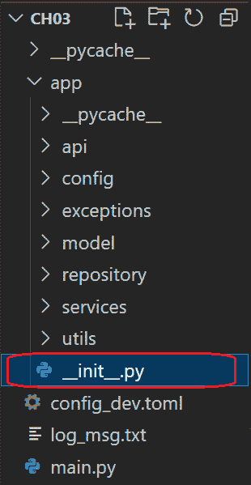
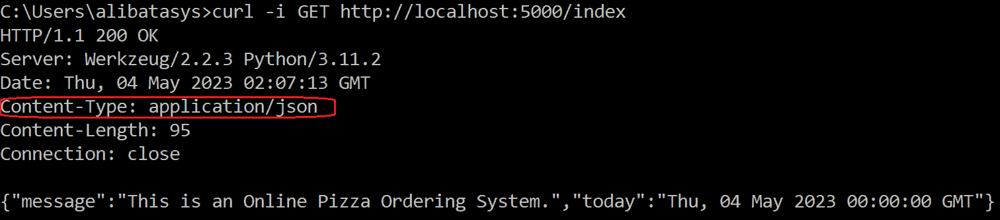
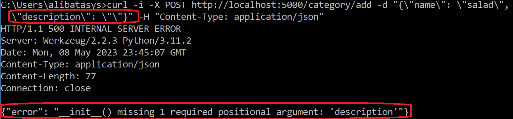

# <st c="0">3</st>

# <st c="2">创建 RESTful 网络服务</st>

<st c="28">尽管 Flask 是一个流行的轻量级网络框架，但它也可以支持 RESTful 网络服务的实现。</st> <st c="141">它有自己的 JSON 编码器和解码器，内置的 JSON 支持机制用于响应生成和错误处理，易于管理的 RESTful 请求分发，以及精简的配置方法。</st> <st c="340">与其他 API 框架不同，Flask 由于需要维护的项目结构，因此使用更多的模块和包。</st> <st c="474">然而，在相应地设置目录结构后，后续步骤将无缝、轻量级且直接。</st>

<st c="609">本章将介绍 Flask 框架中处理构建 API 端点以向子模块或其他应用程序提供数据和服务的部分。</st> <st c="776">目标是了解 Flask 如何管理在其环境中运行的 RESTful 端点的传入请求和传出响应。</st> <st c="918">此外，本章还将讨论将构成 Flask API 端点实现的各种组件。</st> <st c="1008">端点实现。</st>

<st c="1032">以下是本章将涵盖的主题，以了解使用 Flask 开发 API：</st> <st c="1112">：</st>

+   <st c="1123">设置</st> <st c="1137">RESTful 应用程序</st>

+   <st c="1156">实现</st> <st c="1170">API 端点</st>

+   <st c="1183">管理请求</st> <st c="1202">和响应</st>

+   <st c="1215">利用响应编码器</st> <st c="1244">和解码器</st>

+   <st c="1256">过滤 API 请求</st> <st c="1280">和响应</st>

+   <st c="1293">处理异常</st>

+   <st c="1313">消费</st> <st c="1324">API 端点</st>

# <st c="1337">技术要求</st>

<st c="1360">本章使用一个简单的在线披萨订购系统来展示 Flask 框架在开发 RESTful 网络服务方面的能力。</st> <st c="1504">第</st> `<st c="1508">3</st>` <st c="1512">个应用程序具有登录、产品库存、订单和支付模块，其业务范围是确定开发所需的 Flask 组件和实用工具。</st> <st c="1692">此外，还包含一个客户端应用程序</st> `<st c="1724">ch03-client</st>`<st c="1735">，以展示如何消费 Flask API 端点。</st> <st c="1822">这两个应用程序都使用 PostgreSQL 作为其数据库管理系统，并使用 SQLAlchemy 作为其 ORM。</st> <st c="1922">所有这些项目都已上传至</st> <st c="1954">[<st c="1957">https://github.com/PacktPublishing/Mastering-Flask-Web-Development/tree/main/ch03</st>](https://github.com/PacktPublishing/Mastering-Flask-Web-Development/tree/main/ch03)<st c="2038">。</st>

# <st c="2039">设置 RESTful 应用程序</st>

<st c="2072">首先，创建</st> <st c="2087">项目的虚拟环境，它将作为所需模块扩展的本地仓库。</st> <st c="2196">接下来，打开 VSCode 编辑器，创建主项目文件夹，并使用 VSCode 的命令行解释器通过</st> `<st c="2273">flask</st>` <st c="2278">扩展模块使用</st> `<st c="2306">pip</st>` <st c="2309">命令进行安装。</st>

<st c="2364">之后，管理目录结构，例如为</st> *<st c="2441">第二章</st>* <st c="2450">项目</st> <st c="2461">所做的安排。</st> <st c="2461">从三种方法中，即应用工厂设计，</st> `<st c="2527">蓝图</st>`<st c="2536">，以及这两种方法的混合，我们的在线披萨订购应用将使用应用工厂方法来放置其自定义异常类、模型、仓库、服务、实用工具、API 和数据库配置在一个</st> `<st c="2772">app</st>` <st c="2775">文件夹中，并使用</st> `<st c="2827">create_app()</st>` <st c="2839">方法注册所有这些组件。</st> *<st c="2848">图 3</st>**<st c="2856">.1</st>* <st c="2858">显示了我们的</st> <st c="2904">原型应用</st> <st c="2908">的项目目录结构。</st>



<st c="3055">图 3.1 – RESTful 应用的目录结构</st>

<st c="3123">日志设置、</st> <st c="3147">SQLAlchemy 声明性配置</st>，以及在第</st> *<st c="3213">第二章</st>* <st c="3222">中创建的会话都保留并用于此应用。</st> <st c="3270">另一方面，仍然放置在</st> `<st c="3293">create_app()</st>`<st c="3305">，位于</st> `<st c="3327">__init__.py</st>` <st c="3338">的</st> `<st c="3346">app</st>` <st c="3349">包中，实现如下：</st>

```py
 def create_app(config_file):
    app = Flask(__name__)
    app.config.from_file(config_file, toml.load)
    init_db()
    configure_logger('log_msg.txt')
    with app.app_context():
        from app.api import index
        … … … … … … …
        from app.api import orders
    return app
```

<st c="3625">`<st c="3630">main.py</st>` <st c="3637">仍然包含错误处理程序和服务器启动的</st> `<st c="3675">app.run()</st>` <st c="3684">方法。</st> <st c="3716">相同的命令，</st> `<st c="3734">python main.py</st>`<st c="3748">，将运行应用。</st> <st c="3776">然而，</st> `<st c="3789">ch03</st>` <st c="3793">应用</st> <st c="3806">将不是基于 Web 的</st> <st c="3828">而是基于 API 的。</st>

<st c="3842">让我们剖析我们的应用，并确定用于构建</st> <st c="3922">REST 服务</st> <st c="3926">的 Flask 组件。</st>

# <st c="3936">实现 API 端点</st>

<st c="3963">The implementation of</st> <st c="3986">API endpoints uses the same bolts and knots applied in creating web-based components in</st> *<st c="4074">Chapters 1</st>* <st c="4084">and</st> *<st c="4089">2</st>*<st c="4090">, such as declaring path variables, accessing the request through the</st> `<st c="4160">request</st>` <st c="4167">proxy object, returning the same</st> `<st c="4201">Response</st>` <st c="4209">object, and using the same</st> `<st c="4237">@route()</st>` <st c="4245">decorator.</st> <st c="4257">A GET API endpoint that returns a</st> *<st c="4291">JSON</st>* <st c="4295">response is</st> <st c="4308">as follows:</st>

```py
<st c="4319">@current_app.route("/index", methods = ['GET'])</st> def index():
   response = <st c="4392">make_response</st>(<st c="4407">jsonify</st>(message='This is an Online Pizza Ordering System.', today=date.today()), 200) <st c="4515">index()</st> function, found in the <st c="4546">app/api/index.py</st> module, is exactly similar to the web-based view function, except that <st c="4634">make_response()</st> requires the <st c="4663">jsonify()</st> instead of the <st c="4688">render_template()</st> method.
			<st c="4713">The</st> `<st c="4718">jsonify()</st>` <st c="4727">is a Flask utility method that serializes any data to produce an</st> `<st c="4793">application/json</st>` <st c="4809">response.</st> <st c="4820">It converts</st> *<st c="4832">multiple values</st>* <st c="4847">into an</st> *<st c="4856">array of data</st>* <st c="4869">and</st> *<st c="4874">key-value pairs</st>* <st c="4889">to a</st> *<st c="4895">dictionary</st>*<st c="4905">. It can also accept a</st> *<st c="4928">single-valued</st>* <st c="4941">entry.</st> <st c="4949">The</st> `<st c="4953">jsonify()</st>` <st c="4962">in the given</st> `<st c="4976">index()</st>` <st c="4983">function converts its arguments into a dictionary before calling Python’s</st> `<st c="5058">json.dumps()</st>` <st c="5070">method.</st> <st c="5079">After</st> `<st c="5085">json.dumps()</st>`<st c="5097">’s JSON serialization,</st> `<st c="5121">jsonify()</st>` <st c="5130">will contain and render the result as part of</st> `<st c="5177">Response</st>` <st c="5185">with a mime-type of</st> `<st c="5206">application/json</st>` <st c="5222">instead of a plain JSON string.</st> <st c="5255">Thus, running the given</st> `<st c="5279">/index</st>` <st c="5285">endpoint with the</st> `<st c="5304">curl -i</st>` <st c="5311">command will generate the following request</st> <st c="5356">header result:</st>
			

			<st c="5653">Figure 3.2 – Running the /index endpoint using cURL</st>
			<st c="5704">The response body</st> <st c="5723">provided by running the curl command against</st> `<st c="5768">/index</st>` <st c="5774">has a message body and response headers composed of</st> `<st c="5827">Server</st>`<st c="5833">,</st> `<st c="5835">Date</st>`<st c="5839">,</st> `<st c="5841">Content-Type</st>`<st c="5853">,</st> `<st c="5855">Content-Length</st>`<st c="5869">, and</st> `<st c="5875">Connection</st>`<st c="5885">.</st> `<st c="5887">Content-Type</st>` <st c="5899">indicates the resource type the</st> `<st c="5932">/index</st>` <st c="5938">API will return to the client.</st> <st c="5970">Aside from strings, the</st> `<st c="5994">jsonify()</st>` <st c="6003">method can also serialize and render an array of objects like in the following API function that returns an array of string data and some</st> <st c="6142">single-valued objects:</st>

```

<st c="6164">@current_app.route("/introduction", methods = ['GET'])</st> def introduction():

response = make_response(<st c="6265">jsonify('This is an application that … … … order requests, and provides payment receipts.')</st>, 200)

return response <st c="6380">@current_app.route("/company/trademarks", methods = ['GET'])</st> def list_goals():

response = make_response(<st c="6484">jsonify(['Eat', 'Live', 'Happy'])</st>, 200)

return response

```py

			<st c="6540">When the response data is not serializable,</st> `<st c="6585">jsonify()</st>` <st c="6594">can throw an exception, so it is advisable to enable error handlers.</st> <st c="6664">Now, it is customary to exclude</st> `<st c="6696">make_response</st>` <st c="6709">in returning the response data since</st> `<st c="6747">jsonify()</st>` <st c="6756">can already manage the</st> `<st c="6780">Response</st>` <st c="6788">generation alone for the endpoint function.</st> <st c="6833">Thus, the following versions of the</st> `<st c="6869">index()</st>`<st c="6876">,</st> `<st c="6878">introduction()</st>`<st c="6892">, and</st> `<st c="6898">list_goals()</st>` <st c="6910">endpoint functions</st> <st c="6930">are acceptable:</st>

```

<st c="6945">@current_app.route("/index", methods = ['GET'])</st> def index():

response = <st c="7018">jsonify(message='This is an Online Pizza Ordering System.', today=date.today())</st>, 200

return response <st c="7119">@current_app.route("/introduction", methods = ['GET'])</st> def introduction():

response = <st c="7205">jsonify('This is an application that … … … order requests, and provides payment receipts.')</st>, 200

return response <st c="7318">@current_app.route("/company/trademarks", methods = ['GET'])</st> def list_goals():

response = <st c="7408">jsonify(['Eat', 'Live', 'Happy'])</st>, 200

return response

```py

			<st c="7462">Using the</st> `<st c="7473">@app.route()</st>` <st c="7485">decorator</st> <st c="7495">to bind the URL pattern to the function and define the HTTP request is always valid.</st> <st c="7581">But Flask 3.x had released some decorator shortcuts that can assign one HTTP request per endpoint function, unlike the</st> `<st c="7700">@app.route()</st>`<st c="7712">, which can bind more than one HTTP request.</st> <st c="7757">These shortcuts are</st> <st c="7777">the following:</st>

				*   `<st c="7791">get()</st>`<st c="7797">: This defines an endpoint function that will listen to incoming</st> *<st c="7863">HTTP</st>* <st c="7868">GET requests, such as</st> <st c="7890">retrieving data from the</st> <st c="7915">database servers.</st>
				*   `<st c="7932">post()</st>`<st c="7939">: This</st> <st c="7947">defines an endpoint function to process an</st> *<st c="7990">HTTP POST</st>* <st c="7999">request, such as receiving a body of data for</st> <st c="8046">internal processing.</st>
				*   `<st c="8066">put()</st>`<st c="8072">: This defines an endpoint function to cater to</st> <st c="8121">any</st> *<st c="8125">HTTP PUT</st>* <st c="8133">requests, such as receiving a body of data containing updated details for the</st> <st c="8212">database server.</st>
				*   `<st c="8228">patch()</st>`<st c="8236">: This defines an endpoint to listen to an</st> *<st c="8280">HTTP PATCH</st>* <st c="8290">request</st> <st c="8298">that aims to modify some</st> <st c="8324">backend resources.</st>
				*   `<st c="8342">delete()</st>`<st c="8351">: This defines an</st> *<st c="8370">HTTP DELETE</st>* <st c="8381">endpoint function</st> <st c="8399">that will delete some</st> <st c="8422">server resources.</st>

			<st c="8439">The following</st> <st c="8454">employee-related transactions of our</st> `<st c="8491">ch03</st>` <st c="8495">application are all implemented using the shortcut</st> <st c="8547">routing decorators:</st>

```

<st c="8566">@current_app.post('/employee/add')</st> def add_employee():

    emp_json = request.get_json()

    repo = EmployeeRepository(db_session)

    employee = Employee(**emp_json)

    result = repo.insert(employee)

    if result:

        content = jsonify(emp_json)

        current_app.logger.info('insert employee record successful')

        return make_response(content, 201)

    else:

        raise DuplicateRecordException("insert employee record encountered a problem", status_code=500)

```py

			<st c="8989">The given</st> `<st c="9000">add_employee()</st>` <st c="9014">endpoint</st> <st c="9023">function performs a database INSERT transaction of a record of employee details received from the client.</st> <st c="9130">The decorated</st> `<st c="9144">@current_app.post()</st>` <st c="9163">makes the API function an HTTP POST request method.</st> <st c="9216">On the other hand, the following is an API function that responds to an HTTP GET</st> <st c="9297">client request:</st>

```

<st c="9312">@current_app.get('/employee/list/all')</st> def list_all_employee():

    repo = EmployeeRepository(db_session)

    records = repo.select_all()

    emp_rec = [rec.to_json() for rec in records]

    current_app.logger.info('retrieved a list of employees successfully')

    return jsonify(emp_rec)

```py

			<st c="9581">The</st> `<st c="9586">list_all_employee()</st>`<st c="9605">, defined by the</st> `<st c="9622">@current_app.get()</st>` <st c="9640">decorator, processes the incoming HTTP GET requests for retrieving a list of employee records from the database server.</st> <st c="9761">For an HTTP PUT transaction, here is an API that updates</st> <st c="9818">employee details:</st>

```

<st c="9835">@current_app.put('/employee/update')</st> def update_employee():

    emp_json = request.get_json()

    repo = EmployeeRepository(db_session)

    result = repo.update(emp_json['empid'], emp_json)

    if result:

        content = jsonify(emp_json)

        current_app.logger.info('update employee record successful')

        return make_response(content, 201)

    else:

        raise NoRecordException("update employee record encountered a problem", status_code=500)

```py

			<st c="10243">The given API endpoint requires an</st> `<st c="10279">empid</st>` <st c="10284">path variable, which will serve as the key to search for the employee record that needs updating.</st> <st c="10383">Since this is an HTTP PUT request, the transaction requires all the new employee details to be replaced by their new values.</st> <st c="10508">But the following is another version of the update transaction that does not need a complete</st> <st c="10600">employee</st> <st c="10610">detail update:</st>

```

<st c="10624">@current_app.patch('/employee/update/<string:empid>')</st> def update_employee_name(<st c="10704">empid:str</st>):

    emp_json = request.get_json()

    repo = EmployeeRepository(db_session)

    result = repo.update(empid, emp_json)

    if result:

        content = jsonify(emp_json)

        current_app.logger.info('update employee firstname, middlename, and lastname successful')

        return make_response(content, 201)

    else:

        raise NoRecordException("update employee firstname, middlename, and lastname encountered a problem", status_code=500)

```py

			`<st c="11111">update_employee()</st>`<st c="11129">, decorated by</st> `<st c="11144">@current_app.patch()</st>`<st c="11164">, only updates the first name, middle name, and last name of the employee identified by the given employee ID using its path variable</st> `<st c="11298">empid</st>`<st c="11303">. Now, the following API function deletes an employee record based on the</st> `<st c="11377">empid</st>` <st c="11382">path variable:</st>

```

<st c="11397">@current_app.delete('/employee/delete/<string:empid>')</st> def delete_employee(<st c="11473">empid:str</st>):

    repo = EmployeeRepository(db_session)

    result = repo.delete(empid)

    if result:

        content = jsonify(message=f'employee {empid} deleted')

        current_app.logger.info('delete employee record successful')

        return make_response(content, 201)

    else:

        raise NoRecordException("delete employee record encountered a problem", status_code=500)

```py

			`<st c="11809">delete_employee()</st>`<st c="11827">, decorated by</st> `<st c="11842">@current_app.delete()</st>`<st c="11863">, is an HTTP</st> `<st c="11876">DELETE</st>` <st c="11882">request method</st> <st c="11898">with the path variable</st> `<st c="11921">empid</st>`<st c="11926">, used for searching employee records</st> <st c="11964">for deletion.</st>
			<st c="11977">These shortcuts of binding HTTP requests to their respective request handler methods are appropriate for implementing REST services because of their definite, simple, and straightforward one-route approach to managing incoming requests and serializing the</st> <st c="12234">required responses.</st>
			<st c="12253">Let us now explore how Flask API captures the incoming body of data for POST, PUT, and PATCH requests and, aside from</st> `<st c="12372">make_response()</st>`<st c="12387">, what other ways the API can generate</st> <st c="12426">JSON responses.</st>
			<st c="12441">Managing requests and responses</st>
			<st c="12473">Unlike in other frameworks, it is</st> <st c="12508">easy to capture the request body of the incoming POST, PUT, and</st> <st c="12571">PATCH request in Flask, which is through the</st> `<st c="12617">get_json()</st>` <st c="12627">method from the</st> `<st c="12644">request</st>` <st c="12651">proxy object.</st> <st c="12666">This utility method receives the incoming JSON data, parses the data using</st> `<st c="12741">json.loads()</st>`<st c="12753">, and returns the data in a Python dictionary format.</st> <st c="12807">As seen in the following</st> `<st c="12832">add_customer()</st>` <st c="12846">API, the value of</st> `<st c="12865">get_json()</st>` <st c="12875">is converted into a</st> `<st c="12896">kwargs</st>` <st c="12902">argument by Python’s</st> `<st c="12924">**</st>` <st c="12926">operator before passing the request data to the model class’s constructor, an indication that the captured request data is a</st> `<st c="13052">dict</st>` <st c="13056">convertible</st> <st c="13069">into</st> `<st c="13074">kwargs</st>`<st c="13080">:</st>

```

@current_app.post('/customer/add')

def add_customer(): <st c="13138">cust_json = request.get_json()</st> repo = CustomerRepository(db_session) <st c="13207">customer = Customer(**cust_json)</st> result = repo.insert(customer)

        if result:

            content = jsonify(cust_json)

            current_app.logger.info('insert customer record successful')

            return make_response(content, 201)

        else:

            content = jsonify(message="insert customer record encountered a problem")

            return make_response(content, 500)

```py

			<st c="13521">Another</st> <st c="13529">common approach is to use the</st> `<st c="13560">request.json</st>` <st c="13572">property to</st> <st c="13585">capture the incoming message body, which is raw and with the mime-type</st> `<st c="13656">application/json</st>`<st c="13672">. The following endpoint function captures the incoming request through</st> `<st c="13744">request.json</st>` <st c="13756">and stores the data in the database as</st> `<st c="13796">category</st>` <st c="13804">information:</st>

```

@current_app.post('/category/add')

def add_category():

    if <st c="13876">request.is_json</st>: <st c="13894">cat_json = request.json</st> cat = Category(<st c="13933">**cat_json</st>)

        repo = CategoryRepository(db_session)

        result = repo.insert(cat)

        … … … … … …

    else:

        abort(500)

```py

			<st c="14039">Unlike</st> `<st c="14047">request.get_json()</st>`<st c="14065">, which uses serialization, validation, and other utilities to transform and return incoming data to JSON, the</st> `<st c="14176">request.json</st>` <st c="14188">property has no validation support other than raising an</st> `<st c="14246">HTTP status 400</st>` <st c="14261">or</st> `<st c="14265">Bad Data</st>` <st c="14273">error if the data is not JSON serializable.</st> <st c="14318">The</st> `<st c="14322">request.get_json()</st>` <st c="14340">returns</st> `<st c="14349">None</st>` <st c="14353">if the request data is not parsable.</st> <st c="14391">That is why it is best to pair the</st> `<st c="14426">request.is_json</st>` <st c="14441">Boolean property with</st> `<st c="14464">request.json</st>` <st c="14476">to verify the incoming request and filter the non-JSON</st> <st c="14532">message body to avoid</st> `<st c="14554">HTTP Status Code 500</st>`<st c="14574">. Another</st> <st c="14584">option is to check if the</st> `<st c="14610">Content-Type</st>` <st c="14622">request header of the incoming request is</st> `<st c="14665">application/json</st>`<st c="14681">, as showcased by the following</st> <st c="14713">API function:</st>

```

@current_app.post('/nonpizza/add')

def add_nonpizza(): <st c="14782">content_type = request.headers.get('Content-Type')</st><st c="14832">if content_type == 'application/json'</st>: <st c="14873">nonpizza_json = request.json</st> nonpizza = NonPizza(**nonpizza_json)

        … … … … … …

    else:

        abort(500)

```py

			<st c="14967">This</st> `<st c="14973">add_nonpizza()</st>` <st c="14987">function inserts a new record for the non-pizza menu options for the application, and it uses</st> `<st c="15082">request.json</st>` <st c="15094">to access the JSON-formatted input from the client.</st> <st c="15147">Both</st> `<st c="15152">request.json</st>` <st c="15164">and</st> `<st c="15169">request.get_json()</st>` <st c="15187">yield a dictionary object that makes the instantiation of model objects in the</st> `<st c="15267">add_category()</st>` <st c="15281">and</st> `<st c="15286">add_non_pizza()</st>` <st c="15301">API functions easier because</st> `<st c="15331">kwargs</st>` <st c="15337">transformation from these JSON data</st> <st c="15374">is straightforward.</st>
			<st c="15393">On the other hand, validation of incoming requests using</st> `<st c="15451">request.is_json</st>` <st c="15466">and</st> `<st c="15471">Content-Type</st>` <st c="15483">headers is also applicable to the POST, PUT, and DELETE message body retrieval through</st> `<st c="15571">request.get_json()</st>`<st c="15589">. Now, another approach to accessing the message body that requires</st> `<st c="15657">request.is_json</st>` <st c="15672">validation is through</st> `<st c="15695">request.data</st>`<st c="15707">. This property captures POST, PUT, or PATCH message bodies regardless of any</st> `<st c="15785">Content-Type</st>`<st c="15797">, thus requiring a thorough validation mechanism.</st> <st c="15847">The following API function captures user credentials through</st> `<st c="15908">request.data</st>` <st c="15920">and inserts the</st> <st c="15936">login details</st> <st c="15950">in</st> <st c="15954">the database:</st>

```

@current_app.route('/login/add', methods = ['POST'])

def add_login(): <st c="16038">if request.is_json:</st><st c="16057">login_json = loads(request.data)</st> login = Login(**login_json)

        … … … … … …

    else:

        abort(500)

```py

			<st c="16147">It is always feasible to use</st> `<st c="16177">request.data</st>` <st c="16189">for HTTP POST transactions, such as in the given</st> `<st c="16239">add_login()</st>` <st c="16250">function, but the API needs to parse and serialize the</st> `<st c="16306">request.data</st>` <st c="16318">using Flask’s built-in</st> `<st c="16342">loads()</st>` <st c="16349">decoder from the</st> `<st c="16367">flask.json</st>` <st c="16377">module extension because the request data is not yet JSON-formatted.</st> <st c="16447">Additionally, the process needs tight data type validation for each JSON object in the captured request data before using it in</st> <st c="16575">the transactions.</st>
			<st c="16592">Aside from these variations of managing the incoming requests, Flask also has approaches to dealing with outgoing JSON responses.</st> <st c="16723">Instead of</st> `<st c="16734">jsonify()</st>`<st c="16743">, another way to render a JSON response is by instantiating and returning</st> `<st c="16817">Response</st>` <st c="16825">to the client.</st> <st c="16841">The following is a</st> `<st c="16860">list_login()</st>` <st c="16872">endpoint function that retrieves a list of</st> `<st c="16916">Login</st>` <st c="16921">records from the database using the</st> `<st c="16958">Response</st>` <st c="16966">class:</st>

```

@current_app.route('/login/list/all', methods = ['GET'])

def list_all_login():

    repo = LoginRepository(db_session)

    records = repo.select_all()

    login_rec = [rec.to_json() for rec in records]

    current_app.logger.info('retrieved a list of login successfully') <st c="17229">resp = Response(response = dumps(login_rec),</st> <st c="17273">status=200, mimetype="application/json" )</st> return resp

```py

			<st c="17327">When</st> <st c="17333">using</st> `<st c="17339">Response</st>`<st c="17347">, an encoder such as</st> `<st c="17368">dumps()</st>` <st c="17375">of the</st> `<st c="17383">flask.json</st>` <st c="17393">module</st> <st c="17400">can be used to create a JSONable object from an object, list, or dictionary.</st> <st c="17478">And the</st> `<st c="17486">mime-type</st>` <st c="17495">should always be</st> `<st c="17513">application/json</st>` <st c="17529">to force the object to</st> <st c="17553">become JSON.</st>
			<st c="17565">Let us focus now on Flask’s built-in support for JSON types and the serialization and de-serialization utilities it has to process</st> <st c="17697">JSON objects.</st>
			<st c="17710">Utilizing response encoders and decoders</st>
			<st c="17751">Flask framework</st> <st c="17768">supports the built Python</st> `<st c="17794">json</st>` <st c="17798">module by default.</st> <st c="17818">The built-in encoders,</st> `<st c="17841">dumps()</st>`<st c="17848">, and</st> `<st c="17854">loads()</st>`<st c="17861">, are found in the</st> `<st c="17880">flask.json</st>` <st c="17890">module.</st> <st c="17899">In the</st> *<st c="17906">Managing the requests and responses</st>* <st c="17941">section, the</st> `<st c="17955">add_login()</st>` <st c="17966">endpoint function uses the</st> `<st c="17994">flask.json.loads()</st>` <st c="18012">to de-serialize and transform the</st> `<st c="18047">request.data</st>` <st c="18059">into a JSONable dictionary.</st> <st c="18088">Meanwhile, the</st> `<st c="18103">flask.json.dumps()</st>` <st c="18121">provided the</st> `<st c="18135">Response</st>` <st c="18143">class with a JSONable object for some JSON response output, as previously highlighted in the</st> `<st c="18237">list_all_login()</st>` <st c="18253">endpoint.</st>
			<st c="18263">But any application can override these default encoding and decoding processes to solve some custom requirements.</st> <st c="18378">Customizing an appropriate JSON provider by sub-classing Flask’s</st> `<st c="18443">JSONProvider</st>`<st c="18455">, found in the</st> `<st c="18470">flask.json.provider</st>`<st c="18489">, can allow the overriding of these JSON processes.</st> <st c="18541">The following is a custom implementation of a</st> `<st c="18587">JSONProvider</st>` <st c="18599">with some modifications to the</st> `<st c="18631">dumps()</st>` <st c="18638">and</st> `<st c="18643">loads()</st>` <st c="18650">algorithms:</st>

```

<st c="18662">from flask.json.provider import JSONProvider</st>

<st c="18707">import json</st> class ImprovedJsonProvider(<st c="18747">JSONProvider</st>):

    def __init__(self, *args, **kwargs):

        self.options = kwargs

        super().__init__(*args, **kwargs) <st c="18857">def default(self, o):</st>

<st c="18878">if isinstance(o, date):</st>

<st c="18902">返回 o.strftime("%m/%d/%Y")</st>

<st c="18932">elif isinstance(o, datetime):</st>

<st c="18962">返回 o.strftime("%m/%d/%Y, %H:%M:%S")</st>

<st c="19002">返回 super().default(self, o)</st>

<st c="19034">def dumps(self, obj, **kwargs):</st>

<st c="19066">kwargs.setdefault("default", self.default)</st><st c="19109">kwargs.setdefault("ensure_ascii", True)</st><st c="19149">kwargs.setdefault("sort_keys", True)</st>

<st c="19186">返回 json.dumps(obj, **kwargs)</st> def loads(self, s: str | bytes, **kwargs): <st c="19263">s_dict:dict = json.loads(s.decode('utf-8'))</st><st c="19306">s_sanitized = dict((k, v) for k, v in</st> <st c="19344">s_dict.items() if v)</st><st c="19365">s_str = json.dumps(s_sanitized)</st> return json.loads(<st c="19497">main.py</st> 模块并将 <st c="19527">app</st> 的 <st c="19534">json</st> 属性设置为自定义提供者的实例，其构造参数为 <st c="19599">app</st> 对象。以下是在线披萨订购原型中自定义 <st c="19681">ImprovedJsonprovider</st> 的设置：

```py
 app = create_app('../config_dev.toml') <st c="19835">JSONProvider</st> requires overriding its <st c="19872">dump()</st> and <st c="19883">loads()</st> methods. Additional custom features, such as formatting encoded dates, filtering empty JSON properties, and validating key and value types, can be helpful to custom implementation. For the serializer and de-serializer, the preferred JSON utility in customizing the <st c="20156">JSONProvider</st> is Python’s built-in <st c="20190">json</st> module.
			<st c="20202">The</st> `<st c="20207">ImprovedJsonprovider</st>` <st c="20227">class includes a custom</st> `<st c="20252">default()</st>` <st c="20261">method that validates the property value types during encoding.</st> <st c="20326">It coerces the</st> `<st c="20341">date</st>` <st c="20345">or</st> `<st c="20349">datetime</st>` <st c="20357">objects to have a defined format.</st> <st c="20392">For the application to utilize this method during encoding, the overridden</st> `<st c="20467">dumps()</st>` <st c="20474">must pass this</st> `<st c="20490">default()</st>` <st c="20499">to Python’s</st> `<st c="20512">json.dumps()</st>` <st c="20524">as the</st> `<st c="20532">kwargs["default"]</st>` <st c="20549">value.</st> <st c="20557">In addition, there are also other keyword arguments that can smoothen the encoding process, such as</st> `<st c="20657">ensure_scii</st>`<st c="20668">, which enables the replacement of non-ASCII characters with whitespaces, and</st> `<st c="20746">sort_keys</st>`<st c="20755">, which sorts the keys of the resulting dictionary in</st> <st c="20809">ascending order.</st>
			<st c="20825">On the other</st> <st c="20839">hand,</st> `<st c="20845">ImprovedJsonprovider</st>` <st c="20865">‘s overridden</st> `<st c="20880">loads()</st>` <st c="20887">method initially converts the string request data into a dictionary using Python’s</st> `<st c="20971">json.loads()</st>` <st c="20983">before removing all the key-value pairs with empty values.</st> <st c="21043">Afterward,</st> `<st c="21054">json.dumps()</st>` <st c="21066">serializes the sanitized dictionary back to its string type before submitting it for JSON de-serialization.</st> <st c="21175">Thus, running the</st> `<st c="21193">add_category()</st>` <st c="21207">endpoint with a message body that has an empty description value will lead to</st> *<st c="21286">HTTP Status Code 500</st>*<st c="21306">, as shown in</st> *<st c="21320">Figure 3</st>**<st c="21328">.3</st>*<st c="21330">:</st>
			

			<st c="21744">Figure 3.3 – Applying the overridden flask.json.loads() decoder</st>
			<st c="21807">The removal of the</st> `<st c="21827">description</st>` <st c="21838">property by the custom</st> `<st c="21862">loads()</st>` <st c="21869">caused the constructor error flagged in the</st> `<st c="21914">cURL</st>` <st c="21918">command execution in</st> *<st c="21940">Figure 3</st>**<st c="21948">.3</st>*<st c="21950">.</st>
			<st c="21951">Now, the following are</st> <st c="21975">the deprecated features that will not work anymore in Flask 3.x</st> <st c="22039">and onwards:</st>

				*   `<st c="22051">JSONEncoder</st>` <st c="22063">and</st> `<st c="22068">JSONDecoder</st>` <st c="22079">APIs customize</st> `<st c="22095">flask.json.dumps()</st>` <st c="22113">and</st> `<st c="22118">flask.json.loads()</st>`<st c="22136">, respectively.</st>
				*   `<st c="22151">json_encoder</st>` <st c="22164">and</st> `<st c="22169">json_decoder</st>` <st c="22181">attributes set up</st> `<st c="22200">JSONEncoder</st>` <st c="22211">and</st> `<st c="22216">JSONDecoder</st>`<st c="22227">, respectively.</st>

			<st c="22242">Also, the following setup applied in Python’s</st> `<st c="22289">json</st>` <st c="22293">encoder and decoder during customization will not work here in the</st> <st c="22361">Flask framework:</st>

				*   <st c="22377">Specifying the</st> `<st c="22393">flask.json.loads()</st>` <st c="22411">encoder directly with</st> <st c="22434">the custom.</st>
				*   <st c="22445">Specifying the</st> `<st c="22461">flask.json.dumps()</st>` <st c="22479">decoder directly with the custom implementation class using the non-existent</st> `<st c="22557">cls</st>` <st c="22560">kwarg.</st>

			<st c="22567">Since</st> `<st c="22574">JSONEcoder</st>` <st c="22584">and</st> `<st c="22589">JSONDecoder</st>` <st c="22600">will be obsolete soon, there will be no other means to customize these JSON utilities but through</st> <st c="22699">the</st> `<st c="22703">JSONProvider</st>`<st c="22715">.</st>
			<st c="22716">However, there are instances where the incoming message body or the outgoing JSON responses are complex and huge, which cannot be handled optimally by the built-in JSON provider.</st> <st c="22896">In this case, Flask allows replacing the existing provider with a fast, accurate, and flexible provider, such as</st> `<st c="23009">ujson</st>` <st c="23014">and</st> `<st c="23019">orjson</st>`<st c="23025">. The following class is a sub-class of the</st> `<st c="23069">JSONProvider</st>` <st c="23081">that uses the</st> `<st c="23096">orjson</st>` <st c="23102">encoder</st> <st c="23111">and decoder.</st>

```

从 flask.json.provider 模块导入 JSONProvider <st c="23169">导入 orjson</st> 类 OrjsonJsonProvider(JSONProvider):

    def __init__(self, *args, **kwargs):

        self.options = kwargs

        super().__init__(*args, **kwargs)

    def dumps(self, obj, **kwargs): <st c="23348">返回 orjson.dumps(obj,</st> <st c="23372">option=orjson.OPT_NON_STR_KEYS).decode('utf-8')</st> def loads(self, s, **kwargs): <st c="23478">OrjsonJsonProvider</st> 实现了一个自定义 JSON 提供者，它使用 <st c="23541">orjson</st>，这是一个支持多种类型（如 <st c="23620">datetime</st>，<st c="23630">dataclass</st>，<st c="23641">numpy</st> 类型，以及 <st c="23658">通用唯一</st> <st c="23677">标识符</st> (<st c="23690">UUID</st>））的最快 JSON 库之一。

            <st c="23697">另一个可以进一步改进我们的 RESTful 应用程序验证和处理传入请求体和传出响应的必要附加组件是</st> *<st c="23850">路由过滤器</st>*<st c="23863">。</st>

            <st c="23864">过滤 API 请求和响应</st>

            <st c="23901">在</st> *<st c="23905">第一章</st>*<st c="23914">中，由于自定义装饰器</st> `<st c="23986">@connect_db</st>`<st c="24021">，每个视图函数的 CRUD 操作成为可能，无需 ORM。该装饰器负责视图函数每次执行时的数据库连接和关闭。</st> <st c="24144">与任何 Python 装饰器一样，</st> `<st c="24178">@connect_db</st>` <st c="24189">在视图函数开始接收客户端请求之前执行，并在视图生成响应之后执行。</st>

            <st c="24327">另一方面，</st> *<st c="24347">第二章</st>* <st c="24356">介绍了使用</st> `<st c="24379">@before_request</st>` <st c="24394">和</st> `<st c="24399">@after_request</st>` <st c="24413">装饰器来管理视图函数的应用程序上下文。</st> <st c="24484">我们的应用程序使用它们来访问</st> `<st c="24533">db</st>` <st c="24535">对象以实现 SQLAlchemy 的数据库连接，实施用户身份验证，并执行</st> `<st c="24623">软件日志记录</st>`。</st>

            <st c="24640">使用装饰器来管理视图或 API 函数的请求和响应被称为路由过滤。</st> <st c="24749">以下是实现 Flask 的</st> `<st c="24794">before_request</st>` <st c="24808">和</st> `<st c="24813">after_request</st>` <st c="24826">方法，这些方法由</st> `<st c="24847">ch03</st>` <st c="24851">应用程序用于过滤</st> <st c="24878">请求-响应握手：</st>

```py
<st c="24905">from flask import request, abort, Response</st>
<st c="24948">@app.before_request</st> def before_request_func():
    api_method = request.method
    if api_method in ['POST', 'PUT', 'PATCH']:
        if request.json == '' or request.json == None:
            abort(500, description="request body is empty")
    api_endpoint_func = request.endpoint
    api_path = request.path
    app.logger.info(f'accessing URL endpoint: {api_path}, function name: {api_endpoint_func} ') <st c="25315">@app.after_request</st> def after_request_func(response:Response):
    api_endpoint_func = request.endpoint
    api_path = request.path
    resp_allow_origin = response.access_control_allow_origin
    app.logger.info(f"access_control_allow_origin header: {resp_allow_origin}")
    app.logger.info(f'exiting URL endpoint: {api_path}, function name: {api_endpoint_func} ')
    return response
```

            <st c="25676">在这个</st> <st c="25685">应用程序中，</st> `<st c="25698">before_request</st>` <st c="25712">检查传入的 HTTP POST、PUT 或 PATCH 事务的请求体是否为空或</st> `<st c="25752">None</st>`<st c="25805">。否则，它将引发一个</st> `<st c="25835">HTTP 状态码 500</st>` <st c="25855">，并带有错误消息</st> `<st c="25879">请求体为空</st>`<st c="25900">。它还执行日志记录以供审计目的。</st> <st c="25947">另一方面，</st> `<st c="25951">after_request</st>` <st c="25964">方法，另一方面，记录 API 的基本详细信息以供跟踪目的，并检查</st> `<st c="26062">access_control_allow_origin</st>` <st c="26089">响应头。</st> <st c="26107">强制参数 response 允许我们在软件需求给出时修改响应头。</st> <st c="26236">此外，这也是创建 cookie 和执行最后数据库提交的最佳位置，因为这是在</st> `<st c="26394">after_request</st>` <st c="26407">方法将其发送到</st> `<st c="26427">客户端</st>`之前的最后时刻访问响应对象。</st>

            <st c="26438">与 FastAPI 一样，Flask 框架也有其创建类似中间件组件的版本，这些组件可以作为全局路由过滤器。</st> <st c="26569">我们的应用程序有以下实现，它作为 API 端点的中间件：</st>

```py
<st c="26669">import werkzeug.wrappers</st>
<st c="26694">import werkzeug.wsgi</st> class AppMiddleware:
    def __init__(self, app):
        self.app = app
    def __call__(self, environ, start_response):
        request = <st c="26832">werkzeug.wrappers.Request</st>(environ)
        api_path = request.url
        app.logger.info(f'accessing URL endpoint: {api_path} ')
        iterator:<st c="26956">werkzeug.wsgi.ClosingIterator</st> = self.app(environ, start_response)
        app.logger.info(f'exiting URL …: {api_path} ') <st c="27145">AppleMiddleware</st>, the involved <st c="27175">Request</st> API class is from the <st c="27205">werkzeug</st> module or the core platform itself since the implementation is server-level. Instantiating the <st c="27309">werkzeug.wrappers.Request</st> with the <st c="27344">environ</st> parameter as its constructor argument will give us access to the details of the incoming request of the API endpoint. Unfortunately, there is no direct way of accessing the response object within the filter class. Some implementations require the creation of hook methods by registering custom decorators to Flask through the custom middleware, and others use external modules to implement a middleware that acts like a URL dispatcher. Now, our custom middleware must be a callable class type, so all the implementations must be in its overridden <st c="27899">__call__()</st> method.
			<st c="27917">Moreover, we can</st> <st c="27935">also associate</st> `<st c="27950">Blueprint</st>` <st c="27959">modules with their respective</st> <st c="27990">custom before and after filter methods, if required.</st> <st c="28043">The following</st> `<st c="28057">app</st>` <st c="28060">configuration assigns filter methods to the</st> `<st c="28105">order_cient_bp</st>` <st c="28119">and</st> `<st c="28124">pizza_client_bp</st>` `<st c="28139">Blueprint</st>`<st c="28149">s of the</st> `<st c="28159">ch03-client</st>` <st c="28170">application:</st>

```

app.<st c="28188">before_request_funcs</st> = {

    'orders_client_bp': [before_check_api_server],

    'pizza_client_bp': [before_log_pizza_bp]

}

app.<st c="28308">after_request_funcs</st> = {

    'orders_client_bp': [after_check_api_server],

    'pizza_client_bp': [after_log_pizza_bp]

}

```py

			<st c="28420">Both</st> `<st c="28426">before_request_funcs</st>` <st c="28446">and</st> `<st c="28451">after_request_funcs</st>` <st c="28470">contain the concerned</st> `<st c="28493">Blueprint</st>` <st c="28502">names and their corresponding lists of implemented filter</st> <st c="28561">method names.</st>
			<st c="28574">Can we also apply the same exception-handling directives used in the web-based applications of</st> *<st c="28670">Chapters 1</st>* <st c="28680">and</st> *<st c="28685">2</st>*<st c="28686">? Let us find out in the</st> <st c="28711">following discussion.</st>
			<st c="28732">Handling exceptions</st>
			<st c="28752">In RESTful applications, Flask</st> <st c="28784">allows the endpoint function to trigger error handlers that return error messages in JSON format.</st> <st c="28882">The following snippets are the error handlers of our</st> `<st c="28935">ch03</st>` <st c="28939">application:</st>

```

@app.errorhandler(404)

def not_found(e): <st c="28994">return jsonify(error=str(e)), 404</st> @app.errorhandler(400)

def bad_request(e): <st c="29071">return jsonify(error=str(e)), 400</st> def server_error(e):

    print(e) <st c="29135">return jsonify(error=str(e)), 500</st> app.register_error_handler(500, server_error)

```py

			<st c="29214">Error handlers can also return the JSON response through the</st> `<st c="29276">jsonify()</st>`<st c="29285">,</st> `<st c="29287">make_response()</st>`<st c="29302">, or</st> `<st c="29307">Response</st>` <st c="29315">class.</st> <st c="29323">As shown in the given error handlers, the implementation is the same with the web-based error handlers except for the</st> `<st c="29441">jsonify()</st>` <st c="29450">method, which serializes the captured error message to the JSON type instead of</st> <st c="29531">using</st> `<st c="29537">render_template()</st>`<st c="29554">.</st>
			<st c="29555">Custom exception</st> <st c="29573">classes must include both the</st> *<st c="29603">HTTP Status Code</st>* <st c="29619">and error message in the JSON message.</st> <st c="29659">The customization must include a</st> `<st c="29692">to_dict()</st>` <st c="29701">method that will convert the payload and other external parameters to a dictionary object for the</st> `<st c="29800">jsonify()</st>` <st c="29809">to serialize.</st> <st c="29824">The following is a custom exception class raised by our</st> `<st c="29880">INSERT</st>` <st c="29886">repository transactions and</st> <st c="29915">endpoint functions:</st>

```

class DuplicateRecordException(HTTPException):

    status_code = 500

    def __init__(self, message, status_code=None, payload=None):

        super().__init__()

        self.message = message

        if status_code is not None:

            self.status_code = status_code

        self.payload = payload <st c="30292">DuplicateRecordException</st>，以下错误处理程序将访问其<st c="30362">to_dict()</st>实例方法并通过<st c="30419">jsonify()</st>将其转换为 JSON。它还将访问响应的<st c="30454">status_code</st>：

```py
 @app.errorhandler(<st c="30502">DuplicateRecordException</st>)
def insert_record_exception(e):
    return <st c="30686">Database</st> <st c="30694">RecordException</st>, triggering this <st c="30728">insert_record_exception()</st> handler. But for Python-related exceptions, the following error handler will also render the built-in exception messages in JSON format:

```

@app.errorhandler(Exception)

def handle_built_exception(e):

    if isinstance(e, HTTPException):

        return e <st c="31032">handle_built_exception()</st>处理程序将始终返回一个 JSON 格式的错误消息，并为其他自定义处理程序抛出 Werkzeug 特定的异常。但对于抛出的 Python 特定异常，<st c="31238">handle_built_exception()</st>将直接渲染 JSON 错误消息。

            `<st c="31307">在构建我们的 RESTful 应用程序所需组件完成后，是时候使用</st>` `<st c="31434">客户端应用程序</st>` `<st c="31434">消耗这些 API 端点了。</st>`

            <st c="31453">消耗 API 端点</st>

            `<st c="31477">我们的</st>` `<st c="31482">ch03-client</st>` `<st c="31493">项目是一个</st>` `<st c="31505">基于 Web 的 Flask 应用程序，它利用了在</st> `<st c="31582">ch03</st>` `<st c="31586">应用程序中创建的 API 端点。</st>` `<st c="31600">到目前为止，使用</st>` `<st c="31670">requests</st>` `<st c="31678">扩展模块是消耗 Flask API 端点最简单的方法。</st>` `<st c="31697">要安装</st>` `<st c="31712">requests</st>` `<st c="31720">库，请运行以下命令：</st>

```py
 pip install requests
```

            <st c="31777">此</st> `<st c="31783">requests</st>` `<st c="31791">模块有一个</st> `<st c="31805">get()</st>` `<st c="31810">辅助方法，用于向 URL 发送 HTTP GET 请求以检索一些服务器资源。</st>` `<st c="31897">以下来自</st> `<st c="31934">ch03-client</st>` `<st c="31945">项目` `<st c="31934">的视图函数从</st> `<st c="32007">ch03</st>` `<st c="32011">应用程序中检索客户和员工列表，并将它们作为上下文数据传递给</st> `<st c="32063">add_order.html</st>` `<st c="32077">模板：</st>`

```py
 @current_app.route('/client/order/add', methods = ['GET', 'POST'])
def add_order():
    if request.method == 'POST':
        order_dict = request.form.to_dict(flat=True) <st c="32246">order_add_api = "http://localhost:5000/order/add"</st><st c="32295">response: requests.Response =</st> <st c="32325">requests.post(order_add_api, json=order_dict)</st><st c="32371">customers_list_api =</st> <st c="32392">"http://localhost:5000/customer/list/all"</st><st c="32434">employees_list_api =</st> <st c="32455">"http://localhost:5000/employee/list/all"</st><st c="32497">resp_customers:requests.Response = requests.get(customers_list_api)</st><st c="32565">resp_employees:requests.Response = requests.get(employees_list_api)</st> return render_template('add_order.html', customers=<st c="32747">get()</st> method returns a <st c="32770">requests.Response</st> object that contains essential details, such as <st c="32836">content</st>, <st c="32845">url</st>, <st c="32850">status_code</st>, <st c="32863">json()</st>, <st c="32871">encoding</st>, and other headers from the API’s server. Our <st c="32926">add_order()</st> calls the <st c="32948">json()</st> for each GET response to serialize the result in JSON format.
			<st c="33016">For the HTTP POST transaction, the</st> `<st c="33052">request</st>` <st c="33059">module has a</st> `<st c="33073">post()</st>` <st c="33079">method to send an HTTP POST request to</st> `<st c="33119">http://localhost:5000/order/add</st>` <st c="33151">API.</st> <st c="33156">For a successful POST request handshake, the</st> `<st c="33201">post()</st>` <st c="33207">requires the URL of the API service and the record or object as the request body in</st> <st c="33292">dictionary format.</st>
			<st c="33310">Aside from the dictionary type, the</st> `<st c="33347">post()</st>` <st c="33353">method can also allow the submission of a list of</st> *<st c="33404">tuples</st>*<st c="33410">,</st> *<st c="33412">bytes</st>*<st c="33417">, or</st> *<st c="33422">file entity types</st>*<st c="33439">. It also has various parameter options such as</st> `<st c="33487">data</st>`<st c="33491">,</st> `<st c="33493">json</st>`<st c="33497">, or</st> `<st c="33502">files</st>` <st c="33507">that can accept the appropriate</st> <st c="33539">request</st> <st c="33548">body types.</st>
			<st c="33559">Now, other than</st> `<st c="33576">get()</st>` <st c="33581">and</st> `<st c="33586">post()</st>` <st c="33592">methods, the</st> `<st c="33606">requests</st>` <st c="33614">library has other helper methods that can also send other HTTP requests to the server, such as the</st> `<st c="33714">put()</st>` <st c="33719">that calls the PUT API service,</st> `<st c="33752">delete()</st>` <st c="33760">that calls DELETE API service, and</st> `<st c="33796">patch()</st>` <st c="33803">for the PATCH</st> <st c="33818">API service.</st>
			<st c="33830">Summary</st>
			<st c="33838">This chapter has proven to us that some components apply to both API-based and web-based applications, but there are specific components that fit better in API transactions than in web-based ones.</st> <st c="34036">It provided details on Flask’s JSON de-serialization applied to request bodies and serialization of outgoing objects to be part of the API responses.</st> <st c="34186">The many options of capturing the request body through</st> `<st c="34241">request.json</st>`<st c="34253">,</st> `<st c="34255">request.data</st>`<st c="34267">, and</st> `<st c="34273">request.get_json()</st>` <st c="34291">and generating responses through its</st> `<st c="34329">jsonify()</st>` <st c="34338">or</st> `<st c="34342">make_response()</st>` <st c="34357">and</st> `<st c="34362">Response</st>` <st c="34370">class with</st> `<st c="34382">application/json</st>` <st c="34398">as a mime-type show Flask’s flexibility as</st> <st c="34442">a framework.</st>
			<st c="34454">The chapter also showcased Flask’s ability to adapt to different third-party JSON providers through sub-classing its</st> `<st c="34572">JSONProvider</st>` <st c="34584">class.</st> <st c="34592">Moreover, the many options for providing our API endpoints with route filtering mechanisms also show that the platform can manage the application’s incoming requests and outgoing responses like any good framework.</st> <st c="34806">Regarding error handling mechanisms, the framework can provide error handlers for web-based applications that render templates and those that send JSON responses for</st> <st c="34972">RESTful applications.</st>
			<st c="34993">When consuming the API endpoints, this chapter exhibited that Flask could support typical Python REST client modules, such as</st> `<st c="35120">requests</st>`<st c="35128">, without any</st> <st c="35142">additional workaround.</st>
			<st c="35164">So, we have seen that Flask can support building web-based and API-based applications even though it is lightweight and</st> <st c="35285">a microframework.</st>
			<st c="35302">The next chapter will discuss simplifying and organizing Flask implementations using popular third-party Flask</st> <st c="35414">module extensions.</st>

```

```py

```

```py

```

```py

```

```py

```
