# 第七章：<st c="0">6</st>

# <st c="2">开发计算和科学应用</st>

<st c="54">计算科学家总是选择易于使用、有效和准确的基于 GUI 的应用程序来进行他们的发现、分析、综合、数据挖掘和数值计算，以节省时间和精力，为他们的研究得出结论。</st> <st c="303">尽管市场上提供了强大的计算工具，如 Maple、Matlab、MathCAD 和 Mathematica，但科学家仍然更喜欢可以提供进一步定制的机制，以便应用他们所需的精度、准确性和校准到他们的数学和统计模型。</st> <st c="611">换句话说，他们仍然更喜欢可以与他们的实验室设置</st> <st c="711">和参数相匹配的定制应用程序。</st>

<st c="726">由于最高优先级是提供科学家在给定无限数据的情况下准确的结果，因此选择什么应用程序框架来构建适合他们需求的可扩展、实时和快速模块始终是一个挑战。</st> <st c="973">最终要求是创建和运行异步事务以执行复杂的数值算法，这是异步 Flask</st> <st c="1104">可以提供的。</st>

<st c="1116">Flask 有异步组件，可以为科学家构建复杂、快速和实时的应用程序。</st> <st c="1228">由于其灵活性、异步特性和广泛的支持，这个框架提供了完整的构建模块，可以为科学家提供定制的</st> <st c="1403">科学软件。</st>

<st c="1423">本章将介绍 Flask[async] 可以提供的以下计算构建模块：</st>

+   <st c="1522">上传</st> **<st c="1533">逗号分隔值</st>** <st c="1555">(</st>**<st c="1557">CSV</st>**<st c="1560">) 和</st> **<st c="1567">Microsoft Excel 工作表</st>** <st c="1595">(</st>**<st c="1597">XLSX</st>**<st c="1601">) 文档</st> <st c="1614">用于计算</st>

+   <st c="1627">实现符号计算</st> <st c="1662">与可视化</st>

+   <st c="1680">使用</st> `<st c="1691">pandas</st>` <st c="1697">模块进行数据和</st> <st c="1718">图形分析</st>

+   <st c="1736">创建和渲染</st> <st c="1760">LaTeX 文档</st>

+   <st c="1775">使用</st> <st c="1807">前端库</st> <st c="1811">构建图形图表</st>

+   <st c="1825">使用 WebSocket 和</st> **<st c="1876">服务器端事件</st>** **<st c="1888">（SSE）</st> <st c="1894">(</st>**<st c="1896">SSE</st>**<st c="1899">)</st>

+   <st c="1901">使用异步后台任务进行</st> <st c="1941">资源密集型计算</st>

+   <st c="1972">将 Julia 包与 Flask</st> <st c="2002">集成</st>

# <st c="2012">技术要求</st>

<st c="2035">本章将重点介绍一个</st> *<st c="2092">在线房价预测与分析</st>* <st c="2138">软件原型，该原型预计将在许多科学应用中出现。</st> <st c="2217">首先，它具有简单而正式的图形用户界面，通过表单捕获用户数据。</st> <st c="2292">使用的表单将要求输入公式、变量值和常数，并具有提供图形图表的能力，无论是实时还是计算后立即显示。</st> <st c="2470">其次，它是一个可以在团队或组织中访问的 Web 应用程序。</st> <st c="2556">最后，该应用程序可以使用</st> <st c="2640">Flask 平台</st>异步运行高度计算的任务。

<st c="2655">本章中使用的测试数据来自</st> [<st c="2700">https://www.kaggle.com/datasets/yasserh/housing-prices-dataset</st>](https://www.kaggle.com/datasets/yasserh/housing-prices-dataset) <st c="2762">和</st> [<st c="2767">https://data.world/finance/international-house-price-database</st>](https://data.world/finance/international-house-price-database)<st c="2828">。另一方面，本项目采用</st> `<st c="2871">蓝图</st>` <st c="2880">方法来管理模块和组件。</st> <st c="2931">所有文件均可在</st> <st c="2955">以下链接</st> [<st c="2958">https://github.com/PacktPublishing/Mastering-Flask-Web-Development/tree/main/ch06</st>](https://github.com/PacktPublishing/Mastering-Flask-Web-Development/tree/main/ch06)<st c="3039">找到。</st>

# <st c="3040">上传 CSV 和 XLSX 文档进行计算</st>

<st c="3087">该应用程序</st> <st c="3103">将处理</st> <st c="3114">包含影响全球房价的数值数据的 XLSX 和 CSV 文件，例如每个国家的周期性实际和</st> <st c="3232">名义</st> **<st c="3240">房价指数</st>** <st c="3257">(</st>**<st c="3259">HPI</st>**<st c="3262">) 以及客户的</st> <st c="3308">名义和实际</st> **<st c="3308">个人可支配收入</st>** <st c="3334">(</st>**<st c="3336">PDI</st>**<st c="3339">)。</st> <st c="3360">此外，一些文档将展示诸如房屋面积、装修状况、主要道路偏好以及卧室和浴室数量等因素如何影响一个国家的房价。</st> <st c="3557">我们的应用程序将把这些文档上传到服务器进行</st> <st c="3619">数据分析。</st>

<st c="3633">Flask 通过一个具有</st> `<st c="3726"><form></st>` <st c="3732">和</st> `<st c="3738">enctype</st>` <st c="3745">为</st> `<st c="3749">multipart/form-data</st>`<st c="3768">的 HTML</st> `<st c="3726"><form></st>` <st c="3732">表单支持单个或多个文件的上传过程。它将所有上传的文件存储在</st> `<st c="3806">request.files</st>` <st c="3819">字典中，作为</st> `<st c="3834">FileStorage</st>` <st c="3845">实例。</st> `<st c="3857">FileStorage</st>` <st c="3868">是 Flask 使用的 Werkzeug 模块中的一个薄包装类，用于表示传入的文件。</st> `<st c="3963">以下是一个 HTML 脚本，它使用</st> `<st c="4048">pandas</st>` <st c="4059">模块上传 XLSX 文档以进行数据分析：</st>

```py
 <!DOCTYPE html>
<html lang="en">
  … … … … … …
  <body>
    <h1>Data Analysis … Actual House Price Index (HPI)</h1>
    <form action="{{request.path}}" method="POST" <st c="4221">enctype="multipart/form-data"</st>>
        Upload XLSX file: <st c="4271"><input type="file" name="data_file"/></st><br/>
        <input type="submit" value="Upload File"/>
    </form>
  </body><br/> <st c="4379"></st><st c="4403"><p>No analysis.</p></st><st c="4423"></st><st c="4434">{{ table | safe}}</st><st c="4452"></st> </html>
```

<st c="4472">以下代码片段显示了</st> `<st c="4505">view</st>` <st c="4509">函数的实现，该函数渲染给定的页面并接受</st> `<st c="4577"> incoming</st>` <st c="4586"> XLSX 文档：</st>

```py
 from modules.upload import upload_bp
from flask import render_template, request, current_app <st c="4695">from werkzeug.utils import secure_filename</st>
<st c="4737">from werkzeug.datastructures import FileStorage</st> import os <st c="4796">from pandas import read_excel</st>
<st c="4825">from exceptions.custom import (NoneFilenameException, InvalidTypeException, MissingFileException,</st> <st c="4923">FileSavingException)</st> @upload_bp.route('/upload/xlsx/analysis', methods = ["GET", "POST"])
async def show_analysis():
    if request.method == 'GET':
        df_tbl = None
    else:
        uploaded_file:FileStorage = request.files['data_file']
        filename = secure_filename(uploaded_file.filename) <st c="5195">if filename == '':</st><st c="5213">raise NoneFilenameException()</st> file_ext = os.path.splitext(filename)[1]
        if file_ext not in current_app.config['UPLOAD_FILE_TYPES']: <st c="5345">raise InvalidTypeException()</st> if  uploaded_file.filename == '' or uploaded_file == None: <st c="5432">raise MissingFileException()</st> try:
            df_xlsx = read_excel(uploaded_file, sheet_name=2, skiprows=[1])
            df_tbl = df_xlsx.loc[: , 'Australia':'US'].describe().to_html()
        except: <st c="5602">raise FileSavingException()</st> return render_template("file_upload_pandas_xlsx.html", table=df_tbl), 200
```

<st c="5703">与任何表单参数一样，视图函数通过表单字段的名称从</st> `<st c="5777">request.files</st>` <st c="5790">访问文件对象。</st> <st c="5827">文件对象，封装在一个</st> `<st c="5857">FileStorage</st>` <st c="5868">包装器中，提供了以下属性：</st>

+   `<st c="5912">filename</st>`<st c="5921">: 这提供了文件对象的原始文件名。</st>

+   `<st c="5974">stream</st>`<st c="5981">: 这提供了输入流对象，该对象可以发出输入/输出方法，例如</st> `<st c="6062">read()</st>`<st c="6068">,</st> `<st c="6070">write()</st>`<st c="6077">,</st> `<st c="6079">readline()</st>`<st c="6089">,</st> `<st c="6091">writelines()</st>`<st c="6103">,</st> <st c="6105">和</st> `<st c="6109">seek()</st>`<st c="6115">.</st>

+   `<st c="6116">headers</st>`<st c="6124">: 这包含文件的</st> `<st c="6152">header</st>`<st c="6156">信息。</st>

+   `<st c="6171">content-length</st>`<st c="6186">: 这与文件的</st> `<st c="6235"> content-length</st>`<st c="6239">头有关。</st>

+   `<st c="6244">content-type</st>`<st c="6257">: 这与文件的</st> `<st c="6304">content-type</st>`<st c="6308">头有关。</st>

<st c="6313">它还包含以下可以在运行时管理文件的方法：</st>

+   `<st c="6389">save(destination)</st>`<st c="6407">: 这会将文件放置在</st> `<st c="6434">目的地</st>`<st c="6438">。</st>

+   `<st c="6448">close()</st>`<st c="6456">: 如果需要，这会关闭文件。</st>

<st c="6494">在访问文件进行读取、写入、转换或保存之前，视图函数必须对收到的文件对象应用验证和限制。</st> `<st c="6655">以下是需要注意的以下区域，以设置</st>` `<st c="6711">红旗：</st>`

+   <st c="6721">实际</st> `<st c="6750">上传的文件</st>

+   <st c="6763">一个</st> `<st c="6766">清理过的文件名</st>

+   `<st c="6784">接受的文件有效扩展名</st>` `<st c="6817">为</st>`

+   `<st c="6825">接受的</st>` `<st c="6839">文件大小</st>`

给定的`<st c="6848">show_analysis()</st>` `<st c="6859">视图函数</st>` `<st c="6874">在遇到前一个</st>` `<st c="6981">红旗</st>` `<st c="6981">问题</st>`时引发以下自定义异常类：

+   `<st c="6991">NoneFilenameException</st>` `<st c="7013">: 当请求中没有文件名时引发。</st>`

+   `<st c="7072">InvalidTypeException</st>` `<st c="7093">: 当清理后的文件名给出空值时引发。</st>`

+   `<st c="7160">InvalidTypeException</st>` `<st c="7181">: 当上传的文件扩展名不被</st>` `<st c="7256">应用程序</st>` `<st c="7256">支持</st>`时引发。

此外，部分关注点是，在利用任何文件事务之前，对多部分对象的文件名进行清理。<st c="7272">立即使用</st>` `<st c="7427">filename</st>` `<st c="7435">属性</st>` `<st c="7435">的</st>` `<st c="7453">FileStorage</st>` `<st c="7464">实例</st>`可能会使应用程序暴露于多个漏洞，因为`<st c="7536">filename</st>` `<st c="7544">可能包含与恶意软件相关的符号，一些可疑的特殊字符，以及表示文件路径的字符，例如`<st c="7671">../../</st>` `<st c="7677">`，这可能会与`<st c="7712">save()</st>` `<st c="7718">方法</st>` `<st c="7718">产生问题。</st>` `<st c="7727">要执行文件名清理，请使用</st>` `<st c="7767">secure_filename()</st>` `<st c="7784">实用方法</st>` `<st c="7784">的</st>` `<st c="7807">werkzeug.utils</st>` `<st c="7821">模块。</st>` `<st c="7830">另一方面，我们的一些应用程序视图函数将上传的文件保存在我们项目的文件夹中，但将它们存储在项目目录之外仍然是</st>` `<st c="8005">最佳实践。</st>`

最后，始终使用`<st c="8019">try-except</st>` `<st c="8043">子句</st>` `<st c="8046">包围</st>` `<st c="8046">视图函数的全部文件事务</st>`，并引发必要的异常类以记录运行时可能出现的所有底层问题。<st c="8225">现在，让我们讨论使用</st>` `<st c="8291">pandas</st>` `<st c="8297">模块</st>` `<st c="8297">上传文件后的过程。</st>`

# 使用`<st c="8305">pandas 模块进行数据和分析</st>`

<st c="8361">pandas</st> <st c="8366">模块是一个</st> <st c="8372">流行的 Python 数据分析库，因为它易于应用的功能函数和名为</st> `<st c="8583">numpy</st>` <st c="8588">模块的高性能表格数据结构，一个支持多维数组对象和其数学运算的低级库，称为</st> `<st c="8670">ndarray</st>` <st c="8677">，以及</st> `<st c="8715">matplotlib</st>`<st c="8725">，一个用于可视化的库。</st> <st c="8757">因此，首先安装这两个</st> <st c="8779">模块：</st>

```py
 pip install numpy matplotlib
```

<st c="8822">然后，安装</st> `<st c="8841">pandas</st>` <st c="8847">模块：</st>

```py
 pip install pandas
```

<st c="8874">由于我们的数据将来自 XLSX 工作表，请安装处理读取和写入</st> `<st c="8935">openpyxl</st>` <st c="8943">依赖模块的</st> `<st c="8965">pandas</st>` <st c="8971">模块，该模块处理读取和写入</st> `<st c="9008">XLSX 文档：</st>

```py
 pip install openpyxl
```

<st c="9044">安装所有依赖模块后，我们可以开始创建</st> `<st c="9116">DataFrame</st>` <st c="9126">对象。</st>

## <st c="9133">利用 DataFrame</st>

<st c="9157">要读取一个</st> <st c="9168">XLSX 文档，pandas</st> <st c="9194">模块有一个</st> `<st c="9208">read_excel()</st>` <st c="9220">方法，具有</st> `<st c="9252">usecols</st>`<st c="9259">等参数，该参数表示要包含的列或列的范围，</st> `<st c="9321">skiprows</st>`<st c="9329">，它从列行开始选择要跳过的行，以及</st> `<st c="9396">sheet_name</st>`<st c="9406">，它从工作表</st> `<st c="9460">0</st>`<st c="9461">开始选择要读取的工作表。以下是从之前的</st> `<st c="9495">show_analysis()</st>` <st c="9510">视图中的数据检索，包括工作表</st> `<st c="9554">2</st>` <st c="9555">，排除</st> `<st c="9583">行</st>` `<st c="9587">1</st>`<st c="9588">：</st>

```py
 df_xlsx = read_excel(uploaded_file, sheet_name=2, skiprows=[1])
```

<st c="9653">此结果将与以下从样本</st> <st c="9715">上传文件</st> <st c="9722">的快照相似：</st>

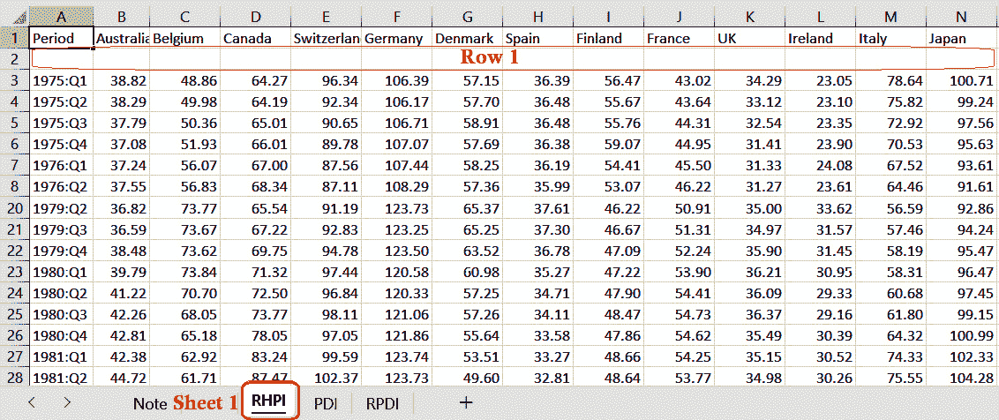

<st c="11351">图 6.1 – 包含 HPI 和 PDI 数据的样本 XLSX 文档</st>

*<st c="11414">图 6</st>**<st c="11423">.2</st>* <st c="11425">显示了一个</st> <st c="11433">样本</st> `<st c="11441">DataFrame</st>` <st c="11450">对象</st>，该对象是从上传的房价数据集中提取到 `<st c="11515">show_analysis()</st>` <st c="11530">视图函数</st> 的。

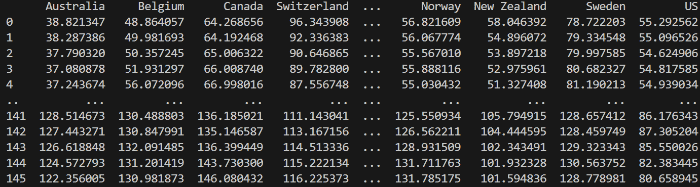

<st c="12527">图 6.2 – 从上传文件中提取的样本 DataFrame</st>

<st c="12580">DataFrame</st>对象具有易于使用的属性，可以提取表格的一部分，例如<st c="12583">DataFrame</st> <st c="12592">对象有易于使用的属性，可以提取表格的一部分，例如</st> <st c="12676">shape</st> <st c="12681">、</st> <st c="12683">size</st> <st c="12687">、</st> <st c="12689">axes</st> <st c="12693">、</st> <st c="12695">at</st> <st c="12697">、</st> <st c="12699">columns</st> <st c="12706">、</st> <st c="12708">indexes</st> <st c="12715">、</st> <st c="12717">ndim</st> <st c="12721">、</st> <st c="12723">iloc</st> <st c="12727">和</st> <st c="12733">loc</st> <st c="12736">。如果目标是仅提取从澳大利亚到美国的列，则</st> <st c="12811">loc</st> <st c="12814">属性应指示 DataFrame <st c="12866">对象将从中筛选分析列的范围，如下面的代码片段所示：</st>

```py
 df_tbl = df_xlsx.loc[: , 'Australia':'US'].describe().to_html()
```

<st c="13010">loc <st c="13015">属性通过选择列标签或范围访问数据值，而其 iloc <st c="13103">对应属性使用列索引来切片 DataFrame <st c="13153">实例，如 df_tbl <st c="13182">。这两个属性都发出数学方法，如 count() <st c="13241">、</st> mean() <st c="13250">、</st> sum() <st c="13258">、</st> mode() <st c="13265">、</st> std() <st c="13273">和</st> var() <st c="13284">。然而，给定的视图函数利用 describe() <st c="13337">方法从 1975 年到当前年度的实际 HPI 值季度数据中提取从澳大利亚到美国的列数据。</st> <st c="13483">以下是上传有效的住房数据集 XLSX 文档时我们视图的实际输出：</st>

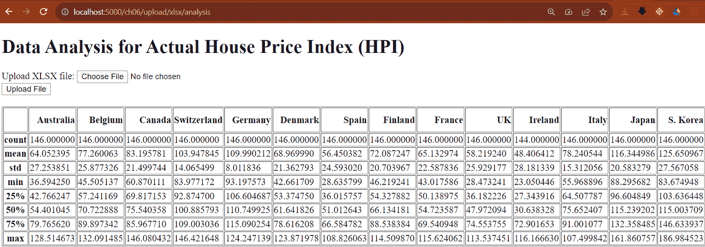

<st c="15018">图 6.3 – show_analysis()视图的示例输出</st>

<st c="15074">当使用 Flask 渲染数据值时，DataFrame <st c="15119">对象有三个实用方法，可以提供格式化后的结果。</st> <st c="15201">以下是这三个方法：</st>

+   `<st c="15228">to_html()</st>` <st c="15238">：这生成一个带有数据集的 HTML 表格格式。</st>

+   `<st c="15295">to_latex()</st>` <st c="15306">：这创建了一个 LaTeX 格式的结果，数据已准备好进行 PDF 转换。</st>

+   `<st c="15390">to_markdown()</st>` <st c="15404">：这生成一个带有数据值的 Markdown 模板。</st>

<st c="15469">在</st> <st c="15481">show_analysis()</st><st c="15500">的情况下，它使用</st> `<st c="15510">to_html()</st>` <st c="15519">将所有捕获的数据集通过</st> `<st c="15581">to_html()</st>`<st c="15590">渲染为 HTML 表格。然而，这种渲染方式仅适用于</st> `<st c="15639">safe</st>` <st c="15643">Jinja2 过滤器，因为出于安全目的，Jinja2 不会自动对</st> `<st c="15739">to_html()</st>` <st c="15748">提供的所有字符进行 HTML 转义。</st> *<st c="15772">图 6</st>**<st c="15780">.3</st>* <st c="15782">显示了从包含值的</st> `<st c="15839">DataFrame</st>` <st c="15848">实例使用其</st> `<st c="15890">to_html()</st>` <st c="15899">方法渲染的表格值的原始结果。</st>

## <st c="15907">使用 matplotlib 绘制图表和图表</st>

<st c="15952">当数据包含在</st> `<st c="15997">DataFrame</st>` <st c="16006">对象的两维数据结构中时，绘制数据很容易。</st> <st c="16046">matplotlib</st> <st c="16060">内置支持将表格值渲染为</st> *<st c="16120">线</st>*<st c="16124">、*<st c="16126">条形图</st>*<st c="16129">、*<st c="16131">饼图</st>*<st c="16134">或其他图形或图表类型。</st> <st c="16166">由于我们的应用程序是一个 Web 应用程序，我们的视图函数必须将这些视觉元素渲染为图像，这与返回 JSON 资源的 REST 应用程序不同，后者为前端框架提供资源。</st>

<st c="16341">现在，第一步是创建一个</st> `<st c="16377">Figure</st>` <st c="16383">对象。</st> <st c="16392">一个</st> `<st c="16394">Figure</st>` <st c="16400">对象根据可视化方法作为图表或子图的画布。</st> <st c="16490">它是由</st> `<st c="16532">figure()</st>` <st c="16540">方法创建的一个普通空白对象，该方法属于</st> `<st c="16555">matplotlib</st>` <st c="16565">模块或</st> `<st c="16580">Figure</st>` <st c="16586">辅助类，该类属于</st> `<st c="16607">matplotlib.figure</st>` <st c="16624">模块。</st> <st c="16633">在最终确定绘图之前，它具有以下需要配置的基本属性：</st>

+   `<st c="16726">figsize</st>`<st c="16734">: 这用于测量画布尺寸的 x 轴和 y 轴。</st>

+   `<st c="16800">dpi</st>`<st c="16804">: 这用于测量绘图每英寸的点数。</st>

+   `<st c="16855">linewidth</st>`<st c="16865">: 这用于测量画布的边框线。</st>

+   `<st c="16911">edgecolor</st>`<st c="16921">: 这应用于画布边框的颜色。</st>

+   `<st c="16973">facecolor</st>`<st c="16983">: 这将应用指定的颜色到画布边框和坐标轴之间的边界区域</st> <st c="17081">绘图边框。</st>

<st c="17097">以下视图实现上传文件，从上传的 XLSX 文档创建一个</st> `<st c="17158">数据框</st>` <st c="17167">对象，并从表格值渲染线图：</st>

```py
 from pandas import read_excel <st c="17288">from numpy import arange</st>
<st c="17312">from matplotlib.figure import Figure</st>
<st c="17349">from io import BytesIO</st>
<st c="17372">import base64</st> @upload_bp.route("/upload/xlsx/rhpi/plot/belgium", methods = ['GET', 'POST'])
async def upload_xlsx_hpi_belgium_plot():
    if request.method == 'GET':
        data = None
    else:
        … … … … …
        try:
            df_rhpi = read_excel(uploaded_file, sheet_name=2, <st c="17618">usecols='C'</st>, skiprows=[1])
            array_rhpi = df_rhpi.to_numpy().flatten()
            array_hpi_index = arange(0, array_rhpi.size ) <st c="17733">fig = Figure(figsize=(6, 6), dpi=72,</st> <st c="17769">edgecolor='r', linewidth=2, facecolor='y')</st><st c="17812">axis = fig.subplots()</st> axis.<st c="17840">plot</st>(array_hpi_index, array_rhpi)
            axis.<st c="17881">set_xlabel</st>('Quarterly Duration')
            axis.<st c="17921">set_ylabel</st>('House Price Index')
            axis.<st c="17960">set_title</st>("Belgium's HPI versus RHPI")
            … … … … … … <st c="18013">output = BytesIO()</st><st c="18031">fig.savefig(output, format="png")</st><st c="18065">data = base64.b64encode(output.getbuffer())</st> <st c="18109">.decode("ascii")</st> except:
            raise FileSavingException()
    return render_template("file_upload_xlsx_form.html", <st c="18271">Figure</st> canvas is now 6 inches x 6 inches in dimension, as managed by its <st c="18344">figsize</st> parameter. By default, a <st c="18377">Figure</st> canvas is 6.4 and 4.8 inches. Also, the borderline has an added 2units in thickness, with an <st c="18477">edgecolor</st> value of ‘<st c="18497">r</st>’, a single character shorthand for color red, and a <st c="18552">facecolor</st> value of ‘<st c="18572">y</st>’ character notation, which means color yellow. *<st c="18622">Figure 6</st>**<st c="18630">.4</st>* shows the outcome of the given details of the canvas:
			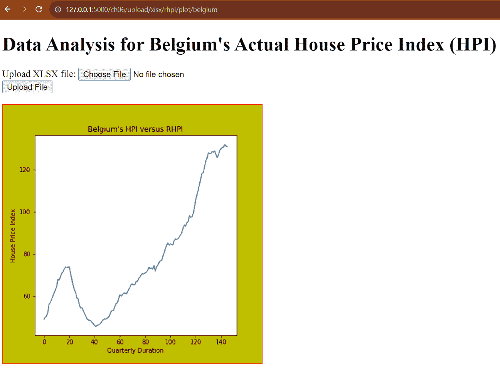

			<st c="18806">Figure 6.4 – A line graph with a customized Figure instance</st>
			<st c="18865">The next step is to draw up the data values from the</st> `<st c="18919">DataFrame</st>` <st c="18928">object using</st> `<st c="18942">Axes</st>` <st c="18946">or the plot of the</st> `<st c="18966">Figure</st>`<st c="18972">.</st> `<st c="18974">Axes</st>`<st c="18978">, not the x-axis and y-axis, is the area on the</st> `<st c="19026">Figure</st>` <st c="19033">canvas where the visualization will happen.</st> <st c="19077">There are two ways to create an</st> `<st c="19109">Axes</st>` <st c="19113">instance:</st>

				*   <st c="19123">Using the</st> `<st c="19134">subplots()</st>` <st c="19144">method of</st> <st c="19155">the</st> `<st c="19159">Figure</st>`<st c="19165">.</st>
				*   <st c="19166">Using the</st> `<st c="19177">subplots()</st>` <st c="19187">method of the</st> `<st c="19202">matplotlib</st>` <st c="19212">module.</st>

			<st c="19220">Since there is already an existing</st> `<st c="19256">Figure</st>` <st c="19262">instance, the former is the appropriate approach to create the plotting area.</st> <st c="19341">The latter returns a tuple containing a new</st> `<st c="19385">Figure</st>` <st c="19391">instance, with</st> `<st c="19407">Axes</st>` <st c="19411">all in with one</st> <st c="19428">method call.</st>
			<st c="19440">Now, an</st> `<st c="19449">Axes</st>` <st c="19453">instance has almost all the necessary utilities for setting up any</st> `<st c="19521">Figure</st>` <st c="19527">component, such as</st> `<st c="19547">plot()</st>`<st c="19553">,</st> `<st c="19555">axis()</st>`<st c="19561">,</st> `<st c="19563">bar()</st>`<st c="19568">,</st> `<st c="19570">pie()</st>`<st c="19575">, and</st> `<st c="19581">tick_params()</st>`<st c="19594">. In the given</st> `<st c="19609">upload_xlsx_hpi_belgium_plot()</st>`<st c="19639">, the goal is to create a Line2D graph of the actual HPI values of Belgium by using the</st> `<st c="19727">plot()</st>` <st c="19733">method.</st> <st c="19742">The extracted DataFrame tabular data focuses only on the</st> `<st c="19799">Belgium</st>` <st c="19806">column (column C), as indicated by the</st> `<st c="19846">usecols</st>` <st c="19853">parameter of the</st> `<st c="19871">read_excel()</st>` <st c="19883">statement:</st>

```

df_rhpi = read_excel(uploaded_file, sheet_name=2, <st c="19978">plot()</st>的 x-值或 <st c="20000">scalex</st> 将有从 <st c="20030">0</st> 到捕获的 HPI 值最大数的 ndarray，其 y-值或 <st c="20098">scaley</st> 将有比利时的 HPI 值。其颜色参数设置为 <st c="20172">#fc0366</st> 以改变线图的默认蓝色。除了 <st c="20243">plot()</st>，<st c="20251">坐标轴</st> 还具有 <st c="20260">set_title()</st> 以添加图像的标题，<st c="20309">set_xlabel()</st> 以添加 x-值的描述，<st c="20362">set_ylabel()</st> 以添加 y-值的描述，<st c="20405">set_facecolor()</st> 以改变文本的字体颜色，以及 <st c="20463">tick_params()</st> 以更新 x 和 y 刻度值的颜色。 <st c="20525">坐标轴</st> 还具有如 <st c="20558">xaxis</st> 和 <st c="20568">yaxis</st> 之类的属性，以将新的颜色应用到 x 和 y 轴描述和脊上，并调整绘图 <st c="20654">linewidth</st> 和 <st c="20668">edgecolor</st>。</st>

            <st c="20690">在完成绘图细节后，创建一个</st> `<st c="20735">BytesIO</st>` <st c="20742">缓冲对象来包含</st> `<st c="20772">图</st>` <st c="20778">实例。</st> <st c="20789">将</st> `<st c="20800">图</st>` <st c="20806">保存到</st> `<st c="20810">BytesIO</st>` <st c="20817">是解码为内联图像所必需的。</st> <st c="20873">视图必须将</st> `<st c="20896">base64</st>`<st c="20902">-编码的图像传递给其 Jinja2 模板以进行渲染。</st> <st c="20956">通过</st> `<st c="20994"><url></st>` <st c="20999">标签渲染内联图像是一种快速显示图像的方法。</st> *<st c="21040">图 6</st>**<st c="21048">.5</st>* <st c="21050">显示了比利时样本实际 HPI 数据集的更新线图。</st> <st c="21112">。</st>

            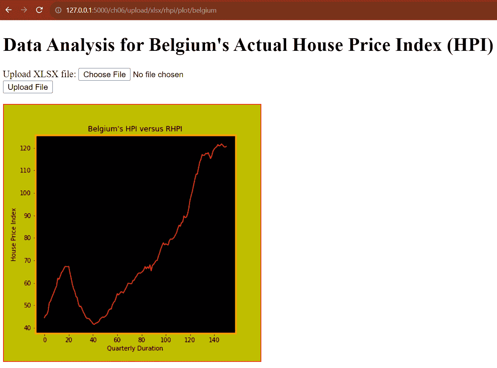

            <st c="21401">图 6.5 – 比利时样本实际 HPI 数据集的最终线图</st>

            <st c="21477">如果我们</st> <st c="21491">有一个</st> <st c="21494">多个</st> <st c="21499">图表</st> <st c="21508">在一个</st> `<st c="21522">坐标轴</st>` <st c="21526">绘图</st>中呢？</st>

            <st c="21532">渲染多个线图</st>

            <st c="21563">根据</st> <st c="21580">可视化的</st> <st c="21589">目标，</st> `<st c="21612">pandas</st>` <st c="21618">模块与</st> `<st c="21631">matplotlib</st>` <st c="21641">可以处理 DataFrame 对象数据值的复杂图形渲染。</st> <st c="21717">以下视图函数创建两个线形图，可以比较基于样本数据集的比利时实际和名义 HPI 值：</st>

```py
 @upload_bp.route("/upload/xlsx/rhpi/hpi/plot/belgium", methods = ['GET', 'POST'])
async def upload_xlsx_belgium_hpi_rhpi_plot():
    if request.method == 'GET':
        data = None
    else:
        … … … … … …
        try: <st c="22045">df_hpi = read_excel(uploaded_file,</st> <st c="22079">sheet_name=1, usecols='C', skiprows=[1])</st><st c="22120">df_rhpi = read_excel(uploaded_file,</st> <st c="22156">sheet_name=2, usecols='C', skiprows=[1])</st><st c="22197">array_hpi = df_hpi.to_numpy().flatten()</st> array_hpi_index = arange(0, df_rhpi.size ) <st c="22281">array_rhpi = df_rhpi.to_numpy().flatten()</st> array_rhpi_index = arange(0, df_rhpi.size )
            fig = Figure(figsize=(7, 7), dpi=72, edgecolor='#140dde', linewidth=2, facecolor='#b7b6d4')
            axes = fig.subplots() <st c="22481">lbl1,</st> = axes.plot(array_hpi_index ,array_hpi, color="#32a8a2") <st c="22544">lbl2</st>, = axes.plot(array_rhpi_index ,array_rhpi, color="#bf8a26")
            axes.set_xlabel('Quarterly Duration')
            axes.set_ylabel('House Price Index') <st c="22684">axes.legend([lbl1, lbl2], ["HPI", "RHPI"])</st> axes.set_title("Belgium's HPI versus RHPI")
            … … … … … …
        except:
            raise FileSavingException()
    return render_template("file_upload_xlsx_sheets_form.html", data=data), 200
```

            <st c="22894">与之前的</st> `<st c="22920">upload_xlsx_hpi_belgium_plot()</st>` <st c="22950">视图相比，</st> `<st c="22957">upload_xlsx_belgium_hpi_rhpi_plot()</st>` <st c="22992">利用上传文件的工作簿中的两个工作表，即</st> `<st c="23059">sheet[1]</st>` <st c="23067">用于名义 HPI 和</st> `<st c="23092">sheet[2]</st>` <st c="23100">用于比利时实际 HPI 值。</st> <st c="23139">它从每个工作表导出单独的</st> `<st c="23159">DataFrame</st>` <st c="23168">对象的表格值，并绘制一个 Line2D 图来比较两个数据集之间的趋势。</st> <st c="23285">与本章中之前的向量变换类似，这个视图仍然使用</st> `<st c="23369">numpy</st>` <st c="23374">来展平从 DataFrame 的</st> `<st c="23437">to_numpy()</st>` <st c="23447">实用方法中提取的垂直向量。</st> <st c="23464">顺便说一下，视图函数只为两个图表使用一个</st> `<st c="23508">Axes</st>` <st c="23512">绘图。</st>

            <st c="23534">此外，视图还展示了包含一个</st> `<st c="23767">Axes</st>`<st c="23771">，但这个视图捕获了从</st> `<st c="23824">plot()</st>` <st c="23830">方法调用中的 Line2D 对象，并使用</st> `<st c="23893">Axes</st>`<st c="23897">的</st> `<st c="23900">legend()</st>` <st c="23908">方法将每个图表映射到一个字符串标签。</st> *<st c="23917">图 6</st>**<st c="23925">.6</st>* <st c="23927">显示了运行</st> `<st c="23956">upload_xlsx_belgium_hpi_rhpi_plot()</st>` <st c="23991">并上传一个</st> <st c="24009">XLSX 文档的结果。</st>

            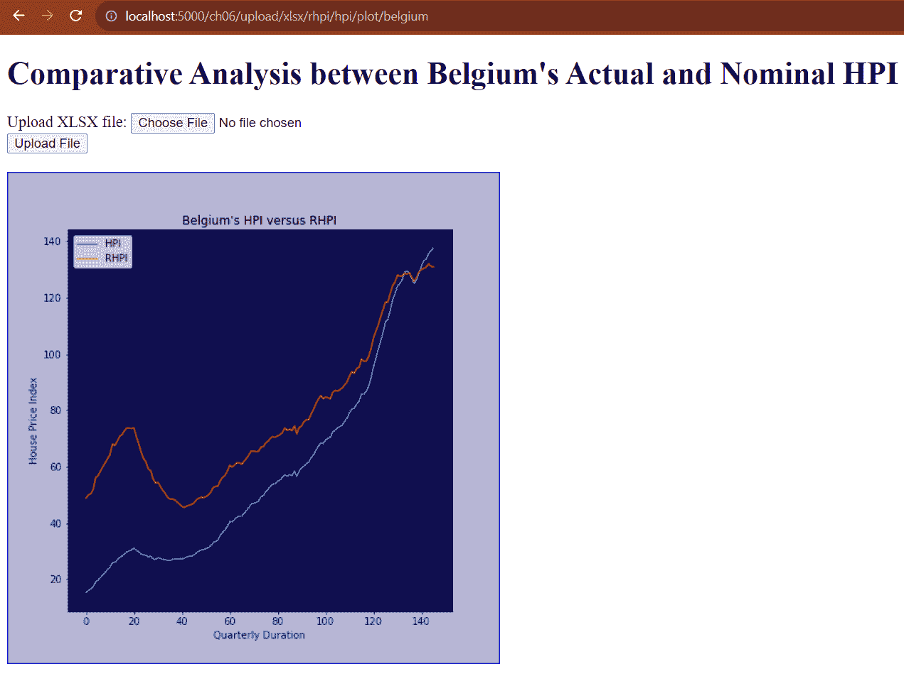

            <st c="24301">图 6.6 – 一个 Axes 图中两个线形图</st>

            下一个，我们将<st c="24346">了解如何</st> <st c="24364">使用 Flask 绘制饼图</st> <st c="24392">。</st>

            <st c="24403">从 CSV 文件渲染饼图</st>

            <st c="24441">The</st> `<st c="24446">pandas</st>` <st c="24452">模块</st> <st c="24460">也可以通过其</st> `<st c="24506">read_csv()</st>` <st c="24516">方法</st> <st c="24525">从 CSV 文件中读取数据。</st> <st c="24525">与</st> `<st c="24535">read_excel()</st>`<st c="24547">不同，</st> `<st c="24553">pandas</st>` <st c="24559">模块读取有效的 CSV 文件不需要任何依赖。</st> <st c="24621">以下视图使用</st> `<st c="24645">read_csv()</st>` <st c="24655">创建用于绘制饼图的值的 DataFrame：</st>

```py
<st c="24713">from pandas import read_csv</st> @upload_bp.route("/upload/csv/pie", methods = ['GET', 'POST'])
async def upload_csv_pie():
    if request.method == 'GET':
        data = None
    else:
        … … … … … …
        try: <st c="24896">df_csv = read_csv(uploaded_file)</st><st c="24928">matplotlib.use('agg')</st> fig = plt.figure()
            axes = fig.add_subplot(1, 1, 1) <st c="25002">explode = (0.1, 0, 0)</st><st c="25023">axes.pie(df_csv.groupby(['FurnishingStatus'])</st><st c="25069">['Price'].count(), colors=['#bfe089', '#ebd05b', '#e67eab'],</st><st c="25130">labels =["Furnished","Semi-Furnished", "Unfurnished"], autopct ='% 1.1f %%',</st><st c="25207">shadow = True, startangle = 90,</st> <st c="25239">explode=explode)</st><st c="25256">axes.axis('equal')</st><st c="25275">axes.legend(loc='lower right',fontsize=7,</st> <st c="25317">bbox_to_anchor = (0.75, -01.0) )</st> … … … … … …
        except:
            raise FileSavingException()
    return render_template("file_upload_csv_pie_form.html", data=data), 200
```

            <st c="25469">The</st> `<st c="25474">pandas</st>` <st c="25480">模块</st> <st c="25488">也可以通过其</st> `<st c="25534">read_csv()</st>` <st c="25544">方法</st> <st c="25553">从 CSV 文件中读取数据。</st> <st c="25553">与</st> `<st c="25563">read_excel()</st>`<st c="25575">不同，</st> `<st c="25581">pandas</st>` <st c="25587">模块读取有效的 CSV 文件不需要任何依赖。</st>

            <st c="25648">另一方面，</st> `<st c="25672">Axes</st>`<st c="25676">’</st> `<st c="25679">pie()</st>` <st c="25684">方法在达到适合数据值的适当饼图之前需要考虑几个参数。</st> <st c="25792">以下是</st> `<st c="25836">upload_csv_pie()</st>` <st c="25852">视图函数使用的部分参数：</st>

                +   `<st c="25867">explode</st>`<st c="25875">: 这提供了一个分数数字列表，指示围绕扇区的空间，使它们突出。</st>

                +   `<st c="25987">colors</st>`<st c="25994">: 这提供了一个颜色列表，可以是</st> `<st c="26021">matplotlib</st>`<st c="26031">的内置命名颜色或设置为每个小部件的十六进制格式化颜色代码。</st>

                +   `<st c="26120">labels</st>`<st c="26127">: 这提供了分配给每个小部件的字符串值列表。</st>

                +   `<st c="26192">autopct</st>`<st c="26200">: 这提供了每个小部件的字符串格式化百分比值。</st>

                +   `<st c="26268">shadow</st>`<st c="26275">: 这允许在饼图周围添加阴影。</st>

                +   `<st c="26327">startangle</st>`<st c="26338">: 这提供了一个旋转角度，用于饼图从其第一个扇区开始。</st>

            给定的`<st c="26447">upload_csv_pie()</st>` `<st c="26463">is to</st>` `<st c="26469">generate</st>` `<st c="26478">a pie chart based on the number of projected house prices (</st>` `<st c="26538">Price</st>` `<st c="26544">) per furnishing status (</st>` `<st c="26570">FurnishingStatus</st>` `<st c="26587">), namely the</st>` `<st c="26602">Furnished</st>` `<st c="26611">,</st>` `<st c="26613">Semi-furnished</st>` `<st c="26627">, and</st>` `<st c="26633">Fully-furnished</st>` `<st c="26648">houses.</st>` `<st c="26657">The</st>` `<st c="26661">groupby()</st>` `<st c="26670">method of the</st>` `<st c="26685">df_csv</st>` `<st c="26691">DataFrame extracts the needed data values for the</st>` `<st c="26742">pie()</st>` `<st c="26747">method.</st>` `<st c="26756">Now, running this view function will render the</st>` `<st c="26804">following chart:</st>`

            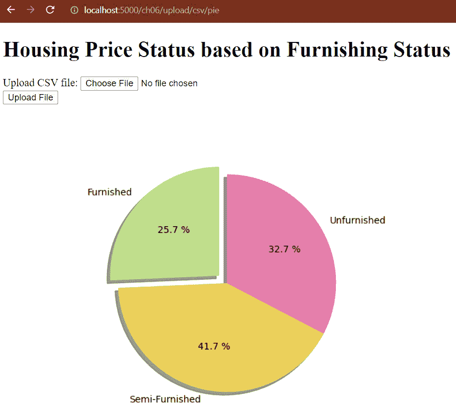

            `<st c="26951">Figure 6.7 – 饰面状态偏好饼图</st>`

            如果保存饼图图形时产生以下警告信息，`<st c="27077">UserWarning: Starting a Matplotlib GUI outside of the main thread will likely fail.</st>`，则添加`<st c="27166">matplotlib.use('agg')</st>`在任何创建`<st c="27217">Figure</st>` `<st c="27223">instance</st>` `<st c="27233">to</st>` `<st c="27235">enable</st>` `<st c="27242">the non-interactive backend mode for writing files outside the</st>` `<st c="27306">main thread.</st>`之前，以启用非交互式后端模式，以便在主线程外写入文件。

            如果我们在一个`<st c="27367">Figure</st>` `<st c="27373">>`中有多多个`<st c="27349">Axes</st>` `<st c="27353">plots`呢？

            `<st c="27374">Rendering multiple Axes plots</st>`

            `<st c="27403">一个 Figure 可以</st>` `<st c="27416">包含</st>` `<st c="27425">多个不同图表和图形的 plot。</st>` `<st c="27476">科学应用通常具有 GUI，可以渲染不同数据校准、转换和分析的多个图表。</st>` `<st c="27604">以下视图函数上传一个 XLSX 文档，并在一个</st>` `<st c="27685">Figure</st>` `<st c="27691">>`上创建四个 plot，以创建从文档中提取的 DataFrame 数据值的不同的图形：</st>`

```py
 @upload_bp.route("/upload/xlsx/multi/subplot", methods = ['GET', 'POST'])
async def upload_xlsx_multi_subplots():
    if request.method == 'GET':
        data = None
    else:
        … … … … … …
        try:
            df_xlsx = read_excel(uploaded_file, sheet_name=2, skiprows=[1]) <st c="28201">axes1</st>, creates two line graphs of the actual HPI values of Australia and Belgium for all the quarterly periods, as indicated in the following code block:

```

`<st c="28354">axes1.plot(df_xlsx.index.values,</st><st c="28387">df_xlsx['Australia'], 'green',</st><st c="28418">df_xlsx.index.values,</st><st c="28440">df_xlsx['Belgium'], 'red',)</st>` `axes1.set_xlabel('季度持续时间')`

        `axes1.set_ylabel('House Price Index')`

        `axes1.set_title('澳大利亚……之间的 RHPI')`

```py

			<st c="28591">The second plot,</st> `<st c="28609">axes2</st>`<st c="28614">, generates a bar chart depicting the mean HPI values of all countries in the tabular values, as shown in the following</st> <st c="28734">code block:</st>

```

`index = arange(df_xlsx.loc[: , 'Australia':'US'].shape[1])` `<st c="28805">axes2.bar(index, df_xlsx.loc[: ,</st> `<st c="28837">'Australia':'US'].mean(),</st><st c="28863">color=(0.1, 0.1, 0.1, 0.1), edgecolor='blue')</st>` `axes2.set_xlabel('国家 ID')`

        `axes2.set_ylabel('Mean HPI')`

        `axes2.set_xticks(index)`

        `axes2.set_title('Mean RHPI among countries')`

```py

			<st c="29038">The third plot,</st> `<st c="29055">axes3</st>`<st c="29060">, plots all HPI values of each country in the tabular values from 1975 to the current year, creating multiple</st> <st c="29170">line graphs:</st>

```

<st c="29182">axes3.plot(df_xlsx.loc[: , 'Australia':'US'])</st> axes3.set_xlabel('季度持续时间')

            axes3.set_ylabel('房价指数')

            axes3.set_title('各国 RHPI 趋势')

```py

			<st c="29351">The last</st> <st c="29361">plot,</st> `<st c="29367">axes4</st>`<st c="29372">, builds a</st> <st c="29383">grouped bar chart showing the HPI values of Japan, South Korea, and New Zealand quarterly</st> <st c="29473">in 1975:</st>

```

width = 0.3 <st c="29494">axes4.bar(df_xlsx.loc[0:3,</st> <st c="29520">'Japan'].index.values-width, df_xlsx.loc[0:3,</st> <st c="29566">'Japan'], width=width, color='#d9182b',</st> <st c="29606">label="JP")</st><st c="29618">axes4.bar(df_xlsx.loc[0:3, 'S.</st> <st c="29649">Korea'].index.values, df_xlsx.loc[0:3, 'S.</st> <st c="29692">Korea'], width=width, color='#f09ec1',</st> <st c="29731">label="SK")</st><st c="29743">axes4.bar(df_xlsx.loc[0:3, 'New</st> <st c="29775">Zealand'].index.values+width, df_xlsx.loc[0:3,</st> <st c="29822">'New Zealand'], width=width, color='#000',</st> <st c="29865">label="NZ")</st> axes4.set_xlabel('季度持续时间')

            … … … … … …

            axes4.legend()

```py

			<st c="29943">The given</st> `<st c="29954">axes4</st>` <st c="29959">setup uses the</st> `<st c="29975">plot()</st>` <st c="29981">label parameter to assign codes for each bar plot needed by its</st> `<st c="30046">legend()</st>` <st c="30054">method in forming the diagram’s legends.</st> <st c="30096">Running the view function</st> <st c="30122">will</st> <st c="30127">give us the following</st> <st c="30149">multiple graphs:</st>
			

			<st c="30688">Figure 6.8 – A Figure with multiple plots</st>
			<st c="30729">Flask’s asynchronous components can also support more advanced, informative, and complex mathematical and statistical graphs plotted on a</st> `<st c="30868">Figure</st>` <st c="30874">with the</st> `<st c="30884">seaborn</st>` <st c="30891">module.</st> <st c="30900">Also, it can create regression plots using various regression techniques using the</st> `<st c="30983">statsmodels</st>` <st c="30994">module.</st> <st c="31003">The next topic will highlight the solving of nonlinear and linear equations</st> <st c="31079">with</st> <st c="31083">the</st> `<st c="31088">sympy</st>` <st c="31093">module.</st>
			<st c="31101">Implementing symbolic computation with visualization</st>
			`<st c="31682">matplotlib</st>` <st c="31692">and</st> `<st c="31697">numpy</st>` <st c="31702">modules.</st>
			<st c="31711">For Flask to recognize symbolic expressions and formulas in a string expression, install the</st> `<st c="31805">sympy</st>` <st c="31810">module using the</st> `<st c="31828">pip</st>` <st c="31831">command:</st>

```

pip install sympy

```py

			<st c="31858">Then, install the</st> `<st c="31877">mpmath</st>` <st c="31883">module, a prerequisite of the</st> `<st c="31914">sympy</st>` <st c="31919">module:</st>

```

pip install mpmath

```py

			<st c="31946">After these installations, we can start</st> <st c="31987">problem solving.</st>
			<st c="32003">Solving linear equations</st>
			<st c="32028">Let us begin</st> <st c="32042">with the following asynchronous</st> <st c="32074">route implementation that asks for any linear equation with x and y</st> <st c="32142">variables only:</st>

```

from modules.equations import eqn_bp

from flask import render_template, request <st c="32238">from sympy import sympify</st>

<st c="32263">import gladiator as gl</st> @eqn_bp.route('/eqn/simple/bivar', methods = ['GET', 'POST'])

async def solve_multivariate_linear():

    if request.method == 'GET':

        soln = None

    else: <st c="32434">field_validations</st> = (

            ('lineqn', gl.required, gl.type_(str),    gl.regex_('[+\-]?(([0-9]+\.[0-9]+)|([0-9]+\.?)|(\.?[0-9]+))[+\-/*]xy|([0-9]+\.?)|(\.?[0-9]+))[+\-/*][xy])*(+\-/*|([0-9]+\.?)|(\.?[0-9]+)))*')),

            ('xvar', gl.required, gl.type_(str), gl.regex_('[0-9]+')),

            ('yvar', gl.required, gl.type_(str), gl.regex_('[0-9]+'))

        )

        form_data = request.form.to_dict() <st c="32839">result = gl.validate(field_validations, form_data )</st> if bool(result): <st c="32908">xval = float(form_data['xvar'])</st><st c="32939">yval = float(form_data['yvar'])</st><st c="32971">eqn = sympify(form_data['lineqn'], {'x': xval,</st> <st c="33018">'y': yval})</st><st c="33030">soln = eqn.evalf()</st> else:

            soln = None

    return render_template('simple_linear_mv_form.html', soln=soln), 200

```py

			<st c="33136">Assuming that</st> `<st c="33151">xvar</st>` <st c="33155">and</st> `<st c="33160">yvar</st>` <st c="33164">are valid form parameter values convertible to</st> `<st c="33212">float</st>` <st c="33217">and</st> `<st c="33222">lineqn</st>` <st c="33228">is a valid two-variate string expression with x and y variables, the</st> `<st c="33298">sympify()</st>` <st c="33307">method of the</st> `<st c="33322">sympy</st>` <st c="33327">module can convert</st> `<st c="33347">lineqn</st>` <st c="33353">to a symbolic formula with</st> `<st c="33381">xvar</st>` <st c="33385">and</st> `<st c="33390">yvar</st>` <st c="33394">values assigned to the x and y symbols and compute the solution.</st> <st c="33460">To extract the exact value of the sympification, the resulting symbolic formula has a method such as</st> `<st c="33561">evalf()</st>` <st c="33568">that returns a floating-point value of the solution.</st> <st c="33622">Now, the</st> `<st c="33631">sympify()</st>` <st c="33640">method uses the risky</st> `<st c="33663">eval()</st>` <st c="33669">function, so the mathematical expression, such as</st> `<st c="33720">lineqn</st>`<st c="33726">, requires sanitation by popular validation tools such as</st> `<st c="33784">gladiator</st>` <st c="33793">before performing sympification.</st> *<st c="33827">Figure 6</st>**<st c="33835">.9</st>* <st c="33837">shows a sample execution of</st> `<st c="33866">solve_multivariate_linear()</st>` <st c="33893">with a sample linear equation and the corresponding values for its x</st> <st c="33963">and y:</st>
			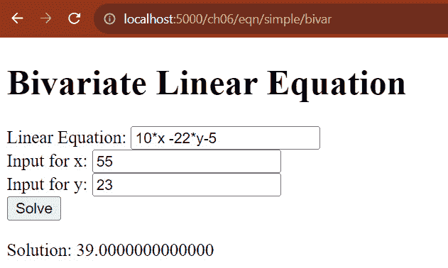

			<st c="34065">Figure 6.9 – Solving a linear equation with x and y variables</st>
			<st c="34126">Now, not all</st> <st c="34139">real-world problems are solvable</st> <st c="34172">using linear models.</st> <st c="34194">Some require non-linear models to derive</st> <st c="34235">their solutions.</st>
			<st c="34251">Solving non-linear formulas</st>
			<st c="34279">Flask</st> `<st c="34286">async</st>` <st c="34291">and</st> `<st c="34296">sympy</st>` <st c="34301">can</st> <st c="34305">also implement a</st> <st c="34322">view function for solving non-linear equations.</st> <st c="34371">The</st> `<st c="34375">sympify()</st>` <st c="34384">method can recognize Python mathematical functions such as</st> `<st c="34444">exp(x)</st>`<st c="34450">,</st> `<st c="34452">log(x)</st>`<st c="34458">,</st> `<st c="34460">sqrt(x)</st>`<st c="34467">,</st> `<st c="34469">cos(x)</st>`<st c="34475">,</st> `<st c="34477">sin(x)</st>`<st c="34483">, and</st> `<st c="34489">pow(x)</st>`<st c="34495">. Thus, creating mathematical expressions with the inclusion of these Python functions is feasible with</st> `<st c="34599">sympy</st>`<st c="34604">.</st> *<st c="34606">Figure 6</st>**<st c="34614">.10</st>* <st c="34617">shows a view function that computes a solution of a univariate non-linear equation with</st> <st c="34706">one variable.</st>
			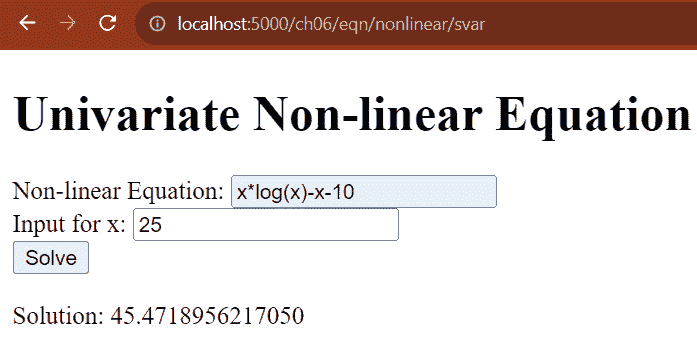

			<st c="34811">Figure 6.10 – Solving a non-linear equation with Python functions</st>
			<st c="34876">The strength of the</st> `<st c="34897">sympy</st>` <st c="34902">module is to extract the parameter values of an equation or equations</st> <st c="34973">based on a given result</st> <st c="34997">or</st> <st c="34999">solution.</st>
			<st c="35009">Finding solutions for a linear system</st>
			<st c="35047">The</st> `<st c="35052">sympy</st>` <st c="35057">module</st> <st c="35065">has a</st> `<st c="35071">solve()</st>` <st c="35078">method</st> <st c="35086">that can solve systems of linear or polynomial equations.</st> <st c="35144">The following implementation can find a solution for a system of two</st> <st c="35213">polynomial equations:</st>

```

from modules.equations import eqn_bp

from flask import render_template, request <st c="35315">from sympy import symbols, sympify, solve</st> @eqn_bp.route('/eqn/eqnsystem/solve', methods = ['GET', 'POST'])

async def solve_multiple_eqns():

    if request.method == 'GET':

        soln = None

    else:

        field_validations = (

            ('polyeqn1', gl.required, gl.type_(str)),

            ('polyeqn2', gl.required, gl.type_(str))

        )

        form_data = request.form.to_dict()

        result = gl.validate(field_validations, form_data )

        if bool(result): <st c="35712">x, y = symbols('x y')</st><st c="35733">eqn1 = sympify(form_data['polyeqn1'])</st><st c="35771">eqn2 = sympify(form_data['polyeqn2'])</st><st c="35809">soln = solve((eqn1, eqn2),(x, y))</st> else:

            soln = None

    return  render_template('complex_multiple_eqns_form.html',   soln=soln), 200y

```py

			<st c="35936">After the retrieval from</st> `<st c="35962">request.form</st>` <st c="35974">and a successful validation using</st> `<st c="36009">gladiator</st>`<st c="36018">, the</st> `<st c="36024">polyeqn1</st>` <st c="36032">and</st> `<st c="36037">polyeqn2</st>` <st c="36045">string expressions must undergo sympification</st> <st c="36091">through the</st> `<st c="36104">sympify()</st>` <st c="36113">method</st> <st c="36121">to derive their symbolic equations or</st> `<st c="36159">sympy</st>` <st c="36164">expressions.</st> <st c="36178">The function variables, x and y, of these mathematical expressions must have their corresponding</st> `<st c="36275">Symbol</st>`<st c="36281">-type variables utilizing the</st> `<st c="36312">symbols()</st>` <st c="36321">function of</st> `<st c="36334">sympy</st>`<st c="36339">, a vital mechanism for creating</st> `<st c="36372">Symbol</st>` <st c="36378">variables out of string variables.</st> <st c="36414">The</st> `<st c="36418">solve()</st>` <st c="36425">method requires a tuple of these symbolic equations in its first parameter and a tuple of</st> `<st c="36516">Symbols</st>` <st c="36523">in its second parameter to find the solutions of the linear system.</st> <st c="36592">If the linear equations are not parallel to each other, the</st> `<st c="36652">solve()</st>` <st c="36659">method will return a feasible solution in a dictionary format with</st> `<st c="36727">sympy</st>` <st c="36732">variables</st> <st c="36743">as keys.</st>
			<st c="36751">If we execute</st> `<st c="36766">solve_multiple_eqns()</st>` <st c="36787">with a simple linear system, such as passing the</st> `<st c="36837">5*x-3*y-9</st>` <st c="36846">equation to</st> `<st c="36859">polyeqn1</st>` <st c="36867">and the</st> `<st c="36876">15*x+3*y+12</st>` <st c="36887">equation to</st> `<st c="36900">polyeqn2</st>`<st c="36908">,</st> `<st c="36910">solve()</st>` <st c="36917">will provide us with numerical results, as shown in</st> *<st c="36970">Figure 6</st>**<st c="36978">.11</st>*<st c="36981">.</st>
			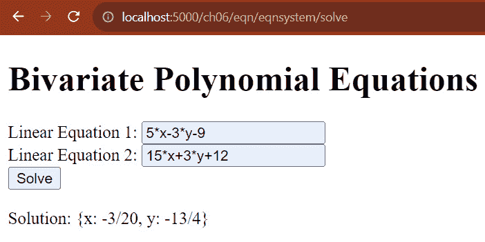

			<st c="37122">Figure 6.11 – Solving simple linear equations</st>
			<st c="37167">However, if we have polynomials or non-linear equations such as passing the</st> `<st c="37244">x**2-10*y+10</st>` <st c="37256">quadratic</st> <st c="37267">formula to</st> `<st c="37278">polyeqn1</st>` <st c="37286">and the</st> `<st c="37295">10*x+5*y-3</st>` <st c="37305">linear expression to</st> `<st c="37327">polyeqn2</st>`<st c="37335">, the resulting non-linear solutions will be rational values with square roots, as shown in</st> *<st c="37427">Figure 6</st>**<st c="37435">.12</st>*<st c="37438">.</st>
			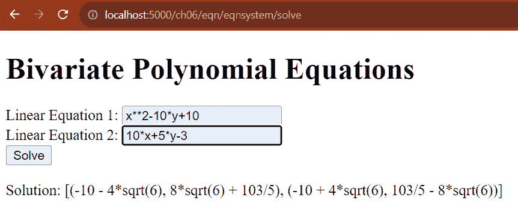

			<st c="37623">Figure 6.12 – Solving polynomial system of equations</st>
			<st c="37675">There are many</st> <st c="37691">possible symbolic computations, formulas, and algorithms that Flask can implement with</st> `<st c="37778">sympy</st>`<st c="37783">. Sometimes, the</st> `<st c="37800">scipy</st>` <st c="37805">module can help</st> `<st c="37822">sympy</st>` <st c="37827">solve other mathematical algorithms that are very</st> <st c="37878">tedious and complicated, such as</st> <st c="37911">approximation problems.</st>
			<st c="37934">The</st> `<st c="37939">sympy</st>` <st c="37944">module is also capable of providing graphical analysis</st> <st c="38000">through plots.</st>
			<st c="38014">Plotting mathematical expressions</st>
			<st c="38048">When it comes</st> <st c="38062">to visualization,</st> `<st c="38081">sympy</st>` <st c="38086">is capable</st> <st c="38098">of rendering graphs and charts created by its built-in</st> `<st c="38153">matplotlib</st>` <st c="38163">library.</st> <st c="38173">The following view function accepts two equations from the user and creates a graphical plot for the equations within the specified range of values</st> <st c="38321">for x:</st>

```

<st c="38327">from sympy import symbols, sympify</st>

<st c="38362">from sympy.plotting import plot</st>

<st c="38394">import matplotlib</st>

<st c="38412">import base64</st>

<st c="38426">from io import BytesIO</st>

<st c="38449">from PIL import Image</st> @eqn_bp.route('/eqn/multi/plot', methods = ['GET', 'POST'])

async def plot_two_equations():

    if request.method == 'GET':

        data = None

    else:

        … … … … … …

        form_data = request.form.to_dict()

        result = gl.validate(field_validations, form_data )

        eqn1_upper = float(form_data['eqn1_maxval'])

        eqn1_lower = float(form_data['eqn1_minval'])

        eqn2_upper = float(form_data['eqn2_maxval'])

        eqn2_lower = float(form_data['eqn2_minval'])

        data = None

        if bool(result) and (eqn1_lower <= eqn1_upper) and (eqn2_lower <= eqn2_upper): <st c="38980">matplotlib.use('agg')</st> x = symbols('x')

            eqn1 = sympify(form_data['equation1'])

            eqn2 = sympify(form_data['equation2']) <st c="39097">graph = plot(eqn1, (x, eqn1_lower, eqn1_upper), line_color='red', show=False)</st><st c="39174">graph.extend(plot(eqn2, (x, eqn2_lower, eqn2_upper), line_color='blue', show=False))</st> filename = "./files/img/multi_plot.png" <st c="39300">graph.save(filename)</st><st c="39320">img = Image.open(filename)</st><st c="39347">image_io = BytesIO()</st><st c="39368">img.save(image_io, 'PNG')</st> data = base64.b64encode(image_io.getbuffer()) .decode("ascii")

    return render_template('plot_two_eqns_form.html', data=data), 200

```py

			<st c="39523">After sanitizing the</st> <st c="39544">string equations</st> <st c="39562">and deriving the</st> `<st c="39579">sympy</st>` <st c="39584">formulas, the view can directly create a plot for each formula using the</st> `<st c="39658">plot()</st>` <st c="39664">method in the</st> `<st c="39679">sympy.plotting</st>` <st c="39693">module, which is almost similar to that in the</st> `<st c="39741">matplotlib</st>` <st c="39751">module but within the context of</st> `<st c="39785">sympy</st>`<st c="39790">. The method returns a</st> `<st c="39813">Plot</st>` <st c="39817">instance that can combine with another</st> `<st c="39857">Plot</st>` <st c="39861">using its</st> `<st c="39872">extend()</st>` <st c="39880">method to create multiple plots in one frame.</st> <st c="39927">Running the</st> `<st c="39939">plot_two_equations()</st>` <st c="39959">view will yield line graphs of both</st> `<st c="39996">equation1</st>` <st c="40005">and</st> `<st c="40010">equation2</st>`<st c="40019">, as shown in</st> *<st c="40033">Figure 6</st>**<st c="40041">.13</st>*<st c="40044">.</st>
			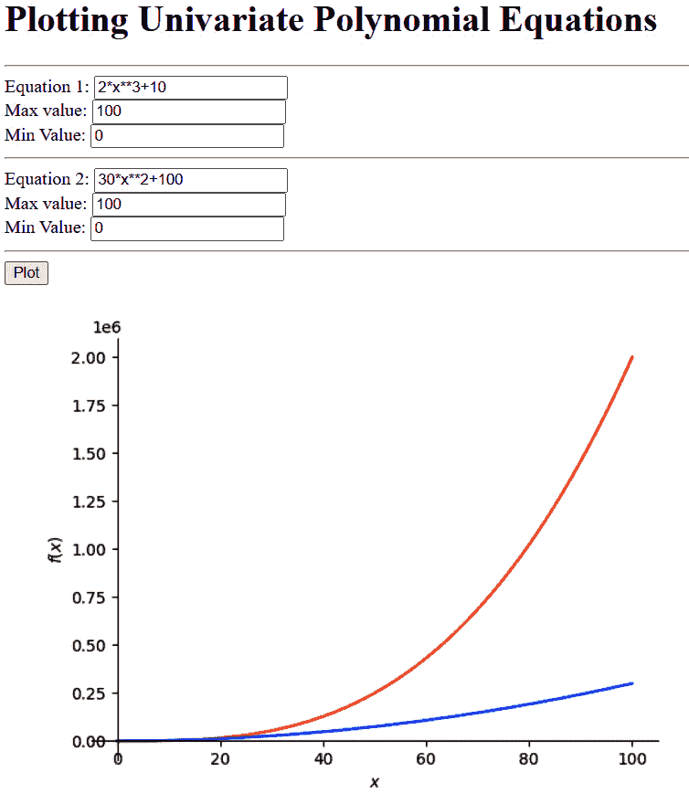

			<st c="40186">Figure 6.13 – Plotting the two sympy equations</st>
			<st c="40232">On the other</st> <st c="40245">hand, the</st> `<st c="40256">Plot</st>` <st c="40260">instance</st> <st c="40269">has a</st> `<st c="40276">save()</st>` <st c="40282">method that can store the graphical plot as an image.</st> <st c="40337">However, to create an inline image for a Jinja2 rendition, the view needs the</st> `<st c="40415">Image</st>` <st c="40420">class from</st> `<st c="40519">BytesIO</st>` <st c="40526">for</st> `<st c="40531">base64</st>` <st c="40537">encoding.</st>
			<st c="40547">Let us examine now how asynchronous Flask can manage those scientific data that need LaTeX serialization or</st> <st c="40656">PDF renditions.</st>
			<st c="40671">Creating and rendering LaTeX documents</st>
			**<st c="40710">LaTex</st>** <st c="40716">is a high-standard</st> <st c="40735">typesetting system used in publishing and packaging technical and scientific papers and literature, especially those documents with charts, graphs, equations, and tabular data.</st> <st c="40913">When creating scientific applications, there should be a mechanism for the application to write LaTeX content, save it in a repository, and render it as</st> <st c="41066">a response.</st>
			<st c="41077">But first, our applications will require a LaTeX compiler that assembles and compiles newly created LaTeX documents.</st> <st c="41195">Here are two popular tools that offer various</st> <st c="41241">LaTeX compilers:</st>

				*   **<st c="41257">TeX Live</st>**<st c="41266">: This is an open-source</st> <st c="41292">LaTeX tool most suitable for creating secured</st> <st c="41338">LaTeX documents.</st>
				*   **<st c="41354">MikTeX</st>**<st c="41361">: This is an open-source LaTeX tool popular for its on-the-fly libraries and</st> <st c="41439">up-to-date releases.</st>

			<st c="41459">Our application will be utilizing MikTeX for its LaTeX compilers.</st> <st c="41526">Do not forget to update MikTex for the latest plugins using the console, as shown in</st> *<st c="41611">Figure 6</st>**<st c="41619">.14</st>*<st c="41622">.</st>
			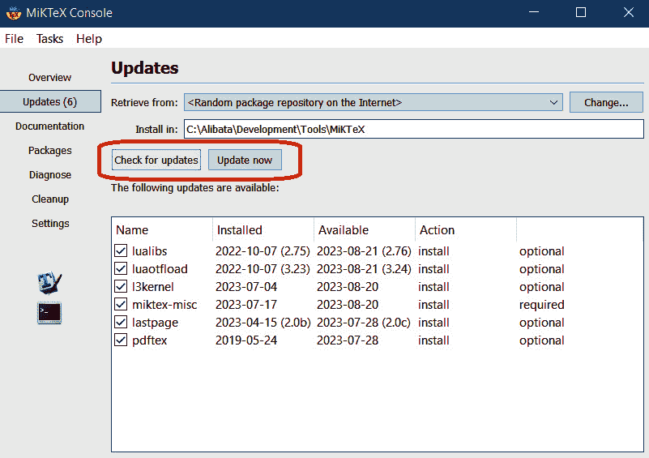

			<st c="41943">Figure 6.14 – Updating MikTeX using its console</st>
			<st c="41990">After the MikTeX installation and update, let’s create the Flask project by installing the</st> `<st c="42082">latex</st>` <st c="42087">module.</st>
			<st c="42095">Rendering LaTeX documents</st>
			<st c="42121">Asynchronous</st> <st c="42134">view functions can create, update, and render LaTeX documents through LaTeX-related modules and</st> `<st c="42231">matplotlib</st>` <st c="42241">for immediate textual and graphical plots or perform LaTeX to PDF transformation of existing LaTeX documents for rendition.</st> <st c="42366">The latter requires the installation of the</st> `<st c="42410">latex</st>` <st c="42415">module through the</st> `<st c="42435">pip</st>` <st c="42438">command:</st>

```

pip install latex

```py

			<st c="42465">The</st> `<st c="42470">latex</st>` <st c="42475">module uses its built-in Jinja libraries to access</st> `<st c="42527">latex</st>` <st c="42532">files stored in the main project.</st> <st c="42567">So, the first step is to create a Jinja environment with all the details that will calibrate the Jinja engine regarding LaTeX file handling.</st> <st c="42708">The following snippet shows how to set up the Jinja environment using the</st> `<st c="42782">latex.jinja2</st>` <st c="42794">module:</st>

```

<st c="42802">from jinja2 import FileSystemLoader, Environment</st>

<st c="42851">from latex.jinja2 import make_env</st> environ:<st c="42894">Environment</st> = make_env(loader=FileSystemLoader('files'), <st c="42952">enable_async=True,</st> block_start_string = '\BLOCK{',

    block_end_string = '}',

    variable_start_string = 'VAR{',

    variable_end_string = '}',

    comment_start_string = '#{',

    comment_end_string = '}',

    line_statement_prefix = '%-',

    line_comment_prefix = '%#',

    trim_blocks = True,

    autoescape = False,)

```py

			<st c="43239">Since</st> `<st c="43246">ch06-project</st>` <st c="43258">uses</st> `<st c="43264">Blueprint</st>` <st c="43273">to organize the views and the corresponding components, only the rendition module (</st>`<st c="43357">/modules/rendition</st>`<st c="43376">) that builds the LaTeX web displays can access this environment configuration.</st> <st c="43457">This Jinja environment details, defined in</st> `<st c="43500">/modules/rendition/__init__.py</st>`<st c="43530">, declares that the</st> `<st c="43550">files</st>` <st c="43555">folder in the project directory will become the root folder for our LaTeX documents.</st> <st c="43641">Moreover, it tells Jinja the syntax preferences for some LaTeX commands, such as the</st> `<st c="43726">BLOCK</st>`<st c="43731">,</st> `<st c="43733">VAR</st>`<st c="43736">, conditional statement, and comment symbols.</st> <st c="43782">Instead of having a backslash pipe (</st>`<st c="43818">"\"</st>`<st c="43822">) in</st> `<st c="43828">\VAR{}</st>`<st c="43834">, the setup wants Jinja to recognize the</st> `<st c="43875">VAR{}</st>` <st c="43880">statement, an interpolation operator, without the backslash pipe.</st> <st c="43947">Violating the given syntax rules will flag an error in Flask.</st> <st c="44009">The</st> `<st c="44013">enable_async</st>` <st c="44025">property, on the other hand, allows the execution of</st> `<st c="44079">latex</st>` <st c="44084">commands in asynchronous view functions, such as the following</st> <st c="44147">view implementation that opens a document and updates it</st> <st c="44205">for display:</st>

```

from modules.rendition import rendition_bp

from flask import send_from_directory

from jinja2 import FileSystemLoader

from latex.jinja2 import make_env

@rendition_bp.route('/render/hpi/plot/eqns', methods = ['GET', 'POST']) <st c="44441">async</st> def convert_latex(): <st c="44468">tpl = environ.get_template('/latex/hpi_plot.tex')</st> outpath=os.path.join('./files/latex','hpi_plot.pdf')

    outfile=open(outpath,'w') <st c="44597">outfile.write(await tpl.render_async(author='Sherwin</st> <st c="44649">约翰·特拉古拉', title="使用 LaTeX 渲染 HPI 图", date=datetime.now().strftime("%B %d, %Y"),</st> <st c="44695">renderTbl=True))</st><st c="44763">outfile.close()</st> os.system("pdflatex <st c="44800">--shell-escape</st> -output-directory=" + './files/latex' + " " + outpath) <st c="44959">get_template()</st> of the <st c="44981">环境</st>实例，<st c="45003">环境</st>，从根目录的<st c="45078">/latex</st>子目录中创建一个特定 LaTeX 文档的 Jinja2 模板。该模板的<st c="45134">render_async()</st>函数打开指定的 LaTeX 文档以进行更改，例如传递上下文值（例如，<st c="45244">作者</st>，<st c="45252">标题</st>，<st c="45259">日期</st>和<st c="45269">renderTbl</st>）以完成文档。

            <st c="45306">之后，</st> `<st c="45322">视图</st>` <st c="45326">函数将文档转换为 PDF 格式，这是此应用程序的必要方法。</st> `<st c="45433">os.path.join()</st>` <st c="45447">将指示文件保存的位置。</st> <st c="45486">现在，MikTeX 提供了三个编译器来编译并将 LaTeX 文档转换为 PDF，即 pdfLaTeX、XeLaTeX 和 LuaLaTeX，但我们的实现使用 pdfLaTeX，这是默认的。</st> `<st c="45675">os.system()</st>` <st c="45686">将运行编译器并将 PDF 保存到指定位置。</st> <st c="45754">为了渲染内容，Flask 有一个</st> `<st c="45789">send_from_directory()</st>` <st c="45810">方法可以显示目录中保存的 PDF 文件的内容。</st> *<st c="45885">图 6</st>**<st c="45893">.15</st>* <st c="45896">显示了通过运行</st> `<st c="45945">convert_latex()</st>` <st c="45960">视图函数得到的 PDF 文档的结果。</st>

            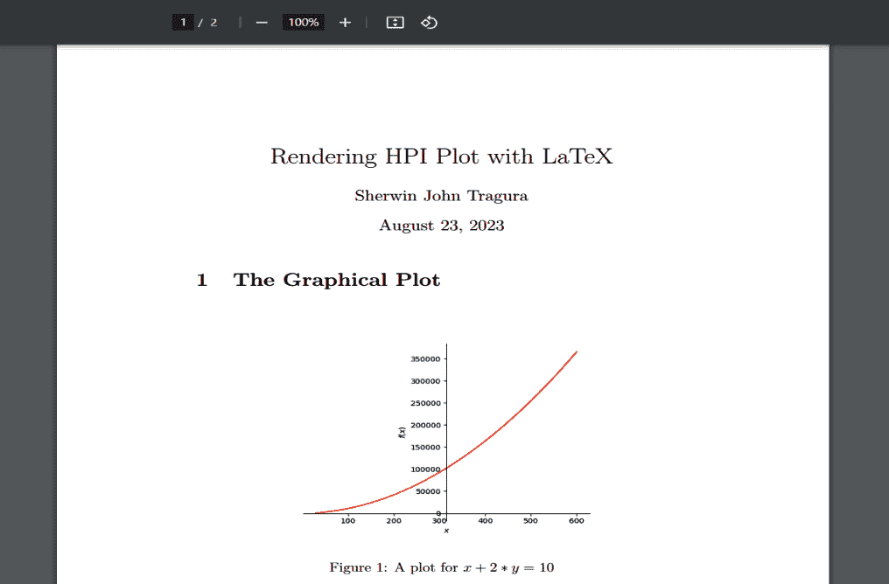

            <st c="46098">图 6.15 – 将 LaTeX 文档渲染为 PDF</st>

            <st c="46147">我们的 Flask 应用程序</st> <st c="46169">不仅渲染现有的 LaTeX 文档，而且在将其渲染到客户端之前先创建一个。</st>

            <st c="46271">创建 LaTeX 文档</st>

            <st c="46296">到目前为止，</st> `<st c="46309">latex</st>` <st c="46314">模块</st> <st c="46322">与 Jinja2 一起没有 LaTeX 创建功能，Flask 可以使用这些功能从各种数据源构建科学论文。</st> <st c="46440">然而，其他模块，如</st> `<st c="46472">pylatex</st>`<st c="46479">，可以提供辅助类和方法，在运行时序列化 LaTeX 内容。</st> <st c="46559">以下视图实现展示了如何使用</st> `<st c="46633">DataFrame</st>` <st c="46642">对象的数据，该数据来自上传的</st> `<st c="46682">XLSX</st>`文档来生成 LaTeX 文件：</st>

```py
<st c="46696">from pylatex import Document, Section, Command, NoEscape, Subsection, Tabular, Center</st>
<st c="46782">from pylatex.utils import italic</st>
<st c="46815">from pylatex.basic import NewLine</st> @rendition_bp.route('/create/hpi/desc/latex', methods = ['GET', 'POST'])
async def create_latex_pdf():
    if request.method == 'GET':
         return render_template("hpi_latex_form.html"), 200
    else:
        … … … … … …
        … … … … … …
        try:
            df = read_excel(uploaded_file, sheet_name=2, skiprows=[1])
            hpi_data = df.loc[: , 'Australia':'US'].describe().to_dict()
            hpi_filename = os.path.join('./files/latex','hpi_analysis')
```

            在所有其他事情之前，环境设置必须安装 MikTeX 或 TeX Live 以支持 LaTeX 编译器。</st> <st c="47362">然后，通过</st> `<st c="47380">pylatex</st>` <st c="47387">模块通过</st> `<st c="47407">pip</st>` <st c="47410">命令安装：</st>

```py
 pip install pylatex
```

            <st c="47439">要开始事务，给定的</st> `<st c="47476">create_latext_pdf()</st>` <st c="47495">检索上传的 XLSX 文档以提取用于报告生成的表格值：</st>

```py
 geometry_options = {
                "landscape": True,
                "margin": "0.5in",
                "headheight": "20pt",
                "headsep": "10pt",
                "includeheadfoot": True
            }
            doc = Document(page_numbers=True, <st c="47748">geometry_options=geometry_options</st>, <st c="47783">document_options=['10pt','legalpaper']</st>)
            doc.preamble.append(Command('title', 'Mean HPI per Country'))
            doc.preamble.append(Command('author', 'Sherwin John C. Tragura'))
            doc.preamble.append(Command('date', NoEscape(r'\today')))
            doc.append(NoEscape(r'\maketitle'))
```

            <st c="48045">然后，它设置了一个</st> <st c="48064">字典</st>，`<st c="48077">geometry_options</st>`<st c="48093">，它包含 LaTeX 文档参数，例如文档方向（</st>`<st c="48177">landscape</st>`<st c="48187">），左右、顶部和底部边距（</st>`<st c="48233">margin</st>`<st c="48240">），从页眉底部到第一段文字最顶部的垂直高度（</st>`<st c="48343">headsep</st>`<st c="48351">），从页眉顶部到开始页眉部分的行的空间（</st>`<st c="48429">headheight</st>`<st c="48440">），以及切换参数以包含或排除文档的页眉和页脚（</st>`<st c="48539">includeheadfoot</st>`<st c="48555">）。</st> <st c="48559">这个字典对于实例化</st> `<st c="48616">pylatex</st>`<st c="48623">的</st> `<st c="48627">Document container</st>` <st c="48645">类至关重要，该类将代表 LaTeX 文档。</st>

            <st c="48693">最初，LaTeX 文档将是一个带有通过其</st> `<st c="48803">geometry_option</st>` <st c="48818">构造函数参数和包含其他选项（如字体大小和纸张大小）的</st> `<st c="48849">document_options</st>` <st c="48865">列表的空白实例。</st> <st c="48934">然后，为了开始自定义文档，</st> `<st c="48979">view</st>` <st c="48983">函数使用</st> `<st c="49002">Command</st>` <st c="49009">类创建用于文档标题、作者和日期的定制值，而不进行转义，因此使用了</st> `<st c="49134">NoEscape</st>` <st c="49142">类，并将它们附加到</st> `<st c="49198">Document</st>` <st c="49206">实例的 preamble 属性。</st> <st c="49217">这个过程类似于调用</st> `<st c="49252">\title</st>`<st c="49258">，`<st c="49260">\author</st>`<st c="49267">，和</st> `<st c="49273">\date</st>` <st c="49278">命令，并通过</st> `<st c="49327">\</st>``<st c="49328">VAR{}</st>` <st c="49333">命令插入自定义值。</st>

            `<st c="49342">接下来，视图必须添加`<st c="49374">\maketitle</st>` `<st c="49384">命令，而不需要转义反斜杠，以排版所有这些添加的文档细节。</st>` `<st c="49469">在`<st c="49488">\maketitle</st>` `<st c="49498">之后的行总是生成正文内容，在我们的例子中，是以下章节：</st>

```py
 with doc.create(Section('The Data Analysis')):
              doc.append('Here are the statistical analysis derived from the uploaded excel data.')
```

            `<st c="49713">The</st>` `<st c="49718">pylatex</st>` `<st c="49725">模块类与一些 LaTeX 命令等价，例如</st>` `<st c="49788">Axis</st>`<st c="49792">,</st> `<st c="49794">Math</st>`<st c="49798">,</st> `<st c="49800">Matrix</st>`<st c="49806">,</st> `<st c="49808">Center</st>`<st c="49814">,</st> `<st c="49816">Alignat</st>`<st c="49823">,</st> `<st c="49825">Alignref</st>`<st c="49833">, 和</st> `<st c="49839">Plot</st>`<st c="49843">。`<st c="49849">Command</st>` `<st c="49856">类是一个模块类，用于运行自定义或通用命令，例如</st>` `<st c="49928">\title</st>`<st c="49934">,</st> `<st c="49936">\author</st>`<st c="49943">, 和</st> `<st c="49949">\date</st>`<st c="49954">。在这个`<st c="49964">create_latex_pdf()</st>` `<st c="49982">视图中，内容生成从运行带有章节标题的`<st c="50037">Section</st>` `<st c="50044">命令</st>` `<st c="50052">开始，标题为` *<st c="50075">数据分析。</st> <st c="50094">A</st>* `<st c="50095">章节是内容的一个有组织的部分，包含表格、文本、图表和数学公式的组合。</st>` `<st c="50219">之后，视图以文本形式添加一条声明。</st>` `<st c="50274">由于没有反斜杠需要转义，因此没有必要用`<st c="50358">NoEscape</st>` `<st c="50366">类`将文本包裹起来。</st>` `<st c="50374">然后，我们创建以下片段中指示的子章节：</st>

```py
 with doc.create(Subsection('Statistical analysis generated by Pandas')):
                    with doc.create(Tabular('| c | c | c | c | c | c | c | c | c |')) as table:
                        table.add_hline()
                        table.add_row(("Country", "Count", "Mean", "Std Dev", "Min", "25%", "50%", "75%", "Max"))
                        table.add_empty_row()
                        for key, value in hpi_data.items():
                            table.add_hline()
                            table.add_row((key, value['count'], value['mean'], value['std'], value['min'], value['25%'], value['50%'], value['75%'], value['max']))
                        table.add_empty_row()
                        table.add_hline()
        except:
            raise FileSavingException()
```

            `<st c="50987">在文本之后，视图添加一个`<st c="51023">Subsection</st>` `<st c="51033">命令，这将细化最近创建的章节的内容。</st>` `<st c="51111">其部分组件是`<st c="51140">Tabular</st>` `<st c="51147">命令，它将构建一个由提取的表格值派生出的 HPI 值的电子表格。</st>` `<st c="51247">在 LaTeX 内容的组装之后，`<st c="51294">create_latex_pdf()</st>` `<st c="51312">视图现在将生成用于呈现的 PDF，如下面的片段所示：</st>

```py
 doc.generate_pdf(hpi_filename, clean_tex=False, compiler="pdflatex")
        return send_from_directory('./files/latex', 'hpi_analysis.pdf')
```

            <st c="51526">文档</st> <st c="51531">实例有一个</st> <st c="51539">generate_pdf()</st> <st c="51555">方法，它编译并生成 LaTeX 文件，将 LaTeX 文件转换为 PDF 格式，并将这两个文件保存到特定目录。</st> <st c="51708">一旦 PDF 可用，视图可以通过 Flask 的</st> <st c="51787">send_from_directory()</st> <st c="51808">方法渲染 PDF 内容。</st> *<st c="51817">图 6.16</st>**<st c="51825">.16</st>* <st c="51828">显示了</st> <st c="51863">create_latex_pdf()</st> <st c="51881">视图函数生成的 PDF。</st>

            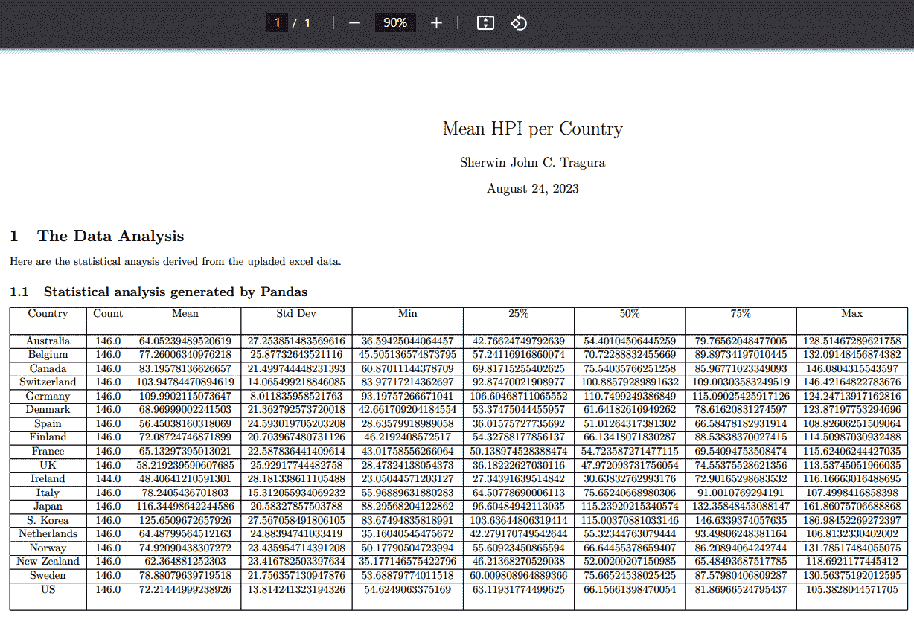

            <st c="52320">图 6.16 – 由 pylatex 模块生成的 PDF</st>

            <st c="52371">除了渲染 PDF 内容外，Flask 还可以利用流行的前端库来显示图表和</st> <st c="52482">图表。</st> <st c="52490">让我们集中讨论 Flask 如何与</st> <st c="52541">这些</st> **<st c="52547">JavaScript</st>** <st c="52557">(</st>**<st c="52559">JS</st>**<st c="52561">)-based libraries 在</st> <st c="52583">可视化数据集</st>中集成。</st>

            <st c="52604">使用前端库构建图形图表</st>

            <st c="52654">大多数开发者更喜欢使用前端库来渲染</st> <st c="52678">图形和图表</st>，而不是使用需要复杂 Python 编码来完善展示且缺乏 UI 相关功能（如响应性、适应性、用户交互）的`matplotlib`。</st> <st c="52905">本节将重点介绍 Chart.js、`Bokeh`和`Plotly`库，这些库都是流行的可视化外部工具，具有不同的优势和劣势。</st> <st c="53064">。</st>

            <st c="53082">让我们从 Chart.js 开始。</st>

            <st c="53109">使用 Chart.js 进行绘图</st>

            <st c="53132">在许多可视化应用中最常见</st> <st c="53149">且最受欢迎的图表库是 Chart.js。</st> <st c="53231">它是 100%的 JS，轻量级，易于使用，并且具有设计图表和图表的直观语法。</st> <st c="53344">以下是一个 Chart.js 实现，用于显示某些国家的平均 HPI 值：</st> <st c="53426">。</st>

```py
 <!DOCTYPE html>
<html lang="en">
<head>
  … … … … … …
  … … … … … … <st c="53508"><script src='https://cdn.jsdelivr.net/npm/chart.js'></script></st> </head>
<body>
    <h1>{{ title }}</h1>
    <form action="{{request.path}}" method="POST" enctype="multipart/form-data">
      Upload XLSX file:
      <input type="file" name="data_file"/><br/>
      <input type="submit" value="Upload File"/>
  </form><br/> <st c="53800"><canvas id="linechart" width="300" height="100"></canvas></st> </body>
<script> <st c="53875">var linechart = document.getElementById("linechart");</st><st c="53928">Chart.defaults.font.family = "Courier";</st><st c="53968">Chart.defaults.font.size = 14;</st><st c="53999">Chart.defaults.color = "black";</st>
```

            <st c="54031">Chart.js 有三种来源：</st>

                +   **<st c="54071">Node.js</st>**<st c="54079">：通过运行 npm 安装</st> <st c="54112">chart.js 模块。</st>

                +   **<st c="54128">GitHub</st>**<st c="54135">：通过下载</st> [<st c="54157">https://github.com/chartjs/Chart.js/releases/download/v4.4.0/chart.js-4.4.0.tgz</st>](https://github.com/chartjs/Chart.js/releases/download/v4.4.0/chart.js-4.4.0.tgz) <st c="54236">文件或可用的最新</st> <st c="54256">版本。</st>

                +   **<st c="54274">内容分发网络</st>** **<st c="54299">(CDN)</st>**<st c="54305">：通过</st> <st c="54310">引用</st> [<st c="54323">https://cdn.jsdelivr.net/npm/chart.js</st>](https://cdn.jsdelivr.net/npm/chart.js)<st c="54360">。</st>

            <st c="54361">根据 HTML 脚本，我们的实现选择了</st> <st c="54421">CDN 源。</st>

            <st c="54432">在引用 Chart.js 之后，创建一个宽度高度适合您图表的 `<st c="54470"><canvas></st>` <st c="54478">标签。</st> <st c="54530">然后，创建一个带有 `<st c="54593"><canvas></st>` <st c="54601">的节点或 2D 上下文和某些</st> <st c="54610">配置选项的 `<st c="54545">Chart()</st>` <st c="54552">实例。</st> <st c="54634">此外，为全局默认属性设置新的和适当的值，例如字体名称、字体大小和</st> <st c="54742">字体颜色：</st>

```py
 new Chart(linechart,{ <st c="54776">type: 'line',</st><st c="54789">options:</st> { <st c="54801">scales:</st> { <st c="54811">y</st>: {
              beginAtZero: true,
              title: {
                display: true,
                text: 'Mean HPI'
              }
            }, <st c="54881">x</st>: {
              offset: true,
              title: {
                display: true,
                text: 'Countries with HPI'
              }
            }
          }
      }, <st c="54960">data</st>: {
          borderWidth: ,
          labels : [
            
              "{{ item }}",
            
          ],
```

            <st c="55049">`<st c="55054">data</st>` <st c="55058">属性提供了 x 轴标签、数据点和连接线。</st> 它的 `<st c="55135">datasets</st>` <st c="55143">子属性</st> 包含了实际数据的图表外观和感觉细节。</st> `<st c="55236">label</st>` <st c="55241">和 `<st c="55246">data</st>` <st c="55250">列表都是其 `<st c="55290">view</st>` <st c="55290">函数</st> 提供的上下文数据：</st>

```py
 datasets: [{
              fill : true,
              barPercentage: 0.5,
              barThickness: 20,
              maxBarThickness: 70,
              borderWidth : 1,
              minBarLength: 5,
              backgroundColor: "rgba(230,112,16,0.88)",
              borderColor : "rgba(38,22,6,0.88)",
              label: 'Mean HPI values',
              data : [
                
                  "{{ item }}",
                  
              ]
            }]
        }
      });
</script>
</html>
```

            <st c="55617">现在，Chart.js 也可以构建多个折线图、各种条形图、饼图和甜甜圈，所有这些都使用与提供的折线图相同的设置。</st> <st c="55771">运行带有给定 Chart.js <st c="55820">脚本的 view 函数将渲染一个折线图，如</st> *<st c="55870">图 6</st>**<st c="55878">.17</st>**<st c="55881">所示。</st>

            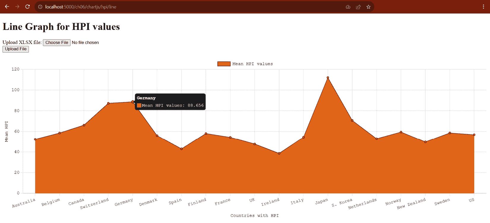

            <st c="56131">图 6.17 – 每个国家 HPI 值的折线图</st>

            <st c="56184">Chart.js 支持响应式网页设计和交互式结果，例如提供的折线图，在鼠标悬停在每个线点上时提供一些信息。</st> <st c="56355">尽管它很受欢迎，但 Chart.js 仍然使用 HTML canvas，这不能有效地渲染大型和复杂的图表。</st> <st c="56474">此外，它还缺少 Bokeh 和 Plotly 中存在的其他交互式实用工具。</st>

            <st c="56545">现在，让我们使用一个对 Python 更友好的模块来创建</st> <st c="56564">图表，**<st c="56608">Plotly</st>**<st c="56614">。</st>

            <st c="56615">使用 Plotly 创建图表</st>

            <st c="56643">Plotly</st> 也是一个基于 JS 的 <st c="56669">库，可以渲染交互式 <st c="56706">图表和图形。</st> 它是各种需要交互式数据可视化和 3D 图形效果的统计和数学项目的流行库，可以无缝地绘制 <st c="56891">DataFrame 数据集。</st>

            <st c="56910">为了利用其类和方法进行绘图，请通过</st> `<st c="56979">plotly</st>` <st c="56985">模块使用</st> `<st c="57005">pip</st>` <st c="57008">命令安装：</st>

```py
 pip install plotly
```

            <st c="57036">以下视图函数使用 Plotly 创建关于买家按装修状态偏好分类的价格和卧室偏好的分组条形图：</st> <st c="57199">偏好：</st>

```py
 import json <st c="57230">import plotly</st>
<st c="57243">import plotly.express as px</st> @rendition_bp.route("/plotly/csv/bedprice", methods = ['GET', 'POST'])
async def create_plotly_stacked_bar():
    if request.method == 'GET':
        graphJSON = '{}'
    else:
        … … … … … …
        try:
            df_csv = read_csv(uploaded_file) <st c="57483">fig = px.bar(df_csv, x='Bedrooms', y='Price',</st> <st c="57528">color='FurnishingStatus', barmode='group')</st><st c="57571">graphJSON = json.dumps(fig,</st> <st c="57599">cls=plotly.utils.PlotlyJSONEncoder)</st> except:
            raise FileSavingException()
    return render_template('plotly.html', <st c="57813">plotly.express</st> module, which provides several plotting utilities that can set up build graphs with DataFrame as input, similar to <st c="57943">matplotlib</st>’s methods. In the given <st c="57979">create_plotly_stacked_bar()</st> view function, the goal is to create a grouped bar chart using the <st c="58074">bar()</st> method from the <st c="58096">plotly.express</st> module with the <st c="58127">DataFrame</st> object’s tabular values derived from the uploaded CSV file. The result is a <st c="58213">Figure</st> in dictionary form containing the details of the desired plot.
			<st c="58282">After creating the</st> `<st c="58302">Figure</st>`<st c="58308">, the view function will pass the resulting dictionary to the Jinja2 template</st> <st c="58385">for</st> <st c="58390">rendition and display using Plotly’s JS library.</st> <st c="58439">However, JS can only understand the dictionary details if they are in JSON string format.</st> <st c="58529">Thus, use the</st> `<st c="58543">json.dumps()</st>` <st c="58555">method to convert the dictionary</st> `<st c="58589">fig</st>` <st c="58592">to string.</st>
			<st c="58603">The following is the Jinja template that will render the graph using the Plotly</st> <st c="58684">JS library:</st>

```

<!doctype html>

<html>

    <head>

        <title>Plotly 条形图</title>

    </head>

    <body>

        … … … … … …

        

            <p>没有图表图像。</p>

         <st c="58844"><div id='chart' class='chart'></div></st> 

    </body> <st c="58901"><script src='https://cdn.plot.ly/plotly-latest.js'></script></st><st c="58961"><script type='text/javascript'></st><st c="58993">var graphs = {{ graphJSON | safe }};</st><st c="59030">Plotly.plot('chart', graphs, {});</st><st c="59064"></script></st> </html>

```py

			<st c="59082">The HTML script must reference the latest Plotly library from CDN.</st> <st c="59150">Then, a JS script must interpolate the JSON-formatted</st> `<st c="59204">Figure</st>` <st c="59210">from the view function with a safe filter to spare it from HTML escaping.</st> <st c="59285">Also, the JS must apply the</st> `<st c="59313">plot()</st>` <st c="59319">method of the</st> `<st c="59334">Plotly</st>` <st c="59340">class library</st> <st c="59354">to</st> <st c="59357">render the figure through the HTML’s</st> `<st c="59395"><div></st>` <st c="59400">component.</st> *<st c="59412">Figure 6</st>**<st c="59420">.18</st>* <st c="59423">shows the bar graph generated by the</st> `<st c="59461">create_plotly_stacked_bar()</st>` <st c="59488">view function and displayed by its</st> <st c="59524">Jinja template.</st>
			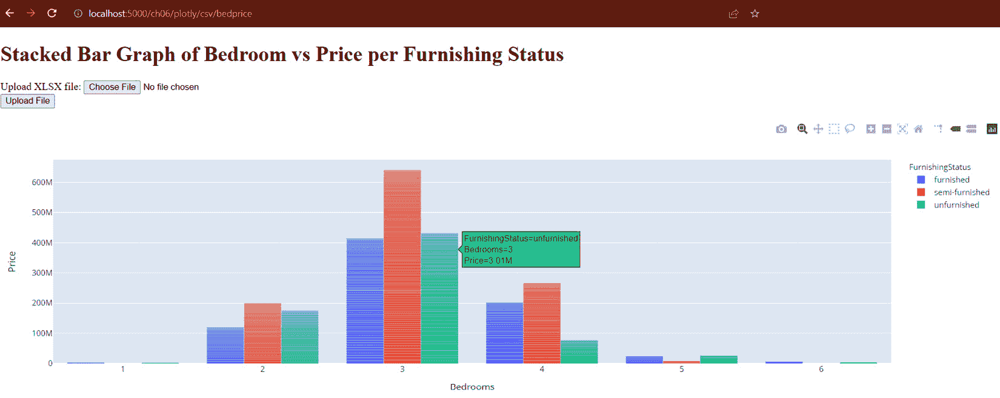

			<st c="59767">Figure 6.18 – A bar graph created by Plotly</st>
			<st c="59810">Like Chart.js, the chart provides information regarding a data plot when hovered by the mouse.</st> <st c="59906">However, it seems that Chart.js loads faster than Plotly when the data size of the</st> `<st c="59989">DataFrame</st>` <st c="59998">object’s tabular values increases.</st> <st c="60034">Also, there is limited support for colors for the background, foreground, and</st> <st c="60112">bar shades, so it is hard to</st> <st c="60141">construct a more</st> <st c="60158">original theme.</st>
			<st c="60173">The next JS library supports many popular PyData tools and can generate plots directly from</st> `<st c="60266">pandas'</st>` `<st c="60273">DataFrame</st>`<st c="60283">,</st> **<st c="60285">Bokeh</st>**<st c="60290">.</st>
			<st c="60291">Visualizing data using Bokeh</st>
			<st c="60320">Bokeh and</st> <st c="60331">Plotly are similar in many ways.</st> <st c="60364">They</st> <st c="60369">have interactive and 3D graphing features, and both need module installation.</st> <st c="60447">However, Bokeh is more Pythonic than Plotly.</st> <st c="60492">Because of that, it can transact more with DataFrame objects, especially those with</st> <st c="60576">large datasets.</st>
			<st c="60591">To utilize the library, first install its module using the</st> `<st c="60651">pip</st>` <st c="60654">command:</st>

```

pip install bokeh

```py

			<st c="60681">Once installed, the module provides a figure class from its</st> `<st c="60742">bokeh.plotting</st>` <st c="60756">module, which is responsible for setting up the plot configuration.</st> <st c="60825">The following view implementation uses Bokeh to create a line graph showing the UK’s HPI values through</st> <st c="60929">the years:</st>

```

<st c="60939">从 bokeh.plotting 导入 figure</st>

<st c="60973">从 bokeh.embed 导入 components</st> @rendition_bp.route('/bokeh/hpi/line', methods = ['GET', 'POST'])

def create_bokeh_line():

    if request.method == 'GET':

        script = None

        div = None

    else:

        … … … … … …

        try:

            df = read_excel(uploaded_file, sheet_name=1, skiprows=[1])

            x = df.index.values

            y = df['UK'] <st c="61268">plot = figure(max_width=600, max_height=800,title=None, toolbar_location="below", background_fill_color="#FFFFCC", x_axis_label='按季度 ID 的时期', y_axis_label='名义 HPI')</st><st c="61447">plot.line(x,y, line_width=4, color="#CC0000")</st><st c="61493">script, div = components(plot)</st> except:

            raise FileSavingException()

    return render_template('bokeh.html', script=script, div=div, title="英国名义 HPI 折线图")

```py

			<st c="61661">After creating the</st> `<st c="61681">Figure</st>` <st c="61687">instance with the plot details, such as</st> `<st c="61728">max_width</st>`<st c="61737">,</st> `<st c="61739">max_height</st>`<st c="61749">,</st> `<st c="61751">background_fill_color</st>`<st c="61772">,</st> `<st c="61774">x_axis_label</st>`<st c="61786">,</st> `<st c="61788">y_axis_label</st>`<st c="61800">, and other</st> <st c="61812">related</st> <st c="61820">configurations, the view function can now invoke any of its</st> *<st c="61880">glyph</st>* <st c="61885">or plotting methods, such as</st> `<st c="61915">vbar()</st>` <st c="61921">for plotting vertical bar graph,</st> `<st c="61955">hbar()</st>` <st c="61961">for horizontal bar graph,</st> `<st c="61988">scatter()</st>` <st c="61997">for scatter plots, and</st> `<st c="62021">wedge()</st>` <st c="62028">for pie charts.</st> <st c="62045">The given</st> `<st c="62055">create_bokeh_line()</st>` <st c="62074">view utilizes the</st> `<st c="62093">line()</st>` <st c="62099">method to build a line graph with x and y values derived from the</st> <st c="62166">tabular values.</st>
			<st c="62181">After assembling the</st> `<st c="62203">Figure</st>` <st c="62209">and its plot, call the</st> `<st c="62233">components()</st>` <st c="62245">function from</st> `<st c="62260">bokeh.embed</st>` <st c="62271">to wrap the plot instance and extract a tuple of two HTML embeddable components, namely the script that will contain the data of the graph and the</st> `<st c="62419">div</st>` <st c="62423">component that contains the dashboard embedded in a</st> `<st c="62475"><div></st>` <st c="62480">tag.</st> <st c="62486">The function must pass these two components to its Jinja template for rendition.</st> <st c="62567">The following is the Jinja template that will render the</st> `<st c="62624">div</st>` <st c="62627">component:</st>

```

<!DOCTYPE html>

<html lang="en">

    <head>

        <meta charset="utf-8">

        <title>Bokeh HPI</title> <st c="62727"><script src="img/bokeh-3.2.2.js"></script></st> </head>

    <body>

        … … … … … …

        

            <p>没有图表图像。</p>

         <st c="62900">{{ div | safe }}</st><st c="62916">{{ script | safe }}</st> 

    </body>

</html>

```py

			<st c="62964">Be sure to have the</st> <st c="62985">latest</st> <st c="62992">Bokeh JS library in your HTML script.</st> <st c="63030">Since both</st> `<st c="63041">div</st>` <st c="63044">and</st> `<st c="63049">script</st>` <st c="63055">are HTML-embeddable components, the template will directly interpolate them with the filter safe.</st> *<st c="63154">Figure 6</st>**<st c="63162">.19</st>* <st c="63165">shows the outcome of rendering the</st> `<st c="63201">create_bokeh_line()</st>` <st c="63220">view function using</st> <st c="63241">the datasets:</st>
			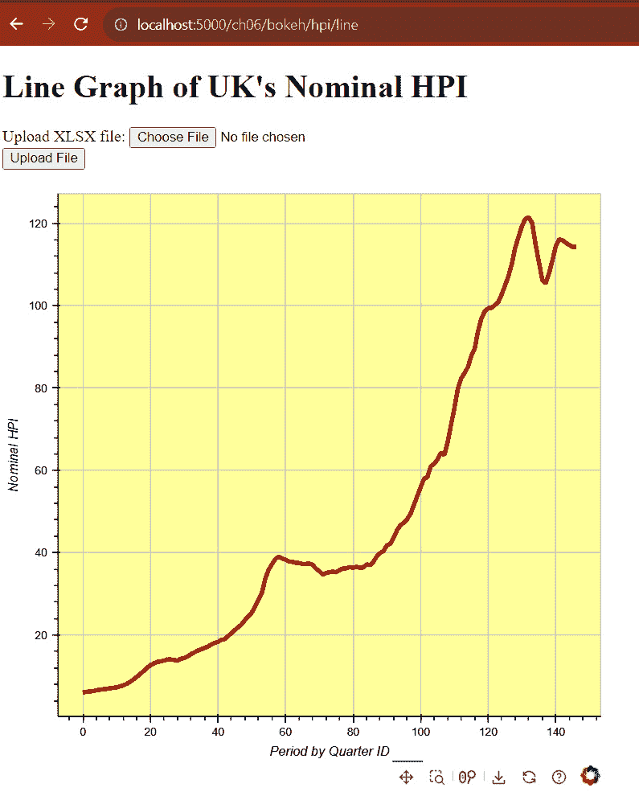

			<st c="63439">Figure 6.19 – A line graph created by Bokeh</st>
			<st c="63482">Compared to that</st> <st c="63500">of</st> <st c="63502">Plotly and Chart.js, the dashboard of Bokeh is so interactive that you can drag the plot in any direction within the canvas.</st> <st c="63628">It offers menu options to save, reset, and wheel- or box-zoom the graph.</st> <st c="63701">The only problem with Bokeh is its lack of flexibility when going out of the box for more interactive features.</st> <st c="63813">But generally, Bokeh has enough utilities and themes to build powerful</st> <st c="63884">embeddable graphs.</st>
			<st c="63902">From the degree of interactivity of the graphs and charts, let us shift our discussions to building real-time visualization approaches</st> <st c="64038">with Flask.</st>
			<st c="64049">Building real-time data plots using WebSocket and SSE</st>
			<st c="64103">Flask’s WebSocket</st> <st c="64121">and SSE, discussed</st> <st c="64140">in</st> *<st c="64144">Chapter 5</st>*<st c="64153">, are effective mechanisms</st> <st c="64180">for implementing real-time</st> <st c="64206">graphical plots.</st> <st c="64224">Although other third-party modules can provide Flask with real-time capabilities, these two are still the safest, most flexible, and standard techniques because they are</st> <st c="64394">web components.</st>
			<st c="64409">Let us start with applying WebSocket for</st> <st c="64451">real-time charts.</st>
			<st c="64468">Utilizing the WebSocket</st>
			<st c="64492">An application</st> <st c="64508">can have a WebSocket server that receives data from a form and sends it for plotting to a frontend visualization library.</st> <st c="64630">The following</st> `<st c="64644">flask-sock</st>` <st c="64654">WebSocket server immediately sends all the data it receives from a form page to the Chart.js script for</st> <st c="64759">data plotting:</st>

```

<st c="64773">@sock.route('/ch06/ws/server/hpi/plot')</st> def ws_server_plot(ws):

    async def process():

        while True: <st c="64871">hpi_data_json = ws.receive()</st> hpi_data_dict = loads(hpi_data_json) <st c="64937">json_data = dumps(</st><st c="64955">{'period': f"Y{hpi_data_dict['year']}</st> <st c="64993">Q{hpi_data_dict['quarter']}"</st>, <st c="65024">'hpi': float(hpi_data_dict['hpi'])})</st><st c="65060">ws.send(json_data)</st> run(process())

```py

			<st c="65094">The Chart.js script will receive the JSON data as a WebSocket message, scrutinize it, and push it immediately as new labels and dataset values.</st> <st c="65239">The following snippet shows the frontend script that manages the WebSocket communication with the</st> `<st c="65337">flask-sock</st>` <st c="65347">server:</st>

```

<st c="65355">const socket = new WebSocket('ws://' + location.host +</st> <st c="65410">'/ch06/ws/server/hpi/plot');</st> socket.addEventListener('message', msg => { <st c="65484">const data = JSON.parse(msg.data);</st> if (config.data.labels.length === 20) {

                config.data.labels.shift();

                config.data.datasets[0].data.shift();

            } <st c="65627">config.data.labels.push(data.period);</st><st c="65664">config.data.datasets[0].data.push(data.hpi);</st><st c="65709">lineChart.update();</st> });

```py

			<st c="65733">The real-time line chart update occurs at every form submission of the new HPI and date values to the</st> <st c="65835">WebSocket server.</st>
			<st c="65853">Next, let’s see how we can use SSE with Redis as the</st> <st c="65907">broker storage.</st>
			<st c="65922">Using SSE</st>
			<st c="65932">If WebSocket does</st> <st c="65950">not fit the requirement, SSE can be a possible solution to real-time data plotting.</st> <st c="66035">But first, it requires the installation of the Redis database server and the</st> `<st c="66112">redis-py</st>` <st c="66120">module and the creation of the</st> `<st c="66152">redis-config.py</st>` <st c="66167">file for the</st> `<st c="66181">Blueprint</st>` <st c="66190">approach.</st> <st c="66201">The following code shows the configuration of the Redis client instance in</st> <st c="66276">our application:</st>

```

from redis import Redis

redis_conn = Redis(

    db = 0,

    host='127.0.0.1',

    port=6379,

    decode_responses=True

)

```py

			<st c="66397">Place this</st> `<st c="66409">redis-config.py</st>` <st c="66424">file in the project directory</st> <st c="66455">with</st> `<st c="66460">main.py</st>`<st c="66467">.</st>
			<st c="66468">Now, the role of the Redis server is to create a channel where a view function can push the submitted form data containing the data values.</st> <st c="66609">The SSE implementation will subscribe to the message channel, listen to incoming messages, retrieve the recently published message, and yield the JSON data to the frontend plotting library.</st> <st c="66799">Our application still uses Chart.js for visualization, and here is a snippet that listens to the event stream for</st> <st c="66912">new data plots in</st> <st c="66931">JSON format:</st>

```

<st c="66943">var source = new EventSource("/ch06/sse/hpi/data/stream");</st> source.onmessage = function (event) {

            const data = JSON.parse(event.data);

            if (config.data.labels.length === 20) {

                config.data.labels.shift();

                config.data.datasets[0].data.shift();

            } <st c="67186">config.data.labels.push(data.period);</st><st c="67223">config.data.datasets[0].data.push(data.hpi);</st> lineChart.update();

        };

```py

			<st c="67291">Like the WebSocket approach, the given frontend script will listen to the stream, receive the JSON data, and validate it before pushing it to the current labels</st> <st c="67453">and datasets.</st>
			<st c="67466">Overall, WebSockets and SSE are not limited to web messaging because they can help establish real-time visualization components for many scientific applications to help solve problems that require</st> <st c="67664">impromptu analysis.</st>
			<st c="67683">Let us now focus on</st> <st c="67703">how Flask can implement computations that consume more server resources and effort and even create higher contention with</st> <st c="67826">other components.</st>
			<st c="67843">Using asynchronous background tasks for resource-intensive computations</st>
			<st c="67915">There are</st> <st c="67926">implementations</st> <st c="67941">of many approximation algorithms and P-complete problems that can create memory-related issues, thread problems, or even memory leaks.</st> <st c="68077">To avoid imminent problems when handling solutions for NP-hard problems with indefinite data sets, implement the solutions using asynchronous</st> <st c="68219">background tasks.</st>
			<st c="68236">But first, install the</st> `<st c="68260">celery</st>` <st c="68266">client using the</st> `<st c="68284">pip</st>` <st c="68287">command:</st>

```

pip install celery

```py

			<st c="68315">Also, install the Redis database server for its broker.</st> <st c="68372">Place</st> `<st c="68378">celery_config.py</st>`<st c="68394">, which contains</st> `<st c="68411">celery_init_app()</st>`<st c="68428">, in the project directory and call the method in the</st> `<st c="68482">main.py</st>` <st c="68489">module.</st>
			<st c="68497">After the setup and installations, create a service package in the</st> `<st c="68565">Blueprint</st>` <st c="68574">module folder.</st> `<st c="68590">ch06-project</st>` <st c="68602">has the following Celery task in the</st> `<st c="68640">hpi_formula.py</st>` <st c="68654">service module found in the</st> `<st c="68683">internal</st>` <st c="68691">Blueprint module:</st>

```

@shared_task(ignore_result=False)

def compute_hpi_laspeyre(df_json): <st c="68779">async def compute_hpi_task(df_json):</st> try:

            df_dict = loads(df_json)

            df = DataFrame(df_dict)

            df["p1*q0"] = df["p1"] * df["q0"]

            df["p0*q0"] = df["p0"] * df["q0"]

            print(df)

            numer = df["p1*q0"].sum()

            denom = df["p0*q0"].sum()

            hpi = numer/denom

            return hpi

        except Exception as e:

            return 0

    return <st c="69098">compute_hpi_laspeyre()</st> 运行一个异步任务，使用 Laspeyre 公式计算 HPI 值，输入包括特定房屋偏好的房价和特定年份购买该房屋的客户数量。当给定大量数据时，计算将需要更长的时间，因此当发生最坏情况时，使用异步 Celery 任务运行公式可能会提高其运行时的执行效率。

            <st c="69535">始终将重负载和资源密集型计算或进程在视图函数的线程之外运行，使用异步后台任务，这是一种良好的实践。</st> <st c="69704">它还采用了请求-响应事务与数值算法之间的松散耦合，这有助于避免这些进程的降级和饥饿。</st> <st c="69863">。</st>

            <st c="69879">将</st> <st c="69892">流行的</st> <st c="69900">数值和符号软件集成到 Flask 平台中，在处理现有科学项目时有时可以节省迁移时间。</st> <st c="70038">现在让我们探索 Flask 与</st> <st c="70103">Julia 语言集成的能力。</st>

            <st c="70118">将 Julia 包与 Flask 集成</st>

            **<st c="70158">Julia</st>** <st c="70164">是一种功能强大的</st> <st c="70183">编译型编程</st> <st c="70203">语言，提供了数学和符号库。</st> <st c="70264">它包含用于数值计算的简单语法，并为其应用程序提供了更好的运行时性能。</st>

            <st c="70385">尽管 Julia 有 Genie、Oxygen 和 Bukdu 等网络框架，可以实现基于 Julia 的网络应用程序，但 Flask 应用程序也可以运行并从</st> <st c="70580">Julia 函数中提取值。</st>

            首先，从 [<st c="70648">https://julialang.org/downloads/</st>](https://julialang.org/downloads/) 下载最新的 Julia 编译器并将其安装到您的系统上。将旧版本的 Julia 安装到更新的 Windows 操作系统中会导致系统崩溃，如 *<st c="70818">图 6</st>**<st c="70826">.20</st>*<st c="70829">* 所示。

            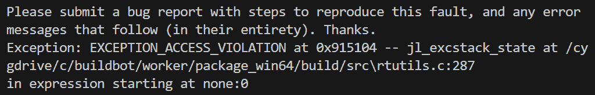

            图 6.20 – 由于 Flask 运行过时的 Julia 而导致的系统崩溃

            现在，让我们看看创建和将 Julia 软件包集成到 `<st c="71294">Flask 应用</st>` 中的步骤。

            创建自定义 Julia 软件包

            安装完成后，通过控制台进入 Flask 应用的项目目录，并运行 `<st c="71472">julia</st>` `<st c="71477">命令</st>` 打开 Julia 壳。然后，按照 `<st c="71487">以下</st>` `<st c="71500">说明</st>` 进行操作：

                1.  使用 `<st c="71519">Pkg</st>` 在 `<st c="71542">Pkg</st>` 上 `<st c="71545">运行</st>` `<st c="71549">shell</st>` 命令。

                1.  通过运行以下命令在 `<st c="71559">Flask 应用目录</st>` 中创建一个 `<st c="71569">Julia</st>` `<st c="71574">软件包</st>`：

    ```py
     Pkg.generate("Ch06JuliaPkg")
    ```

                    1.  通过运行以下命令安装 `<st c="71672">PythonCall</st>` `<st c="71685">插件</st>`：

    ```py
     Pkg.add("PythonCall")
    ```

                    1.  此外，安装 Julia 软件包，如 `<st c="71796">DataFrame</st>`<st c="71805">`、`<st c="71807">Pandas</st>`<st c="71813">` 和 `<st c="71819">Statistics</st>`，以便在 `<st c="71878">Julia 环境</st>` 中转换和运行 Python 语法。

                1.  最后，运行 `<st c="71910">Pkg.resolve()</st>` `<st c="71923">和</st>` `<st c="71928">Pkg.instantiate()</st>` `<st c="71945">以完成</st>` `<st c="71958">设置</st>`。

            接下来，我们将安装 `<st c="71993">juliacall</st>` 客户端模块并将与 Julia 相关的配置细节添加到 **<st c="72072">TOML</st>** `<st c="72076">文件</st>` 中。

            配置 Flask 项目中的 Julia 可访问性

            在 Flask 应用内部创建一个 `<st c="72151">Julia 自定义软件包</st>` 后，打开应用的 `<st c="72209">config_dev.toml</st>` `<st c="72224">文件</st>` 并添加以下环境变量以将 Julia 集成到 `<st c="72302">Flask 平台</st>` 中：

                +   `<st c="72317">PYTHON_JULIAPKG_EXE</st>`：到 `<st c="72356">julia.exe</st>` `<st c="72365">文件</st>` 的路径，包括文件名（例如，`<st c="72396">e.g.</st>` `<st c="72403">C:/Alibata/Development/Language/Julia-1.9.2/bin/julia</st>` `<st c="72456">）。</st>`

                +   `<st c="72459">PYTHON_JULIAPKG_OFFLINE</st>` `<st c="72483">：设置为</st>` `<st c="72493">yes</st>` `<st c="72496">以停止在</st>` `<st c="72531">后台</st>` `<st c="72531">的任何 Julia 安装。</st>`

                +   `<st c="72546">PYTHON_JULIAPKG_PROJECT</st>` `<st c="72570">：在 Flask 应用程序内部新创建的自定义 Julia 包的路径（</st>` `<st c="72646">例如</st>` `<st c="72653">C:/Alibata/Training/Source/flask/mastering/ch06-web-final/Ch06JuliaPkg/</st>` `<st c="72724">）。</st>`

                +   `<st c="72727">JULIA_PYTHONCALL_EXE</st>` `<st c="72748">：虚拟环境 Python 编译器的路径，包括文件名（</st>` `<st c="72835">例如</st>` `<st c="72842">C:/Alibata/Training/Source/flask/mastering/ch06-web-env/Scripts/python</st>` `<st c="72912">）。</st>`

            `<st c="72915">之后，通过</st>` `<st c="72939">juliacall</st>` `<st c="72948">模块通过</st>` `<st c="72968">pip</st>` `<st c="72971">命令安装：</st>`

```py
 pip install juliacall
```

            在 Flask 设置之后，现在让我们在 Julia 包内部创建 Julia 代码。

            在包中实现 Julia 函数

            在 Python `<st c="73128">配置</st>` `<st c="73145">之后，打开</st>` `<st c="73166">ch06-web-final\Ch06JuliaPkg\src\Ch06JuliaPkg.jl</st>` `<st c="73213">并使用导入的</st>` `<st c="73264">PythonCall</st>` `<st c="73274">包创建一些 Julia 函数，如下面的代码片段所示：</st>` `<st c="73296">：</st>`

```py
 module Ch06JuliaPkg <st c="73335">using PythonCall</st>
<st c="73351">const re = PythonCall.pynew()</st> # import re <st c="73394">const np = PythonCall.pynew()</st> # import numpy
function __init__() <st c="73459">PythonCall.pycopy!(re, pyimport("re"))</st><st c="73497">PythonCall.pycopy!(re, pyimport("numpy"))</st> end <st c="73544">function sum_array(data_list)</st><st c="73573">total = 0</st><st c="73583">for n in eachindex(data_list)</st><st c="73613">total = total + data_list[n]</st><st c="73642">end</st><st c="73646">return total</st> end
export sum_array
end # module Ch06JuliaPkg
```

            Julia 包内部的所有语法都必须是有效的 Julia 语法。因此，给定的 `<st c="73787">sum_array()</st>` `<st c="73798">是 Julia 包。</st>` `<st c="73819">另一方面，导入 Python 模块需要通过 `<st c="73876">实例化</st>` `<st c="73893">PythonCall</st>` `<st c="73903">通过</st>` `<st c="73912">pynew()</st>` `<st c="73919">，并且实际的模块映射发生在其</st>` `<st c="73966">__init__()</st>` `<st c="73976">初始化方法</st>` `<st c="73999">通过</st>` `<st c="74007">pycopy()</st>` `<st c="74015">。</st>`

            创建 Julia 服务模块

            要访问自定义 Julia 包中的函数，例如 `<st c="74112">Ch06JuliaPkg</st>` `<st c="74124">，创建一个服务模块，该模块将激活 `<st c="74169">Ch06JuliaPkg</st>` `<st c="74181">并创建一个 Julia 模块，该模块将在特定的 `<st c="74273">Blueprint</st>` `<st c="74282">部分</st>` `<st c="74292">中执行 Flask 中的 Julia 命令。</st>` 《以下是从外部 `<st c="74313">\modules\external\services\julia_transactions.py</st>` `<st c="74361">服务模块中需要的</st>` `<st c="74395">Blueprint</st>` `<st c="74404">执行 juliacall</st>` `<st c="74421">执行：</st>`

```py
 import juliacall
from juliacall import Pkg as jlPkg
jlPkg.activate(".\\Ch06JuliaPkg")
jl = juliacall.newmodule("modules.external.services")
jl.seval("using Pkg")
jl.seval("Pkg.instantiate()")
jl.seval("using Ch06JuliaPkg")
jl.seval("using DataFrames")
jl.seval("using PythonCall")
```

            <st c="74723">在每次启动</st> <st c="74741">Flask 服务器时，应用程序总是激活 Julia 包，因为应用程序总是加载所有蓝图的服务。</st> *<st c="74886">图 6</st>**<st c="74894">.21</st>* <st c="74897">显示了 Flask 应用程序服务器日志中的激活过程：</st>

            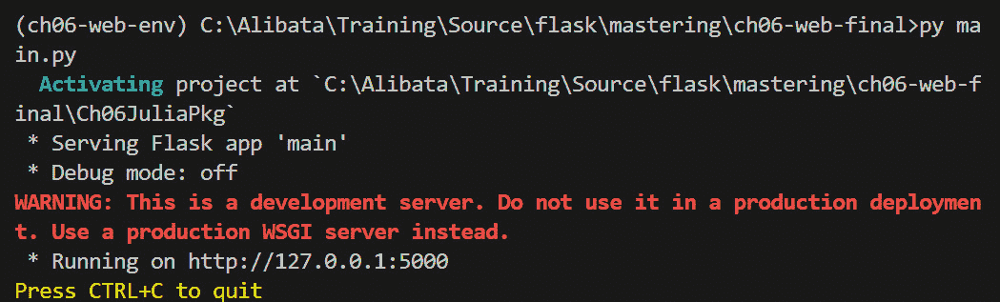

            <st c="75365">图 6.21 – 服务器启动期间 Julia 包激活日志</st>

            <st c="75429">激活可能会降低服务器的启动时间，这对 Flask 来说是一个缺点。</st> <st c="75537">如果这种性能问题恶化，建议将所有实现迁移到流行的 Julia Web 框架，如 Oxygen、Genie 和 Bukduh，而不是进一步追求</st> `<st c="75724">Flask 集成</st>`。</st>

            <st c="75742">现在，为了使视图函数能够访问 Julia 函数，请向激活发生的</st> `<st c="75825">Blueprint</st>` <st c="75834">服务中添加服务方法。</st> <st c="75873">在我们的项目中，</st> `<st c="75893">modules\external\services\julia_transactions.py</st>` <st c="75940">服务模块实现了以下</st> `<st c="75981">total_array()</st>` <st c="75994">服务，以暴露</st> `<st c="76017">sum_array()</st>` <st c="76028">函数</st> <st c="76038">在</st> `<st c="76041">Ch06JuliaPkg</st>`<st c="76053">：</st>

```py
 async def total_array(arrdata): <st c="76088">result = jl.seval(f"sum_array({arrdata})")</st> return result
```

            <st c="76144">Julia 模块或</st> `<st c="76165">jl</st>`<st c="76167">，使用其</st> `<st c="76179">seval()</st>` <st c="76186">方法，是访问和执行 Flask 服务中自定义或内置 Julia 函数的一个。</st> <st c="76290">鉴于所有应用程序都正确遵循了所有安装和设置，运行</st> `<st c="76381">jl.seval()</st>` <st c="76391">不应导致任何系统崩溃或</st> `<st c="76427">HTTP 状态 500</st>`<st c="76442">。再次强调，执行</st> `<st c="76493">jl.seval()</st>` <st c="76503">的 Python 服务函数必须放置在 Julia 包激活发生的服务模块中。</st>

            <st c="76585">总结</st>

            <st c="76593">Flask 3.0 是构建科学应用的最佳 Flask 版本，因为它具有异步特性和 asyncio 支持。</st> <st c="76734">异步 WebSocket、SSE、Celery 后台任务和服务，以及数学和计算模块，如</st> `<st c="76872">numpy</st>`<st c="76877">、</st> `<st c="76879">matplotlib</st>`<st c="76889">、</st> `<st c="76891">sympy</st>`<st c="76896">、</st> `<st c="76898">pandas</st>`<st c="76904">、</st> `<st c="76906">scipy</st>`<st c="76911">和</st> `<st c="76917">seaborn</st>`<st c="76924">，是构建强调可视化、计算和</st> <st c="77025">统计分析的应用程序的核心成分。</st>

            <st c="77046">正如本章所证明的，Flask 支持 LaTeX 文档的生成、更新和呈现，包括其 PDF 转换。</st> <st c="77172">这一特性对于大多数需要存档、报告和记录管理的科学计算至关重要。</st> <st c="77265">管理。</st>

            <st c="77284">本章中，Flask 对可视化的支持也是明确的，从实时数据绘图到 matplotlib 模块的本地绘图。</st> <st c="77416">matplotlib</st> <st c="77426">模块。</st> <st c="77435">Flask 可以无缝且直接地利用基于 JS 的库来绘制 DataFrame 对象的表格值。</st>

            <st c="77570">尽管目前还不稳定，但 Julia 与 Flask 的集成展示了互操作性属性在 Flask 中的工作方式。</st> <st c="77690">使用</st> `<st c="77696">PythonCall</st>` <st c="77706">和</st> `<st c="77711">JuliaCall</st>` <st c="77720">模块，只要设置和配置正确，现在就可以在 Flask 中运行现有的 Julia 函数。</st> <st c="77829">正确。</st>

            <st c="77841">总之，Flask，尤其是 Flask 的异步版本，是构建基于 Web 的科学应用的最佳选择。</st> <st c="77980">下一章将讨论 Flask 如何利用 NoSQL 数据库并解决一些大数据需求。</st> <st c="78068">数据。</st>

```py

```

```py

```

```py

```
