# <st c="0">8</st>

# 使用 Flask 构建工作流

工作流是一系列或一组重复的任务、活动或小流程，需要从头到尾的完整执行以满足特定的业务流程。<st c="31">每个任务相当于日常交易，如发送电子邮件、运行脚本或终端命令、数据转换和序列化、数据库事务以及其他高度计算操作。</st> <st c="207">这些任务可以是简单的顺序、并行和</st> <st c="424">复杂类型。</st>

几种工具和平台可以提供最佳实践、规则和技术规范，以构建针对行业、企业和科学问题的流程。<st c="488">然而，大多数这些解决方案的核心语言是 Java 而不是 Python。</st> <st c="651">现在，本章的主要目标是证明 Python，尤其是 Flask 框架，可以模拟使用</st> **<st c="868">业务流程建模符号</st>** <st c="902">(</st>**<st c="904">BPMN</st>**<st c="908">)和</st> **<st c="920">非 BPMN</st>** <st c="928">工作流，使用流行的现代平台，如</st> *<st c="982">Zeebe/Camunda</st>*<st c="995">、</st> *<st c="997">Airflow 2.0</st>*<st c="1008">和</st> *<st c="1014">Temporal</st>*<st c="1022">。此外，本章还将展示如何使用</st> *<st c="1076">Celery 任务</st>* <st c="1088">为</st> <st c="1122">Flask 应用程序</st>构建自定义工作流。

本章将涵盖以下主题，讨论使用 Flask 框架实现工作流活动时的不同机制和程序：<st c="1141">This chapter will cover the following topics that will discuss the different mechanisms and procedures in implementing workflow activities with the</st> <st c="1290">Flask framework:</st>

+   使用 Celery 任务构建工作流

+   使用 SpiffWorkflow 创建 BPMN 和非 BPMN 工作流

+   使用 Zeebe/Camunda 平台构建服务任务

+   使用 Airflow 2.x 编排 API 端点

+   使用 Temporal.io 实现工作流

# 技术要求

本章旨在实现使用工作流实现其业务流程的<st c="1568">“医生预约管理软件”</st> *<st c="1600">Doctor’s Appointment Management Software</st>* <st c="1640">。它具有以下五个不同的 Flask 项目，展示了构建</st> <st c="1805">Flask 应用程序</st>的不同工作流解决方案：

+   `<st c="1823">ch08-celery-redis</st>`<st c="1841">，该应用专注于使用</st> <st c="1893">Celery 任务</st>设计动态工作流。

+   `<st c="1906">ch08-spiff-web</st>`<st c="1921">，该应用实现了使用</st> <st c="1995">SpiffWorkflow 库</st>的预约系统。

+   `<st c="2017">ch08-temporal</st>`<st c="2031">，它使用 Temporal 平台构建</st> <st c="2075">分布式架构。</st>

+   `<st c="2100">ch08-zeebe</st>`<st c="2111">，它利用 Zeebe/Camunda 平台进行</st> <st c="2159">BPMN 工作流。</st>

+   `<st c="2174">ch08-airflow</st>`<st c="2187">，它集成了 Airflow 2.x 工作流引擎来管理</st> <st c="2253">API 服务。</st>

<st c="2266">尽管不同的工作流解决方案，但每个这些项目都针对用户登录交易</st> *<st c="2396">、预约流程</st>*<st c="2421">、</st> *<st c="2423">医生互动</st>*<st c="2444">、</st> *<st c="2446">计费流程</st>*<st c="2463">、</st> *<st c="2465">释放交易</st>*<st c="2482">以及</st> *<st c="2488">释放交易</st>*<st c="2510">的实际和最优流程性能。所有数据库事务都是关系型的，并使用 PostgreSQL 作为其数据库。</st> <st c="2591">另一方面，所有这些项目都可在</st> <st c="2644">以下链接</st> [<st c="2647">https://github.com/PacktPublishing/Mastering-Flask-Web-Development/tree/main/ch08</st>](https://github.com/PacktPublishing/Mastering-Flask-Web-Development/tree/main/ch08)<st c="2728">找到。</st>

# <st c="2729">使用 Celery 任务构建工作流</st>

<st c="2766">利用</st> **<st c="2777">Celery</st>** <st c="2783">作为任务队列管理器，并</st> **<st c="2812">Redis</st>** <st c="2817">作为其代理，这是我们</st> *<st c="2848">第五章</st>* <st c="2857">内容的一部分。</st> <st c="2867">该章节明确讨论了所有设置和安装以构建 Flask-Celery-Redis 集成。</st> <st c="2970">它还</st> <st c="2977">阐述了 Celery 如何在 Flask 的请求-响应事务之外异步运行后台进程。</st> <st c="3107">此外，本章还将展示 Celery 的另一个功能，可以解决业务</st> <st c="3197">流程优化。</st>

<st c="3218">Celery 有一个机制来构建动态工作流，这种工作流类型在从工作流活动开始到结束的过程中，运行在某个模式定义和规则之外。</st> <st c="3396">它的第一个要求是</st> <st c="3420">将所有任务</st> <st c="3439">封装在</st> *<st c="3442">签名</st>*<st c="3452">中。</st>

## <st c="3453">创建任务签名</st>

<st c="3478">在典型场景中，调用 Celery 任务需要直接调用其</st> `<st c="3554">delay()</st>` <st c="3561">方法以标准方式运行底层过程，或者</st> `<st c="3619">apply_async()</st>` <st c="3632">以异步运行。</st> <st c="3659">但为了管理</st> <st c="3672">Celery 任务以构建自定义动态工作流，单个任务必须首先调用</st> `<st c="3754">signature()</st>` <st c="3765">或</st> `<st c="3769">s()</st>` <st c="3772">方法。</st> <st c="3787">这允许将 Celery 任务调用传递给工作流操作，在任务成功执行后将其链接到另一个任务作为回调，并有助于管理其输入、参数和执行选项。</st> <st c="4009">签名就像是一个准备传递给 Celery 工作流操作的任务的包装器。</st>

<st c="4115">以下</st> `<st c="4130">add_login_task_wrapper()</st>` <st c="4154">任务，例如，可以通过调用其</st> `<st c="4229">signature()</st>` <st c="4240">或</st> `<st c="4244">s()</st>` <st c="4247">方法</st>来包裹在一个签名中：

```py
<st c="4255">@shared_task(ignore_result=False)</st> def add_login_task_wrapper(details): <st c="4327">async def add_login_task(details):</st> try:
            async with db_session() as sess:
              async with sess.begin():
                repo = LoginRepository(sess)
                details_dict = loads(details)
                print(details_dict)
                login = Login(**details_dict)
                result = await repo.insert_login(login)
                if result:
                    return str(True)
                else:
                    return str(False)
        except Exception as e:
            print(e)
            return str(False)
    return <st c="4774">signature()</st> method includes having a tuple argument, as in the following snippet:

```

add_login_task_wrapper.signature(<st c="4936">s()</st> equivalent with a typical parameter list containing the arguments, as in the following snippet:

```py
 add_login_task_wrapper.s(<st c="5080">delay()</st>, <st c="5089">apply_async()</st>, or simply <st c="5114">()</st> right after the <st c="5133">signature()</st> call to run the task, if necessary. Now, let us explore Celery’s built-in signatures called *<st c="5237">primitives</st>*, used in building simple and complex workflows.
			<st c="5295">Utilizing Celery primitives</st>
			<st c="5323">Now, Celery provides the following core</st> <st c="5364">workflow operations called primitives, which are</st> <st c="5413">also signature objects themselves that take a list of task signatures to build dynamic</st> <st c="5500">workflow transactions:</st>

				*   `<st c="5522">chain()</st>` <st c="5530">– A Celery function that takes a series of signatures that are linked together to form a chain of callbacks executed from left</st> <st c="5658">to right.</st>
				*   `<st c="5667">group()</st>` <st c="5675">– A Celery operator that takes a list of signatures that will execute</st> <st c="5746">in parallel.</st>
				*   `<st c="5758">chord()</st>` <st c="5766">– A Celery operator that takes a list of signatures that will execute in parallel but with a callback that will consolidate</st> <st c="5891">their results.</st>

			<st c="5905">Let us first, in the next section, showcase Celery’s chained</st> <st c="5967">workflow execution.</st>
			<st c="5986">Implementing a sequential workflow</st>
			<st c="6021">Celery primitives are the components of building dynamic Celery workflows.</st> <st c="6097">The most commonly used primitive is the</st> *<st c="6137">chain</st>* <st c="6142">primitive, which can establish a pipeline of tasks with results passed from one task to another in a left-to-right manner.</st> <st c="6266">Since it is dynamic, it can follow any specific</st> <st c="6314">sequence based on the software specification, but it prefers smaller and straightforward tasks to avoid unwanted performance degradation.</st> *<st c="6452">Figure 8</st>**<st c="6460">.1</st>* <st c="6462">shows a workflow diagram that the</st> `<st c="6497">ch08-celery-redis</st>` <st c="6514">project implemented for an efficient user</st> <st c="6557">signup transaction:</st>
			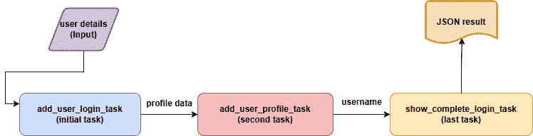

			<st c="6578">Figure 8.1 – Task signatures in a chain operation</st>
			<st c="6627">Similar to the</st> `<st c="6643">add_user_login_task_wrapper()</st>` <st c="6672">task,</st> `<st c="6679">add_user_profile_task_wrapper()</st>` <st c="6710">and</st> `<st c="6715">show_complete_profile_task_wrapper()</st>` <st c="6751">are asynchronous Celery tasks that can emit their respective signature to establish a dynamic workflow.</st> <st c="6856">The following endpoint function calls the signatures of these tasks in sequence using the</st> `<st c="6946">chain()</st>` <st c="6953">primitive:</st>

```

<st c="6964">从模块.login.services.workflow_tasks 导入 add_user_login_task_wrapper, add_user_profile_task_wrapper, show_complete_login_task_wrapper</st>

<st c="7107">@login_bp.post('/login/user/add')</st> async def add_user_workflow():

    user_json = request.get_json()

    user_str = dumps(user_json) <st c="7232">task = chain(add_user_login_task_wrapper.s(user_str),</st> <st c="7285">add_user_profile_task_wrapper.s(),</st> <st c="7320">show_complete_login_task_wrapper.s())()</st><st c="7360">result = task.get()</st> records = loads(result)

    return jsonify(profile=records), 201

```py

			<st c="7441">The presence of</st> `<st c="7458">()</st>` <st c="7460">at the end of the</st> `<st c="7479">chain()</st>` <st c="7486">primitive means the execution of the chained sequence since</st> `<st c="7547">chain()</st>` <st c="7554">is also a signature but a predefined one.</st> <st c="7597">Now, the purpose of the</st> `<st c="7621">add_user_workflow()</st>` <st c="7640">endpoint is to merge the</st> *<st c="7666">INSERT</st>* <st c="7672">transaction of the login credentials and the login profile details of the user instead of accessing two separate</st> <st c="7786">endpoints for the whole process.</st> <st c="7819">Also, it’s there to render the login credentials to the user after a successful workflow execution.</st> <st c="7919">So, all three tasks are in one execution frame with one JSON input of combined user profile and login details to the initial task,</st> `<st c="8050">add_user_login_task_wrapper()</st>`<st c="8079">. But what if tasks need arguments?</st> <st c="8115">Does the</st> `<st c="8124">signature()</st>` <st c="8135">method accept parameter(s) for its task?</st> <st c="8177">Let’s take a look in the</st> <st c="8202">next section.</st>
			<st c="8215">Passing inputs to signatures</st>
			<st c="8244">As mentioned earlier in this chapter, the</st> <st c="8286">required arguments for the Celery tasks can be passed to the</st> `<st c="8348">s()</st>` <st c="8351">or</st> `<st c="8355">signature()</st>` <st c="8366">function.</st> <st c="8377">In the given chained tasks, the</st> `<st c="8409">add_user_login_task_wrapper()</st>` <st c="8438">is the only task among the three that needs input from the API, as depicted in its</st> <st c="8522">code here:</st>

```

@shared_task(ignore_result=False) <st c="8567">def add_user_login_task_wrapper(details):</st> async def add_user_task(<st c="8633">details</st>):

        try:

            async with db_session() as sess:

            async with sess.begin():

                repo = LoginRepository(sess) <st c="8737">details_dict = loads(details)</st> … … … … … …

                login = Login(**user_dict)

                result = await repo.insert_login(login)

                if result:

                    profile_details = dumps(details_dict)

                    return profile_details

                else:

                    return ""

        except Exception as e:

            print(e)

            return ""

    return <st c="9014">details</st> parameter is the complete JSON details passed from the endpoint function to the <st c="9102">s()</st> method so that the task will retrieve only the *<st c="9153">login credentials</st>* for the *<st c="9179">INSERT</st>* login transaction. Now, the task will return the remaining details, the user profile information, as input to the next task in the sequence, <st c="9327">add_user_profile_task_wrapper()</st>. The following code shows the presence of a local parameter in the <st c="9426">add_user_profile_task_wrapper()</st> task that will receive the result of the previous task:

```py
 @shared_task(ignore_result=False) <st c="9548">def add_user_profile_task_wrapper(details):</st> async def add_user_profile_task(<st c="9624">details</st>):
        try:
            async with db_session() as sess:
              async with sess.begin():
                … … … … … … <st c="9711">role = profile_dict['role']</st> result = False <st c="9754">if role == 0:</st><st c="9767">repo = AdminRepository(sess)</st> admin = Administrator(**profile_dict)
                    result = await repo.insert_admin(admin) <st c="9875">elif role == 1:</st><st c="9890">repo = DoctorRepository(sess)</st> doc = Doctor(**profile_dict)
                    result = await repo.insert_doctor(doc) <st c="9989">elif role == 2:</st><st c="10004">repo = PatientRepository(sess)</st> patient = Patient(**profile_dict)
                    result = await repo.insert_patient(patient)
                … … … … … …
                … … … … … …
    return <st c="10335">add_user_profile_task_wrapper()</st>, the <st c="10372">details</st> parameter pertains to the returned value of <st c="10424">add_user_login_task_wrapper()</st>. The first parameter will always receive the result of the preceding tasks. Now, the <st c="10539">add_user_profile_task_wrapper()</st> task will check the role to determine what table to insert the profile information in. Then, it will return the *<st c="10683">username</st>* as input to the final task, <st c="10720">show_complete_login_task_wrapper()</st>, which will render the user credentials.
			<st c="10795">The dynamic workflow must have strict exception handling from the inside of the tasks and from the outside of the Celery workflow execution to establish a continuous and blockage-free passing of results</st> <st c="10998">or input from the initial task to</st> <st c="11033">the end.</st>
			<st c="11041">On the other hand, running independent Celery tasks requires a different Celery primitive operation called</st> `<st c="11149">group()</st>`<st c="11156">. Let us now scrutinize some parallel tasks from</st> <st c="11205">our application.</st>
			<st c="11221">Running independent and parallel tasks</st>
			<st c="11260">The</st> `<st c="11265">group()</st>` <st c="11272">primitive can run tasks</st> <st c="11296">concurrently and even return consolidated results from functional tasks.</st> <st c="11370">Our sample grouped workflow, shown in</st> *<st c="11408">Figure 8</st>**<st c="11416">.2</st>*<st c="11418">, focuses only on void tasks that serialize a list of records to CSV files, so no consolidation of results</st> <st c="11525">is needed:</st>
			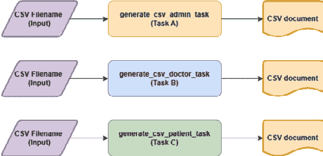

			<st c="11670">Figure 8.2 – Task signatures in grouped workflow</st>
			<st c="11718">The</st> `<st c="11723">group()</st>` <st c="11730">operation can accept varying Celery tasks with different arguments but prefers those that</st> *<st c="11821">read from and write to files</st>*<st c="11849">,</st> *<st c="11851">perform database transactions</st>*<st c="11880">,</st> *<st c="11882">extract resources from API endpoints</st>*<st c="11918">,</st> *<st c="11920">download files from external storages</st>*<st c="11957">, or</st> *<st c="11962">perform any I/O operations</st>*<st c="11988">. Our</st> `<st c="11994">create_reports()</st>` <st c="12010">endpoint function performs the grouped workflow presented in</st> *<st c="12072">Figure 8</st>**<st c="12080">.2</st>*<st c="12082">, which aims to back up the list of user administrators, patients, and doctors to their respective CSV files.</st> <st c="12192">The following is the code of the</st> <st c="12225">endpoint</st> <st c="12234">function:</st>

```

<st c="12243">从 modules.admin.services.reports_tasks 导入 generate_csv_admin_task_wrapper,</st> <st c="12325">generate_csv_doctor_task_wrapper,</st> <st c="12359">generate_csv_patient_task_wrapper</st>

<st c="12393">@admin_bp.get('/admin/reports/create')</st> async def create_reports():

    admin_csv_filename = os.getcwd() + "/files/dams_admin.csv"

    patient_csv_filename = os.getcwd() + "/files/dams_patient.csv"

    doctor_csv_filename = os.getcwd() + "/files/dams_doc.csv" <st c="12641">workflow = group(</st><st c="12658">generate_csv_admin_task_wrapper.s(admin_csv_filename),</st> <st c="12713">generate_csv_doctor_task_wrapper.s(</st><st c="12749">doctor_csv_filename),</st> <st c="12771">generate_csv_patient_task_wrapper.s(</st><st c="12808">patient_csv_filename))()</st><st c="12833">workflow.get()</st> return jsonify(message="done backup"), 201

```py

			<st c="12891">The</st> `<st c="12896">create_reports()</st>` <st c="12912">endpoint passes different filenames to the three tasks.</st> <st c="12969">The</st> `<st c="12973">generate_csv_admin_task_wrapper()</st>`<st c="13006">method will back up all administrator records to</st> `<st c="13056">dams_admin.csv</st>`<st c="13070">,</st> `<st c="13072">generate_csv_patient_task_wrapper()</st>` <st c="13107">will dump all patient records to</st> `<st c="13141">dams_patient.csv</st>`<st c="13157">, and</st> `<st c="13163">generate_csv_doctor_task_wrapper()</st>` <st c="13197">will save all doctor profiles to</st> `<st c="13231">dams_doctor.csv</st>`<st c="13246">. All three will concurrently execute after running the</st> `<st c="13302">group()</st>` <st c="13309">operation.</st>
			<st c="13320">But if the concern is to manage all the results of these concurrently running tasks, the</st> `<st c="13410">chord()</st>` <st c="13417">workflow operation, as shown in the next section, will be the best option for</st> <st c="13496">this scenario.</st>
			<st c="13510">Using callbacks to manage task results</st>
			<st c="13549">The</st> `<st c="13554">chord()</st>` <st c="13561">primitive works like the</st> `<st c="13587">group()</st>` <st c="13594">operation except for its callback task requirement, which will handle and</st> <st c="13668">manage all results of the independent tasks.</st> <st c="13714">The following API endpoint generates a report on a doctor’s appointments and</st> <st c="13791">laboratory requests:</st>

```

<st c="13811">从 modules.admin.services.doctor_stats_tasks 导入 count_patients_doctor_task_wrapper, count_request_doctor_task_wrapper, create_doctor_stats_task_wrapper</st>

<st c="13969">@admin_bp.get('/admin/doc/stats')</st> async def derive_doctor_stats():

    docid = request.args.get("docid") <st c="14071">workflow =</st> <st c="14081">chord((count_patients_doctor_task_wrapper.s(docid), count_request_doctor_task_wrapper.s(docid)), create_doctor_stats_task_wrapper.s(docid))()</st><st c="14223">result = workflow.get()</st> return jsonify(message=result), 201

```py

			<st c="14283">The</st> `<st c="14287">derive_doctor_stats()</st>` <st c="14309">method aims to execute the workflow shown in</st> *<st c="14355">Figure 8</st>**<st c="14363">.3</st>*<st c="14365">, which uses the</st> `<st c="14382">chord()</st>` <st c="14389">operation to run</st> `<st c="14407">count_patients_doctor_task_wrapper()</st>` <st c="14443">to determine the number of patients of a particular doctor and</st> `<st c="14507">count_request_doctor_task_wrapper()</st>` <st c="14542">to extract the total number of laboratory requests of the same doctor.</st> <st c="14614">The results of the tasks are stored in a list according to the order of their executions before passing it to the callback task,</st> `<st c="14743">create_doctor_stats_task_wrapper()</st>`<st c="14777">, for processing.</st> <st c="14795">Unlike in the</st> `<st c="14809">group()</st>` <st c="14816">primitive, the results are managed by a callback task before returning the final result to the</st> <st c="14912">API function:</st>
			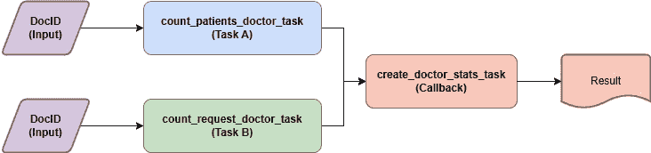

			<st c="15032">Figure 8.3 – Task signatures in chord() primitive</st>
			<st c="15081">A sample output of the</st> `<st c="15105">create_doctor_stats_task_wrapper()</st>` <st c="15139">task will be like this: “</st>*<st c="15165">Doctor HSP-200 has 2 patients and 0</st>* *<st c="15202">lab requests.</st>*<st c="15215">”</st>
			<st c="15217">There are lots of ways to build complex dynamic workflows using combinations of</st> `<st c="15297">chain()</st>`<st c="15304">,</st> `<st c="15306">group()</st>`<st c="15313">, and</st> `<st c="15319">chord()</st>`<st c="15326">, which will implement the workflows that the Flask applications need to optimize some business processes.</st> <st c="15433">It is possible for a chained task to call the</st> `<st c="15479">group()</st>` <st c="15486">primitive from the inside to spawn and run a group of independent tasks.</st> <st c="15560">It is also feasible to use Celery’s</st> *<st c="15596">subtasks</st>* <st c="15605">to implement conditional task executions.</st> <st c="15647">There are also miscellaneous primitives such as</st> `<st c="15695">map()</st>`<st c="15700">,</st> `<st c="15702">starmap()</st>`<st c="15711">, and</st> `<st c="15717">chunks()</st>` <st c="15725">that can manage</st> <st c="15741">arguments of tasks in the workflow.</st> <st c="15778">A Celery workflow is flexible and open to any implementation using its primitives and signatures since it targets dynamic workflows.</st> <st c="15911">Celery workflows can read and execute workflows from XML files, such as BPMN workflows.</st> <st c="15999">However, there is a workflow solution that can work on both dynamic and BPMN</st> <st c="16076">workflows: SpiffWorkflow.</st>
			<st c="16101">Creating BPMN and non-BPMN workflows with SpiffWorkflow</st>
			**<st c="16157">SpiffWorkflow</st>** <st c="16171">is a flexible Python execution engine for workflow activities.</st> <st c="16235">Its latest installment focuses more on BPMN models, but it always</st> <st c="16300">has strong support classes to build and run non-BPMN</st> <st c="16353">workflows translated into Python and JSON.</st> <st c="16397">The library has a</st> *<st c="16415">BPMN interpreter</st>* <st c="16431">that can execute tasks indicated in</st> <st c="16467">BPMN diagrams created by BPMN modeling tools and</st> *<st c="16517">serializers</st>* <st c="16528">to run</st> <st c="16536">JSON-based workflows.</st>
			<st c="16557">To start SpiffWorkflow, we need to install some</st> <st c="16606">required dependencies.</st>
			<st c="16628">Setting up the development environment</st>
			<st c="16667">No broker or server is needed to run</st> <st c="16705">workflows with SpiffWorkflow.</st> <st c="16735">However, installing the main plugin using the</st> `<st c="16781">pip</st>` <st c="16784">command is</st> <st c="16796">a requirement:</st>

```

pip install spiffworkflow

```py

			<st c="16836">Then, for serialization and parsing purposes, install the</st> `<st c="16895">lxml</st>` <st c="16899">dependency:</st>

```

pip install lxml

```py

			<st c="16928">Since SpiffWorkflow uses the Celery client library for legacy support, install the</st> `<st c="17012">celery</st>` <st c="17018">module:</st>

```

pip install celery

```py

			<st c="17045">Now, download and install a BPMN modeler tool that can provide BPMN diagrams supported by SpiffWorkflow.</st> <st c="17151">This chapter uses the</st> *<st c="17173">Camunda Modeler for Camunda 7 BPMN</st>* <st c="17207">version to generate BPMN diagrams, which we can download from</st> [<st c="17270">https://camunda.com/download/modeler/</st>](https://camunda.com/download/modeler/)<st c="17307">.</st> *<st c="17309">Figure 8</st>**<st c="17317">.4</st>* <st c="17319">provides a screenshot of the Camunda Modeler with a sample</st> <st c="17379">BPMN diagram:</st>
			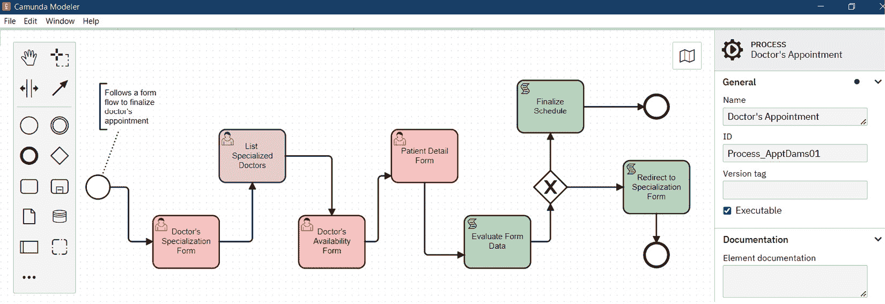

			<st c="17627">Figure 8.4 – Camunda Modeler with BPMN model for Camunda 7</st>
			<st c="17685">The version of SpiffWorkflow used by this chapter can only parse and execute the BPMN model for the Camunda 7 platform.</st> <st c="17806">Hopefully, its future releases can support Camunda 8 or higher versions of</st> <st c="17881">BPMN diagrams.</st>
			<st c="17895">Let us now create our workflow using the BPMN</st> <st c="17942">modeler tool.</st>
			<st c="17955">Creating a BPMN diagram</st>
			<st c="17979">BPMN is an open standard for business</st> <st c="18017">process diagrams.</st> <st c="18036">It is a graphical mechanism to visualize and simulate a systematic set of activities in one process flow that goals a successful result.</st> <st c="18173">A BPMN diagram has a set of graphical elements, called</st> *<st c="18228">flow objects</st>*<st c="18240">, composed of</st> *<st c="18254">activities</st>*<st c="18264">,</st> *<st c="18266">events</st>*<st c="18272">,</st> *<st c="18274">sequence flows</st>*<st c="18288">,</st> <st c="18290">and</st> *<st c="18294">gateways</st>*<st c="18302">.</st>
			<st c="18303">An activity represents work that needs execution inside a workflow process.</st> <st c="18380">A work can be simple and atomic, such as a</st> *<st c="18423">task</st>*<st c="18427">, or complex, such as a</st> *<st c="18451">sub-process</st>*<st c="18462">. When an activity is atomic and cannot break down further, despite the complexity of the process, then that is considered a task.</st> <st c="18593">A task in BPMN is denoted as a</st> *<st c="18624">rounded-corner rectangle shape</st>* <st c="18654">component.</st> <st c="18666">There are several types of tasks, but SpiffWorkflow only supports</st> <st c="18732">the following:</st>

				*   **<st c="18746">Manual task</st>** <st c="18758">– A non-automated task that a human can perform outside the context of</st> <st c="18830">the workflow.</st>
				*   **<st c="18843">Script task</st>** <st c="18855">– A task that runs a</st> <st c="18877">modeler-defined script.</st>
				*   **<st c="18900">User task</st>** <st c="18910">– A typical task that a human actor can carry out using some application-related operation, such as clicking</st> <st c="19020">a button.</st>

			<st c="19029">The tasks presented in the BPMN diagram of</st> *<st c="19073">Figure 8</st>**<st c="19081">.4</st>*<st c="19083">, namely</st> **<st c="19092">Doctor’s Specialization Form</st>**<st c="19120">,</st> **<st c="19122">List Specialized Doctors</st>**<st c="19146">,</st> **<st c="19148">Doctor’s Availability Form</st>**<st c="19174">, and</st> **<st c="19180">Patient Detail Form</st>**<st c="19199">, are</st> *<st c="19205">user tasks</st>*<st c="19215">. Usually, user tasks can represent actions such as web form handling, console-based transactions with user inputs, or transactions in applications involving editing and submitting form data.</st> <st c="19407">On the other hand, the</st> **<st c="19430">Evaluate Form Data</st>** <st c="19448">and</st> **<st c="19453">Finalize Schedule</st>** <st c="19470">tasks are considered</st> *<st c="19492">script tasks</st>*<st c="19504">.</st>
			<st c="19505">A</st> *<st c="19508">sequence flow</st>* <st c="19521">is a one-directional line connector between activities or tasks.</st> <st c="19587">The BPMN standard allows adding descriptions or labels to sequence flows to determine which paths to take from one activity</st> <st c="19711">to another.</st>
			<st c="19722">Now, the workflow will not work without</st> *<st c="19763">start</st>* <st c="19768">and</st> *<st c="19773">stop events</st>*<st c="19784">. An</st> *<st c="19789">event</st>* <st c="19794">is an occurrence along the workflow required to execute due to some triggers to produce some result.</st> <st c="19896">The start event, represented by a</st> *<st c="19930">small and open circle with a thin-lined boundary</st>*<st c="19978">, triggers the start of the workflow.</st> <st c="20016">The stop event, defined by a</st> *<st c="20045">small, open circle with a single thick-lined boundary</st>*<st c="20098">, ends the workflow activities.</st> <st c="20130">Other than these two, there are</st> *<st c="20162">cancel</st>*<st c="20168">,</st> *<st c="20170">signal</st>*<st c="20176">,</st> *<st c="20178">error</st>*<st c="20183">,</st> *<st c="20185">message</st>*<st c="20192">,</st> *<st c="20194">timer</st>*<st c="20199">, and</st> *<st c="20205">escalation</st>* <st c="20215">events supported by SpiffWorkflow, and all these are represented</st> <st c="20281">as circles.</st>
			<st c="20292">The</st> *<st c="20297">diamond-shaped component</st>* <st c="20321">in</st> *<st c="20325">Figure 8</st>**<st c="20333">.4</st>* <st c="20335">is a</st> *<st c="20341">gateway</st>* <st c="20348">component.</st> <st c="20360">It diverges or converges its incoming or outgoing process flows.</st> <st c="20425">It can control multiple incoming and multiple outgoing process flows.</st> <st c="20495">SpiffWorkflow supports the following types</st> <st c="20538">of gateways:</st>

				*   **<st c="20550">Exclusive gateway</st>** <st c="20568">– Caters to multiple incoming flows and will emit only one output flow based on</st> <st c="20649">some evaluation.</st>
				*   **<st c="20665">Parallel gateway</st>** <st c="20682">– Emits an independent</st> <st c="20706">process flow that will execute tasks without order but will wait for all the tasks</st> <st c="20789">to finish.</st>
				*   **<st c="20799">Event gateway</st>** <st c="20813">– Emits an outgoing flow based on some events from an</st> <st c="20868">outside source.</st>
				*   **<st c="20883">Inclusive gateway</st>** <st c="20901">– Caters to multiple incoming flows and can emit more than one output flow based on some</st> <st c="20991">complex evaluation.</st>

			<st c="21010">The gateway in</st> *<st c="21026">Figure 8</st>**<st c="21034">.4</st>* <st c="21036">is an example of an exclusive gateway because it will allow</st> **<st c="21097">the Finalize Schedule</st>** <st c="21118">task execution to proceed if, and only if, the form data is complete.</st> <st c="21189">Otherwise, it will redirect the sequence flow to the</st> **<st c="21242">Doctor’s Specialization Form</st>** <st c="21270">web form task again for</st> <st c="21295">data re-entry.</st>
			<st c="21309">Now, let us start the showcase on how SpiffWorkflow can interpret a BPMN diagram for</st> **<st c="21395">business process</st>** **<st c="21412">management</st>** <st c="21422">(</st>**<st c="21424">BPM</st>**<st c="21427">).</st>
			<st c="21430">Implementing the BPMN workflow</st>
			<st c="21461">SpiffWorkflow can translate mainly the</st> *<st c="21501">user</st>*<st c="21505">,</st> *<st c="21507">manual</st>*<st c="21513">, and</st> *<st c="21519">script</st>* <st c="21525">tasks of a BPMN diagram.</st> <st c="21551">So, it can best</st> <st c="21567">handle business process optimization involving sophisticated web flows in a</st> <st c="21643">web application.</st>
			<st c="21659">Since there is nothing to configure in the</st> `<st c="21703">create_app()</st>` <st c="21715">factory or</st> `<st c="21727">main.py</st>` <st c="21734">module for SpiffWorkflow, the next step after dependency module installations and the BPMN diagram design is the view function implementation for the BPMN diagram simulation.</st> <st c="21910">The view functions must initiate and execute SpiffWorkflow tasks to run the entire</st> <st c="21993">BPMN workflow.</st>
			<st c="22007">The first support class to call in the module script is</st> `<st c="22064">CamundaParser</st>`<st c="22077">, a support class found in the</st> `<st c="22108">SpiffWorkflow.camunda.parser.CamundaParser</st>` <st c="22150">module of SpiffWorkflow.</st> <st c="22176">The</st> `<st c="22180">CamundaParser</st>` <st c="22193">class will parse the BPMN tags of the BPMN file based on the Camunda 7 standards.</st> <st c="22276">The BPMN file is an XML document with tags corresponding to the</st> *<st c="22340">flow objects</st>* <st c="22352">of the workflow.</st> <st c="22370">Now, the</st> `<st c="22379">CamundaParser</st>` <st c="22392">class will need the name or ID of the BPMN definition to load the document and verify if the XML schema of the BPMN document is</st> <st c="22521">well formed and valid.</st> <st c="22544">The following is the first portion of the</st> `<st c="22586">/view/appointment.py</st>` <st c="22606">module of the</st> `<st c="22621">doctor</st>` <st c="22627">Blueprint module that instantiates the</st> `<st c="22667">CamundaParser</st>` <st c="22680">class that will load our</st> `<st c="22706">dams_appointment.bpmn</st>` <st c="22727">file, the workflow design depicted in the BPMN workflow diagram of</st> *<st c="22795">Figure 8</st>**<st c="22803">.4</st>*<st c="22805">:</st>

```

从 SpiffWorkflow.bpmn.workflow 导入 BpmnWorkflow

从 SpiffWorkflow.camunda.parser.CamundaParser 导入 CamundaParser

从 SpiffWorkflow.bpmn.specs.defaults 导入 ScriptTask

从 SpiffWorkflow.camunda.specs.user_task 导入 UserTask

从 SpiffWorkflow.task 导入 Task, TaskState

从 SpiffWorkflow.util.deep_merge 导入 DeepMerge <st c="23145">parser = CamundaParser()</st>

<st c="23169">filepath = os.path.join("bpmn/dams_appointment.bpmn")</st>

<st c="23223">parser.add_bpmn_file(filepath)</st>

<st c="23304">add_bpmn_file()</st> 函数的 API 将加载 BPMN 文件，而 <st c="23375">get_spec()</st> 函数将解析从进程定义 ID 调用开始的文档。现在，*<st c="23470">图 8</st>**<st c="23478">.5</st>* 展示了带有进程定义 ID 的 BPMN 文件快照：

            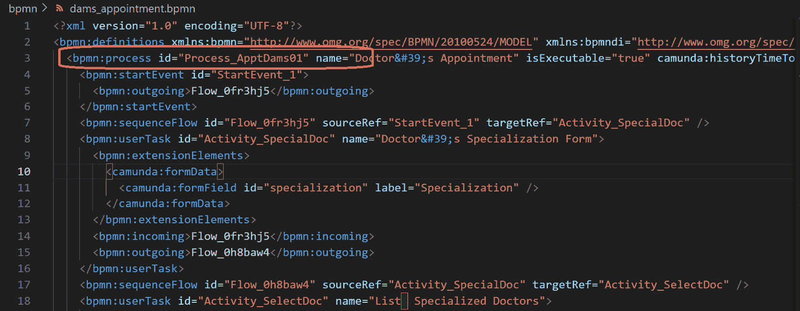

            <st c="24570">图 8.5 – 包含流程定义 ID 的 BPMN 文件快照</st>

            <st c="24645">在激活 SpiffWorkflow 及其解析器后，下一步是通过视图函数构建网页流程。</st> <st c="24758">视图实现将是一系列页面重定向，这将收集 BPMN 工作流程的*<st c="24881">用户任务</st>* <st c="24891">所需的所有必要表单数据值。</st> <st c="24914">以下</st> `<st c="24928">choose_specialization()</st>` <st c="24951">视图将是第一个网页表单，因为它将模拟**<st c="25020">医生的专长</st>** **<st c="25044">表单</st>** <st c="25048">任务：</st>

```py
<st c="25054">@doc_bp.route("/doctor/expertise",</st><st c="25089">methods = ["GET", "POST"])</st>
<st c="25116">async def choose_specialization():</st> if request.method == "GET":
      return render_template("doc_specialization_form.html")
    session['specialization'] = request.form['specialization'] <st c="25379">select_doctor()</st> to list all doctors with the specialization indicated by <st c="25452">choose_specialization()</st>. The following snippet presents the code for the <st c="25525">select_doctor()</st> view:

```

@doc_bp.route("/doctor/select", methods = ["GET", "POST"])

async def select_doctor():

    if request.method == "GET":

        return render_template("doc_doctors_form.html")

    session['docid'] = request.form['docid']

    return redirect(url_for("doc_bp.reserve_schedule") )

```py

			<st c="25802">After the</st> `<st c="25813">select_doctor()</st>` <st c="25828">view, the user will choose a date and time for the appointment through the</st> `<st c="25904">reserve_schedule()</st>` <st c="25922">view.</st> <st c="25929">The last view of the web flow is</st> `<st c="25962">provide_patient_details()</st>`<st c="25987">, which</st> <st c="25994">will ask for the patient details needed for the diagnosis and payment.</st> <st c="26066">The following code presents the implementation of the</st> `<st c="26120">reserve_schedule()</st>` <st c="26138">view:</st>

```

<st c="26144">@doc_bp.route("/doctor/schedule",</st><st c="26178">methods = ["GET", "POST"])</st>

<st c="26205">async def reserve_schedule():</st> if request.method == "GET": <st c="26264">return render_template("doc_schedule_form.html"), 201</st> session['appt_date'] = request.form['appt_date']

    session['appt_time'] = request.form['appt_time'] <st c="26505">provide_patient_details()</st>, 将触发工作流程执行，除了其提取预约安排所需的患者信息并与其他之前的视图中的其他详情合并的目标之外。以下是为`<st c="26761">provide_patient_details()</st>`视图的代码：

```py
<st c="26792">from SpiffWorkflow.bpmn.workflow import BpmnWorkflow</st>
<st c="26845">from SpiffWorkflow.camunda.parser.CamundaParser import CamundaParser</st>
<st c="26914">from SpiffWorkflow.bpmn.specs.bpmn_task_spec import TaskSpec</st>
<st c="26975">from SpiffWorkflow.camunda.specs.user_task import UserTask</st>
<st c="27034">from SpiffWorkflow.task import Task, TaskState</st>
<st c="27081">@doc_bp.route("/doctor/patient", methods = ["GET", "POST"])</st>
<st c="27141">async def provide_patient_details():</st> if request.method == "GET": <st c="27207">return render_template("doc_patient_form.html"), 201</st><st c="27259">form_data = dict()</st> form_data['specialization'] = <st c="27309">session['specialization']</st> form_data['docid'] = <st c="27356">session['docid']</st> form_data['appt_date'] = <st c="27398">session['appt_date']</st> form_data['appt_time'] = <st c="27444">session['appt_time']</st> form_data['ticketid'] = <st c="27489">request.form['ticketid']</st> form_data['patientid'] = <st c="27539">request.form['patientid']</st> form_data['priority_level'] = <st c="27595">request.form['priority_level']</st><st c="27625">workflow = BpmnWorkflow(spec)</st><st c="27655">workflow.do_engine_steps()</st> ready_tasks: List[Task] = <st c="27709">workflow.get_tasks(TaskState.READY)</st> while len(ready_tasks) > 0:
        for task in ready_tasks:
            if isinstance(<st c="27812">task.task_spec</st>, UserTask):
                upload_login_form_data(task, form_data)
            workflow.run_task_from_id(task_id=<st c="27914">task.id</st>)
         else:
            task_details:TaskSpec = <st c="27955">task.task_spec</st> print("Complete Task ", <st c="27994">task_details.name</st>) <st c="28014">workflow.do_engine_steps()</st> ready_tasks = <st c="28055">workflow.get_tasks(TaskState.READY)</st><st c="28090">dashboard_page = workflow.data['finalize_sched']</st> if dashboard_page:
      return render_template("doc_dashboard.html"), 201
    else:
      return redirect(url_for("doc_bp.choose_specialization"))
```

            *<st c="28271">会话处理</st>* <st c="28288">提供了</st> `<st c="28302">provide_patient_details()</st>` <st c="28327">视图，具有从之前的网页视图收集所有预约详情的能力。</st> <st c="28413">如给定代码所示，所有会话数据，包括</st> <st c="28471">其表单中的患者详情，都被放置在其</st> `<st c="28525">form_data</st>` <st c="28534">字典中。</st> <st c="28547">利用会话是一个解决方案，因为将 SpiffWorkflow 库所需的流程循环与网页流程融合是不可行的。</st> <st c="28696">最后一个重定向的页面必须使用</st> `<st c="28757">BpmnWorkflow</st>` <st c="28769">类</st> <st c="28777">启动工作流程。</st> <st c="28777">但</st> `<st c="28816">CamundaParser</st>` <st c="28829">和</st> `<st c="28834">BpmnWorkflow</st>` <st c="28846">API 类</st> <st c="28860">之间有什么区别？</st> <st c="28891">我们将在下一节回答这个问题。</st>

            <st c="28904">区分工作流程规范和实例</st>

            <st c="28965">SpiffWorkflow 中包含两种组件类别：</st> *<st c="29023">规范</st>* <st c="29036">和</st> *<st c="29041">实例</st>* <st c="29049">对象。</st> `<st c="29059">CamundaParser</st>`<st c="29072">通过</st> <st c="29082">其</st> `<st c="29086">get_spec()</st>` <st c="29096">方法，返回一个</st> `<st c="29115">WorkflowSpec</st>` <st c="29127">实例对象，这是一个定义 BPMN 工作流的规范或模型对象。</st> <st c="29209">另一方面，</st> `<st c="29228">BpmnWorkflow</st>` <st c="29240">创建一个</st> `<st c="29251">Workflow</st>` <st c="29259">实例对象，该对象跟踪并返回实际的工作流活动。</st> <st c="29330">然而，</st> `<st c="29339">BpmnWorkflow</st>` <st c="29351">在实例化之前需要将工作流规范对象作为其构造函数参数</st> <st c="29424">。</st>

            <st c="29445">工作流实例将提供从开始事件到停止事件的全部序列流以及相应的任务状态。</st> <st c="29582">所有状态，例如</st> `<st c="29606">READY</st>`<st c="29611">，</st> `<st c="29613">CANCELLED</st>`<st c="29622">，</st> `<st c="29624">COMPLETED</st>`<st c="29633">，和</st> `<st c="29639">FUTURE</st>`<st c="29645">，都在</st> `<st c="29668">TaskState</st>` <st c="29677">API 中指示，该 API 与在</st> `<st c="29721">Task</st>` <st c="29725">实例对象中找到的钩子方法相关联。</st> <st c="29743">但是，SpiffWorkflow 如何确定 BPMN 任务呢？</st> <st c="29793">我们将在下一节中看到。</st>

            <st c="29830">区分任务规范和实例</st>

            <st c="29884">与工作流一样，每个 SpiffWorkflow 任务都有一个名为</st> `<st c="29965">TaskSpec</st>`<st c="29973">的规范对象，它提供有关任务定义的名称和任务类型等详细信息，例如</st> *<st c="30010">任务定义的名称</st>* <st c="30037">和</st> *<st c="30042">任务类型</st>*<st c="30051">，如</st> `<st c="30061">UserTask</st>` <st c="30069">或</st> `<st c="30073">ScriptTask</st>`<st c="30083">。另一方面，任务实例对象被命名为</st> `<st c="30138">Task</st>`<st c="30142">。工作流实例</st> <st c="30165">对象提供</st> `<st c="30182">get_tasks()</st>` <st c="30193">重载，根据特定状态或</st> `<st c="30253">TaskSpec</st>` <st c="30261">实例返回所有任务。</st> <st c="30272">此外，它还有</st> `<st c="30289">get_task_from_id()</st>` <st c="30307">，根据</st> *<st c="30353">任务 ID</st>*<st c="30360">提取</st> `<st c="30323">Task</st>` <st c="30327">实例对象，</st> `<st c="30362">get_task_spec_from_name()</st>` <st c="30387">根据其指示的 BPMN 名称检索</st> `<st c="30404">TaskSpec</st>` <st c="30412">名称，以及</st> `<st c="30456">get_tasks_from_spec_name()</st>` <st c="30482">根据</st> `<st c="30516">TaskSpec</st>` <st c="30524">定义名称检索所有任务。</st>

            <st c="30541">为了遍历和跟踪每个</st> `<st c="30570">UserTask</st>`<st c="30578">、</st> `<st c="30580">ManualTask</st>`<st c="30590">或</st> `<st c="30595">Gateway</st>` <st c="30602">任务及其后续的</st> `<st c="30627">ScriptTask</st>` <st c="30637">任务（们）</st>，基于从</st> `<st c="30686">StartEvent</st>`<st c="30696">开始的 BPMN 图，调用工作流实例的</st> `<st c="30709">do_engine_steps()</st>` <st c="30726">方法。</st> <st c="30753">必须调用</st> `<st c="30774">do_engine_steps()</st>` <st c="30791">方法来跟踪工作流中的每个活动，包括事件和</st> `<st c="30861">ScriptTask</st>` <st c="30871">任务，直到达到</st> `<st c="30895">EndEvent</st>`<st c="30903">。因此，</st> `<st c="30911">provide_patient_details()</st>` <st c="30936">在</st> `<st c="30961">POST</st>` <st c="30965">事务中有一个</st> `<st c="30943">while</st>` <st c="30948">循环来遍历工作流并执行每个</st> `<st c="31021">Task</st>` <st c="31025">对象，使用工作流实例的</st> `<st c="31042">run_task_from_id()</st>` <st c="31060">方法。</st>

            <st c="31093">但是运行任务，特别是</st> `<st c="31126">UserTask</st>` <st c="31134">和</st> `<st c="31139">ScriptTask</st>`<st c="31149">，不仅涉及工作流活动的完成，还包括一些</st> <st c="31248">任务数据。</st>

            <st c="31258">将表单数据传递给 UserTask</st>

            `<st c="31288">UserTask</st>`<st c="31297">的表单字段是 BPMN 工作流数据的几个来源之一。</st> <st c="31366">Camunda 模型器允许 BPMN</st> <st c="31402">设计者为每个</st> `<st c="31445">UserTask</st>` <st c="31453">任务创建表单变量。</st> *<st c="31460">图 8</st>**<st c="31468">.6</st>* <st c="31470">显示了三个表单字段，即</st> `<st c="31507">patientid</st>`<st c="31516">、</st> `<st c="31518">ticketid</st>`<st c="31526">和</st> `<st c="31532">priority_level</st>`<st c="31546">，的</st> **<st c="31555">患者详细信息表单</st>** <st c="31574">任务以及 Camunda 模型器中添加表单变量的部分：</st>

            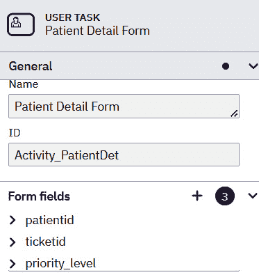

            <st c="31777">图 8.6 – 向 UserTask 添加表单字段</st>

            `<st c="31820">自定义生成的表单中存在表单字段需要通过视图函数将这些表单变量传递数据。</st>` `<st c="31949">没有值的表单字段将产生异常，这可能会停止工作流` `<st c="32021">执行，最终破坏 Flask 应用程序。</st>` `<st c="32075">以下代码片段中的`<st c="32079">while</st>` `<st c="32084">循环调用` `<st c="32127">provide_patient_details()</st>` `<st c="32152">视图调用一个` `<st c="32167">upload_login_form_data()</st>` `<st c="32191">自定义方法，该方法将` `<st c="32235">form_data</st>` `<st c="32244">字典中的值分配给每个` `<st c="32264">用户任务</st>` `<st c="32272">表单变量：</st>`

```py
<st c="32287">from SpiffWorkflow.util.deep_merge import DeepMerge</st>
<st c="32339">def upload_login_form_data(task: UserTask, form_data):</st> form = task.task_spec.form <st c="32422">data = {}</st> if task.data is None:
        task.data = {}
    for field in form.fields:
        if field.id == "specialization":
            process_data = form_data["specialization"]
        elif field.id == "docid":
            process_data = form_data["docid"]
        elif field.id == "date_scheduled":
            process_data = form_data["appt_date"]
        … … … … … … <st c="32716">update_data(data, field.id,  process_data)</st><st c="32757">DeepMerge.merge(task.data, data)</st>
<st c="32790">@doc_bp.route("/doctor/patient", methods = ["GET", "POST"])</st>
<st c="32850">async def provide_patient_details():</st> … … … … … …
    while len(ready_tasks) > 0:
        for task in ready_tasks:
            if isinstance(task.task_spec, UserTask): <st c="32993">upload_login_form_data(task, form_data)</st> else:
                task_details:TaskSpec = task.task_spec
                print("Complete Task ", task_details.name)
            workflow.run_task_from_id(task_id=task.id)
        … … … … … …
        return redirect(url_for("doc_bp.choose_specialization"))
```

            `<st c="33232">The</st>` `<st c="33237">upload_login_form_data()</st>` `<st c="33261">方法通过其` *<st c="33308">ID</st>* `<st c="33310">确定每个表单字段，并从`<st c="33340">form_data</st>` `<st c="33355">字典中提取其适当的`<st c="33364">值。</st>` `<st c="33377">然后，自定义方法，如下面的代码片段所示，将值分配给表单字段，并使用`<st c="33530">DeepMerge</st>` `<st c="33539">实用类`<st c="33554">将字段值对作为` *<st c="33506">工作流数据</st>` `<st c="33519">上传到 SpiffWorkflow：</st>`

```py
 def update_data(dct, name, value):
    path = name.split('.')
    current = dct
    for component in path[:-1]:
        if component not in current:
            current[component] = {}
        current = current[component]
    current[path[-1]] = value
```

            技术上讲，`<st c="33779">update_data()</st>` `<st c="33793">创建一个字典对象，其中字段名称作为键，其对应的`<st c="33894">form_data</st>` `<st c="33903">值。</st>`

            但是关于`<st c="33925">ScriptTask</st>` `<st c="33935">？它也能有表单变量吗？` `<st c="33970">让我们在下一节中探讨这个问题。</st>`

            添加 ScriptTask 的输入变量

            `<st c="34046">ScriptTask</st>` `<st c="34057">也可以有输入变量，但没有表单字段。</st>` `<st c="34109">这些输入变量也需要从视图函数中获取值，因为这些是其表达式的必要部分。</st>` `<st c="34225">有时，`<st c="34236">ScriptTask</st>` `<st c="34246">不需要从视图中获取输入，因为它可以提取现有的工作流数据来构建其条件表达式。</st>` `<st c="34362">但肯定的是，它必须发出后续`<st c="34428">网关</st>` `<st c="34435">` `<st c="34437">ScriptTask</st>` `<st c="34447">` 或 `<st c="34452">用户任务</st>` `<st c="34460">任务需要执行的输出变量。</st>` *<st c="34499">图 8</st>** `<st c="34507">.7</st>` `<st c="34509">显示了`<st c="34553">proceed</st>` `<st c="34560">输出变量以及它是如何从工作流数据中提取和使用配置文件信息的：</st>`

            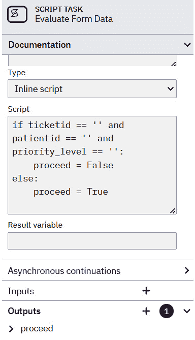

            图 8.7 – 在 ScriptTask 中利用变量

            <st c="34955">在运行所有任务并将所有值上传到工作流程中不同变量的后，工作流程的结果必须是决定视图函数结果的变量；在我们的案例中，是</st> `<st c="35169">provide_patient_details()</st>` <st c="35194">视图。</st> <st c="35201">现在让我们检索这些结果以确定我们的视图将渲染的响应类型。</st>

            <st c="35292">管理工作流程的结果</st>

            <st c="35328">通过 SpiffWorkflow，我们工作流程的目标是确定路由函数将渲染的视图页面。</st> <st c="35436">与此相关的是执行所需的后端事务，例如将</st> <st c="35529">预约计划保存到数据库中，向医生发送新创建的预约通知，以及生成必要的日程安排文档。</st> <st c="35699">工作流程生成数据将决定视图的结果过程。</st> <st c="35781">在我们的预约工作流程中，当生成的</st> `<st c="35829">finalize_sched</st>` <st c="35843">变量是</st> `<st c="35856">True</st>`<st c="35860">时，视图将重定向用户到医生的仪表板页面。</st> <st c="35926">否则，用户将看到数据收集过程的第一页。</st>

            <st c="36000">现在让我们探索 SpiffWorkflow 实现</st> <st c="36065">非 BPMN 工作流程的能力。</st>

            <st c="36084">实现非 BPMN 工作流程</st>

            <st c="36117">SpiffWorkflow 可以使用 JSON 或 Python 配置实现工作流程。</st> <st c="36190">在我们的</st> `<st c="36197">ch08-spiff-web</st>` <st c="36211">项目中，我们有一个</st> <st c="36232">以下 Python 类，它实现了支付</st> <st c="36297">流程工作流程的原型：</st>

```py
<st c="36314">from SpiffWorkflow.specs.WorkflowSpec import WorkflowSpec</st>
<st c="36372">from SpiffWorkflow.specs.ExclusiveChoice import</st> <st c="36420">ExclusiveChoice</st>
<st c="36436">from SpiffWorkflow.specs.Simple import Simple</st>
<st c="36482">from SpiffWorkflow.operators import Equal, Attrib</st>
<st c="36532">class PaymentWorkflowSpec(WorkflowSpec):</st> def __init__(self):
        super().__init__() <st c="36613">patient_pay = Simple(wf_spec=self, name='dams_patient_pay')</st> patient_pay.ready_event.connect(  callback=tx_patient_pay)
        self.start.connect(taskspec=patient_pay) <st c="36772">payment_verify = ExclusiveChoice(wf_spec=self, name='payment_check')</st> patient_pay.connect(taskspec=payment_verify)
        patient_release = Simple(wf_spec=self, name='dams_patient_release')
        cond = Equal(Attrib(name='amount'), Attrib(name='charge')) <st c="37013">payment_verify.connect_if(condition=cond,</st> <st c="37054">task_spec=patient_release)</st> patient_release.completed_event.connect( callback=tx_patient_release)
        patient_hold = Simple(wf_spec=self, name='dams_patient_onhold')
        payment_verify.connect(task_spec=patient_hold) <st c="37328">WorkflowSpec</st> is responsible for the non-BPMN workflow implementation in Python format. The constructor of the <st c="37439">WorkflowSpec</st> sub-class creates generic, simple, and atomic tasks using the <st c="37514">Simple</st> API of the <st c="37532">SpiffWorkflow.specs.Simple</st> module. The task can have more than one input and any number of output task variables. There is also an <st c="37663">ExclusiveChoice</st> sub-class that works like a gateway for the workflow.
			<st c="37732">Moreover, each task has a</st> `<st c="37759">connect()</st>` <st c="37768">method to</st> <st c="37778">establish sequence flows.</st> <st c="37805">It also has event variables, such as</st> `<st c="37842">ready_event</st>`<st c="37853">,</st> `<st c="37855">cancelled_event</st>`<st c="37870">,</st> `<st c="37872">completed_event</st>`<st c="37887">, and</st> `<st c="37893">reached_event</st>`<st c="37906">, that run their respective callback method, such as our</st> `<st c="37963">tx_patient_pay()</st>`<st c="37979">,</st> `<st c="37981">tx_patient_release()</st>`<st c="38001">, and</st> `<st c="38007">tx_patient_onhold()</st>` <st c="38026">methods.</st> <st c="38036">Calling these event objects marks a transition from one task’s current state</st> <st c="38113">to another.</st>
			<st c="38124">The</st> `<st c="38129">Attrib</st>` <st c="38135">helper class recognizes a task variable and retrieves its data for comparison performed by internal API classes, such as</st> `<st c="38257">Equal</st>`<st c="38262">,</st> `<st c="38264">NotEqual</st>`<st c="38272">, and</st> `<st c="38278">LessThan</st>`<st c="38286">, of the</st> `<st c="38295">SpiffWorkflow.operators</st>` <st c="38318">module.</st>
			<st c="38326">Let us now run our</st> `<st c="38346">PaymentWorkflowSpec</st>` <st c="38365">workflow using a</st> <st c="38383">view function.</st>
			<st c="38397">Running a non-BPMN workflow</st>
			<st c="38425">Since this is not a Camunda-based workflow, running</st> <st c="38477">the workflow does not need a parser.</st> <st c="38515">Immediately wrap and instantiate the custom</st> `<st c="38559">WorkflowSpec</st>` <st c="38571">sub-class inside the</st> `<st c="38593">Workflow</st>` <st c="38601">class and call</st> `<st c="38617">get_tasks()</st>` <st c="38628">inside the view function to prepare the non-BPMN workflow for the task traversal and executions.</st> <st c="38726">But the following</st> `<st c="38744">start_payment_form()</st>` <st c="38764">function opts for individual access of tasks using the workflow instance’s</st> `<st c="38840">get_tasks_from_spec_name()</st>` <st c="38866">function instead of using a</st> `<st c="38895">while</st>` <st c="38900">loop for</st> <st c="38910">task traversal:</st>

```

@payment_bp.route("/payment/start", methods = ["GET", "POST"])

async def start_payment_form():

    if request.method == "GET":

        return render_template("payment_form.html"), 201

    … … … … … … <st c="39220">任务</st> 列表将启动工作流程：

```py
 start_tasks: list[Task] = workflow_instance.get_tasks_from_spec_name( name='Start')
    for task in start_tasks:
        if task.state == TaskState.READY:
            workflow_instance.run_task_from_id( task_id=task.id)
```

            <st c="39450">此</st> `<st c="39456">任务</st>` <st c="39460">列表将加载所有支付数据到工作流程中，并执行</st> `<st c="39525">tx_patient_pay()</st>` <st c="39541">回调方法</st> <st c="39557">以处理</st> <st c="39569">支付交易：</st>

```py
 patient_pay_task: list[Task] = workflow_instance.get_tasks_from_spec_name( name='dams_patient_pay')
    for task in patient_pay_task:
        if task.state == TaskState.READY:
            task.set_data(ticketid=ticketid, patientid=patientid, charge=charge, amount=amount, discount=discount, status=status, date_released=date_released)
            workflow_instance.run_task_from_id(  task_id=task.id)
```

            <st c="39954">此部分工作流程将执行</st> `<st c="39998">ExclusiveChoice</st>` <st c="40013">事件，以比较患者支付的金额与患者的</st> <st c="40062">总费用：</st>

```py
 payment_check_task: list[Task] = workflow_instance.get_tasks_from_spec_name( name='payment_check')
    for task in payment_check_task:
        if task.state == TaskState.READY:
            workflow_instance.run_task_from_id( task_id=task.id)
```

            <st c="40324">如果患者全额支付了费用，以下任务将执行</st> `<st c="40401">tx_patient_release()</st>` <st c="40421">回调方法以清除并发布给患者</st> `<st c="40482">的释放通知：</st>

```py
 for_releasing = False
    patient_release_task: list[Task] = workflow_instance.get_tasks_from_spec_name( name='dams_patient_release')
    for task in patient_release_task:
        if task.state == TaskState.READY:
            for_releasing = True
            workflow_instance.run_task_from_id( task_id=task.id)
```

            <st c="40766">如果患者已部分支付费用，以下任务将执行</st> `<st c="40851">tx_patient_onhold()</st>` <st c="40870">回调方法：</st>

```py
 patient_onhold_task: list[Task] = workflow_instance.get_tasks_from_spec_name( name='dams_patient_onhold')
    for task in patient_onhold_task:
        if task.state == TaskState.READY:
            workflow_instance.run_task_from_id( task_id=task.id)
    if for_releasing == True:
        return redirect(url_for('payment_bp.release_patient'), code=307)
    else:
       return redirect(url_for('payment_bp.hold_patient'), code=307)
```

            <st c="41272">工作流程的结果将决定视图将用户重定向到哪个页面，是</st> *<st c="41373">释放</st>* <st c="41382">还是</st> *<st c="41386">挂起</st>* <st c="41393">页面。</st>

            <st c="41399">现在，SpiffWorkflow 将减少构建工作流程的编码工作量，因为它已经定义了支持 BPMN 和非 BPMN 工作流程实现的 API 类。</st> <st c="41570">但如果需要通过 SpiffWorkflow 几乎无法处理的 API 端点触发</st> <st c="41604">工作流程呢？</st>

            <st c="41674">下一主题将重点介绍使用 Camunda 平台使用的 BPMN 工作流程引擎，通过 API 端点运行任务。</st>

            <st c="41803">使用 Zeebe/Camunda 平台构建服务任务</st>

            **<st c="41859">Camunda</st>** <st c="41867">是一个流行的轻量级工作流程和决策自动化引擎，内置强大的工具，如</st> *<st c="41975">Camunda Modeler</st>*<st c="41990">，</st> *<st c="41992">Cawemo</st>*<st c="41998">，以及</st> *<st c="42008">Zeebe</st>* <st c="42013">代理。</st> <st c="42022">但本章不是关于 Camunda</st> <st c="42059">，而是关于使用 Camunda 的</st> *<st c="42086">Zeebe 服务器</st>* <st c="42098">来部署、运行和执行由 Flask 框架构建的工作流程任务。</st> <st c="42155">目标是创建一个 Flask 客户端应用程序，该应用程序将使用 Zeebe 工作流程引擎部署和运行由 Camunda Modeler 设计的 BPMN 工作流程。</st> <st c="42172">目标是创建一个 Flask 客户端应用程序，该应用程序将使用 Zeebe 工作流程引擎部署和运行由 Camunda Modeler 设计的 BPMN 工作流程。</st>

            <st c="42325">让我们从整合 Flask 与 Zeebe 服务器所需的设置和配置开始。</st>

            <st c="42421">设置 Zeebe 服务器</st>

            <st c="42449">运行 Zeebe 服务器的最简单方法是使用 Docker 运行其</st> `<st c="42518">camunda/zeebe</st>` <st c="42531">镜像。</st> <st c="42539">因此，在下载和安装</st> *<st c="42566">Docker 订阅服务协议</st>* <st c="42603">之前，请先阅读更新后的内容</st> <st c="42638">Docker Desktop，可在</st> <st c="42664">以下链接</st> [<st c="42669">https://docs.docker.com/desktop/install/windows-install/</st>](https://docs.docker.com/desktop/install/windows-install/)<st c="42725">找到。</st>

            <st c="42726">安装完成后，启动 Docker 引擎，打开终端，并运行以下</st> <st c="42815">Docker 命令：</st>

```py
 docker run --name zeebe --rm -p 26500-26502:26500-26502 -d --network=ch08-network camunda/zeebe:latest
```

            <st c="42933">一个</st> *<st c="42936">Docker 网络</st>*<st c="42950">，就像我们的</st> `<st c="42964">ch08-network</st>`<st c="42976">，需要暴露端口到开发平台。</st> <st c="43037">Zeebe 的端口</st> `<st c="43050">26500</st>` <st c="43055">是 Flask 客户端应用程序将通信到服务器网关 API 的地方。</st> <st c="43140">使用 Zeebe 后，使用</st> `<st c="43167">docker stop</st>` <st c="43178">命令与</st> *<st c="43192">Zeebe 的容器 ID</st>* <st c="43212">一起关闭</st> <st c="43226">代理。</st>

            <st c="43237">现在，下一步是为应用程序安装合适的 Python Zeebe 客户端。</st>

            <st c="43324">安装 pyzeebe 库</st>

            <st c="43355">许多有效且流行的 Zeebe 客户端库</st> <st c="43409">是基于 Java 的。</st> <st c="43425">然而，</st> `<st c="43434">pyzeebe</st>` <st c="43441">是少数几个简单、易于使用、轻量级且在建立与 Zeebe 服务器连接方面有效的 Python 外部模块之一。</st> <st c="43570">它是一个基于</st> *<st c="43599">gRPC</st>*<st c="43603">的 Zeebe 客户端库，通常设计用于管理涉及</st> <st c="43689">RESTful 服务</st>的工作流程。</st>

            <st c="43706">重要提示</st>

            <st c="43721">gRPC 是一个灵活且高性能的 RPC 框架，可以在任何环境中运行，并轻松连接到任何集群，支持访问认证、API 健康检查、负载均衡和开源跟踪。</st> <st c="43938">所有 Zeebe 客户端库都使用 gRPC 与</st> <st c="43994">服务器通信。</st>

            <st c="44005">现在让我们使用</st> `<st c="44029">pip</st>` <st c="44036">命令安装</st> `<st c="44029">pyzeebe</st>` <st c="44036">库：</st>

```py
 pip install pyzeebe
```

            <st c="44087">安装和</st> <st c="44115">设置完成后，是时候使用</st> <st c="44177">Camunda Modeler</st>创建 BPMN 工作流程图了。</st>

            <st c="44193">为 pyzeebe 创建 BPMN 图</st>

            <st c="44229">The</st> `<st c="44234">pyzeebe</st>` <st c="44241">模块可以</st> <st c="44252">加载和解析</st> *<st c="44287">Camunda 版本 8.0</st>*<st c="44306">. 由于它是一个小型库，它只能读取和执行</st> `<st c="44366">ServiceTask</st>` <st c="44377">任务。</st> *<st c="44385">图 8.8</st>**<st c="44393">.8</st>* <st c="44395">显示了一个包含两个</st> `<st c="44426">ServiceTask</st>` <st c="44437">任务的 BPMN 图：</st> **<st c="44449">获取诊断</st>** <st c="44464">任务，该任务</st> <st c="44476">检索所有患者的诊断，以及</st> **<st c="44520">获取分析</st>** <st c="44532">任务，该任务将医生的决议或处方返回给</st> <st c="44598">诊断：</st>

            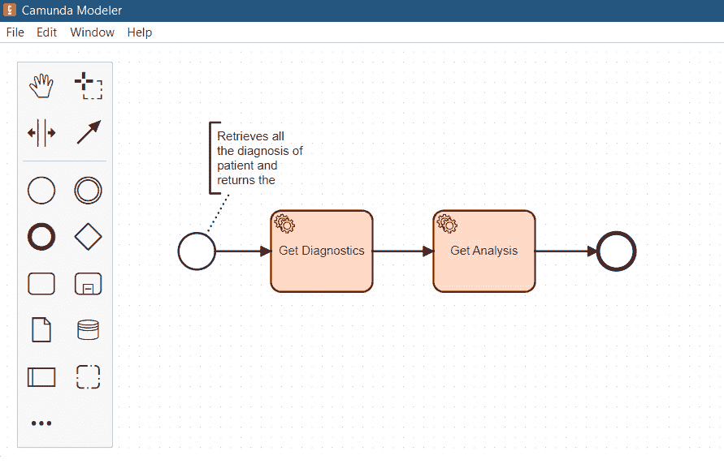

            <st c="44706">图 8.8 – 包含两个 ServiceTask 任务的 BPMN 图</st>

            `<st c="44760">下一步是使用</st>` `<st c="44828">pyzeebe</st>` `<st c="44835">客户端库加载和运行最终的 BPMN 文档。</st>` `<st c="44852">没有</st>` `<st c="44930">pyzeebe</st>` `<st c="44937">worker</st>` `<st c="44944">和</st>` `<st c="44949">client</st>` `<st c="44955">，无法运行 BPMN 图中的工作流活动。</st>` `<st c="44995">但 worker 的实现必须</st>` `<st c="44995">首先进行。</st>`

            `<st c="45006">创建 pyzeebe worker</st>`

            `<st c="45032">A</st>` `<st c="45035">pyzeebe</st>` `<st c="45042">worker 或一个</st>` `<st c="45055">ZeebeWorker</st>` `<st c="45066">worker 是一个</st>` `<st c="45078">典型的 Zeebe worker，它处理所有</st>` `<st c="45117">ServiceTask</st>` `<st c="45128">任务。</st>` `<st c="45136">它使用</st>` `<st c="45183">asyncio</st>` `<st c="45190">异步地在后台运行。</st>` `<st c="45192">pyzeebe</st>` `<st c="45199">作为一个异步库，更喜欢具有</st>` `<st c="45239">Flask[async]</st>` `<st c="45251">平台和</st>` `<st c="45266">asyncio</st>` `<st c="45273">工具的</st>` `<st c="45285">。但它需要</st>` `<st c="45301">grpc.aio.Channel</st>` `<st c="45317">作为构造函数</st>` `<st c="45335">参数</st>` `<st c="45345">在实例化之前。</st>`

            `<st c="45366">该库提供了三种创建所需通道的方法，即</st>` `<st c="45439">create_insecure_channel()</st>` `<st c="45464">，</st>` `<st c="45466">create_secure_channel()</st>` `<st c="45489">，和</st>` `<st c="45495">create_camunda_cloud_channel()</st>` `<st c="45525">。所有三种都实例化了通道，但</st>` `<st c="45568">create_insecure_channel()</st>` `<st c="45593">忽略了 TLS 协议，而</st>` `<st c="45627">create_camunda_cloud_channel()</st>` `<st c="45657">考虑了与 Camunda 云的连接。</st>` `<st c="45705">我们的</st>` `<st c="45709">ch08-zeebe</st>` `<st c="45719">应用程序使用不安全的通道来实例化</st>` `<st c="45773">ZeebeWorker</st>` `<st c="45784">worker，并最终管理我们 BPMN 文件中指示的</st>` `<st c="45818">ServiceTask</st>` `<st c="45829">任务。</st>` `<st c="45864">以下</st>` `<st c="45878">worker-tasks</st>` `<st c="45890">模块脚本显示了一个包含</st>` `<st c="45963">ZeebeWorker</st>` `<st c="45974">实例化和其任务</st>` `<st c="46003">或作业的独立 Python 应用程序：</st>`

```py
<st c="46011">from pyzeebe import ZeebeWorker, create_insecure_channel</st> import asyncio
from modules.models.config import db_session, init_db
from modules.doctors.repository.diagnosis import DiagnosisRepository
print('starting the Zeebe worker...')
print('initialize database connectivity...')
init_db()
channel = create_insecure_channel() <st c="46479">ZeebeWorker</st> worker with its constructor parameters. The <st c="46535">initdb()</st> call is included in the module because our tasks will need CRUD transactions:

```

`<st c="46621">@worker.task(task_type="select_diagnosis",</st>` `<st c="46664">**Zeebe.TASK_DEFAULT_PARAMS)</st>`

`<st c="46693">async def select_diagnosis(docid, patientid):</st>` `async with db_session() as sess:`

        `async with sess.begin():`

            `try:`

            `repo = DiagnosisRepository(sess)`

            `records = await repo.select_diag_doc_patient(docid, patientid)`

            `diagnosis_rec = [rec.to_json() for rec in records]`

            `diagnosis_str = json.dumps(diagnosis_rec, default=json_date_serializer)`

            `return {"data": diagnosis_str}`

            `except Exception as e:`

            `print(e)`

            返回`{"data": json.dumps([])}`

```py

			<st c="47117">The</st> `<st c="47122">select_diagnosis()</st>` <st c="47140">method is a</st> `<st c="47153">pyzeebe</st>` <st c="47160">worker decorated with the</st> `<st c="47187">@worker.task()</st>` <st c="47201">annotation.</st> <st c="47214">The</st> `<st c="47218">task_type</st>` <st c="47227">attribute of the</st> `<st c="47245">@worker.task()</st>` <st c="47259">annotation indicates its</st> `<st c="47285">ServiceTask</st>` <st c="47296">name in the</st> <st c="47308">BPMN model.</st> <st c="47321">The decorator can also include other attributes, such as</st> `<st c="47378">exception_handler</st>` <st c="47395">and</st> `<st c="47400">timeout_ms</st>`<st c="47410">. Now,</st> `<st c="47417">select_diagnosis()</st>` <st c="47435">looks for all patients’ diagnoses from the database with</st> `<st c="47493">docid</st>` <st c="47499">and</st> `<st c="47503">patientid</st>` <st c="47512">parameters as filters to the search.</st> <st c="47550">It returns a dictionary with a key named</st> `<st c="47591">data</st>` <st c="47595">handling</st> <st c="47605">the result:</st>

```

<st c="47616">@worker.task(task_type="retrieve_analysis", **Zeebe.TASK_DEFAULT_PARAMS)</st>

<st c="47689">async def retrieve_analysis(records):</st> try:

    records_diagnosis = json.loads(records)

    diagnosis_text = [dt['resolution'] for dt in records_diagnosis]

    返回 {"result": diagnosis_text}

except Exception as e:

    打印(e)

返回 {"result": []}

```py

			<st c="47924">On the other hand, this</st> `<st c="47949">retrieve_analysis()</st>` <st c="47968">task takes</st> `<st c="47980">records</st>` <st c="47987">from</st> `<st c="47993">select_diagnosis()</st>` <st c="48011">in string form but is serialized back to the list form with</st> `<st c="48072">json.loads()</st>`<st c="48084">. This task will extract</st> <st c="48108">only all resolutions from the patients’ records</st> <st c="48156">and return them to the caller.</st> <st c="48188">The task returns a</st> <st c="48207">dictionary also.</st>
			<st c="48223">The</st> *<st c="48228">local parameter names</st>* <st c="48249">and the</st> *<st c="48258">dictionary keys</st>* <st c="48273">returned by the worker’s tasks must be</st> *<st c="48313">BPMN variable names</st>* <st c="48332">because the client will also fetch these local parameters to assign values and dictionary keys for the output extraction for the preceding</st> `<st c="48472">ServiceTask</st>` <st c="48483">task.</st>
			<st c="48489">Since our Flask client application uses its event loop, our worker must run on a separate event loop using</st> `<st c="48597">asyncio</st>` <st c="48604">to avoid exceptions.</st> <st c="48626">The following</st> `<st c="48640">worker_tasks.py</st>` <st c="48655">snippet shows how to run the worker on an</st> `<st c="48698">asyncio</st>` <st c="48705">environment:</st>

```

如果 __name__ == "__main__": <st c="48821">ZeebeWorker</st> 实例有一个 <st c="48848">work()</st> 协程，它必须在后台异步运行，使用独立的事件，与 Flask 操作断开连接。始终使用 Python 命令运行模块，例如 <st c="49032">python worker-tasks.py</st>。

            <st c="49055">现在让我们实现</st> `<st c="49081">pyzeebe</st>` <st c="49088">客户端。</st>

            <st c="49096">实现 pyzeebe 客户端</st>

            <st c="49128">Flask 应用需要</st> <st c="49159">实例化</st> `<st c="49176">ZeebeClient</st>` <st c="49187">类以连接到 Zeebe。</st> <st c="49215">与</st> `<st c="49227">ZeebeWorker</st>`<st c="49238">一样，它也需要在实例化之前将相同的</st> `<st c="49266">grpc.aio.Channel</st>` <st c="49282">参数作为构造函数参数。</st> <st c="49346">由于</st> `<st c="49352">ZeebeClient</st>` <st c="49363">的行为类似于</st> `<st c="49392">ZeebeWorker</st>`<st c="49403">，所有操作都必须在后台异步作为 Celery 任务运行。</st> <st c="49483">但是，与工作进程不同，</st> `<st c="49507">ZeebeClient</st>` <st c="49518">作为其 Celery 服务任务的一部分出现在每个 Blueprint</st> <st c="49546">模块中。</st> <st c="49590">以下是在 *<st c="49648">doctor</st>* <st c="49654">Blueprint 模块中实例化</st> `<st c="49690">ZeebeClient</st>` <st c="49701">并使用 Celery 任务</st> 的 `<st c="49611">diagnosis_tasks</st>` <st c="49626">模块脚本：</st>

```py
 from celery import shared_task
import asyncio <st c="49771">from pyzeebe import ZeebeClient, create_insecure_channel</st> channel = create_insecure_channel(hostname="localhost", port=26500) <st c="49959">ZeebeClient</st> instance. The port to connect the Zeebe client is <st c="50021">26500</st>:

```

<st c="50028">@shared_task(ignore_result=False)</st>

<st c="50061">def deploy_zeebe_wf(bpmn_file):</st> async def zeebe_wf(bpmn_file):

        try: <st c="50130">await client.deploy_process(bpmn_file)</st> 返回 True

        except Exception as e:

            打印(e)

        返回 False <st c="50314">deploy_zeebe_wf()</st> 任务是在其他任何操作之前运行的第一个进程。调用此 API 端点的任务将加载、解析并将带有工作流的 BPMN 文件部署到 Zeebe 服务器，使用 <st c="50521">deploy_process()</st> 方法，这是 <st c="50548">ZeebeClient</st> 的异步方法。如果 BPMN 文件有模式问题、格式不正确或无效，任务将抛出异常：

```py
<st c="50666">@shared_task(ignore_result=False)</st>
<st c="50700">def run_zeebe_task(docid, patientid):</st> async def zeebe_task(docid, patientid):
        try:
            process_instance_key, result = await <st c="50821">client.run_process_with_result(</st><st c="50852">bpmn_process_id</st>= "Process_Diagnostics", <st c="50894">variables</st>={"<st c="50907">docid</st>": docid, "<st c="50925">patientid</st>":patientid}, variables_to_fetch =["<st c="50972">result</st>"], timeout=10000)
            return result
        except Exception as e:
            print(e)
            return {} <st c="51147">ZeebeClient</st> has two asynchronous methods that can execute process definitions in the BPMN file, and these are <st c="51258">run_process()</st> and <st c="51276">run_process_with_result()</st>. Both methods pass values to the first task of the workflow, but only <st c="51372">run_process_with_result()</st> returns an output value. The given <st c="51433">run_zeebe_task()</st> method will execute the first <st c="51480">ServiceTask</st> task, the worker’s <st c="51511">select_diagnosis()</st> task, pass values to its <st c="51555">docid</st> and <st c="51565">patientid</st> parameters, and retrieve the dictionary output of the last <st c="51634">ServiceTask</st> task, <st c="51652">retrieve_analysis()</st>, indicated by the <st c="51690">result</st> key. A <st c="51704">ServiceTask</st> task’s parameters are considered BPMN variables that the BPMN file or the <st c="51790">ZeebeClient</st> operations can fetch at any time. Likewise, the key of the dictionary returned by <st c="51884">ServiceTask</st> becomes a BPMN variable, too. So, the <st c="51934">variables</st> parameter of the <st c="51961">run_process_with_result()</st> method fetches the local parameters of the first worker’s task, and its <st c="52059">variables_to_fetch</st> property retrieves the returned dictionary of any <st c="52128">ServiceTask</st> task indicated by the key name.
			<st c="52171">To enable the</st> `<st c="52186">ZeebeClient</st>` <st c="52197">operations, run Celery and the Redis broker.</st> <st c="52243">Let us now implement API endpoints that will simulate the</st> <st c="52301">diagnosis workflow.</st>
			<st c="52320">Building API endpoints</st>
			<st c="52343">The following API endpoint passes the</st> <st c="52381">filename of the BPMN file to the</st> `<st c="52415">pyzeebe</st>` <st c="52422">client by calling the</st> `<st c="52445">deploy_zeebe_wf()</st>` <st c="52462">Celery task:</st>

```

<st c="52475">@doc_bp.get("/diagnosis/bpmn/deploy")</st>

<st c="52513">async def deploy_diagnosis_analysis_bpmn():</st> try:

        filepath = os.path.join(Zeebe.BPMN_DUMP_PATH, "<st c="52610">dams_diagnosis.bpmn</st>") <st c="52634">task = deploy_zeebe_wf.apply_async(args=[filepath])</st><st c="52685">result = task.get()</st> 返回 jsonify(data=result), 201

    except Exception as e:

            打印(e)

    return jsonify(data="error"), 500

```py

			<st c="52804">Afterward, the following</st> `<st c="52830">extract_analysis_text()</st>` <st c="52853">endpoint can run the workflow by calling the</st> `<st c="52899">run_zeebe_task()</st>` <st c="52915">Celery task:</st>

```

`<st c="52928">@doc_bp.post("/diagnosis/analysis/text")</st>`

`<st c="52969">async def extract_analysis_text():</st>` try:

            data = request.get_json()

            docid = data['docid']

            patientid = int(data['patientid']) `<st c="53093">task = run_zeebe_task.apply_async(args=[docid,</st>` `<st c="53139">patientid])</st>` `<st c="53151">result = task.get()</st>` return jsonify(result), 201

        except Exception as e:

            print(e)

        return jsonify(data="error"), 500

```py

			<st c="53265">The given endpoint will also pass the</st> `<st c="53304">docid</st>` <st c="53309">and</st> `<st c="53314">patientid</st>` <st c="53323">values to the</st> <st c="53338">client task.</st>
			<st c="53350">The</st> `<st c="53355">pyzeebe</st>` <st c="53362">library has many limitations, such as supporting</st> `<st c="53412">UserTask</st>` <st c="53420">and web flows and implementing workflows that</st> <st c="53466">call API endpoints for results.</st> <st c="53499">Although connecting our Flask application to the enterprise Camunda platform can address these problems with</st> `<st c="53608">pyzeebe</st>`<st c="53615">, it is a practical and clever approach to use the Airflow 2.x</st> <st c="53678">platform instead.</st>
			<st c="53695">Using Airflow 2.x in orchestrating API endpoints</st>
			**<st c="53744">Airflow 2.x</st>** <st c="53756">is an open source platform that provides workflow authorization, monitoring, scheduling, and maintenance with its easy-to-use UI dashboard.</st> <st c="53897">It can manage</st> **<st c="53911">extract, transform, load</st>** <st c="53935">(</st>**<st c="53937">ETL</st>**<st c="53940">) workflows</st> <st c="53953">and</st> <st c="53957">data analytics.</st>
			<st c="53972">Airflow uses Flask Blueprints internally and allows</st> <st c="54024">customization just by adding custom Blueprints in its Airflow directory.</st> <st c="54098">However, the main goal of this</st> <st c="54129">chapter is to use Airflow as an API orchestration tool to run sets of workflow activities that consume API services</st> <st c="54245">for resources.</st>
			<st c="54259">Let us begin with the installation of the Airflow</st> <st c="54310">2.x platform.</st>
			<st c="54323">Installing and configuring Airflow 2.x</st>
			<st c="54362">There is no direct Airflow 2.x installation for</st> <st c="54410">the Windows platform yet.</st> <st c="54437">But there is a Docker image that can run Airflow on Windows and operating systems with low</st> <st c="54528">memory resources.</st> <st c="54546">Our approach was to install Airflow directly on WSL2 (Ubuntu) through Windows PowerShell and also use Ubuntu to implement our Flask application for</st> <st c="54694">this topic.</st>
			<st c="54705">Now, follow the</st> <st c="54722">next procedures:</st>

				1.  <st c="54738">For Windows users, run the</st> `<st c="54766">wsl</st>` <st c="54769">command on PowerShell and log in to its home account using the</st> *<st c="54833">WSL credentials</st>*<st c="54848">.</st>
				2.  <st c="54849">Then, run the</st> `<st c="54864">cd ~</st>` <st c="54868">Linux command to ensure all installations happen in the</st> <st c="54925">home directory.</st>
				3.  <st c="54940">After installing Python 11.x and all its required Ubuntu libraries, create a virtual environment (for example,</st> `<st c="55052">ch08-airflow-env</st>`<st c="55068">) using the</st> `<st c="55081">python3 -m venv</st>` <st c="55096">command for the</st> `<st c="55113">airflow</st>` <st c="55120">module installation.</st>
				4.  <st c="55141">Activate the virtual environment by running the</st> `<st c="55190">source <</st>``<st c="55198">venv_folder>/bin/activate</st>` <st c="55224">command.</st>
				5.  <st c="55233">Next, find a directory in the system that can be the Airflow core directory where all Airflow configurations and customizations happen.</st> <st c="55370">In our case, it is the</st> `<st c="55393">/</st>``<st c="55394">mnt/c/Alibata/Development/Server/Airflow</st>` <st c="55434">folder.</st>
				6.  <st c="55442">Open the</st> `<st c="55452">bashrc</st>` <st c="55458">configuration file and add the</st> `<st c="55490">AIRFLOW_HOME</st>` <st c="55502">variable with the Airflow core directory path.</st> <st c="55550">The following is a sample of registering</st> <st c="55591">the variable:</st>

    ```

    `<st c="55684">airflow</st>` module using the `<st c="55709">pip</st>` command:

    ```py
     pip install apache-airflow
    ```

    ```py

    				7.  <st c="55748">Initialize its metadata database and generate configuration files in the</st> `<st c="55822">AIRFLOW_HOME</st>` <st c="55834">directory using the</st> `<st c="55855">airflow db</st>` `<st c="55866">migrate</st>` <st c="55873">command.</st>
				8.  <st c="55882">Create an administrator</st> <st c="55907">account for its UI dashboard using the</st> <st c="55946">following command:</st> `<st c="55965">airflow users create --username <user> --password <pass> --firstname <fname> --lastname <lname> --role Admin --email <xxxx@yyyy.com></st>`<st c="56097">. The role value should</st> <st c="56121">be</st> `<st c="56124">Admin</st>`<st c="56129">.</st>
				9.  <st c="56130">Verify if the user account is added to its database using the</st> `<st c="56193">airflow users</st>` `<st c="56207">list</st>` <st c="56211">command.</st>
				10.  <st c="56220">At this point, log in to the</st> *<st c="56250">root account</st>* <st c="56262">and activate the virtual environment using</st> `<st c="56306">root</st>`<st c="56310">. Run the scheduler using the</st> `<st c="56340">airflow</st>` `<st c="56348">scheduler</st>` <st c="56357">command.</st>
				11.  <st c="56366">With the root account, run the server using the</st> `<st c="56415">airflow webserver --port 8080</st>` <st c="56444">command.</st> <st c="56454">Port</st> `<st c="56459">8080</st>` <st c="56463">is its</st> <st c="56471">default port.</st>
				12.  <st c="56484">Lastly, access the Airflow portal at</st> `<st c="56522">http://localhost:8080</st>` <st c="56543">and use your</st> `<st c="56557">Admin</st>` <st c="56562">account to log in to</st> <st c="56584">the dashboard.</st>

			*<st c="56598">Figure 8</st>**<st c="56607">.9</st>* <st c="56609">shows the home dashboard of</st> <st c="56638">Airflow 2.x:</st>
			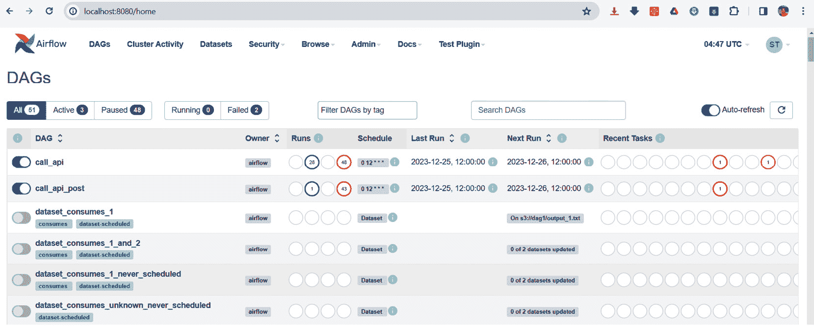

			<st c="57451">Figure 8.9 – The home page of the Airflow 2.x UI</st>
			<st c="57499">An Airflow architecture is composed of the</st> <st c="57543">following components:</st>

				*   **<st c="57564">Web server</st>** <st c="57575">– Runs the UI management dashboard and executes and</st> <st c="57628">monitors tasks.</st>
				*   **<st c="57643">Scheduler</st>** <st c="57653">– Checks the status of tasks, updates tasks’ state details in the metadata database, and queues the next</st> <st c="57759">task</st> <st c="57764">for executions.</st>
				*   **<st c="57779">Metadata database</st>** <st c="57797">– Stores the states of a task,</st> **<st c="57829">cross-communications</st>** <st c="57849">(</st>**<st c="57851">XComs</st>**<st c="57856">) data, and</st> **<st c="57869">directed acyclic graph</st>** <st c="57891">(</st>**<st c="57893">DAG</st>**<st c="57896">) variables; processes perform read and write</st> <st c="57942">operations in</st> <st c="57957">this database.</st>
				*   **<st c="57971">Executor</st>** <st c="57980">– Executes tasks and updates the</st> <st c="58014">metadata database.</st>

			<st c="58032">Next, let us create</st> <st c="58053">workflow tasks.</st>
			<st c="58068">Creating tasks</st>
			<st c="58083">Airflow uses DAG files to implement tasks and their sequence flows.</st> <st c="58152">A DAG is a high-level design of the workflow and exclusive</st> <st c="58210">tasks based on their task definitions, schedules, relationships, and dependencies.</st> <st c="58294">Airflow provides the API classes that implement a DAG in Python code.</st> <st c="58364">But, before creating DAG files, open the</st> `<st c="58405">AIRFLOW_HOME</st>` <st c="58417">directory and create a</st> `<st c="58441">dags</st>` <st c="58445">sub-folder inside it.</st> *<st c="58468">Figure 8</st>**<st c="58476">.10</st>* <st c="58479">shows our Airflow core directory with the created</st> `<st c="58530">dags</st>` <st c="58534">folder:</st>
			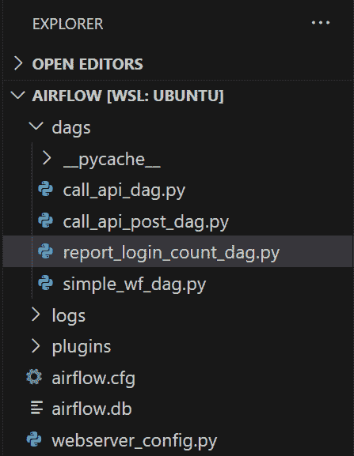

			<st c="58764">Figure 8.10 – Custom dags folder in AIRFLOW_HOME</st>
			<st c="58812">One of the files in our</st> `<st c="58837">$AIRFLOW_HOME/dag</st>` <st c="58854">directory is</st> `<st c="58868">report_login_count_dag.py</st>`<st c="58893">, which builds a sequence flow composed of two orchestrated API executions, each with</st> <st c="58979">service tasks.</st> *<st c="58994">Figure 8</st>**<st c="59002">.11</st>* <st c="59005">provides an overview of the</st> <st c="59034">workflow design:</st>
			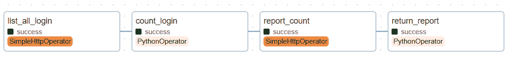

			<st c="59172">Figure 8.11 – An overview of an Airflow DAG</st>
			`<st c="59215">DAG</st>` <st c="59219">is an API class from the</st> `<st c="59245">airflow</st>` <st c="59252">module that implements an entire workflow activity.</st> <st c="59305">It is composed of different</st> *<st c="59333">operators</st>* <st c="59342">that represent tasks.</st> <st c="59365">A DAG file can implement more than one DAG if needed.</st> <st c="59419">The following code is the</st> `<st c="59445">DAG</st>` <st c="59448">script in the</st> `<st c="59463">report_login_count_dag.py</st>` <st c="59488">file that implements the workflow depicted in</st> *<st c="59535">Figure 8</st>**<st c="59543">.11</st>*<st c="59546">:</st>

```

`<st c="59548">from airflow import DAG</st>`

`<st c="59571">from airflow.operators.python import PythonOperator</st>`

`<st c="59623">from airflow.providers.http.operators.http import</st>` `<st c="59673">SimpleHttpOperator</st>` from datetime import datetime `<st c="59723">with DAG(dag_id="report_login_count",</st>` description="Report the number of login accounts", `<st c="59812">start_date=datetime(2023, 12, 27),</st>` `<st c="59846">schedule_interval="0 12 * * *",</st>` ) as `<st c="59918">dag_id</st>` value. Aside from `<st c="59943">description</st>`, DAG has parameters, such as `<st c="59984">start_date</st>` and `<st c="59999">schedule_interval</st>`, that work like a Cron (time) scheduler for the workflow. The `<st c="60079">schedule_interval</st>` parameter can have the `<st c="60120">@hourly</st>`, `<st c="60129">@daily</st>`, `<st c="60137">@weekly</st>`, `<st c="60146">@monthly</st>`, or `<st c="60159">@yearly</st>` Cron preset options run periodically or a Cron-based expression, such as `<st c="60240">*/15 * * * *</st>`, that schedules the workflow to run every `<st c="60295">15 minutes</st>`. Setting the parameter to `<st c="60332">None</st>` will disable the periodic execution, requiring a trigger to run the tasks:

```py
 task1 = <st c="60420">SimpleHttpOperator</st>( <st c="60441">task_id="list_all_login",</st><st c="60466">method="GET",</st><st c="60480">http_conn_id="packt_dag",</st><st c="60506">endpoint="/ch08/login/list/all",</st> headers={"Content-Type": "application/json"}, <st c="60586">response_check=lambda response:</st> <st c="60617">handle_response(response),</st><st c="60644">dag=dag</st> )
    task2 = <st c="60663">PythonOperator</st>( <st c="60680">task_id='count_login',</st><st c="60702">python_callable=count_login,</st><st c="60731">provide_context=True,</st><st c="60753">do_xcom_push=True,</st><st c="60772">dag=dag</st> )
```

            `<st c="60782">An</st>` `<st c="60785">Airflow operator</st>` `<st c="60801">implements a task.</st>` `<st c="60821">But, there are many types of operators to choose from depending on what kind</st>` `<st c="60898">of task the DAG requires.</st>` `<st c="60924">Some widely used operators in training and workplaces are</st>` `<st c="60982">the following:</st>`

                +   `<st c="60996">EmptyOperator</st>` `<st c="61010">– Initiates a</st>` `<st c="61025">built-in execution.</st>`

                +   `<st c="61044">PythonOperator</st>` `<st c="61059">– Calls a Python function that implements a</st>` `<st c="61104">business logic.</st>`

                +   `<st c="61119">BashOperator</st>` `<st c="61132">– Aims to run</st>` `<st c="61147">bash</st>` `<st c="61151">commands.</st>`

                +   `<st c="61161">EmailOperator</st>` `<st c="61175">– Sends an email through</st>` `<st c="61201">a protocol.</st>`

                +   `<st c="61212">SimpleHttpOperator</st>` `<st c="61231">– Sends an</st>` `<st c="61243">HTTP request.</st>`

            <st c="61256">其他操作可能需要安装所需的模块。</st> <st c="61316">例如，用于执行 PostgreSQL 命令的</st> `<st c="61333">PostgresOperator</st>` <st c="61349">操作符需要通过</st> `<st c="61422">apache-airflow[postgres]</st>` <st c="61446">模块通过</st> `<st c="61466">pip</st>` <st c="61469">命令安装。</st>

            <st c="61478">每个任务都必须有一个唯一的</st> `<st c="61508">task_id</st>` <st c="61515">值，以便 Airflow 识别。</st> <st c="61550">我们的</st> `<st c="61554">Task1</st>` <st c="61559">任务是一个</st> `<st c="61570">SimpleHTTPOperator</st>` <st c="61588">操作符，它向一个 HTTP</st> `<st c="61611">GET</st>` <st c="61614">请求发送到预期的 JSON 资源返回的 HTTP</st> `<st c="61634">GET</st>` <st c="61637">API 端点。</st> <st c="61687">它有一个名为</st> `<st c="61706">list_all_login</st>` <st c="61720">的 ID，并连接到名为</st> `<st c="61776">packt_dag</st>`<st c="61785">的 Airflow HTTP 连接对象。</st> <st c="61791">SimpleHTTPOperator</st> <st c="61809">所需的是一个</st> `<st c="61821">Connection</st>` <st c="61831">对象，该对象存储了操作将需要建立连接的外部服务器资源的 HTTP 详细信息。</st> <st c="61958">访问</st> `<st c="62075">Connection</st>` <st c="62085">对象。</st> *<st c="62094">图 8</st>**<st c="62102">.12</st>* <st c="62105">显示了接受连接的 HTTP 详细信息并创建</st> <st c="62177">对象的表单：</st>

            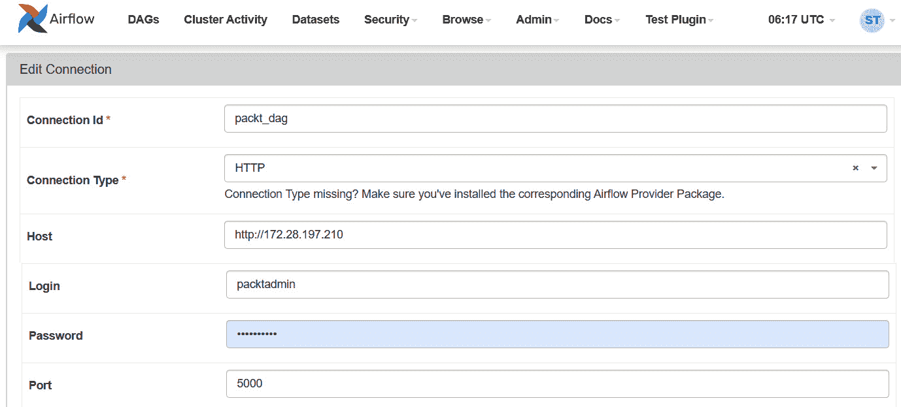

            <st c="62503">图 8.12 – 创建 HTTP 连接对象</st>

            <st c="62551">此外，一个</st> `<st c="62560">SimpleHTTPOperator</st>` <st c="62578">操作符提供了一个由其</st> `<st c="62632">response_check</st>` <st c="62646">参数指示的回调方法。</st> <st c="62658">回调方法访问响应和其他相关数据，可以对 API 响应进行评估和记录。</st> <st c="62738">以下是对</st> `<st c="62845">Task1</st>`<st c="62850">的回调方法的实现：</st>

```py
<st c="62852">def handle_response(response, **context):</st> if response.status_code == 201:
        print("executed API successfully...")
        return True
    else:
        print("executed with errors...")
        return False
```

            <st c="63027">On the other hand,</st> `<st c="63047">Task2</st>` <st c="63052">is a</st> `<st c="63058">PythonOperator</st>` <st c="63072">operator that runs a Python function,</st> `<st c="63111">count_login()</st>`<st c="63124">, for retrieving the JSON data from the API executed in</st> `<st c="63180">Task1</st>` <st c="63185">and counting the number of records from the JSON resource.</st> <st c="63245">Setting its</st> `<st c="63257">provide_context</st>` <st c="63272">parameter to</st> `<st c="63286">True</st>` <st c="63290">allows its</st> `<st c="63302">python_callable</st>` <st c="63317">method to access the</st> `<st c="63339">taskInstance</st>` <st c="63351">object that pulls the API resource from</st> `<st c="63392">Task1</st>`<st c="63397">. The</st> `<st c="63403">count_login()</st>` <st c="63416">function can also set an</st> `<st c="63442">xcom</st>` <st c="63446">variable, a form of workflow data, because the value of</st> `<st c="63503">Task2</st>`<st c="63508">’s</st> `<st c="63512">do_xcom_push</st>` <st c="63524">parameter is</st> `<st c="63538">True</st>`<st c="63542">. The following snippet is the implementation</st> <st c="63588">of</st> `<st c="63591">count_login()</st>`<st c="63604">:</st>

```py
 def count_login(<st c="63623">ti, **context</st>): <st c="63641">data = ti.xcom_pull(task_ids=['list_all_login'])</st> if not len(data):
        raise ValueError('Data is empty') <st c="63742">records_dict = json.loads(data[0])</st> count = len(records_dict["records"]) <st c="63814">ti.xcom_push(key="records", value=count)</st> return count
    task3 = <st c="63876">SimpleHttpOperator</st>( <st c="63897">task_id='report_count',</st><st c="63920">method="GET",</st><st c="63934">http_conn_id="packt_dag",</st><st c="63960">endpoint="/ch08/login/report/count",</st> data={"login_count": "{{ <st c="64023">task_instance.xcom_pull( task_ids=['list_all_login','count_login'], key='records')[0]</st> }}"},
        headers={"Content-Type": "application/json"},
        dag=dag
    )
    … … … … … … <st c="64215">Task3</st> is also a <st c="64232">SimpleHTTPOperator</st> operator, but its goal is to call an HTTP <st c="64293">GET</st> API and pass a request parameter, <st c="64331">login_count</st>, with a value derived from XCom data. Operators can access Airflow built-in objects, such as <st c="64436">dag_run</st> and <st c="64448">task_instance</st>, using the <st c="64473">{{ }}</st> Jinja2 delimiter. In <st c="64500">Task3</st>, <st c="64507">task_instance</st>, using its <st c="64532">xcom_pull()</st> function, retrieves from the list of tasks the XCom variable records. The result of <st c="64628">xcom_pull()</st> is always a list with the value of the XCom variable at its *<st c="64700">0 index</st>*.
			<st c="64708">The last portion of the DAG file is where to place the sequence flow of the DAG’s task.</st> <st c="64797">There are two ways to establish dependency from one task to another.</st> `<st c="64866">>></st>`<st c="64868">, or the</st> *<st c="64877">upstream dependency</st>*<st c="64896">, connects a flow from left to right, which means the execution of the task from the right depends on the success of the left task.</st> <st c="65028">The other one,</st> `<st c="65043"><<</st>` <st c="65045">or the</st> *<st c="65053">downstream dependency</st>*<st c="65074">, follows the</st> <st c="65087">reverse flow.</st> <st c="65102">If two or more tasks depend on the same task, brackets enclose those dependent tasks, such as the</st> `<st c="65200">task1 >> [task2, task3]</st>` <st c="65223">flow, where</st> `<st c="65236">task2</st>` <st c="65241">and</st> `<st c="65246">task3</st>` <st c="65251">are dependent tasks of</st> `<st c="65275">task1</st>`<st c="65280">. In the given DAG file, it is just a sequential flow from</st> `<st c="65339">task1</st>` <st c="65344">to</st> `<st c="65348">task4</st>`<st c="65353">.</st>
			<st c="65354">What executes our tasks are called</st> *<st c="65390">executors</st>*<st c="65399">. The</st> <st c="65405">default executor is</st> `<st c="65425">SequentialExecutor</st>`<st c="65443">, which runs the task flows one task at a time.</st> `<st c="65491">LocalExecutor</st>` <st c="65504">runs the workflow sequentially, but the tasks may run in parallel mode.</st> <st c="65577">There is</st> `<st c="65586">CeleryExecutor</st>`<st c="65600">, which runs workflows composed of Celery tasks, and</st> `<st c="65653">KubernetesExecutor</st>`<st c="65671">, which runs tasks on</st> <st c="65693">a cluster.</st>
			<st c="65703">To deploy and re-deploy the DAG files,</st> *<st c="65743">restart</st>* <st c="65750">the scheduler and the web server.</st> <st c="65785">Let us now implement an API endpoint function that will run the DAG deployed in the</st> <st c="65869">Airflow server.</st>
			<st c="65884">Utilizing Airflow built-in REST endpoints</st>
			<st c="65926">To trigger the DAG is to run the workflow.</st> <st c="65970">Running</st> <st c="65978">a DAG requires using the Airflow UI’s DAG page, applying Airflow APIs for console-based triggers, or consuming Airflow’s built-in REST API with the Flask application or Postman.</st> <st c="66156">This chapter implemented the</st> `<st c="66185">ch08-airflow</st>` <st c="66197">project to provide the</st> `<st c="66221">report_login_count</st>` <st c="66239">DAG with API endpoints for</st> `<st c="66267">Task1</st>` <st c="66272">and</st> `<st c="66277">Task3</st>` <st c="66282">executions and also to trigger the workflow using some Airflow REST endpoints.</st> <st c="66362">The following is a custom endpoint function that triggers the</st> `<st c="66424">report_login_count</st>` <st c="66442">DAG with a</st> `<st c="66454">dag_run_id</st>` <st c="66464">value of a</st> <st c="66476">UUID type:</st>

```

<st c="66486">@login_bp.get("/login/dag/report/login/count")</st> async def trigger_report_login_count(): <st c="66574">token = "cGFja3RhZG1pbjpwYWNrdGFkbWlu"</st> dag_id = "report_login_count"

    deployment_url = "localhost:8080"

    response = <st c="66688">requests.post(</st><st c="66702">url=f"http://{deployment_url}</st> <st c="66732">/api/v1/dags/{dag_id}/dagRuns",</st> headers={ <st c="66775">"Authorization": f"Basic {token}",</st> "Content-Type": "application/json",

            "Accept": "*/*",

            "Connection": "keep-alive",

            "Accept-Encoding": "gzip, deflate, br"

        }, <st c="66933">data = '{"dag_run_id": "d08a62c6-ed71-49fc-81a4-47991221aea5"}'</st> )

    result = response.content.decode(encoding="utf-8")

    return jsonify(message=result), 201

```py

			<st c="67085">Airflow requires</st> *<st c="67103">Basic authentication</st>* <st c="67123">before consuming its REST endpoints.</st> <st c="67161">Any REST access must include an</st> `<st c="67193">Authorization</st>` <st c="67206">header with</st> <st c="67219">the generated token of a valid username and password.</st> <st c="67273">Also, install a REST client module, such as</st> `<st c="67317">requests</st>`<st c="67325">, to consume the API libraries.</st> <st c="67357">Running</st> `<st c="67365">/api/v1/dags/report_login_count/dagRuns</st>` <st c="67404">with an HTTP</st> `<st c="67418">POST</st>` <st c="67422">request will give us a JSON response</st> <st c="67460">like this:</st>

```

{

    "conf": {}, <st c="67485">"dag_id": "report_login_count",</st><st c="67516">"dag_run_id": "01c04a4b-a3d9-4dc5-b0c3-e4e59e2db554",</st> "data_interval_end": "2023-12-27T12:00:00+00:00",

    "data_interval_start": "2023-12-26T12:00:00+00:00",

    "end_date": null,

    "execution_date": "2023-12-27T13:55:44.910773+00:00",

    "external_trigger": true,

    "last_scheduling_decision": null,

    "logical_date": "2023-12-27T13:55:44.910773+00:00",

    "note": null, <st c="67871">"run_type": "manual",</st> "start_date": null,

    "state": "queued"

}

```py

			<st c="67932">Then, running the following</st> <st c="67961">Airflow REST endpoint using the same</st> `<st c="67998">dag_run_id</st>` <st c="68008">value will provide us with the result of</st> <st c="68050">the workflow:</st>

```

@login_bp.get("/login/dag/xcom/values")

async def extract_xcom_count():

    try:

        token = "cGFja3RhZG1pbjpwYWNrdGFkbWlu"

        dag_id = "report_login_count"

        task_id = "return_report" <st c="68236">dag_run_id = "d08a62c6-ed71-49fc-81a4-47991221aea5"</st> deployment_url = "localhost:8080"

        response = <st c="68333">requests.get(</st><st c="68346">url=f"http://{deployment_url}</st> <st c="68376">/api/v1/dags/{dag_id}/dagRuns</st> <st c="68406">/{dag_run_id}/taskInstances/{task_id}</st> <st c="68444">/xcomEntries/{'report_msg'}",</st> headers={ <st c="68485">"Authorization": f"Basic {token}",</st> … … … … … …

            }

        )

        result = response.json()

        message = result['value']

        返回 jsonify(message=message)

    except Exception as e:

        打印(e)

    返回 jsonify(message="")

```py

			<st c="68676">The given HTTP</st> `<st c="68692">GET</st>` <st c="68695">request API</st> <st c="68707">will provide us a JSON result</st> <st c="68738">like so:</st>

```

{

    "message": "截至 2023-12-28 00:38:17.592287，有 20 个用户。"}

```py

			<st c="68816">Airflow is a big platform that can offer us many solutions, especially in building pipelines of tasks for data transformation, batch processing, and data analytics.</st> <st c="68981">Its strength is also in implementing API orchestration for microservices.</st> <st c="69055">But for complex, long-running, and distributed workflow transactions, it is Temporal.io that can provide durable, reliable, and</st> <st c="69183">scalable solutions.</st>
			<st c="69202">Implementing workflows using Temporal.io</st>
			<st c="69243">The</st> **<st c="69248">Temporal.io</st>** <st c="69259">server manages loosely coupled workflows and activities, those not limited by the architecture of the Temporal.io platform.</st> <st c="69384">Thus, all workflow components are coded from the ground up</st> <st c="69443">without hooks and callable methods appearing in the implementation.</st> <st c="69511">The server expects the execution of activities rather than tasks.</st> <st c="69577">In BPMN, an activity is more complex than a task.</st> <st c="69627">The server is responsible for building a fault-tolerant workflow because it can recover failed activity execution by restarting its execution from</st> <st c="69774">the start.</st>
			<st c="69784">So, let us begin this topic with the Temporal.io</st> <st c="69834">server setup.</st>
			<st c="69847">Setting up the environment</st>
			<st c="69874">The Temporal.io server has an installer for</st> *<st c="69919">macOS</st>*<st c="69924">,</st> *<st c="69926">Windows</st>*<st c="69933">, and</st> *<st c="69939">Linux</st>* <st c="69944">platforms.</st> <st c="69956">For Windows users, download the ZIP file from the</st> [<st c="70006">https://temporal.download/cli/archive/latest?platform=windows&arch=amd64</st>](https://temporal.download/cli/archive/latest?platform=windows&arch=amd64) <st c="70078">link.</st> <st c="70085">Then, unzip the file to the local</st> <st c="70119">machine.</st> <st c="70128">Start the server using the</st> `<st c="70155">temporal server</st>` `<st c="70171">start-dev</st>` <st c="70180">command.</st>
			<st c="70189">Now, to integrate our Flask application with the server, install the</st> `<st c="70259">temporalio</st>` <st c="70269">module to the virtual environment using the</st> `<st c="70314">pip</st>` <st c="70317">command.</st> <st c="70327">Establish a server connection in the</st> `<st c="70364">main.py</st>` <st c="70371">module of the application using the</st> `<st c="70408">Client</st>` <st c="70414">class of the</st> `<st c="70428">temporalio</st>` <st c="70438">module.</st> <st c="70447">The following</st> `<st c="70461">main.py</st>` <st c="70468">script shows how to instantiate a</st> `<st c="70503">Client</st>` <st c="70509">instance:</st>

```

从 temporalio.client 导入 Client

从 modules 导入 create_app

导入 asyncio

app, celery_app= create_app("../config_dev.toml") <st c="70653">async def connect_temporal(app):</st><st c="70685">client = await Client.connect("localhost:7233")</st><st c="70733">app.temporal_client = client</st> 如果 __name__ == "__main__": <st c="70790">asyncio.run(connect_temporal(app))</st> app.run(debug=True)

```py

			<st c="70844">The</st> `<st c="70849">connect_temporal()</st>` <st c="70867">method instantiates the Client API class and creates a</st> `<st c="70923">temporal_client</st>` <st c="70938">environment variable in the Flask platform for the API endpoints to run the workflow.</st> <st c="71025">Since</st> `<st c="71031">main.py</st>` <st c="71038">is the entry point module, an event loop will execute the method during the Flask</st> <st c="71121">server startup.</st>
			<st c="71136">After setting up the Temporal.io server and its connection to the Flask application, let us discuss the distinct approach to</st> <st c="71261">workflow implementation.</st>
			<st c="71286">Implementing activities and a workflow</st>
			<st c="71325">Temporal uses the code-first approach of implementing a workflow and its activities.</st> <st c="71411">Activities in a Temporal platform must be</st> *<st c="71453">idempotent</st>*<st c="71463">, meaning its parameters and results are non-changing through the</st> <st c="71529">course or history of its executions.</st> <st c="71566">The following is an example of a complex but</st> <st c="71611">idempotent activity:</st>

```

<st c="71631">从 temporalio 导入 activity</st>

<st c="71663">@activity.defn</st> 异步 def reserve_schedule(appointmentwf: AppointmentWf) -> str:

    try:

        异步使用 db_session() 作为 sess:

            异步使用 sess.begin(): <st c="71807">repo = AppointmentRepository(sess)</st> … … … … … … … <st c="71855">result = await repo.insert_appt(appt)</st> 如果 result == False:

                    … … … … … … <st c="71925">return "failure"</st> … … … … … … <st c="71953">return "success"</st> except Exception as e:

        打印(e)

        … … … … … … <st c="72084">@activity.defn</st> 注解，使用工作流程数据类作为局部参数，并返回一个不变化的值。返回的值可以是固定字符串、数字或任何长度不变的字符串。避免返回具有可变属性值的集合或模型对象。我们的 <st c="72379">reserve_schedule()</st> 活动接受一个包含预约详情的 <st c="72418">AppointmentWf</st> 对象，并将信息记录保存到数据库中。它只返回 <st c="72548">"successful"</st> 或 <st c="72564">"failure"</st>。

            <st c="72574">活动是 Temporal 允许访问外部服务，如数据库、电子邮件或 API 的地方，而不是在工作流程实现中。</st> <st c="72690">以下代码是一个</st> *<st c="72750">Temporal 工作流程</st>* <st c="72768">，它运行 <st c="72782">reserve_schedule()</st> <st c="72800">活动：</st>

```py
<st c="72810">@workflow.defn(sandboxed=False)</st> class ReserveAppointmentWorkflow():
    def __init__(self) -> None: <st c="73046">@workflow.defn</st> decorator implements a workflow. An example is our <st c="73112">ReserveAppointmentWorkflow</st> class.
			<st c="73145">It maintains the same execution state starting from the beginning, making it a deterministic workflow.</st> <st c="73249">It also manages all its states through replays to determine some exceptions and provide recovery after a</st> <st c="73354">non-deterministic state.</st>
			<st c="73378">Moreover, Temporal workflows are designed to run continuously without time limits but with proper scheduling to handle long-running and complex activities.</st> <st c="73535">However, using threads for concurrency is not allowed in Temporal workflows.</st> <st c="73612">It must have an instance method decorated by</st> `<st c="73657">@workflow.run</st>` <st c="73670">to create a continuous loop for its activities.</st> <st c="73719">The following</st> `<st c="73733">run()</st>` <st c="73738">method accepts a request model with appointment details from the user and loops until the cancellation of the appointment, where</st> `<st c="73868">appointmentwf.status</st>` <st c="73888">becomes</st> `<st c="73897">False</st>`<st c="73902">:</st>

```

<st c="73904">@workflow.run</st> 异步 def run(self, data: ReqAppointment) -> None:

        持续时间 = 12

        self.appointmentwf.ticketid = data.ticketid

        self.appointmentwf.patientid = data.patientid

        … … … … … … `<st c="74085">while self.appointmentwf.status:</st>` self.appointmentwf.remarks = "Doctor reservation being processed...." `<st c="74188">try:</st>` `<st c="74192">await workflow.execute_activity(</st>` `<st c="74225">reserve_schedule,</st>` `<st c="74243">self.appointmentwf,</st>` `<st c="74263">start_to_close_timeout=timedelta(</st>` `<st c="74297">seconds=10),</st>` `<st c="74313">await asyncio.sleep(duration)</st>` `<st c="74342">except asyncio.CancelledError as err:</st>` self.appointmentwf.status = False

                self.appointmentwf.remarks = "Appointment with doctor done." `<st c="74739">ReserveAppointmentWorkflow</st>` 实例，当取消时，将抛出 `<st c="74804">CancelledError</st>` 异常，这将触发设置 `<st c="74878">appointmentwf.status</st>` 为 `<st c="74902">False</st>` 并执行 `<st c="74925">start_to_close()</st>` 活动的异常处理子句。

            `<st c="74951">除了循环和构造函数之外，工作流程实现可以发出</st>` `<st c="74979">constructor, a workflow implementation can emit</st>` `<st c="75028">resultset</st>` `<st c="75037">instances or information about the workflow.</st>` `<st c="75083">为了执行此操作，实现一个实例方法并用</st>` `<st c="75152">@workflow.query</st>` `<st c="75167">.以下方法返回一个</st>` `<st c="75201">appointment record:</st>`

```py
 <st c="75220">@workflow.query</st> def details(self) -> AppointmentWf:
        return self.appointmentwf
```

            `<st c="75298">与 Zeebe/Camunda 不同，在那里服务器执行并管理工作流程，Temporal.io 服务器不运行任何工作流程实例，而是工作线程。</st>` `<st c="75450">我们将在下一节中了解更多关于工作线程的信息。</st>`

            `<st c="75503">构建工作线程</st>`

            `<st c="75521">A</st>` `<st c="75579">Worker</st>` `<st c="75585">class from the</st>` `<st c="75601">temporalio.worker</st>` `<st c="75618">module requires the</st>` `<st c="75639">client</st>` `<st c="75645">connection,</st>` `<st c="75658">task_queue</st>` `<st c="75668">,</st>` `<st c="75670">workflows</st>` `<st c="75679">, and</st>` `<st c="75685">activities</st>` `<st c="75695">as constructor</st>` `<st c="75711">parameters before its instantiation.</st>` `<st c="75748">我们的工作线程应该位于</st>` `<st c="75781">Flask 的上下文之外，因此我们在参数中添加了</st>` `<st c="75815">workflow_runner</st>` `<st c="75830">参数。</st>` `<st c="75860">以下代码是我们对</st>` `<st c="75908">Temporal 工作线程的实现：</st>`

```py
<st c="75924">from temporalio.client import Client</st>
<st c="75961">from temporalio.worker import Worker,</st> <st c="75999">UnsandboxedWorkflowRunner</st> import asyncio
from modules.admin.activities.workflow import reserve_schedule, close_schedule
from modules.models.workflow import appt_queue_id
from modules.workflows.transactions import ReserveAppointmentWorkflow
async def main(): <st c="76258">client = await Client.connect("localhost:7233")</st> worker = <st c="76315">Worker(</st><st c="76322">client,</st><st c="76330">task_queue=appt_queue_id,</st><st c="76356">workflows=[ReserveAppointmentWorkflow],</st><st c="76396">activities=[reserve_schedule, close_schedule],</st><st c="76443">workflow_runner=UnsandboxedWorkflowRunner,</st> ) <st c="76489">await worker.run()</st> if __name__ == "__main__":
    print("Temporal worker started…") <st c="76679">Worker</st> instance needs to know what workflows to queue and activities to run before the client application triggers their executions. Now, passing the <st c="76829">UnsandboxedWorkflowRunner</st> object to the <st c="76869">workflow_runner</st> parameter indicates that our worker will be running as an independent Python application outside the context of our Flask platform or any sandbox environment, thus the setting of the <st c="77068">sandboxed</st> parameter in the <st c="77095">@workflow.defn</st> decorator of every workflow class to <st c="77147">False</st>. To run the worker, call and await the <st c="77192">run()</st> method of the <st c="77212">Worker</st> instance.
			<st c="77228">Lastly, after implementing the</st> <st c="77259">workflows, activities, and the worker, it is time to trigger the workflow</st> <st c="77334">for execution.</st>
			<st c="77348">Running activities</st>
			<st c="77367">The</st> `<st c="77372">ch08-temporal</st>` <st c="77385">project is a</st> <st c="77398">RESTful application in Flask, so to run a workflow, an API endpoint must import and use</st> `<st c="77487">app.temporal_client</st>` <st c="77506">to connect to the server and to invoke the</st> `<st c="77550">start_workflow()</st>` <st c="77566">method that will trigger the</st> <st c="77596">workflow execution.</st>
			<st c="77615">The</st> `<st c="77620">start_workflow()</st>` <st c="77636">method requires the workflow’s “</st>*<st c="77669">run</st>*<st c="77673">” method, the single model object parameter, the unique workflow ID, and</st> `<st c="77747">task_queue</st>`<st c="77757">. The following API endpoint triggers the execution of our</st> `<st c="77816">ReserveAppointmentWorkflow</st>` <st c="77842">class:</st>

```

`<st c="77849">@admin_bp.route("/appointment/doctor", methods=["POST"])</st>` async def request_appointment(): `<st c="77940">client = get_client()</st>` appt_json = request.get_json()

    appointment = ReqAppointment(**appt_json) `<st c="78035">await client.start_workflow(</st>` `<st c="78063">ReserveAppointmentWorkflow.run,</st>` `<st c="78095">appointment,</st>` `<st c="78108">id=appointment.ticketid,</st>` `<st c="78133">task_queue=appt_queue_id,</st>` )

    message = jsonify({"message": "Appointment for doctor requested...."})

    response = make_response(message, 201)

    return response

```py

			<st c="78287">After a successful workflow trigger, another API can query the details or results of the workflow by extracting the workflow’s</st> `<st c="78415">WorkflowHandler</st>` <st c="78430">class from the client using its</st> *<st c="78463">workflow ID</st>*<st c="78474">. The following endpoint function shows how to retrieve the result of the</st> <st c="78548">completed workflow:</st>

```

<st c="78567">@admin_bp.route("/appointment/details", methods=["GET"])</st> async def get_appointment_details():

    client = get_client()

    ticketid = request.args.get("ticketid")

    print(ticketid)

    handle = <st c="78749">client.get_workflow_handle_for(ReserveAppointmentWorkflow.run, ticketid)</st><st c="78822">results = await handle.query(</st> <st c="78852">ReserveAppointmentWorkflow.details)</st> message = jsonify({

            "ticketid": results.ticketid,

            "patientid": results.patientid,

            "docid": results.docid,

            "date_scheduled": results.date_scheduled,

            "time_scheduled": results.time_scheduled,

        }

    )

    response = make_response(message, 200)

    return response

```py

			<st c="79137">To prove that Temporal workflows</st> <st c="79170">can respond to cancellation events, the following API invokes the</st> `<st c="79237">cancel()</st>` <st c="79245">method from the</st> `<st c="79262">WorkflowHandler</st>` <st c="79277">class for its workflow to throw a</st> `<st c="79312">CancelledError</st>` <st c="79326">exception, leading to the execution of the</st> `<st c="79370">close_schedule()</st>` <st c="79386">activity:</st>

```

<st c="79396">@admin_bp.route("/appointment/close", methods=["DELETE"])</st> async def end_subscription():

    client = get_client()

    ticketid = request.args.get("ticketid")

    response = make_response(message, 202)

    return response

```py

			<st c="79728">Although there is still a lot to discuss about the architecture and the behavior of these big-time workflow</st> <st c="79836">solutions, the main goal is to highlight the feasibility of integrating different workflow engines into the asynchronous Flask platform and take into consideration workarounds for integrations to work with</st> <st c="80043">Flask applications.</st>
			<st c="80062">Summary</st>
			<st c="80070">This chapter proved that</st> `<st c="80096">Flask[async]</st>` <st c="80108">can work with different workflow engines, starting with Celery tasks.</st> `<st c="80179">Flask[async]</st>`<st c="80191">, combined with the workflows created by Celery’s signatures and primitives, works well in building chained, grouped, and</st> <st c="80313">chorded processes.</st>
			<st c="80331">Then,</st> `<st c="80338">Flask[async]</st>` <st c="80350">was proven to work with SpiffWorkflow for some BPMN serialization that focuses on</st> `<st c="80433">UserTask</st>` <st c="80441">and</st> `<st c="80446">ScriptTask</st>` <st c="80456">tasks.</st> <st c="80464">Also, this chapter even considered solving BPMN enterprise problems using the Zeebe/Camunda platform that showcases</st> `<st c="80580">ServiceTask</st>` <st c="80591">tasks.</st>
			<st c="80598">Moreover,</st> `<st c="80609">Flask[async]</st>` <st c="80621">created an environment with Airflow 2.x to implement pipelines of tasks building an API orchestration.</st> <st c="80725">In the last part, the chapter established the integration between</st> `<st c="80791">Flask[async]</st>` <st c="80803">and Temporal.io and demonstrated the implementation of deterministic and</st> <st c="80877">distributed workflows.</st>
			<st c="80899">This chapter provided a clear picture of the extensibility, usability, and scalability of the Flask framework in building scientific and big data applications and even BPMN-related and ETL-involved</st> <st c="81098">business processes.</st>
			<st c="81117">The next chapter will discuss the different authentication and authorization mechanisms to secure</st> <st c="81216">Flask applications.</st>

```

```py

```

```py

```

```py

```

```py

```

```py

```

```py

```

```py

```

```py

```

```py

```

```py

```
