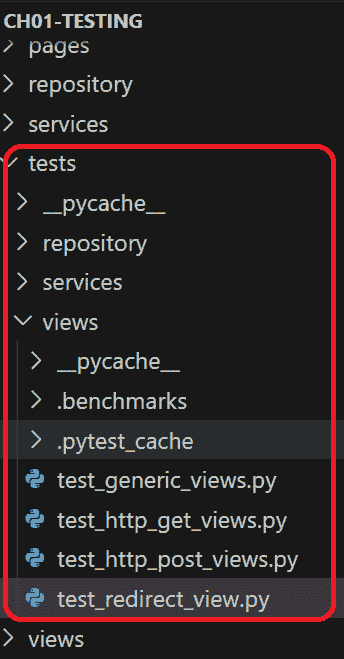
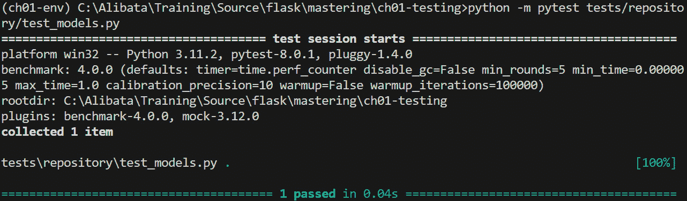
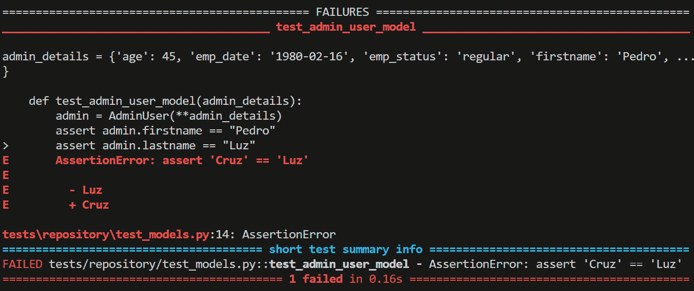
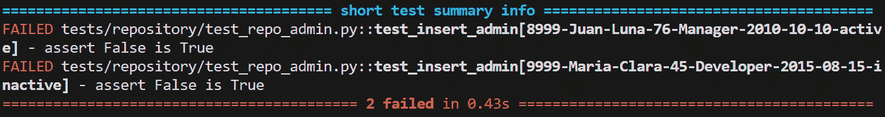

# 第十一章：<st c="0">10

# <st c="3">为 Flask 创建测试用例

在构建 Flask 组件之后，创建测试用例以确保它们的正确性并修复它们的错误是至关重要的。<st c="33">在测试类型中，</st> **<st c="190">单元测试</st>** <st c="202">专注于测试组件在独立于其他模块或任务时的有效性和性能。</st> <st c="309">另一方面，</st> **<st c="328">集成测试</st>** <st c="347">确保 Flask</st> <st c="382">组件的功能性和可靠性在所有依赖项一起</st> <st c="460">运行时</st>的正确性。

为了实现这些测试用例，Python 有一个内置的模块叫做<st c="539">unittest</st>，它可以提供一个<st c="567">TestCase</st> <st c="575">超类</st>以及<st c="595">setUp()</st> <st c="602">和</st> <st c="607">tearDown()</st> <st c="617">方法，这些方法可以构建测试用例和测试套件的变体。<st c="679">还有一个名为</st> <st c="721">pytest</st><st c="727">的第三方模块，它简单易用，非模板化，并且可以提供用于设置测试环境的可重用固定值。<st c="848">在本章中，我们将重点介绍如何使用</st> <st c="917">pytest</st> <st c="923">为从第</st> *<st c="979">1</st> <st c="989">章</st> 到第</st> *<st c="993">9</st> <st c="994">章</st> 的项目中选定的功能实现测试用例。</st>

<st c="995">本章的主要目标是提供 Flask 项目所需的测试环境，在其中我们可以运行、研究、审查、分析和改进 Flask 组件，而无需部署应用程序。</st> <st c="1206">本章的另一个目标是培养测试（至少是单元测试）是任何企业级</st> <st c="1340">应用程序开发</st>的必要部分的思维方式。

<st c="1364">以下是本章涵盖的主题：</st> <st c="1396">：</st>

+   <st c="1409">为 Web 视图、存储库类和</st> <st c="1469">本地服务</st>创建测试用例

+   为<st c="1484">应用工厂</st>中的组件和<st c="1543">蓝图</st>创建测试用例

+   为<st c="1557">异步组件</st>创建测试用例

+   <st c="1605">为受保护 API 和</st> <st c="1646">Web 组件</st>创建测试用例

+   <st c="1660">为</st> <st c="1685">MongoDB 事务</st>创建测试用例

+   <st c="1705">为</st> <st c="1726">WebSocket</st>创建测试用例

# <st c="1740">技术要求

<st c="1763">所有测试用例都将来自从</st> *<st c="1828">第一章</st>* <st c="1838">到</st> *<st c="1842">第九章</st>* <st c="1843">创建的不同应用程序。</st> <st c="1843">所有这些应用程序都在这个 GitHub</st> <st c="1887">仓库中：</st> [<st c="1899">https://github.com/PacktPublishing/Mastering-Flask-Web-Development</st>](https://github.com/PacktPublishing/Mastering-Flask-Web-Development)<st c="1965">。</st>

# <st c="1966">为 Web 视图、存储库类和本地服务创建测试用例</st>

<st c="2041">`pytest`</st> `<st c="2046">模块</st>` <st c="2052">支持单元</st> `<st c="2074">和集成或功能测试。</st> <st c="2113">它需要简单的语法来构建测试用例，这使得它非常容易使用，并且它有一个</st> `<st c="2205">平台</st>` <st c="2205">可以自动运行所有测试文件。</st> <st c="2258">此外，</st> `<st c="2268">pytest</st>` <st c="2274">是一个免费和开源模块，因此使用以下</st> `<st c="2343">pip</st>` <st c="2346">命令安装：</st>

```py
 pip install pytest
```

<st c="2374">然而，</st> `<st c="2384">pytest</st>` <st c="2390">只能与由 Blueprints 和</st> *<st c="2478">应用程序工厂</st>* <st c="2499">管理的目录结构</st> <st c="2505">的 Flask 项目一起工作。</st> <st c="2539">我们的</st> *<st c="2505">在线个人咨询服务</st>* <st c="2539">在</st> *<st c="2543">第一章</st>* <st c="2552">不遵循 Flask 的目录结构标准。</st> <st c="2613">所有视图模块都通过</st> `<st c="2641">app</st>` <st c="2644">实例通过</st> `<st c="2662">__main__</st>`<st c="2670">导入，这在测试期间成为</st> `<st c="2690">pytest</st>` <st c="2696">模块而不是</st> `<st c="2716">main.py</st>` <st c="2723">模块。</st> <st c="2747">因此，测试我们的</st> `<st c="2765">ch01</st>` <st c="2769">项目给我们以下运行时</st> `<st c="2809">错误信息</st>`:</br>

```py
 ImportError cannot import name 'app' from '__main__'
```

<st c="2876">错误意味着在</st> `<st c="2905">app</st>` <st c="2908">对象中</st> `<st c="2933">pytest</st>` <st c="2939">模块</st> <st c="2948">中没有可导入的内容。</st> <st c="2948">因此，一个可测试的新版本</st> *<st c="2986">在线个人咨询服务</st>* <st c="3020">位于</st> `<st c="3031">ch01-testing</st>` <st c="3043">项目中，该项目将所有视图函数放在 Python 函数中，这些函数是</st> `<st c="3122">main.py</st>` <st c="3129">模块将访问以传递</st> `<st c="3161">app</st>` <st c="3164">实例。</st> <st c="3175">以下</st> `<st c="3189">main.py</st>` <st c="3196">代码片段显示了这些函数调用替换了视图的</st> `<st c="3253">import 语句</st>`:</br>

```py
 app = Flask(__name__, template_folder='pages')
… … … … … …
create_index_routes(app)
create_signup_routes(app)
create_examination_routes(app)
create_reports_routes(app)
create_admin_routes(app)
create_login_routes(app)
create_profile_routes(app)
create_certificates_routes(app)
```

<st c="3548">每个函数中封装的视图函数将</st> <st c="3598">使用</st> `<st c="3611">app</st>` <st c="3614">实例来实现</st> `<st c="3641">GET</st>` <st c="3644">和</st> `<st c="3649">POST</st>` <st c="3653">路由。</st> <st c="3662">此外，为了</st> <st c="3674">提供一个由 Flask 提供的测试环境，在配置文件中将</st> `<st c="3725">Testing</st>` <st c="3732">环境设置为</st> `<st c="3748">true</st>` <st c="3752">。</st>

<st c="3779">现在，在结构准确且无循环导入的 Flask 项目主文件夹中，紧邻</st> `<st c="3916">main.py</st>`<st c="3923">的位置创建一个</st> `<st c="3794">tests</st>` <st c="3799">文件夹。在这个文件夹中，使用以</st> `<st c="4015">test_</st>` <st c="4020">关键字为前缀的模块文件实现测试用例。</st> <st c="4030">如果测试用例的数量增加，可以通过功能（例如，视图、存储库、服务、API 等）或测试类型（例如，单元、集成）进一步组织这些文件到子文件夹中。</st> *<st c="4234">图 10</st>**<st c="4243">.1</st>* <st c="4245">显示了包含</st> `<st c="4289">ch01-testing</st>` <st c="4301">项目的最终目录结构，其中包含</st> `<st c="4319">tests</st>` <st c="4324">文件夹。</st>



<st c="4557">图 10.1 – 测试文件夹</st>

<st c="4587">现在，以模块（</st>`<st c="4629">python -m pytest</st>`<st c="4646">）的形式运行</st> `<st c="4601">pytest</st>` <st c="4607">命令来执行所有测试方法，并使用以下命令运行每个</st> <st c="4694">测试文件：</st>

```py
 python -m pytest tests/xxxx/test_xxxxxx.py
```

<st c="4778">或者，使用以下命令运行单个测试函数：</st>

```py
 python -m pytest tests/xxxx/test_xxxxxx.py::test_xxxxxxx
```

<st c="4900">现在，让我们通过为</st> `<st c="4954">ch01-testing</st>`<st c="4966">的模型类、存储库事务、本地服务和</st> <st c="5031">视图函数创建测试用例来探索</st> `<st c="4920">pytest</st>` <st c="4926">。</st>

## <st c="5046">测试模型类</st>

<st c="5072">展示单元测试的其中一个测试文件是</st> `<st c="5126">test_models.py</st>`<st c="5140">，它包含以下实现：</st>

```py
 import pytest
from model.candidates import AdminUser <st c="5240">@pytest.fixture(scope='module', autouse=True)</st> def admin_details(<st c="5304">scope="module"</st>):
    data = {"id": 101, "position": "Supervisor","age": 45, "emp_date": "1980-02-16", "emp_status": "regular", "username": "pedro", "password": "pedro", "utype": 0, "firstname": "Pedro", "lastname" :"Cruz"}
    yield data
    data = None
def <st c="5552">test_admin_user_model</st>(<st c="5575">admin_details</st>):
    admin = AdminUser(**admin_details) <st c="5726">unittest</st>, test cases in <st c="5750">pytest</st> are in the form of *<st c="5776">test functions</st>*. The test function’s name is unique, descriptive of its purpose, and must start with the <st c="5880">_test</st> keyword like its test file. Its code structure follows the <st c="6171">test_models.py</st>, the *<st c="6191">Given</st>* part is the creating of <st c="6221">admin_details</st> fixture, the *<st c="6248">When</st>* is the instantiation of the <st c="6281">AdminUser</st> class, and the *<st c="6306">Then</st>* depicts the series of asserts that validates if the extracted <st c="6373">firstname</st>, <st c="6384">lastname</st>, and <st c="6398">age</st> response details are precisely the same as the inputs. Unlike the <st c="6468">unittest</st>, <st c="6478">pytest</st> only uses the <st c="6499">assert</st> statement and the needed conditional expression to perform assertion.
			<st c="6575">The input to the</st> `<st c="6593">test_admin_user_model()</st>` <st c="6616">test case is an injectable and reusable admin record created through</st> `<st c="6686">pytest</st>`<st c="6692">’s</st> `<st c="6696">fixture()</st>`<st c="6705">. The</st> `<st c="6711">pytest</st>` <st c="6717">module has a decorator function called</st> `<st c="6757">fixture()</st>` <st c="6766">that defines functions as injectable resources.</st> <st c="6815">Like in</st> `<st c="6823">unittest</st>`<st c="6831">,</st> `<st c="6833">pytest</st>`<st c="6839">’s fixture performs</st> `<st c="6860">setUp()</st>` <st c="6867">before the call to</st> `<st c="6887">yield</st>` <st c="6892">and</st> `<st c="6897">tearDown()</st>` <st c="6907">after the yielding of the resource.</st> <st c="6944">In the given</st> `<st c="6957">test_models.py</st>`<st c="6971">, the fixture sets up the</st> <st c="6997">admin details in JSON format, and garbage collects the JSON object data after the</st> `<st c="7079">yield</st>` <st c="7084">statement.</st> <st c="7096">But how do test methods utilize</st> <st c="7128">these fixtures?</st>
			<st c="7143">A fixture function has</st> <st c="7167">four scopes:</st>

				*   `<st c="7179">function</st>`<st c="7188">: This fixture runs</st> <st c="7208">only once exclusively on some selected test methods in a</st> <st c="7266">test file.</st>
				*   `<st c="7276">class</st>`<st c="7282">: This fixture runs only once on a test class containing test methods that require</st> <st c="7366">the resource.</st>
				*   `<st c="7379">module</st>`<st c="7386">: This fixture runs only once on a test file containing the test methods that require</st> <st c="7473">the resource.</st>
				*   `<st c="7486">package</st>`<st c="7494">: This fixture runs only once on a package level containing the test methods that require</st> <st c="7585">the resource.</st>
				*   `<st c="7598">session</st>`<st c="7606">: This fixture runs only once to be distributed across all test methods that require the resource in</st> <st c="7708">a session.</st>

			<st c="7718">To utilize the fixture during its scoped execution, inject the resource function to test the method’s parameter list.</st> <st c="7837">Our</st> `<st c="7841">admin_details()</st>` <st c="7856">fixture executes at the module level and is injected into</st> `<st c="7915">test_admin_user_model()</st>` <st c="7938">through the parameter list.</st> <st c="7967">On the other hand,</st> `<st c="7986">fixture()</st>`<st c="7995">’s</st> `<st c="7999">autouse</st>` <st c="8006">forces all test methods to request the resource</st> <st c="8055">during testing.</st>
			<st c="8070">To run our test file, execute the</st> `<st c="8105">python -m pytest tests/repository/test_models.py</st>` <st c="8153">command.</st> <st c="8163">If the testing is successful, the console output will be similar to</st> *<st c="8231">Figure 10</st>**<st c="8240">.2</st>*<st c="8242">:</st>
			

			<st c="8801">Figure 10.2 – The pytest result when a test succeeded</st>
			<st c="8854">The</st> `<st c="8859">pytest</st>` <st c="8865">result includes the</st> `<st c="8886">pytest</st>` <st c="8892">plugin installed and its configuration details, a testing directory, and a horizontal</st> <st c="8979">green marker indicating the number of successful tests executed.</st> <st c="9044">On the other hand, the console output will be similar to</st> *<st c="9101">Figure 10</st>**<st c="9110">.2</st>* <st c="9112">if a test</st> <st c="9123">case fails:</st>
			

			<st c="9628">Figure 10.3 – The pytest result when a test failed</st>
			<st c="9678">The console will show the assertion statement that fails and a short description of</st> `<st c="9763">AssertionError</st>`<st c="9777">. Now, test cases must only catch</st> `<st c="9811">AssertionError</st>` <st c="9825">due to failed assertions and nothing else because it is understood that codes under testing have already handled all</st> `<st c="9943">RuntimeError</st>` <st c="9955">internally using</st> `<st c="9973">try-except</st>` <st c="9983">before testing.</st>
			<st c="9999">A few components in</st> `<st c="10020">ch01-testing</st>` <st c="10032">need unit testing.</st> <st c="10052">Almost all components are connected to build functionality crucial to the application, such as database connection and</st> <st c="10171">repository transactions.</st>
			<st c="10195">Testing the repository classes</st>
			<st c="10226">At this point, we will start highlighting functional or integration test cases for our application.</st> <st c="10327">Our</st> `<st c="10331">ch01-testing</st>` <st c="10343">project uses</st> `<st c="10357">psycopgy2</st>`<st c="10366">’s cursor methods to implement the database transactions.</st> <st c="10425">To</st> <st c="10427">impose a clean approach, a custom decorator</st> `<st c="10472">connect_db()</st>` <st c="10484">decorates all repository transactions to provide the connection object for the</st> `<st c="10564">execute()</st>` <st c="10573">and</st> `<st c="10578">fetchall()</st>` <st c="10588">cursor methods.</st> <st c="10605">But first, it is always a standard practice to check whether all database connection details, such as</st> `<st c="10707">DB_USER</st>`<st c="10714">,</st> `<st c="10716">DB_PASSWORD</st>`<st c="10727">,</st> `<st c="10729">DB_PORT</st>`<st c="10736">,</st> `<st c="10738">DB_HOST</st>`<st c="10745">, and</st> `<st c="10751">DB_NAME</st>`<st c="10758">, are all registered as environment variables in the configuration file.</st> <st c="10831">The following test case implementation showcases how to test custom decorators that provide database connection to</st> <st c="10946">repository transactions:</st>

```

<st c="10970">from config.db import connect_db</st> def test_connection(): <st c="11027">@connect_db</st> def create_connection(conn): <st c="11068">assert conn is not None</st> create_connection()

```py

			<st c="11111">The local</st> `<st c="11122">create_connection()</st>` <st c="11141">method will capture the</st> `<st c="11166">conn</st>` <st c="11170">object from the</st> `<st c="11187">db_connect()</st>` <st c="11199">decorator.</st> <st c="11211">Its purpose as a dummy transaction is to assert whether the</st> `<st c="11271">conn</st>` <st c="11275">object created by</st> `<st c="11294">psycopgy2</st>` <st c="11303">with the database details is valid and ready for CRUD operations.</st> <st c="11370">This approach will also apply to other test cases implemented to check the validity and correctness of custom decorator functions, database-oriented or not.</st> <st c="11527">Now, run the</st> `<st c="11540">python -m pytest tests/repository/test_db_connect.py</st>` <st c="11592">command to check whether the database</st> <st c="11631">configurations work.</st>
			<st c="11651">Let us now concentrate on testing repository transactions with database connection and test data generated</st> <st c="11759">by</st> `<st c="11762">pytest</st>`<st c="11768">.</st>
			<st c="11769">Passing test data to test functions</st>
			<st c="11805">If testing the database connection is successful, the next test cases must check and refine the repository classes and their CRUD transactions.</st> <st c="11950">The following test function of</st> `<st c="11981">test_repo_admin.py</st>` <st c="11999">showcases</st> <st c="12010">how to test an</st> `<st c="12025">INSERT</st>` <st c="12031">admin detail transaction using</st> `<st c="12063">cursor()</st>` <st c="12071">from</st> `<st c="12077">psycopg2</st>`<st c="12085">:</st>

```

import pytest

from repository.admin import insert_admin <st c="12144">@pytest.mark.parametrize(("id", "fname", "lname", "age", "position", "date_employed", "status"),</st> (("8999", "Juan", "Luna", 76, "Manager", "2010-10-10", "active"),

("9999", "Maria", "Clara", 45, "Developer", "2015-08-15", "inactive")

))

def test_insert_admin(<st c="12402">id,</st> <st c="12406">fname, lname, age, position, date_employed, status</st>):

    result = insert_admin(<st c="12483">id, fname, lname, age, position, date_employed, status</st>)

    assert result is True

```py

			`<st c="12585">pytest.mark</st>` <st c="12596">attribute provides additional metadata to test functions by adding built-in markers, such</st> <st c="12686">as the</st> `<st c="12694">userfixtures()</st>`<st c="12708">,</st> `<st c="12710">skip()</st>`<st c="12716">,</st> `<st c="12718">xfail()</st>`<st c="12725">,</st> `<st c="12727">filterwarnings()</st>`<st c="12743">, and</st> `<st c="12749">parametrize()</st>` <st c="12762">decorators.</st> <st c="12775">With</st> `<st c="12807">parametrize()</st>` <st c="12820">marker generates and provides a set of test data</st> <st c="12870">to test functions using the local parameter list.</st> <st c="12920">The test functions will utilize these multiple inputs to produce varying</st> <st c="12993">assert results.</st>
			`<st c="13008">test_insert_admin()</st>` <st c="13028">has local parameters corresponding to the parameter names indicated in the</st> `<st c="13104">parametrize()</st>` <st c="13117">marker.</st> <st c="13126">The marker will pass all these inputs to their respective local parameters in the test function to make the testing happen.</st> <st c="13250">It will also seem to iterate all the tuples of inputs in the decorator until the test function consumes all the inputs.</st> <st c="13370">Running</st> `<st c="13378">test_insert_admin()</st>` <st c="13397">gave me</st> *<st c="13406">Figure 10</st>**<st c="13415">.4</st>*<st c="13417">, proof that</st> `<st c="13430">@pytest.mark.parametrize()</st>` <st c="13456">iterates all its</st> <st c="13474">test inputs.</st>
			

			<st c="13786">Figure 10.4 – Result of parameterized testing</st>
			<st c="13831">But how about if there</st> <st c="13854">is a need to control the behaviors of some external components connected to the functionality</st> <st c="13948">under testing?</st> <st c="13964">Let us now</st> <st c="13975">discuss</st> **<st c="13983">mocking</st>**<st c="13990">.</st>
			<st c="13991">Mocking other functionality during testing</st>
			<st c="14034">Now, there are times in integration or functionality testing when applying control to other dependencies or systems</st> <st c="14151">connected to a feature is necessary to test and analyze that specific feature.</st> <st c="14230">Controlling other connected parts requires the process of</st> `<st c="14505">pytest</st>`<st c="14511">, install</st> `<st c="14521">pytest-mock</st>` <st c="14532">first using the following</st> `<st c="14559">pip</st>` <st c="14562">command:</st>

```

pip install pytest-mock

```py

			<st c="14595">The</st> `<st c="14600">pytest-mock</st>` <st c="14611">plugin derives its mocking capability from the</st> `<st c="14659">unittest.mock</st>` <st c="14672">but provides a cleaner and simpler approach.</st> <st c="14718">Because of that, using some helper classes and methods, such as the</st> `<st c="14786">patch()</st>` <st c="14793">decorator, from</st> `<st c="14810">unittest.mock</st>` <st c="14823">will work with the</st> `<st c="14843">pytest-mock</st>` <st c="14854">module.</st> <st c="14863">Another option is to install and use the</st> `<st c="14904">mock</st>` <st c="14908">extension module, which is an acceptable replacement</st> <st c="14962">for</st> `<st c="14966">unittest.mock</st>`<st c="14979">.</st>
			<st c="14980">The following</st> `<st c="14995">test_mock_insert_admin()</st>` <st c="15019">mocks the</st> `<st c="15030">psycopg2</st>` <st c="15038">connection to focus the testing solely on the correctness and performance of the</st> `<st c="15120">INSERT</st>` <st c="15126">admin profile</st> <st c="15141">details process:</st>

```

import pytest <st c="15172">from unittest.mock import patch</st> from repository.admin import insert_admin

@pytest.mark.parametrize(("id", "fname", "lname", "age", "position", "date_employed", "status"),

(("8999", "Juan", "Luna", 76, "Manager", "2010-10-10", "active"),

("9999", "Maria", "Clara", 45, "Developer", "2015-08-15", "inactive")

)) <st c="15482">@patch("psycopg2.connect")</st> def test_mock_insert_admin(<st c="15536">mock_connect</st>, id, fname, lname, age, position, date_employed, status): <st c="15608">mocked_conn = mock_connect.return_value</st><st c="15647">mock_cur = mocked_conn.cursor.return_value</st> result = insert_admin(id, fname, lname, age, position, date_employed, status) <st c="15769">mock_cur.execute.assert_called_once()</st><st c="15806">mocked_conn.commit.assert_called_once()</st> assert result is True

```py

			<st c="15868">Instead of using the database connection,</st> `<st c="15911">test_mock_insert_admin()</st>` <st c="15935">mocks</st> `<st c="15942">psycopgy2.connect()</st>`<st c="15961">and replaces it with a</st> `<st c="15985">mock_connect</st>` <st c="15997">mock object through the</st> `<st c="16022">patch()</st>` <st c="16029">decorator of</st> `<st c="16043">unittest.mock</st>`<st c="16056">. The</st> `<st c="16062">patch()</st>` <st c="16069">decorator or context manager makes mocking easier by decorating the test functions in a test class or module.</st> <st c="16180">The first decorator passes the mock object to the first parameter of the test function, followed by other mock</st> <st c="16291">objects, if there are any, in the same order as their corresponding</st> `<st c="16359">@patch()</st>` <st c="16367">decorator in the layer of decorators.</st> <st c="16406">The</st> `<st c="16410">pytest</st>` <st c="16416">module will restore to their original state all mocked objects</st> <st c="16480">after testing.</st>
			<st c="16494">A mocked object emits a</st> `<st c="16519">return_value</st>` <st c="16531">attribute to set its value when invoked or to call the mocked object’s properties or methods.</st> <st c="16626">In the given</st> `<st c="16639">test_mock_insert_admin()</st>`<st c="16663">, the</st> `<st c="16669">mocked_conn</st>` <st c="16680">and</st> `<st c="16685">mock_curr</st>` <st c="16694">objects were derived from calling</st> `<st c="16729">return_value</st>` <st c="16741">of the mocked database connection (</st>`<st c="16777">mock_connect</st>`<st c="16790">) and the mocked</st> `<st c="16808">cursor()</st>` <st c="16816">method.</st>
			<st c="16824">Moreover, mocked objects also emit assert methods such as</st> `<st c="16883">assert_called()</st>`<st c="16898">,</st> `<st c="16900">assert_not_called()</st>`<st c="16919">,</st> `<st c="16921">assert_called_once()</st>`<st c="16941">,</st> `<st c="16943">assert_called_once_with()</st>`<st c="16968">, and</st> `<st c="16974">assert_called_with()</st>` <st c="16994">to verify the invocation of these mocked objects during testing.</st> <st c="17060">The</st> `<st c="17064">assert_called_once_with()</st>` <st c="17089">and</st> `<st c="17094">assert_called_with()</st>` <st c="17114">methods verify the call of the mocked objects based on specific constraints or arguments.</st> <st c="17205">Our example verifies the execution of the mocked</st> `<st c="17254">cursor()</st>` <st c="17262">and</st> `<st c="17267">commit()</st>` <st c="17275">methods in the</st> `<st c="17291">INSERT</st>` <st c="17297">transaction</st> <st c="17310">under testing.</st>
			<st c="17324">Another use of</st> `<st c="17340">return_value</st>` <st c="17352">is to</st> <st c="17359">mock the result of the function under test to focus on testing the performance or algorithm of the transaction.</st> <st c="17471">The following test case implementation shows mocking the return value of the</st> `<st c="17548">select_all_user()</st>` <st c="17565">transaction:</st>

```

<st c="17578">@patch("psycopg2.connect")</st> def test_mock_select_users(<st c="17633">mock_connect</st>):

    expected_rec = [(222, "sjctrags", "sjctrags", "2023-02-26"), ( 567, "owen", "owen", "2023-10-22")] <st c="17749">mocked_conn = mock_connect.return_value</st><st c="17788">mock_cur = mocked_conn.cursor.return_value</st><st c="17831">mock_cur.fetchall.return_value = expected_rec</st> result = select_all_user()

    assert result is expect_rec

```py

			<st c="17932">The purpose of setting</st> `<st c="17956">expected_rec</st>` <st c="17968">to</st> `<st c="17972">return_value</st>` <st c="17984">of the mocked</st> `<st c="17999">fetchall()</st>` <st c="18009">method of</st> `<st c="18020">mock_cur</st>` <st c="18028">is to establish an assertion that will complete the GWT process of the test case.</st> <st c="18111">The goal is to run and scrutinize the performance and correctness of the algorithms in</st> `<st c="18198">select_all_user()</st>` <st c="18215">with the mocked</st> `<st c="18232">cursor()</st>` <st c="18240">and</st> `<st c="18245">fetchall()</st>` <st c="18255">methods.</st>
			<st c="18264">Aside from repository methods, native services also need thorough testing to examine their impact on</st> <st c="18366">the application.</st>
			<st c="18382">Testing the native services</st>
			<st c="18410">Native services or transactions in the service layer build the business processes and logic of the Flask application.</st> <st c="18529">The following test</st> <st c="18547">case implementation performs testing on</st> `<st c="18588">record_patient_exam()</st>`<st c="18609">, which stores the patient’s counseling exams in the database and computes the average score given</st> <st c="18708">the data:</st>

```

import pytest

from services.patient_monitoring import record_patient_exam

@pytest.fixture

def exam_details():

    params = dict()

    params['pid'] = 1111

    params['qid'] = 568

    params['score'] = 87

    params['total'] = 100

    yield params

def test_record_patient_exam(exam_details):

    result = record_patient_exam(exam_details)

    assert result is True

```py

			<st c="19049">The function-scoped fixture generated the test data for the test function.</st> <st c="19125">The result of testing</st> `<st c="19147">record_patient_exam()</st>` <st c="19168">will depend on the</st> `<st c="19188">insert_patient_score()</st>` <st c="19210">repository transaction with the actual</st> <st c="19250">database connection.</st>
			<st c="19270">The next things to test are the view functions.</st> <st c="19319">What are the aspects of a view function that require testing?</st> <st c="19381">Is it feasible to test views without</st> <st c="19418">using browsers?</st>
			<st c="19433">Testing the view functions</st>
			<st c="19460">The Flask</st> `<st c="19471">app</st>` <st c="19474">instance has a</st> `<st c="19490">test_client()</st>` <st c="19503">utility</st> <st c="19512">to handle</st> `<st c="19522">GET</st>` <st c="19525">and</st> `<st c="19530">POST</st>` <st c="19534">routes.</st> <st c="19543">This method generates an object of the</st> `<st c="19582">Client</st>` <st c="19588">type, a built-in class to Werkzeug.</st> <st c="19625">A test file should have a fixture to set up the</st> `<st c="19673">test_client()</st>` <st c="19686">context and yield the</st> `<st c="19709">Client</st>` <st c="19715">instance to each test function for views.</st> <st c="19758">The following test case implementation focuses on testing</st> `<st c="19816">GET</st>` <st c="19819">routes with a fixture that yields the</st> `<st c="19858">Client</st>`  <st c="19864">instance:</st>

```

import pytest

from main import app as flask_app <st c="19923">@pytest.fixture(autouse=True)</st> def client(): <st c="19967">with flask_app.test_client() as client:</st><st c="20006">yield client</st> def test_default_page(client): <st c="20113">test_default_page()</st> runs the root page using the <st c="20162">Client</st> instance and checks whether the rendered Jinja template contains the <st c="20238">"OPCS"</st> substring. <st c="20256">res.data</st> is always in bytes, so decoding it will give us the string equivalent:

```py
 def test_home_page(client): <st c="20364">res = client.get("/home")</st> assert "Welcome" in res.data.decode()
    assert res.request.path == "/home"
```

            <st c="20462">On the other hand,</st> `<st c="20482">test_home_page()</st>` <st c="20498">runs the</st> `<st c="20508">/home GET</st>` <st c="20517">route and verifies whether there is a</st> `<st c="20556">"Welcome"</st>` <st c="20565">word on its template page.</st> <st c="20593">Also, it checks whether the path of the rendered page is still the</st> `<st c="20660">/home</st>` <st c="20665">URL path:</st>

```py
 def test_exam_page(client): <st c="20704">res = client.get("/exam/assign")</st> assert res.status_code == 200
```

            <st c="20766">验证</st> `<st c="20817">client.get()</st>`<st c="20829">响应的状态码也是理想的选择。</st> <st c="20843">给定的</st> `<st c="20853">test_exam_page()</st>` <st c="20869">检查</st> <st c="20877">运行</st> `<st c="20897">/exam/assign</st>` <st c="20909">URL 是否会返回 HTTP 状态</st> `<st c="20944">Code 200。</st>`

            <st c="20953">另一方面，</st> `<st c="20977">Client</st>` <st c="20983">实例有一个</st> `<st c="20999">post()</st>` <st c="21005">方法来测试和运行</st> `<st c="21029">POST</st>` <st c="21033">路由。</st> <st c="21042">以下实现展示了如何模拟</st> `<st c="21093">表单处理事务：</st>

```py
 import pytest
from main import app as flask_app
@pytest.fixture(autouse=True)
def client():
   with flask_app.test_client() as client:
       yield client
@pytest.fixture(autouse=True)
def form_data():
    params = dict()
    params["username"] = "jean"
    params["password"] = "jean"
    … … … … … …
    yield params
    params = None
def test_signup_post(client, form_data): <st c="21465">response = client.post("/signup/submit",</st> <st c="21505">data=form_data)</st> assert response.status_code == 200
```

            <st c="21556">由于表单参数理想情况下是哈希表格式，因此固定值必须以字典集合的形式提供这些表单参数及其对应的值，就像在我们的</st> `<st c="21732">form_data()</st>` <st c="21743">固定值。</st> <st c="21753">然后，我们将生成的表单数据传递给</st> `<st c="21819">client.post()</st>` <st c="21832">方法的 data 参数。</st> <st c="21841">之后，我们执行必要的断言以验证视图过程及其响应的正确性。</st>

            <st c="21953">除了检查</st> <st c="21977">渲染的 URL 路径、内容和状态码之外，还可以使用</st> `<st c="22095">pytest</st>`<st c="22101">来测试视图中的重定向。以下实现展示了如何测试一个</st> `<st c="22164">POST</st>` <st c="22168">事务是否将用户重定向到另一个</st> <st c="22210">视图页面：</st>

```py
 def test_assign_exam_redirect(client, form_data):
    res = client.post('/exam/assign', data=form_data, <st c="22321">follow_redirects=True</st>) <st c="22447">test_assign_exam_redirect()</st> is to test the <st c="22490">/exam/assign</st> <st c="22502">POST</st> transaction and see whether it can successfully persist the score details (<st c="22583">form_data</st>) from the counseling exam and compute the rating based on the total number of exam items. The <st c="22689">client.post()</st> method has a <st c="22716">follow_redirects</st> parameter that can enforce redirection during testing when set to <st c="22799">True</st>. In our case, <st c="22818">client.post()</st> will run the <st c="22845">/exam/assign</st> <st c="22857">POST</st> transaction with redirection. If the view performs redirection during testing, its resulting <st c="22956">status</st> must be <st c="22971">"200 OK"</st> or its <st c="22987">status_code</st> is <st c="23002">200</st> and not <st c="23014">"302 FOUND"</st> or <st c="23029">302</st> because <st c="23041">follow_redirects</st> ensures that redirection or the HTTP Status Code 302 will happen. So, the assertion will be there is redirection (<st c="23172">200</st>) or none.
			<st c="23187">Another option to verify redirection is to set</st> `<st c="23235">follow_redirects</st>` <st c="23251">to</st> `<st c="23255">False</st>` <st c="23260">and then assert whether the</st> `<st c="23289">status_code</st>` <st c="23300">is</st> `<st c="23304">302</st>`<st c="23307">. The following test method shows this kind of</st> <st c="23354">testing approach:</st>

```

def 测试分配考试重定向 _302(client, form_data):

    res = client.post('/exam/assign', data=form_data) <st c="23622">302</st> 因为在</st> `<st c="23680">client.post()</st>`中没有设置</st> `<st c="23646">follow_redirects</st>`参数。此外，<st c="23701">res.location</st>是提取 URL 路径的适当属性，因为<st c="23775">res.request.path</st>将给出</st> `<st c="23822">POST</st>`事务的 URL 路径。

            <st c="23847">除了断言</st> `<st c="23869">status_code</st>`<st c="23880">之外，验证重定向的正确性还包括检查正确的重定向路径和内容类型。</st> <st c="23995">如果存在，模拟也可以是检查</st> `<st c="24078">POST</st>` <st c="24082">事务及其重定向的额外策略。</st> **<st c="24137">猴子补丁</st>** <st c="24152">可以通过测试来帮助细化视图过程。</st>

            <st c="24204">现在让我们学习如何在测试</st> `<st c="24259">视图函数</st>`中应用猴子补丁。</st>

            <st c="24274">应用猴子补丁</st>

            `<st c="24325">pytest</st>` <st c="24331">功能涉及拦截视图事务中的函数并将其替换为自定义实现的模拟函数，该模拟函数返回我们期望的结果。</st> <st c="24490">模拟函数必须</st> <st c="24513">具有与原始函数相同的参数列表和返回类型。</st> <st c="24579">否则，猴子补丁将不会工作。</st> <st c="24621">以下是一个使用</st> <st c="24676">猴子补丁</st> <st c="24679">的重定向测试用例：</st>

```py
 @connect_db
def insert_question_details(conn, id:int, cid:str, pid:int, exam_date:date, duration:int):
        return True <st c="24808">@pytest.fixture</st>
<st c="24823">def insert_question_patched(monkeypatch):</st><st c="24865">monkeypatch.setattr</st>( <st c="24888">"views.examination.insert_question_details", insert_question_details)</st> def test_assign_mock_exam(<st c="24984">insert_question_patched</st>, client, form_data):
    res = client.post('/exam/assign', data=form_data, follow_redirects=True)
    assert res.status == '200 OK'
    assert res.request.path == url_for('redirect_success_exam')
```

            `<st c="25192">monkeypatch</st>` <st c="25204">是注入到</st> <st c="25232">固定函数中的对象。</st> <st c="25254">它可以发出各种方法来伪造包和模块中其他对象的属性和函数。</st> <st c="25366">在给定的示例中，目标是测试使用模拟的</st> `<st c="25417">/exam/assign</st>` <st c="25429">表单事务的</st> `<st c="25461">insert_question_details()</st>`<st c="25486">。而不是使用</st> `<st c="25509">patch()</st>` <st c="25516">装饰器，固定函数中的</st> `<st c="25532">monkeypatch</st>` <st c="25543">对象使用其</st> `<st c="25646">setattr()</st>` <st c="25655">方法替换原始函数，使用一个虚拟的</st> `<st c="25610">insert_question_details()</st>` <st c="25635">。虚拟方法需要返回一个</st> `<st c="25699">True</st>` <st c="25703">值，因为测试需要检查视图函数在</st> `<st c="25791">INSERT</st>` <st c="25797">事务成功时的行为。</st> <st c="25825">现在，为了启用猴子补丁，你必须像典型的固定函数那样将包含</st> `<st c="25900">monkeypatch</st>` <st c="25911">对象</st> <st c="25972">的固定函数注入到测试函数中，它提供资源。</st>

            <st c="25989">猴子补丁不会替换被模拟函数的实际代码。</st> <st c="26063">在给定的</st> `<st c="26076">setattr()</st>`<st c="26085">中，</st> `<st c="26091">views.examination.insert_question_details</st>` <st c="26132">表达式表示的是</st> `<st c="26183">/exam/assign</st>` <st c="26195">路由中的存储库方法，而不是其实际存储库类中的方法。</st> <st c="26242">因此，这只是在替换视图函数中方法调用的状态，而不是修改方法的</st> <st c="26350">实际实现。</st>

            <st c="26372">测试存储库、服务和视图层需要与或无模拟以及</st> `<st c="26479">parametrize()</st>` <st c="26492">标记进行集成测试，以找到算法中的所有错误和不一致性。</st> <st c="26561">无论如何，在利用应用程序工厂和蓝图的组织化应用程序中设置测试类和文件更容易，因为这些项目不需要目录重构，例如对</st> `<st c="26786">ch01</st>` <st c="26790">应用程序施加的那种重构。</st>

            让我们讨论一下在测试 Flask 组件时使用 `<st c="26844">create_app()</st>` `<st c="26856">和蓝图</st>` 的好处。

            为应用工厂和蓝图中的组件创建测试用例

            应用工厂函数和蓝图通过管理上下文加载，并允许 Flask `<st c="27110">app</st>` `<st c="27113">实例</st>` 在整个应用中可访问，从而帮助解决循环导入问题，无需调用 `<st c="27183">__main__</st>` `<st c="27191">顶层模块</st>`。由于每个组件和层都处于其适当的位置，因此设置测试环境变得更加容易。

            我们在 *<st c="27334">第二章</st>* 和 *<st c="27349">第三章</st>* 的应用中拥有需要测试的基本 Flask 组件，例如由 SQLAlchemy 构建的存储库事务、异常和标准 API 函数。所有这些组件都是由 `<st c="27540">create_app()</st>` `<st c="27552">工厂</st>` `<st c="27561">和蓝图</st>` 构建的。

            让我们从为 SQLAlchemy 存储库事务制定测试用例开始。

            测试 ORM 事务

            在 *<st c="27705">第二章</st>* 中，*<st c="27682">在线发货</st>* `<st c="27697">应用</st>` 使用标准的 SQLAlchemy ORM 实现 CRUD 事务。集成测试可以帮助测试我们应用的存储库层。让我们检查以下测试用例实现，它运行了 `<st c="27951">ProductRepository</st>` 的 `<st c="27927">insert()</st>` `<st c="27935">事务</st>`。

```py
 import pytest
from mock import patch
from main import app as flask_app <st c="28042">from modules.product.repository.product import</st> <st c="28088">ProductRepository</st>
<st c="28106">from modules.model.db import Products</st> @pytest.fixture(autouse=True)
def form_data():
    params = dict()
    params["name"] = "eraser"
    params["code"] = "SCH-8977"
    params["price"] = "125.00"
    yield params
    params = None <st c="28316">@patch("modules.model.config.db_session")</st> def test_mock_add_products(<st c="28385">mocked_sess</st>, form_data): <st c="28411">db_sess = mocked_sess.return_value</st><st c="28445">with flask_app.app_context() as context:</st> repo = ProductRepository(db_sess)
        prod = Products(price=form_data["price"], code=form_data["code"], name=form_data["name"]) <st c="28611">res = repo.insert(prod)</st><st c="28634">db_sess.add.assert_called_once()</st><st c="28667">db_sess.commit.assert_called_once()</st> assert res is True
```

            `<st c="28722">test_mock_add_products()</st>` `<st c="28747">关注于检查向数据库添加新产品线时` `<st c="28785">INSERT</st>` `<st c="28791">事务</st>` 的流程。</st> `<st c="28850">它模拟了 SQLAlchemy 的 `<st c="28863">db_session</st>` `<st c="28873">from SQLAlchemy’s `<st c="28892">scoped_session</st>` `<st c="28906">，因为测试是在代码行上进行的，而不是与` `<st c="28966">db_session</st>` `<st c="28976">’s `<st c="28980">add()</st>` `<st c="28985">方法</st>` 进行。</st> `<st c="28994">assert_called_once()</st>` `<st c="29014">of mocked `<st c="29025">add()</st>` `<st c="29030">和` `<st c="29035">commit()</st>` `<st c="29043">将在测试期间验证这些方法的执行。</st>

            <st c="29103">现在，</st> `<st c="29113">ch02-blueprint</st>` <st c="29127">项目</st> <st c="29136">使用</st> `<st c="29145">before_request()</st>` <st c="29161">和</st> `<st c="29166">after_request()</st>` <st c="29181">事件来追踪每个视图的请求以及访问视图的用户。</st> <st c="29267">这两个应用级事件成为应用程序自定义认证机制的核心实现。</st> <st c="29387">项目中的所有视图页面都恰好是受保护的。</st> <st c="29439">因此，运行和测试</st> `<st c="29467">/ch02/products/add</st>` <st c="29485">视图，例如，不作为有效用户登录，将导致重定向到登录页面，如下面的</st> `<st c="29617">测试用例</st>` <st c="29633">所示：</st>

```py
 def test_add_product_no_login(form_data, client):
    res = client.post("/ch02/products/add", data=form_data) <st c="29865">add_product()</st> view directly will redirect us to <st c="29913">login_db_auth()</st> from the <st c="29938">login_bp</st> Blueprint, thus the HTTP Status Code 302\. To prove that login authentication is required for the user to access the <st c="30063">add_product()</st> view, create a test case that will include the <st c="30124">/ch02/login/auth</st> access, like in the following test case:

```

def test_add_product_with_login(form_data, login_data, client): <st c="30246">res_login = client.post("/ch02/login/auth",</st> <st c="30289">data=login_data)</st><st c="30306">with client.session_transaction() as session:</st><st c="30352">assert 'admin' == session["username"]</st> assert res_login.location.split('?')[0] == url_for('home_bp.menu')

    res = client.post("/ch02/products/add", data=form_data)

    assert res.status_code == 200

```py

			<st c="30543">Testing and running</st> `<st c="30564">/ch02/login/auth</st>` <st c="30580">must be the initial goal before running</st> `<st c="30621">/ch02/products/add</st>`<st c="30639">. The</st> `<st c="30645">login_data()</st>` <st c="30657">fixture must provide a valid user detail for authentication.</st> <st c="30719">Since Flask’s built-in</st> `<st c="30742">session</st>` <st c="30749">is responsible for storing</st> `<st c="30777">username</st>`<st c="30785">, you can open a session in the test using</st> `<st c="30828">session_transaction()</st>` <st c="30849">of the test</st> `<st c="30862">Client</st>` <st c="30868">and the</st> `<st c="30877">with</st>` <st c="30881">context manager.</st> <st c="30899">Within the context of the simulated session, check and confirm whether</st> `<st c="30970">/ch02/login/auth</st>` <st c="30986">saved</st> `<st c="30993">username</st>` <st c="31001">in the</st> `<st c="31009">session</st>` <st c="31016">object.</st> <st c="31025">Also, assert whether the aftermath of a successful authentication will redirect the user to the</st> `<st c="31121">home_bp.menu</st>` <st c="31133">page.</st> <st c="31140">If all these verifications are</st> `<st c="31171">True</st>`<st c="31175">, run and test now the</st> `<st c="31198">add_product()</st>` <st c="31211">view and</st> <st c="31221">perform the proper</st> <st c="31240">verifications afterward.</st>
			<st c="31264">Next, we will test Flask API functions</st> <st c="31304">with</st> `<st c="31309">pytest</st>`<st c="31315">.</st>
			<st c="31316">Testing API functions</st>
			*<st c="31338">Chapter 3</st>* <st c="31348">introduced and used Flask API endpoint functions in building our</st> *<st c="31414">Online Pizza Ordering System</st>*<st c="31442">. Testing these API functions is not the same as consuming them.</st> <st c="31507">A test</st> `<st c="31514">Client</st>` <st c="31520">provides the</st> <st c="31533">utility methods, such as</st> `<st c="31559">get()</st>`<st c="31564">,</st> `<st c="31566">post()</st>`<st c="31572">,</st> `<st c="31574">put()</st>`<st c="31579">,</st> `<st c="31581">delete()</st>`<st c="31589">, and</st> `<st c="31595">patch()</st>`<st c="31602">, to run the API and consume its resources, while extension modules such as</st> `<st c="31678">requests</st>` <st c="31686">build client applications to access and consume</st> <st c="31735">the APIs.</st>
			<st c="31744">Like in testing view pages, it is still the test</st> `<st c="31794">Client</st>` <st c="31800">class that can run, test, and mock our Flask API functions.</st> <st c="31861">The following test cases show how to examine, scrutinize, and analyze the performance and responses of the APIs in the</st> `<st c="31980">ch03</st>` <st c="31984">project</st> <st c="31993">using</st> `<st c="31999">pytest</st>`<st c="32005">:</st>

```

import pytest

from mock import patch, MagicMock

from main import app as flask_app

import json

@pytest.fixture

def client():

with flask_app.test_client() as client:

    yield client

def test_index(client): <st c="32209">res = client.get('/index')</st><st c="32235">data = json.loads(res.get_data(as_text=True))</st> assert data["message"] == "This is an Online Pizza Ordering System."

```py

			<st c="32350">The given</st> `<st c="32361">test_index()</st>` <st c="32373">is part of the</st> `<st c="32389">test_http_get_api.py</st>` <st c="32409">test file and has the task of scrutinizing</st> <st c="32452">if calling</st> `<st c="32464">/index</st>` <st c="32470">will have a response of</st> `<st c="32495">{"message": "This is an Online Pizza Ordering System."}</st>`<st c="32550">. Like in the views, the response will always give data in</st> `<st c="32609">bytes</st>`<st c="32614">. However, by using</st> `<st c="32634">get_data(as_text=True)</st>` <st c="32656">with the</st> `<st c="32666">json.loads()</st>` <st c="32678">utility, the</st> `<st c="32692">data</st>` <st c="32696">response will become a</st> <st c="32720">JSON object.</st>
			<st c="32732">Now, the following is a test case that performs adding new order details to the</st> <st c="32813">existing database:</st>

```

<st c="32831">@pytest.fixture</st>

<st c="32847">def order_data():</st> order_details = {"date_ordered": "2020-12-10", "empid": "EMP-101" , "cid": "CUST-101", "oid": "ORD-910"} <st c="32971">yield order_details</st> order_details = None

def test_add_order(client, <st c="33039">order_data</st>): <st c="33053">res = client.post("/order/add", json=order_data)</st> assert res.status_code == 201

    assert res.content_type == 'application/json'

```py

			<st c="33177">Like in views, the</st> `<st c="33197">client.post()</st>` <st c="33210">method consumes the POST API transactions, but with input details passed to its</st> `<st c="33291">json</st>` <st c="33295">parameter and not</st> `<st c="33314">data</st>`<st c="33318">. The given</st> `<st c="33330">test_add_order()</st>` <st c="33346">performs and asserts the</st> `<st c="33372">/order/add</st>` <st c="33382">API to verify whether SQLAlchemy’s</st> `<st c="33418">add()</st>` <st c="33423">function works successfully given the configured</st> `<st c="33473">db_session</st>`<st c="33483">. The test expects</st> `<st c="33502">content_type</st>` <st c="33514">of</st> `<st c="33518">application/json</st>` <st c="33534">in</st> <st c="33538">its response.</st>
			<st c="33551">Aside from</st> `<st c="33563">get()</st>` <st c="33568">and</st> `<st c="33573">post()</st>`<st c="33579">, the test</st> `<st c="33590">Client</st>` <st c="33596">has a</st> `<st c="33603">delete()</st>` <st c="33611">method to run</st> `<st c="33626">HTTP DELETE</st>` <st c="33637">API transactions.</st> <st c="33656">The following test function runs</st> `<st c="33689">/order/delete</st>` <st c="33702">with a path variable</st> <st c="33724">of</st> `<st c="33727">ORD-910</st>`<st c="33734">:</st>

```

def test_delete_order(client): <st c="33768">res = client.delete("/order/delete/ORD-910")</st> assert res.status_code == 201

```py

			<st c="33842">The given test class studies</st> <st c="33871">the deletion of an order with</st> `<st c="33902">ORD-910</st>` <st c="33909">as the order ID will not throw runtime errors even if the order does</st> <st c="33979">not exist.</st>
			<st c="33989">Now, the test</st> `<st c="34004">Client</st>` <st c="34010">also has a</st> `<st c="34022">patch()</st>` <st c="34029">method to run</st> `<st c="34044">PATCH API</st>` <st c="34053">transactions and a</st> `<st c="34073">put()</st>` <st c="34078">method for</st> `<st c="34090">PUT API</st>`<st c="34097">.</st>
			<st c="34098">Determining what exception a repository, service, API, or view under test will throw is a testing mechanism</st> <st c="34207">called</st> `<st c="34406">pytest</st>` <st c="34412">implement</st> <st c="34423">exception testing?</st>
			<st c="34441">Implementing exception testing</st>
			<st c="34472">There are many variations of implementing exception testing in</st> `<st c="34536">pytest</st>`<st c="34542">, but the most common is to use the</st> `<st c="34578">raises()</st>` <st c="34586">function and the</st> `<st c="34604">xfail()</st>` <st c="34611">marker</st> <st c="34619">of</st> `<st c="34622">pytest</st>`<st c="34628">.</st>
			<st c="34629">The</st> `<st c="34634">raises()</st>` <st c="34642">utility applies to</st> <st c="34661">testing features that explicitly call</st> `<st c="34700">abort()</st>` <st c="34707">or</st> `<st c="34711">raise()</st>` <st c="34718">methods to throw specific built-in or custom</st> `<st c="34764">HTTPException</st>` <st c="34777">classes.</st> <st c="34787">Its goal is to verify whether the functionality under test is throwing the exact exception class.</st> <st c="34885">For instance, the following test case checks whether the</st> `<st c="34942">/ch03/employee/add</st>` <st c="34960">API raises</st> `<st c="34972">DuplicateRecordException</st>` <st c="34996">during duplicate</st> <st c="35014">record insert:</st>

```

import pytest

from main import app as flask_app <st c="35077">from app.exceptions.db import DuplicateRecordException</st> @pytest.fixture

def client():

with flask_app.test_client() as client:

    yield client

@pytest.fixture

def employee_data():

    order_details = {"empid": "EMP-101", "fname": "Sherwin John" , "mname": "Calleja", "lname": "Tragura", "age": 45 , "role": "clerk", "date_employed": "2011-08-11", "status": "active", "salary": 60000.99}

    yield order_details

    order_details = None

def test_add_employee(client, employee_data): <st c="35542">with pytest.raises(DuplicateRecordException) as ex:</st> res = client.post('/employee/add', json=employee_data)

        assert res.status_code == 200

    assert str(ex.value) == "insert employee record encountered a problem"

```py

			<st c="35749">The</st> `<st c="35754">add_employee()</st>` <st c="35768">endpoint function raises</st> `<st c="35794">DuplicateRecordException</st>` <st c="35818">if the return value of</st> `<st c="35842">EmployeeRepository</st>`<st c="35860">’s</st> `<st c="35864">insert()</st>` <st c="35872">is</st> `<st c="35876">False</st>`<st c="35881">.</st> `<st c="35883">test_add_employee()</st>` <st c="35902">checks</st> <st c="35910">whether the endpoint raises the exception given an</st> `<st c="35961">order_details()</st>` <st c="35976">fixture that yields an existing employee record.</st> <st c="36026">If</st> `<st c="36029">status_code</st>` <st c="36040">is not</st> `<st c="36048">200</st>`<st c="36051">, then there is a glitch in</st> <st c="36079">the code.</st>
			<st c="36088">On the other hand, the</st> `<st c="36112">xfail()</st>` <st c="36119">marker applies to testing components with overlooked and unhandled risky lines of code that have a considerable chance of messing up the application anytime</st> <st c="36277">at runtime.</st> <st c="36289">But</st> `<st c="36293">xFail()</st>` <st c="36300">can also apply to test classes that verify known custom exceptions, like in the</st> <st c="36381">following snippet:</st>

```

<st c="36399">@pytest.mark.xfail(strict=True, raises=NoRecordException, reason="No existing record.")</st> def test_update_employee(client, employee_data): <st c="36537">res = client.patch(f'/employee/update/</st> <st c="36575">{employee_data["empid"]}', json=employee_data)</st> assert res.status_code == 201

```py

			`<st c="36652">test_update_employee()</st>` <st c="36675">runs</st> `<st c="36681">PATCH API</st>`<st c="36690">, the</st> `<st c="36696">/ch03/employee/update</st>`<st c="36717">, and verifies whether the</st> `<st c="36744">employee_data()</st>` <st c="36759">fixture provides new details for an existing employee record.</st> <st c="36822">If the employee, determined by</st> `<st c="36853">empid</st>`<st c="36858">, is not in the database record throwing</st> `<st c="36899">NoRecordException</st>`<st c="36916">,</st> `<st c="36918">pytest</st>` <st c="36924">will trigger the</st> `<st c="36942">xFail()</st>` <st c="36949">marker and render the marker’s</st> *<st c="36981">“No existing</st>* *<st c="36994">record.”</st>* <st c="37002">reason.</st>
			<st c="37010">Because of the organized directory structures that applications in</st> *<st c="37078">Chapter 2</st>* <st c="37087">and</st> *<st c="37092">Chapter 3</st>* <st c="37101">follow, testing becomes clear-cut, isolated, reproducible, and categorized based on functionality.</st> <st c="37201">Using the application factories and Blueprints will not only give benefits to the development side but also to the</st> <st c="37316">testing environment.</st>
			<st c="37336">Let us try using</st> `<st c="37354">pytest</st>` <st c="37360">to test asynchronous transactions in Flask.</st> <st c="37405">Do we need to install additional modules to work out the kind</st> <st c="37467">of testing?</st>
			<st c="37478">Creating test cases for asynchronous components</st>
			<st c="37526">Flask 3.x supports</st> <st c="37546">asynchronous transactions with the</st> `<st c="37581">asyncio</st>` <st c="37588">platform.</st> *<st c="37599">Chapter 5</st>* <st c="37608">introduced creating asynchronous API</st> <st c="37646">endpoint functions, web views, background tasks and services, and repository transactions using the</st> `<st c="37746">async</st>`<st c="37751">/</st>`<st c="37753">await</st>` <st c="37758">features.</st> <st c="37769">The test</st> `<st c="37778">Client</st>` <st c="37784">class of Flask 3.x is part of the</st> `<st c="37819">Flask[async]</st>` <st c="37831">core libraries, so there will be no problem running the</st> `<st c="37888">async</st>` <st c="37893">components</st> <st c="37904">with</st> `<st c="37910">pytest</st>`<st c="37916">.</st>
			<st c="37917">The following test cases on the asynchronous repository layer, Celery tasks, and API endpoints will provide proof on</st> `<st c="38035">pytest</st>` <st c="38041">supporting Flask 3.x</st> <st c="38063">asynchronous platform.</st>
			<st c="38085">Testing asynchronous views and API endpoint function</st>
			<st c="38138">The test</st> `<st c="38148">Client</st>` <st c="38154">can run and test this</st> `<st c="38177">async</st>` <st c="38182">route function similar to running standard Flask routes using its</st> `<st c="38249">get()</st>`<st c="38254">,</st> `<st c="38256">post()</st>`<st c="38262">,</st> `<st c="38264">delete()</st>`<st c="38272">,</st> `<st c="38274">patch()</st>`<st c="38281">, and</st> `<st c="38287">put()</st>` <st c="38292">methods.</st> <st c="38302">In other</st> <st c="38310">words, the same testing</st> <st c="38334">rules apply to testing asynchronous view functions, as shown in the following</st> <st c="38413">test case:</st>

```

导入 pytest

from main import app as flask_app

@pytest.fixture(scope="module", autouse=True)

def client():

    with flask_app.test_client() as app:

        yield app

def test_add_vote_ws_client(client): <st c="38724">ch05-web</st>项目有一个<st c="38748">异步</st> WebSocket 客户端，即<st c="38776">add_vote_count_client()</st>视图函数。给定的<st c="38825">test_add_vote_ws_client()</st>运行并测试了使用<st c="38870">client.get()</st>的<st c="38870">HTTP GET</st>请求事务。因此，当使用测试<st c="38993">Client</st>类运行标准视图函数，以及异步 API 端点函数时，情况相同，如下面的测试用例实现所示：

```py
 @pytest.fixture(autouse=True, scope="module")
def login_details():
    data = {"username": "sjctrags", "password":"sjctrags"}
    yield data
    data = None <st c="39256">@pytest.xfail(reason="An exception is encountered")</st> def test_add_login(client, login_details): <st c="39351">res = client.post("/ch05/login/add",</st> <st c="39387">json=login_details)</st> assert res.status_code == 201
```

            <st c="39437">The</st> `<st c="39442">add_login()</st>` <st c="39453">API with the</st> `<st c="39467">/ch05/login/add</st>` <st c="39482">URL pattern is an</st> `<st c="39501">async</st>` <st c="39506">API endpoint function that adds new login details to the database.</st> `<st c="39574">test_add_login()</st>` <st c="39590">performs exception testing on the</st> <st c="39625">API to check whether adding existing records will throw an error.</st> <st c="39691">So, the</st> <st c="39698">process and formulation of the test cases are the same as testing their standard counterparts.</st> <st c="39794">But what if the transactions under testing are asynchronous such that test functions need to await to execute them?</st> <st c="39910">How can</st> `<st c="39918">pytest</st>` <st c="39924">directly call an async method?</st> <st c="39956">Let us take a look at testing asynchronous</st> <st c="39999">SQLAlchemy transactions.</st>

            <st c="40023">Testing the asynchronous repository layer</st>

            在`ch05-web`和`ch05-api`项目中使用的 ORM 是异步 SQLAlchemy。<st c="40145">在异步 ORM 中，所有 CRUD 操作都以</st> `<st c="40151">async</st>` <st c="40156">协程的形式运行，需要使用</st> `<st c="40189">await</st>` <st c="40214">关键字来执行。</st> <st c="40245">同样，测试函数需要</st> `<st c="40278">await</st>` <st c="40283">这些待测试的异步组件</st> <st c="40314">以协程的形式执行。</st> <st c="40356">然而，</st> `<st c="40365">pytest</st>` <st c="40371">需要名为</st> `<st c="40408">pytest-asyncio</st>` <st c="40422">的扩展模块来添加对实现异步测试函数的支持。</st> <st c="40484">因此，在实现测试用例之前，请使用以下</st> `<st c="40542">pip</st>` <st c="40545">命令安装</st> `<st c="40500">pytest-asyncio</st>` <st c="40514">模块：</st>

```py
 pip install pytest-asyncio
```

            <st c="40615">实现方式与之前的相同，只是</st> `<st c="40683">pytest_plugins</st>` <st c="40697">组件，它导入必要的</st> `<st c="40737">pytest</st>` <st c="40743">扩展，例如</st> `<st c="40763">pytest-asyncio</st>`<st c="40777">。`<st c="40783">pytest_plugins</st>` <st c="40797">组件导入已安装的</st> `<st c="40830">pytest</st>` <st c="40836">扩展，并为测试环境添加了`<st c="40881">pytest</st>` <st c="40898">本身无法执行的功能。</st> <st c="40927">使用`<st c="40932">pytest-asyncio</st>`<st c="40946">，现在可以实现对由协程运行的交易的测试，如下面的代码片段所示：</st> <st c="41022">现在可行：</st>

```py
 import pytest
from app.model.config import db_session
from app.model.db import Login
from app.repository.login import LoginRepository <st c="41170">pytest_plugins = ('pytest_asyncio',)</st> @pytest.fixture
def login_details():
    login_details = {"username": "user-1908", "password": "pass9087" }
    login_model = Login(**login_details)
    return login_model <st c="41367">@pytest.mark.asyncio</st>
<st c="41387">async def test_add_login(login_details):</st> async with db_session() as sess:
        async with sess.begin():
            repo = LoginRepository(sess) <st c="41516">res = await repo.insert_login(login_details)</st> assert res is True
```

            <st c="41579">调用异步方法进行测试始终需要一个测试函数是</st> `<st c="41661">async</st>` <st c="41666">的，因为它需要等待被测试的函数。</st> <st c="41718">给定的</st> `<st c="41728">test_add_login()</st>` <st c="41744">是一个</st> `<st c="41751">async</st>` <st c="41756">方法，因为它需要调用和等待异步</st> `<st c="41815">insert_login()</st>` <st c="41829">事务。</st> <st c="41843">然而，对于</st> `<st c="41856">pytest</st>` <st c="41862">运行一个</st> `<st c="41873">async</st>` <st c="41878">测试函数，它将需要测试函数被</st> <st c="41935">装饰为</st> `<st c="41948">@pytest.mark.asyncio()</st>` <st c="41970">由`<st c="41987">pytest-asyncio</st>` <st c="42001">库提供的。</st> <st c="42011">但是，当 Celery 后台任务将</st> `<st c="42071">进行测试时</st>`，情况会怎样呢？

            <st c="42087">测试 Celery 任务</st>

            `<st c="42108">Pytest</st>` <st c="42115">需要</st> `<st c="42126">pytest-celery</st>` <st c="42139">扩展模块来在测试中运行 Celery 任务。</st> <st c="42192">因此，测试文件需要</st> <st c="42221">包含</st> `<st c="42229">pytest_celery</st>` <st c="42242">在其</st> `<st c="42250">pytest_plugins</st>`<st c="42264">. 以下测试函数</st> <st c="42293">运行</st> `<st c="42303">add_vote_task_wrapper()</st>` <st c="42326">任务，将候选人的投票添加到</st> <st c="42362">数据库：</st>

```py
 import pytest <st c="42390">from app.services.vote_tasks import add_vote_task_wrapper</st> import json <st c="42460">from main import app as flask_app</st>
<st c="42493">pytest_plugins = ('pytest_celery',)</st> @pytest.fixture(scope='session') <st c="42563">def celery_config():</st> yield {
        'broker_url': 'redis://localhost:6379/1',
        'result_backend': 'redis://localhost:6379/1'
    }
@pytest.fixture
def vote():
    login_details = {"voter_id": "BCH-111-789", "election_id": 1, "cand_id": "PHL-102" , "vote_time": "09:11:19" }
    login_str = json.dumps(login_details)
    return login_str
def test_add_votes(vote):
    with flask_app.app_context() as context: <st c="43116">python_celery</st> library in <st c="43141">pytest_plugins</st>. Then, create a test function, such as <st c="43195">test_add_votes()</st>, run the Celery task the usual way with the app’s context, and perform the needed verifications. By the way, running the Celery task with the application’s context means that testing will utilize the configured Redis broker. However, if testing decides not to use the configured Redis configurations (e.g., <st c="43519">broker_url</st>, <st c="43531">result_backend</st>) of <st c="43551">app</st>, <st c="43556">pytest_celery</st> can allow <st c="43580">pytest</st> to inject dummy Redis configurations into its test functions through the fixture, like the given <st c="43684">celery_config()</st>, or override the built-in configuration through <st c="43748">@pytest.mark.celery(result_backend='xxxxx')</st>. Running the task without the default Redis details will lead to a <st c="43859">kombu.connection:connection.py:669 no hostname was</st> <st c="43910">supplied</st> error.
			<st c="43925">Can</st> `<st c="43930">pytest</st>` <st c="43936">create a test case for asynchronous file upload for some</st> <st c="43994">web-based applications?</st>
			<st c="44017">Testing asynchronous file upload</st>
			*<st c="44050">Chapter 6</st>* <st c="44060">showcases an</st> *<st c="44074">Online Housing Pricing Prediction and Analysis</st>* <st c="44120">application, which highlights creating</st> <st c="44159">views that capture data from uploaded</st> *<st c="44198">XLSX</st>* <st c="44202">files for data analysis and graphical plotting.</st> <st c="44251">The project also has</st> `<st c="44272">pytest</st>` <st c="44278">test files that analyze the file uploading</st> <st c="44322">process of some form views and verify the rendition types of their</st> <st c="44389">Flask responses.</st>
			`<st c="44405">Pytest</st>` <st c="44412">supports running and testing web views that involve uploading files of any mime type and converting them to</st> `<st c="44521">FileStorage</st>` <st c="44532">objects for content processing.</st> <st c="44565">Uploading a</st> *<st c="44577">multipart</st>* <st c="44586">file requires the</st> `<st c="44605">client.post()</st>` <st c="44618">function to have the</st> `<st c="44640">content_type</st>` <st c="44652">parameter set to</st> `<st c="44670">multipart/form-data</st>`<st c="44689">, the</st> `<st c="44695">buffered</st>` <st c="44703">parameter to</st> `<st c="44717">True</st>`<st c="44721">, and its</st> `<st c="44731">data</st>` <st c="44735">parameter to a</st> *<st c="44751">dictionary</st>* <st c="44761">consisting of the form parameter name of the file-type form component as the key, and the file object opened as a binary file for reading as its value.</st> <st c="44914">The following test case verifies whether</st> `<st c="44955">/ch06/upload/xlsx/analysis</st>` <st c="44981">can upload an XLSX file, extract some columns, and render them on</st> <st c="45048">HTML tables:</st>

```

import os

def 测试上传文件(client):

    测试文件 = os.getcwd() + "/tests/files/2011Q2.xlsx" <st c="45154">数据 = {</st>

<st c="45162">'数据文件': (open(test_file, 'rb'), test_file)</st>

<st c="45210">}</st> 响应 = client.post("/ch06/upload/xlsx/analysis", <st c="45266">buffered=True, content_type='multipart/form-data', data=data</st>)

    assert 响应.status_code == 200

    assert 响应.mimetype == "text/html"

```py

			`<st c="45403">test_upload_file()</st>` <st c="45422">fetches some XLSX sample files within the project and opens these as binary files for reading.</st> <st c="45518">The object extracted from the</st> `<st c="45548">open()</st>` <st c="45554">file becomes the value of the</st> `<st c="45585">data_file</st>` <st c="45594">form parameter of the Jinja template.</st> `<st c="45633">client.post()</st>` <st c="45646">will run</st> `<st c="45656">/ch06/upload/xlsx/analysis</st>` <st c="45682">and use the file object as input.</st> <st c="45717">If the</st> `<st c="45724">pytest</st>` <st c="45730">execution has no uploading-related exceptions, the response should emit</st> `<st c="45803">status_code</st>` <st c="45814">of</st> `<st c="45818">200</st>` <st c="45821">with the</st> `<st c="45831">content-type</st>` <st c="45843">header</st> <st c="45851">of</st> `<st c="45854">text/html</st>`<st c="45863">.</st>
			<st c="45864">After testing unsecured</st> <st c="45889">components, let us now</st> <st c="45911">deal with test cases that run views or APIs that require authentication</st> <st c="45984">and authorization.</st>
			<st c="46002">Creating test cases for secured API and web components</st>
			<st c="46057">All applications in</st> *<st c="46078">Chapter 9</st>* <st c="46087">implement the authentication methods essential to small-, middle-, or large-scale Flask applications.</st> `<st c="46190">pytest</st>` <st c="46196">can test secured components, both standard and asynchronous ones.</st> <st c="46263">This</st> <st c="46268">chapter will cover testing Cross-Site Request Forgery- or CSRF-protected views running on an HTTPS with</st> `<st c="46372">flask-session</st>` <st c="46385">managing the user session, HTTP basic authenticated views, and web views secured by the</st> `<st c="46474">flask-login</st>` <st c="46485">extension module.</st>
			<st c="46503">Testing secured API functions</st>
			*<st c="46533">Chapter 9</st>* <st c="46543">showcases a</st> *<st c="46556">Vaccine Reporting and Management</st>* <st c="46588">system with web-based and API-based versions.</st> <st c="46635">The</st> `<st c="46639">ch09-web-passphrase</st>` <st c="46658">project is a web version of the prototype with views</st> <st c="46712">protected by a custom authentication mechanism using the</st> `<st c="46769">flask-session</st>` <st c="46782">module, web forms that are CSRF-protected, and all components running on an</st> <st c="46859">HTTPS protocol.</st>
			<st c="46874">The</st> `<st c="46879">/ch09/login/auth</st>` <st c="46895">route is the entry point to the application, where users must log in using their</st> `<st c="46977">username</st>` <st c="46985">and</st> `<st c="46990">password</st>` <st c="46998">credentials.</st> <st c="47012">To test the secured view routes, the</st> `<st c="47049">/ch09/login/auth</st>` <st c="47065">route must have the first execution in the test function to allow access to other views.</st> <st c="47155">The following test case runs the</st> `<st c="47188">/ch09/patient/profile/add</st>` <st c="47213">view without</st> <st c="47227">user authentication:</st>

```

import pytest

from flask import url_for

from main import app as flask_app

@pytest.fixture

def client(): <st c="47352">flask_app.config["WTF_CSRF_ENABLED"] = False</st> with flask_app.test_client() as app:

        yield app

@pytest.fixture(scope="module")

def 用户凭证():

    参数 = dict()

    参数["用户名"] = "sjctrags"

    参数["密码"] = "sjctrags"

    return 参数

def 测试患者档案添加无效访问(client): <st c="47647">res = client.get("/ch09/patient/profile/add",</st> <st c="47692">base_url='https://localhost')</st> assert res.status_code == 302 <st c="47816">pytest</st> 要访问和运行 <st c="47841">/ch09/patient/profile/add</st>，这是一个表单视图，您必须首先使用其 <st c="47940">flask_wtf.csrf</st> 模块的 <st c="47972">WTF_CSRF_ENABLED</st> 内置环境变量禁用 CSRF 保护，然后在 <st c="48069">client()</st> 修复件中提取测试 <st c="48046">Client</st> 实例之前。使用正确的用户凭证运行给定的测试函数将显示成功结果，因为访问未经身份验证，导致重定向到 <st c="48249">/ch09/login/auth</st> 视图。到目前为止，应用程序使用自定义身份验证，但由 <st c="48377">flask-session</st> 扩展模块管理的数据库加密用户名。

            <st c="48408">此测试证明，访问我们</st> *<st c="48459">在线疫苗注册</st>* <st c="48486">应用程序的任何视图都需要从其</st> `<st c="48537">/ch09/login/auth</st>` <st c="48553">视图页面进行用户身份验证。</st> <st c="48565">任何未经身份验证的访问尝试都会将用户重定向到登录页面。</st> <st c="48647">以下片段使用用户身份验证构建了访问我们应用程序视图的正确访问流程：</st>

```py
 def test_patient_profile_add_valid_access(client, user_credentials): <st c="48821">res_login = client.post('/ch09/login/auth',</st> <st c="48864">data=user_credentials,</st> <st c="48887">base_url='https://localhost')</st> assert res_login.status_code == 302
        assert res_login.location.split('?')[0] == url_for('view_signup') <st c="49020">res = client.get("/patient/profile/add",</st> <st c="49060">base_url='https://localhost:5000')</st> assert res.status_code == 200 <st c="49208">test_patient_profile_add_valid_access()</st> has the same test flow as in the <st c="49282">ch02-blueprint</st> project. The only difference is the presence of the <st c="49349">base_url</st> parameter in <st c="49371">client.post()</st> since the view runs on an HTTPS platform. The goal of the test is to run <st c="49458">/ch09/profile/add</st> successfully after logging into <st c="49508">/ch09/login/auth</st> with the correct login details. Also, this test function verifies whether the <st c="49603">flask-session</st> module is working on saving the user data in the <st c="49666">session</st> object.
			<st c="49681">How about testing APIs secured by HTTP-based authentication mechanisms that use the</st> `<st c="49766">Authorization</st>` <st c="49779">header?</st> <st c="49788">How does</st> `<st c="49797">pytest</st>` <st c="49803">run these types of secured API</st> <st c="49835">endpoint functions?</st>
			<st c="49854">Testing HTTP Basic authentication</st>
			<st c="49888">The</st> `<st c="49893">ch09-api-auth-basic</st>` <st c="49912">project, an API-based version of the</st> *<st c="49950">Online Vaccine Registration</st>* <st c="49977">application, uses the HTTP basic authentication scheme to secure all API endpoint access.</st> <st c="50068">An</st> `<st c="50071">Authorization</st>` <st c="50084">header with the</st> `<st c="50101">base64</st>`<st c="50107">-encoded</st> `<st c="50117">username:password</st>` <st c="50134">credential</st> <st c="50146">must be part of the request headers to access an API.</st> <st c="50200">Moreover, the access is also</st> <st c="50228">restricted by the</st> `<st c="50247">flask-cors</st>` <st c="50257">extension module.</st> <st c="50276">The following test case accesses</st> `<st c="50309">/ch09/vaccine/add</st>` <st c="50326">without authentication:</st>

```

import pytest

from main import app as flask_app <st c="50399">import base64</st> @pytest.fixture

def client():

    with flask_app.test_client() as app:

        yield app

@pytest.fixture

def 疫苗():

    vacc = {"vacid": "VAC-899", "vacname": "Narvas", "vacdesc": "For Hypertension", "qty": 5000, "price": 1200.5, "status": True}

    return vacc

def test_add_vaccine_unauth(client, vaccine):

    res = client.post("/ch09/vaccine/add", json=vaccine, <st c="50758">headers={'Access-Control-Allow-Origin': "http://localhost:5000"}</st>)

    assert res.status_code == 201

```py

			<st c="50854">The test</st> `<st c="50864">Client</st>` <st c="50870">methods have</st> `<st c="50884">header</st>` <st c="50890">parameters that can contain a dictionary of request headers, such as</st> `<st c="50960">Access-Control-Allow-Headers</st>`<st c="50988">,</st> `<st c="50990">Access-Control-Allow-Methods</st>`<st c="51018">,</st> `<st c="51020">Access-Control-Allow-Credentials</st>`<st c="51052">, and</st> `<st c="51058">Access-Control-Allow-Origin</st>` <st c="51085">for managing the</st> <st c="51102">application’s</st> `<st c="51275">Authorization</st>` <st c="51288">header is present with the</st> `<st c="51316">Basic</st>` <st c="51321">credential.</st> <st c="51334">The</st> <st c="51337">following snippet is the correct test case for successful access to the API endpoint secured by the</st> <st c="51438">basic scheme:</st>

```

@pytest.fixture <st c="51468">def auth_header():</st><st c="51486">credentials = base64.b64encode(b'sjctrags:sjctrags') .decode('utf-8')</st> return credentials

def test_add_vaccine_auth(client, vaccine, <st c="51619">auth_header</st>):

    res = client.post("/vaccine/add", json=vaccine, <st c="51682">headers={'Authorization': 'Basic ' + auth_header, 'Access-Control-Allow-Origin': "http://localhost:5000"}</st>)

    assert res.status_code == 201

```py

			<st c="51819">The preceding test case will show a successful result given the correct</st> `<st c="51892">base64</st>`<st c="51898">-encoded credentials.</st> <st c="51921">The inclusion of the</st> `<st c="51942">Authorization</st>` <st c="51955">header with the</st> `<st c="51972">Basic</st>` <st c="51977">and</st> `<st c="51982">base64</st>`<st c="51988">-encoded credentials from the</st> `<st c="52019">auth_header()</st>` <st c="52032">fixture in the</st> `<st c="52048">header</st>` <st c="52054">parameter of</st> `<st c="52068">client.post()</st>` <st c="52081">will fix the HTTP Status Code</st> <st c="52112">403 error.</st>
			<st c="52122">The</st> `<st c="52127">Authorization</st>` <st c="52140">header must be in the</st> `<st c="52163">header</st>` <st c="52169">parameter of any</st> `<st c="52187">Client</st>` <st c="52193">method when testing and running the API endpoint secured by HTTP basic, digest, and bearer-token authentication schemes.</st> <st c="52315">In the</st> `<st c="52322">Authorization Digest</st>` <st c="52342">header, the</st> *<st c="52355">nonce</st>*<st c="52360">,</st> *<st c="52362">opaque</st>*<st c="52368">, and</st> *<st c="52374">nonce count</st>* <st c="52385">must be</st> <st c="52393">part of the header details.</st> <st c="52422">On the other hand, the token-based scheme needs a secure</st> `<st c="52514">Authorization Bearer</st>` <st c="52534">header or with the</st> `<st c="52554">token_auth</st>` <st c="52564">parameter of the test</st> `<st c="52587">Client</st>` <st c="52593">methods.</st>
			<st c="52602">But how does</st> `<st c="52616">pytest</st>` <st c="52622">scrutinize</st> <st c="52633">the view routes secured by the</st> `<st c="52665">flask-login</st>` <st c="52676">extension?</st> <st c="52688">Is there an</st> <st c="52699">added behavior that</st> `<st c="52720">pytest</st>` <st c="52726">should adopt when testing views secured</st> <st c="52767">by</st> `<st c="52770">flask-login</st>`<st c="52781">?</st>
			<st c="52782">Testing web logins</st>
			<st c="52800">The</st> `<st c="52805">ch09-web-login</st>` <st c="52819">application is</st> <st c="52835">another version of the</st> *<st c="52858">Online Vaccine Registration</st>* <st c="52885">application that uses the</st> `<st c="52912">flask-login</st>` <st c="52923">module as its source for security.</st> <st c="52959">It uses the</st> `<st c="52971">flask-session</st>` <st c="52984">module to store the user session in the file system instead of the browser.</st> <st c="53061">Like in the</st> `<st c="53073">ch09-web-passphrase</st>` <st c="53092">and</st> `<st c="53097">ch02-blueprint</st>` <st c="53111">projects, users</st> <st c="53128">must log into the application before accessing any views.</st> <st c="53186">Otherwise, the application will redirect them to the login page.</st> <st c="53251">The following test case is similar to the previous test files where the test accesses</st> `<st c="53337">/ch09/login/auth</st>` <st c="53353">first before accessing any views</st> <st c="53387">or APIs:</st>

```

import pytest

from flask_login import current_user

from main import app as flask_app

def test_add_admin_profile(client, admin_details, user_credentials): <st c="53550">res_login = client.post('/ch09/login/auth',</st> <st c="53593">data=user_credentials)</st><st c="53616">assert res_login.status_code == 200</st><st c="53652">with client.session_transaction() as session:</st><st c="53698">assert current_user.username == "sjctrags"</st><st c="53741">res = client.post("/ch09/admin/profile/add", data=admin_details)</st> assert res.status_code == 200

```py

			<st c="53836">The given</st> `<st c="53847">test_admin_admin_profile()</st>` <st c="53873">will run the</st> `<st c="53887">/ch09/admin/profile/add</st>` <st c="53910">route with a successful result given the valid</st> `<st c="53958">user_credentials()</st>` <st c="53976">fixture.</st> <st c="53986">One advantage of using the</st> `<st c="54013">flask-login</st>` <st c="54024">module compared to custom session-handling is the</st> `<st c="54075">current_user</st>` <st c="54087">object it has that can give proof if the user login transaction created a session, if a user depicted in the</st> `<st c="54197">user_credentials()</st>` <st c="54215">fixture is the one</st> <st c="54234">stored in its session, or if the authentication was done using the</st> *<st c="54302">remember me</st>* <st c="54313">feature.</st> <st c="54323">The given test function verifies whether</st> `<st c="54364">username</st>` <st c="54372">indicated in the</st> `<st c="54390">user_credentials()</st>` <st c="54408">fixture is the one saved in the</st> `<st c="54441">flask-login</st>` <st c="54452">session.</st>
			<st c="54461">Another feature of</st> `<st c="54481">flask-login</st>` <st c="54492">that is</st> <st c="54501">beneficial to</st> `<st c="54515">pytest</st>` <st c="54521">is its capability to turn off all the authentication mechanisms during testing.</st> <st c="54602">The following test class runs the same</st> `<st c="54641">/ch09/admin/profile/add</st>` <st c="54664">route successfully without</st> <st c="54692">logging in:</st>

```

@pytest.fixture

def client(): <st c="54734">flask_app.config["LOGIN_DISABLED"] = True</st> with flask_app.test_client() as app:

        yield app

def test_add_admin_profile(client, admin_details):

    res = client.post("/admin/profile/add", data=admin_details)

    assert res.status_code == 200

```py

			<st c="54963">Disabling authentication in</st> `<st c="54992">flask-login</st>` <st c="55003">requires setting its built-in</st> `<st c="55034">LOGIN_DISABLED</st>` <st c="55048">environment variable to</st> `<st c="55073">True</st>` <st c="55077">at the configuration level.</st> <st c="55106">The setup should be part of the</st> `<st c="55138">client()</st>` <st c="55146">fixture before extracting the test</st> `<st c="55182">Client</st>` <st c="55188">object from the Flask’s</st> `<st c="55213">app</st>` <st c="55216">instance.</st>
			<st c="55226">Pytest and its add-ons can test all authentication schemes and authorization rules applied to Flask 3.x apps.</st> <st c="55337">Using the</st> <st c="55346">same GWT unit testing strategy and behavioral testing mechanisms, such as mocking and monkey patching,</st> `<st c="55450">pytest</st>` <st c="55456">is a complete and adequate testing library to run and verify secured APIs and</st> <st c="55535">view routes.</st>
			<st c="55547">How can</st> `<st c="55556">pytest</st>` <st c="55562">mock a</st> <st c="55569">MongoDB connection when running and testing routes?</st> <st c="55622">Let’s</st> <st c="55628">learn how.</st>
			<st c="55638">Creating test cases for MongoDB transactions</st>
			<st c="55683">The formulation of the test files, classes, and functions is the same when testing components with the Flask application</st> <st c="55805">running on MongoDB.</st> <st c="55825">The</st> <st c="55828">only difference is how</st> `<st c="55852">pytest</st>` <st c="55858">will mock the MongoDB connection to</st> <st c="55895">pursue testing.</st>
			<st c="55910">This chapter showcases the</st> `<st c="55938">mongomock</st>` <st c="55947">module and its</st> `<st c="55963">MongoClient</st>` <st c="55974">mock object that can replace a configured MongoDB connection.</st> <st c="56037">So, install the</st> `<st c="56053">mongomock</st>` <st c="56062">module using the following</st> `<st c="56090">pip</st>` <st c="56093">command before creating the</st> <st c="56122">test file:</st>

```

pip install mongomock

```py

			*<st c="56154">Chapter 7</st>* <st c="56164">has a</st> *<st c="56171">Tutor Finder</st>* <st c="56183">application with components running on NoSQL databases such as MongoDB.</st> <st c="56256">The application uses the</st> `<st c="56281">connect()</st>` <st c="56290">method of the</st> `<st c="56305">mongoengine</st>` <st c="56316">module to establish a MongoDB connection for a few of the APIs.</st> <st c="56381">Instead of using the configured connection in the Flask’s</st> `<st c="56439">app</st>` <st c="56442">context, a</st> `<st c="56454">MongoClient</st>` <st c="56466">object from</st> `<st c="56478">mongomock</st>` <st c="56487">can replace the</st> `<st c="56504">mongoengine</st>`<st c="56515">’s</st> `<st c="56519">connect()</st>` <st c="56528">method with a fake one.</st> <st c="56553">The following snippet of the</st> `<st c="56582">test_tutor_login.py</st>` <st c="56601">file mocks the MongoDB connection to run</st> `<st c="56643">insert_login()</st>` <st c="56657">of</st> `<st c="56661">LoginRepository</st>`<st c="56676">:</st>

```

import pytest <st c="56693">导入 mongomock</st>

<st c="56709">从 mongoengine 导入 connect, get_connection, disconnect</st> from main 导入 app 作为 flask_app

from modules.repository.mongo.tutor_login import TutorLoginRepository

from bcrypt import hashpw, gensalt

@pytest.fixture

def login_details():

    login = dict()

    login["username"] = "sjctrags"

    login["password"] = "sjctrags"

    login["encpass"] = hashpw(str(login['username']) .encode(), gensalt())

    return login

@pytest.fixture

def client():

disconnect()

with flask_app.test_client() as client:

    yield client <st c="57203">@pytest.fixture</st>

<st c="57218">def connect_db():</st><st c="57236">connect</st>(host='localhost', port=27017, db='tfs_test', uuidRepresentation='standard', <st c="57322">mongo_client_class=mongomock.MongoClient</st>) <st c="57365">conn = get_connection()</st> return conn

```py

			<st c="57400">The given</st> `<st c="57411">connect_db()</st>` <st c="57423">recreates the</st> `<st c="57438">MongoClient</st>` <st c="57449">object using the same</st> `<st c="57472">mongoengine</st>`<st c="57483">’s</st> `<st c="57487">connect()</st>` <st c="57496">method but now with the fake</st> `<st c="57526">MongoClient</st>`<st c="57537">. However, the parameter values of</st> `<st c="57572">connect()</st>`<st c="57581">, like the values of</st> `<st c="57602">db</st>`<st c="57604">,</st> `<st c="57606">host</st>`<st c="57610">, and</st> `<st c="57616">port</st>`<st c="57620">, must be part of the testing environment setup.</st> <st c="57669">Also, the</st> `<st c="57679">uuidRepresentation</st>` <st c="57697">parameter must</st> <st c="57713">be present in</st> <st c="57727">the mocking.</st>
			<st c="57739">After the mocked</st> `<st c="57757">connect()</st>` <st c="57766">setup, it</st> <st c="57776">needs to call the</st> `<st c="57795">mongoengine</st>`<st c="57806">’s</st> `<st c="57810">get_connection()</st>` <st c="57826">and yield it to the test function.</st> <st c="57862">So, the connection created from a mocked</st> `<st c="57903">MongoClient</st>` <st c="57914">is fake but with the existing database</st> <st c="57954">configuration details.</st>
			<st c="57976">Now, before injecting the</st> `<st c="58003">connect_db()</st>` <st c="58015">fixture to the test functions, call the</st> `<st c="58056">disconnect()</st>` <st c="58068">method to kill an existing connection in the Flask</st> `<st c="58120">app</st>` <st c="58123">context and avoid multiple connections running in the background, which will cause an error.</st> <st c="58217">The following test function has the injected mocked MongoDB connection for testing the</st> `<st c="58304">insert_login()</st>` <st c="58318">MongoDB</st> <st c="58327">repository transaction:</st>

```

def test_add_login(client, <st c="58378">connect_db</st>, login_details):

    repo = TutorLoginRepository()

    res = repo.insert_login(login_details)

    assert res is True

```py

			<st c="58493">Aside from</st> `<st c="58505">mongomock</st>`<st c="58514">, the</st> `<st c="58520">pytest-mongo</st>` <st c="58532">and</st> `<st c="58537">pytest-mongodb</st>` <st c="58551">modules allow mocking</st> `<st c="58574">mongoengine</st>` <st c="58585">models and collections by using the actual MongoDB</st> <st c="58637">database configuration.</st>
			<st c="58660">Can</st> `<st c="58665">pytest</st>` <st c="58671">run and test WebSocket endpoints created by</st> `<st c="58716">flask-sock</st>`<st c="58726">? Let us implement a test case that will</st> <st c="58767">analyze WebSockets.</st>
			<st c="58786">Creating test cases for WebSockets</st>
			<st c="58821">WebSockets are components of our</st> `<st c="58855">ch05-web</st>` <st c="58863">and</st> `<st c="58868">ch05-api</st>` <st c="58876">projects.</st> <st c="58887">The applications use</st> `<st c="58908">flask-sock</st>` <st c="58918">to implement the</st> <st c="58935">WebSocket endpoints.</st> <st c="58957">So far,</st> `<st c="58965">pytest</st>` <st c="58971">can only provide the testing</st> <st c="59000">environment for WebSockets.</st> <st c="59029">However, it needs the</st> `<st c="59051">websockets</st>` <st c="59061">module to run, test, and assert the response of our WebSocket endpoints.</st> <st c="59135">So, install this module using the following</st> `<st c="59179">pip</st>` <st c="59182">command:</st>

```

pip install websockets

```py

			<st c="59214">There are three components that the</st> `<st c="59251">websockets</st>` <st c="59261">module can provide</st> <st c="59281">to</st> `<st c="59284">pytest</st>`<st c="59290">:</st>

				*   <st c="59292">The simulated route that will receive the message from</st> <st c="59347">the client</st>
				*   <st c="59357">The</st> <st c="59362">mock server</st>
				*   <st c="59373">The test function that will serve as</st> <st c="59411">the client</st>

			<st c="59421">All these components must</st> <st c="59447">be</st> `<st c="59451">async</st>` <st c="59456">because running WebSockets requires the</st> `<st c="59497">asyncio</st>` <st c="59504">platform.</st> <st c="59515">So, also</st> <st c="59523">install the</st> `<st c="59536">pytest-asyncio</st>` <st c="59550">module to give asynchronous support to these</st> <st c="59596">three components:</st>

```

Pip install pytest-asyncio

```py

			<st c="59640">Then, start implementing the simulated or mocked view similar to the following implementation to receive and process the messages sent by</st> <st c="59779">a WebSocket:</st>

```

<st c="59791">导入 websockets</st> import pytest

import json <st c="59836">import pytest_asyncio</st>

<st c="59857">pytest_plugins = ('pytest_asyncio',)</st>

<st c="59894">异步</st> def simulated_add_votecount_view(<st c="59934">websocket</st>): <st c="59948">异步</st> for message in websocket: print("received: ",message)

        # 在此处放置 VoteCount 仓库事务 <st c="60087">simulated_add_votecount_view()</st>将作为模拟 WebSocket 端点函数，该函数接收并将计票结果保存到数据库中。

            <st c="60234">接下来，使用</st> `<st c="60272">websockets.serve()</st>` <st c="60290">方法创建一个模拟服务器来运行模拟路由</st> <st c="60324">在</st> `<st c="60361">主机</st>`<st c="60365">,</st> `<st c="60367">端口</st>`<st c="60371">，以及模拟视图名称，例如</st> `<st c="60410">simulated_add_votecount_view</st>`<st c="60438">，进行操作。</st> <st c="60452">以下是我们 WebSocket 服务器，它</st> <st c="60497">将在</st> `<st c="60513">ws://localhost:5001</st>` <st c="60532">地址上运行：</st>

```py
<st c="60541">@pytest_asyncio.fixture</st>
<st c="60565">async</st> def create_ws_server(): <st c="60596">async with websockets.serve(</st> <st c="60624">simulated_add_votecount_view,  "localhost", 5001</st>) as server:
        yield server
```

            <st c="60698">由于</st> `<st c="60705">create_ws_server()</st>` <st c="60723">必须是</st> `<st c="60732">异步</st>`<st c="60737">的，用</st> `<st c="60758">@pytest.fixture</st>` <st c="60773">装饰它将导致错误。</st> <st c="60795">因此，使用</st> `<st c="60803">@pytest_asyncio.fixture</st>` <st c="60826">来声明</st> `<st c="60864">pytest</st>`<st c="60874">的异步固定值。</st>

            <st c="60875">最后，我们使用上下文管理器开始测试函数的实现，该上下文管理器打开</st> `<st c="60967">websockets</st>` <st c="60977">客户端对象以执行 WebSocket 端点，并在之后关闭它。</st> <st c="61050">以下实现显示了一个针对</st> `<st c="61109">add_vote_count_server()</st>` <st c="61132">WebSocket 的测试函数，该函数使用</st> `<st c="61152">ws://localhost:5001/ch05/vote/save/ws</st>` <st c="61189">URL 地址：</st>

```py
<st c="61202">@pytest.mark.asyncio</st>
<st c="61223">async</st> def test_votecount_ws(<st c="61252">create_ws_server</st>, vote_tally_details): <st c="61292">async with websockets.connect(</st> <st c="61322">"ws://localhost:5001/ch05/vote/save/ws"</st>) as websocket: <st c="61582">websockets.connect()</st> method with the URI of the WebSocket as its parameter argument. The client object can send a string or numeric message to the simulated route and receive a string or numeric response from that server. This send-and-receive process will only happen once per execution of the test function. Since the <st c="61902">with</st>-<st c="61908">context</st> manager, <st c="61925">send()</st>, and <st c="61937">recv()</st> are all awaited, the test function must be <st c="61987">async</st>. Now, use the <st c="62007">assert</st> statement to verify whether our client receives the proper message from the server.
			<st c="62097">Another way to test the WebSocket endpoint is to use the actual development environment, for instance, running our</st> `<st c="62213">ch05-web</st>` <st c="62221">project with the PostgreSQL database, Redis, and the</st> `<st c="62355">test_websocket_actual()</st>` <st c="62378">method runs the same WebSocket server</st> <st c="62417">without monkey patching or a</st> <st c="62446">mocked server:</st>

```

import pytest

import websockets

import json

pytest_plugins = ('pytest_asyncio',)

@pytest.fixture(scope="module", autouse=True)

def vote_tally_details():

    tally = {"election_id":"1", "precinct": "111-C", "final_tally": "6000", "approved_date": "2024-10-10"}

    yield tally

    tally = None

@pytest.mark.asyncio

async def test_websocket_actual(vote_tally_details): <st c="62816">异步</st> with <st c="62826">websockets.connect("ws://localhost:5001/ch05/ vote/save/ws") as websocket:</st>

            await websocket.send(json.dumps( vote_tally_details))

            response = await websocket.recv()

            断言响应等于"data not added"

```py

			<st c="63026">The test method adds a new vote tally to the database.</st> <st c="63082">If the voting precinct number of the record is not yet in the table, then the WebSocket will return the</st> `<st c="63186">"data added"</st>` <st c="63199">message to the client.</st> <st c="63222">Otherwise, it will return the</st> `<st c="63252">"data not added"</st>` <st c="63268">message.</st> <st c="63278">This approach also tests the correct configuration details of the Redis and PostgreSQL servers used by the WebSocket endpoint.</st> <st c="63405">Others may mock the Redis connectivity and PostgreSQL database connection</st> <st c="63478">to focus on the WebSocket implementation and refine its</st> <st c="63535">client response.</st>
			<st c="63551">Testing Flask components</st> <st c="63576">should focus on different perspectives to refine the application’s performance and quality.</st> <st c="63669">Unit testing components using monkey patching or mocking is an effective way of refining, streamlining, and scrutinizing the inputs and results.</st> <st c="63814">However, most often, the integration testing with the servers, internal modules, and external dependencies included can help identify and resolve major technical issues, such as compatibility and versioning problems, bandwidth and connection overhead, and</st> <st c="64070">performance issues.</st>
			<st c="64089">Summary</st>
			<st c="64097">There are many strategies and approaches in testing Flask applications, but this chapter focuses on the components found in our applications from</st> *<st c="64244">Chapters 1</st>* <st c="64254">to</st> *<st c="64258">9</st>*<st c="64259">. Also, the goal is to build test cases using the straightforward syntax of the</st> `<st c="64339">pytest</st>` <st c="64345">module.</st>
			<st c="64353">This chapter started with testing the standard Flask components with the web views, API functions, repository transactions, and native services.</st> <st c="64499">Aside from simply running the components and verifying their response details using the</st> `<st c="64587">assert</st>` <st c="64593">statement, mocking becomes an essential ingredient in many test cases of this chapter.</st> <st c="64681">The</st> `<st c="64685">patch()</st>` <st c="64692">decorator from the</st> `<st c="64712">unittest</st>` <st c="64720">module mocks the</st> `<st c="64738">psycopg2</st>` <st c="64746">connections, repository transactions in views and services, and the SQLAlchemy utility methods.</st> <st c="64843">This chapter also discussed monkey patching, which replaces a function with a mock one, and exception testing, which determines raised exceptions and</st> <st c="64993">undetected bugs.</st>
			<st c="65009">This chapter also established proof that it is easier to test asynchronous</st> `<st c="65085">Flask[async]</st>` <st c="65097">components, such as asynchronous SQLAlchemy transactions, services, views, and API endpoints, using</st> `<st c="65198">pytest</st>` <st c="65204">and its</st> `<st c="65213">pytest-asyncio</st>` <st c="65227">module.</st> <st c="65236">On the other hand, another module called</st> `<st c="65277">pytest-celery</st>` <st c="65290">helps</st> `<st c="65297">pytest</st>` <st c="65303">examine and verify the</st> <st c="65327">Celery tasks.</st>
			<st c="65340">However, the most challenging part is how this chapter uses</st> `<st c="65401">pytest</st>` <st c="65407">to examine components from secured applications, run repository transactions that connect to MongoDB, and analyze and</st> <st c="65526">build WebSockets.</st>
			<st c="65543">It is always recommended to apply testing on Flask components during development to study the process flows, runtime performance, and the feasibility of</st> <st c="65697">the implementations.</st>
			<st c="65717">The next chapter will discuss the different deployment strategies of our</st> <st c="65791">Flask applications.</st>

```

```py

```

```py

```

```py

```

```py

```

```py

```
