# <st c="0">11</st>

# <st c="3">部署 Flask 应用程序</st>

<st c="32">当 Flask 应用程序的开发完成时，你总是可以决定将其部署到 Werkzeug 的 HTTP 服务器之外的地方。</st> <st c="163">最终的应用程序需要一个快速且可靠的、具有最小或无潜在安全风险的、可配置且易于管理的生产服务器。</st> <st c="317">除了利用内置的 Werkzeug 服务器外，产品需要一个非开发服务器，该服务器不是用于开发、调试或测试，而是用于运行软件产品。</st> <st c="492">Flask 部署需要一个稳定且独立的 Python 服务器或</st> <st c="562">托管平台。</st>

<st c="579">本章将重点介绍将 Flask 应用程序部署到适合产品范围、环境和</st> <st c="753">目标的生产服务器的不同方法、选项和程序。</st>

<st c="768">本章将涵盖以下主题：</st> <st c="809">：</st>

+   <st c="822">在 Gunicorn</st> <st c="859">和 uWSGI 上运行应用程序</st>

+   <st c="868">在 Uvicorn 上运行应用程序</st> <st c="893">中</st>

+   <st c="903">将应用程序部署到 Apache</st> <st c="944">HTTP 服务器</st>

+   <st c="955">将应用程序部署到 Docker</st> <st c="982">中</st>

+   <st c="991">将应用程序部署到 Kubernetes</st> <st c="1018">中</st>

+   <st c="1031">使用 NGINX 创建一个 API 网关</st> <st c="1056">中</st>

# <st c="1067">技术要求</st>

<st c="1090">我们的应用程序将使用 PostgreSQL 来管理其数据。</st> <st c="1152">项目还将应用</st> `<st c="1191">蓝图</st>` <st c="1200">方法来管理 Flask 组件。</st> <st c="1240">项目原型将专注于小型杂货店的简单电子商务、库存和库存交易，并将被称为</st> *<st c="1390">在线杂货店</st>* <st c="1404">应用程序。</st> <st c="1418">所有这些应用程序都可以在</st> <st c="1454">以下位置找到</st> [<st c="1457">https://github.com/PacktPublishing/Mastering-Flask-Web-Development/tree/main/ch11</st>](https://github.com/PacktPublishing/Mastering-Flask-Web-Development/tree/main/ch11)<st c="1538">。</st>

# <st c="1539">准备部署</st>

<st c="1568">在本章中，我们将创建一个</st> *<st c="1602">在线杂货店</st>* <st c="1616">应用程序，该应用程序可以部署到不同的平台。</st> <st c="1674">该应用程序是一个基于 API 的类型，具有管理、登录、库存、库存、订单和购买模块，专为小型购物或</st> <st c="1852">杂货店的商业交易设计。</st>

<st c="1866">Peewee ORM 构建应用程序的模型和仓库层。</st> <st c="1935">要利用标准</st> `<st c="1959">Peewee</st>` <st c="1965">模块，请使用以下</st> `<st c="1993">pip</st>` <st c="2001">命令安装它和</st> `<st c="2029">psycopg2</st>` <st c="2032">驱动程序：</st>

```py
 pip install psycopg2 peewee
```

<st c="2069">Peewee ORM 提供了标准的</st> *<st c="2107">INSERT</st>*<st c="2113">,</st> *<st c="2115">UPDATE</st>*<st c="2121">,</st> *<st c="2123">DELETE</st>*<st c="2129">, 和</st> *<st c="2135">SELECT</st>* <st c="2141">事务，因此包括</st> `<st c="2175">psycopg2</st>` <st c="2183">驱动程序作为依赖库。</st> <st c="2216">让我们开始构建 Peewee ORM 的模型层。</st>

## <st c="2274">标准 Peewee ORM 的类和方法</st>

<st c="2322">我们的</st> *<st c="2327">在线杂货店</st>* <st c="2341">应用程序</st> <st c="2354">部署到一个</st> **<st c="2371">Gunicorn</st>** <st c="2379">服务器</st> <st c="2387">上，并使用标准的</st> <st c="2409">Peewee 辅助类和方法来建立模型层和仓库类。</st> <st c="2500">以下是针对 PostgreSQL 数据库连接的典型 Peewee 配置：</st> <st c="2558">数据库连接：</st>

```py
<st c="2578">(app/models/config.py)</st> from peewee import PostgresqlDatabase <st c="2640">database = PostgresqlDatabase(</st> 'ogs', user='postgres', password='admin2255', <st c="2775">PostgresqlDatabase</st>, <st c="2795">MySQLDatabase</st>, and <st c="2814">SqliteDatabase</st> driver classes that will create a connection object for the application. Our option is <st c="2916">PostgresqlDatabase</st>, as shown in the preceding code, since our application uses the <st c="3065">autocommit</st> constructor parameter to <st c="3101">False</st> to enable transaction management for CRUD operations.
			<st c="3160">The</st> `<st c="3165">database</st>` <st c="3173">connection object will map Peewee’s model classes to their actual table schemas.</st> <st c="3255">The</st> <st c="3259">following are some model classes of</st> <st c="3295">our applications:</st>

```

<st c="3312">(app/models/db.py)</st>

<st c="3331">from app.models.config import database</st> from peewee import Model, CharField, IntegerField, BigIntegerField, ForeignKeyField, DateField <st c="3466">class Product(Model):</st> id = BigIntegerField(<st c="3509">primary_key=True</st>, null=False, <st c="3540">sequence="product_id_seq"</st>)

    code = CharField(max_length="20", unique="True", null=False)

    name = CharField(max_length="100", null=False) <st c="3676">btype = ForeignKeyField(model=Brand, null=False,</st> <st c="3724">to_field="code", backref="brand")</st><st c="3758">ctype = ForeignKeyField(model=Category, null=False,</st> <st c="3810">to_field="code", backref="category")</st> … … … … … … <st c="4014">Product</st>模型类表示杂货店销售产品的记录详情，而下面的<st c="4124">Stock</st>模型创建关于产品的库存信息：

```py
<st c="4178">class Stock(Model):</st> id = BigIntegerField(<st c="4220">primary_key=True</st>, null=False, <st c="4251">sequence="stock_id_seq"</st>) <st c="4277">sid = ForeignKeyField(model=Supplier, null=False,</st> <st c="4326">to_field="sid", backref="supplier")</st><st c="4362">invcode = ForeignKeyField(model=InvoiceRequest,</st> <st c="4410">null=False, to_field="code", backref="invoice")</st> qty = IntegerField(null=False)
    payment_date = DateField(null=True)
    received_date = DateField(null=False)
    recieved_by = CharField(max_length="100") <st c="4606">class Meta:</st><st c="4617">db_table = "stock"</st><st c="4636">database = database</st> … … … … … …
```

            <st c="4667">所有模型</st> <st c="4678">类必须</st> <st c="4691">继承 Peewee 的</st> `<st c="4709">Model</st>` <st c="4714">类以成为数据库表的逻辑表示。</st> <st c="4783">Peewee 模型类，如给定的</st> `<st c="4824">Product</st>` <st c="4831">和</st> `<st c="4836">Stock</st>`<st c="4841">，有</st> `<st c="4852">Meta</st>` <st c="4856">类，它包含</st> `<st c="4880">database</st>` <st c="4888">和</st> `<st c="4893">db_table</st>` <st c="4901">属性，负责将它们映射到我们数据库的物理表。</st> <st c="4982">Peewee 的列辅助类构建模型类的列属性。</st> <st c="5063">现在，</st> `<st c="5072">main.py</st>` <st c="5079">模块必须启用 Flask 的</st> `<st c="5103">before_request()</st>` <st c="5119">全局事件来处理数据库连接。</st> <st c="5177">以下片段显示了</st> `<st c="5231">before_request()</st>` <st c="5247">全局事件的实现：</st>

```py
 from app import create_app
from app.models.config import database
app = create_app('../config_dev.toml') <st c="5367">@app.before_request</st> def db_connect(): <st c="5405">database.connect()</st>
<st c="5423">@app.teardown_request</st> def db_close(exc): <st c="5517">teardown_request()</st> closes the connection during server shutdown.
			<st c="5581">Like</st> <st c="5587">in SQLAlchemy, the Peewee ORM needs the model classes to create the transaction layer to</st> <st c="5676">perform the CRUD operations.</st> <st c="5705">The following is a</st> `<st c="5724">ProductRepository</st>` <st c="5741">class that manages and executes SQL statements using the standard</st> <st c="5808">Peewee transactions:</st>

```

从 app.models.db 导入 Product

从 app.models.db 导入 database

从 typing 导入 Dict, Any

class ProductRepository:

    def insert_product(self, details:Dict[str, Any]) -> bool:

        try: <st c="6015">使用 database.atomic() 作为 tx:</st><st c="6044">Product.create(**details)</st><st c="6070">tx.commit()</st> 返回 True

        except Exception as e:

            打印(e)

        返回 False

```py

			<st c="6139">The Peewee repository class derives its transaction management from the</st> `<st c="6212">database</st>` <st c="6220">connection object.</st> <st c="6240">Its emitted</st> `<st c="6252">atomic()</st>` <st c="6260">method provides a transaction object that performs</st> `<st c="6312">commit()</st>` <st c="6320">and</st> `<st c="6325">rollback()</st>` <st c="6335">during SQL execution.</st> <st c="6358">The given</st> `<st c="6368">insert_product()</st>` <st c="6384">function performs an</st> `<st c="6406">INSERT</st>` <st c="6412">operation of a</st> `<st c="6428">Product</st>` <st c="6435">record by calling the model’s</st> `<st c="6466">create()</st>` <st c="6474">class method with the</st> `<st c="6497">kwargs</st>` <st c="6503">variable of details and returns</st> `<st c="6536">True</st>` <st c="6540">if the operation is successful.</st> <st c="6573">Otherwise, it</st> <st c="6587">returns</st> `<st c="6595">False</st>`<st c="6600">.</st>
			<st c="6601">On the</st> <st c="6609">other hand, an</st> `<st c="6624">UPDATE</st>` <st c="6630">operation in standard Peewee requires a transaction layer to retrieve the</st> <st c="6705">record object that needs an update, access its concerned field(s), and replace them with new values.</st> <st c="6806">The following</st> `<st c="6820">update_product()</st>` <st c="6836">function shows the implementation of a</st> `<st c="6876">Product</st>` <st c="6883">update:</st>

```

def update_product(self, details:Dict[str,Any]) -> bool:

    try: <st c="6954">使用 database.atomic() 作为 tx:</st><st c="6983">prod = Product.get(</st> <st c="7003">Product.code==details["code"])</st> prod.rate = details["名称"]

                prod.code = details["类型"]

                prod.rate = details["类型"]

                prod.code = details["单位类型"]

                prod.rate = details["售价"]

                prod.code = details["采购价格"]

                prod.rate = details["折扣"] <st c="7258">prod.save()</st><st c="7269">tx.commit()</st> 返回 True

    except Exception as e:

        打印(e)

    返回 False

```py

			<st c="7338">The</st> `<st c="7343">get()</st>` <st c="7348">method of the</st> <st c="7363">model class retrieves a single instance matching the given query constraint.</st> <st c="7440">The goal is to update only one record, so be sure that the constraint parameters in the record object retrieval only involve the</st> `<st c="7569">unique</st>` <st c="7575">or</st> `<st c="7579">primary key</st>` <st c="7590">column fields.</st>
			<st c="7605">Now, the</st> `<st c="7615">save()</st>` <st c="7621">method of the</st> <st c="7636">record object will eventually merge the new record object with the old one linked to the database.</st> <st c="7735">This</st> `<st c="7740">commit()</st>` <st c="7748">will finally persist and flush the updated record to</st> <st c="7802">the table.</st>
			<st c="7812">When</st> <st c="7818">it comes to deletion, the initial step is similar to updating a record, which involves retrieving the record</st> <st c="7927">object for deletion.</st> <st c="7948">The following</st> `<st c="7962">delete_product_code()</st>` <st c="7983">repository method depicts this</st> <st c="8015">initial process:</st>

```

def delete_product_code(self, code:str) -> bool:

        try: <st c="8086">使用 database.atomic() 作为 tx:</st><st c="8115">prod = Product.get(Product.code==code)</st><st c="8154">prod.delete_instance()</st><st c="8177">tx.commit()</st> 返回 True

        except Exception as e:

            打印(e)

        返回 False

```py

			<st c="8246">The record object has a</st> `<st c="8271">delete_instance()</st>` <st c="8288">function that removes the record from the schema.</st> <st c="8339">In the case of</st> `<st c="8354">delete_product_code()</st>`<st c="8375">, it deletes a</st> `<st c="8390">Product</st>` <st c="8397">record through the record object retrieved by its</st> <st c="8448">product code.</st>
			<st c="8461">When</st> <st c="8467">retrieving records, the</st> <st c="8491">Peewee ORM has a</st> `<st c="8508">select()</st>` <st c="8516">method that builds variations of query implementations.</st> <st c="8573">The following</st> `<st c="8587">select_product_code()</st>` <st c="8608">and</st> `<st c="8613">select_product_id()</st>` <st c="8632">functions show how to retrieve single records based on unique or primary</st> <st c="8706">key constraints:</st>

```

def select_product_code(self, code:str): <st c="8764">prod = Product.select(Product.code==code)</st> 返回 <st c="8813">prod.to_json()</st> def select_product_id(self, id:int): <st c="8865">prod = Product.select(Product.id==id)</st> 返回 <st c="8910">prod.to_json()</st>

```py

			<st c="8924">On the other hand, the following</st> `<st c="8958">select_all_product()</st>` <st c="8978">function retrieves all records in the</st> `<st c="9017">product</st>` <st c="9024">table:</st>

```

def select_all_product(self): <st c="9062">prods = Product.select()</st><st c="9086">records = [log.to_json() for log in prods]</st> 返回 records

```py

			<st c="9144">All model classes retrieved by the</st> `<st c="9180">select()</st>` <st c="9188">method are non-serializable or non-JSONable.</st> <st c="9234">So, in the implementation, be sure to include the conversion of all model objects into JSON records using any accepted method.</st> <st c="9361">In the given sample, all our model classes have a</st> `<st c="9411">to_json()</st>` <st c="9420">method that returns a JSON object containing all the</st> `<st c="9474">Product</st>` <st c="9481">fields and values.</st> <st c="9501">The query transactions include a list comprehension in its procedure to generate a list of JSONable records of</st> `<st c="9612">Product</st>` <st c="9619">details using the</st> `<st c="9638">to_json()</st>` <st c="9647">method.</st>
			<st c="9655">Classes and methods for the Async Peewee ORM</st>
			<st c="9700">Some parts of</st> <st c="9715">our deployed</st> *<st c="9728">Online Grocery</st>* <st c="9742">application runs on the</st> `<st c="9975">peewee-async</st>` <st c="9987">module using the</st> <st c="10005">following</st> `<st c="10015">pip</st>` <st c="10018">command:</st>

```

pip install aiopg peewee-async

```py

			<st c="10058">Also, include the</st> `<st c="10077">aiopg</st>` <st c="10082">module, which provides PostgreSQL asynchronous database access through the</st> *<st c="10158">DB</st>* *<st c="10161">API</st>* <st c="10164">specification.</st>
			<st c="10179">Async Peewee has</st> `<st c="10197">PooledPostgresqlDatabase</st>`<st c="10221">,</st> `<st c="10223">AsyncPostgresqlConnection</st>`<st c="10248">, and</st> `<st c="10254">AsyncMySQLConnection</st>` <st c="10274">driver classes that create database connection objects in</st> `<st c="10333">async</st>` <st c="10338">mode.</st> <st c="10345">Our configuration uses the</st> `<st c="10372">PooledPostgresqlDatabase</st>` <st c="10396">driver class to include the creation of a</st> <st c="10439">connection pool:</st>

```

<st c="10455">从 peewee_async 导入 PooledPostgresqlDatabase</st>

<st c="10505">database = PooledPostgresqlDatabase(</st> 'ogs', user='postgres', password='admin2255',

        host='localhost', port='5432', <st c="10620">最大连接数 = 3</st>,

        `connect_timeout = 3, <st c="10731">3</st>` `<st c="10738">autocommit</st>` `<st c="10756">设置为</st>` `<st c="10756">False</st>.`

            `<st c="10762">异步 Peewee ORM 处理数据库连接的方式不同：它不使用</st>` `<st c="10847">before_request()</st>` `<st c="10863">和</st>` `<st c="10868">teardown_request()</st>` `<st c="10886">事件，而是使用与</st>` `<st c="10933">create_app()</st>` `<st c="10945">工厂方法</st>` `<st c="10962">的配置。</st>` `<st c="10962">以下代码片段展示了如何使用</st>` `<st c="11050">peewee-async</st>` `<st c="11062">模块</st>` `<st c="11062">建立 PostgreSQL 数据库连接：</st>`

```py
<st c="11070">from app.models.config import database</st>
<st c="11109">from peewee_async import Manager</st> def create_app(config_file):
    app = Flask(__name__)
    app.config.from_file(config_file, toml.load)
    global conn_mgr <st c="11255">conn_mgr = Manager(database)</st><st c="11283">database.set_allow_sync(False)</st> … … … … … …
```

            在这里，`<st c="11325">` `<st c="11332">经理</st>` `<st c="11339">建立了一个</st>` `<st c="11355">asyncio</st>` `<st c="11362">数据库连接模式，不使用</st>` `<st c="11405">before_request()</st>` `<st c="11421">来连接到</st>` `<st c="11440">teardown_request()</st>` `<st c="11458">来断开与数据库的</st>` `<st c="11482">连接。</st>` `<st c="11492">然而，它可以在查询执行期间显式地发出</st>` `<st c="11517">connect()</st>` `<st c="11526">和</st>` `<st c="11531">close()</st>` `<st c="11538">方法来管理数据库连接。</st>` `<st c="11581">` `<st c="11616">实例化</st>` `<st c="11634">Manager</st>` `<st c="11641">类需要数据库连接对象和一个可选的</st>` `<st c="11704">asyncio</st>` `<st c="11711">事件循环。</st>` `<st c="11724">通过</st>` `<st c="11736">Manager</st>` `<st c="11743">对象，你可以调用它的</st>` `<st c="11771">set_allow_sync()</st>` `<st c="11787">方法并将其设置为</st>` `<st c="11809">False</st>` `<st c="11814">以限制非异步实用程序</st>` `<st c="11858">Peewee 方法的使用。</st>`

            `<st c="11873">` `<st c="11878">conn_mgr</st>` `<st c="11886">和</st>` `<st c="11891">database</st>` `<st c="11899">对象对于构建仓库层同样至关重要，如下面的</st>` `<st c="11994">DiscountRepository</st>` `<st c="12012">实现</st>` `<st c="12012">所示：</st>`

```py
 from app.models.db import Discount
from app.models.db import database
from app import conn_mgr
from typing import Dict, Any
class DiscountRepository:
    async def insert_discount(self, details:Dict[str, Any]) -> bool:
        try: <st c="12249">async with database.atomic_async() as tx:</st><st c="12290">await conn_mgr.create(Discount, **details)</st><st c="12333">await tx.commit()</st> return True
        except Exception as e:
            print(e)
        return False
```

            `<st c="12408">尽管模型层的实现与标准 Peewee 相似，但由于 ORM 使用的</st>` `<st c="12543">asyncio</st>` `<st c="12550">平台执行 CRUD 事务，其存储库</st> `<st c="12506">层并不相同。</st> `<st c="12528">例如，以下</st>` `<st c="12638">insert_discount()</st>` `<st c="12655">函数从`<st c="12695">conn_mgr</st>` `<st c="12703">实例发出`<st c="12671">atomic_async()</st>` `<st c="12685">，以生成异步事务层，该层将提交由`<st c="12836">conn_mgr</st>` `<st c="12844">的`<st c="12817">create()</st>` `<st c="12825">方法执行的插入`<st c="12784">Discount</st>` `<st c="12792">记录，而不是由`<st c="12853">Discount</st>` `<st c="12861">执行。</st> `<st c="12878">async</st>` `<st c="12883">/</st>` `<st c="12885">await</st>` `<st c="12890">关键字在实现中存在。</st>`

            在 `<st c="12934">UPDATE</st>` <st c="12948">操作中，`<st c="12964">get()</st>` <st c="12969">方法从`<st c="12980">conn_mgr</st>` <st c="12988">中检索需要更新的记录对象，并且其`<st c="13046">update()</st>` <st c="13054">方法将新更新的字段刷新到表中。</st> `<st c="13109">再次强调，异步</st>` `<st c="13126">Manager</st>` <st c="13133">方法操作的是事务，而不是模型类。</st> `<st c="13188">以下</st>` `<st c="13202">update_discount()</st>` <st c="13219">函数展示了 Peewee 更新表记录的异步方法：</st>

```py
 async def update_discount(self, details:Dict[str,Any]) -> bool:
       try: <st c="13359">async with database.atomic_async():</st><st c="13394">discount = await conn_mgr.get(Discount,</st> <st c="13434">code=details["code"])</st> discount.rate = details["rate"] <st c="13489">await conn_mgr.update(discount,</st> <st c="13520">only=("rate", ))</st> return True
       except Exception as e:
           print(e)
       return False
```

            <st c="13594">本地</st> <st c="13605">参数包括</st> `<st c="13623">update()</st>` <st c="13631">方法中的</st> `<st c="13642">conn_mgr</st>` <st c="13650">记录对象以及需要更新的字段</st> <st c="13701">的</st> `<st c="13709">唯一</st>` <st c="13713">参数，这些字段需要在表中进行更新。</st>

            `<st c="13795">另一方面，DELETE</st>` `<st c="13819">操作使用与`<st c="13825">update_discount()</st>` `<st c="13884">中相同的异步</st>` `<st c="13856">get()</st>` `<st c="13861">方法从`<st c="13872">conn_mgr</st>` `<st c="13880">中检索要删除的记录对象。</st> `<st c="13946">以下</st>` `<st c="13972">delete_discount_code()</st>` `<st c="13994">函数显示了`<st c="14015">conn_mgr</st>` `<st c="14034">的异步`<st c="14023">delete()</st>` `<st c="14042">方法如何使用记录对象从表中删除记录：</st>

```py
 async def delete_discount_code(self, code:str) -> bool:
        try: <st c="14163">async with database.atomic_async():</st><st c="14198">discount = await conn_mgr.get(Discount,</st> <st c="14238">code=code)</st><st c="14249">await conn_mgr.delete(discount)</st> return True
        except Exception as e:
            print(e)
        return False
```

            <st c="14338">在实现异步查询事务时，Async Peewee ORM 使用</st> `<st c="14413">Manager</st>` <st c="14420">类的异步</st> `<st c="14435">get()</st>` <st c="14440">方法来检索单个记录，并使用</st> `<st c="14484">execute()</st>` <st c="14493">方法来</st> <st c="14504">包装并运行用于检索单个或所有记录的异步</st> `<st c="14521">select()</st>` <st c="14529">语句。</st> <st c="14599">以下代码片段显示了针对</st> `<st c="14656">DiscountRepository</st>`<st c="14674">的查询实现</st>：

```py
 async def select_discount_code(self, code:str): <st c="14725">discount = await conn_mgr.get(Discount, code=code)</st> return discount.to_json()
    async def select_discount_id(self, id:int): <st c="14846">discount = await conn_mgr.get(Discount, id=id)</st> return discount.to_json()
    async def select_all_discount(self): <st c="14956">discounts = await conn_mgr.execute(</st> <st c="14991">Discount.select())</st> records = [log.to_json() for log in discounts]
        return records
```

            <st c="15072">因此，在</st> `<st c="15110">Manager</st>` <st c="15117">类实例中的所有这些捆绑方法都提供了在异步</st> <st c="15217">事务层中实现 CRUD 事务的操作。</st>

            <st c="15235">Peewee 是一个简单且灵活的 ORM，适用于小型到中型 Flask 应用程序。</st> <st c="15318">尽管 SQLAlchemy 提供了更强大的实用工具，但它不适合像我们的</st> *<st c="15420">在线杂货店</st>* <st c="15434">应用程序这样的小型应用程序，该应用程序的范围</st> <st c="15469">和复杂性较低。</st>

            <st c="15484">接下来，我们将部署利用标准异步 Peewee ORM 的</st> <st c="15590">存储层</st> 的应用程序。</st>

            <st c="15608">在 Gunicorn 和 uWSGI 上运行应用程序</st>

            <st c="15654">Flask 应用程序之所以从运行</st> `<st c="15715">flask run</st>` <st c="15724">命令或通过在</st> `<st c="15760">main.py</st>` <st c="15767">中调用</st> `<st c="15747">app.run()</st>` <st c="15756">开始，主要是由于</st> `<st c="15835">werkzeug</st>` <st c="15843">模块内置的 WSGI 服务器。</st> <st c="15856">然而，这个服务器存在一些限制，例如它无法在不减慢速度的情况下响应用户的更多请求，以及它无法最大化生产服务器的资源。</st> <st c="16072">此外，内置服务器还包含几个漏洞，这些漏洞可能带来安全风险。</st> <st c="16158">对于标准 Flask 应用程序，最好使用另一个 WSGI 服务器</st> <st c="16229">用于生产，例如</st> **<st c="16253">Gunicorn</st>** <st c="16261">或</st> **<st c="16265">uWSGI</st>**<st c="16270">。</st>

            <st c="16271">让我们首先将我们的应用程序部署到</st> *<st c="16320">Gunicorn</st>* <st c="16328">服务器。</st>

            <st c="16336">使用 Gunicorn 服务器</st>

            `<st c="16723">ch11-guni</st>` <st c="16732">应用程序。</st> <st c="16746">但首先，我们必须使用以下</st> `<st c="16854">pip</st>` <st c="16857">命令在应用程序的虚拟环境中安装</st> `<st c="16777">gunicorn</st>` <st c="16785">模块：</st>

```py
 pip install gunicorn
```

            <st c="16887">然后，使用模块名称和</st> `<st c="16948">app</st>` <st c="16951">实例</st> <st c="16961">在</st> `<st c="16964">{module}</st>` **<st c="16972">:{flask_app}</st>** <st c="16985">格式，绑定主机地址和端口来运行</st> `<st c="16902">gunicorn</st>` <st c="16910">命令。</st> <st c="17034">以下是在 Gunicorn 服务器上运行标准 Flask 应用程序的完整命令，使用单个工作进程：</st>

```py
 gunicorn --bind 127.0.0.1:8000 main:app
```

            *<st c="17192">图 11</st>**<st c="17202">.1</st>* <st c="17204">显示了使用默认</st> <st c="17288">单个工作进程成功运行给定命令后的服务器日志：</st>

            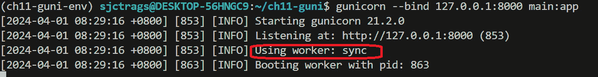

            <st c="17670">图 11.1 – 启动 Gunicorn 服务器后的服务器日志</st>

            <st c="17729">一个</st> *<st c="17732">Gunicorn</st> <st c="17740">工作进程是一个 Python 进程，它一次管理一个 HTTP 请求-响应事务。</st> <st c="17830">默认的 Gunicorn 服务器在后台运行一个工作进程。</st> <st c="17906">从逻辑上讲，产生更多的工作进程来管理请求和响应，将提高应用程序的性能。</st> <st c="18031">然而，对于 Gunicorn 来说，工作进程的数量取决于服务器机器上的 CPU 处理器数量，并使用</st> `<st c="18162">(2*CPU)+1</st>` <st c="18171">公式计算。</st> <st c="18181">这些子进程将同时管理 HTTP 请求，利用硬件可以提供的最大资源级别。</st> <st c="18317">Gunicorn 的一个优点是它能够有效地利用资源来管理</st> <st c="18421">运行时性能：</st>

            

            <st c="18863">图 11.2 – Windows 系统 CPU 利用率仪表板</st>

            *<st c="18926">图 11</st>**<st c="18936">.2</st>* <st c="18938">显示我们的生产服务器机器有</st> `<st c="18984">4</st>` <st c="18985">个 CPU 核心，这意味着我们的 Gunicorn 服务器可以使用的可接受工作进程数量是</st> `<st c="19087">9</st>`<st c="19088">。因此，以下命令运行了一个具有</st> `<st c="19146">9</st>` <st c="19147">个工作进程的 Gunicorn 服务器：</st>

```py
 gunicorn --bind 127.0.0.1:8000 main:app --workers 9
```

            <st c="19208">在命令语句中添加</st> `<st c="19220">--workers</st>` <st c="19229">设置，允许我们将适当的工人数包含在 HTTP</st> <st c="19325">请求处理中。</st>

            <st c="19344">向 Gunicorn 服务器添加工作进程，但不会提高应用程序的总 CPU 性能，这是一种资源浪费。</st> <st c="19481">一种补救方法是向工作进程添加更多线程，而不是添加</st> <st c="19541">无益的工作进程。</st>

            `<st c="19559">工作进程或进程消耗更多的内存空间。</st>` `<st c="19608">此外，与线程不同，没有两个工作进程可以共享内存空间。</st>` `<st c="19682">一个</st>` `<st c="19684">线程</st>` `<st c="19690">消耗的内存空间更少，因为它比工作进程更轻量级。</st>` `<st c="19762">为了获得最佳的服务器性能，每个工作进程必须至少启动</st>` `<st c="19837">2</st>` `<st c="19838">个线程，这些线程将并发处理 HTTP 请求和响应。</st>` `<st c="19907">因此，运行以下 Gunicorn 命令可以启动一个具有</st>` `<st c="19974">1</st>` `<st c="19975">个工作进程和</st>` `<st c="19988">2</st>` `<st c="19989">个线程的服务器：</st>`

```py
 gunicorn --bind 127.0.0.1:8000 main:app --workers 1 --threads 2
```

            `<st c="20062">The</st>` `<st c="20067">--threads</st>` `<st c="20076">设置允许我们为每个工作进程至少添加</st>` `<st c="20111">2</st>` `<st c="20112">个线程</st>` `<st c="20121">。</st>`

            `<st c="20132">尽管在工作进程中设置线程意味着并发，但这些线程仍然在其工作进程的范围内运行，它们是同步的。</st>` `<st c="20232">因此，工作进程的阻塞限制阻碍了线程发挥其真正的并发性能。</st>` `<st c="20275">然而，与纯工作进程设置相比，线程可以管理处理 I/O 事务的开销，因为应用于 I/O 阻塞的并发不会消耗</st>` `<st c="20575">更多空间。</st>`

            `<st c="20586">图 11**<st c="20611">.3</st>** 中所示的服务器日志显示了从</st>` `<st c="20651">同步</st>` `<st c="20655">工作进程</st>` `<st c="20666">到</st>` `<st c="20673">gthread</st>` `<st c="20673">的变化，因为当在</st>` `<st c="20740">Gunicorn 平台</st>` `<st c="20740">上使用时，所有生成的 Python 线程都变成了 gthread：</st>`

            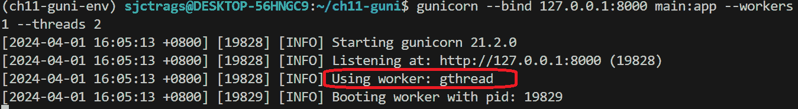

            `<st c="21045">图 11.3 – 运行 Gunicorn 后服务器的日志</st>`

            `<st c="21105">现在，当需要 I/O 事务的特征数量增加时，Gunicorn 以及工作进程和服务器都不会帮助加快 HTTP 请求和响应的处理速度。</st>` `<st c="21292">另一个解决方案是通过</st>` `<st c="21319">伪线程</st>` `<st c="21333">或</st>` `<st c="21337">绿色线程</st>` `<st c="21350">，通过</st>` `<st c="21364">eventlet</st>` `<st c="21372">和</st>` `<st c="21377">gevent</st>` `<st c="21383">库，将伪线程或绿色线程作为工作进程类添加到 Gunicorn 服务器中。</st>` `<st c="21437">这两个库都使用异步工具和</st>` `<st c="21483">greenlet</st>` `<st c="21491">线程来接口和执行标准的 Flask 组件，特别是 I/O 事务，以提高效率。</st>` `<st c="21606">它们使用</st>` `<st c="21619">monkey-patching</st>` `<st c="21634">机制来</st>` `<st c="21648">替换标准或阻塞组件，以它们的异步对应物。</st>`

            <st c="21729">要将我们的应用程序部署到使用</st> `<st c="21777">eventlet</st>` <st c="21785">库的 Gunicorn，首先使用以下</st> `<st c="21849">pip</st>` <st c="21852">命令安装</st> `<st c="21807">greenlet</st>` <st c="21815">模块，然后是</st> `<st c="21874">eventlet</st>`<st c="21882">：</st>

```py
 pip install greenlet eventlet
```

            <st c="21914">对于</st> `<st c="21919">psycopg2</st>` <st c="21927">或数据库相关的 monkey-patching，使用以下</st> `<st c="22014">pip</st>` <st c="22017">命令安装</st> `<st c="21977">psycogreen</st>` <st c="21987">模块：</st>

```py
 pip install psycogreen
```

            <st c="22049">然后，通过在</st> `<st c="22221">main.py</st>` <st c="22228">文件的最上方调用</st> `<st c="22162">psycogreen.eventlet</st>` <st c="22181">模块的</st> `<st c="22130">patch_psycopg()</st>` <st c="22145">函数，对 Peewee 和</st> `<st c="22093">psycopg2</st>` <st c="22101">事务进行 monkey-patching，并在调用</st> `<st c="22253">create_app()</st>` <st c="22265">方法之前执行。</st> <st c="22274">以下代码片段显示了包含</st> `<st c="22343">psycogreen</st>` <st c="22353">设置的</st> `<st c="22321">main.py</st>` <st c="22328">文件的部分：</st>

```py
<st c="22360">import psycogreen.eventlet</st>
<st c="22387">psycogreen.eventlet.patch_psycopg()</st> from app import create_app
from app.models.config import database
app = create_app('../config_dev.toml')
… … … … … …
```

            <st c="22540">The</st> `<st c="22545">psycogreen</st>` <st c="22555">module provides a blocking interface or wrapper for</st> `<st c="22608">psycopg2</st>` <st c="22617">transactions to interact with coroutines or asynchronous components of the</st> `<st c="22692">eventlet</st>` <st c="22700">worker without altering the standard</st> <st c="22738">Peewee codes.</st>

            <st c="22751">要将我们的</st> *<st c="22766">在线杂货</st>* <st c="22780">应用程序（</st>`<st c="22794">ch11-guni-eventlet</st>`<st c="22813">）部署到使用</st> `<st c="22849">1</st>` `<st c="22850">eventlet</st>` <st c="22858">工作进程和</st> `<st c="22871">2</st>` <st c="22872">线程的 Gunicorn 服务器上，请运行以下命令：</st>

```py
 gunicorn --bind 127.0.0.1:8000 main:app --workers 1 --worker-class  eventlet --threads 2
```

            *<st c="22996">图 11</st>**<st c="23006">.4</st>* <st c="23008">显示了运行 Gunicorn 服务器后的服务器日志：</st>

            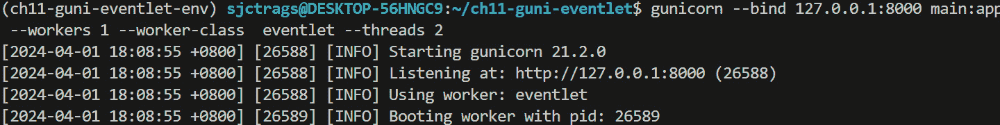

            <st c="23522">图 11.4 – 使用 eventlet 工作进程启动 Gunicorn 服务器后的服务器日志</st>

            <st c="23607">日志描述了</st> <st c="23624">服务器使用的工作进程是一个</st> `<st c="23674">eventlet</st>` <st c="23682">工作进程类型。</st>

            <st c="23695">The</st> `<st c="23700">eventlet</st>` <st c="23708">library provides</st> <st c="23726">concurrent utilities that run standard or non-async Flask components asynchronously using task switching, a shift from sync to async tasks internally without explicitly</st> <st c="23895">programming it.</st>

            <st c="23910">除了</st> `<st c="23922">eventlet</st>`<st c="23930">外，</st> `<st c="23932">gevent</st>` <st c="23938">还可以管理来自应用程序 I/O 密集型任务的并发请求。</st> <st c="24017">像</st> `<st c="24022">eventlet</st>`<st c="24030">一样，</st> `<st c="24032">gevent</st>` <st c="24038">是一个基于协程的库，但它更多地依赖于其</st> `<st c="24100">greenlet</st>` <st c="24108">对象及其事件循环。</st> <st c="24140">《st c="24144">gevent</st>` <st c="24150">库的</st> `<st c="24161">greenlet</st>` <st c="24169">是一个轻量级且强大的线程，以合作调度方式执行。</st> <st c="24258">要在 Gunicorn 服务器中运行一个</st> `<st c="24271">gevent</st>` <st c="24277">工作进程，请使用以下</st> `<st c="24380">pip</st>` <st c="24383">命令安装</st> `<st c="24321">greenlet</st>`<st c="24329">，</st> `<st c="24331">eventlet</st>`<st c="24339">，和</st> `<st c="24345">gevent</st>` <st c="24351">模块：</st>

```py
 pip install greenlet eventlet gevent
```

            <st c="24429">此外，安装</st> `<st c="24444">psycogreen</st>` <st c="24454">以使用其</st> `<st c="24534">gevent</st>` `<st c="24540">patch_psycopg()</st>`<st c="24556">对应用程序的数据库相关事务进行猴子补丁。以下代码片段显示了</st> `<st c="24603">main.py</st>` <st c="24610">文件的一部分，这是</st> `<st c="24623">ch11-guni-gevent</st>` <st c="24639">项目的版本，是我们</st> *<st c="24666">在线杂货店</st>* <st c="24680">应用程序的一个版本，需要在 Gunicorn 上使用</st> `<st c="24728">gevent</st>` <st c="24734">工作进程运行：</st>

```py
<st c="24743">import gevent.monkey</st>
<st c="24764">gevent.monkey.patch_all()</st>
<st c="24790">import psycogreen.gevent</st>
<st c="24815">psycogreen.gevent.patch_psycopg()</st> import gevent
from app import create_app
… … … … … …
app = create_app('../config_dev.toml')
… … … … … …
```

            <st c="24953">在</st> `<st c="24957">gevent</st>`<st c="24963">中，主模块必须在其</st> `<st c="24995">patch_all()</st>` <st c="25006">方法中调用</st> `<st c="25023">gevent.monkey</st>` <st c="25036">模块，在任何其他内容之前，以显式地将所有事件在运行时异步地运行，就像协程一样。</st> <st c="25155">之后，它需要调用</st> `<st c="25187">psycogreen</st>` <st c="25197">模块的</st> `<st c="25207">patch_psycopg()</st>`<st c="25222">，但这次是在</st> `<st c="25248">gevent</st>` <st c="25254">子模块下。</st>

            <st c="25266">要使用</st> <st c="25280">Gunicorn 服务器</st> <st c="25284">并使用</st> `<st c="25306">2</st>` `<st c="25307">gevent</st>` <st c="25313">工作进程以及</st> `<st c="25327">2</st>` <st c="25328">线程利用率来启动，请运行以下命令：</st>

```py
 gunicorn --bind 127.0.0.1:8000 main:app --workers 2 --worker-class gevent --threads 2
```

            *<st c="25466">图 11</st>**<st c="25476">.5</st>* <st c="25478">显示了启动</st> <st c="25522">Gunicorn 服务器</st>后的服务器日志：

            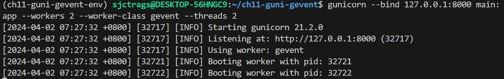

            <st c="26061">图 11.5 – 使用 gevent 工作进程启动 Gunicorn 服务器后的服务器日志</st>

            <st c="26145">Gunicorn 使用的进程现在是一个</st> `<st c="26187">gevent</st>` <st c="26193">进程，如前述服务器日志所示。</st>

            <st c="26242">现在，让我们使用 uWSGI 作为我们的生产</st> <st c="26282">应用服务器。</st>

            <st c="26301">使用 uWSGI</st>

            `<st c="26534">pyuwsgi</st>` <st c="26541">模块使用以下</st> `<st c="26569">pip</st>` <st c="26572">命令：</st>

```py
 pip install pyuwsgi
```

            <st c="26601">uWSGI 有几个必需和可选的设置选项。</st> <st c="26659">其中一个是</st> `<st c="26670">-w</st>` <st c="26672">设置，它需要服务器运行所需的 WSGI 模块。</st> <st c="26743">`<st c="26747">-p</st>` <st c="26749">设置表示可以管理 HTTP 请求的工作进程或进程数。</st> <st c="26834">`<st c="26838">--http</st>` <st c="26844">设置表示服务器将监听的地址和端口。</st> <st c="26919">`<st c="26923">--enable-threads</st>` <st c="26939">设置允许服务器利用 Python 线程进行</st> <st c="26996">后台进程。</st>

            <st c="27017">要将我们的</st> *<st c="27032">在线杂货</st>* <st c="27046">应用程序（</st>`<st c="27060">ch11-uwsgi</st>`<st c="27071">）部署到具有</st> `<st c="27097">4</st>` <st c="27098">个工作进程和后台 Python 线程的 uWSGI 服务器上，请运行以下命令：</st>

```py
 uwsgi --http 127.0.0.1:8000 --master -p 4 -w main:app --enable-threads
```

            <st c="27235">在这里，</st> `<st c="27242">--master</st>` <st c="27250">是一个可选设置，允许主进程及其工作进程优雅地关闭和</st> <st c="27338">重启。</st>

            与 Gunicorn 不同，uWSGI 生成一个长的服务器日志，提到了它包含的几个可管理的配置细节，以提高应用程序的性能。</st> <st c="27457">*<st c="27522">图 11</st>**<st c="27531">.6</st>* <st c="27533">显示了 uWSGI 启动后的服务器日志：</st>

            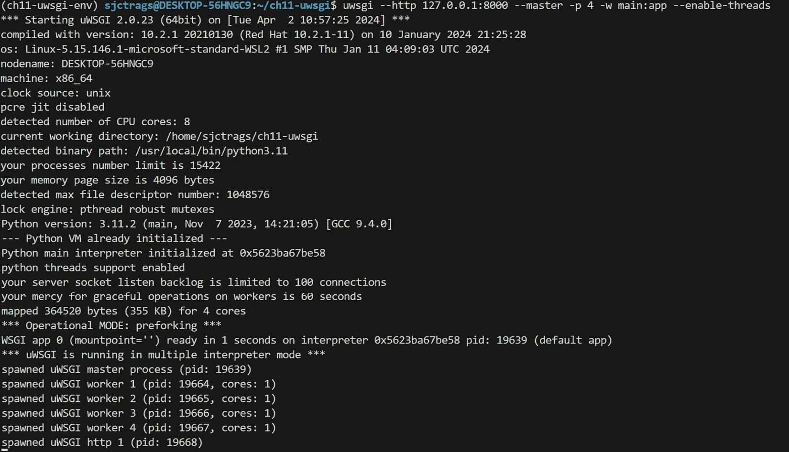

            <st c="29113">图 11.6 – 启动 uWSGI 服务器并使用 4 个工作进程后的服务器日志</st>

            <st c="29184">使用</st> `<st c="29225">--master</st>` <st c="29233">设置关闭 uWSGI 服务器，允许我们向主进程及其工作进程发送</st> `<st c="29299">SIGTERM</st>` <st c="29306">信号，以执行优雅的关闭、重启或重新加载，这比突然终止进程要好。</st> *<st c="29409">图 11</st>**<st c="29418">.7</st>* <st c="29420">显示了在命令中设置</st> `<st c="29455">--master</st>` <st c="29463">设置的优势：</st>

            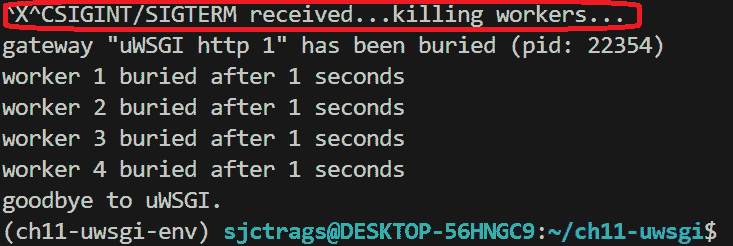

            <st c="29792">图 11.7 – 使用 --master 设置关闭 uWSGI 服务器后的服务器日志</st>

            <st c="29879">与易于配置的 Gunicorn 相比，管理 uWSGI 是</st> <st c="29898">复杂的。</st> <st c="29950">到目前为止，Gunicorn 仍然是部署标准</st> <st c="30030">Flask 应用程序时推荐的服务器。</st>

            <st c="30049">现在，让我们部署</st> *<st c="30068">Flask[async]</st>* <st c="30080">到名为</st> *<st c="30106">Uvicorn</st>*<st c="30113">的 ASGI 服务器</st>。

            <st c="30114">将应用程序部署到 Uvicorn</st>

            `<st c="30419">uvicorn.workers.UvicornWorker</st>` <st c="30448">作为其</st> <st c="30456">HTTP 服务器。</st>

            <st c="30468">尽管 Gunicorn 是基于 WSGI 的服务器，但它可以通过其</st> `<st c="30595">--worker-class</st>` <st c="30609">设置支持在标准</st> 和异步模式下运行 Flask 应用程序。</st> <st c="30619">对于 Flask[async] 应用程序，Gunicorn 可以使用</st> `<st c="30675">aiohttp</st>` <st c="30682">或</st> `<st c="30686">uvicorn</st>` <st c="30693">工作</st> <st c="30701">类类型。</st>

            <st c="30713">我们的异步</st> *<st c="30724">在线杂货</st>* <st c="30738">应用程序（</st>`<st c="30752">ch11-async</st>`<st c="30763">）使用 Gunicorn 和一个</st> `<st c="30787">uvicorn</st>` <st c="30794">工作作为其部署平台。</st> <st c="30830">在应用工作类型之前，首先通过运行以下</st> `<st c="30921">pip</st>` <st c="30924">命令安装</st> `<st c="30875">uvicorn</st>` <st c="30882">模块：</st>

```py
 pip install uvicorn
```

            <st c="30953">然后，从</st> `<st c="30967">WsgiToAsgi</st>` <st c="30977">导入</st> `<st c="30987">uvicorn</st>` <st c="30994">模块的</st> `<st c="31004">asgiref.wsgi</st>` <st c="31016">模块，以包装 Flask 应用程序实例。</st> <st c="31056">以下代码片段显示了如何将 WSGI 应用程序转换为 ASGI 类型：</st>

```py
<st c="31138">from asgiref.wsgi import WsgiToAsgi</st> from app import create_app
app = create_app('../config_dev.toml') <st c="31297">asgi_app</st> instead of the original Flask <st c="31336">app</st>. To start Gunicorn using two Uvicorn workers with two threads each, run the following command:

```

gunicorn main:asgi_app --bind 0.0.0.0:8000 --workers 2 --worker-class uvicorn.workers.UvicornWorker --threads 2

```py

			<st c="31546">Here,</st> `<st c="31553">UvicornWorker</st>`<st c="31566">, a Gunicorn-compatible worker class from the</st> `<st c="31612">uvicorn</st>` <st c="31619">library, provides an interface to an ASGI-based application so that Gunicorn can communicate with all the HTTP requests from the coroutines of the applications and eventually handle</st> <st c="31802">those requests.</st>
			*<st c="31817">Figure 11</st>**<st c="31827">.8</st>* <st c="31829">shows the server log after running the</st> <st c="31869">Gunicorn server:</st>
			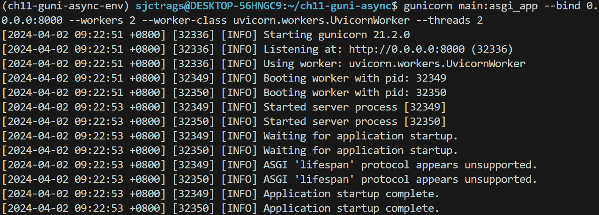

			<st c="33005">Figure 11.8 – Server log after starting the Gunicorn server using UvicornWorker</st>
			<st c="33084">The server log depicts the use of</st> `<st c="33119">uvicorn.workers.UvicornWorker</st>` <st c="33148">as the Gunicorn worker, and it also shows the “</st>*<st c="33196">ASGI ‘lifespan’ protocol appears unsupported.</st>*<st c="33242">” log message, which means Flask does not yet support ASGI with the lifespan</st> <st c="33320">protocol used to manage server startup</st> <st c="33359">and shutdown.</st>
			<st c="33372">The Apache HTTP Server, a popular production server for most PHP applications, can also host and run standard Flask applications.</st> <st c="33503">So, let’s explore the process of migrating our applications to the</st> *<st c="33570">Apache</st>* *<st c="33577">HTTP Server</st>*<st c="33588">.</st>
			<st c="33589">Deploying the application on the Apache HTTP Server</st>
			**<st c="33641">Apache HTTP Server</st>** <st c="33660">is an</st> <st c="33667">open source server under the Apache</st> <st c="33703">projects that can</st> <st c="33721">run on Windows and UNIX-based platforms to provide an efficient, simple, and flexible HTTP server for</st> <st c="33823">various applications.</st>
			<st c="33844">Before anything else, download the latest server from</st> [<st c="33899">https://httpd.apache.org/download.cgi</st>](https://httpd.apache.org/download.cgi) <st c="33936">and unzip the file to the production server’s installation directory.</st> <st c="34007">Then, download the latest</st> *<st c="34033">Microsoft Visual C++ Redistributable</st>* <st c="34069">from</st> [<st c="34075">https://learn.microsoft.com/en-us/cpp/windows/latest-supported-vc-redist</st>](https://learn.microsoft.com/en-us/cpp/windows/latest-supported-vc-redist)<st c="34147">, install it, and run the server through the</st> `<st c="34192">httpd.exe</st>` <st c="34201">file of its</st> `<st c="34214">/</st>``<st c="34215">bin</st>` <st c="34218">folder.</st>
			<st c="34226">After the installation, follow these steps to deploy our application to the Apache</st> <st c="34310">HTTP Server:</st>

				1.  <st c="34322">Build your Flask application, as we did with our</st> *<st c="34372">Online Grocery</st>* <st c="34386">application, run it using the built-in WSGI server, and refine the components using</st> `<st c="34471">pytest</st>` <st c="34477">testing.</st>
				2.  <st c="34486">Next, install the</st> `<st c="34505">mod_wsgi</st>` <st c="34513">module, which enables the Apache HTTP Server’s support to run WSGI applications.</st> <st c="34595">Install the module using the following</st> `<st c="34634">pip</st>` <st c="34637">command:</st>

    ```

    pip install mod_wsgi

    ```py

    				3.  <st c="34667">If the installation encounters an error similar to what’s shown in the error log in</st> *<st c="34752">Figure 11</st>**<st c="34761">.9</st>*<st c="34763">, run the</st> `<st c="34773">set</st>` <st c="34776">command to assign the</st> `<st c="34850">MOD_WSGI_APACHE_ROOTDIR</st>` <st c="34873">environment variable:</st>

    ```

    set "MOD_WSGI_APACHE_ROOTDIR= C:/.../Server/Apache24"

    ```py

    				4.  <st c="34949">Apply</st> *<st c="34956">forward slashes</st>* <st c="34971">(</st>`<st c="34973">/</st>`<st c="34974">) to create the directory path.</st> <st c="35006">Afterward, re-install the</st> `<st c="35032">mod_wsgi</st>` <st c="35040">module:</st>

			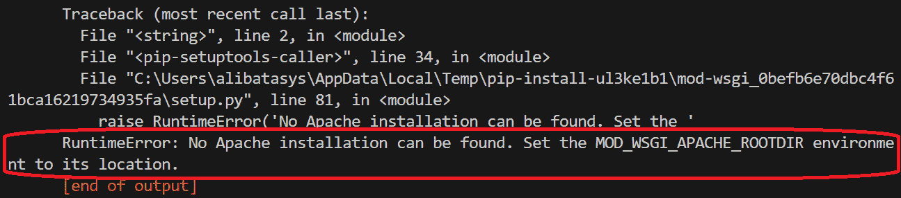

			<st c="35501">Figure 11.9 – No MOD_WSGI_APACHE_ROOTDIR error</st>

				1.  <st c="35547">Again, if the</st> <st c="35562">re-installation</st> <st c="35578">of</st> `<st c="35581">mod_wsgi</st>` <st c="35589">gives another</st> <st c="35604">error stating the required</st> `<st c="35685">VisualStudioSetup.exe</st>` <st c="35706">from</st> [<st c="35711">https://visualstudio.microsoft.com/downloads</st>](https://visualstudio.microsoft.com/downloads)<st c="35756">.</st>2.  <st c="35757">Run the</st> `<st c="35766">VisualStudioSetup.exe</st>` <st c="35787">file; a menu dashboard will appear, as shown in</st> *<st c="35836">Figure 11</st>**<st c="35845">.10</st>*<st c="35848">.</st>3.  <st c="35849">Click the</st> **<st c="35860">Desktop Development with C++</st>** <st c="35888">menu option to show the installation details on the right-hand side of</st> <st c="35960">the dashboard:</st>

			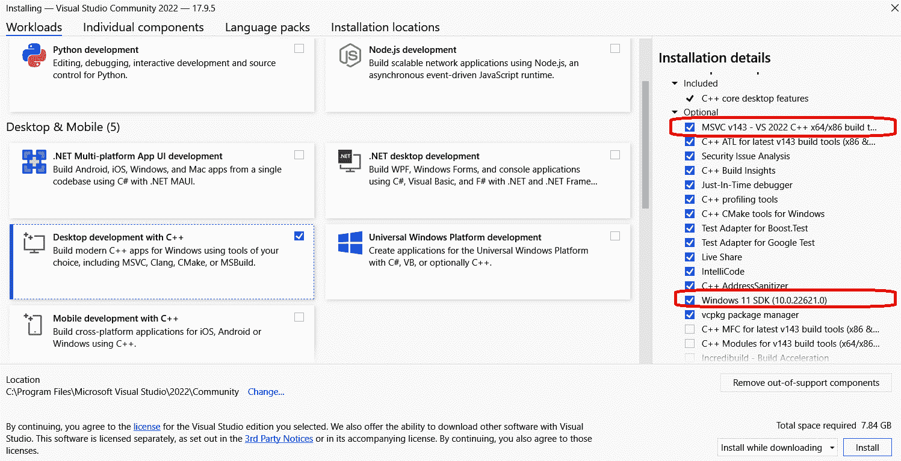

			<st c="37920">Figure 11.10 – Microsoft Visual Studio Library dashboard</st>
			<st c="37976">This</st> <st c="37982">installation</st> <st c="37995">is different from the previous Microsoft Visual C++ Redistributable</st> <st c="38063">installation procedure.</st>

				1.  <st c="38086">Now, select</st> `<st c="38322">mod_wsgi</st>` <st c="38330">installation.</st>
				2.  <st c="38344">After choosing the necessary components, click the</st> **<st c="38396">Install</st>** <st c="38403">button at the bottom right of</st> <st c="38434">the dashboard.</st>
				3.  <st c="38448">After installing</st> `<st c="38497">pip install mod_wsgi</st>` <st c="38517">once more.</st> <st c="38529">This time, the</st> `<st c="38544">mod_wsgi</st>` <st c="38552">installation must</st> <st c="38571">proceed successfully.</st>
				4.  <st c="38592">The</st> `<st c="38597">mod_wsgi</st>` <st c="38605">module needs a configuration file inside the project that the Apache HTTP Server needs to load during startup.</st> <st c="38717">This file should be in a separate folder, say</st> `<st c="38763">wsgi</st>`<st c="38767">, and must be in the main project folder.</st> <st c="38809">In our</st> `<st c="38816">ch11-apache</st>` <st c="38827">project, the configuration file is</st> `<st c="38863">conf.wsgi</st>` <st c="38872">and has been placed in the</st> `<st c="38900">wsgi</st>` <st c="38904">folder.</st> <st c="38913">Be sure to add the</st> `<st c="38932">__init__.py</st>` <st c="38943">file to this folder too.</st> <st c="38969">The following is the content</st> <st c="38998">of</st> `<st c="39001">conf.wsgi</st>`<st c="39010">:</st>

    ```

    import sys

    sys.path.insert(0, 'C:/Alibata/Training/ Source/flask/mastering/ch11-apache') <st c="39142">conf.wsgi</st> 配置文件为 Apache HTTP 服务器提供了一个通道，以便通过 <st c="39287">mod_wsgi</st> 模块访问 Flask <st c="39233">app</st> 实例进行部署和执行。

    ```py

    				5.  <st c="39303">Run the</st> `<st c="39312">mod_wsgi-express module-config</st>` <st c="39342">command to generate the</st> `<st c="39367">LoadModule</st>` <st c="39377">configuration statements that the Apache HTTP Server needs to integrate</st> <st c="39450">with the project</st> <st c="39467">directory.</st> <st c="39478">The following are the</st> `<st c="39500">LoadModule</st>` <st c="39510">snippets that have been generated for our</st> *<st c="39553">Online</st>* *<st c="39560">Grocery</st>* <st c="39567">application:</st>

    ```

    LoadFile "C:/Alibata/Development/Language/ Python/Python311/python311.dll"

    LoadModule wsgi_module "C:/Alibata/Training/Source/ flask/mastering/ch11-apache-env/Lib/site-packages/mod_wsgi/server/mod_wsgi.cp311-win_amd64.pyd"

    WSGIPythonHome "C:/Alibata/Training/Source/ flask/mastering/ch11-apache-env"

    ```py

    				6.  <st c="39880">Place these</st> `<st c="39893">LoadModule</st>` <st c="39903">configuration statements in the Apache HTTP Server’s</st> `<st c="39957">/conf/http.conf</st>` <st c="39972">file, specifically anywhere in the</st> `<st c="40008">LoadModule</st>` <st c="40018">area under the</st> **<st c="40034">Dynamic Shared Object (DSO)</st>** **<st c="40062">Support</st>** <st c="40069">segment.</st>
				7.  <st c="40078">At the end of the</st> `<st c="40097">/conf/http.conf</st>` <st c="40112">file, import the custom</st> `<st c="40137">VirtualHost</st>` <st c="40149">configuration file of the project.</st> <st c="40184">The following is a sample import statement for our</st> *<st c="40235">Online</st>* *<st c="40242">Grocery</st>* <st c="40249">application:</st>

    ```

    包含在 *<st c="40310">VirtualHost</st> 配置文件中，该文件在 *<st c="40355">步骤 10</st>* 中引用。以下是我们 <st c="40417">ch11_apache.conf</st> 文件中的示例配置设置：

    ```py
     <VirtualHost *:<st c="40455">8080</st>> <st c="40463">ServerName localhost</st> WSGIScriptAlias / C<st c="40503">:/Alibata/Training/Source/ flask/mastering/ch11-apache/wsgi/conf.wsgi</st> <Directory C:/Alibata/Training/Source/ flask/mastering/ch11-apache> <st c="40642">Require all granted</st> </Directory>
    </VirtualHost>
    ```

    <st c="40689">The</st> `<st c="40694">VirtualHost</st>` <st c="40705">配置定义了服务器将监听的主机地址和端口，以便运行我们的应用程序。</st> <st c="40770">它的</st> `<st c="40825">WSGIScriptAlias</st>` <st c="40840">指令给出了应用程序的</st> `<st c="40874">mod_wsgi</st>` <st c="40882">配置文件的引用。</st> <st c="40922">此外，配置允许服务器访问</st> `<st c="40996">ch11-apache</st>` <st c="41007">项目中的所有文件。</st>

    ```py

    				8.  <st c="41016">Now, open a terminal and run or restart the server through</st> `<st c="41076">httpd.exe</st>`<st c="41085">. Access all the APIs using</st> `<st c="41113">pytest</st>` <st c="41119">or</st> <st c="41123">API clients.</st>

			<st c="41135">Choosing the Apache HTTP Server as the production server is a common approach in many deployment plans for Flask projects involving the standalone server platform.</st> <st c="41300">Although the deployment process is tricky and lengthy, the server’s fast and stable performance, once configured and managed well, makes it a better choice for setting up a significantly effective production environment for</st> <st c="41524">Flask applications.</st>
			<st c="41543">There is another way of deploying Flask applications that involves fewer tweaks and configurations</st> <st c="41643">but provides an enterprise-grade production setup:</st> **<st c="41694">the containerized deployment approach</st>**<st c="41731">. Let’s discuss how to deploy the application to</st> *<st c="41780">Docker</st>* <st c="41787">containers.</st>
			<st c="41798">Deploying the application on Docker</st>
			**<st c="41834">Docker</st>** <st c="41841">is a</st> <st c="41847">powerful tool for deploying and running applications using software</st> <st c="41915">units instead of hardware setups.</st> <st c="41949">Each</st> <st c="41954">independent, lightweight, standalone, and executable</st> <st c="42007">unit, called a</st> **<st c="42022">container</st>**<st c="42031">, must contain all the files of the applications that it needs to run.</st> <st c="42102">Docker is the core container engine that manages all the containers</st> <st c="42170">and packages applications in their appropriate containers.</st> <st c="42229">To download Docker, download the</st> **<st c="42262">Docker Desktop</st>** <st c="42276">installer that’s appropriate for your system from</st> [<st c="42327">https://docs.docker.com/engine/install/</st>](https://docs.docker.com/engine/install/)<st c="42366">. Be sure to enable the Window’s</st> **<st c="42399">Hyper-V service</st>** <st c="42414">before</st> <st c="42422">installing Docker.</st> <st c="42441">Use your Docker credentials to log in to the application.</st> *<st c="42499">Figure 11</st>**<st c="42508">.11</st>* <st c="42511">shows a sample account dashboard of the Docker</st> <st c="42559">Desktop application:</st>
			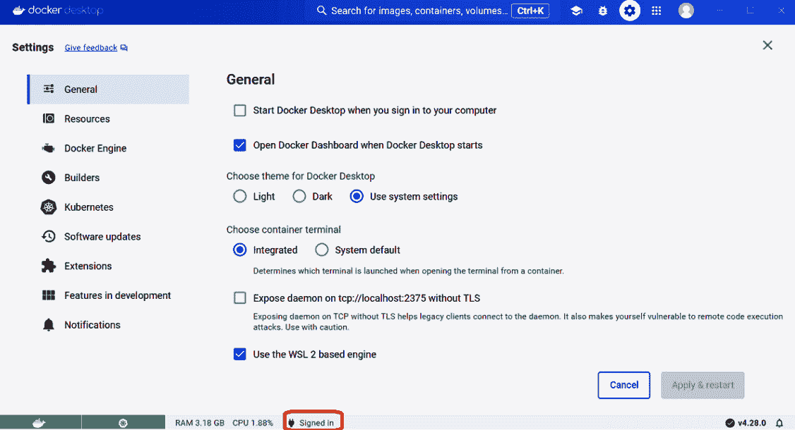

			<st c="43320">Figure 11.11 – A Desktop Docker profile</st>
			<st c="43359">Docker requires some rules when deploying applications to its containers.</st> <st c="43434">The first requirement is to create a Dockerfile inside the project’s</st> *<st c="43503">main</st>* <st c="43507">directory, on the same level as the</st> `<st c="43544">main.py</st>` <st c="43551">and</st> `<st c="43556">.toml</st>` <st c="43561">configuration files.</st> <st c="43583">The following is the content of the</st> `<st c="43619">ch11-asgi</st>` <st c="43628">file’s Dockerfile:</st>

```

<st c="43647">FROM python:3.11</st> WORKDIR /usr/src/ch11-asgi

运行 `pip install --upgrade pip`

COPY ./requirements.txt /usr/src/ch11-asgi/requirements.txt

RUN pip install -r requirements.txt

COPY . /usr/src/ch11-asgi

EXPOSE 8000

CMD ["gunicorn", "main:asgi_app", "--bind", "0.0.0.0:8000", "--worker-class", "uvicorn.workers.UvicornWorker", "--threads", "2"]

```py

			<st c="43984">A</st> **<st c="43987">Dockerfile</st>** <st c="43997">contains a</st> <st c="44009">series of instructions made by Docker commands that the engine will use to assemble an image.</st> <st c="44103">A</st> **<st c="44105">Docker image</st>** <st c="44117">is a software</st> <st c="44132">template containing the needed project files, folders, Python modules, server details, and commands to start the Flask server.</st> <st c="44259">Docker will run the image to generate a running image instance called</st> <st c="44329">a container.</st>
			<st c="44341">The first</st> <st c="44352">line of our Dockerfile is the</st> `<st c="44382">FROM</st>` <st c="44386">instruction, which</st> <st c="44406">creates a stage or a copy of the base image from the Docker repository.</st> <st c="44478">Here are the guidelines to follow when choosing the</st> <st c="44530">base image:</st>

				*   <st c="44541">Ensure it is complete with libraries, tools, filesystem structure, and network structures so that the container will</st> <st c="44659">be stable.</st>
				*   <st c="44669">Ensure it can be updated in terms of operating system plugins</st> <st c="44732">and libraries.</st>
				*   <st c="44746">Ensure it’s equipped with up-to-date and stable Python compilers and</st> <st c="44816">core libraries.</st>
				*   <st c="44831">Ensure it’s loaded with extensions and additional plugins for additional</st> <st c="44905">complex integrations.</st>
				*   <st c="44926">Ensure it has a smaller</st> <st c="44951">file size.</st>

			<st c="44961">Choosing the right base image is crucial for the application to avoid problems during</st> <st c="45048">production phases.</st>
			<st c="45066">The next instruction is the</st> `<st c="45095">WORKDIR</st>` <st c="45102">command, which creates and sets the new application’s working directory.</st> <st c="45176">The first</st> `<st c="45186">RUN</st>` <st c="45189">command updates the container’s</st> `<st c="45222">pip</st>` <st c="45225">command, which will install all the libraries from the</st> `<st c="45281">requirements.txt</st>` <st c="45297">file copied by the</st> `<st c="45317">COPY</st>` <st c="45321">command from our local project folder.</st> <st c="45361">After installing the modules in the container, the next instruction is to</st> `<st c="45435">COPY</st>` <st c="45439">all the project files from the local folder to</st> <st c="45487">the container.</st>
			<st c="45501">The</st> `<st c="45506">EXPOSE</st>` <st c="45512">command defines the port the application will listen on.</st> <st c="45570">The</st> `<st c="45574">CMD</st>` <st c="45578">command, on the other hand, tells Docker how to start the Gunicorn server with</st> `<st c="45657">UvicornWorker</st>` <st c="45670">when the</st> <st c="45680">container starts.</st>
			<st c="45697">After composing the Dockerfile, open a terminal to run the</st> `<st c="45757">docker login</st>` <st c="45769">CLI command</st> <st c="45782">and input your credentials.</st> <st c="45810">The</st> `<st c="45814">docker login</st>` <st c="45826">command enables access to your Docker repository using other Docker’s</st> <st c="45897">CLI commands, such as</st> `<st c="45919">docker run</st>` <st c="45929">to execute the instructions from the Dockerfile.</st> <st c="45979">By the way, aside from our Flask[async] application, there is a need to pull an image to generate a container for the PostgreSQL database of our application.</st> <st c="46137">Conventionally, to connect these containers, such as our PostgreSQL and Redis containers, to the Python container with the Flask application, Docker networking, through running the</st> `<st c="46318">docker network</st>` <st c="46332">command, creates the network connections that will link these containers to establish the needed connectivity.</st> <st c="46444">But this becomes complex if there are more containers to attach.</st> <st c="46509">As a replacement to save time and effort,</st> *<st c="46551">Docker Compose</st>* <st c="46565">can establish all these step-by-step networking procedures by only running the</st> `<st c="46645">docker-compose</st>` <st c="46659">command.</st> <st c="46669">There is no need to install Docker Compose since it is part of the bundle that’s installed by the Docker Desktop installer.</st> <st c="46793">Docker Compose uses Docker Engine, so installing the engine also includes Compose.</st> <st c="46876">To start Docker Compose, just run</st> `<st c="46910">docker login</st>` <st c="46922">and enter a valid</st> <st c="46941">Docker account.</st>
			<st c="46956">Using Docker Compose</st>
			`<st c="47177">docker-compose.yaml</st>`<st c="47196">. The following is the configuration file that’s used by our</st> `<st c="47257">ch11-asgi-deployment</st>` <st c="47277">project:</st>

```

<st c="47286">version: '3.0'</st>

<st c="47301">services</st>: <st c="47313">api</st>: <st c="47319">build: ./ch11-asgi</st> volumes:

    - ./ch11-asgi/:/usr/src/ch11-asgi/

    ports:

    - 8000:8000 <st c="47401">depends_on</st>:

    - postgres <st c="47425">postgres</st>: <st c="47436">image: «bitnami/postgresql:latest»</st> ports:

    - 5432:5432

    env_file:

    - db.env # 配置 postgres <st c="47530">volumes</st>:

    - <st c="47542">database-data:/var/lib/postgresql/data/</st>

<st c="47581">volumes</st>: <st c="47611">version</st> 指令表示配置将在 Compose 指令中使用 Compose 语法版本。我们的 Compose 配置文件使用版本 <st c="47766">3.0</st>，这是撰写本书时的最新版本。较低版本意味着已弃用的关键字和命令。

            <st c="47878">现在，</st> `<st c="47888">services</st>` <st c="47896">指令定义了 Compose 将创建和运行的容器。</st> <st c="47968">我们的包括</st> *<st c="47985">在线杂货</st>* <st c="47999">应用程序（</st>`<st c="48013">api</st>`<st c="48017">）和 PostgreSQL 数据库平台（</st>`<st c="48058">postgres</st>`<st c="48067">）。</st> <st c="48071">在这里，</st> `<st c="48077">api</st>` <st c="48080">是我们应用程序服务的名称。</st> <st c="48129">它包含以下</st> <st c="48155">必需的子指令：</st>

                +   `<st c="48179">build</st>`<st c="48185">: 指向包含 Dockerfile 的本地项目文件夹的位置。</st>

                +   `<st c="48265">ports</st>`<st c="48271">: 将容器的端口映射到主机的端口，可以是 TCP</st> <st c="48333">或 UDP。</st>

                +   `<st c="48340">volumes</st>`<st c="48348">: 将本地项目文件附加到容器指定的目录，如果项目文件有更改，则可以节省镜像重建。</st> <st c="48496">项目文件。</st>

                +   `<st c="48510">depends_on</st>`<st c="48521">: 指出被视为容器依赖项之一的服务名称。</st>

            <st c="48600">另一项服务是</st> `<st c="48620">postgres</st>`<st c="48628">，它为</st> `<st c="48675">api</st>` <st c="48679">服务提供数据库平台，因此存在</st> <st c="48697">两个服务之间的依赖关系。</st> <st c="48734">而不是使用</st> `<st c="48755">build</st>` <st c="48760">指令，它的</st> `<st c="48776">image</st>` <st c="48781">指令将拉取最新的</st> `<st c="48813">bitnami/postgresql</st>` <st c="48831">镜像来创建一个具有空数据库模式的 PostgreSQL 平台的容器。</st> <st c="48919">它的</st> `<st c="48923">ports</st>` <st c="48928">指令表明容器将使用端口</st> `<st c="48982">5432</st>` <st c="48986">来监听数据库连接。</st> <st c="49024">数据库凭据位于由</st> `<st c="49060">db.env</st>` <st c="49066">文件指示的</st> `<st c="49089">env_file</st>` <st c="49097">指令。</st> <st c="49109">以下代码片段显示了</st> `<st c="49156">db.env</st>` <st c="49162">文件的内容：</st>

```py
 POSTGRES_USER=postgres
POSTGRES_PASSWORD=admin2255
POSTGRES_DB=ogs
```

            <st c="49235">对于</st> `<st c="49240">volumes</st>` <st c="49247">指令的</st> `<st c="49266">postgres</st>` <st c="49274">服务至关重要，因为配置中缺少它意味着容器重启后的数据清理。</st>

            <st c="49406">在最终确定</st> `<st c="49428">docker-compose.yaml</st>` <st c="49447">文件后，运行</st> `<st c="49462">docker-compose --build</st>` <st c="49484">命令来构建或重建服务，然后在</st> `<st c="49553">docker-compose up</st>` <st c="49570">命令之后再次运行，以创建和运行容器。</st> *<st c="49613">图 11</st>**<st c="49622">.12</st>* <st c="49625">显示了运行</st> `<st c="49667">docker-compose up --</st>``<st c="49687">build</st>` <st c="49693">命令后的命令日志：</st>

            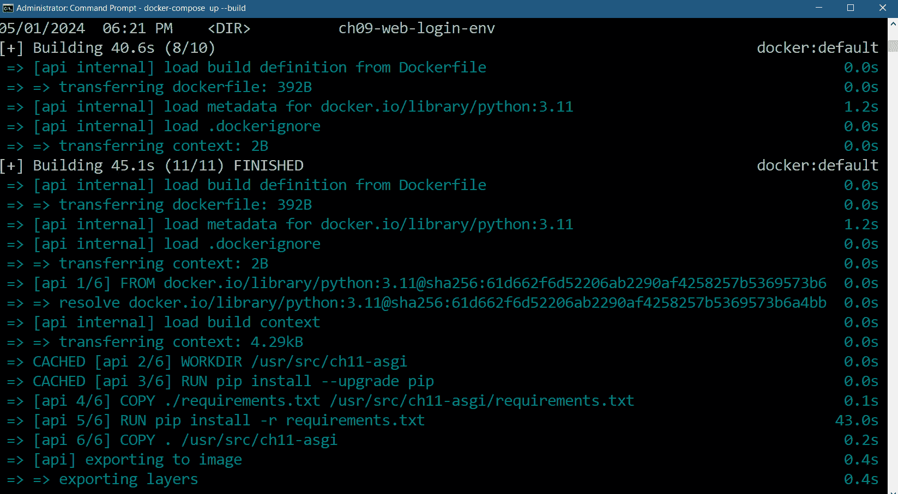

            <st c="50912">图 11.12 – 运行 docker-compose up --build 命令时的日志</st>

            <st c="50982">另一方面，Docker</st> <st c="50994">桌面仪表板将在成功运行生成的容器后，在</st> *<st c="51082">图 11</st>**<st c="51091">.13</st>* <st c="51094">中显示以下容器结构：</st>

            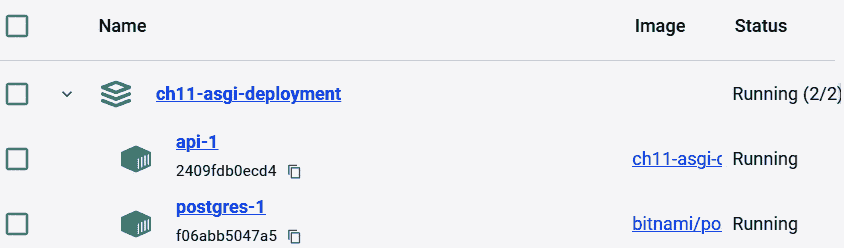

            <st c="51293">图 11.13 – Docker Desktop 显示 ch11-asgi 和 PostgreSQL 容器</st>

            <st c="51370">在这里，</st> `<st c="51377">ch11-asgi-deployment</st>` <st c="51397">在给定的容器结构中是包含</st> `<st c="51483">db.env</st>` <st c="51489">和</st> `<st c="51494">docker-compose.yaml</st>` <st c="51513">文件的部署文件夹的名称，以及执行</st> `<st c="51576">docker-compose</st>` <st c="51590">命令的终端目录。</st> <st c="51610">在 Compose 容器结构内部是服务生成的两个容器。</st> <st c="51709">点击</st> `<st c="51722">api-1</st>` <st c="51727">容器将为我们提供如</st> *<st c="51797">图 11.14</st>**<st c="51806">.14</st>*<st c="51809">所示的 Gunicorn 服务器日志：</st>

            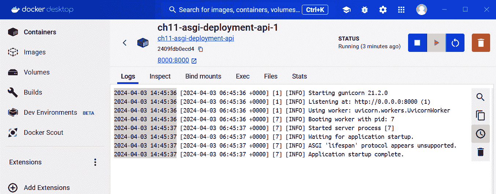

            <st c="52764">图 11.14 – api-1 容器中 ch11-asgi 应用程序的 Gunicorn 服务器日志</st>

            <st c="52844">另一方面，点击</st> `<st c="52877">postgres-1</st>` <st c="52887">容器将显示如</st> *<st c="52926">图 11</st>**<st c="52935">.15</st>*<st c="52938">所示的日志：</st>

            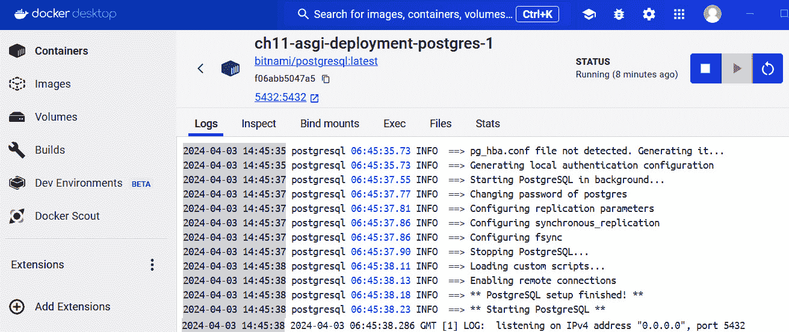

            <st c="54308">图 11.15 – postgres-1 容器中的 PostgreSQL 服务器日志</st>

            <st c="54376">现在，postgres-1 容器中的数据库模式是空的。</st> <st c="54409">为了将本地 PostgreSQL 服务器中的表和数据填充到数据库中，运行</st> `<st c="54528">pg_dump</st>` <st c="54535">来创建一个</st> `<st c="54548">.sql</st>` <st c="54552">转储文件。</st> <st c="54564">然后，在</st> `<st c="54603">.sql</st>` <st c="54607">备份文件所在的目录位置，运行以下</st> `<st c="54639">docker copy</st>` <st c="54650">命令来复制备份文件，例如</st> `<st c="54688">ogs.sql</st>`<st c="54695">，到容器的</st> `<st c="54704">entrypoint</st>` <st c="54714">目录：</st>

```py
 docker cp ogs.sql ch11-asgi-deployment-postgres-1:/docker-entrypoint-initdb.d/ogs.sql
```

            <st c="54828">然后，使用有效的凭据，例如</st> `<st c="54898">postgres</st>` <st c="54906">及其密码，通过</st> `<st c="54969">docker</st>` `<st c="54976">exec</st>` <st c="54980">命令来转储或执行</st> `<st c="54949">.sql</st>` <st c="54953">文件：</st>

```py
 docker exec -it ch11-asgi-deployment-postgres-1 psql -U postgres -d ogs -f docker-entrypoint-initdb.d/ogs.sql
```

            <st c="55099">最后，使用数据库</st> `<st c="55123">ch11-asgi-deployment-postgres-1</st>` <st c="55154">的凭据通过</st> `<st c="55172">docker exec</st>` <st c="55183">命令登录到服务器：</st>

```py
 docker exec -it ch11-asgi-deployment-postgres-1 psql -U postgres
```

            <st c="55293">此外，别忘了</st> <st c="55313">将 `<st c="55350">PooledPostgresqlDatabase</st>` 驱动类的 `<st c="55328">host</st>` 参数替换为容器的名称，而不是 `<st c="55425">localhost</st>` 和其 `<st c="55443">端口</st>` <st c="55447">到 `<st c="55451">5432</st>`<st c="55455">。以下代码片段显示了在 `<st c="55556">app/models/config</st>` 模块中可以找到的驱动类配置更改：</st>

```py
 from peewee_async import PooledPostgresqlDatabase
database = PooledPostgresqlDatabase(
        'ogs',
        user='postgres',
        password='admin2255', <st c="55715">host='ch11-asgi-deployment-postgres-1',</st><st c="55754">port='5432',</st> max_connections = 3,
        connect_timeout = 3
    )
```

            现在，在生产过程中，如果一个或一些容器失败时，问题就会出现。<st c="55890">默认情况下，它支持在应用程序出现运行时错误或某些内存相关问题时自动重启容器。</st> <st c="56026">此外，Compose 无法在分布式设置中执行容器编排。</st>

            将应用程序部署到不同的主机而不是单个服务器上的另一种强大方法是使用 *<st c="56220">Kubernetes</st>**<st c="56230">。在下一节中，我们将使用 Kubernetes 将我们的 `<st c="56288">ch11-asgi</st>` 应用程序与 Gunicorn 一起作为服务器进行部署。

            部署应用程序到 Kubernetes

            与 Compose 类似，**<st c="56393">Kubernetes</st>** 或 **<st c="56407">K8</st>** 可以管理多个容器，无论它们是否有相互依赖关系。<st c="56482">Kubernetes 可以利用卷存储进行数据持久化，并具有 CLI 命令来管理容器的生命周期。</st> <st c="56606">唯一的区别是 Kubernetes 可以在分布式设置中运行容器，并使用 Pods 来管理其容器。</st>

            在众多安装 Kubernetes 的方法中，本章利用 Docker Desktop 的 **<st c="56835">设置</st>** 中的 **<st c="56796">Kubernetes</st>** 功能，如图 *<st c="56857">图 11.16</st>* 所示。

            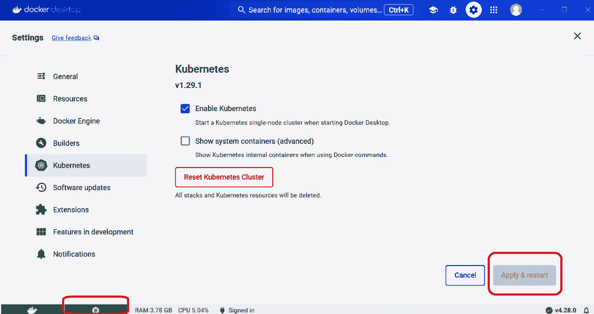

            图 11.16 – 桌面 Docker 中的 Kubernetes

            在 **<st c="57467">设置</st>** 区域勾选 **<st c="57431">启用 Kubernetes</st>** 复选框，并在仪表板右下角点击 **<st c="57495">应用 & 重启</st>** 按钮。<st c="57563">根据 Docker Engine 上运行的容器数量，Kubernetes 出现运行或 *<st c="57620">绿色</st> * <st c="57625">在仪表板左下角，需要一段时间。</st>

            <st c="57732">当 Kubernetes 引擎失败时，在重启</st> <st c="58006">Docker Desktop</st> 之前点击</st> `<st c="57942">C:\Users\alibatasys\AppData\Local\Temp</st>` <st c="57980">文件夹。</st>

            Kubernetes 使用 YAML 文件来定义和创建 Kubernetes 对象，例如</st> **<st c="58098">Deployment</st>**<st c="58108">,</st> **<st c="58110">Pods</st>**<st c="58114">,</st> **<st c="58116">Services</st>**<st c="58124">, 和</st> **<st c="58130">PersistentVolume</st>**<st c="58146">, 所有这些都是建立</st> <st c="58187">一些容器规则、管理主机资源以及构建</st> <st c="58246">容器化</st> <st c="58260">应用程序所必需的。</st> <st c="58274">YAML 格式的对象定义</st> <st c="58310">始终包含以下</st> <st c="58343">清单字段：</st>

                +   `<st c="58359">apiVersion</st>`<st c="58370">: 该字段指示创建 Kubernetes 对象时应使用的适当且稳定的 Kubernetes API。</st> <st c="58474">此字段必须始终出现在文件的第一位。</st> <st c="58523">Kubernetes 有多个 API，例如</st> `<st c="58560">batch/v1</st>`<st c="58568">,</st> `<st c="58570">apps/v1</st>`<st c="58577">,</st> `<st c="58579">v1</st>`<st c="58581">, 和</st> `<st c="58587">rbac.authorization.k8s.io/v1</st>`<st c="58615">, 但最常见的</st> `<st c="58640">v1</st>` <st c="58642">用于</st> `<st c="58647">PersistentVolume</st>`<st c="58663">,</st> `<st c="58665">PersistentVolumeClaims</st>`<st c="58687">,</st> `<st c="58689">Service</st>`<st c="58696">,</st> `<st c="58698">Secret</st>`<st c="58704">, 和</st> `<st c="58710">Pod</st>` <st c="58713">对象创建，以及</st> `<st c="58734">apps/v1</st>` <st c="58741">用于</st> `<st c="58746">Deployment</st>` <st c="58756">和</st> `<st c="58761">ReplicaSets</st>` <st c="58772">对象。</st> <st c="58782">到目前为止，</st> `<st c="58790">v1</st>` <st c="58792">是 Kubernetes API 的第一个稳定版本。</st>

                +   `<st c="58839">kind</st>`<st c="58844">: 该字段标识文件需要创建的 Kubernetes 对象。</st> <st c="58921">在此处，</st> `<st c="58927">kind</st>` <st c="58931">可以是</st> `<st c="58939">Secret</st>`<st c="58945">,</st> `<st c="58947">Service</st>`<st c="58954">,</st> `<st c="58956">Deployment</st>`<st c="58966">,</st> `<st c="58968">Role</st>`<st c="58972">,</st> <st c="58974">或</st> `<st c="58977">Pod</st>`<st c="58980">。</st>

                +   `<st c="58981">metadata</st>`<st c="58990">: 该字段指定文件中定义的 Kubernetes 对象的属性。</st> <st c="59075">属性可能包括</st> *<st c="59106">name</st>*<st c="59110">,</st> *<st c="59112">labels</st>*<st c="59118">,</st> <st c="59120">和</st> *<st c="59124">namespace</st>*<st c="59133">。</st>

                +   `<st c="59134">spec</st>` `<st c="59139">`: 此字段以键值格式提供对象的规范。</st> `<st c="59215">具有不同</st>` `<st c="59253">apiVersion</st>` `<st c="59263">的同一种对象类型可以有不同的</st>` `<st c="59283">规范细节。</st>

            在本章中，Kubernetes 部署涉及从 Docker 仓库中心拉取我们的`<st c="59370">ch11-asgi</st>`文件和最新的`<st c="59415">bitnami/postgresql</st>`镜像。<st c="59433">但在创建部署文件之前，我们的第一个清单关注的是包含`<st c="59556">Secret</st>`对象定义，其目的是存储和确保数据库 PostgreSQL 凭据的安全。</st> `<st c="59650">以下是我们</st>` `<st c="59671">kub-secrets.yaml</st>` `<st c="59687">文件，其中包含我们的</st>` `<st c="59713">Secret</st>` `<st c="59719">对象定义：</st>

```py
<st c="59738">apiVersion: v1</st>
<st c="59753">kind: Secret</st>
<st c="59766">metadata:</st><st c="59776">name: postgres-credentials</st> data:
  # replace this with your base4-encoded username
  user: cG9zdGdyZXM=
  # replace this with your base4-encoded password
  password: YWRtaW4yMjU1
```

            `<st c="59947">一个</st>` `<st c="59950">Secret</st>` `<st c="59956">对象包含受保护的数据，如密码、用户令牌或访问密钥。</st> `<st c="60035">而不是将这些机密数据硬编码到应用程序中，将它们存储在 Pod 中是安全的，这样其他 Pod 就可以在集群中访问它们。</st>

            `<st c="60193">我们的第二个</st>` `<st c="60205">YAML 文件</st>` `<st c="60216">kub-postgresql-pv.yaml</st>` `<st c="60238">定义了将为我们 PostgreSQL 创建持久存储资源的对象，即</st>` `<st c="60329">PersistentVolume</st>` `<st c="60345">对象。</st> `<st c="60354">由于我们的 Kubernetes 运行在单个节点服务器上，默认存储类是</st>` `<st c="60434">hostpath</st>` `<st c="60442">。此存储将永久保存 PostgreSQL 的数据，即使在我们的容器化应用程序被删除后也是如此。</st> `<st c="60564">以下</st>` `<st c="60578">kub-postgresql-pv.yaml</st>` `<st c="60600">文件定义了将管理我们应用程序数据存储的</st>` `<st c="60618">PersistentVolume</st>` `<st c="60634">对象：</st>

```py
<st c="60690">apiVersion: v1</st>
<st c="60705">kind: PersistentVolume</st>
<st c="60728">metadata:</st><st c="60738">name: postgres-pv-volume</st> labels:
      type: local <st c="60784">spec:</st><st c="60789">storageClassName: manual</st> capacity:
      storage: 5Gi
   accessModes:
       - ReadWriteOnce
   hostPath:
      path: "/mnt/data"
```

            `<st c="60894">在 Kubernetes 中，利用</st>` `<st c="60937">PersistentVolume</st>` `<st c="60953">对象需要一个</st>` `<st c="60972">PersistentVolumeClaims</st>` `<st c="60994">对象。</st> `<st c="61003">此对象请求集群存储的一部分，Kubernetes</st>` `<st c="61057">Pods</st>` `<st c="61073">将使用这部分存储进行应用程序的读写。</st> `<st c="61125">以下</st>` `<st c="61139">kub-postgresql-pvc.yaml</st>` `<st c="61162">文件为部署的存储创建了一个</st>` `<st c="61179">PersistentVolumeClaims</st>` `<st c="61201">对象：</st>

```py
<st c="61238">kind: PersistentVolumeClaim</st>
<st c="61266">apiVersion: v1</st>
<st c="61281">metadata:</st><st c="61291">name: postgresql-db-claim</st>
<st c="61317">spec:</st> accessModes:
    - ReadWriteOnce
  resources:
    requests:
      storage: 5Gi
```

            <st c="61386">持久卷声明</st> `<st c="61391">和</st> `<st c="61413">持久卷</st>` `<st c="61434">对象协同工作，动态地为</st> `<st c="61507">bitnami/postgresql</st>` `<st c="61525">容器</st>` `<st c="61537">分配新的卷存储。</st> `<st c="61541">手动</st>` `<st c="61547">存储类</st>` `<st c="61560">类型表示，对于存储请求，存在从</st> `<st c="61605">持久卷声明</st>` `<st c="61627">到</st> `<st c="61631">持久卷</st>` `<st c="61647">的绑定。</st>

            <st c="61679">在为</st> `<st c="61727">Secret</st>` `<st c="61733">、</st> `<st c="61735">PersistentVolume</st>` `<st c="61751">和</st> `<st c="61757">PersistentVolumeClaims</st>` `<st c="61779">对象创建配置文件后，下一步关键步骤是创建部署配置文件，这些文件将连接</st> `<st c="61881">ch11-asgi</st>` `<st c="61890">和</st> `<st c="61895">bitnami/postgresql</st>` `<st c="61913">Docker 镜像，使用来自</st> `<st c="61973">Secret</st>` `<st c="61979">对象的数据库配置详细信息，利用持久卷声明进行 PostgreSQL 数据持久性，并使用 Kubernetes 服务和 Pods 一起部署和运行它们。</st>` `<st c="62119">在这里，</st>` `<st c="62125">Deployment</st>` `<st c="62135">管理一组 Pod 以运行应用程序工作负载。</st>` `<st c="62190">Pod 作为 Kubernetes 的基本构建块，代表 Kubernetes 集群中的单个运行进程。</st>` `<st c="62307">以下</st>` `<st c="62321">kub-postgresql-deployment.yaml</st>` `<st c="62351">文件告诉 Kubernetes 管理一个实例，该实例将保留</st> `<st c="62415">PostgreSQL 容器</st>` `<st c="62415">:`

```py
<st c="62436">apiVersion: apps/v1</st>
<st c="62456">kind: Deployment</st>
<st c="62541">v1</st> or <st c="62547">apps/v1</st> is the proper choice for the <st c="62584">apiVersion</st> metadata. The <st c="62609">kub-postgresql-deployment.yaml</st> file is a <st c="62650">Deployment</st> type of Kubernetes document, as indicated in the <st c="62710">kind</st> metadata, which will generate a container named <st c="62763">ch11-postgresql</st>:

```

<st c="62780">规格:</st> 副本数: 1

选择器:

    匹配标签:

    应用: ch11-postgresql

模板:

    元数据:

    标签:

        应用: ch11-postgresql

    规格说明:

    终止宽限期秒数: 180 <st c="62932">容器:</st> - 名称: ch11-postgresql

        镜像: bitnami/postgresql:latest

        镜像拉取策略: IfNotPresent

        端口:

            - 名称: tcp-5432

            容器端口: 5432

```py

			<st c="63074">From the</st> <st c="63084">overall state indicated</st> <st c="63108">in the</st> `<st c="63115">spec</st>` <st c="63119">metadata, the deployment will create</st> *<st c="63157">1 replica</st>* <st c="63166">in a Kubernetes pod, with</st> `<st c="63193">ch11-postgresql</st>` <st c="63208">as its label, to run the PostgreSQL server.</st> <st c="63253">Moreover, the deployment will pull the</st> `<st c="63292">bitnami/postgresql:latest</st>` <st c="63317">image to create the PostgreSQL container, bearing the</st> `<st c="63372">ch11-postgresql</st>` <st c="63387">label also.</st> <st c="63400">The configuration also includes a</st> `<st c="63434">terminationGracePeriodSeconds</st>` <st c="63463">value of</st> `<st c="63473">180</st>` <st c="63476">to shut down the database</st> <st c="63503">server safely:</st>

```

环境:

        - 名称: POSTGRES_USER

            值来源:

            密钥引用: <st c="63570">名称: postgres-credentials</st> 密钥: user

        - 名称: POSTGRES_PASSWORD

            值来源:

            密钥引用: <st c="63658">名称: postgres-credentials</st> 密钥: password

        - 名称: POSTGRES_DB

            值: ogs

        - 名称: PGDATA

            值: /var/lib/postgresql/data/pgdata

```py

			<st c="63783">The</st> `<st c="63788">env</st>` <st c="63791">or environment variables portion provides the database credentials,</st> `<st c="63860">POSTGRES_USER</st>` <st c="63873">and</st> `<st c="63878">POSTGRES_DB</st>`<st c="63889">, to the database, which are base64-encoded values</st> <st c="63940">from the previously created</st> `<st c="63968">Secret</st>` <st c="63974">object,</st> `<st c="63983">postgres-credentials</st>`<st c="64003">. Note that this deployment will also</st> <st c="64041">auto-generate the database with the</st> <st c="64077">name</st> `<st c="64082">ogs</st>`<st c="64085">:</st>

```

卷挂载:

            - 名称: data-storage-volume

            挂载路径: /var/lib/postgresql/data

        资源:

            请求:

            CPU: "50m"

            内存: "256Mi"

            限制:

            CPU: "500m"

            内存: "256Mi"

    卷:

        - 名称: 数据存储卷

        持久卷声明:

            请求名称: postgresql-db-claim

```py

			<st c="64340">The deployment will also allow us to save all data files in the</st> `<st c="64405">/var/lib/postgresql/data</st>` <st c="64429">file of the generated container in the</st> `<st c="64469">ch11-postgresql</st>` <st c="64484">pod, as indicated in the</st> `<st c="64510">volumeMounts</st>` <st c="64522">metadata.</st> <st c="64533">Specifying the</st> `<st c="64548">volumeMounts</st>` <st c="64560">metadata avoids data loss when the database shuts down and makes the database and tables accessible across the network.</st> <st c="64681">The pod will access the volume storage created by the</st> `<st c="64735">postgres-pv-volume</st>` <st c="64753">and</st> `<st c="64758">postgresql-db-claim</st>` <st c="64777">objects.</st>
			<st c="64786">Aside from the</st> `<st c="64802">Deployment</st>` <st c="64812">object, this document defines a</st> `<st c="64845">Service</st>` <st c="64852">type that will expose our PostgreSQL container to other Pods within the cluster at port</st> `<st c="64941">5432</st>` <st c="64945">through</st> <st c="64954">a</st> *<st c="64956">ClusterIP</st>*<st c="64965">:</st>

```

--- <st c="64972">API 版本: v1</st>

<st c="64986">类型: Service</st>

<st c="65000">元数据:</st><st c="65010">名称: ch11-postgresql-service</st> 标签: <st c="65049">名称: ch11-postgresql</st>

<st c="65070">规格:</st><st c="65076">端口:</st><st c="65083">- 端口: 5432</st> 选择器:

    应用: ch11-postgresql

```py

			<st c="65127">The</st> `<st c="65132">---</st>` <st c="65135">symbol is a valid separator syntax separating the</st> `<st c="65186">Deployment</st>` <st c="65196">and</st> `<st c="65201">Service</st>` <st c="65208">definitions.</st>
			<st c="65221">Our last</st> <st c="65231">deployment file,</st> `<st c="65248">kub-app-deployment.yaml</st>`<st c="65271">, pulls the</st> `<st c="65283">ch11-asgi</st>` <st c="65292">Docker image and assigns the generated</st> <st c="65332">container to</st> <st c="65345">the Pods:</st>

```

<st c="65354">API 版本: apps/v1</st>

<st c="65374">类型: Deployment</st>

<st c="65391">元数据:</st><st c="65401">名称: ch11-app</st> 标签:

    名称: ch11-app

```py

			<st c="65439">The</st> `<st c="65444">apiVersion</st>` <st c="65454">field of our deployment configuration file is</st> `<st c="65501">v1</st>`<st c="65503">, an appropriate Kubernetes version for deployment.</st> <st c="65555">In this case, our container will be labeled</st> `<st c="65599">ch11-app</st>`<st c="65607">, as indicated in the</st> `<st c="65629">metadata/name</st>` <st c="65642">configuration:</st>

```

<st c="65657">规范:</st> 副本: 1

选择器:

    匹配标签:

    app: ch11-app

```py

			<st c="65712">The</st> `<st c="65717">spec</st>` <st c="65721">field</st> <st c="65728">describes the overall</st> <st c="65750">state of the deployment, starting with the number of</st> `<st c="65803">replicas</st>` <st c="65811">the deployment will create, how many</st> `<st c="65849">containers</st>` <st c="65859">the Pods will run, the environment variables – namely</st> `<st c="65914">username</st>`<st c="65922">,</st> `<st c="65924">password</st>`<st c="65932">, and</st> `<st c="65938">SERVICE_POSTGRES_SERVICE_HOST</st>` <st c="65967">– that</st> `<st c="65975">ch11-app</st>` <st c="65983">will use to connect to the PostgreSQL container, and the</st> `<st c="66041">containerPort</st>` <st c="66054">variable the container will</st> <st c="66083">listen to:</st>

```

模板:

    元数据:

    标签:

        app: ch11-app

    规范:

    containers:

    - <st c="66156">名称: ch11-app</st><st c="66170">镜像: sjctrags/ch11-app:latest</st> 环境变量:

            - 名称: SERVICE_POSTGRES_SERVICE_HOST

            值: ch11-postgresql-service. default.svc.cluster.local

            - 名称: POSTGRES_DB_USER

            值来源:

                密钥键引用: <st c="66354">名称: postgres-credentials</st> 键: user

            - 名称: POSTGRES_DB_PSW

            值来源:

                密钥键引用: <st c="66440">名称: postgres-credentials</st> 键: password

        端口:

        - 容器端口: 8000

```py

			<st c="66509">Also</st> <st c="66515">included in the YAML file</st> <st c="66541">is the</st> `<st c="66548">Service</st>` <st c="66555">type that will make the application to</st> <st c="66595">the users:</st>

```

--- <st c="66610">API 版本: v1</st>

<st c="66624">类型: Service</st>

<st c="66638">元数据:</st><st c="66648">名称: ch11-app-service</st>

<st c="66671">规范:</st><st c="66677">类型: LoadBalancer</st> 选择器:

    app: ch11-app <st c="66721">端口:</st> - <st c="66730">协议: TCP</st><st c="66743">端口: 8000</st> 目标端口: 8000

```py

			<st c="66771">The definition links the</st> `<st c="66797">postgres-credentials</st>` <st c="66817">object to the pod’s environment variables that refer to the</st> <st c="66878">database credentials.</st> <st c="66900">It also defines a</st> *<st c="66918">LoadBalancer</st>* `<st c="66931">Service</st>` <st c="66938">to expose our containerized Flask[async] to the HTTP client at</st> <st c="67002">port</st> `<st c="67007">8000</st>`<st c="67011">.</st>
			<st c="67012">To apply</st> <st c="67022">these configuration files, Kubernetes has a</st> `<st c="67066">kubectl</st>` <st c="67073">client command to communicate with Kubernetes</st> <st c="67120">and run its APIs defined in the manifest files.</st> <st c="67168">Here is the order of applying the given</st> <st c="67208">YAML files:</st>

				1.  `<st c="67219">kubectl apply -</st>``<st c="67235">f kub-secrets.yaml</st>`<st c="67254">.</st>
				2.  `<st c="67255">kubectl apply -</st>``<st c="67271">f kub-postgresql-pv.yaml</st>`<st c="67296">.</st>
				3.  `<st c="67297">kubectl apply -</st>``<st c="67313">f kub-postgresql-pvc.yaml</st>`<st c="67339">.</st>
				4.  `<st c="67340">kubectl apply -</st>``<st c="67356">f kub-postgresql-deployment.yaml</st>`<st c="67389">.</st>
				5.  `<st c="67390">kubectl apply -</st>``<st c="67406">f kub-app-deployment</st>`<st c="67427">.</st>

			<st c="67428">To learn about the status and instances that run the applications, run</st> `<st c="67500">kubectl get pods</st>`<st c="67516">. To view the Services that have been created, run</st> `<st c="67567">kubectl get services</st>`<st c="67587">.</st> *<st c="67589">Figure 11</st>**<st c="67598">.17</st>* <st c="67601">shows the list of Services after applying all our</st> <st c="67652">deployment files:</st>
			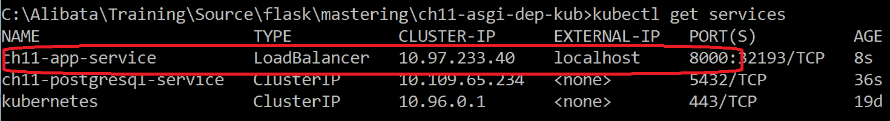

			<st c="67994">Figure 11.17 – Listing all Kubernetes Services with their details</st>
			<st c="68059">To learn all the details about the Services and Pods that have been deployed and the status of each pod, run</st> `<st c="68169">kubectl get all</st>`<st c="68184">. The result will be similar to what’s shown in</st> *<st c="68232">Figure 11</st>**<st c="68241">.18</st>*<st c="68244">:</st>
			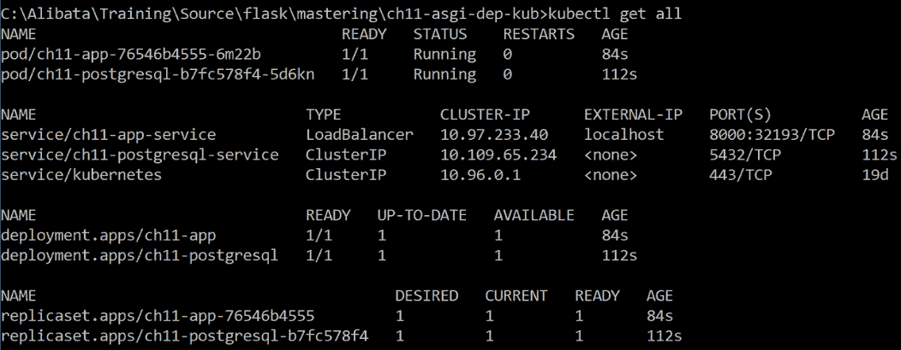

			<st c="68901">Figure 11.18 – Listing all the Kubernetes cluster details</st>
			<st c="68958">All the</st> <st c="68967">Pods and the containerized</st> <st c="68994">applications can be viewed on Docker Desktop, as shown in</st> *<st c="69052">Figure 11</st>**<st c="69061">.19</st>*<st c="69064">:</st>
			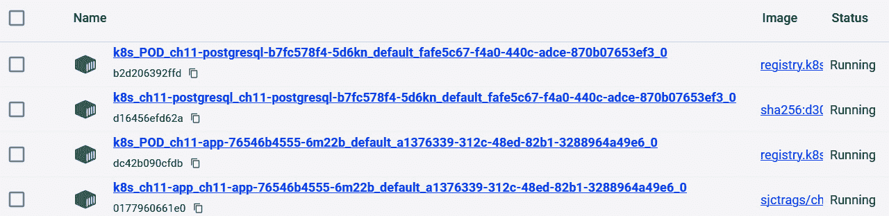

			<st c="69586">Figure 11.19 – Docker Desktop view of all Pods and applications</st>
			<st c="69649">Before accessing the</st> `<st c="69671">ch11-asgi</st>` <st c="69680">container, populate the empty PostgreSQL database with the</st> `<st c="69740">.sql</st>` <st c="69744">dump file from the local database.</st> <st c="69780">Use the</st> `<st c="69788">Pod</st>` <st c="69791">name (for example,</st> `<st c="69811">ch11-postgresql-b7fc578f4-6g4nc</st>`<st c="69842">) of the deployed PostgreSQL container and copy the</st> `<st c="69895">.sql</st>` <st c="69899">file to the</st> `<st c="69912">/temp</st>` <st c="69917">directory of the container (for example,</st> `<st c="69959">ch11-postgresql-b7fc578f4-6g4nc:/temp/ogs.sql</st>`<st c="70004">) using the</st> `<st c="70017">kubectl cp</st>` <st c="70027">command and the pod.</st> <st c="70049">Be sure to run the command in the location of the</st> `<st c="70099">.</st>``<st c="70100">sql</st>` <st c="70104">file:</st>

```

kubectl cp ogs.sql ch11-postgresql-b7fc578f4-6g4nc:/tmp/ogs.sql

```py

			<st c="70174">Run the</st> `<st c="70183">.sql</st>` <st c="70187">file in the</st> `<st c="70200">/temp</st>` <st c="70205">folder of the container using the</st> `<st c="70240">kubectl exec</st>` <st c="70252">command and</st> <st c="70265">the pod:</st>

```

kubectl exec -it ch11-postgresql-b7fc578f4-6g4nc -- psql -U postgres -d ogs -f /tmp/ogs.sql

```py

			<st c="70365">Also, replace the</st> `<st c="70384">user</st>`<st c="70388">,</st> `<st c="70390">password</st>`<st c="70398">,</st> `<st c="70400">port</st>`<st c="70404">, and</st> `<st c="70410">host</st>` <st c="70414">parameters of</st> <st c="70429">Peewee’s</st> `<st c="70438">Pooled</st>` **<st c="70444">PostgresqlDatabase</st>** <st c="70463">with the environment variables declared in the</st> `<st c="70511">kub-app-deployment.yaml</st>` <st c="70534">file.</st> <st c="70541">The following snippet shows the changes in the driver</st> <st c="70595">class configuration found</st> <st c="70621">in the</st> `<st c="70628">app/models/config</st>` <st c="70645">module:</st>

```

from peewee_async import PooledPostgresqlDatabase

导入 os

数据库 = PooledPostgresqlDatabase(

        'ogs', <st c="70758">用户=os.environ.get('POSTGRES_DB_USER'),</st><st c="70798">密码=os.environ.get('POSTGRES_DB_PSW'),</st><st c="70842">主机=os.environ.get(</st> <st c="70863">'SERVICE_POSTGRES_SERVICE_HOST'),</st><st c="70897">端口='5432',</st> 最大连接数 = 3,

        连接超时 = 3

    )

```py

			<st c="70953">After migrating the tables and the data, the client application can now access the API endpoints of our</st> *<st c="71058">Online Grocery</st>* <st c="71072">application (</st>`<st c="71086">ch11-asgi</st>`<st c="71096">).</st>
			<st c="71099">A Kubernetes pod undergoes</st> `<st c="71434">CrashLoopBackOff</st>` <st c="71450">and stay in</st> **<st c="71463">Awaiting</st>** <st c="71471">mode.</st> <st c="71478">To avoid Pods crashing, always carefully review the definitions files before applying them and monitor the logs of running Pods from time</st> <st c="71616">to time.</st>
			<st c="71624">Sometimes, a Docker or Kubernetes deployment requires adding a reverse proxy server to manage all the incoming requests of the deployed applications.</st> <st c="71775">In the next section, we’ll add the</st> *<st c="71810">NGINX</st>* <st c="71815">gateway server to our containerized</st> `<st c="71852">ch11-asgi</st>` <st c="71861">application.</st>
			<st c="71874">Creating an API gateway using NGINX</st>
			<st c="71910">Our deployment needs</st> `<st c="72284">ch11-asgi</st>` <st c="72293">app and PostgreSQL database platform.</st> <st c="72332">It will serve as the facade of the Gunicorn server running</st> <st c="72391">our application.</st>
			<st c="72407">Here,</st> `<st c="72414">ch11-asgi-dep-nginx</st>` <st c="72433">is a Docker Compose folder consisting of the</st> `<st c="72479">ch11-asgi</st>` <st c="72488">project directory, which contains a Dockerfile, the</st> `<st c="72541">docker-compose.yaml</st>` <st c="72560">file, and the</st> `<st c="72575">nginx</st>` <st c="72580">folder containing a Dockerfile and our NGINX configuration settings.</st> <st c="72650">The following is the</st> `<st c="72671">nginx.conf</st>` <st c="72681">file that’s used by Compose to set up our</st> <st c="72724">NGINX server:</st>

```

server { <st c="72747">监听 80</st>; <st c="72759">服务器名称 localhost</st>; <st c="72783">位置 /</st> { <st c="72796">代理传递</st> http://ch11-asgi-dep-nginx-api-1:8000/;

        代理设置头 <st c="72864">X-Forwarded-For</st> $proxy_add_x_forwarded_for;

        代理设置头 <st c="72925">X-Forwarded-Proto</st> $scheme;

        代理设置头 <st c="72969">X-Forwarded-Host</st> $host;

        代理设置头 <st c="73010">X-Forwarded-Prefix</st> /;

    }

}

```py

			<st c="73035">The NGINX configuration depends on its installation setup, the applications that have been deployed to the servers, and the server architecture.</st> <st c="73181">Ours is for a reverse proxy NGINX</st> <st c="73215">server of our application deployed on a single server.</st> <st c="73270">NGINX</st> <st c="73276">will allow access to our application through</st> `<st c="73321">localhost</st>` <st c="73330">and port</st> `<st c="73340">80</st>` <st c="73342">instead of</st> `<st c="73354">http://ch11-asgi-dep-nginx-api-1:8000</st>`<st c="73391">, as indicated in</st> `<st c="73409">proxy_pass</st>`<st c="73419">. Since we don’t have a new domain name,</st> `<st c="73460">localhost</st>` <st c="73469">will be the proxy’s hostname.</st> <st c="73500">The de facto request headers, such as</st> `<st c="73538">X-Forwarded-Host</st>`<st c="73554">,</st> `<st c="73556">X-Forwarded-Proto</st>`<st c="73573">,</st> `<st c="73575">X-Forwarded-Host</st>`<st c="73591">, and</st> `<st c="73597">X-Forwarded-Prefix</st>`<st c="73615">, will collectively help the load balancing mechanism during NGINX’s interference on</st> <st c="73700">a request.</st>
			<st c="73710">When the</st> `<st c="73720">docker-compose</st>` <st c="73734">command runs the YAML file, NGINX’s Dockerfile will pull the latest</st> `<st c="73803">nginx</st>` <st c="73808">image and copy the given</st> `<st c="73834">nginx.conf</st>` <st c="73844">settings to the</st> `<st c="73861">/etc/nginx/conf.d/</st>` <st c="73879">directory of its container.</st> <st c="73908">Then, it will instruct the container to run the NGINX server using the</st> `<st c="73979">nginx -g daemon</st>` `<st c="73995">off</st>` <st c="73998">command.</st>
			<st c="74007">Adding NGINX makes the deployed application manageable, scalable, and maintainable.</st> <st c="74092">It can also centralize user request traffic in a microservice architecture, ensuring that the access reaches the expected API endpoints, containers,</st> <st c="74241">or sub-modules.</st>
			<st c="74256">Summary</st>
			<st c="74264">There are several solutions and approaches to migrating a Flask application from the development to the production stage.</st> <st c="74387">The most common server that’s used to run Flask’s WSGI applications in production is Gunicorn.</st> <st c="74482">uWSGI, on the other hand, can run WSGI applications in more complex and refined settings.</st> <st c="74572">Flask[async] applications can run on Uvicorn workers with a</st> <st c="74632">Gunicorn server.</st>
			<st c="74648">For external server-based deployment, the Apache HTTP Server with Python provides a stable and reliable container for running Flask applications with the support of Python’s</st> `<st c="74823">mod_wsgi</st>` <st c="74831">module.</st>
			<st c="74839">Flask applications can also run on containers through Docker and Docker Compose to avoid the nitty gritty configuration and installations in the Apache HTTP Server.</st> <st c="75005">In Dockerization, what matters is the Dockerfile for a single deployment or the</st> `<st c="75085">docker-compose.yaml</st>` <st c="75104">file for multiple deployments and the combinations of Docker instructions that will contain these configuration files.</st> <st c="75224">For a more distributed, flexible, and complex orchestration, Kubernetes’s Pods and Services can aid a better deployment scheme for</st> <st c="75355">multiple deployments.</st>
			<st c="75376">To manage incoming requests across the servers, the Gunicorn servers running in containers can work with NGINX for reverse proxy, load balancing, and additional HTTP security protocols.</st> <st c="75563">A good NGINX setting can provide a better facade for the entire</st> <st c="75627">production setup.</st>
			<st c="75644">Generally, the deployment procedures that were created, applied, and utilized in this chapter are translatable, workable, and reversible to other more modern and advanced approaches, such as deploying Flask applications to Google Cloud and AWS cloud services.</st> <st c="75905">Apart from deployment, Flask has the edge to compete with other frameworks when dealing with innovation and building</st> <st c="76022">enterprise-grade solutions.</st>
			<st c="76049">In the next chapter, we will showcase the use of the Flask platform in providing middleware solutions to many</st> <st c="76160">popular integrations.</st>

```

```py

```

```py

```

```py

```
